# ACP (Agent Client Protocol) 架构文档

> 返回 [文档索引](../README.md)

> Hope Agent 原生 ACP 实现 — 零桥接、高性能的 IDE 直连方案

## 目录

- [概述](#概述)
- [整体架构](#整体架构)
- [协议层设计](#协议层设计)
- [模块拆分](#模块拆分)
- [会话生命周期](#会话生命周期)
- [Prompt 执行流程](#prompt-执行流程)
- [事件映射机制](#事件映射机制)
- [Failover 降级策略](#failover-降级策略)
- [会话历史重放](#会话历史重放)
- [数据共享架构](#数据共享架构)
- [安全与限制](#安全与限制)
- [API 参考](#api-参考)
- [与 OpenClaw 的对比](#与-openclaw-的对比)

---

## 概述

ACP（Agent Client Protocol）是一个标准化的 IDE-Agent 通信协议，允许代码编辑器（如 Zed、VS Code）直接与 AI Agent 通信。Hope Agent 实现了原生的 Rust ACP 服务器，具有以下核心优势：

- **零桥接**：纯 Rust 实现，不经过 Node.js 中间层，直接驱动 `AssistantAgent`
- **会话互通**：共享 `SessionDB`（SQLite），IDE 创建的会话在桌面端可见，反之亦然
- **完整 Failover**：复用桌面端的模型链降级策略（RateLimit 重试 + 多模型降级）
- **~50 个内置工具**：IDE 端可使用 Hope Agent 全部工具能力（exec、read、write、browser 等；具体数字以代码为准，详见 [tool-system.md](tool-system.md)）

---

## 整体架构

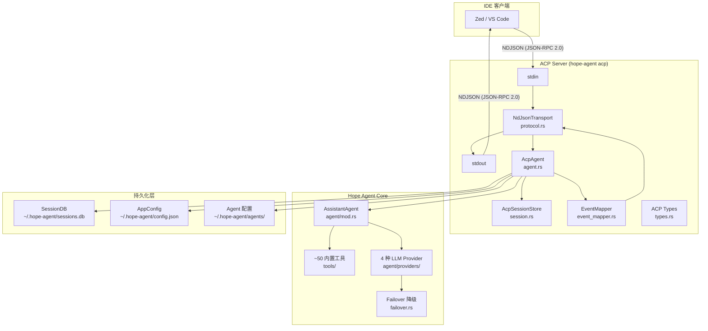

---

## 协议层设计

### 传输层：NDJSON over stdio

```
IDE (Client)                     ACP Server
    |                                |
    |--- JSON-RPC Request --------->|  (一行 JSON + \n)
    |                                |
    |<-- JSON-RPC Response ---------|  (一行 JSON + \n)
    |<-- JSON-RPC Notification -----|  (无 id, 流式推送)
    |<-- JSON-RPC Notification -----|
    |                                |
    |--- JSON-RPC Notification ---->|  (如 session/cancel)
    |                                |
```

**关键设计决策**：
- 选择 **stdio** 而非 TCP/WebSocket，因为 IDE 进程管理更简单（fork + pipe）
- 选择 **NDJSON**（每行一个 JSON）而非 HTTP，避免 Content-Length 头的解析复杂性
- JSON-RPC **2.0** 标准，与 LSP（Language Server Protocol）一脉相承

### JSON-RPC 消息格式

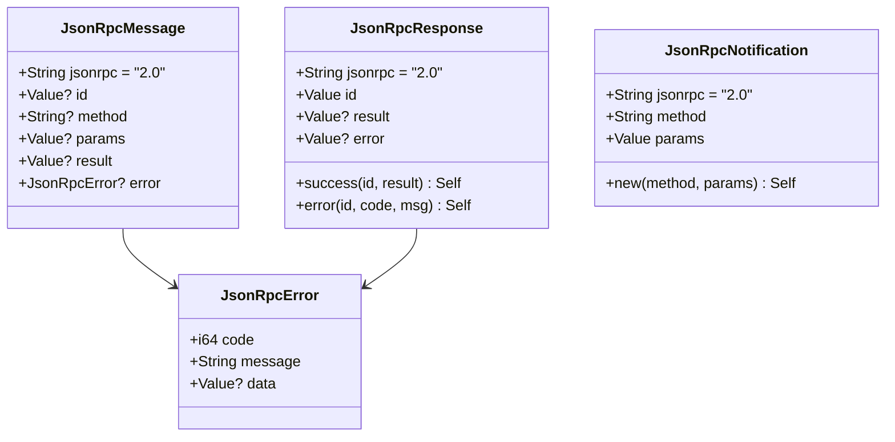

**错误码定义**：

| 错误码 | 常量 | 含义 |
|--------|------|------|
| -32700 | `ERROR_PARSE` | JSON 解析失败 |
| -32600 | `ERROR_INVALID_REQUEST` | 无效请求（如未初始化） |
| -32601 | `ERROR_METHOD_NOT_FOUND` | 方法不存在 |
| -32602 | `ERROR_INVALID_PARAMS` | 参数错误 |
| -32603 | `ERROR_INTERNAL` | 内部服务器错误 |

---

## 模块拆分

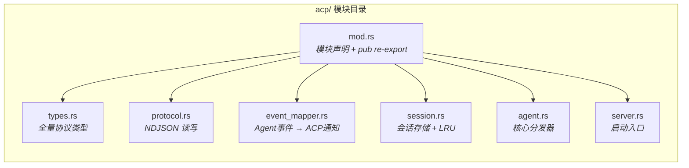

### 各模块职责

| 模块 | 职责 |
|------|------|
| `types.rs` | JSON-RPC 2.0 基础类型 + ACP 全量请求/响应/通知 DTO + 内容块解析 + 工具类型推断 |
| `protocol.rs` | NDJSON 传输层：BufReader 逐行读取 stdin、stdout 写回 + flush |
| `event_mapper.rs` | Agent 事件字符串 → ACP `session/update` 通知的映射层 |
| `session.rs` | 活跃会话的内存存储，HashMap + LRU 淘汰（默认 32 上限） |
| `agent.rs` | 核心 ACP Agent：方法分发、会话管理、prompt 执行、failover、历史重放 |
| `server.rs` | 启动入口包装函数 |
| `mod.rs` | 模块声明与公共 API 导出 |

---

## 会话生命周期

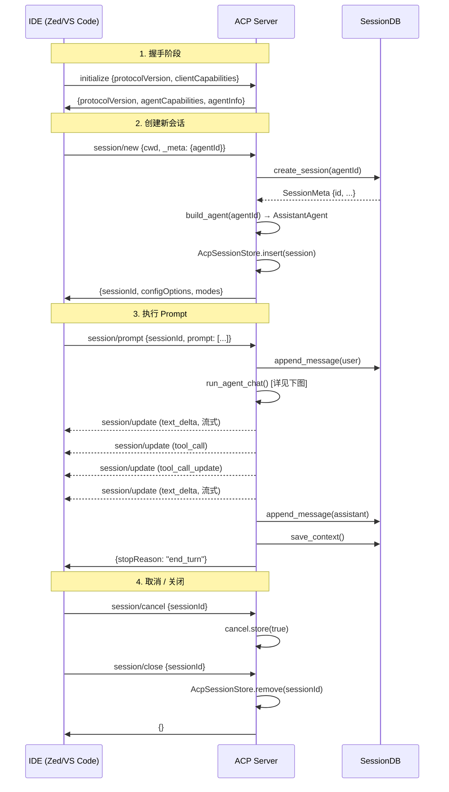

### 会话加载（loadSession）

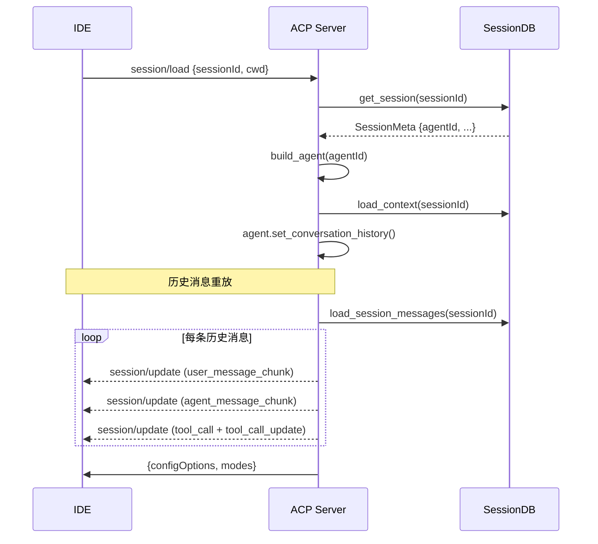

---

## Prompt 执行流程

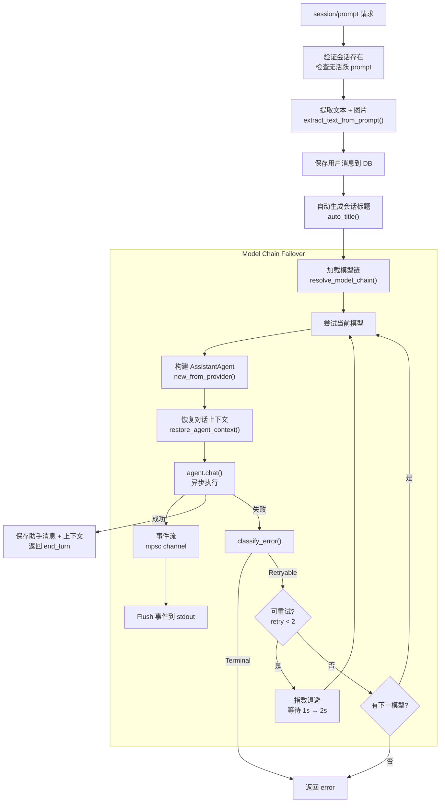

### 事件传递架构（异步到同步桥接）

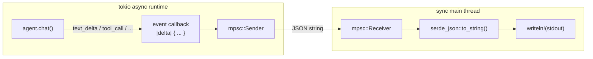

> **为什么用 `std::sync::mpsc` 而非 `tokio::sync::mpsc`？**
> 
> ACP 主循环是同步的（阻塞式 stdin 读取），而 `agent.chat()` 运行在 `block_on()` 内。
> 异步回调通过 `std::sync::mpsc::channel` 将事件发送到同步端，`block_on` 结束后一次性 flush 所有排队事件到 stdout。

---

## 事件映射机制

Agent 内部事件（JSON 字符串）到 ACP `session/update` 通知的映射：

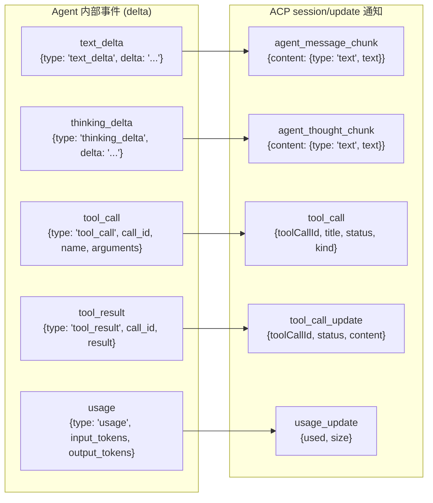

### 映射详情表

| Agent 事件 | ACP 通知类型 | 映射逻辑 |
|-----------|-------------|---------|
| `text_delta` | `agent_message_chunk` | `delta` → `content.text` |
| `thinking_delta` | `agent_thought_chunk` | `delta` → `content.text` |
| `tool_call` | `tool_call` | `name` → `title`, 状态为 `running`, `infer_tool_kind()` 推断分类 |
| `tool_result` | `tool_call_update` | 结果包装为 `content[]`，成功→`completed` / 失败→`failed` |
| `usage` | `usage_update` | `input_tokens` → `used`, `output_tokens` → `size` |

### 工具类型推断 (`infer_tool_kind`)

```
read, read_file     → "read"
write, edit         → "edit"
delete, remove      → "delete"
search, find        → "search"
exec, run, bash     → "execute"
fetch, http         → "fetch"
其他                → "other"
```

---

## Failover 降级策略

ACP 完整复用 Hope Agent 桌面端的 failover 模块 (`failover.rs`)：

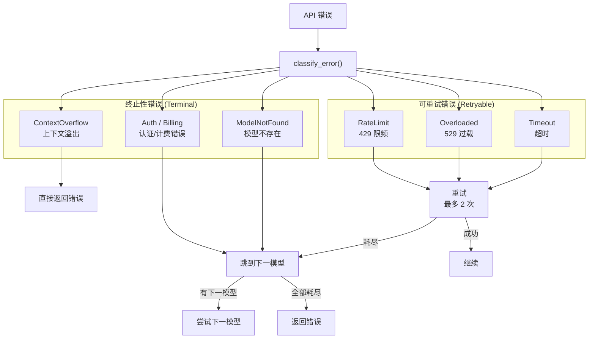

**退避参数**：

| 参数 | 值 |
|------|-----|
| 最大重试次数 | 2 |
| 退避基数 | 1000ms |
| 退避上限 | 10000ms |
| 退避算法 | 指数退避 + 随机 jitter |

---

## 会话历史重放

`loadSession` 时通过 `replay_session_history()` 将持久化的消息还原为 ACP 通知：

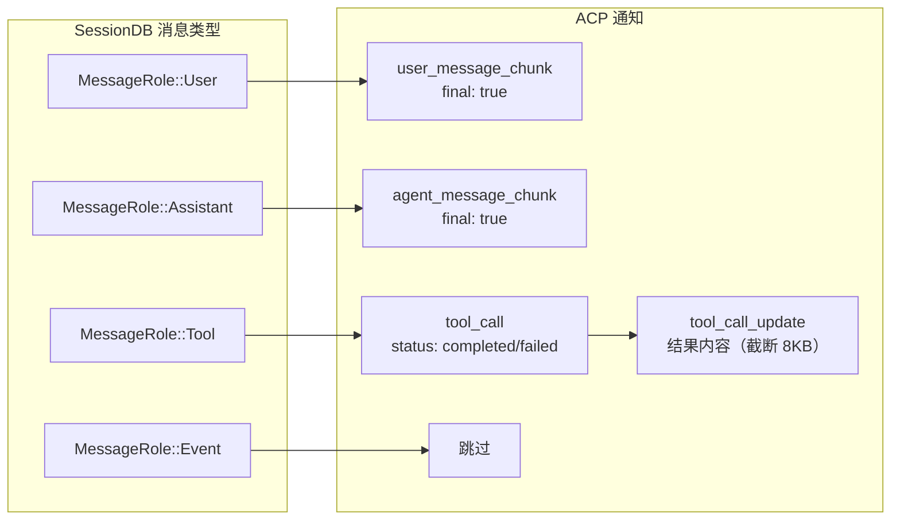

> **截断策略**：工具结果超过 8192 字节时，使用 `truncate_utf8()` 安全截断后追加 `...(truncated)` 标记。

---

## 数据共享架构

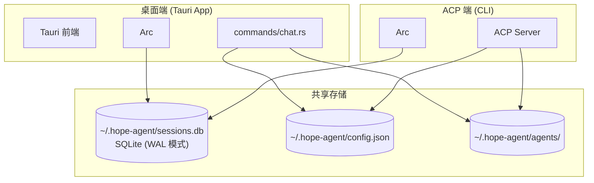

**WAL 模式**确保桌面端和 ACP 端可以同时读写 `sessions.db`，不会互相阻塞。

### 共享的数据资源

| 数据 | 路径 | 读/写方 |
|------|------|---------|
| 会话 & 消息 | `~/.hope-agent/sessions.db` | 桌面端 ↔ ACP |
| 对话上下文 | `sessions.context_json` 列 | 桌面端 ↔ ACP |
| Provider 配置 | `~/.hope-agent/config.json` | 桌面端写 → ACP 读 |
| Agent 定义 | `~/.hope-agent/agents/{id}/` | 桌面端写 → ACP 读 |
| 模型降级链 | `config.json` 的 `fallbackModels` | 桌面端写 → ACP 读 |

---

## 安全与限制

### 安全措施

- **Prompt 大小限制**：`MAX_PROMPT_BYTES = 2MB`，防止 DoS
- **会话上限**：`AcpSessionStore` 最多保持 32 个活跃会话，超出时 LRU 淘汰
- **工具结果截断**：重放时工具结果限制 8KB
- **取消机制**：`AtomicBool` 取消标志，在 SSE 解析和 Tool Loop 中均检查

### 当前限制

| 限制 | 说明 | 计划 |
|------|------|------|
| 同步主循环 | stdin 阻塞读取，prompt 执行期间无法处理新请求 | Phase 2: tokio 异步化 |
| 无 Client 回调 | 不支持 fs/readTextFile 等 Client 能力 | Phase 3: 双向 RPC |
| 无权限审批 | ACP 端工具执行不经审批 | Phase 3: ACP 审批协议 |
| 单 Agent 模式 | 虽然可切换，但不支持同一会话多 Agent 并发 | 按需评估 |

---

## API 参考

### 启动命令

```bash
# 基本启动
hope-agent acp

# 带详细日志
hope-agent acp --verbose

# 指定 Agent
hope-agent acp --agent-id coder

# 组合使用
hope-agent acp -v -a my-agent

# 查看版本
hope-agent acp --version

# 查看帮助
hope-agent acp --help
```

### 方法列表

| 方法 | 类型 | 方向 | 说明 |
|------|------|------|------|
| `initialize` | Request | Client→Server | 握手 + 能力协商 |
| `authenticate` | Request | Client→Server | 认证（当前直接通过） |
| `session/new` | Request | Client→Server | 创建新会话 |
| `session/load` | Request | Client→Server | 加载已有会话 + 历史重放 |
| `session/prompt` | Request | Client→Server | 执行 prompt（阻塞至完成） |
| `session/list` | Request | Client→Server | 列出所有会话（排除 cron/子 Agent） |
| `session/setMode` | Request | Client→Server | 切换 Agent 模式 |
| `session/setConfigOption` | Request | Client→Server | 设置配置（如 reasoning_effort） |
| `session/close` | Request | Client→Server | 关闭会话 |
| `session/cancel` | Notification | Client→Server | 取消进行中的 prompt |
| `session/update` | Notification | Server→Client | 流式事件推送（文本/思维/工具等） |

### session/update 子类型

| sessionUpdate | 说明 | 触发场景 |
|--------------|------|---------|
| `agent_message_chunk` | Agent 文本输出（流式） | LLM 生成文本 |
| `agent_thought_chunk` | Agent 思维过程（流式） | 推理模型思考 |
| `tool_call` | 工具调用开始 | Agent 调用工具 |
| `tool_call_update` | 工具执行结果 | 工具执行完毕 |
| `usage_update` | Token 用量更新 | API 返回 usage |
| `session_info_update` | 会话信息变更（标题） | 首条消息自动命名 |
| `user_message_chunk` | 用户消息（仅重放） | loadSession 历史 |

### 能力声明

```json
{
  "agentCapabilities": {
    "loadSession": true,
    "promptCapabilities": {
      "image": true,
      "audio": false,
      "embeddedContext": true
    },
    "sessionCapabilities": {
      "list": {}
    }
  }
}
```

---

## 与 OpenClaw 的对比

| 维度 | OpenClaw | Hope Agent |
|------|----------|-------------|
| 实现语言 | TypeScript (Node.js) | **Rust (原生)** |
| 架构 | Agent → Bridge → Node.js → SSE | **Agent → stdio 直连** |
| 启动延迟 | ~1-2s (Node.js 冷启动) | **~50ms (二进制直接运行)** |
| 内存占用 | ~80-150MB (V8 堆) | **~15-30MB (Rust 原生)** |
| 文件数量 | 68+ 文件 | **7 文件** |
| 会话互通 | 无（独立存储） | **✅ 共享 SessionDB** |
| Failover | 多模型降级 | **✅ 完整复用** |
| Tool 数量 | ~15 | **~50 内置工具**（具体以代码为准，详见 [tool-system.md](tool-system.md)） |
| 历史重放 | 支持 | **✅ 支持（含工具结果）** |
| Mode 切换 | 支持 | **✅ 支持（映射到 Agent）** |
| 审批机制 | 有 | 计划中 (Phase 3) |
| Client fs | 有 | 计划中 (Phase 3) |

### 独特优势

1. **桌面端 ↔ IDE 会话无缝切换**：在 macOS 桌面端创建的会话可在 Zed 中继续，反之亦然
2. **零部署成本**：同一个二进制，无需额外安装 Node.js 或配置 bridge
3. **工具能力更强**：~50 个内置工具 vs OpenClaw 的 ~15 个，包括 browser、canvas、image_generate 等独特工具
4. **Agent 系统集成**：ACP Modes 直接映射到 Hope Agent 的多 Agent 系统，每个 Agent 有独立的人设、技能和行为配置

---

## 文件索引

```
crates/ha-core/src/acp/
├── mod.rs              # 模块声明 + pub re-export
├── types.rs            # JSON-RPC 2.0 + ACP 全量类型定义
├── protocol.rs         # NDJSON stdio 传输层
├── event_mapper.rs     # Agent 事件 → ACP 通知映射
├── session.rs          # 会话内存存储 + LRU 淘汰
├── agent.rs            # ACP Agent 核心实现
└── server.rs           # 启动入口函数

src-tauri/src/main.rs        # acp 子命令入口 (run_acp_server)
crates/ha-core/src/lib.rs    # pub mod acp 注册
```
