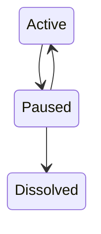
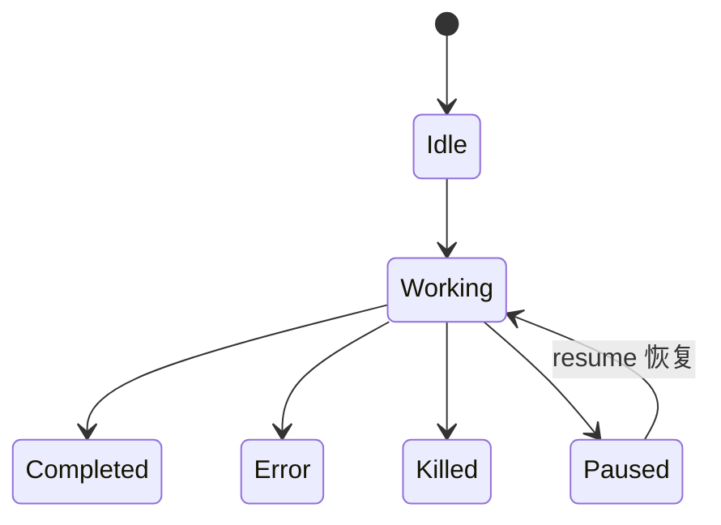
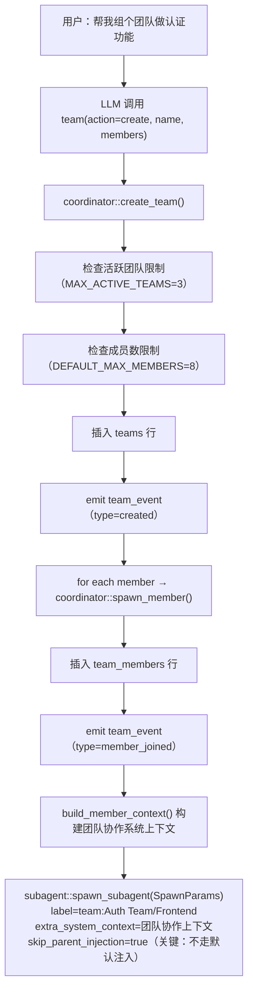
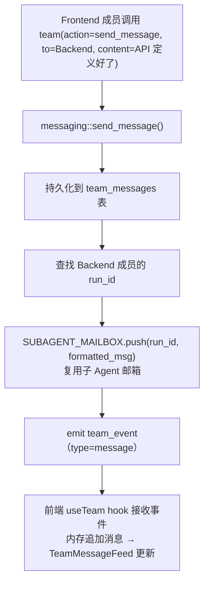
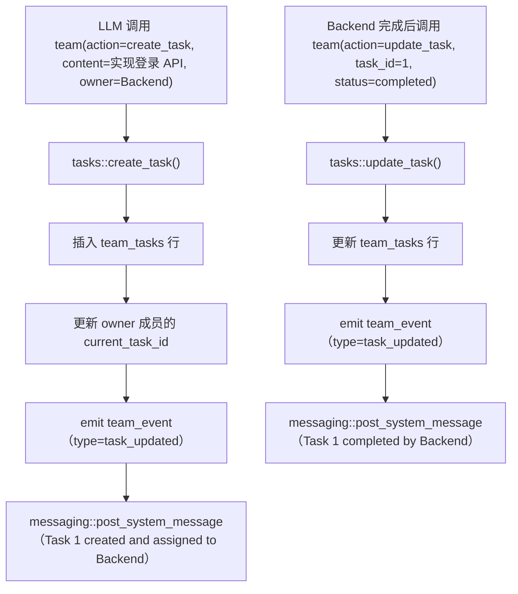
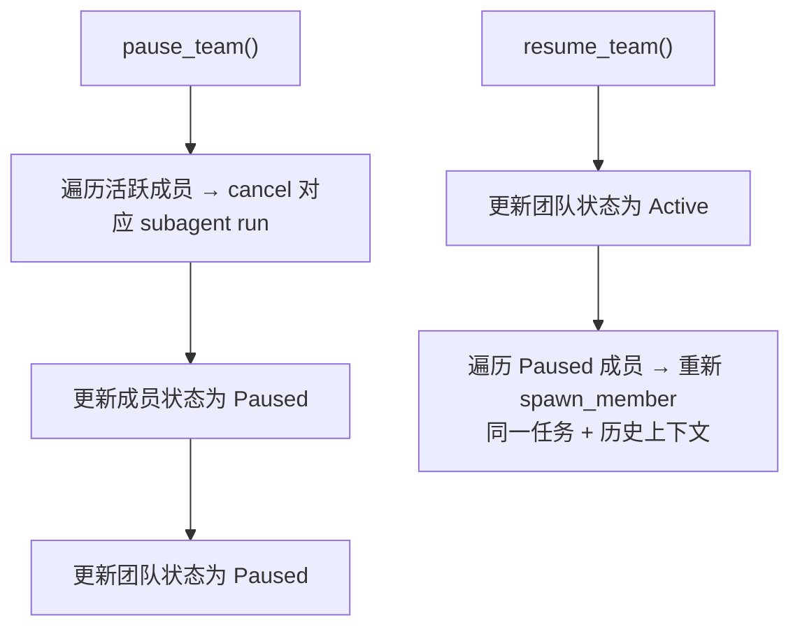
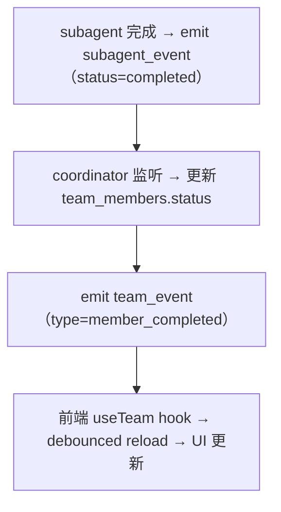
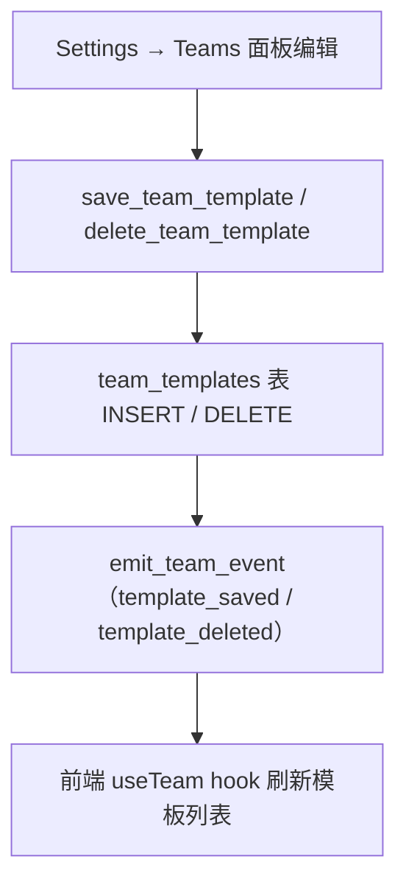

# Agent Team 多 Agent 协作系统
> 返回 [文档索引](../README.md) | 更新时间：2026-04-28

## 概述

Agent Team 是子 Agent 系统之上的协调层，支持多个 Agent 作为具名团队成员并行工作、双向通信、共享任务看板。与子 Agent 的"父→子任务分派"模式不同，Team 是"对等协作"——成员之间可以互相发消息、认领任务、汇报进度。

**核心理念**：Team 成员本质上就是 subagent run（复用已有的 spawn/cancel/mailbox 基础设施），但多了：命名身份、持久化状态、双向消息、Kanban 任务看板。

### 与子 Agent 系统的关系

| 维度 | 子 Agent | Agent Team |
|------|---------|-----------|
| 生命周期 | 一次性任务，完成即销毁 | 持久存在，可反复接活 |
| 身份 | 临时 UUID（run_id） | 固定名字 + 颜色标识 |
| 通信 | 单向：子→父返回结果 | 双向：成员之间 SendMessage |
| 协作模式 | 父 Agent 拆任务 → 分发 → 收结果 | 共享任务看板，成员自行领活 |
| 编排 | 父 Agent 串行/批量编排 | Coordinator 统一管理，成员并行 |
| 结果处理 | 自动注入父会话（injection） | Coordinator 路由（`skip_parent_injection: true`） |
| 数据存储 | `subagent_runs` 单表 | 5 张独立表（teams/members/messages/tasks/templates） |

## 模块结构

```
crates/ha-core/src/team/
├── mod.rs            # 常量（DEFAULT_MAX_MEMBERS=8, MAX_ACTIVE_TEAMS=3）、颜色分配
├── types.rs          # Team/TeamMember/TeamMessage/TeamTask/TeamTemplate 等类型
├── db.rs             # SessionDB impl：5 张表的 CRUD 操作
├── coordinator.rs    # 核心编排：create_team/add_member/dissolve/pause/resume
├── messaging.rs      # 消息发送 + SUBAGENT_MAILBOX 投递
├── tasks.rs          # 任务看板 CRUD + 依赖解析 + 系统消息
├── templates.rs      # 用户模板 CRUD（无内置模板，全部由 Settings → Teams 配置）
├── events.rs         # EventBus 事件发射 helper
└── cleanup.rs        # 启动孤儿清理
```

### 工具与命令层

| 文件 | 职责 |
|------|------|
| `tools/team.rs` | `team` 工具处理器，13 个 action 的参数解析与调度 |
| `slash_commands/handlers/team.rs` | `/team` 斜杠命令 → PassThrough 到 LLM |
| `src-tauri/src/commands/team.rs` | 14 个 Tauri IPC 命令 |
| `crates/ha-server/src/routes/team.rs` | 13 个 HTTP REST 端点 |

### 前端组件

| 文件 | 职责 |
|------|------|
| `teamTypes.ts` | TypeScript 类型定义 |
| `useTeam.ts` | `useTeam` + `useActiveTeam` hooks（带 300ms 防抖） |
| `TeamPanel.tsx` | 右侧主面板（Dashboard/Tasks/Messages 三 Tab） |
| `TeamDashboard.tsx` | 成员网格 + 进度条 + 统计 |
| `TeamMemberCard.tsx` | 单成员状态卡片（颜色标识、状态徽章、token 计数） |
| `TeamTaskBoard.tsx` | Kanban 四列看板（Todo/Doing/Review/Done） |
| `TeamTaskCard.tsx` | 任务卡片 |
| `TeamMessageFeed.tsx` | 实时消息流 + 输入框 |
| `TeamMessageBubble.tsx` | 消息气泡（系统消息居中、用户消息带颜色） |
| `TeamCreateDialog.tsx` | 创建团队对话框（模板/自定义两种模式） |
| `TeamTemplateCard.tsx` | 模板预览卡 |
| `TeamToolbar.tsx` | 操作栏（暂停/恢复/解散） |
| `TeamMiniIndicator.tsx` | 聊天标题栏迷你指示器（自行获取数据） |

## 数据模型

### TeamStatus（三态）



### MemberStatus（六态）



活跃判定：`Idle | Working` → `is_active() = true`
终态判定：`Completed | Error | Killed` → `is_terminal() = true`

### SQLite Schema

**teams 表**

| 字段 | 类型 | 说明 |
|------|------|------|
| `team_id` | TEXT PK | UUID v4 |
| `name` | TEXT | 团队名称 |
| `description` | TEXT | 可选描述 |
| `lead_session_id` | TEXT | 创建团队的父会话 ID |
| `lead_agent_id` | TEXT | 创建团队的 Agent ID |
| `status` | TEXT | active / paused / dissolved |
| `created_at` | TEXT | RFC 3339 |
| `updated_at` | TEXT | RFC 3339 |
| `template_id` | TEXT | 创建时使用的模板 ID |
| `config_json` | TEXT | `TeamConfig` JSON（max_members, auto_dissolve, shared_context） |

**team_members 表**

| 字段 | 类型 | 说明 |
|------|------|------|
| `member_id` | TEXT PK | UUID v4 |
| `team_id` | TEXT FK | 所属团队 |
| `name` | TEXT | 成员名称（如 "Frontend"、"Tester"） |
| `agent_id` | TEXT | 使用的 Agent ID |
| `role` | TEXT | lead / worker / reviewer |
| `status` | TEXT | idle / working / paused / completed / error / killed |
| `run_id` | TEXT | 关联的 `subagent_runs.run_id` |
| `session_id` | TEXT | 成员的隔离会话 ID |
| `color` | TEXT | 颜色标识（hex，如 `#3B82F6`） |
| `current_task_id` | INTEGER | 当前执行的任务 ID |
| `model_override` | TEXT | 模型覆盖 |
| `input_tokens` | INTEGER | 累计输入 token |
| `output_tokens` | INTEGER | 累计输出 token |

**team_messages 表**

| 字段 | 类型 | 说明 |
|------|------|------|
| `message_id` | TEXT PK | UUID v4 |
| `team_id` | TEXT FK | 所属团队 |
| `from_member_id` | TEXT | 发送者 member_id（`*system*` = 系统消息，`*user*` = 用户） |
| `to_member_id` | TEXT | 接收者（NULL = 广播） |
| `content` | TEXT | 消息内容 |
| `message_type` | TEXT | chat / task_update / handoff / system |
| `timestamp` | TEXT | RFC 3339 |

**team_tasks 表**

| 字段 | 类型 | 说明 |
|------|------|------|
| `id` | INTEGER PK | 自增 |
| `team_id` | TEXT FK | 所属团队 |
| `content` | TEXT | 任务描述 |
| `status` | TEXT | pending / in_progress / review / completed / blocked |
| `owner_member_id` | TEXT | 负责人 member_id |
| `priority` | INTEGER | 优先级（数字越小越高，默认 100） |
| `blocked_by` | TEXT | JSON 数组，阻塞此任务的其他任务 ID |
| `blocks` | TEXT | JSON 数组，被此任务阻塞的其他任务 ID |
| `column_name` | TEXT | Kanban 列：backlog / todo / doing / review / done |

**team_templates 表**

| 字段 | 类型 | 说明 |
|------|------|------|
| `template_id` | TEXT PK | 标识符（UUID 或用户自定义） |
| `name` | TEXT | 模板名称 |
| `description` | TEXT | 模板描述 |
| `members_json` | TEXT | `TeamTemplateMember[]` JSON |
| `builtin` | INTEGER | 历史字段保留兼容旧 schema；当前所有模板均为用户自定义（值为 0），不再发行内置模板 |

## 核心流程

### 1. 创建团队



### 2. 成员间通信



### 3. 任务看板



### 4. 暂停/恢复



### 5. 成员完成 → 团队级感知

成员设置了 `skip_parent_injection: true`，因此完成后不走默认的 injection 路径。团队级的感知通过 EventBus 实现：



## 成员系统上下文

每个团队成员的 subagent 通过 `SpawnParams.extra_system_context` 注入团队协作上下文：

```
## Team Collaboration Context
你是团队 "Auth Team" 的成员。
- 你的名字: Frontend
- 你的角色: Worker

### Teammates
- Backend (Worker): 实现登录 API
- Tester (Reviewer): 编写集成测试

### Communication
- 发消息给队友: team(action="send_message", team_id="xxx", to="Backend", content="...")
- 广播: team(action="send_message", team_id="xxx", to="*", content="...")
- 更新任务: team(action="update_task", team_id="xxx", task_id=1, status="completed")

### Your Assignment
构建登录页面的 React 组件
```

## 工具 API

`team` 工具使用 action-based dispatch，共 13 个 action：

| Action | 参数 | 说明 |
|--------|------|------|
| `create` | name, members/template | 创建团队（成员列表或模板名） |
| `dissolve` | team_id | 解散团队，kill 所有成员 |
| `add_member` | team_id, name, task | 向活跃团队添加成员 |
| `remove_member` | team_id, member_id | 移除并 kill 成员 |
| `send_message` | team_id, to, content | 发消息给成员或广播（to="*"） |
| `create_task` | team_id, content, owner? | 创建任务 |
| `update_task` | team_id, task_id, status/owner/column | 更新任务 |
| `list_tasks` | team_id, status? | 列出任务（可按状态过滤） |
| `list_members` | team_id | 列出成员 |
| `status` | team_id | 团队全量状态摘要 |
| `pause` | team_id | 暂停所有成员 |
| `resume` | team_id | 恢复暂停成员 |
| `list_templates` | — | 列出已保存的用户预设模板（来自 `team_templates` 表） |

工具注册为 `deferred`（通过 `tool_search` 发现），不在默认工具列表中。

## 用户自定义预设

历史上随应用发行 4 个内置模板（Full-Stack Feature / Code Review / Research & Implement / Large Refactor），现已**全部移除**——固定模板很难匹配每个团队的实际工作流，硬编码反而成为干扰。

当前仓库不再注入任何内置模板。`templates::all_templates()` 直接读取 `team_templates` 表，没有就返回空——LLM 调用 `team(action="list_templates")` 拿到的也是同一份用户配置。

### 配置入口

**Settings → Teams** 面板（GUI）：

- 添加 / 编辑 / 删除模板，定义成员名 + Agent + 角色 + 默认任务描述
- 模板保存后即可在 `team(action="create", template="<name>")` 引用，或通过 `TeamCreateDialog` 的"使用模板"路径一键铺开成员
- 模板与 Agent 的依赖松耦合：删除某个 Agent 后引用它的模板会在创建时报错（成员级 fallback 后续可补）

### 工具/命令访问

| 入口 | 用法 |
|------|------|
| `team(action="list_templates")` | LLM 工具：列出用户已保存的预设 |
| `list_team_templates` (Tauri) / `GET /api/team-templates` | 前端读取模板列表 |
| `save_team_template` (Tauri) / `POST /api/team-templates` | 保存或更新模板 |
| `delete_team_template` (Tauri) / `DELETE /api/team-templates/:id` | 删除模板 |

### 数据流



> 既往 release notes 的"4 个内置模板"为已废弃描述，本节为单一真相源。

## Agent 配置

`AgentConfig.team` 字段（`TeamAgentConfig`）：

| 字段 | 类型 | 默认 | 说明 |
|------|------|------|------|
| `enabled` | bool | true | 是否允许此 Agent 创建团队 |
| `maxActiveTeams` | u32 | 3 | 最大同时活跃团队数 |
| `maxMembersPerTeam` | u32 | 8 | 每团队最大成员数 |
| `memberModel` | Option | None | 团队成员默认模型 |

## EventBus 事件

统一事件名 `"team_event"`，`type` 字段区分事件类型：

| type | payload | 触发时机 |
|------|---------|---------|
| `created` | Team 全量 | 团队创建 |
| `member_joined` | TeamMember | 成员加入 |
| `member_status` | {teamId, memberId, status} | 成员状态变化 |
| `member_completed` | {teamId, memberId, result, durationMs} | 成员完成 |
| `message` | TeamMessage | 成员间消息 |
| `task_updated` | TeamTask | 任务变更 |
| `paused` / `resumed` | {teamId} | 团队暂停/恢复 |
| `dissolved` | {teamId} | 团队解散 |

前端通过 `useTeam` hook 订阅 `team_event`，采用以下策略减少开销：
- 成员重载：300ms 防抖
- 任务更新：事件 payload 包含完整任务，直接内存更新
- 消息追加：内存追加并限界 200 条

## 前端交互

### TeamPanel（右侧面板）

```
┌──────────────────────────────────────────────┐
│ Team: "Auth Team"       [Pause] [Dissolve]   │
├──────────────────────────────────────────────┤
│ [概览]  [任务看板]  [消息]                      │
├──────────────────────────────────────────────┤
│ 概览: 成员卡片网格 + 进度条 + token 统计         │
│ 任务看板: 四列 Kanban (Todo/Doing/Review/Done) │
│ 消息: 实时消息流 + 输入框                        │
└──────────────────────────────────────────────┘
```

### ChatScreen 集成

- `useActiveTeam(sessionId)` 发现当前会话的活跃团队
- 团队创建时自动展开 TeamPanel
- 团队面板关闭时显示 `TeamMiniIndicator` 指示器（自行获取数据）

## API 端点

### Tauri 命令

| 命令 | 说明 |
|------|------|
| `list_teams` | 列出团队（按 session 过滤或全部活跃） |
| `get_team` | 获取团队详情 |
| `get_team_members` | 获取成员列表 |
| `get_team_messages` | 获取最新消息（默认 50 条），返回 `[messages, hasMore]` |
| `get_team_messages_before` | 按复合游标加载更早的消息（无限滚动），返回 `[messages, hasMore]` |
| `get_team_tasks` | 获取任务列表 |
| `send_user_team_message` | 用户手动发消息给团队 |
| `list_team_templates` | 列出用户保存的模板 |
| `save_team_template` | 保存或更新用户模板 |
| `delete_team_template` | 删除用户模板 |
| `create_team` | 创建团队（成员列表或模板） |
| `pause_team` | 暂停团队 |
| `resume_team` | 恢复团队 |
| `dissolve_team` | 解散团队 |

### HTTP 路由

| 方法 | 路径 | 说明 |
|------|------|------|
| GET | `/api/teams` | 列出团队 |
| POST | `/api/teams` | 创建团队 |
| GET | `/api/teams/:id` | 获取团队 |
| GET | `/api/teams/:id/members` | 获取成员 |
| GET | `/api/teams/:id/messages` | 获取最新消息 |
| GET | `/api/teams/:id/messages/before` | 按游标加载更早的消息 |
| POST | `/api/teams/:id/messages` | 发送消息 |
| GET | `/api/teams/:id/tasks` | 获取任务 |
| POST | `/api/teams/:id/pause` | 暂停 |
| POST | `/api/teams/:id/resume` | 恢复 |
| POST | `/api/teams/:id/dissolve` | 解散 |
| GET | `/api/team-templates` | 列出用户模板 |
| POST | `/api/team-templates` | 保存或更新模板 |
| DELETE | `/api/team-templates/:id` | 删除模板 |

## 边界情况

| 场景 | 处理 |
|------|------|
| 成员崩溃 | subagent error → coordinator 标记 Error → 系统消息通知团队 → 用户可在 UI 重新添加 |
| App 重启 | `cleanup_orphan_teams()` 将 working 成员标记 Error，团队保持 Active 等用户决定 |
| 用户暂停成员 | kill subagent → 标记 Paused → 保留任务分配 |
| 用户恢复成员 | 重新 spawn subagent（同一任务 + 成员 session 历史上下文） |
| 用户手动发消息 | TeamMessageFeed 输入框 → `send_user_team_message` → 投递到成员 mailbox |
| 并发限制 | 团队成员经 `spawn_subagent`（`parent_agent_id = lead_agent_id`）计入 lead Agent 的并发配额，上限按其 `subagents.maxConcurrent` 配置（默认 8，clamp 1–50，经 `max_concurrent_for_agent` 解析），超限拒绝 |
| 跨会话事件 | `useActiveTeam` 按 `leadSessionId` 过滤，解散事件按 `teamId` 匹配 |

## 与子 Agent 系统的集成点

1. **spawn**：`coordinator::spawn_member()` 调用 `subagent::spawn_subagent()`，通过 `label: "team:{name}/{member}"` 和 `skip_parent_injection: true` 区分团队成员
2. **cancel**：复用 `SubagentCancelRegistry`，每个成员的 `run_id` 注册其中
3. **mailbox**：消息投递通过 `SUBAGENT_MAILBOX.push(run_id, msg)`，成员的 tool loop 会 drain 收到的消息
4. **cleanup**：`cleanup_orphan_teams()` 在启动时调用，检查成员关联的 subagent run 状态并同步
