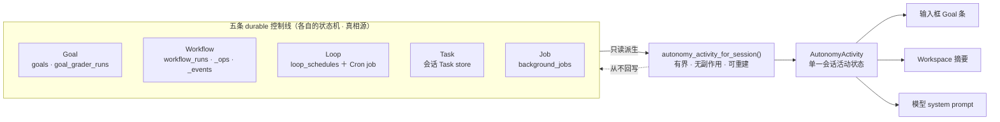
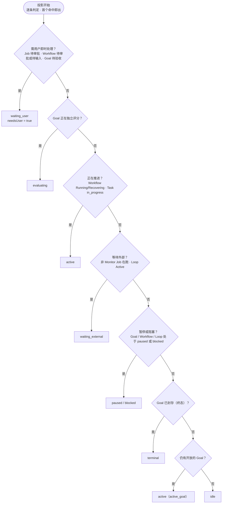

# Agent Control 统一控制面

> 返回 [文档索引](../../README.md)

## 核心思想

一个会话在任意时刻可能同时挂着多条控制线：一个待达成的 Goal、几个正在跑的 Workflow run、一个定时续跑的 Loop、若干后台工具 Job、一串用户可见的 Task。每条线各有独立的 durable 状态机，各自可靠地推进、恢复、审批、计费。

但用户和模型只需要一个答案：**这个会话现在到底在干什么，该不该我出手。** 如果让输入框、Workspace、系统 prompt 各自去拼这五条线，就会得到三套互相打架的解释——输入框说"空闲"，Workspace 说"运行中"，模型以为"在等我批准"。

统一控制面解决的正是这个"多真相源、单一表述"的问题。它的关键取舍是：**不引入第六套生命周期**。Goal / Workflow / Loop / Task / Job 仍然各管各的 durable 状态机；统一层只做三件事：

1. **只读投影**：把五条线派生成一个有界、可随时重建的会话活动状态 `AutonomyActivity`。
2. **共享 Prompt 契约**：给模型一套按角色拆分的自治 prompt，把 milestone、子结果、tick 这类内部信号与"用户授权"严格区分。
3. **横切保证**：预算、无痕、权限、恢复、非劣化在三条线之上统一约束。

投影层只读、无副作用、不回写任何 durable state——它坏了，五条线照常独立工作。这是硬边界：统一投影绝不能成为控制面的单点故障。

详细实现分别见 [Goal](goal.md)、[Workflow](workflow.md)、[Loop](loop.md)、[后台任务](background-jobs.md) 与 [权限系统](permission-system.md)。

**关联源码**：`crates/ha-core/src/activity.rs`（投影本体）· `crates/ha-server/src/routes/goal.rs` 与 `src-tauri/src/commands/goal.rs`（API 两套适配）· `src/components/chat/workspace/useGoal.ts`（前端拉取与事件订阅）。

## 1. 五条控制线的语义分层

每条控制线回答一个不同的问题，落在不同的 durable 表上，互不越界：

| 控制线 | 回答的问题 | Durable 真相源 |
| --- | --- | --- |
| **Goal** | 最终要达成什么，当前 revision 的完成标准与证据是什么 | `goals`、`goal_criterion_specs`、`goal_links`、`goal_grader_runs` |
| **Workflow** | 这一次如何动态执行、并行、恢复、审批与汇总 | `workflow_runs`、`workflow_ops`、`workflow_events`、`workflow_run_controls` |
| **Loop** | 何时再次触发，等待哪个事件，heartbeat 何时兜底 | `loop_schedules`、`loop_runs`、`loop_watches` + 一个受控 Cron job |
| **Task** | 当前用户可见的步骤和进度 | 会话 Task store |
| **Job** | 后台工具、子 Agent、Group、Monitor 的执行 | `background_jobs` |

边界是硬契约：Goal 不执行脚本，Workflow 不拥有长期调度，Loop 不定义完成标准。`/mode` 只控制执行强度，不能被 Loop 或 Workflow 吸收。



## 2. 只读投影 AutonomyActivity

投影入口是 `SessionDB::autonomy_activity_for_session(session_id)`。它把五条线读进内存，按一套固定优先级折成一个结构体后返回，全程不落库、不改任何 owner 状态，可随时重建：

```text
AutonomyActivity {
  sessionId
  state          idle | active | waiting_user | waiting_external |
                 evaluating | paused | blocked | terminal
  headlineCode   稳定的原因码，前端据此查文案
  currentStep?   当前步骤的可读标签
  waitingOn?     ActivityDirective —— 正在等什么
  nextAction?    ActivityDirective —— 下一步该做什么
  nextWakeupAt?  下一次自动唤醒时刻（来自 Loop）
  needsUser      是否真的需要用户出手
  counts         ActivityCounts —— 各线活跃数
  sourceRefs[]   ActivitySourceRef —— 折进本状态的具体来源
  projectedAt    本次投影时间戳
}
```

`ActivityDirective` 携带 `kind` / `reasonCode` / `sourceId?` / `label?`，让 `waitingOn` 与 `nextAction` 都能指回具体的 Goal / Workflow / Loop / Job；`ActivitySourceRef` 携带 `kind` / `id` / `state` / `label?`。

### 2.1 有界查询

投影是给 UI 高频刷新用的，所以每条线都限量读取，避免每次刷新都全量扫历史：

| 读取项 | 上限 |
| --- | --- |
| Workflow run | 最近 50 条 |
| Loop schedule | 最近 50 条 |
| active Job | 最近 50 条 |
| Goal | 当前 active，或最近一个已终态的 Goal |
| Task | 取自 Goal 快照，无 Goal 时读会话 Task 列表 |

`sourceRefs` 按来源分别取样后，整体再截断到 **12 条**：

| 来源 | 纳入条件 | 取样上限 |
| --- | --- | --- |
| Goal | 当前/最近 Goal | 1 |
| Workflow | live 或 Blocked | 4 |
| Task | `in_progress` | 3 |
| Loop | Active / Paused / Blocked | 2 |
| Job | 取前若干（Monitor 标 `monitor`，其余 `job`） | 2 |

> **非显然点**：这套 50 条 / 12 条上限只服务 Activity 投影。后台任务清理走的是另一条**无界** active-job 查询（`list_active_by_session` 而非 `_limited`），所以投影的限额绝不会让清理漏掉取消目标或泄漏 Job。

`counts` 与 `nextWakeupAt` 的口径同样固定：

| 字段 | 口径 |
| --- | --- |
| `activeWorkflows` | AwaitingApproval / Running / AwaitingUser / Paused / Recovering |
| `activeTasks` | `status == in_progress` |
| `activeLoops` | Active / Paused / Blocked |
| `activeJobs` | 非 Monitor 的 Job |
| `awaitingApproval` | AwaitingApproval 的 Job ＋ AwaitingApproval / AwaitingUser 的 Workflow |
| `nextWakeupAt` | 所有 Active Loop 中最早的 `next_run_at` |

### 2.2 派生优先级

八个状态不是并列的，而是**按优先级逐条判定，首个命中即出**。粗看是六道闸门，走完再看还有没有开放的 Goal，据此收口成 active 或 idle：



闸门内部还有精确顺序。完整的判定阶梯如下（`headlineCode` 是前端查文案的稳定原因码）：

| # | 触发条件 | state | headlineCode | needsUser |
| --- | --- | --- | --- | --- |
| 1 | 有 Job 处于 AwaitingApproval | `waiting_user` | `waiting_job_approval` | ✅ |
| 2 | 有 Workflow 处于 AwaitingApproval / AwaitingUser | `waiting_user` | `waiting_workflow_user` | ✅ |
| 3 | Goal 已 Completed 但尚未做 closure decision | `waiting_user` | `waiting_goal_acceptance` | ✅ |
| 4 | Goal 处于 Evaluating（独立评分中） | `evaluating` | `evaluating_goal` | — |
| 5 | 有 Workflow 处于 Running / Recovering | `active` | `running_workflow` | — |
| 6 | 有 Task 处于 `in_progress` | `active` | `running_task` | — |
| 7 | 有非 Monitor Job 处于 Queued / Running / Cancelling | `waiting_external` | `waiting_background_work` | — |
| 8 | 有 Loop 处于 Active | `waiting_external` | `waiting_loop_trigger` | — |
| 9 | Goal 处于 Paused | `paused` | `goal_paused` | ✅ |
| 10 | 有 Workflow 处于 Paused | `paused` | `workflow_paused` | ✅ |
| 11 | 有 Workflow 处于 Blocked | `blocked` | `workflow_blocked` | ✅ |
| 12 | Goal 处于 Blocked | `blocked` | `goal_blocked` | — |
| 13 | 有 Loop 处于 Paused / Blocked | `paused` / `blocked` | `loop_paused` / `loop_blocked` | ✅ |
| 14 | Goal 终态（Failed / Cancelled，或 Completed 且已 closure） | `terminal` | `goal_terminal` | — |
| 15 | 仍有开放 Goal 但当前没有子工作 | `active` | `active_goal` | — |
| 16 | 其它 | `idle` | `idle` | — |

### 2.3 用户等待与外部等待必须分开

`needsUser` 是整套投影里语义最重的一位：它只有在真的需要用户**批准、选择、提供凭据或做 closure 验收**时才为 `true`。等待 Agent、Job、文件、WebSocket 或 timer 属于外部等待，绝不能冒充"需要用户处理"，否则输入框会持续误报，把用户困在一个其实该系统自己推进的会话里。

> **非显然点**：阻塞态里有一处刻意的不对称。Workflow blocked（#11）和 Loop paused/blocked（#13）都置 `needsUser = true`，要求用户复核阻塞原因；但 **Goal blocked（#12）置 `needsUser = false`**——被阻塞的 Goal，它的 `nextAction` 指向 Goal Runner 自己去解阻（`resolve_goal_blocker`），而不是强拉用户。设计取舍是：Goal 层的阻塞先交给自治 Runner 尝试，Workflow / Loop 层的阻塞更可能需要人来看一眼。

## 3. API 与降级

- **Tauri**：命令 `get_autonomy_activity(sessionId)`。
- **HTTP**：`GET /api/sessions/{sessionId}/activity`（走 Bearer 鉴权）。
- **前端**：`useGoal` 对 active Goal 与 Activity 并发拉取，监听 `goal:*`、`workflow:*`、`loop:*`、`job:*` 事件触发去抖刷新。

**降级边界**：前端并发拉取时对 Activity 单独 `catch`——投影失败只记 warn 并把 `activity` 置 `null`，Goal 快照仍照常加载。于是 Goal、Workflow、Loop 的原有状态和控制始终能独立工作，统一投影永远不是它们的单点故障。

## 4. Prompt 与内部信号

Prompt 仍按角色拆分，每个角色只被授予它该有的自主度：

- **核心自治契约**：下一步明确就执行；用户插话后先回答再继续；可逆动作主动推进，不可逆动作仍走权限；不擅自扩大目标范围。
- **Active Goal 投影**：objective、当前 revision、rubric gap、budget、handoff、最新 evidence，以及一个明确的 next action。
- **Workflow Mode policy**：只解释何时自主编排、何时 inline，以及 child / result / permission 的边界。
- **Loop tick**：读取最新 Goal / Loop，消费 event context，完成一个有意义的步骤，并明确 reschedule / stop / blocked。
- **Workflow child**：prompt 自包含，结果回给 coordinator，不把内部完成消息直接发给用户。
- **Goal grader**：独立、只读、逐 criterion 引用 evidence，不修复、不批准、不关闭 Goal。

Workflow milestone、child 终态、Loop tick、Job completion、grader result 都是**内部信号，不是用户授权**。它们的注入遵守前台 idle gate、来源去重和 consumed / suppressed 记录；后台等待期间不持有 `ChatSessionGuard`，用户可以继续对话、steer、暂停或取消。

## 5. 预算与准确用量

- Goal 是用户可见的总预算和用量范围。
- Workflow 在自身预算内预留 child output tokens，并结算失败或完成的 reservation。
- Loop 每次 admission 都继续检查 Loop / Goal budget。
- Goal grader 的 input / output / cache usage 写入 `goal_grader_runs.usage_json`，并计入 Goal token usage。
- 完成耗时和 token 只由产品账本生成，模型 prompt 不要求自行估算或输出数字。

统一层不新增普通用户配置。Monitor、Pipeline、schema repair 和 grader 使用内部安全上限及既有的 Goal / Workflow / Loop budget。

## 6. 安全与恢复

- Incognito 对 Goal、Workflow、Loop 的 durable create 继续 fail closed。
- Permission、approval、connector guard、browser guard 与 project scope 不因自动编排而弱化。
- Watch event、grader evidence、subagent result 和外部文本都按 untrusted data 处理，不能当作批准。
- 各线各有幂等去重：Activity 可重建；Loop watch 用 signature / generation 去重；Workflow 用 position / input hash replay；Goal grader 用 revision ＋ rubric ＋ evidence watermark 缓存。
- Crash 后只能恢复到可解释的**继续 / 等待 / 阻塞 / 终态**。不能静默完成、不能重复有副作用的操作，也不能在恢复时把一次带审批与并行的编排降级成更弱的顺序执行语义。

## 7. 用户体验

普通用户以对话为主，控制面尽量收敛成一条可读状态：

- 输入框 Goal 条显示目标、required 进度和 Activity；需要用户时用紧凑状态提示。
- 已有 Active Goal 时，Workflow / Loop / Job 的 Activity 折进同一条 Goal 条，不再重复渲染 Workflow 运行条；没有 Goal / Workflow 条时，Loop 或后台等待才单独显示一条紧凑 Activity。standalone 的 blocked Workflow 明确显示待处理，绝不回落成 idle。
- Workflow Mode 打开后由模型自主决定是否编排，用户不写脚本。
- "持续推进（Loop）"在宽输入框直接显示，窄输入框按既有自适应规则收进 `+`；`/loop` 用户消息不显示协议前缀。
- Workspace 普通区保留环境、目标、任务、Workflow、Loop 的可读摘要；完整的 event / op / evidence / grader / budget / replay 放高级详情。

所有 locale 必须同步拥有 Activity 和 Loop watcher 文案。最终视觉和实际操作由用户人工验收；工程门禁负责组件行为、响应式约束、i18n 完整性和源码级审查。

## 8. 非劣化保证

统一层是叠加，不是替换。所有旧能力必须完整保留，新能力失败时显式降级、绝不拖垮旧路径：

- **Goal**：`/goal`、GUI 的创建 / 更新 / 替代 / 暂停 / 恢复 / 清除、revision stale、Runner、closure 和 completion footer 全部保留。
- **Loop**：interval / cron / dynamic / maintenance、立即首轮、Cron durability、run history 和 progress guard 全部保留。
- **Workflow**：script / map / waitAny / waitAll / status / result / steer / cancel、position replay、阶段注入和 finish gate 全部保留。
- **失败降级**：watcher 失败回 heartbeat；semantic grader 失败保留 deterministic blocker；Activity 失败回各控制面原状态；Pipeline 失败不改变旧 map。

关键回归由投影单测、Goal semantic grader 测试、Loop watcher / monitor 测试、Workflow 端到端 mock 测试，以及 `ChatInput.test.tsx`、`WorkspacePanel.test.tsx` 覆盖。
