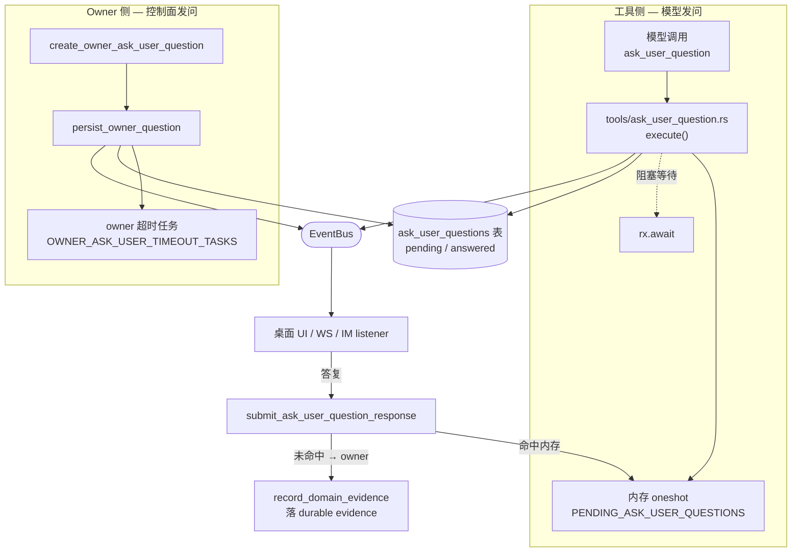
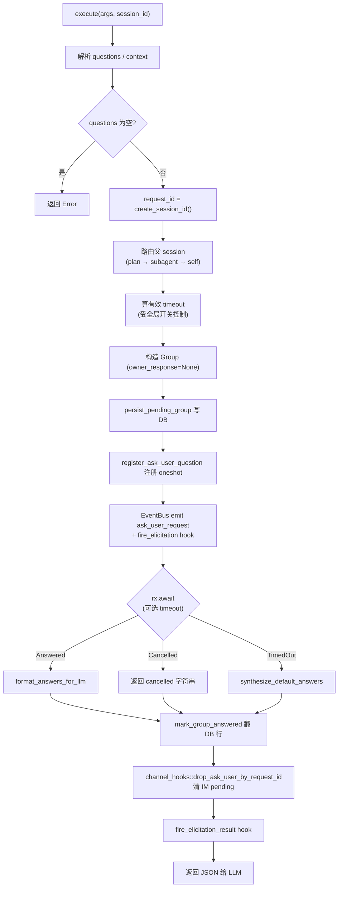
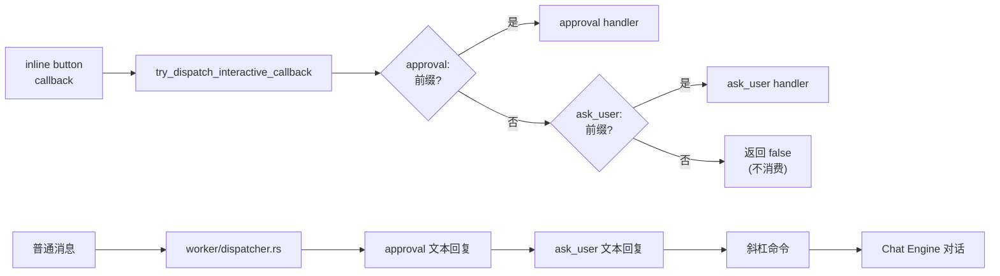

# Ask-User Question 架构

> 返回 [文档索引](../../README.md)
>
> 更新时间：2026-07-23

## 关联源码

- 模块入口与共享 helper：[`crates/ha-core/src/ask_user/mod.rs`](../../../crates/ha-core/src/ask_user/mod.rs)
- 数据结构：[`ask_user/types.rs`](../../../crates/ha-core/src/ask_user/types.rs)
- 内存注册表 + 持久化 + owner 超时任务：[`ask_user/questions.rs`](../../../crates/ha-core/src/ask_user/questions.rs)
- 工具执行入口：[`tools/ask_user_question.rs`](../../../crates/ha-core/src/tools/ask_user_question.rs)
- SQLite 表 CRUD：[`session/db.rs`](../../../crates/ha-core/src/session/db.rs)（`ask_user_questions`）
- IM 渠道：[`ha-channel/.../worker/ask_user.rs`](../../../crates/ha-channel/src/channel/worker/ask_user.rs)
- 前端主组件：[`src/components/chat/ask-user/AskUserQuestionBlock.tsx`](../../../src/components/chat/ask-user/AskUserQuestionBlock.tsx)

---

## 这个子系统解决什么问题

自主 agent 有两种失败模式。一种是**闷头猜**：需求含糊时硬编码一个假设、在两条差不多的路径里随便挑一条、或者在删文件 / 改数据库这类不可逆操作前不打招呼就动手。另一种是**过度打扰**：明明 `grep` 一下就能知道答案，却每一步都停下来问用户，把人变成人肉编译器。

`ask_user_question` 是 Hope Agent 给模型的**唯一结构化提问出口**。它让模型在任意对话（不限 Plan Mode）里，向用户发起 1–4 个带选项的问题，然后**阻塞住这次工具调用**，直到用户答复、取消或超时。相比于「在正文里写一句问句然后祈祷用户回」，结构化问答带来三件事：

- **确定的答案通道**：答案是 `{selected[], custom_input}`，模型拿到的是干净的结构化结果，不用从自然语言里猜用户到底选了哪个。
- **跨形态一致**：同一次调用在桌面渲染成交互卡片、在支持按钮的 IM 里是原生 inline button、在不支持的 IM 里降级成 `1a / 1b / done / cancel` 文本回复——模型不感知形态差异。
- **可恢复**：问题组落 SQLite，App 崩溃 / 重启后能识别「还没答完的问题」，不会把用户晾在一个再也收不到回答的卡片前。

配套的**思维框架**写死在系统提示词里（见 [prompt-system](../core/prompt-system.md#human-in-the-loop)），用 WHEN / WHEN NOT / 节流三段规则告诉模型「什么时候值得开口、什么时候该自己查」。工具本身只负责机制，"何时问"由提示词约束。

---

## 核心思想：一个工具，两种问答

理解这个子系统的关键，是它其实服务**两类完全不同的等待语义**，共用同一套数据结构、事件和 UI：

| | 工具侧（模型发起） | Owner 侧（面向用户本人） |
|---|---|---|
| 谁发起 | 模型调用 `ask_user_question` 工具 | 面向用户本人的控制面代码直接建题（如 domain workflow 让用户补证据） |
| 谁在等 | tool loop 里一个**内存 oneshot channel** | **没有内存接收端**——靠 DB 行 + 超时任务存活 |
| 答复怎么落地 | `rx.send(answers)` 唤醒阻塞的工具，结果回注 tool loop | 把答案落成 **durable evidence**（`record_domain_evidence`），无 tool loop |
| 崩溃 / 重启后 | oneshot 随进程消失 → 行是「僵尸」，启动期翻成 answered | 行**保留**，按剩余 deadline 重建超时任务 |
| `request_id` 形态 | 8 字符短 UUID（`create_session_id()`） | `auq_<uuid>` |
| `source` | `plan` / `subagent` / `normal` / skill id | `owner` |

这个二分法解释了后面几乎所有"看起来重复"的机制：为什么内存注册表和 DB 行要**双轨并存**（识别僵尸）、为什么启动清理要区别对待两种行、为什么 owner 侧额外有一套超时任务和 terminal gate。



> 本文正文以**工具侧**为主线（最常见），owner 侧在每处差异点单独标注。owner 侧的 evidence 语义细节见 [domain-workflow](domain-workflow.md)。

---

## 核心概念

- **Request**：一次提问的最小单元，对应一个 `request_id` 和一个 `AskUserQuestionGroup`。
- **Group**：一组一起呈现的问题，共享 `context`、`source`、`timeout_at` 和有效 `timeout_secs`。
- **Question**：组内单题，有独立 `question_id`、选项列表、`multi_select`、`input_kind`、`timeout_secs`、`default_values`。
- **Option**：单个选项，可挂 `description` / `recommended` / `preview`（富预览）/ `card`（设计方向卡）。
- **Pending Oneshot**：工具侧的内存接收端 `{ sender, session_id }`，注册在 `PENDING_ASK_USER_QUESTIONS` map 里，键为 `request_id`。session 维度用于 Stop / 删会话时定向唤醒所有阻塞中的工具调用。
- **Persisted Group**：同一个 group 同步写入 SQLite，status 为 `pending` / `answered`。内存 oneshot 与 DB 行**双轨存在**，是为了在崩溃 / 重启后识别「有 DB 记录但无内存接收端」的僵尸行。
- **Owner Timeout Task**：owner 侧专属的可重建超时任务，不依赖 oneshot，进程重启后按剩余 deadline 重新武装。

---

## 数据结构

定义在 [`ask_user/types.rs`](../../../crates/ha-core/src/ask_user/types.rs)，独立模块、不依赖 plan。所有结构体 `#[serde(rename_all = "camelCase")]`，序列化落的是字段名——历史 DB 行和模型调用靠 camelCase 字段名加 untagged 枚举免迁移读回，`AskUserQuestion*` 这个类型名前缀不进 JSON、只是代码可读。前端 TypeScript 类型在 `AskUserQuestionBlock.tsx` 镜像。

### 可本地化文本 `AskUserText`

```rust
pub enum AskUserText {           // #[serde(untagged)]
    Plain(String),
    I18n(AskUserI18nText),       // { key, params, fallback }
}
```

`untagged` 让历史 DB 行和模型调用的纯字符串**无需迁移**：桌面 / HTTP UI 遇到 `{ key, params, fallback }` 时按当前 locale 渲染，IM 渠道和 LLM result formatter 一律用 `fallback_text()`（i18n 时取 `fallback`，缺则退到 `key`）。`context` / `text` / `header` / `label` / `description` / `mood` 都是这个类型——后端受控弹窗走 i18n key，模型给的旧字符串继续兼容。

### 问题与选项

```rust
pub struct AskUserQuestionOption {
    pub value: String,                       // 选项内部标识（答案回传的就是它）
    pub label: AskUserText,                  // UI 显示文本（1–5 词）
    pub description: Option<AskUserText>,
    pub recommended: bool,                   // 推荐项，UI 渲染 ★ 徽章
    pub preview: Option<String>,             // markdown / image URL / mermaid 源
    pub preview_kind: Option<String>,        // "markdown" | "image" | "mermaid"
    pub card: Option<AskUserDirectionCard>,  // direction-cards 题型的视觉风格卡
}

pub struct AskUserQuestion {
    pub question_id: String,
    pub text: AskUserText,
    pub options: Vec<AskUserQuestionOption>,
    pub input_kind: Option<String>,          // 主输入形态提示，见下
    pub allow_custom: bool,                  // 默认 true，工具入口强制覆盖为 true
    pub multi_select: bool,                  // 默认 false
    pub template: Option<String>,            // scope | tech_choice | priority
    pub header: Option<AskUserText>,         // ≤~12 char chip 标签
    pub timeout_secs: Option<u64>,           // 0 / None = 继承 group / 全局默认
    pub default_values: Vec<String>,         // 超时回退答案
}
```

关于 `allow_custom`：字段和 schema 都保留着，但工具入口在解析参数时把它**强制覆盖为 `true`**。模型给出的选项经常覆盖不到用户的真实意图，强制保留一个自由文本入口可以避免用户被迫二选一。等模型提问质量足够稳定后可以摘掉这段覆盖，恢复模型自主控制。

### 问题组与答案

```rust
pub struct AskUserQuestionGroup {
    pub request_id: String,
    pub session_id: String,
    pub questions: Vec<AskUserQuestion>,
    pub context: Option<AskUserText>,
    pub source: Option<String>,              // plan | subagent | normal | owner | skill id
    pub timeout_at: Option<u64>,             // unix 秒；None = 无超时
    pub timeout_secs: Option<u64>,           // 有效 wall-clock，供重启后准确发 timeout event
    pub server_now: Option<u64>,             // 生成 / 读取时的服务端 unix 秒，前端用它消除客户端时钟偏移
    pub owner_response: Option<AskUserOwnerResponse>,  // 存在 = owner 侧，见下
}

pub struct AskUserQuestionAnswer {
    pub question_id: String,
    pub selected: Vec<String>,               // 选中的 option value（单选长度 1）
    pub custom_input: Option<String>,        // 自由文本
}
```

同一 request 的答案是 `Vec<AskUserQuestionAnswer>`，一次性提交。

### Owner 侧专属类型

`owner_response` 字段是区分两侧的开关：**存在即 owner 侧**。它描述"用户答复后要落什么 durable 结果"：

```rust
pub struct AskUserOwnerResponse {
    pub action: String,                                          // 目前仅 "record_domain_evidence"
    pub domain_evidence: Option<RecordDomainEvidenceInput>,      // 落 evidence 的目标
}

// 控制面建 owner 问题的入参
pub struct CreateOwnerAskUserQuestionInput {
    pub session_id: String,
    pub questions: Vec<AskUserQuestion>,     // ≤4，且非 incognito 会话
    pub context: Option<AskUserText>,
    pub source: Option<String>,
    pub timeout_secs: Option<u64>,
    pub owner_response: AskUserOwnerResponse,
}

// 超时事件载荷
pub struct AskUserTimedOutPayload {
    pub request_id: String,
    pub session_id: String,
    pub timeout_secs: u64,
    pub used_default_values: bool,
    pub question_preview: Option<String>,
}
```

`create_owner_ask_user_question` 会校验：session 存在、非 incognito、问题数 1–4、`owner_response` 的 evidence 目标 session 一致，然后建组、落库、武装超时任务、广播事件。用户答复时不走 oneshot，而是把答案格式化进 evidence summary/metadata，在**同一个 SQLite 事务**里落 evidence 并翻行状态（`record_owner_ask_user_evidence_and_answer`）。

---

## 富输入扩展：input_kind + 设计方向卡

`input_kind` 与 `card` 是给**设计空间发现问卷**用的加法式扩展。它们的红线是**答案通道零变化**——无论前端画成什么样，回传的仍是 `{selected[], custom_input}`：

- **`text` / `textarea`**：无选项的自由文本题，答案走 `custom_input`（前端渲染纯文本框，不再套「其他」开关），用于开放式发现问题。
- **`direction-cards`**：**带 `card` 载荷的单选题**——每个选项照常有 `value`/`label`，额外挂调色板 + 字体 + 气质 + 参考。答案仍是选项 `value`、走 `selected[]`，所以肯定 / 否定判定、IM 按钮 / 编号协议、DB 持久化全部不动。
- **`single` / `multi`**：显式指定单 / 多选，等价于 `multi_select` 派生的默认行为。

工具入口用 `normalize_input_kind` 做白名单校验：未知 / 垃圾值一律归 `None`（回落到 `multi_select` 派生的单 / 多选），漂移的模型永远造不出无法渲染的题。`AskUserDirectionCard`（palette ≤6、references ≤4）由 `parse_direction_card` 解析，整体空的 card（如 `card: {}`）会被丢弃，该选项退回普通单选行——**呈现永远不阻塞答案**。

### 富渲染只在设计对话发生

`AskUserQuestionBlock` 收一个 `variant` prop，**仅在 `variant="design"` 且选项确有 `card` 时**才把选项画成视觉风格卡（色板行 + 实时 "Aa" 字体样张 + 气质 + refs）；主对话、IM、历史回放一律**降级成普通选项列表**（安全降级，非安全边界）。区分靠**渲染方的 `variant`**，不靠 `group.source`（设计 thread 的 source 仍是 `normal`）。

风格卡在主 App 渲染，色值 / 字体属 **untrusted 输入**：`palette` 经 `sanitizeCssColor`（只放行 `#hex` 与已知函数式色，堵 `url(...)` / CSS 注入），字体经 `sanitizeFontFamily`（剥 `;{}<>` 与 `url(`），二者都在 `AskUserQuestionBlock.tsx`。

**IM 零改动**：`direction-cards` 因带 `options` 走既有按钮 / 编号；`text` / `textarea` 因无 `options` 走既有自由文本兜底。新增 `input_kind` 不需要 IM 侧任何降级分支。设计对话通过共享 hook `useAskUserPending` 接入（`useDesignChat` → `DesignChatPanel` 传 `askUserVariant="design"`），主对话 `usePlanMode` 保留自己的内联副本。

---

## 工具执行流程

[`tools/ask_user_question.rs`](../../../crates/ha-core/src/tools/ask_user_question.rs) 的 `execute(args, session_id)` 是工具侧的入口，也是全局唯一的结构化问答实现——特征 crate 的确认弹窗（如 `ha-updater` 的 `app_update` install/rollback）从 crate 外复用它、不 fork。



几个非显然的实现点：

**父 session 路由**。子 Agent 会话对主对话 UI 是隐藏的，问题若发到子 session 会没有卡片可答。`execute` 依次尝试：`plan::get_plan_owner_session_id`（Plan Mode 子 Agent）→ 会话的 `parent_session_id`（普通 subagent）→ 回落自身。命中哪一级决定 `source` 是 `plan` / `subagent` / `normal`，事件和 DB 行都记在**可见的父 session** 上。这是 ask_user 模块对 plan 模块的唯一依赖点。

**持久化先于发射**。`persist_pending_group` 在 `bus.emit` 之前调用：即使 emit 失败或进程立刻崩溃，DB 也留有 pending 痕迹供下次启动识别清理。

**序列化失败的回滚**。若 `serde_json::to_value(&group)` 失败或 EventBus 不可用，会同步 `cancel_pending_ask_user_question_with_source(.., "error")` 撤销 oneshot 并 `mark_group_answered` 翻转 DB 行，避免留下永远没有接收端的 pending 记录。

**Elicitation hook 埋点**。发问时 `fire_elicitation`、终态时 `fire_elicitation_result`（answered / cancelled / timeout）都会触发 hook（observation-only），供 Hooks 子系统观察问答生命周期，见 [hooks](hooks.md)。

### 超时与 default_values 合成

有效超时的优先级（在 `execute` 内计算）：

```
ask_user_question_timeout_enabled
  ? (max(所有 per-question timeout_secs) > 0 ? 用该最大值 : 全局 ask_user_question_timeout_secs)
  : 0
```

全局开关 `false` 时，模型传入的所有 `timeout_secs` / `default_values` 都不触发自动超时（`effective_timeout_secs = 0`，`rx.await` 永久等待，只能靠 cancel 唤醒）。开启后，组级门限取**所有 per-question 超时的最大值**作为 wall-clock，未传则回退全局默认；`0` 表示无限期等待。`timeout_at` 同时写入 DB，供 UI 渲染倒计时和启动期扫描过期行。

超时后 `synthesize_default_answers` 合成回退答案，规则是：每题遍历 `default_values`，命中某个 option `value` 就进 `selected`，否则并入 `custom_input`（逗号分隔）——允许 `default_values` 混用「已有选项」和「任意自由文本」两种形式。

### 回给 LLM 的结果

无论正常回答还是超时合成，都走 `format_answers_for_llm` 产出同一份 JSON：

```jsonc
{
  "answers": [
    { "question": "哪个框架?", "selected": ["React"], "customInput": null }
  ],
  "timedOut": true,   // 仅超时路径附带这两个字段
  "note": "Some or all questions timed out; default values were automatically applied."
}
```

`selected` 里是选项的 **label**（不是内部 value），便于模型直接理解。该字符串作为 tool_result 回注 tool loop 下一轮；前端 `PlanResultBlocks.tsx` 的 `AskUserQuestionResult` 解析同一份 JSON 渲染成可折叠的已回答摘要卡片。cancel 路径不产 JSON，直接返回 `"The user cancelled the questions without answering."`。

---

## 内存注册表与 owner 超时任务

[`ask_user/questions.rs`](../../../crates/ha-core/src/ask_user/questions.rs) 持有三个进程内静态表：

```rust
// 工具侧：唯一的有效接收端
static PENDING_ASK_USER_QUESTIONS: OnceLock<TokioMutex<HashMap<String, PendingAskUserQuestion>>>;
// owner 侧：可重建的超时任务（AbortHandle + session_id）
static OWNER_ASK_USER_TIMEOUT_TASKS: OnceLock<Mutex<HashMap<String, OwnerTimeoutTask>>>;
// owner 侧：序列化每次终态转换的门（回答 vs 超时只能有一个赢家）
static OWNER_ASK_USER_TERMINAL_GATES: OnceLock<Mutex<HashMap<String, Arc<TokioMutex<()>>>>>;
```

### 工具侧 oneshot map 的操作

| 调用点 | 动作 |
|--------|------|
| `register_ask_user_question(request_id, session_id, sender)` | 工具执行期间插入 |
| `submit_ask_user_question_response(request_id, answers)` | 回传答案：命中则移除并 `send`；**未命中则回落 owner 侧** |
| `cancel_pending_ask_user_question(request_id)` | 单请求取消：移除并 drop sender（触发 `rx.await` 返 `Err`） |
| `cancel_pending_ask_user_questions_for_session(session_id, source)` | Stop / 删会话时定向 drain 该 session 的 live 工具请求 |
| `cancel_all_pending_ask_user_questions(source)` | 全局 Stop 时 drain 全部 live 工具请求 |
| `is_ask_user_question_live(request_id)` | 过滤僵尸 DB 行时查是否仍有内存接收端 |

每条终态路径都会：翻 DB 行 → 发 `ask_user:resolved` → `emit_pending_interactions_changed`（更新侧边栏待办计数）。注意 `cancel_pending_ask_user_questions_for_session` 刻意**只 drain 工具侧**——owner 侧是 durable workflow 状态，不该被一次前台 Stop 抹掉。

### 僵尸行过滤

`find_live_pending_group_for_session` 是"切回会话时恢复待答问题"的读路径。它把 DB 列出的 pending group（`created_at ASC`，LIMIT 50）**逆序**遍历（最新优先），对每一行判定：

```
owner_response.is_some()  ||  is_ask_user_question_live(request_id)
```

即 **owner 行永远算 live**（它本来就没有 oneshot），**工具行必须仍有内存接收端**。这解决了"DB 行存在但进程已重启"时 UI 调 `respond_ask_user_question` 报 "No pending request" 的问题。

### owner 超时任务：为什么单独一套

owner 问题没有 oneshot，超时得靠一个独立 tokio 任务。`schedule_owner_question_timeout` 按 `request_id` **幂等**注册（重复调用直接返回），所以它在创建期和启动恢复期都安全。任务醒来后：

- 先拿 **terminal gate**（`Arc<TokioMutex<()>>`），与回答路径共享同一把锁，保证"回答"和"超时"最多一个赢得终态；
- 调 `mark_ask_user_timed_out` 做**原子** `pending → answered` 转换，只有赢家（`changed > 0`）才发 `ask_user_timed_out` / `ask_user:resolved` 和 `ElicitationResult(timeout)` hook；
- DB 写失败时**保留注册项**并以 1→30 秒指数退避持续重试，session 删除可通过 `AbortHandle` 中断这个循环；
- owner 超时**永不把 `default_values` 记成用户决策**——把沉默提升为 consent 是不允许的。

`persist_owner_question` 刻意**先武装超时任务再广播事件**：否则一个立刻到达的回答 / 删除可能抢在任务注册之前，把一个已回答的请求留成睡到 deadline 的孤儿。

---

## SQLite 持久化

表 `ask_user_questions` 作为 session DB migration 创建（[`session/db.rs`](../../../crates/ha-core/src/session/db.rs)）：

```sql
CREATE TABLE IF NOT EXISTS ask_user_questions (
    request_id TEXT PRIMARY KEY,
    session_id TEXT NOT NULL,
    payload    TEXT NOT NULL,                         -- AskUserQuestionGroup 完整 JSON
    status     TEXT NOT NULL DEFAULT 'pending',       -- pending | answered
    timeout_at INTEGER,                               -- unix 秒
    created_at TEXT NOT NULL DEFAULT (datetime('now')),
    answered_at TEXT,
    FOREIGN KEY (session_id) REFERENCES sessions(id) ON DELETE CASCADE
);
CREATE INDEX IF NOT EXISTS idx_ask_user_session ON ask_user_questions(session_id);
CREATE INDEX IF NOT EXISTS idx_ask_user_status  ON ask_user_questions(status);
```

`payload` 存整个 group 的 JSON，是恢复的唯一真相源（`owner_response` 也在里面，决定这行属哪个平面）。`ON DELETE CASCADE` 确保 session 被删时 pending 行自动清理。

`SessionDB` 上的 CRUD：

| 方法 | 用途 |
|------|------|
| `save_ask_user_group(&group)` | `INSERT OR REPLACE`，用 `COALESCE` 保留已有 `created_at` |
| `mark_ask_user_answered(request_id)` | `pending → answered` + 写 `answered_at`，幂等 |
| `mark_ask_user_timed_out(request_id)` | **仅在仍 pending 且 deadline 已到**时原子翻到 answered；返回是否赢得转换 |
| `expire_pending_ask_user_groups()` | 启动期把**失去 oneshot 的工具行**翻 answered；owner 行（payload 里有 `ownerResponse`）保留 |
| `purge_old_answered_ask_user_groups(retain_days)` | 删 `answered_at` 早于 N 天的行 |
| `list_pending_ask_user_groups_for_session(session_id)` | deadline 未到的 pending group（`created_at ASC`，LIMIT 50）；读路径**不抢占** timer 的原子终态转换 |
| `list_pending_owner_ask_user_groups()` | 启动时读带 deadline 的 owner group 用于重建超时任务；缺 `timeout_secs` 时用 `timeout_at - created_at` 回填 |
| `get_pending_ask_user_group_by_request_id(request_id)` | owner 回答路径按 id 取仍 pending 的组 |

---

## 启动清理与每日 purge

问答行需要两类清理：**清僵尸**（重启后失去 oneshot 的工具行）和**防膨胀**（久留的 answered 行）。清理挂在 [`app_init.rs`](../../../crates/ha-core/src/app_init.rs) 的后台任务里，按运行模式分档：

**长驻模式**（桌面 GUI 与 `hope-agent server`，走 `start_background_tasks`）：

1. 启动一次性：`purge_old_answered_ask_user_groups(7)` → `expire_pending_ask_user_groups()` → `restore_owner_question_timeouts()`
2. 之后每 24 小时跑一次 `purge_old_answered_ask_user_groups(7)` 的周期任务，保证表不无界增长

**ACP 模式**（`start_minimal_background_tasks`）：只做启动一次性的那三步清理，**不起每日 purge 循环**——ACP 是 IDE 拉起的单会话短命进程，长周期 timer 会漏文件句柄。

清理逻辑对两侧区别对待：工具行的内存 oneshot 在进程启动时必然为空，所以失去接收端的工具 pending 行只能翻 answered；owner 行带 durable response handler、不依赖 oneshot，必须保留并按剩余 deadline 重建幂等超时任务，已经到期的立即竞争原子终态转换。启动清理是 primary-only（Secondary 进程会误清桌面仍 live 的 pending）。

数据保留窗口固定 **7 天**，目前不可配置。

---

## EventBus 事件

三个事件常量定义在 `ask_user/questions.rs`：

```rust
pub const EVENT_ASK_USER_REQUEST:   &str = "ask_user_request";    // 新问题
pub const EVENT_ASK_USER_TIMED_OUT: &str = "ask_user_timed_out";  // 超时
pub const EVENT_ASK_USER_RESOLVED:  &str = "ask_user:resolved";   // 统一终态
```

| 事件 | 何时发 | 载荷 | 订阅方 |
|------|--------|------|--------|
| `ask_user_request` | 建组时 | 整个 `AskUserQuestionGroup` | 桌面 UI / WS forwarder / IM listener |
| `ask_user_timed_out` | 赢得超时终态时 | `AskUserTimedOutPayload` | 清 active card、桌面通知、IM 超时提示 |
| `ask_user:resolved` | **每条**终态路径（回答 / 取消 / 超时 / Stop / 删会话） | `{requestId, sessionId, status, source}` | 所有面：统一清卡、对账下一条排队问题、清 IM pending |

`ask_user:resolved` 是"统一撤窗"信号：前端据它清当前卡片并立即查下一条 live pending group，IM listener 据它撤销残留的按钮 / 文本 pending。HTTP EventBus 广播**不做 replay**（at-most-once），所以前端不能把单次 event 当最终真相——WS 首连 / 重连 / `_lagged` 会触发本地对账，重新读 `get_pending_ask_user_group`（详见下文前端集成）。

---

## 前端集成（桌面 GUI）

### 事件订阅与渲染

订阅集中在 `usePlanMode.ts`。`ask_user_request` handler 做三重过滤后写入 `pendingQuestionGroup`：

```ts
const group = parsePayload<AskUserQuestionGroup>(raw)
if (!group) return
if (group.sessionId !== currentSessionId) return          // 会话隔离
if (terminalQuestionIdsRef.current.has(group.requestId)) return  // 终态 tombstone
setPendingQuestionGroup((existing) => {
  const normalized = withLocalQuestionDeadline(group, existing)  // 换算本地 deadline
  return isExpiredQuestionGroup(normalized) ? null : normalized
})
```

`MessageList.tsx` 条件渲染 `<AskUserQuestionBlock group={pendingQuestionGroup} .../>`。设计对话另传 `askUserVariant="design"`。

### 时钟偏移与倒计时

后端在 payload 里附 `serverNow`（生成时的服务端 unix 秒）。前端用 `timeoutAt - serverNow` 算出剩余时长，再映射成客户端单调推进的 `localTimeoutAtMs`——这样用户系统时间快慢都不会让卡片提前过期或无限延后。倒计时由共享 lib `@/lib/countdown` 的 `useCountdownRemainingSec(localDeadlineMs)` 每秒 tick，`formatRemaining` 支持 `s / m s / h m` 三档。UI 按剩余秒切三态：

| 状态 | 条件 | 样式 |
|------|------|------|
| 正常 | `remaining > 10` | 灰色 chip |
| 紧张 | `0 < remaining ≤ 10` | 琥珀色 + `animate-pulse` |
| 超时 | `remaining ≤ 0` | 红色 + "timed out" + 提交按钮 disabled |

倒计时 chip **不是唯一安全边界**。`usePlanMode` 还按 `timeoutAt` 注册独立 deadline guard：到点后按 `requestId` 清卡片，即使 renderer 挂起导致 interval 延迟、或 `ask_user_timed_out` 在 WS 断线期丢失，也不会留下可提交的过期 UI。恢复查询用独立的 mutation epoch 与 successful-response sequence：timeout / submit / 会话切换都会令旧请求失效，终态 request id 还会进入有界 tombstone，禁止"事件先清空、旧 GET 后返回"把问题复活，同时较新的失败请求不会吞掉较早的成功响应。WS 重连 / lag、window focus、visibility 恢复会再次读 durable pending 状态，侧边栏待办计数走 300ms debounce reload。

### 交互与提交

每题一个独立 `QuestionState { selected: Set, customInput }`，以 `question_id` 为 key。`toggleOption` 分单 / 多选（单选清空再加、多选切换）。分类图标按 `q.template`：

| template | 图标 | 颜色 |
|----------|------|------|
| `scope` | `Target` | 紫 |
| `tech_choice` | `Layers` | 绿 |
| `priority` | `AlertTriangle` | 琥珀 |
| 其他 / 无 | `HelpCircle` | 蓝 |

选项徽章：`recommended` → `Star` + "Recommended"（琥珀）；`defaultValues` 含该 option → `Timer` + "default"（灰，提示超时会自动选中）。`handleSubmit` 构造 `AskUserQuestionAnswer[]` 后调唯一响应命令 `respond_ask_user_question`，成功后 `setSubmitted(true)` 立即隐藏组件、父组件清空 `pendingQuestionGroup`。

### 富预览与并排对比

`OptionPreview` 按 `previewKind` 分流：`image` → ``；`mermaid` → 包 ```` ```mermaid ```` 代码块；`markdown`（默认）直接渲染。三者都交给静态的 `MarkdownStreamdown` 包装器，只启用 `{ code, cjk }` 两个基础插件——预览是一次性静态内容，不需要主对话那套增量流式 / rAF 调度，省掉它显著降低渲染开销。

只要 group 里**任一**选项挂了 `preview`，布局切成左窄右宽的两栏（约 2:3）：左栏选项列表 + custom input，右栏跟随 `focusedOption`（hover 联动）显示预览，实现"方案并排对比"。若当前 focused 选项没有预览、或整组都没预览，则预览内联显示在该选项 description 下方。

### 会话切换时恢复

切回会话时前端 invoke `get_pending_ask_user_group(session_id)`，内部调 `find_live_pending_group_for_session`，返回最近一条仍 live 的 pending group。Server 模式下多客户端连同一 session 时，已 live 的 pending group 是**跨客户端唯一**的：任一客户端提交 / 超时 / Stop / 删会话后，所有客户端都收到统一 `ask_user:resolved`，清卡后立即查下一条 live group，并发产生的多组问题不会因覆盖式 UI 状态被永久隐藏。

---

## IM 渠道集成

IM 路径集中在 [`worker/ask_user.rs`](../../../crates/ha-channel/src/channel/worker/ask_user.rs)，镜像 `approval.rs` 的模式，二者共享统一 dispatcher。

### 按钮渠道 vs 文本兜底

先用 target-aware `ChannelPlugin::supports_reply_buttons(account, chat)` 判断，再对完整 button payload 调 `validate_reply_buttons`。任一预检失败都在网络请求前回退到完整文本交互：

| supports_buttons = true（inline button） | supports_buttons = false（文本兜底） |
|---|---|
| Telegram · Discord · Slack · Feishu · QQ Bot · LINE · Google Chat | WeChat · Signal · iMessage · IRC · WhatsApp |

`spawn_channel_ask_user_listener` 先构造完整按钮，再同时检查 target 能力、callback 字节预算和 provider payload 校验。两种呈现模式都注册同一个 `PendingAskUser`；request index 与 exact-route index 只是同一对象的两个入口。**没有选项的题（`text` / `textarea`）即使在按钮渠道也走文本兜底**，否则只会显示一个 `[Cancel]` 而让用户的文本回复漏成一条新消息。

### Prompt 格式化与字节预算

`format_prompt(&group)` 把 group 序列化成分层编号的文本块（`1.` 题、`1a.` 选项、`★` 标推荐）。每个字段单独按字节截断，一律走 `ha_core::truncate_utf8`（禁字节切片，避免截断 UTF-8 多字节字符——AGENTS.md 硬线）：

| 字段 | 截断 |
|------|------|
| `context` | 500 B |
| `question.text` | 500 B |
| `option.label` | 100 B |
| `option.description` | 200 B |
| 整个 prompt | 3500 B |

整体 3500 字节是为了容纳所有 IM 平台里**最严格**的 payload 上限（Discord 2000 / Slack 3000 / Telegram 4096 / LINE 5000）。

### callback 协议与按钮布局

`build_buttons` 生成 2D 按钮数组，`callback_data` 走命名空间 `ask_user:`（与 approval 的 `approval:` 严格区分）：

```
ask_user:{request_id}:s:{question_index}:{option_index}  // 普通选项
ask_user:{request_id}:d:{question_index}                 // multi-select 完成
ask_user:{request_id}:f:{question_index}                 // Discord 打开文件模态框
ask_user:{request_id}:fm:{question_index}                // Discord 文件模态框提交
ask_user:{request_id}:c                                  // 整体取消
```

布局：每题选项按顺序填、满 3 个换行（Telegram 友好的短行）；不满 3 的独占一行；`multi_select` 题追加一行 `✅ Done with Q{N}`；所有题填完追加一行 `❌ Cancel`。按钮显示文本形如 `[1a] ★ 标签`，`option_marker(qi, oi)` 生成 `qi` 十进制 + `oi` 单字母（`a..z`）的编号。全部 callback 受 Telegram 最严的 64-byte 上限；超限则发送前回退文本。旧 `select/done/cancel` 格式仅作滚动重启期读取兼容，同样经过 identity、timeout 与越界检查。

### 受限文件输入

`input_kind=file` 是公共问答语义，不承载 Discord/Slack 私有 JSON。当前 PoC 必须独占一组问题，`AskUserFileConstraints` 强制 `count=1`、最大 10 MiB，类型只允许 `application/pdf`、`text/plain`、`text/markdown`。工具只允许在已经绑定 IM 的会话中发出文件题。

Discord 在账号开关打开时使用原生 File Upload 模态框；其余渠道和关闭开关的 Discord 使用“下一条附件”文本回退。两条路径最终都进入 dispatcher 的同一边界：先过账号 access 与 mention gate，再验证 exact route + attach row + session、超时、单文件数量、声明与实际大小、扩展名与 PDF magic/UTF-8 内容，最后由公共媒体边界复制到本会话附件目录。跨账号、跨聊天、跨 thread、旧 attach、过期请求和原始远端 URL 均不能绑定；拒绝时保留 pending 供用户重试。

### 文本回复解析

`try_handle_ask_user_reply(msg)` 是 dispatcher 前置钩子，在消息当成普通输入之前尝试消费。`PendingAskUserState` 用 request index 与 `(channel_id, account_id, chat_id, normalized_thread)` exact-route index 指向同一 `PendingAskUser`。每个对象还捕获 `channel_conversations.id + session + exact route` 的 `InteractiveAttachIdentity`；同群不同 topic 不会互相选中。解析顺序：

1. **`cancel`**（忽略大小写）：弹最新 pending，`cancel_pending_ask_user_question` 撤 oneshot
2. **逗号 / 空白分隔的 marker**（`1a`、`1a,1c`、`1a 1b`）：`parse_marker` 逐个转 `(qi, oi)` 写入对应题——多选追加去重、单选覆盖保留最后一个
3. **`done`**（忽略大小写）：只在整组 `is_complete()` 时 submit；未完整则保留 pending 并回复提示
4. **都没解析到 → 自由文本兜底**：优先填入第一个允许 custom 且未作答的问题；若已有选项，只在剩下唯一无歧义 custom 目标时接受。多选保留 `selected + custom_input`，单选 Other 清空旧选项

`parse_marker` 是 1-based（`1a → (0,0)`，`10c → (9,2)`），`qi == 0` 直接拒绝，非 ASCII 尾字母返 `None`（不 panic）。完成条件是每题至少一个 selected 或 custom_input；没有多选题时最后一题完整后自动 submit，含多选时由 `done` / 按钮触发整组检查。完成、取消、超时或 prompt 投递失败都在同一锁下同时撤掉 request/route 两个入口。submit 前再复验 attach identity；来源缺失或 handover 后回复均 fail-closed。

### 统一 dispatcher 与接入点



`try_dispatch_interactive_callback` 把**工具审批 + 用户问答**两类交互的 callback 分流到各自 handler：渠道插件收到 callback 时调它、用返回值决定是否消费，无须各自判前缀 / spawn handler / 写日志。多数按钮渠道走它；Telegram / Discord / Feishu 因各自 SDK 的回调形态不同，改用 `is_ask_user_callback` 手动分支再包一层平台特定处理。渠道插件接入点：

| 渠道 | 接入文件 | 调用 |
|------|----------|------|
| Slack / QQ Bot / LINE / Google Chat | `slack/socket.rs` · `qqbot/gateway.rs` · `line/webhook.rs` · `googlechat/webhook.rs` | `try_dispatch_interactive_callback` |
| Telegram | `telegram/polling.rs` | `is_ask_user_callback` + 包一层 answerCallbackQuery |
| Discord | `discord/gateway.rs` | `is_ask_user_callback` + `spawn_callback_handler` |
| Feishu | `feishu/ws_event.rs` | `is_ask_user_callback` + `handle_ask_user_callback_with_source` |

文本兜底入口在 `worker/dispatcher.rs`，消息路由顺序 **approval 回复 → ask_user 回复 → 斜杠命令 → Chat Engine**，任一前置步骤消费后 `return`，不重复投递。

**启动时机**：`app_init.rs` 在 channel dispatcher 启动后紧接 `spawn_channel_ask_user_listener`，保证 EventBus 广播不丢。listener 对 `Lagged(n)` 告警但不退出，`Closed` 才 break；非 IM session 或查不到会话时 `Ok(None) => continue` 静默跳过。

---

## 命令 / 路由一览

**Tauri 命令**（`src-tauri/src/commands/plan.rs`，注册在 `src-tauri/src/lib.rs` 的 `invoke_handler!`）：

| 命令 | 参数 | 返回 | 说明 |
|------|------|------|------|
| `respond_ask_user_question` | `request_id`, `answers` | `()` | 提交回答 |
| `get_pending_ask_user_group` | `session_id` | `Option<AskUserQuestionGroup>` | 切会话恢复 |
| `create_owner_ask_user_question` | `input` | `AskUserQuestionGroup` | 控制面建 owner 问题 |

**HTTP 路由**（`crates/ha-server/src/routes/plan.rs`，注册在 `ha-server/src/lib.rs`）：

| 方法 | 路径 | 说明 |
|------|------|------|
| `POST` | `/api/ask_user/respond` | 提交回答 |
| `POST` | `/api/ask_user/owner-question` | 建 owner 问题 |
| `GET` | `/api/plan/{session_id}/pending-ask-user` | 查询恢复 |

前端 Transport 映射在 `src/lib/transport-http.ts`；Tauri 与 HTTP 两套适配委托到同一 core 实现（`submit_ask_user_question_response` / `find_live_pending_group_for_session` / `create_owner_ask_user_question`）。

---

## 配置项

全局默认超时字段在 [`crates/ha-config-schema/src/config.rs`](../../../crates/ha-config-schema/src/config.rs)（AppConfig wire 类型），运行时经 `cached_config()` 读、`mutate_config` 写：

```rust
#[serde(default)]
pub ask_user_question_timeout_enabled: bool,           // 默认 false = 永远等待

#[serde(default = "default_ask_user_question_timeout")]
pub ask_user_question_timeout_secs: u64,               // 默认 0 = 永不超时
```

- 默认**关闭自动超时**（永远等待，依赖 cancel 或手动答复）；设置页主动开启超时开关时建议 **1800 秒（30 分钟）**。
- 读写命令：Tauri `get/set_ask_user_question_timeout_enabled` + `get/set_ask_user_question_timeout`；HTTP `GET/POST /api/config/ask-user-question-timeout-enabled` + `.../ask-user-question-timeout`。
- **与 approval_timeout 独立**：`permission.approval_timeout_*` 管工具审批等待，`ask_user_question_timeout_*` 管本工具等待，互不影响，默认都关。
- **数据保留** 7 天（`purge_old_answered_ask_user_groups(7)`），不可配置。

按 AGENTS.md 设置三件套约定，这两个字段同时有 GUI 面板入口和 `ha-settings` 读写能力。

---

## 安全与边界条件

**工具结果注入**。回给 LLM 的 JSON 由 `format_answers_for_llm` 用 `serde_json` 构造，label 和 custom input 都正确转义，用户伪造的 `"` / `}` 破坏不了结构。自由文本是用户输入，模型应视为不受信内容——系统提示词对本工具的定位（"用户答复是输入数据"）保证了这点。

**超时不等于同意（红线）**。判断用户是否点了「确认」，看的是 `selected` 里有没有命中肯定 label，而且**只要 `timedOut: true` 就一律不算同意**——哪怕某个 default 恰好等于肯定 label，把超时当 consent 也是静默提权。这条肯定 / 否定判定目前是两份各自独立的实现：通用的 `was_affirmative(raw, labels)` 带 `timedOut` 守卫（目前没有生产调用方）；`app_update install/rollback` 用 `ha-updater` 私有的 `is_confirm`（肯定 label 为 `upgrade now` / `roll back now`），它不检查 `timedOut`，超时安全靠把 `default_values` 设成 `cancel`、超时就合成取消。owner 超时同理，永不把 `default_values` 记成用户决策。`control.evaluate` 那类危险动作的确认走 SSRF 扫描 + 权限审批，不经这条 label 判定。

**僵尸行识别**。内存 oneshot 与 DB 行双轨：读路径经 `is_ask_user_question_live` 过滤只返 live 行；重启后 `expire_pending_ask_user_groups` 只翻工具行，owner 行保留并重建超时任务。

**终态唯一赢家**。owner 侧的回答与超时共享一把 terminal gate，`mark_ask_user_timed_out` 做原子 `pending → answered` 转换，失败方不得重复发事件或写 evidence；owner answer 的 evidence + terminal status 在同一 SQLite 事务提交，`timeout=0` 也走 per-request terminal gate。

**会话级隔离**。前端查 `group.sessionId !== currentSessionId`；IM listener 用 `get_conversation_by_session` 精确路由回原发渠道，非 IM / 不存在的 session 静默跳过。

**Cancel / Stop 语义**。单请求 cancel 与 session / 全局 drain 都先从内存 map 移 sender 让 `rx.await` 立即返回，再 best-effort 翻 DB 行、清 IM pending、发 `ask_user:resolved`；工具执行的最终清理保留为幂等兜底。Stop、删会话、purge 因而不遗留永不结束的工具调用；session 删除同时 abort owner timer、drain 工具 oneshot、清 IM pending。

**callback 字符串长度**。Telegram 限 `callback_data` 64 字节、Discord 100 字节。工具行 `request_id` 只有 8 字符（短 UUID），`ask_user:` 前缀 + `:select:` + `question_id` + `option_value` 的**主要预算压力在 `question_id` 和 `option_value`**。若模型生成过长的两者，Telegram 会拒收按钮；目前无前置长度校验，靠 schema description 提示 + 模型自律。

**并发语义**。`ask_user_question` 标了 `concurrent_safe`（无写入副作用，可与 read-only 工具并发），但一次 `execute()` 会阻塞整个 tool call 直到答复 / 超时。模型若同一轮发多组问题，会并发触发多个 event，当前前端只保留最新一组（`setPendingQuestionGroup` 覆盖式写入），其余组的 oneshot 继续等到各自 timeout。**推荐模型一次只发一组**，系统提示词已明示。

---

## 工具注册与系统提示词

工具常量 `TOOL_ASK_USER_QUESTION = "ask_user_question"`（`tool_defs/names.rs`）。schema 由 `tool_defs/plan_tools.rs::get_ask_user_question_tool()` 定义——放这里是因为 Plan Mode 也用它，但工具本身不依赖 plan 模块。关键声明：

| 声明 | 值 | 含义 |
|------|-----|------|
| `tier` | `Core { subclass: Interaction }` | Core 工具：随 Core 描述稳定注入，不支持 deferred，不受 `capabilities.tools.allow/deny` 影响 |
| `internal` | `true` | 系统工具，不可被 agent `denied_tools` 关闭 |
| `concurrent_safe` | `true` | 允许并发调度 |

三个旧布尔（deferred / always_load）已从 `ToolDefinition` 删除，改由 tier 派生（`is_always_load()` / `supports_deferred()`，见 `tool_defs/types.rs`）。`concurrent_safe` 的判定表 `CONCURRENT_SAFE_TOOL_NAMES`（`tools/definitions/registry.rs`）现在**从各工具定义的 `concurrent_safe` 字段派生**，不再是手写名单。dispatch 条目在 `tools/builtin_registry.rs`（静态注册表，见 [tool-system](../core/tool-system.md)）。

系统提示词分两层注入（都在 `system_prompt/constants.rs`，编译期常量嵌入二进制、用户不能通过 `agent.md` 覆盖，与 Sandbox / Memory guidance 同范式）：

1. **工具描述层** `TOOL_DESC_ASK_USER_QUESTION`：只保留**调用规则**（1–4 题 / 每题 2–4 选项、推荐项首位标 `(Recommended)`、禁止用来问 "is my plan ready?"（用 `submit_plan`）、禁止用来问 "should I run this command?"（用工具审批）），指向下面的全局段而不重复展开。
2. **全局 Human-in-the-loop 段** `HUMAN_IN_THE_LOOP_GUIDANCE`：由 `build.rs` 在工具定义之后始终注入，提供 WHEN / WHEN NOT / 节流三段**思维框架**（何时该问、何时该自查、如何合并与前置以避免打扰）。详见 [prompt-system](../core/prompt-system.md#human-in-the-loop)。

---

## 三种运行模式覆盖

| 运行模式 | 事件出口 | 答案回传 |
|---------|---------|---------|
| Tauri 桌面 | `transport.listen("ask_user_request")` | `invoke("respond_ask_user_question")` |
| HTTP/WS 守护进程 | WebSocket `ask_user_request` 帧 | `POST /api/ask_user/respond` |
| IM 渠道 | EventBus → `spawn_channel_ask_user_listener` → 渠道插件 | 按钮 callback 或文本 reply |

---

## 相关文档

- 何时该问 / 何时自查的思维框架：[prompt-system](../core/prompt-system.md#human-in-the-loop)
- 工具注册表与 tier 派生：[tool-system](../core/tool-system.md)
- 富输入 / 设计方向卡的消费方：[design-space](../infra/design-space.md)
- owner 侧 evidence 语义：[domain-workflow](domain-workflow.md)
- 问答生命周期 hook（elicitation）：[hooks](hooks.md)
- 跨模式后台任务分档：[process-model](../system/process-model.md)
- Tauri 命令 / HTTP 路由清单：[api-reference](../system/api-reference.md)
