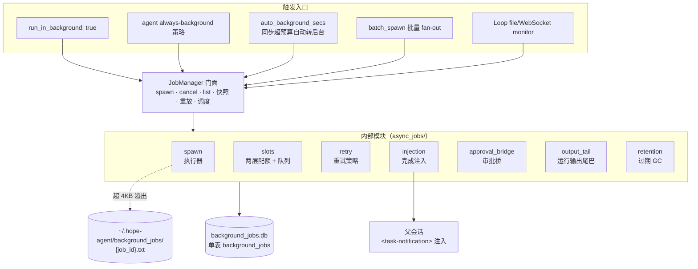
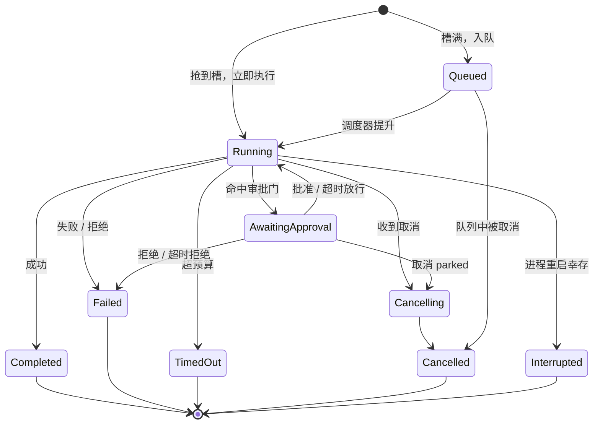
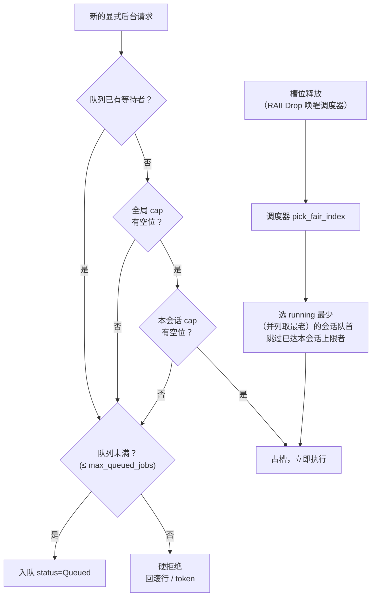
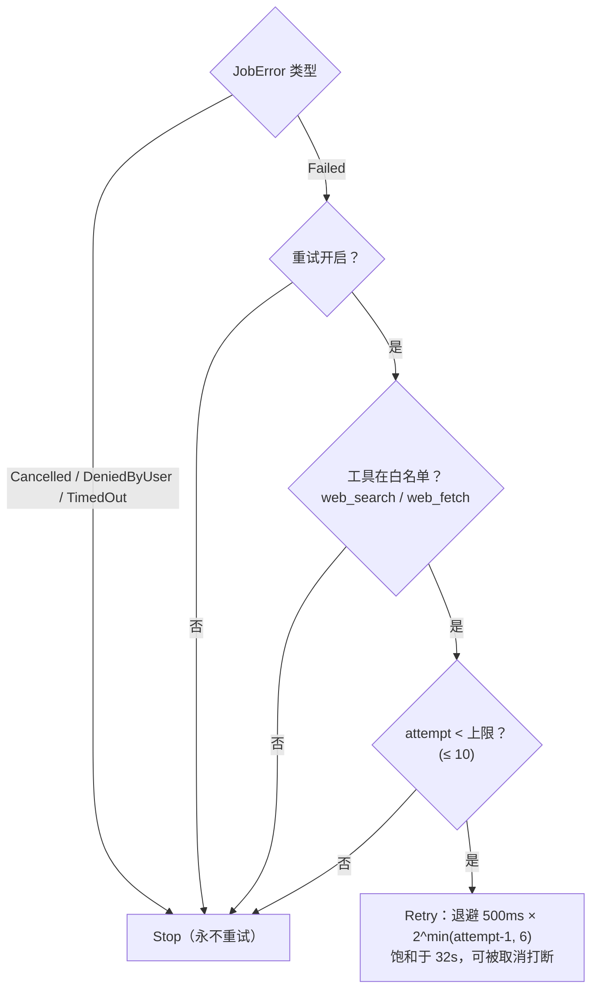
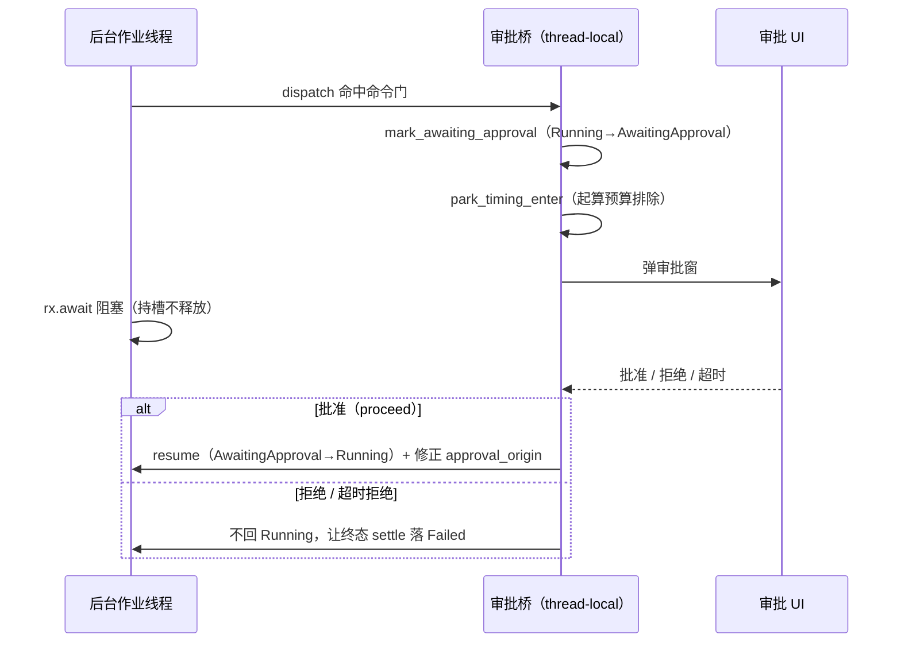
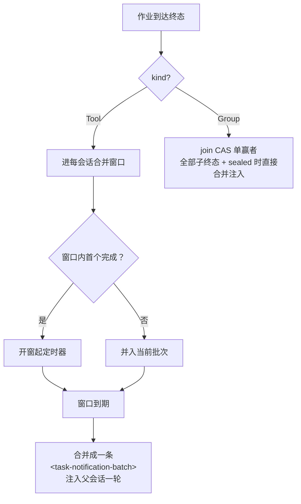

# 后台任务（Background Jobs）系统架构

> 返回 [文档索引](../../README.md) | 更新时间：2026-07-23

## 核心思想

主对话是同步的：模型发起一个工具调用，这一回合就得等它返回才能继续。对于秒级返回的工具这没问题，但长跑工作——`exec` 里一次几分钟的编译、联网的 `web_search`、生成图片或音频——会把整段对话钉死在那里，用户只能干等。

后台任务子系统解决的正是这个矛盾：**把长跑工作从对话回合里剥离出去**。当一个工具被后台化，系统立即给模型返回一个合成的「已启动」结果（一个 `job_id` 加一句提示），模型可以马上继续做别的事或结束这一轮；真正的工作在一条独立的后台线程上跑；完成后，真实结果作为一条注入消息（`<task-notification>`）自动回到发起它的会话里。模型因此获得了「一边干活、一边等结果」的异步能力，而计费回合数不会因为等待而膨胀。

关键设计是**把四类看似不同的后台工作收进同一套骨架**：

- 单次异步工具调用（`exec` / `web_search` / 生图 / 生音 …）；
- 用户委派的**后台 subagent**；
- `batch_spawn` 的**批量 fan-out**（N 个子任务合并成一个结果单元）；
- Loop 的 **file / WebSocket monitor**（长寿命一次性 watcher）。

它们共享同一张表、同一个门面（`JobManager`）、同一套可观察生命周期与取消入口。区分它们的只是一个 `kind` 列——用一列枚举取代了四套平行 API。其中只有 `Tool` 类真正跑在本子系统的执行器上；另外三类的执行真相分别归属各自的子系统，本表只承载它们的**状态投影与协调**（详见[跨子系统关系](#跨子系统关系)）。

模型主动查询用元工具 `job_status`；面向用户本人的控制面（Tauri / HTTP）读只读快照喂前端面板。

## 一个不得不背的命名包袱

这个子系统的名字在不同层面故意长得不一样，诊断时容易踩坑，先记住这张对照表：

| 场景 | 标识 |
|------|------|
| Rust 模块名 / 日志 `category` | `async_jobs` |
| DB 文件名 / 表名 | `background_jobs` |
| EventBus 生命周期事件前缀 | `job:*` |
| 统一取消入口的 kind 名 | `RuntimeTaskKind::AsyncJob` |

也就是说：按日志排查时 grep `category='async_jobs'`，但探查数据库要看 `background_jobs` 表；监听 UI 事件要订阅 `job:created` / `job:updated` 一类。这套分裂是历史沿革，不要试图统一。

## 架构：一张表 + 一个门面

所有触发入口最终都汇入 `JobManager` 这个零尺寸门面，由它统一 spawn / cancel / list / 快照 / 重放 / 调度。内部再拆成若干职责单一的模块，最终落到一张 `background_jobs.db` 表和一个 spool 目录。

模块职责一览：

| 文件 | 职责 |
|------|------|
| [`async_jobs/mod.rs`](../../../crates/ha-core/src/async_jobs/mod.rs) | 模块入口、全局静态（DB / 调度器 gate）、权威 `cancel_job_with_outcome`、兼容 `cancel_job`、`replay_pending_jobs`（重启重放） |
| [`async_jobs/manager.rs`](../../../crates/ha-core/src/async_jobs/manager.rs) | `JobManager` 零尺寸门面：spawn / cancel / list / 快照 / 重放 / 调度 / Group / Subagent 投影 / Monitor |
| [`async_jobs/types.rs`](../../../crates/ha-core/src/async_jobs/types.rs) | `JobKind` / `JobStatus` / `JobOrigin` / `BackgroundJob` / `BackgroundJobSnapshot` |
| [`async_jobs/error.rs`](../../../crates/ha-core/src/async_jobs/error.rs) | `JobError` 四变体 + `to_status()` + 注入文案 |
| [`async_jobs/db.rs`](../../../crates/ha-core/src/async_jobs/db.rs) | `JobsDB`：表 DDL、守卫式状态转移、投影 / Group / spool / 重放 / purge 查询 |
| [`async_jobs/spawn.rs`](../../../crates/ha-core/src/async_jobs/spawn.rs) | spawn 两路 + 执行器 + `run_tool_with_retry` + `finalize_job` + 调度器 |
| [`async_jobs/slots.rs`](../../../crates/ha-core/src/async_jobs/slots.rs) | `SlotManager` 两层配额 + 有界队列 + RAII 预留 + 公平调度 |
| [`async_jobs/retry.rs`](../../../crates/ha-core/src/async_jobs/retry.rs) | 纯策略 `decide()` + `is_retry_eligible` 代码级白名单 |
| [`async_jobs/approval_bridge.rs`](../../../crates/ha-core/src/async_jobs/approval_bridge.rs) | 后台执行审批桥（thread-local park / resume + 预算排除） |
| [`async_jobs/approval_projection_watcher.rs`](../../../crates/ha-core/src/async_jobs/approval_projection_watcher.rs) | 给后台 subagent 内层审批补投影 label 的 EventBus watcher |
| [`async_jobs/injection.rs`](../../../crates/ha-core/src/async_jobs/injection.rs) | 完成注入 + 合并窗口 + 防双注入 + 逐 job 恰好一次 |
| [`async_jobs/output_tail.rs`](../../../crates/ha-core/src/async_jobs/output_tail.rs) | 运行中 `exec` 输出的有界 ring |
| [`async_jobs/events.rs`](../../../crates/ha-core/src/async_jobs/events.rs) | `job:*` 事件 helper |
| [`async_jobs/wait.rs`](../../../crates/ha-core/src/async_jobs/wait.rs) | `job_status` 短便利等待 / 唤醒 |
| [`async_jobs/cancel.rs`](../../../crates/ha-core/src/async_jobs/cancel.rs) | 进程内 `CancellationToken` 注册表（尽力而为，DB 才是持久真相） |
| [`async_jobs/retention.rs`](../../../crates/ha-core/src/async_jobs/retention.rs) | 终态行按龄 GC + spool 孤儿清理 |

## 四类任务（`JobKind`）

| kind | 含义 | 执行真相 |
|------|------|---------|
| `Tool` | 单次后台化工具调用（默认；解析未知 / 旧值回落到 `Tool`） | **本子系统**（唯一真正跑在执行器上的类型） |
| `Subagent` | 用户委派的后台 subagent 在本表里的**单向状态投影** | `subagent_runs` |
| `Group` | `batch_spawn` fan-out 的 join 协调行，关联 N 个子投影、合并注入一轮 | `subagent_runs`（各子） |
| `Monitor` | Loop file / WebSocket 一次性 watcher 的可观察投影 | `loop_watches` + 进程内 handle |

`Subagent` / `Group` / `Monitor` 只借用这张表来做统一的状态展示与取消协调，它们的正文（task / result / error / watch spec）从不复制进本表，也从不由本表反写回去。

## 任务的一生

### Spawn：两条进入后台的路

后台化有两种触发方式，行为不同：

| 路径 | 触发 | 行为 |
|------|------|------|
| **显式后台** | `run_in_background: true`，或 agent `always-background` 策略 | 预分配 `job_id`、注册取消 token、落行、尝试占槽；占到就跑，占不到就入队（状态 `Queued`，不是拒绝）。无论如何**立即**返回合成的「已启动」结果，绝不内联真实结果 |
| **自动转后台** | 同步调用的 async-capable 工具超过 `auto_background_secs` 预算 | 工具在独立 OS 线程上跑，主线程按预算计时。预算内完成→内联返回真实结果；超预算→落行、**无条件强占**一个槽（任务已经在跑，既不排队也不拒绝）、返回合成结果，worker 自行 finalize |

合成的「已启动」结果是一段固定形状的 JSON：`{job_id, status:"started", tool, origin, hint}`，其中 `hint` 按来源给模型不同的行为建议（继续别的工作、或结束回合等注入，别急着轮询 `job_status`）。

哪些工具能进这条池子，由工具定义里的 `BackgroundPolicy` 决定：

- **`GenericJob`**（可后台化，进本池）：`exec` / `browser` / `web_search` / `image_generate` / `audio_generate` / `app_update`。
- **`SelfManaged`**（自带 durable handle，禁止进本池）：`subagent` / `acp_spawn` / `workflow` / `team`。它们直接返回原生句柄，若也进本池就会形成双层 job。

**`exec` 的兼容收敛**：普通长跑 `exec` 统一走 `async_jobs`。当 `exec(background=true)` 或 `exec(yield_ms=...)` 出现在「异步工具开启且 agent 未禁用后台」的上下文里，执行入口会把它兼容迁移为 `run_in_background=true`、剥掉旧的 process flag，让 `JobManager` 持有唯一的后台生命周期。只有异步工具关闭、或 agent 明确 never-background 等兼容场景才继续返回 process 会话句柄——这些 process 会话退出时走 `<process-notification>`，不冒充 async job。

### 执行

每个后台工具作业跑在**一条 OS 线程 + current-thread tokio runtime** 上（工具 future 不要求 `Send`，与 subagent 注入同构）。这条线程持有一个 RAII 槽位预留，直到作业到达终态——任何退出路径下预留被 Drop，都会释放槽位并唤醒调度器。

线程内的执行序：装审批桥 → 起跨进程取消 watcher → 跑带重试的工具循环 → finalize。工具循环里两个关键点：

- 工具 future 与取消 token、可选的 `max_secs` 预算定时器一起 `select!`，返回 typed 的 `JobError`；
- **审批等待被移出预算**：模型停在审批门上的时间不计入 `max_job_secs` / `auto_background_secs`，否则「等人点批准」会白白吃掉执行预算。

### Finalize 与状态机

`finalize_job` 是终态收尾：持久化结果或错误（超过 `inline_result_bytes`=4KB 的输出，预览保留头 2/3 + 尾 1/3，全文 spool 到盘；无痕作业跳过 spool）→ 守卫式写终态 → 触发终态 hook → 清取消 token 与输出 ring → 入队完成注入。

状态转移全部是**守卫式**的——每个写操作都带 `WHERE status IN (...)`，让并发的 finalize 竞争安全、迟到的 runner 结果被静默丢弃：

非终态四个：`Queued`（等槽）、`Running`（执行中）、`AwaitingApproval`（停在审批门、暂不计预算）、`Cancelling`（已发取消信号、future 收尾中）。终态五个：`Completed` / `Failed` / `Interrupted`（重启幸存者）/ `TimedOut` / `Cancelled`。

守卫要点（都由 `db.rs` 的 SQL `WHERE` 兜底）：

- `mark_running` 仅 `Queued→Running`；
- `mark_awaiting_approval` 仅 `Running→AwaitingApproval`；`resume_from_awaiting_approval` 仅反向；
- `mark_cancelling` 与 `update_terminal` 接受 `Queued|Running|Cancelling|AwaitingApproval` 中任一 → 目标态；
- 终态字符串集合由单一常量 `TERMINAL_STATUS_SQL_LIST = ('completed','failed','interrupted','timed_out','cancelled')` 定义，purge / replay / active 过滤全部引它，非终态状态因此不落在任何 active filter 的排除集里。

### 重放：跨越重启

进程崩溃或重启后，`replay_pending_jobs` 负责收拾残局，且**只在 Primary 进程跑**——若一个 Secondary 进程执行它，会把 Primary 仍在跑的作业误标成 `Interrupted`（DB 是共享的）。它做两件事：

1. 把所有残留 `Running` 的行标成 `Interrupted`。若该行记过 `pid` 且进程仍活（例如后台 `exec` 的子进程树在崩溃后幸存），先终止整个进程组再标行——这是孤儿进程清理。
2. 对「已终态但未注入」的行逐条补投注入 + 补触发终态 hook。这条路径**不走合并窗口**（崩溃恢复各自补投、不合并）。

## 并发与配额

模型可能在多轮里连开一堆 `run_in_background`，若不设限就会线性耗尽线程和内存（每个后台作业占一条 OS 线程 + runtime）。`SlotManager` 是进程级的单例，用**两层硬配额 + 一条有界队列 + 公平调度器**把这件事管住。

- **两层准入**：`try_reserve` 同时查全局 `max_concurrent_jobs` 与每会话 `max_concurrent_jobs_per_session`，**两层都要有空位**才发放槽位；任一满则入队。两层的 `0` 都表示该层不限。
- **FIFO 公平**：只要队列非空，新 spawn 也不许插队（即使技术上有空槽），必须排在既有等待者后面。
- **队列有界**：队列钉住的是 RAM 里活着的 `ToolExecContext`，所以必须有上限。超过 `max_queued_jobs`（钳到 `[1,4096]`，`0` 钳到地板 1，**不是无限**）就硬拒绝，调用方回滚行与 token。
- **每会话公平提升**：进程级调度器在槽空时用 `pick_fair_index` 选「当前 running 最少（并列取最老）」的会话的队首，并**跳过已达每会话上限的会话**，防止某个繁忙会话产生队头阻塞。
- **RAII 释放**：槽位预留 Drop 时**必须**唤醒调度器（panic-safe），让释放的槽立刻提升下一个排队作业。
- **auto-bg 强占例外**：自动转后台的作业已经在自己的线程上跑，既不能排队也不能拒绝，所以 `reserve_forced` 无条件计数——它可能短暂让池子超出全局**及每会话** cap。换句话说，每会话 cap 约束的是新作业的**准入**，不是已在跑的 auto-detach 数量。
- **每进程各一套**：调度器与队列每进程一个，桌面与 server 各跑各的、互不协调；队列在 RAM 里，重启即失（残留作业被重放为 `Interrupted`）。这一点与 Primary-only 的重放正好相反。

**双域分治（勿合并成单一配额表）**：工具作业的池子在这里；后台 subagent 有独立的每会话排队池（默认并发 8，见 [子 Agent 系统](subagent.md)）；同轮内的并发安全工具则由工具循环自己的并发信号量约束。三者是不同资源域。另外，**结构类上限**（subagent depth / batch / turn 等）是**硬拒不排队**，只有**资源类**（并发槽满）才排队。

## 重试

重试**默认关闭**（opt-in），策略层是一个纯函数 `decide(tool, attempt, error, cfg) → Stop | Retry{backoff_ms}`，不碰 DB，可穷举单测。

- **只有 `JobError::Failed` 可重试**：`Cancelled` / `DeniedByUser` / `TimedOut` 一律 `Stop`。超时被刻意排除——每作业超时取消的是共享 token，且用光时间预算的工具很可能再次超时。
- **eligibility 是代码级白名单**，不是用户旋钮：`is_retry_eligible` 只认 `web_search` / `web_fetch`（幂等、可安全重跑）。`exec`（可能已产生半途副作用）与 `image_generate`（重跑得到不同的、重新计费的图）由设计排除。
- **为什么默认关**：可重试的多是计费供应商（`web_search` 常按次收费），作业层无法可靠区分「瞬时失败（值得重试）」和「确定性失败（重试只是白白重计费）」，所以把这个权衡交给用户主动开启。
- **退避固定不可配**：`500ms × 2^min(attempt-1, 6)`，饱和于 32s（防 typo 造成多分钟 stall）；退避期间可被作业级取消打断（返回 `Cancelled` 而非 `Stop`）。
- **上限硬钳**：`max_retry_attempts` 默认 3，`decide()` 内硬钳 ≤ 10（病态配置也不至于把计费工具重投上百次）。
- **预算是 per-attempt**：`max_job_secs` 每次执行重置计时，所以一个可重试作业的总墙钟可达 `max_job_secs × max_retry_attempts` 外加退避。**可重试工具不得注册输出尾巴 ring**（有 `debug_assert` 守；否则重投会往同一个 ring 里重复流式写）。

## 后台审批桥

显式 `run_in_background` 的普通 `exec` **不再**在后台化之前做一次同步审批（那样会把审批时间算进后台预算），命令级审批门被下沉到后台作业线程里执行。这就需要一座桥，在后台线程与审批 UI 之间转达 park / resume。

- **桥的定义在 `tools::approval`**（`tools` 层对 `async_jobs` 零依赖），runner 在执行序里注入回调闭包把它接到作业 DB 上。
- **park**：命中门 → 把行标 `AwaitingApproval`（`WHERE status='running'` 守）+ 起算预算排除 + 记 `request_id`，然后 `rx.await` 阻塞。
- **resume**：一个 Drop 兜底保证「恰好一次」（覆盖 resolve / timeout / cancel-drop 三种收场）。批准 → 回 `Running` + 修正 `approval_origin`（把 spawn 时写的占位改成真实授权方式）+ 发 `job:updated`；拒绝 / 超时拒绝 → 不回 `Running`，让终态落 `Failed`（STOP 语义经注入文本保留）。无人值守 / strict 场景仍 fail-closed 拒绝——其内层门在 `rx.await` 之前就返回，**根本不 park**。
- **parked 持槽不释放**：否则 resume 时可能无空槽而死锁；`approval_timeout_secs` 作兜底释放。作业预算 timer **排除 parked 时长**。
- **取消 parked**：`cancel_job` 立即拆掉审批弹窗（掉 sender 唤醒 `rx`、命令门见到 cancellation 就不批准、弹窗立消、不用死等 5s grace）+ trip token → `Cancelled`。跨进程取消经 resume 兜底拆孤儿弹窗。
- **审批纯内存**：重启后 parked 作业按 `Interrupted` 恢复（active 集合已含 `awaiting_approval`，无需额外持久化）。
- **一处边界取舍**：如果用户同时关掉审批超时**且**把 `max_job_secs` 设为 `0`，parked 作业会一直占槽直到有人答复或取消——这是「全 timeout 关」的自选后果。

### 后台 subagent 的内层审批投影

后台 subagent 在自己的子会话里跑回合，它内层工具的审批**不经**上面这座 thread-local 桥（桥只覆盖 `kind=Tool` 的作业）。改由一个 EventBus watcher 来给投影行补 label：订阅 `approval_required`（park）/ `approval:resolved`（resume），找到对应的活跃 run，复用与 kind 无关的 `mark_awaiting_approval` / `resume_from_awaiting_approval` 在 `running ⇄ awaiting_approval` 之间翻转并发 `job:updated`。

- **红线**：这只是纯投影 label，**绝不 gate 执行**（内层审批照旧 block-and-wait，由 subagent 自己的门处理）。
- **一个坑**：两个事件的 session 字段大小写不一样——`approval_required.session_id`（snake）vs `approval:resolved.sessionId`（camel），watcher 两者都认。
- 非 subagent 的审批（前台、或后台 `exec`——它们带的是**父**会话）、未投影的 internal / incognito run，全部 fall-through no-op；status 的 `WHERE` 守卫让终态投影与重复事件安全。

## 运行中输出尾巴

后台 `exec` 作业（显式与 auto-background 两路）会把 stdout/stderr 实时喂进一个**进程本地、有界**的 ring，好让 `job_status(action:status)` 对一个还在跑的作业返回最新输出（判断它是「还在干活」还是「卡住了」），而不必等它完成。

- **加法式、仅 `exec`**：只有当作业注册了输出尾巴（`exec` + 非无痕）才走；前台同步 `exec` 不动；**无痕永不注册**（与 spool 同闭）。
- **cap 起跑时快照**：ring 大小在作业起跑时按 `output_tail_bytes`（读时钳 `[256, 1MB]`，默认 8KB，`0` 钳到地板 256）取一次，运行中改配置不影响在跑的 ring。
- **进程本地**：不跨进程；作业 finalize / 取消 / 清理时移除。

## 完成注入与合并窗口

工具作业到达终态后，`enqueue_injection` 把这次完成缓冲进一个**每会话**的合并窗口：`completion_merge_window_secs`（默认 3，`0`=关、立即注入）内在同一会话完成的多个作业，会合并成**一条** `<task-notification-batch>` 一轮注入——避免「鼓励后台化」退化成「刷计费回合」。首个完成开窗起定时器，截止前到达的并入批次。

- **恰好一次 + 防双注入**：两层 ghost-turn 闸（注入前查父会话仍存在 + 注入执行处再兜一层；瞬时查询出错按放行、不丢真作业）；进程内一个 dispatching 集合逐 job claim / release；只有真正落地（成功注入）才逐行标 `injected` 恰好一次。
- **崩溃恢复**：合并窗口是纯内存的 live-path，崩溃则表现为「已终态但未注入」，重启由重放各自补投（不丢、不合并）。
- **Group 是预合并特例**：`kind=Group` 不进合并窗口，由 join 的单赢 CAS 在全部子终态 + sealed 时直接发一条合并注入。
- **空闲门超时不丢弃**：注入的空闲门若超时，重排队待会话空闲再试（与 subagent 注入共用机制，见 [子 Agent 系统](subagent.md)）。
- **回投 IM / cron**：若父会话 attach 了 IM chat 或本身是 cron 会话，注入结果按其回复模式 / 投递目标回投（见 [IM Channel](../integration/im-channel.md)）。
- **桌面通知**：`notification.notifyOnBackgroundJobComplete`（默认开，受 `notification.enabled` 门控）在后台作业完成 / 失败 / 超时时弹桌面通知。

## 生命周期事件

所有后台任务的生命周期都经 [`async_jobs::events`](../../../crates/ha-core/src/async_jobs/events.rs) 发到统一的 `job:*` 命名空间：`job:created` / `job:updated` / `job:progress` / `job:completed`，外加 `job:mark_injected_failed`。每个事件带 `job_id` / `kind`（`tool`|`group`|`monitor`）/ `tool` / `status` / `session_id`。`progress` 由 Group 上报「N/M 子完成」，知识导入这类 Tool 作业也上报「N/M 项完成」。这些是尽力而为的 UI 信号，正确性不依赖它们。

`kind=Subagent` 的作业沿用更丰富的 `subagent:*` 事件流，不在这里双发；面板在展示时合并两路。后台任务事件统一从 `events` helper 发出，不散落在各处的 `bus.emit`。

## 模型面：`job_status` 工具

模型用 `job_status` 这个元工具观察和操作自己的后台作业，`action ∈ status | list | wait | cancel | result`：

- `list`：枚举本会话在途作业；
- `status`：单作业状态（跑着的 `exec` 附带 `output_tail`）；
- `result`：取已完成作业的结果；
- `cancel(id)`：跨进程取消；
- `wait{ids?, mode, timeout}`：**短便利**同步——默认等 5s、硬钳 10s 上限（`max_job_secs=0` 时回落到 `job_status_max_wait_secs`，均钳 ≥1s），超时返回 `still_running` 而不是长阻塞。

**模型面严格按当前会话作用域**：`list` 的枚举、`status/result` 的单项读取、`wait` 的每个显式 id，以及 `cancel` 的目标都必须满足 `background_jobs.session_id == ToolExecContext.session_id`。不存在、跨会话和 `session_id IS NULL` 的 ownerless/system 行统一 fail closed，并返回不泄露真实 owner、状态、输出尾或结果路径的通用错误。面向用户本人的 Owner 面板仍走下节的受信任接口，不复用这层模型 scope。

`cancel` 的结构化结果把 `disposition=requested | already_terminal | refused`、请求是否被接受和 `final_status` 分开。对非 Group 作业，`requested` 只表示请求在行仍 active 时被接受，不是取消终态的 CAS；runner 看到 flag 前仍可能自然完成。只有 Group 使用取消与完成互斥的终态单赢家。只有返回明确终态或后续真相源进入终态，UI/模型才可宣称取消完成。Async Job 没有可恢复调用栈；取消后若仍需工作，必须显式重新执行原工具，不能称为 resume。

一个正确性细节：`finalize_job` 必须在写终态 commit **之后**才唤醒 waiter，这样被唤醒者重新检查时一定能看到终态行。

**长 fan-out 等齐的正道是注入而不是 `wait`**——`batch_spawn` 的 Group 等齐后会自动合并注入一轮，比反复 `wait` 更省。

## 面向用户本人的面板与端点

面向用户本人的控制面是本机 / API key 信任的，看得到会话的全部作业、不经过模型工具那套 scope 收窄（唯一过滤是 session id：一个会话看自己的作业）。它读 `JobManager::list_session_snapshots(session)` / `get_job_snapshot(id)`，返回 `BackgroundJobSnapshot`。

- **Tauri 命令**：`list_background_jobs` / `get_background_job`。
- **HTTP 端点**：`GET /api/sessions/{id}/background-jobs`、`GET /api/background-jobs/{id}`（Bearer 鉴权）。
- **Group 子投影折叠进 Group 行**：查询层排除 `(kind=Subagent AND group_id IS NOT NULL)`，面板只显 Group 的进度摘要、不展开 N 个子行；客户端再叠一层防御过滤。
- 统一 Activity 投影另有一个限额版 `list_active_by_session_limited(session, 50)`，只服务只读状态聚合；会话删除、取消与 Goal Runner 仍用无界的 `list_active_by_session`，不能因为 UI 限额漏掉任何 live 作业。
- 前端镜像类型在 `src/types/background-jobs.ts`，`useBackgroundJobs` 单订阅喂头部徽标 / 独立面板 / 工作台区块。
- **展开箭头只在真有详情时给**：`kind=Subagent` 的投影不持正文（task / result 只在 `subagent_runs`），故其行**永不**提供展开——入口是「查看子会话」按钮；进度条、输出尾、结果预览 / 路径与在跑的非 subagent 作业才渲染切换器，否则点了展开只会得到一个空壳。
- **取消统一复用** `cancel_runtime_task(kind=AsyncJob)`（见 [`runtime_tasks.rs`](../../../crates/ha-core/src/runtime_tasks.rs)），不新增取消端点。

## 无痕（incognito）

无痕会话的后台作业在磁盘上不留痕：

- args 落库为占位 `{"_incognito_redacted":true}`（live dispatch 仍收到真实 args）；`persist_result` 不写 spool；快照的 `result_preview` 脱敏。
- 输出尾巴永不注册。
- **关闭即焚**：会话 purge 时删本会话全部作业行 + spool + 从调度队列丢弃 queued 作业 + 从合并窗口丢弃缓冲注入。队列与合并窗口都会钉住 RAM 里的敏感 ctx，所以这一步不是可选的收尾。

## 取消、孤儿与保留

- **取消**：模型控制面的权威入口是 `JobManager::cancel_with_outcome` → `cancel_job_with_outcome`，由执行取消的同一路径返回 `requested / already_terminal / refused`；`cancel_job` 只为内部清理与 legacy 调用方保留、仅返回最新行，不能用于新模型控制路径推断请求是否获接受。DB 状态是持久真相：普通 Tool 作业先写跨进程 `cancel_requested` flag（另一个进程的 runner 轮询时能观测到），再 trip 进程内 token；仍在队列里的作业直接从队列拉出并 finalize（释放它钉住的 ctx，对无痕焚毁很重要），跑着的标 `Cancelling`，parked 的拆审批弹窗，找不到 runner 的补触发终态 hook。进程内 token 注册表只是尽力而为。其他 kind 的取消分流不同：`Subagent` 路由到 subagent 取消注册表（不跑工具作业的 hook / 注入）；`Group` 的 `cancel_requested=1 + status=cancelled + completed_at/error` 必须由 `claim_group_cancel` **一条条件 UPDATE** 同时写入，与 join 的 `claim_group_completion` 竞争单赢，只有取消 CAS 赢者才继续取消子并返回 `requested`，完成 CAS 先赢则返回 `already_terminal` 且不碰子任务；`Monitor` 交给 Loop 控制面结算。
- **孤儿进程**：`exec` 作业落 `pid`；重启重放对残留 running 检查 pid，仍活则终止整个进程组。
- **保留**：每日一次 + 启动一次的清扫。按龄删终态行（`completed_at < cutoff`，仅终态）+ spool；再清 spool 孤儿（无行引用 + mtime 超过孤儿 grace），单趟最多 1 万个（防病态目录饿死线程池，跑在 blocking pool 上）。**当 `retention_secs` 与 `orphan_grace_secs` 同时为 `0` 时整个清扫任务跳过。**

## 数据模型参考

### `background_jobs` 表（21 列）

单表、纯可重建缓存。列：

`job_id`(PK) · `session_id` · `agent_id` · `tool_name` · `tool_call_id` · `args_json`（无痕为脱敏占位）· `status` · `result_preview` · `result_path`（spool 路径）· `error` · `created_at` · `completed_at` · `injected`(bool) · `origin` · `approval_origin` · `incognito`(bool) · `pid`（孤儿追踪）· `cancel_requested`(bool，跨进程) · `kind` · `subagent_run_id`（Subagent 投影 FK）· `group_id`（Group 归属）。

索引：`(session_id, status)` · `(status, injected)` · `(subagent_run_id)` · `(group_id)`。

**Schema 是纯可重建缓存**：升级时探针 `SELECT group_id FROM background_jobs`（最新列），失败即整表 DROP 重建——没有迁移路径，因为这张表随时可重建、drop 零成本；解析到未知 `status` / `kind` 回落默认。

### `JobStatus` 的终态 hook 语义

终态行会触发 PostToolUse 类 hook，映射为 `(is_error, is_interrupt)`：`Completed` → 成功；`Cancelled` / `Interrupted` → 中断型失败（两者皆真）；其余（`Failed` / `TimedOut`）→ 普通失败。

### `JobOrigin`（为何后台化）vs `approval_origin`（如何被授权）

两者是不同的列，别混：

- **`origin`**（`JobOrigin`）：`Explicit`（`run_in_background:true`）/ `PolicyForced`（agent 强制后台）/ `AutoBackgrounded`（超同步预算自动转后台）。回答「这个作业为什么进了后台」。
- **`approval_origin`**（`ApprovalOrigin`，7 变体）：`user` / `timeout_proceed` / `unattended_proceed` / `yolo` / `auto_approve` / `external_pre_approved` / `policy_allow`。回答「这次执行是怎么被授权的」，做审计用。spawn 时写占位（那时命令门还没跑），审批放行时经 `set_approval_origin` 修正，终态冻结。定义在 [`tool_defs/context.rs`](../../../crates/ha-core/src/tool_defs/context.rs)。

### `JobError`

四变体：`Cancelled`（token 触发）/ `TimedOut{max_secs}` / `DeniedByUser{rejection}`（保留 `ToolRejection` 以承载 STOP 语义）/ `Failed{message}`。`to_status()` 映射：`Cancelled→Cancelled`、`TimedOut→TimedOut`、`DeniedByUser|Failed→Failed`。只有 `Failed` 能进重试路径。

### `BackgroundJobSnapshot`（面向用户本人的展示型）

camelCase、只读，与 model-facing 的 JSON 物理分离，不带任何引导模型的 hint：`jobId` · `kind` · `status` · `tool`（原始工具名）· `label`（展示用短标签）· `origin` · `sessionId` · 时间戳 · `error` · `resultPreview`（无痕脱敏）· Group 专属的 `childCount` / `childrenTerminal` / `childrenCompleted` / `childrenFailed` · `subagentRunId` · `outputTail`（仅单查一个还在跑的 `exec` 时填，列表 roster 不带以免 N × 8KB 撑爆）。

## 配置（`AsyncToolsConfig`）

category `async_tools`，风险级 **MEDIUM**，GUI 走专用 `save_async_tools_config`（详见 [配置系统](../infra/config-system.md) / [设置约定](../../../AGENTS.md#设置约定)）。默认值的唯一来源是 `impl Default`（与各 `default_async_*()` 对齐，有单测断言）。

| 字段（snake / JSON camel） | 默认 | 钳 / `0` 语义 |
|---|---|---|
| `enabled` | `true` | 关掉则一切工具都同步跑 |
| `auto_background_secs` | `0`（关） | `>0` = 同步预算，超则自动转后台 |
| `max_job_secs` | `0`（不限） | **per-attempt** 墙钟预算 |
| `inline_result_bytes` | `4096` | 内联预览预算，超出 spool 到盘 |
| `retention_secs` | 30 天 | `0` = 关保留 |
| `orphan_grace_secs` | 24 小时 | spool 孤儿宽限 |
| `job_status_max_wait_secs` | `7200` | 仅 `max_job_secs=0` 时作 `wait` 上限回落值 |
| `max_concurrent_jobs` | `clamp(逻辑核数-2, 4, 16)` | **`0` = 真不限** |
| `max_concurrent_jobs_per_session` | `(全局×3/4).max(2)`，落在 `[3,12]` | **`0` = 真不限**；恒 < 全局 |
| `retry_enabled` | `false` | opt-in |
| `max_retry_attempts` | `3` | 硬钳 `[1,10]` |
| `completion_merge_window_secs` | `3` | `0` = 关（立即注入） |
| `output_tail_bytes` | `8192` | 钳 `[256, 1MB]`，**`0` → 地板 256** |
| `max_queued_jobs` | `256` | 钳 `[1, 4096]`，**`0` → 地板 1（非无限）** |
| `wakeup_max_delay_secs` | `86400` | 钳 `[10s, 7d]`（属 `schedule_wakeup`） |
| `wakeup_max_pending_per_session` | `5` | 钳 `[1, 100]`（属 `schedule_wakeup`） |

**`0` 语义红线**：只有 `max_concurrent_jobs` / `max_concurrent_jobs_per_session` 的 `0` 表示真不限；其余 bounded-resource 旁钮（`output_tail_bytes` / `max_queued_jobs` / `wakeup_*`）的 `0` 一律钳到地板，**绝非无限**。`wakeup` 的 10s 下限是固定 busy-poll 地板、不可配。

## 跨子系统关系

本子系统只承载后三类任务的**状态投影与协调**，它们的执行真相各归各家：

- **Loop Monitor 投影**：Loop 的 file / WebSocket 一次性 watcher 经 `JobManager::register_monitor` 建一条 `kind=Monitor` 行，`tool_name` 记 `loop_monitor:{adapter}`、`tool_call_id` 记 watch id、`args_json` 只存有界 spec、`injected=true`。Monitor 不走工具执行器、重试、完成注入或普通工具槽；watcher 在 change / message / close / failure / timeout / cancel 时调 `finish_monitor` 结算。执行真相仍在 `loop_watches` 和进程内 generation handle。详见 [Loop 控制平面](loop.md)。

- **后台 subagent 投影（单向）**：用户委派的后台 subagent run 建一条 `kind=Subagent`、带 `subagent_run_id` FK、`args_json="{}"`、`injected=true` 的投影，与工具作业共享 `job_status` / 面板 / 取消。`subagent_runs` 是执行真相源（task / result / error 只在那），投影只承载 status 与生命周期，**绝不持有正文、绝不反写**。状态同步走单一 choke point `SessionDB::update_subagent_status` → `JobManager::sync_subagent_projection`；模型取消经 `JobManager::cancel_with_outcome` 的 Subagent 分支路由到 `subagent::request_cancel_run`，兼容 `cancel_job` 只服务不需要 disposition 的内部调用。详见 [子 Agent 系统](subagent.md)。

- **Group fan-out**：`batch_spawn` 建一条 `kind=Group` 协调行（`group_id` 关联子投影、`args_json={"sealed":bool}`、`injected=true`），N 个子携 `group_id` 抑制个体注入；全部子终态 + sealed 时由单赢 CAS 发一条合并 `<subagent-result>`（join 真相读 `subagent_runs`，group 行不持正文）。普通工具作业才用 `<task-notification>` / `<task-notification-batch>`。详见 [子 Agent 系统](subagent.md)。

- **`schedule_wakeup`**：`wakeup_max_delay_secs` / `wakeup_max_pending_per_session` 虽然落在 `AsyncToolsConfig` 里，语义上属于一次性自我唤醒子系统（`crate::wakeup` + `wakeups.db`），与后台作业不复用入口。详见 [工具系统](../core/tool-system.md)。

- **统一取消**：所有 runtime 任务的取消都走 `cancel_runtime_task`（`RuntimeTaskKind`），后台作业是其中的 `AsyncJob` kind。

## 诊断

- 生命周期日志 `category='async_jobs'`（**不是** `background_jobs`）；EventBus 用 `job:*`；审批投影 watcher 的滞后日志 source 为 `approval_projection`。
- DB 文件 `~/.hope-agent/background_jobs.db`（表 `background_jobs`）；结果 spool 在 `~/.hope-agent/background_jobs/`（`paths::background_jobs_dir`，每作业一个 `{job_id}.txt`）。`~/.hope-agent/async_jobs.db` 与 `~/.hope-agent/async_jobs/` 是更早的目录，启动时尽力删除。
- stale-schema 探针是 `SELECT group_id`（最新列）；升级时旧表与 legacy `async_jobs.db` 尽力 drop（纯缓存、无迁移）。
- 子系统故障速查见 [`diagnostic-playbook.md`](../../../skills/ha-self-diagnosis/references/diagnostic-playbook.md)（命名分裂 / Group / Subagent 投影 / 排队 / 审批投影 的常见坑）。
