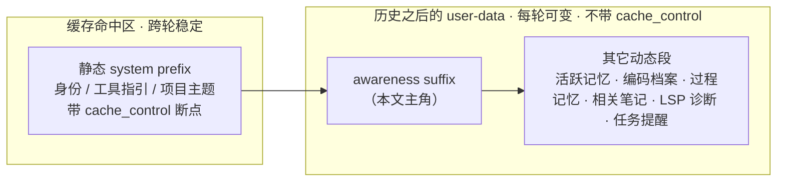
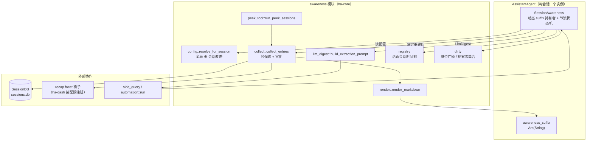
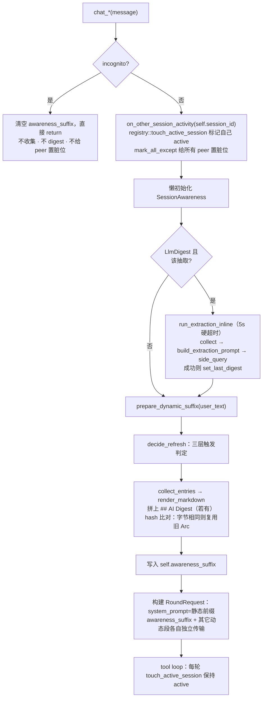
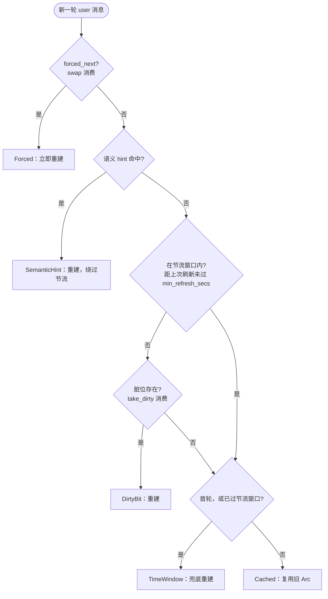
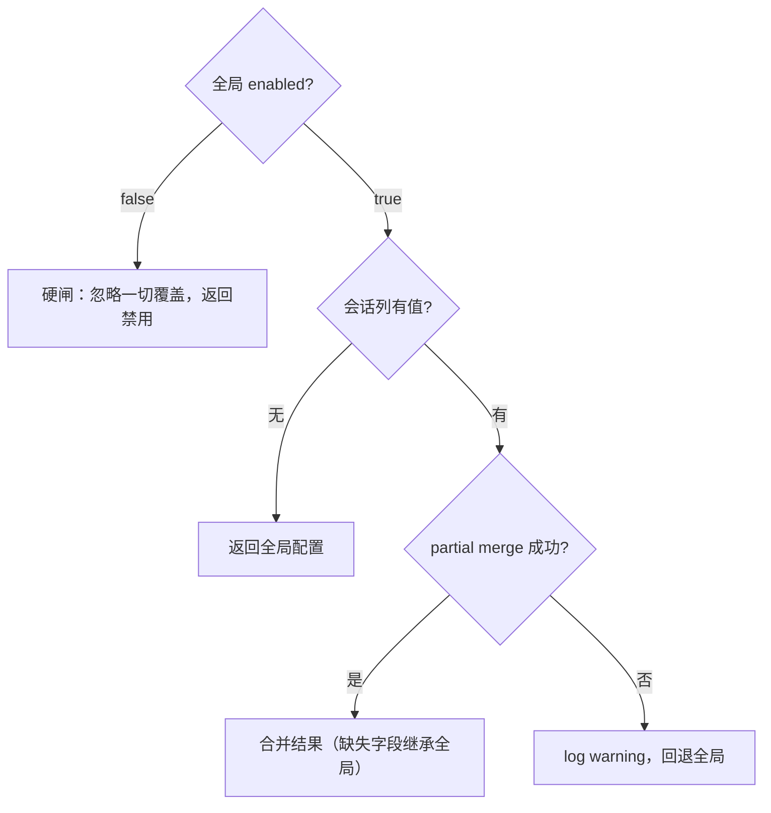

# 行为感知（Behavior Awareness）

> 源码：`crates/ha-core/src/awareness/`
> 关联：[Side Query 缓存](side-query.md) · [上下文压缩](../core/context-compact.md) · [斜杠命令](../integration/slash-commands.md) · [模型与 Agent 统一配置](../core/automation-model.md)

---

## 它解决什么问题

每个聊天会话默认是一座孤岛：Agent 在会话 A 里，对用户此刻正在会话 B、C 中做的事一无所知。于是用户一句"帮我看看**上次那个** CI 的问题"、"接着**另一个窗口**里改的那块"就会落空——那段上下文根本没进过当前会话的 prompt。

行为感知让每个会话获得一份**跨会话的实时旁白**：一小段动态 markdown，描述用户在其它并行会话里正在做什么。Agent 读到它，就能顺着"上次""之前""另一边"这类指代，接住用户脑子里那条没说完的线，也不必反复追问已经在别处交代过的背景。

关键设计约束只有一个，但贯穿全篇：**这段旁白每轮都可能变，而 system prompt 的静态前缀绝不能因此失去 prompt cache**。整个子系统的形状——独立 user-data block、hash 判重、粗粒度时间桶、三层触发节流——都是为了在"信息够新"和"缓存不作废"之间走钢丝。

### 三档模式

| 模式 | LLM 成本 | 内容 |
|---|---|---|
| `off` | 零 | 完全禁用 |
| `structured` | 零 | 从 `sessions.db` + recap facet + 内存 registry 聚合出的结构化候选列表 |
| `llm_digest` | 额外 side_query | 结构化列表 + 一段 LLM 生成的自然语言行为摘要 |

`structured` 是默认**模式**，但整个功能默认**关闭**（`enabled=false`）——用户须显式打开才会产生任何 suffix。打开后若不特意切换，就停在零成本的 `structured`。

---

## 心智模型：一条 user-data 动态上下文

发给模型的请求分成稳定 system prefix 与当轮 user-data 尾部：



静态前缀承载不随对话内容变化的东西，缓存断点打在它末尾。awareness suffix 连同其它每轮动态段一起，放在会话历史之后的 `<hope_round_data>` user message：它怎么变，都不碰前缀缓存，也不会因为“由后端生成”就获得 system authority。awareness 只是这一族动态段里的**第一段**——记忆、编码档案、笔记、诊断、任务提醒共用同一条 user-data 传输规约（顺序见下文 [Prompt Cache 安全](#prompt-cache-安全)）。

于是子系统的两条主线呼之欲出：

1. **内容线**：从哪些会话、拿哪些字段、渲染成什么样（`collect` → `render` →（可选）`llm_digest`）。
2. **节流线**：这一轮到底要不要重建 suffix，以及重建后如何保证"内容没实质变化时字节完全一致"，让缓存继续命中（`session::decide_refresh` + hash 判重 + 时间桶）。

---

## 组件地图



| 文件 | 职责 |
|---|---|
| `mod.rs` | 公开 API；注册 recap facet 查询钩子（`register_session_facet_lookup`） |
| `config.rs` | 全局 ⊕ 会话覆盖的合并/解析（wire 类型下沉 `ha-config-schema`） |
| `types.rs` | `AwarenessEntry` / `AwarenessSnapshot` / `ActivityState` / `RefreshReason` / `SessionFacetView` |
| `registry.rs` | 内存活跃会话时间戳表（`touch_active_session` / `active_since`） |
| `dirty.rs` | 脏位广播（哪些会话下一轮该刷新）+ 观察者集合 |
| `collect.rs` | 从 `SessionDB` 拉候选、按类型/时间窗过滤、facet 富化、排序 |
| `render.rs` | 把 snapshot 渲染成 markdown（含粗粒度时间桶） |
| `session.rs` | `SessionAwareness`：三层触发 + hash 判重 + digest 状态 |
| `llm_digest.rs` | 构造 LLM 抽取 prompt（约束规则）与 token 预算 |
| `peek_tool.rs` | `peek_sessions` 工具的 schema 与执行 |

facet 数据本属于 recap 子系统，而 recap 已随 `ha-dash` 独立成 crate，kernel 不反向依赖它。因此 awareness 只认识一个**函数钩子** `SessionFacetLookup`：`ha-dash` 在装配期注册 `recap::facet_view_for_session`，未注册（或某会话无 facet）时钩子返回 `None`，收集器自然走它的 fallback preview 分支。

---

## 一轮对话里发生了什么

每次 provider 的 `chat_*` 方法在组装当轮请求前，都会先跑一遍 `refresh_awareness_suffix(user_text)`。它便宜——绝大多数轮次会命中缓存直接返回旧 suffix；只有该重建时才真正干活。



几处非显然之处：

- **发起方也在广播**：当前会话每次开口，都会先调 `touch_active_session` 把自己标成 active（让别的会话把它看成 active）并给所有 peer 置脏位（让它们下一轮考虑刷新）。感知是双向的。
- **LLM 抽取是 inline 的**：`llm_digest` 模式下的抽取不是"甩到后台慢慢跑"，而是在构建 suffix **之前**同步跑一次、带 5 秒硬超时。所以摘要能落在**触发它的这一轮**里，而不是姗姗来迟到下一轮；超时也最多卡几秒。
- **suffix 挂在 agent 上**：结果存进 `AssistantAgent::awareness_suffix`（`Mutex<Option<Arc<String>>>`），后续构建请求时取用。`prompt_for_budget` 会把它和其他动态段拼进一个本地计数字符串——但那**只用于压缩预算计数**；真正发给 API 时，Awareness 位于 `<hope_round_data>` 的 user-data lane（见下文），不会获得 system/developer authority。

---

## 三层动态触发器

`SessionAwareness::decide_refresh()` 决定这一轮是重建还是复用旧 suffix。核心张力：既要在别处有动静时够灵敏，又不能每轮都重建把缓存拖垮。于是分层——高优先级信号可越过节流，低优先级信号服从节流窗口。



| 级别 | 触发条件 | 语义 |
|---|---|---|
| **Forced** | `forced_next` 标记（compaction 后 / 配置变更 / 新 digest 就绪） | 消费式读取（`swap`），无视节流；读完即清，避免陷进重建死循环 |
| **L3 语义 hint** | 当前消息命中 `semantic_hint_regex` | 用户明显在指代别处（"上次""另一个窗口"），即刻绕过节流重建 |
| **L1 脏位** | `take_dirty(session_id)` 为真 | 别的会话有活动。**只在节流窗口外消费**——窗口内不动它，留给下一轮，避免信号丢失 |
| **L2 时间窗口** | `last_refresh_at` 为空，或距上次刷新 ≥ `min_refresh_secs` | 首轮，或节流窗口已过的兜底刷新 |
| **Cached** | 以上都不满足 | 复用上次 suffix（字节完全一致，缓存继续命中） |

**默认语义 hint 正则**（可在配置里改）：

```
(?i)(上次|之前|之前那个|另一个|其它会话|其他会话|另一边|另一个窗口|另一个对话|last time|previously|earlier|another session|other session|the other (chat|session|window))
```

编译后的正则按 pattern 字符串缓存复用；正则非法时静默返回 `false`（每轮重试编译，直到用户改对为止），不会因为一条坏正则中断整轮。

---

## 候选收集与富化

`collect_entries(db, cfg, current_session_id, current_agent_id)` 从 `SessionDB` 拉出候选会话，全程零 LLM 调用：

1. **拉取**：`list_sessions_paged` 按 `updated_at DESC` 取前 `max(max_sessions × 4, 20)` 条。多拉是为了给后面的过滤留余量，避免只看最近 N 条而漏掉匹配。`same_agent_only` 开启时把 agent 过滤下推到 SQL，省得先全拉再丢。
2. **过滤**：排除自身会话 → agent 过滤（若开）→ 类型过滤（cron / channel / subagent 默认排除，保守起见只看普通会话）→ `lookback_hours` 时间窗。
3. **活跃标记**：与内存 registry 的 `active_since(now − active_window_secs)` 取交集。命中即 `Active`；否则按 age 落 `Recent`（< 1 小时）或 `Older`。
4. **facet 富化**：经 `session_facet_view(id)` 钩子读取 recap 已缓存的语义摘要（目标 / 简述 / 结果 / 目标分类四项）。钩子无结果时，退化为 `last_user_message_preview`（最近一条用户消息片段）。
5. **排序**：`Active` 优先 → `Recent` → `Older`；组内按 age 升序（更新的排前）。
6. **agent 名缓存**：进程级 `HashMap<agent_id, Option<name>>`，避免每个候选都去读磁盘上的 agent 定义。

facet 的读取值得一提：钩子按 `session_id` 逐个查，每个候选一次查询，连接在 `ha-dash` 侧惰性缓存、跨候选复用（首次成功开库后就一直握着）。只有 recap.db 打不开时，每个候选才会重试一次开库——N 个候选就是 N 次开库尝试外加 N 次锁进出。这是为了让 kernel 不认识 recap 的表结构而付的代价，属冷路径可接受。

---

## 渲染格式

模型最终看到的 suffix 长这样：

```markdown
# Cross-Session Context

The user has 3 other relevant session(s) (1 currently active). Use this to
understand references like "the thing I was working on earlier" and to avoid
re-asking for context established elsewhere. Do NOT assume actions taken there
are visible here unless the user confirms.

## Currently active
- **Refactor payment webhook** · Coder · regular · <1 min ago
  goal: migrate Stripe v1 → v2 webhook handler
  summary: ran unit tests, stuck on idempotency key

## Recent (last hour)
- **Debug CI flakiness** · Coder · regular · <5 min ago
  goal: find root of intermittent pytest failures
  preview: "又挂了，还是 test_auth_flow 那条"

## Earlier (within lookback)
- **Draft launch blog post** · Writer · regular · <4 hours ago
  goal: write Q1 launch blog post; outcome: partial

## AI Digest
- **Refactor payment webhook**（<1 min ago）: 刚让 Stripe v2 webhook 单测跑通，
  卡在幂等键实现上犹豫。**possibly same topic**。
- **Debug CI flakiness**（<5 min ago）: `test_auth_flow` 又挂一次，正加 sleep 和
  DNS log 定位竞态，未复现根因。
- **Draft launch blog post**（<4 hours ago）: 在挑发布文标题，5 个口语化候选，未决。
```

`## AI Digest` 段只在 `llm_digest` 模式且已有摘要时由 `prepare_dynamic_suffix` 追加。

**两处体积约束**：整段硬截断到 `max_chars`（默认 4000）字节，UTF-8 安全；每个字段单独截断到 120 字节。

**时间用粗粒度桶**，这是缓存能省钱的关键一环。渲染不写"45s ago"这种秒级数字，而是落进 8 档桶：`just now` / `<1 min ago` / `<5 min ago` / `<15 min ago` / `<1 hour ago` / `<4 hours ago` / `<1 day ago` / `>1 day ago`。同一桶内 age 怎么涨，渲染文本都不变——否则每轮"45s→67s"的漂移会把 hash 判重直接击穿。

---

## LLM 抽取模式（Digest）

`structured` 给的是事实清单；`llm_digest` 在其后再叠一段读起来像人话的摘要——把"标题 + 目标 + 最近几条用户消息"提炼成一句"用户现在到底在干什么"。抽取跑在当前轮内、带硬超时，绝不长时间阻塞。

**触发要三个条件同时成立**：

- `should_run_extraction()`：模式为 `LlmDigest`、无在途抽取、距上次抽取已过 `min_interval_secs`（默认 300s）。
- `claim_extraction()`：CAS 抢到在途锁，防重入。
- 候选集合 hash 变了 **或** 尚无摘要——候选没变又已有摘要就跳过，不白花一次调用。

**Prompt 结构**（`build_extraction_prompt`）：

```
[系统前导：说明这是给另一个会话生成的行为快照]

Candidate sessions:
1. **Refactor payment webhook** · agent=Coder · regular · 45s ago
   goal: migrate Stripe v1 → v2
   summary: ...
   recent user messages:
     - "单测跑通了，但 idempotency_key 那块我还是不确定"

[抽取指令：8 条强约束]

Current conversation's latest user message:
"帮我看看那个 CI 的问题"
```

**8 条约束的要点**：每条 bullet 必须含动词 + 具体名词（禁"关注/处理/working on"这类空话）；带相对时间锚点；疑似与当前对话同主题就追加字面标记 `**possibly same topic**`；证据不足写 `(insufficient info — only title known)`，绝不编造进度；每条正文控制在 60 字符内；不加任何前言/标题/收尾，只吐 bullet 列表。

**四道安全阀**：

- **5 秒硬超时**（`tokio::time::timeout`）。当配置了带 fallback 的模型链时，外层超时按候选数放大（5s ×（fallback 数 + 1）），否则链上第二个候选还没轮到就被砍，配 fallback 形同虚设。
- **`InflightGuard` Drop 兜底**：即便 panic 也释放在途锁并计一次失败。
- **连续 3 次失败清空旧摘要**：`digest_consecutive_failures` 计数，第 3 次起丢弃 stale 摘要，免得过时信息一直注入；成功一次即归零。
- **失败即回退 structured**：拿不到摘要就只渲染结构化列表，不会让整段 suffix 消失。

**模型解析**：`llmExtraction.modelOverride` 为 `None`（默认值，也是所有现存配置的状态）时，抽取复用当前 chat agent 的 `side_query`（标 purpose `awareness.extraction` 以便在用量大盘单独归桶），从而共享主对话的 prompt cache 前缀，最省。一旦显式设置模型链，就改走 `automation::run`——换来"用独立/更便宜模型"的能力，代价是放弃这份 cache 共享。这是用户主动选择的权衡，不是免费升级。详见 [模型与 Agent 统一配置](../core/automation-model.md)。

---

## Prompt Cache 安全

awareness suffix（连同其它每轮动态数据）**独立于静态 system prefix 传输**，稳定前缀先序列化，受信 run instruction 随后，历史之后再追加统一 user-data envelope。这样 suffix 每轮变化都不作废稳定 routing key，也不会被误当指令。各 provider 的具体摆放：

| Provider | 静态前缀 | Awareness 数据 | 缓存效果 |
|---|---|---|---|
| **Anthropic** | 首个 system block，带 `cache_control: ephemeral` | 历史之后的 `<hope_round_data>` user content，不带 cache marker | 稳定断点可复用；Awareness 只重读数据尾部 |
| **OpenAI Chat** | 首个 role=system message | 历史之后的一条 role=user data envelope | 自动前缀缓存仍从稳定开头匹配 |
| **OpenAI Responses** | 稳定 developer/instructions block | 历史之后的一条 role=user data envelope | routing key 不含 Awareness 正文 |
| **Codex** | `instructions` 稳定前缀 | 历史之后的一条 role=user data envelope | 不发送不受支持的公共 OpenAI cache 参数 |

动态数据的**跨 provider 统一顺序**由 `streaming_adapter::dynamic_data_suffixes` 锁定：run data → awareness → active memory → procedure memory → related notes → attached knowledge → capability catalog → user profile → environment → LSP → task/hook。Coding Profile 与 run instruction 属于另一条 trusted instruction lane。四个 adapter 都只消费这两个公共序列，不各自发明 placement。

**hash 判重收口**：每次 rebuild 后对 suffix 做 `DefaultHasher::hash` 与上次比对。相同则复用同一个 `Arc<String>`，保证 API body 字节完全一致——配合上面的粗粒度时间桶，就算实际 age 在变，只要没跨桶，suffix 就纹丝不动，缓存持续命中。

---

## 与无痕会话（Incognito）的联动

会话 `incognito=true` 时，整条 refresh 路径在入口处直接短路：

- `refresh_awareness_suffix` 第一行检查 `session_is_incognito()`，命中即清空 `awareness_suffix` 并 `return`——**不收集候选、不做 LLM digest**，也**不**为当前会话给 peer 置脏位。无痕会话既不看别人，也不被别人看见。
- 前端 `AwarenessToggle` 在无痕开启时接收 `disabled` prop 而灰化（`ChatInput` 传入 `disabled={incognitoEnabled}`），但**不改写** `sessions.awareness_config_json` 列。
- 好处：退出无痕后，原会话级 awareness 配置自动恢复，不会因短暂进无痕而丢偏好。

---

## 配置层级

### 全局配置（`AppConfig.awareness`）

存于 `config.json`，经 **设置 → 对话设置** 面板管理。

```typescript
interface AwarenessConfig {
  enabled: boolean           // 总开关（硬闸）；默认 false（功能默认关闭）
  mode: "off" | "structured" | "llm_digest"  // 默认 structured
  maxSessions: number        // 默认 6
  maxChars: number           // 默认 4000
  lookbackHours: number      // 默认 72
  activeWindowSecs: number   // 默认 120
  sameAgentOnly: boolean     // 默认 false
  excludeCron: boolean       // 默认 true（保守：只看普通会话）
  excludeChannel: boolean    // 默认 true
  excludeSubagents: boolean  // 默认 true
  previewChars: number       // 默认 200
  dynamicEnabled: boolean    // 默认 true
  minRefreshSecs: number     // 默认 20
  semanticHintRegex: string  // 可自定义
  refreshOnCompaction: boolean // 默认 true
  llmExtraction: {
    modelOverride: ModelChain | null  // null（默认）= 复用当前 agent 的 side_query（省缓存）；
                                       // 设置后走 automation::run，换独立模型、放弃 cache 共享
    minIntervalSecs: number      // 默认 300
    maxCandidates: number        // 默认 5
    digestMaxChars: number       // 默认 1200
    concurrency: number          // 默认 2
    perSessionInputChars: number // 默认 2000
    inputLookbackHours: number   // 默认 4
    fallbackOnError: boolean     // 默认 true
    reuseSideQueryCache: boolean // 默认 true
  }
}
```

### 会话级覆盖

存于 `sessions.awareness_config_json` 列（partial JSON），经输入栏 **眼睛图标** 弹出的 popover 管理。

**解析规则**（`config::resolve_for_session`）：



全局 `enabled=false` 是**硬 kill-switch**：无论会话覆盖怎么写都不生效。合并是 JSON 深合并，覆盖里显式给的字段胜出，没给的继承全局。

**UI 入口**：眼睛图标（`Eye` / `EyeOff`）在输入栏温度控件旁；全局关闭时整个按钮隐藏。覆盖状态用颜色区分：无覆盖（灰）、有覆盖（蓝）、本会话禁用（橙色 `EyeOff`）。会话级 UI 只暴露 enable/disable + mode 三态，其余高级字段走 API 或 `/awareness` 命令。

---

## peek_sessions 工具

除了每轮自动注入的 suffix，模型还能**主动**调 `peek_sessions(query?, limit?)` 实时拉一份跨会话数据——适合它自己意识到"用户在指代别处、我得看看"的时候。

- **工具层级**：Core `SessionAware` 工具（`tier = ToolTier::Core { subclass: SessionAware }`）。Core 意味着它**不可被禁用/隐藏**，始终对模型开放。
- **可见性随全局 deferred 策略而变**：schema 是**eager 注入**还是**藏在 `tool_search` 发现之后**，取决于全局 deferred-tools 模式——`Disabled` 下 eager；`Recommended` 下因不在引导期 eager 白名单里而变为 deferred（可发现、不预注入）；`Custom` 下按用户配置。所以"始终 eager"并不成立，"能力恒在、只是 schema 位置随策略挪动"才准确。
- **无需审批**：`internal=true`；**可并行**：`concurrent_safe=true`；仅前台运行。
- **尊重全局杀开关**：`enabled=false` 时直接返回 `"Behavior awareness is disabled by the user."`。
- **主动查询更宽**：显式 peek 会放开 cron/channel/subagent 的类型排除（模型是刻意在问），并先拉 `limit × 4` 条、按 query 做 title/goal/summary 子串过滤后再截到 `limit`，避免匹配项被 recency 排序挤出去。

---

## /awareness 斜杠命令

控制全局开关与模式，详见 [斜杠命令文档](../integration/slash-commands.md#awareness-子命令详解)。

| 子命令 | 效果 |
|---|---|
| 无参 / `status` | 显示全局状态 + 活跃 peer 数 |
| `on` / `off` | 全局开关，写 `config.json` |
| `mode structured` / `llm` / `off` | 切换模式 |

---

## API 端点与 Tauri 命令

| 方法 | 路径 | 说明 |
|---|---|---|
| GET | `/api/config/awareness` | 读取全局配置 |
| PUT | `/api/config/awareness` | 保存全局配置（body：`{config: {...}}`） |
| GET | `/api/sessions/{id}/awareness-config` | 读取会话级覆盖 JSON |
| PATCH | `/api/sessions/{id}/awareness-config` | 写入会话级覆盖（body：`{json: "..."}`；`{json: null}` 清除） |

Tauri 命令一一对应：`get_awareness_config` / `save_awareness_config` / `get_session_awareness_override` / `set_session_awareness_override`。写入前经 `config::validate_override` 校验 JSON 合法性。

---

## Compaction 联动

上下文压缩到 Tier 2+ 时会作废 prompt cache。既然缓存反正没了，就顺手让 awareness suffix 也重建一次，增量成本为零。`context.rs` 在 Tier 2+ 压缩后检查会话的 `refresh_on_compaction`（默认 true），为真则调 `mark_force_refresh()`。

刷新落在**下一轮** turn，而非当前轮——因为 refresh 在本轮压缩之前就已经跑过了。

---

## 进程级状态与内存管理

awareness 的跨会话协调靠几个进程级单例，都带明确的清理策略，不会无界增长：

| 单例 | 位置 | 类型 | 清理策略 |
|---|---|---|---|
| 活跃会话表 `REGISTRY` | `registry.rs` | `RwLock<HashMap<String, Instant>>` | 每次 `touch_active_session` 顺手 GC 掉早于 `max(active_window × 2, 600s)` 的条目 |
| 脏位集合 `DIRTY` | `dirty.rs` | `RwLock<HashSet<String>>` | `take_dirty` 消费即清；`unregister_observer` 一并移除 |
| 观察者集合 `OBSERVERS` | `dirty.rs` | `RwLock<HashSet<String>>` | `SessionAwareness::Drop` 时反注册 |
| agent 名缓存 `AGENT_NAME_CACHE` | `collect.rs` | `Lazy<Mutex<HashMap>>` | 进程生命周期，无淘汰（agent 数有限） |
| 语义正则缓存 `SEMANTIC_HINT_CACHE` | `session.rs` | `Lazy<Mutex<Option<(String, Regex)>>>` | 按 pattern 复用；pattern 变即重编译替换 |

recap 的 facet 库连接缓存**不在** awareness 里——它随 recap 迁到了 `ha-dash`（`FACET_DB: Mutex<Option<RecapDb>>`，惰性开库、失败下次再试），awareness 只经函数钩子取值。

`SessionAwareness` 自身随 `AssistantAgent` 生灭：`new` 时向 `OBSERVERS` 注册，`Drop` 时反注册并清掉自己的脏位，脏位集合因此不会积累已死会话。

---

## 前端组件

| 组件 | 位置 | 用途 |
|---|---|---|
| `AwarenessPanel` | `src/components/settings/AwarenessPanel.tsx` | 全局配置面板（嵌入 `ChatSettingsPanel`） |
| `AwarenessToggle` | `src/components/chat/input/AwarenessToggle.tsx` | 输入栏 per-session 覆盖弹窗 |

---

## 已知限制

- 会话级覆盖 UI 只做 enable/disable + mode 三态，高级字段须走 API 或 `/awareness` 命令。
- 语义 hint 正则编译失败时静默返回 `false`（并每轮重试编译），直到用户把正则改对。
