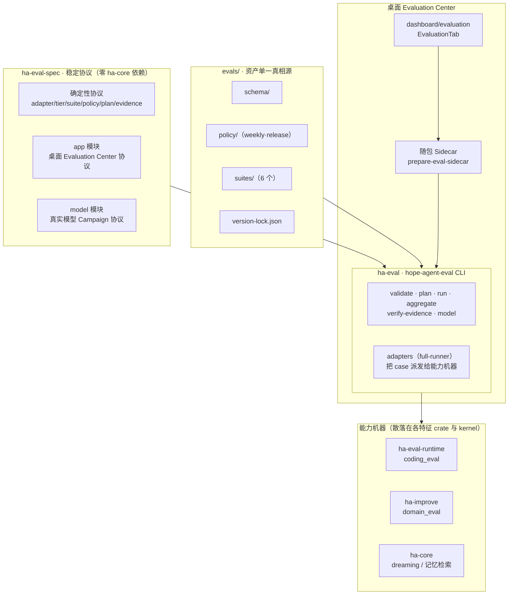
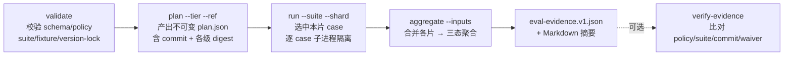
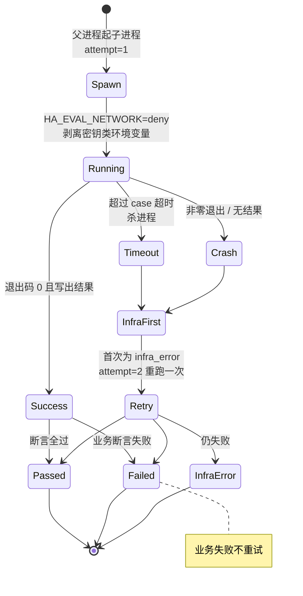
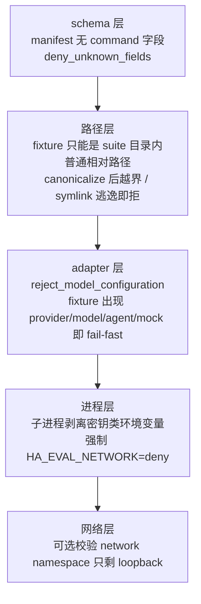

# 专项能力评测基础设施

> 状态：确定性评测轨道随包提供 CLI、桌面 Evaluation Center、本地历史与诊断证据，供本机显式运行。当前不在 GitHub Actions、PR、pre-push 或发布 workflow 中运行，也不上传、查询或校验评测证据——所有产物都是本地诊断，不构成自动发布门禁。
> 真实模型 Campaign 轨道：[`live-model-evaluation.md`](live-model-evaluation.md)

## 核心思想

Hope Agent 的功能横跨 Coding 控制平面、领域工作流、记忆 Dreaming、记忆检索等多个子系统。这些能力的正确性无法靠单元测试完全兜住：它们的行为依赖真实的会话数据库、检索排序、图谱推理等一整套运行时。但把这类整包回放塞进 `cargo test` 会带来两个问题——单测会变慢、变脆，而且一旦引入模型调用就失去确定性。

于是评测被拆成**两条物理隔离的轨道**：

| 轨道 | 是否调用模型 | 证据类型 | 用途 |
| --- | --- | --- | --- |
| **确定性专项评测**（本文） | 禁止 | `eval-evidence.v1` | 本机回放代码契约，可复现、可比对 |
| **真实模型 Campaign** | 显式确认后才调用 | `eval-model-campaign.v1` | 本机诊断任务完成率、稳定性与效率 |

两条轨道**刻意不共用** adapter 枚举与证据 schema，所以一份真实模型结果永远不可能被误当成确定性发布证据反序列化进来。本文只讲第一条轨道。

确定性轨道的关键想法是把「跑一次评测」拆成一条**不可变流水线**：

```
validate → plan → run（分片、子进程隔离）→ aggregate → （verify-evidence）
```

计划一旦生成就带上 commit、policy、suite、case 的内容 digest；执行严格按计划走；聚合出的证据可以在另一台机器上、不构造 Agent、不加载 Provider 配置的前提下被重新校验。所有断言都是确定性的：给定同一份 commit + policy + suite，输出必然一致。这让评测既能当本地回归基线，又能当发版前的人工检查项。

## 为什么它不进 CI

当前阶段没有任何远端评测编排（仓库不含 `capability-eval.yml` 之类 workflow）。这是一个刻意的边界，而非缺失：

- 完整回放需要真实运行时与较长耗时，塞进 PR 门禁会拖慢每一次提交；
- 隔离 Runner、凭据边界、artifact 保留、exact-SHA 校验等发布级要求需要单独设计，不能靠把旧 workflow 文件放回来重建。

因此 `weekly` / `release` 两个 tier、evidence 字段、waiver 与 release-eligibility 字段都作为**可复用的本地计划与协议**保留下来，但不会自动定时运行，也不会被 `release.yml` 消费。产品内的 Dashboard、面向用户本人的 owner API、Campaign、随包 Sidecar、本地历史与 CLI 都可用，结果服务于本地诊断、回归比较和人工发版判断。

## 全景



要点：协议类型集中在 `ha-eval-spec`，它不依赖 `ha-core`，所以证据可以脱离产品被独立检查。CLI 只负责调度与隔离；真正判断能力对错的**机器**留在各自的特征 crate 或 kernel 里——Coding 在 `ha-eval-runtime`，领域在 `ha-improve`，Dreaming 与记忆检索留在 `ha-core`。

## 组成

| 位置 | 职责 |
| --- | --- |
| `crates/ha-eval-spec` | 稳定、产品无关的协议：adapter、tier、suite/policy/plan/shard/evidence/waiver 类型，canonical JSON、SHA-256 digest、路径包含校验、JSON Schema 校验。含 `app`（桌面中心）与 `model`（真实模型 Campaign）两个子协议模块 |
| `crates/ha-eval` | `hope-agent-eval` CLI：生成计划、稳定分片、逐 case 子进程隔离、聚合与证据校验。`adapters` 模块（`full-runner` feature）把每个 case 派发给对应能力机器 |
| `crates/ha-eval-runtime` | Coding 能力机器 `coding_eval`（确定性 Coding adapter 驱动它）；同时承载真实模型评测 runtime |
| `crates/ha-improve` | 领域评测机器 `domain_eval`、`domain_quality` 与学习闭环 `coding_improvement` |
| `crates/ha-core` | Dreaming 黄金回放、记忆检索规模评测与上下文压缩安全契约的确定性实现（`memory::dreaming`、记忆检索及 `context_compact::eval`） |
| `evals/` | JSON Schema、policy、suite manifest、fixture 与 `version-lock.json` 的单一真相源；`evals/live/` 存真实模型资产 |
| 桌面 Evaluation Center | `src/components/dashboard/evaluation/` 面板 + 随包 Sidecar（`scripts/prepare-eval-sidecar.mjs` 以 `eval-sidecar` profile 构建 `ha-eval`），显式运行本地真实模型评测并保存进度、结果、历史、对比与趋势 |

## 六个 suite 与它们的适配器

v1 只承认六种确定性适配器，每种恰好对应一个 suite。计划器会拒绝任何策略未列出的适配器，`validate_suite` 也会拒绝非确定性适配器。

| adapter | suite | 能力域 | 分片数 | 机器所在 crate |
| --- | --- | --- | --- | --- |
| `coding_fixture_patch` | `coding-control-plane` | coding | 2 | `ha-eval-runtime` |
| `coding_gold_fixture_patch` | `coding-gold` | coding | 4 | `ha-eval-runtime` |
| `context_compaction_contract` | `context-compaction-safety` | context_compaction | 2 | `ha-core` |
| `domain_trace_fixture` | `domain-trace` | domain | 3 | `ha-improve` |
| `dreaming_golden` | `memory-dreaming` | memory | 2 | `ha-core` |
| `memory_retrieval_scale` | `memory-retrieval-scale` | memory | 1 | `ha-core` |

`weekly` 与 `release` 两个策略目前都声明这六个 suite、`minPassRate=1.0`、`mode=advisory`、`performanceBlocking=false`——即质量断言必须全过，但耗时/性能只作提示、不阻断。

## 流水线：从计划到证据



各步骤职责：

- **validate**：读 `evals/schema/*`、两个 policy、每个被引用的 suite 与其 fixture，逐一过 JSON Schema 与结构校验，重算 suite/policy digest 并与 `version-lock.json` 逐条比对。它不调用任何模型，是纯资产体检。
- **plan**：给定一个 tier 与一个 git ref，把 policy 选中的 suite 展开成 `PlannedSuite` / `PlannedCase`，为每个 case 计算内容 digest，写出不可变计划。计划里带 policy digest 与 runner digest，是后续所有步骤的锚。
- **run**：按 `i/n` 形式取一个分片，用稳定哈希从 suite 里挑出属于本片的 case，逐个在**独立子进程**里跑（见下一节），产出 `ShardResult`。
- **aggregate**：把多个分片结果合并，任一 case 为 `failed` 则聚合为 `failed`，否则任一为 `infra_error` 则 `infra_error`，否则 `passed`；同时产出人读的 Markdown 摘要。
- **verify-evidence**：把一份证据重新对齐当前 policy、suite、commit 与 waiver 校验。因为协议不依赖 `ha-core`，这一步可以在任意机器上独立完成。

```bash
# 校验 schema、policy、suite 和 fixture，不调用模型
cargo run -p ha-eval --locked -- validate

# 生成不可变计划（ref 为 40 位 commit SHA）
cargo run -p ha-eval --locked -- plan \
  --tier weekly --ref <commit-sha> --output plan.json

# 按 suite/shard 执行；所有 v1 adapter 都是确定性的，不调用模型 API
cargo run -p ha-eval --locked -- run \
  --plan plan.json --suite <id> --shard 1/2 --output shard.json

# 聚合并校验本地产物
cargo run -p ha-eval --locked -- aggregate \
  --plan plan.json --inputs <dir> \
  --output eval-evidence.v1.json --summary eval-summary.md
```

开发者也可以直接使用已构建的 `hope-agent-eval` 二进制。真实模型 Campaign 走 `hope-agent-eval model ...`，边界见 [`live-model-evaluation.md`](live-model-evaluation.md)。

## case 生命周期与重试

每个 case 都在一个全新的子进程里跑（隐藏子命令 `_run-case`）。父进程负责计时、超时时杀掉子进程，并只对**基础设施错误**自动重试一次——业务断言失败永不重试，否则会掩盖真实回归。



`infra_error`（超时、崩溃、无结果）自动重试一次；`failed`（断言失败）不重试。这条不对称是刻意的：基础设施抖动可以容忍，能力回归必须被如实记录。

## 确定性与安全契约

评测在多层上强制「不碰模型、不越权、可复现」，任何一层都能独立挡住违规资产：



逐条说明：

- **只认六种适配器**：`coding_fixture_patch`、`coding_gold_fixture_patch`、`context_compaction_contract`、`domain_trace_fixture`、`dreaming_golden`、`memory_retrieval_scale`。
- **manifest 不能携带任意 shell 命令**：suite 与 case 的类型里根本没有「命令」字段，且开启 `deny_unknown_fields`——多写字段直接反序列化失败。这是「无任意执行」的结构性保证，而非运行时黑名单。
- **fixture 路径受限**：只能是 suite 目录内的普通相对路径；`resolve_contained` 拒绝空路径、绝对路径、任何 `..` / 根组件，并对 base 与拼接后路径都 canonicalize，结果必须仍在 base 之内，从而挡掉 symlink 逃逸。
- **adapter 层再挡一次**：Coding fixture 在解析前过 `reject_model_configuration`，一旦出现 provider / providers / providerId / model / model chain / API key / endpoint 等字段，或 `mode` / `executionMode` 取 `agent`、`external_model`、`mock_provider` 这类值，就 fail-fast；领域 fixture 若意外带上 provider / model chain 也会 bail。
- **子进程剥离密钥**：起 case 前，父进程移除名字大写后以 `_API_KEY` / `_TOKEN` 结尾、或包含 `OPENAI` / `ANTHROPIC` / `PROVIDER_SECRET` 的环境变量，并强制传入 `HA_EVAL_NETWORK=deny`；确定性 adapter 见不到 deny 就直接拒跑。
- **稳定分片**：case 按 `id` 的 SHA-256 稳定哈希分片，跨机器、跨次运行落点一致。
- **digest 与版本锁**：suite / case / policy 以 canonical JSON + SHA-256 生成 digest。`evals/version-lock.json` 里已有的 `id@version` 条目**只增不改**——`validate` 会重算 digest 并比对，内容一旦变动却没有提升版本就直接报错，提示要么还原内容、要么升版本并追加新条目。修改锁后可在本机跑 `node scripts/verify-eval-version-lock.mjs --base <base-sha>` 做跨提交的 append-only 检查，并在代码审查中确认。这些校验当前都在本机执行。
- **性能只作提示**：记忆检索延迟等指标是 advisory，质量与召回正确性才是功能断言；v1 明确要求性能指标保持 advisory，不得升级为阻断条件。

### Coding fixture 里的本地验证命令

确定性 adapter 本身不调用模型 API。但某些 Coding fixture 可以**显式声明**一组经过审阅的本地项目验证命令（如构建、测试），并配一份 allowlist：只有命中 allowlist 的命令才被认可，其余记为 disallowed。这与模型的网络访问是两回事——它评测的是「Coding 控制平面是否规划出正确的验证步骤」，不涉及任何外部模型调用。

## 网络隔离的真实语义

`networkPolicy=deny` 只有在真实 OS sandbox 或 Linux network namespace 中才构成出站隔离。仅设置 `HA_EVAL_NETWORK=deny` 只是一个进程内标志，**不能证明本机已经断网**。需要真正验证隔离时，应在本机提供一个只剩 loopback 的 network namespace，并设置 `HA_EVAL_REQUIRE_NETWORK_ISOLATION=1`：Runner 会枚举 `/sys/class/net`，一旦发现 `lo` 以外的网卡就 fail-fast。该强制校验仅在 Linux 上支持，其他平台会直接报错。

## 证据的当前定位：只作本地诊断

本地可以在 dirty worktree 上运行、生成 JSON / Markdown，用于定位失败或在相同 commit、policy、suite digest 下比较功能结果。当前所有本地产物都是纯诊断：

- 不上传 GitHub Actions artifact；
- 不被 `release.yml` 查询、验证或附加到 GitHub Release；
- 不因使用 `tier=release`、clean worktree 或精确 SHA 就自动获得发布资格；
- policy 里的 advisory/enforce、waiver 与 release-eligibility 字段保留为协议兼容信息，当前不触发任何自动门禁。

发版前团队可以自行在同一 commit 上本地跑一遍确定性评测作为人工检查项，但它不阻断 tag 构建。未来若要恢复远端评测，必须通过单独的设计与配置 PR 重新建立隔离 Runner、凭据边界、artifact 保留、exact-SHA 校验与发布门禁，见 [`release-process`](../../release-process.md)。

## 编译门禁与遗留内部测试

`ha-eval` 默认启用 `full-runner`，把完整确定性 adapter 链接进来；这套 adapter 不会进入普通 `ha-core` / `ha-server` 测试。

历史上曾有一批「内部评测测试」通过 opt-in feature `eval-internal-tests` 隔离，避免回到默认 `cargo test`。这个 feature 如今横跨三个 crate 同名存在：`ha-core` 定义基座，`ha-eval-runtime` 与 `ha-improve` 各自转发到它。跑这些遗留内部测试须按所在 crate 显式打开对应 feature。

关键设计取舍是：**编译面进门禁，运行面不进**。

- **编译面**：`pnpm check:eval-internal`（对三个 crate 打开 gated feature 跑 `cargo check --tests`）由 [`.husky/pre-push`](../../../.husky/pre-push) 和 [`.github/workflows/rust.yml`](../../../.github/workflows/rust.yml) 无条件调用。改动这三个 crate 的 gated 测试后，任何编译错误都会立刻变红。
- **运行面**：刻意不 `cargo test` 这些 gated 测试。真正会「静默 ship」的失效模式是**编译不过**——gated 测试代码不参与常规构建，一处签名不匹配就能让它悄悄腐烂而门禁全绿；而编译门禁正是为堵这个而设。让它们跑起来反而会撞上下面这条已知的存量断言失败，价值不抵噪声。

这套安排不改任何 CI job 的名字，也不需要同步 ruleset 的 required checks。

**一条已知存量失败**：`ha-improve` 的 `promote_eval_candidate_refuses_existing_formal_fixture_without_overwrite`。它的测试 setup 没有在临时 workspace 里建出 `evals/suites/coding-control-plane/suite.json` 与 `evals/version-lock.json`，而 promotion plan 要求两者存在。这是长期存在的测试脚手架缺口，不是近期改动引入的回归；调试这三个 crate 的 gated 测试时遇到它可以先跳过。
