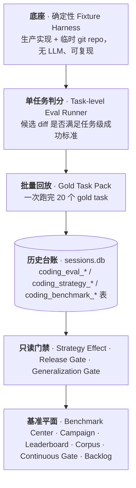
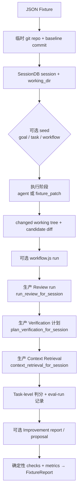
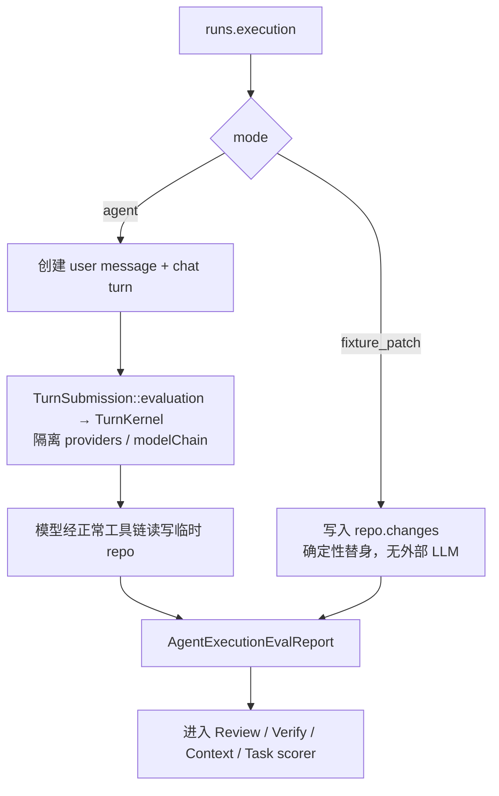
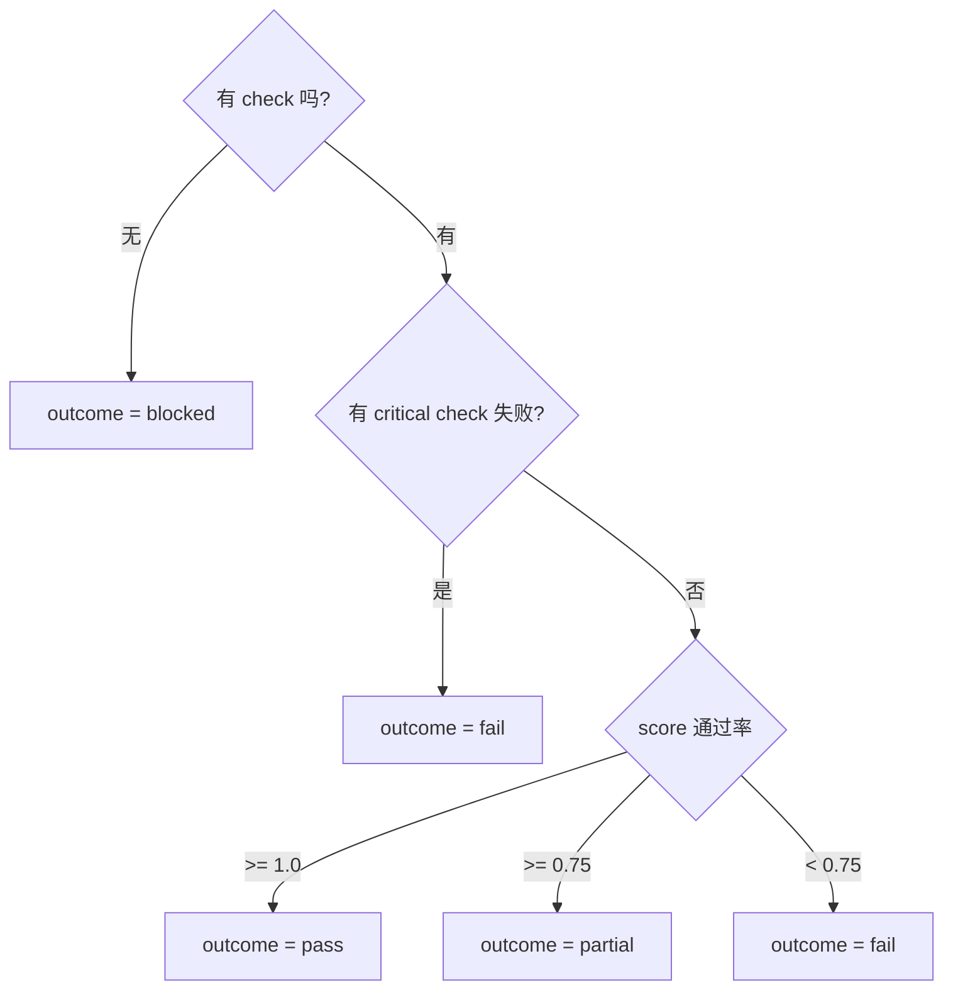
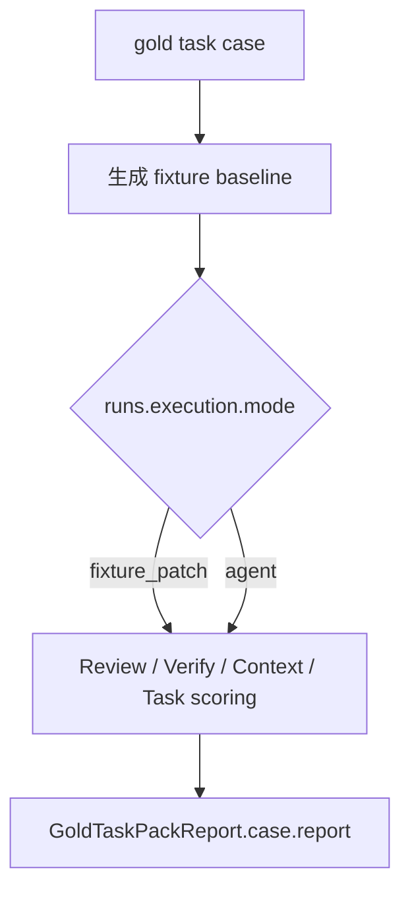
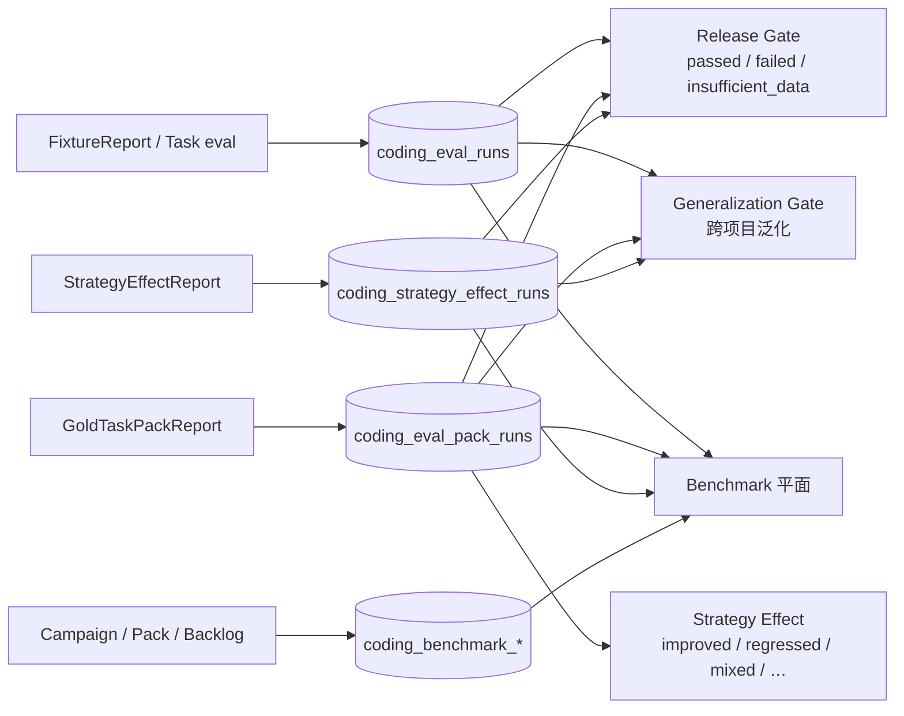

# Coding Eval 控制面评测

> 返回 [技术文档索引](../../README.md)

**关联源码**

- 契约类型（wire types）：`crates/ha-core/src/coding_eval_defs.rs`
- 确定性 harness / Gold Pack / 策略对比：`crates/ha-eval-runtime/src/coding_eval.rs`
- Durable 台账表 + 门禁与基准聚合器：`crates/ha-core/src/coding_improvement.rs`
- 持续基准门 + Improvement Proposal 聚合器：`crates/ha-improve/src/coding_improvement.rs`
- Fixture 语料：`evals/suites/coding-control-plane/fixtures/*.json`
- 专项评测 CLI：`crates/ha-eval`

---

## 核心思想

一个 coding agent 的质量有两个截然不同的问题，需要两套评测各管一边：

1. **能力问题**——模型是否真的读懂了需求、写对了代码、如实报告了验证结果？这只能靠真实模型跑真实任务来回答，天然带随机性、慢、要联网、要人看。
2. **控制面问题**——Review、Smart Verification、Context Retrieval、Goal、Task、Workflow 这些围绕模型的**编排系统**，是否能在同一个真实 session 里稳定协同？比如：一处代码改动能不能触发 review finding，这条 finding 能不能进 Goal evidence，下一步的 Context Retrieval 能不能把它召回。

第二个问题里没有一个环节依赖模型智商，却极易在重构中悄悄断裂——而且没有 CI 会报错。Coding Eval 就是为它而生的**确定性控制面评测**：

> 把生产实现的 Review / Verification / Context Retrieval / Goal / Task / Workflow 接进一个临时 git repo，用固定的 fixture 制造真实 diff，跑完整条控制面链路，再对每个环节的输出做逐项断言——**全程不需要 LLM，可复现、跑得快**。

关键设计取舍：

- **接生产实现，不接 mock。** 评审用的是真实 diff scanner 与 LSP diagnostic 聚合路径，检索用的是真实聚合器、真实 DB state、真实 local diff。评的是「胶水」而不是「替身」。
- **只做计划、不真执行。** Verification 只调 `plan_verification_for_session` 生成命令计划，绝不调 `run_verification_for_session`，因此不会真的跑 `cargo` / `pnpm`。命令执行只在 fixture 显式使用 `workflow.validate()` 时才发生。
- **确定性替身要诚实。** 无模型的 fixture 可以直接把预置答案当候选 diff，但这类运行会被明确标为 `fixture_patch` / `deterministic_mock`，绝不冒充真实 agent 成功率。

在这个确定性底座之上，还叠了一层**面向用户本人的只读聚合面**：每次运行的结果落进 durable 台账表，上面的门禁与基准把一次次运行变成「策略是真变好了还是只改了表面指标」「最近的历史够不够格发布」「不同模型在同一批任务上谁强」这类可审计判断。

---

## 两条轴的能力阶梯

整个子系统沿两条轴展开：**纵轴**是一次运行走完的完整判分链路，**横轴**是多次运行在台账里累积、被上层聚合成门禁与基准。



- **L1-L3（纵轴）**属于确定性 harness，是 `ha-eval-runtime` 里的机器；这套完整 fixture / Gold Task 不进入默认 `cargo test`，只由专项评测 CLI `ha-eval` 运行。
- **L4-L6（横轴）**属于只读聚合面：台账表与聚合逻辑落在 `ha-core` / `ha-improve`，通过面向用户本人的 Tauri / HTTP owner API 暴露，供 Dashboard 展示。它们不跑模型、不执行项目命令、不改历史，只消费 durable 数据。

下面自底向上展开。

---

## 底座：确定性 Fixture Harness

### Fixture 模型

每个 fixture 是一份 JSON（`CodingEvalFixture`），描述一次完整的控制面回归应当发生什么、应当断言什么：

| 字段 | 说明 |
| --- | --- |
| `repo.files` | baseline 文件，先写入临时 git repo 并提交，形成初始状态。 |
| `repo.changes` | baseline 之后的工作区改动，形成 local diff。 |
| `task` | 任务级 eval spec（`CodingTaskEvalSpec`）：任务 id、类型、提示词、期望/禁止行为、预期产物、允许验证命令、成功标准。 |
| `setup` | 可选 goal / task / workflow 种子，用来模拟长任务的控制面状态。 |
| `runs` | 本次要跑哪些环节：agent execution、review、verification plan、workflow、context retrieval、task eval、improvement report，以及 focus paths。 |
| `checks` | 对 execution / review / verification / workflow / context / task / improvement 的确定性断言。 |

首批 fixture 覆盖了控制面的各个协同点：

| Fixture | 覆盖目标 |
| --- | --- |
| `rust_control_plane_context` | Rust diff 触发 review finding、包级 `cargo check` 计划，并在 context 中召回 file / review / verification / goal evidence / task / workflow op。 |
| `docs_sanity_context` | docs-only diff 不应制造 review 噪音，只选择 `git diff --check`。 |
| `focused_scope_excludes_unfocused_files` | 同时存在 Rust + TS diff 时，focused review / verification 只处理指定 Rust 文件，不扫无关前端文件。 |
| `workflow_review_verify_host_apis` | workflow 内调用 `workflow.review()` / `workflow.verify()`，持久化 op、review run、verification plan，并把 Goal evidence 召回到 context。 |
| `repair_loop_blocks_with_evidence` | workflow 内 `workflow.repairLoop()` 验证失败且 attempt budget 耗尽后必须 blocked，把 validation / workflow blocked evidence 召回到 context；trend report 能识别 `repair_loop_exhausted` 并生成 draft `eval_candidate`。 |
| `profiles_ide_context_recall` | `accessibility` / `frontend` profiles 触发定向 finding，并验证 IDE context 候选、review finding 与文件上下文被召回。 |
| `improvement_proposal_to_action` | 失败 eval run 生成 `eval_candidate` proposal，并应用成 `.hope-agent/coding-improvement/eval-candidates/` 下的可复核 draft artifact。 |
| `improvement_retro_and_promotion` | workflow terminal retro 写入 report，retro recommendation 进入 proposal queue，`eval_candidate` 草稿晋升到正式 coding eval fixture 路径。 |
| `task_level_eval_runner` | 对候选 diff 做任务级判分，覆盖 changed files、required / forbidden diff、验证命令、review/context/goal 证据、eval run 记录与 improvement 消费。 |
| `agent_execution_runner_fixture_patch` | execution runner 回归：执行阶段先产出候选 diff，再进入 review / verification / context / task scoring / eval-run recording。 |

### 一次运行的数据流



关键约束（都是不读代码看不出、却决定评测语义的地方）：

- fixture repo 一律是临时目录，测试结束即销毁；`git commit` 只用于制造 baseline，绝不读取或修改真实工作区。
- verification **只出计划**：即便 workflow 内调用 `workflow.verify()` 也只生成命令列表；真正跑命令唯一入口是 fixture 显式的 `workflow.validate()`。
- review 走生产 diff scanner 与 LSP diagnostic 聚合路径，但 fixture **不启动真实 LSP**。
- context retrieval 用生产聚合器，候选来自真实 DB state 和真实 local diff。
- **没有** `runs.execution` 时，task-level runner 直接把 `repo.changes` 形成的 diff 当候选结果评估。
- **有** `runs.execution` 时，`prepare_repo` 只写 baseline commit，候选 diff 必须由执行阶段产生——避免把「已经给好答案再判分」误当成真实执行。
- `runs.task.recordEvalRun` 默认 `true`，写入 `coding_eval_runs(suite='task_level_coding_eval', source_type='coding_task_eval')`；`runs.task.evaluateGoal` 默认 `true`，判分前先刷新非 terminal goal 的 evaluator 状态。

---

## Agent Execution Runner

`runs.execution` 把「从任务 prompt 到候选结果」的执行阶段也接进同一套 harness，这样评测既能验证「给定 diff 的判分」，也能验证「模型自己产出 diff」。它有两种模式：



| mode | 说明 |
| --- | --- |
| `agent` | 真实执行模式（默认）。Runner 创建 user message + chat turn，把 fixture 的 `providers` / `modelChain` 放入只允许 Eval 来源使用的 `TurnSubmission::evaluation`，经 `TurnKernel` 执行，以临时 repo 为 session working dir。模型经正常工具链读写文件、触发审批逻辑、产生 transcript。 |
| `fixture_patch` | 确定性回归替身。Runner 在执行阶段写入 `repo.changes`，产出同样的 execution report 和 diff，再进入后续 scorer。**只**用于无外部 LLM 的 fixture，不代表真实 agent 成功率。 |

`runs.execution` 输入字段：

| 字段 | 说明 |
| --- | --- |
| `mode` | `agent` 或 `fixture_patch`，默认 `agent`。 |
| `prompt` | 可选；默认取 `fixture.task.prompt`。 |
| `agentId` | 可选；默认 `ha-main`。 |
| `providers` / `modelChain` | `agent` 模式必需。owner API 从 fixture 显式读取，**不隐式读取桌面全局 provider**。 |
| `reasoningEffort` / `compactConfig` / `extraSystemContext` | 传入 typed turn request 的执行参数；默认 reasoning 为 `none`，Eval source policy 关闭 post-turn 副作用。 |
| `autoApproveTools` / `deniedTools` | 传入 Eval submission 的工具执行约束；危险命令、保护路径、strict approval 等底层红线仍由权限系统兜底。 |

输出 `AgentExecutionEvalReport`：

| 字段 | 说明 |
| --- | --- |
| `mode` / `status` | 执行模式与 `completed` / `failed` 状态。 |
| `prompt` / `agentId` | 本次执行使用的任务提示和 agent。 |
| `turnId` | `agent` 模式创建的 chat turn；`fixture_patch` 为 `null`。 |
| `response` / `error` | TurnKernel 返回的 response 或失败原因。**执行失败不会让 API 直接 400**，而是作为 eval report 进入判分链路。 |
| `modelUsed` | 成功时使用的模型引用。 |
| `toolCalls` | 本次执行实际落库的 tool message 名称列表，用来断言模型确实调用了预期工具，而不是只在文字里描述改动。 |
| `changedFiles` / `diffBytes` | 执行结束后的 git diff 摘要。 |

`checks.execution` 可断言 mode、status、是否必须有 turn、必须/禁止改动的文件、最少 tool call 数、必需 tool call 名称、response / error 片段。`FixtureReport.metrics` 同步暴露 `execution_status`、`execution_mode`、`execution_changed_files`、`execution_tool_calls`。

**稳定的 mock 工具循环基线**（不联网但覆盖真实工具链）用本地 `wiremock` 模拟 OpenAI Responses SSE：第一轮返回 `function_call(write, { path, content })`，真实 tool loop 写入临时 repo；第二轮返回最终文本。它不访问外部模型服务，却覆盖了真实 TurnKernel、`ha-agent-runtime` round/tool driver、tool dispatch、session working dir、`messages.tool_name` 记录、diff snapshot 和 task-level scorer。Eval 的 `TurnRequest` 显式绑定隔离 `SessionDB`；session meta lookup 缺行时仍按 incognito fail-closed 处理，不回退到全局 DB。

---

## Task-level Eval Runner

任务级 runner 回答一个比控制面更靠近能力的问题：**这个候选结果是否满足任务级成功标准？** 它把人工 gold task 的 schema 接到确定性 harness——既能评估 fixture 已给出的候选，也能评估 `runs.execution` 真实 agent / fixture patch 产出的候选。

输入：

| 字段 | 说明 |
| --- | --- |
| `fixture.task` | 任务定义：`id`、`taskType`、`title`、`prompt`、`expectedBehavior`、`forbiddenBehavior`、`expectedArtifacts`、`allowedValidation`、`successCriteria`。 |
| `runs.task.recordEvalRun` | 是否把任务报告写入 `coding_eval_runs`，默认 `true`。 |
| `runs.task.evaluateGoal` | 是否在判分前刷新 Goal evaluator，默认 `true`。 |
| `checks.task` | 判分断言：期望 outcome / 最低分、必须/禁止改动文件、必须/禁止 diff 片段、必须/禁止验证命令、最大改动文件数、是否要求 review / verification / context / goal evaluation、必召回上下文。 |

输出 `CodingTaskEvalReport` 的核心是一个 outcome 判定，它对失败**不宽容**——只要有 critical check 挂掉，其它宽松 check 全过也救不回来：



`score` = 通过 check 数 / 总 check 数（保留三位小数）。报告的其余字段：

| 字段 | 说明 |
| --- | --- |
| `failureCategory` | 第一条失败 check 的 category，例如 `implementation_bug`、`validation_gap`、`scope_creep`、`context_miss`。 |
| `diff` | changed files、insertions、deletions、diff bytes。 |
| `validation` | Smart Verification 计划出的命令、命令数、allowed/disallowed 命令。 |
| `review` | 是否请求 review、finding 数、blocking finding 数。 |
| `context` | 是否请求 Context Retrieval、候选数、required context recall。 |
| `goal` | Goal 是否由 task runner 触发 evaluation、Goal state 与 evidence relation 快照。 |
| `checks` | 每条任务级 check 的 name、passed、detail、category、severity。 |

如果 `runs.execution` 存在，task report 会自动加入 `execution.completed` 这条 critical check——执行失败直接让 task outcome 失败。

report 同步进入 `FixtureReport.task` 与 `FixtureReport.metrics`（`task_outcome`、`task_score`、`task_failure_category`、`task_changed_files`、`task_constraint_violations`），写入 `coding_eval_runs` 时 status 映射为：

| Task outcome | Eval status |
| --- | --- |
| `pass` | `passed` |
| `blocked` | `blocked` |
| `partial` / `fail` | `failed` |

---

## 指标

每次运行输出的 `FixtureReport.metrics` 里，两个检索指标最能看出控制面是否漏信号：

| 指标 | 定义 | 用途 |
| --- | --- | --- |
| `context_precision` | 命中某条 critical 期望的候选数 / 返回候选总数 | 发现推荐列表是否过散 |
| `critical_context_recall` | 命中的 critical 期望数 / fixture 要求的 critical 数 | 发现关键控制面信号是否丢失 |

其余可断言维度：

| 维度 | 内容 |
| --- | --- |
| `review_findings` / `review` checks | finding 数量；expected profiles、IDE context stats、finding title/category/file 断言。 |
| `verification_commands` | verification plan 选择的命令列表。 |
| `workflow` checks | workflow run 状态、op 类型、输出、Goal evidence relation。 |
| `execution` checks | execution mode/status、turn、response/error、tool calls、执行后 changed files。 |
| `task` checks | task outcome、score、changed files、diff fragment、validation commands、review/context/goal 要求、scope / policy 违规数。 |
| `improvement` checks | trend scope、failure category、proposal kind/status、eval success rate、repair loop blocked、retro/recommendation 数、proposal apply/promote status、artifact target 断言。 |

测试失败时会打印 fixture 名、失败 check、候选或命令摘要，方便定位到底是 diff scanner、review、verification selector、goal evidence 还是 context ranking 出了问题。

---

## Gold Task Pack

单个 fixture 只测一个协同点。Gold Task Pack 把一批真实风格的 gold task 结构化成可批量回放的 registry，一次跑完覆盖多类任务。其来源文档路径记录在报告的 `sourceDoc` 字段（`docs/roadmap/coding-eval-tasks.md`），pack 标识 `phase5-gold-task-pack`。

当前 20 个自动化 case，横跨六类任务：

| 范围 | 类型 | 主题 |
| --- | --- | --- |
| `CE-BUG-001..005` | `bugfix` | tool_search parsing、Plan execution guidance、preview-by-path 鉴权、async zero 语义、Knowledge owner/agent 两侧。 |
| `CE-TEST-001..004` | `test_gap` | Plan 状态机非法转移、ToolDefinition visibility、incognito preview、workflow repair-loop 停机。 |
| `CE-FE-001..004` | `frontend_ts` | Workspace copy、loop/mode entry、FileKind fallback、PlanPanel i18n 只读文案。 |
| `CE-RUST-001..003` | `rust_logic` | ToolDefinition safety metadata、WorkflowRun trace 边界、validation selector。 |
| `CE-REV-001..002` | `review` | seeded diff review、review verifier tri-state。 |
| `CE-NAV-001..002` | `repo_navigation` | workflow module boundaries、LSP/ACP context boundaries。 |

### 列出：`GoldTaskPackSummary`

`list_coding_eval_gold_tasks` / `GET /api/coding-eval/gold-tasks` 返回 pack 概览：`packId` / `sourceDoc`、`totalCases` / `activeCases` / `automatedCases`（当前 20 / 20 / 20），以及每个 case 的 `id`、`taskType`、`status`、`automationStatus`、`fixtureName`、`expectedArtifacts`、`likelyFiles`、`allowedValidation`、`successCriteria`。

### 运行：`GoldTaskPackRunInput`

`run_coding_eval_gold_task_pack` / `POST /api/coding-eval/gold-tasks/run` 把每个自动化 case 物化成一份普通 `CodingEvalFixture` 再跑：



输入字段：

| 字段 | 说明 |
| --- | --- |
| `ids` / `statuses` / `taskTypes` | 可选筛选；默认运行所有自动化 active case。 |
| `includeUnautomated` | 是否把未自动化 case 作为 `skipped` 返回；显式指定 `ids` 时也会返回 skipped，避免静默吞掉任务。 |
| `maxTasks` | 可选上限，用于本地 smoke 或分批运行。 |
| `executionMode` | `fixture_patch`（默认）或 `agent`；传入 provider/model 或 `baselineKind="external_model"` / `mock_provider` 时默认提升为 `agent`。 |
| `providers` / `modelChain` | `agent` 模式必需；owner API 不隐式读取桌面全局 provider，调用方必须显式传入受控 provider 配置。 |
| `compactConfig` / `reasoningEffort` / `extraSystemContext` / `deniedTools` | 透传给 agent execution runner 的可选执行配置。 |
| `autoApproveTools` | 是否在 runner 中自动批准工具调用；外部基线 smoke 通常需要显式打开，避免审批挂起。 |
| `recordEvalRuns` | 是否写入 `coding_eval_runs`，默认 `true`。 |
| `recordPackRun` | 是否写入 `coding_eval_pack_runs`，默认 `true`。 |
| `label` | 可选展示标签，例如 `baseline`、`candidate`、`external smoke`。 |
| `baselineKind` | 基线类型。`fixture_patch` 默认归一为 `deterministic_mock`；`agent` 默认记录为 `external_model`。`external_model` / `mock_provider` 必须走 `agent`；`agent` 不能记录为 `deterministic_mock`。 |
| `sessionId` / `projectId` | 可选归属 scope；无 session 时仍可记录全局 / 项目级 pack run。 |
| `sourceType` / `sourceId` | 可选审计来源，默认 `gold_task_pack` / `packId`。 |
| `evaluateGoal` | 是否在 task scoring 前刷新 Goal evaluator，默认 `true`。 |

默认 `fixture_patch` 模式不访问外部模型，验证的是 task schema、候选 diff、Review / Verification / Context / Goal / Task scorer 的端到端胶水。显式传 `executionMode="agent"` + `providers` + `modelChain` 则从每个 gold task 的 prompt 创建真实 chat turn，模型必须通过工具产生 diff，再进入同一 scorer。

**基线诚实是硬约束**：`baselineKind` 必须标清 deterministic / mock / external，Dashboard 与门禁绝不把确定性替身的数字冒充成真实模型能力；`baselineKind="external_model"` 若没有 agent execution 配置会 fail-fast，不能只改标签伪装外部基线。

---

## 历史聚合层（面向用户本人的只读门禁）

L1-L3 每跑一次都往台账写一条记录。聚合层不产生新数据，只在这些 durable 记录之上做**只读推理**：全部不跑模型、不执行项目命令、不生成 proposal、不改历史，并沿用 Dashboard 的过滤原则——无痕、cron、subagent session 不参与发布质量判断，sessionless eval 只按显式归属字段计入全局 / 项目 scope。



### Strategy Effect Evaluator

回答：**这次 workflow policy / skill·guidance / tool contract / prompt 策略改动，是真的提升了任务质量，还是只改了表面指标？** 它对比改动前后的两份 `GoldTaskPackReport`。

判定核心是**只比较共同 case**，防止候选报告靠「多跑几个简单任务」稀释失败：

- candidate 漏掉的 baseline case 进入 `baselineOnlyCases` 并计为回归风险——哪怕完全没有共同 case，也会给出 `regressed`。
- candidate 新增的 case 进入 `candidateOnlyCases`，只展示、不参与共同 case 聚合。
- case 级 `mixed` 会同时进 regressions 和 improvements，强制人工看 notes。

输入 `StrategyEffectEvalInput` 的关键字段：`strategyType`、`baselineLabel` / `candidateLabel`、`recordRun`（是否写 `coding_strategy_effect_runs`，默认 `false`）、`baselinePackRunId` / `candidatePackRunId`（未传时读报告上的 `packRunId`）、`sessionId` / `projectId`，以及必需的 `baseline` / `candidate` 两份 pack report。

输出 `StrategyEffectReport`：`verdict`（`improved` / `regressed` / `mixed` / `unchanged` / `inconclusive`）、`comparedCases`、`baselineOnlyCases` / `candidateOnlyCases`、`summary`（pass rate / average task score / context recall / validation violations / scope creep / execution failures 及 delta）、`dimensions`（每维方向、baseline/candidate 值、delta 与 verdict；`passRate` / `averageTaskScore` / `contextRecall` 越高越好，`validationViolations` / `scopeCreep` / `executionFailures` 越低越好）、`cases`（逐 case 对比）、`regressions` / `improvements`（人可读摘要）。

`evaluate_strategy_effect()` 是**纯函数**：不读写 DB、不跑模型、不执行命令。Tauri / HTTP owner API 走 `evaluate_strategy_effect_with_recording()`：默认仍无副作用，只有 `recordRun=true` 时写入台账并回传 `runId`。

### Release Gate

回答：**最近一段时间的 gold pack / strategy effect / agent tool-call 历史，是否足以支持发布或推广策略改动？**

输入 `CodingEvalReleaseGateInput` 把发布标准显式参数化：`windowDays`（默认 30，1-180）、`minPackRuns`（默认 1）、`minStrategyEffectRuns`（默认 0）、`minPackPassRate`（默认 1.0）、`requireExternalModelPack`（是否要求窗口内至少一次 `external_model` pack run）、`maxRegressedStrategyEffects` / `maxMixedStrategyEffects`（默认 0）、`maxMissingToolCallRuns`（允许 agent 模式 task eval 出现 `toolCalls=[]` 的次数，默认 0）、`maxValidationViolationDelta` / `maxScopeCreepDelta`（默认 0）。无痕 session 直接拒绝。

输出 `CodingEvalReleaseGateReport` 是三态结论：

| status | 含义 |
| --- | --- |
| `failed` | 有明确质量回归。 |
| `insufficient_data` | 缺少要求的样本或外部基线——**不是**通过，也不是失败。 |
| `passed` | 全部门禁通过。 |

报告还带 `thresholds`（归一化后的阈值，便于 CI / UI 记录当时标准）、`summary`（pack run / baseline kind / case·check 汇总 / strategy verdict·delta / missing tool-call 计数）和逐条 `checks`（`name` / `status` / `severity` / `expected` / `actual` / `detail`）。它只消费 `coding_eval_pack_runs`、`coding_strategy_effect_runs` 和 `coding_eval_runs(source_type='coding_task_eval')`。

### Learning Generalization Gate

Release Gate 看的是单一 scope 的历史；Generalization Gate 换一个问题：**已 promote 的学习是否跨项目泛化，而不是在单个项目上过拟合？** 它消费 promoted learning、pack history 与 strategy effect history，按项目分层，给出同样的 `passed` / `failed` / `insufficient_data` 三态。输入可设 `minProjects`、`minProjectPackRuns`、`minProjectPackPassRate`、`requirePromotedLearning`、`maxRegressedProjects` / `maxMixedProjects` 等按项目维度的阈值（`evaluate_coding_learning_generalization` / `POST /api/coding-improvement/generalization/evaluate`）。

### Benchmark 平面

最上层把「一次次 pack run」产品化为可运营、可复盘的基准体系，全部落在 `coding_benchmark_*` 表：

| 能力 | 职责 |
| --- | --- |
| **Benchmark Center** | 消费 pack history、baseline kind、latest run、Release Gate 与 Generalization Gate，给出 benchmark readiness 三态，并在 Dashboard 展示 recent runs / baseline buckets / failed case summary。 |
| **Benchmark Campaign** | 把单次 pack run 包装成 durable、可 `runNow`、可取消、可 `retryFailedOnly`、可审计的活动；campaign 分裂成多个 model-matrix item。 |
| **Cross-model Leaderboard** | 把同 pack / source / execution / baseline 的 campaign item 聚成可追溯的跨模型排行；`compare_benchmark_models` 是同一聚合器的显式对比入口。 |
| **Benchmark Corpus** | 管理显式导入的 task pack manifest：task version、source/license/privacy/redaction、成功标准、验证命令、允许/禁止改动路径、人工校准，并输出 corpus health report。导入要求 `explicitImportConsent=true`。 |
| **Continuous Benchmark Gate** | 汇总 release gate、release evidence、最近 campaign、corpus health、leaderboard、失败 backlog、外部模型 policy、可靠性与预算指标，回答「发布前 / 策略变更后是否有足够新鲜且未阻塞的 benchmark evidence」。 |
| **Improvement Backlog** | 把 failed / interrupted / cancelled 的 campaign item 物化成 backlog item，保留 task / model / baseline / evidence 并作为 gate blocker，直到用户显式标 `resolved` 或 `wont_fix`（状态：`open` / `in_progress` / `resolved` / `wont_fix`）。 |
| **Report Snapshot** | 把 campaign / comparison / release benchmark 结论导出为 Markdown / JSON / HTML snapshot，记录 report history，可标记为 release evidence。 |

---

## 与人工 Coding Eval 的关系

确定性控制面评测和人工 gold task 评测是互补的两层，各测不同的东西：

| | 人工 Gold Task 层 | 确定性 Coding Eval 层 |
| --- | --- | --- |
| **测什么** | 真实任务质量 | 控制面健康 |
| **典型问题** | 任务是否真实？agent 是否读懂需求、写对代码、如实报告验证、遵守项目规则？ | focused action 是否收窄？最小验证选择是否稳定？review finding 是否能进 goal/context？evidence 是否能被下一步推荐系统看见？trend report 是否只生成草案、terminal retro 是否只作候选来源、draft promotion 是否需显式触发且冲突 fail-closed？ |
| **依赖模型** | 是 | 否 |
| **可否进 CI** | 不适合（慢、随机、要联网） | 适合（快、确定、离线） |

Task-level runner 在两者之间补了一层：它把「某个候选结果是否满足任务级成功标准」变成可回归的确定性 report。往上，agent execution runner 让 owner API 能从 task prompt 起跑一轮真实 agent 再交给同一 scorer；Gold Pack 把 active gold tasks 结构化成可批量回放；策略对比、门禁与 benchmark 平面则把这些运行历史变成可审计判断。

需要清醒的边界：这套体系**证明控制面与学习闭环可审计、可观察、可运行、可归档**，但它不等同于完整大规模 benchmark——真实大规模任务质量仍应由更高层评测持续跟踪（见 [capability-eval](capability-eval.md) / [live-model-evaluation](live-model-evaluation.md)）。

---

## Improvement Loop 覆盖

Fixture 可以声明 improvement 断言，用来验证 `coding_improvement` 聚合器能否稳定消费 durable 控制面数据：

```json
{
  "runs": {
    "improvement": {
      "generateProposals": true,
      "seedEvalRuns": [
        {
          "suite": "coding_control_plane",
          "name": "repair_loop_blocks_with_evidence",
          "status": "failed",
          "metrics": { "criticalContextRecall": 1.0 }
        }
      ]
    }
  },
  "checks": {
    "improvement": {
      "expectedScope": "session",
      "expectedFailureCategories": ["repair_loop_exhausted"],
      "expectedProposalKinds": ["eval_candidate"],
      "expectDraftOnly": true
    }
  }
}
```

这一层**不会**把 proposal 自动写进项目规则或 skill，只验证聚合器的消费能力。fixture 可显式声明 `promoteAppliedProposal` 来验证 promotion 路径本身，但那始终是面向用户本人的确定性动作，不会由 proposal 生成或 apply 隐式触发。

task-level report、execution metrics、pack history、strategy effect、release gate、external model baseline、generalization gate、benchmark center / campaign / leaderboard 都会进入 Improvement Loop 与 Dashboard，因此任务级失败、执行失败、tool-call 缺失、scope creep、策略回归、模型差异、单项目过拟合都能变成可审计趋势与质量判断。详见 [coding-improvement-loop](coding-improvement-loop.md)。

---

## 运行方式

完整 Coding fixture / Gold Tasks 属于专项评测。驱动它们的重测试落在 `ha-eval-runtime`，由 `eval-internal-tests` cargo feature 门控，默认 `cargo test` 既不编译也不运行；完整 fixture / Gold Task 只由 `ha-eval` CLI 显式驱动：

```bash
cargo run -p ha-eval --locked -- validate
cargo run -p ha-eval --locked -- plan --tier weekly --ref "$(git rev-parse HEAD)" --output /tmp/hope-agent-eval-plan.json
cargo run -p ha-eval --locked -- run --plan /tmp/hope-agent-eval-plan.json --suite coding-control-plane --shard 1/2 --output /tmp/coding-control-plane-1.json
```

评测为何刻意不进 CI、如何分层运行，见 [capability-eval](capability-eval.md)。

---

## 代码入口

所有能力都以「面向用户本人的 Tauri command + 对等 HTTP owner API」成对暴露（HTTP 前缀均为 `/api`）。

**底座与单任务**

| Tauri command | HTTP | 说明 |
| --- | --- | --- |
| `run_coding_task_eval_fixture` | `POST /coding-eval/task-fixtures/run` | 输入完整 fixture JSON，返回 `FixtureReport`。 |

**Gold Task Pack**

| Tauri command | HTTP | 说明 |
| --- | --- | --- |
| `list_coding_eval_gold_tasks` | `GET /coding-eval/gold-tasks` | 返回 `GoldTaskPackSummary`。 |
| `run_coding_eval_gold_task_pack` | `POST /coding-eval/gold-tasks/run` | 批量运行，返回 `GoldTaskPackReport`。 |

**策略与门禁**

| Tauri command | HTTP | 说明 |
| --- | --- | --- |
| `evaluate_coding_eval_strategy_effect` | `POST /coding-eval/strategy-effects/evaluate` | 两份 pack report 对比，返回 `StrategyEffectReport`。 |
| `evaluate_coding_eval_release_gate` | `POST /coding-improvement/release-gate/evaluate` | 返回 `CodingEvalReleaseGateReport`。 |
| `evaluate_coding_learning_generalization` | `POST /coding-improvement/generalization/evaluate` | 跨项目泛化门禁。 |

**Benchmark 平面**

| Tauri command | HTTP | 说明 |
| --- | --- | --- |
| `get_coding_benchmark_center` | `POST /coding-benchmark/center` | benchmark readiness。 |
| `create_coding_benchmark_campaign` | `POST /coding-benchmark/campaigns/create` | 创建 campaign，可 `runNow`。 |
| `list_coding_benchmark_campaigns` | `POST /coding-benchmark/campaigns` | 按 scope 返回最近 campaign。 |
| `get_coding_benchmark_campaign` | `GET /coding-benchmark/campaigns/{id}` | 单个 campaign 明细。 |
| `cancel_coding_benchmark_campaign` | `POST /coding-benchmark/campaigns/{id}/cancel` | 取消 queued/running campaign。 |
| `run_coding_benchmark_campaign` | `POST /coding-benchmark/campaigns/run` | 后台运行 queued item，支持 `retryFailedOnly`。 |
| `get_benchmark_leaderboard` | `POST /coding-benchmark/leaderboard` | 跨模型 leaderboard。 |
| `compare_benchmark_models` | `POST /coding-benchmark/compare` | 显式对比入口，返回同形 report。 |
| `import_benchmark_task_pack` | `POST /coding-benchmark/corpus/import` | 显式导入 manifest（需 `explicitImportConsent=true`）。 |
| `list_benchmark_task_packs` / `get_benchmark_task_pack` | `POST /coding-benchmark/corpus/packs` / `GET /coding-benchmark/corpus/packs/{packId}/{version}` | 列出 / 读取 corpus pack。 |
| `update_benchmark_task_pack_status` / `validate_benchmark_task_pack` | `POST /coding-benchmark/corpus/packs/status` / `.../validate` | 切换 draft/active/archive 或验证。 |
| `get_benchmark_corpus_health` | `POST /coding-benchmark/corpus/health` | corpus health report。 |
| `evaluate_continuous_benchmark_gate` | `POST /coding-benchmark/continuous-gate/evaluate` | 持续 benchmark gate。 |
| `generate_benchmark_report` / `list_benchmark_reports` / `get_benchmark_report` / `mark_benchmark_report_release_evidence` | `POST /coding-benchmark/reports/generate` · `GET /coding-benchmark/reports` · `GET /coding-benchmark/reports/{reportId}` · `POST /coding-benchmark/reports/release-evidence` | 生成 / 列出 / 读取 report snapshot，标记 release evidence。 |
| `materialize_benchmark_backlog` | `POST /coding-benchmark/backlog/materialize` | 把失败 campaign item 转 backlog。 |
| `list_benchmark_backlog` / `update_benchmark_backlog_status` | `POST /coding-benchmark/backlog` / `.../backlog/status` | 列出 / 更新 backlog item 状态。 |

Tauri / HTTP 命令增删须同步 [api-reference](../system/api-reference.md)。

---

## 后续扩展

增强应优先保持 fixture 可解释、运行快、无模型依赖：

- 增加 LSP diagnostics seeded fixture。
- 增加 Goal final audit / blocked repair fixture。
- 增加 context ranking 回归样本，记录 precision / recall 趋势。
- 增加可选 HTML/JSON 报告，但不要把报告生成变成测试必需条件。
- 增强跨项目学习泛化报告的项目对比维度，例如按 artifact、proposal kind、provider baseline、failure mode 分层展示。

LLM reviewer 的真实模型质量、真实命令执行和完整任务通过率应留给更高层评测，不应污染确定性控制面 fixture。当前 harness 固定 `deep` 以外的 deterministic profiles、IDE context 数据流、task scorer，以及可选的、面向用户本人的 agent execution 路径。
