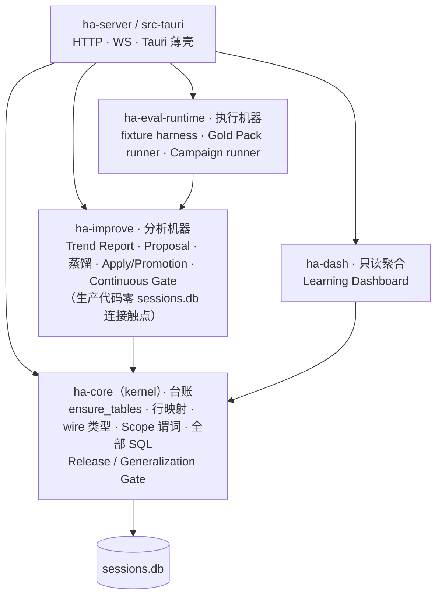
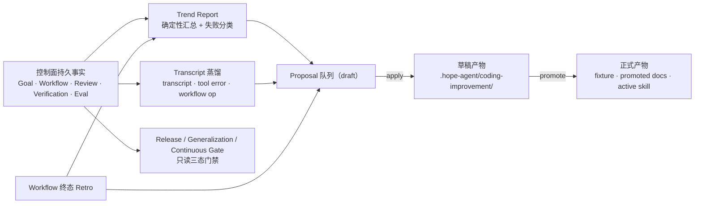
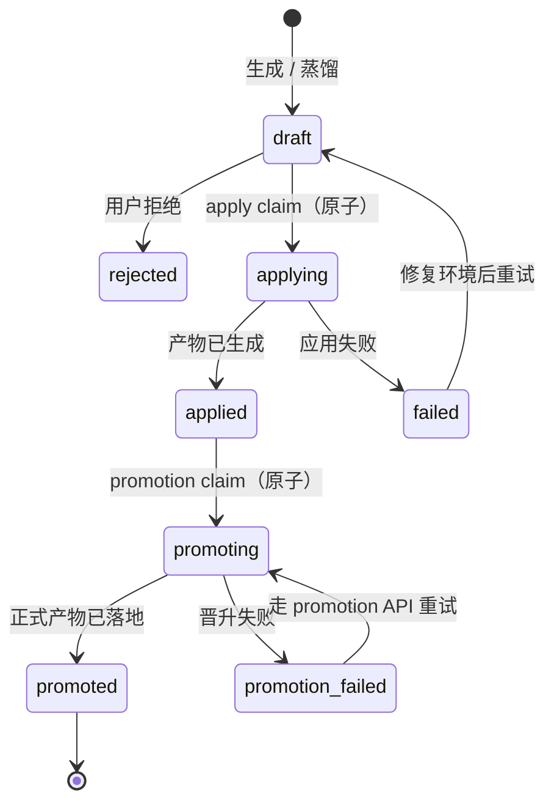
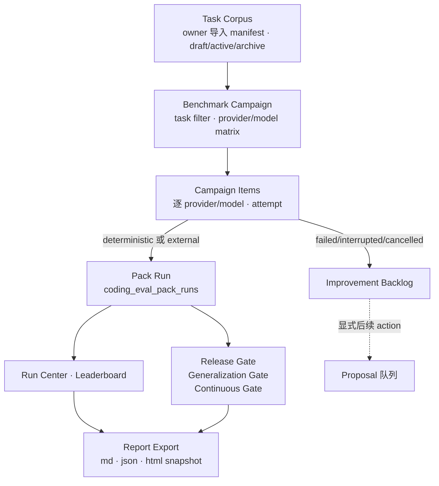

# Coding Improvement Loop

> 返回 [技术文档索引](../../README.md) | 更新时间：2026-07-23

**关联源码**
- 台账（kernel）：`crates/ha-core/src/coding_improvement.rs`
- 分析机器：`crates/ha-improve/src/coding_improvement.rs`
- 执行机器：`crates/ha-eval-runtime/src/coding_eval.rs`
- 只读聚合：`crates/ha-dash/src/dashboard/coding_improvement.rs`
- HTTP 路由：`crates/ha-server/src/routes/coding_improvement.rs`、`crates/ha-server/src/routes/coding_eval.rs`

## 核心思想

Hope Agent 在做编码任务时，会持续往 `sessions.db` 写下大量控制面事实：目标是否完成、工作流卡在哪一步、代码复核发现了什么、验证命令有没有跑通、评测 fixture 是通过还是失败。这些数据平时只用来驱动当前一次任务，任务结束就沉睡在库里。

Coding Improvement Loop 的想法是：**把这些已经持久化的事实，转成一条可审计、可复核的改进回路**——自动看出"最近这一批编码任务反复栽在哪里"，把失败模式沉淀成可复用的评测用例、工作流脚本、项目规则或技能草稿，让下一批任务少踩同样的坑。

整套回路守着三条设计取向，理解它们就理解了这个子系统怎么想：

1. **不依赖 LLM。** 趋势报告、失败分类、候选生成、蒸馏全部是规则式确定性计算，只读已有数据库事实。同一份历史永远算出同一份结论，可以进确定性评测，也不产生推理费用。
2. **人拍板，系统不自作主张。** 系统只生成 **draft 草案**；用户明确"应用"后，也只落在可复核的草稿路径下（草稿评测用例、草稿文档、managed draft 技能），绝不直接改项目规则、`AGENTS.md`、用户记忆或生产 fixture。只有用户再次明确"晋升"，草稿才变成正式产物。
3. **失败必须可见，不能被静默洗白。** 无论是评测失败、campaign 中断，还是跨项目泛化不成立，都以红色数字、backlog item 或三态门禁的形式暴露出来，而不是悄悄改成一条"新规则"。

围绕这条回路，还长出一套 **Benchmark 台面**：把编码能力评测做成可持久追踪的 campaign、跨模型榜单、任务集 registry、报告快照和持续发布门禁——同样只读历史、同样不冒充真实模型能力。

## 分层与 crate 边界

这条回路的代码横跨四个 crate，加上两层薄壳。分工的关键在于一条硬边界：**谁直接摸 `sessions.db` 连接，谁就留在 kernel。**

| 角色 | crate | 职责 |
|---|---|---|
| **台账** | `ha-core`（kernel） | 建表 `ensure_tables`、行映射、wire 类型、Scope 谓词，以及全部直接执行 SQL 的 `impl SessionDB` 方法（含 Release Gate、Generalization Gate 两条门禁——它们内部直接跑 SQL，按边界规则留在这里） |
| **分析机器** | `ha-improve` | 顶层编排入口——趋势报告、候选生成、蒸馏、Apply/Promotion 计划、Continuous Gate；一处连接都不碰，只调台账的类型化方法 |
| **执行机器** | `ha-eval-runtime` | 真正跑评测的 runner：fixture harness、Gold Task Pack、Benchmark Campaign。它执行评测并把结果**写回**回路要读的 pack run / eval run |
| **只读聚合** | `ha-dash` | 全局 / 项目级 Learning Dashboard，只读台账、不回写 |
| **薄壳** | `ha-server` / `src-tauri` | HTTP·WS 与 Tauri 命令的传输适配 |

因为 Rust 的固有 `impl` 不能跨 crate，上浮到 `ha-improve` 的方法都写成自由函数 `fn f(db: &SessionDB, …)`。`SessionDB::with_conn_internal` 仍是 `pub(crate)`，`ha-improve` 生产代码对数据库连接零触点。新增 owner 入口时的规矩很简单：**SQL 写台账，编排写机器。**

依赖方向是 `ha-eval-runtime → ha-improve → ha-core`，`ha-dash → ha-core`；薄壳直连四者：除了转发给执行 / 分析 / 聚合三台机器，大量传输路由还直接调用 `ha-core` 台账的 `SessionDB` 方法（Release Gate、Generalization Gate、proposal 增删查、benchmark 台账等都是薄壳直调）。

一个容易误读的点：**执行机器和分析机器是两回事。** `ha-eval-runtime` 负责真的跑评测、把 pack run 写进库；`ha-improve` 只负责读这些库里的事实、算出改进结论。回路本身从不执行项目命令、不跑模型——那是执行机器的活。

crate 拆分的更多背景见 [前后端分离架构](../system/backend-separation.md) 的 ha-improve 小节。

## 端到端数据流

一句话概括整条回路：**控制面事实 → 趋势报告 → 候选草案 → 应用为草稿 → 晋升为正式产物**，门禁在旁边只读地看着这些历史，判断能不能发布。

- **Trend Report** 是入口视图：把最近窗口内的控制面事实汇总成一份报告，并把失败归类成稳定 taxonomy。
- **Proposal 队列** 是回路的中枢：所有候选（无论来自趋势报告、蒸馏还是 retro）都落进同一张 `coding_improvement_proposals` 表，走同一套状态机。
- **Apply / Promotion** 是唯二会写产物的动作，都必须用户显式触发、都先 preview。
- **门禁** 只消费历史、只输出三态结论，从不生成或改写 proposal。

## Scope 与窗口

回路的所有入口都以当前 `session_id` 为锚点，由 `SessionDB::resolve_coding_report_scope` 统一解析：

- 当前 session 绑定 `project_id` 时，按项目 scope 聚合窗口内的**非无痕** session，最多 200 个（当前 session 即使超出窗口也一定包含）。
- 当前 session 无 `project_id` 时，只聚合当前 session。
- **incognito session 直接拒绝**：`resolve_coding_report_scope` 对无痕会话 `bail!`，不生成报告、不记录 eval run、不生成 proposal。
- 默认窗口 30 天，服务端钳制到 `[1, 180]` 天。

这条 scope 边界贯穿整个子系统：Dashboard、Release Gate、Generalization Gate、Benchmark Center、Leaderboard 全部沿用同一套"无痕 / cron / subagent 不进 durable 判断"的规则，避免用任意 session 伪装全局趋势。

## Trend Report

`ha_improve::coding_improvement::coding_trend_report(db, session_id, window_days)` 返回 `CodingTrendReport`，把控制面事实拆成若干区块：

| 区块 | 指标 |
| --- | --- |
| `overview` | sessions、goals、completed/blocked goals、workflow runs、completed/blocked/failed workflows、goal/workflow completion rate |
| `eval` | eval runs、passed、failed、success rate、eval backlog candidates |
| `review` | review runs、finding 总数、P0/P1 open blocker、resolved、false positive、category bucket |
| `verification` | verification runs、steps、passed/failed/timed out steps、planned-only runs、executed success rate、recommendation coverage |
| `repairLoop` | repair loop runs、completed、blocked、exhausted、success rate |
| `retro` | terminal workflow retro 总数、completed/blocked/failed/cancelled 分布、recommendation 数、latest summary |
| `failures` | 分类后的失败 bucket，含 severity、count、examples |
| `recentRuns` | 最近 workflow run 摘要，包含 state、blocked reason、failure category |
| `retros` | 最近 workflow retro，含 summary、signals、recommendations |
| `proposals` | 当前 scope 下的 proposal 队列，draft 优先 |

### 失败分类

失败分类是规则式、确定性的——同一批 run 永远归到同一 bucket。这是整条回路的稳定语义基石，因为 proposal 生成、Dashboard top failure、backlog 都靠这套 category 名对齐：

| Category | 来源 |
| --- | --- |
| `validation_failed` | verification failed/timed out step，或 blocked reason 指向 validation/verify |
| `eval_failed` | `coding_eval_runs.status='failed'`，把失败 eval 直接送入 backlog |
| `review_blocker` | open P0/P1 review finding |
| `repair_loop_exhausted` | workflow blocked reason 为 `repair_loop_attempts_exhausted` |
| `no_effective_diff_progress` | blocked reason 指向 no effective/no valid diff |
| `permission_stall` | workflow awaiting approval，或 blocked reason 指向 approval/permission |
| `context_miss` | blocked reason 指向 context/recall/missing |
| `verification_selection_gap` | verification run 没有 step |
| `workflow_failed` / `workflow_blocked` / `goal_failed` | 兜底分类 |

## Proposal 队列

Proposal 队列是回路的中枢。`generate_coding_improvement_proposals()` 从趋势报告派生候选：默认读取当前 session/project scope 内所有可用事实、生成所有匹配候选；也支持 `sourceType` / `sourceId` / `proposalKinds` 过滤，用于 GUI 从一次具体事实源定向提炼经验（例如 Workspace「领域复核」的「提炼经验」按钮会传 `sourceType="domain_quality"` + 当前 `run_id`，只返回这次 Domain Quality run 对应的草案）。

### 候选类型

| Kind | 触发条件 |
| --- | --- |
| `eval_candidate` | Top failure bucket，可转 deterministic eval backlog |
| `workflow_template` | repair loop 近期有成功 run，可人工审查后沉淀 workflow 草稿 |
| `guidance_candidate` | review blocker 或 verification failure 暗示项目规则/流程需要补充 |
| `skill_candidate` | workflow 成功且无已分类 blocker，可人工审查后沉淀 skill 草稿 |
| `domain_workflow_template` | Domain Quality `completed` run，把成功领域任务沉淀成可审查 workflow 模板草稿 |
| `domain_guidance` | Domain Quality `completed` run，把证据、approval、完成习惯沉淀成领域 guidance 草稿 |
| `domain_review_profile` | Domain Quality `blocked` / `failed` / `needs_user` run，把漏检点沉淀成领域复核 profile 草稿 |
| `domain_eval_case` | Domain Quality `blocked` / `failed` / `needs_user` run，把失败模式沉淀成通用领域 eval case 草稿 |
| `connector_usage_pattern` | Domain Quality 中高风险 approval check 进入 `needs_user`，沉淀连接器使用和审批规则草稿 |
| retro recommendation | `coding_workflow_retros.recommendations_json` 中的 `eval_candidate` / `workflow_template` / `guidance_candidate` / `skill_candidate` |

队列对 `(session_id, fingerprint)` 建唯一索引：重复生成同一候选只返回既有草案，不制造噪音。趋势报告、蒸馏、retro、领域学习全部写入这**同一张表、同一套状态机**，不另起旁路。

### 状态机

Proposal 的状态设计要害在于：**区分"采纳意向"和"产物已落地"**。一旦系统实际写出了草稿或正式产物，就不能被一次普通的状态更新悄悄改回草案，避免把审计记录洗掉。

| 状态 | 含义 |
| --- | --- |
| `draft` | 默认状态，只是候选 |
| `rejected` | 用户拒绝该候选 |
| `applying` | 内部瞬态，apply 已原子 claim，防止并发应用互相覆盖 |
| `applied` | 用户明确应用，系统已生成可复核草稿产物或 managed draft 技能 |
| `failed` | 应用失败，`apply_result_json.error` 保存原因；可回到 `draft` 让用户修复环境后重试 |
| `promoting` | 内部瞬态，promotion 已原子 claim |
| `promoted` | 用户明确晋升，系统已生成正式产物或激活 managed 技能 |
| `promotion_failed` | 晋升失败，`promotion_result_json.error` 保存原因，可通过 promotion API 重试 |

`update_coding_improvement_proposal_status` 只接受把 proposal 改成 `draft` / `rejected`，且当前状态必须是 `draft` / `rejected` / `failed`；`applied` / `applying` / `promoting` / `promoted` / `promotion_failed` 一律拒绝手动改写，promotion retry 只能走 promotion API。

## Transcript Distillation

`generate_coding_improvement_proposals()` 只吃已聚合的趋势报告，粒度偏粗。当用户想要更贴合真实操作痕迹的建议时，可以显式触发 `distill_coding_improvement_proposals(session_id, window_days)` —— 它扫描真实 transcript、工具错误、工作流 op shape 和失败 taxonomy，生成带具体证据的候选。

| Action | 输入信号 | 输出 |
| --- | --- | --- |
| `generate_coding_improvement_proposals` | 已聚合的 trend report / retro recommendation | 粗粒度 eval / workflow / guidance / skill 候选 |
| `distill_coding_improvement_proposals` | trend report + scope 内最近 transcript + tool result + workflow ops | 带 transcript/workflow/failure evidence 的 workflow template、skill candidate、failure guidance、tool guidance 候选 |

蒸馏过程仍然完全确定性、有明确的读取上限：

- 不调用 LLM、不执行项目命令、不写项目文件。
- 读取 scope 内最多 12 个最近 session，每个 session 最多 80 条最新 message。
- 统计 user/assistant/tool message、top tool、tool error、objective snippet、error snippet。
- 扫描最近 workflow run 的 op shape，识别 review / verification / diff / tool op 组合。
- 把 failure taxonomy 转成 `CodingFailureFeedback`：`rule`、`expectedSignals`、`examples`。
- 只写 `coding_improvement_proposals(status='draft')`；重复候选靠 `(session_id, fingerprint)` 去重。

它不创建新状态机、不绕过 preview/apply/promotion，只是让 `payload_json` 带上 `distillation` / `workflowPattern` / `failureFeedback` / `toolFeedback`，从而让后续草稿产物携带更具体的证据。返回 `DistillCodingImprovementResult`：

| 字段 | 说明 |
| --- | --- |
| `inserted` | 本次新插入的 proposal 数 |
| `distillation.transcript` | transcript/window/tool/error 统计 |
| `distillation.workflowPatterns` | workflow run 的 review/verify/diff/tool op shape 摘要 |
| `distillation.failureFeedback` | 从 failure bucket 派生的规则和证据要求 |
| `distillation.candidates` | 本次尝试生成的候选摘要；可能因 fingerprint 已存在而未新插入 |
| `proposals` | 当前 scope 的完整 proposal 队列 |

## Workflow Retro

当 `workflow_runs` 进入终态时，系统 best-effort 调用 `ensure_coding_workflow_retro_for_run()` 生成一份轻量复盘：

- 不调用 LLM，只看终态、`workflow_ops` 的 op type / state / output。
- 生成 `summary`、`signals[]` 和 `recommendations[]`，写入 `coding_workflow_retros`，并在 workflow trace 里追加 `coding_retro_recorded` event。
- 失败不阻断 workflow 终态转移——学习层绝不影响长任务的完成语义。
- incognito session 不写 retro。

Retro 的 recommendation 会被 `generate_coding_improvement_proposals()` 消费：失败/阻塞走 `eval_candidate` / `guidance_candidate`，成功且具备 review + verify + diff 证据走 `workflow_template`。`workflow_run_id` 唯一，重复终态回写走 upsert。

## Proposal-to-Action（Apply）

Apply 把 draft proposal 变成**可复核的草稿产物**——落在工作目录（或会话目录）的 `.hope-agent/coding-improvement/` 下，绝不直接写生产路径。

| Proposal Kind | Apply 产物 |
| --- | --- |
| `eval_candidate` | `.hope-agent/coding-improvement/eval-candidates/<slug>.json`：可复核的 eval candidate，不直接写 `evals/suites/coding-control-plane/fixtures/` |
| `workflow_template` | `.hope-agent/coding-improvement/workflows/<slug>.md`：workflow script 草稿 + promotion checklist |
| `guidance_candidate` | `.hope-agent/coding-improvement/guidance/<slug>.md`：信号、建议规则和原始 payload |
| `skill_candidate` | 经 `skills::author::create_skill` 建 `~/.hope-agent/skills/ha-learned-*/SKILL.md`，状态 `draft`，进入既有 Skills 草稿审核流 |
| `domain_workflow_template` | `.hope-agent/coding-improvement/domain-workflows/<slug>.md`：领域、quality evidence、draft workflow shape、promotion checklist |
| `domain_guidance` | `.hope-agent/coding-improvement/domain-guidance/<slug>.md`：领域完成规则、必需 evidence、approval discipline、source payload |
| `domain_review_profile` | `.hope-agent/coding-improvement/domain-review-profiles/<slug>.md`：应提前捕获的 blocking checks 和复核 profile 草稿 |
| `domain_eval_case` | `.hope-agent/coding-improvement/domain-eval-cases/<slug>.json`：deterministic / semi-deterministic 通用 eval fixture 草稿 |
| `connector_usage_pattern` | `.hope-agent/coding-improvement/connector-patterns/<slug>.md`：连接器读取、草稿、审批和 fail-closed 规则草稿 |

落盘位置由 session 决定：有有效工作目录时落在该目录的 `.hope-agent/coding-improvement/` 下（`effective_working_dir_for_meta`，session > project）；否则落在 `~/.hope-agent/sessions/{session_id}/.hope-agent/coding-improvement/`，仍是面向用户本人可审计的产物。

`preview_coding_improvement_proposal_action(proposal_id)` 返回 `CodingImprovementActionPlan`：`proposal`（当前 row）、`targetKind`、`steps[]`（目标路径、是否已存在、内容预览）、`preview`（kind-specific 摘要）。

`apply_coding_improvement_proposal(proposal_id)` 重建同一份计划后执行，关键约束：

- 只允许 `draft` proposal 应用。
- 先把 proposal 从 `draft` 原子 claim 到内部 `applying`，最终只允许从 `applying` 写 `applied` / `failed`，避免并发 apply 互相 clobber 审计状态。
- 文件型 action 用 create-new 写入语义；目标已存在或竞态中被创建则 fail-closed，不覆盖。
- 成功后 `status='applied'`，`apply_result_json.artifacts[]` 记录路径和内容 hash；失败后 `status='failed'`，`apply_result_json.error` 记录原因。

## Draft Promotion

Promotion 是唯一把草稿变成**正式产物**的动作，必须用户显式触发、必须先 preview，不得从生成或 apply 隐式执行。

| Proposal Kind | Promotion 产物 |
| --- | --- |
| `eval_candidate` | 草稿晋升到 `evals/suites/coding-control-plane/fixtures/<slug>.json`；同步登记 manifest case、提升 suite patch version，并向 `evals/version-lock.json` 追加新版本 digest |
| `workflow_template` | 复制到 `.hope-agent/coding-improvement/promoted/workflows/`，并在 `AGENTS.md` managed block 加入 `@./...` 引用 |
| `guidance_candidate` | 复制到 `.hope-agent/coding-improvement/promoted/guidance/`，并在 `AGENTS.md` managed block 加入 `@./...` 引用 |
| `skill_candidate` | 调 `skills::author::set_skill_status(skill_id, Active)` 激活 managed draft 技能 |
| `domain_workflow_template` | 复制到 `.hope-agent/coding-improvement/promoted/domain-workflows/`，并在 `AGENTS.md` managed block 加引用 |
| `domain_guidance` | 复制到 `.hope-agent/coding-improvement/promoted/domain-guidance/`，并在 `AGENTS.md` managed block 加引用 |
| `domain_review_profile` | 复制到 `.hope-agent/coding-improvement/promoted/domain-review-profiles/`，并在 `AGENTS.md` managed block 加引用 |
| `domain_eval_case` | 复制到 `.hope-agent/coding-improvement/promoted/domain-eval-cases/`，作为通用 eval/gate 的候选 fixture |
| `connector_usage_pattern` | 复制到 `.hope-agent/coding-improvement/promoted/connector-patterns/`，并在 `AGENTS.md` managed block 加引用 |

`preview_coding_improvement_proposal_promotion(proposal_id)` 返回 `CodingImprovementPromotionPlan`：source path、target path、target existence、source hash、内容预览。

`promote_coding_improvement_proposal(proposal_id)` 执行晋升，关键约束：

- 只允许 `applied` / `promotion_failed` proposal 晋升。
- 先原子 claim 到内部 `promoting`，最终只允许写 `promoted` / `promotion_failed`。
- 文件型 promotion 对目标路径 fail-closed：目标不存在则 create-new；已存在且内容相同则幂等通过；已存在且内容不同则拒绝覆盖。
- `eval_candidate` 的注册步骤对 preview 时的 manifest / version-lock SHA-256 做 stale-write guard；只允许写 `coding-control-plane` suite，fixture 必须位于 suite 内且能解析为 `CodingEvalFixture`。manifest 已写但 lock 写入失败时保持 `promotion_failed`，重试会识别已登记 case 并只补齐缺失 lock，不会二次递增版本。
- `AGENTS.md` 只写 managed include block（标记 `<!-- hope-agent-coding-improvement:start/end -->`）；已有 include 行 no-op，多次 promotion 插入同一个 managed block。
- 成功后 `promotion_result_json.artifacts[]` 记录正式产物路径和 hash；失败后 `promotion_result_json.error` 记录原因。

## 通用领域学习复用同一队列

回路的候选机制被复用来承接通用领域（非编码）学习：从 Domain Quality 的 run / check / evidence 生成 `domain_workflow_template`、`domain_guidance`、`domain_review_profile`、`domain_eval_case`、`connector_usage_pattern` 草稿，仍然必须 preview → apply → promotion，不能直接改生产模板或连接器策略。

- **领域学习**从当前 scope 的 `domain_quality_runs` 读 snapshot，按 run state 派生候选：成功 run 只产可复用 workflow/guidance 草稿；失败或需用户确认的 run 产 review profile / eval case；approval gate 卡点再补 connector usage pattern。`payload_json` 保留 domain、quality run、checks、blocking checks、scope、project/window 信息，方便草稿和后续 promotion 可审计。
- **领域 Campaign 学习闭环**继续复用同一队列：`generate_coding_improvement_proposals(sourceType="domain_eval_campaign", sourceId=<campaign_id>)` 读取 failed / cancelled / interrupted `domain_eval_campaign_items`，按 item 生成 `domain_eval_case` 与 `domain_guidance` draft；fingerprint 用 scope + item id + kind，重复触发幂等。它不调用 LLM、不自动应用，也不把 campaign 失败静默改成项目规则。
- **Domain Readiness Gate** 只读 `coding_improvement_proposals(source_type='domain_eval_campaign')`，判断失败 campaign 是否已物化为学习草稿、是否仍有未关闭 proposal；gate 本身不生成、不应用、不晋升 proposal。

## Benchmark 台面

Benchmark 台面把"编码能力评测"做成一套可持久追踪的体系：任务集有 registry、每次运行是可取消可重试的 campaign、跨模型有榜单、结论能导出快照、发布前有综合门禁。它同样是面向用户本人的控制面，只读历史、默认不碰外部模型。

一条贯穿全台面的安全底线：**deterministic / mock / external_model 三种基线由 `baseline_kind` 明确区分，绝不把 fixture / mock 冒充成真实模型能力**，且 provider 配置与 API key 永不落进任何 history。

### Benchmark Run Center

`SessionDB::get_coding_benchmark_center(input)` 是只读聚合器，不跑模型、不执行命令、不写 DB。它把 Gold Pack history、baseline kind、最近 run、Release Gate 与 Generalization Gate 合成一张"当前 benchmark 能不能发布"的视图。

输入：`sessionId` / `projectId`（可选 scope）、`windowDays`（默认 30，钳 `[1,180]`）、`limit`（recent runs 数，默认 12，钳 `[1,50]`）、`requireExternalModelBaseline`（把外部模型基线从 advisory 变 required）、`requireLearningGeneralization`（把泛化门禁变 required）。

输出 `CodingBenchmarkCenterReport` 含 `summary`、按 `baselineKind` 聚合的 `baselines[]`、`runs[]`、`checks[]`（`benchmark_history` / `latest_pack_run` / `release_gate` / `external_model_baseline` / `learning_generalization`），以及内嵌的完整三态 `releaseGate` / `generalizationGate` 报告。整体状态计算：任一 check `failed` → `failed`；required check `insufficient_data` → `insufficient_data`；只有 advisory check `insufficient_data` 不阻断（例如没有外部模型基线时，deterministic center 仍可用于本地回归）。

Dashboard 的默认 Run 按钮不裸调评测函数，而是创建 `runNow=true` 的 deterministic Benchmark Campaign；runner 内部固定 `executionMode="fixture_patch"` + `baselineKind="deterministic_mock"`，因此默认不访问外部模型、不产生网络费用。

### Benchmark Campaign Runner

Campaign 把一次 Gold Pack run 包装成 durable 单元。ledger 侧的 `SessionDB::create_coding_benchmark_campaign` / `list_coding_benchmark_campaigns` / `get_coding_benchmark_campaign` / `cancel_coding_benchmark_campaign` 负责建表和查询；真正跑 campaign 的是执行机器里的 `ha_eval_runtime::coding_eval::run_benchmark_campaign`（异步自由函数），由 owner API 后台调用。

输入核心字段：`name`（可选，空时按 deterministic/external 自动命名）、`goldTaskInput`（Gold Pack 过滤和运行选项，创建时把 `sessionId`/`projectId` 解析到 durable scope 并清空 `providers`/`modelChain` 后写入 `task_filter_json`）、`models[]`（provider/model matrix，空时自动建一个 deterministic item；外部模型 item 必须同时有 `providerId` 与 `modelId`）、`runNow`、`maxBudgetUsd` / `timeoutSecs`（先作为 campaign contract 持久化）。

状态语义：

- campaign：`queued`、`running`、`cancel_requested`、`passed`、`failed`、`partial`、`cancelled`、`interrupted`。
- item：`queued`、`running`、`passed`、`failed`、`skipped`、`cancelled`、`interrupted`。
- `cancel_coding_benchmark_campaign` 立即把 queued item 标 `cancelled`，runner 在 item 间检查 cancel flag；已 running 的 item 结束后 campaign 收口为 `cancelled` 或 `partial`。
- `retryFailedOnly=true` 把 failed / interrupted / cancelled item 重排为 queued，保留 attempt 计数和历史 pack run 关联。

真实外部模型 benchmark 必须经 Dashboard External campaign 控制区或 owner API 显式选择 provider/model matrix，provider config 只在本次调用内用于匹配 model item；history 只记录 provider/model id 与 report summary，不保存 API key。

### Cross-model Leaderboard

`SessionDB::get_benchmark_leaderboard(input)` 与 `compare_benchmark_models(input)` 基于 campaign item history 聚合同一"任务包 + source doc + execution mode + baseline kind + provider + model"下的表现。

聚合边界：scope 沿用 Benchmark Center（incognito fail-closed）；`windowDays` 默认 30 钳 `[1,180]`，`campaignIds[]` 可收窄到指定 campaign；leaderboard key = `taskPackId + sourceDoc + executionMode + baselineKind + providerId + modelId`，因此不同任务包 / source doc / execution mode / baseline kind 不会被混成一个榜单；排序优先 `casePassRate`，再看 `itemPassRate`、`totalChecks`、`items` 和 label；样本不足、campaign 未完成、取消/interrupted item 都进 `warnings[]`。

输出 `CodingBenchmarkLeaderboardReport`：`status`（≥2 行可比较为 `passed`，否则 `insufficient_data`）、`rows[]`（rank、label、provider/model、task pack/source、execution/baseline、各类汇总、pass rate、warnings）、`evidence[]`（每行最多 6 条，含 campaign id/name、item id、packRunId、provider/model、status、updatedAt、error，保证数字能回到原始 campaign item 和 pack run）。

### Benchmark Task Corpus

Corpus 是面向用户本人的 task pack registry：`import_benchmark_task_pack` / `list_benchmark_task_packs` / `get_benchmark_task_pack` / `update_benchmark_task_pack_status` / `validate_benchmark_task_pack` / `get_benchmark_corpus_health`。

导入契约：输入是完整 `CodingBenchmarkTaskPackManifest`（pack + task 两级 manifest）；必须传 `explicitImportConsent=true` 否则 fail-closed；**导入 API 不扫描本地 repo、不抓取 GitHub issue、不上传私有代码，只保存 owner 传入的 manifest**；`(packId, version)` 与 `(packId, packVersion, taskId, taskVersion)` 唯一，任务提示 / fixture / expected diff / scorer / 校准记录变化必须导入新版本、不覆盖旧历史；`status` 只允许 `draft` / `active` / `archived`，active pack 必须至少含一个 active task。

验证规则（`validate_benchmark_task_pack`，不执行项目命令）：

| Check | 要求 |
| --- | --- |
| `pack_identity` | pack id、version、name 必填 |
| `source_traceability` | 有 source kind，且 source URI 或 repo template 至少一个 |
| `import_safety` | 记录 license note、privacy note、redaction status |
| `task_version_uniqueness` | 同 pack 内 task id/version 不重复 |
| `active_task_presence` | active pack 必须有 active task |
| `active_task_quality` | 每个 active task 有 source、成功标准、验证命令，redaction 不能 pending |
| `fixture_gaming_risk` | active task 成功标准过薄、缺验证命令、写入范围过宽 → 阻止激活 |

Corpus health report 只把 `pack.status==active && task.status==active` 计作 active coverage（draft pack 内的 active task 仍只算 draft）；输出 pack/task 的 active/draft/archive 数与 difficulty / task type / language 分布，并标出 stale task（active task 缺 `calibratedAt` 或超过 `staleAfterDays`，默认 90 天）、duplicate task（active fingerprint 重复）、gaming risk task。Draft task pack 不进 release gate 或 leaderboard。

### Benchmark Report Export

`generate_benchmark_report` / `list_benchmark_reports` / `get_benchmark_report` / `mark_benchmark_report_release_evidence` 把 campaign / comparison / release benchmark 生成不可变快照。

报告类型：`campaign`（必传 `campaignId`，snapshot 嵌入完整 campaign 与按该 campaign 收窄的 leaderboard）、`comparison`（嵌入 cross-model leaderboard/comparison 与 corpus health）、`release`（嵌入 Run Center、Release Gate、Leaderboard、Corpus Health，默认 `releaseEvidence=true`）。

落盘契约：默认输出到 `reports_dir()/benchmark/{reportId}/`（也可显式传 `outputDir`），每份写 `report.md` / `snapshot.json` / `report.html` 三份文件，写入用 `crate::platform::write_atomic`。`snapshot_json` 是生成时刻的不可变 evidence，不依赖后续 live DB 变化；DB 只保存路径和 snapshot 副本，不自动上传或分享。`releaseEvidence` 只能由面向用户本人的控制面生成或显式标记，是 release / PR 审计入口。

### Continuous Benchmark Gate 与 Improvement Backlog

`evaluate_continuous_benchmark_gate(db, input)`（`ha-improve` 自由函数）是发布前 / 策略变更后 / 模型切换后的一条综合质量闸；`materialize_benchmark_backlog` / `list_benchmark_backlog` / `update_benchmark_backlog_status`（kernel 台账方法）负责把失败沉淀成可处理的 backlog。

**Continuous Gate** 只读 durable history，把下列信号归一到 `CodingContinuousBenchmarkGateReport`：既有 Release Gate 结果、最近 release evidence report 是否存在且未过期、最近 campaign 是否达 item 数阈值、campaign case pass rate、active corpus health、open backlog 与尚未物化的失败 item 数、required task pack / provider/model/baseline 是否有 history、外部模型 policy（`requireExternalModel=true` 时必须同时 `externalModelPolicyEnabled=true`，否则 fail-closed）、可靠性指标（interrupted campaign、provider error item、budget exhausted item）、预算 contract、retention 参数。

| 输出字段 | 说明 |
| --- | --- |
| `status` | `passed` / `failed` / `insufficient_data`，任何 blocking check 失败都阻断 |
| `checks[]` | 每条 check 的 expected / actual / reason |
| `blockers[]` | 当前阻塞项名称，供 Dashboard 直接展示 |
| `recommendations[]` | 下一步动作，例如生成 release report、运行 campaign、物化 backlog、处理 provider error |
| `summary` | release report、latest campaign、corpus、leaderboard、pass rate、backlog、budget 摘要 |
| `reliability` | campaign 成功率、interrupted、provider error、budget exhausted、retention 窗口 |

retention 参数只是**可见的清理策略参数**——gate 只暴露 `retentionDays` / `rawArtifactRetentionDays`，实际删除 raw artifact 必须走后续显式 owner action，不在 gate 里静默清理。

**Improvement Backlog** 是把失败暴露出来的改进输入层：`materialize_benchmark_backlog` 扫描 scope 内 failed / interrupted / cancelled campaign item，解析 item report JSON 里的 failed case——能拿到 task/case id 时按 case 建 item，拿不到时回退到 campaign item 级。每个 backlog item 保留 campaign id、campaign item id、pack run id、task pack id、task id、provider/model、baseline kind、execution mode、failure category、title 和 evidence JSON；`UNIQUE(campaign_item_id, task_id)` 防重复物化。status 只允许 `open` / `in_progress` / `resolved` / `wont_fix`（后两者写 `resolved_at`）。当前版本先把 benchmark 失败沉淀成独立 backlog item，转成 proposal / retro / failure feedback 的自动转化仍需显式后续 action，避免把失败悄悄变成项目规则或 active skill。

## Release Gate 与 Learning Generalization Gate

这两条 gate 都只读历史、不调 LLM、不执行项目命令、不生成 proposal、不回写 DB，输出 `passed` / `failed` / `insufficient_data` 三态。它们回答两个不同层次的问题。

### Release Gate

`SessionDB::evaluate_coding_eval_release_gate(input)` 回答"**这一批编码质量能不能发布**"。数据来源：`coding_eval_pack_runs`（pack run 数、pass rate、case/check 汇总、`baseline_kind` 分布）、`coding_strategy_effect_runs`（strategy verdict、validation / scope creep / execution failure delta）、`coding_eval_runs(source_type='coding_task_eval')`（agent 模式下 `toolCalls=[]` 的 task eval 次数）。

默认阈值偏保守：

| 阈值 | 默认值 |
| --- | --- |
| `minPackRuns` | 1 |
| `minStrategyEffectRuns` | 0 |
| `minPackPassRate` | 1.0 |
| `requireExternalModelPack` | false |
| `maxRegressedStrategyEffects` | 0 |
| `maxMixedStrategyEffects` | 0 |
| `maxMissingToolCallRuns` | 0 |
| `maxValidationViolationDelta` | 0 |
| `maxScopeCreepDelta` | 0 |

三态语义：`passed`=样本充足且所有阈值通过；`failed`=已有证据表明质量不达标（pack pass rate 过低、strategy regressed、tool-call 缺失、validation / scope creep 增量超限）；`insufficient_data`=缺要求的 pack / strategy 样本，或显式要求外部真实模型基线但窗口内没有 `baseline_kind='external_model'`。需要真实 provider 基线时必须 `requireExternalModelPack=true` 且由 pack run 显式记录 `baselineKind="external_model"`——gate 绝不把 deterministic / mock 结果冒充外部真实模型。

### Learning Generalization Gate

`SessionDB::evaluate_coding_learning_generalization(input)` 回答更高层的问题："**学到的经验在多个项目里是真成立，还是只优化了单项目 fixture**"。数据来源：`coding_improvement_proposals(status='promoted')`（只把已晋升的 `guidance_candidate` / `skill_candidate` / `workflow_template` 计入 durable learning evidence，草稿或已应用但未晋升的一律不算）、`coding_eval_pack_runs`（按项目聚合）、`coding_strategy_effect_runs`（按项目聚合）。

默认阈值偏保守：

| 阈值 | 默认值 |
| --- | --- |
| `minProjects` | 2 |
| `minProjectPackRuns` | 1 |
| `minProjectPackPassRate` | 1.0 |
| `minStrategyEffectRunsPerProject` | 0 |
| `requirePromotedLearning` | true |
| `requireExternalModelPack` | false |
| `maxRegressedProjects` | 0 |
| `maxMixedProjects` | 0 |
| `maxValidationViolationDeltaPerProject` | 0 |
| `maxScopeCreepDeltaPerProject` | 0 |

输出 `CodingLearningGeneralizationReport` 含三态 `status`、`projects[]`（每项目的 promoted learning 数、pack run、pass rate、strategy effect、delta、reasons、learning item 摘要）、`checks[]`（机器可读门禁项，供 Dashboard / CI / release scripts 展示）。它证明的是"学习成果在多项目 durable evidence 下没有退化"，不是训练或自动发布新策略。传 `projectId` 时可把同一 evaluator 退化为单项目学习质量门禁。

## Owner API

面向用户本人的控制面，Tauri command 与 HTTP 路由一一对应，前端 HTTP `COMMAND_MAP` 与 Tauri `generate_handler!` 均已注册，保持 Desktop / server 模式闭合。

### 核心回路

| Tauri Command | HTTP | 说明 |
| --- | --- | --- |
| `get_coding_trend_report` | `GET /api/sessions/{sid}/coding-trend?windowDays=30` | 读取 scope 的 trend report |
| `list_coding_improvement_proposals` | `GET /api/sessions/{sid}/coding-improvement/proposals` | 读取 proposal 队列 |
| `generate_coding_improvement_proposals` | `POST /api/sessions/{sid}/coding-improvement/proposals` | 基于 report 生成 draft-only 候选；可选 `sourceType` / `sourceId` / `proposalKinds` 定向提炼 |
| `distill_coding_improvement_proposals` | `POST /api/sessions/{sid}/coding-improvement/distill` | 显式蒸馏 transcript / workflow ops / failure feedback，生成 draft-only 候选 |
| `update_coding_improvement_proposal_status` | `POST /api/coding-improvement/proposals/{id}/status` | 更新 proposal 状态（仅 draft / rejected） |
| `preview_coding_improvement_proposal_action` | `GET /api/coding-improvement/proposals/{id}/action-preview` | 预览 action plan |
| `apply_coding_improvement_proposal` | `POST /api/coding-improvement/proposals/{id}/apply` | 应用，生成草稿产物或 managed draft 技能 |
| `preview_coding_improvement_proposal_promotion` | `GET /api/coding-improvement/proposals/{id}/promotion-preview` | 预览 promotion plan |
| `promote_coding_improvement_proposal` | `POST /api/coding-improvement/proposals/{id}/promote` | 晋升为正式 fixture / project guidance / active skill |
| `record_coding_eval_run` | `POST /api/coding-improvement/eval-runs` | 记录 deterministic eval 或外部 eval run |

### Dashboard 与门禁

| Tauri Command | HTTP | 说明 |
| --- | --- | --- |
| `dashboard_coding_improvement` | `POST /api/dashboard/learning/coding-improvement` | 按 DashboardFilter 聚合全局 / 项目信号（只读） |
| `evaluate_coding_eval_release_gate` | `POST /api/coding-improvement/release-gate/evaluate` | 发布质量门禁 |
| `evaluate_coding_learning_generalization` | `POST /api/coding-improvement/generalization/evaluate` | 跨项目泛化门禁 |

### Benchmark 台面

| Tauri Command | HTTP | 说明 |
| --- | --- | --- |
| `get_coding_benchmark_center` | `POST /api/coding-benchmark/center` | 聚合 benchmark history、baseline buckets、recent runs 与两条 gate |
| `create_coding_benchmark_campaign` | `POST /api/coding-benchmark/campaigns/create` | 创建 durable campaign；`runNow=true` 后台启动 runner |
| `list_coding_benchmark_campaigns` | `POST /api/coding-benchmark/campaigns` | 按 scope 列出最近 campaign 与 item 摘要 |
| `get_coding_benchmark_campaign` | `GET /api/coding-benchmark/campaigns/{id}` | 读取单个 campaign、summary 与 item 明细 |
| `cancel_coding_benchmark_campaign` | `POST /api/coding-benchmark/campaigns/{id}/cancel` | 请求取消，未运行 queued item 标 cancelled |
| `run_coding_benchmark_campaign` | `POST /api/coding-benchmark/campaigns/run` | 后台运行 queued item；`retryFailedOnly=true` 只重排失败 / interrupted / cancelled item |
| `get_benchmark_leaderboard` | `POST /api/coding-benchmark/leaderboard` | 基于 campaign item history 生成跨模型 leaderboard |
| `compare_benchmark_models` | `POST /api/coding-benchmark/compare` | 按输入 campaign/window 生成可追溯 comparison report |
| `import_benchmark_task_pack` | `POST /api/coding-benchmark/corpus/import` | 导入 task pack manifest；须 `explicitImportConsent=true`，不扫描仓库、不存 secret |
| `list_benchmark_task_packs` | `POST /api/coding-benchmark/corpus/packs` | 列出 task packs，可按 status / includeArchived / limit 过滤 |
| `get_benchmark_task_pack` | `GET /api/coding-benchmark/corpus/packs/{packId}/{version}` | 读取单个 pack 与 task version 明细 |
| `update_benchmark_task_pack_status` | `POST /api/coding-benchmark/corpus/packs/status` | 切换 draft / active / archived；激活前强制重验 active task quality |
| `validate_benchmark_task_pack` | `POST /api/coding-benchmark/corpus/packs/validate` | 返回 validation report，不执行项目命令 |
| `get_benchmark_corpus_health` | `POST /api/coding-benchmark/corpus/health` | 返回 corpus health |
| `generate_benchmark_report` | `POST /api/coding-benchmark/reports/generate` | 生成 campaign / comparison / release 报告快照 |
| `list_benchmark_reports` | `POST /api/coding-benchmark/reports` | 列出最近报告 |
| `get_benchmark_report` | `GET /api/coding-benchmark/reports/{reportId}` | 读取单份报告 |
| `mark_benchmark_report_release_evidence` | `POST /api/coding-benchmark/reports/release-evidence` | 显式切换 release evidence 标记 |
| `evaluate_continuous_benchmark_gate` | `POST /api/coding-benchmark/continuous-gate/evaluate` | 综合持续 benchmark 门禁 |
| `materialize_benchmark_backlog` | `POST /api/coding-benchmark/backlog/materialize` | 把失败 campaign item 物化成 backlog |
| `list_benchmark_backlog` | `POST /api/coding-benchmark/backlog` | 列出 backlog item |
| `update_benchmark_backlog_status` | `POST /api/coding-benchmark/backlog/status` | 切换 backlog item 状态 |

gate / benchmark API 输入为 `{ input: ... }`，按各自 scope/window/threshold 字段解析；campaign API 同样是面向用户本人的控制面，不经模型能调用的工具面。`dashboard_coding_improvement` 输入为 `{ filter, limit? }`，`filter` 复用 Dashboard 既有时间 / agent / provider / model 过滤。

Tauri 命令与 HTTP 路由的完整对照另见 [api-reference](../system/api-reference.md)。

## Dashboard Learning 视图

`dashboard_coding_improvement` 返回 `CodingImprovementDashboard`（由 `ha_dash::dashboard::coding_improvement::query_coding_improvement_dashboard` 计算），是全局 / 项目级只读学习视图：

| 区块 | 内容 |
| --- | --- |
| `overview` | session、workflow、case eval、pack eval、strategy effect、tool-call missing、validation/scope delta、review blocker、verification failure、retro、proposal、distillation queue 汇总 |
| `timeline` | 按天聚合 completed/blocked/failed workflow、passed/failed eval、passed/failed pack、strategy verdict、validation/scope delta、proposal created/applied/promoted、retro recommendation |
| `byProject` | 按 `project_id` 汇总 workflow/eval/pack 成功率、strategy regression、blocker、proposal 与 distillation candidates；项目名可用时从 `projects` 表补齐 |
| `domainQuality` | 聚合 `domain_quality_runs`、`domain_quality_checks`、`domain_eval_runs` 与 `source_type='domain_quality'` 的 proposal，含总览、按天趋势、按领域 bucket、top blockers、recent runs。它是历史趋势视图，不执行 gate |
| `topFailures` | 从 `eval_candidate` proposal payload 读稳定 failure category，展示 top failure mode |
| `toolCallFailures` | 从 task-level eval metrics 读 agent 模式下 `toolCalls=[]` 的 run |
| `proposalStatuses` | proposal status 分布 |
| `latestStrategyEffects` | 最近 strategy effect run 的 verdict、baseline/candidate label、pass rate / task score / validation / scope creep delta |
| `latestRetros` | 最近 workflow retro summary 与 recommendation |

该 API **只读** existing durable facts：不调 `generate_coding_improvement_proposals`、不 apply、不 promotion、不回写任何 learning event。无痕、cron、subagent session 按 Dashboard 通用规则排除；sessionless eval run 仅在未按 agent/provider/model 过滤时计入全局 eval 聚合。

### 两个面板的分工

- **Workspace 质量趋势区块**是当前 session/project 的**可操作**质量面板：读近 30 天 report，展示 Goal / Workflow / Eval / Repair 成功率、review blocker、verification failure、failure bucket、draft proposal 数、最近 retro summary 与 recommendation；顶部有「生成改进候选」（从 trend report 派生）和「提炼候选」（显式扫描 transcript/workflow/failure feedback）；proposal 行支持展开详情、预览 action plan、应用草稿、预览/执行 promotion、拒绝候选。
- **Dashboard Learning Tab** 是全局 / 项目级**只读**学习视图：Coding improvement 区块展示各类成功率、失败模式、improvement timeline、latest strategy effects/retros；Release Gate 与 Generalization Gate 卡片展示三态门禁；Benchmark Center / Campaign 列表 / Leaderboard / Task Corpus / Benchmark Reports / Continuous Gate / Backlog 面板逐层展开整个 benchmark 台面；General domain trends / quality gate / Domain campaigns 卡片承接通用领域学习。

两者不复用任意 session 伪装 scope，避免把 session-local report 误读成全局事实。

## 数据模型

初始化入口 `SessionDB::open()` 调 `crate::coding_improvement::ensure_tables()` 创建下列持久化表（均以 `session_id` 外键 `ON DELETE CASCADE` 挂在 `sessions` 上）：

| 表 | 说明 |
| --- | --- |
| `coding_eval_runs` | deterministic eval 或外部评测运行结果：`session_id`、`project_id`、`suite`、`name`、`status`、`metrics_json`、`source_type`、`source_id`、`created_at` |
| `coding_eval_pack_runs` | `GoldTaskPackReport` history：`pack_id`、`source_doc`、`label`、`baseline_kind`、`status`、`selected/automated/skipped/passed/failed_cases`、`total_checks`、`report_json`、`source_type`、`source_id`、`created_at`。`baseline_kind` 区分 `deterministic_mock` / `mock_provider` / `external_model`；`external_model` pack run 必须来自 `executionMode="agent"` + 显式 provider/modelChain |
| `coding_strategy_effect_runs` | `StrategyEffectReport` history：`strategy_type`、baseline/candidate label、可选 pack run 关联、`verdict`、`compared_cases`、pass rate / average score / context recall / validation / scope creep / execution failure delta、`report_json`、source、`created_at` |
| `coding_benchmark_campaigns` | durable campaign：scope、`name`、`status`、`task_pack_id`、`source_doc`、`execution_mode`、`baseline_kind`、`task_filter_json`、`model_matrix_json`、`max_budget_usd`、`timeout_secs`、`error`、created/updated/started/finished 时间。`task_filter_json` 清空 providers/modelChain，provider config 与 API key 不入 history |
| `coding_benchmark_campaign_items` | 每个 item：`campaign_id`、`provider_id`/`model_id`/`label`、`status`、`attempt`、`pack_run_id`、case/check 汇总、截断后 `report_json`、`error`、时间戳 |
| `coding_benchmark_task_packs` | corpus pack manifest：`pack_id`、`pack_version`、name、`status`、source kind/URI、repo template、license/privacy note、redaction status、import source、`manifest_json`、时间戳；`(pack_id, pack_version)` 唯一 |
| `coding_benchmark_task_pack_tasks` | pack 内 task version：task id/version/title/status、task type、difficulty、language/framework、source URI、repo template、tags、success criteria、validation commands、allowed/forbidden paths、calibration notes、license/privacy/redaction、risk flags、`fingerprint`；`(pack_id, pack_version, task_id, task_version)` 唯一 |
| `coding_benchmark_reports` | report history：report type、title、三态 status、scope、session/project、source type/id、campaign ids、不可变 `snapshot_json`、markdown/json/html 路径、`release_evidence` 标记、时间戳 |
| `coding_benchmark_backlog_items` | 失败 item 物化的 backlog：`status`、`severity`、`failure_category`、scope、campaign/item/pack/task、provider/model、baseline/execution、`evidence_json`、`proposal_id`、`resolved_at`；`(campaign_item_id, task_id)` 唯一 |
| `coding_improvement_proposals` | 候选草案队列：`kind`、`status`、`source_type`、`source_id`、`title`、`body`、`payload_json`、`fingerprint`、`decided_at`、`apply_result_json`、`applied_at`、`promotion_result_json`、`promoted_at`；`(session_id, fingerprint)` 唯一 |
| `coding_workflow_retros` | workflow 终态 retro：`workflow_run_id`（唯一）、`run_state`、`summary`、`signals_json`、`recommendations_json`、`project_id`、created/updated 时间；重复终态回写走 upsert |

## 确定性评测

执行机器 `ha-eval-runtime` 的 fixture harness 提供 `runs.improvement` 和 `checks.improvement`，覆盖整条回路的确定性行为：seed `coding_eval_runs`、生成 proposal、应用指定 kind 的 draft、晋升已应用 proposal；并可断言 scope、failure taxonomy、proposal kind、draft-only、eval success rate、repair loop blocked 数、retro 数、retro recommendation 数、applied / promoted status、artifact 数和 action target。

harness 还包含 task-level runner（候选 diff 判分、验证命令约束、review/context/goal evidence）、agent execution runner（`mode=agent` 以 Eval 专属 submission 经 TurnKernel + 共享 runtime 产 candidate diff，`mode=fixture_patch` 做无模型回归替身，metrics 携带 execution 摘要以区分执行失败 / 无 diff / scope creep / 验证缺口 / 缺失 tool call）、以及 Gold Task Pack（首批 active gold tasks 接入自动化 pack，pack-level summary 写入 `coding_eval_pack_runs`）。两份 `GoldTaskPackReport` 可经纯函数生成 `StrategyEffectReport`，`recordRun=true` 时写入 `coding_strategy_effect_runs`，落成可审计趋势。外部模型基线 runner 从 gold task prompt 建真实 chat turn、要求模型经工具产 candidate diff，`baselineKind="external_model"` 不能配 `fixture_patch`、`agent` 也不能记为 `deterministic_mock`，因此 Dashboard / Release Gate 里的 external pack run 不只是标签。

Dashboard 聚合层、蒸馏、release / generalization / continuous gate、campaign runner、leaderboard、corpus、report export、backlog、领域学习均有对应单元测试，共同保证：不调用 LLM、不执行项目命令、不直接写项目规则的确定性语义。确定性评测的整体框架见 [capability-eval](capability-eval.md)。

## 红线

- **不依赖 LLM**：report、proposal generation 和 transcript distillation 全部规则式。
- **不自动应用**：生成 proposal 不改项目规则、skill、memory、fixture。
- **应用也不直改生产规则**：只生成草稿 artifact 或 managed draft 技能，后续进入人工 review/promotion。
- **promotion 必须显式触发且有 preview**：不得从 proposal generation 或 apply 隐式执行。
- **fail-closed**：目标文件已存在且内容不同、并发创建、AGENTS include 异常或 skill 激活失败都不能吞掉；apply/promotion 错误分别写 `failed` / `promotion_failed`。
- **`applied` / `promoted` 不能被人工状态更新改回草案**；promotion retry 走 promotion API。
- **incognito fail-closed**：无痕会话不读取/写入 durable improvement 数据。
- **蒸馏不越权**：只读 durable transcript / workflow / eval / review / verification facts，只写 draft proposal，不 apply、不 promotion。
- **领域 campaign 学习不越权**：只读 failed / cancelled / interrupted campaign item，只写 draft proposal；无 session scope 的 campaign 不在 Dashboard 提供学习按钮。
- **泛化不伪证**：Learning Generalization Gate 只消费 promoted learning 与跨项目质量历史；草稿、单项目样本、fixture-only 标签或无项目归属记录都不能证明跨项目泛化。
- **Benchmark 不伪证**：Run Center 只展示 `coding_eval_pack_runs` 的 durable history；deterministic / mock / external model 由 `baselineKind` 明确区分，默认 Run 创建 deterministic campaign，不冒充真实外部模型能力。
- **Campaign 不存密钥**：`coding_benchmark_campaigns.task_filter_json` 永不保存 provider config、modelChain 或 API key；外部模型 runner 只能用本次 owner 调用传入的 provider configs。
- **Corpus 不隐式读取**：task pack import 只保存 owner 提供的 manifest，必须显式 consent；不自动扫描私有 repo、抓取任意 issue 或上传代码。Draft pack/task 不算 active benchmark coverage。
- **Report 不伪实时**：benchmark report 是生成时刻的 snapshot，数字必须引用稳定 campaign / pack run / gate evidence，不在展示时悄悄重算成另一份结论。
- **Continuous Gate 不偷跑模型**：gate 只读 durable history；涉及外部模型、费用、网络或周期触发的 policy 默认关闭，必须 owner 显式 opt-in。
- **Backlog 不隐藏失败**：failed / interrupted / cancelled campaign item 必须先以 open backlog 或 pending failure 形式可见；resolved / wont_fix 是用户可审计状态，不得为通过 gate 静默删除 history。
- **Retention 不静默删证据**：gate 只暴露 retention 策略参数和可靠性指标；真实 cleanup 必须是显式 owner action，且不破坏 report snapshot 的 evidence 可追溯性。
- **不混淆 scope**：Workspace 用 session/project scope；Dashboard 用 `dashboard_coding_improvement` 全局 / 项目级只读 scope，禁止用任意 session 伪装全局趋势。
- **不绕过现有控制面**：trend report 只消费 Goal / Workflow / Review / Verification / Eval 的持久化事实，不重写它们的语义。
