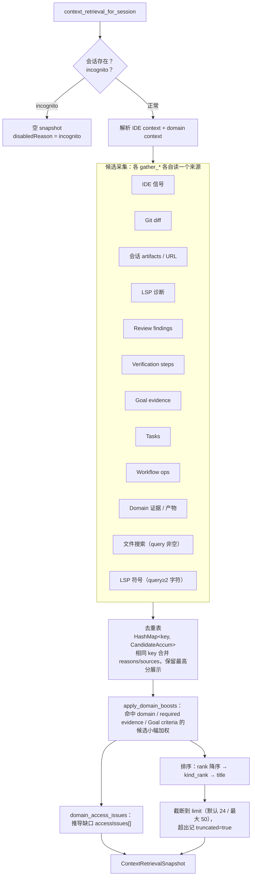
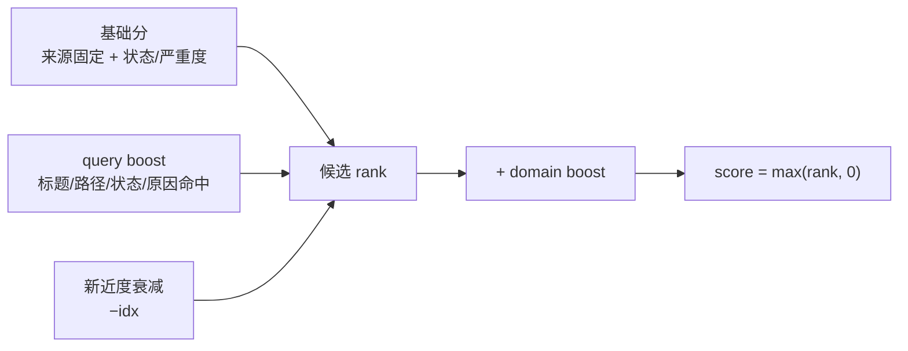
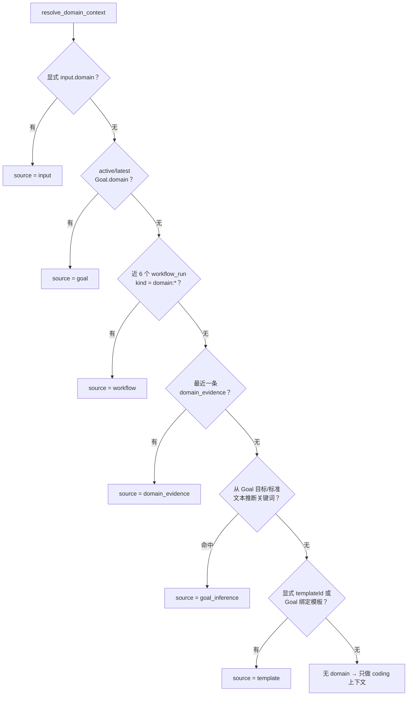

# 上下文检索（Context Retrieval）

> 返回 [技术文档索引](../../README.md)
>
> 关联源码：
> - [`crates/ha-eval-runtime/src/context_retrieval.rs`](../../../crates/ha-eval-runtime/src/context_retrieval.rs) — 候选采集、去重、排序与 snapshot 组装
> - [`crates/ha-core/src/session/ide_context.rs`](../../../crates/ha-core/src/session/ide_context.rs) — `SessionIdeContext` 类型与持久化
> - [`crates/ha-server/src/routes/context_retrieval.rs`](../../../crates/ha-server/src/routes/context_retrieval.rs) · [`ide_context.rs`](../../../crates/ha-server/src/routes/ide_context.rs) — HTTP 端点
> - [`src-tauri/src/commands/context_retrieval.rs`](../../../src-tauri/src/commands/context_retrieval.rs) — Tauri 命令
> - [`src/components/chat/workspace/useContextRetrieval.ts`](../../../src/components/chat/workspace/useContextRetrieval.ts) · `WorkspacePanel.tsx` 里的 `ContextRetrievalSection` — 前端

## 1. 核心思想

上下文检索回答一个纯用户视角的问题：

> **当前任务，下一步最该看哪几条上下文？**

一次会话里，"值得关注的东西"散落在各个子系统：Git 有改动、语言服务报了诊断、代码审查留了 finding、验证计划有失败的 step、Goal 记了完成标准证据、Workflow 有失败的 op、IDE 正打开着某个文件。用户要在这些孤岛之间来回翻找。上下文检索把它们**聚合成一个带优先级的候选列表**，让"现在该处理谁"一眼可见。

它的三个关键取舍决定了整个子系统的形状：

- **只读聚合，不新建状态。** 它从不写库、不创建 durable run、不改模型状态。它读取的全部是别处已经持久化好的信号，随时可以从这些数据重建。它是一个"视图"，不是又一张可变的控制平面表。
- **不注入 prompt。** 结果只呈现给用户看。模型要真正读某个文件，仍然得显式调用工具。上下文检索帮**人**决定看什么，不替**模型**决定读什么。
- **推荐只读，动作显式。** 候选行上带 `focusPaths` 的候选可以一键"聚焦审查 / 聚焦验证"，但那一步是面向用户本人的显式操作：点击后才真正调用 Review / Verification API 去创建对应的 durable run。推荐本身永远不触发任何执行。

最初为 coding 场景服务（Git / LSP / 审查 / 验证），后来扩成通用的上下文推荐：当识别到某个通用领域任务（调研、写作、数据分析、会议准备、收件箱、知识整理、项目运营）时，会把文档、网页来源、邮件线程、日历事件、表格范围、知识笔记、用户决策、产物等 domain 候选一并纳入同一份 snapshot，并在缺连接器 / 缺必需证据时**显式列出缺口**而不是伪造上下文。

> 这个模块物理上住在 `ha-eval-runtime` crate 里，因为评测框架要拿它测量"上下文精确率 / 关键上下文召回率"这类指标——排序质量本身就是一条评测契约，代码和它的度量放在一起。

## 2. 边界与不变量

| 不变量 | 含义 |
| --- | --- |
| 只读 | 推荐查询不写库、不建 run、不改模型状态 |
| 不注入 prompt | 结果仅供用户查看；模型读文件仍需显式工具调用 |
| session scoped | 只按会话自己的工作目录 / 项目 workspace / 已持久化产物聚合 |
| incognito fail-closed | 无痕会话返回空 snapshot，`disabledReason = "incognito"` |
| Goal 回退 | Goal evidence 优先取 active goal，没有则回退到该会话最近一个 goal |
| 增强项永不阻断主流程 | IDE context / LSP symbol / domain context 任一缺失或失败，都只记 warning，不影响其它候选 |
| 无工作目录仍可用 | 没有工作目录时跳过 Git diff / 文件搜索 / LSP，但仍召回 Goal / Task / Workflow / Domain evidence / URL 来源 |

入口只有一个：

```rust
context_retrieval_for_session(
    db, session_id,
    ContextRetrievalInput { query, limit, ide_context, domain, template_id, template_version },
) -> ContextRetrievalSnapshot
```

## 3. 数据流

一次调用的骨架是：**采集 → 去重合并 → domain 加权 → 排序 → 截断**。



采集过程中，读 SQLite 的部分（review / verification / goal / task / workflow / domain）在一次 `db.run` 闭包里连跑，Git diff 与 artifacts 聚合走 `spawn_blocking` 后台线程，避免阻塞 async runtime。

## 4. 候选模型 `ContextCandidate`

所有来源统一收敛成同一个候选结构，前端只认这一种形状：

| 字段 | 作用 |
| --- | --- |
| `id` | 稳定标识，形如 `file:<path>` / `review:<id>` / `domain-evidence:<id>` |
| `kind` | 候选类型（见下表） |
| `title` / `subtitle` | 用户可扫读的标题与补充信息 |
| `path` / `line` / `url` | 定位目标 |
| `score` | 后端排序分（`max(rank, 0)`），前端不重排 |
| `reasons` | 为什么推荐（人类可读短句，可多条累积） |
| `sources` | 贡献来源，如 `git` `artifacts` `lsp` `review` `verification` `goal` `task` `workflow` `ide` `file_search` `domain_evidence` `domain_artifact` `domain_source` `domain_ranker` |
| `status` | 严重度 / 状态 / 动作等短状态串 |
| `metadata` | 来源特有的结构化补充 |

`kind` 共 18 种：

| kind | 主要触发来源 |
| --- | --- |
| `file` | Git diff、会话读写过的文件、文件搜索、IDE 当前文件 / 打开的标签 |
| `symbol` | LSP workspace symbol、IDE 当前符号 |
| `diagnostic` | LSP 诊断、IDE active diagnostic |
| `review_finding` | 代码审查 finding |
| `verification_step` | 验证计划 / 结果 step |
| `goal_evidence` | 当前 Goal 的完成标准证据 |
| `task` | 会话任务进度 |
| `workflow_op` | 最近 Workflow run / op |
| `url_source` | 会话引用过的 URL |
| `ide_context` | IDE / ACP 选区 |
| `document` `email_thread` `calendar_event` `sheet_range` `knowledge_note` `web_source` `decision` `artifact` | Domain 证据 / 产物推导出的通用来源 |

**metadata 里的动作声明**——只有带这些字段的候选，前端才渲染对应按钮：

- `metadata.actions`：`{ canReview, canVerify, focusPaths }`，声明这个候选可以做聚焦审查 / 聚焦验证，`focusPaths` 是范围限定的目标文件。
- `metadata.domainActions`：`{ canCite, canSummarize, canAskUser, canAddEvidence, canMarkConflict, canCreateTask, needsUserConfirmation }`，声明这个 domain 候选支持的面向用户本人的动作。

### 去重合并

候选进入去重表时按 `key` 聚合，`upsert_candidate` 的规则是：**同 key 时，reasons / sources 取并集；哪个来源分最高，就用它的 title / subtitle / metadata 展示。**

- 文件类候选统一按 `file:<path>` 归并——Git diff、历史读写、文件搜索命中、IDE 当前文件 / 打开标签指向同一路径时合并成一条，reasons 里会同时出现"当前 Git diff 修改过""本会话最近修改过"等多个理由。
- Domain 候选按 `domain:<kind>:url|path|evidenceId` 归并，key 前缀与 coding 的 `file:` 不同，因此**domain 候选和代码文件候选不会互相覆盖**——避免把非代码来源伪装成代码文件。

## 5. 排序原理

排序不是纯字符串匹配，而是"**任务信号基础分 + query boost + domain boost**"三段合成，最后统一降序。



### 基础分：任务信号本身的紧迫度

分数编码了"这条上下文有多需要立刻处理"。同一来源内部再按状态 / 严重度分档：

| 来源 | 基础分档位（高 → 低） |
| --- | --- |
| IDE 信号 | 选区 990 · active diagnostic 980 · 当前文件 960 · active symbol 940 · 打开标签 720 |
| Review finding（open） | P0 985 · P1 935 · P2 855 · P3 720；resolved 减 260，dismissed / false positive 减 340 |
| Git diff 文件 | 900 + 改动行影响（上限 200） |
| Workflow run | failed / blocked 930 · awaiting 875 · running / paused / recovering 820 · draft 610 · completed 540 · cancelled 460 |
| Workflow op | failed 920 · started 835 · pending 760 · completed 535 |
| Goal evidence | 阻塞 / 失败 / open 925 · review / verification 805 · 其它 720 · 已完成 / pass 670 |
| Verification step | failed / timed out 910 · running 820 · pending 735 · skipped 650 · passed 520 |
| LSP 诊断 | error 890 · warning 805 · information 690 · hint 625 |
| Task | in_progress 835 · pending 760 · completed 520 |
| 会话文件 artifact | 修改过 735 · 读取过 610（叠加新近度） |
| LSP 符号 | 700（叠加 query boost） |
| 文件搜索命中 | 510 + 文件搜索分（上限 260） |
| URL 来源 | 430（叠加新近度） |

原则读出来就是：正在出问题的东西（error 诊断、失败验证、open 的 P0/P1、失败 workflow、阻塞证据）排在完成态之前；in-progress 任务高于 completed；Git 改动高于普通历史读取；最近修改高于最近读取。IDE"现在正在看"的位置（选区 / active diagnostic / 当前文件）拿到最高一档权重，帮用户快速回到手头位置；打开的标签只作中等权重的工作集提示，不会压过严重 finding、error 诊断或失败验证。

许多来源还叠一个 `−idx` 的新近度衰减：越靠后（越旧）的记录扣得越多，让同档位里新的排前面。

### query boost：加权而非过滤

有搜索词时，`QueryMatcher` 对候选的标题、路径、状态、原因等字段做匹配加分：

- 整个查询串作为子串命中：**+260**
- 每命中一个查询词：**+55**
- 所有查询词全部命中：额外 **+160**

关键取舍是 **query 只加权、不过滤**。搜 `parser` 会把相关文件 / 符号顶上来，但不会因为搜索词不匹配就隐藏当前 diff 里的 error 诊断或审查阻塞项——严重信号永远不会被一次搜索藏掉。文件搜索和 LSP 符号是例外：它们**只在有 query 时才运行**（LSP 符号还要求 query 至少 2 个字符），因为没有查询词时"全库符号"没有意义。

### domain boost：领域相关性微调

`apply_domain_boosts` 在排序前给每条候选按当前 domain 再补一点分（命中即累加）：

- 命中 domain 术语（如 research 的 "source" / "citation" / "调研"）：+55
- 命中该 domain workflow 的 required evidence 类型：+80
- 命中 Goal completion criteria 的关键词（≥3 字符）：+65
- 加 `domain` 词本身的 query boost 的 1/4

它是"微调"不是"改写"：只小幅上浮相关候选，**绝不隐藏 coding 的高危信号**。被加权的候选会带上 `domain_ranker` 来源和"命中当前 domain workflow / Goal criteria"的理由。

### 最终排序

先按 `rank` 降序；`rank` 相同用 `kind_rank`（review_finding → diagnostic → ide_context → verification_step → workflow_op → goal_evidence → task → decision → 各 domain 来源 → file → symbol → url_source）打破平局，让分数持平时更"要紧"的类型靠前；仍相同则按 title 字典序，保证输出**稳定可复现**。

## 6. Domain / 通用场景上下文

coding 之外的通用任务靠一条**领域识别链**接入：只有识别出 domain，才会去采集 domain 证据、加 domain boost、推导缺口。

### domain 识别（首个命中即胜出）



解析模板的顺序是：显式 `templateId` → Goal 绑定的 `workflow_template_id` → 已识别 domain 下的第一个模板。前两种即使上面 5 项都没命中，也会用模板自带的 domain 补上（此时 `source = template`）；第三种只在 domain 已识别时才走。解析结果连同 required evidence / approval gates / verification policy 一起放进 `domainContext`。识别来源（`source`）会透传给前端，让用户看到"这个 domain 是怎么判出来的"。

关键词推断覆盖 7 个通用领域，中英文关键词都认，例如 `research`（research / source / citation / 调研 / 来源）、`data_analysis`（metric / kpi / dashboard / 数据 / 指标）、`meeting_prep`（meeting / agenda / 会议 / 议程）等。

### 证据类型 → 候选类型

domain 证据（读 `domain_evidence_items`，默认最多 80 条）按 `evidence_type` 映射成对应候选类型，闭环型证据分数更高：

| evidence_type | 候选类型 | 基础分 |
| --- | --- | --- |
| `message_draft_approved` | email_thread | 850 |
| `user_decision` | decision | 845 |
| `data_quality_checked` | sheet_range | 830 |
| `meeting_context_collected` | calendar_event | 820 |
| `citation_audited` | web_source | 805 |
| `claim_checked` | web_source / goal_evidence | 800 |
| `artifact_reviewed` | 按路径判 / artifact | 790 |
| `source_cited` | web_source / knowledge_note / document | 760 |
| `artifact_created` | 按路径判 / artifact | 700 |

在基础分之上还会叠：required evidence 命中 +110、confidence 归一后 ×80（无 confidence 默认 +20）、query boost；`redaction_status = sensitive` 扣 80、越旧的记录按 `−idx` 递减。会话产物也会按文件扩展名 / 路径推断成 document / sheet_range / knowledge_note / artifact 一并纳入。

### 缺口而非幻觉：accessIssues

领域任务缺关键上下文时，宁可**显式报缺口**也不伪造。`domain_access_issues` 按 domain 检查是否缺了对应类型的候选，缺则生成一条 `ContextAccessIssue`（含缺失原因、需要的连接器、下一步动作）：

- research / writing 缺可引用来源（web_source）→ 建议连 Web/Search 或补 `source_cited`
- meeting_prep 缺日历事件 → 建议连 Calendar 或记 `meeting_context_collected`
- data_analysis 缺表格 / 数据口径证据 → 建议连 Sheets 或记 `data_quality_checked`
- inbox 缺邮件线程 → 建议连 Gmail 或记 `message_draft_approved`
- knowledge_curation 缺知识笔记 → 建议挂知识空间或记 `source_cited`
- 模板声明的 required evidence 缺失 → 逐条列出"补齐 evidence 后再完成 Goal"

真接入 Gmail / Calendar / Drive / Sheets 等只读连接器候选时，也必须继续走这条缺口 + 授权边界的路子，不得伪造不存在的来源。

## 7. Session IDE Context

`session_ide_context` 是 session 级、面向用户本人的快照，记录 IDE / ACP"当前正在看什么"，作为一等信号喂给上下文检索。

### 结构与存储

```
SessionIdeContext {
  source?            // "acp" / "ide" / "desktop" 等
  currentFile?
  selection?         // { path?, startLine?, endLine?, text? }
  openTabs[]
  activeDiagnostic?  // { path?, line?, severity?, message? }
  activeSymbol?      // { name?, kind?, path?, line? }
}
```

持久化在 `sessions.db` 的 `session_ide_context` 表，一会话一行（`ON CONFLICT(session_id)` upsert）。写入前统一 `sanitized()`：清洗字段、open tabs 清洗后上限 24 条、选区文本上限 600 字符。

### 写入入口

- **Tauri**：`save_session_ide_context` / `get_session_ide_context` / `clear_session_ide_context`
- **HTTP**：`GET | PUT | DELETE /api/sessions/{sid}/ide-context`，PUT body 为 `{ "context": SessionIdeContext }`
- **ACP**：`newSession` / `loadSession` / `prompt` 请求 `_meta` 里的 `ideContext` 或 `ide_context` 会被 best-effort 持久化（`persist_acp_ide_context`）

### 约束与生命周期

- **incognito 拒绝持久化**：无痕会话调 `save_session_ide_context` 直接 `bail!`。
- **快照永不升级为 system 指令**：只用于推荐排序、focused review 证据和 GUI 展示。
- **ACP 写入失败只记 warning**，不让 prompt 失败。
- **内联优先，快照兜底**：Tauri 的 `get_context_retrieval` 命令接受内联 `ideContext`（优先），否则读持久化快照；HTTP 端点不接受内联，恒读持久化快照——因此浏览器 / headless 侧完全依赖已写入的 `session_ide_context`。

## 8. API 与传输

| 平面 | 调用 |
| --- | --- |
| Tauri | `get_context_retrieval(sessionId, query?, limit?, ideContext?, domain?, templateId?, templateVersion?)` |
| Transport | `get_context_retrieval`（前端统一走 `transport.call`） |
| HTTP | `GET /api/sessions/{sid}/context-retrieval?query&limit&domain&templateId&templateVersion` |
| HTTP（IDE context） | `GET | PUT | DELETE /api/sessions/{sid}/ide-context` |

返回 `ContextRetrievalSnapshot`：

| 字段 | 说明 |
| --- | --- |
| `sessionId` / `query` / `workspaceRoot` | 会话、查询词、工作目录 |
| `candidates` | 排序后的候选列表 |
| `stats` | 各来源计数：`gitChanges` `artifactFiles` `diagnostics` `reviewFindings` `verificationSteps` `goalEvidence` `tasks` `workflowOps` `ideContextSignals` `fileSearchMatches` `symbols` `urlSources` `domainCandidates` `domainEvidence` `accessIssues` + `warnings[]` |
| `domainContext` | 识别到的 domain profile：`domain` `templateId` `templateVersion` `templateTitle` `taskType` `goalId` `goalObjective` `completionCriteria` `requiredEvidence` `approvalGates` `verificationPolicy` `source`（domain 判定来源：`input` / `goal` / `workflow` / `domain_evidence` / `goal_inference` / `template`） |
| `accessIssues` | 缺口列表 |
| `truncated` | 是否因超 limit 被截断 |
| `disabledReason` | 关闭原因（如 `incognito`） |
| `generatedAt` | 生成时间 |

## 9. Workspace 面板

推荐上下文区块归在 Workspace 面板"模型取用了什么"一组（紧邻知识空间），排在语义诊断 / 评审 / 验证等代码类诊断之前。

**交互**：

- 默认展示当前会话推荐；输入关键词后 debounced 重新召回；带手动刷新按钮。
- 文件 / 诊断 / review / symbol 行复用统一文件操作（`useFileActions`）预览，遵守本机 / HTTP 的预览、打开、下载矩阵；URL 来源行外部打开——GUI 不另做文件操作分叉。
- 带 `actions.focusPaths` 的候选行显示两个紧凑按钮：
  - **聚焦审查** → `run_code_review({ scope: "local", focusPaths })`，只在匹配文件范围内生成 finding。
  - **聚焦验证** → `run_smart_verification({ scope: "local", focusPaths })`，只基于匹配文件选最小验证命令。
- Domain profile 以小条显示模板 / 识别来源；accessIssues 直接列出缺口和下一步；domain 候选显示类型图标与动作 chips，提供六个面向用户本人的轻量动作：
  - **复制引用**（前端本地生成引用文本）
  - **生成摘要** → `record_domain_evidence` 写 `artifact_created` 证据（`sourceMetadata.action = "summarize"`、`artifactKind = "context_summary"`）
  - **请求用户确认** → `create_owner_ask_user_question` 创建一次面向用户本人的追问；其 `ownerResponse` 声明用户答复后落 `user_decision` 证据（`action = "ask_user_confirmation"`）
  - **加入证据** → `record_domain_evidence`
  - **标记冲突** → `record_domain_evidence` 写 `claim_checked` 证据（`verdict = "conflict"`、`requiresUserReview = true`）
  - **转任务** → `create_session_task`
- 没有工作目录时区块仍启用，只跳过文件搜索 / Git / LSP，保留 Goal / Task / Workflow / Domain evidence。
- 自动监听 `lsp:diagnostics`、`review:*`、`verification:*`、`workflow:updated`、`domain_evidence:recorded` 与 `_lagged` 事件，debounced 重拉；用户确认、workflow runtime、评测或连接器写入 domain evidence 后，Context 与通用任务工作台通过同一批事件一起刷新。

**聚焦按钮不绕过原控制平面**：Review / Verification run 照旧写入各自 durable 表、Goal evidence、EventBus 与 Workspace 对应区块。上下文检索只把"下一步最该处理哪条上下文"变成一键入口，不吞掉任何审计与持久化。

## 10. 性能、可靠性与边界

- **payload 有界**：默认返回 24 条、最多 50 条；review / verification / workflow 各只取最近 3 个 run；domain evidence 最多 80 条；Goal / Task / Workflow 只读摘要、各取最近少量记录。
- **只读摘要，不拉大内容**：历史 artifacts 只读摘要，不拉 diff 正文。
- **可选增强失败不阻断**：文件搜索受 walk cap 约束、只在有 query 时跑；LSP 符号要求 query≥2 字符、失败只记 warning；IDE / domain 缺失都不影响其它候选。截断、walk cap 触顶、LSP 符号服务报错等都作为 `stats.warnings` 透出，而不是让整次调用失败。
- **不阻塞 runtime**：Git diff / artifacts 聚合走 `spawn_blocking`。
- **无持久化**：本模块不落任何自己的状态，刷新即从已有 durable 数据重建。
- **incognito 双归零**：无痕会话既不返回候选，也拒绝持久化 IDE context。

## 11. 演进方向

- 为符号补 document symbols 兜底，避免 workspace symbol 服务不可用时符号完全缺席。
- 引入 over-read ratio 与趋势报告，补充现有上下文精确率 / 关键上下文召回率指标。
- 接入更多真实只读连接器候选（Gmail / Calendar / Drive / Sheets），且必须继续走 accessIssue + 授权边界，不伪造缺失来源。

Workflow 与评测的接入面：`workflow.review()` / `workflow.verify()` 复用同一套 focused owner API，workflow 内产生的 review finding、verification step 与 Goal evidence 会自然进入上下文检索候选，让长任务执行轨迹与推荐上下文保持一致。
