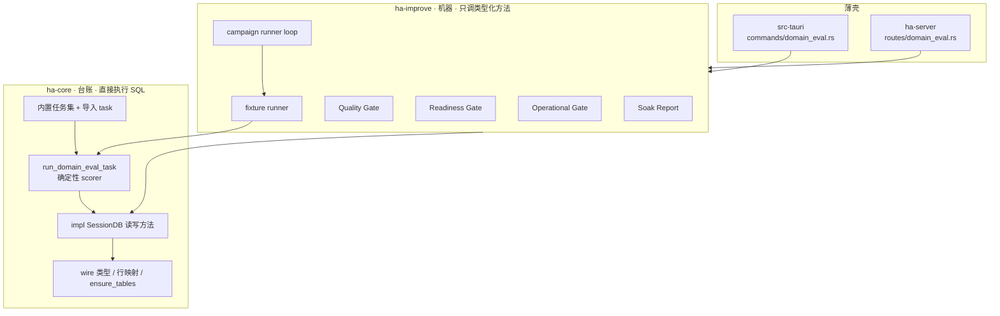
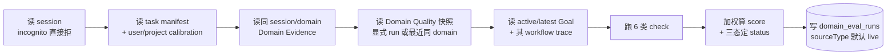
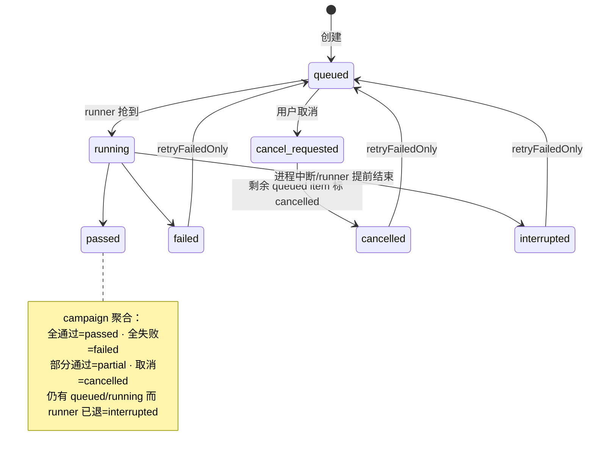
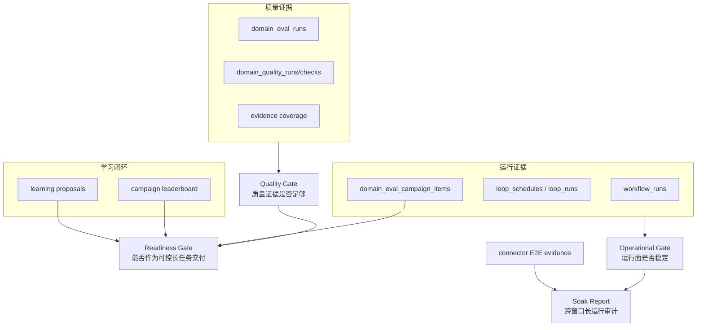

# Domain Eval 与质量门控制平面

> 返回 [技术文档索引](../../README.md)
>
> 关联源码：
> - 台账（wire 类型 / 行映射 / SQL / 内置任务集 / 确定性 scorer）：`crates/ha-core/src/domain_eval.rs`
> - 机器（fixture 跑批 / campaign 跑批 / 三道闸 / soak）：`crates/ha-improve/src/domain_eval.rs`
> - HTTP 薄壳：`crates/ha-server/src/routes/domain_eval.rs` · Tauri 薄壳：`src-tauri/src/commands/domain_eval.rs`

## 核心思想

写代码有 benchmark、有编译器、有测试；「写一份研究简报好不好」「这次数据分析的结论靠不靠谱」却长期只能靠感觉。Domain Eval 要解决的抽象问题，就是把**非编程类任务的质量判断从「感觉不错」变成一次可审计、可复现、可比较的 run**。

它围绕三个想法运转：

1. **确定性判分，不请 LLM 当裁判。** 评分只读会话已经产生的结构化痕迹——Goal 的完成标准、Workflow 的执行轨迹、Domain Evidence、Domain Quality 快照——按固定规则算出加权分和检查结果。同一份输入永远得到同一个结论，判分器本身不调用模型、不跑工具、不碰外部系统。

2. **三态、fail-closed。** 每一层判定都只有 `passed` / `failed` / `insufficient_data`。缺样本、缺 trace、缺证据一律落到 `insufficient_data`，**绝不因为「没坏消息」就判 `passed`**。聚合规则在每一层都相同：任一子项 `failed` 则整体 `failed`；否则只要有 `insufficient_data` 就整体 `insufficient_data`；全部 `passed` 才 `passed`。这一条贯穿 scorer、三道闸和 Soak Report，是整个子系统的骨架。

3. **通用领域与编程能力物理隔离。** Domain Eval 只证明「通用长任务质量」，与 coding benchmark 分表、分门、互不混排。coding 侧由 [Coding Eval 控制面](coding-eval.md) 与 [Coding Improvement Loop](coding-improvement-loop.md) 承载。

在这个基础上，系统从「一次判分」逐级放大：单次判分 → 半确定性 fixture 跑批（可选真实 agent 执行）→ 批量 campaign 跨模型对比 → 三道质量/就绪/运营闸门 → 跨窗口 Soak 审计报告。层层都遵循同一条 fail-closed 三态规则。

## 分层：台账与机器

子系统横跨两个 crate。分界线只有一句话：**这个方法是否直接执行 SQL、直接摸 `sessions.db` 连接**。

| | crate / 文件 | 承载 |
| --- | --- | --- |
| **台账** | `ha-core/src/domain_eval.rs` | wire 类型、行映射、`ensure_tables`、内置任务集、确定性 scorer，以及全部直接执行 SQL 的 `impl SessionDB` 方法 |
| **机器** | `ha-improve/src/domain_eval.rs` | 顶层编排入口——一处连接都不碰，只调台账的类型化仓储方法：fixture 跑批、campaign 跑批、三道闸判定、soak 报表 |

固有 `impl` 不能跨 crate，所以上浮到 ha-improve 的编排层是接收 `&SessionDB` 的自由函数 `fn f(db: &SessionDB, …)`，通过类型化方法读写台账，生产代码零连接触点。

值得注意的一个落点：**确定性 scorer（`run_domain_eval_task`）留在台账**。它虽然是「判分器」这个概念的核心，但它的函数体要直接读 session、evidence、goal、quality 快照并写回 run，因此按连接规则归属 ha-core。真正搬到 ha-improve 的是那些「读若干类型化结果再组装判断」的编排层。



详见 [前后端分离架构](../system/backend-separation.md) 的 ha-improve 小节。新增 owner 入口时的规矩：**SQL 写台账、编排写机器**。

## 数据模型

`SessionDB::open()` 会调用 `domain_eval::ensure_tables()` 创建六张表。它们随会话删除的清理方式并不一致：`domain_eval_runs` / `domain_eval_fixture_runs` 直接以 session 为外键、`ON DELETE CASCADE`；`domain_eval_campaigns` 也走 CASCADE，但它的 `session_id` 可为空——project / global scope 的 campaign 根本不绑 session；`domain_eval_campaign_items` 以 `campaign_id` 为外键，随所属 campaign 间接级联。`domain_eval_tasks` 与 `domain_eval_calibrations` 没有会话外键，是 user/project scope 的常驻记录，不随会话删除清理。

| 表 | 承载 |
| --- | --- |
| `domain_eval_runs` | 一次确定性判分结果：session/project、task id+version、domain、label、status、score、`source_type`（默认 `live`）、report JSON、关联的 domain quality run、created_at。 |
| `domain_eval_fixture_runs` | 一次 trace/agent fixture 跑批的完整报告：name、execution mode、source type、status、`passed`、关联的 session/goal/workflow/quality/eval run、report JSON、error、created/updated。执行失败且没产出 eval run 时也会落这里，供回放失败原因。 |
| `domain_eval_campaigns` | 一次批量 campaign：session/project scope、name、status、domain、task filter JSON、model matrix JSON、execution mode、预算（`max_budget_usd` / `timeout_secs`）、error、created/updated/started/finished。 |
| `domain_eval_campaign_items` | campaign 中一个 task × model/execution 单元：task、domain、execution mode、provider/model/label、status、attempt、关联的 fixture/eval run、score、check 统计（total/passed/failed）、report JSON、error、时间戳。 |
| `domain_eval_tasks` | 从已晋升学习产物导入的自定义 task：id+version（联合主键）、project、status、source type/id/path、task JSON、imported/updated。 |
| `domain_eval_calibrations` | user/project scope 的人工校准与复核记录：task id+version、domain、project、scope、reviewer、verdict、note、关联的 source eval run、created_at。 |

索引（判分历史、fixture 回放、campaign 面板、task 检索、calibration 追溯各自的读路径）：

| 表 | 索引 | 服务的查询 |
| --- | --- | --- |
| `domain_eval_runs` | `_scope(project_id, session_id, domain, created_at DESC)` · `_task(task_id, …)` · `_status(status, …)` · `_source(source_type, …)` | 按 scope/task/状态/来源翻历史 |
| `domain_eval_fixture_runs` | `_recent(source_type, created_at DESC)` · `_status(status, …)` | Smoke Run Center 回放 |
| `domain_eval_campaigns` | `_scope(project_id, session_id, …)` · `_status(status, updated_at DESC)` | campaign 列表 |
| `domain_eval_campaign_items` | `_campaign(campaign_id, status, updated_at DESC)` | 单 campaign 下钻 |
| `domain_eval_tasks` | `_domain_status(status, json_extract(task_json,'$.domain'))` · `_source(source_type, source_id)` | 按领域/来源查导入 task |
| `domain_eval_calibrations` | `_task(task_id, task_version, project_id, …)` · `_domain(domain, project_id, …)` · `_source_run(source_run_id)` | 追溯校准 |

## Task Registry

内置 15 个任务，覆盖 5 个通用领域，每领域 3 个，版本恒为 `1.0.0`：

| Domain | Task |
| --- | --- |
| `research` | `research-source-backed-brief`、`research-technical-decision`、`research-conflict-comparison` |
| `writing` | `writing-decision-memo`、`writing-prd-brief`、`writing-executive-summary` |
| `data_analysis` | `data-kpi-readout`、`data-metric-diagnostic`、`data-dashboard-qa` |
| `meeting_prep` | `meeting-prep-brief`、`meeting-agenda-risk-review`、`meeting-follow-up-plan` |
| `knowledge_curation` | `knowledge-topic-index`、`knowledge-source-synthesis`、`knowledge-vault-cleanup` |

每个任务是一份 `DomainEvalTask`，声明「这类任务合格长什么样」：

| 字段 | 承载 |
| --- | --- |
| `id` / `version` | 稳定身份；内置版本 `1.0.0`。 |
| `domain` / `taskType` | 领域与任务类型。 |
| `input.prompt` | 半确定性 trace fixture 的任务输入；`input.fixtureKind` 标记 fixture 种类。 |
| `allowedTools` | 允许工具的**提示**，不自动授权任何工具。 |
| `requiredEvidence` | 每条 = evidence type + 最小数量 + 需要的 metadata key（如 source 必须带 `uri`/`retrievedAt`）。 |
| `successCriteria` | 供评分者阅读的成功标准。 |
| `prohibitedActions` | 未经批准不得执行的 send/share/publish/external update/delete 等动作。 |
| `calibration` | built-in / proposal / user / project 校准记录，含 reviewer、verdict、scope、note 与可选 source run。 |

### 导入学习产物

内置任务集之外，`import_domain_eval_case(input)` 可以把一次「从失败中学到的领域评测候选」提升为常驻自定义 task：

- 只接受 `coding_improvement_proposals` 中 `kind='domain_eval_case'` 且 `status='promoted'`、且 promotion record `promoted=true` 并带 JSON artifact 的 proposal。
- JSON artifact 会被规范化成 `DomainEvalTask`：读取 domain、name/title、input prompt、allowed tools、required evidence、success criteria、prohibited actions 与 calibration notes。
- 生成的 task id 采用 `learned-{domain}-{name}`，version 默认 `1.0.0`。
- 重复导入默认幂等返回 `imported=false`；`overwrite=true` 才更新既有 task JSON 与 source metadata。
- `list_domain_eval_tasks` 合并内置 task 与 active imported task；`run_domain_eval_task` 先查内置、再查 imported。
- 这是**面向用户本人的显式动作**，不由模型自动执行。GUI 仅对 Coding Trend proposal 列表里已晋升的领域评测候选显示「导入评测」。

## Calibration 与人工复核

判分是确定性的，但「这条规则本身合不合理」需要人来说话。`record_domain_eval_calibration(input)` 显式记录某个 task 的人工校准结论：

- `verdict` 白名单：`approved`、`needs_calibration`、`needs_revision`、`rejected`、`stale`（大小写与连字符会被规范化，非法值直接报错）。
- 不传 `projectId` 为 user scope；传了为 project scope。
- 可选 `sourceRunId` 绑定一次具体 `domain_eval_runs`，并校验该 run 的 task id 与输入 task 一致。
- 同一组 `sourceRunId + reviewer + scope + projectId` 重复记录幂等返回已有 calibration，避免 Dashboard 重复点击刷出多条。
- `list_domain_eval_tasks(projectId?)` 把 user scope 与对应 project scope 的 calibration 追加到 task manifest。
- `run_domain_eval_task` 会按 session 所属 project 把相关 calibration 写进 `DomainEvalReport.task.calibration`，让历史 run 能说明它执行时看到的校准上下文。

关键约束：**calibration 是人工证据，不改判分。** 它不会自动调整 scorer 权重、不会把 failed run 改成 passed、也不会绕过质量门对 eval/quality 样本量的要求。

## 判分流程（Run Scoring）

`run_domain_eval_task(input)` 是最小判分单元，同步、确定性：



六类检查各自盯一种失败模式：

| Check | 失败/不充分模式 |
| --- | --- |
| `evidence_completeness` | required evidence 缺失或 metadata key 不足（必需项缺失 → failed，可选项缺失 → insufficient_data）。 |
| `citation_quality` | Research / Knowledge 没有来源，或 source 缺 retrieved/published/date metadata。 |
| `data_quality` | Data Analysis 缺 dataset / metric / denominator / sampleSize 等质量证据。 |
| `approval_safety` | Domain Quality 已判高风险动作 `needs_user`，或 task 明确要求 `user_decision` / `message_draft_approved` 却缺证据。 |
| `completion_criteria_match` | Goal 缺完成标准，或最新 Domain Quality 未通过。 |
| `workflow_trace` | Goal 没有关联 workflow run 时标 `insufficient_data`（缺 trace 可见但不被藏进 coding benchmark）。 |

判分 status 由三态规则加一条阈值兜底给出（`eval_status`）：

- 任一 check `failed` → `failed`；
- 无 failed 但有 `insufficient_data` → `insufficient_data`；
- 全部通过且加权 score ≥ 默认阈值 `0.8` → `passed`；
- 全部通过但加权 score 低于阈值 → 仍判 `failed`（分数不达标不能靠「没有硬失败」蒙混）。

## Fixture Runner（半确定性）

单次判分要求会话里已经有 Goal/Evidence/Workflow/Quality 痕迹。Fixture Runner 反过来：把一份 fixture **materialize 成真实控制面 trace**，再交给同一个 scorer 判分——用来做确定性回归，或做真实模型的能力冒烟。入口是 `run_domain_eval_fixture(input)`，支持两种执行模式：

| Mode | 含义 |
| --- | --- |
| `trace_fixture` | 确定性控制面回归。Runner 按 fixture 显式写入 evidence / workflow / quality trace，再调同一 scorer。种子固定，结论可复现。 |
| `agent` | 真实 agent 执行。Runner 创建 user message + chat turn，把 fixture 显式提供的 `execution.providers` / `execution.modelChain` 封入 `TurnSubmission::evaluation`，经 `TurnKernel` 与共享 runtime 执行；默认开 `execution.workflowMode="ultracode"`，让模型自主决定是否建 durable workflow。执行完再跑 Domain Quality / Domain Eval scorer。 |

所有 fixture 创建的 session 都会被标成 `SessionKind::EvalFixture`，**隐藏于普通会话列表、全局搜索和 Dashboard live 聚合之外**。Runner 同时写 `domain_eval_fixture_runs` 供 Smoke Run Center 回放完整 report。合成来源用固定 `sourceType` 标记，与真实 `live` run 物理区分：

| Source Type | 场景 |
| --- | --- |
| `fixture_trace` | `executionMode="trace_fixture"` |
| `fixture_agent` | `executionMode="agent"` |
| `fixture_unsupported` | 非法 execution mode 的 fail-fast report |

`trace_fixture` 流程：创建真实 session → 建 Goal（objective/完成标准默认取自 task）→ 写 fixture evidence 进 `domain_evidence` → 默认建一个 `origin='domain_eval_fixture'` 的 WorkflowRun → 默认跑 Domain Quality 得到 `domain_quality_runs/checks` → 调 `run_domain_eval_task` 写 `domain_eval_runs` → 按 fixture `checks` 输出 runner 自身通过/失败并写 `domain_eval_fixture_runs`。

`agent` 流程在建 Goal 后先跑一轮 chat：

- `execution.prompt` 可覆盖 task prompt；默认用 Goal objective，再退回 task input prompt。
- `execution.providers` / `execution.modelChain` **必填**，owner API 不隐式读桌面全局 provider。
- `execution.workflowMode` 支持 `off` / `on` / `ultracode`，默认 `ultracode`，用于测试自主动态 workflow 主路径。
- runner 注入受控 extra system context（task id/domain、required evidence、success criteria）。
- 执行报告写入 `report.execution`：`status`、`turnId`、`response/error`、`modelUsed`、`toolCalls`、`workflowMode`。
- **agent 模式绝不自动 materialize `fixture.evidence` / `fixture.workflow`**——这些字段只属于 `trace_fixture` 的确定性种子。Agent 能力 fixture 必须让模型通过真实工具产出 evidence/workflow trace。
- agent 执行失败或缺 provider/modelChain → 返回 failed report，**不写** `domain_eval_runs`，但会写 `domain_eval_fixture_runs` 让 Smoke Center 能看到失败原因。
- agent 执行完成但证据不够 → 后续 scorer 会把 eval run 标成 `failed` 或 `insufficient_data`，runner 不替模型补证据。

Fixture check 除断言 scorer 结果外，还支持 execution 断言：`expectedExecutionStatus`、`requireTurn`、`minToolCalls`、`expectedToolCalls`、`responseContains`、`errorContains`。若未显式设 `expectedStatus`，runner 默认要求 scorer status 为 `passed`；要验证失败样本时必须显式写 `expectedStatus: "failed"` / `"insufficient_data"`，防止「agent turn 成功但质量不达标」被误判为 fixture 通过。

Fixture Runner 是 owner API / 回归测试能力，不挂到 Dashboard 质量门的普通按钮上。Dashboard 只单独展示「Domain smoke runs」区块；真实质量门默认排除 `SessionKind::EvalFixture`、`sourceType LIKE 'fixture_%'`、`access_scope='fixture'` 的合成数据，只有显式传 `includeSynthetic=true` 才把合成数据纳入诊断。

## Campaign Runner（批量跨模型）

Campaign 把单次 fixture 冒烟放大成一个**可取消、可 retry、可跨 provider/model 比较、可沉淀学习草稿**的 Domain Eval Pack。它只负责编排，不新增第二套 scorer。

创建 `create_domain_eval_campaign(input)`：

1. 解析 task filter：`domain`、显式 `taskIds`、`maxTasks`；默认最多 5 个 task，硬上限 15。
2. 建 model matrix：空 matrix 自动补一个 deterministic `trace fixture` item；外部模型 item 必须同时提供 `providerId` 和 `modelId`。
3. 每个 task × model 物化一条 `domain_eval_campaign_items`，初始 `queued`。

运行 `run_domain_eval_campaign(input)` 逐 item 检查 cancel flag 后复用 `run_domain_eval_fixture`：

- deterministic item 用 `executionMode="trace_fixture"`，由 task required evidence 自动生成 synthetic evidence，source 标 `sourceType="fixture_campaign"`；
- external item 用 `executionMode="agent"`，provider config 只在 `runNow` 启动路径、`run_domain_eval_campaign` 或本机缓存中临时读取，**绝不写进 campaign history**；
- item 完成写回 `fixtureRunId` / `evalRunId` / `score` / check 统计 / report JSON / error；
- campaign summary 聚合 item 状态、通过率、eval run 数、平均分与 check 统计。

campaign 与 item 的状态语义：



`cancel_requested` 只取消后续 queued item，**已 running 的 item 不强杀**。`retryFailedOnly=true` 把 `failed` / `interrupted` / `cancelled` item 重置回 `queued`、清掉旧 fixture/eval run 关联与 check 统计后重跑；历史 report 仍保留在 `domain_eval_fixture_runs` / `domain_eval_runs`，item 指针指向最新一次 retry 结果。

### Leaderboard

`get_domain_eval_campaign_leaderboard(input)` 是跨模型对比聚合器：

- 按 scope / window / domain / campaignIds 读 `domain_eval_campaign_items`，按 `providerId + modelId + label + executionMode` 分组。
- 每行输出 rank、item pass rate、average score、attempts、eval run 数、check 统计、domains、warnings 和最多 8 条可追溯 evidence。
- 排序优先级：item pass rate 降 → average score 降 → item 数降 → failed/cancelled/interrupted item 数升 → label。
- 没有可比行、或只有 queued/running item → `insufficient_data`；存在 failed/cancelled/interrupted item → report status `failed`。

### 失败回流学习闭环

campaign 的失败会接回既有的 Coding Improvement proposal 队列，而不另起平行队列：

- `generate_coding_improvement_proposals(sourceType="domain_eval_campaign", sourceId=<campaign_id>)` 读取当前 scope 内 failed / cancelled / interrupted 的 campaign item。
- 每个失败 item 生成两类 **draft-only** proposal：`domain_eval_case`（把失败沉淀为回归评测草稿）和 `domain_guidance`（把失败原因沉淀为可审查的领域操作指南草稿）。
- `sourceId` 用 campaign id；fingerprint 用 `domain-campaign:{scope}:{item_id}:{eval-case|guidance}`，同一 campaign 可重复点击而不重复插入。
- payload 保留 campaign、item、failure category、report JSON、scope/project/window，后续 preview / apply / promotion 仍由 [Coding Improvement Loop](coding-improvement-loop.md) 统一管理。
- 该路径不调 LLM、不跑工具、不自动 apply、不自动 promotion。

## 三道闸与 Soak Report

判分、fixture、campaign 产出的是**散落的证据**。三道闸把这些证据收成可交付/可运营的三态判断，Soak Report 再在运营闸之上导出跨窗口审计快照。四者都只读历史，不调 LLM、不跑工具、不生成 proposal、不碰连接器。



### Quality Gate

`evaluate_domain_quality_gate(input)` 聚合 live 的 domain eval run、domain quality run/check 和 evidence coverage。

Scope：`sessionId`（只看当前 session，incognito 拒绝）/ `projectId`（项目内非 incognito）/ 未传（全局非 incognito），`domain` 可再过滤。默认排除 fixture/smoke 数据，`includeSynthetic=true` 才把 `fixture_*` source 与 `EvalFixture` session 纳入诊断。

默认阈值：

| Threshold | 默认 |
| --- | --- |
| `minEvalRuns` | 1 |
| `minPassRate` | 1.0 |
| `minAverageScore` | 0.8 |
| `minQualityRuns` | 1 |
| `maxBlockedQualityRuns` | 0 |
| `minDomainCoverage` | 1 |
| `requireApprovalSafety` | false（Dashboard 调用设 true） |
| `includeSynthetic` | false（只有 Smoke/诊断调用设 true） |

Gate checks：`domain_eval_runs`（样本量）、`domain_eval_pass_rate`、`domain_eval_average_score`、`domain_quality_runs`（是否有 quality history）、`blocked_domain_quality`（blocked/failed/needs_user 是否超限）、`domain_coverage`（覆盖领域数）、`approval_safety`（可选，approval blocker 须为 0）。status 走三态规则。

### Readiness Gate

`evaluate_domain_readiness_gate(input)` 回答「这个通用领域能力现在能不能作为可控长任务交付」。它继承 Quality Gate 的 scope/domain/window/eval 阈值，新增 campaign / learning 阈值：

| Threshold | 默认 |
| --- | --- |
| `minCampaignItems` | 1 |
| `minLeaderboardRows` | 1 |
| `maxFailedCampaignItems` | 0 |
| `maxOpenLearningProposals` | 0 |

聚合来源：`evaluate_domain_quality_gate`（默认不含 synthetic）、`get_domain_eval_campaign_leaderboard`、`domain_eval_campaigns/items`（campaign 数、active、terminal item、失败/取消/中断 item、最近更新）、`coding_improvement_proposals(source_type='domain_eval_campaign')`（失败 campaign 是否已生成 draft、是否仍有未关闭学习草稿）。

Readiness checks：

| Check | 含义 |
| --- | --- |
| `domain_quality_gate` | Quality Gate 必须通过；缺 live eval/quality 时沿用 `insufficient_data`。 |
| `campaign_sample` | 至少有指定数量 campaign item，避免只靠一次人工 quality run。 |
| `campaign_completion` | queued/running/cancel_requested campaign 不算失败，但让 readiness 保持 `insufficient_data`，等长任务完成。 |
| `campaign_leaderboard` | leaderboard 至少有指定行数，且不能有 failed/cancelled/interrupted item。 |
| `campaign_failures` | 窗口内失败/取消/中断 item 必须低于阈值，默认 0。 |
| `learning_closure` | 失败 campaign 必须已物化为学习 proposal，且 open proposal 不超阈值，默认 0。 |

输出含 `summary`（各类计数）、`qualityGate`（完整 Quality Gate 报告，便于下钻）、`campaignLeaderboard`（完整 leaderboard）、`blockers`（非 passed 且非 advisory 的 check 名）、`recommendedNextSteps`。status 走三态规则。

### Operational Gate

`evaluate_domain_readiness_gate` 问「质量是否够、能不能交付」；`evaluate_domain_operational_gate(input)` 问「长任务运行面是否稳定、是否还有未 drain 的运行中任务或失败残留」。它只读 `workflow_runs`、`loop_schedules`、`loop_runs`、`domain_eval_campaigns`、`domain_eval_campaign_items`。

domain 过滤会同时看 `workflow_runs.kind='domain:<domain>'` 与绑定 Goal 的 `goals.domain`；loop 通过绑定 Goal 过滤；campaign 通过 campaign/item domain 过滤。session scope 拒绝 incognito。

默认阈值：

| Threshold | 默认 |
| --- | --- |
| `minWorkflowRuns` | 1 |
| `maxFailedWorkflowRuns` | 0 |
| `maxBlockedWorkflowRuns` | 0 |
| `maxCancelledWorkflowRuns` | 0 |
| `maxActiveWorkflowRuns` | 0 |
| `minLoopRuns` | 0 |
| `maxFailedLoopRuns` | 0 |
| `maxActiveCampaigns` | 0 |
| `maxFailedCampaignItems` | 0 |

Operational checks：

| Check | 含义 |
| --- | --- |
| `workflow_sample` | 至少有 durable workflow run 证据；缺样本 → `insufficient_data`。 |
| `workflow_failures` | failed/blocked/cancelled workflow run 须低于阈值，默认 0。 |
| `workflow_active_drain` | running/recovering/awaiting_user/awaiting_approval/paused workflow 默认不算失败，但让 gate 保持 `insufficient_data`，直到完成/暂停处理/取消；summary 同时给 `maxActiveWorkAgeSecs`，供 UI 显示最长未排空时长。 |
| `loop_sample` | loop run 样本默认可选；设 `minLoopRuns` 后要求 recurring long-task 证据。 |
| `loop_failures` | failed/cancelled loop tick 须低于阈值，默认 0。 |
| `campaign_active_drain` | running/queued/cancel_requested campaign 默认不算失败，但让 gate 保持 `insufficient_data`。 |
| `campaign_failures` | failed/cancelled/interrupted campaign item 须低于阈值，默认 0。 |

输出含 `summary`、`checks`、`blockers`、`recommendedNextSteps`（如批准等待中的 workflow、retry 失败 campaign、处理 loop failure）。status 走三态规则。

### Soak Report

`generate_domain_soak_report(input)` 是长运行审计报告。Operational Gate 给 Dashboard 快速三态，Soak Report 给可跨天/跨窗口复盘、可交给 reviewer 看的**证据快照**。它内嵌同 scope/window 的 `operationalGate`，额外保留 incidents、timeline、duration、control events、connector E2E evidence 和 Markdown 文本。它只读 `workflow_runs`、`workflow_events`、`loop_runs`、`domain_eval_campaigns`、`domain_eval_campaign_items` 与 connector E2E evidence，不自动 approve/cancel/retry。

输入：

| 字段 | 说明 |
| --- | --- |
| `sessionId` / `projectId` | 可选 scope；不传为全局非 incognito；session scope 拒绝 incognito。 |
| `domain` | 可选领域过滤（workflow 经 `kind='domain:<domain>'` 或 Goal domain，loop 经 Goal domain，campaign/evidence 经 domain 字段）。 |
| `windowDays` | 默认 7，范围 1–180。 |
| `maxItems` | incidents / timeline 截断，默认 12，范围 1–50。 |

Summary 覆盖：

- **workflow**：total / completed / failed / blocked / cancelled / active / awaiting approval / repair run，平均与最大 drain 秒数。
- **workflow events**：owner control intervention（聚合 `run_control_action` 的 approve/pause/resume/cancel，用来判断长跑是否频繁需要人工接管）/ approval request / approval decision / open approval wait / pause / resume / cancel / recovery 计数；派生已闭环审批等待的平均/最大秒数与当前未闭环审批的最长等待秒数。**仍在等待的审批只通过 warning incident 和 open wait 指标表达，不伪造成已完成耗时。**
- **workflow output-token budget**：聚合 `budget_usage` trace event，记录预算采样次数、耗尽次数、窗口内最大 output token 消耗与对应上限；只读 trace，不改 runtime budget enforcement。
- **loop**：total / succeeded / failed / active，平均与最大 tick 时长。
- **campaign**：campaign / active / item / passed / failed / cancelled / interrupted / retried item，平均与最大 item 时长。
- **connector E2E evidence**：`connector_context_collected` / `connector_draft_created` / `connector_action_executed` / `connector_action_verified` 聚合及 execution/verification 子计数。
- **freshness**：`latestActivityAt` / `latestActivityAgeSecs` 取自各类最近活动，只作观测与 next-step 信号；**陈旧样本不会被自动判 failed**，但会提醒补新样本后再扩大无人值守使用。
- **incidents**：critical 含 failed/blocked/cancelled workflow、failed/cancelled/interrupted campaign item、failed/cancelled loop；warning 含 running/queued/awaiting approval 等未 drain 工作。

Status：无任何 workflow/loop/campaign/connector 证据，或仅有 active/warning/Operational Gate 样本不足 → `insufficient_data`；有 critical incident 或内嵌 Operational Gate failed → `failed`；有样本、无 critical/warning incident 且 Operational Gate passed → `passed`。

输出含 `summary`、`incidents`（按 severity+时间排序、带 reason 与 recommendation）、`timeline`、`recommendedNextSteps`（去重合并 soak 与 operational 建议）、`markdown`（同一 JSON 报告的渲染，**不是新的真相源**）、`operationalGate`（完整报告）。

## Owner API

Tauri / HTTP / transport 三面均已注册。HTTP 端点在 `/api` 前缀下：

| Tauri Command | HTTP | 说明 |
| --- | --- | --- |
| `list_domain_eval_tasks` | `POST /api/domain-eval/tasks` | 列出内置通用 eval task，可按 domain 过滤。 |
| `run_domain_eval_task` | `POST /api/domain-eval/runs/run` | 对一个 session 运行确定性 domain eval 并持久化。 |
| `run_domain_eval_fixture` | `POST /api/domain-eval/fixtures/run` | 运行 trace 或 agent fixture。 |
| `list_domain_eval_fixture_runs` | `POST /api/domain-eval/fixture-runs` | 列出 fixture/smoke run history（含执行失败未写 eval run 的 report）。 |
| `create_domain_eval_campaign` | `POST /api/domain-eval/campaigns/create` | 创建 durable campaign；`runNow=true` 时后台启动 runner。 |
| `list_domain_eval_campaigns` | `POST /api/domain-eval/campaigns` | 列出 campaign history。 |
| `get_domain_eval_campaign` | `GET /api/domain-eval/campaigns/{campaign_id}` | 读取单个 campaign snapshot。 |
| `run_domain_eval_campaign` | `POST /api/domain-eval/campaigns/run` | 后台运行或 retry campaign；`retryFailedOnly=true` 只重跑 failed/interrupted/cancelled item。 |
| `cancel_domain_eval_campaign` | `POST /api/domain-eval/campaigns/{campaign_id}/cancel` | 请求取消 campaign，并把仍 queued 的 item 标 cancelled。 |
| `get_domain_eval_campaign_leaderboard` | `POST /api/domain-eval/campaigns/leaderboard` | 按模型/execution 聚合 campaign item。 |
| `import_domain_eval_case` | `POST /api/domain-eval/cases/import` | 把已晋升的 `domain_eval_case` proposal 导入 task registry。 |
| `record_domain_eval_calibration` | `POST /api/domain-eval/calibrations/record` | 记录 task 的 user/project 校准或一次 eval run 的复核结论。 |
| `list_domain_eval_calibrations` | `POST /api/domain-eval/calibrations` | 查询 calibration history。 |
| `list_domain_eval_runs` | `POST /api/domain-eval/runs` | 列出 domain eval run history。 |
| `evaluate_domain_quality_gate` | `POST /api/domain-quality-gate/evaluate` | 计算通用领域 quality gate。 |
| `evaluate_domain_readiness_gate` | `POST /api/domain-readiness-gate/evaluate` | 计算 readiness gate（Quality + Campaign + Leaderboard + Learning Closure）。 |
| `evaluate_domain_operational_gate` | `POST /api/domain-operational-gate/evaluate` | 计算运行稳定性 gate（Workflow + Loop + Campaign drain/failure）。 |
| `generate_domain_soak_report` | `POST /api/domain-soak-report/generate` | 生成跨窗口长运行 JSON / Markdown / Dashboard snapshot。 |

> 增删 Tauri 命令或 HTTP 路由须同步 [API 参考](../system/api-reference.md)。

## Dashboard 交互

Dashboard Learning Tab 的「General domain quality」区块把上述证据串成可视卡片：

- gate 三态；eval pass rate、average score、quality blockers、domain coverage；attention checks；最近 domain eval run。
- **Domain smoke runs**：最近 fixture run、pass rate、agent/trace 数、失败数、eval/quality/workflow/turn trace badge 与 error。
- **Domain campaigns**：可运行 deterministic trace pack，也可选 provider/model 跑 external agent campaign；查看 campaign/item 状态、item pass rate、平均分、check 数、fixture/eval run 关联；failed/interrupted/cancelled 可 retry，queued/running 可 cancel，含失败 item 且有 session scope 的可显式生成 learning drafts。
- **Domain model leaderboard**：按模型/execution 聚合最近 campaign item，显示 rank、平均分、item 通过数、trace evidence 数、warning。
- **Domain readiness / Domain operations / Domain soak report**：分别直调三道闸与 soak，展示各自的三态、核心计数、blocker 和 recommended next steps。
- **Connector E2E**：全局卡片直调 `evaluate_domain_connector_e2e_gate`（详见 [Domain Workflow 控制平面](domain-workflow.md)），显示连接器输入/草稿/批准/执行/复核/回滚与下层 guard；global scope 只聚合，不伪装成具体 session/goal 的动作授权。
- 展示已校准 task 数；最近 eval run 支持「Mark reviewed」记录人工复核 calibration。
- 与 Release Gate / Continuous Benchmark Gate 分开展示，**不生成综合分**。

Workspace「通用任务工作台」也复用 `evaluate_domain_operational_gate({ sessionId, windowDays: 14 })`、`generate_domain_soak_report({ sessionId, windowDays: 14, maxItems: 8 })` 与 `evaluate_domain_connector_e2e_gate({ sessionId })` 作为当前会话的运行稳定性、长跑审计与连接器端到端验收卡片，只读并刷新状态，不自动 approve / retry / cancel / run loop / 执行外部动作。

## 红线

- **不混排 coding benchmark**：`domain_eval_runs` 与 `coding_eval_runs` 物理分表。
- **不伪造通用能力**：没有 domain eval run 或 quality run 时 gate 必须 `insufficient_data`。
- **不污染真实质量门**：fixture session 必须 `SessionKind::EvalFixture`，fixture eval run 必须 `sourceType=fixture_*`；Dashboard live gate 默认排除合成数据。
- **不越权运行工具**：eval 只读既有 trace/evidence，不调连接器、不发送、不发布、不改外部系统。
- **不隐式学习上线**：`domain_eval_case` 必须先走 proposal preview / apply draft / explicit promotion，再由用户显式导入 task registry。
- **不让模型自校准**：calibration 只暴露 owner API / GUI，无 agent 工具面。
- **不伪造 agent 能力**：`agent` fixture 必须显式传 provider/modelChain；执行失败不写 eval run；deterministic trace 与真实 agent execution 在 report 中必须可区分。
- **不存 provider secret**：campaign history 只保存 provider/model/label；真实 provider config 只在 run input 或本机缓存临时解析。
- **Leaderboard 必须可追溯**：每行保留 campaign/item/task/status/score evidence，不给不可审计的平均值。
- **Learning closure 不自动改规则**：campaign failure 只生成 draft proposal，后续 apply / promotion 须用户显式触发。
- **Readiness / Operational Gate 只读事实**：不能自动生成 proposal、retry campaign、approve/resume/cancel workflow，也不能把运行中的 campaign/workflow 标成 failed；active long task 只能让 gate 保持 `insufficient_data`。
- **Soak Report 只读事实**：不启动补采样、不自动恢复长任务、不把无样本窗口标 passed；Markdown 只是同一 JSON 的渲染。
- **Retry 必须真实重跑**：`retryFailedOnly=true` 清掉 item 旧 fixture/eval run 指针与 check 统计，再把 failed/interrupted/cancelled item 放回 `queued`。
- **不写无痕**：incognito session 拒绝 run / gate。
- **不替代 Domain Quality**：eval 使用 quality snapshot，quality run 本身仍由 `domain_quality.rs` 管理。

## 验证

台账与机器分居两个 crate，多数测试在 `eval-internal-tests` feature 之后，**不开 feature 就静默跑不到**；该 lane 不进提交门禁：

```bash
# 台账侧（内置任务集 / case 导入 / calibration / leaderboard 三态）
cargo test -p ha-core domain_eval --features eval-internal-tests --locked
# 机器侧（fixture runner / campaign / 三道闸 / soak）
cargo test -p ha-improve domain_eval --features eval-internal-tests --locked
```

覆盖要点：

- 内置 15 个 task 覆盖 5 个领域；已晋升 `domain_eval_case` JSON artifact 可导入 registry，重复导入幂等。
- eval run 可记录幂等人工 calibration，task registry 与后续 report 能看到 user/project calibration。
- trace fixture runner 会真实创建 session、Goal、Evidence、WorkflowRun、Domain Quality run 与 Domain Eval run，并写 `domain_eval_fixture_runs`；其 session kind/sourceType 默认不进 live quality gate，`includeSynthetic=true` 才进诊断 gate。
- campaign 可创建 deterministic trace pack、cancel queued item、retry cancelled item，并在 item 上写回最新 fixture/eval run、score 与 check 统计；leaderboard 能按模型/execution 聚合并保留 evidence；external model campaign 缺 provider secret 时 item failed、进 leaderboard warning、不写 eval run、不静默成功。
- Readiness Gate 在 live quality + campaign evidence 齐全时 passed；失败 campaign 且未闭环学习时 failed，指出 `campaign_failures` / `learning_closure` blocker。
- Operational Gate 在已完成 workflow 且无失败残留时 passed；failed workflow + cancelled campaign item 时 failed，指出 `workflow_failures` / `campaign_failures` blocker。
- Soak Report 在证据已 drain 且无事故时 passed；failed workflow + active campaign item 时 failed，并输出 critical/warning incidents 与 Markdown。
- Loop workflow strategy 的跨控制面回归（Goal → Loop tick → 派生 WorkflowRun → workflow completed → LoopRun succeeded）后，Operational Gate 与 Soak Report 都能读到同一 session/domain 的 workflow + loop evidence。
- agent fixture runner 会真实创建 user message / chat turn、调 mock Responses provider、经 Eval 专属 submission → TurnKernel → 共享 runtime 产生 response 并默认开 Workflow Mode Ultracode；不自动 materialize trace fixture seed；缺 provider/modelChain 时 fail-fast、不写 eval run。
- Research 缺来源被标 failed；有完整 Goal/Workflow/Evidence/Domain Quality 的 Research run 可通过 eval 并让 Quality Gate passed。

跨运行模式编译：

```bash
cargo check -p ha-core -p ha-server -p hope-agent --locked
pnpm typecheck
```
