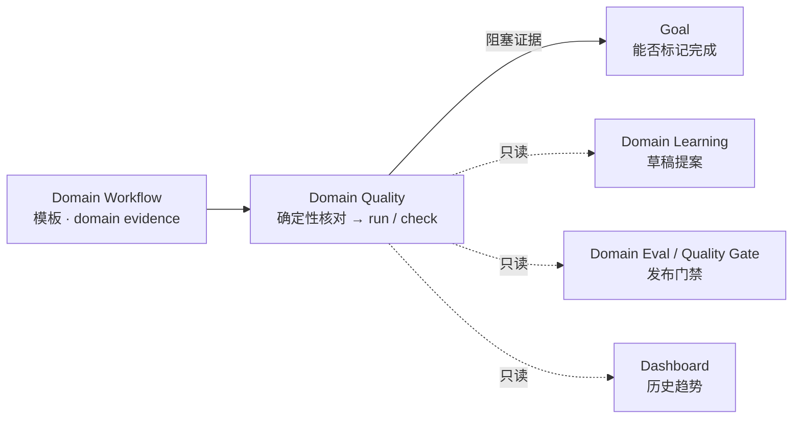
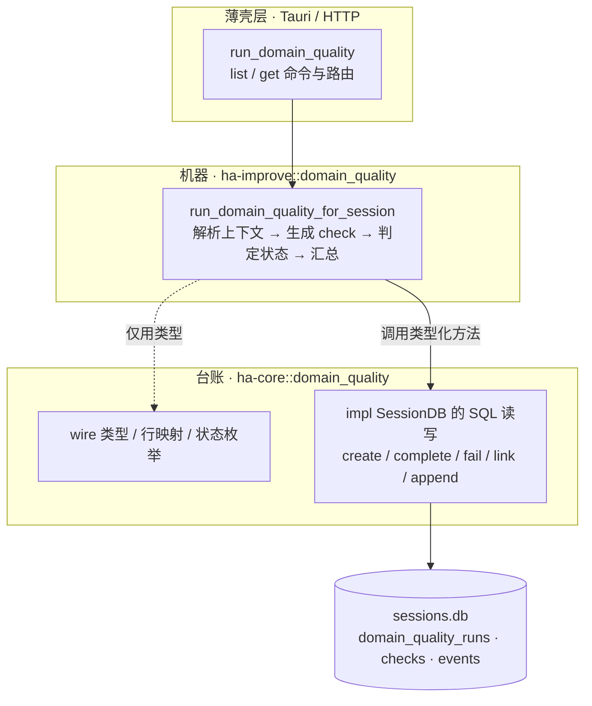
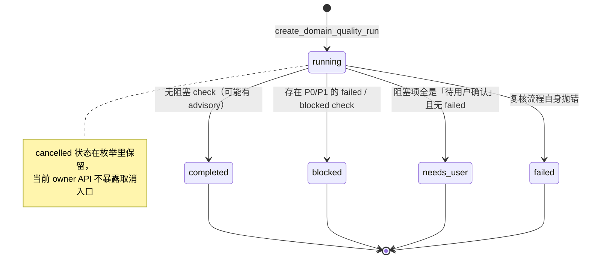
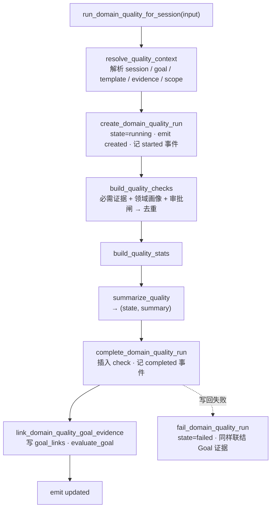
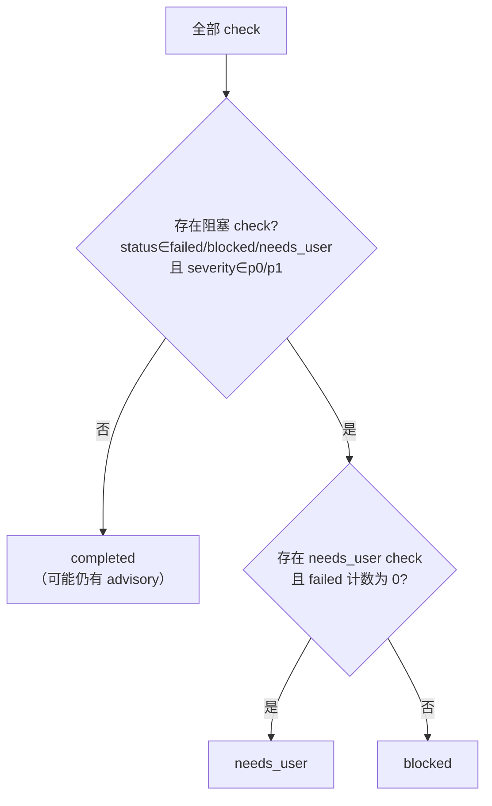

# Domain Quality 领域质量复核

> 返回 [技术文档索引](../../README.md)
>
> 更新时间：2026-07-23
>
> 关联源码：台账 [`crates/ha-core/src/domain_quality.rs`](../../../crates/ha-core/src/domain_quality.rs)；机器 [`crates/ha-improve/src/domain_quality.rs`](../../../crates/ha-improve/src/domain_quality.rs)；HTTP 路由 [`crates/ha-server/src/routes/domain_quality.rs`](../../../crates/ha-server/src/routes/domain_quality.rs)；Tauri 命令 [`src-tauri/src/commands/domain_quality.rs`](../../../src-tauri/src/commands/domain_quality.rs)。

## 核心思想

代码有天然的「对错」判据：改了哪些文件、跑了哪些命令、退出码是几。Code Review 绑文件与行号，Smart Verification 绑命令与 cwd，二者都长得像代码。但长任务里更多的是**非编程产物**——一份调研 brief、一封待发邮件、一份会议纪要、一张数据看板。这些东西没有编译器，没有退出码，却同样需要「做完了吗、可靠吗、能不能发出去」的判断。

Domain Quality 把「复核 / 验证」的能力从代码扩展到这些领域，而**不去改造**既有的 Code Review Engine 和 Smart Verification。它的关键想法只有一句：

> 不发明新事实，只把「已经记录在案的领域证据」按领域画像和审批闸做一次**确定性**的核对。

它读的是 Domain Workflow 已经沉淀下来的 domain evidence（引用、claim check、审稿记录、审批决策……）、模板声明的必需证据与审批门，然后判成一份可持久化的 run / check / event。整个过程是纯确定性的：不调 LLM、不写状态、不碰连接器、不发送任何东西。这样既不会把一份报告伪装成「代码 finding」，也不会把「引用缺失」伪装成「shell 命令失败」。

它在系统里扮演的是**事实源**：Goal 拿它的结论决定要不要阻塞完成，Domain Learning / Domain Eval / Gate / Dashboard 都只**读**它、绝不反写它。



## 分层：机器与台账

这个子系统横跨两个 crate，分界线是一条清晰的规则：**方法是否直接触碰 `sessions.db` 连接**。凡是执行 SQL 的、以及被它们内联调用到的，全部留在 kernel 作为「台账」；不碰连接、只做编排的顶层入口，上浮到特征 crate 作为「机器」。

| 层 | 位置 | 内容 |
|---|---|---|
| **台账** | `ha-core::domain_quality` | wire 类型、行映射、状态枚举、`ensure_tables`，以及全部直接执行 SQL 的 `impl SessionDB` 方法（创建 / 完成 / 失败 run、插入 check、追加 event、goal evidence 联结） |
| **机器** | `ha-improve::domain_quality` | 顶层编排：解析上下文、生成候选 check、判定 run 状态、汇总 stats。一处连接都不碰，只调台账的类型化方法 |

固有 `impl` 不能跨 crate，所以上浮到 ha-improve 的方法以自由函数 `fn f(db: &SessionDB, …)` 的形式存在（如 `run_domain_quality_for_session`）。ha-improve 的生产代码对数据库零直接触点。新增 owner 入口时遵循同一分工：**SQL 写台账，编排写机器**。ha-improve 的分层背景见 [前后端分离架构](../system/backend-separation.md)。



## 数据模型

`SessionDB::open()` 会调用 `domain_quality::ensure_tables()`（与 goal / workflow / review / verification 等一同建表），创建三张表：

| 表 | 说明 | 关键列 |
| --- | --- | --- |
| `domain_quality_runs` | 一次领域质量复核 | `id`、`session_id`、`goal_id`、`domain`、`template_id`、`template_version`、`state`、`summary`、`stats_json`、`error`、`created_at` / `updated_at` / `completed_at` |
| `domain_quality_checks` | run 下的复核项 | `run_id`、`session_id`、`seq`、`check_type`、`profile`、`title`、`body`、`severity`、`status`、`evidence_type`、`source_metadata_json` |
| `domain_quality_events` | run 的时间线 | `run_id`、`seq`、`kind`、`payload_json`；事件 payload 落库前截断到 64KB preview |

三张表都以 `session_id` / `run_id` 外键 `ON DELETE CASCADE`，`goal_id` 则 `ON DELETE SET NULL`（Goal 删了不连带删复核历史）。单次 run 最多写入 80 条 check（超出截断），check 之间按 `(check_type, profile, title, evidence_type)` 去重。

### Run 状态

run 是一次同步确定性检查，`running` 通常瞬间即过，最终落到一个终态。终态**不是随意流转的状态机**，而是由本次生成的 check 集合一次性推导出来的（推导规则见下文「判定原理」）。



### Check 状态与严重级

每条 check 同时带一个 `status` 和一个 `severity`。二者组合决定它是否**阻塞 Goal**——这是理解整个子系统的关键。

| Check status | 语义 | 阻塞 Goal？ |
| --- | --- | --- |
| `passed` | 通过 | 否 |
| `failed` | 必需 evidence 或领域质量要求缺失 | 是 |
| `blocked` | 预留给未来连接器 / 外部系统阻塞 | 是 |
| `needs_user` | 高风险动作必须用户确认后才能继续 | 是 |
| `advisory` | 建议项，不阻塞 | 否 |

| Severity | 是否 blocking |
| --- | --- |
| `p0` | 是 |
| `p1` | 是 |
| `p2` | 否 |
| `p3` | 否 |

一条 check 真正「阻塞 Goal」当且仅当 **status ∈ {failed, blocked, needs_user} 且 severity ∈ {p0, p1}**。这个联合谓词在台账（goal evidence 联结）与机器（run 状态判定）两处使用同一套语义，是全模块的核心开关。

## 复核流程

顶层入口 `run_domain_quality_for_session(db, input)` 是一条直线：先把输入解析成一个 `QualityContext`（会话、Goal、模板、领域证据、证据 scope），再据此生成 check、算 stats、判状态，最后一次性写回并联结 Goal 证据。run 创建成功后，写回阶段（`complete_domain_quality_run`）失败会把 run 标为 `failed` 并同样联结 Goal 证据。



### 判定原理：从 check 到 run 状态

三类 check 各有生成规则，合并去重后由 `summarize_quality` 一次性推导 run 状态。

**① 必需证据 check（`required_evidence` profile）**——遍历模板的 `required_evidence`，把该类型的实际证据数与 `min_count`（下限取 1）比较：

- 达标 → `passed` / `p3`
- 未达标且 `required=true` → `failed` / `p1`（阻塞）
- 未达标但 optional → `advisory` / `p3`（不阻塞，只提示证据偏薄）

**② 领域画像 check（按 domain 分支）**——大多是阈值判定 `threshold_check`：某类证据数 ≥ 阈值则 `passed` / `p3`，否则 `failed` / `p1`。另有两个特化 check：research 的「来源时效」看每条 `source_cited` 是否带 `retrievedAt` / `publishedAt` / `date`；data_analysis 的「指标定义」看 `data_quality_checked` 是否带 dataset / metric / denominator / sampleSize。纯建议性的 `advisory_check` 恒为 `advisory` / `p3`。

**③ 审批闸 check（`approval_gate` profile）**——遍历模板中 `required=true` 的审批门。逻辑是这条子系统「默认不越权」的落点：

- 已带 `explicitUserApproval` → `passed` / `p3`
- 否则，若本次**确实请求了**该高风险动作（`sourceMetadata.requestedAction` 命中门的 action，或 `highRiskAction=true`）→ `needs_user` / `p0`（阻塞）
- 否则（存在门但没请求对应动作）→ `advisory` / `p3`

也就是说，普通草稿复核**不会**因为模板挂着「发布 / 发送」门就提前阻塞；只有真的要执行高风险动作、又没拿到确认时才 fail closed 成 `needs_user`。

得到全部 check 后，`summarize_quality` 按下面这张决策表推导终态。注意 `needs_user` 是个**受限**终态：只有当阻塞项**全是**待确认、且**没有** failed 时才成立；若同时存在 failed 与 needs_user，run 落 `blocked`。



## 复核输入

`run_domain_quality` 接收 `RunDomainQualityInput`：

| 字段 | 说明 |
| --- | --- |
| `sessionId` | 必填；incognito 会话直接拒绝（不落 durable）。 |
| `goalId` | 可选；不传时自动绑定该会话当前 active 的 Goal。 |
| `domain` | 可选；不传时从模板、Goal 文本、domain evidence、artifact kind 推断。 |
| `templateId` / `templateVersion` | 可选；指定 Domain Workflow 模板；省略 version 时解析当前最新可用版本。 |
| `profiles[]` | 可选；用于 stats / trace。默认注入 `domain`、`required_evidence`、`approval_gate` 三个 profile 名。 |
| `artifactTitle` / `artifactKind` | 可选；用于产物复核入口、domain 推断与证据 scope 收窄。 |
| `sourceMetadata` | 可选自由 JSON；放 `requestedAction`、`highRiskAction`、`sourceType`、artifact path / guard status 等上下文。 |
| `explicitUserApproval` | 高风险动作的显式用户确认（true 时审批闸直接 pass）。 |

### 模板与 domain 解析优先级

`resolve_domain_quality_template` 按以下优先级取第一个命中的（高者胜出）：

1. `templateId` / `templateVersion` 显式指定的模板。
2. 显式 `domain` 对应的最新可用模板——一旦给了 domain，就直接用它、跳过下面的 Goal 与推断分支。
3. 仅当**未给** domain 时，若绑定的 Goal 带 `workflow_template_id`，用 Goal 绑定的模板 / 版本。
4. 推断 domain：先看 `artifactKind`，再看 Goal 的 `domain` 字段与 objective / completion criteria 关键词。
5. 当前 session / goal 的 domain evidence 计数（出现最多的 domain）。
6. 兜底 `writing`。

关键词推断（`infer_domain_from_text`）中英双语命中：数据 / 指标 / 图表 → `data_analysis`；邮件 / 收件 / 回复 → `inbox`；会议 / 日程 / 议程 → `meeting_prep`；知识 / 笔记 → `knowledge_curation`；调研 / 引用 / 资料 → `research`；项目 / 进度 / 风险 → `project_ops`；否则 `writing`。

## 领域画像

Domain Quality 复用 Domain Workflow 模板的三类信号：`requiredEvidence`（缺失生成 P1 failed）、`verificationPolicy`（当前以领域 profile 的确定性规则落地）、`approvalGates`（按上文审批闸逻辑判定）。已落地的领域画像：

| Domain | 检查重点 |
| --- | --- |
| `research` | ≥3 个 `source_cited`、≥2 个 `claim_checked`、citation audit、来源时效 metadata |
| `writing` | draft artifact 存在、按受众 / 需求审稿、术语与引用缺口 advisory |
| `data_analysis` | data quality evidence、指标解读、dataset / denominator / sample metadata |
| `meeting_prep` | 会议上下文、brief / agenda、决策点与风险 advisory |
| `inbox` | thread / message 来源、facts / commitments 核对、发送前审批 |
| `knowledge_curation` | source notes、去重 / 缺口审查、curated note / index |
| `project_ops` | status / plan artifact、风险与依赖、owners / tradeoffs 审批 |

未命中任何画像的 domain 走一条通用 `advisory` check，退回依赖必需证据与审批闸。

## Goal 语义

run 结束后（无论 completed 还是 failed）都会写入 `goal_links`，再调用 `evaluate_goal(goal_id)`：

| Relation | 触发 run 状态 | Goal 影响 |
| --- | --- | --- |
| `domain_quality_passed` | `completed` | 正向强证据；可解除较早的领域质量阻塞 |
| `domain_quality_needs_user` | `needs_user` | 阻塞证据，metadata 指明需要用户确认 |
| `domain_quality_blocked` | `blocked` / 兜底 | 阻塞证据 |
| `domain_quality_failed` | `failed` | 阻塞证据 |
| `domain_quality_check` | 任意 | 仅对阻塞 check（P0/P1 且 failed/blocked/needs_user）逐条写入，作为细粒度阻塞证据 |

因此非编程产物缺关键证据、或高风险动作缺确认时，Goal 会进入 `blocked`，不会被错误标记为完成。Goal 本身没有独立的 `needs_user` 态，所以「需用户确认」这层语义保留在 DomainQualityRun 状态与 Goal evidence 的 metadata 里。

## Artifact 证据 scope

一个会话里可能同时躺着多份产物的证据。若不加约束，别的产物的 evidence 会把本次复核「托过关」。当输入带 artifact 上下文（title / kind / path / id）时，`scope_domain_quality_evidence` 会先把证据收窄到匹配本次目标的记录。匹配优先级为 **id > path > title**；`kind` 只在没有更具体目标时才作为回退条件，且要求证据类型是 `artifact_created` / `artifact_reviewed`。

scope 结果写入 `run.stats.evidenceScope` 与 `domain_quality_started` 事件 payload，Workspace 摘要卡片展示 scope label 与 matched / total 计数：

| mode | 说明 |
| --- | --- |
| `all` | 本次没有 artifact target，用 session / domain 全量证据。 |
| `artifact_matched` | 已有证据带 artifact 线索，只保留匹配 target 的记录。 |
| `legacy_fallback_all` | 本次有 target，但历史证据**完全没有**任何 artifact 线索；为避免旧记录突然全部失效，回退全量证据，并在 stats / event 中显式标记。 |

`legacy_fallback_all` 是一处非显然的兼容保护：它区分「证据不匹配这个产物」（应收窄）与「证据根本还没记录任何产物线索」（不该因新引入的收窄逻辑把老账全判失效）。

## Domain Learning 输入

`build_domain_learning_proposal_candidates()`（由 `generate_coding_improvement_proposals()` / `distill_coding_improvement_proposals()` 调用）读取当前 scope 内的 Domain Quality 快照，把领域质量结果转成 **draft-only** 的改进提案。生成入口支持 `sourceType` / `sourceId` / `proposalKinds` 过滤；Workspace「领域复核」里的「提炼经验」按钮以 `sourceType="domain_quality"` + `sourceId=<run_id>` 传入，只从这一次复核提炼，不泛扫同 scope 的其它信号。

| Quality 信号 | 生成的 Proposal kind |
| --- | --- |
| `completed` run | `domain_workflow_template`、`domain_guidance` |
| `blocked` / `failed` / `needs_user` run | `domain_review_profile`、`domain_eval_case` |
| 上述 run 中含 `approval` check 进入 `needs_user` | 追加 `connector_usage_pattern` |

Domain Quality 本身不写模板、不写 guidance、不改连接器策略——它只提供 run / check / evidence 事实。所有学习产物都必须走 Coding Improvement Loop 的 preview → apply draft → 用户显式 promotion 链路（详见 [coding-improvement-loop](coding-improvement-loop.md)）。GUI 侧的语义边界：

- 「重跑复核」只重新执行 Domain Quality，不生成学习候选。
- 「提炼经验」只生成 draft proposal，用户仍需在提案队列里预览、应用草稿、显式晋升。
- 已晋升的 `domain_eval_case` 提案会在质量趋势卡片显示「导入评测」；点击后把 JSON artifact 导入 `domain_eval_tasks`，供 `list_domain_eval_tasks` / `run_domain_eval_task` 使用。
- 无痕会话禁用「提炼经验」，保持关闭即焚。

## Domain Eval / Quality Gate 输入

`run_domain_eval_task()` 会读取显式 `sourceQualityRunId` 或最近同 domain 的 Domain Quality 快照，把 quality 状态与 checks 纳入确定性打分。`evaluate_domain_quality_gate()` 聚合窗口内的 `domain_quality_runs` 与 approval check，作为发布门禁的一部分：

- `completed` quality run 计入通过证据（`domain_quality_runs` 覆盖度）。
- `blocked` / `failed` / `needs_user` quality run 计入 `blocked_domain_quality` blocker。
- `approval` check 的 `needs_user` / `failed` / `blocked` 计入 `approval_safety` blocker。

Domain Quality 仍是复核事实源；Eval / Gate 只读这些事实，绝不反写 quality run。被晋升导入的 `domain_eval_case` 只扩展 eval task 注册表，不修改历史 run / check。门禁其余检查项（eval run 数、pass rate、平均分、domain 覆盖）见 [domain-eval](domain-eval.md)。

## Artifact 复核入口与交付守门

Workspace「交付守门」卡片在报告带 `artifactTitle` / `artifactKind` / `artifactPath` 时展示「复核产物」。点击调用既有 `run_domain_quality`，传入该 artifact 的 domain / title / kind，以及 `sourceMetadata.sourceType="artifact_export_guard"` 与 `artifactPath` / `artifactGuardStatus`。这是一条面向用户本人的复核入口，不新增执行系统：它按当前 template 的必需证据与审批闸做确定性复核，并把证据收窄到匹配该 artifact 的记录；artifact 上下文进入 `domain_quality_started` 事件与 run stats。按钮**不会**创建 WorkflowRun、导出产物、访问连接器或批准外部动作。

当 artifact-scoped 的 run 以 `completed` 结束后，摘要卡片提供「记录复核证据」action。它只写入一条 `artifact_reviewed` domain evidence（`sourceMetadata.sourceType="domain_quality"`，附 run id、template、quality state、artifact 信息、`evidenceScope`、`reviewCompleted=true`）。它**不写** `exportReview` / `exportReady` / `redactionChecked`，因此绕不过 Artifact Export Guard 对「显式导出复核 / 可交付确认 / 脱敏检查」的独立要求。写入成功后刷新交付守门与外部动作守门，让下一轮模型与 GUI 都感知复核已落盘。

## Dashboard 趋势

Dashboard Learning 的 `dashboard_coding_improvement` 返回 `domainQuality` 历史趋势区块。该区块**只读**，用于可观察性，不做阈值判定、不阻塞发布、不写学习产物：

- `domain_quality_runs`：按状态统计 completed / blocked / failed / needs_user，并给出 recent runs、按 domain 拆分、timeline。
- `domain_quality_checks`：统计 approval blockers 与 top blocker reason。
- `domain_eval_runs`：统计 domain eval pass rate、平均分与按领域覆盖。
- `coding_improvement_proposals`（`source_type='domain_quality'`）：统计领域学习草稿 / 晋升数量。

它与 `evaluate_domain_quality_gate()` 边界不同：Dashboard 是历史视图，Quality Gate 是当前 scope / window 的门禁判定。

## Owner API 与事件

Tauri 命令、HTTP 路由、transport 均已注册（新 invoke 须同时实现两套适配）：

| Tauri Command | HTTP | 说明 |
| --- | --- | --- |
| `list_domain_quality_runs` | `GET /api/sessions/{sessionId}/domain-quality-runs` | 列出当前会话的领域复核 run |
| `get_domain_quality_run` | `GET /api/domain-quality-runs/{runId}` | 返回 run + checks + events 快照 |
| `run_domain_quality` | `POST /api/domain-quality-runs/run` | 执行一次同步确定性复核（HTTP body 为 `{ input }`） |

EventBus 事件：

| 事件名 | 触发点 |
| --- | --- |
| `domain_quality:created` | run 创建 |
| `domain_quality:updated` | run completed / failed |
| `domain_quality:check_updated` | check 记录 |
| `domain_quality:event` | run event 追加 |

## Workspace 交互

Workspace 面板的「领域复核」区块位于「代码审查」和「验证」之后：

- 无需工作目录，适合纯调研 / 写作 / 邮件 / 会议任务。
- 展示通过、缺失、需确认、建议四类计数，以及最近 run 的 summary、domain、template 与 artifact 证据 scope（全量 / 产物 / 旧证据回退）与 matched / total。
- 优先列出非 passed 的 check；全部通过时展示少量 passed / advisory。
- 支持运行领域复核与刷新；监听 `domain_quality:*` 事件，长任务完成或事件到达时自动刷新。
- artifact-scoped 的 completed run 支持「记录复核证据」，把本次复核通过写回 `artifact_reviewed` evidence，但不替代导出复核、脱敏检查或外部动作批准。
- 内嵌「交付守门」卡片调用 `evaluate_domain_artifact_export_guard`，展示最终产物是否已创建 / 已复核、是否存在 private / connector / sensitive / pending / redacted evidence、是否缺显式 export review；卡片内可显式记录「导出复核 / 可交付确认 / 脱敏复核」marker，这些 marker 只写入新的 `artifact_reviewed` evidence，不修改原证据的脱敏状态。
- incognito 会话不显示 durable 结果，只显示禁用提示。

## 红线

- **不破坏 coding**：不改 `review_runs / review_findings`、`verification_runs / verification_steps` 的语义。
- **不伪造外部事实**：只检查已记录的 evidence 与输入 metadata，不主动访问连接器。
- **不默认越权**：高风险动作只有在明确请求时才需要 approval；缺 approval 时 fail closed 成 `needs_user`。
- **不写无痕**：incognito 会话拒绝创建 durable run。
- **不自动发送 / 发布 / 改外部系统**：只产出质量结论与 Goal evidence。
- **不自动学成正式规则**：Domain Learning 只能读事实、生成草稿；正式模板 / guidance / connector pattern 必须用户显式 promotion。

## 验证

定向测试全部在机器 crate（kernel 侧只剩台账，`-p ha-core` 对本模块零覆盖）：

```bash
cargo test -p ha-improve domain_quality --locked
```

覆盖的核心行为：research 缺必需证据 → 生成 failed check、run 进入 `blocked` 并阻塞 Goal；Goal 已绑模板时未显式指定 domain / template 的复核优先用 Goal 模板 / 版本；inbox `send_message` 高风险动作缺确认 → 生成 P0 `needs_user` approval check；artifact target 缺失 / 匹配 / 旧证据回退三种证据 scope；Domain Learning 从 quality run 生成可复核草稿（另在 Coding Improvement Loop 的测试中覆盖）。

跨运行模式编译自查：

```bash
cargo check -p ha-server -p hope-agent --locked
pnpm typecheck
```

## 延伸阅读

- [domain-workflow](domain-workflow.md)：模板、domain evidence 与审批门的来源。
- [domain-eval](domain-eval.md)：确定性评测与质量门禁的完整判定。
- [coding-improvement-loop](coding-improvement-loop.md)：learning 提案的 preview → apply → promotion 链路。
- [goal](goal.md) / [workflow](workflow.md)：Goal 证据评估与工作流生命周期。
- [dashboard](../infra/dashboard.md)：`domainQuality` 趋势区块的完整口径。
- [backend-separation](../system/backend-separation.md)：机器 / 台账分层的通用规则。
