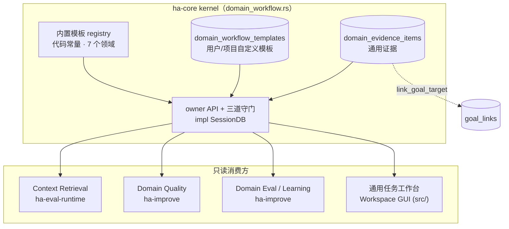
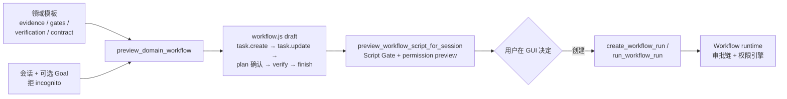
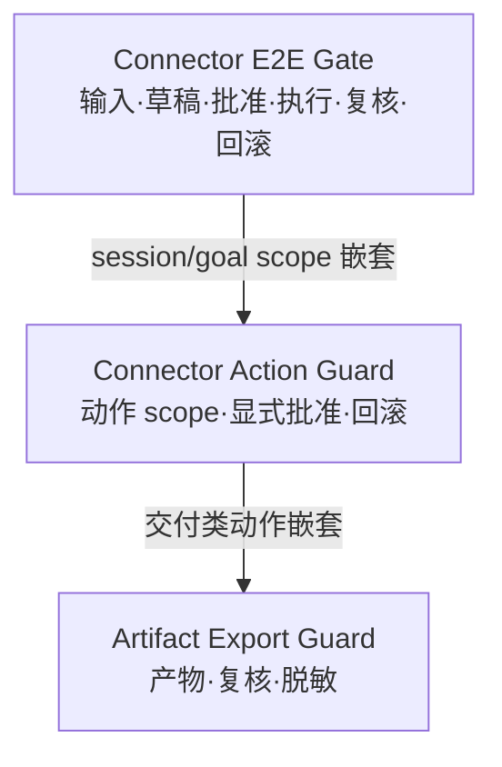

# Domain Workflow 控制平面

> 返回 [技术文档索引](../../README.md)
>
> 更新时间：2026-07-23
>
> 关联源码：`crates/ha-core/src/domain_workflow.rs`（模板 registry、证据台账、三道守门、owner API）· `crates/ha-server/src/routes/domain_workflow.rs`（HTTP 适配）· `crates/ha-core/src/workflow/runtime.rs`（`workflow.evidence.record` 脚本原语）· `crates/ha-eval-runtime/src/context_retrieval.rs`（只读消费）· `src/components/chat/workspace/WorkspacePanel.tsx`（通用任务工作台 GUI）

## 核心思想

Hope Agent 的长任务底座——Goal / Mode / Workflow / Task / Evidence——是围绕编程需求打造的，证据都长成 diff、validation、file 的样子。可是「写一份市场调研」「起草一封邮件」「做一次 KPI 诊断」这类非编程长任务，同样需要一套稳定的工作习惯——先收集来源、列出必须的证据、约定哪些动作要用户确认、发布前做复核，出错了还能说清怎么回滚。

Domain Workflow 就是把这套底座**平移到非编程领域**。它的关键取舍是：

- **不发明新 DSL、不替代模型的动态判断**。它只提供一组可版本化、可预览、可审批的「领域工作习惯」模板，模型该怎么想还怎么想。
- **证据是一等公民**。调研引用、数据质检、用户决策不再伪装成 coding 证据，而是记进独立的通用证据台账，可以链接回 Goal。
- **能力叠加而非改造**。它复用已有的 Script Gate、权限引擎、审批链、Goal evidence 关系；coding 的 review / verification / eval / benchmark 一行不改。
- **owner 侧只读、不越权**。模板只描述推荐工具和审批门，不授予任何连接器权限；预览只生成草稿，真正执行外部动作永远要过工具审批和连接器授权。

一句话：Domain Workflow 让「能力不只适用于 coding 场景」，同时守住「不扩权、不自动执行、不污染全局、不写无痕」四条边界。

整个子系统常驻 ha-core kernel（零 Tauri 依赖）：两张 `sessions.db` 表、模板 registry、三道只读守门和 owner API 都在 `domain_workflow.rs` 里；下游的 Context Retrieval、Domain Quality、Domain Eval / Learning、以及 Workspace GUI 都只**只读消费**它产出的事实。



## 数据模型

`SessionDB::open()` 启动时调用 `domain_workflow::ensure_tables()`，在 `sessions.db` 里建两张表。业务编排可以下沉到消费方 crate，但这份 SQL 台账恒留 kernel。

| 表 | 主键 | 关键字段 | 用途 |
| --- | --- | --- | --- |
| `domain_workflow_templates` | `(id, version)` | `domain`、`task_types`、`default_mode`、`required_evidence`、`recommended_tools`、`approval_gates`、`verification_policy`、`stop_conditions`、`output_contract`、`eval_criteria`、`prompt_hints`、`scope`、`project_id`、`enabled` | 用户 / 项目自定义模板。 |
| `domain_evidence_items` | `id` | `goal_id`、`session_id`、`project_id`、`domain`、`evidence_type`、`title`、`summary`、`source_metadata_json`、`confidence`、`access_scope`、`redaction_status` | 通用证据。`session_id` 外键 `ON DELETE CASCADE`，`goal_id` 外键 `ON DELETE SET NULL`。 |

内置模板不落库，而是由代码 registry 直接提供——这样首次启动无需迁移任何数据就能用。用户 / 项目自定义模板通过 owner API 显式保存（`explicitSaveConsent=true`），并且**不能覆盖内置模板的同 id/version**，也不能占用 `built_in` scope。

## 内置领域

registry 内置 7 个领域模板，覆盖典型非编程长任务，默认模式均为 `guarded`：

| Template | Domain | 典型任务类型 |
| --- | --- | --- |
| `research-brief` | `research` | 市场调研、技术调研、竞品分析 |
| `writing-brief` | `writing` | 决策 memo、PRD、周报、方案文档 |
| `data-analysis-readout` | `data_analysis` | 指标诊断、KPI readout、dashboard review |
| `meeting-prep` | `meeting_prep` | 会议 brief、议题与风险梳理 |
| `knowledge-curation` | `knowledge_curation` | 主题索引、知识整理、资料综合 |
| `inbox-comms` | `inbox` | 邮件回复草稿、线程分类、跟进计划 |
| `project-ops` | `project_ops` | 项目状态、风险登记、计划复核 |

每个模板都声明了同一组结构化字段，喂给下游各消费方：

- **required evidence**：如 `source_cited`、`claim_checked`、`data_quality_checked`、`message_draft_approved`，带 `required` 标记、`min_count` 与期望的 `metadata_keys`。
- **approval gates**：如发布 / 发送 / 分享 / 外部系统修改前必须用户确认。
- **verification policy**：如引用时效、claim 交叉核查、结构复核、口径与样本量检查，分 `blocking` / `advisory` 严重度。
- **stop conditions**：上下文缺失、用户确认缺失、数据质量失败等必须停机的情形。
- **output contract 与 prompt hints**：只进入生成的 workflow draft 动态载荷，**不污染全局 system prompt**。

## Workflow Draft 生成

`preview_domain_workflow(input)` 把模板变成一份可审查的脚本草稿，但**只到草稿为止**：



它做三件事：

1. 解析模板、会话、可选的 active / open Goal（Goal 必须属于该会话），**拒绝 incognito 会话**。
2. 渲染 `workflow.js` 草稿：创建 task 并写入领域计划；按 `requirePlanConfirmation` 决定是否用 `workflow.askUser` 要求用户确认计划（否则记一条 trace 跳过）；生成 `workflow.verify` 复核计划；最后 `workflow.finish` 返回模板 / 证据 / 审批 / 验证摘要，以及一个显式 budget hint（`max_runtime_secs` / `max_ops`）。草稿的 `workflowKind` 形如 `domain:<domain>`。
3. 调用既有 `preview_workflow_script_for_session`，附上 Script Gate 与 permission preview。

**草稿不是执行**：它不自动创建 WorkflowRun、不自动运行、不访问连接器、不发送消息、不写外部系统。真正执行仍必须走已有的 `create_workflow_run` / `run_workflow_run` 和完整审批链。

`requirePlanConfirmation` 默认 `true`，服务 GUI 里的手动草稿确认。Loop 自动创建 WorkflowRun 时显式传 `false`——否则无人值守环境一启动就会被 `askUser` fail-closed 卡死。但自动路径仍不绕过 Script Gate、permission preview、运行时权限引擎或 Domain Quality 的 approval gate。

## General Evidence

通用证据是这套子系统的价值核心：把非编程工作里真正发生过的事实记成结构化一等证据。支持的 `evidence_type` 恒定为下列 13 种（`normalize_evidence_type` 白名单，未知类型直接报错）：

| Evidence Type | 用途 |
| --- | --- |
| `source_cited` | 来源、网页、文档、邮件、笔记被引用。 |
| `claim_checked` | 关键 claim 被核查，含 verdict / conflict / confidence。 |
| `user_decision` | 用户显式做出的决策、确认或取舍。 |
| `artifact_created` | 创建报告、brief、草稿、表格、索引等产物。 |
| `artifact_reviewed` | 产物被结构、读者、引用、完整性等维度复核。 |
| `data_quality_checked` | 数据源、口径、样本、异常值、计算等完成质量检查。 |
| `citation_audited` | 引用覆盖率、时效和来源可信度审计完成。 |
| `message_draft_approved` | 邮件 / 消息草稿发送前得到用户明确批准。 |
| `meeting_context_collected` | 日历、材料、参会人、历史决策等会议上下文被收集。 |
| `connector_context_collected` | Gmail / Calendar / Drive / Sheets / Feishu / Lark 等连接器读取或 deterministic fixture 上下文已收集。 |
| `connector_draft_created` | 外部系统修改前的草稿、预览或 proposed change 已生成并可展示。 |
| `connector_action_executed` | 外部连接器动作已执行，metadata 必须保留 connector / action / result id 或 status。 |
| `connector_action_verified` | 执行后已读回或复核外部系统状态。 |

`record_domain_evidence(input)` 要求 `goalId` 或 `sessionId`，写入时做一组归一与守卫：

- 会话必须存在且**非 incognito**。
- 若传 `goalId`，session 从 goal 解析；如果同时传了 `sessionId`，两者必须一致，避免跨会话伪造证据。project 同理跟随会话绑定校验。
- `sourceMetadata` 必须存成 JSON object，非 object 会包成 `{ value }`。
- `confidence` clamp 到 `[0,1]`。
- `accessScope` 归一为 `public | session | project | connector | private`（默认 `session`）。
- `redactionStatus` 归一为 `none | redacted | pending | sensitive`（默认 `none`）。
- 若关联 goal，调用 `link_goal_target(goal_id, "domain_evidence", evidence_id, evidence_type, metadata)`，让证据进入 Goal detail、criteria audit 与 final audit。Goal evidence relation 白名单以**加法**扩展这些通用类型，coding relation 保持原样。
- 成功写入后 emit `domain_evidence:recorded` EventBus 事件，payload 只含 `{ id, sessionId, goalId, projectId, domain, evidenceType, title, createdAt }` 摘要——**不广播完整 `summary` 或 `sourceMetadata`**。Workspace Context 与通用任务工作台监听该事件刷新。

### 脚本内 sugar

Workflow runtime 提供 `workflow.evidence.record({ domain, evidenceType, title, summary?, sourceMetadata?, confidence?, accessScope?, redactionStatus? })`。它复用 `record_domain_evidence`，但 scope 由 runtime **强制改写**为当前 workflow 的 `session_id` / `goal_id` / project——脚本不能跨 session / goal / project 写证据（越界直接 bail）。写入时还会在 `sourceMetadata.workflow` 追加 `runId`、`opKey`、`sessionId`、`goalId`、`executionMode`，供 Goal detail、Context Retrieval 与 Domain Quality 追溯来源。

## 三道交付守门

真实外部修改的验收被拆成一条升级链——**读取 → 草稿 → 批准 → 执行 → 执行后复核 → 回滚说明**——由三个只读 gate 逐层把关。它们全部只读 `domain_evidence_items`（Connector 类还读下层 gate 报告），**不调用 LLM、不访问连接器、不发邮件、不改日历、不分享文档、不更新外部记录**。它们只给出结论；真正的外部修改仍逐次走 `permission::engine` strict 审批和连接器授权。

三者是嵌套关系：交付类动作要过 Artifact Export Guard，真实连接器动作再在其外套一层 Connector Action Guard，端到端验收再在最外层套 Connector E2E Gate。



三个 gate 的输出结构一致：`status = passed | failed | insufficient_data`，外加 `checks[]`、`blockers[]`、`recommendedNextSteps[]`、summary 计数和一批相关 evidence。`status` 聚合规则也一致——**任一 check `failed` 即 failed，否则任一 `insufficient_data` 即 insufficient_data，全 passed 才 passed**。三者都要求 `sessionId` 或 `goalId`（goal 会解析并校验会话归属），并对 incognito 会话 fail closed。

### Artifact Export Guard

`evaluate_domain_artifact_export_guard(input)` 用于最终发送 / 分享 / 导出 / 发布前的产物审查。可选 `artifactPath/title/kind` 仅进入报告展示和 Workspace「复核产物」入口，**不作为授权条件**。

| 阈值字段 | 默认 | 说明 |
| --- | --- | --- |
| `requireArtifactCreated` | `true` | 必须存在 `artifact_created` evidence，否则 `insufficient_data`。 |
| `requireArtifactReviewed` | `true` | 必须存在 `artifact_reviewed` evidence，否则 `insufficient_data`。 |
| `maxRedactionPending` | `0` | `redactionStatus=pending|sensitive` 的证据数超过上限即 `failed`。 |
| `maxSensitiveUnreviewed` | `0` | 敏感证据缺显式导出复核，数量超过上限即 `failed`。 |

判定要点：

- 敏感证据 = `accessScope` 为 `private|connector`，或 `redactionStatus` 为 `sensitive|pending|redacted`。
- 「已完成导出复核」的判定是**集合级而非逐条配对**：只要该会话（可选按领域过滤）的证据里**存在一条**带 `exportReview=true` / `exportReady=true` / `redactionChecked=true` 标记的 `artifact_reviewed`（也接受 `export.reviewed`、`review.exportReady` 等嵌套写法），全部敏感证据即算已复核；一条都没有时，所有敏感证据都计入 `sensitiveUnreviewed`。
- `pending|sensitive` 脱敏状态默认直接拉 `failed`；`redacted` 不算「待脱敏」（不进 redaction check），但仍要求显式导出复核。
- 输出最多 12 条需复核 evidence。

### Connector Action Guard

`evaluate_domain_connector_action_guard(input)` 用于 Gmail / Calendar / Drive / Sheets / Feishu / Lark / Slack / Notion / Jira / GitHub / Linear 等连接器的真实外部修改动作前置审查。可选 `toolName` 会通过 `permission::engine::classify_external_connector_action` 识别内置 Feishu 写动作与保守的 MCP mutating 工具名，也可显式传 `connector` / `action`。

| 阈值字段 | 默认 | 说明 |
| --- | --- | --- |
| `requireExplicitApproval` | `true` | 必须有 `message_draft_approved` / `user_decision`，或 evidence metadata 里的 `explicitUserApproval` / `approved` / `decision.approved`。 |
| `requireRollbackPlan` | `true` | 必须有 `rollbackPlan` / `undoPlan` / `recoveryPlan` / `canRollback`，让用户知道出错后怎么恢复。 |
| `requireExportGuardForDelivery` | `true` | send / reply / forward / share / publish / export / upload / submit 等交付类动作，要求 Artifact Export Guard 通过。 |

判定要点：

- `action_scope` 要求能识别工具名、connector/action，或至少一条带 `requestedAction` / `externalAction` / `toolName` / `connector` / `highRiskAction` 的证据。
- `explicit_user_approval` 缺失直接 `failed`——真实外部修改不能只靠模型自判。
- `rollback_plan` 缺失返回 `insufficient_data`，提示补撤销 / 修正 / 恢复路径。
- 交付类动作会嵌套调用 Artifact Export Guard；下层若因产物、复核、脱敏或敏感来源未过关，本 guard 同步阻断。

**执行层接入同一分类器**：`permission::engine` 对外部连接器写动作返回 strict `AskReason::ExternalConnectorAction`，禁止 AllowAlways，Smart judge 不得覆盖，IM/skill 的 `auto_approve_tools` 和 trusted MCP 的 `autoApprove` 也不能静默绕过；只有已在外层审批过的后台重入 `external_pre_approved` 可跳过重复弹窗。YOLO 仍按系统既有语义放行，但会写 `app_warn(permission/yolo_bypass)`。

### Connector E2E Gate

`evaluate_domain_connector_e2e_gate(input)` 用于真实连接器场景的端到端验收——回答「最近有没有足够证据证明真实连接器链路完整跑过一遍」。真实账号动作可以把结果写成 evidence，deterministic / mock fixture 也能写成同样结构的 evidence，但**没有证据时绝不伪装成通过**。

| 阈值字段 | 默认 | 说明 |
| --- | --- | --- |
| `requireConnectorInput` | `true` | 连接器输入证据（`accessScope=connector`、`connector` / `accountId` / `externalSource` metadata）。 |
| `requireDraft` | `true` | 草稿 / 预览证据（`connector_draft_created`、`message_draft_approved`，或带 `draftCreated` / `previewReady` 的 `artifact_created`）。 |
| `requireExplicitApproval` | `true` | 用户明确批准；缺失直接 `failed`。 |
| `requireExecutionResult` | `true` | `connector_action_executed`，或带 `execution/result/resultId/messageId/eventId/fileId/status` 的执行结果 metadata。 |
| `requirePostActionVerification` | `true` | `connector_action_verified`，或带 `verification.passed` / `externalStateVerified` / `postActionReview` 的复核证据。 |
| `requireRollbackPlan` | `true` | rollback / undo / recovery plan。 |
| `requireExportGuardForDelivery` | `true` | 交付类动作必须通过 Artifact Export Guard。 |

scope 行为是这个 gate 最需要注意的一点：

- **session / goal scope**：会校验会话存在且非 incognito，并嵌套复用 Connector Action Guard（后者必须 passed）；交付类动作继续要求 Export Guard 通过。
- **global / project scope**：只做证据聚合，**不**嵌套运行 Connector Action Guard，因此 `connectorActionGuard` 显示 `not_evaluated_without_session_or_goal`、整体保持 `insufficient_data`——用于 Dashboard 总览「最近证据是否够」，而非动作授权。
- 输入、草稿、执行、复核、回滚任一缺失即 `insufficient_data`（表示不能声称完成真实 E2E）；批准缺失即 `failed`。输出最多 16 条相关 evidence。

Dashboard Learning 有一张「Connector E2E」卡片，用 IN / DR / OK / EX / VF / RB / GU 七个计数（输入 / 草稿 / 批准 / 执行 / 复核 / 回滚 / 下层 guard）与 gate 状态回答这个问题；它不替代 Workspace 内逐次工具审批，也不替用户执行外部动作。

## 通用任务工作台

Workspace 右侧面板收着一个「通用任务工作台」区块（`WorkspacePanel.tsx`，位于 Advanced Diagnostics 下、「推荐上下文」之后）。它是**纯 GUI 聚合层**：不新增任何后端表，不改变任何执行 / 授权语义，把散落在各处的领域证据、复核、验证、守门压成一个同屏总览，让来源 / 证据 / 草稿 / 复核 / 验证 / 用户决策 / 真实样本验收 / 长任务健康一眼可扫。

### 聚合来源

| 来源 | 读什么 |
| --- | --- |
| `list_domain_evidence` | 当前会话最近的领域证据，统计 Sources / Evidence / Drafts / Review / Decisions。 |
| `evaluate_domain_artifact_export_guard` | 最终交付是否具备产物、复核、敏感来源导出复核与脱敏证据。 |
| `evaluate_domain_connector_action_guard` | 真实外部动作是否具备动作 scope、用户批准、回滚与交付守门证据。 |
| `evaluate_domain_connector_e2e_gate` | 真实连接器链路的输入 / 草稿 / 批准 / 执行 / 复核 / 回滚证据。 |
| `evaluate_domain_operational_gate` | 当前会话的 workflow / loop / campaign 是否有足够样本、失败残留或未排空运行。 |
| `generate_domain_soak_report` | 最近窗口内的 workflow / loop / campaign / connector E2E 事故、最长 drain 时长与建议。 |
| `useReviewRuns` / `useVerificationRuns` / `useDomainQualityRuns` | 复核 finding、验证 plan/run/step、领域复核 run/check。 |

写路径只来自用户的显式点击（详见下文「用户可见动作」），常见写入通过 `record_domain_evidence` / `create_owner_ask_user_question` + `respond_ask_user_question` / `create_session_task` 落成当前会话的 evidence / task。

### 状态语义

| 状态 | 含义 |
| --- | --- |
| `danger` | 存在 P0/P1 复核 finding、验证失败，或任一 gate（领域复核 / Export / Connector Action / Operational / Soak）failed。 |
| `warn` | 缺证据 / 缺来源 / 缺草稿、领域复核需用户确认、某 gate 证据不足，或仍有未排空长任务。 |
| `good` | 已有证据链且无上述阻塞 / 缺口。 |
| `muted` | 无痕会话、无 session 或尚未开始。 |

### 真实样本验收卡片

工作台里有一张「真实样本验收」只读派生卡片，回答「当前会话是否已经有真实场景样本可供验收」。它从证据、三道 gate 与 Soak Report 计算覆盖领域、控制面记录、已排空样本、事故 / 缺口等，把领域样本、证据链、排空样本、样本新鲜、跨天覆盖、预算健康、事故清零、守门通过、连接器 E2E（仅涉及外部动作时）逐项显示为通过 / 待补 / 阻塞。它**不启动采样、不调连接器、不改 gate 结果**。

派生出的两个只读判断供人工 / Claude Code review 定性：

- **验收结论**：`不可验收` → `待补样本` → `可局部复核` → `可验收`，由 danger 缺口、未通过必需项、warning 缺口与控制面样本数保守计算。
- **证据等级**：`未采样` / `阻塞样本` / `局部样本` / `局部验收` / `非外部动作候选` / `真实 E2E 候选`，说明这份材料只能用于采样待办、问题定位、局部复核、非外部动作验收，还是已含连接器执行 / 复核 evidence 可进入最终人工复核。

几个不读代码看不出的保守约定：

- **跨天覆盖**：多天 Soak 窗口默认要求至少 2 个不同自然日的真实活动样本（读后端 `sampleDays` / `requiredSampleDays`）；单日样本或最近活动超 24 小时（`latestActivityAgeSecs`）时 Soak 只能保持 `insufficient_data`，不当长期稳定性通过。1 天窗口只要求 1 天样本，避免短窗口被不可能的跨天要求卡死。
- **预算健康**：出现 `workflowBudgetExhaustedEvents` 时压低验收进度、显示阻塞，提醒先收窄上下文 / 拆分阶段 / 减少无效输出再跑最小验证样本；它不自动改预算、不自动重跑 workflow。
- **不误伤普通会话**：未涉及外部动作的会话不会因全局缺样本被强行判红；只有已有连接器证据 / 动作 / toolName / connector / action scope 时，才把 E2E 缺口推给用户。
- **快照指纹**：卡片、复制报告与「采样清单」任务共用一个 review context 生成 `acc-xxxxxxxx` 形式的快照 ID——它是基于报告摘要、gate 状态、evidence id、来源分布、控制面组成与 soak 计数的**非安全确定性指纹**，只用于比较两份材料是否来自同一批可见状态，不替代真实 evidence 或完整性签名。

卡片可一键复制 Markdown 验收报告（含指标、必需项、验收结论 / 证据等级、来源分布、控制面组成、审计索引、复核协议、验收矩阵、每条跑道 checklist、缺口、gate 状态、最近 evidence provenance 与推荐下一步），也可把每个未通过必需项 / 未完成样本跑道 / 验收缺口显式「转任务」，通过 `create_session_task` 落入 TaskProgressPanel 成为可跟踪待办。复制与转任务都只读，不创建 evidence、不改 gate，也不展开完整 `sourceMetadata`。

### 用户可见动作

工作台把已有的 owner 能力铺成按钮，全部是显式点击才触发的写路径：

- **复核 / 验证**：「运行领域复核」→ `run_domain_quality`；「推荐验证」→ `plan_smart_verification`；「运行验证」→ `run_smart_verification`。
- **稳定性 / 审计**：「运行稳定性」→ `evaluate_domain_operational_gate`；「长跑审计」→ `generate_domain_soak_report`（可复制 Soak Markdown）。失败 / 样本不足的 check 行与建议都可「转任务」，只创建可跟踪 task，不自动 retry / cancel / approve。
- **交付守门**：「复核产物」在报告带 artifact 信息时调用 `run_domain_quality`（带 `sourceMetadata.sourceType="artifact_export_guard"`）；「导出复核」/「可交付确认」/「脱敏复核」分别写 `artifact_reviewed` evidence 的 `exportReview` / `exportReady` / `redactionChecked` marker——不是新授权平面，也不会静默改原证据的 `redactionStatus`。
- **外部动作守门**：「批准动作」写 `user_decision` + `explicitUserApproval` marker；「记录回滚」必须先填回滚文本才写 `connector_context_collected` + `rollbackPlan` marker。两者只记录用户显式证据，不调连接器。
- **连接器 E2E**：「记录执行」/「记录复核」要求用户填写执行结果或执行后读回文本，分别写 `connector_action_executed` / `connector_action_verified` evidence。卡片按 gate 采样步骤逐步开放（缺批准先补批准；有批准无执行只开放记录执行；有执行才开放记录复核）——只记录已发生的外部动作结果，不发起连接器调用、不补造 result id。
- **推荐上下文联动**：Context Retrieval 候选行的「摘要」/「证据」/「冲突」按钮走 `record_domain_evidence`（分别落 `artifact_created` context summary / 原类型证据 / `claim_checked` conflict）；「确认」按钮走 `create_owner_ask_user_question`，用户回答后由 `respond_ask_user_question` 落 `user_decision`；「转任务」走 `create_session_task`。成功后 `task_updated` 事件刷新进度面板。

### 红线

- 工作台只聚合 owner 侧的只读模型和已有显式动作按钮；写路径仅限用户显式点击后记录当前会话 evidence / task / quality run，**不自动创建 WorkflowRun、不运行 loop、不 retry campaign、不访问连接器、不发送 / 分享 / 导出内容**。
- 三道 gate 与 Operational / Soak 仍是只读结论；卡片里的显式确认只写 owner evidence 并触发重新评估。真正外部修改继续走 `permission::engine` strict 审批、连接器授权和工具执行层。
- Incognito 会话不持久化领域证据，工作台只显示禁用提示并清空 durable state。
- Review / Verification / Domain Quality 的 hook 状态在 Workspace 顶层共享，避免同一面板重复请求同一批 run。

## 控制面衔接

Domain Workflow 只负责模板、草稿和证据；把这些持久化事实喂给三个下游控制面，各自互不替代。

### Context Retrieval

[Context Retrieval](context-retrieval.md)（`ha-eval-runtime::context_retrieval`）只读消费本模块数据：

- 从 `workflow_runs.kind = domain:<domain>`、`domain_evidence_items.domain`、显式 `domain/templateId` 或 Goal objective / criteria 推导 `domainContext`。
- 把 `domain_evidence_items` 转成 document、email_thread、calendar_event、sheet_range、knowledge_note、web_source、decision、artifact 等候选，按 required evidence、Goal criteria、confidence、redaction status 和 query boost 加权排序。
- 缺连接器或 required evidence 时返回 `accessIssues[]`，只提示缺口、不伪造来源。
- Workspace Context 区块展示 domain profile、access issue 与 domain action chips；Goal detail 把 `sourceType=domain_evidence` 的证据单独分到「领域证据」区块，避免非 coding 证据淹没在 validation / diff / task 证据里。

查询本身仍是只读 owner 查询：不创建 workflow run、不写 evidence、不访问连接器。只有用户在候选行显式点击时才写入证据 / task。「确认」创建的是 owner-side ask_user，不需要 live 模型工具 receiver；带 `ownerResponse` 的 pending question 可跨会话切换与重启保留。

### Domain Quality

[Domain Quality 控制平面](domain-quality.md) 消费本模块的模板与证据：

- `requiredEvidence` 变成阻塞 / 建议 check，缺必需证据会写 `domain_quality_blocked` / `domain_quality_check` Goal evidence。
- `approvalGates` 变成高风险动作确认门；只有输入声明 `requestedAction` 或 `highRiskAction=true` 时才强制 `needs_user`。
- `verificationPolicy` 当前通过内置 domain profile 的确定性规则落地。
- run / stats / event 保留 template id 与 version；未显式指定时优先用 active Goal 绑定的 template version。
- Workspace「领域复核」区块让非 coding 会话不需要工作目录也能运行质量门。

### Domain Learning / Eval

Domain Workflow 不直接学习或评分，而是通过持久化事实接入后续控制面：

- Domain Learning 从 Domain Quality run/check 和领域证据生成 **draft-only** proposal，必须继续走 preview / apply draft / 用户显式 promotion。
- [Domain Eval](domain-eval.md) 读取同 session/domain 的 Goal、Workflow trace、领域证据与 Domain Quality snapshot 做确定性评分，结果写入 `domain_eval_runs`。
- Dashboard Learning 同时展示 coding release/generalization gate 与独立的 general domain quality gate，二者不混排、不生成综合分。

这保证通用场景能沉淀经验和评测能力，同时模板 registry 不会自行修改生产规则，non-coding 评分也不会混进 coding benchmark。

## Owner API

Tauri / HTTP / transport 三套适配均已注册（HTTP 路径挂在 `/api` 下）：

| Tauri Command | HTTP | 说明 |
| --- | --- | --- |
| `list_domain_workflow_templates` | `POST /api/domain-workflows/templates` | 列出内置 + 自定义模板，可按 domain/task/project 过滤。 |
| `save_domain_workflow_template` | `POST /api/domain-workflows/templates/save` | 显式保存用户 / 项目模板；必须 `explicitSaveConsent=true`。 |
| `preview_domain_workflow` | `POST /api/domain-workflows/preview` | 生成 workflow 草稿与 Script Gate / permission preview。 |
| `record_domain_evidence` | `POST /api/domain-evidence/record` | 写入通用证据，并可链接到 Goal。 |
| `list_domain_evidence` | `POST /api/domain-evidence` | 按 goal/session/project/domain/type 列出证据。 |
| `evaluate_domain_artifact_export_guard` | `POST /api/domain-artifact-export-guard/evaluate` | 只读评估最终交付是否具备产物、复核与脱敏证据。 |
| `evaluate_domain_connector_action_guard` | `POST /api/domain-connector-action-guard/evaluate` | 只读评估真实外部连接器动作是否具备动作、批准、回滚与交付守门证据。 |
| `evaluate_domain_connector_e2e_gate` | `POST /api/domain-connector-e2e-gate/evaluate` | 只读评估真实连接器 E2E 是否具备输入、草稿、批准、执行结果、执行后复核、回滚与交付守门证据。 |

EventBus 事件：

| 事件名 | 触发点 | Payload 关键字段 |
| --- | --- | --- |
| `domain_evidence:recorded` | `record_domain_evidence` 成功写入后 | `{ id, sessionId, goalId?, projectId?, domain, evidenceType, title, createdAt }` |

## 红线

- **不扩大权限**：模板只描述推荐工具和审批门，不赋予连接器权限。
- **不自动执行**：preview 不创建 run、不运行脚本、不访问网络、不发邮件、不改日历、不写外部系统。
- **不污染全局 prompt**：domain hints 只进入 workflow 草稿的动态载荷。
- **不写无痕**：incognito 会话不可 preview durable domain workflow，也不可记录领域证据。
- **不自动交付 / 修改外部系统**：三道 gate 只给门禁结论；真正发送邮件、改日历、分享文档、更新表格或外部业务记录仍必须走工具审批和连接器授权。
- **不伪造真实 E2E**：缺外部输入、执行结果或执行后复核 evidence 时，Connector E2E Gate 只能 `insufficient_data`，不能因为 deterministic/mock 路径存在就当真实账号通过。
- **不覆盖内置**：自定义模板不能覆盖 built-in 同 id/version。
- **不破坏 coding**：Goal evidence 只加通用 relation；coding review、verification、eval、benchmark 的表与行为不变。

## 验证

定向测试：

```bash
cargo test -p ha-core domain_workflow --locked
```

覆盖的关键行为：

- 内置 Research 模板可列出并生成通过 Script Gate 的 workflow 草稿。
- 领域证据可写入 `domain_evidence_items`，并通过 `goal_links` 出现在 Goal snapshot evidence 中。
- Artifact Export Guard 在产物、复核、敏感来源导出复核齐全时通过；缺复核且存在 pending connector evidence 时阻断。
- Connector Action Guard 在动作、用户批准、回滚和交付复核齐全时通过；缺显式批准时阻断。
- Connector E2E Gate 在输入、草稿、批准、执行结果、执行后复核、回滚和交付复核齐全时通过；缺执行结果时保持 `insufficient_data`，不伪装成通过。
- Workflow runtime 可通过 `workflow.evidence.record` 写入通用证据，并保留 run/op provenance。
