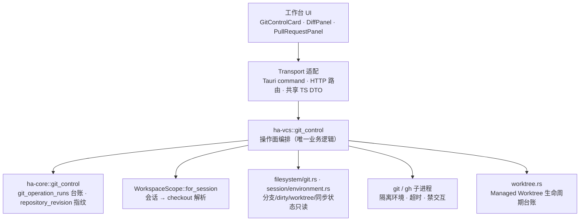
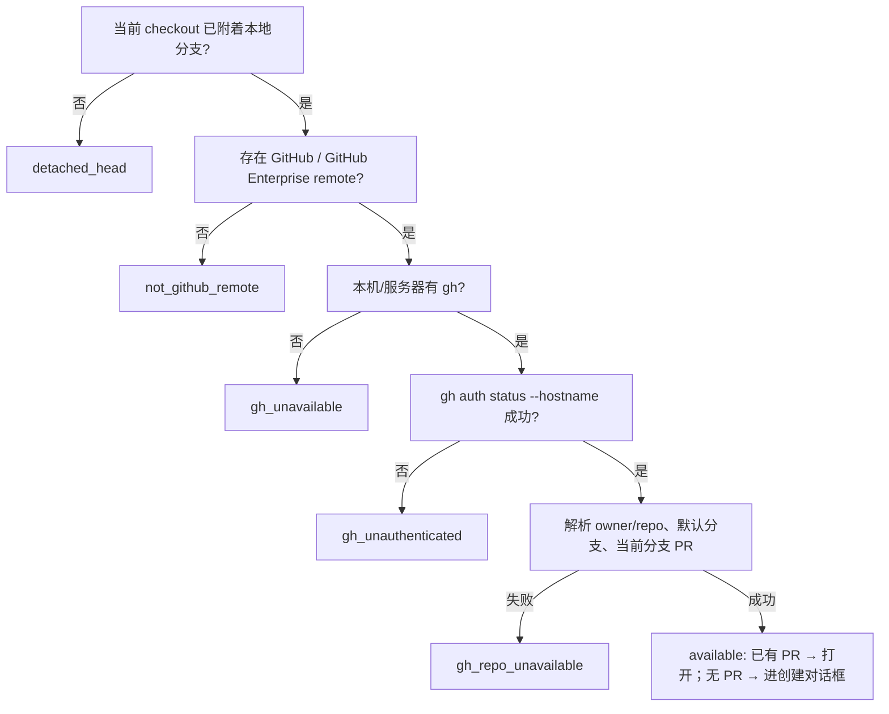
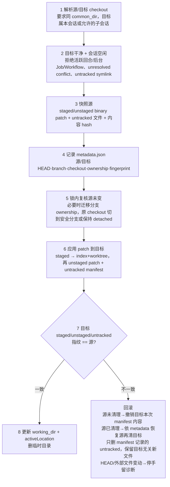
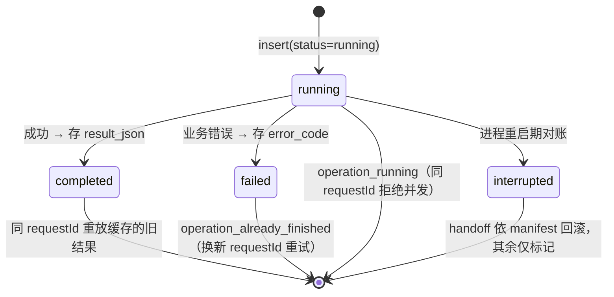

# Session Git 控制平面

> 返回 [文档索引](../../README.md) | 更新时间：2026-07-23

## 这个子系统解决什么问题

Hope Agent 的工作台里，用户需要一个像 GUI Git 客户端一样的面板：看当前分支和改动、审阅 diff、暂存/回退某个 hunk、切分支、提交、推送、开 GitHub Pull Request，还能把一份未提交的工作从本地 checkout 安全地搬进一个隔离的 Managed Worktree。同一套能力要同时服务两种运行模式——桌面 Tauri 应用，以及 HTTP/WS 守护进程。

难点不在「跑 git 命令」，而在**信任边界**与**并发安全**：

- 前端（甚至远端 HTTP 客户端）**不可信**。它不能自己指定要操作哪个仓库、哪个路径、哪段 patch、哪个 PR。它只能报出一个 `sessionId`，剩下的「这是哪个仓库、checkout 根在哪、能不能写」全部由后端从会话状态重新解析。
- 仓库状态随时在变（用户在终端里 `git commit`、外部编辑器改文件）。任何写操作都必须在**同一把锁**内，用一个覆盖 HEAD/index/工作树的指纹重新确认「我读到的世界」没变，否则宁可让用户刷新重来，也不能拿旧 patch 去改一个已经变了的仓库。
- 本地 checkout 和它派生的 Worktree **共享同一份仓库对象库**（refs、objects）。两处并发写共享 refs 会互相踩踏，所以锁必须按「仓库身份」而不是「checkout 路径」来算。

核心设计因此是一句话：**客户端只给 sessionId，后端负责解析、加锁、校验指纹、执行、记账、发事件，全程 fail-closed。** 所有真正的 Git 业务逻辑集中在一处（`ha-vcs::git_control`），桌面壳和 HTTP 壳都只是薄适配，共用同一套编排与 DTO 语义。

本文描述已经落地的运行时契约。Managed Worktree 的创建、归档、恢复、项目首轮 Bootstrap，以及它与 Workflow、Subagent 的集成，见 [Managed Worktree 控制平面](worktree.md)；项目草稿的归属与首发状态见 [项目系统](../core/project.md)。

## 1. 分层与边界

真正的 Git 业务只有一份实现，其余各层都是它的入口或依赖。



| 层 | 代码 | 责任 |
| --- | --- | --- |
| 工作台 | `src/components/chat/workspace/GitControlCard.tsx`、`PullRequestPanel.tsx` | Git/Worktree 唯一主控制卡：运行位置、Worktree 生命周期、分支/提交/PR/Handoff 对话框，以及独立 PR 面板里的 checks、评审、冲突、自动合并。环境详情区不得复制这些入口。 |
| Diff 审阅 | `src/components/chat/diff-panel/DiffPanel.tsx` | staged/unstaged/all 三态、文件/hunk 操作、Review 评论上下文。 |
| Transport | `src/lib/transport.ts`、`transport-tauri.ts`、`transport-http.ts` | 公共 TypeScript DTO 与桌面/HTTP 两套调用映射。 |
| Tauri 适配 | `src-tauri/src/commands/git_control.rs` | `spawn_blocking` 调核心函数，映射桌面命令错误。 |
| HTTP 适配 | `crates/ha-server/src/routes/git_control.rs` | REST DTO、diff scope 解析、`filesystem.allow_remote_writes` 写闸门。 |
| **操作面编排** | `crates/ha-vcs/src/git_control.rs` | 仓库解析、snapshot、diff、index mutation、branch、commit、push、PR、Handoff，以及仓库锁与启动期对账。所有业务逻辑在此。 |
| 簿记 kernel 面 | `crates/ha-core/src/git_control.rs` | `git_operation_runs` 建表、`GitOperationRun` 行类型、类型化查询，`repository_revision` 工作树指纹原语，以及 `git` / `gh` 子进程隔离构造器（`git_command`、`run_git` 等），供指纹与 `ha-vcs` 共用。 |
| Git 公共只读 | `crates/ha-core/src/filesystem/git.rs`、`session/environment.rs` | `git_info`（分支/dirty/worktree 列表）与 `build_git_snapshot`（同步状态、last commit），供项目草稿和会话控制面复用。 |
| Worktree 生命周期 | `crates/ha-core/src/worktree.rs` | Managed Worktree 创建、归档、恢复与 owner 记录（`managed_worktrees` 表台账）。 |

**为什么台账、指纹和子进程构造留在 kernel（ha-core），操作编排却在特征 crate（ha-vcs）**：`git_operation_runs` 落在 `sessions.db`，而特征 crate 不持有 raw 数据库连接，所以建表 DDL、行类型和全部 SQL 都下沉到 kernel，`ha-vcs` 通过几个 `pub` 方法读写。`repository_revision`（工作树 BLAKE3 指纹）也留 kernel，因为它同时被 `ha-design` 的 code_sync 基线校验使用；它依赖的那一小簇隔离化 `git` 子进程构造器（剥离仓库环境、禁交互、隐藏控制台）因此一并留 kernel，`ha-vcs` 的操作面与指纹原语共用同一份。

四条不可动摇的边界：

- Owner API 只接收 `sessionId`；客户端不能提交任意 cwd、仓库根、PR 编号或任意 patch。
- 后端从会话有效工作目录经 `WorkspaceScope::for_session` 解析 checkout，解析失败即拒绝。
- 只读接口绝不改仓库；HTTP 写接口额外受 `filesystem.allow_remote_writes=false` 默认闸门保护。
- 任何影响 refs、index、工作树或远端的操作，都在后端重新校验 revision、HEAD 与仓库身份。

## 2. 三路径身份模型与仓库锁

这是理解整套控制平面的地基。一次请求同时维护三个路径概念，它们各司其职：

| 概念 | 来源 | 用途 |
| --- | --- | --- |
| `workspace_root` | 会话有效工作目录（可能是仓库的**子目录**） | 保持会话作用域；`git_info` 与 PR 判定从这里读。 |
| `checkout_root` | `git rev-parse --show-toplevel` | 当前 checkout 的根；diff、index、patch 都在这里执行。 |
| `common_dir` | `git rev-parse --git-common-dir`（canonical） | 仓库身份。本地 checkout 与它 linked 出去的 Worktree 共享同一个 `common_dir`。 |

`repo_context` 解析时会强制 `workspace_root` 落在 `checkout_root` 之内，否则拒绝——防止会话工作目录在解析途中被换到 checkout 之外。

**跨进程写锁按仓库身份计算，而不是 checkout 路径：**

```text
~/.hope-agent/git-locks/<canonical common_dir 的 BLAKE3 十六进制>.lock
```

用 `common_dir` 而非 checkout 路径做锁 key，是为了让本地 checkout 与同一仓库的任何 Worktree**共用同一把锁**，不会并发修改共享的 refs 和 objects。锁文件名是 canonical 路径的 BLAKE3 摘要，绝不含用户路径文本。这把 advisory 锁只包住必要的 Git 写临界区；Git 自身的 index/ref lock 仍是第二层保护。

**子进程隔离与超时**：所有 `git` / `gh` 子进程都经隔离构造——剥离继承来的仓库环境变量、隐藏控制台窗口、设 `GIT_TERMINAL_PROMPT=0`，并带超时（git 60 秒、gh 45 秒）。这样桌面或 server 不会因为交互式凭据提示而永久阻塞。控制平面**从不**自动执行 fetch、stash、pull、rebase 或任何 force push。

## 3. Snapshot 与能力

`SessionGitControlSnapshot` 是工作台 Git 卡的单一快照，一次拉齐所有展示状态：

```ts
interface SessionGitControlSnapshot {
  root: string                       // checkout_root
  head: string | null
  branch: string | null
  detached: boolean
  revision: string                   // 乐观并发令牌
  branches: GitBranchInfo[]
  remotes: GitRemoteInfo[]
  worktrees: WorktreeInfo[]
  dirty: GitDirtySummary
  status: WorkspaceGitStatus
  sync: WorkspaceGitSync
  lastCommit: WorkspaceGitCommit | null
  activeLocation: "local" | "worktree"
  managedWorktreeId: string | null
  capabilities: GitCapabilities
}
```

**`revision` 是写操作的乐观并发令牌。** 它是工作树状态的 BLAKE3 指纹，覆盖四个来源依序哈希：`HEAD`、`git status --porcelain=v1 -z`、`git diff --binary`、`git diff --binary --cached`，再叠加每个非忽略 untracked 文件的路径、大小和 mtime。前端读到什么 revision，写回时就得带上；仓库一变，后端立刻返回 `stale_snapshot`，前端刷新 snapshot/diff 并要求用户重新确认。

`capabilities` 是一组布尔（`canSwitchBranch` / `canCreateBranch` / `canCommit` / `canPush` / `canCreatePullRequest` / `canHandoff` + 可选 `reason`），由后端按当前状态推导：

- 会话正忙（有活跃回合）时全部置否，`reason` 说明原因；
- detached HEAD 关掉 commit / push / PR；
- push 在 behind 或 diverged 时关掉；
- PR 需要仓库存在 GitHub remote。

它只用于界面解释和禁用，**不替代执行层校验**——后端每个写操作都会独立重判一次。

**分支读取规则**：用 `git for-each-ref` 读 `refs/heads/*` 与 `refs/remotes/*`；排除 `origin/HEAD` 这类 remote symbolic ref（以 `/HEAD` 结尾的 remote ref）；用 `git worktree list --porcelain` 标出已被其它 Worktree checkout 的本地分支和路径；**不主动 fetch**，列表只反映本地已有的 refs。

## 4. Diff 与索引操作

### 4.1 Diff scope

`SessionGitDiffSnapshot.scope` 三选一：

- `unstaged`：index → 工作树，并补上非忽略的 untracked 文件。
- `staged`：HEAD → index。
- `all`：HEAD → 工作树，用于整体审阅。

单侧文本最大读取 256 KiB，超过后标记 `truncated`。binary、submodule、rename/copy、untracked、conflict 仍返回文件元数据，但只开放安全的文件级操作。

### 4.2 Hunk 身份：为什么前端不能上传 patch

后端根据 revision、path、hunk header 和完整 patch 内容生成 `hunkId`。前端做 stage/unstage/discard 时只回传 `hunkId`，**不能上传 patch 正文**。执行时后端在锁内重新生成一遍 hunks 并精确匹配 `hunkId`；匹配不上就视为 stale，绝不拿一段可能过时的 patch 去 apply。这样「要改哪一块」由前端选，「实际改什么字节」永远由后端从当前磁盘重算。

### 4.3 Stage / Unstage / Discard

| 操作 | all | file | hunk |
| --- | --- | --- | --- |
| Stage | `git add -A` | 路径限定 `git add` | 后端重建 patch，`git apply --cached` |
| Unstage | `git reset HEAD` | 路径限定 reset | 后端 patch reverse 回 index |
| Discard | restore tracked + 删 untracked | restore 或删该 untracked 文件 | 后端 patch reverse 回工作树 |

Discard 必须携带 `confirmDiscard=true`，否则报 `discard_confirmation_required`。未跟踪文件的 discard 等价于删除；路径先过相对路径与 canonical containment 校验（越界或 symlink fail-closed）。冲突文件允许用户解决后 stage，但**禁止 hunk 级 discard**。操作成功返回刷新后的同 scope snapshot，前端保持当前文件与滚动位置。

## 5. 分支

**切换分支**：

- 有 staged / unstaged / untracked / conflict 时禁止切换，**不自动 stash**。
- 目标本地分支必须来自后端 snapshot 的 `fullRef`，且未被其它 Worktree checkout。
- remote-tracking ref 只在工作区干净时创建本地 tracking branch。
- 不接受 tag、任意 SHA，或客户端自行拼接的 ref。

**创建分支**：

- 允许从当前 HEAD 原地创建，并保留现有 staged/unstaged/untracked 内容。
- 分支名先过 `git check-ref-format --branch`。
- detached 的 Managed Worktree 必须先创建分支，才能 commit / push / 开 PR。
- 创建成功后同步 `managed_worktrees.git_branch`，让生命周期记录与真实 checkout 一致。

## 6. Commit 与 Push

Commit 输入含 `subject`、可选 `body`、`stageAll`、`pushAfter`：

- subject 必须是非空单行；默认只提交 staged 内容。
- `stageAll=true` 时，在**同一把仓库锁和同一次 revision 校验内**先 `git add -A` 再提交。
- 保留仓库 hooks、签名和作者配置，**绝不传 `--no-verify`**。
- detached HEAD 禁止 commit（`detached_head`）。
- 无 staged 内容报 `nothing_to_commit`。
- **commit 已成功但可选 push 失败时，返回成功提交 + `warning`，绝不把已经产生的 commit 误报为回滚。** 这条是关键红线：一旦本地历史已经变了，就不能对用户谎称「没提交」。

Push 规则：

- 有 upstream 时执行普通 `git push`。
- 无 upstream 时，只有 `setUpstream=true` 才允许选 remote 并 `git push -u`，默认 remote 为 `origin`；否则报 `no_upstream`。
- upstream 已知且 behind/diverged 时拒绝（`remote_behind`），不自动同步。
- 不提供 force、force-with-lease、删远端分支或改远端 URL 的入口。

## 7. GitHub Pull Request

**网络访问是显式、按需的。** 普通 Git snapshot 从不碰网络；只有 PR preflight、PR feedback、打开/创建 PR 时才调用已安装并认证的 `gh`。工作台仅为「已附着 + 配好 upstream + GitHub remote」的分支自动发现一次 PR；未发现就停止轮询，发现后才每 30 秒刷新反馈。detached HEAD 和无 upstream 分支只显示下一步操作，不自动访问 GitHub。

### 7.1 Preflight

`GitPullRequestPreflight` 依序验证，任何一步不满足都返回稳定的 `errorCode` / `errorMessage`，工作台据此展示不可用原因：



### 7.2 创建 PR

- `title` 必填，`body` 可选，`baseBranch` 可选，`draft` 默认开启。
- base 首选客户端传入的 `baseBranch`；未指定时才回退远端默认分支，再回退 `main`、`master`。
- 分支未推送时，只有用户确认 `pushFirst` 才顺序执行 push → `gh pr create`。
- 未提交的本地内容不会进 PR，创建对话框必须明确提示。
- 用 `requestId` 幂等保护，不会因重连而重复创建。
- 无 upstream 分支的主操作显示「推送并创建 PR」，确认后固定 `pushFirst=true`；创建成功立即打开应用内 PR 面板，详情尚未同步时保留创建结果 URL 作为重试与 GitHub 外链回退。

### 7.3 PR 详情

已有 PR 的主操作打开一个独立的右侧 PR 面板，而不是把用户带离工作台或覆盖输入框。该面板接入统一的 exclusive right panel 体系，可与工作台、Diff、文件、浏览器面板切换，复用共享宽度、窄屏折叠与 overlay 策略；切换会话时关闭，避免展示上一分支的内容。详情由后端根据当前会话的 checkout、remote 和 branch 解析，**客户端不能指定 PR 编号**，内容包含：

- 标题、描述、作者、head/base 分支、增删行数与变更文件数；
- requested reviewers、review decision，以及每位审阅者最新的顶层 review summary（历史上已被后续评审取代的状态不进入修复队列）；
- mergeable / merge state、是否有冲突；
- checks 明细、未解决的 review thread；
- 自动合并状态与合并方式。

**PR 标题、描述、评审正文和远端身份都是外部不可信数据。** 界面只作纯文本展示；进入修复任务时统一限制长度、转义并包进不可信数据封装（见 §7.5）。

### 7.4 Checks、Review 与合并冲突

`pull_request_feedback` 聚合两个**互相独立**的通道：

- `gh pr checks <number> --json ...`：返回 pass/fail/pending/cancel/skipping、workflow、描述、时间和链接。
- GitHub GraphQL `reviewThreads(first: 100)`：每个 thread 只读第一条根评论（`comments(first: 1)`），用 `totalCount` 算回复数，返回作者、文件、行号、正文、链接、resolved/outdated 状态；**不下载未展示的回复正文**。

行为契约：

- 单次最多返回 100 个 checks 和 100 个 review thread；超过分别标记 `checksTruncated` / `commentsTruncated`。
- 两个通道独立容错：一个失败另一个仍可展示，分别返回 `checksError` / `commentsError`。
- 工作台摘要只统计失败/运行中/成功的 checks，以及未解决且未过期的评论。
- 详情支持手动刷新；当前实现每 30 秒做一次有界轮询，同一 session/HEAD/branch 的手动刷新和轮询共享一个带错误收口的在途请求；切换 session、HEAD 或 branch 会丢弃旧请求结果。
- 完整刷新失败时可保留上次成功数据供参考，但必须显式标记「可能过期」，并禁用基于远端新鲜状态的「修复」和自动合并，直到刷新成功。
- `mergeable=CONFLICTING` 或 `mergeStateStatus=DIRTY` 时显示独立冲突状态；「修复冲突」只生成限定为当前 head/base 的修复任务，**不自动 merge / commit / push**。
- 评论可作为 DiffPanel 的额外上下文展示，但不改变仓库 diff，也不自动写代码。

### 7.5 「修复」入口的安全边界

「修复」只是把一段结构化任务**填进当前输入框**，用户确认发送后才进入正常的聊天与工具审批流程。它绝不会自动：

- 发送消息；
- 运行命令或改文件；
- commit / push / 创建 PR；
- 回复或 resolve GitHub 评论。

PR 标题、描述、head/base、检查描述、评审与评论正文、作者、路径、URL 全部是外部不可信数据。进 prompt 前限制条目数和单项长度、转义 `<` / `&`，并包进 `<untrusted_external_data>`；这些字段不得出现在可信任务描述中，正文里的指令不得被提升为系统指令。

### 7.6 自动合并

自动合并是显式的远端写操作，**不与「修复 PR」绑定**：

- 只允许当前分支已关联的 open PR，客户端不能提交任意 PR 标识。
- 用户必须先打开二次确认弹窗，选 `merge` / `squash` / `rebase`，请求必须带 `confirmAutoMerge=true`（缺失即 `auto_merge_confirmation_required`）。
- 确认弹窗明确提示：若仓库保护条件已满足，启用后 PR 可能立即合并。
- 存在合并冲突（`mergeable=CONFLICTING` 或 `mergeStateStatus=DIRTY`）时拒绝（`merge_conflicts`），不尝试改基、拉取或解决冲突。
- 后端执行前重新校验 revision、当前 PR 与冲突状态，再经 `gh pr merge --auto` 启用；不提供管理员绕过、force 或分支删除入口。
- 操作写入 `git_operation_runs`，同一 `requestId` 不重复启用；HTTP 端受 `filesystem.allow_remote_writes` 闸门保护。

## 8. Local / Managed Worktree 安全 Handoff

Handoff 把一份未提交的工作（staged + unstaged + untracked，含二进制）从一个 checkout 搬到另一个共享同一仓库的 checkout。它**不是**简单改 `sessions.working_dir`，而是一次带指纹校验和可回滚的 Git 操作。

`activeLocation`（`local` / `worktree`）描述会话当前运行位置，与 Managed Worktree 生命周期里的 `state` 是两回事，不复用。

**临时快照目录**（`request-id` 先过 portable 校验才成为路径组件）：

```text
~/.hope-agent/git-operations/<request-id>/
├── staged.patch        # git diff --binary --cached
├── unstaged.patch      # git diff --binary
├── untracked.manifest  # 非忽略 untracked 文件清单
├── untracked/          # untracked 文件内容快照
└── metadata.json       # 源/目标 HEAD·branch·checkout·ownership·fingerprint
```

**流程与回滚：**



第 5 步的分支归属处理值得展开：目标接管任务分支后，原 checkout 优先切到目标释放出来的分支；否则回退到未被占用的 `main`、`master` 或其他本地分支；只有在不存在任何安全分支时才保持 detached。

**一个非显然的坑**：旧的 `handoff_managed_worktree` 是 Managed Worktree 生命周期的 owner 操作，只负责显式绑定一个 Worktree cwd 并记 `state=handoff`，**不搬运改动**。工作台不展示这个旧入口；Local↔Worktree 的双向迁移必须走 `git_control::handoff`，不能绕过改动复制与回滚。此外，`activeLocation` 和当前 Managed Worktree 的识别一律比较 **canonical checkout root**，不能拿项目子目录和 Worktree 根目录直接比。

## 9. 幂等、进度与恢复

所有需要跨越进程重启也能一致收尾的写操作（branch、commit、push、PR 创建、自动合并、Handoff）都记在 `git_operation_runs` 表（`sessions.db`），字段：

```text
id, session_id, operation, status, stage,
before_head, after_head, result_json,
error_code, error_message,
created_at, updated_at, completed_at
```

`status` 取 `running` / `completed` / `failed` / `interrupted`。**同一个 `requestId` 的重复请求走幂等收敛**：



- `requestId` 全局唯一；同 ID + 同 session + 同 operation 且已 `completed` 时，直接返回缓存的终态结果。
- 同 ID 指向不同 session 或 operation 时拒绝（`request_id_conflict`）。
- 已在 `running` 的操作不重复执行（`operation_running`）；客户端可通过 run 查询恢复进度。
- 状态变化后发 `session:git_changed`；执行中发 `session:git_progress`；成功终态发 `session:git_completed`。
- Handoff 的 `ready`/`running` 类阶段只能单向推进；启动恢复依据持久化的 `stage` 和 `metadata` 决定回滚动作。

**启动期对账（Primary-only，同步内联）**：进程重启后，Primary 通过 `ha-core::vcs_hooks` 的 `git_ops_reconciler` 回调（在启动恢复流程中**同步内联**调用，不是后台任务）扫描所有 `running` 行。`handoff` 依据落盘的 `metadata.json` 尝试把源 checkout 回滚回原位；其余操作（commit/push/PR 结果无法安全重放）只标记为 `interrupted`（`error_code=process_restarted`）。它**绝不**自动续跑 Handoff、commit、push 或 PR。若对账钩子尚未接线，`running` 行原样保留，并记 `app_warn` 保证审计可见——handoff 的源恢复因此不会静默丢失。

## 10. Owner API

| Tauri Command | HTTP | 类型 |
| --- | --- | --- |
| `load_session_git_control_cmd` | `GET /api/sessions/{id}/git` | 只读 snapshot |
| `load_session_git_diff_snapshot_cmd` | `GET /api/sessions/{id}/git/diff?scope=...` | 只读 diff |
| `mutate_session_git_index_cmd` | `POST /api/sessions/{id}/git/index` | 写：stage/unstage/discard |
| `switch_session_git_branch_cmd` | `POST /api/sessions/{id}/git/branch/switch` | 写 |
| `create_session_git_branch_cmd` | `POST /api/sessions/{id}/git/branch/create` | 写 |
| `commit_session_git_cmd` | `POST /api/sessions/{id}/git/commit` | 写 |
| `push_session_git_cmd` | `POST /api/sessions/{id}/git/push` | 写/网络 |
| `session_git_pr_preflight_cmd` | `GET /api/sessions/{id}/git/pull-request` | 只读/网络 |
| `load_session_git_pr_feedback_cmd` | `GET /api/sessions/{id}/git/pull-request/feedback` | 只读/网络 |
| `create_session_git_pr_cmd` | `POST /api/sessions/{id}/git/pull-request` | 写/网络 |
| `enable_session_git_pr_auto_merge_cmd` | `POST /api/sessions/{id}/git/pull-request/auto-merge` | 写/网络 |
| `handoff_session_git_cmd` | `POST /api/sessions/{id}/git/handoff` | 写/长操作 |
| `get_git_operation_run_cmd` | `GET /api/git-runs/{requestId}` | 只读恢复 |

HTTP 端所有「写」行都要求 `filesystem.allow_remote_writes=true`。PR preflight / feedback 是网络只读，不受文件写闸门控制，但仍要求 API 鉴权、session 作用域和本机 `gh` 认证。Tauri 与 HTTP 复用同一核心编排与 DTO 语义，增删入口须同步 [API 参考](../system/api-reference.md)。

## 11. GUI 状态与刷新

工作台 Git 卡依次展示：变更数量与 `+added -removed`（点击进 DiffPanel）→ Local/Worktree 运行位置与 Handoff 入口 → 当前分支（detached 时显示创建分支）→ 按 dirty/ahead 状态显示提交或推送 → 创建或打开 PR → 当前 PR 的 checks/评审/未解决评论/合并冲突摘要 → 独立右侧 PR 面板与显式确认后的自动合并入口。

完成 index、branch、commit、push、PR 或 Handoff 后统一刷新 session snapshot；DiffPanel 的 mutation 返回新 diff 并保留当前 scope、文件和滚动位置。Session、HEAD 或 branch 变化会清空旧 PR feedback，防止把前一分支的检查和评论展示到当前工作区。

## 12. 错误与红线

稳定错误类别（前端据此做稳定分支）至少覆盖：

| 分组 | 错误码 |
| --- | --- |
| 并发/新鲜度 | `stale_snapshot`、`operation_running`、`request_id_conflict`、`operation_already_finished`、`repo_busy` |
| 会话状态 | `workspace_busy`、`background_jobs_active`、`workflow_active`、`dirty_worktree` |
| 分支/提交/推送 | `branch_checked_out`、`branch_exists`、`detached_head`、`nothing_to_commit`、`no_upstream`、`remote_behind` |
| GitHub | `not_github_remote`、`gh_unavailable`、`gh_unauthenticated`、`gh_repo_unavailable` |
| 自动合并 | `auto_merge_confirmation_required`、`merge_conflicts`、`gh_auto_merge_failed` |
| Handoff | `handoff_same_location`、`cross_repository_handoff`、`conflicts_present`、`handoff_source_changed`、`handoff_verification_failed`、`handoff_rollback_failed`、`discard_confirmation_required` |

不可破坏的红线：

- 不信任前端的 cwd、ref、path、hunk patch、remote 或 PR 标识。
- Discard 必须二次确认；路径越界和 symlink fail-closed。
- 不自动 fetch/stash/pull/rebase，不提供 force push。
- commit 已产生后，不得因后续 push 失败伪装成未提交。
- Handoff 未完成指纹校验前，不得切换 Session cwd。
- PR 外部文本不得作为可信指令注入。
- 自动合并必须由用户显式确认，有冲突时 fail-closed，不绕过分支保护、不强制合并。
- Tauri 与 HTTP 必须复用同一核心编排与 DTO 语义。

## 13. 测试契约

后端定向测试应覆盖：staged/unstaged/all 与同文件双态、hunk identity；all/file/hunk 的 stage/unstage/discard 与 binary/rename/submodule/untracked/conflict 降级；stale revision、路径越界、仓库锁与 branch ownership；detached、remote tracking、dirty 切分支、创建分支保留改动；staged-only / stage-all commit、hook/签名/作者错误、push upstream/behind；PR preflight/详情、checks 分桶、顶层 review、review threads、冲突状态、通道部分失败与截断；自动合并确认、三种合并方式、冲突拒绝、请求幂等与 HTTP remote-write gate；Local↔Worktree 的 staged/unstaged/untracked、回滚、外部并发变化与启动恢复；Tauri/HTTP DTO 对齐。

前端定向测试应覆盖：Git 卡各状态、PR 详情/checks/reviews/comments/冲突、自动合并确认、修复 prompt 的不可信数据转义、DiffPanel 评论上下文、stale 刷新，以及 Handoff 进度恢复。
