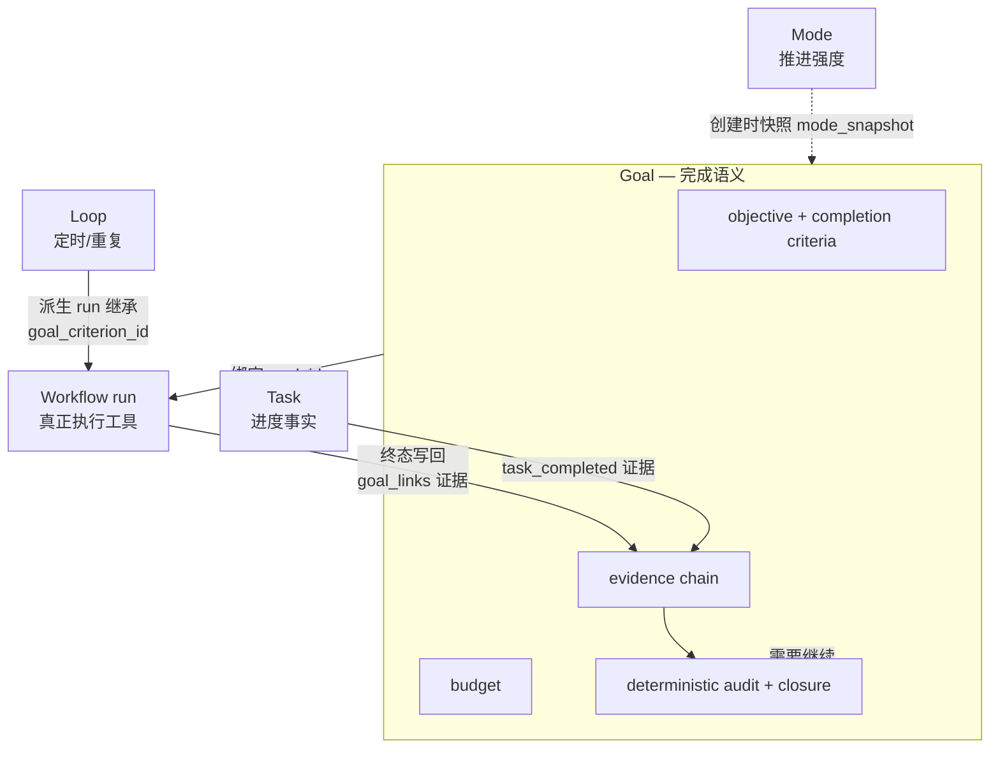
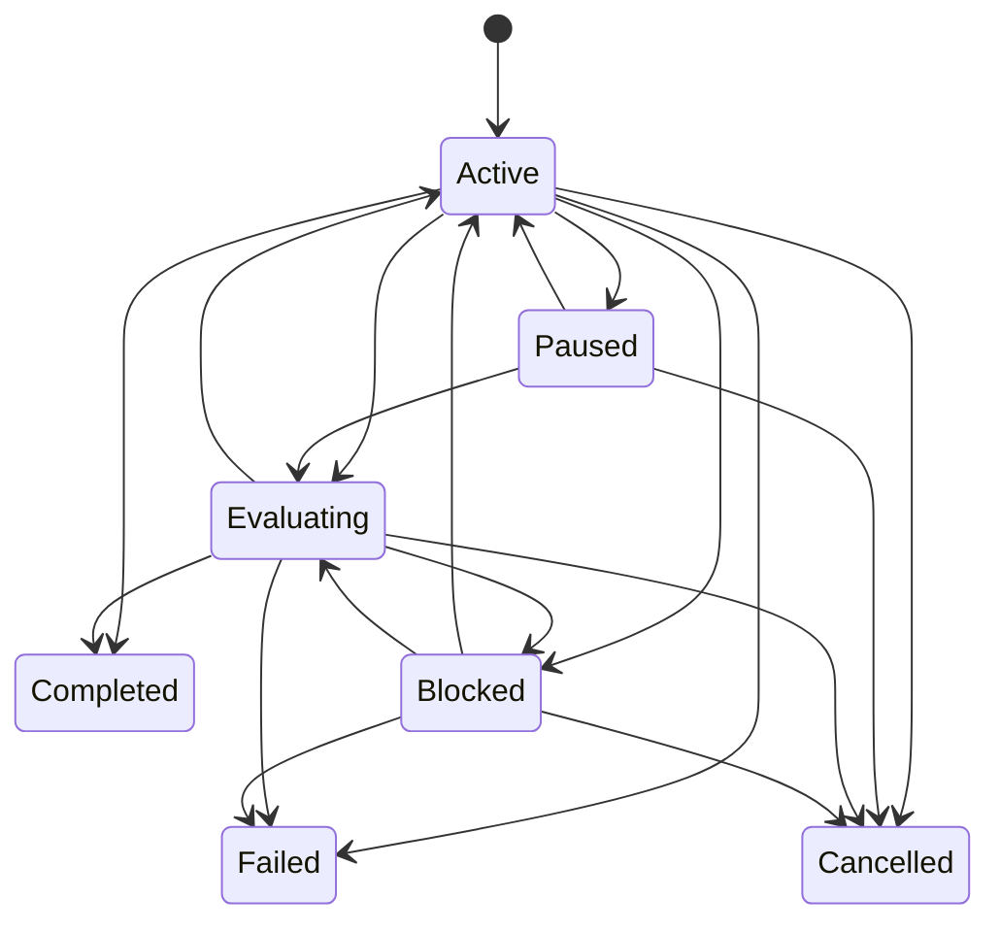
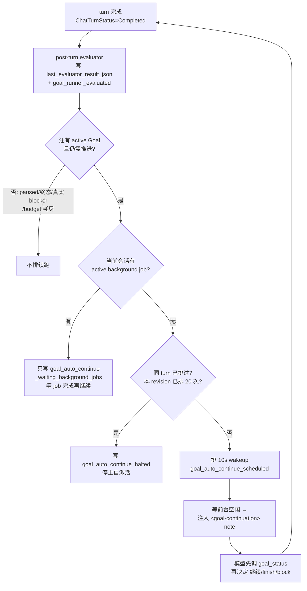
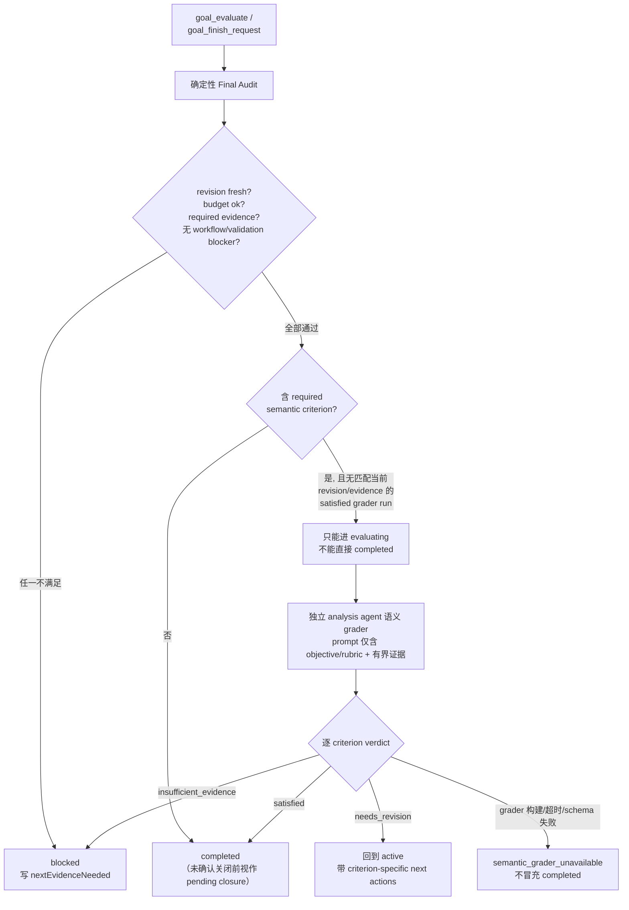
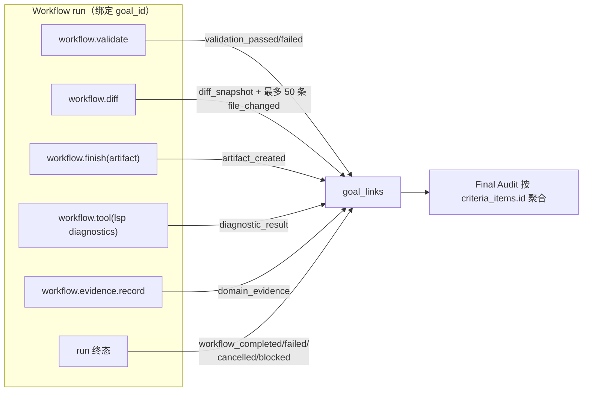
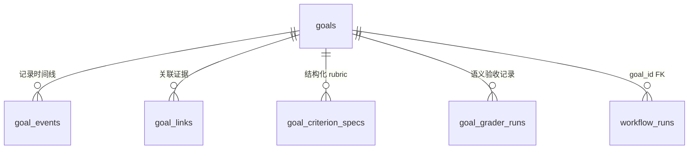

# Goal 控制平面

> 返回 [文档索引](../../README.md) | 更新时间：2026-08-23

## 核心思想

一个长任务真正的难点不是"下一步做什么"，而是"到底算不算做完了"。模型可以一轮轮往前推，但它对"完成"的判断往往是自评式的——写完一段总结、说一句"已经搞定"，就当任务结束。这在短问答里无所谓，在需要几十轮、跨越多个 Workflow run 的长任务里就是灾难：目标会被悄悄"宣布完成"，而实际证据根本不足。

Goal 就是为了把"完成"这件事从模型的口头判断里拿出来，变成一份**可审计的契约**：

- **objective**——用户要最终达成什么；
- **completion criteria**——什么条件满足才算完成，逐条可判定；
- **budget**——愿意为它花多少 token / 时间 / 轮次；
- **evidence**——哪些 durable 的执行痕迹（Workflow run、validation、diff、artifact、诊断、review……）能证明每条标准已达成；
- **closure**——最终由确定性规则审计裁决能否关闭，用户还要对关闭方式拍板。

关键设计有三条。**第一，Goal 不执行任何工具**——它是"终点和完成证据"，不是执行引擎，也不是调度器。真正干活的是 Workflow，Goal 只是绑定它、收集它留下的证据、在终态时做审计。**第二，完成判定是确定性的**——一套规则门禁（Evaluator）读取 durable 证据，而不是反扫聊天文本，更不接受模型自评。**第三，模型能推进但不能改契约**——面向用户本人的控制面负责创建、修改、暂停、关闭 Goal；模型能调用的工具只能读状态、记 checkpoint/证据、请求审计、请求完成或阻塞，改不了 objective / criteria / domain / budget。

Goal 适用于任何通用长任务；coding 只是当前证据链最完整的场景。

## 一、Goal 在控制面中的位置

Agent 控制平面被拆成五个正交的关注点，各管一件事、互不越界：

| 控制面 | 回答的问题 | 详见 |
| --- | --- | --- |
| **Goal** | 最终要达成什么，怎样算完成，用什么证据证明 | 本文 |
| **Mode** | 本会话以多主动、多深入的策略推进 | [workflow](workflow.md)（Execution Mode） |
| **Workflow** | 一次具体、可恢复、可审批、可审计的执行 run | [workflow](workflow.md) |
| **Task** | 用户可见的进度事实 | [workspace](workspace.md) |
| **Loop** | 定时、重复触发或条件继续 | [loop](loop.md) |

Goal 与它们的关系是"顶层完成语义"对"具体执行/调度手段"：Workflow run 会绑定当前 active Goal，终态后把执行结果写回 Goal 的证据链；Task 提供用户可见进度；Loop 派生的 run 继承 Goal 的 criterion 绑定。Goal 自己既不直接执行工具，也不替代 Workflow，更不表示重复调度。



分层上，Goal 被拆成「内核契约/台账」与「feature 执行机」：`ha-core::goal` 保留 wire 类型、状态转换、`SessionDB` 类型化 ledger、审计/closure 裁决和 Stop/Eval 不变量；`ha-goal` 拥有 continuation runner、推进/预算策略与模型工具 handler，并在装配期注册 `GoalRuntime` 和 external tool entries。Tauri 与 HTTP 仍只做薄适配，三种运行模式共用同一套 Goal 语义；`ha-goal` 不拿裸 `sessions.db` 连接，也不复制 kernel 状态机。

### 模块地图

| 层 | 位置 | 责任 |
| --- | --- | --- |
| 内核模型与台账 | `crates/ha-core/src/goal/mod.rs` | Goal / GoalEvent / GoalLink wire、状态机、类型化 DB 方法、criteria/Evaluator/closure 裁决、Watchdog 诊断与 `GoalRuntime` port。 |
| Feature runner / policy | `crates/ha-goal/src/runner.rs`、`policy.rs` | continuation、推进/预算门禁与恢复策略；只经 core 类型化能力访问台账。 |
| 模型能调用的工具 | `crates/ha-goal/src/tools/goal.rs`、`crates/ha-core/src/tool_defs/goal_tools.rs` | feature 拥有 handler；core 保留 schema/名字/参数等纯契约。 |
| Chat Engine 集成 | `crates/ha-agent-runtime/src/engine.rs` | 成功回合通过 core `GoalRuntime` port 请求 active Goal 自动续跑。 |
| Workflow 集成 | `crates/ha-core/src/workflow/db.rs` | `workflow_runs.goal_id` 与 criterion 绑定、自动绑定 active Goal、终态后写 link + 触发审计。 |
| 斜杠命令 | `crates/ha-core/src/slash_commands/handlers/goal.rs` | `/goal` 文本控制面。 |
| 面向用户的 API | `src-tauri/src/commands/goal.rs`、`crates/ha-server/src/routes/goal.rs` | 桌面命令与 Server/Web 端点，两套保持对齐。 |
| GUI | `src/components/chat/workspace/useGoal.ts`、`workspace/WorkspacePanel.tsx`、`src/components/chat/input/ChatInput.tsx` | Workspace 独立 Goal section、Goal detail、closure packet、输入框目标模式、composer 上方状态条、Watchdog 提示。 |
| 完成反馈 | `src/components/chat/message/MessageBubble.tsx`、`goalCompletionReport.ts` | 从 `goal_finish_request` 工具结果提取完成报告，在最终总结下方渲染"目标已达成 + 耗时 + tokens"。 |

## 二、生命周期与状态机

一个 Goal 的完整生命周期由 `GoalState::can_transition_to()` 这个单一裁决点管辖，它是状态转换的唯一真相源。七种状态里，`completed` / `failed` / `cancelled` 是终态，`blocked` 不是终态（用户可恢复或重新评估）。



一个 session 同一时刻只允许一个 open Goal，由部分唯一索引强制：

```sql
UNIQUE(session_id) WHERE state IN ('active','paused','evaluating','blocked')
```

**"pending closure"是一个容易忽略的中间态**：`completed AND closure_decision IS NULL` 表示审计通过了、但用户还没对关闭方式拍板。它不落进上面的唯一索引（因为 state 已是 `completed`），但 `create_goal`、`get_active_goal` 和 incognito 切换守卫都会把它当成"仍需处理的 durable Goal"。也就是说，模型宣布达成之后目标并没有立刻消失，而是停在等用户确认的位置。

### 两条 closure 路径

Goal 的关闭是受控的，只有两个入口：

- **`goal_finish_request`**（模型侧自动完成入口）：内部会重跑或校验当前 revision 的 final audit，**只有** `status=completed`、revision 匹配、且没有更新的证据导致 stale 时，才写入 `accepted_v1` closure 并返回完成报告。模型绕不过审计直接关闭。
- **`close_goal`**（面向用户的 owner action）：用户手动取舍、取消或替代目标。

closure decision 有四种取值（枚举 `GoalClosureDecision`），决定关闭的性质：

| decision | 效果 |
| --- | --- |
| `accepted_v1` | 进入 `completed`、写 `closed_at`，可把 audit 里的 follow-up 落入 durable follow-up pool。后端只允许在当前 revision 的 final audit `status=completed` 且证据未 stale 时接受，防止用户 / API / 模型误关未审计的新证据链。 |
| `needs_strict_evidence` | 把 Goal 拉回 `blocked`，写 `blocked_reason` 与 decision，**不写** `closed_at`——目标仍需继续补证据。 |
| `cancelled` | 进入 `cancelled`、写 `closed_at`。`clear_goal` 也走这条 decision，而不是只改 state。 |
| `superseded` | 进入 `cancelled`、写 `closed_at`，用于"替代目标"场景（旧目标先 superseded，再建新目标）。 |

一旦 Goal 进入**已封存的终态**（`failed` / `cancelled`，或 `completed` 且已有 closure decision），任何后续 closure action 都不能把它改回 open 状态，追加 follow-up 也会被拒绝——关闭之后的目标不能被悄悄改写。

### revision：修改契约即作废旧结论

Goal 契约不是一成不变的。更新 objective、completion criteria 或 domain workflow 绑定后，`revision += 1`，同时**清空旧的 final audit 与 closure decision**，并把 `blocked` / `evaluating` 拉回 `active`。这条规则保证旧审计结论不会污染新目标：改了目标就等于要求重新证明。修改只能走面向用户的 `update_goal` 或 `/goal <objective>`，模型改不了。

## 三、两个控制面

Goal 严格区分**谁能碰契约本身**和**谁只能推进它**。

**面向用户本人的控制面**——GUI、`/goal` 命令、Tauri/HTTP API——掌握全部生杀大权：创建、修改、暂停、恢复、清除、评估、关闭取舍。

**模型能调用的工具**——只有一组受限能力，读得多、写得少，且永远改不了契约的骨架。incognito session 完全不注入这些工具效果，执行层 fail-closed。

| 工具 | 能力 | 写入 |
| --- | --- | --- |
| `goal_status` | 读 active Goal 的 compact snapshot：objective、revision、criteria、audit、evidence、budget、tasks、workflow runs、latest events、`latestEvaluator`。 | 无 |
| `goal_prepare_contract` | 昂贵执行前的确定性可行性预检，生成当前 revision 的结构化 rubric（详见第五节）。 | `goal_contract_prepared`、`goal_criterion_specs` |
| `goal_checkpoint` | 记录长任务的 milestone / handoff / risk / blocked attempt。 | `goal_events(kind='goal_checkpoint')` |
| `goal_record_evidence` | 记录已观察 / 已产出 / 已收到的通用证据：source cited、claim checked、user decision、artifact reviewed、data quality checked、draft approved、meeting context 等。 | `goal_links(target_type='general')` + `goal_linked` |
| `goal_evaluate` | 运行确定性 final audit，返回 missing / blockers / nextEvidenceNeeded / report，必要时触发语义 grader。 | `goal_evaluated`、更新 `final_evidence_json` |
| `goal_finish_request` | 请求完成；内部必须校验 current audit pass，成功后写 `accepted_v1` closure 并返回完成报告。 | `goal_finish_requested`、`goal_closure_decided`；失败时 `goal_finish_rejected` |
| `goal_block_request` | 请求阻塞，必须带 reason + attempted。同一 fingerprint 重复 3 次才自动 block；确实需要用户输入或外部状态时可立即 block。 | `goal_block_requested`，必要时 `goal_state_changed(to='blocked')` |

Goal 上下文不会拼回稳定 system。`prepare_session_policy_context()` 在 turn start 冻结两部分：平台维护、正文无关的 Active Goal 自治/证据/完成规则进入 **Run Instruction**；state、revision、objective、domain、workflow template、task type、completion criteria、required missing、follow-up pool、blocked reason、latest audit 摘要与 closure decision 由 `render_active_goal_data()` 放进当轮 **user-data**。Goal 更新后，下一 turn 的新快照让模型感知最新目标、stale audit、领域约束和用户关闭取舍；同一 turn 的 Provider retry / failover 复用已冻结快照，不重新查询或混用不同 revision。

几条约束值得单独记住，它们是模型钻空子的常见入口：

- `goal_finish_request` 不接受模型自评，必须依赖规则审计和 current revision 证据。
- `goal_block_request` 不是"任务难"的退出口；没有真实用户 / 外部阻塞时必须走重复 blocker fingerprint。
- `goal_record_evidence` 只能记录真实发生的证据，不能伪造 coding diff、validation 或 connector 结果；它的 `metadata` 是小型结构化补充，执行层强制 16KB 上限，大文档 / 大工具输出 / 外部原文必须留在对应 artifact / source 里，只把引用和摘要链到 Goal。

## 四、自主推进：Goal Runner

长任务需要模型一轮接一轮地推进，但直接在 chat engine 里递归重入会导致同步卡死。Goal Runner 的做法是**复用 wakeup 自调度与 parent-injection 管线**：当前 turn 先干净地完成、显示结果，再短延迟自动排下一轮，从而继承 wakeup 已有的稳定性（空闲门控、重启恢复、会话删除清理）。



关键行为与边界：

- **post-turn evaluator 只诊断不改终态**：它记录 `status` / `summary` / `missing` / `blockers` / `nextEvidenceNeeded` 供下一轮参考，但**不会**直接把 Goal 改成 `completed` / `blocked`——避免把进行中的目标误染成终态。正式 closure 仍必须走 `goal_finish_request` / final audit。
- **续跑 note 强制先看状态**：continuation note 要求模型先调 `goal_status`（会返回 `latestEvaluator`，让模型知道上一轮后置检查结果和下一步证据需求），再决定继续执行、完成还是阻塞。
- **防无限自激活**：同一 `turn_id` 只排一次；同一 Goal revision 最多排 20 次，超过写 `goal_auto_continue_halted`。用户中断的 turn 根本不进 runner，因为只有 `ChatTurnStatus::Completed` 才会触发调度。
- **让位后台 job**：会话里有 active background job（`queued` / `running` / `cancelling` / `awaiting_approval`，含后台工具、subagent projection、审批 parked job）时，runner 只保留 evaluator 记录、写 `goal_auto_continue_waiting_background_jobs`，不额外排续跑，避免和长任务 / 审批互相踩踏。
- **"补证据"不是停机**：`goal_evidence_incomplete` 和 `goal_blocked_by_evidence` 属于"继续补证据"的 open 状态，runner 可以继续排续跑；真实不可恢复的 blocker 才停。

### 重启与恢复

Goal 的 restart / resume 采用与 Workflow 一致的 durable 保守恢复：Goal 自身、completion criteria、evidence、pending wakeup、background job 等状态必须持久可读；重启后不允许静默完成、静默丢失，也不允许自动重跑无法证明幂等的外部动作。

具体来说，`maybe_schedule_goal_continuation` 成功后，`goal_auto_continue_scheduled` event 里的 `wakeupId` 对应一条 pending wakeup row，row 内保留 `<goal-continuation>` note、session、agent 与 goal id，可被 wakeup replay 重新 re-arm。等待后台任务 / 审批 parked job 的场景也能安全恢复：启动时 `async_jobs::JobManager::replay_pending()` 把不可恢复的 active job 标为 `interrupted` 后，下一轮就能重新排出续跑 wakeup，后台等待态不会永久卡住 Goal。若被系统杀掉的后台命令无法透明续跑，会记 `interrupted`，由 Runner / final audit / Watchdog 把目标维持在"继续推进 / 阻塞待处理 / 等待审批"这类用户可行动的状态。透明续跑 OS 进程与自动安全重试属于后续增强，不是关闭 Goal 的必要条件。

## 五、完成判定：确定性审计 + 语义验收

这是 Goal 最核心的机制：**完成永远先过一道确定性规则门禁，语义判断只在其后、且不能覆盖它。**



### 确定性 Evaluator（Final Audit）

Evaluator 是一套确定性规则门禁，**读 durable 证据而不是反扫聊天文本**。输入包括：objective、completion criteria、domain / template / task type、linked workflow runs、session tasks、`goal_links` 里的各类证据（workflow / validation / diff / file / artifact / diagnostic / review / worktree）、workflow blocked/failed/cancelled 状态、budget snapshot。

判定原则（决定 `completed` 还是 `blocked`）：

- 没有任何 workflow / task / evidence → `blocked`。
- 证据有时序覆盖关系：`validation_failed` 只能被更新的 `validation_passed` 覆盖；workflow failed/blocked/cancelled 只能被更新的 `workflow_completed` 或 `validation_passed` 覆盖。
- diff / file 只是实现证据，不能单独完成 Goal——必须至少有 `workflow_completed`、`validation_passed` 或 `task_completed` 这类强信号。`worktree_attached` 同理，是执行环境的上下文证据（改动落点、隔离状态、path 是否存在、handoff），不是强完成证据。
- `required` criteria 没有强支撑证据 → `blocked`；`optional` 缺证据只进 `optionalMissing`，`follow_up` 缺证据只进 `followUpItems`，二者都不阻塞关闭。
- budget exhausted → `blocked`，且新 workflow create 硬停。
- 无 blocker、无 required missing 且有强证据 → `completed`；用户尚未接受关闭时，GUI / prompt 仍把它视作 pending closure，而不是彻底结束。

审计结果写入 `final_evidence_json`，主要字段：

| 字段 | 说明 |
| --- | --- |
| `status` | 只有 `completed` 或 `blocked` 两值，与状态机取值一一对应，UI 无需再解释第三种"部分完成"的中间态。 |
| `summary` / `blockedReason` | 审计摘要；blocked 原因取 `goal_evidence_incomplete` / `goal_blocked_by_evidence` / `goal_budget_exhausted`。 |
| `goalRevision` | 本次审计对应的 revision。 |
| `goalLinkedEventSeq` | 本次覆盖到的最后一个 `goal_linked` event seq，由 DB 聚合查询生成；之后出现更大 seq 时，snapshot 派生 `audit_stale=true`。 |
| `evaluatedAt` / `auditStale` | 审计写入时间；新写入固定 `auditStale=false`，旧 audit 缺 seq 时用 `evaluatedAt` 作 fallback stale 基准。 |
| `criteriaItems` / `criteriaStatus` | parser 派生的 required/optional/follow_up 标准，以及逐条状态、原因、evidence ids。 |
| `achieved` / `missing` / `optionalMissing` / `blockers` | 已达成 / 缺口 / 可选缺口 / 明确阻塞。 |
| `evidence` | workflow / validation / diff / file / artifact / diagnostic / review / worktree / task 证据。 |
| `nextEvidenceNeeded` | 下一步要补的证据，如 final verification、repair workflow、criterion evidence、budget 扩容。 |
| `followUpItems` | 从 follow_up criteria 和已有 follow-up pool 汇总的后续项，不阻塞关闭。 |
| `closure` | 当前 closure decision、reason、closedAt、是否仍需用户确认。 |
| `budget` / `ruleGate` / `remainingRisk` | 本次预算快照；规则门禁结果（`hardBlockers`、`strongEvidence` ids、LLM auditor 状态）；诚实残余风险。 |

`ruleGate.llmAuditor.status` 当前固定为 `skipped`——审计只用确定性规则门禁，可选 LLM auditor 尚未启用。它与下面的语义 grader 是两个独立层：LLM auditor 不参与 final-audit 结论，语义 grader 只在确定性硬门禁通过、且存在 semantic criterion 时运行，同样不能覆盖规则 blocker 或直接关闭 Goal。

### 结构化契约与语义 grader

自然语言的 completion criteria 有时无法被确定性规则完全判定（例如"报告论证充分"）。为此有一层可选的结构化契约与独立语义验收，在原有 state、revision、evidence gate、Runner、closure 之上叠加，不要求历史目标回填——旧 Goal 没有结构化 rubric 时仍按自然文本 criteria 解析。

**可行性预检（`goal_prepare_contract`）**：在昂贵执行前生成当前 revision 的结构化 rubric，只做确定性诊断，不执行外部动作、不申请或授予权限。输出状态：

```text
ready | under_specified | missing_capability | missing_resource |
needs_permission_surface | unverifiable_criteria
```

检查项包括当前工具可见性、工作目录相对路径、网络工具声明、审批 surface、budget 是否耗尽，以及 required criterion 的 evidence relation。用户明确写下的 criteria 必须逐字、逐 kind 保留，只有用户未提供时才允许派生，且必须用 `scopeRationale` 说明没有扩大目标。

rubric 落在 `goal_criterion_specs`，以 `(goal_id, revision, id)` 为主键，保存 `kind`（`required` / `optional` / `follow_up`）、`check_kind`（`evidence` / `artifact` / `test` / `semantic` / `user_acceptance` / `external_state`）、`expected_evidence_json` 与 `inferred`。**关系证据与完成信号分开判定**：若某条 criterion 声明了 `expected_evidence`，该关系必须真实存在，同时还必须有独立的 `workflow_completed` / `validation_passed` / `domain_quality_passed` / `task_completed` 强信号——单记一条关系不能自证完成，反过来已有完成 Workflow 但缺指定来源 / 审阅关系也过不了。

**混合 Evaluator**：`goal_evaluate` 与 `goal_finish_request` 先跑确定性 audit，revision freshness、budget、required evidence、workflow/task/validation blocker、provenance 任一不满足都不得启动语义 grader。硬门禁通过、但当前 Goal 含 required semantic criterion 且没有匹配当前 revision/evidence 的 completed+satisfied grader run 时，Goal 只能进 `evaluating`，不能进可接受关闭的 `completed`——这条也覆盖 Workflow 终态自动触发的 `evaluate_goal`，因此后台 Workflow 完成绕不过独立 grader，用户直接 `accept_v1` 也会被后端拒绝。

真正调用 grader 时用独立 analysis agent，prompt 只含当前 objective / rubric 和有界证据，证据包在 `<untrusted_external_data>` 里。grader 只能返回逐 criterion 的 `satisfied` / `needs_revision` / `insufficient_evidence` / `not_applicable`、evidence ids、reason 和 next actions，**不能执行修复、批准动作、修改 Goal 或直接做 closure decision**。归一化要求每条 semantic criterion 恰好出现一次，required satisfied 必须引用真实 evidence id。verdict 的映射：`needs_revision` 把 Goal 重开为 `active` 并留 criterion-specific next actions；`insufficient_evidence` 进入可解释的 `blocked`；grader 构建 / 请求 / 超时 / schema 失败进入 `semantic_grader_unavailable`，绝不沿用确定性 completed 冒充最终完成。

**Durable grader run（`goal_grader_runs`）**：每次运行记录 `revision` / `evaluation_key` / `strict` / `attempt` / `state` / `result` / `model` / `usage` / `error`。evaluation key 由 goal id、revision、semantic rubric 和 evidence watermark 派生；相同 key/strict 的成功结果可缓存复用。硬上限：单 key 最多 4 次 run attempt，单次响应最多 2 次结构解析尝试，side query 超时 60s、输出上限 2500 tokens。并发上，同一 key 同时只允许一个 `running`；遗留超过 5 分钟的 running 会在下次 begin 时标记 `grader_interrupted`。若用户在 grader 运行中改了 Goal 或 evidence，完成写入会立即把旧 run 标 failed 并丢弃 verdict，不影响新 revision。grader usage 单独存在 run 里，同时纳入 Goal budget。

用户选 `needs_strict_evidence` 后，后续 `goal_evaluate` / `goal_finish_request` 自动继承 strict 要求，非 strict 的旧 verdict 不再满足关闭门禁；只有 strict grader 对当前 key 返回 satisfied，系统才清除旧 strict closure decision，把 Goal 恢复成"completed、等待用户确认"。原 evidence 永不被 grader 改写；grader 的 start / graded / failed 都进 Goal events，`GoalSnapshot.graderRuns` 有界返回最近 20 条供高级 trace 审查。

## 六、证据链：Workflow / Loop 集成

Goal 的证据不是模型口述的，而是 Workflow run 在执行过程中留下的 durable snapshot。这条链让审计"有据可查"。

`workflow_runs` 带 `goal_id` 与 criterion 绑定快照（`goal_criterion_id` / `goal_criterion_text` / `goal_criterion_kind` / `goal_revision`）：



绑定与写回的关键行为：

- 创建 run 时若显式传 `goal_id` 会校验同 session；不传则**自动绑定当前 session 的 open 或 pending closure Goal**。可选 `goal_criterion_id` 传入后校验属于绑定 Goal 当前 revision；传了 criteria 却没有可绑定 Goal 时 fail-closed。
- 创建后写 `execution_run` / `repair_run` link；终态写 `workflow_completed` / `workflow_failed` / `workflow_cancelled` / `workflow_blocked`，并 best-effort 触发 `evaluate_goal`。
- 各 op 产出对应证据：`validate` → `validation_passed` / `validation_failed`；`diff` → `diff_snapshot` 加最多 50 个 changed file 的 `file_changed`；`finish` → `artifact_created`（记 id/path/title/kind/hash）；`workflow.tool` 的 lsp diagnostics → `diagnostic_result`（error 级是 hard blocker，后续 passing validation 或 clean diagnostics 可解除较早 blocker）；`workflow.evidence.record` → 通用 `domain_evidence`（来源、用户决策、数据质量、引用审计等非 coding 证据，保留 run/op provenance）。
- 绑定 `worktree_id` 的 run 写 `worktree_attached`；Managed Worktree 创建、反向绑定、归档、恢复、交接时 best-effort 刷新同一 evidence metadata（`state`、`pathExists`、`baseRef/baseSha`、`dirtySnapshot`、`handedOffAt`）。
- Review Engine 完成写 `review_passed` / `review_completed`，P0/P1 open finding 写 `review_finding`；Smart Verification 完成写 `validation_passed` / `validation_failed` / `validation_completed`，其中只有 `validation_passed` 是强完成证据，`validation_completed` 只表示已完成验证选择。
- **criterion 级隔离**：workflow creation / terminal evidence 带 `goalCriterion`，audit 优先按 `criteria_items.id` 聚合——绑定到某条 criteria 的失败只阻塞该 criteria，未绑定失败才按全局 blocker 处理。
- 创建新 run 前检查绑定 Goal 的 budget，token / time / turn 任一正数上限耗尽即拒绝并写一次 `budget_warning(level='exhausted')`。

Loop 同样可绑 criterion：`create_loop_schedule` 的 `goal_criterion_id` 会校验并写入 `loop_schedules`，`execution_strategy=workflow` 派生的 WorkflowRun 继承该 id，形成 `Goal → Loop → WorkflowRun → evidence` 的连续链路。命令面的 `/workflow status` / `runs` / `trace` 也会显示 active / linked Goal，与 GUI 保持同一条链路。

## 七、Goal Watchdog

Watchdog 回答一个高可用问题："Goal 按 runner 规则本应继续，但最近没动静了。"它是**只读诊断**——不排 wakeup、不改 Goal、不自动恢复、不批权限，也不会把 active workflow / task / background job 下的正常等待误报成 runner stuck。

`SessionDB::list_goal_watchdog_findings(session_id, stale_secs)` 的判定流程：

1. 只看当前 session 的 active / pending closure Goal；没有则返回空。
2. 复用 `goal_runner_should_continue`，因此 `paused` / 终态 / 真实不可恢复 blocker / budget exhausted / accepted 都不会被标记。
3. 若 Goal 关联的 workflow run 处于 `awaiting_approval` / `running` / `awaiting_user` / `paused` / `recovering`，或有 `in_progress` task，或当前 session 有 active background job，则返回空——这些状态已在对应面板可观察，不重复报 Goal stuck。
4. 最近活动时间取 Goal `updated_at`、所有 goal event `created_at`、关联 workflow run `updated_at`、session task `updated_at` 的最大值。
5. 超过 `stale_secs`（默认 300 秒）时返回一条 finding：`goal_no_recent_progress`（仍应继续但无新进展）或 `goal_stale_evaluating`（处于 evaluating 且无新进展）。

Tauri / HTTP / GUI 都暴露这个读模型。Workspace 的 Goal section 用 amber"有目标需要确认"提示和"评估"动作暴露问题——该动作只是调用 `evaluate_goal`，不会自动续跑或修复。前端 `useGoal` 每次刷新 active Goal 时 best-effort 同步 findings，诊断读取失败只清空提示，不影响 Goal 主状态展示。

## 八、Completion Report 与 GUI 收口

`GoalCompletionReport` 是完成时的收口结构，由 `goal_finish_request` 返回，供模型做诚实收口、供 GUI 渲染完成说明：

| 字段 | 说明 |
| --- | --- |
| `goalId` / `sessionId` / `revision` / `objective` | 完成对象。 |
| `state` / `status` | Goal 状态与 audit 状态。 |
| `summary` | 模型传入或 final audit 生成的用户可读摘要。 |
| `usage` | `GoalBudgetSnapshot`：tokens、elapsed、turns、warnings / exceeded。 |
| `evidenceCount` | 完成时 evidence 数量。 |
| `achieved` / `missing` / `blockers` | final audit 摘要数组。 |
| `followUpItems` | 非阻塞后续项。 |
| `remainingRisk` | 诚实残余风险。 |
| `generatedAt` | 报告生成时间。 |

GUI 从工具结果解析该报告，在最终 assistant 总结下方、文件附件上方渲染"已在 X 内达成目标 · Y tokens"。**这条 completion note 是产品层生成的，不是模型正文的一部分**：精确 token usage 通常要等最终 assistant 消息落库才可用，因此 report 的 `tokensUsed` 为 0 时，GUI 用最终消息的 `lastInputTokens + outputTokens` 兜底，避免模型猜测或输出 stale usage。

budget / completion usage 由 `build_goal_budget_snapshot` 统一派生，口径很关键：**只统计 Goal `created_at` 之后的 session messages**，turn 数只按 user message 计数，token 数按每条消息 `tokens_in_last` 优先、缺失回退 `tokens_in`，再加 `tokens_out`，并叠加 grader run 的 usage；`completed_at` 存在时用它固定 elapsed，否则用当前时间。这套口径防止把 Goal 创建前的历史 token 算进当前目标，或把累计 input token 误当最后一轮 usage。

## 九、数据模型

Goal 数据全部落在 `sessions.db`，跟随 session 级联删除。五张表加上派生的 snapshot：



### `goals`

| 字段 | 说明 |
| --- | --- |
| `id` | `goal_*` id。 |
| `session_id` | 所属 session。 |
| `objective` | 用户写下的最终目标。 |
| `completion_criteria` | 用户写下的完成标准，多行文本。 |
| `revision` | 修订号，从 1 开始；objective / criteria / domain 绑定变更时自增。 |
| `domain` | 可选通用任务领域（如 `research` / `writing` / `data_analysis`），为空即自由目标。 |
| `workflow_template_id` / `workflow_template_version` / `workflow_task_type` | 可选 domain workflow template 与 task type 绑定；绑定后 Workflow 创建器默认推荐该模板，Context Retrieval / Domain Quality 优先使用。 |
| `state` | 七态之一。 |
| `mode_snapshot` | 创建时的 session `execution_mode` 快照。 |
| `budget_token_limit` / `budget_time_limit_secs` / `budget_turn_limit` | 可选预算；`0`/空表示不设限，正数参与观测、告警与新 workflow 硬停。 |
| `final_summary` / `final_evidence_json` | 最近一次 final audit 的摘要与结构化结果。 |
| `blocked_reason` | `blocked` 原因。 |
| `last_evaluator_result_json` | 最近 evaluator 原始结果。`goal_finish_request` / 手动 final audit 会与 `final_evidence_json` 同步；post-turn runner evaluator 只更新此字段并写 `goal_runner_evaluated`，不动 final audit closure gate。 |
| `closure_decision` / `closure_reason` / `closed_at` | 用户关闭取舍、说明、关闭时间。`needs_strict_evidence` 不写 `closed_at`（仍需补证据）。 |
| `follow_up_json` | goal-scoped 后续项池，记录 `id` / `text` / `created_at` / `source`。 |
| `created_at` / `updated_at` / `completed_at` | 时间戳。 |

唯一索引与 pending closure 语义见[第二节](#二生命周期与状态机)。

### `goal_events`

| 字段 | 说明 |
| --- | --- |
| `id` | 自增 row id。 |
| `goal_id` | 所属 Goal。 |
| `seq` | Goal 内单调序号。 |
| `kind` | `goal_created`、`goal_state_changed`、`goal_linked`、`goal_evaluated`、`goal_checkpoint`、`goal_runner_evaluated`、`goal_closure_decided`、`goal_semantic_graded` 等。 |
| `payload_json` | 事件载荷，超过 64KB 截断为 preview。 |
| `created_at` | 时间戳。 |

维护 `(goal_id, seq)` 与 `(goal_id, kind, seq)` 两个索引，后者用于长时间线下快速定位最新 `goal_linked` marker，支撑 `audit_stale` 与 closure gate。

### `goal_links`

| 字段 | 说明 |
| --- | --- |
| `goal_id` | 所属 Goal。 |
| `target_type` | `workflow_run` / `validation` / `diff` / `file` / `artifact` / `diagnostic` / `review` / `worktree` / `general` / `task`。 |
| `target_id` | 被关联对象 id。 |
| `relation` | `execution_run` / `repair_run` / `workflow_completed` / `workflow_failed` / `workflow_cancelled` / `workflow_blocked` / `validation_passed` / `validation_failed` / `validation_completed` / `diff_snapshot` / `file_changed` / `artifact_created` / `diagnostic_result` / `review_passed` / `review_completed` / `review_finding` / `worktree_attached` / `task_completed` 等。 |
| `metadata_json` | 关联时的状态、kind、origin、blocked reason、op key、summary、changed files、line delta、artifact path/hash、诊断 severity/range、worktree path/state/base/dirty/handoff 时间等摘要。 |

`UNIQUE(goal_id, target_type, target_id, relation)` 保证同一关系幂等 upsert。

### `goal_criterion_specs` / `goal_grader_runs`

结构化契约与语义验收的落表，字段语义见[第五节](#五完成判定确定性审计--语义验收)。`goal_criterion_specs` 以 `(goal_id, revision, id)` 为主键；`goal_grader_runs` 以 `UNIQUE(evaluation_key, strict, attempt)` 保证同一 key 的 attempt 不重复。

### `GoalSnapshot`（派生，不落表）

读取时 `GoalSnapshot` 把 `goal` 与 `links` / `events` / `workflow_runs` / `tasks` / `grader_runs` 打包，并派生一批 GUI 友好字段：

| 字段 | 说明 |
| --- | --- |
| `audit_stale` | `final_evidence_json.goalRevision` 与当前 `revision` 不一致，或 audit 记录的 `goalLinkedEventSeq` 之后出现新的 `goal_linked` 证据时为 true；旧库 / 旧 audit 缺 revision 也视作 stale，缺 seq 时回退用 `evaluatedAt` 比较。判定直接查 DB 最新 `goal_linked` marker，不依赖 snapshot 截断后的 timeline，避免长任务事件过多时漏判。 |
| `criteria_items` | 从 completion criteria 派生的结构化 item：`id` / `text` / `kind(required/optional/follow_up)`。 |
| `criteria` | 逐条审计状态：`satisfied` / `missing` / `blocked`，带 kind、reason、evidence ids。 |
| `evidence` | 从 `goal_links` + completed tasks 汇总的结构化证据列表。 |
| `timeline` | goal events、workflow runs、关键 evidence 的合并时间线，供 Workspace 展开详情。 |
| `budget` | token/time/turn 使用量、ratio、warning/exhausted 与 exceeded kinds。 |

## 十、Owner API 与事件

Tauri 与 HTTP 保持一一对齐：

| Tauri command | HTTP |
| --- | --- |
| `get_active_goal` | `GET /api/sessions/{sessionId}/goal` |
| `list_goal_watchdog_findings` | `GET /api/sessions/{sessionId}/goal/watchdog?staleSecs=300` |
| `create_goal` | `POST /api/sessions/{sessionId}/goal` |
| `get_goal` | `GET /api/goals/{goalId}` |
| `update_goal` | `PATCH /api/goals/{goalId}` |
| `pause_goal` | `POST /api/goals/{goalId}/pause` |
| `resume_goal` | `POST /api/goals/{goalId}/resume` |
| `clear_goal` | `POST /api/goals/{goalId}/clear` |
| `evaluate_goal` | `POST /api/goals/{goalId}/evaluate` |
| `close_goal` | `POST /api/goals/{goalId}/close` |
| `append_goal_follow_up` | `POST /api/goals/{goalId}/follow-ups` |

EventBus 事件：

| 事件 | 来源 |
| --- | --- |
| `goal:created` | Goal 创建。 |
| `goal:updated` | Goal 状态或 audit 更新。 |
| `goal:event` | Goal event append。 |
| `goal:link_updated` | Goal link upsert。 |
| `goal:event(kind='budget_warning')` | 预算接近上限或耗尽，payload 含 `kind` / `level` / `budget`。 |
| `goal:event(kind='goal_closure_decided')` | 用户接受 v1 / 要求严格证据 / 取消 / 替代目标。 |
| `goal:event(kind='goal_follow_up_added')` | 用户把非阻塞后续项加入 durable follow-up pool。 |

前端 `useGoal` 监听 Goal 与 Workflow 事件，做 250ms debounce refresh。

## 十一、用户入口

### Slash

```text
/goal <objective> --criteria <completion criteria>
/goal            # 或 /goal status：返回状态卡
/goal pause | resume | evaluate | accept | strict | clear
```

`/goal` / `/goal status` 返回简洁 markdown 状态卡（state、revision、required criteria 进度、耗时、tokens、turns、workflow/task/evidence 数、closure 状态、objective、逐条 required criteria 状态、latest evaluator 的 status/reason/missing/blockers/next evidence），而不是内部命令帮助。history 里 `/goal ...` 用户行以 Goal 模式气泡展示，保留原始 command metadata 但不显示 `/goal` 前缀。

### GUI

Workspace 内有独立 Goal section，Goal 不再藏在 Workflow 区域里：

- **无 active Goal**：直接创建 objective + completion criteria，可选 domain workflow template 与 task type，默认"自由任务"。
- **有 active Goal**：展示目标摘要、状态、domain/template/task type、workflow/task/evidence 指标，支持编辑 objective / criteria / domain 绑定；criteria 文本编辑器即时预览 parser 派生的 required / optional / follow-up item，后端 parser 仍是 durable 真相源。
- **展开 Goal detail**：查看 criteria 覆盖、预算、下一步证据、结构化 evidence、timeline、workflow/task 摘要。存在 `worktree_attached` 时显示 Worktrees 区块（落点、state、path、base、dirty、handoff）；存在 `domain_evidence` 时显示"领域证据"分组（domain、evidence type、source、confidence、access scope、connector/account、redaction status、导出前复核提示、run/op provenance）。
- **关闭取舍区块**：显示 revision、required criteria 进度、follow-up 数、audit stale 状态与 closure decision。`audit_stale=true` 或 final audit 未完成时，GUI 禁用"接受 v1 关闭"，后端也 fail-closed。"接受 v1 关闭"把 audit 的 follow-up 落入 durable pool 并记 `accepted_v1`；"要求严格证据"把 Goal 拉回 `blocked`，下一轮 prompt 明确不能宣称已关闭；"复制摘要"生成当前 closure packet 的 Markdown review 摘要；"加入后续"调用 `append_goal_follow_up`，按规范化文本去重写入 pool，已封存终态 Goal 拒绝追加。
- 新建 workflow 默认绑定 active Goal，repair draft 提示"同一 Goal 下的修复 run"；Workflow / Loop 创建器在有拆分标准时展示"推进标准"选择器（默认"整个目标"，选择后写 `goalCriterionId`）；每条 criteria 显示绑定 Workflow / Loop / explicit evidence 数量。

### 输入框（composer）目标模式

- `+` 菜单 / toolbar 的"目标"进入目标模式。
- **草稿新会话的首条目标消息不提前建空会话**：前端把 `initialGoal` 放进 chat start payload，后端在 auto-create session 后、prompt preflight 通过后、模型 turn 启动前才创建 durable Goal。这样首个 assistant 回合已能看到 Active Goal 的固定 run contract 与 user-data snapshot，历史里只有一条普通 Goal badge 用户气泡，不显示 `/goal` 前缀，也不会先出现空白会话。
- 已有会话中，无 active Goal 时目标模式等价 `/goal <objective>` 创建并启动正常 turn；有 active Goal 时展示操作分段：更新当前目标、替代目标、追加必须项 / 可选项 / 后续项。"替代目标"先把旧目标记 `superseded` 再建新目标；"追加后续"调用 `append_goal_follow_up`。控制词只有在完整参数精确等于 `status` / `pause` / `resume` / `evaluate` / `clear` 时才当命令，较长文本一律按目标正文处理。
- 输入框上方常驻当前 active Goal 摘要、状态、required 进度 / revision 与编辑 / 评估 / 暂停 / 恢复 / 清除操作，用户不用打开 Workspace 也能掌握目标；编辑区同样展示 criteria 草稿预览。

## 十二、非目标与边界

Goal 是终点与完成证据，不是执行引擎，也不是持续调度器：

- 定时、重复、轮询调度属于 [Loop](loop.md)，不进 Goal 控制面。
- 模型能调用的工具永远不能直接改 objective / criteria / domain / budget。
- follow-up pool 迁到独立 task / backlog 的批量治理，是后续方向而非当前范围。

统一状态展示不写 Goal state，见 [Agent Control Activity Projection](agent-control.md)：Goal completed 但 closure 未确认时显示 `waiting_user`；accepted / cancelled 等已封存 Goal 在没有更高优先级活动时显示 `terminal`。后续最值得补的方向是更严格的真实运行 evidence profile、follow-up pool 批量治理，以及与 Loop progress guard 的更深联动。
