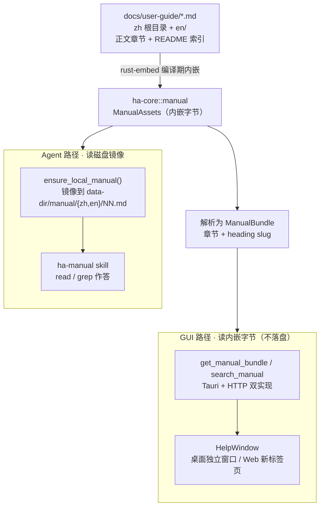
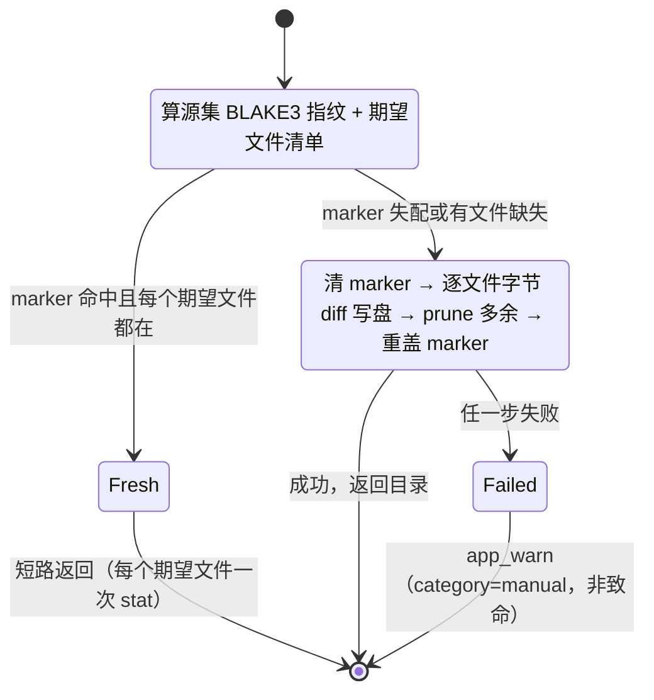
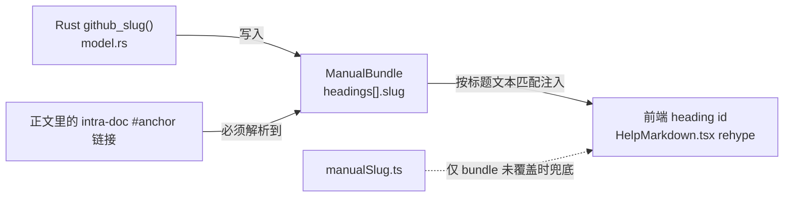

# 内置用户手册（帮助中心）

> 对外名「使用手册」。内容的唯一来源是仓库里的 [`docs/user-guide/`](../../user-guide/README.md)（中文放根目录、英文放 `en/`，全部正文章节 + 一份 README 索引）。本文讲的是这份手册**如何被编进应用**，以及它在两条完全不同的路径上被谁、怎么消费。

## 核心思想

一份产品手册要同时服务两类读者，需求相反：

- **用户**在图形界面里读，希望有目录、大纲、全文搜索、跨章跳转、"问 AI"——这套体验最好在前端本地完成，不要每翻一页就回后端。
- **模型**（`ha-manual` skill）在回答"这个功能怎么用 / 那个设置在哪"时，需要能 `read`/`grep` 的**真实文件**，而且要在桌面、Server、ACP、Docker 各种部署形态下都能找到。

关键设计是：**手册正文只有一份真相（`docs/user-guide/` 的 markdown），改文档就等于改手册**；这份真相在编译期被 `rust-embed` 烤进二进制，于是任何部署形态都自带完整手册，不需要往安装包或镜像里单独拷贝文件。烤进去之后再分叉成两条消费路径——

- **GUI 路径**直接读内嵌的字节，全程在内存里，不落盘；
- **Agent 路径**把内嵌内容镜像成 `<data-dir>/manual/{zh,en}/NN.md` 一棵可读的磁盘树，供 skill 检索。

这套「单一来源 + rust-embed 编译期内嵌 + 各部署形态统一携带」的模式，与内置技能（`ha-skills` 的 `skills::embedded`）、Chrome 扩展运行时（`ha-browser` 的 `browser::extension::embedded`）是同一个套路。它带来的一条纪律：**手册不需要、也不应该再被单独拷进任何构建产物**——Tauri 的 `bundle.resources`、Dockerfile 的 runtime `COPY` 都不用管它。

## 总览

后端全部逻辑落在 `crates/ha-core/src/manual/`（属于 kernel：手册的解析与磁盘台账留在核心 crate，薄壳只做命令转发）。

## 数据模型

`get_manual_bundle` 一次把前端要的东西全给到位（导航、大纲、Cmd+F、跨章跳转都在前端本地完成，不再回后端）。序列化字段名走 camelCase：

| 类型 | 字段 | 含义 |
| --- | --- | --- |
| `ManualBundle` | `lang` | 请求方给的 locale，规范化后 |
| | `effectiveLang` | 实际提供的手册语言，只有 `zh` / `en` |
| | `chapters` | README 索引（`number == 0`）在前，正文章节升序 |
| `ManualChapter` | `number` | 章节号，`0` 表示 README |
| | `title` | 从 H1 取标题，剥掉 `NN · ` 前缀 |
| | `body` | 章节 markdown 原文 |
| | `headings` | 该章全部标题 |
| `ManualHeading` | `level` / `text` / `slug` / `line` | 层级（1–6）、标题文本、锚点 slug、1-based 行号 |
| `ManualSearchHit` | `chapter` / `chapterTitle` / `anchor` / `line` / `snippet` / `score` | 命中所在章、章标题、最近的上文标题 slug（章首命中为空）、行号、带高亮标记的片段、排序分 |

## 模块边界（`crates/ha-core/src/manual/`）

| 文件 | 职责 |
| --- | --- |
| `embed.rs` | `#[derive(RustEmbed)] #[folder = "../../docs/user-guide"]`。release 把文件烤进二进制；debug 在调用时读工作区目录，所以开发时改 md 立即生效、免重编。`build.rs` 声明 `rerun-if-changed=../../docs/user-guide`，保证增删章节能让 warm rebuild 更新文件集。**内嵌 key 一律来自 `iter()` 原样取用**——中文文件名是非 ASCII，macOS 与 Linux 检出可能在 NFC/NFD 归一化上有差异，自行拼装查找 key 容易对不上，一律沿用 `iter()` 返回的原样键 |
| `model.rs` | 把内嵌 key 解析成带类型的章节：**语言只看路径前缀**（`en/` 与否），**章节号只看文件名开头的两位 ASCII 数字**（README=0），文件名里的中文部分刻意从不解释。heading 扫描是 fence-aware 的（跳过代码块内的 `#`），再按 GitHub 风格生成 slug |
| `search.rs` | 全文搜索。无索引、无分词器——语料只有几百 KB，逐行线性扫描已是亚毫秒。查询按空白切词，每个词都要作为大小写不敏感的 Unicode 子串命中（AND）；这一套对英文（`memory recall` 两个词）、中文（`记忆召回` 一个词、子串匹配不需要词边界）、中英混合统一有效。偏移用字符（不是字节）；命中片段用 STX/ETX（`\u{2}`/`\u{3}`）包住，这是与前端 `renderHighlightedSnippet` 的共享契约（和会话搜索后端同一套） |
| `unpack.rs` | 把内嵌手册镜像到 `<data-dir>/manual/`：逐文件字节 diff + prune 多余项 + 一个兄弟位指纹 marker。详见下文「磁盘镜像」 |
| `mod.rs` | 类型定义 + 公开 API（`get_bundle` / `search` / `manual_language_for_locale` / `ensure_local_manual` / 命令层的 `bundle_for_command` / `search_for_command`） |

**语言映射** `manual_language_for_locale`：`zh` / `zh-TW` → `zh` 手册，其余一律 → `en`。手册只有简体中文和英文两份，繁体读者读简体也远好过读英文，所以 zh-TW 落到 zh（界面 chrome 本身仍是 12 语）。命令层缺 `lang` 时回落到 `i18n::current_ui_locale()`。

## GUI 路径

**命令**（Tauri + HTTP 双实现，见 [api-reference.md](../system/api-reference.md)）：

- `get_manual_bundle(lang?)` 一次返回全部章节与 headings；
- `search_manual(lang?, query)` 把 CJK 排序与 snippet 逻辑锁在 Rust 一处。

**独立窗口**：URL 带 `?window=help` 时，[`main.tsx`](../../../src/main.tsx) 的单入口分流会动态 import Help 根组件（不进主 chunk）。桌面用一个固定 label 为 `help-window` 的窗口（登记在 [`capabilities/default.json`](../../../src-tauri/capabilities/default.json) 的 `windows` 列表里），采取 get-or-create 语义：已开着就聚焦并通过 `help:navigate` 事件重定向，不重置用户当前阅读位置；Web 模式降级为同源新标签页（API token 经 localStorage 自动携带）。

**链接改写 + 点击拦截**：这是本页面最容易踩的坑。Streamdown 默认 rehype 链里的 rehype-harden 会把**裸相对 href**（如 `02-模型与Provider.md`）替换成不可点的 Blocked-URL span。所以 [`helpLinks.ts`](../../../src/lib/manual/helpLinks.ts) 的 `rewriteManualBody` 必须在**渲染前**把手册里的链接改写成能过 harden 的形态。手册链接被归成五类，各有去向：

| 形态 | 改写为 | 说明 |
| --- | --- | --- |
| `anchor` 同章 `#锚点` | 保留 fragment | 直接跳本章标题 |
| `chapter` 跨章 `NN-….md[#锚点]` | `#ch:N[:anchor]` | 章号 + 可选锚点的 fragment |
| `language-switch` 两条 README 语言切换链接 | `#lang-switch` | 切换手册语言 |
| `external` 越出手册的相对链接 / http(s) | 绝对 GitHub URL | 按语言深度解析成仓库绝对地址 |
| `none` 无法识别 | 留给 harden 中和 | 本就不该导航 |

点击在容器 capture 阶段由 `resolveRenderedHref` 把这些 fragment 还原成结构化跳转目标并路由，**不改共享 `MarkdownLink` 的默认行为**。heading 的 `id` 由 [`HelpMarkdown.tsx`](../../../src/components/help/HelpMarkdown.tsx) 的一个 rehype plugin 注入——**直接取 bundle 里那份权威的 `headings[].slug`**（按标题文本匹配），[`manualSlug.ts`](../../../src/lib/manual/manualSlug.ts) 只在 bundle 未覆盖的文本（如带格式的标题）上兜底。

**入口**：侧边栏帮助图标（设置齿轮上方）、AboutPanel 里的按钮、macOS 原生 Help 菜单 + 三平台托盘项（Rust 侧 emit `open-help`，`App.tsx` 监听后调 `openHelpWindow()`）、以及设置页高频面板 header 上的「?」深链（`SettingsView` 的 `HELP_CHAPTER_BY_SECTION`，只链到章节号——锚点是语言相关的，章节号才是跨语言的 join key）。

**问 AI**：HelpWindow 把章节引用或选中文本经 `help:ask-ai`（桌面走 Tauri 全局事件、Web 走 BroadcastChannel）送回 App，切到聊天视图后，经一个模块级队列（`askAi.ts`，避开 mount 时序竞态）作为 message-quote chip 预置进输入框——复用既有的 `PendingMessageQuote` 机制，不动 ChatInput。

**章节内 Cmd+F**：用 TreeWalker 定位、CSS Custom Highlight API 上色（`::highlight(help-find)`），高亮不改 React DOM；引擎不支持 `CSS.highlights` 时降级为只计数 + 滚动。

## Agent 路径

模型这条路读的是磁盘上的镜像，由 [`skills/ha-manual/SKILL.md`](../../../skills/ha-manual/SKILL.md) 这个单文件、只读的 skill 驱动。它内联了一张章节路由表（按 `NN.md` 引导，通常一次 `read` 即命中），并**动态解析手册根**：`${HA_DATA_DIR:-$HOME/.hope-agent}/manual/`——Docker 下 data-dir 是 `/data`，写死 `~` 会 `ls` 到空目录。skill 本体同样靠 bundled-skills 的内嵌机制在全部部署形态下被目录发现。

纪律：**SKILL.md 只放路由表，绝不复制手册正文**。守卫 `ha_manual_skill_routing_table_matches_chapters` 断言路由表引用的章节集合与真实章节完全一致——重命名或重新编号一个章节而忘了改表，就会把模型静默引到错文件。

## 磁盘镜像的原理

镜像的目标是：**给 agent 一棵随时可读、可安全删除、下次用到就自愈的手册树**，同时让「二进制升级但文档没变」这种常见情况零开销跳过。

`ensure_local_manual()` 刻意**不做进程级路径缓存**——每次调用都跑一遍廉价校验，于是运行期间被整棵或部分删掉的镜像，会在下一次触发时重建，兑现"safe to delete — rebuilt on next use"的承诺：

几个要点：

- **廉价校验凭什么廉价**：指纹是内嵌**源集**的 BLAKE3（release 下进程内缓存一次），marker（文件 `.manual-synced`）里存的就是这个指纹。命中后只需对每个期望文件各做一次 `stat`，昂贵的「解析 + 写盘」只在校验 miss 时才跑。
- **自愈粒度**：校验要求 marker 匹配**且**每个期望文件都在，所以单删一章、删掉整个语言目录、或删掉整棵树，都会触发重镜像而不是留下半残副本。
- **写入安全**：重镜像先清 marker（进行中的副本可能不完整，读者此刻不该信任它），逐文件走原子写，全部成功后再重盖 marker。marker 放在 `manual/` 的**兄弟位**，不会被 prune 扫掉；目录本身可随时删。
- **失败不致命**：任何一步失败只 `app_warn!`（category `manual`）——GUI 读的是内嵌字节，根本不依赖磁盘。
- **已知限制**：互斥锁是进程内的。两个内嵌手册版本不同的长驻二进制共用同一 data-dir 时，各自会按自己的指纹重镜像；每文件写是原子的，树不会写到一半被撕裂，但落后的进程重启前读者可能短暂看到另一版本的文本。

### 镜像布局：只落 ASCII 文件名

磁盘镜像写的是 `manual/{zh,en}/NN.md`（README 写成 `index.md`），**中文文件名绝不落盘**——规避 Windows 非 ASCII 与 NFD/NFC 两类跨平台坑。镜像副本内的跨章链接被确定性重写为 ASCII 名，保持可跟随：

- `NN-任意标题.md` → `NN.md`
- `README.md` → `index.md`
- 两条 README 语言切换链接 → `../<lang>/index.md`

越出手册的相对链接（如指向 `../deployment/docker.md`）、锚点、外链一律原样不动。

### 三处触发点（都幂等）

1. **启动**：`app_init.rs` 的 `start_background_tasks`（完整层）与 `start_minimal_background_tasks`（ACP 层）里各有一处，primary-only、`spawn_blocking` 不占 runtime worker；
2. **`ha-manual` skill 激活时**：特判放在 [`ha-skills` 的 `tools/skill/inline.rs`](../../../crates/ha-skills/src/tools/skill/inline.rs)——这是两条激活路径（模型的 `skill({name})` 工具调用、用户的 `/manual` 斜杠命令）的共同咽喉，所以启动镜像若失败，任一入口重进都会重试；
3. **`get_manual_bundle` 命令**：打开 HelpWindow 是 agent 路径的一个自然就绪点。

指纹命中即短路，所以重复调用近乎零 IO。

## 关键契约

### Slug 三方逐字节一致

锚点跳转与搜索定位要能命中，取决于三处对同一标题算出**完全一样**的 slug：

- **算法**（`model.rs::github_slug`）：trim → 空格转 `-`、保留 `-`/`_`、Unicode 字母数字转小写保留、其余（标点/符号/emoji）一律丢弃；重复 slug 追加 `-1`、`-2`。**章内去重只在 Rust 侧做**，前端拿到的 bundle slug 已经带好后缀，所以前端不再自己去重（Streamdown 按 block 跑 rehype，跨 block 无法计数；手册的 `N.M` 编号本就保证章内标题唯一）。
- **守卫**：
  - `every_intra_doc_anchor_resolves_to_a_computed_slug` 对**全语料**（两语言全部章节的全部 intra-doc 锚点链接）断言可解析——既抓 slug 算法漂移，也抓文档里的锚点笔误；
  - Rust 与 TS 各自维护一份**相同 ground-truth 对**的单测（取自真实文档的锚点，如 `4.1 三层记忆…` → `41-三层记忆全局--agent--项目`、`7.8 电脑控制（macOS）` → `78-电脑控制macos`），双端锁死 CJK 边角：空格转连字符不塌缩（` / ` → `--`）、括号删除、中英混排。

### 搜索排序

命中按分排序：每个词的每次出现计 10 分，命中在标题行上再 +100，靠前的章节有轻微加权（用于打平）。返回上限 50 条，长行以命中为中心开一个约 160 字符的窗口。

## 双语对齐守卫

[`scripts/check-docs-parity.mjs`](../../../scripts/check-docs-parity.mjs)（`pnpm check:docs-parity`，`lint.yml` 的一步）保证中英不跑偏：

1. 章节号集合 1:1（两侧都有 `01..NN` + README）；
2. 每章 H2/H3 计数一致——一侧加了小节、另一侧没跟，会被抓到；
3. 两份 README 里的章节链接都指向存在的章节。

中英必须同 PR 更新（见 AGENTS.md 的文档维护约定）。

## 测试地图

- **cargo（`manual::` 模块）**：覆盖内嵌非空硬门禁（对 `iter()` 计数，防 Docker 缺 COPY 时静默 ship 空手册）、章节解析与编号连续性、slug 语料契约与去重、fence 感知的 heading 扫描、CJK 与中英混排搜索、镜像幂等 / 指纹短路 / 全量与部分删除后的自愈、链接重写形状、skill 路由表防漂移、语言映射。
- **vitest**：`manualSlug.test.ts`（与 Rust 共享 ground-truth 对）、`helpLinks.test.ts`（五类链接形态穷举 + 越界不导航）。
- **手测面**：开窗 / 聚焦 / 关闭、菜单与托盘入口、Web 新标签页、搜索高亮定位、章节内 Cmd+F、大纲跳转、设置页深链、问 AI、语言切换、Docker 内 agent 激活 `ha-manual`。
