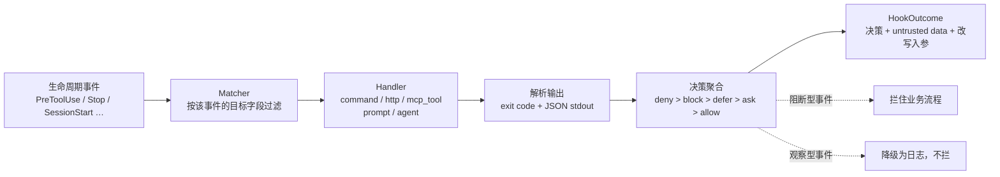
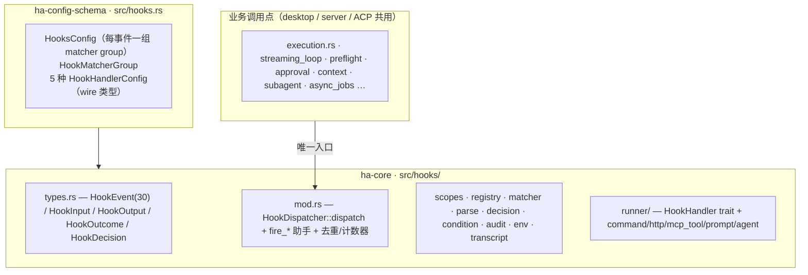
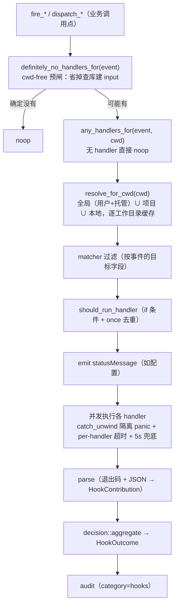
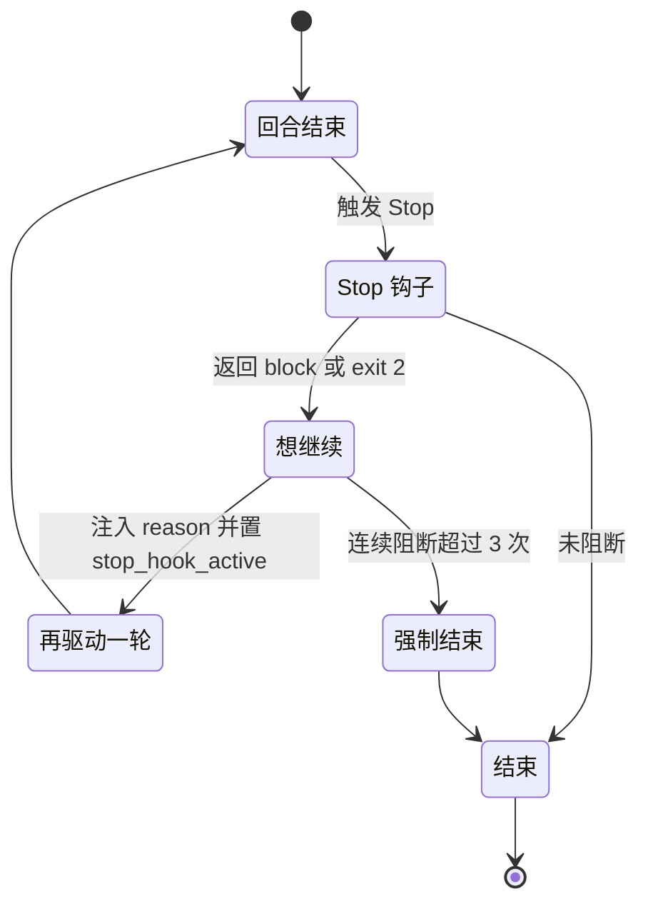
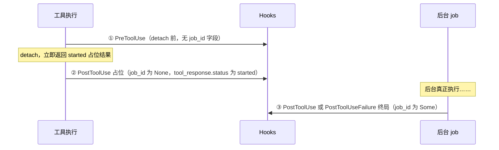
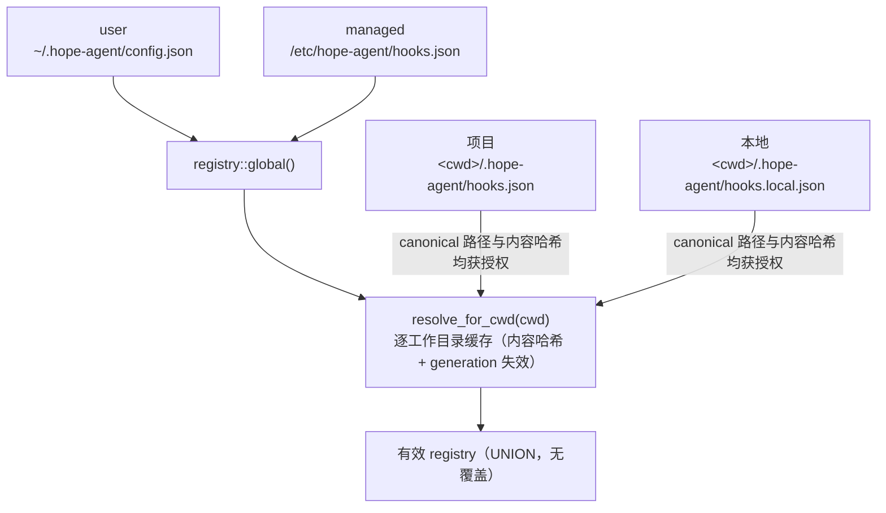
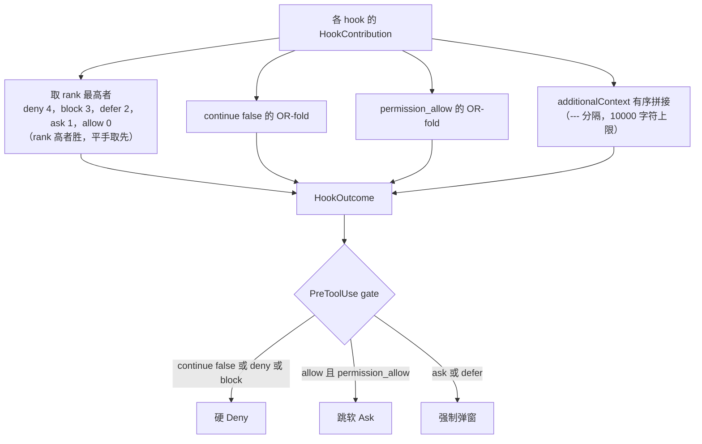

# Hooks 系统

> 更新时间：2026-08-23

Hooks 让用户在 Agent 生命周期的关键节点插入自己的逻辑——工具即将执行、会话开始/结束、上下文压缩、权限审批等时刻，触发一段用户自定义的 shell 命令 / HTTP 请求 / MCP 工具调用 / 一次性 LLM 提问 / 子 Agent。它是一套**可拔插的观察与拦截层**：既能旁观（审计、埋点、通知），也能拦截（挡下危险命令、否决压缩、贡献非可信上下文数据、改写入参）。Hook 输出从不因配置 scope 或 handler 类型获得 system/developer authority。

关键设计取舍是**字段级对齐 Claude Code 的 hooks 协议**——事件名、payload 字段、输出 JSON schema、退出码语义都照官方来，社区里为 Claude Code 写的 hook 脚本可以 paste 即用。这把「扩展 Agent 行为」这件事从「改代码、发版」降级为「写一段配置」。

关联源码：[`crates/ha-core/src/hooks/`](../../../crates/ha-core/src/hooks/)（行为与分发），[`crates/ha-config-schema/src/hooks.rs`](../../../crates/ha-config-schema/src/hooks.rs)（配置 wire 类型）。

---

## 1. 核心思想：一个事件如何变成一次决策

每一条 hook 都是三元组 **(事件, matcher, handler)**：在哪个生命周期节点触发、命中哪些具体调用、跑什么。一次触发的完整链路是：



理解整个子系统，只需抓住四条主轴：

- **事件分两类。** *阻断型* 事件的 hook 能真正拦住流程（拒绝工具、否决压缩、挡下 prompt）；*观察型* 事件的 hook 只能旁观，即便它返回「拦住」也会被静默降级成日志。一个事件属于哪类是代码写死的（`HookEvent::is_observation_only`），不由配置决定——这样「审计钩子」永远无法意外阻断业务。
- **Matcher 按事件量身取目标。** 工具类事件比对工具名，会话事件比对来源，压缩事件比对触发原因……每个事件比对哪个字段由 `HookInput::matcher_target` 决定（详见 [Matcher 引擎](#9-matcher-引擎)）。
- **Handler 是抽象的。** 五种 handler（shell 命令 / HTTP / MCP 工具 / LLM 提问 / 子 Agent）实现同一个 `HookHandler` trait，dispatch 只认 trait，不认具体类型。业务代码只读聚合后的 `HookOutcome`，永远不 match 具体 handler。
- **配置四层叠加，UNION 语义。** user / managed / project / local 四个来源的 hook 全部生效、互不覆盖——没有「后者盖前者」，只有「都跑一遍」。

输出走**退出码 + JSON 双通道**：`exit 2` 直接表示阻断（stderr 作原因）；`exit 0` 则解析 stdout 里的 JSON 决策；其它退出码一律非阻断。这也是官方约定，让「一行 `exit 2`」的极简脚本和「结构化 JSON 决策」的复杂脚本共存。

### 速查

- **30 个事件**（`types.rs::HookEvent`）：26 个真触发 + 4 个协议保留（枚举里有、可配置、但当前架构下永不触发）。
- **5 种 handler**：`command`（shell 子进程）/ `http`（SSRF 门后的 POST）/ `mcp_tool`（调 MCP 工具）/ `prompt`（一次性 LLM side-query）/ `agent`（spawn 子 Agent）。
- **4 层 scope**：user / managed / project / local，全 UNION、无覆盖。
- **配置热重载**：`config:changed` 事件重建全局 registry；project/local 文件按 mtime 失效。
- **JSONL transcript 镜像**：`transcript_path` 指向真实文件，官方脚本可 `jq` 直接读取。
- **零 Tauri 依赖**：全部落在 `ha-core`，desktop / `server` / ACP 三种运行模式共用同一套实现。

---

## 2. 架构与模块

配置的 **wire 类型**（能被 serde 读写的结构）下沉到 `ha-config-schema`，**行为逻辑**（事件枚举、matcher、分发、scope 合并、handler 执行）留在 `ha-core`。依赖方向单向：schema crate 不依赖 `ha-core`，`ha-core` 依赖 schema。



模块职责一览：

| 模块 | 职责 |
|------|------|
| `types.rs` | `HookEvent`（30 事件）/ `HookInput` / `HookOutput` / `HookOutcome` / `HookDecision` / `PermissionMode` |
| `config.rs` | `HooksConfigExt` 行为 trait（`groups_for` / `is_empty` / `merge_from`）+ 原地再导出 schema 类型（保持 `hooks::config::*` 路径不变） |
| `mod.rs` | `HookDispatcher::dispatch`（唯一入口）+ `fire_*` 助手 + per-session 去重与 Stop/PreCompact 计数器 |
| `scopes.rs` | 四层作用域解析 + 逐工作目录缓存 + 路径/内容信任校验 |
| `registry.rs` | `ArcSwap<HookRegistry>` + `reload_from_config` |
| `matcher.rs` | 三语法 matcher + 别名归一化 |
| `parse.rs` | 退出码 + JSON/plaintext → `HookContribution` |
| `decision.rs` | 多 hook 聚合（优先级 / continue / additionalContext / updatedInput） |
| `audit.rs` | `category="hooks"` 审计日志 + 注入上限 + overflow 文件 |
| `env.rs` | command 环境变量装配 |
| `condition.rs` | `if` 条件求值（`ToolName(pattern)`） |
| `transcript.rs` | JSONL 镜像（启动 backfill + live append） |
| `runner/` | 五种 handler 各一个文件，共享 `HookHandler` trait |

配置的具体 wire 类型定义（`HooksConfig` 30 个事件字段、`HookMatcherGroup`、5 种 `HookHandlerConfig`）在 `ha-config-schema/src/hooks.rs`；`merge_from` 用穷举解构，新增事件字段会立即编译失败，避免漏合并。

---

## 3. 一次 dispatch 的生命周期

`HookDispatcher::dispatch(event, input)` 是所有业务代码的唯一入口。观察型事件走便捷助手 `hooks::fire_*`，阻断型事件自己构造 `HookInput` 后调 `dispatch`。



### 两级 gate：为什么要有 cwd-free 预闸

精确的「有没有 handler」判断需要 cwd（project/local scope 按会话工作目录解析），而 cwd 来自 `sessions.working_dir` 查库——`fire_*` 得先建好 input 才拿得到。于是**没配任何 hook 也会照查一次库**，对 `fire_file_changed` / `fire_stop` / `dispatch_permission_request` 这类每轮或每次审批都跑的路径尤其浪费。

所以每个 `fire_*` / `dispatch_*` 先过一道**不需要 cwd** 的粗闸 `definitely_no_handlers_for`：当总开关开启，或（没有任何工作区信任记录且全局无处理器）时直接返回，跳过构建输入与查库。只要存在工作区信任记录，它就**拒绝作答**（返回 `false`），把判断交回二级精确闸——**预闸只许省事，永不许放行**。

- 正确性（预闸绝不跳过 project-scope 才有的 handler）由 `scopes::tests::cwd_free_pregate_only_ever_skips_work` 钉住。
- 反向的正向性（配了 hook 仍能穿过预闸真触发）由端到端集成测试 `hooks_e2e.rs` 的 `fire_*` 存活断言钉住——把预闸改成永真会让它超时失败。
- `HookDispatcher::dispatch` 自身与 `fire_and_forget` 内部各自还会再解析一次 cwd，所以已触发的 hook 每次仍有一次重复查库（既存行为）。

### hook gate 与既有 gate 的关系

hook 层加在既有权限体系的**外侧**：先跑 hook，没拦住才走 Plan Mode / 审批 / 危险命令判定。`PostToolUse` 在工具结果回灌历史**之前**跑（所以能改写结果）。每个 handler 并发执行，`catch_unwind` 隔离单个 handler 的 panic（避免拖垮整次 dispatch 和宿主调用点），各带自己的超时 + 5 秒兜底——慢 handler 只让自己超时，绝不吞掉已完成的兄弟 handler 的决策与上下文。

---

## 4. 事件矩阵（30 事件）

按落地状态分三组。**Matcher 目标** = 触发时 matcher 与哪个字段比对；**触发位置** = 当前埋点。

### 4.1 阻断型 · 真触发（10）

这些事件的 hook 能真正拦住流程（不在 `is_observation_only` 内）。

| 事件 | Matcher 目标 | 触发位置 | 备注 |
|------|-------------|---------|------|
| `UserPromptSubmit` | 无（始终触发） | `agent::preflight::user_prompt_preflight` → `fire_user_prompt_submit` | `block` / `deny` / `continue:false` 拦住 prompt；`additionalContext` 作为本 turn 的 untrusted user-data 冻结 |
| `PreToolUse` | `tool_name` | `tools::execution::fire_pre_tool_use_hook`（可见性闸后、权限引擎前）| `deny` / `ask` / `defer` / `allow` 决策 + `updatedInput` 改写入参 |
| `PreCompact` | `trigger` ∈ {auto, tool_loop} | `agent::context`（turn-start / tool-loop checkpoint）| `block` 跳过本次压缩；用量到紧急比例强制覆盖；连续 block 超过 `MAX_PRECOMPACT_BLOCKS=5` 后强制执行 |
| `WorktreeCreate` | `name` | `worktree::create_managed_worktree` | 可 block / deny；若匹配 handler 接管创建，必须返回 `hookSpecificOutput.worktreePath` 绝对路径 |
| `Stop` | 无 | `hooks::fire_stop` | **block-to-continue**（官方语义反转，见下）：`MAX_STOP_CONTINUES=3` 上限 + `stop_hook_active` 再入标记 |
| `PostToolBatch` | 无 | `ha-agent-runtime::streaming_loop`（每 API round settle 后一次）| `block` → 本轮落盘后停止 agent 循环（不再发下一次 model call）|
| `TaskCreated` | 无 | `tools::task::tool_task_create`（DB 写前）| `block` → 否决创建（回滚整批）。workflow 路径仍 fire-and-forget，block 无效 |
| `TaskCompleted` | 无 | `tools::task::tool_task_update`（update 前）| `block` → 否决标记完成。workflow 路径同上 |
| `UserPromptExpansion` | 命令名 | `slash_commands::execute_slash_command` | `block` → 否决 slash 展开（命令不执行，返回 Err）|
| `PermissionRequest` | `tool_name`（回退 command） | `tools::approval`（弹窗前）| `block` / `decision.behavior:"deny"` → 自动拒绝审批。**仅 deny**：hook 的 `allow` 不自动放行（防绕过 strict / 用户）|

**Stop 的反转语义**：官方 `Stop` 的 `block` 意为「别停下、继续」而非「拦住」。它注入 reason 后经子 Agent 注入管路再驱动一轮；`MAX_STOP_CONTINUES=3` 封顶、`stop_hook_active` 标记再入，正常结束时计数重置。



**关于 exec 的审批时序**：`PreToolUse` 一律在可见性闸后、引擎/审批前早早触发，与是否后台化无关。而 `exec` 的**命令级审批**分两条后台路径（详见 [tool-system](../core/tool-system.md)）：Auto-Background 档在 detach 前跑完命令审批，审批因果恒在「后台化」之前；显式后台 exec（`run_in_background`）则把命令门下放后台 job 线程，命中审批时 job park 为 `AwaitingApproval`——模型先拿到 job id，弹窗可能在合成的 `{status:"started"}` 结果**之后**才出现，但此时 job 是 parked 而非 running。异步 job 的**终局** hook 见 [异步 job 的终局可见性](#5-异步-job-的终局可见性)。

### 4.2 观察型 · 真触发（16）

这些事件的 hook 只能旁观：`block` / `deny` 决策被 `is_observation_only` 降级为非阻断 + 日志。

| 事件 | Matcher 目标 | 触发位置 |
|------|-------------|---------|
| `SessionStart` | `source` ∈ {startup, resume, …} | `agent::context` / `fire_session_start_observation` |
| `SessionEnd` | `source`（序列化为官方 `reason`）| `fire_session_end` / `dispatch_session_end` |
| `PostToolUse` | `tool_name` | `streaming_loop::fire_post_tool_use_hook`（同步成功路径 + 异步提交的合成「started」占位）+ `fire_async_job_terminal`（异步 job 终局，带 `job_id`）|
| `PostToolUseFailure` | `tool_name` | 同上（`is_error=true`；异步取消 / 重启中断 `is_interrupt=true`）|
| `PermissionDenied` | `tool_name`（回退 command）| `hooks::fire_permission_denied` |
| `StopFailure` | error 类型（序列化为 `error_type`）| `chat_engine::finalize`（最终分类错误）|
| `PostCompact` | `trigger` ∈ {auto, tool_loop} | `agent::context`（Tier ≥ 2 压缩完成后；同 compaction dedup key 去重）|
| `Notification` | `notification_type`（序列化为 `type`）| `hooks::fire_notification` |
| `SubagentStart` | agent type | `subagent::spawn::fire_subagent_start` |
| `SubagentStop` | agent type | `subagent::spawn::fire_subagent_stop`（block-to-continue 未落地）|
| `ConfigChange` | `category`（**非官方 `source`**）| `config::persistence::fire_config_change`（veto 刻意不做）|
| `CwdChanged` | 无 | `session::db::fire_cwd_changed` |
| `FileChanged` | 文件绝对路径 | `tools::{write,edit,apply_patch}::fire_file_changed` |
| `WorktreeRemove` | `worktree_path` | `worktree::archive_managed_worktree`（clean remove 成功后）|
| `Elicitation` / `ElicitationResult` | 无 | `tools::ask_user_question`（原生问答触发，非 MCP）|

几个刻意保留为观察型的决定：

- `SubagentStop` 的 block-to-continue（再驱动已终结的子 Agent）需要接住子 Agent 循环，属较大特性，暂保留观察。
- `ConfigChange` 的 veto **刻意不做**：`mutate_config` 是同步热路径，且一个 hook 若能拦住配置写入，就能拦住用户关闭 hooks / 修复坏配置（自我封锁）。类比官方 `policy_settings` 豁免。
- `Elicitation` / `ElicitationResult` 当前复用原生 `ask_user_question`（payload 用 `request_id` / `question_count`，**非**官方 MCP elicitation schema），MCP server 落地后再对齐官方。
- `CompactTrigger::Manual` 是序列化协议的保留枚举；桌面 / IM 的 `/compact` 手动压缩直接调 `compact_if_needed()`，不触发 hooks。

### 4.3 协议保留 · 永不触发（4）

枚举完整、可配置（config key 不报错），但当前架构无对应触发点，`HookEvent::is_reserved()` 单一裁决：

- `Setup`——官方 `--init` / `--maintenance` 的 headless `-p` 模式；本项目无该 CLI 形态。
- `MessageDisplay`——官方 assistant 文本显示钩子；本项目 desktop / IM / ACP 多端渲染无单一 display 收口。
- `TeammateIdle`——依赖 team idle 检测。
- `InstructionsLoaded`——依赖 system_prompt 组装埋点。

为它们注册 hook 不报错，但永远不会触发（详见 [Roadmap](#18-roadmap未落地)）。

---

## 5. 异步 job 的终局可见性

被后台化的工具（`BackgroundPolicy::GenericJob`）在**离开当轮之后**才拿到真实结果，同步路径的 `fire_post_tool_use_hook` 看不到。`async_jobs` 的 finalize 在写完终局后调 `hooks::fire_async_job_terminal` 补发终局 hook，把异步结果补进 PostToolUse 覆盖面。

这带来一个非直观的事实：**一个被后台化的 `tool_use_id` 会 fire 三次，不是两次。**



- **① 提交时 `PreToolUse`**：在 detach 之前，payload 没有 `job_id` 字段。
- **② 合成「started」占位 `PostToolUse`**：detach 立即把 `{"job_id":..,"status":"started"}` 当 tool_result 返回。它不以 `Tool error:` 开头，故 `is_error=false`，照常发一条 `PostToolUse`，且 payload 的 `job_id=None`。由于 `job_id` 带 `skip_serializing_if=Option::is_none`，**这条 JSON 里 `job_id` 缺省，与一次普通同步完成字节级同形**——单看「`job_id` 有无」无法把它和真同步完成区分，必须看 `tool_response.status == "started"`。
- **③ 终局 `PostToolUse(Failure)`**：真实结果落地时由 `fire_async_job_terminal` 发，`job_id=Some`。`tool_input` 为 `Null`（finalize 处只有 job id、没有原始入参），matcher 仍按 `tool_name` 命中。

即：`job_id=Some` 唯一标识**终局** fire（与前两条都区分开）；要把合成「started」占位与真同步完成分开，则看 `tool_response.status`。

事件与状态的映射单点在 `JobStatus::terminal_hook_flags()`，返回 `(is_error, is_interrupt)`：

| 终态 | is_error | is_interrupt | 事件 |
|------|:--------:|:------------:|------|
| `Completed` | false | false | `PostToolUse` |
| `Failed` / `TimedOut` | true | false | `PostToolUseFailure` |
| `Cancelled` / `Interrupted` | true | true | `PostToolUseFailure`（`is_interrupt`）|

两条易错的补发路径：

- **取消可见**：取消的 job 也 fire（`is_interrupt=true`），不再对 hooks 静默；但**不**走注入管路（取消多源于 turn-cancel / session-delete，注入会凭空起新回合或命中幽灵会话）。
- **重启补发**：`replay_pending_jobs` 对 terminal-but-uninjected 行补发终局 hook，覆盖重启时被标 `interrupted`、进程死前从未 fire 的 job。正常 finalize 过的 job 是 `injected=true`，被 `list_pending_injection` 排除，不重复 fire。

**线程红线**：`fire_async_job_terminal` 强制走进程级 `fire_and_forget_runtime()`，不用 `Handle::try_current()`——finalize 跑在 job OS 线程的 current-thread runtime 上，该 runtime 线程结束即 drop，spawn 在其上的 dispatch 会被静默杀掉。它是纯 fire-and-forget，不阻塞 finalize。

---

## 6. 与官方 Claude Code 协议的差异

字段级对齐官方，但仍有若干无法完全对齐的差异，全部登记于此（不隐藏）。

| 字段 / 语义 | 官方 | Hope Agent | 影响 |
|------------|------|-----------|------|
| `tool_name`（payload） | `Bash` / `Write` / `Edit` / `Read` / `WebFetch` … | 内部名 `exec` / `write` / `edit` / `read` / `web_fetch`。**matcher 归一化别名**（写 `matcher:"Bash"` 能命中），但 payload 的 `.tool_name` 仍是内部名 | 脚本若 `jq` 判 `.tool_name=="Bash"` 不命中——改判 `.tool_input.*` |
| `permission_mode` | `default\|plan\|acceptEdits\|auto\|dontAsk\|bypassPermissions` | 仅 `default\|plan\|bypassPermissions`，Smart 模式 → `other` | 硬 switch 6 值的脚本需兜底 `other` |
| 可阻断事件集 | `Stop` / `SubagentStop` / `TaskCreated` / `TaskCompleted` / `ConfigChange` / `PostToolBatch` / `UserPromptExpansion` / `PermissionRequest` / `Elicitation*` 均可阻断 | **已落地 6 个**（§4.1）：`Stop` / `PostToolBatch` / `TaskCreated` / `TaskCompleted`（仅交互 tool 路径）/ `UserPromptExpansion` / `PermissionRequest`（仅 deny）。`ConfigChange` / `SubagentStop` / `Elicitation*` 刻意保留观察型（原因见 §4.2） | 未落地三者的官方阻断脚本仍 no-op |
| `prompt_id` | 每 payload 携带（首次用户输入后的 per-turn UUID） | **已填充**：轮内事件走 `resolve_prompt_id()` 读 `active_turn::current().turn_id`；`UserPromptSubmit` 由入口直传（`PreflightArgs.turn_id` 同时交给 `try_acquire`） | 轮内事件（PreToolUse / PostToolUse / PostToolBatch / Stop / PermissionRequest / Task\*）共享同一 id、可按轮分组。**残留缺口**：只有 Desktop / HTTP / IM / 手动压缩四处 acquire active turn，故 **ACP / cron / 后台 subagent / eval 的轮内事件恒 `None`**（ACP 的 `UserPromptSubmit` 因直传而有 id）|
| `effort` | `effort.level`（`low\|medium\|high\|xhigh\|max`；仅工具上下文事件、模型支持时）| **已填充**：`resolve_effort()` 读**全局** reasoning-effort cell（UI picker / `/thinking` 设的值），`try_lock` 同步安全。可含专有 `minimal`；`none`/空 → omit | 反映**全局** effort，不反映 per-agent 覆盖（`Agent::effective_reasoning_effort` 为 async，同步 build 点取不到）；`$CLAUDE_EFFORT` 同源 |
| `PermissionRequest`/`Denied` 的 `tool_name`/`tool_input` | 携带结构化 tool_name + tool_input | **已填充**：四个 fire 点与 exec 命令级 deny 都带上。engine gate 传的是 PreToolUse `updatedInput` + sanitize + migrate **之后**的影子值（与 PostToolUse / 历史一致，刻意与 PreToolUse 不一致——PreToolUse 是 `updatedInput` 的生产者）| 可按 `.tool_input` 判参数、按 `tool_use_id` 对账。**仍缺**：exec 命令级 deny 刻意传 `tool_name: None`（matcher 须打命令串而非 `"exec"`）；审批**超时**分支不 fire `PermissionDenied`；`tool_name()` 访问器刻意不扩到 Permission（扩了会让 `if:` 规则突然命中审批事件）|
| `ConfigChange.source` | 变更的**配置文件 scope**（`user_settings` / `project_settings` …）| 本项目单 `config.json`，`source` = **触发者**（`user`/`skill`/`reload`），配置**域**在 `category`；matcher 目标 = `category` | 期望 `.source=="project_settings"` 的脚本不命中；按 `.category` 匹配 |
| `FileChanged` matcher | 字面文件名精确集（无 regex）| 目标 = 绝对路径，走通用 matcher（含 regex），是**超集** | 官方字面 basename matcher（如 `config.json`）对不上绝对路径；用 `.*config\.json$` |
| `Elicitation`/`ElicitationResult` | MCP elicitation（`server_name` / `form_schema` / `action`+`content`）| 复用原生 `ask_user_question`（`request_id` / `question_count` / `status`）；输出 `action`/`content` 已可解析但未接 MCP | 读 `.server_name`/`.form_schema` 或回 action/content 无效；MCP server 落地后对齐 |
| `Setup`/`MessageDisplay`/`InstructionsLoaded`/`TeammateIdle` | 官方事件 | 协议保留、永不触发（§4.3）| 为其注册的 hook 不触发 |
| `CLAUDE_ENV_FILE` | SessionStart / CwdChanged / FileChanged 可用 | 未实现（`env.rs` 标注 out of phase）| 见 Roadmap |
| `if:` 字段 | Bash rule 细到子命令 | tool-name 级 + glob substring，不拆 Bash 子命令 | `Bash(rm *)` 走 glob，复杂 pipeline 不拆 |
| `transcript_path` | JSONL 文件 | JSONL 镜像，值 = `~/.hope-agent/sessions/{id}/transcript.jsonl` | 无差异（用户透明）|

---

## 7. 配置 Schema

### 7.1 结构

```jsonc
// AppConfig.hooks（ha-config-schema::hooks::HooksConfig），30 个事件键，每个值是 matcher group 数组
{
  "<EventName>": [                       // PascalCase 事件名（SessionStart / PreToolUse / …）
    {
      "matcher": "Bash|Write",           // 可选；缺省 = 通配
      "hooks": [ <HandlerConfig>, … ]    // 一组 handler
    }
  ]
}
```

五种 `HandlerConfig`（公共字段见 [Handler 执行](#10-handler-执行)）：

```jsonc
{ "type": "command",  "command": "...", "args": [], "shell": "bash|powershell", "allowedEnvVars": ["DECLARED_NAME"], "async": false, "asyncRewake": false, "timeout": 600 }
{ "type": "http",     "url": "https://…", "headers": {"Authorization": "Bearer ${TOKEN}"}, "allowedEnvVars": ["TOKEN"], "timeout": 600 }
{ "type": "mcp_tool", "server": "...", "tool": "...", "input": { "path": "${tool_input.file_path}" }, "timeout": 600 }
{ "type": "prompt",   "prompt": "...", "modelOverride": {…}, "timeout": 30 }
{ "type": "agent",    "prompt": "...", "agent": "...", "allowedTools": [...], "async": false, "timeout": 60 }
```

**serde 命名**：事件键 PascalCase；handler 字段 camelCase（`asyncRewake` / `statusMessage` / `allowedEnvVars`）；`async` 是 Rust 关键字，`#[serde(rename="async")]` → `async_run`；`if` → `if_rule`。

### 7.2 读写 contract（强制）

- **读** `cached_config().hooks`（`Arc` 快照），详见 [config-system](../infra/config-system.md)。
- **写** user scope 走 `mutate_config(("hooks", source), |c| {…})`；project / local / managed 是独立 scope 文件（§8）。
- **`ha-settings` 技能对 hooks 只读**：`get_settings` 含 `hooks`（http header 脱敏），写被 `BLOCKED_UPDATE_CATEGORIES` 拦截——hooks 能跑任意命令，可写等于让模型给自己装命令执行（特权升级）。

---

## 8. 四层 Scope 模型

| Scope | 位置 | 范围 |
|-------|------|------|
| **user** | `~/.hope-agent/config.json` 的 `hooks` | 全局，编进 `registry::global()` |
| **managed** | `/etc/hope-agent/hooks.json`（Win：`%PROGRAMDATA%\hope-agent\hooks.json`）| 全局（企业下发），合进 `registry::global()` |
| **项目** | `<会话工作目录>/.hope-agent/hooks.json` | 随仓库共享，逐工作区与内容授权 |
| **本地** | `<会话工作目录>/.hope-agent/hooks.local.json` | git-ignored 开发者私有，逐工作区与内容授权 |



- **UNION 语义**：所有命中 scope 的 hook 都跑，没有覆盖优先级。
- 项目 / 本地作用域依赖会话工作目录（`sessions.working_dir`，无 home 回退），dispatch 时经 `scopes::resolve_for_cwd` 合并到全局之上。缓存以 canonical cwd + project/local 文件 BLAKE3 + 全局 reload generation 为键；未授权时直接返回全局 registry。
- **逐工作区、逐内容授权**：Settings → Hooks 只提交绝对路径；后端仅为**新加入**的路径重新 canonicalize 并计算两个 Hook 文件的 BLAKE3，已有路径必须原样保留 `hook_workspace_trusts` 中的旧哈希，禁止无关设置保存时静默重新授权。执行时路径与两个内容哈希必须同时吻合；路径别名、symlink、目录移动、新增/删除文件、任一内容变化均 fail closed。重新批准必须先移除并保存该工作区，再重新添加并保存。
- **旧全局开关不迁移**：`hooks_allow_project_scope` 仅为旧配置反序列化保留，执行层忽略，保存新设置时清为 `false`。不得把旧 `true` 自动转成信任记录，否则会继续授权所有未来 cwd。
- **`disable_all_hooks` 主开关**：同步短路返回**空** registry（不依赖异步 `config:changed` 重载，避免开关刚翻、旧 registry 仍被用的窗口），一键关闭所有 scope。
- **热重载**：`config:changed` 触发 `registry::reload_from_config`（用户 + 托管合并 + bump generation），逐工作目录缓存随 generation 失效。

### 工作区信任红线

信任记录只有后端能生成完整形状；GUI/HTTP 请求只带路径，不能自报哈希。信任是「此 canonical 工作区的这两个文件当前内容」，不是「路径前缀」、仓库身份或一次永久授权。解析与 registry 编译之间会再次对实际读取的字节验哈希，避免文件在首次校验后变更而借旧哈希执行。任何不确定状态都只保留用户 / 托管作用域。

---

## 9. Matcher 引擎

三种语法自动判别：

1. **通配**：matcher 缺省 / 空 → 命中该事件所有触发。
2. **精确 / 列表**：纯 `[A-Za-z0-9_|]`（含空格 / `,` / `-`）→ 按 `|` **或** `,` 拆成集合，各项 `trim`，目标精确相等任一即命中（`Edit|Write`、`general-purpose` 走精确不误判 regex）。
3. **正则**：含其它字符 → **非锚定** regex（对齐官方 unanchored：`^Notebook` 命中所有以 `Notebook` 起头的工具、`mcp__memory__.*` 命中全部 memory 工具；要整串匹配自写 `^...$`）；无效 regex → never-match + warn。

**别名归一化**：matcher 编译期把 Claude Code 工具别名映射到内部名（`Bash`→`exec`、`Write`→`write`、`Edit`→`edit`、`Read`→`read`、`WebFetch`→`web_fetch`），所以 `matcher:"Bash"` 命中内部 `exec`。**注意**：归一化只作用于 matcher，payload 的 `.tool_name` 仍是内部名（§6）。别名归一化覆盖所有 tool-name 事件：`PreToolUse` / `PostToolUse` / `PostToolUseFailure` / `PermissionRequest` / `PermissionDenied`。

matcher 目标按事件取（`HookInput::matcher_target`）：`tool_name`（工具类 / Permission 事件，Permission 无 tool_name 时回退 `command`）、`source`（SessionStart / SessionEnd）、`agent_type`（SubagentStart / SubagentStop）、`trigger`（Pre/PostCompact）、`category`（ConfigChange，非官方 `source`）、文件绝对路径（FileChanged）、命令名（UserPromptExpansion）、error 类型（StopFailure）等。无目标的事件（UserPromptSubmit / Stop / PostToolBatch / Task\* / CwdChanged / Elicitation\*）只命中通配 matcher。

---

## 10. Handler 执行

五种 handler 实现同一 `HookHandler` trait，dispatch 只认 trait。

### 10.1 command

- `bash -c '<command>'`（解析 PATH，非硬编码 `/bin/bash`）；Windows 走 PowerShell。给了 `args` 则按官方 exec 形直接 spawn（不过 shell，忽略 `shell`）。
- hook 输入 JSON 序列化 + 换行喂 **stdin**（friendly for `read` / `jq`）；并发 drain stdout / stderr / wait。
- stdout / stderr 各 **bounded 1 MiB**（`drain_bounded`，防 OOM；内核管道继续 drain 避免子进程死锁）。
- 退出码：`exit 2` → Block（stderr 作 reason）；`exit 0` → 解析 stdout；其它 → 非阻断（§11）。
- 默认超时 **600s**；超时杀进程树（Unix 进程组 / Windows TerminateProcess），返回 `timed_out=true`。
- `async` = fire-and-forget，不影响决策；`asyncRewake` 见 §10.6。

### 10.2 http

- **SSRF 闸 FIRST**：`security::ssrf::check_url`（Default policy + trusted_hosts）在建 client / 触网前；**不跟随重定向**（重定向只过同步 host 检查会漏）。
- POST hook 输入 JSON；配置 header 的 `$VAR` / `${VAR}` 按 `allowedEnvVars` 白名单插值（§13），白名单 env 另以 `X-Hope-Env-<NAME>` 转发。
- **响应体 bounded streaming**（`read_body_bounded`，超 1 MiB 即丢弃断连，非缓冲后截断）。
- **阻断事件 fail-closed**：在 `is_blocking()` 事件（`PreToolUse` / `UserPromptSubmit` / `PreCompact` / `WorktreeCreate`）上，SSRF 拒绝 / 传输错误 / 超时 / 非 2xx / 非协议 JSON / 超限 body 一律 `exit 2` → Block（避免鉴权过期的 401 静默放行）；观察事件保留宽松降级。2xx body 须是含已知协议键的 JSON 对象（`{}` = 沉默允许），否则阻断事件 fail-closed。
- identity 含 `url|timeout` + headers/allowedEnvVars 的排序 hash，避免同 URL 不同鉴权被去重折叠。

### 10.3 mcp_tool

- 调 `mcp::invoke::call_tool`（内部校验 MCP 就绪；未就绪 = 非阻断错误）。
- `input` 模板支持 `${dotted.path}` 占位符插值（`tool_input.*` / `tool_response.*` / `session_id` / `cwd` / `agent_id` / `tool_name` / `prompt`）；未解析占位符留字面量 + warn。identity 含 input hash。

### 10.4 prompt

- 走 `crate::automation::run` 一次性 LLM 调用（purpose `hooks.prompt`）；结果作 `additionalContext`，并按 Hook data 进入 untrusted user/tool-data 通道，不会成为主对话指令。模型链解析优先级：`modelOverride`（`ModelChain`）→ 已弃用的 `model`（单冒号 `provider:model` 字符串，惰性解析，GUI 不再写）→ `function_models.automation` 全局默认链 → 聊天全局模型。详见 [automation-model](../core/automation-model.md)。因 hook 配置本身不持有存活的主对话 Agent 实例，不复用主对话 stable-system cache 前缀。

### 10.5 agent

- `spawn_subagent` 起子 Agent（默认与 side_query 同能力，无沙箱——见 Roadmap）；`async` = fire-and-forget 返 run id，否则轮询至终态（受 deadline 限）。
- **超时取消**：deadline 命中调 `cancel_registry.cancel(run_id)` 翻原子 flag，避免子 Agent 后台继续烧 token。
- **级联防护**：hook-originated spawn 抑制 SubagentStart / Stop hook，防 `SessionStart` / `SubagentStart` agent hook 无限递归 spawn。

### 10.6 公共字段

每个 handler 可带（`asyncRewake` 仅 `command`）；过滤在 dispatch build 循环内、去重前完成：

| 字段 | 作用 |
|------|------|
| `timeout` | 单 handler 超时秒（默认对齐官方：command 600 / http 600 / mcp_tool 600 / prompt 30 / agent 60）|
| `args`（仅 `command`）| 官方 exec 形 argv：给定则直接 spawn `command`+argv（不过 shell、忽略 `shell`）；缺省走 `<shell> -c command` |
| `if` | 条件执行 `ToolName(pattern)`：**仅** PreToolUse / PostToolUse / PostToolUseFailure 求值（其余事件直接跳过，fail-safe）。复用权限引擎参数提取器 + glob（`*` 贪心、`**`≡`*`，不拆 Bash 子命令）；接受工具别名。例 `exec(rm *)` / `write(src/**)` / `web_fetch(*.github.com)` |
| `once` | 该 handler 每会话只跑一次（per-process 内存去重，按 type+identity，重启重置）|
| `statusMessage` | handler 即将运行时桌面 GUI 弹 toast（emit `hook:status`）。慢 handler 才有感；IM 渠道暂不展示 |
| `asyncRewake` | （仅 `command`+`async`）后台 hook `exit 2` 时把 escaped stderr 作 `<hook-async-result>` Hook data 注入**下一轮对话**（复用子 Agent 注入管路，不取得 system/developer authority）。**会让后台 hook 自主起一轮 LLM（耗 token）**——需作者显式配 + hook 主动 `exit 2`，必埋审计 |

---

## 11. 输出协议

| 返回 | 含义 |
|------|------|
| `timed_out` | 非阻断（inert）|
| `exit 2` | `HookDecision::Block`，stderr trim 作 reason |
| `exit 0` + stdout 为 JSON | 解析 `HookOutput`（见下）|
| `exit 0` + stdout 非 JSON | **仅** SessionStart / UserPromptSubmit / UserPromptExpansion 当作 `additionalContext`；其它忽略 |
| 其它非零 / `None` | 非阻断（inert）|

JSON stdout schema（`HookOutput`，camelCase）：`continue` / `stopReason` / `suppressOutput`（已生效，折入 `HookOutcome.suppress_output`）/ `systemMessage` / `terminalSequence` / `decision`（top-level：block / deny / ask / defer）/ `reason` / `hookSpecificOutput.{additionalContext, sessionTitle, permissionDecision, permissionDecisionReason, updatedInput, updatedToolOutput, decision.behavior, retry, action, content, displayContent, initialUserMessage, watchPaths, reloadSkills, worktreePath}`。

- `permissionDecision`（allow / deny / ask / defer）**仅 PreToolUse** 生效，优先于 top-level `decision`；`defer` → `HookDecision::Defer`（下游手工审批，不静默 Allow）。
- `updatedToolOutput`（PostToolUse）→ 改写工具结果（接 `streaming_loop::fire_post_tool_use_hook`，用于脱敏）；`decision.behavior`（PermissionRequest allow/deny）；`retry`（PermissionDenied）均已解析入 `HookOutcome`。
- `action`/`content`（Elicitation）、`displayContent`（MessageDisplay）、`initialUserMessage`/`watchPaths`/`reloadSkills`（SessionStart）、`terminalSequence` 已解析入 schema，行为消费为 Roadmap（对应事件保留 / 能力未接）。

---

## 12. 决策聚合

多个命中 hook 的 `HookContribution` 折叠成一个 `HookOutcome`：



- **决策优先级**：`deny(4) > block(3) > defer(2) > ask(1) > allow(0)`，平手取先。
- **`continue:false`**：任一 hook 返回即 `outcome.continue_execution=false`（PreToolUse callsite 映射为硬 Deny；UserPromptSubmit preflight 映射为 Block）。
- **`permission_allow`** OR-fold（任一显式 `permissionDecision:"allow"` → true，仅跳软 Ask）。
- **`additionalContext`** 有序拼接（`---` 分隔），**10000 字符上限**（`MAX_INJECT_CHARS`），超出写 overflow 文件（`0o600`）；字段名只表示 Claude Code 协议兼容，不授予 instruction authority。
- **`updatedInput`** last-writer-wins；`systemMessage` / `sessionTitle` 首个非空胜出。

**PreToolUse gate** 收尾：`continue:false` → Deny；`deny`/`block` → Deny；`allow`+`permission_allow` → 跳软 Ask；`ask`/`defer` → 强制弹窗。保护路径 / 危险命令 / Plan Mode 永远弹窗，`permissionDecision:"allow"` 不能跳过。

### `additionalContext` 的 authority 与冻结边界

`additionalContext` 一律视为 **untrusted data**，不能拼入 cache-stable system，也不能因为 handler 来自 `managed` / `project` scope、由本地 command 产生，或外层事件本身受信，就升级为 developer instruction。各消费路径保持原事件附近的 provenance：

- `UserPromptSubmit` 与 `SessionStart` 输出在 turn start 进入 `TurnContextBuilder::untrusted_data(HookContext, ...)`，渲染为 `<hope_round_data>` user-data；
- `PostCompact` / `SessionStart(compact)` / `PostToolBatch` 等回合间输出进入下一 round 的 `task_and_hook_context` user-data；
- `PostToolUse` / `PostToolUseFailure` 输出包在工具结果的 `<hook-context>` 中，仍是非可信 tool data；`asyncRewake` 同样只投递 escaped Hook data。

Hook 在对应生命周期点只执行一次。输出一旦被取入当前 turn/round 的冻结 request snapshot，同一请求的 Provider retry / failover 复用相同字节与 provenance，不因换 attempt 再跑 Hook；新 Hook 输出只能在后续明确的生命周期事件或下一 round 形成新 snapshot。这样既避免外部结果漂移，也防止重试重复触发 Hook 副作用。

---

## 13. 环境变量

command Hook 子进程先 `env_clear()`，再继承最小运行环境（Unix：`PATH` / locale / `TERM` / `TMPDIR`；Windows：`PATH` / `PATHEXT` / `SYSTEMROOT` / `WINDIR` / `COMSPEC` / `TEMP` / `TMP`）、配置显式声明的 `allowedEnvVars`，最后注入下列合成变量（同名时覆盖声明值）：

| 变量 | 值 |
|------|-----|
| `CLAUDE_PROJECT_DIR` / `HOPE_PROJECT_DIR` | 会话 cwd / 项目根（**双注入，值一致**）|
| `HOPE_AGENT_VERSION` | `CARGO_PKG_VERSION` |
| `HOPE_SESSION_ID` | 当前 session_id |
| `HOPE_TRANSCRIPT_PATH` | JSONL 镜像路径 |
| `CLAUDE_CODE_REMOTE` | `"false"` 桌面 / `"true"` server·ACP（对齐官方）|
| `CLAUDE_EFFORT` | 官方 effort 级别（`effort` 有值时注入，取自全局 reasoning-effort cell，见 §6；未设时不注入）|
| `PATH` | 登录 shell PATH（`tools::exec::get_login_shell_path()`，避免 `npm` / `python` 找不到；Windows 使用最小继承值）|

command Hook 的 `allowedEnvVars` 只复制命名变量，不记录值；变量名必须符合 `[A-Za-z_][A-Za-z0-9_]*`。http Hook 的 header value 同样按 `allowedEnvVars` 白名单做 `$VAR` / `${VAR}` 插值（`resolve_allowed_env` 先查合成 env 再查进程 env，未解析留字面量 + warn）。

`CLAUDE_ENV_FILE`（让 hook 持久化一批 session 级 env）当前未实现（`env.rs` 标注 out of phase），见 Roadmap。

---

## 14. Transcript 镜像

- `transcript_path` = `~/.hope-agent/sessions/{id}/transcript.jsonl`，官方脚本可 `jq` 读取。
- **启动期 backfill**：`app_init` 调 `TranscriptMirror::backfill_all(&db)`，对无 transcript 的旧会话按 SQLite 回放重建（跳 incognito）。仅在全局或受信任工作区有 Hook、且文件不存在时才建。
- **实时追加**：消息持久化时 `append_persisted` 追加。调用点先查用户 / 托管作用域；仅存在工作区信任时再精确解析本会话 cwd，项目-only 会话也保持镜像最新。
- 行 schema 共享 `build_line`（type / message / timestamp / uuid / parentUuid / sessionId / cwd / version）。

---

## 15. 安全与审计

- **零 secret 入日志（机制：根本不记 payload）**：`audit::log_dispatch` 只写 event / handler 数 / 决策 / continue / ctx 块数 / 耗时；`env` 只投 common 字段；`emit_hook_status` 只带 sessionId / event / handlerType。「API Key 禁入日志」红线由**结构**满足——hooks 模块内**没有任何脱敏调用**（`grep redact crates/ha-core/src/hooks/` 为空），别误以为有一层 `redact_sensitive` 兜底。
- **Hook 子进程最小环境**：`runner/command.rs` 先清空父进程环境，只继承 §13 的最小运行变量；额外值必须在 `allowedEnvVars` 逐名声明，且合成的 `HOPE_*` / `CLAUDE_*` 最后覆盖，仓库 Hook 不能用声明伪造会话身份。日志和审计只记录变量名，绝不记录值。http handler 也使用 `allowedEnvVars` 白名单转发（`X-Hope-Env-*`）。
- **payload 出站不脱敏（刻意，对齐官方）**：`tool_input` / `prompt` / `tool_response` **原样**进三个出口——command handler stdin、http handler body、prompt handler 拼进 LLM 指令（prompt handler 侧有 `PROMPT_MAX_PAYLOAD_CHARS` 大小上限防超大 `tool_input` 按文件体积计费，但**不脱敏**）。官方 hooks 同样交付原始 `tool_input`（否则判 `.tool_input.command` 的脚本无法工作），故这是对齐决定而非疏漏；边界由用户作用域显式配置 + 项目/本地逐工作区、逐内容授权承担。**含义**：给某工具配 hook＝授权该 hook 读到该工具全部入参（含其中凭据）；`PermissionRequest` / `PermissionDenied` 尤甚（受审批的调用天然偏携密）。若日后要脱敏，须**同时**覆盖 `PreToolUse`，只脱一半比两端都不脱更糟。
- **SSRF 统一**：http hook URL 必走 `security::ssrf::check_url`，不跟随重定向（§10.2）。
- **阻断事件 fail-closed**：http hook 在 `is_blocking()` 事件上一律 Block（§10.2），防鉴权过期静默放行。
- **供应链防护**：项目 / 本地作用域逐工作区、逐内容授权（§8）；仓库 Hook 不因 cwd 指向自动运行，内容变化也不会继承旧授权。
- **kill switch 同步**：`disable_all_hooks` 同步短路空 registry，不留异步重载窗口。
- **shell 注入**：hook 配置本身是 shell 字符串，用户自行 quote（GUI placeholder 预填 `"$CLAUDE_PROJECT_DIR"` + 空格路径警示）；stdin JSON 经 serde 编码无注入；stdout 用 `serde_json` 解析不 eval。
- **审计埋点**（category=`hooks`）：`dispatch` / 各 `runner.*` / `decision` / `config` / `transcript` / `env` / `security`（SSRF 拒绝 / 未授权 env 引用）。

---

## 16. 入口契约与扩展

- **四入口统一 preflight**：Tauri / HTTP / IM / ACP 的 user message 在持久化前统一过 [`agent::preflight::user_prompt_preflight`](../../../crates/ha-core/src/agent/preflight.rs)（`UserPromptSubmit` 阻断点）。**新增 user message 入口必须走它**；被 block 的 prompt 不入会话 / LLM 上下文，落一条 `event` 行。
- **`prompt_id` 传递（红线）**：交给 `active_turn::try_acquire` 的**同一个** `turn_id` 必须填进 `PreflightArgs`；不 acquire 的入口（如 ACP）传自铸 id 或 `""`——`""` 恒等于「省略 `prompt_id`」，绝不回落注册表（否则会把同会话另一轮的 id 盖上来）。
- **新增 hook 事件**：阻断型构造 `HookInput` 调 `dispatch`，观察型走 `hooks::fire_*`；同步更新 `types.rs` **三处 match**（`common` / `matcher_target` / `is_observation_only`）+ 测试——漏登记 `is_observation_only` 会让新观察事件意外可阻断。

---

## 17. 测试与验证

**硬验收 = 5 个套件**，一起绿才算字段级对齐（只跑 `hooks_compat` 只覆盖 1/5）：

| 套件 | 覆盖面 |
|------|--------|
| `hooks_compat.rs` | 协议面：exit-2 block / `permissionDecision` JSON / `additionalContext` / `$CLAUDE_PROJECT_DIR` |
| `hooks_compat_payload.rs` | 字段名面：每个改名/新增 key 由未改动的官方 jq 脚本读出并回显验证；末两节走真 helper（`fire_user_prompt_submit` / `dispatch_permission_request`）钉住管路而非仅序列化 |
| `hooks_compat_blocking.rs` | 6 个新可阻断事件真吃官方 `exit 2`，含 `Stop` 反转语义，外加负对照（同脚本挂 `PostToolUse` 必被降级为 Allow）|
| `hooks_compat_output.rs` | 输出面：`updatedToolOutput` / `decision.behavior` / `retry` / `suppressOutput` / `defer` / `allow` |
| `hooks_stop_continue.rs` | Stop block-to-continue 真链路：打断的回合不得被复活、自然结束必被再驱动、`stop_hook_active` 真值到达 payload |

其余测试：

- **单元**（inline `#[cfg(test)]`）：matcher / config / parse / condition / decision / 各 runner；另有 Stop continue 计数器 cap/reset/不泄漏（零 IO 确定性）与预闸 soundness（`cwd_free_pregate_only_ever_skips_work`）。
- **其它集成**（`crates/ha-core/tests/`，各**一个** `#[test]`/binary——`install_hook` 写进程全局 config、`reload_from_config` 换全局 registry，同 binary 两个 test fn 必 flake）：`hooks_e2e.rs`（config→reload→dispatch 全链 + SessionStart once-per-session + overflow + hot-reload 清除 + PermissionRequest tool_name matcher 真链路）、`hooks_project_scope.rs`（工作区路径+内容授权闸）、`hooks_pre_tool_continue_false.rs`（`continue:false` 聚合）。
- **兼容 fixture**（`tests/fixtures/hooks/claude-code-compat/`，三十余个）：跑**未改动**的官方风格 jq 脚本证明字段级对齐；脚本一律 `[ -n "$x" ] || exit 1`——字段改名会**大声失败**而非静默回显空串。`jq` 缺失自动跳过；CI Unix legs 装 jq 确保真跑。
- 跑：`cargo test -p ha-core --test hooks_compat --test hooks_compat_payload --test hooks_compat_blocking --test hooks_compat_output --test hooks_stop_continue`（需 jq）。加测试时连变异验证一起做：回退它守的那行，确认测试真的红。

---

## 18. Roadmap（未落地）

实质引擎、协议、5 handler、4 scope、决策聚合、transcript、env、审计、编辑型 GUI 均已落地。以下为设计规划但尚未建的能力，按优先级：

### GUI / 传输面
- **GUI 页签**：当前含按事件编辑视图、`disableAllHooks` 总开关与工作区内容信任清单；缺 Overview（24h 指标）/ Test Runner（手动 dispatch 试跑）/ Emergency（overflow 文件查看 + 导出）/ Scope（多源合并视图带来源标签）。
- **传输命令**：当前仅 `get_hooks_config` / `save_hooks_config`（Tauri + HTTP 各 2）；缺 `hooks_test_run` / `hooks_metrics_24h` / `hooks_set_scope` / `hooks_emergency_disable` / `hooks_overflow_list` / `hooks_export` / `hooks_list_all`。
- **前端测试**：HooksPanel 的 Vitest / RTL 渲染 + 保存 + invoke 用例。

### 可阻断事件补全（刻意保留观察型的三者）
- **`ConfigChange` veto**：触 config-system 写红线——`mutate_config` 是同步热路径，且一个 hook 能拦住用户改设置 / 关闭 hooks / 修坏配置（自我封锁）。保留观察型是原则性安全决策，类比官方 `policy_settings` 豁免；真要做须专门设计（carve-out + 同步/异步执行模型）。
- **`SubagentStop` block-to-continue**：子 Agent 在 fire 点已终结，再驱动需接子 Agent 循环，属较大特性。
- **`Elicitation*` 阻断**：复用原生问答，真 MCP elicitation 阻断待 MCP server。

### 事件补全
- **`Setup`**：依赖 headless `-p` 的 `--init` / `--maintenance` 模式（本项目暂无该 CLI 形态）。
- **`MessageDisplay`**：依赖单一 assistant-显示收口 + `displayContent` 改写（多端渲染）。
- **`TeammateIdle`**：依赖 team runtime idle 检测（上游单独立项）。
- **`InstructionsLoaded`**：依赖 system_prompt 组装埋点重构（记录每次 CLAUDE.md / AGENTS.md 加载）。
- **`Elicitation` / `ElicitationResult` 官方 schema**：当前用原生 `ask_user_question` 的非标 payload；MCP server 本体落地后对齐官方 `server_name` / `form_schema` / `form_values` + `action`/`content` 消费。

### 通用字段接入
- **`prompt_id` 覆盖非 acquire 入口**：`UserPromptSubmit` 已由入口直传补齐。残留：ACP / cron / 后台 subagent / eval 不持 `active_turn`，其**轮内**事件仍 `None`。补 ACP 须让它真持一个 active turn——牵动取消遍历、crash flush、cleanup watcher 与流接受语义，属独立特性。
- **`effort` per-agent 精确值**：当前取全局 reasoning-effort cell；per-agent 覆盖需在 async build 点解析 `Agent::effective_reasoning_effort`。
- **`CLAUDE_PROMPT_ID` env**：`prompt_id` 已可用，`env` 照 `CLAUDE_EFFORT` 加一行即可——待确认该 env 名是否为官方，未确认前不投（投一个非官方 `CLAUDE_*` 名会误导脚本作者）。
- **审批超时不 fire `PermissionDenied`**：`check_and_request_approval` 的 timeout 分支只发 `approval_timed_out` / `approval:resolved`，没有 hook 出口。补它是**改触发行为**（新增一次 fire）而非补 payload，故单独立项。

### 可观测 / 基础设施
- **Dashboard `hooks_health` 区块** + **Learning Tracker `hook_*` 事件** + **metrics rolling-window**（SQLite metrics + 自动清理窗口）。
- **`CLAUDE_ENV_FILE` 机制**：让 hook 在 SessionStart / CwdChanged / FileChanged 持久化 session 级 env（`env` 已留位）。
- **并发 / 资源上限可调**：`max_parallel_handlers` / `http_max_concurrent` 等 tunable。

### 协议深化
- **`defer` headless 流**：需先做 `-p` 非交互模式（当前降级为 ask）。
- **`if:` Bash 子命令真拆**：当前 glob substring，不拆 pipeline 子命令。
- **agent hook 工具沙箱**：当前与 side_query 同能力，无隔离。
