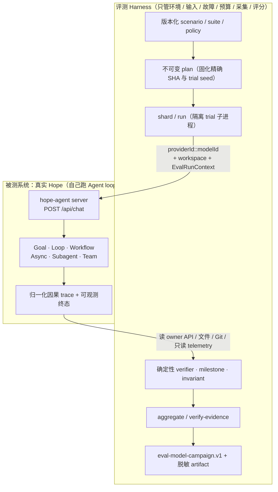
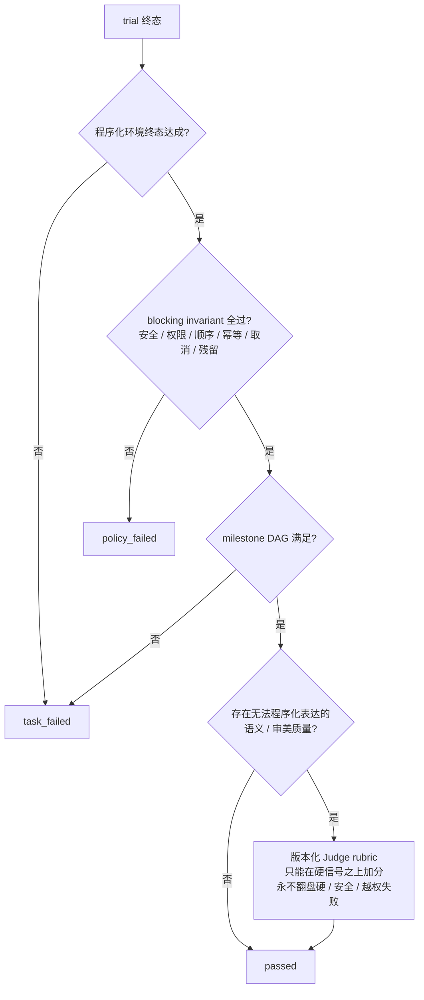
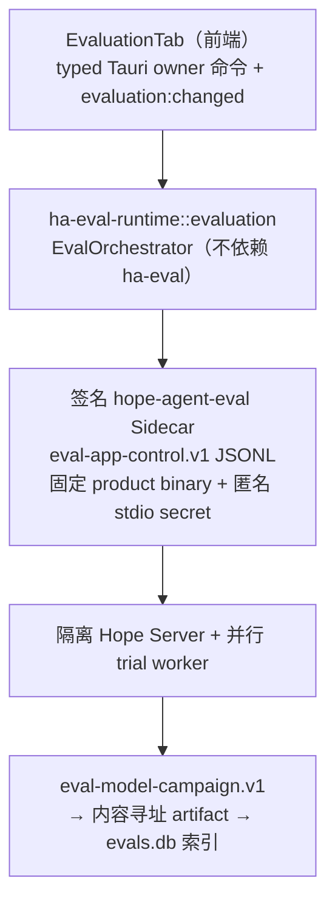

# 真实模型与复杂任务评测

> **当前边界**：本地闭环已完整可用——App / CLI 显式运行、隔离 Sidecar、真实 Provider、不可变计划、预算、因果归因、历史、详情、对比、趋势与本地导出。GitHub 自动 Campaign、受保护 Runner、签名发布证据链与 release gate 处于暂停状态，只保留协议兼容代码。
>
> **姊妹文档**：确定性专项评测（不调模型）见 [capability-eval](capability-eval.md)。

**关联源码**

- 控制面 / 编排 / 存储 / 历史 / 查询 / Provider 解析：`crates/ha-eval-runtime/src/evaluation/`
- 重执行器 / 环境 adapter / Supervisor / CLI：`crates/ha-eval/src/`
- wire 类型 / schema 封装 / outcome / 纯谓词：`crates/ha-eval-spec/src/`
- 归因 registry 与 `EvalRunContext`：`crates/ha-core/src/eval_context.rs`
- Codex 凭据出口：`crates/ha-core/src/oauth.rs` + `crates/ha-core/src/config/persistence.rs`
- 资产：`evals/live/`
- 桌面前端：`src/components/dashboard/evaluation/`

---

## 1. 核心思想

传统模型评测衡量的是"模型生成的文本好不好看"。这套系统要回答的是另一个问题：

> **当 Hope 通过真实产品入口执行一个复杂任务时，它能否稳定地把目标做完、遵守控制面与安全契约，并以多少时间、Token、工具调用和费用做完？**

围绕这个问题，有三条支柱性的想法：

**Hope 自己是被测系统（System Under Test）。** 评测 Harness 只负责六件事——搭环境、给输入、注入故障、卡预算、采集轨迹、判分。它**绝不实现第二套 Agent loop**，也不替 Hope 调用 Provider。真正的 Provider 解析、模型链、Prompt、工具 schema、权限、failover、Goal / Workflow / Team 状态机、后台 automation，全部由真实 Hope Server 执行。任务通过生产 HTTP 入口 `POST /api/chat` 驱动，评测看到的就是用户会看到的那条路径。

**以环境终态与过程不变量判定成功，而不是模型说"我完成了"。** 判分优先看程序化的环境终态和 blocking invariant（安全、权限、顺序、幂等、取消、残留资源），最后才轮到无法程序化表达的语义质量。Agent 在回复里宣告"任务已完成"但硬 verifier 失败，这叫 **false completion**，必须单独统计、绝不算通过。

**证据是本地的、可比较的、不可被美化的。** 每次运行产出结构化、无正文的因果证据（`eval-model-campaign.v1`）与内容寻址的脱敏 artifact；成功率永远同时报告"有效 trial 分母"和"全部计划 trial 分母"，禁止靠排除无效 trial 把数字做漂亮。

### 两条物理分离的轨道

能力评测有两条轨道，命令域、资产根、adapter 白名单、JSON Schema 和 evidence verifier 各自独立，**不能互相转换**：

| 轨道              | 命令域                                  | Evidence schemaVersion   | 是否调用模型       | 用途                                       |
| ----------------- | --------------------------------------- | ------------------------ | ------------------ | ------------------------------------------ |
| 确定性专项评测    | `hope-agent-eval validate/plan/run/...` | `eval-evidence.v1`       | 禁止               | 本地代码契约回放，不进入普通 `cargo test` |
| 真实模型 Campaign | `hope-agent-eval model ...` / 桌面 App  | `eval-model-campaign.v1` | 显式确认费用后调用 | 任务完成率、稳定性与效率诊断               |

分离是刻意的：确定性轨道必须无 LLM、可独立复现；真实模型轨道会花钱、有噪声、结果不完全可复现，绝不能混进 PR required check 或 pre-push。两条轨道的 JSON Schema 甚至挂在不同的命名域下（`hope-agent.dev/eval/…` 对 `hope-agent.local/evals/…`），从格式上就无法互认。未来若恢复远端发布证据链，也只能**只读引用**这两份互不合并的证据。

---

## 2. 端到端：从资产到证据

一次真实模型 Campaign 的骨架是"版本化资产 → 不可变计划 → 分片执行 → 聚合验证 → 证据"。下图的关键在于 **Harness 与被测系统的边界**：Harness 从外部驱动 Hope 并观测它，但 Agent loop 完全跑在 Hope 内部。



**控制面命令**（`hope-agent-eval model` 子命令）：

```bash
# 只校验资产，不调用模型
cargo run -p ha-eval --locked -- model validate

# 固化精确 SHA 的不可变计划，不调用模型
cargo run -p ha-eval --locked -- model plan \
  --tier nightly --ref <40位commit-sha> --output model-plan.json

# 会调用所选真实模型 API；本地必须显式确认费用
cargo run -p ha-eval --locked -- model run \
  --plan model-plan.json --suite hope-core-orchestration \
  --shard 1/4 --output shard.json --confirm-model-costs

# 聚合各分片、生成不可变 campaign 证据
cargo run -p ha-eval --locked -- model aggregate \
  --plan model-plan.json --inputs ./shards \
  --output eval-model-campaign.v1.json --summary model-summary.md
```

`validate` → `plan` → `shard/run` → `aggregate` / `verify-evidence` 之外，还有零费用的 `smoke` / `app-smoke`（fake Provider 冒烟）。计划一旦生成即不可变：之后每次 `run`、`aggregate`、`verify-evidence` 都会重新读取当前 policy / suite / scenario、重建计划并逐字段比较——同版本资产一旦变化就必须提升版本并追加版本锁。

### 谁执行模型请求：两种执行模式

| 模式               | 模型请求由谁执行 | 用途                                                      | 当前地位                                                          |
| ------------------ | ---------------- | --------------------------------------------------------- | ----------------------------------------------------------------- |
| `native_provider`  | Hope 自身        | 覆盖真实产品 Provider、failover、usage 与 automation 路径 | 唯一启用的本地模式                                                |
| `bridged_provider` | 受控模型代理     | 统一不同 Agent 的模型后端与生成参数，适合横向研究         | 后续研究模式，不混入 native 基线；`release` policy 在 v1 明确禁止 |

### Runner 类别（大多为未来远端能力）

当前本地 Campaign 固定使用 `local_native_diagnostic` 执行画像 + `native_provider` 模式，网络约束标记为 `unverified`。下表其余类别是**未来恢复远端评测时**才从受审名单里选取的边界；suite 在 v1 强制 `hosted_linux`。

| Runner 类别                 | 适用场景                                        | 网络边界                                      |
| --------------------------- | ----------------------------------------------- | --------------------------------------------- |
| `hosted_linux`              | 资产校验、fake smoke、轻量无凭据协议任务        | 无 Provider Key；默认无外部任务网络           |
| `docker_linux`              | 文件、数据库、MCP、终端、仓库、AppWorld 类任务  | Provider + 场景私网 / 固定 allowlist          |
| `dedicated_linux`           | 高并发、长任务、真实 Provider、weekly / release | 外部防火墙强制 provider-only 或受审 allowlist |
| `desktop_vm`                | Browser、Office、OSWorld、跨应用桌面任务        | 可销毁 VM、专用账号、逐 suite allowlist       |
| `isolated_external_service` | GitHub、Notion 等专用测试租户                   | 最小权限 token，只允许指定租户与 API          |

`HA_MODEL_EVAL_NETWORK_ENFORCED=1` 只是部署证明，**不能代替**网络 namespace、防火墙或 egress proxy。动态重定向、私网地址、云 metadata 和未知目标仍服从 Hope 自身的 SSRF 与权限策略。

### crate 分工

评测能力横跨三个 crate，边界围绕"kernel 零反向依赖"划定：

- **`ha-eval-spec`**（轻量、纯类型）：协议、App profile / request / plan、runtime / provenance / compatibility、bundle / trust 类型、outcome 枚举、`canonical_json` 等纯谓词。
- **`ha-eval-runtime::evaluation`**：编排（`EvalOrchestrator`）、内容寻址制品仓、历史、查询、Provider 解析。它是目前**唯一不需要壳层 `wire()` 的特征 crate**——kernel 对它零引用，能力面全部经 Tauri 命令 / HTTP 路由 / `hope-agent-eval` 暴露。
- **`ha-eval`**：重执行器、环境 adapter、Supervisor、CLI。

因此普通 `ha-core` / `ha-server` 单测不会链接 Runner、scenario pack 或真实模型代码。Codex 凭据是唯一穿过 kernel 的敏感物，走单一出口 `ha_core::oauth::mint_codex_evaluation_secret`（详见 §7）。

---

## 3. 不可变计划与版本锁

资产全部落在 `evals/live/`：

```text
evals/live/
  schema/          # live 轨的 JSON Schema（model campaign / app / evidence bundle / scenario）
  policy/          # nightly / weekly / release / monthly
  suites/          # 注册 adapter、模型角色、分片和 case（当前仅 hope-core-orchestration）
  scenarios/       # 版本化任务、公开 fixture、隐藏 truth、verifier
  app-profiles/    # Quick / Standard / Reliability / Custom
  trust/           # 签名信任注册表
  version-lock.json
```

**Manifest 只能引用注册枚举和相对资产路径，永不携带 shell 命令。** 路径 canonicalize 后必须仍位于对应 scenario 或 `evals/live` 内，symlink 或 `..` 逃逸会直接失败。

**Scenario digest 覆盖一切影响任务含义或判分的内容**：manifest、公开资产、隐藏 truth、Prompt、工具 schema、verifier、fault、用户脚本、环境声明、Hope 配置、adapter 都进入 digest。任何这类内容变化都必须升版本。

**版本锁 append-only**：`version-lock.json` 为每个 `id@version` 固定 digest，已有条目不可覆写（CI 强制只追加）。当前活跃的 suite、policy、app-profile 及各自锁定版本以 `version-lock.json` 为准。

---

## 4. 黑盒执行与判分

### 4.1 如何驱动 Hope

`hope_core_scenario` 只通过生产 HTTP 入口 `POST /api/chat` 驱动被测 Hope，一次 trial 走六步：

1. 把公开资产复制到 per-trial 临时 workspace，隐藏 truth **不进入**被测目录；
2. 传入精确 `providerId::modelId`、working directory、可选初始 Goal 与不可变 `EvalRunContext`；
3. 等真实 Agent loop、工具与控制面自然完成；
4. 读取 owner API、文件、Git 状态以及只读 eval telemetry；
5. 由注册 verifier 判断终态，**不以最终回答里的"我完成了"作为成功**；
6. 关闭根 trace 后生成 trial result。

### 4.2 判分级联

判分顺序是固定的四级级联——程序化信号优先，语义判断兜底：



任何 blocking milestone 或 invariant 失败都是 hard fail，**不能被部分分、其它 case 的高分、Judge 或性能优势抵消**。这是 Judge 相对程序化终态的从属地位：Judge 永远不能把硬失败、安全失败或越权改判为通过。

### 4.3 v1 注册 verifier

verifier 是代码级注册的固定集合，Manifest 只能按名字引用，不能塞命令字符串：

| verifier                                                                                        | 断言对象                                                                         |
| ----------------------------------------------------------------------------------------------- | -------------------------------------------------------------------------------- |
| `hope_state_subset`                                                                             | 只允许审核过的 loopback owner API 路径（需 `expectedSubset` 或 `anyItemSubset`） |
| `file_exists` / `file_contains_all` / `file_json_subset`                                        | 文件存在 / 含全部子串 / JSON 子集                                                |
| `git_changed_paths`                                                                             | Git 变更路径集合                                                                 |
| `signal_observed` / `trace_closed`                                                              | 观察到指定事件 / 根 trace 已闭合                                                 |
| `tool_result_digest_sequence`                                                                   | 按因果事件顺序精确匹配指定工具的成功结果摘要序列，不保存工具正文                 |
| `response_non_empty` / `response_contains_all` / `response_json_subset` / `response_json_exact` | 回复非空 / 含全部子串 / JSON 子集 / JSON 完全相等                                |

### 4.4 结果分类与聚合

单 trial 保留细粒度 outcome，顶层再映射为兼容的三态 `passed | failed | infra_error`：

| Outcome            | 含义                                                  | 是否 valid trial | Runner 自动重试       | 聚合归属         |
| ------------------ | ----------------------------------------------------- | ---------------- | --------------------- | ---------------- |
| `passed`           | 所有 blocking verifier / invariant 通过               | 是               | 否                    | passed           |
| `task_failed`      | 环境有效，但终态或必要里程碑未满足                    | 是               | 否                    | failed           |
| `policy_failed`    | 越权、泄漏、禁止副作用、脱敏失败等安全失败            | 是               | 否                    | failed           |
| `budget_exhausted` | 被测 Agent 用尽 trial 预算（属于能力结果）            | 是               | 否                    | failed           |
| `infra_error`      | Runner、Provider 接入、环境或 scorer 无法形成有效试验 | 否               | 最多一次              | infra            |
| `benchmark_defect` | 任务、truth 或 grader 经审计确认有缺陷                | 否               | 否（进 quarantine）   | 单列，不入成功率 |
| `simulator_error`  | 用户模拟器偏离契约，trial 无效                        | 否               | policy 可允许最多一次 | 单列             |
| `cancelled`        | 外部取消或预期取消路径                                | 否               | 否                    | 单列             |

**只有基础设施 / 模拟器错误才自动重试一次；业务失败、策略失败、预算耗尽永不重试。** 聚合必须同时报告 `passed / valid_trials`、`passed / scheduled_trials` 和 `infra_error / scheduled_trials`——禁止靠排除大量无效 trial 美化成功率。

清理阶段不是再次执行任务的理由。Hope Core Harness 在删除合成会话前，必须按会话主动取消标题生成、延迟记忆提取和正在执行的记忆提取，等待评测根与孤立跨度收口。若评分证据已经形成、只有清理仍未闭合，结果记为 `infra_error/cleanup_incomplete_after_evidence`，保留清理前的真实 Token、费用、事件和诊断，**不得重新运行整场已计费任务**。不设限模式只关闭用户预算，不关闭这条清理流程；清理等待仍保留独立的基础设施死锁熔断，避免失联进程永久占用资源。

### 4.5 Milestone 与过程不变量

Milestone 必须形成 DAG，支持 `requires`、`anyOf`、blocking、weight、deadline、public/hidden 和 evidence 引用。**评分者接受多条正确路径，不要求模型复刻固定工具序列。** 过程 DSL 只锁不可妥协的语义：`never`、`before/after`、`at_most_once/exactly_once`、`eventually/eventually_within`、`max_concurrent`、`no_overlap`、`parent_child_closed`。

### 4.6 故障、用户事件与对照臂

- 故障由**注册控制器**按 seed 和结构化触发点注入，必须产生 `fault_activated / released` 证据；禁止用随机 `sleep` 假造竞态。带结构化故障但尚无对应受审故障控制器的场景一律 fail closed。
- 每个故障场景同时保留 clean/control 与 chaos/faulted 两臂，避免把本来就失败的任务误判成"恢复失败"。
- Model gateway、tool、scheduler、process、storage、user、environment 故障分开归因；重启从 durable row 恢复 trial 身份与剩余预算。
- blocking 场景优先用 `scripted_fsm`，允许受审 `replay`；LLM User 只用于探索，固定模型 / Prompt / 预算并与 Agent 成本分开，**不得决定本地 required case 的 pass/fail**。
- `scripted-user-flow.v1` 继续只支持消息轮次；`scripted-user-flow.v2` 使用带标签步骤，当前只注册 `message` 与 `compact_context`。后者调用生产 `POST /api/sessions/{id}/compact`，并要求真实第 3 层摘要满足 `tierApplied=3`、`description=summarized`、词元数下降且确实影响消息；Manifest 不能借此携带任意 HTTP 动作。
- 用户改需求、拒绝审批、取消等事件，执行前后都检查持久状态，确保事件确实命中预定阶段，而不是只在日志里出现。
- infra retry 保留原 attempt、累计用量和独立 trace，**不能重置成本或覆盖失败证据**。

---

## 5. 归因与隐私

### 5.1 EvalRunContext

`EvalRunContext` 仅在 `HA_MODEL_EVAL_MODE=1` 的隔离 Server 中被接受；正常 App / Server / ACP 请求没有 eval context 时不会注册任何 trial。上下文至少包含 campaign / case / trial / trace / root span / model role / seed，并随 Session 传播到 Subagent 与后台任务。任何新增的异步或多 Agent 执行边界都必须继续传播它，终态必须关闭对应 guard——归因不是 `complete` 时，本地产物同样无效。

主回复之后由产品自动触发的 session title、Memory extraction 等模型调用会继续持有 trial 身份，Token / 费用纳入总量，同时以 `model_automation.run` 与任务型 Async Job 分开归类；预算不足时不允许产生未归因调用。

### 5.2 归因 registry 上限与"无正文"

归因 registry 有硬上限：**最多保留 256 个 trial，每 trial 最多 4096 个事件**。事件只保存稳定 ID、状态、序号、时长和受限标量属性，**绝不保存 Prompt、模型正文、工具参数、工具输出或数据库记录**：

- 工具事件只记录名称与参数 / 结果的 SHA-256 摘要；
- 模型事件只记录 Provider / 模型、调用类型、Token、TTFT、成功状态与错误类别。

Evidence 写出前会扫描常见 Key / token / Cookie、Authorization、私钥片段和个人绝对路径。

### 5.3 "真实模型评测"对安全的真正含义

真实模型评测**确实会**调用 Provider API、消耗 Token、按价格快照计费。所以"安全"不等于"禁止联网"，而是把范围收到完成该 trial 所必需的目标：

- **专用账号**：使用组织单独创建的评测账号 / API Key，设最小权限、速率与费用上限，不复用开发者个人生产账号；
- **合成数据**：任务输入用仓库内合成 fixture，或已获授权并完成脱敏的数据，不复制真实用户会话、文件与隐私；
- **最小出站**：本地运行默认记录 `networkEnforcement=unverified`；若自行启用 OS sandbox / 防火墙，只应放行模型 Provider 与 scenario 明确批准的 fixture service。

App 现有的 Coding / Domain 真实模型入口不受影响，用户显式运行时仍按所选 Provider 正常调用 API。

---

## 6. 指标、成本与统计口径

### 6.1 主 KPI

```text
hard_task_success       = blocking verifier 全过且 blocking invariant 为 0
valid_task_success      = passed / valid_trials
end_to_end_yield        = passed / scheduled_trials
infra_error_rate        = infra_error / scheduled_trials
reliable_success_all_k  = 同 case 的 k 次独立 trial 全部通过
successful_efficiency   = 成功 trial 的 wall / token / cost 的 p50 与 p95 向量
```

`any_pass@k`（至少成功一次）与 `all_pass@k`（可靠重复）必须同时标明含义，**不能用含混的 `pass@k`**。稳定性主看 `all_pass@k`——"至少偶然成功一次"不算稳定。当前聚合已实现分组 any/all、Hard Success 的 95% Wilson 区间和成功样本 p50/p95。

**功能成功率的分母是 valid trials；`end_to_end_yield` 才以全部 scheduled trials 为分母，infra 单列。** 不同来源不计算一个混合的"全局成功率"。

### 6.2 工具、时间、Token 与成本

- Hope 接受结构化调用时计 `tool_calls_attempted`；解析失败另记 parse error。执行终态互斥落入 succeeded / failed / cancelled，三者之和与 attempted 一致。
- `wall_ms` 只覆盖 trial 本体，provision / cleanup 单列；model / tool active 是叶子 span 时长之和，可能因并发超过 wall；critical path 按因果 DAG 计算，不按日志顺序估算。
- queue、approval、environment wait 和 Provider TTFT 分开；成功与失败样本分组展示，防止"快速失败"被误判高效。
- **Provider usage 是 Token 真相源**，按 input / output / cache read / write / reasoning 拆分；缺失字段记 `null`，估算值标 `usageSource=estimated`。
- Agent、Subagent、automation、User Simulator、Judge、retry 和 failover 的实际模型调用都计费；父级只汇总叶子调用，禁止把子级汇总再次相加。
- USD 成本使用 evidence 内固定的 Provider / model / 生效时间价格快照；未知价格记 `null + warning`，历史成本**不按最新价格回算**。

### 6.3 多 Agent 净收益

所有声称并发或团队收益的场景都要与 `single_agent_compute_matched` 配对：同一模型、任务、权限、环境和 trial seed，单 Agent 获得与 Team **总量相同**的 Token、工具、费用和 wall 预算。至少报告：

```text
team_uplift_pp        = team_hard_success - solo_hard_success
wall_speedup          = solo_wall_time / team_wall_time
token_amplification   = team_total_tokens / solo_total_tokens
cost_amplification    = team_total_cost / solo_total_cost
parallel_efficiency   = sum(child_active_ms) / (wall_ms * concurrency_cap)
coordination_overhead = coordination_tokens / team_total_tokens
```

在 full team 之外逐步加入 no-planner、no-verifier、serialized、restricted-communication 消融。若成功率没提升或 wall 没下降，不能因 spawn 数、消息数或调用量增加就宣称能力增强；成功率提升但资源显著放大时，明确标记 trade-off。

### 6.4 可比性与基线断点

查询对每个指标返回 `exact | functional | diagnostic_only | incompatible`，而不是一个万能 compatibility key：

- **功能**：suite / case / scenario / verifier / prompt / tool schema、模型 snapshot / 推理配置、执行 arm、runtime config、环境族；
- **Token**：再要求相同 tokenizer / usage source；
- **Wall**：再要求相同硬件 / OS / arch / 并发负载类；
- **Tool**：再要求相同工具 schema / 关键工具语义；
- **USD**：再要求相同 price snapshot；
- **多 Agent**：再要求相同 seed、权限、环境和 compute-matched 总预算。

commit SHA 是比较轴，**不进入功能 compatibility key**。trial seed 因包含 commit reference，只用于保证某一 immutable plan 内稳定；跨 commit 趋势先按不含 seed 的逻辑 trial identity 连接，再由具体指标判断是否要求 seed 相同——否则每次提交都会被误判为 trial-set mismatch。

**建立新基线而非覆写旧基线的触发条件**：模型 snapshot / reasoning / temperature / failover、system Prompt、工具 schema、关键工具语义、Memory / context 策略、scenario / grader / rubric、数据集或环境镜像的任一变化。受保护 enforced 与本地 unverified 默认只能 `diagnostic_only` 并排，不显示回归结论。Provider 只有漂移 alias 时标 `modelReproducibility=best_effort`。

---

## 7. 桌面 Evaluation Center

### 7.1 分层与控制协议



**握手是双向校验的**：Sidecar 的第一个事件必须是 hello，携带 `eval-app-control.v1` 协议、产品版本、runner digest、asset root / version-lock digest、OS/arch 和 adapter 能力；App 重新计算 Sidecar 二进制 hash，并以自己的产品版本和资源 digest 回执，任一不匹配都拒绝执行。stdout 只允许有序 JSONL 控制事件，日志走 stderr；seq 重复 / 倒退、未知事件、握手超时、event stream 意外关闭均 fail closed。

### 7.2 手动运行流程

桌面端进入"仪表盘 → 能力评测 → 运行"：

1. 选择 **Quick / Standard / Reliability / Custom / 上下文压缩专项** 画像；
2. 选择 1–4 个已配置且支持隔离评测的真实模型；Provider 有多个 Auth Profile 时显式选一个非敏感引用；已登录的 Codex 模型也可选，但卡片固定标记"仅诊断"；
3. 设置整场费用、时间、模型调用、输入 / 输出 Token、工具调用、Agent、并发预算，并逐场景设置费用与每次运行的同组资源上限；也可以显式勾选“不设限运行”，阅读风险警示后生成**不可变预览**；
4. 确认模型费用与合成工具执行后启动；"运行"页立即切成当前 experiment 的实时工作台，按 Campaign 和 Trial 展示状态、耗时、模型 / 工具调用、Token、费用、预算告警，并允许取消；切换其它 Tab 不影响执行；
5. 终态结果原地保留在"运行"页，可展开已落库 Trial 的因果轨迹或开始新评测；历史、对比、趋势和基线页负责跨运行查询。

App 只提交 `providerId / modelId / credentialProfileRef`，后端在启动前解析一次实际凭据。凭据不进入前端可见 DTO、计划、数据库、命令行、日志或 artifact。未显式选择 profile 时，后端确定性地选取第一个启用且非空的 Auth Profile（同一规则也用于 Coding / Domain 的后端兼容入口，保证重试不依赖前端再次回传完整 Provider 配置）。

Coding / Domain 的原始 Campaign 入口与表继续保留；Evaluation Center 通过**只读 adapter** 统一显示它们，不迁移、不覆写，也不把 legacy 指标假装成 Hope Core evidence。App 与 CLI 的本地产物都只能标记为 local source，不能晋升为 release evidence。

### 7.3 画像、计划与预算

版本化 profile 位于 `evals/live/app-profiles/`：

| Profile        | 本地选择范围                                               | 默认用途                    |
| -------------- | ---------------------------------------------------------- | --------------------------- |
| Quick          | critical / smoke 的 control 子集，`k=1`                    | 配置与主路径快速确认        |
| Standard       | weekly 覆盖的本地兼容 control 子集                         | 日常版本预检                |
| Reliability    | 已注册对照 arm 与 suite 重复                               | 恢复、稳定性和多 Agent 对照 |
| Custom         | 只能从 Reliability allowlist 继续缩小 case / arm，`k=1..5` | 定位单一问题                |
| 上下文压缩专项 | 第 3 层语义摘要与 UTF-8 连续分页，`k=1`                    | 完整验证中的真实模型语义部分 |

**App request 只能收窄执行权限，资源预算由用户决定**：它不能提供 tier / source / runner / network / digest / 任意 adapter，也不能扩大 profile 的场景 / arm / 重复 / 模型 / trial 范围。所有本机 App 画像都使用用户预算模式；suite / scenario 注册预算只是界面的推荐初值和相对权重，不是隐藏的不可突破上限。整场可调维度包括墙钟、模型调用、输入 / 输出 Token、费用、工具调用、Agent 与并发。逐场景费用是覆盖全部所选模型、arm 与重复运行的合计额度，Sidecar 保守均分到 child trial；逐场景的其余维度则是每个 trial 的直接上限。场景费用允许留出未分配余额，但合计不得超过整场费用。整场止损与单场景上限是两级独立约束：允许整场剩余额度低于某个场景的理论上限，运行时由先耗尽的一层停止；整场 trial 并发也不限制单场景内部工作并发。所有最终值都写入不可变 child plan 与 plan digest，运行中不得静默扩容。

**不设限运行是显式的本地诊断模式，不是把输入框填成一个很大的数字。** request 与不可变计划都记录 `budgetEnforcement=unlimited`，并要求独立的风险确认；此时整场与逐场景预算对象必须为空，Harness 不再设置费用、墙钟、模型调用、输入 / 输出 Token、工具调用、Agent 或并发止损，也不再使用场景注册时间作为 trial 子进程或 HTTP 请求超时。已选择的 trial 可并行调度到协议结构上限。权限审批、工具策略、安全检查、进程隔离、网络边界、用户取消、失联回收和清理流程仍然生效，最多 4 个模型、500 trial、单个 active experiment 等结构约束也不会被关闭。界面必须明确警告运行可能无限持续并产生不可控的 Provider 费用；这种结果只能作为 local diagnostic，不能晋升为固定预算的标准比较或 release evidence。

画像必须提供费用与并发的推荐初值，但不得用 `maxTrialSeconds` 或较小的画像并发上限覆盖用户选择；画像中的 `maxCostUsd=1,000,000` 与 `maxConcurrency=500` 只是协议异常输入防护。App 产物始终标记为 local diagnostic，不能冒充固定预算的标准或 release evidence。Sidecar 为每个模型生成独立 child campaign；多模型只属于同一 experiment 的比较组，不合并成一份可晋升 evidence。协议仍限制最多 **4 个模型、500 trial**，同一 App 只允许一个 active experiment。CLI 与未来 release evidence 继续使用版本化注册预算，不接受这组 App 人工分配。

**预算切分不突破用户总额**：多模型共享同一个整场墙钟；模型调用、Token、费用和工具等消耗型总预算按模型数保守整数切分；Agent 与并发属于瞬时上限，不按模型数累加或切分。若一个非零整数消耗上限小于模型数，计划直接拒绝，而不是用 `max(1)` 偷偷放大总量。通用画像的推荐总费用为 **100 USD**；专项画像可提供更合适的推荐值，例如上下文压缩专项默认 **5 USD**。推荐值不是硬上限。由于不同 Provider 的 tokenizer 和请求形状会产生差异，本地 App 的单场景输入 Token 推荐值在注册值之上增加 **25%** 余量；整场输入 Token 再按所选模型、场景分支和重复次数合计，其余调用 / 输出 / 工具推荐值按注册预算原值合计。用户可在预览前修改所有值；未分配费用不会被后台自动补给任一场景。experiment 墙钟默认 **480 分钟**，各画像另给并发推荐值；两者都允许用户修改。

**并发不等于内部预算**：`campaignBudget.maxConcurrency` 表示最多同时运行多少 trial / shard；逐场景 `maxConcurrency` 表示一个 trial 内的工作并发，两者分别可调、互不替代。不可变计划把 experiment 总墙钟的 90% 按全部 trial 保守均分，并与用户设置的逐场景时间取最小值，剩余 10% 专用于启动、落证据、取消和 Supervisor 回收。触及墙钟属于 `budget_exhausted/trial_wall_timeout`，**不是 infra-error**，因此不触发 infra 自动重试。产品自有的标题 / Memory 等可选后台模型调用若没有剩余 trial 预算，应直接跳过，不得仅因这类非任务调用被拒就把已经完成的主任务改判为预算耗尽。

**实时进度**：运行期间 Sidecar 每秒通过隔离 Server 的 owner-token telemetry endpoint 拉取一次当前 trial 的脱敏快照，发送 `trial_progress`（只含墙钟、模型 / 工具调用、Token、费用、Loop、Agent、Async、活跃子任务、归因状态和最后一个无 payload 事件类型）。Prompt、模型正文、工具参数 / 输出不进入控制协议。只有 telemetry endpoint 已实际注册的 trial 才进入"运行中"，同一 shard 里尚未开始的 case 保持"排队中"。最终 `trial_completed` 与 evidence 才是权威结果。

预览与启动绑定同一个 `planDigest`；用户改选择、资产变化或预览过期时必须重新预览。中断 / 失败后的"重试"新建 experiment / campaign 并保存 parent id，**不覆盖第一次已产生的调用、费用或结果**。

### 7.4 凭据、进程与取消

UI 只看见脱敏模型与 credential profile label / ref。owner 后端从可信 App 配置解析单个有效 Provider，把 credential-free config 与一次性 `providerId → secret` 映射通过匿名 stdio 首条 start 消息传给 Sidecar；Sidecar 不记录控制消息正文，再只对子 Hope Server 的初始化环境注入。普通 Provider secret 是 API Key；本地 App Codex secret 只能是当前 access token 与 account id，**不得含 refresh token**。Server 读取后立即移除环境变量并禁止评测配置写回。任何 Key / token 不得进入 argv、计划、SQLite、artifact、stdout/stderr 或导出包。

Desktop supervisor 只接受当前安装包中、版本 / digest / 平台身份匹配的 Hope product binary，使用固定 `server start` 参数；Manifest、前端和 request 都不能传任意 executable / argv。每个 campaign 创建独立 HOME、`HA_DATA_DIR`、workspace、token、端口和进程组；Unix 回收 process group，Windows 用 Job Object。

**v1 刻意不提供"暂停"**：冻结本地进程不能冻结已发往 Provider 的 HTTP 请求、计费、OAuth 有效期或外部副作用，直接 `SIGSTOP/SIGCONT` 会产生不可审计的预算与结果。用户取消先发协议 cancel，超时后终止完整进程树；App 退出或 Sidecar 失联时非终态记录变为 `interrupted`，不自动续跑。`cancelled` / `interrupted` 也不能原地恢复，"重试"始终基于原 request 新建 experiment 并以 parent id 保留关系。

**失联兜底**：experiment 总墙钟到期时禁止直接 drop `run_experiment` future——Sidecar 必须先复用协议 cancel，等 trial / shard 与 Supervisor 正常清理再发终态。隔离 Hope Server 同时校验 Supervisor PID 并运行失联 watchdog：Supervisor 异常退出时 Server 杀死自己的完整进程组，防止 macOS 上因独立 process group 产生孤儿 Server。每个 `trial_completed` 在最终 evidence 生成前先以部分记录写入 Evaluation DB；失败 / 取消 / 中断把未完成 Campaign 一并置为对应终态，刷新页面后仍以 DB 恢复已完成 trial，不再显示 `running`；最终 evidence 到达时再以校验后的完整记录原子替换部分记录。

### 7.5 存储、历史与 Owner API

真实存储布局只有两项——SQLite 索引与内容寻址的 artifact 目录（二级前缀分桶）：

```text
~/.hope-agent/evals/
  evals.db
  artifacts/<sha256 前 2 位>/<sha256 后 62 位>
```

SQLite 只保存 experiment / campaign / trial / import / baseline / annotation / artifact 的可查询标量、digest 和内容寻址引用；完整 evidence / trace 保存在原子写入的 artifact 中，导入记录落 `eval_imports` 表。导入和本地产物路径拒绝绝对路径、`..`、symlink、重复文件、未声明文件、archive traversal、超限大小 / 数量与 hash 不符。启动时把遗留非终态实验对账为 `interrupted`，并清理未 pin、未受保护且过期的 artifact；受保护导入不被普通 retention 清理。

统一 History 同时读取新 `evals.db` 与现有 `sessions.db` 中的 Coding / Domain Campaign，但 legacy source 始终标 `LegacyLocal`，详情由各自 adapter 解析。Hope Core 的 trial 查询除脱敏 `ModelTrialResult` 外，还从已验证 evidence 返回该 trial 实际采用的 `budget` 与 `timeoutSeconds`，供 Owner UI 展示"实际值 / 上限"与精确触发维度；这些字段仍不含 Prompt、模型正文或工具 payload。没有完整 evidence 的异常旧记录只返回已落库标量摘要，**禁止把缺失轨迹伪造成 0 或完整详情**。Overview 只汇总总 trial、infra、已完成 campaign 和已知费用，不跨异构评分器算一个"全局任务成功率"。

**两侧隔离**：Tauri owner 侧（面向用户本人）提供 catalog / readiness / model options、preview / start / cancel / retry、history / detail / trial、compare / trends、pin / annotation、baseline、signed / unverified import 与 local export。HTTP / WS 侧只开放脱敏只读的 history / query；真实模型 preview / run / cancel / retry / import / export 默认固定拒绝，避免远程 API 绕过桌面 Sidecar 和本机文件选择。

**资源解析 fail closed**：正式桌面包通过 Tauri Resource resolver 取得 `evals/live`，只执行产品二进制同目录的随包 Sidecar；任一资源或 Sidecar 缺失时，在发送 Provider 凭据前 fail closed。只有 `debug_assertions` 开发构建允许从当前 checkout 回退到 `evals/live` 和 `target/debug/hope-agent-eval`。Headless Server 不扫描 exe ancestor / cwd；若要让 HTTP 只读查询刷新签名状态，管理员必须显式设置绝对、已 canonicalize、不含 symlink 的 `HA_EVAL_TRUST_REGISTRY_PATH`，未配置或无效时统一 fail closed 为 key missing。

---

## 8. 凭据三层守卫（Codex OAuth）

桌面 App 额外支持 Codex OAuth 身份跑评测。这条路径最敏感，因为它涉及一份**含 raw access token 的明文 JSON**——`CodexEvaluationSecret.secret` 只是 schema 封装与有效性校验的产物，**不是脱敏边界**。为此在 kernel 单一出口 `ha_core::oauth::mint_codex_evaluation_secret`（`load → encode → digest` 三步收在 kernel，特征 crate 不认识 `CodexEvaluationToken`）之上设三层守卫：

| 层       | 机制                                                                               | 防的是什么                                                                                                                                                        |
| -------- | ---------------------------------------------------------------------------------- | ----------------------------------------------------------------------------------------------------------------------------------------------------------------- |
| 编译期   | `assert_not_impl_all!(CodexEvaluationSecret: Debug)`                               | 若未来给它 derive `Debug`，本文件直接编译失败——避免被 `{:?}` 顺手打进日志                                                                                         |
| 运行期   | `mint_codex_evaluation_secret` 在 `HA_MODEL_EVAL_MODE=1` 下立刻 bail               | 隔离评测运行时里绝不读 owner OAuth 文件；凭据只由 owner 进程解析                                                                                                  |
| 形状边界 | `encode_model_eval_codex_secret` 拒短 / 长 token、空 / 长 account_id、含 NUL/CR/LF | 短 token 像错误 fallback；长 token 可能夹带整份 config 顺流；空 account_id 让"同 Provider 不得混凭据"校验永远命中；控制字符可被下游 JSON 解析器错切或穿过日志脱敏 |

形状边界由 10 case 表驱动测试 `encode_model_eval_codex_secret_enforces_credential_shape_bounds` 全覆盖。三层任改其一必须同看另两条。

**流程**：有墙钟预算时，owner 在 preview / start 前按 Campaign `maxWallSeconds + safety margin` 校验 token 剩余寿命，不足时只在 owner 进程用本机 refresh token 主动刷新；刷新失败、过期时间不可验证或刷新后仍无法覆盖整个 Campaign 时 fail-fast，提示缩短时长或重新登录。不设限运行没有可证明的结束时间，因此 owner 只要求 token 当前有效且覆盖安全余量，不为适配 OAuth 人为添加隐藏墙钟；token 后续自然过期属于外部 Provider 失败，不改写成预算耗尽。随后只把当前短期 `access_token + account_id + expires_at_ms` 编码为 `model-eval-codex-oauth.v1` 类型的 Provider secret，经匿名控制通道交给 Sidecar；隔离 Server 校验过期时间后把 access token / account id 放进进程内 Codex cache。**主 HOME、OAuth 文件和 refresh token 永不挂载或传入隔离运行时。** 该分支还必须同时具备 App-control 设置的 `HA_MODEL_EVAL_LOCAL_CODEX_OAUTH=1`；headless CLI 默认不接受这类本机 OAuth secret，Codex 结果固定为 local diagnostic。Codex token 只存在于 owner、Sidecar supervisor 与隔离 Server内存；试验结束 / 取消 / 进程树回收后即失效，不同步到历史。

### 隔离 Server 的启动契约

`model run` 需要一个单独启动、配置真实 Provider 的 Hope Server，通过环境握手：

```text
HA_MODEL_EVAL_MODE=1
HA_MODEL_EVAL_SERVER_URL=http://127.0.0.1:<port>
HA_MODEL_EVAL_SERVER_TOKEN=<专用 server token>
```

隔离 `HA_DATA_DIR/config.json` 只保存无凭据的 Provider / 模型配置，`apiKey` 必须为空且不得含 `authProfiles`。模型 Key 由本地 owner / Supervisor 经 `HA_MODEL_EVAL_PROVIDER_SECRETS_B64` 临时注入（`providerId → apiKey` 的 base64 JSON），首次加载配置后立即从 Server 环境移除、只留进程内存；评测模式同时禁止配置写回，避免内存中的 Key 落盘。Runner 为每个 trial 创建临时任务目录，并从 Harness 子进程环境删除常见凭据变量。Trial evidence 额外记录这个无凭据 `config.json` 的 SHA-256，聚合 evidence 记录 Runner OS / 架构——同一次本地比较里所有有效 trial 必须使用同一运行配置摘要与不可变模型 / 价格快照，防止配置漂移被误认为同一基线。

---

## 9. 场景与故障契约

### 9.1 Scenario 组成与版本

每个 Scenario 固定以下组件，任何影响任务含义或判分的内容变化都必须升版本：

```text
identity          id / version / tags / digest
instruction       用户任务、公开验收条件、可选多轮脚本
environment       image / snapshot / services / network / files / db / time
hope_config       model / features / permissions / budgets
initial_state     Goal / Workflow / Loop / session / project / fixtures
fault_schedule    timeout / 429 / error / restart / event / race / schema drift
oracle            hidden truth + final verifier + milestone DAG + invariants
limits            wall / model / tool / token / cost / turn / agent / job / concurrency
artifacts         allowlist / redaction / retention
comparison        control/faulted、solo/team、baseline/candidate 配对
```

隐藏 truth 与 verifier 细节**绝不复制进被测 workspace 或模型上下文**。路径允许相对引用，但 canonicalize 后必须留在 scenario / `evals/live` 根内；symlink、`..` 和同版本覆写均 fail closed。

### 9.2 Hope Core 场景覆盖

当前 suite 的 Hope Core 编排场景按能力分五组：

| 分组            | 场景 ID           | 核心契约                                                                                                   |
| --------------- | ----------------- | ---------------------------------------------------------------------------------------------------------- |
| Goal / Loop     | `HA-GL-001..006`  | 验收证据、假完成恢复、不可满足目标收敛、预算停止、需求修订、checkpoint/restart                             |
| Workflow        | `HA-WF-001..006`  | fan-out/join、可重试与非幂等写、restart、补偿、pause/resume/cancel、拒绝审批                               |
| Async Jobs      | `HA-AJ-001..006`  | 乱序汇总、前台 busy 延迟注入、cancel/complete 竞态、重试分类、incognito purge、公平调度                    |
| Subagent / Team | `HA-ST-001..006`  | 冲突资料研究、Planner/Executor/Verifier、worktree 合并、成员崩溃重分派、取消子树、origin/权限/KB/incognito |
| 多模块 E2E      | `HA-E2E-001..004` | Coding 发布修复、冻结语料 Research、Knowledge/File stale-write、Browser/Terminal incident                  |
| 上下文压缩（真实模型） | `HA-CTX-001..002` | 真实第 3 层摘要后的事实保真、只用 `read` 的 UTF-8 连续分页与结果摘要序列                              |

上下文压缩不能只靠这两个付费场景宣称完整覆盖。完整证据由两条物理隔离的轨道共同组成：

| 证据轨道 | 套件 / 场景 | 覆盖范围 | 不证明什么 |
| --- | --- | --- | --- |
| 确定性安全轨道 | `context-compaction-safety@1.0.0`，10 个用例 | 第 0～4 层请求投影、结果组接纳、保护后缀、摘要协议、恢复事务、完整请求容量证书、溢出证据闸、发送歧义终态和跨层边界 | 不评价某个真实模型写出的摘要是否语义充分 |
| 真实模型语义轨道 | `HA-CTX-001..002` | 第 3 层摘要后的事实保真，以及模型只用 `read` 连续遍历 UTF-8 文件的能力 | 不模拟崩溃、发送状态未知或证明恰好一次副作用 |

Evaluation Center 的“上下文压缩专项”画像一次调度两条轨道：先执行 10 个零网络安全用例，全部通过后再执行 2 个付费真实模型场景。结果页按轨道分开展示，并分别保存确定性 `eval-app-deterministic-evidence.v1` 与真实模型 `eval-model-campaign.v1`；两份结果不可合并成同一个通过位，也不能互相豁免失败。确定性轨道失败时，付费轨道不会启动。

case、版本、标签、arm、重复次数和 tier 一律以 suite manifest 为准。业务域扩展沿用 Coding、Research、Knowledge、File、Browser、Terminal 六类终态契约；Pre-release 档位的 Research 使用**冻结语料**，实时 Web 必须单列 exploratory 基线并记录 URL、抓取时间和内容 hash。

### 9.3 数据等级与逐 trial 隔离

| 等级               | 内容                             | 当前本地处理                               |
| ------------------ | -------------------------------- | ------------------------------------------ |
| `synthetic`        | 人工 fixture、生成账号、虚构文档 | 可进入本地诊断 artifact                    |
| `licensed_fixture` | 明确允许评测的外部数据           | 遵守访问、保留和再分发限制                 |
| `sanitized_replay` | 经授权、去标识化的真实轨迹       | 默认不运行；显式启用时只存本机、不导出原文 |
| `restricted`       | 仍可能含敏感业务 / 用户信息      | 禁止运行                                   |

每 trial 使用独立 temp home、data dir、session DB、KB、workspace、端口、浏览器 profile 和容器 / VM 网络；结束时验证无进程、挂载、账号、副作用、spool、worktree lock 或数据库句柄残留。Incognito 场景还要用 synthetic canary 扫描 sessions DB、旁路 DB、tool/job spool、Memory/Dreaming/Awareness、KB index、FTS/Dashboard 统计和共享模型 / 视觉缓存，然后销毁整个环境。

---

## 10. 本地运行边界与运行节奏

### 10.1 GitHub 侧完全不参与

仓库当前没有 `model-campaign.yml` 或其它 GitHub Actions 真实模型 Campaign。普通 PR、pre-push、Rust CI 和 `release.yml` 都不会构建或运行这条轨道，也不需要 Provider Key：

- 桌面用户经 Evaluation Center 显式预览、确认费用、启动；
- 开发者可用 `hope-agent-eval model` 在本机显式运行，或用 fake Provider 跑 `model smoke` / `model app-smoke`；
- 本地 App / CLI 产物固定为 local diagnostic，可写历史、导出、对比、看趋势；
- GitHub 不上传、检索、校验或签名 model evidence，`release.yml` 不把评测结果写入 Release summary / 附件，也不据此阻断构建。

`nightly` / `weekly` / `release` / `monthly` 只是本地选择计划范围的名字，没有自动触发语义；`mode=advisory|enforce` 与 waiver 字段当前只影响本地报告的判定，不改变 PR、tag 或 GitHub Release 状态。

### 10.2 运行层级

| Tier        | 触发方式               | 大致范围                         | 模型重复                   | 用途                                  |
| ----------- | ---------------------- | -------------------------------- | -------------------------- | ------------------------------------- |
| PR          | 不运行                 | 无评测任务                       | 0 次真实模型调用           | 普通契约测试保持快速                  |
| Nightly     | 本地手动               | 少量 critical case               | 多数 `k=1`                 | 快速诊断                              |
| Weekly      | 本地手动               | 中等覆盖 + 对照臂                | 默认 `k=3`                 | 可靠性和模型趋势                      |
| Pre-release | 本地手动，可选精确 SHA | 发版关键 case                    | 默认 `k=3`，critical `k=5` | 人工发版判断，不阻断 release workflow |
| Monthly     | 本地手动               | 全部 28 场景 + 重型 / chaos 扩展 | `k=1`，选中 case 多 seed   | 能力发现和长周期趋势                  |

具体 case / trial 数量由当前主编排 suite `1.8.0`、上下文压缩真实模型 suite `1.0.0` 与各档 policy 展开的不可变计划决定；Nightly policy 当前为 `1.0.9`——**以 `model plan` 输出为准，文档数字不是执行器输入**。零网络的 `context-compaction-safety@1.0.0` 既可由确定性 CLI 独立执行，也会被 GUI 的“上下文压缩专项”画像作为付费前置门禁纳入同一不可变 App 计划；它计入 GUI 总 trial 数，但模型调用与费用恒为零。当前没有自动矩阵，用户在 App / CLI 中显式选择模型；Product Default、Challenger、Economical 和锁定权重的 Local 模型可作本地比较角色，须记录精确版本、避免相同模型重复花费。普通模型横比默认关闭 failover，只有 failover 专项才显式开启并逐跳归因。

### 10.3 Quarantine 与基线治理

- 只有已证实的 grader、任务数据、上游或 infra 缺陷能进 quarantine；Agent 业务失败不得借此移除。记录 owner、原因、证据、进入版本和恢复条件，case 仍显示在汇总中。
- 外部 benchmark 升级先在同一 Hope commit / model / config 上做 old/new bridge run，再建新基线；不把不同版本分数连成一条无断点趋势。
- 本地 waiver 不能豁免 secret、digest、source 或证据结构不合法；它只是诊断注释，不改 GitHub 发布状态。
- **只有 `ProtectedVerified + completed + 签名仍可信 + tier 匹配` 的 experiment 才能建立 protected baseline。** 本地导出固定 unsigned、`releaseEligible=false`；用户即使改 JSON 里的 source 也拿不到盾牌或发布资格。

---

## 11. 签名 bundle 与信任刷新

`eval-evidence-bundle.v1.zip` 含 canonical manifest、Ed25519 signature、evidence 与 manifest allowlist 中的 artifact。App 验证顺序固定：archive 安全 → manifest/schema → key/时效/状态 → 签名 → evidence/artifact SHA-256 → model evidence source/SHA/digest/secret scan。验证通过且当前资产已知标 `ProtectedVerified`；签名有效但资产版本未知标 `ProtectedUnknownAssets`（只能保存查看）；裸 JSON 标 `UnverifiedImport`。

信任注册表只含公钥和状态。受保护 bundle 导入时同时固化 `key_id + SHA-256(public key bytes)`；每次查询 / 导入刷新 key 状态时必须**同时匹配二者**——只有同 ID 且同公钥才保持可信。旧记录缺指纹、key 被替换、retired/revoked/missing 都不改写"导入时曾验签成功"的审计事实，但会取消其继续批准或作为 baseline 的资格，须重新导入并重新验签补齐指纹。bundle hash 去重，重复导入幂等；annotation 和 baseline 只引用原 evidence，不改 outcome，也不删原 artifact。

---

## 12. 外部 Benchmark 治理

多个外部 benchmark（BFCL / AppWorld / Gaia2 / Terminal-Bench / τ³ / TeamBench / CooperBench / MCPMark / OSWorld）的 adapter 名已注册，但**注册不等于实现**：未安装 Harness 时会明确产生 `benchmark_defect`，绝不伪造通过。这些是未来条件式扩展，实际接入必须逐项独立 PR。

**职责分工**：`ha-eval model` 负责顶层计划、digest、预算、分片、聚合和 evidence 验证；Hope Core adapter 测 Hope 独有的 Goal / Workflow / Async / Team、安全和恢复契约。外部 Harness（[Inspect AI](https://inspect.aisi.org.uk/)、[Harbor](https://www.harborframework.com/docs)、各 benchmark 原生 Runner）只补任务分布、成熟环境和横向参照，**永不替代 Hope loop，也不是 evidence 真相源**。OpenTelemetry GenAI 只作未来 trace 交换字段，不定义 task / scorer / gate；Langfuse 等可选 UI 不成为唯一存储或 release 判定源。

统一 adapter 生命周期为 `validate → provision → execute → collect → grade → cleanup`。Rust 只按注册枚举调用受审代码、经 JSON/JSONL 交换数据；上游原始分数必须保留，再映射为 Hope outcome。未安装、版本不匹配、grader 不可用或 cleanup 失败都不能伪绿。

**接入优先级**（Hope Core 与统一证据先行，再依次接入）：

| 优先级 | Benchmark                       | 主要信号                                                         |
| ------ | ------------------------------- | ---------------------------------------------------------------- |
| P1     | BFCL V4 非 live 子集            | 工具选择、参数、并行和多轮协议                                   |
| P1     | AppWorld / AppWorld-UL          | 有状态 App、跨工具、副作用、澄清与确认                           |
| P1     | Gaia2 / ARE                     | 异步事件、时间约束、环境变化和 A2A                               |
| P1     | Terminal-Bench 2.1              | 真实终端、Coding、运维和长任务                                   |
| P1     | τ³-bench text                   | 多轮用户、业务 policy、工具和可靠性                              |
| P2     | TeamBench / CooperBench         | 角色隔离、协作、冲突和多 Agent 消融（须有 compute-matched solo） |
| P2     | MCPMark                         | Filesystem / Postgres / Playwright / GitHub / Notion MCP         |
| P3     | OSWorld-Verified / 2.0          | Browser、Office、桌面和跨应用长任务（专用可销毁 VM）             |
| 观察   | ToolSandbox / GAIA / AgentBench | 状态工具、通用研究和历史环境广度                                 |
| 谨慎   | SWE-bench 系列                  | 仅内部复核子集，不以公开总分作 release gate                      |

**数据许可预检**：代码开源不等于任务数据、附件、镜像、被测仓库、网站内容或模型输出可以再分发。每个 adapter 维护机器可读清单（component / source_url / 各类 license / third_party_assets / pinned_revision / task_selection_digest / image_digest / scorer_digest / reviewed_at / owner）。受限内容只保留 hash / 声明，不进公开 artifact；Promptfoo / 自定义 hook 等能执行本机代码的配置一律视为代码审查对象。外部 benchmark 固定代码、数据、任务列表、镜像、grader 和 adapter 版本，**禁止跟随 `latest` 建立趋势**。

---

## 13. 关键设计决策

以下决策解释了这套系统"为什么这么设计"，多数已在前文体现，此处汇总取舍逻辑。

**证据分离，不合并语义。**

- deterministic 与 model campaign 使用不同命令域、资产根、adapter 白名单、schema 和 evidence verifier，二者不能互相转换。
- JSON/JSONL evidence 是本地运行与比较的真相源；OpenTelemetry 只作未来可选的 trace 交换接口，不能成为唯一证据存储。
- 统一历史只是只读索引；Hope Core、Coding、Domain、本地与导入数据的来源、完整性和评分语义不得合并，也不算一个混合"全局成功率"（功能成功率分母是 valid trials，`end_to_end_yield` 才以全部 scheduled trials 为分母，infra 单列）。

**谁是被测系统，谁说了算。**

- Hope Core Scenarios 是产品正确性与人工发版判断的核心信号；外部 benchmark 只补任务分布与横向参照。
- 程序化终态和 blocking invariant 优先于 LLM Judge；Judge 永远不能把硬失败、安全失败或越权改判为通过。
- Hope 自身是被测编排器，Harness 只负责环境、输入、故障、预算、采集和评分。
- 稳定性主看 `all_pass@k`，不把"至少偶然成功一次"的 `any_pass@k` 当稳定性。

**多 Agent 与效率的诚实口径。**

- 多 Agent 必须与同模型、同任务、同权限、同总预算的单 Agent 配对，并提供 Planner / Verifier / 串行等可解释消融。
- 工具数、Token、耗时和费用首期 advisory，只在成功样本上比较；critical false completion 和安全不变量可独立成为硬门禁。
- App `maxConcurrency` 表示可并行的 trial / shard 数，不替代 suite / scenario 内部的 Agent / model / tool / span 预算。

**隔离、网络与 crate 边界。**

- 本地真实模型需访问所选 Provider；无法证明 provider-only egress 时必须标 network unverified，未来远端 Runner 仍需外部防火墙实施最小出站范围。
- App 控制面在 `ha-eval-runtime::evaluation`，重 Runner 保持独立 Sidecar；普通 `ha-core` / `ha-server` 单测不链接完整评测包。

**外部 benchmark 固定，永不执行任意代码。**

- Manifest 只引用注册 adapter / verifier / fault / user-simulator 与受限资产路径，永不执行任意 shell 字符串。
- 外部 benchmark 固定代码、数据、任务列表、镜像、grader 和 adapter 版本；禁止跟随 `latest`。

**计划、预算与比较不变量。**

- 总预算按模型数切分且绝不向上扩张；无法为每个 child campaign 分到至少一个整数额度时直接拒绝计划。
- 跨 commit 的功能比较按 case / version / arm / model / config / 资产环境身份连接；由 commit 派生的 trial seed 不阻断逻辑配对，只有要求 seed 一致的指标才单独校验。
- 当前只运行本地 App / CLI，结果用于诊断、回归和人工判断，不参与 GitHub 发布门禁。

---

## 14. 维护契约与验证

### 14.1 改动同步

- 普通 PR、pre-push、默认 `cargo test` 不运行真实模型 Campaign，也不需要 Provider Key。
- 修改 schema / policy / suite / scenario / verifier / Prompt / tool schema 时，必须提升对应版本并更新 `evals/live/version-lock.json`（append-only）。
- 新 adapter / verifier / fault 只能在 Rust / Python Harness 的注册代码中实现，Manifest 禁止命令字符串。
- 新的异步或多 Agent 执行边界必须传播 `EvalRunContext`，终态关闭对应 guard。
- 外部 benchmark 版本、镜像 digest、许可证和 grader 必须先审计，再加入 allowlist 与 version lock。

### 14.2 Evaluation Center 验证

- `model app-smoke --sidecar <hope-agent-eval> --server-bin <hope-agent-server>` 用 fake Provider 走完整 App control / Sidecar / Supervisor / Hope Server 路径，必须零外部费用；它跑两个相同 case 的独立 trial 并验证时间区间真实重叠，防止"配置写了并发但实际串行"。
- smoke 写入 synthetic secret canary，扫描 request / plan / DB / log / evidence / artifact / 临时目录；任一泄漏或残留进程 / 端口即失败。
- 同一 request / 资产 / runtime / model 生成稳定 plan / digest；本地 App evidence 必须保持 local source，不能通过保留的 release verifier。
- 比较测试必须覆盖"不同 commit → seed 不同但逻辑 trial identity 相同"；预算测试必须覆盖小于模型数时拒绝、且任何切分不增加总量。
- `cargo test -p ha-core -p ha-server --locked` 仍不链接 / 运行完整 Runner；普通 PR 和 GitHub Actions 不跑 fake smoke，也不配置 Provider Key。

### 14.3 Sidecar 体积

评测 Sidecar 是随桌面安装包分发的 `externalBin`，计入每个平台的下载体积。打包用独立 `eval-sidecar` profile（`opt-level="z"`、`lto="fat"`、`codegen-units=16`、`panic="abort"`、`strip="symbols"`）：体积靠 fat LTO 的全程序 DCE，`codegen-units` 只影响 LTO 后的机器码分块与发版构建耗时；`panic="abort"` 只终止隔离 Sidecar / worker，不改变产品 Agent 的 unwind 策略。当前压缩体积为数十 MB 量级（改 thin LTO 会明显变大，不值得）；发版前三平台测量增量、目标不超过约 35 MB，超出时继续做依赖裁剪，**不能降级为不校验的在线下载**。

---

## 15. 完成度与未来远端恢复条件

当前仓库已完成本地闭环：App / CLI 入口、Sidecar 隔离执行、真实 Provider、不可变计划、预算、因果归因、历史、详情、对比、趋势和本地导出都可用。仓库不配置 GitHub Provider secret、`model-eval` protected environment、self-hosted Runner、自动 schedule、evidence signing job 或 release preflight。

远端自动化明确暂停，不属于当前发版前置条件。签名 bundle、trust registry、protected source 和 release verifier 代码保留为协议兼容与未来恢复能力，但当前仓库不自动产生新的受保护 bundle。以后若确需恢复，必须新建专项设计 / 配置 PR，至少重新确认：

1. 组织专用 Provider 评测项目、账单硬上限和告警；
2. 固定 anchor model snapshot、reasoning、max output、endpoint 与 price snapshot；
3. credential-free config、Provider secret、彼此不同的 server / supervisor token 及 protected environment；
4. disposable self-hosted runner、Bubblewrap user / mount / PID namespace、provider-only egress、磁盘 / 进程清理和并发限额；
5. 独立 Ed25519 key pair、公钥 registry / version lock、签名环境与密钥轮换；
6. fake smoke、连续 advisory 基线、exact-SHA 验证、失败归因审核和门禁回滚演练。

**恢复 PR 合并前，只能宣称"本地真实模型评测可用"**，不能宣称已有 GitHub 自动 Campaign、受保护 Provider 稳定基线或评测发布门禁；也不能仅靠恢复旧 workflow 文件或设置环境变量就宣称隔离成立。外部 BFCL 等 benchmark pilot 是更后的条件式扩展，当前没有 Harness、不运行，也不影响 Evaluation Center 的本地核心闭环。

---

## 关联文档

- [capability-eval](capability-eval.md)：确定性专项评测轨道（不调模型，进 `cargo test` 快速路径）。
- [subagent](subagent.md) / [agent-team](agent-team.md)：被测的多 Agent 编排语义。
- [background-jobs](background-jobs.md)：Async Job 场景组对应的执行模型。
