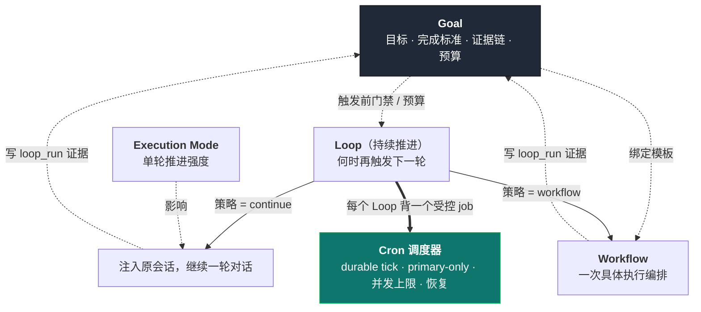
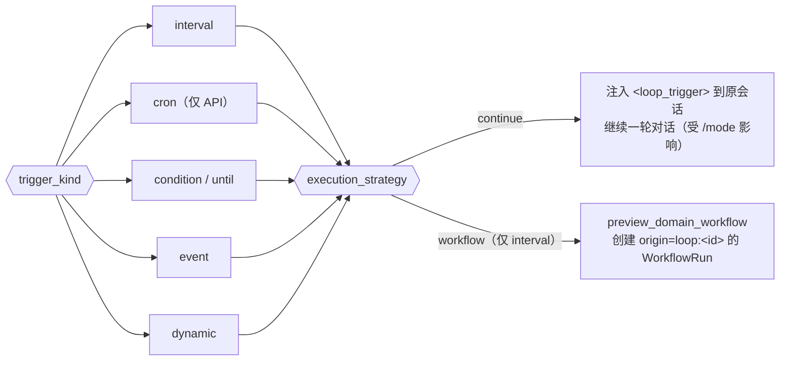
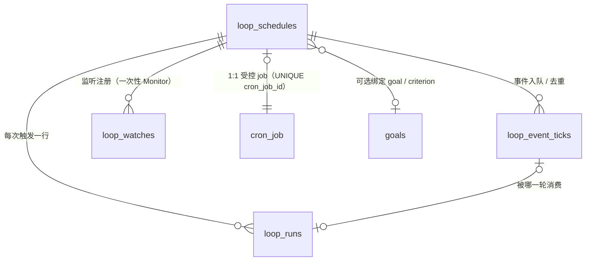
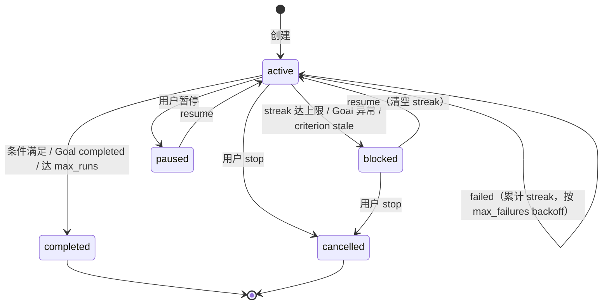
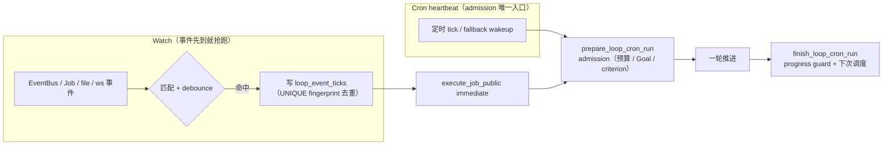

# Loop 控制平面

> 返回 [文档索引](../../README.md) | 更新时间：2026-07-23

## 这个子系统解决什么问题

有一类需求，不是「做一件事」，而是「盯着一件事一直往前推」：

- 「盯着 CI，红了就继续修，直到绿」
- 「每 10 分钟刷新一次调研简报」
- 「有空就把没收尾的活儿往前推一步，没事做就报告卡在哪」
- 「等那个后台构建任务一结束，立刻接着干」

这些都不是一次性任务，而是**重复触发的推进**。它们的共同点是：需要在某个时间点、某个条件满足、或某个事件到来时，**再唤醒一次 Agent**，让它继续朝目标前进。

Loop 就是这个「持续推进」控制面（用户面叫「持续推进」）。它的核心立场只有一句话：

> **Loop 只回答「什么时候再触发下一轮」，不回答「这一轮干什么」「干到什么强度」「算不算完成」。**

这条边界是整个设计的骨架。执行强度归 `/mode`（Execution Mode），具体一轮怎么编排、并行、审批、恢复归 Workflow，最终目标和完成标准归 Goal，底层可靠调度归 Cron。Loop 不重造这些，只做一件别人不做的事：把「触发」变成一个**可靠、可治理、可解释**的循环器。

关键设计可以浓缩成几点：

- **不另起调度器**。每个 Loop 背后是一个受控的 Cron job。可靠 tick、primary-only、并发上限、启动恢复、失败退避、无人值守权限面，全部复用 Cron 已经解决好的机制。
- **Loop store 只管治理语义**。会话归属、Goal / 完成标准绑定、执行策略、预算、次数、进展账本、连续无进展/失败的判定、backoff / blocked 决策、可审计的 run trace——这些落在 `sessions.db` 的 Loop 专属表里。
- **进展是「判」出来的，不是「跑了就算」**。每轮结束后有一个确定性的 Progress Guard，只认 Goal 上真实沉淀的强证据（工作流完成、验证通过、文件改动、产物生成等），绝不把「Loop 又跑了一次」本身当成进展。这样才能对「一直在空转」和「一直在失败」做退避与熔断。
- **触发方式可以是时间、条件、事件，也可以让模型自己决定**。固定间隔、直到条件满足、内部事件驱动、以及模型每轮自定下一次唤醒，这几种触发方式共用同一套 admission / 预算 / 权限 / run history 语义。

**关联源码**：`crates/ha-core/src/loop_control.rs`（Loop store、admission、progress guard、watch registry 全在此）· `crates/ha-core/src/tool_defs/loop_tools.rs` 与 `crates/ha-core/src/tools/loop_tool.rs`（模型侧工具）· `crates/ha-core/src/slash_commands/handlers/loop_control.rs`（`/loop` 解析）· `crates/ha-server/src/routes/loop_control.rs` 与 `src-tauri/src/commands/loop_control.rs`（HTTP / Tauri 两套适配）· `crates/ha-cron/src/cron/executor.rs`（Cron 执行器里的 `SessionLoop` 分支）。

## Loop 在控制平面里的位置

Loop 不是孤立的，它是一整套控制线里的一环。看懂它的前提是看清它和邻居的分工：

| 控制线 | 回答的问题 | Durable 真相源 |
| --- | --- | --- |
| **Goal** | 最终要达成什么、完成标准与证据链是什么、预算 hard stop | `goals` 等目标表 |
| **Workflow** | 这一次具体如何执行：编排、并行、审批、恢复、验证 | `workflow_runs` 等工作流表 |
| **Execution Mode** | 单轮推进的强度：观察 / 计划 / 验证 / 修复到什么程度 | 会话运行时状态 |
| **Loop** | 何时再触发下一轮、等哪个事件、heartbeat 何时兜底 | `loop_schedules` / `loop_runs` / `loop_event_ticks` / `loop_watches` + 一个受控 Cron job |
| **Cron** | 底层可靠调度：durable tick、primary-only、并发、恢复、退避 | Cron 自身的 job / run log 表 |

边界是硬契约：Goal 不执行脚本，Workflow 不拥有长期调度，Loop 不定义完成标准，`/mode` 不被 Loop 或 Workflow 吸收。



## 怎么创建一个持续推进

用户既可以用 slash，也可以用 GUI 的「持续推进」中心创建 Loop。slash 面覆盖最常见的写法：

```text
/loop 5m check CI and continue fixing if failing
/loop check CI and continue fixing if failing every 5m
/loop every 10m: check CI and continue fixing if failing
/loop every 10m --workflow: refresh the research brief
/loop until CI is green every 5m: inspect CI and fix the next failing issue
/loop check CI and address review comments      # prompt-only：动态自定
/loop                                           # 裸 /loop：默认维护循环
/loop status | /loop status <id>
/loop pause <id> | /loop resume <id> | /loop stop <id>
```

**固定间隔支持自然写法**：`/loop <间隔> <prompt>` 与 `/loop <prompt> every <间隔>` 等价于 `/loop every <间隔>: <prompt>`，都创建 interval Loop。**裸 `/loop` 不是查看状态**，而是创建一个动态维护循环；查看状态必须显式 `/loop status`。

**创建约束**：创建一个持续推进必须满足二者之一——绑定当前 open / pending-closure 的 Goal，或提供明确的 recurring prompt。无痕会话拒绝持久化 Loop。

支持的预算参数：

| 参数 | 含义 |
| --- | --- |
| `--max-runs N` | 最多触发次数 |
| `--max-runtime 2h` | 从创建开始的最长运行窗口 |
| `--tokens N` | Loop 自身的 token 预算，触发前 hard stop |
| `--workflow` / `--strategy workflow` | 仅用于 interval loop；触发时创建并启动绑定 Goal 的 Domain Workflow run，而不是继续原会话 |
| `--cost-micros` | 字段已预留；**当前创建时会被拒绝**，等 provider cost ledger 接入后放开 |

GUI 创建器在 active Goal 拆分了完成标准时提供「推进标准」选择器：默认绑定整个 Goal，选具体标准后写 `goalCriterionId`，用来解释「这个 Loop 为什么存在、推进哪一条标准」。slash `/loop` 目前只表达 recurring prompt / workflow 策略，不解析 criterion id。

## 触发方式

`trigger_kind` 决定「什么时候再触发」，是 Loop 的核心分类。数据库里存的 `trigger_kind` 有五种取值：`interval | cron | condition | event | dynamic`。其中 slash 和 GUI 只产出四种（interval / condition / event / dynamic）；`cron` 没有 slash 或 GUI 入口，只能直接调 `create_loop_schedule`、传 `triggerKind=cron` 加一个 `triggerSpec.expression` cron 表达式来建，是纯 API 的第五种。

| 触发方式 | 语义 | 下次触发怎么决定 |
| --- | --- | --- |
| **interval** | 固定间隔，每隔 N 触发 | Cron `Every(N)` 周期 tick |
| **cron** | cron 表达式排程 | Cron 表达式算下次 |
| **condition**（`until`） | 每隔一段检查一次，直到条件满足 | 兜底间隔（默认 300s）周期检查；assistant 用 `LOOP_CONDITION_SATISFIED: <reason>` 声明满足后收口为 `completed` |
| **event** | 内部事件驱动，等某类事件到来才触发 | 背后 Cron job 保持 paused，事件到来时走 immediate path |
| **dynamic** | 模型每轮自己决定下一次何时继续、完成还是阻塞 | 模型调 `loop_reschedule` / `loop_stop`；未决策则按 fallback 兜底 |

triger 之外，还有一层正交的**执行策略** `execution_strategy`（`continue | workflow`），决定「触发时干什么」：

- **`continue`（默认）**：Cron tick 把一段 `<loop_trigger>` 信封注入回**原会话**，触发一次 parent-session continuation。不新建隔离会话，就是让原来那段对话「接着往下走一轮」。这是 Loop 与 Cron 定时任务最大的不同——Cron 每次开一个全新的隔离会话，Loop 回到用户自己那段对话里。
- **`workflow`**：只支持 interval loop，且必须绑定一个选了 Domain Workflow template 的 Goal。触发时不注入聊天，而是读取绑定 Goal 的 `workflow_template_id / version / task_type`，生成 Domain Workflow draft，创建并启动一个 durable Workflow run。



## 数据模型

Loop 的所有表都落在 `sessions.db`，通过外键随 session 生命周期级联删除（`loop_schedules.session_id` → `sessions.id`，`ON DELETE CASCADE`），绑定 Goal 时 `goal_id` → `goals.id` 用 `ON DELETE SET NULL`。



四张表各管一层：

- **`loop_schedules`** — Loop 本体与全部治理状态。除了绑定信息（`session_id`、`goal_id`、`goal_criterion_id/text/kind`、`goal_revision`、`cron_job_id`、`prompt`），还有：
  - 触发与执行：`trigger_kind`、`trigger_spec_json`、`execution_strategy`
  - 生命周期状态 `state`：`active | paused | completed | cancelled | blocked`（`completed / cancelled` 为终态）
  - 预算：`max_runs` / `run_count`、`max_runtime_secs`、`token_budget`、`cost_budget_micros`
  - 进展治理：`progress_state`（`progressed | weak_progress | no_progress | blocked | failed | awaiting_approval`）、`progress_summary`、`no_progress_streak`、`failure_streak`、`max_no_progress_runs`、`max_failures`、`backoff_secs`
  - 审计：`approval_policy_snapshot_json`、`blocked_reason`、`created_at / updated_at / completed_at`
  - `next_run_at` 与 `cron_status` **不是列**，而是查询时从背后的 Cron job 派生给 owner API / GUI。
- **`loop_runs`** — 每一次触发一行。`state` 取值 `running | queued | injected | succeeded | empty | failed | cancelled | skipped`；`trace_json` 保存这一轮的完整审计上下文（dynamic decision、派生 workflow run id、event context、maintenance prompt 来源等）；还有 `progress_state`、`progress_delta_json`、`no_progress_reason`、`scheduling_decision`、`result_summary` / `error`。
- **`loop_event_ticks`** — 事件驱动 Loop 的 durable 事件队列。`(loop_id, event_fingerprint)` 有 UNIQUE 约束，用于事件风暴去重；也是「事件」与「heartbeat」竞争时保证同一推进只 claim 一次的单赢锚点。
- **`loop_watches`** — 动态 Loop 的监听注册表（见「事件监听与一次性 Monitor」），`(loop_id, kind, spec_json)` UNIQUE，同一监听 re-arm 只递增 `generation`。

Cron 侧对应的 payload 是 `CronPayload::SessionLoop { loop_id, session_id, prompt, agent_id, goal_id }`。真实执行策略以 `loop_schedules.execution_strategy` 为准，普通 Cron 的 `AgentTurn` 路径不受影响。

### 完成标准（criterion）绑定

绑定到 Goal 的某条完成标准，让 Loop 的存在理由更精确：

- `create_loop_schedule` 接收 `goalCriterionId`，后端校验它属于绑定 Goal 的当前 revision，写入 `goal_criterion_id/text/kind` 与 `goal_revision`。
- 触发前会重新核对 Goal 与 criterion 的 revision。**Goal completed** → Loop 自动 `completed`；**Goal failed / cancelled / paused，或 criterion 被删除 / 修改** → Loop `blocked` 并暂停 Cron，避免静默推进一个已经变了的目标。
- `continue` 模式注入的 `<loop_trigger>` 会带上 `<goal_criterion_id>` 与 `<goal_criterion_text>`，让模型知道这一轮优先推进哪条标准；`workflow` 模式派生的 WorkflowRun 继承 `goal_criterion_id`，于是 Goal detail 能按 criterion 同时看到 Loop 与 Workflow 的进展。

## 执行链：从一次 tick 到一轮推进

```mermaid
sequenceDiagram
    participant User
    participant Slash as /loop
    participant Loop as Loop store
    participant Cron as Cron 调度器
    participant Inject as Parent Injection
    participant Chat as Chat Engine
    participant WF as Workflow Runtime

    User->>Slash: /loop every 10m: prompt
    Slash->>Loop: create_loop_schedule
    Loop->>Cron: 创建 CronJob(SessionLoop)
    Cron-->>Loop: cron_job_id
    Slash->>Loop: spawn_loop_schedule_run_now（立即跑第一轮）
    Loop-->>User: loop id / status

    Note over Cron,Loop: 之后每次 tick / run-now / 事件
    Cron->>Loop: prepare_loop_cron_run（admission）
    Loop-->>Cron: admit / reject（预算 / Goal / criterion 检查）
    alt execution_strategy = continue
        Cron->>Inject: inject_and_run_parent
        Inject->>Chat: 空闲门后跑一轮 parent turn
        Chat-->>Inject: 落库的 assistant turn
    else execution_strategy = workflow
        Cron->>WF: preview_domain_workflow + 创建 WorkflowRun(origin=loop:id)
        WF-->>Cron: run id / Primary 启动
    end
    Cron->>Loop: finish_loop_cron_run（progress guard + 下次调度）
    Loop-->>User: loop:changed 事件 / Workspace 刷新
```

几个关键机制：

- **复用 Cron 的所有可靠性语义**。claim 仍是 slot-before-claim（先确认有并发空位再原子认领），primary-only、并发上限不变。所有创建型 slash 成功后都在后端走 `spawn_loop_schedule_run_now`（正常的 owner run-now 路径）触发第一轮，不改写 recurring schedule，也不绕过 primary-only / 空闲门 / 权限引擎；当前进程不是 Primary 或缺 runtime 时，slash 结果会明说第一轮没启动。
- **`continue` 模式回到原会话**。`SessionLoop` 不开隔离会话，而是通过 `subagent::injection::inject_and_run_parent` 注入回原会话。注入消息带 `<loop_trigger>` 信封，并写 `attachments_meta.loop_trigger`，前端据此识别为系统触发。父会话正忙时沿用现有空闲门；被用户新 turn 抢占时进 injection queue。
- **触发前 admission 会拒并暂停**。`state != active`、达到 `max_runs`、超过 `max_runtime_secs`、Loop token 预算耗尽、Goal 预算耗尽、Goal 进入终态、criterion 变了——任一命中都在触发前拒绝，并暂停背后的 Cron job。
- **`workflow` 策略的自动确认边界**。触发时调用 `preview_domain_workflow(require_plan_confirmation = false)`，过 Script Gate / permission preview 后创建 `origin=loop:<loop_id>` 的 WorkflowRun 并请求 Primary 启动。它**不插入** `workflow.askUser` 计划确认——自动触发不能给自己制造一个无人能应答的确认死锁。敏感动作仍由 Workflow permission preview、运行时权限引擎、Domain Quality approval gate 和连接器授权 fail-closed 兜住。派生 WorkflowRun 终态后，会被 Domain Operational Gate 与 Soak Report 当作同 session / domain 的长任务运行证据读取；`loop_runs.trace_json.workflowRunId` 是从 Loop run 跳回 Workflow detail 的审计索引。
- **condition 完成不能伪装成 workflow 完成**。`until` loop 当前依赖 assistant 的 `LOOP_CONDITION_SATISFIED` marker 收口，`workflow` 策略只支持 interval；要让 condition 走 workflow，得先等 Workflow terminal event 能反写 condition result。

## Progress Guard：凭什么判断「有没有进展」

如果一个循环器不会判断进展，它就只会两种下场：要么无限空转烧预算，要么在反复失败里死磕。Progress Guard 是 Loop 从「能触发」升级到「可治理」的核心。

每轮 run 结束后，`finish_loop_cron_run` 计算一个**确定性**的进展判定，优先级从强到弱：

1. **Goal 上的 durable 强证据 delta**——这是最可信的信号。强证据关系包括：`workflow_completed`、`validation_passed` / `validation_completed`、`review_passed`、`domain_quality_passed`、`task_completed`、`diff_snapshot`、`file_changed`、`artifact_created` / `artifact_reviewed`、`source_cited`、`claim_checked`、`data_quality_checked`、`user_decision`。
2. 其次看 Workflow trace / run state。
3. **绝不**把「Loop 跑了一次」本身当成进展（`loop_triggered` 关系被排除）。

判定结果驱动一台状态机：



- `progressed` / `weak_progress` 清空 no-progress 与 failure streak。
- `no_progress` 连续累计：先 backoff，达到 `max_no_progress_runs`（默认 3）后置 `blocked`。
- `failed` 连续累计：按 `max_failures`（默认 3）backoff / blocked。
- `blocked` 立即暂停背后的 Cron。
- **backoff 只推迟不改表**。它通过 CronDB 的窄接口只推迟 active job 的 `next_run_at`（默认 `backoff_secs` 300s，上限 24h），不改写原始 schedule，也不复活 paused / terminal job。
- **编辑 blocked Loop 的策略会清空当前 streak**，方便用户调完保护参数后恢复。

Loop 不绕过 Goal 预算：触发前会调 Goal 预算门禁，耗尽后 Loop `blocked` 并暂停 Cron。Loop 自身的 token 预算也在触发前按 parent session 自创建以来的消息 usage 计算，达上限同样 `blocked`。成本预算目前只保留字段、不接受创建，避免在没有 cost ledger 时给用户错误的安全感。

## 动态自定 Loop（self-paced）

固定间隔适合规律性任务，但很多维护型工作没有天然节奏——「有活儿就干一步，没活儿就等一会儿，卡住就报告」。动态 Loop（`trigger_kind=dynamic`）把「下一次何时继续」交给模型自己每轮决定。

**两种创建入口**：

- `/loop <prompt>`：带明确 prompt 的动态 Loop。
- 裸 `/loop`：**默认维护循环**。它的 prompt 来源有一个固定的解析顺序——先读当前会话工作目录下的 `loop.md` / `.hope/loop.md` / `.hope-agent/loop.md` / `.claude/loop.md`，再退到 Hope Agent 用户 home 下的同名文件，都没有时用内置的通用维护 prompt。`loop.md` 读取上限 25000 字节，避免超大项目说明撑爆循环 prompt。

**maintenance prompt 会热更新**。裸 `/loop` 创建的 Loop 把 prompt 来源写进 `triggerSpec.maintenancePrompt`（形如 `{ enabled, source, path?, contentHash? }`）。每次 Cron admission 前（`prepare_loop_cron_run` → `resolve_default_loop_prompt_for_session`）都会按同一顺序重新解析；文件内容或来源变了，就更新 `loop_schedules.prompt` / `trigger_spec_json` 并把 metadata 写进本轮 `loop_runs.trace_json.maintenancePrompt`。这不是常驻 watcher，不新增后台线程或外部事件面，只在既有 Cron 触发路径上顺手刷新。显式 `/loop <prompt>` 和 GUI 动态 prompt 不带 `maintenancePrompt` 字段，因此不会被 `loop.md` 热更新覆盖。

**模型每轮显式决策**。注入的 `<loop_trigger>` 带一段 self-paced contract，要求模型在每轮末尾用工具明确选择下一步：

- `loop_reschedule` — 设置下一次 wakeup。间隔被钳在 60s..3600s（1 分钟到 1 小时），并把 `dynamicDecision{source:"tool"}` 写进当前 run trace。
- `loop_stop` — 把 Loop 收口为 `completed` 或 `blocked` 并暂停 Cron。
- `loop_record_progress` — 记录一条轻量进度；它**不算强完成证据、不绕过 Progress Guard**。
- 文本 marker `LOOP_RESCHEDULE_AFTER: <duration> - <reason>` / `LOOP_STOP: <reason>` / `LOOP_BLOCKED: <reason>` 仍作为兼容兜底。

**finish 阶段的兜底与熔断**。`finish_loop_cron_run` 先读当前 run trace 里的工具决策，只有没有工具决策时才去解析最终 assistant summary：reschedule 写 `dynamic_reschedule_<secs>s` 并设下次 wakeup；stop 置 `completed`；blocked 置 `blocked`；**两者都缺失**时，先安排一次 fallback wakeup（写 `dynamic_fallback_<secs>s` 并置 `fallbackUsed=true`）；下一回合仍无决策，则写 `blocked_dynamic_missing_decision` 并暂停，避免无限空转。默认 fallback 为 1200 秒（20 分钟），读入时钳在 60..3600 秒。动态 Loop 若没显式设 `max_runtime_secs`，会有 7 天的默认生命周期上限，避免被遗忘的 Loop 永远跑下去。

底层仍复用 Cron durable job 和 Loop run history：Cron schedule 用 `Every(fallbackSecs)` 作基础兜底，真实下次触发由 run 结束后的 backoff 通过 `CronDB::delay_next_run` 覆盖，不改写原始 schedule。

## 事件监听与一次性 Monitor（Watch Registry）

固定间隔和 fallback 都是「时间到了就问一声」。但很多推进是**事件驱动**的——「等那个后台命令跑完」「等这个文件被写」「等工作流状态变成 X」。轮询这些既慢又浪费。Watch Registry 让动态 Loop 在知道「等哪个事件」时挂一个监听，事件先到就立刻触发，事件不来则原 fallback 时间照常兜底。

设计上有一条硬约束：**Cron 始终是 durable heartbeat 和 admission 的唯一入口**。fallback 时间不在 `loop_watches` 里重复存储，仍以 Cron job 的 `next_run_at` 为唯一真相源，避免 watcher 与 heartbeat 出现两条时间轴。

### 事件驱动 Loop（trigger_kind=event）

`trigger_kind=event` 的 Loop 订阅内部 EventBus。当前支持的事件与各自允许的过滤字段：

| 事件 | 允许的 filters |
| --- | --- |
| `workflow:created` / `workflow:updated` | `workflowState`、`workflowId` |
| `workflow:op_updated` | `workflowId`、`opState`、`opKind` |
| `goal:updated` | `goalState` |
| `task_updated` | `taskStatus` |
| `job:created` / `job:updated` / `job:progress` / `job:completed` | `jobId`、`jobKind`、`tool`、`jobStatus` |
| `subagent_event` | `eventType`、`runId`、`agentId`、`subagentStatus` |

`trigger_spec_json` 规范形态为 `{ eventName, filters, debounceSecs }`（debounce 默认 30s，上限 3600s）。事件 Loop 创建时仍复用一个 `CronPayload::SessionLoop` job，但底层 Cron job 保持 **paused**（idle 间隔约 366 天只是占位）；primary 进程里的事件 watcher 订阅 EventBus，匹配后写 `loop_event_ticks` 并走 Cron 的 `execute_job_public` immediate path。这样事件触发与 run-now、权限、预算、run history、primary-only 语义完全一致。

`event_fingerprint` 由 loop id、event name、匹配身份和 debounce 时间桶生成，用于同一事件风暴去重。若事件到来时 Loop 正在运行，tick 留在 durable 队列；当前 run 结束后还有 pending tick，会自动再排一次 immediate run，避免吞事件。`prepare_loop_cron_run` 消费最早的 pending tick，把 `eventContext` 写进 `loop_runs.trace_json` 并注入 `<event_context>` 给模型（按内部 untrusted event context 处理）；手动 run-now 触发 event loop 时允许没有 event context。



### 一次性 Monitor（loop_watch / loop_unwatch）

模型用 `loop_watch` 挂监听，`loop_unwatch` 摘掉。`LoopWatch` 保存 `kind / spec / active / generation / last_event_at / last_fingerprint / failure_count / last_error / monitor_job_id`。同一 loop + kind + canonical spec 生成稳定 signature，upsert 复用并递增 `generation`；事件 fingerprint 同时包含 watch id、generation、outcome、有界 payload 和 debounce bucket，配合 `loop_event_ticks` 的单赢约束，保证 event 与 heartbeat 竞争时同一推进只 claim 一次。

支持的监听 kind：

| kind | 观察对象 | 是否事件驱动 |
| --- | --- | --- |
| `app_event` | 受支持的 EventBus 事件与 filters | 是 |
| `job` | JobManager 的 terminal / status 事件 | 是 |
| `subagent` | subagent lifecycle | 是 |
| `command` | 后台命令 Job 的完成事件，**不启动独立轮询进程** | 是 |
| `file` | 用 `notify` 对本地文件 / 目录做一次性 watch | 否（进程内 Monitor） |
| `websocket` | 受 SSRF policy 保护的 `ws/wss` 一次性连接 | 否（进程内 Monitor） |

**Monitor 是 one-shot**：message / change / close / failure / timeout 任一结算后，durable watch 置 inactive、generation handle 删除、monitor job 进入明确终态。要继续等，必须由下一轮模型显式 re-arm——这避免了 silent watcher 和进程 / slot 泄漏。启动时的 `spawn_loop_monitor_recovery` 只恢复 durable active 的 monitor watch；启动失败记 error，并保留 Cron heartbeat 作降级路径。Loop 进入 paused / blocked 时停掉进程内 file / WebSocket handle、结算当前 Monitor job，但保留 durable watch 为 active，resume 时在 Primary runtime 按最新 generation 自动重挂；terminal 则同时 deactive watch 并递增 generation，旧回调无法复活。

**Monitor 治理**（安全内部上限，不增加用户配置）：

- file / WebSocket 适配器注册 `JobKind::Monitor` 投影，用于状态、取消和泄漏诊断，但不占普通 Tool Job 的 activity 计数。
- 配额：每个 Loop 最多 16 个 active watch；每个 session 最多 8 个 active file / WebSocket Monitor；全局最多 64 个。同 spec re-arm 只递增 generation，不重复占位。paused Loop 保留 durable watch 配额，避免 resume 瞬间超额；用户可用 `loop_unwatch` 释放。
- file event payload 只保留最多 16 个路径、单路径截断到 500 字符；WebSocket 消息 preview 有 8KB 字节上限，timeout 钳在 30s..24h。
- WebSocket URL 会持久化用于恢复，因此拒绝 userinfo 里的密码，也拒绝 `access_token / api_key / apikey / auth / authorization / key / password / secret / sig / signature / token` 这些敏感查询参数；普通非敏感查询参数仍可用。先把 ws/wss 映射为 http/https 做统一 SSRF 检查，即使已过工具 permission，连接前仍必须过一次实时 SSRF policy。

**权限边界**：`loop_watch` **不是 internal tool**——file / WebSocket 会观察外部 IO，必须进统一 permission engine。`permission::rules::extract_path_arg` 显式识别 `loop_watch.spec.path`，因此 protected-path strict gate 与普通 read / write 一致生效，嵌套路径绕不过审批，无人值守时按统一 approval-surface policy fail closed。纯控制面的 `loop_status / loop_reschedule / loop_stop / loop_record_progress / loop_unwatch` 仍是 internal。

`get_loop_schedule` 的 `watches` 字段给 Workspace 运行详情展示 kind、generation、active / settled、failure 和 fallback；普通对话只显示统一 Activity 的「等待持续推进触发」。

## run 级用量观察

`LoopRun.usage` 是 run 级的可观察出口，`list_loop_runs` / `get_loop_schedule` 会给每个 run 返回一个 `LoopRunUsageSnapshot`，字段包含 `messageCount`、`userTurns`、`assistantMessages`、`inputTokens`、`outputTokens`、`totalTokens`、`attribution`，以及 provider 侧的 `providerEvents`、`providerInputTokens`、`providerOutputTokens`、`providerCacheCreationInputTokens`、`providerCacheReadInputTokens`、`providerTotalTokens`、`providerAttribution`。

它怎么把「这一轮」的消耗从时间线里切出来：

- **优先精确边界**：`continue` 模式下用注入用户消息的 `attachments_meta.loop_trigger.run_id` 精确定位触发 turn，统计该 user row 到下一条 user row 之前的 user / assistant 消息，`attribution=loop_trigger_message_boundary`。这能排除同一时间窗内的其它人工消息或后台注入。
- **回退窗口口径**：历史数据或异常路径没有触发元数据时，只统计同 session 中 `started_at <= timestamp <= finished_at` 的 user / assistant 消息（`attribution=session_messages_between_loop_run_bounds`）；running run 用 `session_messages_since_loop_run_start`。
- 两种口径的 input 都优先 `tokens_in_last` 再回退 `tokens_in`，output 用 `tokens_out`。
- Provider usage 额外通过 `model_usage_events.request_key = 'message:' || assistant_message_id` 聚合该 run 内 assistant message 对应的 chat usage event（`providerAttribution=model_usage_events.request_key=message_id`）；找不到事件时返回 0 并标注 `no_linked_model_usage_events_for_session:...`。

这是可靠的 run 级消耗审计，用于判断预算压力；provider 字段能支撑后续 cost ledger，但当前不冒充完整账单成本，也不放开 `cost_budget_micros`。

## API / GUI / 模型工具

**面向用户本人的 owner API**（Tauri 命令与 HTTP 端点两套适配，路径中的 `{sessionId}` / `{loopId}` 对应代码里的 `{sid}` / `{id}`）：

| Tauri Command | HTTP |
| --- | --- |
| `list_loop_schedules` | `GET /api/sessions/{sessionId}/loops` |
| `list_loop_watchdog_findings` | `GET /api/sessions/{sessionId}/loops/watchdog?graceSecs=120` |
| `create_loop_schedule` | `POST /api/sessions/{sessionId}/loops` |
| `get_loop_schedule` | `GET /api/loops/{loopId}` |
| `pause_loop_schedule` | `POST /api/loops/{loopId}/pause` |
| `resume_loop_schedule` | `POST /api/loops/{loopId}/resume` |
| `stop_loop_schedule` | `POST /api/loops/{loopId}/stop` |
| `run_loop_schedule_now` | `POST /api/loops/{loopId}/run-now` |
| `update_loop_schedule_policy` | `PATCH /api/loops/{loopId}/policy` |

- `create_loop_schedule` 额外接受 `executionStrategy?`（省略为 `continue`）、`maxNoProgressRuns` / `maxFailures` / `backoffSecs`（省略为 3 / 3 / 300s）；`triggerKind=event` 时 `triggerSpec` 必须含 `eventName`，可选 `filters` 与 `debounceSecs`。
- `list_loop_schedules` / `get_loop_schedule` 从 Cron job 派生 `nextRunAt` / `cronStatus`；Event Loop 的 `nextRunAt` 返回空、`cronStatus=event` 表示正在监听内部事件。
- `run_loop_schedule_now` 复用 Cron 的 primary-only immediate claim 路径，是 active Loop 的一次性手动触发，不改写 recurring schedule，也不绕过 paused / blocked（需先 resume）。
- `update_loop_schedule_policy` 更新 max runs / runtime / token budget / no-progress / failure / backoff，并同步底层 Cron job 的 `max_failures` 与 `job_timeout_secs`；编辑 blocked Loop 会清空当前 streak。
- **`list_loop_watchdog_findings`** 是只读诊断端点（默认 `graceSecs=120`），不触发 run、不 repair、不改状态。它扫描 active、非 event 的 Loop，报告三类异常：

| finding | 触发条件 |
| --- | --- |
| `loop_cron_missing` | active 非 event Loop 的 backing Cron job 缺失 |
| `loop_run_maybe_interrupted` | 最新 Loop run 仍是 `running`、Cron 已无 `running_at`、且 run 持续超过 grace（覆盖重启/崩溃后 Cron startup recovery 已清 running marker 但 Loop run 仍遗留 running 的情况） |
| `loop_due_not_claimed` | 到期超过 grace、Cron active 且未 running、最新 Loop run 不是 `Running / Queued / Injected` |

**模型能调用的工具**：`loop_status`、`loop_reschedule`、`loop_stop`、`loop_record_progress`、`loop_watch`、`loop_unwatch`。除 `loop_watch` 外都是 internal Core Interaction 工具，只能操作当前 session 的 Loop store / Cron job。它们不新增用户配置项、不绕过权限引擎、不允许模型直接改 `manage_cron`；所有写操作都经 `loop_schedules` / `loop_runs` / `CronDB::delay_next_run|toggle_job`，并发 `loop:changed` 事件（watch 变更发 `loop:watch_changed`）。

**GUI**：Workspace 的「持续推进」中心支持创建 `every` / `dynamic` / `until` / `event` loop。创建器默认给五个任务模板（检查 CI、刷新报告、任务后续、进展总结、外部状态），让用户选触发方式、填 prompt、选「继续当前对话」或「按工作流执行」；dynamic 只暴露 fallback 间隔；max runs / runtime / token / no-progress / failure / backoff 收进「高级保护」。列表按 blocked / active / paused / completed / cancelled 分组，每行先给一句可读的状态故事（最近一次推进、下一次触发、阻塞或完成原因），再显示 prompt、guard streak、budget、progress summary、blocked reason，并提供 run now / edit policy / history / pause / resume / stop。每行可展开「运行记录」，通过 `get_loop_schedule` 拉最近 `loop_runs`，显示 run seq、state、progress state、调度决策、no-progress reason、错误 / 摘要、派生 `workflowRunId`、template version、本轮窗口 token usage 与最近 dynamic decision 的原因。

Workspace 还会通过 `list_loop_watchdog_findings` 拉只读 watchdog findings，存在异常时在「持续推进」区顶部用 amber 提示「有持续推进需要确认」，关联具体 Loop prompt 与延迟时长，并提供「立即运行」和「运行记录」恢复动作；watchdog 拉取失败只记日志、不影响列表。`executionStrategy=workflow` 的 Loop 会用 `Workflow` 标记，并根据同会话 `origin=loop:<loop_id>` 的 Workflow run 显示最近派生 run 的 kind / state / 更新时间和跳转按钮。Workspace 顶层给 Goal、Workflow、Loop 区块共享同一份 `useGoal` / `useWorkflowRuns` / `useLoopSchedules` state，避免重复请求并保证三者一致。

## 安全与可靠性边界

Loop 的价值在于它**没有**给自己开任何越权捷径。这些保守边界保证后续增强不会推翻当前契约：

- **不新增权限捷径**。实际一轮 turn 仍走原会话的 permission mode、sandbox、hooks、Project / KB access。
- **背后的受控 Cron job 只能从 Loop 控制面操作**。模型侧 `manage_cron` 不能 update / pause / resume / delete 一个 `SessionLoop` job，避免 Loop store 与 Cron 状态分叉。
- **无痕会话拒绝 durable Loop**；Cron 的无人值守语义保持 fail-closed 或遵循显式 policy。
- **workflow 策略不绕过 Script Gate**。内置 Domain Workflow draft 必须包含 task truth、`workflow.finish`、`workflow.verify` 复核计划和显式 budget hint；也不插入 `workflow.askUser` 计划确认。
- **停止与终态都保留 trace**。owner 的 stop 把 Loop 置 `cancelled` 并暂停 Cron，不删历史 trace；模型的 `loop_stop` 只用于 dynamic 决策，可收口为 `completed` 或 `blocked`，同样保留 trace。
- **保守的功能边界**：Loop 只表示持续触发器，不重新承载执行强度（归 `/mode`）与具体执行（归 Workflow）；slash 保持简单，不解析 criterion id / policy edit；模型侧 dynamic 控制走 `loop_*` internal tools，而不是开放 Cron 写权限；外部 webhook / CI provider / connector object stream 仍是后续池，不能把已实现的 file / WebSocket 一次性 Monitor 扩展成未限速的通用外部事件总线；condition 走 workflow 与精确成本统计分别等 Workflow terminal event 反写和 provider cost ledger 就绪。
- EventBus 发 `loop:changed` / `loop:watch_changed`，前端和 HTTP/WS 订阅可刷新状态。

## 测试覆盖

以下测试锁定了 Loop 的关键不变量，改动对应机制前应先看它们：

- `workflow_strategy_materializes_domain_workflow_run` — Goal 绑定领域模板后，interval loop 的 workflow 策略能生成 `origin=loop:<id>` 的 durable WorkflowRun，并把 `workflowRunId` / template version 写进 run trace。
- `workflow_strategy_feeds_operational_and_soak_gates` — 同一条 Goal → Loop tick → WorkflowRun → terminal → LoopRun trace 链路会进入 Domain Operational Gate 和 Soak Report，证明运行稳定性 / 长跑审计卡片读的是真实控制面证据。
- `no_progress_backoff_then_blocks_after_threshold` — 连续无进展先 backoff、再 blocked。
- `durable_goal_evidence_resets_no_progress_streak` — 强 Goal 证据把进展判为 `progressed` 并清空空转 streak。
- `goal_completed_stops_bound_loop_before_next_trigger` — 绑定 Goal completed 后 Loop 自动 completed。
- `criteria_revision_change_blocks_loop_until_rebind` — Goal criterion 修改后 Loop blocked。
- `loop_policy_update_persists_budget_and_cron_guard` — 策略编辑同时更新 Loop store 与 Cron job。
- `loop_run_usage_counts_only_messages_within_run_bounds` — run 级 usage 只统计本次 Loop run 边界内的 user / assistant 消息，排除前后消息，并优先 `tokens_in_last`。
- `event_loop_enqueue_dedups_and_consumes_event_context` / `event_loop_filter_mismatch_does_not_enqueue` — EventBus 事件入队、debounce 去重、tick 消费与 `eventContext` trace，以及状态过滤不误触发。
- `loop_watchdog_reports_due_active_loop_without_active_run` / `loop_watchdog_reports_missing_backing_cron_even_without_next_run` / `loop_watchdog_reports_stale_running_loop_run_after_cron_recovery` / `loop_watchdog_does_not_flag_cron_job_already_running` — Watchdog 只报告 overdue 但未被接管的 active Loop、缺失的 backing Cron、Cron startup recovery 后遗留的 running Loop run，且不把 Cron 正在执行的 Loop 误报为 stuck。
- Core 测试还覆盖 event / heartbeat race、generation 去重、terminal cleanup、untrusted payload、真实 file one-shot 与 Monitor job settle；以及 dynamic maintenance Loop 在 `loop.md` 修改后于下一次 trigger 前刷新 prompt 并写入 run trace metadata。
- 前端 `WorkspacePanel` 的 Vitest 覆盖派生 workflow 行、run history、dynamic decision reason、「持续推进」中心的 view-more / run-now / policy edit、模板创建、event / dynamic loop 创建和 Watchdog amber 恢复提示；另有 dev-only 的 Workspace smoke 页面（`?window=loop-smoke`）用真实组件验证动态 Loop 的创建、下一次继续时间与 run detail 展示。
