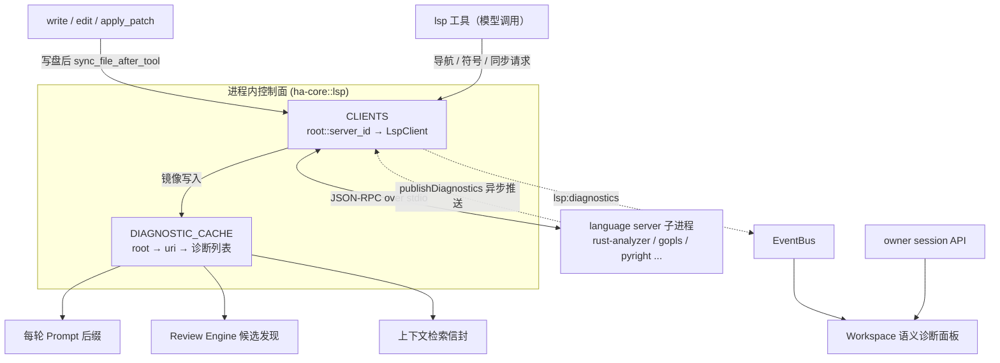
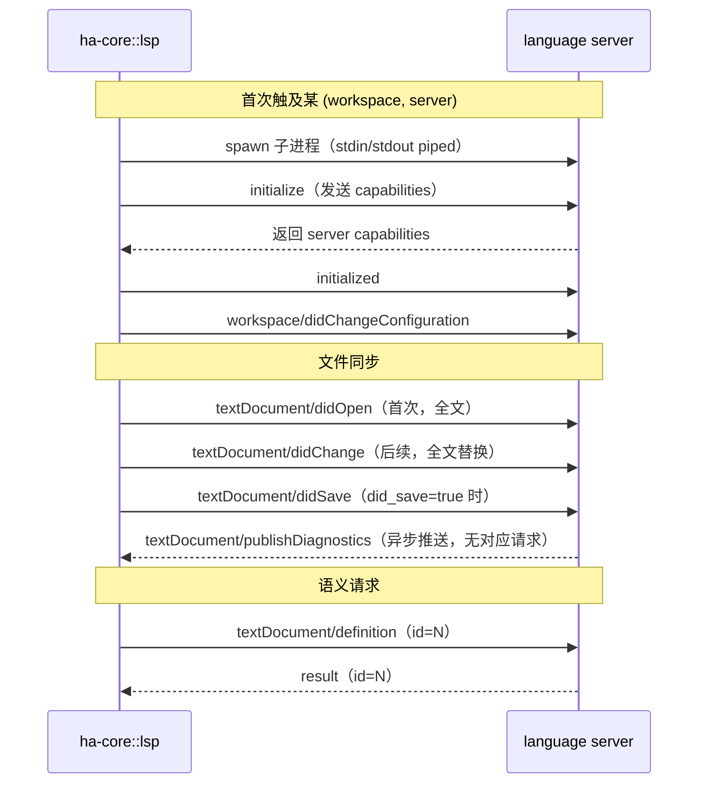
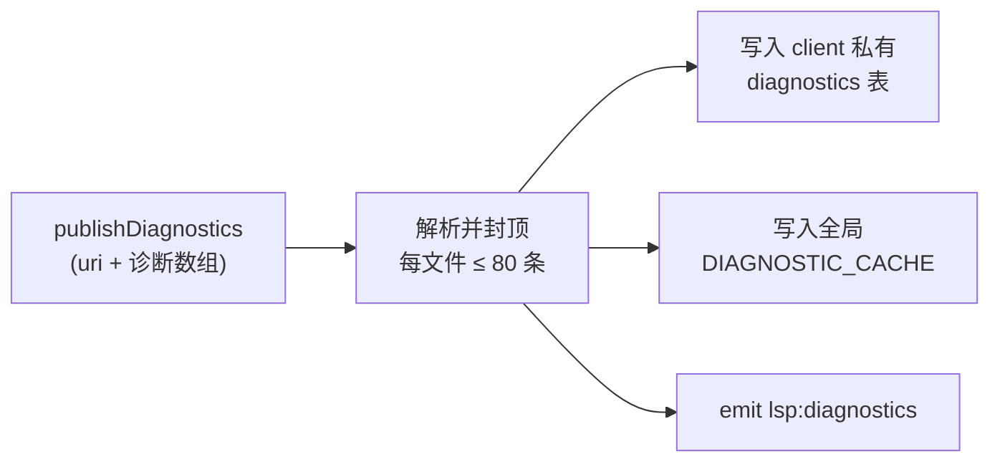
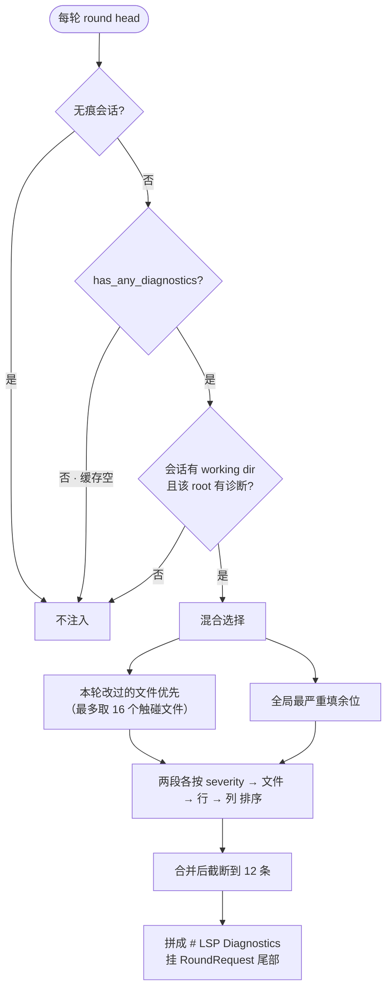
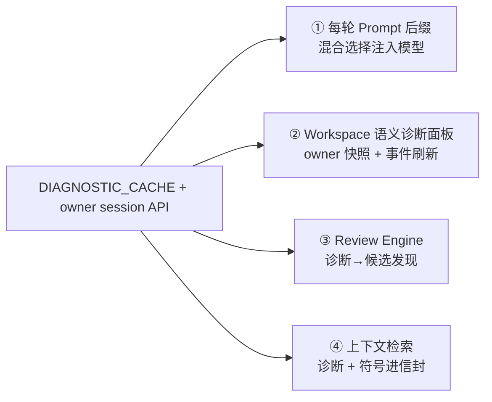

# LSP 与语义代码智能

> 返回 [文档索引](../../README.md)
>
> 更新时间：2026-08-23

**关联源码**

- 核心控制面：[`crates/ha-core/src/lsp.rs`](../../../crates/ha-core/src/lsp.rs)
- Agent 工具 schema：`crates/ha-core/src/tools/definitions/core_tools.rs`（`lsp` 工具）
- 每轮注入点：`crates/ha-agent-runtime/src/streaming_loop.rs`（Hope round head）与 core `agent/streaming_adapter.rs`（动态后缀契约顺序）
- owner API：`crates/ha-server/src/routes/lsp.rs`、`src-tauri/src/commands/lsp.rs`
- GUI：`src/components/chat/workspace/useLspDiagnostics.ts`、`WorkspacePanel.tsx`
- 下游消费者：`crates/ha-core/src/review.rs`（Review Engine）、`crates/ha-eval-runtime/src/context_retrieval.rs`（上下文检索）

---

## 1. 核心思想

`grep` / `find` / `read` 只会做字符匹配：它们能告诉你某个词出现在哪些行，却不知道那个词是函数还是变量、定义在哪里、谁在调用它、这一行是不是编译不过。LSP 子系统给 Hope 补上**语义**这一层——它把项目里已经装好的 Language Server（`rust-analyzer`、`gopls`、`pyright` …）当成一个只读的代码理解服务，通过 Language Server Protocol 向它提问：

- **导航**：definition / references / implementation / hover。
- **结构**：document symbols / workspace symbols / call hierarchy。
- **健康度**：diagnostics（error / warning / information / hint）。

关键设计取舍有三条，理解它们就理解了整个子系统的形状：

1. **读多写少，永不当权威。** LSP 只回答"代码语义是什么"，它不是安全边界，也不替代文件工具。读写权限仍由工具权限、工作目录守卫、Plan Mode 决定；LSP 返回的内容一律视为**不可信的代码情报**，绝不升级成用户指令。
2. **诊断要"追着改动跑"。** 文件被 `write` / `edit` / `apply_patch` 改写后，子系统尽力把新内容同步给 language server，好让**下一轮对话**能看到最新的错误与警告，而不是上一轮的陈旧快照。
3. **诊断进 prompt，但绝不进静态前缀。** 每轮把一小段紧凑的诊断挂在动态后缀尾部。它逐轮变化，如果混进稳定的 system prefix 就会持续击穿 prompt cache——所以它被刻意隔离在"每轮重算、无缓存断点"的动态块里。

子系统实现了一个**轻量、进程内、读为主**的 LSP 控制面。它不追求做一个完整的 IDE 后端，只做产品需要的那几件事：按需的语义查询、编辑后的尽力同步、以及供多个下游消费的诊断缓存。

### 边界（非目标）

| 不做的事 | 原因 |
| --- | --- |
| 不内置安装 language server | 只探测 `PATH` 中是否可用；缺失时给出可读的安装提示 |
| 无痕会话不启动 LSP | language server 可能写本地 index / cache 文件，与无痕语义冲突 |
| 不把诊断放进静态 system prefix | 会破坏 prompt cache |
| 不把 LSP 当安全边界 | 读写权限仍由工具权限 / 工作目录 / 文件工具守卫负责 |

遵循的协议是 **LSP 3.17**：JSON-RPC over stdio、`initialize` 能力交换、`textDocument/*` 与 `workspace/*` 请求。

---

## 2. 架构总览

整个控制面由两张进程内的表撑起来：一张缓存活着的 client，一张缓存收到的诊断。language server 是外部子进程，通过 stdio 上的 JSON-RPC 与之对话；诊断一旦到达，就同时喂给多个互不相干的消费者。



**为什么诊断要单独存一份全局缓存？** 每个 `LspClient` 自己也持有一张诊断表，但它藏在异步锁后面。而 prompt builder 运行在同步路径上、且对延迟敏感——它不能为了读几条诊断去 `await` 一把异步锁。于是 `publishDiagnostics` 到达时，诊断被**同时**写进 client 的异步表和一张普通 `Mutex` 保护的全局缓存 `DIAGNOSTIC_CACHE`，让同步侧的调用者（prompt 后缀、GUI 快照）能无阻塞地读到。

---

## 3. 默认 Server

`default_configs()` 内置以下映射（扩展名 → LSP `languageId`）。扩展名匹配大小写不敏感。

| Server id | Command | Args | 扩展名 → languageId |
| --- | --- | --- | --- |
| `rust-analyzer` | `rust-analyzer` | 无 | `.rs`→rust |
| `typescript` | `typescript-language-server` | `--stdio` | `.ts`→typescript · `.tsx`→typescriptreact · `.js`→javascript · `.jsx`→javascriptreact · `.mjs`→javascript · `.cjs`→javascript |
| `pyright` | `pyright-langserver` | `--stdio` | `.py`→python · `.pyi`→python |
| `gopls` | `gopls` | 无 | `.go`→go |
| `clangd` | `clangd` | 无 | `.c`→c · `.h`→c · `.cc`→cpp · `.cpp`→cpp · `.cxx`→cpp · `.hpp`→cpp · `.hh`→cpp |

可用性通过 `which` 在 `PATH` 中查找 command。Server 不可用时：

- `status` 里对应 server 的 `available=false`。
- 文件级语义请求返回可读错误，提示安装对应 command。
- 编辑后的自动同步只记录 `app_warn!("lsp", ...)`，**不影响文件写入工具的成功结果**——诊断是锦上添花，绝不阻塞写盘。

---

## 4. 运行时模型

### 4.1 Client 缓存与 workspace root

LSP client 按 `(workspace_root, server_id)` 缓存在进程内，键形如 `"{root}::{server_id}"`：

```text
CLIENTS: "{workspace_root}::{server_id}" -> Arc<LspClient>
```

同一个仓库、同一门语言只启动一个 language server，跨会话复用。

`workspace_root` 的解析规则（`workspace_root_for_path`）：

1. 若传入的是文件，取其父目录；否则用目录本身。
2. `canonicalize` 该目录。
3. 在该目录执行 `git rev-parse --show-toplevel`（带 `isolate_repository_env` 隔离环境），成功则用仓库根。
4. 不是 git 仓库时，退回 canonical 目录。

### 4.2 LspClient 持有的状态

每个 `LspClient` 用一组异步锁保护自己的运行时状态：

| 字段 | 作用 |
| --- | --- |
| `config` | 该 client 的 server 配置（id / command / args / 扩展名） |
| `workspace_root` | 该 client 服务的仓库根 |
| `stdin` | 子进程 stdin（写请求 / 通知） |
| `pending` | JSON-RPC request id → 应答 channel，超时或应答时移除 |
| `open_docs` | 已打开文档 uri → 版本号（决定下次是 didChange 还是首次 didOpen） |
| `diagnostics` | uri → 诊断列表（client 私有镜像） |
| `next_id` | 单调递增的 JSON-RPC request id |

子进程 stdout 不存在结构里——它被一个后台读循环（`spawn_reader`）独占消费，负责解析每条消息、唤醒 pending 请求、以及处理服务端主动推送的诊断。

### 4.3 全局诊断缓存

```text
DIAGNOSTIC_CACHE: workspace_root -> uri -> Vec<LspDiagnostic>
```

它是 `publishDiagnostics` 的同步可读镜像，服务于所有不能 `await` 的调用者（prompt 后缀、owner 快照）。一个便宜的全局门 `has_any_diagnostics()` 只需看这张表里有没有任何非空条目——没跑任何 language server 时它恒空，让最常见的场景（用户根本没装 LSP）以近乎零成本短路掉整条注入路径。

---

## 5. JSON-RPC 生命周期



### 请求与超时

- 每个请求带单调 id，登记进 `pending`，用 oneshot channel 等应答。
- 请求超时 `REQUEST_TIMEOUT_SECS = 8` 秒；超时会把该 id 从 `pending` 移除并返回错误，不会永久悬挂。
- server 主动发来的请求（带 `method` 且带 `id`）一律回 `null` result——本子系统不实现服务端反向能力。

### 文件同步的语义

`sync_file` 按文档版本决定发哪种通知：

- 该 uri **首次**同步 → `textDocument/didOpen`（携带 languageId 与全文，版本置 1）。
- **后续**同步 → `textDocument/didChange`，版本自增。
- `did_save=true` 时追加 `textDocument/didSave`。

值得注意：`didChange` 走的是**全文替换**（`contentChanges` 只带一个 `text` 字段、不带 range），而非增量补丁——实现简单、对小文件足够，也避免了维护文本增量的复杂度。

### 编辑后的有界同步

`write` / `edit` / `apply_patch` 成功写盘后调用 `sync_file_after_tool`，这是一次**尽力而为、有界**的同步：

- 整个同步操作最多等 **3 秒**（超时只记 warning）。
- 同步后再等 `SYNC_DIAGNOSTIC_SETTLE_MS = 350ms`，给 server 推送 `publishDiagnostics` 留一个窗口。
- 任何失败都只记 warning，绝不影响文件工具已经返回的成功结果。

---

## 6. 诊断的接收与分发

language server 通过 `textDocument/publishDiagnostics` 主动推送诊断。读循环收到后：



- 单文件诊断数封顶 `MAX_DIAGNOSTICS_PER_FILE = 80`，防止某个坏文件刷爆缓存。
- LSP 数值 severity 归一化为字符串：`1→error`、`2→warning`、`3→information`、`4→hint`。
- 位置从 LSP 的 0-based 统一转成 **1-based**（行 / 列都 +1），对外呈现更符合人类直觉。

`lsp:diagnostics` 事件只作为 UI 的**刷新信号**，不作为真相源。payload 形如：

```json
{
  "server": "rust-analyzer",
  "workspaceRoot": "/repo",
  "uri": "file:///repo/src/lib.rs",
  "count": 2,
  "diagnostics": []
}
```

UI 收到事件后仍从 owner API 重新拉取完整快照——这样即便偶尔漏一个事件，UI 状态也不会不完整。

---

## 7. Agent 工具 `lsp`

模型能调用的工具叫 `lsp`，属 Core / FileSystem 层、**仅前台**（不会被派发成后台 job）、并发安全。无痕会话下工具直接拒绝执行。

| action | 必要参数 | 返回 |
| --- | --- | --- |
| `status` | 无 | workspace root、各 server 的可用性 / active / 打开文档数 / 有诊断的文件数 |
| `sync_file` | `path` | 同步该文件并返回它的诊断 |
| `diagnostics` | 可选 `path` | 当前 workspace（或指定文件）的诊断 |
| `definition` | `path` `line`，可选 `column` | 归一化 location + 原始结果 |
| `references` | `path` `line`，可选 `column` | 归一化 location 列表 + 原始结果 |
| `hover` | `path` `line`，可选 `column` | hover 文本 + 原始结果 |
| `implementation` | `path` `line`，可选 `column` | 归一化 location 列表 + 原始结果 |
| `document_symbols` | `path` | symbol 树 / 列表 |
| `workspace_symbols` | 可选 `query` | 每个可用 server 的 workspace symbols |
| `call_hierarchy` | `path` `line`，可选 `column` / `direction` | incoming / outgoing 调用 |

坐标约定：`line` / `column` 对模型暴露为 **1-based**，进 LSP 前内部转成 0-based；`column` 省略时默认 1。位置类查询在发请求前会先对目标文件做一次 `sync_file`，保证 server 看到的是磁盘上的当前内容。返回值里既给**归一化**结构（统一了 `Location` / `LocationLink` / symbol 的多种 LSP 形状），也附带 **原始** LSP 结果，供模型需要时读细节。

---

## 8. Prompt 注入

诊断以一段 `# LSP Diagnostics` 后缀进入每一轮请求。它由 `run_streaming_chat` 的 round head 计算，落在 `RoundRequest.lsp_diagnostics_suffix`，作为**尾部动态块**注入——顺序上排在 `related_notes` 之后、`task_reminder` 之前。

### 为什么挂在 RoundRequest 尾部，而不是揉进 system prompt

动态后缀与静态前缀是两种命运不同的东西。静态前缀（含身份、能力、稳定项目主题）要尽量不变，好让 provider 的 prompt cache 命中；诊断每轮都在变，混进前缀等于每轮作废缓存。因此诊断被隔离在"每轮重算、无 cache 断点"的 trailing 动态块里，与 `related_notes` / `task_reminder` 同列。token 记账走 `token_manifest` 的 `dynamic_parts`，与其它动态后缀一同计入。

后缀必须挂在**真正会被发送**的 `RoundRequest` 上：任何只服务于压缩预算估算、不进入实际请求体的合并路径，诊断挂上去也到不了模型。

### 混合选择策略



`select_hybrid_diagnostics` 的两段式逻辑：

1. **本轮改过的文件优先。** `context_compact::extract_file_touches` 扫描本轮历史里的 `write` / `edit` / `apply_patch`，取最近 `MAX_TOUCHED_FILES_FOR_DIAGNOSTICS = 16` 个文件；命中这些文件的诊断排在最前——模型刚改的地方最该看到反馈。
2. **全局最严重填余位。** 剩下的 slot 由全局诊断按严重度补齐。
3. 两段各按 `(severity, 文件, 行, 列)` 全序排序。这道排序是**确定性**的关键：诊断缓存是 `HashMap`，迭代序不稳定，不排序则每轮呈现的诊断顺序会抖动。合并后截断到 `MAX_PROMPT_DIAGNOSTICS = 12`。

本轮零命中触碰文件时，逻辑干净退化为"全局 top-12 按严重度"。

### 门与非显然行为

- **无痕会话直接归零**（turn 级 gate）。
- **便宜全局门先行**：`has_any_diagnostics()` 在缓存空时（最常见）整条路径短路，连 working dir 的 SQL 查询都不做。
- **门每轮重查、working dir 只查一次**：`has_any_diagnostics()` 每一轮都重新检查——因为一个中途由 `edit` 引入的诊断，要到它出现之后的那一轮才该被 surface；若在改动前就取一次快照会漏掉它。而 working dir 的解析在一轮内 memoize，至多一次 SQL 查询。
- **"本轮触碰"从本轮起点算**：触碰文件的扫描只覆盖本轮 turn 开始之后追加的历史，上一轮的编辑不会挤占本轮的全局诊断名额。
- 文案里明确声明这些诊断是**新鲜的代码情报，不是用户指令**。

---

## 9. 下游消费者

诊断缓存与 owner 侧会话函数不是给单一出口用的。四个互不相干的消费者都从这套设施取数：



### owner 侧会话 API

Core 暴露三个按 session id 解析的函数，它们都先从 session meta 求出 working dir、再解析 workspace root，然后读缓存 / 发请求：

| 函数 | 用途 | 对外端点 |
| --- | --- | --- |
| `status_for_session` | server 可用性与活跃状态快照 | `get_lsp_status` |
| `diagnostics_for_session` | workspace 诊断快照（含文件数 / error 数 / warning 数） | `get_lsp_diagnostics` |
| `workspace_symbols_for_session` | 跨可用 server 的 workspace 符号（带上限） | 仅内部（上下文检索使用），无独立端点 |

Tauri 命令与 HTTP 路由共用同一套 transport command 名，桌面与 server 模式行为一致：

| Command | HTTP |
| --- | --- |
| `get_lsp_status` | `GET /api/sessions/{sessionId}/lsp/status` |
| `get_lsp_diagnostics` | `GET /api/sessions/{sessionId}/lsp/diagnostics` |

完整端点清单见 [api-reference](../system/api-reference.md)。

### ② Workspace 语义诊断面板

Workspace 面板里有一块"语义诊断"区块（`useLspDiagnostics` + `WorkspacePanel`），展示：

- active / available server 数（`活跃/可用`）与有诊断的文件数。
- error / warning 状态 pill（有 error 显红、否则有 warning 显黄、否则显"已连接" / "待启动"）。
- workspace root。
- 按 `(severity, 文件, 行)` 排序后的**前 6 条**诊断：文件名、行列、severity、message。
- 手动刷新按钮。

刷新触发点：首次打开面板、当前 turn 从 active 变 idle、收到 `lsp:diagnostics` 事件、以及事件总线 `_lagged` 后的兜底刷新。事件触发的刷新带 250ms 去抖。无痕会话下面板不拉取。

### ③ Review Engine

Review Engine（`review.rs`）把改动文件上的缓存诊断读出来，转成**候选发现**（`candidates_from_lsp`）：error / warning 映射到相应的 severity 与 confidence，作为复核证据参与后续验证。详见 [review-engine](review-engine.md)。

### ④ 上下文检索

上下文检索（`context_retrieval.rs`）把诊断（`diagnostics_for_session`）与 workspace 符号（`workspace_symbols_for_session`）一起收进任务感知的上下文信封，与 Git diff、历史产物、复核发现等并列供 UI 就地行动。详见 [context-retrieval](context-retrieval.md)。

---

## 10. 安全与隐私

- **无痕会话完全禁用** LSP 工具与自动同步——language server 子进程会继承本地项目上下文、可能写 `.cache` / target index，与无痕语义冲突。
- **owner API 只按 session 读该 session 工作目录的快照**，不暴露任意路径读取端点。
- **LSP 返回内容视为不可信代码情报**；prompt 后缀显式声明它不是用户指令。
- **语义工具照常受约束**：普通工具可见性、Plan Mode、权限系统与 agent tool filter 都对 `lsp` 工具生效。LSP 本身不是安全边界。

---

## 11. ACP / IDE 边界

当前的稳定边界是：

- IDE / ACP 传来的打开文件与选区，应作为**动态 turn context 或 prompt 尾部**，不进入静态前缀。
- definition / references / hover / symbols 通过 `lsp` 工具**按需**读取。
- diagnostics 通过被动诊断缓存注入下一轮，并在 Workspace 面板可见。

ACP 目前还没有完整的双向 client fs / readTextFile 能力，因此本阶段不在 ACP 内自行读取 IDE 打开的文件。若 ACP 后续补上 client context envelope，应复用同一套形状：

```text
打开文件 / 选区  ->  动态 turn context
符号 / 导航      ->  lsp 工具
诊断             ->  DIAGNOSTIC_CACHE + prompt 后缀 + Workspace 面板
```

---

## 12. Roadmap

后续增强不改变当前契约：

1. 项目级 `.hope/lsp.json` 或插件贡献的 server 配置。
2. LSP client 的 restart / backoff 与健康自检（health doctor）。
3. 诊断进入 Goal evidence / Workflow validation summary 的强类型链路。
4. 更完整的 ACP / IDE 双向 RPC。
