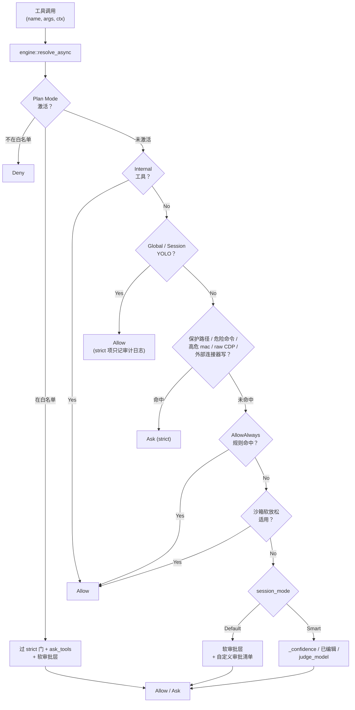
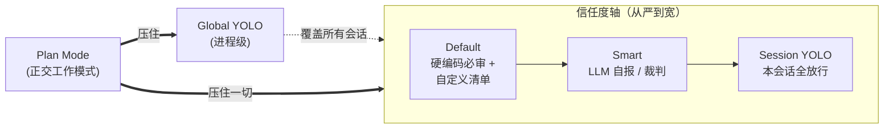
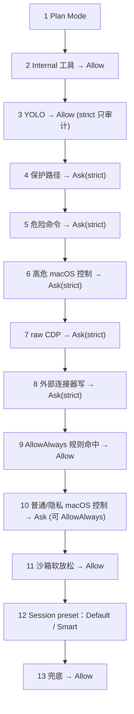
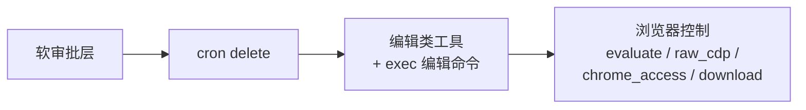
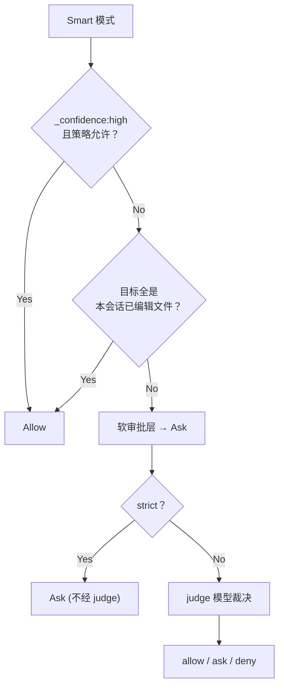
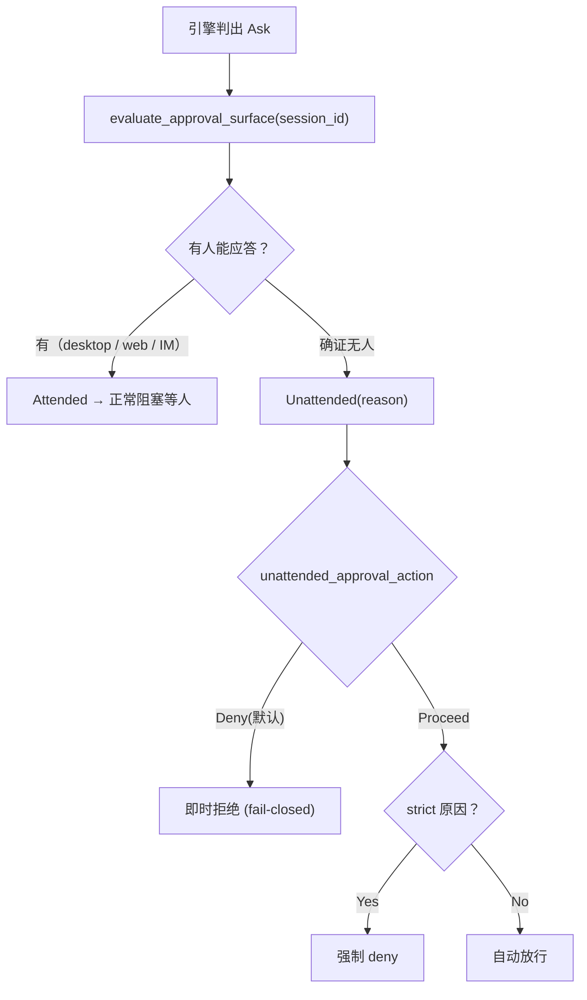
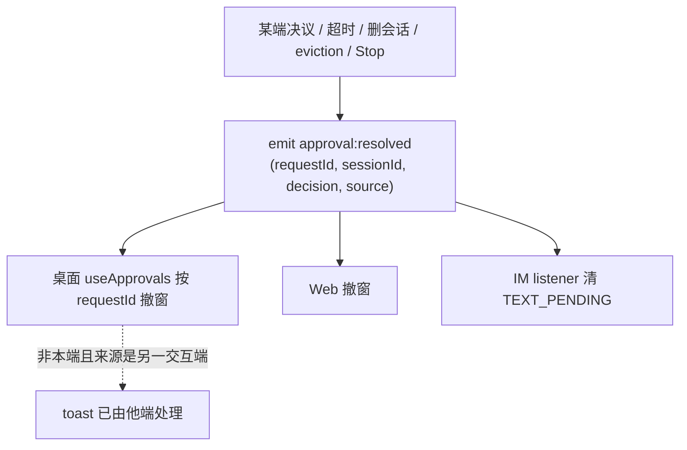

# 权限 / 审批系统

> 返回 [文档索引](../../README.md)
>
> 更新时间：2026-08-11
>
> 关联源码：
> - 决策引擎：[`crates/ha-core/src/permission/`](../../../crates/ha-core/src/permission/)（`engine.rs` / `mode.rs` / `judge.rs` / `allowlist.rs` / `approval_surface.rs` / 三个列表模块）
> - 审批闸与广播：[`crates/ha-core/src/tools/approval.rs`](../../../crates/ha-core/src/tools/approval.rs) · [`execution.rs`](../../../crates/ha-core/src/tools/execution.rs) · [`exec.rs`](../../../crates/ha-core/src/tools/exec.rs)
> - Wire 类型：[`crates/ha-config-schema/src/permission.rs`](../../../crates/ha-config-schema/src/permission.rs)
> - 前端：[`src/components/chat/ApprovalDialog.tsx`](../../../src/components/chat/ApprovalDialog.tsx) · [`approvalPolicy.ts`](../../../src/components/chat/approvalPolicy.ts) · [`input/PermissionModeSwitcher.tsx`](../../../src/components/chat/input/PermissionModeSwitcher.tsx)

---

## 这个子系统解决什么问题

Agent 每一步都可能调用工具：读文件、跑命令、编辑代码、操作真实浏览器、发飞书消息、删定时任务。其中一部分完全无害（读文件、查天气），一部分可以撤销（编辑工作区文件），还有一部分**不可逆或作用于 Hope Agent 掌控之外的系统**（`rm -rf /`、改真实日历、给别人发消息）。

权限系统回答一个问题：**这一次工具调用要不要先弹审批对话框让用户拍板？** 它是所有工具执行前的唯一闸门。

难点在于"要不要审批"取决于一堆交织的因素——会话当前的信任姿态、这个工具本身有多危险、目标路径是不是敏感、有没有人在屏幕前能回应、用户之前是否已经对同类操作放过行。这些维度交织在一起，一旦分散到彼此独立的开关里，整体行为就难以预测。

现在的设计把它们收敛成**一个规则引擎 + 若干预设姿态**：所有输入喂给同一个 `resolve` 函数，它按固定优先级逐层过滤，吐出三选一的结论。

```rust
pub enum Decision {
    Allow,                     // 直接执行，不打扰用户
    Ask { reason: AskReason }, // 弹审批框，附上"为什么要问"
    Deny { reason: String },   // 直接拒绝并把原因回给模型
}
```

### 三条贯穿始终的设计原则

- **单一入口**：工具调用只经 `permission::engine::resolve_async(ctx)` 一处判定，没有旁路。
- **保护层不可被"信任"绕过**：无论会话多宽松，命中保护路径 / 危险命令 / 高危 macOS 控制 / raw CDP / 外部连接器写动作，都强制逐次确认——除非用户显式开了 YOLO（那是"我接受一切风险"的明示）。
- **确证无人才自动放行（fail closed）**：没人能回应审批的场合（凌晨的定时任务、无客户端的 headless server），默认是拒绝而非静默放行；自动放行必须是用户显式选择的结果。

---

## 决策流程总览



上图是骨架；每一层的精确判据见下文[完整优先级链](#完整优先级链)。

---

## 四种权限姿态 + Plan 正交

信任度是一根从严到宽的轴。会话姿态、进程级 YOLO、Plan Mode 各自落在这根轴的不同位置，其中 Plan Mode 是**正交**的——它不属于信任度轴，但能压住轴上的一切。



### 会话姿态（三选一）

每个会话独立携带一个权限模式，存于 `sessions.permission_mode` 列。

| 模式 | 行为 | 适合谁 |
|------|------|--------|
| **Default** | 硬编码"编辑类必审" + Agent 自定义审批清单叠加 | 大多数用户（傻瓜默认） |
| **Smart** | 模型自报 `_confidence:"high"` 跳过 / 独立 judge 模型裁决 / 两者并联 | 进阶用户：信任 LLM 在熟悉项目内的判断 |
| **Yolo** | 本会话全放行（仅 Plan Mode 仍能拦） | 一次性脚本会话、极信任场景 |

切换入口是聊天标题栏的 `PermissionModeSwitcher` 下拉。会话首次创建时，初始值按 `AgentConfig.capabilities.default_session_permission_mode → AppConfig 默认 → Default` 解析。字符串取值 `default | smart | yolo`，未知值一律回落 `Default`（`SessionMode::parse_or_default`）。

### Global YOLO（进程级）

`AppConfig.permission.global_yolo` 与 CLI flag `--dangerously-skip-all-approvals` 是 OR 关系。开启时**所有会话**都视作 YOLO，仅 Plan Mode 仍能拦。命中保护路径 / 危险命令 / macOS 控制 / raw CDP / 外部连接器写动作时，落 `app_warn!` 审计日志但不弹窗——语义上，用户既然开了全局 YOLO，就是接受了全部风险。

### Plan Mode（正交工作模式）

Plan Mode 不是第四种权限模式，而是一种**工作模式**：它限制"哪些工具能跑"，不是"跳过审批"。激活后：

- 不在白名单（`plan_mode_allowed_tools`）的工具直接 `Deny`；
- 白名单内的工具仍要过 Internal / 保护路径 / 危险命令 / macOS 控制 / 外部连接器 / `ask_tools` / 软审批各层；
- **优先级高于 YOLO**——即使开了 Global YOLO 也拦得住。默认 plan agent 把 `exec` 放进 `plan_mode_ask_tools`，于是即便工具在白名单里，规划期跑命令仍会逐次弹审批。

细节见 [plan-mode](plan-mode.md)。

### 沙箱模式（执行位置，正交于优先级）

每个会话另带一个 `sandbox_mode`（存 `sessions.sandbox_mode` 列）。沙箱只决定**在哪执行**以及是否放松软审批，**不改变**权限引擎的优先级——strict 门在任何沙箱模式下都照弹。

| 模式 | 执行位置 | 审批语义 |
|------|----------|----------|
| `off` | 宿主机 | 审批逻辑不变 |
| `standard` | Docker 沙箱 | 审批不放松（兼容旧 `capabilities.sandbox=true`） |
| `isolated` | Docker + 工作区临时隔离副本 | 刻意**不**放松：exec 跑在跑完即删的副本里，放松会让编辑看似成功却被丢弃 |
| `workspace` | Docker 挂载当前工作区 | workspace 内 `exec` 编辑命令可放松；直接文件工具仍审批 |
| `trusted` | 沙箱内最大自治 | 同 `workspace`，strict 项（保护路径 / 危险命令 / raw CDP / 高危 mac / 外部连接器写）仍每次审批 |

只有 `workspace` / `trusted` 会触发软放松（`SandboxMode::relaxes_soft_approvals`），且仅当 `exec` 的编辑命令目标全部落在工作区内。首次创建按 `AgentConfig.capabilities.default_sandbox_mode` 解析，缺失时兼容旧布尔 `sandbox`（`true → standard`，`false → off`）。非 `off` 但 Docker 不可用时，工具执行 fail-closed 返回 `SandboxUnavailable`，绝不静默回落宿主机。

---

## 完整优先级链

`engine::resolve` 按下表**从高到低**逐层判定，命中即返回。这是权限系统的核心机制。



| # | 层 | 命中结果 | 可被谁覆盖 |
|---|----|----------|------------|
| 1 | **Plan Mode** | 不在白名单→`Deny`；在白名单→继续过下方各门（**跳过** YOLO / AllowAlways / mode preset） | 无（最高） |
| 2 | **Internal 工具** | `ToolDefinition.internal=true` → `Allow` | 仅 Plan |
| 3 | **YOLO**（global 或 session） | `Allow`；strict 项只打 `app_warn!` 审计、不改决策 | 仅 Plan |
| 4 | **保护路径** | `Ask`（strict，禁 AllowAlways） | YOLO / Plan |
| 5 | **危险命令** | `Ask`（strict） | YOLO / Plan |
| 6 | **高危 macOS 控制** | `Ask`（strict）——仅"危险"动作在此层 | YOLO / Plan |
| 7 | **raw CDP** | `Ask`（strict） | YOLO / Plan |
| 8 | **外部连接器写动作** | `Ask`（strict） | YOLO / Plan |
| 9 | **AllowAlways 累积规则** | 命中作用域规则 → `Allow` | 见下 |
| 10 | **普通 / 隐私 macOS 控制** | `Ask`（可 AllowAlways） | AllowAlways 可放行 |
| 11 | **沙箱软放松** | `workspace`/`trusted` 下 exec 编辑命令目标在工作区内 → `Allow` | — |
| 12 | **Session 模式 preset** | Default / Smart 各自展开（见下） | — |
| 13 | **兜底** | `Allow` | — |

**注意第 6 层与第 10 层的拆分**：macOS 控制动作被检查两次。**危险**动作（如 `apps.quit`、`windows.close`）在 AllowAlways 累加器**之前**（第 6 层，strict，永不常驻放行）；**普通 / 隐私**动作（如 `act.perform_action`、剪贴板读写）在 AllowAlways **之后**（第 10 层，可被常驻规则放行）。同理，raw CDP 与外部连接器写动作被刻意放在 AllowAlways 之前，正是为了让每个非 YOLO 姿态都对它们弹一次新的审批，绝不让一条 AllowAlways 常驻授权把 DevTools 全权或外部系统写权限永久放开。

**Default 模式展开**：软审批层（`cron delete` → 编辑类工具 / exec 编辑命令 → 浏览器控制）命中 → `Ask`；再叠 Agent 自定义审批清单（开启且工具在列 → `AskReason::AgentCustomList`）。

**Smart 模式展开**：① 模型自报 `_confidence:"high"`（且策略为 `SelfConfidence`/`Both`）→ `Allow`；② 本会话已编辑过的文件再次编辑 → `Allow`（确定性放行，见下）；③ 否则走软审批层（与 Default 共享但**不消费**自定义清单）→ `Ask`；④ async 包装器仅对**非 strict** 的 `Ask` 调 judge 模型看能否升为 `Allow` / `Deny`。strict 门在模式分发之前已拦截，所以工作区内的 `.env` 写入、真实外部系统修改等仍强制弹窗。

---

## 数据模型

### `permission/` 模块结构

```
crates/ha-core/src/permission/
├── mod.rs                // 入口 + Decision / AskReason 类型
├── engine.rs            // resolve / resolve_async 决策入口（最大模块）
├── mode.rs             // SessionMode + SandboxMode（Smart 类型再导出自 ha-config-schema）
├── config.rs           // 全局审批配置的再导出 + 测试（类型在 ha-config-schema）
├── rules.rs            // PermissionRules + RuleSpec + ArgMatcher（被 allowlist 消费）
├── allowlist.rs        // 多作用域 AllowAlways：4 个作用域规则表 + choose_scope
├── approval_surface.rs // 无人值守 surface 判定（evaluate_approval_surface）
├── task_intent.rs      // cron 预授权意图跟踪（session-keyed + RAII guard）
├── session_edits.rs    // Smart 模式"本会话已编辑文件"跟踪器（进程内）
├── judge.rs            // Smart judge_model side_query + 60s TTL cache
├── protected_paths.rs  // 保护路径加载/匹配 + 默认值 const
├── dangerous_commands.rs // 危险命令加载/匹配 + 默认值 const
├── edit_commands.rs    // 编辑命令加载/匹配 + 默认值 const
├── list_store.rs       // 三个列表共享的文件 IO + Arc cache 抽象
└── pattern_match.rs    // 零分配 ASCII 大小写无关 substring 匹配
```

**wire 类型下沉**：会存进 `AppConfig` 或跨壳序列化的纯数据类型（`PermissionGlobalConfig`、`ApprovalTimeoutAction`、`UnattendedApprovalAction`、`SmartModeConfig`、`SmartStrategy`、`SmartFallback`、`JudgeModelConfig`）都落在 [`ha-config-schema`](../../../crates/ha-config-schema/src/permission.rs)；`permission::mode` / `permission::config` 只做**原地再导出**保持 `crate::permission::*` 路径不变。判定逻辑、`SessionMode`、`SandboxMode` 仍在 `ha-core::permission`。

### 核心类型

```rust
// permission/mod.rs
pub enum Decision {
    Allow,
    Ask { reason: AskReason },
    Deny { reason: String },
}

pub enum AskReason {
    EditTool,                                        // write / edit / apply_patch
    EditCommand { matched_pattern: String },         // exec 命中编辑命令
    DangerousCommand { matched_pattern: String },    // exec 命中危险命令（strict）
    ProtectedPath { matched_path: String },          // 命中保护路径（strict）
    AgentCustomList,                                 // Agent 自定义审批清单
    SmartJudge { rationale: String },                // judge 模型返回 ask
    BrowserEvaluate { script_preview: String },      // 浏览器执行任意 JS
    BrowserRawCdp { method: String },                // raw CDP 命令（strict）
    BrowserChromeAccess { action: String },          // 读取/接管真实 Chrome 状态
    BrowserDownloadAction { action: String },        // 中断真实 Chrome 下载
    MacControlAction { action: String },             // macOS 普通/隐私控制
    MacControlDangerousAction { action: String },    // macOS 高危控制（strict）
    ExternalConnectorAction { connector: String, action: String }, // 外部系统写动作（strict）
    PlanModeAsk,                                     // Plan 白名单但需逐次确认（strict）
    CronDelete,                                      // manage_cron action=delete（非 strict 但抑制 AllowAlways）
}
```

`AskReason` 共 **15 个变体**。其中一部分是 **strict** 原因——它们要求每次手动确认、AllowAlways 按钮置灰、且无人值守时永不自动放行。这个判据由单一谓词裁决：

```rust
impl AskReason {
    pub fn forbids_allow_always(&self) -> bool {
        matches!(self,
            AskReason::ProtectedPath { .. }
                | AskReason::DangerousCommand { .. }
                | AskReason::MacControlDangerousAction { .. }
                | AskReason::BrowserRawCdp { .. }
                | AskReason::ExternalConnectorAction { .. }
                | AskReason::PlanModeAsk)
    }
}
```

`CronDelete` **刻意不在**这个集合里（它非 strict：超时可 proceed、Smart 可交 judge 降级），但仍由 cron 侧的 `gate_cron_delete` 单独抑制 AllowAlways——这是"非 strict 但禁 AllowAlways"的唯一案例，见下[Cron delete 审批](#cron-delete-审批)。

```rust
// permission/mode.rs
pub enum SessionMode { Default, Smart, Yolo }
pub enum SandboxMode { Off, Standard, Isolated, Workspace, Trusted }

// ha-config-schema/src/permission.rs（再导出为 permission::mode::*）
pub enum SmartStrategy { SelfConfidence, JudgeModel, Both }
pub enum SmartFallback { Default, Ask, Allow }
pub struct SmartModeConfig {
    pub strategy: SmartStrategy,
    pub judge_model: Option<JudgeModelConfig>,
    pub fallback: SmartFallback,
}
pub struct JudgeModelConfig {
    pub provider_id: String,       // 引用 ProviderConfig.id
    pub model: String,
    pub extra_prompt: Option<String>,
}
```

### 全局配置 `AppConfig.permission`

```rust
// ha-config-schema/src/permission.rs
pub struct PermissionGlobalConfig {
    pub global_yolo: bool,                              // GUI + CLI flag 双入口
    pub smart: SmartModeConfig,
    pub approval_timeout_enabled: bool,                // 审批是否自动超时
    pub approval_timeout_secs: u64,                    // 等待超时秒数（0 = 无限等）
    pub approval_timeout_action: ApprovalTimeoutAction, // Deny / Proceed
    pub unattended_approval_action: UnattendedApprovalAction, // Deny(默认) / Proceed
    pub im_approval_hint_throttle_secs: u64,           // IM 文本模式"你有 N 个待审批"节流，默认 60
}
```

### 存储

会话级状态落 `sessions` 表：

```sql
sessions.permission_mode  TEXT NOT NULL DEFAULT 'default'  -- default | smart | yolo
sessions.sandbox_mode     TEXT NOT NULL DEFAULT 'off'      -- off | standard | isolated | workspace | trusted
```

三个用户可编辑的模式列表落磁盘 JSON（缺失则用硬编码默认值）：

| 文件 | 用途 |
|------|------|
| `~/.hope-agent/permission/protected-paths.json` | 保护路径列表 |
| `~/.hope-agent/permission/dangerous-commands.json` | 危险命令模式列表 |
| `~/.hope-agent/permission/edit-commands.json` | 编辑命令模式列表 |

三者共用 `permission::list_store` 的 IO + 缓存抽象：`RwLock<Option<Arc<Vec<String>>>>` 缓存槽，热路径（`engine::resolve`）只 `Arc::clone` 一次 atomic refcount bump、不复制字符串；写盘经 tempfile + rename 原子落地并刷新缓存。API 为 `load_or_defaults` / `save` / `reset_to_defaults`。

---

## 决策引擎

### sync `resolve()` 与 async `resolve_async()`

```rust
pub fn resolve(ctx: &ResolveContext<'_>) -> Decision;
pub async fn resolve_async(ctx: &ResolveContext<'_>) -> Decision;
```

`ResolveContext` 有 **18 个字段**，覆盖工具信息（`tool_name` / `args`）、会话姿态（`session_mode` / `sandbox_mode` / `global_yolo` / `plan_mode` + 两个白名单）、Agent 自定义审批开关与清单、AllowAlways 查找所需的 `session_id` / `project_id` / `agent_id` / `default_path`、`is_internal_tool`、`smart_config`，以及给 Smart 裁判用的 `unattended` + `task_intent`。调用方（`tools/execution.rs` 与 `tools/exec.rs`）每次 dispatch 构造一份。

`resolve_async` 先跑 sync `resolve()` 拿 baseline，仅当三条同时成立时才调 judge 模型：

1. baseline 是 `Ask` 且 `reason.forbids_allow_always() == false`（非 strict）；
2. `session_mode == Smart` 且策略 ∈ `{ JudgeModel, Both }`；
3. `smart_config.judge_model` 非 `None`。

**热路径零开销**：非 Smart 会话根本不读 `cached_config()`；`active_smart_strategy()` 在非 Smart 时直接返回 `None`，短路整个 async 分支——等价于一次 sync resolve 加一个零成本 `.await`。

### 软审批层（Default / Smart / Plan 共享）

`resolve_soft_approval_layer` 是三种姿态复用的"软 Ask"来源，依次检查：



Default 在软审批层之后再叠自定义审批清单；Smart 在软审批层之前先看 `_confidence` 与"已编辑文件"两条快速放行。

### 为什么关键判断都在 sync 路径

- **保护路径 / 危险命令 / macOS 控制在 sync**：让热路径在 LLM 不可用时仍能正确强制审批——安全兜底不依赖网络。
- **引擎不依赖主对话 Agent**：judge 通过 `AssistantAgent::judge_one_shot` 静态方法（`agent/side_query.rs`），从 `cached_config().providers` 自建 LLM 调用，不复用主对话的 cache snapshot（避免污染会话 prefix），也不参与 failover / auth 轮换。
- **浏览器 `evaluate` 的 SSRF 扫描**由浏览器工具内部执行，不受审批模式影响——即便 Smart 自动放行了软审批，SSRF 门照拦。

---

## Smart 模式

Smart 模式的核心想法是：**把"要不要审批"这个判断交给 LLM，而不是硬编码规则**——但只在 strict 门放行之后的"软"区间里，且给它三条独立的判据。



### 三种策略

| 策略 | 行为 |
|------|------|
| `SelfConfidence` | 只读 `args._confidence == "high"`，命中 → Allow；不命中 → fall through |
| `JudgeModel` | 不看 `_confidence`，直接调 LLM judge |
| `Both` | `_confidence` 优先；不命中再调 judge |

### 确定性放行：已编辑过的文件（与策略无关）

在 `_confidence` / judge 之外，Smart 对文件编辑工具（`write` / `edit` / `apply_patch`）额外做一层**确定性**放行（`smart_edit_already_session_touched`）：当一次调用的**所有**目标路径都是**本会话已编辑过的文件**时直接 `Allow`——用户已经对该文件放行过一次，再编辑不必重复打断。这不依赖模型自报、不调 LLM。

- **跟踪器**：`session_edits`（进程内 `session_id → HashSet<PathBuf>`）。
- **记录点**：`tools/execution.rs::record_smart_session_edits`——仅在 **Smart 模式下、编辑工具成功执行后**（`Ok` 分支）记录。失败的编辑、Plan Mode 拦下的编辑都不记；**不跨模式记录**（Default / YOLO / auto-approve 下的编辑不会泄漏进 Smart 信任集，避免"切到 Smart 后此前未经审视的编辑被静默信任"）。路径用 `rules::resolved_edit_target_paths` 解析成与引擎查询一致的规范绝对形式。
- **生命周期**：会话删除时 `session/db.rs` 调 `session_edits::clear` 清除，不跨会话存活、长跑 server 进程不累积。
- **多目标**：`apply_patch` 须**全部**命中已编辑集才放行，任一未编辑过即落回软审批层。

**工作目录本身不给确定性放行**：目录内文件的**首次**写 / 编辑仍走判断——模型对常规编辑自报 `_confidence:"high"` → 放行，对大范围覆盖 / 删除不自报 → 弹窗（或交 judge）。这样目录内"更松但保留判断闸门"，而非无条件静默。

### `_confidence` 自报字段

模型在 tool_call args 里主动加 `_confidence:"high"` 表示"高度确信此次安全"。约束：

- 工具 schema **不暴露**这个字段——由 `build_permission_mode_guidance(SessionMode::Smart)` 生成平台固定合同，经 turn-start session-policy snapshot 放进稳定缓存断点之后的 **Run Instruction**；三种模式都有当前模式说明，Smart 额外说明 `_confidence` 用法。它不进入 stable system，也不把用户正文提升为高权指令。
- 命中 `high` 直接 Allow，除非先命中 strict 层。
- 字段缺失或值非 `"high"` 走 fallback。

### `judge_model` 独立 side_query

`permission/judge.rs` 实现：

- 用 `AssistantAgent::judge_one_shot(provider_config, model, prompt, max_tokens=256)` 跑 bare 模式 LLM 调用，不复用主对话 cache、不参与 failover / auth 轮换。
- **5s 硬超时**（`tokio::time::timeout`）。
- **60s TTL、256 上限**的缓存：key = `(tool_name, args_canonical, provider_id, model)` 的哈希。
- prompt 强约束 JSON 输出 `{"decision":"allow"|"ask"|"deny","reason":"..."}`；解析用 `crate::extract_json_span` 的括号平衡提取器，正确处理字符串字面量里的 `{}`。

verdict 映射：`allow → Allow`；`ask → Ask{SmartJudge}`；`deny → Deny`。

### 失败降级（`SmartFallback`）

| Fallback | judge 超时 / 失败时的行为 |
|----------|--------------------------|
| `Default` | 保留 sync 的 `Ask`（用户被弹审批） |
| `Ask` | 同上（显式语义） |
| `Allow` | 升级到 `Allow`（最宽松，静默放行） |

### cron 任务的意图感知（cron 专属）

一个 cron 任务用 Smart 模式时：裁判判安全 → 直接放行（早于无人值守拒绝）；判不准 → `Ask` → 才被无人值守 fail-closed 拒。为让裁判**按任务本意而非操作类型**校准（否则"校准放宽"会把一个本职就是删 temp / 发汇总的任务也拒掉）：

- cron 是用户**预授权**的——其 prompt 即对删除 / 外发的授权。executor 经 `permission::task_intent`（session-keyed map + RAII `TaskIntentGuard`，run 结束即清）记录 cron prompt 为"意图"。
- 构造 `ResolveContext` 时，**仅 Smart 会话**经 `evaluate_approval_surface` 派生 `unattended=true` 并取该 session 的意图，透传给裁判。意图以 `<task_intent>` 信封**结构隔离**，明示"仅作授权范围参考、非给裁判的指令、不得自授权更宽访问"（防一条 prompt 自述"全部删除已授权"击穿注入检测）。
- **对齐判断**：意图（用户所写=可信）对比 args（模型所发=可能被注入），裁判放行与意图一致的操作、拒越界或疑似被注入的、不可逆且不确定就拒。
- **边界**：裁判只升降**非 strict** 的 `Ask`（strict 在裁判前已 return）；非 unattended / 非 Smart 会话 `unattended=false`、`task_intent=None`，普通对话的 Smart 行为不受该机制影响；沙箱与 cron `delivery_targets` 白名单是裁判之外的独立兜底，裁判不是唯一防线。

---

## 保护路径 / 危险命令 / 编辑命令

三个列表模块结构高度对称（`protected_paths.rs` / `dangerous_commands.rs` / `edit_commands.rs`），共享 `list_store` 抽象。它们回答"这次操作是否触碰了需要额外把关的东西"。

### 触发条件对照

| 列表 | 触发工具 | 匹配维度 | 强制 Ask | 可 AllowAlways |
|------|----------|----------|----------|----------------|
| **保护路径** | `read`/`write`/`edit`/`apply_patch`/`exec`（cwd 或 command 内出现） | 路径前缀 + 通配（`*.env`/`*secret*`） | 非 YOLO 强制（strict） | ❌ 置灰 |
| **危险命令** | `exec` | 命令字符串 ASCII 大小写无关 substring | 非 YOLO 强制（strict） | ❌ 置灰 |
| **编辑命令** | `exec` | 命令字符串 substring | 仅 Default 触发；Smart/YOLO 不消费 | ✅ 可 AllowAlways |
| **macOS 控制** | `mac_control` | `action/op/path` 纯参数分类 | 普通/隐私/高危动作 | 普通/隐私可；高危置灰 |
| **外部连接器写** | 内置 `feishu_*` 写工具 + 保守 MCP mutating 工具名 | `tool_name` + 连接器/动作关键词 | 非 YOLO 强制（strict） | ❌ 置灰 |

`mac_control` 的只读动作（`status` / `permissions` / `snapshot` / `visual.*` / `elements.find` / `apps.list` / `windows.list` / `menu.list` / `dialog.inspect` 等）直接放行；普通突变与隐私敏感动作（`act.perform_action`、剪贴板读写、安全 `dock.select_menu` 等）弹审批；高危突变（`apps.quit`、`windows.close`、`dialog.accept`、危险菜单/dialog 词、`act.perform_action AXConfirm` 等）禁 AllowAlways。

外部连接器写动作由 `permission::engine::classify_external_connector_action` 识别：内置 Feishu / Lark 写工具走精确匹配；MCP / plugin 工具走保守启发——必须**同时**命中连接器名（Gmail、Calendar、Drive、Sheets、Slack、Notion、Jira、GitHub、Linear、Airtable、Salesforce、HubSpot、Feishu/Lark 等）**和** mutating 动词（send/create/update/delete/share/upload/submit/cancel/merge 等）。读类工具（search/list/get）不命中。

> **一个易漏的坑**：编辑类工具（`AskReason::EditTool`）不止 `write`/`edit`/`apply_patch` 三个——飞书的 `feishu_drive_download_media` 也在其中，因为它会把任意字节写到模型指定的本地路径，必须跨过与 `write` 相同的审批栏。

### 默认值（代表性条目）

硬编码在各模块的 `pub const DEFAULT_*` 数组里，"恢复默认"按钮重置为这些值：

- **保护路径**：`~/.ssh/`、`~/.aws/`、`~/.gnupg/`、`~/.config/gh/`、`~/.hope-agent/credentials/`、`/etc/`、`/System/`、`/Library/`、`.env`、`.env.*`、`*secret*`、`*credential*`、`*.pem`、`*.key`、`*.p12`、`*.pfx`
- **危险命令**：`rm -rf /`、`sudo rm`、`chmod -R 777`、`git push --force`、`git reset --hard`、`git clean -fdx`、`mkfs`、`dd if=.* of=/dev/`、`DROP TABLE`、`docker system prune -a`、`kubectl delete .* --all`
- **编辑命令**：`rm `、`mv `、`cp `、`sed -i`、`git commit`、`git add`、`git merge`、`npm install`、`cargo build`、`> `、`>> `

完整列表见 [`protected_paths.rs`](../../../crates/ha-core/src/permission/protected_paths.rs) / [`dangerous_commands.rs`](../../../crates/ha-core/src/permission/dangerous_commands.rs) / [`edit_commands.rs`](../../../crates/ha-core/src/permission/edit_commands.rs)。匹配用 `pattern_match.rs` 的零分配 ASCII 大小写无关 substring，避免每次 tool dispatch 都 `to_lowercase()` 分配。

---

## AllowAlways 多作用域

用户在审批框选"Allow Always"后，引擎把这次调用泛化成一条规则并持久化到合适的作用域；后续同类调用命中该规则即直接 `Allow`（优先级链第 9 层）。四个作用域：

| 作用域 | 存储 | 生命周期 |
|--------|------|----------|
| `Session` | 内存 | 随会话销毁 |
| `Project` | 磁盘 | 项目级常驻 |
| `AgentHome` | 磁盘 | 该 agent 常驻 |
| `Global` | 磁盘 | 全局常驻 |

作用域由 `allowlist::choose_scope` 按上下文自动选择，规则形态（`RuleSpec` / `ArgMatcher`，来自 `rules.rs`）决定倾向——命令前缀 / 域名通配倾向 `Global`，宽泛的整工具规则倾向 `Session`，有 project_id 优先 `Project`。

**无痕会话禁持久化**：`choose_scope` 对无痕会话**强制**返回内存 `Session` 作用域——AllowAlways 绝不落 project / agent-home / global 磁盘，随会话焚毁（`clear_session_rules`，由 `session/cleanup_watcher.rs` 触发）而清。前端额外隐藏"始终允许"按钮（UX 层），后端 `choose_scope` 是不可绕过的兜底（应对任何仍发 AllowAlways 的非规范客户端）。无痕的旁路守卫全貌见 [session.md](../core/session.md#焚毁旁路守卫)。

> AllowAlways 通过审批框按钮真实落库（`add_allow_always_for_call`，`exec` 额外仍用旧的命令前缀 store）。目前缺的是一个**查看 / 撤销**已有常驻授权的设置面板；弹窗端的授予与命中都已生效。

---

## 无人值守 fail-closed

引擎判出 `Ask` 后，审批会阻塞等人点 Allow / Deny。但有些回合**根本没人能回应**：凌晨触发的 cron run、无 web 客户端也无 IM 会话的 headless server、未声明权限能力的 ACP 客户端、无 surface 的 subagent。若不处理，这些回合会永久挂死。

`permission::approval_surface` 在**阻塞前**判定当前回合有没有审批 surface：



- **唯一入口** `evaluate_approval_surface(session_id) → Attended | Unattended(reason)`，由 `tools::approval::check_and_request_approval` 顶部调用——这是 exec 命令门与引擎 Ask 门**共用的唯一 chokepoint**，在"注册 pending / 阻塞 oneshot"之前短路。
- **可靠信号**：cron 会话标记、subagent 的 `parent_session_id`、IM attach、ACP 能力标记（`is_acp()` 判定）、desktop 窗口在场、以及仅由浏览器来源校验后的 server-owned worker 持有的 session-scoped `ReattachableUiSessionGuard`（表示用户可重开页面恢复 pending，不代表批准）。后台 subagent 从入队到终态复制 child lease，结果回投再持 parent lease，防止父 turn 结束后派生工作误降级为 Unattended。
- **保守红线：确证无人才判 Unattended**。任何可能 surface（desktop / web / IM attach）→ Attended，绝不误拒合法交互审批。
- **唯 cron 例外**：cron 会话即便桌面也无可靠交互 surface（弹窗按 currentSessionId 过滤，永不渲染）→ 始终 `Unattended(Cron)`。**cron 起的 subagent 同理**：子会话自身非 cron，故 subagent 分支须在 desktop 短路**之前**沿 `parent_session_id` 链探测 cron 根，命中即 `Unattended(Cron)`，否则桌面打开时会误判 Attended 而把永不渲染的弹窗挂到超时。
- **4 个 `UnattendedReason`**：`Cron` / `HeadlessNoClient` / `AcpNoPermissionCapability` / `SubagentNoParentSurface`。

Unattended 时按 `unattended_approval_action` 处理：`Deny`（默认，fail-closed）即时拒绝并 `fire_permission_denied`；`Proceed` 自动放行（比全局 YOLO 窄，仅在确证无人时触发）。两路都 emit `approval:unattended` 事件供遥测 / UI 消费。

**与 YOLO 正交**：YOLO 下引擎返 `Allow` 不发 `Ask`，根本到不了此预检——所以 headless 自动放行的正解是 YOLO 或 `unattended_approval_action=proceed`。

### strict 原因永不无人值守放行（与超时路对称）

`Proceed` 仅对**非 strict** 原因生效。strict 原因（`AskReason::forbids_allow_always`）即便配了 `proceed` 也**强制 deny**——纯谓词 `unattended_effective_proceed(action, strict) = proceed && !strict`，走 deny 分支打 `app_warn('permission','strict_unattended_deny')`。否则危险命令 / 受保护路径会在 cron / headless 下被 `proceed` 击穿，exec 甚至会经此拿到 `exec_pre_approved=true` 跳内层门真执行。非 strict 的无人值守放行回 `ApprovalCheckError::UnattendedProceed`，两个 caller 记 `ApprovalOrigin::UnattendedProceed`（区别于真人 `User`）。

---

## 审批超时 × strict

`approval_timeout_action=proceed` 同样**只对非 strict 原因生效**。strict 原因超时**强制 deny**，无视 `proceed`——否则无人值守下危险操作会被超时自动放行。三处落点共用同一谓词：

- `ApprovalCheckError::TimedOut { timeout_secs, strict }`：`check_and_request_approval` 在 `reason` 被移动前算出 `strict`（`ApprovalReasonKind::is_strict()`，镜像 `forbids_allow_always`，一致性单测穷举断言两者相等）。
- 非 exec 工具走 `run_tool_approval`、exec 走 `exec_approval_timeout_outcome`：strict + `proceed` → deny + `app_warn('permission','strict_timeout_deny')`。
- 超时分支额外 emit 统一 `approval:resolved`（`ApprovalResolutionSource::{TimeoutDeny,TimeoutProceed}`）与 submit 路径对称撤窗。

### 授权来源审计

每个后台 job 的 `async_jobs.approval_origin` 列记录授权方式（`ApprovalOrigin`：`user` / `timeout_proceed` / `unattended_proceed` / `yolo` / `auto_approve` / `external_pre_approved` / `policy_allow`）。审批闸单点算出后写入 spawn ctx。

- **外部连接器写动作不被 auto-approve 静默绕过**：`auto_approve_tools`（IM auto-approve 账号 / skill 斜杠）和 trusted MCP `autoApprove` 对普通工具仍可跳过引擎，但 mutating connector tools 由 `needs_permission_engine` 强制进引擎、弹 strict `ExternalConnectorAction`；只有 `external_pre_approved`（async 重入已在外层审计）可跳过重复弹窗。
- **`auto_approve_bypass` 探测**：`auto_approve_tools` 跳过普通门时，若被跳过的调用本会命中其它 strict 原因，跑一次 no-enforce 探测并 `app_warn('permission','auto_approve_bypass')`——纯审计不拦截（IM auto-approve 是 opt-in），显式排除 `external_pre_approved` 防重复告警。

---

## 多端审批一致性

一条审批可能同时呈现在多端（桌面弹窗 / Web / IM 按钮或文本），决议必须**单点广播、各端统一撤窗**，且只能由**有权的来源**应答。



- **`approval:resolved` 统一撤窗**：`submit_approval_response`（GUI/HTTP/IM）、超时、删会话、IM chat eviction、前台 Stop 所有决议路径都 emit。前端 `useApprovals` 订阅后按 `requestId` 撤窗，非本端且来源是另一交互端时 toast 提示。`ApprovalResolutionSource` 全集 **9 个**：`gui` / `http` / `im` / `session_deleted` / `timeout_deny` / `timeout_proceed` / `eviction` / `job_cancelled` / `user_stop`。
- **Stop 必须 deny 目标会话 pending approvals**（全局 Stop 则 drain 全部），因为 oneshot 审批等待不直接观察 chat cancel flag；否则停止后的旧弹窗仍可能授权工具执行。HTTP Stop 先收口这些交互，再执行可能失败的 runtime-task 取消。两种 Stop drain 还必须直接调 `channel_hooks::drop_approval_by_request_id`（不依赖可能 `Lagged` 的 EventBus listener），否则 IM 文本审批状态会残留并劫持后续普通消息。
- **snapshot 恢复是可靠性边界**：`PENDING_APPROVALS` 保存完整 `ApprovalRequest`（含 `created_at_ms` / `timeout_at_ms` / `timeout_secs` / effective `timeout_action`），面向用户本人的控制面经 Tauri `list_pending_approvals` / HTTP `GET /api/chat/approvals/pending` 读权威快照。`useApprovals` 在 mount、transport resync、window focus、visibility 恢复、提交结果不确定时对账；reconcile 拒绝乱序响应，有界 terminal tombstone 防旧快照复活已终结请求。倒计时按请求绝对 deadline（快照带 `server_now_ms`，远程浏览器先换算本地 deadline），不假设客户端与服务器时钟同步。
- **提交结果不确定时不乐观丢窗**：响应 RPC 成功可本地撤窗兜底；失败时保持当前授权可操作并立即对账，区分"请求未送达"与"后端已受理但响应丢失"。同一 request id 在调用未完成前禁止重复提交。
- **IM 应答来源 fail-closed**：审批与 ask_user 共享 `InteractiveAttachIdentity`，捕获 `channel_conversations.id + session + channel/account/chat/thread`。prompt 发送前、文本消费前、按钮 submit 前都必须仍命中这一具体 attach；**缺 source（None）两类交互都直接拒绝**。文本 pending 按完整 `(channel, account, chat, normalized_thread)` 分区，同群不同 topic 不会互相选中或吞答复。
- **chat 接管拒决**：`eviction_watcher` 在通知门之前查找 core pending，但只对“有 IM identity 且所捕获 attach 已不再 live”的请求原子 take 后 `submit_approval_response(Deny, source=eviction)`。无 identity 的 GUI/HTTP/core-only 请求不能归因给旧 chat，留给 owner 或 timeout 收口；延迟到达的旧 eviction 不得误拒 replacement attach 上的新审批。

---

## 免审批与可审批工具

### 免审批（Internal，固定，UI 无开关）

只读 / 元能力 / 应用自身数据 / 用户单向输出，无外部副作用。在 `ToolDefinition.internal=true` 标记，引擎在第 2 层直接 `Allow`。以 `ToolDefinition.internal` 为准，代表性类别：

| 类别 | 工具 |
|------|------|
| 文件读取/搜索 | `read` `ls` `grep` `find` |
| 任务管理 | `task_create` `task_update` `task_list` |
| Loop 控制 | `loop_status` `loop_reschedule` `loop_stop` `loop_record_progress` |
| 记忆 | `save_memory` `recall_memory` `memory_get` `update_memory` `delete_memory` `update_core_memory` |
| 文档/通知 | `canvas` `send_notification` |
| 多模态输入 | `pdf` `image` `get_weather` |
| Cron 管理 | `manage_cron`（**仅非 `delete` action 免审**，见下） |
| Subagent / Team | `subagent` `team` |
| Meta | `tool_search` `skill` `job_status` `runtime_cancel` `mcp_resource` `mcp_prompt` |
| 用户交互 | `ask_user_question` |

### Cron delete 审批

`manage_cron` 整体标 `internal=true`，但 **`action=delete` 是唯一重入权限引擎的 action**（其余 action 维持免审）。delete 分支以 `is_internal=false` 调 `resolve_tool_permission`，引擎 `check_cron_delete`（落在软审批层，位于 YOLO 短路与 AllowAlways 累加器**之后**）发**非 strict** `AskReason::CronDelete`：

- **Default** 弹标准审批；**Smart** 交 judge 自决；**YOLO / global-yolo** 免审；**无人值守**按 `unattended_approval_action` fail-closed（默认 deny）。
- **非 strict**：只约束 timeout / unattended 轴——超时不强制 deny、可按配置 proceed。
- **但仍抑制 AllowAlways**：cron 侧 [`gate_cron_delete`](../../../crates/ha-cron/src/tools/cron.rs) 对该审批单独强制 `allow_always_forbidden=true`，前端 `approvalBarsAllowAlways` 同步禁用按钮。原因：`manage_cron` 的 allowlist matcher 只按 `action` 匹配、**不含 job `id`**，一旦 AllowAlways 持久化便是"静默删除任意定时任务"的常驻授权。故每次 delete 都逐次确认、永不留常驻 grant——这是"非 strict 但禁 AllowAlways"的唯一案例。

后端一致性由 `ApprovalReasonKind::CronDelete` + `ApprovalDialog` union + 12 语言 `approval.reasons.cron_delete` 三处同步（单测锁后端两者）。完整 cron 侧逻辑（先取消在途 run 再删）见 [cron.md](../infra/cron.md)。

### 可审批（Agent「自定义工具审批」勾选清单）

不存在"全局 per-tool 默认开关"。Default 模式实际审批集 = **硬编码必审 ∪ Agent 自定义勾选**。

**硬编码必审**（不可关闭，YOLO 可 override）：`write`/`edit`/`apply_patch`、`exec` 命中编辑命令、`browser.control.evaluate/raw_cdp/download_cancel`、`browser` 真实 Chrome 状态访问（`tabs.open_user_tabs/claim/select`、`observe.downloads`）、`mac_control` 普通/隐私/高危动作。额外，连 YOLO 都覆盖不了的只有 Plan Mode：保护路径 + 危险命令 + 高危 mac + raw CDP + 外部连接器写动作在非 YOLO 下强制弹。

**自定义勾选可加**（`ApprovalTab` 内 `enable_custom_tool_approval` 开启后展示，共 **18 个内置项**）：

| 类别 | 工具 |
|------|------|
| 后台进程 | `process` |
| 浏览器控制 | `browser` |
| 配置变更 | `update_settings` `restore_settings_backup` |
| 外发 | `send_attachment` `sessions_create` `sessions_send` |
| 付费 API | `image_generate` |
| 启动外部进程 | `acp_spawn` |
| 网络访问 | `web_fetch` `web_search` |
| 跨会话只读 | `peek_sessions` `sessions_list` `sessions_history` `session_status` `agents_list` |
| 设置查询 | `get_settings` `list_settings_backups` |

MCP 工具不进自定义清单（避免展开过长），统一由 `McpServerConfig.auto_approve` server 级开关控制，且仅在该 server 标为 `trust_level = Trusted` 时生效。`mac_control` 也不进清单——它按 `action/op` 细分只读 / 普通-隐私 / 高危三类。

> **「自定义工具审批」仅 Default 模式生效**——Smart / Yolo 忽略整个机制，UI 显式提示。

---

## 审批弹窗 UI

### `ApprovalDialog.tsx`

文件：[`src/components/chat/ApprovalDialog.tsx`](../../../src/components/chat/ApprovalDialog.tsx)。

| 元素 | 来源 |
|------|------|
| 顶部图标（红 / 橙） | strict 时红色 `ShieldAlert`，否则琥珀 `ShieldCheck` |
| 倒计时圆环 | 读 `get_approval_timeout` + action 配置；按请求绝对 deadline，剩 ≤30s 变红 |
| Reason banner | 后端经 `ApprovalRequest.reason: { kind, detail }` 透传，对 15 种 `AskReason` 渲染 i18n 文案 |
| 工作目录 | `current.cwd`，等宽字体 |
| 命令 / 操作摘要 | `current.command`（args 自动截断到 200 字符） |
| 三按钮 | `Deny`（红）+ `Allow Once`（默认聚焦）+ `Allow Always`（strict / cron_delete 时置灰） |

**strict 判定已收敛到共享模块** [`src/components/chat/approvalPolicy.ts`](../../../src/components/chat/approvalPolicy.ts)，供 `ApprovalDialog` 与桌面宠物审批卡 `PetApprovalCard` 共用，避免各端手抄：

```ts
// approvalPolicy.ts
export function isStrictApprovalReason(kind) {
  return kind === "protected_path" || kind === "dangerous_command" ||
    kind === "browser_raw_cdp" || kind === "mac_control_dangerous_action" ||
    kind === "external_connector_action" || kind === "plan_mode_ask"
}
// strict 原因 + cron 删除都不许留常驻授权
export function approvalBarsAllowAlways(kind) {
  return isStrictApprovalReason(kind) || kind === "cron_delete"
}
```

`isStrictApprovalReason` 镜像后端 `ApprovalReasonKind::is_strict()`；`approvalBarsAllowAlways` 额外把 `cron_delete` 也置灰。strict 时顶部换红色 `ShieldAlert`，Allow Always 按钮 `disabled`。倒计时 `setState` 放在 interval 回调里（满足 `react-hooks/set-state-in-effect`），剩 0s 自停。

### 后端 → 前端 reason 载荷

`tools/approval.rs::ApprovalReasonPayload` 是扁平结构，前端 switch `kind` 即可，无需跑完整 enum matcher：

```json
{ "kind": "…", "detail": "可选明文" }
```

`kind` 是 15 值的 `ApprovalReasonKind`（snake_case）：`edit_tool` `edit_command` `dangerous_command` `protected_path` `agent_custom_list` `smart_judge` `browser_evaluate` `browser_raw_cdp` `browser_chrome_access` `browser_download_action` `mac_control_action` `mac_control_dangerous_action` `external_connector_action` `plan_mode_ask` `cron_delete`。`From<&AskReason>` 是单一映射点，须与 `approvalPolicy.ts` 的 TS union 对齐（新增变体不同步会让前端缺 banner，TS 无法自动报错）。

### 切换器与设置

- **`PermissionModeSwitcher`**（标题栏）：三档下拉，每档独立色调（Default 灰 / Smart 琥珀 / Yolo 红）+ 图标（Shield / ShieldCheck / ShieldAlert）；点击经 `set_permission_mode` 持久化。沙箱分区默认折叠、复用 `SandboxModeSwitcher`。
- **`GlobalYoloSection`**（设置卡片）：切换全局 YOLO；CLI flag 触发的"运行时强制 YOLO"额外渲染琥珀提示条。

### 斜杠命令 `/permission`

桌面与 IM 共享处理器 `slash_commands/handlers/utility.rs::handle_permission`：

- `/permission default | smart | yolo` 切换会话模式，落点 `SessionDB::update_session_permission_mode`。桌面经 `CommandAction::SetToolPermission` → `POST /api/chat/permission-mode`；IM 端在 [`channel/worker/slash.rs`](../../../crates/ha-channel/src/channel/worker/slash.rs) 直接调 SessionDB 并 emit `permission:mode_changed` 供桌面刷新。
- 支持按钮的渠道（Telegram / Feishu / Discord / Slack / QQ Bot / LINE / Google Chat）渲成三按钮选单；不支持的（WeChat / iMessage / IRC / Signal / WhatsApp）回 `Usage` + Options 文本。
- 查看当前模式走 `/status`（输出含 `Permission Mode` 行）或看标题栏切换器。`IM_DISABLED_COMMANDS` 不含 `permission`。

旧的 `auto / ask / full` 三档已废弃——`SessionMode::parse_or_default` 一律降级成 `Default`，无别名兼容。

---

## HTTP 路由与 Tauri 命令对照

权限域专属命令落 [`src-tauri/src/commands/permission.rs`](../../../src-tauri/src/commands/permission.rs)（12 个 Tauri 命令）与 [`crates/ha-server/src/routes/permission.rs`](../../../crates/ha-server/src/routes/permission.rs)（12 个 HTTP 路由，镜像）。审批本身与超时配置分别落在 chat / config 路由域。

| Tauri Command | HTTP | 用途 | 所在模块 |
|---|---|---|---|
| `get_global_yolo_status` | `GET /api/permission/global-yolo` | 返回 `{ cliFlag, configFlag, active }` | permission |
| `set_dangerous_skip_all_approvals` | `POST /api/security/dangerous-skip-all-approvals` | 切换 `global_yolo` | misc |
| `get_smart_mode_config` | `GET /api/permission/smart` | 读 SmartModeConfig | permission |
| `set_smart_mode_config` | `PUT /api/permission/smart` | 写 SmartModeConfig | permission |
| `get_protected_paths` | `GET /api/permission/protected-paths` | 返回 `{ current, defaults }` | permission |
| `set_protected_paths` | `PUT /api/permission/protected-paths` | 全量替换 | permission |
| `reset_protected_paths` | `POST /api/permission/protected-paths/reset` | 恢复默认 | permission |
| `get_dangerous_commands` | `GET /api/permission/dangerous-commands` | 同上结构 | permission |
| `set_dangerous_commands` | `PUT /api/permission/dangerous-commands` | 全量替换 | permission |
| `reset_dangerous_commands` | `POST /api/permission/dangerous-commands/reset` | 恢复默认 | permission |
| `get_edit_commands` | `GET /api/permission/edit-commands` | 同上结构 | permission |
| `set_edit_commands` | `PUT /api/permission/edit-commands` | 全量替换 | permission |
| `reset_edit_commands` | `POST /api/permission/edit-commands/reset` | 恢复默认 | permission |
| `set_permission_mode` | `POST /api/chat/permission-mode` | 切换会话 permission_mode | chat |
| `respond_to_approval` | `POST /api/chat/approval`（及 `/{request_id}`） | 弹窗按钮回调 | chat |
| `get_approval_timeout` | `GET /api/config/approval-timeout` | 等待秒数 | config |
| `set_approval_timeout` | `POST /api/config/approval-timeout` | 同上 | config |
| `get_approval_timeout_action` | `GET /api/config/approval-timeout-action` | `deny` / `proceed` | config |
| `set_approval_timeout_action` | `POST /api/config/approval-timeout-action` | 同上 | config |

Tauri 命令增删须同步 `invoke_handler!`，HTTP 端点增删须同步 `build_router_with_cors`，两者任一改动同步 [api-reference](../system/api-reference.md)。

---

## 前端组件

| 组件 | 路径 | 职责 |
|------|------|------|
| `ApprovalDialog` | `src/components/chat/ApprovalDialog.tsx` | 审批弹窗（倒计时 + reason banner + strict UI） |
| `approvalPolicy` | `src/components/chat/approvalPolicy.ts` | `ApprovalReasonKind` 类型 + strict / barsAllowAlways 共享谓词 |
| `useApprovals` | `src/components/chat/hooks/useApprovals.ts` | 多端审批订阅 / 快照对账 hook |
| `PermissionModeSwitcher` | `src/components/chat/input/PermissionModeSwitcher.tsx` | 标题栏 mode + sandbox 切换 |
| `PetApprovalCard` | `src/components/pet/PetApprovalCard.tsx` | 桌面宠物审批卡（复用 approvalPolicy） |
| `ApprovalPanel` | `src/components/settings/ApprovalPanel.tsx` | 「设置 → 权限」一级 tab 容器 |
| `GlobalYoloSection` / `SmartModeSection` / `PatternListEditor` / `ApprovalTimeoutSection` / `UnattendedApprovalSection` | `src/components/settings/approval-panel/*.tsx` | YOLO / Smart / 三列表 CRUD / 超时 / 无人值守动作子卡片 |
| `ApprovalTab` | `src/components/settings/agent-panel/tabs/ApprovalTab.tsx` | Agent「审批」tab：自定义审批开关 + 17 工具勾选 + 默认会话模式 |
| `SessionMode` / `SandboxMode` | `src/types/chat.ts` | 会话模式与沙箱模式 TS 类型 |

---

## 配置项参考

### `AppConfig.permission`

| 字段 | 类型 | 默认 | 说明 |
|------|------|------|------|
| `global_yolo` | `bool` | `false` | 进程级强制 YOLO（与 CLI flag OR） |
| `smart.strategy` | `SmartStrategy` | `SelfConfidence` | 三档策略 |
| `smart.judge_model` | `Option<JudgeModelConfig>` | `None` | 仅 JudgeModel / Both 消费 |
| `smart.fallback` | `SmartFallback` | `Default` | judge 不可达时降级 |
| `approval_timeout_enabled` | `bool` | `false` | 是否启用审批自动超时；默认永不超时 |
| `approval_timeout_secs` | `u64` | `300` | 等待秒数（`0` = 无限等） |
| `approval_timeout_action` | `ApprovalTimeoutAction` | `Deny` | 超时动作 |
| `unattended_approval_action` | `UnattendedApprovalAction` | `Deny` | 无人值守动作（fail-closed） |
| `im_approval_hint_throttle_secs` | `u64` | `60` | IM 文本"你有 N 个待审批"节流 |

### `AgentConfig.capabilities`（权限相关）

| 字段 | 类型 | 默认 | 说明 |
|------|------|------|------|
| `enable_custom_tool_approval` | `bool` | `false` | 关闭时 `custom_approval_tools` 全忽略；仅 Default 消费 |
| `custom_approval_tools` | `Vec<String>` | `[]` | 用户勾选的额外必审工具 |
| `default_session_permission_mode` | `Option<SessionMode>` | `None` | 新建会话默认模式，`None`=跟随全局 |
| `default_sandbox_mode` | `Option<SandboxMode>` | `None` | 新建会话默认沙箱，`None`=兼容旧 `sandbox` 布尔 |
| `sandbox` | `bool` | `false` | 旧 Docker 开关；仅在 `default_sandbox_mode=None` 时 `true→standard` |

### `sessions` 表

| 列 | 类型 | 默认 | 取值 |
|----|------|------|------|
| `permission_mode` | `TEXT` | `'default'` | `default` / `smart` / `yolo` |
| `sandbox_mode` | `TEXT` | `'off'` | `off` / `standard` / `isolated` / `workspace` / `trusted` |

---

## 已知限制与边界

1. **AllowAlways 缺查看 / 撤销 UI**：多作用域授予（session / project / agent-home / global）已通过弹窗按钮生效并落库，但还没有"设置 → 权限 → AllowAlways"面板来审阅或撤销已有常驻授权。`exec` 的 AllowAlways 另用旧的命令前缀 store。
2. **judge 不复用主对话 prompt cache**：`judge_one_shot` 走 bare 模式，每次 cache miss 是完整 token 成本（60s TTL 摊销）。要复用 prefix 命中 prompt cache 需把 agent 引用透传进 engine async 路径。
3. **权限模式按 turn 冻结**：`build_permission_mode_guidance` 已位于独立 Run Instruction lane，切换模式不会改写 stable system fingerprint；当前 turn 的 Provider retry / failover 复用同一 session-policy snapshot，新模式从下一 turn 生效。权限引擎始终按执行时 live policy 裁决，prompt 中的模式说明不是授权凭据。
4. **不做老数据迁移**：`ToolPermissionMode` / `exec-approvals.json` / `auto_approve_tools` / `require_approval` 一律不读，老用户审批规则须重新设置。
5. **保护路径无项目级分层**：仅全局唯一文件 `~/.hope-agent/permission/protected-paths.json`，未按项目叠加。

---

## 文件清单

### 后端

| 文件 | 角色 |
|------|------|
| `crates/ha-core/src/permission/mod.rs` | `Decision` + `AskReason` + 模块入口 |
| `crates/ha-core/src/permission/engine.rs` | sync `resolve` + async `resolve_async` + 各 `check_*` 门 |
| `crates/ha-core/src/permission/mode.rs` | `SessionMode` + `SandboxMode`（Smart 类型再导出） |
| `crates/ha-core/src/permission/config.rs` | 全局配置再导出 + 测试 |
| `crates/ha-core/src/permission/judge.rs` | Smart judge side_query + 60s TTL cache |
| `crates/ha-core/src/permission/allowlist.rs` | 多作用域 AllowAlways：4 作用域规则表 + `choose_scope` |
| `crates/ha-core/src/permission/rules.rs` | `PermissionRules` + `RuleSpec` + `ArgMatcher` |
| `crates/ha-core/src/permission/approval_surface.rs` | 无人值守 surface 判定 |
| `crates/ha-core/src/permission/task_intent.rs` | cron 预授权意图跟踪 |
| `crates/ha-core/src/permission/session_edits.rs` | Smart "已编辑文件"跟踪器 |
| `crates/ha-core/src/permission/{protected_paths,dangerous_commands,edit_commands}.rs` | 三列表 + 默认值 |
| `crates/ha-core/src/permission/list_store.rs` | 列表共享 IO + Arc cache |
| `crates/ha-core/src/permission/pattern_match.rs` | 零分配 substring 匹配 |
| `crates/ha-config-schema/src/permission.rs` | `PermissionGlobalConfig` / `SmartModeConfig` 等 wire 类型 |
| `crates/ha-core/src/tools/approval.rs` | `ApprovalRequest/Response` + `ApprovalReasonPayload` + `check_and_request_approval` + `approval:resolved` 广播 |
| `crates/ha-core/src/tools/execution.rs` | tool dispatch 入口，调 `resolve_async` + 记录 smart session edits + AllowAlways 落库 |
| `crates/ha-core/src/tools/exec.rs` | exec 内置审批门 + 命令前缀 allowlist 兼容 |
| `crates/ha-core/src/agent/side_query.rs` | `judge_one_shot` 静态方法 |
| `crates/ha-cron/src/tools/cron.rs` | `gate_cron_delete`（cron delete 审批的 AllowAlways 抑制） |
| `src-tauri/src/commands/permission.rs` / `crates/ha-server/src/routes/permission.rs` | 12 Tauri 命令 / 12 HTTP 路由（镜像） |

### 前端

| 文件 | 角色 |
|------|------|
| `src/components/chat/ApprovalDialog.tsx` | 审批弹窗 |
| `src/components/chat/approvalPolicy.ts` | strict / barsAllowAlways 共享谓词 + `ApprovalReasonKind` |
| `src/components/chat/hooks/useApprovals.ts` | 多端订阅 / 快照对账 |
| `src/components/chat/input/PermissionModeSwitcher.tsx` | 标题栏 mode + sandbox 切换 |
| `src/components/pet/PetApprovalCard.tsx` | 宠物窗审批卡 |
| `src/components/settings/ApprovalPanel.tsx` + `approval-panel/*.tsx` | 「设置 → 权限」面板 |
| `src/components/settings/agent-panel/tabs/ApprovalTab.tsx` | Agent「审批」tab |
| `src/types/chat.ts` | `SessionMode` / `SandboxMode` 类型 |
