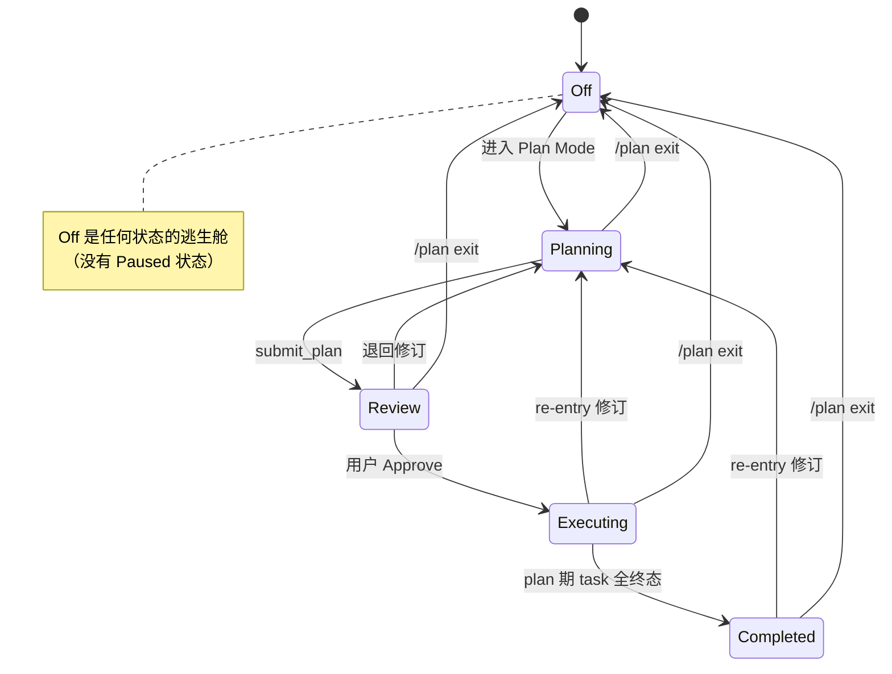
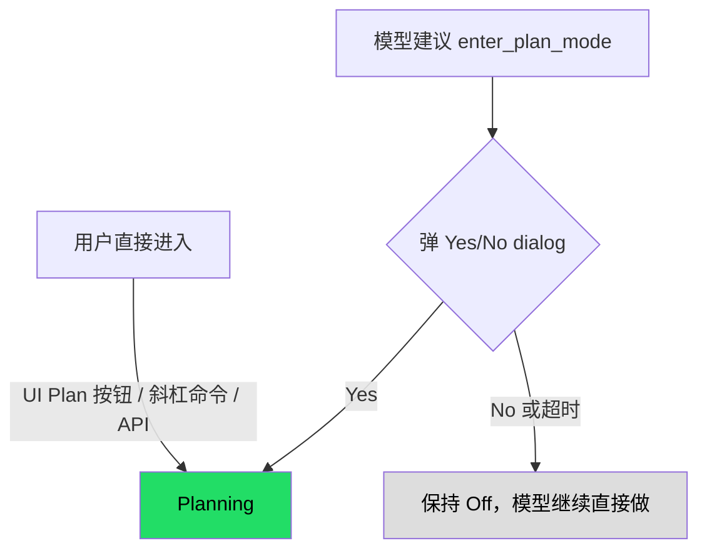
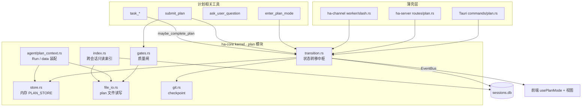
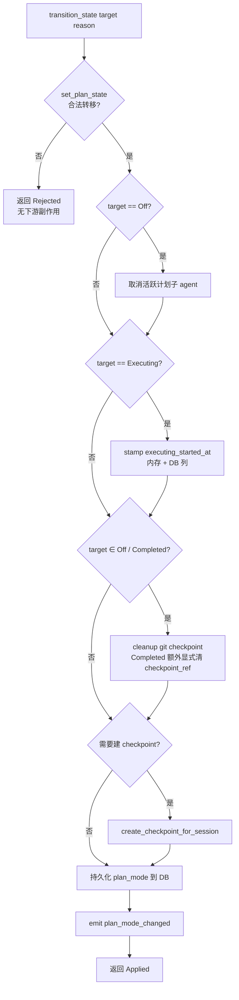
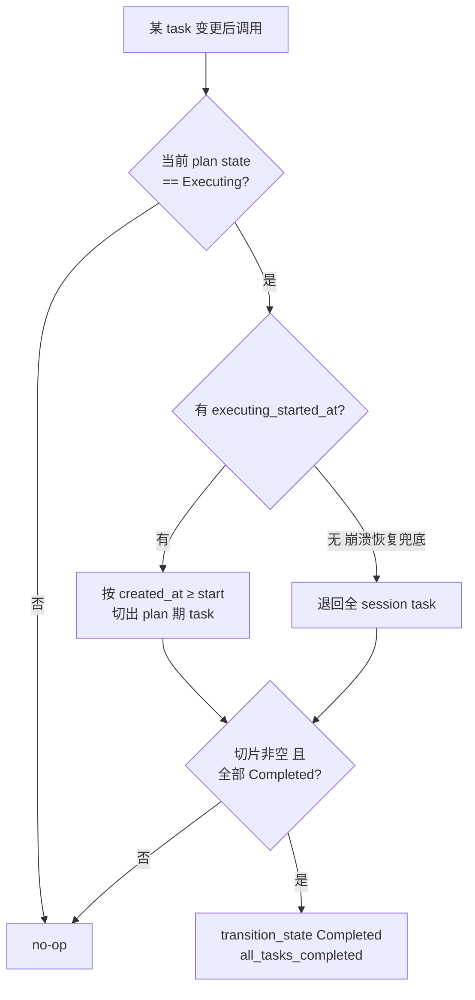
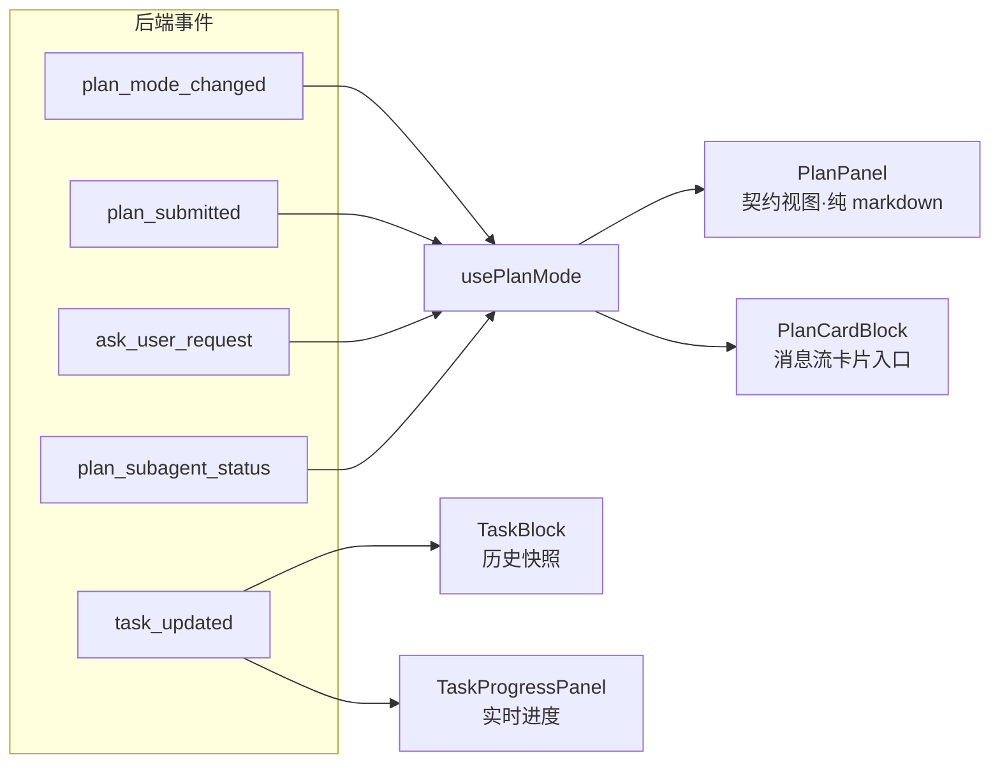
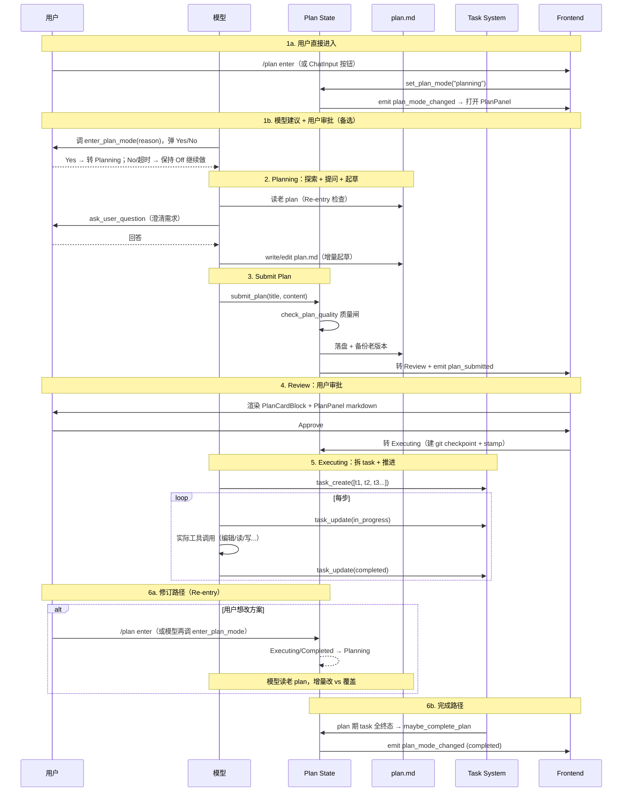

# Plan Mode 架构

> 返回 [文档索引](../../README.md)
>
> 更新时间：2026-08-11

## 关联源码

| 关注点 | 入口 |
|---|---|
| 状态机与元数据 | `crates/ha-core/src/plan/types.rs` |
| 状态转移中枢（唯一副作用入口） | `crates/ha-core/src/plan/transition.rs` |
| 内存 store / DB 恢复 | `crates/ha-core/src/plan/store.rs` |
| Plan 文件读写 / 版本备份 | `crates/ha-core/src/plan/file_io.rs` |
| 提交质量闸 | `crates/ha-core/src/plan/gates.rs` |
| Run Instruction / plan data 装配 | `crates/ha-core/src/agent/plan_context.rs` + `crates/ha-core/src/plan/constants.rs` |
| Git checkpoint | `crates/ha-core/src/plan/git.rs` |
| 跨会话只读索引 | `crates/ha-core/src/plan/index.rs` |
| 前端状态与视图 | `src/components/chat/plan-mode/` |

---

## 概述

Plan Mode 是「先想清楚再动手」的工作模式。模型在实施前，通过探索、提问、起草，把一份 markdown 设计文档写出来交给用户审批；只有审批通过才进入实施阶段。它服务的场景既包括编程（架构选型、多文件重构、新功能），也包括通用任务（写文章、做调研、整理资料、决策支持）。

整套系统围绕三个核心想法：

1. **plan 与 task 双轨分离**——设计文档（**plan**）是一份稳定契约，实施进度（**task**）是另一套独立机制。两者形态不同、生命周期不同，互不同步，因此不会漂移。
2. **用户主权**——模型永远不能自己切换到 Plan Mode，进入的决定权始终在用户手里。
3. **执行冻结**——一旦计划被审批，它在整个执行期内冻结为设计契约；想改方案只能重新进入 Plan Mode 走完整审批。

## 核心思想：plan 不是 todo

一份计划文档承担了两种被反复混淆的职责：它既是「我打算怎么做」的**设计说明**，又常被顺手当成「做到哪一步了」的**进度清单**。把这两件事塞进同一份带 checkbox 的文件，会逼出两份互相矛盾的进度真相——文件里的勾选状态与进度追踪工具各说各话，谁也不权威。

Plan Mode 的解法是彻底拆开两条轨道：

| 轨道 | 角色 | 工具 | 形态 | 生命周期 |
|---|---|---|---|---|
| **plan.md** | 设计契约（用户审批的对象） | `submit_plan` | 自由 markdown，无 checkbox、无 status 字段 | 审批后冻结；要改重进 Plan Mode |
| **task list** | 实施进度（执行心电图） | `task_create` / `task_update` / `task_list` | 结构化 `{content, activeForm, status}`，三态 | 实施期动态推进，随 session 持久化 |

规则由平台固定的 Plan Run Instruction 约束模型：计划正文里**不得出现** markdown checkbox（`- [ ]` / `- [x]`）；细粒度的执行待办要等审批通过后，用 task 工具单独创建。plan 因此退回纯粹的、可读的执行指南；task 系统独占进度追踪。用户/模型写出的 plan 正文本身只是冻结的 user-data，不能反向改写这份运行合同。

## 状态机

Plan Mode 是一个五态状态机。每个状态回答两个问题：模型此刻**能改哪些东西**，以及**进度如何追踪**。



| 状态 | 含义 | plan.md | 工具面 | 进度追踪 |
|---|---|---|---|---|
| **Off** | 不在 Plan Mode | — | 全部工具 | task_* 可选（多步任务建议用） |
| **Planning** | 模型在制定计划 | 可写（仅 plan 文件） | 只读探索 + 提问 + 提交（见下表白名单） | 不追踪 |
| **Review** | 用户审批中 | 锁定 | 同 Planning | 不追踪 |
| **Executing** | 已审批，实施中 | 冻结 | 全开 | **必须** task_* |
| **Completed** | plan 期 task 全部终态 | 永久只读 | 全开 | task list 历史保留 |

**为什么没有 Paused 状态**：长时间挂起就 `/plan exit` 退出，需要时再重进；想暂停就停止发消息。省掉一个状态换来更简单的转移表。

合法转移由 `PlanModeState::is_valid_transition` 裁决（`plan/types.rs`），要点：

- 进入或离开 Plan Mode（任意状态 ↔ `Off`）**永远合法**——被取消/删除的会话需要逃生舱。
- 同态「转移」（例如持久化往返后重新断言 `Planning`）永远允许。
- 正常前进：`Planning → Review → Executing → Completed`，外加 `Review → Planning` 退回修订。
- **Re-entry**：`Executing → Planning` 与 `Completed → Planning` 让用户在执行中或完成后重新规划——想改方案就重进 Plan Mode，老 plan 文件会被加载供增量编辑。
- 其余组合一律拒绝，防止并发写者跳过 Review 检查点、或从 `Completed` 倒回 `Executing` 重跑已完成的步骤。

非法转移在 `set_plan_state` 里被静默拒绝并打 warn，绝不落库。

### Planning / Review 工具白名单

Planning 与 Review 共用同一份工具允许清单（`PlanAgentConfig::default_config`，采用 allow-list：只有列出的工具可用）：

| 类别 | 工具 | 约束 |
|---|---|---|
| 只读探索 | `read` `ls` `grep` `find` `lsp` `glob` `web_search` `web_fetch` | 自由使用 |
| 受限执行 | `exec` | 每次调用需用户审批 |
| 计划专属 | `ask_user_question` `submit_plan` | — |
| 路径受限写 | `write` `edit` | **仅** `~/.hope-agent/plans/` 下的 `.md` 文件（`is_plan_mode_path_allowed` 判定） |
| 记忆与委派 | `recall_memory` `memory_get` `subagent` | `subagent` 用于并行探索 |

`write` / `edit` 之所以能在 Planning 出现，是靠「路径感知放行」：命中 plan 目录的写放行，其余路径拒绝。真正被无条件挡在门外的高危 mutation 工具集是 `PLAN_MODE_DENIED_TOOLS = [write, edit, apply_patch, canvas, artifact]`——它服务于子 agent 继承以及下文的「中途收紧」兜底。

## 三条进入路径与用户主权

进入 Plan Mode 的决定权始终在用户。三条路径最终都由用户拍板：



- **用户直接进入**：工具栏 Plan 按钮、`/plan enter` 斜杠命令、Tauri `set_plan_mode` 命令、HTTP `POST /plan/{sid}/mode`。用户已经表达意图，直接转 Planning。
- **模型建议 + 用户审批**：`enter_plan_mode` 工具。模型识别到值得先规划的非 trivial 任务时调用它，工具内部复用 `ask_user_question` 基础设施弹出 Yes/No 对话框；用户选「Enter Plan Mode」才转 Planning，选「Skip planning」则保持 Off、tool result 告知模型「用户决定直接做」。

`enter_plan_mode` 的几个非显然行为：

- **只拒 in-progress**：当前状态是 `Planning` / `Review` / `Executing` 时短路返回（不重复弹窗）；`Off` 是正常入口，`Completed` 是合法 re-entry（状态机允许 `Completed → Planning`），两者都会照常弹确认，让用户能基于上次 plan 重新规划后续任务。
- **超时语义可配**：等待用户响应受 `AppConfig.ask_user_question_timeout_enabled` 控制。默认**永不超时**；开启后复用 `ask_user_question_timeout_secs`，超时按「Skip planning」保守处理——清 pending 状态、返回超时 message，让模型继续直接做。
- **schema 下一轮才刷新**：工具接受后返回的文本明确告诉模型，当前 turn 的工具 schema 已经过时，Plan Agent 工具集（含 `submit_plan`）从**同一 turn 的下一轮**才可调用，直到 plan 被审批前 `write` / `edit` / `apply_patch` / `canvas` 全程不可用。

## 后端架构

### 分层与模块

Plan 子系统整体落在 `ha-core` kernel 里（零 Tauri 依赖）。业务逻辑集中在 `plan` 模块，各种壳（Tauri / HTTP / IM channel）只做薄薄的转发，前端靠事件订阅。



`plan` 模块的文件分工：

```
crates/ha-core/src/plan/
├── mod.rs         # 公开 re-export
├── types.rs       # PlanModeState（5 态）+ PlanMeta + PlanVersionInfo + PlanAgentConfig
├── store.rs       # 内存 store（PLAN_STORE）+ restore_from_db + checkpoint 决策
├── transition.rs  # transition_state（唯一副作用入口）+ maybe_complete_plan
├── file_io.rs     # plan 文件读写 + 版本备份 + flat→subdir 迁移
├── gates.rs       # 提交质量闸（check_plan_quality）
├── git.rs         # git checkpoint 创建 / 回滚 / 清理
├── constants.rs   # PLAN_MODE_SYSTEM_PROMPT / 各阶段固定 Run 合同 / 工具集常量
├── index.rs       # 跨会话只读索引（list_all_plans / resolve_plan_mention）
├── subagent.rs    # 计划子 agent 注册（可选并行探索）
└── tests.rs       # 状态机 + transition 单测
```

`PlanMeta` 是每个会话在内存 `PLAN_STORE` 中的元数据：

```rust
pub struct PlanMeta {
    pub session_id: String,
    pub title: Option<String>,
    pub file_path: String,
    pub state: PlanModeState,
    pub created_at: String,
    pub updated_at: String,
    pub version: u32,                        // 每次保存/编辑递增，用于版本备份
    pub checkpoint_ref: Option<String>,      // git branch ref
    pub executing_started_at: Option<String>,// 最近一次进入 Executing 的时刻（自动收尾切片点）
}
```

### 状态转移中枢：transition_state

所有入口（UI / 斜杠 / 工具 / IM channel / HTTP）都经由 `transition_state` 切换状态，这样一整套副作用永远配套触发，不会有哪条路径漏做某一步。每个 caller 传入一个稳定的 `reason` 字符串（如 `"slash_exit"`、`"all_tasks_completed"`），它落进 `plan_mode_changed.reason` 供前端与埋点归因。



要点：

- **建 checkpoint 只发生在 `Review → Executing`**，且仅当 `should_create_execution_checkpoint` 判定尚无 checkpoint 时，避免重复建。
- **`Completed` 与 `Off` 都会清理 git checkpoint**，但两者语义不同：`Off` 走 `set_plan_state` 的 `map.remove` 把整个 PlanMeta drop 掉，`checkpoint_ref` 自然消失；`Completed` 保留 PlanMeta，因此必须**额外显式**把 `meta.checkpoint_ref` 置 `None`，否则 `get_plan_checkpoint` 会返回一个 git 里已删的 branch，前端 Rollback 按钮可点却指向不存在的 ref。
- `set_plan_state(Off)` 是唯一必然合法的边，所以「取消子 agent」这一步永远发生在合法转移之后。

### 隔离计划子 agent 的准入边界

开启 `plan_subagent` 后，Planning 状态的桌面消息有两条确定性 shortcut：已有计划子 agent 时把消息 steer 进其 mailbox；没有时启动一个隔离的计划子 agent。两条路径都不是 Chat Engine 的旁路：桌面 shell 必须先构造完整 `TurnSubmission::desktop` 并由 `TurnKernel::admit` 原子落 user message、visible `chat_turn`、stream run 与 Stop generation，之后才允许 steer/spawn。无效模型 override、禁用 Provider 或持久化失败发生在 shortcut 之前，不能转发 mailbox，也不能留下没有 parent turn 的 child run。

"已转发 / 已开始创建计划"由 `TurnKernel::complete_admitted_local_reply` 收口。它是受限于 Desktop + 已准入 capability 的 kernel-local completion：不请求模型、不创建虚假的 Provider attempt，却在同一最终事务中完成 assistant/context/turn/run，提交成功后才发文本和 committed stream end；Stop 或提交失败则沿同一 admission fallback 收敛并取消刚启动的 child。这样 Plan 的上下文隔离只改变执行者，不改变正式 turn 的唯一准入与耐久协议。

### Run instruction / data 注入

`resolve_plan_context_for_session`（`agent/plan_context.rs`）把后端的 `PlanModeState` 翻译成 chat engine 需要的整套输入：Plan agent 模式、路径允许清单、固定 run instruction 与 plan 文档 data。集中在这里，保证每个聊天入口——Tauri、HTTP、IM channel、cron、subagent——拿到完全一致的 Plan 行为，同时避免 plan 正文污染稳定 system 前缀或继承 developer authority。

| 状态 | 固定 Run Instruction | user-data |
|---|---|---|
| Off | 无 | 无 |
| Planning | 规划工作流 + 限制条款 + Re-entry 检查 + 推荐 plan 结构（`PLAN_MODE_SYSTEM_PROMPT`） | 无 |
| Review | `# Plan Review`：已提交、待用户批准、批准前不得执行 | 当前 plan 文件正文（存在时） |
| Executing | `PLAN_EXECUTING_SYSTEM_PROMPT_PREFIX`：plan 已冻结，用 task 工具拆 todo 并推进 | 当前 plan 文件正文（存在时） |
| Completed | `PLAN_COMPLETED_SYSTEM_PROMPT`：总结已完成执行 | 当前 plan 文件正文（存在时） |

常量名中的 `SYSTEM_PROMPT` 是兼容命名，不表示这些段仍被拼进 cache-stable system。`run_instruction` 与 `plan_data` 是两个独立字段：plan 文件读取失败时保持对应状态的固定合同、data 为空；不会把正文回退/提升成 Run Instruction，也不会回退到 Planning 合同。

`PLAN_MODE_SYSTEM_PROMPT` 引导模型走一套规划工作流：深度探索（可派最多 3 个探索子 agent 并行）→ 需求澄清（用 `ask_user_question` 结构化提问）→ 方案设计 → 撰写计划 → 审批修订。顶部的 **Re-entry 检查**要求模型进 Plan Mode 后**先读老 plan 文件**，再判断「同任务增量修订」还是「不同任务重头覆盖」。

**一个容易踩的坑**：chat engine 的 mid-turn 探针比较的是原始 `state`，而**不是**派生出来的 `mode`。因为 `Planning` 和 `Review` 都映射到同一个 `PlanAgent` 模式，`Completed` 和 `Off` 都映射到 `Off` 模式——如果只比 `mode`，就会漏掉 `Planning → Review` 和 `Completed → Off`，而它们需要刷新不同的 Run Instruction / plan-data 快照。`PlanResolvedContext` 因此把原始 `state` 一并缓存在 agent 上；同一 Provider round 的 retry / failover 复用已经冻结的快照，不重新读 plan 文件。

### 提交质量闸

`submit_plan` 落盘前会先跑一道确定性质量闸 `check_plan_quality`（`gates.rs`）。计划不达标就**直接被拒**，返回一段可操作的反馈，不会写入文件、也不会转 Review。

判定规则（纯字符串/标题检查，无 LLM）：

| 级别 | code | 触发条件 |
|---|---|---|
| Error | `plan_too_short` | 正文 trim 后不足 80 字符 |
| Error | `missing_context` | 缺 Context / 上下文 / 背景 标题 |
| Error | `missing_steps` | 缺 Steps / Approach / 步骤 / 方案 / 实施 标题 |
| Error | `missing_verification` | 缺 Verification / 验证 / 验收 标题 |
| Error | `missing_critical_files` | 判定为「代码任务」却缺 Critical Files / 文件 标题 |
| Warning | `missing_reuse` | 未点名可复用的既有代码/helper |
| Warning | `missing_risks` | 未点出风险或边界情况 |

只有 Error 会阻断提交（`GateReport::passed()` 只看 Error）；Warning 放行但会在反馈里提示。「代码任务」由关键词启发式判定（正文含 `code`/`implement`/`refactor`/`.rs`/`.ts`/`修复`/`重构` 等）。同一个 `gates.rs` 还提供 `check_workflow_script_draft` 供 workflow 脚本草稿复用，二者共享同一套 `GateReport` 形态。

### Plan 文件持久化

- **路径**：`~/.hope-agent/plans/<agent_id>/<session_id>/plan-{YYYYMMDDTHHMMSSZ}-{nano}.md`，按 agent + session 双层子目录物理隔离。这样模型 `ls` 自己 session 的目录只会看到自己的 plan 文件，堵死了「`ls /plans` 看到所有 session 的旧文件、按时间戳挑最新的、结果撞上别 session 的计划」这类跨 session 串味。
- **目录构造**：`paths::session_plans_dir(agent_id, session_id)`（`crates/ha-base/src/paths.rs`）对 `agent_id` 与 `session_id` 做 alphanum + `-` / `_` sanitize，作为 path traversal 的深度防御（它们本身已是 slug/UUID）。`file_io::session_plans_dir_for(session_id)` 内部查 SessionDB 反查 `agent_id`；DB 里暂时查不到（极罕见的 session 创建 vs 首次写入竞态）时落 `_unknown_agent` bucket，不让写失败。
- **版本备份**：覆盖前自动把当前文件 copy 成 `plan-{...}-v{N}.md`（同 session 子目录内）。`N` 取内存 `PlanMeta.version` 与磁盘 `max_disk_version() + 1` 的较大者——重启后内存计数器会重置为 1，若不扫盘取大就会覆盖已有的 `-v1.md` 备份。
- **老文件迁移**：`migrate_flat_plans_to_subdirs`（`file_io.rs`）在启动的后台任务里跑一次，扫 `~/.hope-agent/plans/*.md` 的旧 flat 文件，按文件名前 8 位 short_id 反查 `SessionDB::find_sessions_by_id_prefix`；唯一匹配就 mv 进 `<agent>/<session>/`，多重/未知匹配保留原地 + warn 等人工核对。幂等，可重复跑。
- **写入入口**：`save_plan_file(session_id, content)`——被 `submit_plan` 工具、Tauri `save_plan_content`、HTTP `PUT /plan/{sid}/content` 共用。
- **读取入口**：`load_plan_file(session_id) -> Result<Option<String>>`。

### Plan → Completed 的自动收尾（task 驱动）

Executing 期间，「计划是否做完」的**唯一信号源是 task 系统**。统一收敛到公开 helper `maybe_complete_plan`（`transition.rs`）。三条 caller 共用同一副作用，无论最后一个 task 是谁关掉的，行为都一致：

- **模型驱动**：`tools/task.rs` 里模型调 `task_update(id, status: "completed")`。
- **用户手动完成**：`session::set_task_status_and_snapshot`——用户在 TaskProgressPanel 点完成（或 HTTP `PATCH /api/tasks/{id}/status`）。
- **用户删除任务**：`session::delete_task_and_snapshot`——删掉 plan 期最后一个未完成 task，等价于把它标完成，同样必须让 plan 收尾，否则 plan 会永远卡在 Executing（git checkpoint 不清理、`plan_mode_changed` 不发）。

`maybe_complete_plan` 的判定逻辑：



**`executing_started_at` 的切片作用**是这套逻辑的关键。它在转入 Executing 时被 stamp（RFC3339 UTC），既写进内存 `PlanMeta`，也写进 `sessions.plan_executing_started_at` 列（`ALTER TABLE sessions ADD COLUMN plan_executing_started_at TEXT`）。`maybe_complete_plan` 用它把「全部 task 终态」的判断范围**限定在执行开始之后创建的 task**，一次挡住两个失败模式：

1. 审批前遗留的 pending task 永远阻塞自动收尾；
2. 单纯完成一个执行前的旧 task 误触发收尾（此时根本还没有 plan 期 task）。

`restore_from_db` 会从 DB 列把 stamp 读回内存，跨会话切换 / app 重启都能恢复切片起点；转 `Off` 时该列清空。没有 stamp（崩溃恢复等极端情况）才退回全 session 检查以避免死锁——正常流程里 stamp 总是存在。

**精确完成时间 `plan_completed_at`**：`sessions.plan_completed_at` 在首次进入 Completed 时写入，进入 `Planning` 开启新 lifecycle 时清空，转 `Off` 归档时保留（不擦除完成事实）。历史 completed 行不用 `sessions.updated_at` 回填，Dashboard 以样本/合格计数明示精确耗时的覆盖率。跨会话索引以 `completedAt` 暴露该字段。

**如果模型执行期不用 task 系统**（比如直接做完一两步小事、不拆 todo），plan 会停在 Executing，直到用户手动 `/plan exit` 或下一次 `task_update` 触发收尾。这是刻意的——task list 为空时无法判断「是否真的全做完」。

### Git Checkpoint

相比同类工具，Plan Mode 多了一层执行前的安全网：进入执行前在工作目录的 git 仓库里打一个 checkpoint，执行失败可整体回滚。

- **创建时机**：`Review → Executing` 转移瞬间，仅当尚无 checkpoint（`should_create_execution_checkpoint`）。
- **机制**：在 HEAD 上创建一个临时 **branch**（不是 stash），命名 `hope-agent/checkpoint-{session_short}-{UTC_YYYYMMDDTHHMMSSZ}-{uuid8}`——UTC + UUID 尾巴避免 DST 与同秒跨设备撞名。branch 名记进 `PlanMeta.checkpoint_ref`。
- **回滚**：`rollback_to_checkpoint` 执行 `git reset --hard <checkpoint_branch>` 撤销执行期全部改动，成功后删掉该 branch。用户可通过 `plan_rollback` 命令显式触发。
- **清理**：`Executing → Completed` 或 `→ Off` 时 `cleanup_checkpoint` 删 branch（Completed 额外显式清 `checkpoint_ref`，见上文）。
- 所有 git 调用都经 `git_command()` 包一层（Windows 上 `CREATE_NO_WINDOW` 防止控制台闪窗），入口 `create_checkpoint_for_session` / `rollback_to_checkpoint` / `cleanup_checkpoint` 在 `plan/git.rs`，转移一致性由 `transition_state` 统一保证。

### 中途进入 Plan Mode 的执行层收紧

**问题**：模型在普通会话（Off）的一个 turn 中途调 `enter_plan_mode` 且用户接受后，plan store 的实时状态已变为 Planning，但当前 turn 的 `AssistantAgent` 是在 turn 起始时按 Off 构建的——它的工具 schema 不会中途刷新，turn 内剩余的 tool_call 仍能调 `write` / `edit` / `apply_patch` / `canvas` 改文件，违反了用户「先规划」的意愿。

**修复**：`resolve_tool_permission`（`tools/execution.rs`）入口加一道实时状态兜底：

```text
若   非内部工具
且   ctx.plan_mode_allowed_tools 为空          // turn 起始时是 Off 快照
且   实时 plan 状态 ∈ {Planning, Review}        // 实时状态已切换
且   tool_name ∈ PLAN_MODE_DENIED_TOOLS         // write/edit/apply_patch/canvas/artifact
则   Deny，理由 "Plan Mode ... just entered this turn — '...' is denied."
```

`enter_plan_mode` 的 tool result 也同步告知模型「当前 turn schema 已过时」，引导它主动收敛到只读工具集。下一条 user 消息触发 agent 重建后，就走标准 PlanAgent 路径、不再需要这道兜底。

## 前端架构

Plan Mode 在前端呈现为**三个各司其职、零重叠的视图**，加一个统一的状态 Hook：



### usePlanMode Hook

`src/components/chat/plan-mode/usePlanMode.ts` 维护 plan 相关 React state 并订阅后端事件。它订阅 `plan_mode_changed` / `plan_submitted` / `ask_user_request`（含 `ask_user:resolved`、`ask_user_timed_out`）/ `plan_subagent_status`。返回值只含 plan 层字段——不含任何 step 派生的进度字段（那些属于 task 系统）：

```ts
{
  planState: PlanModeState      // 5 态
  planContent: string           // plan 文件全文
  showPanel: boolean            // 右侧 PlanPanel 是否展开
  planCardInfo: { title } | null
  pendingQuestionGroup: ...     // ask_user_question 待答
  planSubagentRunning: boolean  // 计划子 agent 状态
  enterPlanMode / exitPlanMode / approvePlan / openPlanPanel: () => Promise
}
```

### 三个视图

- **PlanPanel**（`PlanPanel.tsx`）——**契约视图**，只渲染 plan markdown。标题栏有版本历史 / Pop Out / 最大化 / 关闭；主体是 `<MarkdownRenderer content={planContent} />`；Review/Planning 状态下用户可选中段落给反馈（`<plan-inline-comment>` wrapper 提交回 LLM，见 `CommentPopover.tsx` + `planCommentMessage.ts`）；底部 action bar 按 state 显示 Approve / Resume / Rollback / Exit。它**不渲染** step list / 进度条 / 分组，进度交给 task 视图。
- **PlanCardBlock**（`PlanCardBlock.tsx`）——`submit_plan` 后嵌入消息流的卡片，含标题 + 「View in panel」链接 + 可选摘要 + 按 state 的 action 按钮（review：Approve / Exit；executing：执行中；completed：完成）。
- **TaskBlock + TaskProgressPanel**——进度独立于 Plan Mode，由 task 系统提供。`TaskBlock.tsx` 是消息流里的**历史快照**（每次 `task_*` 调用结果嵌入对应气泡）；`tasks/TaskProgressPanel.tsx` 是 ChatInput 上方的**实时面板**（渲染当前 session 全量 task list）。

一句话记忆：PlanPanel = 契约视图，TaskProgressPanel = 实时视图，TaskBlock = 历史视图。

Pop Out 出的独立窗口是 `src/PlanDetachedWindow.tsx`。

## 完整交互流程



## 跨会话 Plan 索引（只读）

跨会话浏览、`@plan:` mention、Dashboard 统计共用同一个只读索引层（`plan/index.rs`），它**只读不写**。两个核心入口：

- **`list_all_plans(filter)`**：扫 `~/.hope-agent/plans/<agent>/<session>/` 二级目录，对每个 session 取**当前 plan 文件**（排除 `-v{N}.md` 备份）+ 文件 ctime/mtime + version 总数；再用 `SessionDB::get_session` 反查 session 元信息（title / project_id / 持久化的 `plan_mode`）。运行时 state 优先从内存 `PLAN_STORE` 取，缺失才回退 `sessions.plan_mode`。session 行已删但 plan 文件残留时标 `orphan = true`。**无痕会话被排除**——incognito 是「关闭即焚」，plan 文件可能在 purge 前短暂残留，但绝不能出现在全局 Plans view 或 Dashboard 统计里（两者都消费此索引）。
- **`resolve_plan_mention(short_id, version)`**：把 session id 前缀解析回唯一 `(session_id, agent_id, file_path)`；前缀不唯一/无匹配则报错。`version = 0` 选当前文件，`version > 0` 走 `list_plan_versions` 找对应 `-v{N}.md`。

**为什么不引入独立 `plans` 索引表**：plan 的双源持久化（文件系统 + `sessions.plan_mode` 列）已经够用，当前 plan 规模下扫盘成本可以忽略；引入新表要额外的事件驱动写入 + 迁移 + 一致性风险，收益不值。真到 plan 破万级别再考虑。

**`@plan:<short>:v<n>` mention 协议**：

- 解析端 `parsePlanMentions.ts` 用正则 `/@plan:([0-9a-f]{4,16})(?::v(\d+))?/gi`，靠 `plan:` 前缀与普通 file-mention 消歧。
- 展开端 `expandPlanMentions.ts` 调 `resolve_plan_mention`，把 plan 文件作为 `text/markdown` attachment append 进 `attachments[]`，与普通 mention 共用按 file_path 去重的路径。

**Plans View 只读契约**（`src/components/plans/PlansView.tsx`）：右侧详情面板严格不暴露写接口——复用 `PlanPanel` 时传 `planState="off"` 且不传 `onApprove` / `onRequestChanges` / `onExit`，强制屏蔽编辑路径；版本列表的 restore 按钮也只在 `planning` / `review` 状态显示。

**Dashboard Plan 统计**：Plan 指标并入「目标与执行 → Plan 与 Task」，由 `dashboard/control_plane.rs`（`ha-dash` crate）按 created cohort 统计完成率、activeNow、状态/Agent/项目/趋势与精确 P50。独立 Plans View 只负责正文、版本、`@plan` 引用与跳回会话，不重复承担统计。

## 入口一览

| 路径 | 入口 | 实现 |
|---|---|---|
| 模型建议（带用户审批） | `enter_plan_mode` 工具 → 弹 Yes/No → 用户接受才转 state | `crates/ha-core/src/tools/enter_plan_mode.rs` |
| 斜杠命令 | `/plan enter / exit / approve / show` | `crates/ha-core/src/slash_commands/handlers/plan.rs` |
| 桌面前端 | ChatInput Plan 按钮 → Tauri `set_plan_mode` | `src-tauri/src/commands/plan.rs` |
| HTTP 客户端 | `POST /api/plan/{sid}/mode {state}` | `crates/ha-server/src/routes/plan.rs` |
| IM 渠道 | `/plan` 斜杠命令经 channel/worker/slash 路径 | `crates/ha-channel/src/channel/worker/slash.rs` |

Tauri / HTTP 路径都显式拒绝 `state=="paused"`（保留兼容兜底，避免外部 API 误用）。

## 事件系统

| 事件 | 触发时机 | Payload | 消费者 |
|---|---|---|---|
| `plan_mode_changed` | state 切换 | `{sessionId, state, reason}` | usePlanMode → 更新 React state |
| `plan_submitted` | submit_plan 成功 | `{sessionId, title, content}` | usePlanMode → 显示 PlanCardBlock + 打开 PlanPanel |
| `ask_user_request` | ask_user_question 调用 | AskUserQuestionGroup | PlanPanel → 渲染问答 UI |
| `plan_subagent_status` | 计划子 agent 状态变化 | `{sessionId, status, runId}` | usePlanMode → 显示「calculating plan...」indicator |
| `task_updated` | task_* 变更 | `{sessionId, tasks}` | TaskBlock + TaskProgressPanel |

## 差异化能力

Plan Mode 与业界同类「先规划再执行」模式共享同一套骨架：自由 markdown 设计文档（无 checkbox）、plan 与进度双轨分离、执行期冻结、可重入修订。它额外提供两项能力：

- **Git Checkpoint**——执行前自动打 branch，失败一键回滚，是同类工具通常没有的安全网。
- **通用任务覆盖**——不局限于编程，固定 Plan Run Instruction 与示例同时覆盖调研、写作、决策等非代码任务。

## 参考：接口清单

**Tauri 命令**（`src-tauri/src/commands/plan.rs`）：
`get_plan_mode` / `set_plan_mode` / `get_plan_content` / `save_plan_content` / `get_pending_ask_user_group` / `create_owner_ask_user_question` / `respond_ask_user_question` / `get_plan_versions` / `load_plan_version_content` / `restore_plan_version` / `plan_rollback` / `get_plan_checkpoint` / `get_plan_file_path` / `cancel_plan_subagent`；跨会话索引在 `plan_index.rs`（`list_plans` / `resolve_plan_mention`）。

**HTTP 路由**（`crates/ha-server/src/routes/plan.rs`，均挂 `/api` 前缀）：
`/plan/{sid}/mode` · `/content` · `/versions` · `/version/restore` · `/plan/version/load` · `/plan/{sid}/rollback` · `/checkpoint` · `/file-path` · `/pending-ask-user` · `/cancel` · `/plan/list` · `/plan/resolve-mention`。

**斜杠命令动作**（`crates/ha-core/src/slash_defs/types.rs`）：
`CommandAction::EnterPlanMode` / `ExitPlanMode` / `ApprovePlan` / `ShowPlan`。

**工具定义**：schema 在 `crates/ha-core/src/tool_defs/plan_tools.rs` 与 `task_tools.rs`；实现在 `crates/ha-core/src/tools/{enter_plan_mode,submit_plan,ask_user_question,task}.rs`。
