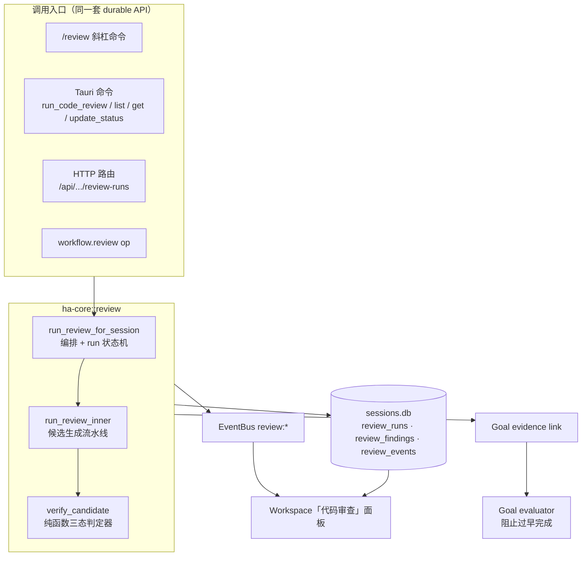
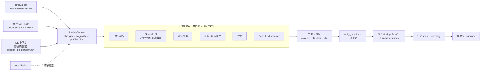
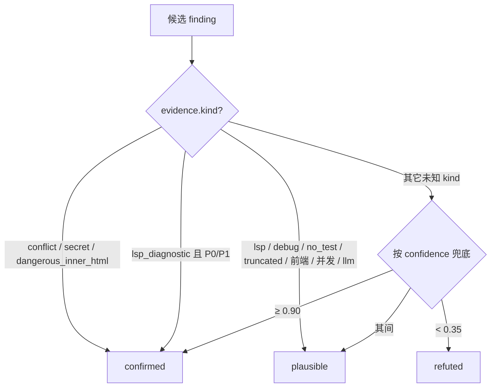
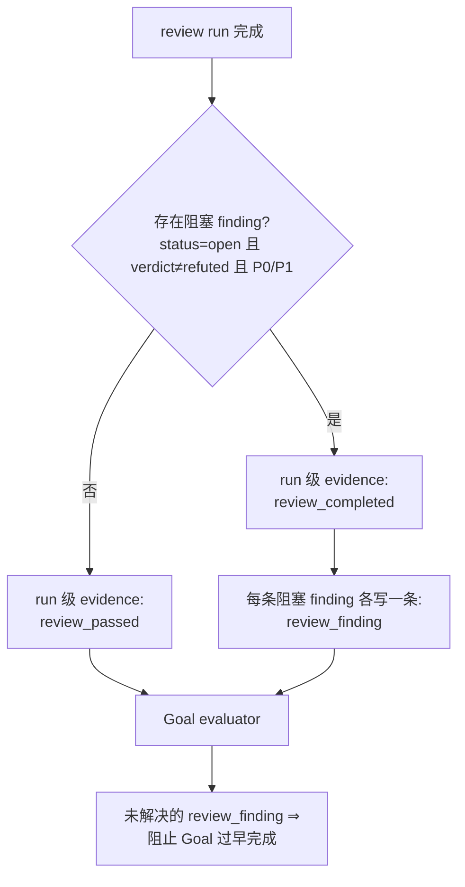

# Review Engine 控制平面

> 返回 [文档索引](../../README.md)

## 核心思想

“帮我看看还没提交的改动有没有问题”本来只是一句普通提示词——模型读一遍 diff，随口说几句，说完就散。Review Engine 把这件事升级成一个**控制平面对象**：每次审查都是一次可持久化、可恢复、可交互、可被 Goal 引用的 `review run`，它读取当前会话工作目录的 git working-tree diff，叠加语言服务器（LSP）诊断与可选的 IDE 上下文，逐条把候选问题收口成稳定的三态判定，最后落库并把阻塞级问题写回 Goal 证据。

三个关键取舍支撑了整套设计：

- **确定性优先，模型是增益而非依赖。** 主干是一套纯规则的确定性审查器（冲突标记、疑似密钥、调试残留、缺测试、前端/可访问性/并发风险……）。只有当用户显式打开 `deep` profile 时才追加一次受限的 LLM 审查；即便这次 LLM 调用超时、不可用或返回坏数据，run 也照常完成，只在 `stats.warnings` / `stats.llmReviewer` 里说明降级。GUI 与 Goal 证据永远不必等模型。
- **判定与生成分离。** “发现候选”和“判断候选可信度”是两个阶段。判定器 `verify_candidate()` 是一个**纯函数**——它不再问一遍模型“你确定吗”，而是按证据类型把候选映射成 `confirmed` / `plausible` / `refuted`。这让判定可复现、可测试，也让统计口径稳定。
- **审查结果是给人处理的证据，不是自动动作。** Review Engine 只读文件、diff 与诊断，从不执行项目代码、从不改代码、从不自动提交。P0/P1 的未解决问题会阻止 Goal 过早完成，但“修不修、怎么修”始终由用户或后续 agent/workflow 决定。

**关联源码**

- 引擎核心：[`crates/ha-core/src/review.rs`](../../../crates/ha-core/src/review.rs)（数据模型、流水线、判定器、Goal 联动、EventBus）
- HTTP 路由：[`crates/ha-server/src/routes/review.rs`](../../../crates/ha-server/src/routes/review.rs)
- Tauri 命令：[`src-tauri/src/commands/review.rs`](../../../src-tauri/src/commands/review.rs)
- 斜杠命令：[`crates/ha-core/src/slash_commands/handlers/review.rs`](../../../crates/ha-core/src/slash_commands/handlers/review.rs)
- Workspace 面板：[`src/components/chat/workspace/WorkspacePanel.tsx`](../../../src/components/chat/workspace/WorkspacePanel.tsx) + [`useReviewRuns.ts`](../../../src/components/chat/workspace/useReviewRuns.ts)
- 相邻子系统：[goal](goal.md) · [workflow](workflow.md) · [lsp](lsp.md) · [session](../core/session.md) · [automation-model](../core/automation-model.md) · [coding-improvement-loop](coding-improvement-loop.md)

## 边界与范围

只覆盖一件事：**当前会话工作目录里未提交（`scope=local`）的 working-tree 改动的本地审查**。刻意留在范围外的能力：

- **不做远程 PR 审查**。`baseRef` 是为将来的 branch/range 审查预留的字段；当前只要传入非空 `baseRef` 就直接报错，避免这个字段被误当成“已经生效”。
- **不自动改代码、不自动提交**。修复走普通 agent / workflow。
- **不假装是完整的安全扫描器**。密钥检测等规则是启发式提醒，不是合规扫描。
- **无痕会话不落库**。incognito session 创建 durable review run 会被拒绝。

## 架构与数据流

四类入口最终都汇入同一个引擎函数 `run_review_for_session`，它是编排者与状态机；候选生成的重活在 `run_review_inner`；持久化、Goal 联动、事件广播都发生在同一条链路上。

## 数据模型

三张表都落在 `sessions.db`，生命周期跟随 session：删除 session 会级联删除它名下所有 review run / finding / event（外键 `ON DELETE CASCADE`）；run 关联的 goal 被删只会把 `goal_id` 置空（`ON DELETE SET NULL`）。

| 表 | 主键 | 关键列 | 说明 |
| --- | --- | --- | --- |
| `review_runs` | `rev_<uuid>` | `session_id` · `scope`（恒 `local`）· `state` · `base_ref` · `goal_id` · `summary` · `stats_json` · `error` · 时间戳 | 一次审查的头对象。`stats_json` 汇总文件数 / findings 数 / P0–P3 / 三态计数 / active profiles / IDE 与 LLM 信号 / warnings。 |
| `review_findings` | `revf_<uuid>` | `run_id` · `session_id` · `file_path` · `start_line`/`end_line` · `title`/`body` · `category` · `severity` · `verdict` · `status` · `evidence_json` · 时间戳 · `resolved_at` | 单条问题。`evidence_json` 带来源专属证据 + 判定器结果 + confidence，可选带 `symbolContext` / `ideContext`。 |
| `review_events` | 自增 id | `run_id` · `seq`（每 run 单调递增）· `kind` · `payload_json` | 审计流水。`kind` ∈ `review_started` / `review_completed` / `review_failed` / `finding_created` / `finding_status_changed`；`payload_json` 超过 64 KiB 会被替换成一个带 `truncated` 标记的截断预览。 |

**枚举取值**

- `state`：`running` / `completed` / `failed`；`cancelled` 是保留态，引擎没有取消路径，run 只会从 `running` 走到 `completed` 或 `failed`
- `severity`：`p0` / `p1` / `p2` / `p3`，其中 P0/P1 为**阻塞级**（`is_blocking()`）
- `verdict`：`confirmed` / `plausible` / `refuted`
- `status`：`open` / `resolved` / `dismissed` / `false_positive`

**每次 run 最多持久化 100 条 finding。** 候选被排序后截断，`stats.findings` 与实际落库条数一致，`stats.candidateTotal` / `stats.truncatedFindings` 记录被上限裁掉的数量，摘要也会点明“还有 N 条候选因上限被略去”。

## 审查流水线

`run_review_inner` 按固定次序把三路输入合成一个 `ReviewContext`，再让各候选生成器按 profile 开关取用它：

几处不看代码不容易察觉的行为：

- **diff 来源固定复用 `session::load_session_git_diff`。** 因此 HTTP 客户端永远传不进任意路径——审查只在会话工作目录的 workspace scope 内进行，`focusPaths` 也只能收窄这份 diff，不能扩到 workspace 之外。
- **改动行的定位基于逐行 diff。** 新建文件视为“整篇都是改动行”，编辑文件用行级 diff 标出插入行，删除文件没有改动行。LSP 诊断只有落在改动行上（或落在新建文件里）才会被采纳。
- **`focusPaths` 是 local scope 的可选收窄条件。** 后端先读取完整的会话 diff 与 LSP 诊断，再只保留匹配路径的 changed files 与 diagnostics，`stats.focused=true` 与 `stats.focusPaths` 记录这次收窄。
- **profile 是“替换”不是“叠加”。** 请求为空时才用默认集 `correctness` / `security` / `maintainability` / `tests`；一旦显式传入任何 profile，激活集就完全等于传入项——例如只传 `["deep"]` 会得到**仅 deep**，不再附带默认的正确性/安全等规则。特殊值 `all` 展开为全部 8 个 profile。未知 profile 不会让 run 失败，只写入 `stats.unknownProfiles` 与一条 warning。Workspace 面板永远发送完整的显式勾选集，所以从 GUI 看不到这个差异；通过 API / 斜杠命令直接传单个 profile 时要留意。
- **`workspace_root` 由 `git rev-parse --show-toplevel`（隔离过仓库环境）现算**，用于给证据补全仓库根路径。
- **IDE 上下文优雅降级。** 优先用 owner API 内联传入的 `ideContext`，否则回退到 `session_ide_context` 表里的最近快照，都没有就跳过，不报错。

## Candidate 来源

候选按 profile 开关组合。除“截断 diff”提醒外，其余规则都受对应 profile 门控；前端/可访问性规则只扫描前端语言（`tsx`/`jsx`/`typescriptreact`/`javascriptreact`/`html`/`vue`/`svelte`），并发规则只扫描 Rust。

| 来源（evidence kind） | profile | 命中条件 | severity | 初始 verdict | confidence |
| --- | --- | --- | --- | --- | --- |
| `lsp_diagnostic` | `correctness` | LSP 诊断落在改动行（新建文件全部行） | error→P1 / warning→P2 / 其余→P3 | error(P1) → confirmed；其余 → plausible | 0.95 / 0.78 / 0.62 |
| `conflict_marker` | `correctness` | 改动行以 `<<<<<<< ` / `=======` / `>>>>>>> ` 开头 | P1 | confirmed | 0.99 |
| `secret_pattern` | `security` | 改动行疑似私钥、`sk-` 开头 API key、`AKIA` AWS key | P1 | confirmed | 0.86 |
| `debug_statement` | `maintainability` | 非测试文件改动行新增 `console.log`/`console.debug`/`debugger`（JS/TS）、`dbg!`/`println!`（Rust）、`print(`（Python） | P2 | plausible | 0.68 |
| `no_test_change` | `tests` | 有源码改动但整个 diff 无 test/spec 文件（每 run 至多 8 条） | P3 | plausible | 0.57 |
| `image_without_alt` | `accessibility` | ``/`<image>` 元素无 `alt=` | P2 | plausible | 0.74 |
| `clickable_non_button` | `accessibility` | `
`/`` 带 `onclick` 但无 `onkeydown`/`onkeyup`/`role` | P2 | plausible | 0.63 |
| `dangerous_inner_html` | `frontend` | 改动行含 `dangerouslySetInnerHTML` | P1 | confirmed | 0.81 |
| `event_listener_without_cleanup` | `frontend` | 改动行含 `addEventListener(`，但整文件无 `removeEventListener(` | P2 | plausible | 0.58 |
| `blocking_sleep_async` | `concurrency` | Rust 改动行含 `std::thread::sleep`，且上文 25 行内出现 async 上下文 | P2 | plausible | 0.76 |
| `sync_lock_unwrap_async` | `concurrency` | Rust 改动行含 `.lock().unwrap()`，且上文 25 行内出现 async 上下文 | P2 | plausible | 0.61 |
| `llm_reviewer` | `deep` | 受限 side-query 返回 JSON findings（至多 12 条） | 模型给定，默认 P2 | plausible | 模型给定，默认 0.66 |
| `truncated_diff` | 恒开（不受 profile 门控） | 文件 diff 超出 inline review 上限，只能用文件级元数据 | P3 | plausible | 0.55 |

默认四个 profile（正确性 / 安全 / 维护性 / 测试）让 `/review` 保持低噪音；`frontend` / `accessibility` / `concurrency` / `deep` 是用户在 Workspace 或 API 里显式打开时才启用的领域规则。确定性规则最高只到 P1，P0 实际上只可能来自 Deep reviewer 返回的 `p0`/`critical`。

## 三态判定器

候选生成后去重（键为 `file:startLine:category:severity:title`）、按 severity→file→line→title 排序，再逐条过判定器。判定器是纯函数，按证据类型收口：

判定结果直接决定落库时的初始 `status`：

- `confirmed` / `plausible` → `status=open`（进入用户处理队列）。
- `refuted` → `status=dismissed`（仍然落库、可追溯，但默认不打扰、不阻塞 Goal）。

判定器不做“再问一遍同一个模型自审”这种事——明确证据（冲突标记、密钥、P1 级 LSP error、`dangerouslySetInnerHTML`）直接 confirmed，需要语境判断的项 plausible，低置信的兜底 refuted。同一个纯函数既用于落库定 verdict，也用于 `stats` 计数，二者口径天然一致。

## Deep Review 降级策略

`deep` profile 触发一次受限的后台 LLM 审查，走统一的后台一次性调用入口 `automation::run`（`purpose="review.deep"`）。模型链优先取 `recap.analysis_agent` 解析出的旧链，它未配置、或其中的 provider 都不可用时才回退到 `function_models.automation`，最后再回退到主对话的 `active_model` / `fallback_models`。

- **喂给模型的输入**：active deterministic profiles 列表、序列化后的 IDE 上下文，以及逐个改动文件的变更行片段（每文件至多 40 行、每行截断到 240 字符）。**不含** LSP 诊断摘要，也不回喂已有的确定性候选。
- **输出**必须是一个 JSON 对象 `{"findings":[…]}`，至多纳入 12 条；每条 finding 必须能匹配到本次 diff 中的某个改动文件，否则丢弃。severity 缺省 P2、category 缺省 `correctness`、confidence 缺省 0.66。
- **护栏**：超时 20 秒，最大输出 2048 tokens。解析失败、模型不可用、超时或任何错误都**不会**让 run 失败——`stats.llmReviewer="failed"`，原因进 `stats.warnings`。
- LLM 产出的只是 candidate finding，仍要走同一条本地链路：去重 → 判定器 → 落库 → Goal 证据。它不享有任何特权，`llm_reviewer` 类候选一律判为 plausible。

## Symbol 与 IDE 证据

每条 finding 的 `evidence` 可以附带两类解释性上下文，用于展示与排序，**不是安全边界**——真正的读写权限始终来自会话 workspace、review scope 与工具权限系统。

- **`symbolContext`**：从改动行向上（至多回看 80 行）找最近的 enclosing 语义边界——Rust 的 `fn`/`struct`/`enum`/`impl`、TS/JS 的 `function`/`class`/箭头函数常量、Python 的 `def`/`class`——记录符号名、种类与起始行。它把“第 137 行有问题”变成“函数 `foo` 里有问题”，降低大文件里的定位噪音。
- **`ideContext`**：把 finding 与 IDE/ACP 当前状态对齐，命中哪些信号就记哪些——`current_file`（当前文件）、`selection`（选区，带 ±3 行邻近匹配）、`active_diagnostic`（活跃诊断）、`active_symbol`（活跃符号）、`open_tab`（打开的标签页）。`stats` 里会汇总带 symbol / IDE 上下文的 finding 数量。

## Goal Evidence

run 创建时绑定当前 open goal（或显式 `goalId`，需与会话匹配）。完成后按是否存在阻塞问题写两级证据：

finding 状态变更时，对应的 Goal link metadata 会刷新 `status`，并重算 run 级的 `review_passed` / `review_completed`。Goal evaluator 侧的判定与引擎侧一致：P0/P1（或 `critical`/`high`）的 `review_finding`，只要 `verdict≠refuted` 且状态不在 `resolved`/`closed`/`fixed`/`dismissed`/`false_positive` 之列，就视为 blocker。因此用户把问题标为已修复 / 忽略 / 误报，即可解除阻塞。

## Slash 命令

斜杠命令的输出是普通 Markdown（GUI 用 owner API 展示结构化卡片）。finding / run 可用完整 id 或短前缀定位，前缀不唯一时报错要求补全。

| 命令 | 别名 | 行为 |
| --- | --- | --- |
| `/review` | `/review run` | 运行 local review，返回摘要与 open findings |
| `/review status [id]` | `show` / `list` | 无 id 列出最近 runs；带 id 展示该 run 的 findings |
| `/review resolved <finding>` | `resolve` / `fixed` | 标记已修复 |
| `/review dismissed <finding>` | `dismiss` | 标记已忽略 |
| `/review false_positive <finding>` | `false-positive` / `fp` | 标记为误报 |
| `/review open <finding>` | `reopen` | 重新打开 |

## Owner API

面向用户本人的控制面，桌面走 Tauri、HTTP 走 axum，两套一一对应。HTTP 路径只按 session id 解析 workspace，不接受任意路径。

| 能力 | Tauri 命令 | HTTP 端点 |
| --- | --- | --- |
| 列出会话的 review runs | `list_review_runs` | `GET /api/sessions/{sid}/review-runs` |
| 触发一次 review | `run_code_review` | `POST /api/sessions/{sid}/review-runs` |
| 取某 run 的完整快照（run + findings + events） | `get_review_run` | `GET /api/review-runs/{id}` |
| 更新 finding 状态 | `update_review_finding_status` | `POST /api/review-findings/{id}/status` |

请求体字段（`RunReviewInput`）：`scope`（默认 `local`）、`baseRef`（当前非空即拒）、`goalId`、`profiles[]`、`focusPaths[]`、`ideContext`。Tauri / HTTP 命令增删须同步 [api-reference](../system/api-reference.md)。

## GUI

Workspace 面板的「代码审查」区块展示最新 review run，内容包括：

- run 摘要与短 id、P0/P1/P2/P3 计数、open findings 数与阻塞状态 pill。
- Profile 多选（Correctness / Security / Maintainability / Tests / Concurrency / Frontend / A11y / Deep），初始勾选默认四项。
- run card 上的 active profiles、IDE 上下文是否参与、Deep reviewer 状态、以及 unknown profile / LLM 降级等非阻断 warning。
- 至多 6 条 open findings（severity / verdict / category / 文件位置 / 正文）。
- 操作：重新审查、刷新、标记已修复 / 忽略 / 误报。
- “推荐上下文”候选行可触发 focused review，生成的 run 仍进入本区块并写入同一套 events / Goal 证据。

刷新时机：首次打开；当前 turn 从 active 变 idle；收到 EventBus `review:created` / `review:updated` / `review:finding_updated` / `review:event` / `_lagged`（去抖）；存在 active run 时低频轮询。incognito 会话下整块能力关闭。

## EventBus

| 事件 | Payload |
| --- | --- |
| `review:created` | `ReviewRun` |
| `review:updated` | `ReviewRun` |
| `review:finding_updated` | `ReviewFinding` |
| `review:event` | `ReviewEvent` |

事件只作为刷新信号——完整快照始终从 owner API 拉取，这样即使丢事件，UI 状态也不会残缺。

## 安全与隐私

- **无痕不落库**：incognito session 拒绝创建 durable review run。
- **无任意路径**：HTTP 路径只按 session id 解析 workspace，`focusPaths` 也只能收窄这份 diff。
- **只读不执行**：只读文件 / diff / LSP 诊断，从不运行项目代码。
- **密钥脱敏**：疑似密钥行进 DB 前会把字母数字字符替换成 `*`，只留结构预览，不写完整 token。
- **人工闭环**：finding 是用户可处理的证据，引擎不自动改代码、不自动提交。

## Workflow 集成与后续

审查已作为一个 workflow op 接入：

- `workflow.review({ focusPaths?, baseRef?, profiles?, ideContext? })` 复用同一套 durable review API，默认审查 local diff，并自动继承当前 workflow run 的 `goal_id`。
- 它在 workflow runtime 中是 **idempotent op**——重放时直接复用已完成的 review 输出，不重复创建 finding。

已在演进方向：

- **判定器增强**：独立 verifier agent 做三态确认，带证据引用与反证。
- **Inline comment 交接**：把可定位评论导出到 PR / 代码编辑器侧。
- **Re-review**：finding 标为已修复后，对相关 hunk 复用 `focusPaths` 自动做一次 focused review。
- **趋势报表**：review runs、blocking findings、误报状态与 finding category 已汇入 [Coding Improvement Loop](coding-improvement-loop.md)；profile 命中率、LLM 降级率等更细的趋势仍可后续扩展。
