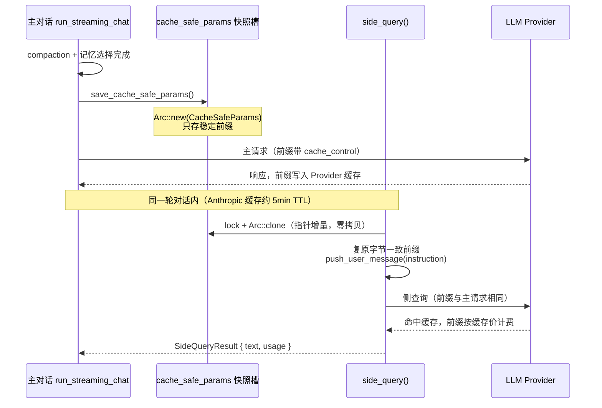
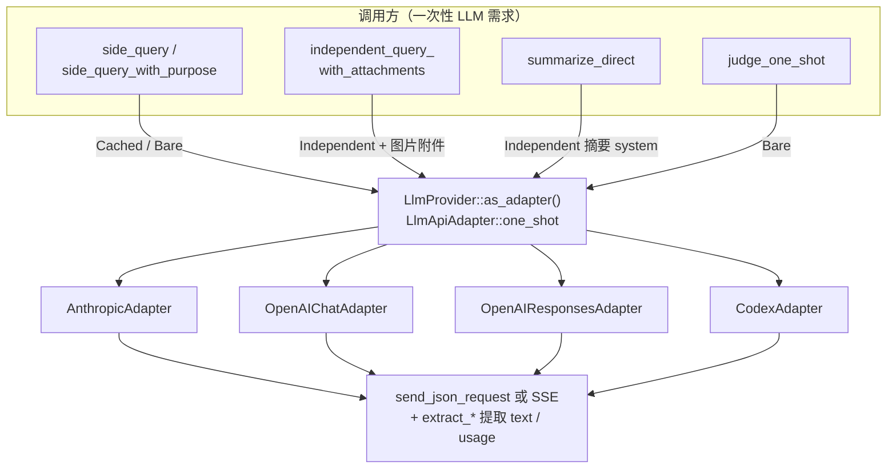
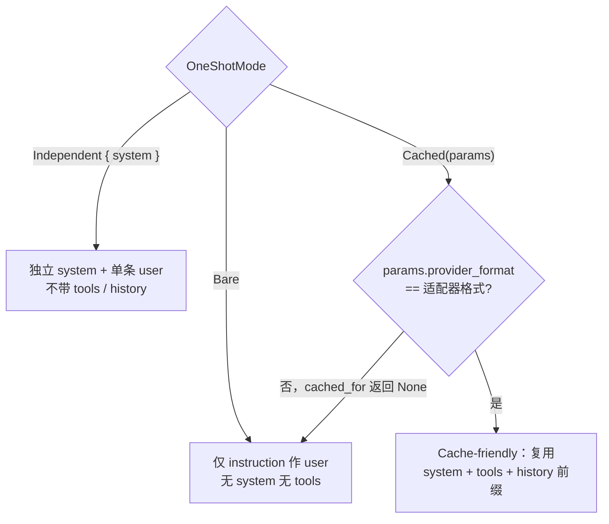
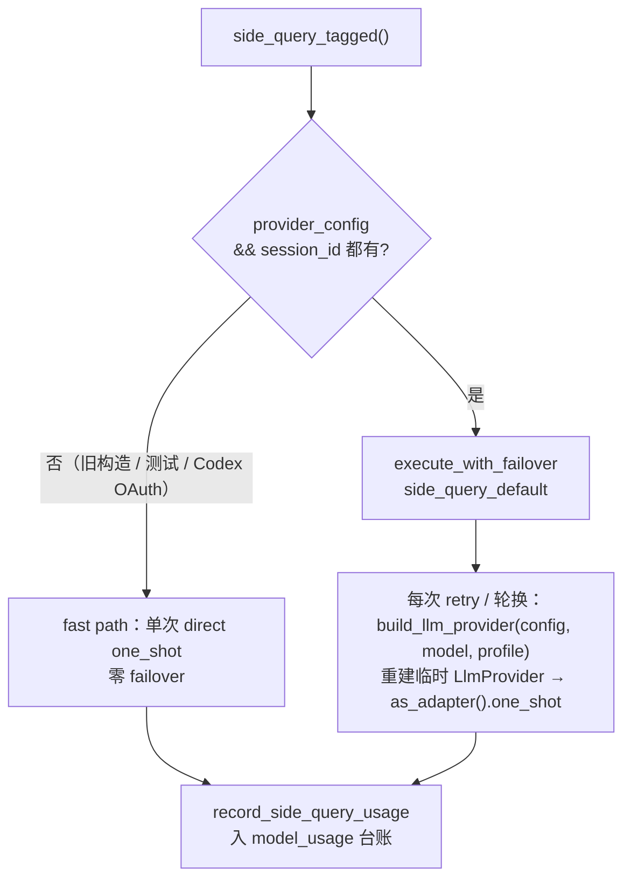

# Side Query：复用主对话前缀的一次性 LLM 调用

> 返回 [文档索引](../../README.md) | 更新时间：2026-07-23
>
> 关联源码：[`agent/side_query.rs`](../../../crates/ha-core/src/agent/side_query.rs)（快照 + 入口）、[`agent/llm_adapter.rs`](../../../crates/ha-core/src/agent/llm_adapter.rs)（统一 one-shot 适配器）、[`agent/context.rs`](../../../crates/ha-core/src/agent/context.rs)（`summarize_direct` + `DedicatedModelProvider`）、[`agent/types.rs`](../../../crates/ha-core/src/agent/types.rs)（数据结构）、[`agent/config.rs`](../../../crates/ha-core/src/agent/config.rs)（URL / 版本常量）、[`failover/executor.rs`](../../../crates/ha-core/src/failover/executor.rs)（退避重试与 profile 轮换）。

## 核心思想

主对话每一轮真正发给 Provider 的请求，前缀都是一大坨：**系统提示词 + 全部工具 schema + 完整对话历史**，动辄几万 token。而后台有大量"顺带问一句"的短请求——生成标题、提取记忆、挑选相关记忆、写摘要、召回增强——它们本质上是站在同一段对话上下文里再问一个小问题。

如果这些后台请求各自从零发送，就要为那几万 token 的上下文重复付全价。Side Query 的关键想法是：**让后台请求复用主对话刚刚发过的那段前缀，从而命中 Provider 的 prompt cache**。前缀命中缓存后，输入侧成本降到约十分之一，而后台请求要携带的"新内容"只有一句 instruction。

要吃到缓存，只有一个硬约束：**侧查询构造的前缀必须与主请求逐字节一致**。Provider 的缓存是按前缀字节匹配的——Anthropic 靠显式 `cache_control` 标记的 block，OpenAI 系靠自动前缀匹配。差一个字节，缓存就重建，优化归零。整个子系统的设计，都是围绕"如何稳定地复刻那段字节一致的前缀"展开的。



## 快照：CacheSafeParams

主对话把"下一次请求会发送的前缀"拍成一张快照存起来，侧查询直接取用。

```rust
struct CacheSafeParams {
    system_prompt: String,                       // 主对话完整系统提示词
    tool_schemas: Vec<serde_json::Value>,        // 工具 schema 列表（Provider 原生格式）
    conversation_history: Vec<serde_json::Value>, // 对话历史（Provider 原生格式）
    provider_format: ProviderFormat,             // 快照生成时的 Provider 格式
}
```

`ProviderFormat` 是四态枚举，由 `LlmProvider` 变体推断（`ProviderFormat::from(&provider)`）：`Anthropic` / `OpenAIChat` / `OpenAIResponses` / `Codex`。快照里带着它，是为了让侧查询能校验"当前 Provider 是否和拍快照时同一格式"——不同格式的前缀字节结构完全不同，跨格式复用只会缓存未命中。

### 存放在哪、何时写

- 存放在 `AssistantAgent.cache_safe_params: Mutex<Option<Arc<CacheSafeParams>>>`。用 `Arc` 是为了让侧查询取快照时只做**指针增量**（`Arc::clone`），不深拷贝几万 token 的历史。
- 写入点唯一收口在 `save_cache_safe_params()`，由主对话编排 `AssistantAgent::run_streaming_chat` 在 **compaction 与记忆选择完成之后、工具循环第一轮发出之前**统一调用，四个 Provider 共用同一写入点。工具循环中途若发生二次压缩，`maybe_compact_between_tool_rounds` 会重新拍一张快照，保证快照始终等于"下一次 API 请求真正会发的内容"。

### 快照只存"稳定前缀"——这是不变量的关键

`save_cache_safe_params` 刻意**只捕获缓存安全的稳定前缀**，两类每轮都会变的内容被排除在外：

- **Awareness / active-memory 后缀**：这些是每次请求现拼上去的 user-data（四个主对话 adapter 都放在 history 之后的 `<hope_round_data>` 中且不加显式 cache marker）。若把它们塞进稳定快照，快照就会每个用户回合都变，反而毁掉"稳定前缀"这个不变量。
- **round 分组元数据**：写入前用 `round_grouping::strip_rounds` 剥掉 `_oc_round` 之类的内部标记，因为主请求发出前也会统一剥离，快照必须与之对齐。

还有一个不显然的坑：**纯文本 OpenAIChat 后端的图片折叠**。当模型不支持视觉时，主对话会把历史里的图片内容折叠成文本再发送；快照必须用同样的方式折叠（`expand_openai_chat_image_markers_for_api`），否则一个"缓存友好"的侧查询照样会 POST `image_url`、照样吃 400，把记忆/摘要等后台特性静默打瘫。视觉模型则原样保留、不做折叠。

## 统一的一次性调用枢纽

所有"发一发就完、不跑工具循环、不做压缩"的一次性 LLM 调用，都收敛到同一套适配器 [`agent/llm_adapter.rs`](../../../crates/ha-core/src/agent/llm_adapter.rs) 上。调用方只负责"取快照 / 定 system + 建 client + 选 mode"，Provider 特异性全在 `LlmApiAdapter` trait 的实现里。

三种互斥的调用形状由 `OneShotMode` 建模，用枚举而非布尔标志，就是为了让调用方无法把"复用缓存前缀"和"独立 system"这类矛盾组合误配到一起：

| Mode | 请求形状 | 谁用 |
|------|---------|------|
| `Cached(&CacheSafeParams)` | 复用 `system + tools + history` 前缀，追加 instruction；格式不匹配则自动退化为 Bare | `side_query`（有主对话上下文时） |
| `Independent { system }` | 全新请求：给定 system + 单条 user message，不带 tools / history | `summarize_direct`、带附件的独立查询 |
| `Bare` | 仅 instruction 作 user message，无 system、无 tools | 无快照回退、`judge_one_shot` |



`OneShotRequest` 是喂给适配器的统一入参，四个字段：`instruction`（那句要问的话）、`max_tokens`、`mode`（上面三态之一）、`user_content`（可选，携带图片附件时用来替换默认的纯文本 user content）。

每个适配器把请求体构造成纯函数（`build_anthropic_body` / `build_openai_chat_body` / `build_responses_body`）。这些纯函数是**唯一**能防住字节级前缀回归的防线：一旦某个 JSON 键的插入顺序变了，Anthropic 的 `cache_control` 就会错位、OpenAI 的前缀缓存就会从头重建——所以它们各自都有独立单测锁死输出形状。

### mode → 请求体形状



`OneShotMode::cached_for(format)` 是这里的裁决点：只有 `Cached` 且快照格式与当前适配器格式一致时才返回前缀，否则返回 `None`，请求体构造器退回 Bare 形状。这保证了"换 Provider 后拿旧格式快照"这种情况能安全降级，而不是发出一个畸形请求。

### 关键约束

- **非流式**：`one_shot` 走同步 JSON 请求（Codex 除外，见下），不做流式输出。（存在一个流式孪生方法 `one_shot_stream`，同样的请求体 / 前缀 / SSE 机制，只是把每个 text delta 转发给回调——仅设计空间的实时预览用，侧查询路径不碰它。）
- **单轮**：不执行工具循环、不做压缩。
- **前缀一致**：即便侧查询根本不会执行工具，`tool_schemas` 也必须原样带上——因为主请求永远带着工具，缺了就不再是字节一致的前缀。
- **连续消息合并**：追加 instruction 走 `push_user_message()`，自动合并相邻的 user 消息，兼容 Anthropic 对 user/assistant 角色交替的要求。

## Provider 适配

四个适配器都讲各自 Provider 的方言，但目标一致：复原字节一致前缀 + 正确解析 text / usage。

### Anthropic

| 环节 | 实现 |
|------|------|
| 缓存机制 | 显式 `cache_control: { type: "ephemeral" }`（约 5min TTL） |
| system | `system` 为数组，含一个 text block，附 `cache_control` |
| tools | 克隆 `tool_schemas`，给**最后一个** tool 附 `cache_control`（缓存断点） |
| messages | 复用 `conversation_history` + `push_user_message(instruction)` |
| API URL | `build_api_url(base_url, "/v1/messages")` |
| 请求头 | `x-api-key` + `anthropic-version`（`ANTHROPIC_API_VERSION`） |
| 文本提取 | `content[]` 中第一个 `type=="text"` block 的 `text` |
| usage | `input_tokens` / `output_tokens` / `cache_creation_input_tokens` / `cache_read_input_tokens` |

### OpenAI Chat Completions

| 环节 | 实现 |
|------|------|
| 缓存机制 | 自动前缀缓存（无需显式标记，Provider 自动匹配相同前缀） |
| system | `messages[0]` 的 `{ role: "system", content }` |
| tools | 每个 schema 包裹为 `{ type: "function", function: schema }` |
| messages | system + history + `{ role: "user", content: instruction }` |
| API URL | `build_api_url(base_url, "/v1/chat/completions")` |
| 请求头 | `Authorization: Bearer {api_key}` |
| 文本提取 | `choices[0].message.content` |
| usage | `prompt_tokens` / `completion_tokens` / `prompt_tokens_details.cached_tokens` |

### OpenAI Responses / Codex（共享 `build_responses_body()`）

两者说同一套 Responses 协议，请求体**只在两处**分叉：

| 环节 | OpenAI Responses | Codex |
|------|-----------------|-------|
| API URL | `build_api_url(base_url, "/v1/responses")` | `CODEX_API_URL`（`chatgpt.com/backend-api/codex/responses`，与主对话同路径） |
| 认证 | `Authorization: Bearer {api_key}` | OAuth 头 `apply_codex_headers`：`Authorization: Bearer {access_token}` + `chatgpt-account-id` |
| system | `instructions` 字段 | 同左 |
| input | 复用 `conversation_history` + `push_user_message(instruction)` | 同左 |
| tools | 直接传 `tool_schemas` | 同左 |
| `stream` | `false` | `true`（Codex 后端拒绝 `false`，故内部走 SSE 再丢弃 delta） |
| `max_output_tokens` | 传 | **不传**（Codex 拒绝该字段） |
| 文本提取 | `output[]` 中 `type=="message"` → `content[]` 中 `output_text` → `text` 拼接 | 同左 |
| usage | `input_tokens` / `output_tokens` + `prompt_tokens_details.cached_tokens` | 同左 |

一个不显然的行为：Responses 请求在归一化历史时会**丢弃所有 reasoning 项**（`normalize_history_for_responses`）。因为侧查询发的是 `store: false`，服务端会按 id 反查任何被回放的 reasoning 项，而这些 id 是悬空引用（连带 `encrypted_content` 的项也会先按 id 查），一旦命中就 404。所以缓存体必须把 reasoning 项全部剔掉，而不是只剔掉缺 `encrypted_content` 的那些。

## reasoning effort 策略

Responses / Codex 方言的侧查询请求体**强制** `reasoning: { effort: "low" }`（在 `build_responses_body` 里写死），而非继承主对话配置、也非省略。理由：

- 侧查询是后台增强——召回短名单选择、标题生成、记忆提取、摘要——目标是**快**，不是深推理；
- 不传该字段会回落到账号/模型默认 effort（reasoning 模型常是 `medium`），首 token 动辄数秒起，会击穿这些路径的秒级超时（active_memory 的数秒级、标题生成的 10s 级），任务还没出结果就被超时砍掉；
- 主对话路径不受影响，继续按用户配置的 effort 走。

若将来某个侧查询调用方确实需要更高 effort（例如想给 reasoning 模型更多思考时间），应给 `OneShotRequest` 扩展一个可选 effort 字段，而不是退回"不传"。

## Failover：退避重试与 profile 轮换

侧查询也接入了统一的 [`failover::execute_with_failover`](../../../crates/ha-core/src/failover/executor.rs)，从而在单 key 限流时能轮换到下一个 auth profile、在瞬时错误时做有限退避重试。

`AssistantAgent` 经 builder `with_failover_context(&ProviderConfig)` 注入源 ProviderConfig 后，`side_query()` 会在 `provider_config` 与 `session_id` **都齐备**时走 failover 路径，套用 `FailoverPolicy::side_query_default`（`max_retries=1` + 允许 profile 轮换）——低频后台路径可以接受换 key，但不该为它扛多秒退避。



每次 retry / 轮换，闭包拿到 `Option<&AuthProfile>` 后用 `build_llm_provider(config, model_id, profile)`（profile 是第三个参数）重建一个临时 `LlmProvider`（owned api_key + base_url），再 `as_adapter().one_shot(...)`。快照只在外层 lock 一次并 clone `Arc`，闭包里每次 `Arc::clone` 仍是指针增量，不深拷贝。**profile 轮换不破坏前缀缓存的语义**：换到下一个 key 后，新请求按各 Provider 的 prompt-cache 规则重新走（Anthropic 重新创建缓存、OpenAI 重新前缀匹配）——这是底层语义，无从绕过。

其余策略要点：

- **未注入 `provider_config` 的旧构造路径**（`new_anthropic` 测试路径、`new_openai` Codex OAuth 回退）走 fast path：单次 direct one-shot，无 failover——不轮换 profile、不重试。
- **Tier 3 专用摘要**由 `DedicatedModelProvider`（持自己的 `Arc<ProviderConfig>` + `model_id` + `session_id`）驱动，走 `FailoverPolicy::summarize_default`（`max_retries=2` + **禁止** profile 轮换）。刻意 fail-fast，好让上层在 Tier 3 真失败时迅速降级到 side_query / emergency_compact，而不是在用户等回复时耗时间换 profile。
- **`ContextOverflow` 不触发 emergency_compact**：侧查询 / 摘要路径没有主对话上下文可压缩，直接以 error 形式返回，让 caller 决定降级策略。
- **Codex 纵深防御**：`api_type == Codex` 时强制 `allow_profile_rotation=false`，即便 caller 传 `true` 也无效（Codex 的 `effective_profiles()` 恒空，轮换本就会立刻 bail）。与主对话 chat_engine 路径一致。

## 退化与容错

侧查询是"锦上添花"，任何一环失败都不该拖垮主对话，因此每条降级路径都保功能、只丢优化。

| 条件 | 行为 | 影响 |
|------|------|------|
| 快照为 `None`（旧会话 / 首轮前） | 走 Bare：仅 instruction 作 user message | 功能正常，无成本优化 |
| `provider_format` 不匹配 | `cached_for(format)` 返回 `None`，回退 Bare | 功能正常，无成本优化 |
| Anthropic 缓存过期（超 TTL） | 请求正常但无 cache hit | 按全价计费，功能不受影响 |
| API 请求失败（非 2xx） | 返回 `Err`，并记一条失败台账 | caller 处理，通常降级为不使用侧查询结果 |
| 无 `provider_config` / `session_id` | 走 direct fast path，无 failover | 功能等价，仅少了轮换/重试 |

无论成功失败，`side_query_tagged` 都会经 `record_side_query_usage` 往用量台账（`model_usage`，KIND 为 `KIND_SIDE_QUERY`）写一行，带 `operation` 标签、`path`（`direct` / `failover`）、token 明细与耗时。这样后台成本在 Dashboard 里可见、可归因，而不是消失在主对话账单里。

## 成本模型

以 Anthropic 为例，缓存把输入侧切成三档价格：

| Token 类型 | 价格倍率 | 侧查询里的角色 |
|-----------|---------|---------------|
| 常规 input | 1x | 仅 instruction 部分按此计费 |
| cache 写入 | 1.25x | 由主请求一次性承担 |
| cache 读取 | 0.1x | 侧查询前缀命中此价 |

以约 50K token 上下文 + 500 token instruction 估算，单次侧查询的输入成本大致能压到无缓存的十分之一量级——上下文越长，省得越多。OpenAI 系则对相同前缀自动缓存、cached tokens 按折扣计费，侧查询前缀部分自动命中，instruction 部分按原价。（具体倍率随 Provider 定价变动，此处仅示意量级。）

## 使用场景

侧查询已经是"一次性 LLM 调用"的统一枢纽，主要消费方：

| 场景 | 入口 | 说明 |
|------|------|------|
| Tier 3 上下文摘要 | `context.rs` + `context_compact/` | 历史超长时生成 continuation handoff 摘要替代旧消息；专用模型走 `DedicatedModelProvider`，回退走 `side_query` / `summarize_direct` |
| 自动记忆提取 | `memory_extract.rs` | 每轮结束后按阈值后台提取用户偏好 / 事实入库 |
| 记忆语义选择 | `agent/mod.rs` + `memory/selection.rs` | 候选记忆数超过 `threshold`（默认 8）时，LLM 从候选中挑最相关的 `max_selected`（默认 5）条 |
| Active / Deep 记忆召回 | `agent/mod.rs` | 有界超时内让模型从候选里挑要注入的记忆 |
| Awareness 抽取 | `agent/mod.rs` | 经 `side_query_with_purpose("awareness.extraction", …)` |
| 标题生成 / Recap / Dreaming / 知识编译等 | `automation::run`（内部走 `side_query_with_purpose`） | 用 `purpose` 给台账 `operation` 分列，避免堆成一坨无差别记录 |
| 知识源 OCR | `independent_query_with_attachments`（`OneShotMode::Independent` + 图片附件，记 `KIND_SIDE_QUERY`） | 无历史、无工具、无缓存前缀；system 提示把图内文本当不可信素材而非指令 |
| 视觉桥 | `transcribe_images_for_vision_bridge`（与 OCR 共用底层 `run_one_shot_with_attachments`，记 `KIND_VISION`、在超时点内落台账） | 同上：无历史、无工具、无缓存前缀 |
| 权限 judge | `judge_one_shot`（`OneShotMode::Bare`，无 `AssistantAgent` 实例） | 独立裁判模型查询，记 `KIND_JUDGE` |

带附件的视觉转写单独记 `KIND_VISION`（并在超时点内落台账，避免慢/挂的视觉 Provider 静默漏计）；权限 judge 记 `KIND_JUDGE`。同一套 `one_shot` 机制，台账 KIND 按调用方区分。

## 数据结构

```rust
pub struct SideQueryResult {
    pub text: String,       // LLM 响应文本
    pub usage: ChatUsage,   // Token 使用统计（含 cache hit 信息）
}
```

`ChatUsage` 是主对话工具循环也在用的累计结构，为多轮设计，字段比"一次问答"看起来需要的多。侧查询是单轮，所以 `last_*` 系列被赋成与总量相等：

```rust
pub struct ChatUsage {
    // Provider 直报的原始计数（保留用于计费兼容）
    pub input_tokens: u64,                // Anthropic 不含 cache；OpenAI 系已是完整 input
    pub output_tokens: u64,
    pub cache_creation_input_tokens: u64, // 本次写入缓存的 token（Anthropic）
    pub cache_read_input_tokens: u64,     // 命中缓存的 token（Anthropic + OpenAI）
    // 归一化计数：跨 Provider 语义一致
    pub context_input_tokens: u64,        // 占用上下文的输入总量
    pub fresh_input_tokens: u64,          // 未被缓存读命中的部分（缓存写入仍计入）
    // 「最近一轮」计数：多轮 UI 用；一次性调用中 == 总量
    pub last_input_tokens: u64,
    pub last_context_input_tokens: u64,
    pub last_fresh_input_tokens: u64,
    pub last_cache_creation_input_tokens: u64,
    pub last_cache_read_input_tokens: u64,
}
```

## 关键源文件

| 职责 | 路径 | 说明 |
|------|------|------|
| 快照 + 入口 | `agent/side_query.rs` | `save_cache_safe_params()` + `side_query()` 家族（薄壳，委托适配器）+ 台账记录 |
| 统一适配器 | `agent/llm_adapter.rs` | `LlmApiAdapter` trait + 4 个 Provider adapter + `OneShotMode` / `OneShotRequest` + 共享 helper（`send_json_request` / `extract_*`）；`LlmProvider::as_adapter()` 入口 |
| 摘要直连 | `agent/context.rs::summarize_direct()` | Tier 3 fallback，复用同一适配器走 `OneShotMode::Independent` |
| 专用摘要 Provider | `agent/context.rs::DedicatedModelProvider` | Tier 3 专用 provider:model，走 `FailoverPolicy::summarize_default` |
| 数据结构 | `agent/types.rs` | `CacheSafeParams` / `ProviderFormat` / `SideQueryResult` / `ChatUsage` |
| URL / 版本常量 | `agent/config.rs` | `build_api_url()` / `ANTHROPIC_API_VERSION` / `CODEX_API_URL` |
| Failover 执行器 | `failover/executor.rs` | `execute_with_failover` + `FailoverPolicy::side_query_default` / `summarize_default` |
| 上下文压缩 | `context_compact/` | 调用方：Tier 3 摘要经 side_query / summarize_direct |
| 记忆系统 | `memory/`、`memory_extract.rs` | 调用方：记忆提取 + 语义选择 |
| 用量台账 | `model_usage.rs` | `KIND_SIDE_QUERY` / `KIND_VISION` / `KIND_JUDGE` 入账 |

延伸阅读：主对话流式与工具循环见 [chat-engine](../core/chat-engine.md)、上下文压缩五层见 [context-compact](../core/context-compact.md)、退避与轮换见 [failover](failover.md)、记忆召回见 [memory](../core/memory.md)。
