# Hope Agent 技能系统架构文档

> 返回 [文档索引](../../README.md)
>
> 更新时间：2026-08-10

## 目录

- [一、这个子系统解决什么问题](#一这个子系统解决什么问题)
- [二、核心概念](#二核心概念)
- [三、SKILL.md 格式规范](#三skillmd-格式规范)
- [四、字段来源与生态可移植性](#四字段来源与生态可移植性)
- [五、技能发现与加载](#五技能发现与加载)
- [六、Requirements 环境检查](#六requirements-环境检查)
- [七、四条激活路径](#七四条激活路径)
- [八、Fork 执行：context / agent / effort](#八fork-执行context--agent--effort)
- [九、paths 条件激活](#九paths-条件激活)
- [十、Prompt 注入与预算管理](#十prompt-注入与预算管理)
- [十一、调用策略](#十一调用策略)
- [十二、自动创建与草稿审核](#十二自动创建与草稿审核)
- [十三、缓存与版本追踪](#十三缓存与版本追踪)
- [十四、命令与路由一览](#十四命令与路由一览)
- [十五、前端 UI](#十五前端-ui)
- [十六、数据流全景](#十六数据流全景)
- [十七、内置技能](#十七内置技能)
- [十八、编写第一个 Skill](#十八编写第一个-skill)
- [附录：类型定义速查](#附录类型定义速查)

---

## 一、这个子系统解决什么问题

一个足够能干的 Agent 需要成百上千条"专项知识"：怎么用 `gh` 操作 GitHub、怎么生成一份 `.docx`、怎么驱动浏览器登录页面。如果把这些指令全部塞进系统提示词，会有两个致命问题：**常驻 token 爆炸**（几十 KB 的方法论每一轮都在烧 prompt），以及**注意力稀释**（模型在一大堆无关指令里挑不出当前该用的那条）。

技能系统的核心思想是**渐进式加载**：系统提示词里只放一份"目录"——每个技能一行名称加描述，模型据此判断"这次该用哪个"，再通过一个专用的 `skill` 工具按名把完整指令拉进来。目录很便宜，完整内容只在真正需要时才付费。

围绕这个核心，系统叠了三层进一步的节流与隔离：

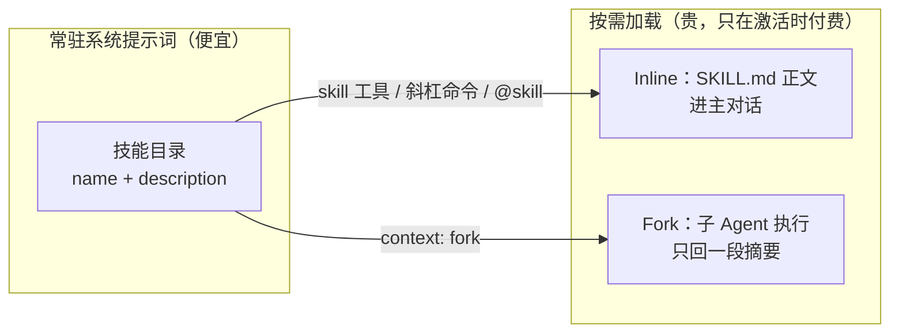

- **上下文隔离（fork）**：多轮 exec 密集的技能（反复读文件、跑命令）如果 inline 执行，会把几十条 tool_result 堆进主对话。声明 `context: fork` 的技能改在**子 Agent** 里跑，整条执行链留在子会话，主对话只收到一段摘要字符串。
- **条件激活（`paths:`）**：只在特定文件类型里有用的技能（如"Python 类型助手"只在碰 `*.py` 时需要）默认**不进目录**，直到本会话真正触碰到匹配文件才动态加入——连目录里的那一行都省了。
- **渐进降级**：当技能数量超过 token 预算时，目录格式自动从"名称+描述"降到"仅名称"，再降到"截断前 N 条"，永不让技能段撑爆 prompt。

两条工程约定贯穿始终：

- **渠道无关**：技能既能被模型调用，也能被用户当斜杠命令 `/skillname` 调用；斜杠命令通过统一的 `CommandAction` 枚举分发，桌面端、Telegram、Discord 等渠道走同一套逻辑。
- **Rust 后端驱动**：发现、检查、缓存、prompt 生成、fork 调度全在后端完成，前端只负责展示与录入。

### 分层与代码归属

技能系统横跨两个 crate，分工遵循全局的"机器进特征 crate、台账留 kernel"原则：

- **`ha-skills`** 是机器层：内置技能解包、目录扫描与 frontmatter 解析、创作写盘、安全扫描、`@skill` 提及解析、fork 派发、命令面、`skill` 工具本身。
- **`ha-core` kernel** 保留三类不可外迁的东西：wire 契约类型（`SkillEntry` / `SkillStatus` 等）、对 `sessions.db` 的 SQL 台账（`paths:` 条件激活）、纯谓词与纯渲染（requirements 检查、技能段拼装、斜杠名归一）。

两层之间只通过 `ha-core::skills_hooks` 一个回调面通信：kernel 声明九个函数槽（八个行为 + 一个装配循环），`ha-skills` 在启动装配时一次性注册整组。未装配时的语义逐槽定义——目录类返空、用户显式激活类返 `Err`。

### 系统架构总览

```mermaid
graph TB
    subgraph 用户层
        UI[SkillsPanel<br/>设置面板]
        CMD[斜杠命令菜单]
        CHAT[聊天输入 + @ 菜单]
    end

    subgraph 薄壳适配["薄壳适配（Tauri / HTTP）"]
        TAURI[src-tauri/commands/skills.rs]
        HTTP[ha-server/routes/skills.rs]
    end

    subgraph "ha-skills（机器层）"
        DISC[discovery<br/>目录扫描]
        FRONT[frontmatter<br/>解析]
        FORKH[fork_helper<br/>spawn + extract]
        AUTHOR[author<br/>写盘 + security_scan]
        MENTION[mention<br/>@skill 解析]
        REVIEW[auto_review<br/>五闸管线]
        SKTOOL[tools/skill<br/>inline / fork]
        CMDS[commands<br/>共享命令层]
    end

    subgraph "ha-core（kernel 契约 / 台账）"
        TYPES[skills/types<br/>wire 类型 + 版本计数]
        ACT[skills/activation<br/>paths 台账]
        REQ[skills/requirements<br/>纯谓词]
        PROMPT[skills/prompt<br/>技能段渲染]
        SLASH[slash_commands]
        HOOKS[skills_hooks<br/>九槽回调面]
    end

    subgraph 存储层
        CONFIG[(config.json<br/>AppConfig)]
        SESSDB[("sessions.db<br/>session_skill_activation")]
        FS[("内置 skills/<br/>~/.agents/skills/<br/>~/.hope-agent/skills/<br/>仓库祖先 .agents/skills/<br/>项目级 .hope-agent/skills/<br/>额外目录")]
    end

    UI & CMD & CHAT --> TAURI & HTTP
    TAURI & HTTP --> CMDS
    CMDS --> DISC & AUTHOR
    HOOKS -.装配.-> DISC & FORKH & MENTION & REVIEW
    SLASH & SKTOOL --> HOOKS
    DISC --> FRONT --> TYPES
    ACT --> SESSDB
    DISC --> FS
    CMDS --> CONFIG
    system_prompt --> PROMPT --> ACT
```

### 关键文件索引

| 文件 | 职责 |
|------|------|
| `crates/ha-skills/src/skills/discovery.rs` | 多来源目录扫描、仓库祖先 `.agents/skills`、symlink 边界、嵌套 `skills/` 检测、内置技能解压定位 |
| `crates/ha-skills/src/skills/frontmatter.rs` | SKILL.md frontmatter 解析、vendor 命名空间提升、别名归一 |
| `crates/ha-skills/src/skills/fork_helper.rs` | 唯一的 fork 入口 `spawn_skill_fork` + `extract_fork_result` |
| `crates/ha-skills/src/skills/author.rs` | 技能写盘唯一实现：`create/update/patch/delete` + `security_scan` |
| `crates/ha-skills/src/skills/mention.rs` | `@skill` 固定 allowlist（`AT_MENTIONABLE_SKILLS`）与解析 |
| `crates/ha-skills/src/skills/auto_review/` | 自动创建的五闸瀑布 + Curator 草稿归并 |
| `crates/ha-skills/src/skills/commands.rs` | Tauri / HTTP 共用命令层：列表、详情、启停、env、安装、草稿审核 |
| `crates/ha-skills/src/tools/skill/` | `skill` 工具：`mod.rs` 分发 + `inline.rs` + `fork.rs` |
| `crates/ha-skills/src/skills/embedded.rs` | 内置技能编译期嵌入（`rust-embed`） |
| `crates/ha-core/src/skills/types.rs` | 契约 wire 类型 + `bump_skill_version` 目录版本计数器 |
| `crates/ha-core/src/skills/activation.rs` | `paths:` 条件激活台账（内存热缓存 + `sessions.db`） |
| `crates/ha-core/src/skills/{requirements,prompt,slash}.rs` | 纯谓词 / 纯渲染：环境检查、技能段拼装、斜杠名归一 |
| `crates/ha-core/src/skills_hooks.rs` | kernel → ha-skills 唯一回调面（九槽） |
| `crates/ha-core/src/system_prompt/` | 系统提示词构建，注入技能目录段落 |
| `crates/ha-core/src/slash_commands/` | 斜杠命令系统，把 user-invocable 技能注册为 `/skillname` |
| `src/components/settings/skills-panel/` | 前端技能管理面板 |
| `src/components/chat/SkillProgressBlock.tsx` | 对话流中 `skill` 工具的专用渲染器 |

---

## 二、核心概念

### 技能（Skill）

一个技能就是一个目录，至少包含一个 `SKILL.md` 文件——YAML frontmatter 声明元数据，Markdown body 提供详细指令：

```
~/.hope-agent/skills/
└── github/
    ├── SKILL.md          ← 必需：frontmatter + 指令
    ├── examples.sh       ← 可选：辅助脚本
    └── README.md         ← 可选：文档
```

复杂技能可以把稳定逻辑放进包内脚本（`scripts/` / `references/` / `assets/`），激活时 runtime 元数据会告诉模型技能目录路径，让模型从 `$SKILL_DIR/scripts` 等处解析资源，而不是每次临时重写逻辑。

### 技能来源与优先级

技能可以来自下列位置，高优先级来源的同名技能覆盖低优先级：

| 来源 | 路径 | 优先级 | 说明 |
|------|------|--------|------|
| 内置 | 应用内置 `skills/` | 最低 | 随应用发行、编译期嵌入 |
| 共享 | `~/.agents/skills/` | 较低 | 跨工具共享约定 |
| 额外目录 | 用户通过 UI 导入的目录 | 低 | 记在 `config.json` 的 `extraSkillsDirs` |
| 托管 | `~/.hope-agent/skills/` | 中 | 全局技能目录，也是自动创建/托管写入的落点 |
| 仓库标准 | 从最近 Git 仓库根到会话有效工作目录的每层 `.agents/skills/` | 中高 | 根目录先载入，越靠近会话工作目录优先级越高；不越过最近 `.git` 边界；无会话工作区时不扫描，绝不回退进程 cwd |
| 项目 | `.hope-agent/skills/`（相对 canonical cwd） | 最高 | Hope 私有项目级覆盖，保持既有兼容 |


优先级从左到右递增：同名技能，右侧来源覆盖左侧。

### 技能标识

每个技能有两个标识：

- **`name`**：从 frontmatter 解析，用于 prompt 显示和命令名称，全局唯一。
- **`skill_key`**：可选的自定义配置查找键（frontmatter `skillKey:`），默认等于 `name`。

---

## 三、SKILL.md 格式规范

### 基本形态

```markdown
---
name: github
description: "GitHub operations via the gh CLI. Use when working with issues, pull requests, releases, or repository metadata."
---

# GitHub Skill

When the user asks about GitHub operations, use the `gh` CLI.

## Available commands
- `gh pr list` — List pull requests
- `gh issue create` — Create an issue
```

只有 `name` 和 `description` 是发现所必需的。`name` 缺失或为空时整个技能不加载。

### 完整 Frontmatter 字段

| 字段 | 类型 | 必需 | 默认 | 说明 |
|------|------|------|------|------|
| `name` | string | **是** | — | 技能标识符，全局唯一；为最大兼容性目录名也应等于它 |
| `description` | string | 标准必需 | `""` | 主要发现字段，应同时写清"做什么"和"什么时候用" |
| `when_to_use` | string | 否 | — | 触发提示；写了之后目录渲染成 `- name: <desc> — when: <when_to_use>`。兼容旧拼写 `whenToUse` / `when-to-use` |
| `aliases` | string[] | 否 | `[]` | 附加斜杠命令名；与其他命令冲突时静默跳过，不覆盖 canonical name 或内置命令 |
| `skillKey` | string | 否 | 等于 `name` | 自定义配置查找键 |
| `always` | bool | 否 | `false` | **跳过所有 requirements 检查**（见下文准确边界） |
| `primaryEnv` | string | 否 | — | 主环境变量名，可被技能 apiKey 配置满足 |
| `user-invocable` | bool | 否 | `true` | 是否注册为斜杠命令 |
| `disable-model-invocation` | bool | 否 | `false` | 为 `true` 时从模型目录隐藏（仅用户可 `/command`） |
| `command-dispatch` | string | 否 | — | `"tool"`（直接调工具）或 `"prompt"`（模板展开后发给 LLM） |
| `command-tool` | string | 否 | — | `command-dispatch: tool` 时绑定的工具名 |
| `command-arg-mode` | string | 否 | — | `"raw"` = 不解析 JSON，原始串包成 `{"command": <args>}`；未设 = 试解析 JSON，失败回退 `{"query": ...}` |
| `argument-hint` | string | 否 | `"[args]"` | 斜杠菜单参数占位提示。兼容 `argumentHint` / `command-arg-placeholder` |
| `command-arg-options` | string[] | 否 | — | 固定参数选项（斜杠菜单弹下拉） |
| `command-prompt-template` | string | 否 | (body) | `command-dispatch: prompt` 时的模板，支持 `$ARGUMENTS` 替换 |
| `allowed-tools` | string[] | 否 | 未声明 | 执行上限：未声明=不新增限制，显式 `[]`=禁止普通工具，非空=白名单；绝不代表预批准 |
| `context` | string | 否 | — | `"fork"` 在子 Agent 中跑、只回摘要；未设则 inline |
| `agent` | string | 否 | — | **仅 fork 生效**：fork 时使用的 Agent id；无效则回退父 Agent |
| `effort` | string | 否 | — | **仅 fork 生效**：`low` / `medium` / `high` / `xhigh` / `none` |
| `paths` | string[] | 否 | — | gitignore 风格模式；声明后默认不进目录，直到本会话触碰匹配文件 |
| `status` | string | 否 | `"active"` | 生命周期 `active` / `draft` / `archived`，非 active 对模型完全透明 |
| `authored-by` | string | 否 | `"user"` | 信息字段：`"user"` 或自动管线写入的来源标记 |
| `rationale` | string | 否 | — | 自动创建时的理由，供草稿审核 UI 展示 |
| `license` | string | 否 | — | 用于 UI 展示与 proprietary 徽标 |
| `version` / `author` | string | 否 | — | 仅用于展示，不影响激活 |
| `metadata.*` | object | 否 | — | vendor 命名空间（见 [第四节](#四字段来源与生态可移植性)）：emoji / tags / related_skills，以及顶层未声明时提升 requires / install |

### `requires:` 环境要求块

| 字段 | 逻辑 | 说明 |
|------|------|------|
| `bins` | AND | 所有列出的二进制必须存在于 PATH |
| `anyBins` | OR | 至少一个存在即可 |
| `env` | AND | 所有列出的环境变量必须已设置且非空 |
| `os` | ANY | 支持的操作系统（`darwin` / `linux` / `windows` / `mac` / `macos`），空 = 全平台 |
| `config` | AND | 需要为 truthy 的配置路径（如 `webSearch.provider`） |

顶层 `platforms:` 会映射到同一组 OS 检查；vendor 命名空间里的 `os` 也会进入该检查。Windows 兼容 `windows` 与常见的 `win32`。

```yaml
requires:
  bins: [git]
  anyBins: [rg, grep]
  env: [GITHUB_TOKEN]
  os: [darwin, linux]
  config: [webSearch.provider]
```

含义：需要 `git` 在 PATH，`rg` 或 `grep` 至少一个存在，`GITHUB_TOKEN` 已设置，运行在 macOS 或 Linux，且 webSearch provider 已配置。

### `install:` 安装块

声明依赖的安装方式，设置面板据此显示一键安装按钮。可执行的 `kind` 是 `brew` / `node` / `go` / `uv`；`download` 在类型里保留但执行层会拒绝（`Unsupported install kind`），新技能不要用。

```yaml
install:
  - kind: brew
    formula: gh
    bins: [gh]
    label: "Install GitHub CLI via Homebrew"
    os: [darwin]
  - kind: node
    package: "@anthropic-ai/sdk"
    bins: [anthropic]
  - kind: go
    module: github.com/user/tool@latest
    bins: [tool]
  - kind: uv
    package: my-python-tool
    bins: [my-tool]
```

| `kind` | 必需字段 | 执行命令 |
|--------|---------|---------|
| `brew` | `formula` | `brew install {formula}` |
| `node` | `package` | `npm install -g {package}` |
| `go` | `module` | `go install {module}` |
| `uv` | `package` | `uv tool install {package}` |
| `download` | *(保留，不可执行)* | 拒绝：`Unsupported install kind: download` |

安装完成后自动验证 `bins` 里列出的二进制是否已进 PATH。

---

## 四、字段来源与生态可移植性

技能格式脱胎于社区标准，Hope Agent 在其上加了一些便利扩展，并兼容几种主流工具的技能包（Quick Import 会探测本机已安装的这些目录，导入时需要读懂它们的字段）。下表帮助作者判断"哪些字段是可移植标准、哪些是 Hope 专属扩展"，写跨生态技能时优先用标准集。

| 层级 | 主要字段 | Hope Agent 处理 |
|------|----------|-----------------|
| AgentSkills 开放标准 | `name`、`description` 必需；`license`、`compatibility`、`metadata`、实验性 `allowed-tools` 可选 | `name` / `description` 是核心发现字段；`license` 展示；`metadata` 只解析已知 vendor 子集；`compatibility` 不参与运行时逻辑 |
| OpenAI Codex | 基于 AgentSkills，主要读 `name` + `description` 做触发 | 为可移植性，触发信息优先写进 `description`；不解析独立的 policy 文件 |
| Claude Code | 在 AgentSkills 上扩展 `when_to_use`、`argument-hint`、`disable-model-invocation`、`user-invocable`、`allowed-tools`、`model`、`effort`、`context`、`agent`、`paths` 等 | 实现其中一部分，保留旧别名（`whenToUse` / `argumentHint` 等）；文档推荐 canonical 拼写 |
| Vendor 命名空间（`metadata.<vendor>.*`）| `requires` / `install` / `emoji` / `tags` / `related_skills` / `os` 等 | 顶层未声明时提升 `requires` / `install`；读取 emoji / tags / related_skills；`os` 进入 requirements |

写新技能时，默认遵循 **AgentSkills 最小可移植集**：`name`、`description`、Markdown body，必要时加 `license` / `metadata`。只有确实依赖 Hope 行为时才用 `requires` / `install` / `always` / `status`；只有为导入兼容时才依赖 `metadata.<vendor>.*`。

**关于 `always` 的常见误解**：这个名字取得过宽。它的**唯一强语义是跳过 requirements 检查**——不代表"不可关闭"、不代表"始终注入 prompt"，也不是标准字段。

---

## 五、技能发现与加载

### 发现流程

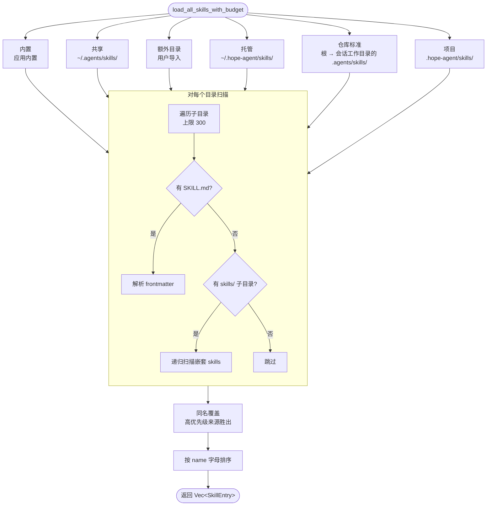

**优先级覆盖**：项目 > 越靠近会话有效工作目录的仓库标准目录 > 仓库根标准目录 > 托管 > 额外目录 > 共享 > 内置。仓库标准目录的扫描在最近 `.git` 文件/目录处停止；不在 Git 仓库内时只考虑会话工作目录自身。没有会话工作区的全局设置、IM 菜单等入口不扫描仓库技能，也不会回退到 Hope 进程的 cwd。

### 嵌套目录检测

自动检测 `dir/skills/*/SKILL.md` 这种插件式嵌套结构：

```
my-project/
├── plugin-a/
│   └── skills/          ← 自动发现
│       ├── skill-x/SKILL.md
│       └── skill-y/SKILL.md
└── plugin-b/
    └── skills/          ← 自动发现
        └── skill-z/SKILL.md
```

### 安全限制

扫描与注入都有硬上限，防止恶意或失控目录拖垮系统：

| 限制 | 默认值 | 说明 |
|------|--------|------|
| `max_candidates_per_root` | 300 | 每个根目录最多扫描的子目录数 |
| `max_file_bytes` | 256 KB | 单个 SKILL.md 最大字节数 |
| `max_count` | 150 | prompt 中最多包含的技能数 |
| `max_chars` | 30,000 | prompt 技能段落最大字符数 |

目录项 symlink 不参与发现；每次递归的 canonical 路径必须仍在配置根内，`SKILL.md` 本身也必须是非 symlink 常规文件。这样仓库内的路径别名不能把扫描逃逸到另一个目录树。

---

## 六、Requirements 环境检查

一个技能可能因为环境不满足而不该被激活。检查结果分成**两级**，处置完全不同：

- **硬不兼容**（当前实现即 OS 不匹配）：用户在当前环境里没法修复，技能**不进模型目录、不进斜杠菜单**。
- **可修复的缺依赖 / 缺配置**（bins / anyBins / env / config）：技能**仍然进目录**，但激活前会返回"缺什么、怎么装/配"的诊断，不加载 SKILL.md。这样模型知道有这个能力，用户也能一键补齐。

### 检查流程

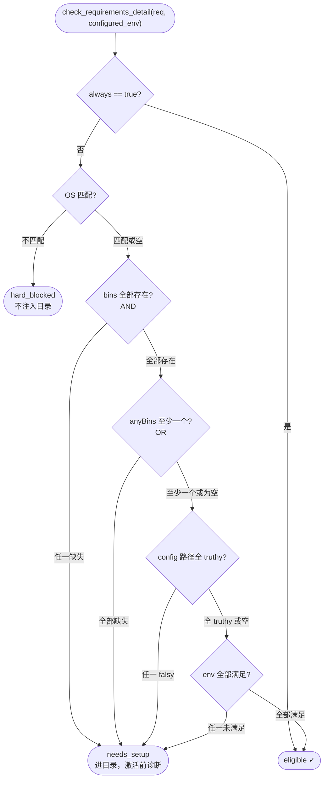

env 检查按三个来源依次取值，任一满足即通过：

| 顺序 | 来源 |
|------|------|
| a | `configured_env`——用户在设置面板为该技能配置的值 |
| b | `primaryEnv` + apiKey——统一 API Key 机制（见下） |
| c | 系统环境变量 `std::env::var` |

### `primaryEnv` 机制

当技能声明 `primaryEnv: MY_API_KEY` 且 `requires.env` 里包含 `MY_API_KEY` 时，除了检查常规 env，还会检查是否通过 `__apiKey__` 字段配了 API Key。这样用户能在设置面板里统一配 API Key，不必单独设每个环境变量。

### 诊断结构

`check_requirements_detail` 返回 `RequirementsDetail`：

```rust
pub struct RequirementsDetail {
    pub eligible: bool,              // 当前可直接运行
    pub hard_blocked: bool,         // 不可修复（如 OS 不匹配）
    pub needs_setup: bool,          // 可修复的缺依赖 / 缺配置
    pub current_os: Option<String>,
    pub supported_os: Vec<String>,
    pub missing_bins: Vec<String>,
    pub missing_any_bins: Vec<String>,
    pub missing_env: Vec<String>,
    pub missing_config: Vec<String>,
}
```

`injection_eligible()`（即 `!hard_blocked`）决定能否进目录 / 菜单；`needs_setup` 决定"进目录但激活前拦截并返回诊断"；`eligible` 才允许真正加载或 fork。同一份诊断同时服务 prompt 过滤、菜单过滤、激活前拦截和前端健康检查。

### `always: true` 的准确边界

实现里 `always` 的唯一效果就是：

```rust
if req.always {
    return true; // 跳过 OS / bins / anyBins / env / config 检查
}
```

它**不会**：

- 阻止用户在设置或首次引导页里全局关闭该技能
- 绕过 `AppConfig.disabled_skills`
- 绕过 Agent 级 `capabilities.skills.deny`
- 绕过 `status: draft | archived`
- 让声明了 `paths:` 的技能在未激活前进目录

因此文案和 UI 统一称它"跳过依赖检查"。如果将来真需要"不可关闭的系统技能"，应新增独立字段（如 `locked: true` + `toggle_skill` 强制校验），而不是复用 `always`。

---

## 七、四条激活路径

四条路径共享同一份 Skill 发现、requirements、参数替换与 `SkillToolCeiling` 语义。Skill 正文始终是用户级 workflow guidance，不是 system 指令；执行层白名单只会在已有 Agent/Plan/deny policy 上继续收窄。

| 场景 | 入口 | Inline 行为 | Fork 行为（`context: fork`） |
|------|------|-----------|--------------------------|
| 模型自主 | `skill({name, args?})` 工具 | 正文作为 tool_result；同一 journal revision 记录 activation metadata，下一 round 收紧工具 | 子 Agent 执行 → 摘要作为 tool_result |
| 用户斜杠命令 | `/skillname [args]` | 桌面/Web 发送原命令 + typed `SlashCommandAst` sidecar；后端 live 重解析正文并放入当前 user Turn Envelope | 复用 `spawn_skill_fork`，结果经 EventBus 注入 |
| 用户 `@skill` 提及 | Composer `@` 菜单产生 typed binding | 后端按固定 allowlist + live invocable/requirements 原子解析，正文放入当前 user Turn Envelope | — |
| `read SKILL.md` | `read` 工具 | 仍能读原文（供作者对比 / diff），但系统提示词明确引导走 `skill` 工具 | — |

### 为什么要一个专用 `skill` 工具

模型自主激活如果靠 `read SKILL.md`，内容会作为 tool_result 堆在主对话历史里；多轮 exec 密集的技能会反复 read references、触发大量 exec tool_result，累加几十 KB 进主 context。而且 `context: fork` 只能在斜杠命令路径生效，模型自己没法要求隔离执行。

专用 `skill` 工具把"加载 / 参数替换 / fork 隔离"都收进工具执行层：

- 工具名 `skill`，内置在 `crates/ha-skills/src/tools/skill/`
- 入参 `{ name: string, args?: string }`
- 工具执行层统一分发 inline / fork，`context: fork` 在斜杠命令和模型自主两条路径**都生效**
- 定义为 `internal: true` 的 Core/Meta 工具：跳过审批，且始终注入、永不进 deferred 池（即便 tool_search 场景也恒定可见）
- 系统提示词明确引导"用 `skill` 工具，不要 `read` SKILL.md"
- inline tool result 携带 activation metadata；streaming loop 将其与结果一起提交，并调用 `narrow_skill_allowed_tools()`，不会在同一 round 中途改 schema

**查找边界**：`skill` 工具内部用 `get_invocable_skills(extra_dirs, disabled_skills)` 查找，会过滤全局禁用、`user-invocable: false` 和 `status != active`。命中后按 Agent / global 的 `skill_env_check` 做激活前 requirements 检查：硬不兼容返回 hard-block 诊断，可修复缺依赖返回 setup 诊断，只有 `eligible=true` 才加载 SKILL.md 或 fork。

### 工具 schema

```jsonc
{
  "name": "skill",
  "description": "Activate a skill from the skill catalog by name. Preferred over `read`-ing the SKILL.md file directly ...",
  "parameters": {
    "type": "object",
    "properties": {
      "name": { "type": "string", "description": "Skill name as shown in the skill catalog" },
      "args": { "type": "string", "description": "Optional arguments. Replaces `$ARGUMENTS` for inline skills; becomes the task description for fork skills." }
    },
    "required": ["name"]
  }
}
```

### Dispatch 流程

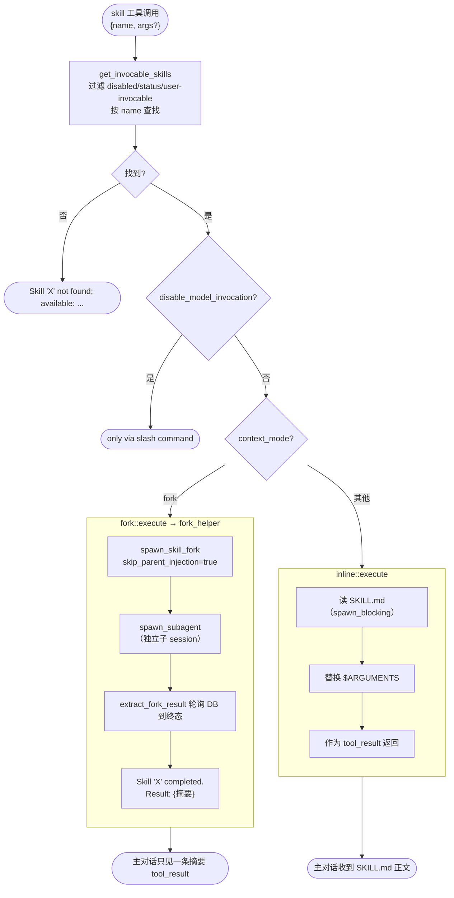

### 两条 fork 入口共享同一 helper

`skills::fork_helper::spawn_skill_fork` 是唯一的 fork 入口，保证斜杠命令路径和 `skill` 工具路径行为一致：

```rust
pub async fn spawn_skill_fork(
    skill: &SkillEntry,
    args: &str,
    parent_session_id: &str,
    parent_agent_id: &str,
    skip_parent_injection: bool,   // skill 工具为 true，斜杠为 false
) -> Result<String>;               // 返回 run_id

pub async fn extract_fork_result(
    run_id: &str,
    skill_name: &str,
) -> Result<String>;               // 轮询 DB，返回 "Skill 'X' completed.\n\n..."
```

两条路径的关键差别是 `skip_parent_injection`：

- **Skill 工具路径**（`true`）：`extract_fork_result` 同步阻塞到终态，把摘要作为 tool_result 返回。整个子 Agent transcript **不**经 EventBus 推回主对话——这是"隔离执行 + 隔离结果"的核心。
- **斜杠命令路径**（`false`）：通过 EventBus 把结果作为新 user message 注入主对话（保留既有 UX），前端订阅 `SkillFork { run_id, skill_name }` 看进度。

### Inline 与 Fork 对比

| 维度 | Inline（默认） | Fork（`context: fork`） |
|------|-----------------|--------------------------|
| 执行载体 | 主对话 LLM | 独立子 Agent 会话 |
| 主对话看到 | 完整 SKILL.md + `$ARGUMENTS` 替换 | 一条 `Skill 'X' completed.\n\nResult:\n<text>` 摘要 |
| `allowed-tools` 强制 | `@skill`、`/skill`、模型 `skill()` 都进入 execution filter；模型激活从下一 round 生效 | 与父级 ceiling 求交后应用到子 Agent |
| 适合场景 | 短指令、需用户中途介入、希望模型看到完整内容 | 多轮 exec 密集、产出可自包含总结、避免污染主 context |
| tool_result 大小 | 等于 SKILL.md 正文 | ≤ `MAX_RESULT_CHARS = 64 KB`（超长截断） |
| Prompt cache | 复用主对话前缀 | 子 Agent 独立上下文，可能独立 cache miss |

### 斜杠命令的 inline 内联路径

当用户打 `/skillname [args]`，且技能不是 `context: fork` / `command-dispatch: tool` 时，桌面/Web 保留用户原始命令并附带覆盖整条命令的 `SlashCommandAst` typed binding。公共 slash handler 与 Chat Engine 都调用 kernel `resolve_skill_slash_dispatch()`，从同一份可信 `SkillEntry` 冻结分派语义：`command-dispatch: prompt` 与默认但带 `command-prompt-template` 的 Skill 在后端展开模板；只有默认且无模板时才读取 SKILL.md、替换 `$ARGUMENTS`。前端返回的 `action.message` 只作旧 transport 兼容，不能成为 typed turn 的可信提示词来源。最终内容进入 user-level instruction block，新消息中没有伪 system 标记：

```
<user_instruction source="explicit_slash_skill">
  <explicit_skill_command name="...">...</explicit_skill_command>
  <SKILL.md 全文，$ARGUMENTS 已替换>
</user_instruction>
```

IM 目前没有 Composer sidecar，斜杠 handler 因此把同一份已解析 user-level内容作为普通 PassThrough message 持久化，同时把 tool ceiling 写入 durable FIFO row；重放不会丢失白名单。

- UI/DB 显示原始 `/skillname args`
- LLM 看到 user role 的完整 Skill 内容
- typed source anchor 与 input digest 防止编辑后保留伪 provenance；typed sidecar 若绑定到 fork/direct-tool 这类非模型分派也会 fail-visible，而不是改写成普通 Provider turn
- canonical args 复核、requirements live recheck 或 inline SKILL.md materialization 任一失败都会在 Provider I/O 前 fail-visible 地终止该 turn；绝不把原始 `/skill` 文本当普通 unrestricted prompt 继续，也不接受客户端提供的正文或工具 grants。inline materializer 会从本次读到的正文重解析控制性 frontmatter，并与选中命令的 catalog snapshot 核对；`allowed-tools` / requirements / dispatch / context 等在两者之间发生竞态变化时整次激活失败，不允许新正文配旧 ceiling。模板模式则直接使用同一 frozen entry 内的模板与 ceiling，不再二次读盘

直接提供全文避免 deferred `read` 多一轮；Skill 不允许为适配预算被截半。

### 全路径强制的 `allowed-tools`

frontmatter 保留三态：未声明 = `Unspecified`（不新增限制），显式 `[]` = `DenyAll`，非空列表 = `Restricted`。对普通工具，`ToolScope`、Agent filter、Plan allowlist、denied tools 与 Skill ceiling 在 schema 和 execution 两层求交。`read_context_resource` 是当前 turn 已冻结用户字节的 intrinsic continuation，不被 Skill / Plan ceiling 意外裁掉，但仍受 Agent `denied-tools`、`ToolScope` 与 turn / session / principal 绑定检查；它仍进入统一 permission engine，仅有效 bound ref 可确定性 allow。

多个显式 `@skill` 先全集解析：任一不可用/不可读，或 ceiling 形状混合，整组原子拒绝，不出现半激活。模型后续 `skill()` 与 fork 只能对当前 ceiling 求交，不能通过加载另一个 Skill 扩权。`command-dispatch: tool` 同样带本 Skill ceiling，并进入统一 permission engine；显式命令不是自动审批。

### `@skill` 提及（输入框内联注入）

用户选择 Skill 时，Composer 同时写入可读 markdown token `[@<标签>](#skill:<name>)` 和 `IncomingTurnWire.mentions[]`。后端只信 sidecar：校验 canonical text SHA-256、UTF-8 半开 span、token/kind/target 与不重叠，再按当前 Agent 的 live catalog 解析。单独粘贴同形 markdown 只是普通文本。

- **为什么 token 用 markdown 链接**：`[@标签](#skill:name)` 而非裸 `@skill:name`，好处是**同一 token 在输入框（编辑器装饰）和消息历史（`MarkdownLink` 拦截 `#skill:` href）都渲染成同一枚 chip**，历史里不会露出 `@skill:xxx` 原文；标签本地化、id 稳定，后端只认 href 里的 id。href 用 fragment `#skill:`（不是自定义 scheme），因为消息渲染的 sanitize 会剥掉未知 scheme 的 href，fragment 则像本地路径链接一样存活。
- **固定 allowlist + live recheck**：`mention.rs::AT_MENTIONABLE_SKILLS` 仍是 Composer 入口；解析再叠 invocable、OS、disabled 与 requirements。失败拒绝整个显式 activation set，不静默变成部分激活。
- **原子失败**：显式 `@skill` 集合只有在全部 id 均 live resolved、全部正文可读取且得到同一安全组合下的 `allowed-tools` ceiling 时才进入 Provider；任一 unavailable/rejected/materialization failure 都在 Provider I/O 前终止 turn，不能把 visible token 或 rejection 提示当普通 unrestricted 请求继续。
- **fork 同样原子**：slash 与模型 `skill()` 共用的 fork materializer 必须读取实际 SKILL.md 并把控制性 frontmatter 与 frozen entry 核对后才能创建 child run；读取/竞态失败直接返回可见错误，禁止退化成 description/generic task 后继续派发。child 的正文、`allowed-tools`、Agent 与 effort 因而来自同一 entry/body snapshot。
- **用户 authority**：完整正文在 `<hope_turn_context>/<user_instruction source="explicit_skill_mention">`，随后才是 `<current_user_request>`；不会进入 stable system 或 Run instruction。
- **重试冻结**：解析结果、receipt 与 `skillAllowedTools` 在首次 Provider I/O 前提交到 chat journal；同一 turn 的 profile retry/failover 不重读或重解析。
- **菜单数据**：`list_mentionable_skills()`（Tauri `list_mentionable_skills` / HTTP `GET /api/skills/mentionable`）返回 allowlist ∩ invocable ∩ OS 的 `{ name, description }`；友好标签与图标在前端按 `name` 映射，后端不下发文案。

---

## 八、Fork 执行：context / agent / effort

`context: fork` 把技能放进独立子 Agent 执行。配套的 `agent:` 和 `effort:` 只在 fork 模式生效，分别路由子 Agent 的身份和推理强度。

### 数据流

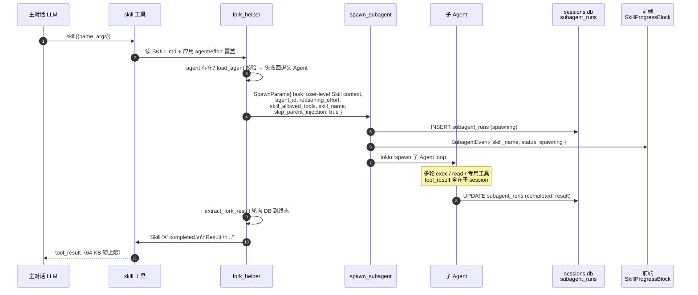

### `agent:` 路由

指定 fork 时使用的子 Agent 身份（含独立 system prompt / persona / tool filter）：

```rust
let resolved_agent = match skill.agent.as_deref() {
    Some(id) if !id.is_empty() => match ha_core::agent_loader::load_agent(id) {
        Ok(_) => id.to_string(),
        Err(e) => {
            app_warn!("skill", "agent",
                "Skill '{}' declares agent '{}' which is not loadable ({}); \
                 falling back to parent agent", skill.name, id, e);
            parent_agent_id.to_string()
        }
    },
    _ => parent_agent_id.to_string(),
};
```

- 直接复用 `spawn_subagent` 已有的 `agent_loader::load_agent` 链路，无需扩展 `SpawnParams`
- 无效 id 不阻塞执行，warn 提示作者检查
- 典型用途：让自包含技能跑在专门调校的 Agent 下（如低温度 + 代码审查 persona）

### `effort:` 路由

指定 fork 时的推理 / 思考强度，值域 `low | medium | high | xhigh | none`。它填进 `SpawnParams.reasoning_effort`，透传到子 Agent 的 chat 调用，复用既有 `reasoning_effort` 管线（零改动）：

| Provider | 消费方式 |
|----------|---------|
| Anthropic | 映射到 `thinking: { type, budget_tokens }` |
| OpenAI Chat | 注入 `reasoning_effort` |
| OpenAI Responses | `reasoning.effort` 字段 |
| Codex | 与 Responses 同构 |

### `skip_parent_injection` 的意义

fork 有两种"结果去向"，`skip_parent_injection` 是二者的开关：

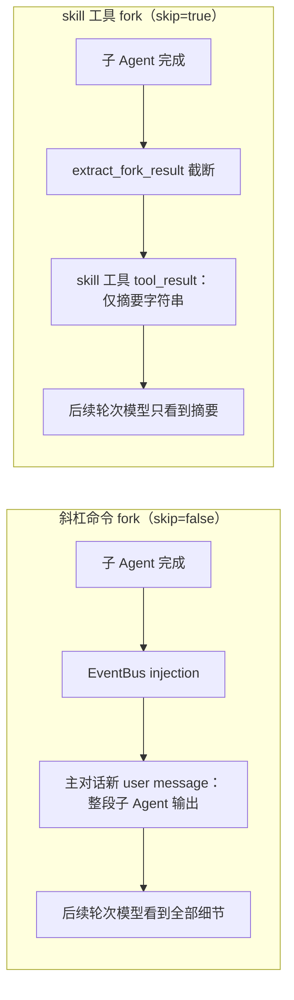

`skip=true` 让主对话 context 真正只增长 1 条 tool_use + 1 条摘要 tool_result，把"隔离执行但结果回灌"升级为"隔离执行 + 隔离结果"。

### 超时与终态

- **子 Agent 超时**：`SpawnParams.timeout_secs = 600`（10 分钟，skill fork 专用值）。超时转 `Timeout` 状态。
- **外层轮询硬上限**：`extract_fork_result` 自身 900 秒（15 分钟）兜底，避免 DB race / 子任务异常导致无限阻塞；超过时返回提示字符串、不阻塞主对话。
- **终态映射到 tool_result**：

| 子 Agent 状态 | 主对话看到的 tool_result |
|--------------|-------------------------|
| `Completed` | `Skill 'X' completed.\n\nResult:\n<assistant text>` |
| `Error` | `[Skill failed: <reason>]` |
| `Timeout` | `[Skill timed out]` |
| `Killed` | `[Skill cancelled]` |

---

## 九、paths 条件激活

### 设计动机

某些技能只在特定文件类型的任务里有用（如"py-helper"只在触碰 `*.py` 时需要）。常驻在目录里浪费 prompt token，移出又让模型发现不到。`paths:` 的解法是**声明模式 → 默认隐藏 → 本会话触碰匹配文件后动态加入**，一旦激活就保留整会话（压缩免疫），不同会话互不干扰。

### 数据模型

激活状态用两层存储：

| 层 | 位置 | 用途 |
|----|------|------|
| 进程内热缓存 | `OnceLock<Mutex<HashMap<String, HashSet<String>>>>`，key = session_id | 每轮 prompt 构建读 |
| SQLite 持久化 | `sessions.db` 表 `session_skill_activation(session_id, skill_name, activated_at)`，主键 `(session_id, skill_name)` | App 重启恢复；session 删除级联清理 |

首次访问某 session_id 时从 DB 懒加载进内存；写入同时持久化 DB + 更新热缓存（DB 是真相源，缓存是热副本）。

台账 API 在 `crates/ha-core/src/skills/activation.rs`：

```rust
pub fn activate_skills_for_paths(
    session_id: &str,
    touched: &[String],   // 本次工具调用触碰的路径
    cwd: &str,
    skills: &[SkillEntry],
) -> Vec<String>;          // 返回本次新激活的技能名

pub fn activated_skill_names(session_id: &str) -> HashSet<String>;
pub fn clear_session_activation(session_id: &str);   // session 删除时调
pub fn reset_activation_cache();                     // skill 目录变更时保守清空
```

### 激活触发

钩子挂在工具 dispatch 前的 `maybe_activate_conditional_skills`：

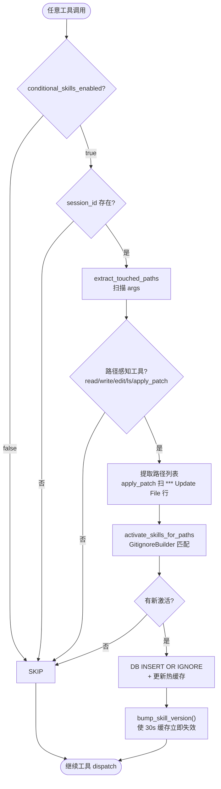

- 每次路径感知工具调用都会扫 args 里的 `path` / `file_path` / patch 正文的 `*** Update File: xxx` 行
- 一次触发可同时激活多个 `paths:` 命中的技能
- `bump_skill_version()` 让下一轮系统提示词立即包含新激活的技能，不等 30 秒 TTL 过期
- 未激活的 `paths:` 技能仍在缓存里，只是被 prompt 过滤掉；激活后同一份数据直接可见

### Prompt 注入过滤

`build_skills_prompt` 多接一个 `activated_conditional: &HashSet<String>` 参数，新增一层过滤：

```rust
.filter(|s| match &s.paths {
    Some(p) if !p.is_empty() => activated_conditional.contains(&s.name),
    _ => true,  // 无 paths 字段 = 全局可见
})
```

session_id 全链路透传到该过滤点；无 session 上下文的旧路径传空集，`paths:` 技能永远不出现。

### 匹配引擎

用 workspace 已有的 `ignore` crate 的 `GitignoreBuilder`：

```rust
let matcher = GitignoreBuilder::new(base)
    .add_line(None, "*.py")
    .add_line(None, "docs/**/*.md")
    .build()?;
```

路径归一化的三个要点：

- 相对路径拼到 `cwd` 变绝对路径
- 绝对路径先尝试 `strip_prefix(base)` 转相对；不在 cwd 之下时走 `matcher.matched(abs, false)` 直接匹配（避免对 base 之外的路径 panic）
- hook 点永远传 `is_dir=false`（read/write/edit/apply_patch/ls 都是文件级）

单条格式错误的模式会被跳过、不毒化整个技能。

### 清理与 Kill switch

| 事件 | 动作 |
|------|------|
| Session 删除 | `DELETE FROM session_skill_activation WHERE session_id = ?` + `clear_session_activation()` |
| Skill 目录变动 | `reset_activation_cache()` 清空热缓存（保守，避免引用已删技能）；DB 行保留，下次读重新 hydrate |
| App 重启 | DB 行保留，热缓存空，首次访问懒加载 |
| 上下文压缩 | 不影响——激活集按 session_id 存，压缩只改 messages（压缩免疫） |

`AppConfig.conditional_skills_enabled`（默认 `true`）是紧急停用开关：设为 `false` 时 `maybe_activate_conditional_skills` 直接 no-op，所有 `paths:` 技能保持隐藏。它是"关掉条件激活机制"，不是"把 `paths:` 技能改成全局可见"。

---

## 十、Prompt 注入与预算管理

### 懒加载：目录里只放名称和描述

系统提示词只注入技能**目录**（名称 + 描述），激活靠 `skill` 工具：

```
The following skills provide specialized instructions for specific tasks.
Use the `skill` tool to activate a skill by name — e.g.
`skill({ name: "<skill-name>", args: "<optional>" })`.
Do NOT `read` SKILL.md files to activate a skill; the `skill` tool handles loading,
argument substitution, and (for `context: fork` skills) sub-agent isolation.
Only activate the skill most relevant to the current task.

- github: GitHub operations via gh CLI — when: user mentions PR status, CI checks, issues
- docker: Container management
- ...
```

声明了 `when_to_use` 的技能，目录行渲染成 `- name: <description> — when: <when_to_use>`；未声明则回退 `- name: <description>`。拆开的好处是 `description` 可以短（"这是什么"），触发判断落在 `when_to_use`（"什么时候用"），既提高触发率又减小超出 `max_chars` 触发降级的概率。

目录里**不再暴露文件路径**：`skill` 工具按 name 查找不需要磁盘路径，每条省约 5–6 tokens，且避免模型把路径当参数传给别的工具产生幻觉。

### 三层渐进降级

技能太多撑爆预算时，目录格式逐级降级：

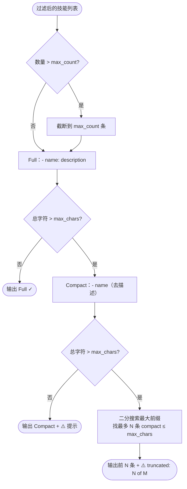

### 完整过滤管道

技能从"全部发现"到"注入 prompt"经过八层过滤。第一层（Agent 过滤）在 `system_prompt::sections::build_skills_section`，其余在 `skills::prompt::build_skills_prompt`：


| 层 | 过滤规则 |
|----|----------|
| 1. Agent | 当前 Agent `capabilities.skills.allow/deny` |
| 2. disabled_skills | `AppConfig.disabled_skills` 显式禁用 |
| 3. disable_model_invocation | `disable-model-invocation: true` 只允许用户 `/command` |
| 4. status | 只保留 `Active`；`Draft` / `Archived` 对模型透明 |
| 5. Bundled Allowlist | `AppConfig.skill_allow_bundled` 非空时限制 bundled 来源 |
| 6. Requirements | bins / anyBins / env / os / config；`always: true` 跳过本层 |
| 7. paths 条件激活 | 声明 `paths:` 的必须在 `activated_skill_names(session_id)` 里 |
| 8. max_count | 数量上限（默认 150） |

剩下的进三层降级格式化。

---

## 十一、调用策略

每个技能有两个独立的调用开关：

| 字段 | 默认 | 作用 |
|------|------|------|
| `user-invocable` | `true` | 是否注册为斜杠命令 `/skillname` |
| `disable-model-invocation` | `false` | 是否从模型目录隐藏 |

四种组合：

| user-invocable | disable-model-invocation | 效果 |
|----------------|--------------------------|------|
| `true` | `false` | 默认：用户可 `/command`，模型也能看到 |
| `true` | `true` | 仅用户可调用，模型看不到 |
| `false` | `false` | 仅模型可用，不注册命令 |
| `false` | `true` | 完全不可用（相当于禁用） |

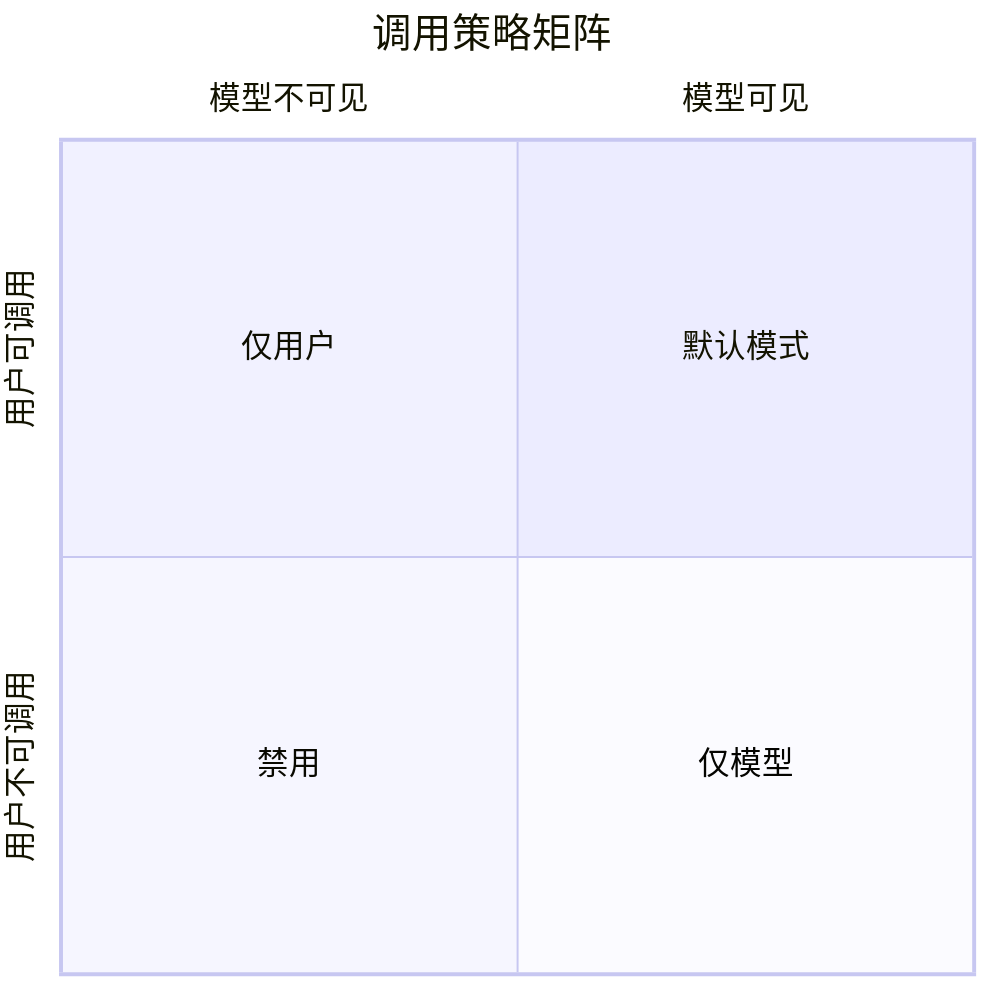

---

## 十二、自动创建与草稿审核

系统能在对话收尾时观察"这次是不是形成了一段可复用的方法论"，自动把它写成一个技能。为了不让模型往自己 prompt 里塞垃圾，这条路径有两道保护：**五闸瀑布过滤**决定"值不值得写"，**草稿缓冲区**决定"写了之后要不要用户确认才生效"。

### 五闸瀑布

每次 chat 收尾后按下面五道闸串行处理；任意一道判 skip 都会写一条 `learning_events`（`skill_review_skipped`），设置页的"最近拒绝原因"卡片就靠它。


- **闸 1（触发器）**：`TriggerSignals { turn_tokens, new_messages, tool_use_count, user_correction }`。默认 `requireToolUse=true`——纯聊天对话 `tool_use_count=0` 永不触发；`tool_use_count ≥ toolUseThreshold` 是主入口；`correctionSignalEnabled=true` 时"连发两条用户消息（< 30s）"也能独立触发。
- **闸 2（pre-LLM 启发式）**：消息数低于 `minMessageCount` 直接 skip；最近 `discardBlacklistDays` 天内被用户 discard 的主题（按 description 做 overlap-coefficient 相似度）也 skip。`delete_skill` 会把当时的 description 写进 learning event，所以中英文题目都能匹配。
- **闸 3（LLM 审核 + dedup）**：内置 prompt 列出 6 类禁拍（`ENV-FAILURE` / `NEGATIVE-CLAIM` / `TRANSIENT-ERROR` / `ONE-OFF-TASK` / `PERSONAL-LIFE-DECISION` / `ECHO-OF-USER-INPUT`），用户可用 `extraRejectCategories` 追加；按 Jaccard 选 `topKForDedup` 条现有技能、**注入完整 body**，让模型优先 `patch` 而非 `create`；用户可整段覆盖 `reviewSystemOverride`，但闸 4/5 不受影响。
- **闸 4（自评分硬阈值）**：create 决策必须返回 `reuse_scenarios: [string; 3]`（每条 ≥ 20 字、互相 Jaccard < 0.8）+ `reuse_probability ≥ minReuseProbability` + `class_level_name = true`，否则强制 skip。
- **闸 5（post-LLM lint）**：会话化词阈值（"今天 / this conversation / 上面"等）≥ `sessionRecapThreshold`、步骤数不在 `[minSteps, maxSteps]`、缺具体命令 / 路径 / 代码、命名含 `fix-issue` / `-today` / 末尾纯数字等"会话产物"特征，任一命中即 skip。

### 落盘原语：`skills::author`

五闸的产物最终经 `skills/author.rs` 落盘。它是**技能写入的唯一实现**（五闸管线、Curator、编程改进的技能提案、草稿审核命令都调它），**只写 managed scope**（`~/.hope-agent/skills/{id}/SKILL.md`）——bundled / shared / extra / repository standard / project 来源永不被改。

所有原语先过 `validate_skill_id`：非空、仅 `[A-Za-z0-9_-]`、拒路径穿越字符、拒与 bundled 技能同名（防覆盖内置）。会改盘的原语收尾都调 `bump_skill_version()` 让缓存失效。

| 原语 | 作用 | `security_scan` | learning event |
|---|---|---|---|
| `create_skill(id, description, body_md, CreateOpts)` | 新建 managed 技能；`ensure_frontmatter` 处理 frontmatter；目标目录已存在即 `bail!` | ✓ 扫 `body_md` | `EVT_SKILL_CREATED` |
| `update_skill(id, body_md)` | 整体替换正文；目标不存在即 `bail!`。为手工编辑入口预留 | ✓ 扫 `body_md` | — |
| `patch_skill_fuzzy(id, old_approx, new_text, FuzzyOpts)` | 模糊定位并替换单段（见下） | ✓ 扫 `new_text` | `EVT_SKILL_PATCHED` |
| `set_skill_status(id, status)` | 只重写 frontmatter 的 `status:`，正文不动。**draft → active 的晋升原语** | —（不写正文） | 转 Active 时 `EVT_SKILL_ACTIVATED` |
| `delete_skill(id)` | 删整个 managed 技能目录；删前 canonicalize 校验仍在 managed root 内，并先读出 description 供闸 2 黑名单 | — | `EVT_SKILL_DISCARDED` |
| `list_drafts(extra_dirs)` | 跨来源筛 `status == Draft`（实践中只有 managed 会是 draft） | — | — |

`CreateOpts::default()` 是 `{ status: Active, authored_by: "user", rationale: None }`；各调用方按语义覆盖：五闸管线写 `authored_by="auto-review"` + status 由 `promotion` 决定；编程改进的技能提案硬编码 `Draft`（不看 `promotion`）。

### 模糊 patch 的相似度语义

`patch_skill_fuzzy` 两段式：

1. **精确快路**：`old_approx` 作为子串命中即直接替换，返回 `PatchResult::Exact`，不打分。
2. **模糊路**：把文档按空行切段，每段与 `old_approx` 各转成小写词袋算 Jaccard，取最高分那段。分数 `< min_similarity` 返回 `PatchResult::NotFound { best_similarity }`——注意是 **`Ok` 而非 `Err`**，不写盘、由调用方决定重试；否则替换并返回 `PatchResult::Fuzzy { similarity }`。

`FuzzyOpts::default().min_similarity = 0.80`。这个阈值容忍 review 模型没逐字引用原文的轻微漂移，但不允许它把一段无关内容当目标段改掉。

### `security_scan` 扫什么

`security_scan(body)` 是 create / update / patch 三条写入路径的统一前置门。命中任一模式即 warn + 返回 `Err`——**是 bail 不是降级**，整次写入直接失败，不会写出"已清洗"的半成品。检测按下表顺序，首个命中即返回：

| `SecurityIssue` | 判据 |
|---|---|
| `ShellPipe` | 逐行小写找管道符：左侧有独立单词 `curl` / `wget` / `fetch`，且管道右侧第一个词是 `sh` / `bash` / `zsh` / `python` / `perl`。即 `curl … \| bash` 式一键安装器。单纯 `curl https://...`（不管道给 shell）放行 |
| `InvisibleUnicode` | 含 U+200B–U+200F、U+2060–U+206F、U+FEFF 或 U+E0000–U+E007F 任一字符（零宽字符 / tag 字符等 prompt 走私点） |
| `CredentialLeak` | 形状匹配：`sk-ant-` 后接 ≥ 90 个 token 字符（`[A-Za-z0-9_-]`）、`sk-proj-` ≥ 40、`AKIA` ≥ 16、`ghp_` ≥ 36、`ghs_` ≥ 36。所以文档里写 `sk-ant-xxx` 这类短引用不会误伤 |

`set_skill_status` / `delete_skill` 不扫——它们不写正文。

### 草稿缓冲区：`promotion` 决定落点

`AutoReviewPromotion` 只有两档，`Draft` 是默认：

- **`promotion: "draft"`（默认）**：`apply_create` 写 `SkillStatus::Draft`。draft 技能被发现 / prompt 目录 / 斜杠注册全部排除——模型完全看不见，必须用户在设置面板显式处置：`activate_draft_skill`（→ `set_skill_status(Active)`）或 `discard_draft_skill`（→ `delete_skill`）。这就是"等用户确认"的落点。
- **`promotion: "auto"`**：`apply_create` 直接写 `Active`，跳过草稿缓冲区，新技能当轮即对模型可见。仅在信任 review 模型时使用。
- **`enabled`（默认 `true`）** 是整条管线的总闸，与 `promotion` 正交——关掉就没有任何自动创建。

**patch 路径不受 `promotion` 约束**：`apply_patch` 就地改已存在的技能，若目标本来是 `Active`，改动即刻生效、不落草稿、不经确认。`promotion` 只决定 **create** 的落点。

### Curator：草稿归并

`curator.rs` 提供一次性扫描：用 Jaccard 把 `status=draft` 的 managed 技能聚类（默认阈值 0.4），输出 `MergeProposal { members, min_similarity }`。**不调 LLM、不落盘**；前端展示给用户选择保留哪一个，`apply_skills_curator_merge` 通过 `delete_skill` 删其余成员（同时进闸 2 黑名单）。`autoCuratorEnabled=true` 时由独立后台任务按 `autoCuratorIntervalDays` 周期触发（默认关），每轮成功会 emit `skills:curator_proposals_ready`。

### 相关配置与命令

`config.json` 的 `skills.autoReview` 子块（全部默认值均已与实现核对）：

```jsonc
{
  "skills": {
    "allowRemoteInstall": false,
    "autoReview": {
      "enabled": true,
      "promotion": "draft",
      // 闸 1
      "cooldownSecs": 900,
      "tokenThreshold": 12000,
      "messageThreshold": 20,
      "toolUseThreshold": 3,
      "correctionSignalEnabled": true,
      "requireToolUse": true,
      // 闸 2
      "minMessageCount": 4,
      "discardBlacklistDays": 30,
      // 闸 3
      "topKForDedup": 5,
      "modelOverride": null,       // ModelChain；空则落 function_models.automation → 主 Agent
      "candidateLimit": 24,
      "timeoutSecs": 90,
      "reviewSystemOverride": null,
      "extraRejectCategories": [],
      // 闸 4
      "minReuseProbability": 0.7,
      // 闸 5
      "sessionRecapThreshold": 2,
      "minSteps": 2,
      "maxSteps": 12,
      // Curator
      "autoCuratorEnabled": false,
      "autoCuratorIntervalDays": 7,
      // 保留窗口
      "retentionDays": 180
    }
  }
}
```

| 用途 | Tauri 命令 | HTTP 路由 |
|---|---|---|
| 读取 sanitize 后整个配置 | `get_skills_auto_review_config` | `GET /api/skills/auto-review/config` |
| 深合并 patch | `set_skills_auto_review_config` | `PATCH /api/skills/auto-review/config` |
| 按字段名重置 | `reset_skills_auto_review_config` | `POST /api/skills/auto-review/config/reset` |
| 最近被拒原因（默认 20 条 / 7 天窗口）| `get_skills_auto_review_recent_rejects` | `GET /api/skills/auto-review/recent-rejects` |
| Curator 扫描 | `run_skills_curator_now` | `POST /api/skills/curator/run` |
| Curator 合并应用 | `apply_skills_curator_merge` | `POST /api/skills/curator/apply` |

---

## 十三、缓存与版本追踪

技能系统并行维护两套独立缓存，各自解决不同问题、互不污染：

| 缓存 | 键 | 失效条件 | 存储 |
|------|----|---------|------|
| `SkillCache` | 全局单实例 | 30s TTL + `SKILL_CACHE_VERSION` + `extra_dirs` hash | 进程内存 |
| `ACTIVATED_CONDITIONAL` | `session_id` | 无 TTL；session 删除 / skill 目录变动时清理 | 进程内存 + `sessions.db` 持久化 |

不共用的原因：`SkillCache` 是全局目录扫描结果（所有 session 共享），`ACTIVATED_CONDITIONAL` 是 per-session 动态激活状态（每个 session 独立）。合并会让 TTL 语义模糊 + 多 session 互相污染。

### 版本机制

`SkillCache` 的失效除了 30 秒 TTL，还挂在一个原子版本计数器上——任何会改变技能集的操作都 `bump`，让下次请求立即重扫：

```rust
static SKILL_CACHE_VERSION: AtomicU64 = AtomicU64::new(0);

pub fn bump_skill_version() {
    SKILL_CACHE_VERSION.fetch_add(1, Ordering::Relaxed);
    // 同时在 EventBus emit `skills:catalog_changed`，
    // 让被动观察者（如渠道机器人菜单）重新同步命令。
}
```

触发 bump 的操作：

- `toggle_skill` — 启用 / 禁用
- `set_skill_env_var` / `remove_skill_env_var` — 改环境变量
- `add_extra_skills_dir` / `remove_extra_skills_dir` — 改技能目录
- `set_skill_env_check` — 改环境检查开关
- `install_skill_dependency` — 安装依赖
- `author` 各写盘原语（create / update / patch / delete / set_status）
- `activate_skills_for_paths` 命中新 `paths:` 技能 — 让它立即出现在下一轮 prompt

### 缓存状态机

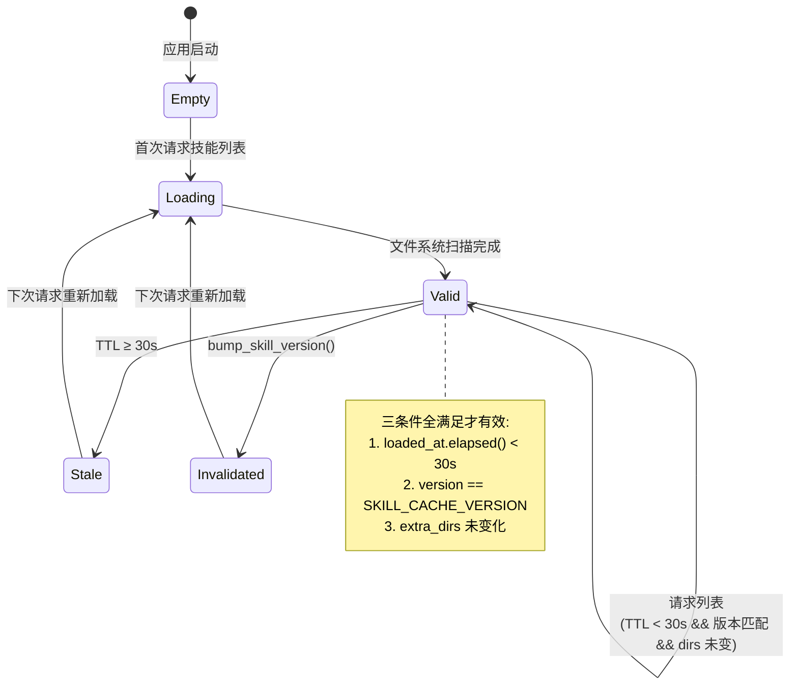

---

## 十四、命令与路由一览

Tauri 与 HTTP 都只做薄适配，核心逻辑在 `ha_skills::skills::commands`。HTTP 路由挂在 `/api` 前缀下，除健康检查外受 server Bearer Token 保护。

| 命令 | 参数 | 返回 | 说明 |
|------|------|------|------|
| `get_skills` | — | `Vec<SkillSummary>` | 技能列表（含扩展字段） |
| `get_skill_detail` | `name` | `SkillDetail` | 技能详情（含 SKILL.md 内容） |
| `get_extra_skills_dirs` | — | `Vec<String>` | 额外技能目录列表 |
| `add_extra_skills_dir` / `remove_extra_skills_dir` | `dir` | — | 增删技能目录 |
| `discover_preset_skill_sources` | — | `Vec<PresetSkillSource>` | Quick Import：探测本机已安装的第三方 skill 目录 |
| `toggle_skill` | `name, enabled` | — | 启用 / 禁用 |
| `get_skill_env_check` / `set_skill_env_check` | `enabled` | `bool` / — | 环境检查开关 |
| `get_skill_env` | `name` | `HashMap` | 技能环境变量（值已掩码） |
| `set_skill_env_var` / `remove_skill_env_var` | `skill, key[, value]` | — | 增删技能环境变量 |
| `get_skills_env_status` | — | `HashMap` | 批量获取环境变量配置状态 |
| `get_skills_status` | — | `Vec<SkillStatusEntry>` | 全部技能的健康状态 |
| `install_skill_dependency` | `skill_name, spec_index` | `String` | 安装依赖（返回日志），见下 |
| `list_mentionable_skills` | — | `Vec<MentionableSkill>` | `@skill` 菜单数据（allowlist ∩ invocable ∩ OS） |
| `list_draft_skills` | — | `Vec<SkillSummary>` | 列出 draft 技能供审核 |
| `activate_draft_skill` / `discard_draft_skill` | `name` | — | 晋升 / 丢弃 draft |
| `trigger_skill_review_now` | `session_id` | JSON report | 手动触发五闸管线 |

`install_skill_dependency` 的核心在 `ha_skills::skills::commands`，两端共享。HTTP 等价路由 `POST /api/skills/{name}/install` 需要 `skills.allowRemoteInstall = true` 才不返 403——该开关默认关，因为在 API Key 视角下它等价于远程 RCE。桌面端不受此开关限制。

对应 HTTP 路由：

| 路由 | 方法 | 说明 |
|------|------|------|
| `/api/skills` | GET | 列表 |
| `/api/skills/{name}` | GET | 详情 |
| `/api/skills/{name}/toggle` | POST | 启用 / 禁用 |
| `/api/skills/extra-dirs` | GET/POST/DELETE | 额外目录 |
| `/api/skills/preset-sources` | GET | Quick Import 探测 |
| `/api/skills/mentionable` | GET | `@skill` 菜单数据 |
| `/api/skills/env-check` | GET/PUT | requirements 检查开关 |
| `/api/skills/env-status` | GET | env 批量状态 |
| `/api/skills/status` | GET | 健康状态 |
| `/api/skills/{name}/env` | GET/POST/DELETE | 单 skill env |
| `/api/skills/{name}/install` | POST | 依赖安装，需 `allowRemoteInstall` |
| `/api/skills/drafts` | GET | draft 列表 |
| `/api/skills/{name}/activate` | POST | 激活 draft |
| `/api/skills/{name}/draft` | DELETE | 丢弃 draft |
| `/api/skills/review/run` | POST | 手动五闸审核 |

> 增删任何 Tauri 命令或 HTTP 路由须同步 [api-reference](../system/api-reference.md)。

### 安装引导时序

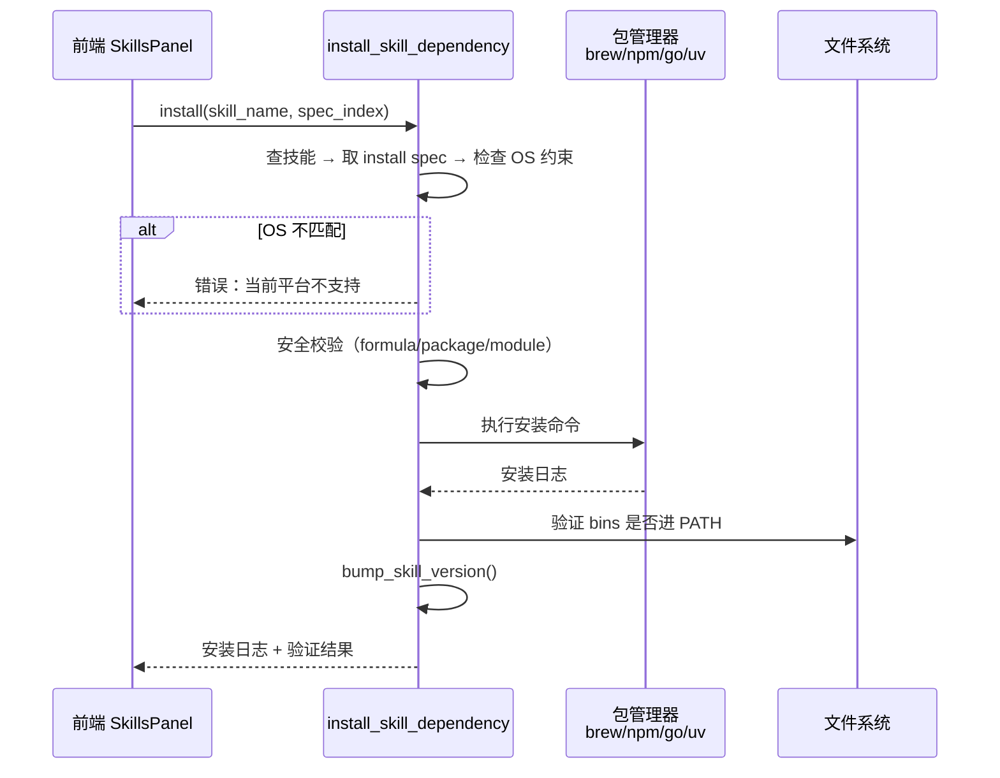

安装参数的安全校验：brew formula / npm package / go module 都不允许 `..` 或 `\`，brew formula 额外不许以 `-` 开头；OS 约束只在匹配当前平台时执行。

---

## 十五、前端 UI

### SkillsPanel 结构

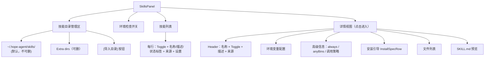

### 健康状态徽章

列表每行按 `SkillStatusEntry` 显示状态标签：

| 条件 | 标签 | 颜色 |
|------|------|------|
| `always == true` | "跳过依赖检查" | 绿 |
| `has_install == true` | "安装" | 蓝 |
| `disable_model_invocation == true` | "模型可调用: ✗" | 橙 |
| env 未配置 | ⚠️ | 橙 |

`SkillStatusEntry` 的完整形状见[附录](#附录类型定义速查)——除上述字段外还带 `hard_blocked` / `needs_setup` / `current_os` / `supported_os` / `missing_*`，供前端区分"硬不兼容"和"可修复"并显示缺什么。

### InstallSpecRow 状态流转

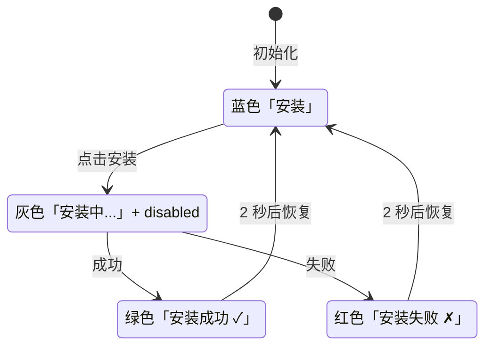

### SkillProgressBlock：对话流中的技能渲染器

模型每调一次 `skill` 工具，对话流挂载 `SkillProgressBlock.tsx` 而非通用 `ToolCallBlock`，视觉上区别于 read / exec：

| 特性 | 实现 |
|------|------|
| 路由 | `MessageContent.tsx` 中 `block.tool.name === "skill"` 分支独占渲染 |
| 不被分组 | `NO_GROUP_TOOLS` 含 `"skill"`，避免被连续 tool call 合并 |
| 图标 | `Puzzle` 🧩 + 琥珀色调，与 subagent 的灰蓝区分 |
| inline / fork 辨别 | 检查 tool_result 前缀 `Skill 'X' completed.`——只有 fork 带此格式 |
| 运行中 | `tool.result` 为空 → 旋转 Loader，标题禁点 |
| 展开 | 点标题 → 折叠区 markdown 渲染 tool_result（fork 自动去掉信封） |
| 流程标签 | 显示 `skill · fork` 或 `skill · inline` |

`SubagentEvent.skill_name` 字段已就绪，未来可在展开区内嵌子 Agent 的 mini-transcript；当前只显示最终摘要。

---

## 十六、数据流全景

### 技能注入到 LLM（全链路）

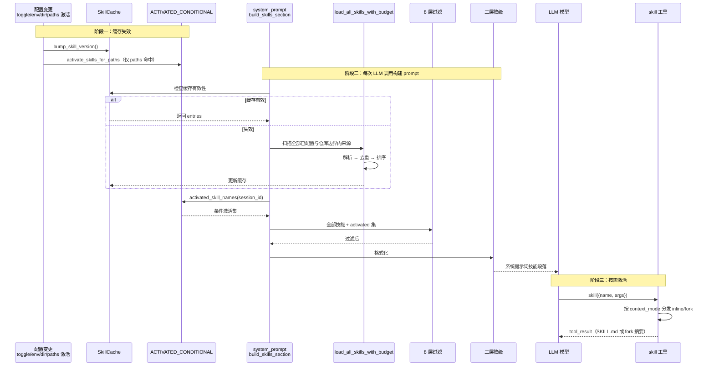

### 用户通过斜杠命令调用

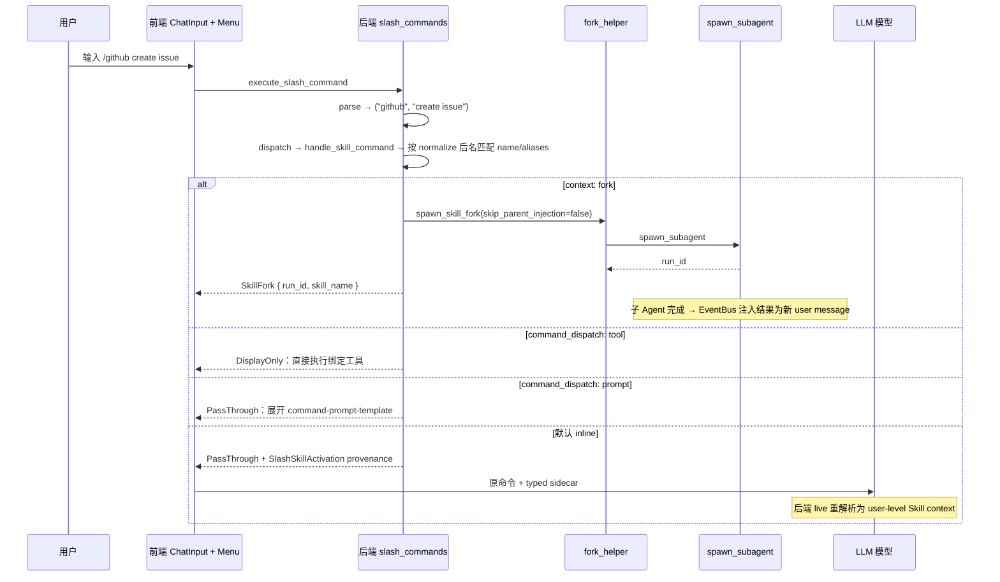

### Skill 与斜杠命令的统一

所有 `user-invocable` 技能自动注册为 Skill 分类的斜杠命令；`aliases:` 里的每个别名额外注册一条独立入口，都指向同一技能：

```
/review-pr   ← canonical
/pr-review   ← alias 1
/reviewpr    ← alias 2
```

命令名归一化（`github` → `github`；`My Cool Skill!` → `my_cool_skill`；空 → `skill`；超长截断到 32 字符）。canonical 与内置命令冲突加 `_skill` 后缀（`model` → `model_skill`），与其他技能冲突加数字后缀（`test` → `test_2`）；alias 走**同一** normalize 函数，冲撞时静默跳过、不覆盖 canonical——alias 是锦上添花，不抢坑位。

`command-dispatch: tool` + `command-tool: exec` 时后端直接执行绑定工具、返回 `DisplayOnly`，不再多走一轮 LLM。`command-arg-mode: raw` 把原始参数包成 `{ "command": "<args>" }`；否则先试解析 JSON，失败包成 `{ "query": "<args>" }`。

---

## 十七、内置技能

内置技能源自项目根目录 `skills/`，优先级最低。该目录经 `rust-embed` 在**编译期整树嵌入 `ha-skills`**（`skills/embedded.rs`），运行期按内容 hash 解压到 `~/.hope-agent/bundled-skills/<hash>/`（tmp 目录 + 原子 rename，并发安全；旧 hash 目录自动清理；整个目录是纯缓存，删除后下次启动重建）。因此**所有发行形态**——桌面 bundle、Docker、单 binary tar.gz、自升级 swap 后的新二进制——天然携带并自动更新内置技能，无需在构建产物里单独拷贝 `skills/`。

`resolve_bundled_skills_dir()` 按以下顺序定位内置技能目录：

1. 环境变量 `HOPE_AGENT_BUNDLED_SKILLS_DIR`（显式覆盖）
2. `CARGO_MANIFEST_DIR` 向上两级的 `skills/`（**仅 debug 构建**——直接读工作区源目录，技能编辑即时生效、不经解压）
3. 二进制内嵌技能解压目录（release 主路径）

同名技能会被高优先级来源（extra / managed / project）覆盖。

### 内置技能清单

发行物当前内置 28 个技能。"可见性"列区分：`always` 跳过依赖检查、`requires` 缺依赖时进目录但激活前诊断、`paths` 条件激活默认隐藏、其余全局可见。

| 技能 | 类别 | 可见性 | 说明 |
|------|------|--------|------|
| `ha-settings` | meta | `always` | 通过自然语言查看 / 修改 Hope Agent 设置，指导模型用 `get_settings` / `update_settings` / settings backup 工具 |
| `ha-skill-creator` | meta | `always` | 创建、编辑、改进、审核技能；含格式规范、评估思路和 frontmatter 指南 |
| `ha-find-skills` | meta | `always` | 当前 catalog 没有合适能力时，指导发现并安装第三方技能（安装第三方代码须先显式确认） |
| `ha-manual` | meta | 全局（`allowed-tools` 限只读工具集） | 从内置双语用户手册回答"怎么用 X / 设置 Y 在哪 / 面板 Z 干什么"，而非凭记忆猜 |
| `ha-browser` | meta | 全局（`@skill` 成员） | `browser` 工具方法论：`status → tabs → snapshot → act` 循环、stale-ref 恢复、登录 / 2FA / 验证码阻塞处理 |
| `ha-mac-control` | meta | 全局（macOS-only，`@skill` 成员）| `mac_control` 原生 macOS 桌面控制方法论：apps / dock / spaces / 视觉定位 / 菜单 / 窗口 / 对话框循环 |
| `ha-knowledge` | meta | 全局 | 知识空间笔记工作法：用 `note_*` 工具捕获 / 组织 / 关联 / 检索 / 维护 Markdown 笔记 |
| `ha-data-analytics` | meta | 全局（`@skill` 成员） | 本地优先数据分析与 Artifact 报告：CSV/XLSX 分析、KPI、指标诊断、图表、可分享离线产物，产出 AnalysisArtifactV1 契约 |
| `ha-logs` | meta | `requires.anyBins: [sqlite3, python3]` | 自助诊断：经 `exec` 直查本地 `logs / sessions / background_jobs` SQLite（只读 SELECT）排查问题、分析用量 |
| `ha-data-stores` | meta | 全局 | Hope Agent 本地数据存储地图 + 安全只读查询流程（sessions.db / memory.db / logs.db / knowledge index 等） |
| `ha-self-diagnosis` | meta | 全局（`context: fork`） | 自我理解与问题上报：解释内部运作、诊断日志、创建 / 提交 GitHub issue |
| `ha-self-update` | meta | 全局（`always: false`） | 通过对话检查并安装更新；覆盖桌面 bundle / server 包管理 / headless 单 binary 三形态，始终经 `ask_user_question` 确认 |
| `feishu` | 办公集成 | `paths:` 飞书 / feishu / lark 文件名触发；`allowed-tools` 限 `feishu_*` + `read` / `web_search` | 飞书 / Lark workspace 操作：云文档 / 多维表格 / 云盘 / 知识库 / 审批 / 日历 / 联系人 / 招聘 |
| `ha-coding-common` | 编程方法论 | `paths:` 代码文件触发 | 仓库优先、保护用户改动、任务分级、范围控制和交付基线 |
| `ha-coding-plan` | 编程方法论 | `paths:` 代码文件触发 | 基于现有代码设计依赖、关键文件、风险、验证和完成信号 |
| `ha-debug` | 编程方法论 | `paths:` 代码文件触发 | 复现或刻画故障、可证伪假设、最小根因修复和回归证据 |
| `ha-test-strategy` | 编程方法论 | `paths:` 代码文件触发 | 按风险选 test-first / regression-first / characterization / 集成 / E2E / 人工证据 |
| `ha-code-review` | 编程方法论 | `paths:` 代码文件触发 | findings-first；候选发现与独立验证分离，高风险时才启用独立 reviewer |
| `ha-multi-agent-coding` | 编程方法论 | `paths:` 代码文件触发 | 有界 fan-out、隔离、结构化阶段结果、主动查询、steer/cancel 和主 Agent 综合 |
| `ha-verify` | 编程方法论 | `paths:` 代码文件触发 | criteria-to-evidence、最小充分检查、证据时效和诚实完成审计 |
| `ha-workflow-script` | 编程方法论 | `paths:` 代码文件触发 | durable Workflow：typed result、parallel/pipeline、预算、replay、阶段消费和 closure gate |
| `meeting-notes` | 办公方法论 | 全局 | 会议记录 / standup / 1:1 纪要模板：议程、决策、行动项、开放问题 |
| `email-draft` | 办公方法论 | 全局 | 邮件起草、润色、翻译和回复，输出 subject / greeting / body / sign-off |
| `status-report` | 办公方法论 | 全局 | 周报 / 月报 / 项目进展，覆盖 shipped / in-flight / blocked / metrics |
| `mermaid-diagram` | 办公方法论 | 全局 | Mermaid flowchart / sequence / ER / state / gantt 等图表，聊天端可原生渲染 |
| `office-docx` | Office 文件 | `requires.bins: [python3]`（`@skill` 成员） | 创建 / 编辑 / 检查 Word `.docx`：列表、批注、修订、图片 alt、TOC、脚注、水印、保护、内容控件、表格、合并、对比、PDF/PNG 预览 |
| `office-xlsx` | Office 文件 | `requires.bins: [python3]`（`@skill` 成员） | 创建 / 编辑 / 检查 Excel `.xlsx`：公式、样式、表格、数据验证、条件格式、图表、CSV/TSV、公式审计、LibreOffice 重算、预览 |
| `office-pptx` | Office 文件 | `requires.bins: [python3]`（`@skill` 成员） | 创建 / 编辑 / 检查 PowerPoint `.pptx`：标题/章节/图文/表格/时间线、native chart、文本 patch、复制重排 slide、预览 |

### 编程方法论技能：只提供方法，不放权

内置的编程方法论技能全部由 Hope 原生维护，以当前已实现的 Agent Control、工具、权限、后台任务和 worktree 语义为事实基础。它们只提供按需方法论，**不能开启 / 关闭任何控制面或权限**：

- 不能开关 Goal / Plan / Workflow / Loop / 执行模式 / 权限模式。控制面各司其职——Goal 定义持久结果和完成标准、Plan 描述当前实施路径、Task 展示真实进度、Workflow 执行一次 durable orchestration、Loop 决定何时再触发、Worktree 隔离写入。
- 权限、protected path、审批、只读工具集、配额、child ownership、replay、closure gate 全部由 runtime 强制，skill 文本不能放宽。
- Workflow 子 Agent 的终态只代表编排状态；主 Agent 仍须消费、综合、验证并回答用户，不能把"Agent 已完成"当作用户任务完成。

**Coding Session Profile 路由**（`crates/ha-core/src/agent/coding_profile.rs`）对每个用户 turn 做轻量确定性分类，输出动态 prompt suffix（不进静态 prefix），推荐最小必要组合、最多 3 个不重复：

| 场景 | 推荐技能 | 计划策略 |
|------|----------|----------|
| Review | `ha-code-review`, `ha-verify` | review-only，不自动修复 |
| Debug | `ha-debug`, `ha-test-strategy`, `ha-verify` | 证据和回归优先 |
| 小 Feature | `ha-coding-common`, `ha-test-strategy`, `ha-verify` | 直接实施，不做 plan 仪式 |
| 复杂 Feature | `ha-coding-common`, `ha-coding-plan`, `ha-verify` | 基于仓库证据计划，非 Plan Mode 时继续执行 |
| Workflow Script | `ha-workflow-script`, `ha-multi-agent-coding`, `ha-verify` | durable script + 有界编排 |
| Verify | `ha-verify` | 逐要求核对直接证据 |
| General coding | `ha-coding-common`, `ha-verify` | 轻量执行 |

"复杂 Feature"由跨模块、迁移、架构、端到端、完整实现或长输入等保守信号判定。泛化的"工作流、复核、验证、报错"只有同时存在 coding 上下文时才进 Coding Profile；业务审批、合同复核、设备排障、旅行计划等非 coding 请求不注入 coding suffix。

这 8 个编程技能都声明代码扩展名 `paths:`，默认不占目录；会话触碰匹配文件后进目录，Coding Profile 也能在首次读文件前按稳定名称推荐它们（`skill` 工具从完整 invocable catalog 按名加载，不受 prompt 可见性过滤影响）。维护门禁：每个 body < 8 KiB、8 个 description 合计 < 2400 bytes、推荐名必须存在且 active、单 turn ≤ 3 个、服从用户与仓库 `AGENTS.md`（不得硬编码全套测试 / 固定双审 / 每任务必起新 Agent / 强制 test-first）。

### Office 三件套维护契约

Office 三件套是 **skill + bundled scripts**，不是内置 tool。它们默认只要求 `python3`（生成 / 编辑 / 检查 OOXML 主要走 Python stdlib）；LibreOffice 和 `pdftoppm` / `magick` 是视觉预览与重算的可选运行时，缺失时由 `check_env.py` 和激活后的工作流诊断，不把整项技能从 catalog 硬隐藏。

改动这三个技能后至少跑定向检查：

```bash
PYTHONDONTWRITEBYTECODE=1 python3 scripts/office-skill-parity-audit.py
PYTHONDONTWRITEBYTECODE=1 python3 scripts/office-skill-smoke-test.py
```

`parity-audit` 是能力清单审计（确认三件套表面能力覆盖），`smoke-test` 是端到端 smoke（实际生成 / 编辑 / 检查 / 渲染 DOCX、XLSX、PPTX）。回归点包括：DOCX 追加 body 必须插在最终 `w:sectPr` 之前；水印 / 页眉 helper 分配不冲突的 `headerN.xml` 与 relationship id、不覆盖用户既有页眉；PPTX drop / reorder slide 只删被丢弃 slide 的 relationships、保留 master / theme / view properties；XLSX patch / formula cache 只改目标 worksheet/cell、保留其它 package parts。

### settings 技能工具

`get_settings` / `update_settings` / settings backup 工具是 deferred 工具（经 `tool_search` 发现），`ha-settings` 只提供何时、如何安全调用它们的工作流：

- `get_settings(category)`：读指定分类，返回 JSON；`category: "all"` 返回所有分类概览
- `update_settings(category, values)`：partial merge（递归深合并），只传要改的字段
- `list_settings_backups()` / `restore_settings_backup(id)`：查看和回滚自动快照（高风险，须显式确认）

安全限制：`active_model` / `fallback_models` 只读；不允许修改 Provider 列表 / API Key 等涉及凭据的设置；高风险分类（Channel / Dangerous Mode / remote install）必须二次确认。详见 [ha-settings 设置约定](../../../AGENTS.md)。

---

## 十八、编写第一个 Skill

### 1. 创建目录

推荐用脚手架脚本一键生成骨架——带全部 frontmatter stub + 按需的 `scripts/` / `references/` / `assets/` 子目录：

```bash
python skills/ha-skill-creator/scripts/init_skill.py my-tool \
  --resources scripts,references \
  --context fork \
  --examples
```

`--path` 缺省时：cwd 在 git 仓库内 → `.hope-agent/skills/<name>/`（项目级），否则 `~/.hope-agent/skills/<name>/`（用户级）。也可手动 `mkdir -p ~/.hope-agent/skills/my-tool` 再写 SKILL.md。

### 2. 编写 SKILL.md

```markdown
---
name: my-tool
description: "Interact with my custom tool via CLI"
requires:
  bins: [my-tool]
  os: [darwin, linux]
install:
  - kind: brew
    formula: my-org/tap/my-tool
    bins: [my-tool]
    label: "Install via Homebrew"
---

# My Tool Skill

When the user asks about my-tool operations, use the `my-tool` CLI.

## Usage
- `my-tool status` — Show current status
- `my-tool deploy --env production` — Deploy to production

## Important Notes
- Always confirm destructive operations with the user
```

### 3. 验证

1. 打开设置面板 → Skills，确认 "my-tool" 出现在列表
2. 若显示黄色警告，点进去配置环境变量
3. 聊天里输入 "/" 看是否出现 `/my_tool` 命令
4. 对话中测试："帮我查看 my-tool 的状态"

### 4. 高级选项

```yaml
# 仅用户可调用（隐藏于模型）
user-invocable: true
disable-model-invocation: true

# 绑定到特定工具
command-dispatch: tool
command-tool: exec

# 跳过依赖检查（不代表不可关闭）
always: true

# Fork 模式（多轮 exec 密集型推荐）
context: fork
allowed-tools: [read, exec, grep]   # 限定子 Agent 工具范围
agent: code-reviewer                # 可选：指定子 Agent 身份
effort: high                        # 可选：提高推理强度

# 条件激活（文件类型专属）
paths:
  - "*.py"
  - "pyproject.toml"

# 草稿（自动创建产物，用户审核后转 active）
status: draft
authored-by: auto-review
rationale: "Detected reusable git workflow during recent session"
```

Fork 模式下主对话只会看到一条 `Skill 'X' completed.\n\nResult:\n<text>` 摘要，子 Agent 的多轮 exec / tool call 不污染主 context。声明 `paths:` 的技能在新会话不进 catalog，模型或用户 `read/write/edit` 一个匹配文件后自动加入。

---

## 附录：类型定义速查

### Rust 核心类型

```rust
// 技能条目（wire 契约，ha-core/skills/types.rs）
pub struct SkillEntry {
    pub name: String,
    pub aliases: Vec<String>,             // 额外斜杠命令名，冲突静默跳过
    pub description: String,              // "这是什么"
    pub when_to_use: Option<String>,      // "什么时候用"，catalog 渲染 "— when: ..."
    pub source: String,                   // "bundled" | "managed" | "project" | 目录名
    pub file_path: String,
    pub base_dir: String,
    pub requires: SkillRequires,
    pub skill_key: Option<String>,
    pub user_invocable: Option<bool>,
    pub disable_model_invocation: Option<bool>,
    pub command_dispatch: Option<String>,
    pub command_tool: Option<String>,
    pub command_arg_mode: Option<String>,
    pub command_arg_placeholder: Option<String>,   // == argument-hint
    pub command_arg_options: Option<Vec<String>>,
    pub command_prompt_template: Option<String>,
    pub install: Vec<SkillInstallSpec>,
    pub allowed_tools: Vec<String>,       // 非空 Restricted 列表
    pub allowed_tools_declared: bool,     // false=Unspecified；true+空=DenyAll
    pub context_mode: Option<String>,     // "fork" 或 None（inline）
    pub agent: Option<String>,            // fork 时的子 Agent id
    pub effort: Option<String>,           // low/medium/high/xhigh/none
    pub paths: Option<Vec<String>>,       // gitignore 模式；声明后默认隐藏
    pub status: SkillStatus,              // Active / Draft / Archived
    pub authored_by: Option<String>,
    pub rationale: Option<String>,
    pub display: SkillDisplay,            // 展示元数据（emoji/tags/version/license/author）
}

// 环境要求
pub struct SkillRequires {
    pub bins: Vec<String>,        // AND
    pub any_bins: Vec<String>,    // OR
    pub env: Vec<String>,         // AND
    pub os: Vec<String>,          // ANY
    pub config: Vec<String>,      // AND
    pub always: bool,             // 跳过 requirements 检查；不是 locked
    pub primary_env: Option<String>,
}

// 安装规格
pub struct SkillInstallSpec {
    pub kind: String,             // brew | node | go | uv；download 保留但不可执行
    pub formula: Option<String>,
    pub package: Option<String>,
    pub go_module: Option<String>,  // serde rename "module"
    pub bins: Vec<String>,
    pub label: Option<String>,
    pub os: Vec<String>,
}

// SpawnParams 的 skill 相关字段（fork_helper 内填充）
pub struct SpawnParams {
    // ... 其他字段
    pub skill_allowed_tools: Vec<String>,     // SKILL.md 的 allowed-tools
    pub skip_parent_injection: bool,          // skill 工具 fork 路径为 true
    // SKILL.md 已放进 task/current user request，不进入 run/system context
    pub reasoning_effort: Option<String>,     // SKILL.md 的 effort
    pub skill_name: Option<String>,           // 让 SubagentEvent 能辨别
}

// 健康状态（get_skills_status 返回）
pub struct SkillStatusEntry {
    pub name: String,
    pub source: String,
    pub eligible: bool,
    pub hard_blocked: bool,       // 不可修复（如 OS 不匹配）
    pub needs_setup: bool,        // 可修复的缺依赖 / 缺配置
    pub disabled: bool,
    pub blocked_by_allowlist: bool,
    pub current_os: Option<String>,
    pub supported_os: Vec<String>,
    pub missing_bins: Vec<String>,
    pub missing_any_bins: Vec<String>,
    pub missing_env: Vec<String>,
    pub missing_config: Vec<String>,
    pub has_install: bool,
    pub always: bool,             // 跳过 requirements 检查；不是 locked
}

// Prompt 预算（默认 150 / 30,000 / 256 KB / 300）
pub struct SkillPromptBudget {
    pub max_count: usize,
    pub max_chars: usize,
    pub max_file_bytes: u64,
    pub max_candidates_per_root: usize,
}
```

### TypeScript 核心类型

```typescript
interface SkillSummary {
  name: string
  description: string
  source: string
  base_dir: string
  enabled: boolean
  requires_env: string[]
  skill_key?: string
  user_invocable?: boolean
  disable_model_invocation?: boolean
  has_install?: boolean
  any_bins?: string[]
  always?: boolean                // 跳过 requirements 检查；不是 locked
  allowed_tools?: string[]
  context_mode?: string           // "fork" | undefined
  agent?: string
  effort?: string                 // "low" | "medium" | "high" | "xhigh" | "none"
  paths?: string[]
  status?: "active" | "draft" | "archived"
  authored_by?: string
}

type CommandCategory = "session" | "model" | "memory" | "agent" | "utility" | "skill"

interface SlashCommandDef {
  name: string
  category: CommandCategory
  descriptionKey: string
  hasArgs: boolean
  argPlaceholder?: string
  argOptions?: string[]
  descriptionRaw?: string  // skill 命令的原始描述
}
```
