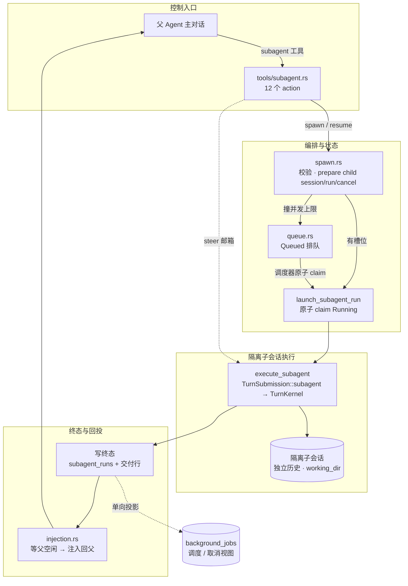
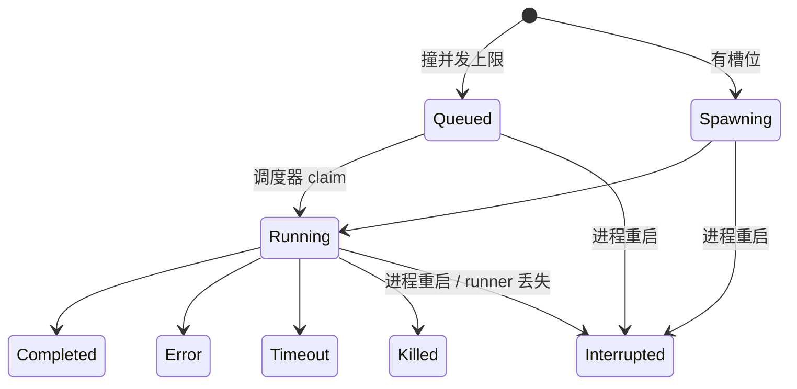
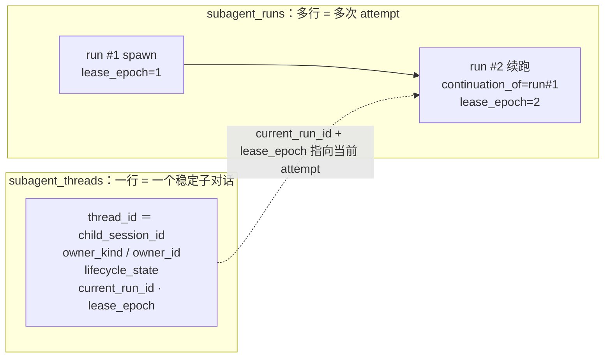
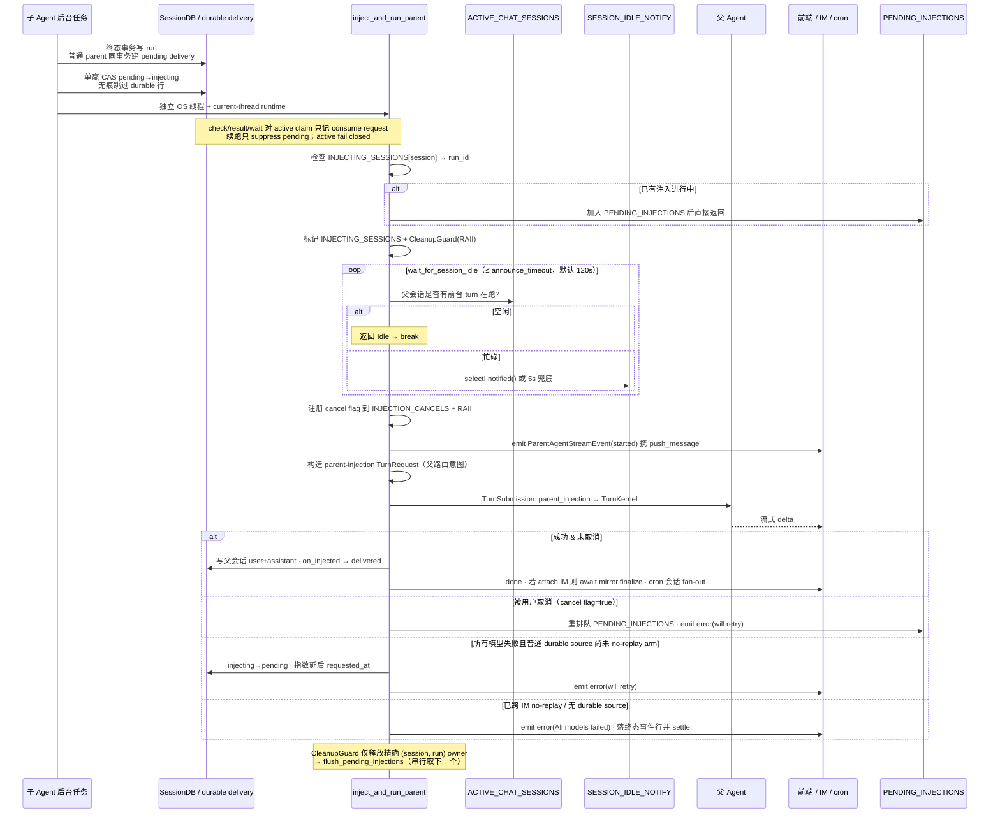
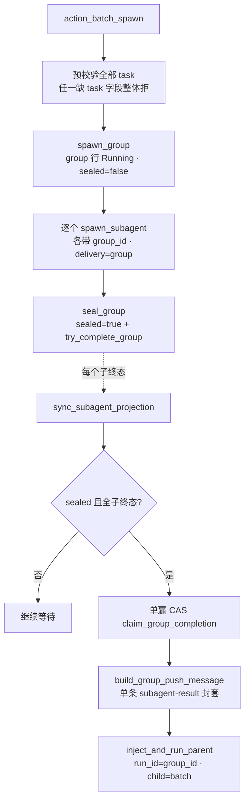

# 子 Agent 系统架构
> 返回 [文档索引](../../README.md) | 更新时间：2026-08-10

关联源码：`crates/ha-core/src/subagent/`（编排与状态机）、`crates/ha-core/src/session/subagent_db.rs`（SQLite 台账）、`crates/ha-core/src/tools/subagent.rs`（工具接口）、`crates/ha-core/src/async_jobs/`（统一后台任务投影）。

## 核心思想

主 Agent 有时需要把一段可以独立完成的工作「外包」出去：并行探索多个方案、跑一段长任务、用一个更专精的 Agent 处理子问题。子 Agent 系统就是这个委派机制。它要同时满足几个看似矛盾的诉求：

- **异步不阻塞**：父 Agent 委派后应能立刻结束本轮，而不是同步干等子任务跑完。
- **隔离**：子任务不该污染父会话的对话历史，也不该（默认）污染父会话的工作目录。
- **结果自动回来**：子任务完成后，结果要**自动回注**父会话并触发父 Agent 继续对话，而不是让父 Agent 反复轮询。
- **崩溃可恢复**：进程随时可能被 kill。「子已完成、父还没收到」这个窗口里崩溃，重启后结果必须补投一次、且**只投一次**。

系统用几个关键设计撑起这些诉求：

1. **隔离子会话 + 可分阶段启动的后台任务**。每个子 Agent 跑在一个通过 `create_session_with_parent` 新建的隔离会话里，拥有独立的对话历史与工作目录；普通入口 prepare 后立即 launch，执行体是 `tokio::spawn` 后台任务，父 Agent 拿到 `run_id` 后返回。Team 等需要先绑定控制面身份的入口可持有不可复制的 `PreparedSubagentSpawn`，在 durable attach 成功前绝不入队、发 hook 或启动执行。

2. **持久化状态机是唯一真相源**。`subagent_runs` 表里每一行是一次不可变的执行尝试（attempt），八态状态机（见下）记录它的生命周期。内存里的取消 flag、邮箱、注入队列都只是**进程内加速通道**；权威判定一律回落 SQLite。

3. **Thread / Attempt 分层 + 单写者 fence**。一个「子对话」（thread）可以有多次 attempt（初次 + 续跑），thread 表用 `current_run_id + lease_epoch` 做单写者围栏——旧进程晚到的完成回调会被 fence 成一次「成功的空操作」，绝不会把已终态的 run 从终态改回运行中。

4. **事件驱动的结果回注**。回注不轮询：靠 `SESSION_IDLE_NOTIFY` 等父会话空闲，靠 `ChatSessionGuard` 保证「用户消息永远优先于自动注入」，被抢占的注入进队列在父会话空闲后串行重试。终态与「待交付」行在**同一事务**写入，配合单赢 CAS，保证崩溃后精确一次投递。

5. **资源类排队，结构类硬拒**。撞到「单会话并发上限」这种**资源**约束时不拒绝而是排队（`Queued`），等槽位空出再提升；而深度、批量大小、Agent 不存在、能力开关这类**结构**约束——等待也变不合法——直接硬拒。

6. **单向投影进统一后台任务面**。用户委派的后台子 Agent 会被**单向投影**进 `background_jobs` 表，从而和普通后台工具任务一样出现在 `job_status` 的列表 / 取消面里；投影只承载调度与生命周期，**绝不持有正文、绝不反写**真相源。

理解这套系统的关键，是始终区分**真相源**（`subagent_runs` 及其 durable 控制表）与**加速通道 / 派生视图**（内存静态量、`background_jobs` 投影）：前者决定行为，后者只为性能与可视化服务。

## 全景



## 模块结构

子 Agent 的**编排机器**集中在 `ha-core::subagent`；对 `sessions.db` 的 **SQL 台账**留在 kernel 的 `session::subagent_db`；面向模型的**工具接口**在 `tools::subagent`；统一后台任务**投影**属于 `async_jobs`。

| 文件 | 职责 |
|------|------|
| `subagent/mod.rs` | 模块入口、深度 / 并发 / 超时 / 截断常量、进程级全局静态量、`request_cancel_run` 统一取消入口、re-exports |
| `subagent/types.rs` | `SubagentRun` / `SubagentThread` / `SpawnParams`、Owner / Delivery / ThreadState / TerminalReason 枚举、`SubagentStatus`、前端事件类型 |
| `subagent/spawn.rs` | `spawn_subagent` / `resume_subagent` 入口；`prepare_subagent` → `launch_prepared_subagent` 两阶段原语、最终执行 claim、无执行终态清理、`execute_subagent` 后台执行与父交付分发 |
| `subagent/queue.rs` | 并发排队：`PendingSubagentSpawn` 内存等待队列 + per-session 提升调度器 `run_subagent_scheduler` |
| `subagent/injection.rs` | `inject_and_run_parent` 结果回注 + `wait_for_session_idle` + `PendingInjection` 重试队列 + push message 构建 |
| `subagent/cancel.rs` | `SubagentCancelRegistry`：进程内 `AtomicBool` 取消 flag 注册表 |
| `subagent/mailbox.rs` | `SubagentMailbox`（per-run steer 队列）+ `ChatSessionGuard`（前台 turn 的 RAII 标记） |
| `subagent/helpers.rs` | 事件发射、UTF-8 安全截断、`CleanupGuard`、启动孤儿清理、`mark_run_fetched` |
| `session/subagent_db.rs` | SQLite 台账：run / thread / dispatch / delivery 读写、终态 choke point、活跃计数、启动 sweep |
| `tools/subagent.rs` | 工具接口层：canonical `send` + spawn / query / cancel / batch / wait 与 resume / steer 兼容 alias、owner 校验、异步 DB 路由 |

## `@agent`：模型可见引用，不是直接路由

Composer 的 `@` 候选来自当前 runnable Agent 列表，包含当前 Agent 本身；self target 表示让同一 Agent 配置 fork 一个独立 child 做并行工作，因此只有一个 Agent 的安装也必须有候选。选择 Agent 时会写入可读 token `[@别名](#agent:<id>)` 和 typed sidecar。`prompt_context` 校验 canonical text digest、UTF-8 source anchor 与目标后，才根据当前 principal 的 subagent capability/allowlist 生成 turn-scoped `agent_ref_*`。给模型的内容只有 mention id、opaque ref、有界 display alias/能力摘要和原文位置；不会复制目标 Agent 的 system prompt、凭据，也不会创建 child。

主模型看到完整用户请求后自行决定是否、何时及如何调用正常 `subagent` 工具。例如“先完成 A，然后让 @agent甲 完成 B”仍由主模型先完成 A，再用 `agent_ref` 与 B（以及必要的 A 结果）发起 `spawn` 或 `spawn_and_wait`；mention resolver 本身保持零 tool call、零 approval、零 run/outbox/group。

执行层接受互斥的 `agent_ref` / `agent_id`：

- `spawn` / `spawn_and_wait` 可直接使用当前 turn 的 `agent_ref`；`batch_spawn.tasks[]` 各自接受 `agent_ref`，并在建 Group 前预检完整 target 集合。
- ref 必须同时匹配 parent session、parent turn 与 principal Agent；复制到别的 turn/session/Agent 会失败。
- 执行时重新检查目标仍存在、principal capability/allowlist、tool fate、permission、depth、queue、sandbox、KB lineage 与 cancel，mention 不授权或扩权。
- 工具成功回执附 `agentBinding { mentionId, bindingRef, admission, runId }`。`spawn` 只表示 accepted/pending；只有终态 result 才表示 completed。
- 无 typed sidecar 的手写/粘贴 markdown 不再解析；旧 `subagent/mention.rs` 字符串扫描路径已删除。

## 数据模型

### SubagentStatus（八态状态机）



- **`Queued`**：撞到单会话并发上限时入队等待。它是**非终态、不持槽位**——被活跃计数 `count_active_subagent_runs` 的 `status IN ('spawning','running')` 谓词刻意排除。若不排除，排队项会撑高自己所在会话的活跃计数，导致「永远达不到腾出槽位的条件」而死锁。调度器在槽位空出时用 guarded `Queued → Running` CAS 取得唯一执行权；Team 排队项把 roster fence 带到同一条 claim。
- **终态**：`Completed | Error | Timeout | Killed | Interrupted` 的 `is_terminal()` 均为 `true`；`Queued | Spawning | Running` 为非终态。
- **`Interrupted`**：基础设施级终态，不伪装成模型错误。启动恢复把上个进程遗留的 live attempt 原子改为该状态，并保留稳定的 `terminal_reason = process_interrupted`，供续跑建议与审计使用。

### Prepare → launch 执行边界

`prepare_subagent` 只完成结构校验、Agent lifecycle admission、child session/workdir、`subagent_threads` / `subagent_runs` 持久化、可选后台任务投影与 cancel flag 注册，返回不可 Clone 的 prepared handle；此时没有 queue entry、mailbox、`SubagentStart`、事件或 executor。调用者只有两条合法收尾路径：`launch_prepared_subagent`，或 `discard_prepared_subagent` 将 run 无执行地收敛为 Killed 并清 cancel/mailbox/queue。

最终 launch 先检查 cancel，再以 guarded `Queued|Spawning → Running` CAS 取得执行权，成功后再次检查 cancel，之后才注册 mailbox、发事件/hook 和 `tokio::spawn`；task 内在任何 config/provider/chat-engine/LLM/tool 工作前再观察一次 cancel。Team fence 把 `Team=Active + member=Working + exact run/session` 加进同一个 SQL claim，不依赖 read-before-write。最终 claim 若因 SQLite/I/O 错误返回，launcher 在传播原始错误前 best-effort 调用同一无执行收敛路径，避免已持久化的 `Spawning` run、cancel token 与并发占位残留；Team 调用方随后按 exact run/session fence 恢复 roster。prepare 与 enqueue 之间若已被取消，enqueue 后立即复查同一 flag：赢得 queue mutex 就本地终态化，若 scheduler 已取走则由其 launch precheck 收敛，因此无槽位时也不会遗留 phantom Queued run。

### Thread / Attempt 身份与单写者围栏

子对话身份与单次执行是两个层次，这是理解续跑与崩溃恢复的关键。



- **`thread_id`** 是稳定的子对话身份，当前实现等于 `child_session_id`；同一 thread 复用对话历史与工作目录。
- **`run_id`** 是一次不可变 attempt（UUID）。续跑只新增 attempt，用 `continuation_of_run_id` 连接前驱，绝不把旧 run 从终态改回运行中。
- **`current_run_id + lease_epoch`** 是单写者围栏。所有生命周期写入（`update_subagent_status_with_reason`）的 SQL 都要求 attempt 的 epoch / run id 命中 thread 表的当前值；旧 worker 的晚到完成回调因此是一次**成功的空操作**（`changed == 0` 直接 `Ok`），不会扰动已接管的新 attempt。
- **`owner_kind + owner_id`** 是稳定控制域，取值 `parent_session` / `workflow` / `team` / `internal`。**知道 run id 不等于获得控制权**：普通父 Agent 不能 steer / resume / cancel 属于 Workflow 或 Team 的 thread。
- **`lifecycle_state`** 取值 `open | user_stopped | quarantined | closed`，是 thread 的控制契约；续跑执行层只接受 `open`。当前不提供模型可调用的 reopen，也不跑心跳看门狗自动切 `quarantined`；`Killed` 与不可恢复的 `terminal_reason` 已在 run 层 fail closed。

### SubagentRun（SQLite 持久化记录）

`subagent_runs` 表每行是一次 attempt。字段与 `types.rs` 中的 `SubagentRun` 一一对应：

| 字段 | 类型 | 说明 |
|------|------|------|
| `run_id` | `String` | UUID，attempt 唯一标识 |
| `thread_id` | `String` | 稳定子对话标识；多个 continuation attempt 共享（等于 `child_session_id`） |
| `parent_session_id` | `String` | 父会话 ID |
| `parent_agent_id` | `String` | 父 Agent ID |
| `child_agent_id` | `String` | 子 Agent ID（如 `"ha-main"`） |
| `child_session_id` | `String` | 隔离子会话 ID（`create_session_with_parent` 创建，关联父会话） |
| `task` | `String` | 任务描述原文 |
| `status` | `SubagentStatus` | 八态状态枚举 |
| `result` | `Option<String>` | 执行结果文本，截断至 `MAX_RESULT_CHARS = 10,000` 字符 |
| `error` | `Option<String>` | 错误信息 |
| `depth` | `u32` | 嵌套深度（从 1 开始，每级 +1） |
| `model_used` | `Option<String>` | 实际使用的模型标识（`provider_id::model_id`） |
| `started_at` | `String` | 创建时间（RFC 3339） |
| `finished_at` | `Option<String>` | 完成时间（RFC 3339） |
| `duration_ms` | `Option<u64>` | 执行耗时（毫秒） |
| `label` | `Option<String>` | 可选显示标签，用于前端追踪 |
| `attachment_count` | `u32` | 传入附件数量 |
| `input_tokens` / `output_tokens` | `Option<u64>` | 终态 attempt 的 token 用量；Provider 未返回 usage 时为 `None` |
| `continuation_of_run_id` | `Option<String>` | 前一 attempt；初次 spawn 为 `None` |
| `trigger_kind` | `String` | 稳定触发来源：`spawn` / `parent_followup` / `workflow_resume` / `internal` |
| `terminal_reason` | `Option<SubagentTerminalReason>` | 稳定终止分类，用于恢复建议与审计 |
| `runner_owner` / `lease_epoch` / `last_heartbeat_at` | | 进程 / attempt fencing 与恢复诊断；心跳在生命周期转换时刷新，不跑独立轮询 ticker |
| `delivery_kind` | `parent \| group \| workflow \| none` | 结果交付域，执行层真相源 |
| `launch_spec_json` | `Option<String>` | 不含凭据 / 附件正文的续跑规格摘要 |
| `owner_kind` / `owner_id` | | thread 控制域；普通 session 不得接管 Workflow / Team / internal |

### Durable 控制与交付表

除 `subagent_runs` 外，还有四张 durable 表分别管控制域、交付与 provider 恢复，均定义在 `session/db.rs`：

| 表 | 作用 |
| --- | --- |
| `subagent_threads` | 稳定 thread、owner、lifecycle、`current_run_id`、`lease_epoch` |
| `subagent_dispatches` | steer / resume 指令的 accepted / delivered / refused 审计与排队恢复 provenance |
| `subagent_result_deliveries` | 普通父会话结果的 `pending / injecting / injecting_no_replay / delivered / suppressed` CAS；启动只恢复可证明安全的普通 claim |
| `subagent_provider_recovery` | 当前 attempt 的外层 provider 恢复次数、下次重试时间与脱敏错误；run 本身在退避期仍是 `running`，成功或终态时删除 |

**精确一次投递的关键**：run 终态与普通 parent delivery 在同一事务写入；唯一例外是 `Interrupted(session_paused)`，它是 Continue 控制回执，不另建 parent delivery，避免迟到终态与 Continue turn 并发回注。其它被同一 Stop 捕获、但在暂停/崩溃窗口才落终态的 delivery，也在消费 pause receipt 时改为 `session_continue_uses_runtime_recovery`，由 Continue 的精确 run-id 列表读取，不另起父回合。显式 `check / result / wait` 对 `pending` 立即 suppress；若 claim 已 active，只写 durable consume request，由 claim owner 收尾为 `suppressed`。续跑事务只准抢占仍为 `pending` 的 predecessor；遇 `injecting` / `injecting_no_replay` 必须 fail closed，等当前 injector 到终态后重试。

Primary 启动把带 consume request 的普通 `injecting` 收敛为 `suppressed`，其余普通 claim 重置 `pending`；`injecting_no_replay` 可能已经跨过 IM provider mutation 边界，且新 Primary 无法证明旧 Secondary owner 已退出，因此既不 replay 也不自动 terminalize。已消费或可能外显的结果不会因重启重复回注。

### 终止原因与续跑判定

`SubagentTerminalReason` 是持久化诊断枚举，**不从自由文本反推**。它有两个纯函数级判定：`resume_allowed()`（reason 级硬闸）与 `resume_recommended()`（更窄的诊断建议）。**两者都不自动创建 attempt**——真正续跑仍须同时通过 thread 为 `open`、owner 一致、source 是当前终态 attempt、单写者 fence，以及实时的权限 / Plan / sandbox / KB / Agent capability 检查。

| terminal reason | 典型 status | resume allowed | resume recommended | 语义 |
| --- | --- | --- | --- | --- |
| `success` | Completed | 是 | 否 | 允许正常 follow-up，不属故障恢复 |
| `provider_exhausted` | Error | 是 | 是 | Provider 链耗尽，可由上层显式续跑 |
| `model_error` | Error | 是 | 否 | 需由父 Agent / Workflow 判断 |
| `tool_error` | Error | 是 | 否 | 先检查部分副作用，再决定续跑 |
| `deadline_exceeded` | Timeout | 是 | 是 | 超时后可显式续跑 |
| `process_interrupted` | Interrupted | 是 | 是 | 进程 / runner 丢失，启动恢复的标准分类 |
| `session_paused` | Interrupted | 是 | 是 | session Stop 中断本 attempt；Continue 在同一 thread 创建新 attempt |
| `runner_panic` | Error | 是 | 否 | 不自动重试，交上层判断 |
| `invalid_typed_output` | Error | 是 | 否 | 先走已有的有界 schema repair |
| `approval_denied` | Error | 否 | 否 | 不得借续跑绕过拒绝 |
| `user_killed` | Killed | 否 | 否 | 用户停止是硬边界 |
| `parent_cancelled` | Killed | 否 | 否 | 跟随父生命周期 |
| `workflow_cancelled` | Killed | 否 | 否 | 跟随 Workflow 生命周期 |
| `queue_payload_unavailable` | Interrupted / Error | 是 | 否 | 兼容 / 诊断枚举；当前启动 sweep 统一写 `process_interrupted` |
| `unknown` | Error | 是 | 否 | 历史或不可判定错误；允许人工决策，不建议自动恢复 |

判定实现：`resume_allowed()` 只对 `approval_denied` / `user_killed` / `parent_cancelled` / `workflow_cancelled` 返 `false`，其余全 `true`；`resume_recommended()` 只对 `provider_exhausted` / `deadline_exceeded` / `process_interrupted` / `session_paused` 返 `true`。

### SpawnParams（调用参数）

`spawn_subagent` / `resume_subagent` 的入参。多数字段来自工具层解析，少数由 Plan / Skill / Workflow / IM 等上层调用者设置：

| 字段 | 类型 | 说明 |
|------|------|------|
| `task` | `String` | 任务描述 |
| `agent_id` | `String` | 目标（子）Agent ID |
| `parent_session_id` / `parent_agent_id` | `String` | 父会话 / 父 Agent |
| `depth` | `u32` | 当前嵌套深度 |
| `timeout_secs` | `Option<u64>` | 超时秒数；`None` 用父 Agent 默认（产品默认 `0` = 不超时），显式 `0` 也表示不超时，正数由工具层 cap 到 1800 |
| `model_override` | `Option<String>` | 模型覆盖（优先级最高） |
| `label` | `Option<String>` | 显示标签 |
| `isolate_worktree` | `bool` | 是否为 child session 创建 Managed Worktree 隔离执行目录 |
| `attachments` | `Vec<Attachment>` | 文件附件（base64 或 UTF-8 文本） |
| `plan_agent_mode` | `Option<PlanAgentMode>` | Plan 模式配置（Plan 创建子 Agent 用） |
| `plan_mode_allow_paths` | `Vec<String>` | Plan 模式文件写入白名单 |
| `lock_plan_agent_mode` | `bool` | 标记本调用是 `plan_agent_mode` 真相源，防 child session 的 mid-turn probe 覆盖显式模式 |
| `skip_parent_injection` | `bool` | 兼容输入，同时继续控制后台任务投影 gate；执行层交付真相源是 `delivery_kind` |
| `run_instruction_context` | `Option<String>` | 平台维护的子运行框架（如 worktree 声明）；子任务正文仍只在 user message |
| `skill_allowed_tools` | `Vec<String>` | Skill fork 模式继承的工具白名单 |
| `reasoning_effort` | `Option<String>` | 转发给子 Agent Provider 的 thinking effort；未设时回退 Provider / Agent 默认 |
| `skill_name` | `Option<String>` | `context: fork` Skill 名，只用于事件 / UI 投影 |
| `origin_source` | `Option<KbAccessSource>` | 父 turn 的 KB 来源血缘，防 IM-origin continuation 洗掉访问来源 |
| `origin_channel_kb_context` | `Option<ChannelKbContext>` | IM account / chat 身份，供 child 的 KB opt-in 判定 |
| `group_id` | `Option<String>` | `batch_spawn` Group 的协调 job id；存在时交付域切到 Group |
| `owner_kind` / `owner_id` | | durable thread 控制域 |
| `delivery_kind` | `parent \| group \| workflow \| none` | durable 交付域；决定普通 parent dispatcher 是否有权注入 |

**`isolate_worktree` 的默认产品语义**：

- 用户可见的 `subagent` / `batch_spawn` 默认 `true`，让并行实现与长任务探索默认不污染父工作区。
- 内部 plan / team / hook / skill fork helper 默认 `false`，避免只读分析或短生命周期 helper 大量制造 worktree。
- 创建成功后 child session `working_dir` 指向 worktree path，并在稳定 system cache boundary 之后注入受信 Run instruction，告知隔离路径与 worktree id。
- 创建失败时记录告警并**继承父会话有效 working dir**，避免因环境不支持 git worktree 而使整个父回合失败。需要强隔离保证的上层应显式检查 managed worktree 状态。

### 前端事件

**`SubagentEvent`**（Tauri / WS 事件，`camelCase` 序列化）：live launcher 发 `"spawned"`，执行终态发 `"completed"` / `"error"` / `"timeout"` / `"killed"`；启动恢复的 `Interrupted` 通过持久快照刷新、不伪造 live event。携带 `run_id` / `parent_session_id` / `child_agent_id` / `child_session_id` / `task_preview`（截断 50 字符）/ `status` / `result_preview`（截断 200 字符）/ `error` / `duration_ms`，以及仅终态携带的 `input_tokens` / `output_tokens` / `result_full`（供前端 push 交付）；`label` 与 `skill_name` 空时跳过序列化。

**`ParentAgentStreamEvent`**（注入流式事件）：`event_type` ∈ `"started"` / `"delta"` / `"done"` / `"error"`，携带 `parent_session_id` / `run_id`；`push_message` 仅 `"started"`（注入的用户消息），`delta` 仅 `"delta"`（父 Agent 流式增量 raw JSON），`error` 仅 `"error"`。

## Spawn 流程

```mermaid
flowchart TD
    A[spawn_subagent] --> B{"深度校验<br/>depth 超过 max_depth_for_agent?"}
    B -->|超限| B1[硬拒（结构类）<br/>默认 3，Agent 可覆盖 1-5]
    B -->|通过| D{Agent 存在?<br/>begin_agent_run}
    D -->|不存在| D1[硬拒（结构类）]
    D -->|存在| C{"active_count ≥ max_concurrent?<br/>默认 8，clamp 1-50"}
    C -->|未超限| E1[initial_status = Spawning]
    C -->|超限 · 队列未满| EQ[initial_status = Queued]
    C -->|超限 · 队列已满| C1[硬拒<br/>MAX_QUEUED_SUBAGENTS=256]
    E1 --> F[create_session_with_parent<br/>建隔离子会话 · 分配 worktree/cwd]
    EQ --> F
    F --> G[INSERT run 行 status=initial_status<br/>按 gate 建单向 background_jobs 投影]
    G --> GP[prepare 注册 cancel flag<br/>返回不可复制的 prepared handle]
    GP --> SQ{should_queue?}
    SQ -->|是| QQ[queue::enqueue 同一 prepared payload<br/>立即复查 cancel flag · 返回 run_id]
    SQ -->|否| H[launch_subagent_run]
    QQ -->|调度器获得槽位| H
    H --> HC{cancel 未置位且 guarded CAS<br/>Queued|Spawning → Running 成功?}
    HC -->|否| HX[无执行地收敛终态并清理]
    HC -->|是| H2[注册 mailbox slot<br/>replay 已 accepted 的 steer]
    H2 --> J[emit spawned + fire SubagentStart hook]
    J --> K[tokio::spawn 后台任务 → 返回 run_id]

    K --> M[再次检查 cancel · 写子会话 user 消息]
    M --> N[timeout 包裹 · catch_unwind]
    N --> O[execute_subagent → TurnSubmission::subagent → TurnKernel]
    O --> P{结果}
    P -->|Ok| Q[Completed / success]
    P -->|Err + cancel flag| R[Killed / user_killed]
    P -->|Err| S[Error / 按 kind 分类 reason]
    P -->|超时| T[Timeout / deadline_exceeded]
    P -->|panic| U[Error / runner_panic]

    Q & R & S & T & U --> V[同事务写 status + terminal_reason<br/>普通 parent 同事务建 pending delivery]
    V --> W[写 usage · 子会话终态消息 · fire SubagentStop]
    W --> X[emit 终态事件 · 清理 cancel flag + mailbox]
    X --> Z[dispatch_parent_result_delivery]
    Z --> ZA{delivery=parent · owner=parent_session<br/>终态且非 Killed?}
    ZA -->|否| AB[结束 · Group/Workflow 自有路径]
    ZA -->|是·非无痕| ZB[单赢 CAS pending→injecting]
    ZA -->|是·无痕| ZC[仅同进程即时注入 · 不落 durable 行]
    ZB --> ZD[inject_and_run_parent]
    ZC --> ZD
```

`launch_subagent_run` 是唯一发射尾：先复用 prepare 阶段注册的 cancel flag 并执行 guarded `Queued|Spawning → Running` claim，claim 成功后才注册 mailbox、replay steer、emit `spawned`、fire `SubagentStart` 与 `tokio::spawn`。under-limit 直发路径与调度器提升路径**共用**这条边界。

### execute_subagent 内部逻辑

1. 加载子 Agent 配置，只形成模型路由意图，优先级：`model_override` > `agent.config.subagents.model` > Agent / 全局默认。producer 不解析模型链；`TurnKernel` 在同一份 admitted config/provider snapshot 内展开 primary + fallbacks 并冻结 provider lease。
2. 构建执行上下文注入子会话：任务描述、当前 / 最大嵌套深度、「你是子 Agent、无父对话历史、这是隔离会话」声明；有 worktree 时叠加隔离路径声明。
3. 组合工具限制：读子 Agent 配置的 `subagents.denied_tools`；若**父会话**此刻处于 Plan 的 Planning / Review 状态，追加 `PLAN_MODE_DENIED_TOOLS`，防止子 Agent 绕过 Plan 安全边界。
4. Plan helper（`lock_plan_agent_mode`）把显式 `plan_agent_mode` + `allow_paths` 翻译成 `PlanResolvedContext` override，绕过 child session 的后端 probe（否则新建子会话的 `plan_mode = Off` 会覆盖显式 PlanAgent 模式）。
5. 构造 `TurnRequest`，用 `TurnSubmission::subagent` 封印 KB 来源血缘，再委托 `TurnKernel::submit_classified`。kernel 负责来源策略、模型路由与 durable ledger；`ha-agent-runtime` 完成同模型重试、profile 轮换、fallback 与 round/tool loop。只有整条链返回 `ProviderExhausted` 时，subagent 才按父 Agent 的 `provider_retry_attempts`（默认 3，0 关闭）与 `provider_retry_backoff_secs`（默认 5 秒）做有界外层恢复。外层 attempt 复用同一 child session 的 durable history、附件只发送一次，并用可取消的指数退避；恢复提示要求先核对已落库 tool result，禁止盲目重复副作用。最终分类映射：`ProviderExhausted → provider_exhausted`、`Cancelled → parent_cancelled`、`Infrastructure → model_error`；建链失败（无可用模型 / 配置错误）归 `model_error`。
6. cancel flag（`Arc<AtomicBool>`）随 request 进入统一 runtime；Subagent source policy 的 `abort_on_cancel=true` 让 round/tool driver 在迭代与 API 调用前检查、支持即时取消。
7. 整个执行由 `catch_unwind` 包裹，保证 panic 也能落终态、发终态事件（映射为 `runner_panic`）。

## 结果注入机制

回注是子 Agent 系统里最精巧的一环：它要在不打断用户、不重复投递、进程崩溃可恢复的前提下，把子结果「说」回父会话。



### 注入流程的关键设计

- **独立线程**：注入跑在 `std::thread::spawn` + 独立 `current_thread` tokio runtime 中，规避 `inject_and_run_parent → TurnKernel/runtime → spawn_subagent → tokio::spawn` 的 `Send` 循环依赖。分发本身在 `spawn.rs::dispatch_parent_result_delivery` 里起线程。
- **串行注入与统一 FIFO**：`INJECTING_SESSIONS` 保存 `session_id → active run_id`；同 `(session, run)` 的周期重复 dispatch 直接合并，不同 run 才排队。Ready 与 Channel-readiness gate 共用 FIFO，blocked head 不得被后来者绕过；active retry 回到本 session 队首。`CleanupGuard` 只能释放自己的 identity，旧 guard 不能清掉新 owner。
- **用户永远优先**：`ChatSessionGuard::new()` 一建立就设置该会话在 `INJECTION_CANCELS` 里的 cancel flag，取消正在进行的注入——用户一发消息，在途注入立即让路。
- **空闲等待三态**：`wait_for_session_idle(session_id, max_wait, should_abort)` 返回 `Idle`（父空闲，可注入）/ `Aborted`（结果已被 fetch，放弃注入）/ `TimedOut`（父忙到超时）三态，便于单测覆盖。
- **空闲门超时不丢弃**：父会话忙到 `announce_timeout` 仍未空闲时，携 receipt 重排队；Group 等无 durable replay 的来源也不会永久丢失。会话 delete/purge 同时清掉 Ready 与 Channel-gated 项，避免稍后 idle/surface 事件复活 ghost turn。
- **Stop generation 围栏**：parent injection 在 idle wait 前后读取 session 的单调 pause generation。Stop 前 admitted 的旧注入即使跨过一次快速 Continue，也必须在写 push row / 发起 provider 前退回 durable source；active pause 同样 fail closed。Continue 仅重放目标 session 的 pending delivery，不顺带唤醒其他会话。
- **父回注 provider 恢复**：普通 durable subagent delivery 在 parent 模型链耗尽且尚未 arm IM no-replay 时释放 claim，并用 `attempt_count` 按 `provider_retry_backoff_secs`（1–60 秒）做最高 300 秒的指数延后；额外次数同样受父 Agent `provider_retry_attempts`（0–10）约束，错误正文先脱敏再持久化。预算耗尽后 delivery 进入带 `provider_retries_exhausted` 原因的 `suppressed`，下一轮父 prompt 的 `<runtime-recovery>` 会要求读取已完成结果或决定续跑；显式读取改写为 `explicitly_consumed`，提醒不再重复。`injecting_no_replay` 或 process-only source 仍 settle，绝不拿可见外部 mutation 冒险重放。
- **IM at-most-once fence**：mirror attach 成功后、engine 首个 delta 前先 arm source 为 no-replay；arm 失败不启动 engine。`Confirmed` 取消可携同一 receipt 在当前进程重试，崩溃不恢复；`Unsafe` 保留 fence。armed delivery 会阻止 continuation，只有 claim owner 的确定性终态可释放。
- **IM owner 与 handoff**：仅 desktop/server Primary 是 `LocalOwner`，可等待 account、安装 listener 并做 startup/5s durable sweep。Secondary 在查 attach 前返回 `DeferredToPrimary`，但只有显式 `.with_primary_handoff()` 且被周期 sweep 覆盖的普通 subagent/async job 才委托；workflow/wakeup/group/process-local 来源必须 GUI-only 本地注入，不能丢掉唯一副本。ACP/test/MCP/eval 不 claim replay。
- **可重连审批租约**：来自 Bundled HTTP UI 的后台 child 在排队与执行期间持有自己的 `ReattachableUiSessionGuard`；终态回投时无缝换成 parent lease，注入被取消 / 忙等则随 `PendingInjection` 一起移动。父 turn、页面、WebSocket 谁先结束都不会让后续审批误判为无人值守；cron / 公共 API 不产生该租约。
- **后台完成回投外部面**：注入 turn 若 attach IM，必须在同一 future await mirror terminal（短命 runtime 上 `spawn(finalize)` 会被腰斩）；初始 attach 与运行中 LateMirror/rebind 由 per-run coordinator 原子交接，late installer 先退役旧 owner、arm 同一 receipt、再安装新 mirror，terminal 不能穿过交接窗口。engine 失败用脱敏正文终态化当前 identity；用户抢占仅在 `Confirmed` 时重排。cron 仍经 hook 反查 `delivery_targets`，kernel 不反向依赖 IM / cron crate。
- **跳过已读**：显式读取对 pending 立即 suppress，对 active 只写 consume request并用 `FETCHED_RUN_IDS` 快速取消；owner 收尾再收敛。continuation 只原子消费 pending，启动重放只认 durable 行。

### 异步工具任务复用同一注入管道

异步工具任务（`async_jobs`，覆盖 `exec` / `web_search` / `image_generate` 等 `BackgroundPolicy::GenericJob` 工具的后台化执行）是该注入管道的**第二个消费者**：finished tool job 完成后由 `async_jobs::injection::dispatch_injection` 把任务结果格式化为 push message，把 `job_id` 当作伪 `run_id` 传给 `subagent::injection::inject_and_run_parent`，复用同一套 idle-wait / 取消 / 重试机制。

`subagent` 工具本身声明为 `BackgroundPolicy::SelfManaged { work_kind: SubagentRun }`，不属于上述通用 job。`spawn` / `resume` 持久化后直接返回 `{workKind:"subagent_run", backgroundPolicy:"self_managed", runId, threadId, waitRequired:false}`，后台 runner、队列、重启恢复、取消与 durable push 全由 `subagent_runs` 状态机负责。执行层拒绝给它传 `run_in_background:true`，避免同时出现外层 `job_id` 与内层 `run_id` 两套状态与投递语义。

| 维度 | SubagentRun | 异步工具任务（async_jobs） |
|------|------|------|
| 注入入口 | `spawn::dispatch_parent_result_delivery` | `async_jobs::injection::dispatch_injection` |
| 传入的 `run_id` | 真实 `SubagentRun.run_id`（UUID） | `AsyncJob.job_id`（伪 run_id） |
| `child_agent_id` 标签 | 子 Agent 真实 ID | `tool_job:<tool_name>`，前端据前缀区分 |
| 共享机制 | `inject_and_run_parent` / `INJECTING_SESSIONS` / `PENDING_INJECTIONS` / `SESSION_IDLE_NOTIFY` / `INJECTION_CANCELS` | 同左 |
| 去重真相 | `subagent_result_deliveries` CAS；`FETCHED_RUN_IDS` 仅进程内 | `dispatching_set()` in-flight HashSet + `mark_injected` DB flag |
| 持久化 | `sessions.db` 的 `subagent_runs` | 独立 `~/.hope-agent/background_jobs.db` + spool |

设计要点：注入路径**只此一处**。async_jobs 单条与 batch 在入队前一次性 claim 全部 job id，claim 随 receipt 穿过 Channel/idle FIFO；真正注入前重读 live row，仅 `terminal && injected=false` 可继续，缺行、读错、非终态或已注入均 fail-closed。前端据 `tool_job:` 区分来源，两类持久化仍物理隔离。

## 并发排队

命中**单会话并发上限**（`count_active_subagent_runs >= max_concurrent_for_agent`，默认 8、clamp 1–50）时，spawn **不返回 `Err`**，而是把 run 落为 `Queued` 入队、由进程级调度器在槽位空出时提升——与后台**工具** job 的 reject→queue 行为对齐（这个上限是**资源类**约束，应该等待而非拒绝）。

**结构类**上限——深度（`max_depth_for_agent`）、batch 大小（`action_batch_spawn` 的 `tasks.len() > max_batch`）、Agent 不存在（`begin_agent_run`）、capability（`subagents.enabled` / 允许列表）——仍**硬拒**（等待也变不合法）。队列本身满（`MAX_QUEUED_SUBAGENTS = 256`）也硬拒，因为每个队列项在内存里钉住一份 live `SpawnParams`（含附件），必须有界。

### 为什么是独立队列，而非复用工具 job 的 SlotManager

后台工具 job 的队列（`async_jobs/slots.rs`）在 `PreparedJob` 里钉死一份 live `ToolExecContext`、`run_job_to_completion` 硬编 `tools::execute_tool_with_context`；泛化它喂 subagent 需要给 `PreparedJob` 套 trait-object / enum + dispatch trait，改动面波及工具热路径。subagent 的限额模型也不同：per-parent-session 的 DB 计数（无全局池），经 `tokio::spawn` 提交 typed Subagent turn（而非工具 job 的「独立线程 + current-thread runtime」）。按「per-kind 双域拆分、不做投机式泛化」的取舍，一条**焦点 subagent 队列**更干净、隔离。

### 组件

| 组件 | 实现 |
|------|------|
| **队列态** | `subagent/queue.rs`：`static QUEUE: Mutex<VecDeque<PendingSubagentSpawn>>` + `SCHED_NOTIFY: Notify`。`PendingSubagentSpawn` 在内存钉住 live `SpawnParams`、`run_id`、`child_session_id`、`effective_group_id` 与 eval / UI 租约。上限 256，满则 `enqueue` 返 `false` → 调用方硬拒 |
| **spawn 拆分** | `spawn_subagent` = `prepare_subagent`（结构校验 → 并发决策 → 子会话 + run 行 + 投影 + cancel flag）→ `launch_prepared_subagent`。`initial_status = if should_queue { Queued } else { Spawning }`；排队分支把同一 prepared payload 入队并立即复查 cancel，直发分支进入唯一发射尾。Team 可在两阶段之间先 durable attach roster fence |
| **调度器** | `run_subagent_scheduler()`（进程级、`AtomicBool` 幂等）：`select!` 等 `SCHED_NOTIFY` + 5s 兜底 tick；per-session 取最旧 `Queued`、按各自会话的 `max_concurrent` 与实时 `count_active_subagent_runs` 决定能否提升；取出后直接调用 `launch_subagent_run`，由其 **guarded `Queued → Running` CAS** 取得唯一执行权（Team attempt 同时校验 roster fence）。no-op 即不执行、不耗槽位。在 `app_init` 两条后台任务路径里随工具调度器一起 spawn |
| **唤醒** | 终态 choke point `update_subagent_status_with_reason` 在转**终态**后调 `queue::wake_subagent_scheduler()`（该会话可能空出槽位）；5s tick 兜底配置上调 / 漏唤醒 |

### 生命周期边界

- **取消排队中的 run（promote-vs-cancel 安全）**：cancel flag 在 **prepare 时、入队前**注册，park 与提升始终复用同一 flag，故 prepare→enqueue 与 park→launch 两个窗口内到达的 cancel 对最终发射尾都可见。入队后立即复查可收敛无槽位场景；`request_cancel_run` 用队列锁**抢占出队**（`remove_for_run` 返 `Some` = 赢得权威 → 该 run 永不 launch，直接标 `Killed`；返 `None` = 已被提升 → 触发复用 flag，由 launch 前后检查终止）。配合最终 guarded `Queued → Running` CAS（终态行无法 claim），被取消的 run **绝不会被复活成运行子代理**。
- **重启**：`cleanup_orphan_subagent_runs` 的 sweep 含 `'queued'` → 排队行转 `Interrupted(process_interrupted)`（内存队列已失），投影同步为 `Interrupted`，普通 parent delivery 在启动期重放。
- **会话删除 / 无痕焚毁**：与取消活跃 run 同一路径调 `queue::purge_for_session(sid)`——注意活跃计数查询**排除** `Queued`，不 purge 就会漏掉排队 run；无痕会话的敏感 `SpawnParams` 只活在队列项里，丢弃即焚。
- **Group**：零特例——排队的 grouped 子拿到 `kind=subagent` 投影（`Queued` 非终态）带 `group_id`，join 因此**正确等待**它；提升跑完再由投影同步复查 group。
- **`spawn_and_wait`**：尚未起跑的排队 run 在 `foreground_timeout` 内不会 `Completed` → 自动转后台（既有行为）。

**死锁防护三重**：`Queued` 被活跃计数排除（槽位会真正空出）+ per-session 上限 + run 总会到终态（超时 / 取消）→ 提升永远有进展。

## 取消注册表

`SubagentCancelRegistry` 是 `HashMap<String, Arc<AtomicBool>>` 的进程内注册表（`Mutex` 保护）。

| 方法 | 行为 |
|------|------|
| `register(run_id)` | get-or-create `AtomicBool(false)` 并返回 `Arc`（prepare、排队与提升复用同一 flag） |
| `cancel(run_id)` | 设 flag 为 `true`（SeqCst），返回是否找到 |
| `cancel_all_for_session(parent_session_id, db)` | 查 `list_active_subagent_runs` 取活跃 run_id，批量设 cancel flag |
| `remove(run_id)` | 运行终止后清理，防内存泄漏 |

子 Agent 的 `TurnRequest` 携带 `cancel: Arc<AtomicBool>`；共享 runtime 在每次 tool loop 迭代与 API 调用前检查。统一取消入口 `subagent::request_cancel_run` 串起「队列抢占 / flag 触发 / DB 兜底标 Killed」三条路径，供 `kill` 工具、运行时任务取消、后台任务取消路由共用。

## Mailbox 系统（Steer）

`SubagentMailbox` 是 per-run 的消息队列，让父 Agent 在子 Agent 运行期间**实时推送引导指令**（steer）。全局单例 `SUBAGENT_MAILBOX`。

| 方法 | 行为 | 调用方 |
|------|------|--------|
| `register(run_id)` | 建空 envelope 队列 | `launch_subagent_run` |
| `push(run_id, msg)` | 推送非 durable（Team）消息，run_id 不存在返 `false` | Team messaging |
| `push_dispatch(run_id, dispatch_id, msg)` | 推送 durable steer；仅入 mailbox，不改 DB 的 `accepted` 状态 | `subagent send/steer` + launcher replay |
| `drain(run_id)` | 取出 envelope（子 Agent tool loop 每轮调用）；子会话 checkpoint 成功后才把 durable dispatch 标 `delivered` | 子 Agent tool loop |
| `remove(run_id)` | 清理队列 | 后台任务完成时 |

消息流向：父 Agent → durable dispatch `accepted`（`insert_subagent_steer_dispatch`）→ `push_dispatch()` 入 mailbox → 子 Agent tool loop `drain()` → 注入用户消息并 checkpoint → dispatch `delivered`。checkpoint 前崩溃：accepted 行在 launcher 重放（`list_accepted_subagent_dispatches`）；checkpoint 后、ack 前崩溃：持久化在消息上的内部 dispatch marker 去重（marker 在 `prepare_messages_for_api()` 中剥离，绝不发给 Provider）。续跑事务会把 source attempt 尚未消费的 accepted steer 重定向到新 attempt。

## ChatSessionGuard（前台 turn 的 RAII 标记）

它标记「会话正有前台用户 / cron 发起的 turn 在跑」，是注入判定「忙时排队、空闲再注入」的依据。

**创建点**：所有来源都先经过 `TurnKernel`；共享 `ha-agent-runtime` 在执行入口按 kernel 封印的 `ChatSource::holds_foreground_idle_guard()` 创建 guard。`Desktop` / `Http` / `Channel` / `Cron` / `Acp` / `SessionTool` 因而共用同一 idle 判定；`ParentInjection`（注入自身——若建 guard 会经 `INJECTION_CANCELS` 自取消）、`Subagent` 与 `Eval` **不创建**。Tauri 壳额外保留一个更早创建的 guard，仅为「用户一发消息即取消在途注入」（早于本 turn preflight），靠引用计数与 runtime guard 安全重叠。

**构造时 (`new`)**：

1. `ACTIVE_CHAT_SESSIONS[session_id]` 引用计数 `+1`（`HashMap<String, usize>`，支持同会话多 guard 重叠）。
2. 检查 `INJECTION_CANCELS`，若该会话有正在进行的注入则设其 cancel flag 为 `true`。

**Drop 时**：

1. 引用计数 `-1`；归零才移除并视为 idle（按引用释放，旧 stopped turn 不会清掉同会话新 turn）。
2. 归零时 `SESSION_IDLE_NOTIFY.notify_waiters()`——唤醒所有等待该会话空闲的注入任务。
3. 归零时 `flush_pending_injections(session_id)`——从 `PENDING_INJECTIONS` 取该会话待重试注入，跳过已 fetch 的，**每次只触发一个**（串行保证）。

## 深度与并发常量

| 常量 | 值 | 说明 |
|------|------|------|
| `DEFAULT_MAX_DEPTH` | 3 | 默认最大嵌套深度 |
| `DEFAULT_MAX_CONCURRENT_PER_SESSION` | 8 | 单会话并发子 Agent 兜底上限（加载 Agent 失败时的地板值） |
| `MAX_QUEUED_SUBAGENTS` | 256 | 内存等待队列上限；满则该 spawn 硬拒（界定内存） |
| `DEFAULT_MAX_BATCH_SIZE` | 10 | `batch_spawn` 单次任务数兜底上限 |
| `DEFAULT_TIMEOUT_SECS` | 0 | 子 Agent 默认执行超时；`0` = 不超时 |
| `MAX_RESULT_CHARS` | 10,000 | DB 中结果文本最大字符数 |

**Agent 级覆盖**（`agent.json` 的 `subagents.*` 字段，均有 clamp 防误配）：

- `max_spawn_depth` → `max_depth_for_agent`，clamp `1..=5`。
- `max_concurrent` → `max_concurrent_for_agent`，clamp `1..=50`（`0` 会被钳到 1，绝不阻塞每次 spawn）。
- `max_batch_size` → `max_batch_size_for_agent`，clamp `1..=50`。
- `default_timeout_secs` → `default_timeout_for_agent`，cap `1800`。
- `announce_timeout_secs` → 注入空闲门等待上限，默认 120s。
- `model` → 子 Agent 专用模型；`denied_tools` → 子 Agent 工具黑名单；`enabled` / 允许列表 → 委派能力门。

**模型选择优先级**：`model_override` 参数 > `subagents.model` > `model.primary`。

## 全局静态量（进程内加速通道）

| 名称 | 类型 | 用途 |
|------|------|------|
| `ACTIVE_CHAT_SESSIONS` | `Mutex<HashMap<String, usize>>` | 有前台 turn 在跑的会话 → 引用计数（支持同会话多 guard 重叠） |
| `INJECTING_SESSIONS` | `Mutex<HashMap<String, String>>` | 父会话 → active run identity；同 run 合并、不同 run 互斥 |
| `INJECTION_CANCELS` | `Mutex<HashMap<String, ActiveInjection>>` | 每会话的活跃注入及其取消 flag；`ActiveInjection { run_id, cancel }` 记录 source run，使显式读取只取消对应 source、不误伤同会话其他后台结果 |
| `FETCHED_RUN_IDS` | `Mutex<HashSet<String>>` | 已消费结果的进程内快速取消信号；durable 真相源是 `subagent_result_deliveries` |
| `PENDING_INJECTIONS` | `Mutex<Vec<PendingInjection>>` | 被取消 / 忙等超时的注入重试队列 |
| `SESSION_IDLE_NOTIFY` | `tokio::sync::Notify` | 会话空闲通知信号 |
| `SUBAGENT_MAILBOX` | `LazyLock<SubagentMailbox>` | 全局 steer 邮箱 |

## 工具接口

`subagent` 工具通过 `action` 字段分发，共 12 种操作。Workflow 执行上下文里只放行 `spawn` / `send` / `resume` / `steer` / `kill`（其余强制走 Workflow 的 owner-aware API）。

| Action | 必需参数 | 说明 |
|--------|----------|------|
| `spawn` | `task` | 异步调用子 Agent，返回原生 `subagent_run` handle（含 `run_id` / `thread_id`） |
| `send` | `thread_id`（兼容 `run_id`）, `message`, `mode?` | canonical follow-up：当前 attempt 活跃时 durable steer，已终态时创建 continuation；`mode = auto \| steer_only \| resume_only` 可固定分支。返回 `thread_id` / `run_id` / `previous_run_id` / `dispatch_id` / `disposition` |
| `resume` | `run_id`, `task` | 兼容 alias；只接受当前父会话拥有的终态 attempt。新调用优先 `send(mode=resume_only)` |
| `spawn_and_wait` | `task`, `foreground_timeout`（默认 30s，上限 120s） | 前台等待，超时自动转后台；超时若子在等审批则返回 `awaiting_approval` 提示 |
| `check` | `run_id`, `wait?`, `wait_timeout?`（默认 60s，上限 300s） | 查询状态，`wait=true` 每 2s 轮询至终态或超时；终态时标 fetched 跳过自动注入 |
| `result` | `run_id` | 获取完整结果（终态时标 fetched 跳过自动注入） |
| `list` | 无 | 列出当前会话本 owner 的所有子 Agent 运行记录（按 thread 展示 attempt 序号） |
| `steer` | `run_id`, `message` | 兼容 alias，等价 `send(mode=steer_only)` |
| `kill` | `run_id` | 取消指定子 Agent（校验 owner 一致） |
| `kill_all` | 无 | 取消当前会话本 owner 所有活跃**及排队中**子 Agent |
| `batch_spawn` | `tasks`（数组，默认最多 10）, `files?`（共享附件） | 批量调用；每个 task 可带私有 `files`。作为一个 **Group** fan-out，全部完成时合并注入一轮，返回 `group_id` |
| `wait_all` | `run_ids`（数组）, `wait_timeout?`（默认 120s，上限 600s）, `partial?`, `result_mode?` | 等待多个子 Agent；返回 completed / failed / total / timed_out，结果粒度 `status \| preview \| summary \| full` |

`kill_all` 先从 `subagent_runs` 枚举当前 session 中 `owner_kind=parent_session && owner_id=current_session` 的全部非终态 run（含 `Queued`），再逐项调用 canonical `request_cancel_run`。该入口会按 run id 同步清理排队项、取消 token 与 durable 状态，因此共享父会话的 Workflow / Team / internal 队列项不会被普通 `kill_all` 波及，排队项也不会在关闭活跃 run 腾出槽位后被意外提升。不要重新增加只清内存队列的旁路 purge。

普通 Subagent 工具面没有独立 `pause`。session Stop 是唯一控制面例外：它把当刻捕获的活跃 attempt 收敛为 `Interrupted(session_paused)`，保持 thread `open`，并由显式 Continue 触发后续 immutable attempt；Stop 与正常完成同时到达时 Stop 仍赢终态，但已生成的 result / usage 会保留，Continue 必须先检查它再判断是否真要续跑。活跃 attempt 的 `send/steer` 仍是 durable 方向调整；其它允许续跑的终态由 `send(mode=resume_only)` 或兼容 `resume` 创建**新的 immutable attempt**，不是恢复旧执行栈。`kill` 的工具调用成功可能只代表取消信号已接受，前端活动在 `subagent_runs` 尚未进入终态前只能显示“正在关闭”；已完成、错误或超时的目标收到关闭请求属于 already-terminal no-op，不能冒充本次关闭成功。

模型通过通用 `runtime_cancel(kind=subagent)` 控制时还要经过同样的 owner lineage：普通会话只能控制 `owner_kind=parent_session && owner_id=current_session` 的 run；Workflow 上下文只能控制同一 `workflow_run_id` 的 run；Team/internal 等不能仅凭 run id 越权取消。不存在、跨会话和 owner 不匹配统一返回不泄露 owner 的结构化拒绝。

### Send / Resume 续跑语义

- **同 session、新 run**：续跑复用旧 run 的 `child_session_id`，共享 runtime 恢复该子会话完整 `context_json`，文件操作仍落原 working dir / worktree；旧 run 不从终态回滚，新一轮拥有独立状态、取消 flag、用量与后台任务投影。
- **单 turn 串行**：`insert_resumed_subagent_run` 在同一 SQLite 事务内校验 source 是 thread 当前终态、owner / lifecycle 一致、该 child session 无 `queued|spawning|running` run，再递增 epoch、插入新行、切换 current attempt，防两个续跑并发写同一对话历史。
- **权限重判**：工具层要求 source 的 `parent_session_id` 等于当前会话，并按当前父 Agent 的 capability / delegation allowlist 重新校验；core 再校验 child session 的 parent / agent 身份。Agent 已禁用或删除时 fail closed。
- **实时安全状态**：续跑重新计算当前父会话的 Plan 限制、`denied_tools`、模型链、timeout 与 KB origin，不复活旧 run 的瞬时执行状态；附件作为新 turn 输入。若 source 仍非终态，调用方必须用 `steer`。
- **排队 / 注入不分叉**：新 run 复用既有并发计数、`Queued` 队列、cancel / mailbox 与后台任务单向投影。续跑事务只 suppress source 的 pending parent delivery；active claim 必须拒绝续跑并等待终态，不能与 injector 竞速。

**委派权限校验**（`check_subagent_delegation_allowed`，`do_spawn` 与 `batch_spawn` 共用、fail-closed）：父 Agent 的 `subagents.enabled` 能力门必须开；目标子 Agent 必须在 `subagents` 允许列表内（`is_agent_allowed`）；父 Agent 定义加载失败时**拒绝**而非放行。

### Workflow ownership 与注入去重

- Workflow 的 `spawnAgent` / `resumeAgent` 复用 `subagent` 的权限、并发队列、取消与运行引擎，但持久化 `owner_kind=workflow`、`owner_id=workflow_run_id`、`delivery_kind=workflow`。普通 subagent / group 行为不变，Workflow child 不走个体或 Group 的通用回注。
- 子 Agent 终态由 `update_subagent_status_with_reason` 统一通知 Workflow（`on_workflow_child_status_changed`）；Workflow 决定主动查询、checkpoint 或 final 交付。显式读取会 `mark_run_fetched` 同时压掉对应待回注 source。
- `INJECTION_CANCELS` 记录 `{run_id, cancel}`（不只 session 级 flag），因此读取某阶段结果只取消该 source 的活跃注入、不误伤同会话其他后台结果；用户新发消息仍按 session 取消当前注入并在空闲后重试。

## 统一后台任务投影（Background Job）

**目标**：把**用户委派的后台 subagent run** 投影进统一的 `background_jobs` 表（`kind=subagent`，`subagent_run_id` FK），让它和后台工具 job 一样出现在 `job_status` 的 `list` / `status` / `cancel` 面，无需另起一套 subagent 专属查询。

**契约：严格单向投影。** `subagent_runs` 是执行内容的唯一真相源；`background_jobs` 投影只承载**调度 / 生命周期**（status、completed_at），**绝不持有 run 正文（task / result / error）、绝不反写 `subagent_runs`**。结果仍从 `subagent_runs` 读（`subagent(action='result')`）。

| 关注点 | 实现 |
|--------|------|
| **建** | `spawn_subagent` 插入 run 行后，gate `!skip_parent_injection`（排除 plan / team / hook 内部 spawn）`&& !parent_incognito`（关闭即焚不留痕）→ `JobManager::project_subagent_spawn`。投影 `args_json="{}"`、result / error 恒 `None`、`injected=true`，status 镜像 run 的 `initial_status`（可为 `Queued`） |
| **同步** | 单一 choke point `update_subagent_status_with_reason` 末尾（先释放 SessionDB 锁再跨库）→ `JobManager::sync_subagent_projection`。覆盖 run 生命周期 + kill fallback；启动恢复事务 commit 后显式再调一次。状态映射：`Queued→Queued`、`Spawning/Running→Running`、`Completed→Completed`、`Error→Failed`、`Interrupted→Interrupted`、`Timeout→TimedOut`、`Killed→Cancelled`。更新 scoped `kind='subagent'` 且 terminal 冻结，防 late / duplicate sync 重开 |
| **注入隔离** | 投影 `injected=true` → 永不进工具 job 的 replay 注入路径；subagent 自有 `inject_and_run_parent`，**无双注入** |
| **取消** | 模型控制面经 `JobManager::cancel_with_outcome`（内部权威实现 `cancel_job_with_outcome`）对 `kind=Subagent` 路由到 `subagent::request_cancel_run`（注册表 cancel + DB-`Killed` 兜底，与 `kill` 工具同源），并返回 `requested / already_terminal / refused`；`cancel_job` 仅是供内部清理与 legacy 调用方取最新行的兼容包装。该分支**不跑工具 job 的 hook / 注入**；run 终态经同步落到投影 `Cancelled`。会话删除 `cancel_jobs_for_session` 因此也会取消其后台 subagent |
| **重启** | Primary 启动时 `cleanup_orphan_subagent_runs` 在一个事务内把当前 epoch 的 `queued/spawning/running` attempt 统一转 `Interrupted(process_interrupted)`，为普通 parent 补 pending delivery；commit 后显式同步投影为 `Interrupted`、通知 Workflow、唤醒 subagent scheduler。随后 `cleanup_orphan_runs` 重放未完成的普通 parent delivery |
| **内层审批投影** | 后台 subagent 在隔离子会话内命中审批点时，`async_jobs::approval_projection_watcher` 订阅 EventBus 的 `approval_required`（下划线，snake_case `session_id`）/ `approval:resolved`（冒号，camelCase `sessionId`），经 `find_active_run_by_child_session` 找到 run + 投影，调 `JobManager::reflect_subagent_inner_approval` 把投影置 `AwaitingApproval` / 复位。**只动投影视图、不碰真相源**；`AwaitingApproval` 非终态，run 真正落终态时由同步 choke point 覆盖 |

来源：`async_jobs/manager.rs`（`project_subagent_spawn` / `sync_subagent_projection` / `reflect_subagent_inner_approval`）、`async_jobs/approval_projection_watcher.rs`、`subagent/{spawn,queue,mod}.rs`、`session/subagent_db.rs`。

## Group 编排（batch_spawn）

`batch_spawn` 把 N 个后台 subagent 升格为一个 **Group**：一条 `kind=group` 协调行 + N 个 `kind=subagent` 子投影（共享 `group_id` 列 = group 的 `job_id`）。全部子到终态时**合并注入一轮**（一条 `<subagent-result>` 汇总所有子结果），而不是每个子各起一轮计费 turn。采用 **join-all-settle**：等所有子到终态（不 fail-fast），一并返回部分成功 + 各自终态，失败不丢弃其余结果。



**与单向投影的关系**：Group 是单向投影的编排层。子投影仍是那套（`subagent_runs` 真相源、投影不持正文不反写），只是多带 `group_id` 并把个体注入交给 Group 统一发。group 行本身也是纯协调投影，**绝不持有 run 正文**（合并消息构建时才从 `subagent_runs` 读子结果）。

| 关注点 | 实现 |
|--------|------|
| **建** | `action_batch_spawn` **先预校验全部 task**（任一缺 `task` 字段整体拒——否则已建的子代理永不 seal → 漏交付）→ 非 incognito 且 jobs DB 就绪时 `spawn_group` → 每个子 `group_id=Some(group)`。子投影建在 `spawn_subagent`（同投影 gate），携 `group_id` |
| **附件** | 顶层 `files[]` 只解析一次作共享附件克隆给每个 child；`tasks[].files[]` 追加到对应 child。UTF-8 内容落有界临时文件引用，base64 保内存数据；解析失败整体显式报错。`attachment_count` 记合并后真实数量 |
| **抑制个体注入** | grouped 子持久化 `delivery_kind=group`；终态仍走统一 `dispatch_parent_result_delivery`，但执行层 owner / delivery gate 使其 no-op，由 Group 统一发。覆盖全部终态含 Killed |
| **seal** | spawn 循环结束后 `seal_group`：标 `sealed=true` 再跑 `try_complete_group`（兜底「spawn 期间快子已全完成」）。`try_complete_group` 未 sealed 直接 no-op，防 spawn 中途某子完成即误判全完成 |
| **join + 合并注入** | 每子终态 → `group_id_for_subagent_run` → `try_complete_group`：sealed + 全子终态 → **单赢 CAS** `claim_group_completion`（`Running→Completed` only if 非终态，N 个并发子只一个赢）→ `build_group_push_message`（单 `<subagent-result>` 封套，逐子枚举 status / result / error + task / label，XML-escape）→ 复用 `inject_and_run_parent`（`child_agent_id="batch"`、`run_id=group_id`），复用既有前端 pill |
| **fetched-all 跳过** | 注入前若所有子已被 `wait_all` / `check` / `result` 收走则跳过冗余注入；部分收走仍发完整 summary |
| **取消** | `JobManager::cancel_with_outcome` 对 Group 调 `claim_group_cancel`；它与 join 的 `claim_group_completion` 是同级、单语句、single-winner CAS。取消 CAS 赢时在同一写入中落 `cancel_requested=1 + status=cancelled + completed_at/error`，随后才取消子 run、唤醒 waiter 并发终态事件；完成 CAS 先赢时取消返回 `already_terminal` 且绝不碰子 run。这个顺序仍是 load-bearing：`request_cancel_run` 可能同步结算子投影并重入 `try_complete_group`，但已由获胜的 Group 终态 fence 阻止第二终态与错误合并注入 |
| **投影失败回退** | grouped 子若投影插入失败 → `effective_group_id=None` → 该子回退**个体注入**（不丢结果），不依赖永不可见它的 Group join |
| **重启** | Primary 先把遗留 child attempt 收敛为 `Interrupted` 并逐个同步子投影；sealed 且子投影完整时，最后一个终态同步经 `try_complete_group` + 单赢 CAS 把 Group 结算为 `Completed`，发一次合并 `<subagent-result>`。若投影缺失使 Group 无法在这一步收敛，后续 `replay_pending_jobs` 才把残留 Running group 标 `Interrupted` 且不伪造合并结果；child 真相仍可从 `subagent_runs` 查询 |

`job_status(action='status', job_id=<group>)` 对 group 行返回 N-of-M（`child_count` / `children_terminal` / `children_completed` / `children_failed`）+ 合并交付提示。当前 **Group 只 `batch_spawn` 触发**；单 `spawn` / `spawn_and_wait` 仍走个体投影 + 个体注入。

来源：`async_jobs/manager.rs`（`spawn_group` / `seal_group` / `try_complete_group` / `build_group_push_message`）、`async_jobs/db.rs`（`group_children` / `group_id_for_subagent_run` / `claim_group_completion`）、`tools/subagent.rs`（`action_batch_spawn`）、`subagent/spawn.rs`。

## UI Thread / Attempt 投影

- Subagent 主列表与 Workspace 摘要按 `thread_id`（兼容回退 `child_session_id`）聚合，只展示每条 thread 的最新 attempt；数量按 thread 计，不把 continuation 伪装成多个独立 Agent。
- 同一 thread 的全部 run 仍保留在 snapshot。详情页按 `started_at` 升序生成 attempt timeline，用 `lease_epoch`（缺失回退序号）展示 `#N + status`，可切换查看每次 attempt 的 result / conversation / details。
- 列表行在 attempt 数大于 1 时显示 `×N`。`Interrupted` 与 `Error/Timeout/Killed` 同属终态失败展示，但不被折叠成普通 `Error`。
- Workflow Agents 视图继续以 Workflow 的 `workflow_agent_attempts` 投影展示 `initial | continuation | imported`、`control | result_only` 与 failure resolution；不得仅按最新 run 丢弃旧 attempt 的审计关系。

来源：`src/components/chat/subagent/SubagentPanel.tsx`、`SubagentRunRow.tsx`、`src/components/chat/workspace/WorkspacePanel.tsx`、`crates/ha-core/src/workflow/{db,runtime}.rs`。

## 恢复验证契约

快速、确定性的 DB / Workflow 契约测试覆盖：同 thread continuation、epoch 迟到写 fence、owner provenance、durable delivery 单赢 CAS / suppress / 数据库 reopen、启动 sweep → `Interrupted`、incognito 不重放、steer dispatch retarget、Workflow 未决失败 finish guard 与带理由的 `allow_partial`。这些测试无真实 Provider，进常规 Rust 测试。

真实跨进程恢复属于发布前本地显式 strict route，不进默认 `cargo test` / CI，也不得用 LLM 自动重试替代。至少验证以下 kill window 并记录当次发布证据：

1. child 为 `Running` 时 SIGKILL Primary；重启后旧 attempt 为 `Interrupted(process_interrupted)`，可显式 continuation。
2. child 已终态、delivery 尚未 `delivered` 时 SIGKILL；重启后普通 parent delivery 最终只投递一次。
3. Workflow `resumeAgent` op 已 `started`、新 child 尚未 op-complete 时 SIGKILL；重启后 attach 同一预分配 attempt，不重复 spawn。
4. Workflow child 已终态、checkpoint 尚未 requested / delivered 时 SIGKILL；恢复补齐 milestone，且不跨 delivery domain 双投。
5. write-capable worktree attempt 在可能已有部分副作用时中断；新 attempt 只有在旧 lease 失效后才能启动，不回落父 workspace、不把续跑解释为副作用回滚。

## 关键源文件索引

| 文件 | 职责 |
|------|------|
| `crates/ha-core/src/subagent/mod.rs` | 模块入口、常量、进程级全局静态量、`request_cancel_run`、re-exports |
| `crates/ha-core/src/subagent/types.rs` | `SubagentRun` / `SubagentThread` / `SpawnParams` / `SubagentStatus` / 各枚举 / 前端事件 |
| `crates/ha-core/src/subagent/spawn.rs` | `spawn_subagent` / `resume_subagent` 校验 +（排队 \| `launch_subagent_run`）、`execute_subagent` 组装 routing intent 并提交 `TurnSubmission::subagent`、父交付分发 |
| `crates/ha-core/src/subagent/queue.rs` | `PendingSubagentSpawn` 等待队列 + per-session 提升调度器（`enqueue` / `remove_for_run` / `purge_for_owner` / `run_subagent_scheduler` / `promote`） |
| `crates/ha-core/src/subagent/injection.rs` | `inject_and_run_parent` 等空闲 + 恢复历史 + 流式注入、`wait_for_session_idle`、`PendingInjection` 队列、`flush_pending_injections`、push message 构建 |
| `crates/ha-core/src/subagent/cancel.rs` | `SubagentCancelRegistry`：register / cancel / cancel_all_for_session / remove |
| `crates/ha-core/src/subagent/mailbox.rs` | `SubagentMailbox`（register / push / drain / remove）、`ChatSessionGuard`（RAII） |
| `crates/ha-core/src/prompt_context.rs` | typed `@agent` wire 校验、opaque Agent binding 与 user-level context/receipt |
| `crates/ha-core/src/tools/subagent.rs` | `agent_ref`/`agent_id` 互斥解析、live scope recheck 与 accepted receipt |
| `crates/ha-core/src/subagent/helpers.rs` | `emit_subagent_event` / `emit_parent_stream_event` / `truncate_str` / `CleanupGuard`（精确释放 session/run owner）/ `cleanup_orphan_runs` / `mark_run_fetched` |
| `crates/ha-core/src/session/subagent_db.rs` | SQLite 台账：run / thread / dispatch / delivery 读写、终态 choke point、活跃计数、启动 sweep |
| `crates/ha-core/src/tools/subagent.rs` | 工具接口层：canonical send、spawn / query / cancel / batch / wait 与 resume / steer alias、owner 校验、异步 DB 路由 |
| `crates/ha-core/src/async_jobs/{manager,db,approval_projection_watcher}.rs` | 统一后台任务单向投影、Group 编排、内层审批投影 |
