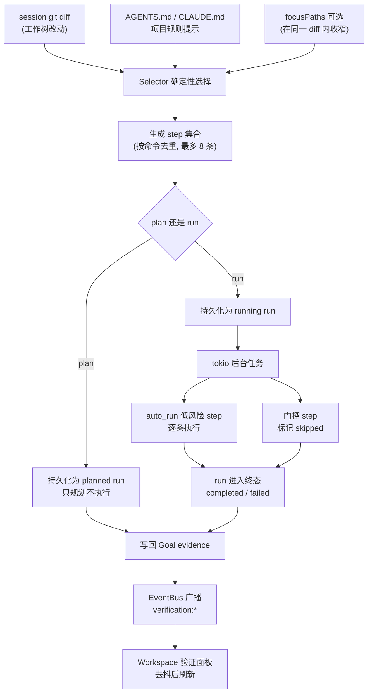
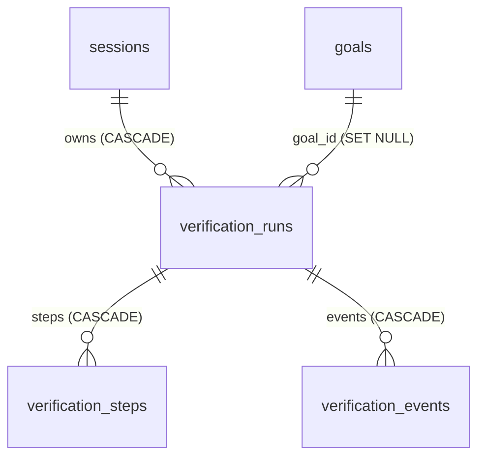
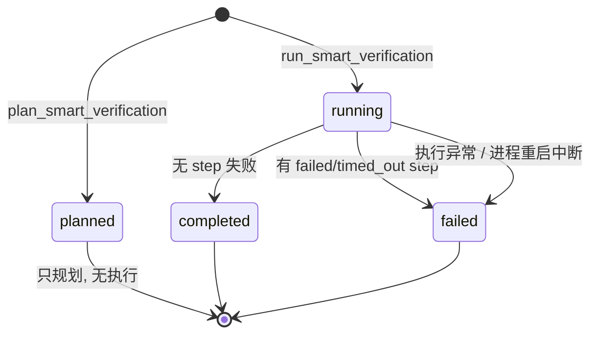
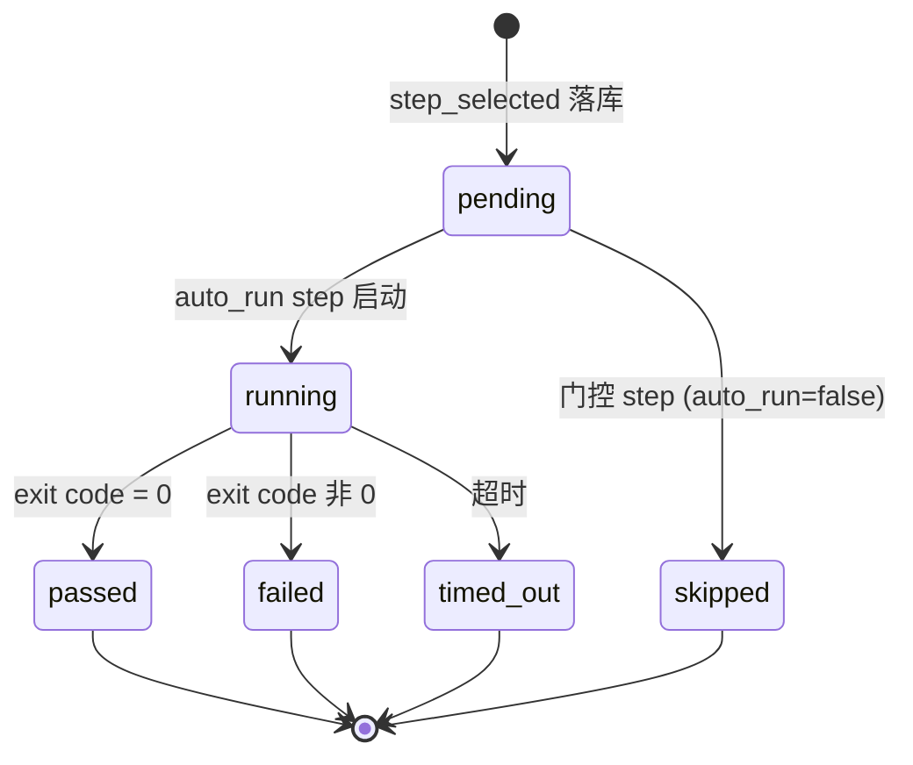
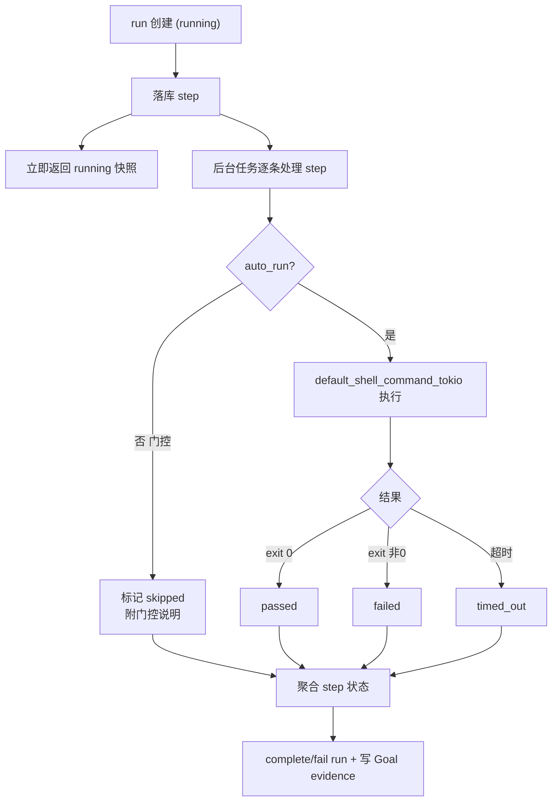

# Smart Verification 控制平面

> 返回 [文档索引](../../README.md)
>
> 关联源码：核心逻辑 [`crates/ha-core/src/verification.rs`](../../../crates/ha-core/src/verification.rs)；HTTP 路由 [`crates/ha-server/src/routes/verification.rs`](../../../crates/ha-server/src/routes/verification.rs)；Tauri 命令 `src-tauri/src/commands/verification.rs`；GUI 面板 `src/components/chat/workspace/useVerificationRuns.ts` + `WorkspacePanel.tsx`；Workflow 接入 `crates/ha-core/src/workflow/runtime.rs`。

## 核心思想

改完一段代码，紧接着的问题永远是：**"跑什么检查才能证明它没坏？"** 传统做法靠人的经验和记忆——改了 Rust 就 `cargo check`，改了前端就 `pnpm typecheck`，改了翻译就跑 i18n 校验。这份判断散落在每个人脑子里，不可复现、不可追溯，也无法沉淀成 Goal 完成的凭据。

Smart Verification 把这件事变成一个**一等的、可持久化的控制平面对象**。它的关键想法是：

- 从当前 session 的 **git diff + 项目规则**出发，用一个**确定性选择器**（selector）算出"最小相关检查集"——只跑改动真正触及的那几个面，不跑全套。
- **保守地自动化**：只自动执行低风险、单点、快速的命令；重检查（全 workspace 编译、`pnpm lint && pnpm test`）作为**门控建议**展示给用户看，绝不偷偷跑。
- 把每次验证持久化成 **run / step / event 三层记录**，随 session 生命周期存活，可事件驱动刷新 GUI。
- 把验证结果**写回 Goal evidence**，让"验证通过"成为 Goal 完成审计里的强证据，"验证失败"成为阻塞项。

选择器刻意做成**不依赖 LLM 的纯函数**：给定同样的 diff 和项目规则，永远选出同样的命令，可测试、可预测。将来可以换成基于历史成功率、测试影响分析的更聪明选择器，但 run / step / event 的数据结构，以及它与 GUI / Goal 的契约不变。

三条设计原则贯穿始终：

| 原则 | 含义 |
| --- | --- |
| **最小相关** | 只选 diff 触及面的检查，单次 run 最多 8 条 step，避免一次大 diff 拖垮面板和后台执行 |
| **保守自动化** | `auto_run=true` 只给低风险单点命令；高风险 / 重命令一律 `auto_run=false`，落库为建议而不执行 |
| **可持久、可观测** | run / step / event 三表落 `sessions.db`，通过 EventBus 广播刷新信号，完整快照仍从 owner API 读取 |

## 端到端数据流

两条入口——**只规划**（plan）和**规划并运行**（run）——共用同一个选择器，区别只在于 run 会多起一个后台任务真正执行低风险 step。无论哪条路径，终态都会写回 Goal evidence 并广播事件。

## 数据模型

三张表都落在 `sessions.db`，通过外键与 `sessions` / `goals` 绑定。生命周期完全跟随 session：

- session 删除 → 级联删除该 session 的所有 run / step / event。
- goal 删除 → run 保留，`goal_id` 置空（`SET NULL`），验证记录不因 Goal 消失而丢失。

### verification_runs — 一次验证的容器

| 字段 | 说明 |
| --- | --- |
| `id` | `ver_<uuid>` |
| `session_id` | 所属 session |
| `scope` | 目前只支持 `local`，其他值创建期即 `bail!` |
| `state` | `planned` / `running` / `completed` / `failed` / `cancelled` |
| `goal_id` | 创建时绑定的 open goal（或显式传入的 `goalId`） |
| `summary` | 面向读者的摘要文案 |
| `stats_json` | 统计快照（见下） |
| `error` | 失败原因 |
| `created_at` / `updated_at` / `completed_at` | 时间戳 |

`stats_json` 记录：`total` / `runnable` / `gated` / `passed` / `failed` / `skipped` / `ok`（是否全通过）/ `focused`（是否用了 focusPaths）/ `focusPaths`（run 路径记规范化后的结果，plan 路径记客户端原样传入的路径）/ `commands`（每条命令的 category、risk、autoRun、state、exitCode 摘要）。

### verification_steps — 单条检查命令

| 字段 | 说明 |
| --- | --- |
| `id` | `vers_<uuid>` |
| `run_id` / `session_id` | 所属 run / session |
| `seq` | run 内单调序号（`UNIQUE(run_id, seq)`） |
| `command` | 选择器生成的命令字符串 |
| `cwd` | git repo 根，或 session 工作目录根 |
| `title` / `reason` | 面向读者的标题与选择理由 |
| `category` | `rust` / `frontend` / `i18n` / `sanity` / `policy` |
| `risk` | `low` / `medium` / `high`（当前规则只产出 low 与 high） |
| `auto_run` | 仅低风险单点检查为 `true` |
| `state` | `pending` / `running` / `passed` / `failed` / `skipped` / `timed_out` |
| `exit_code` / `output_preview` / `duration_ms` | 执行结果，输出只留 bounded preview |
| 四个时间戳 | `created_at` / `updated_at` / `started_at` / `completed_at` |

### verification_events — 审计事件流

| 字段 | 说明 |
| --- | --- |
| `id` | 自增整数主键 |
| `run_id` / `seq` | 所属 run 与 run 内单调序号 |
| `kind` | 见下列 7 种 |
| `payload_json` | 事件负载，超过 64 KiB 会被截断为 `{truncated, preview}` |
| `created_at` | 时间戳 |

`kind` 取值：`verification_created`、`verification_planned`、`verification_completed`、`verification_failed`、`step_selected`、`step_started`、`step_completed`。这条事件流是纯审计记录，UI 刷新只把 EventBus 通知当信号，完整快照仍从 owner API 拉。

### Run 状态机

`cancelled` 是保留状态，当前主流程不会走到它。

### Step 状态机

## 选择器（Selector）

选择器是整个子系统的大脑，也是刻意保持确定性的部分。

### 输入

- 当前 session 的工作目录。
- `load_session_git_diff()` 得到的工作树 diff。
- git repo 根（`git rev-parse --show-toplevel`，取不到则回落工作目录）。
- session 工作目录下 `AGENTS.md` / `CLAUDE.md` 的项目规则提示。
- 可选的 `focusPaths[]`：在同一 session diff 内进一步收窄 changed files 后再进选择器。

选择器要读磁盘上的 `Cargo.toml`、跑 `git rev-parse` 子进程、读 AGENTS.md，都是阻塞 IO 与 CPU 活，因此全部经 `run_blocking` / `spawn_blocking` 挪到阻塞线程池，不占 async worker。

### 选择规则

| 改动面 | 推荐命令 | category | 风险 / 自动 |
| --- | --- | --- | --- |
| Rust crate 源码 | `cargo check -p <crate> --locked` | rust | low / 自动 |
| Rust 测试文件 | `cargo check -p <crate> --tests --locked` | rust | low / 自动 |
| TypeScript / React / package 面 | `pnpm typecheck` | frontend | low / 自动 |
| i18n locale 或 sync 脚本 | `node scripts/sync-i18n.mjs --check` | i18n | low / 自动 |
| API / transport 面 | `git diff --check` | sanity | low / 自动 |
| 纯文档 / 混合改动 / 兜底 | `git diff --check` | sanity | low / 自动 |
| Cargo workspace manifest 变动 | `cargo check --workspace --locked` | rust | **high / 门控** |
| 项目规则提到 pre-push / full suite | `pnpm lint && pnpm test` | policy | **high / 门控** |

几个不读代码看不出的关键行为：

- **crate 名解析与注入防护**：对每个改动的 Rust 文件，从文件所在目录向上走，找第一个带 `[package] name` 的 `Cargo.toml`，边界是 repo / workspace 根。解析出的 crate 名会先过 `is_safe_cargo_package`（只允许字母数字 `_` `-`）才拼进 `cargo check -p <name>`，防止把奇怪的包名注进 shell 命令。
- **按命令去重**：所有 step 用命令字符串去重，所以即便 API 面和纯文档同时命中 `git diff --check`，最终也只有一条。
- **至少一条可跑检查**：任何非空 diff 都会选出至少一条可跑命令——改一个 Rust 源文件就是那条 `cargo check`，不会再补别的。`git diff --check`（whitespace / 冲突标记检查）只在纯文档 / 混合改动、或其它规则一条都没命中时，才作为兜底 step 补上，并不是每次都出现，也不总是 sanity 类。
- **项目规则如何门控全套**：`read_policy_hints` 扫 AGENTS.md / CLAUDE.md，命中"不要主动跑全套"、"full pre-push"、"pre-push" 任一，就把 `pnpm lint && pnpm test` 作为 high-risk 门控建议放进 step 里——用户看得到、但 Smart Verification 不会自动跑。

### auto_run 边界

`auto_run=true` 只给低风险单点检查。高风险或重检查以 `auto_run=false` 落库并在执行阶段被标记 `skipped`——用户能在面板看到建议，但不会被自动执行。

### focusPaths 不放宽安全边界

`focusPaths[]` 只过滤"已经由 session workspace 解析出的 diff 文件"，**不能**让 HTTP / Tauri 客户端指定任意 cwd 或任意 shell 命令；`scope` 恒为 `local`。路径匹配会先规范化（`\` → `/`、去掉前导 `./`），再按精确或后缀 `/focus` 匹配。stats 里会记录 `focused=true`；run 路径存的是规范化后的 `focusPaths`，plan 路径存的是客户端原样传入的路径（不去前导 `./`）。

## 执行模型

`plan_smart_verification` 与 `run_smart_verification` 的差异，就是"选完之后跑不跑"：

- **plan**：创建 `planned` run → 选 step → 落库 → 写 Goal evidence（`validation_completed`）→ 返回快照。**不执行任何命令。**
- **run**：创建 `running` run → 选 step → 落库 → 立即返回 running 快照 → **后台 tokio 任务**逐条处理 step。

后台执行的语义：

命令执行的细节：

| 方面 | 行为 |
| --- | --- |
| Shell | `platform::default_shell_command_tokio()` 统一 shell 行为，`kill_on_drop(true)` |
| 环境 | 注入 `tools::exec::login_shell_env()`，保证桌面 GUI 能找到 `cargo` / `pnpm` / `node`；取不到完整环境时退回补 `PATH` |
| 超时 | 默认 120s；`git diff --check` 为 30s；超时判 `timed_out` |
| 输出 | stdout + stderr 合并，末尾附 `[exit code: N]`，只持久化 32 KiB preview（`truncate_utf8`，不按字节切） |
| 终态 | 任一 step 失败或超时 → run 进入 `failed` |

### 重启恢复（fail-closed）

`SessionDB` 初始化建表时，会把遗留的 `running` run 一律改判为 `failed`（error 记 `Interrupted before verification completed`），`running` step 同样改判 `failed`。已完成的 step 和事件全部保留，用户仍能看到中断前跑到了哪一步。这是 fail-closed：进程崩溃后绝不把半途的 run 当成"还在跑"或"已通过"。

## Goal Evidence

run 创建时绑定当前 open goal（或显式 `goalId`，且会校验该 goal 属于同一 session）。终态后按 step 结果写回一条 Goal evidence：

| 情形 | relation |
| --- | --- |
| run 失败，或存在 `failed` / `timed_out` step | `validation_failed` |
| 有 `passed` step 且无失败 | `validation_passed` |
| 没有可运行命令，只有计划 / 门控建议 | `validation_completed` |

这三种 relation 在 Goal 审计里的分量不同：

- `validation_passed` 是**强完成信号**，与 `workflow_completed` / `task_completed` 同级，能推动 Goal final audit 完成。
- `validation_failed` 是**阻塞项**：只要没有更晚的 `validation_passed` 覆盖它，Goal 就一直被它挡住。
- `validation_completed` 只记录"验证路径已生成/已选择"，本身不完成 Goal。

写 evidence 后会触发一次 `evaluate_goal`，让 Goal 重新评估自身状态。

## Owner API 与 GUI

Owner API 只面向用户本人的控制面，**不接受任意 cwd / path**，只按 session id 解析 workspace。HTTP 与 Tauri 一一对齐；plan / run 都可带可选 `focusPaths[]` 与 `maxCommands`。

| 能力 | Tauri 命令 | HTTP 端点 |
| --- | --- | --- |
| 列 run | `list_verification_runs` | `GET /api/sessions/{sid}/verification-runs` |
| 详情快照 | `get_verification_run` | `GET /api/verification-runs/{id}` |
| 只推荐 | `plan_smart_verification` | `POST /api/sessions/{sid}/verification-runs/plan` |
| 推荐并运行 | `run_smart_verification` | `POST /api/sessions/{sid}/verification-runs/run` |

Workspace 面板"验证"区块展示：

- 最新 run 摘要与短 id。
- 可跑 / 通过 / 失败 / 门控四项统计。
- 推荐、运行推荐、刷新三个动作。
- 最多 6 条 step：命令、原因、风险、状态、exit code、耗时。
- 失败 / 超时 step 的输出摘要。
- "推荐上下文"候选行：点击可对该候选携带的 `focusPaths` 触发 focused verification（走 `run_smart_verification`），生成的 run 一样进本区块、走后台低风险执行、写 Goal evidence 与广播事件。

面板刷新的触发时机：

- 首次打开。
- 当前 turn 从 active 变 idle。
- EventBus `verification:created` / `verification:updated` / `verification:step_updated` / `verification:event` / `_lagged`（250ms 去抖）。
- 存在 active（`running`）run 时低频轮询（3s 一次）。

## EventBus

| 事件 | Payload |
| --- | --- |
| `verification:created` | `VerificationRun` |
| `verification:updated` | `VerificationRun` |
| `verification:step_updated` | `VerificationStep` |
| `verification:event` | `VerificationEvent` |

事件只作刷新信号：`verification:created` / `verification:updated` / `verification:step_updated` 带 `sessionId`，前端会用它过滤掉其他 session 的通知；`verification:event` 与 `_lagged` 没有 `sessionId`，只无条件触发一次刷新，靠重新按 session 拉列表兜底。完整快照始终从 owner API 读。

## 安全与隐私

- **无痕会话不落库**：incognito session 拒绝创建 durable verification run（创建期 `bail!`）。
- **无任意路径**：HTTP 不能传任意 cwd / path，workspace 由 session scope 决定；`focusPaths` 只能收窄已解析的 diff 文件。
- **命令是白名单形态**：不是用户输入的任意 shell，而是选择器按固定规则生成、crate 名经字符校验的命令。
- **重命令默认门控**：高风险 / 重命令 `auto_run=false`，绝不自动执行。
- **输出有界**：只留 32 KiB preview，不把超长日志写进上下文或 UI；事件 payload 超 64 KiB 截断。

## 与 Workflow 集成

`workflow.verify({ focusPaths?, maxCommands? })` 复用同一个 Smart Verification 选择器，在 workflow 内创建 durable verification plan：

- 这个 host API **只规划不执行**（内部走 `plan_verification_for_session`）；需要真正跑命令时，用 `workflow.validate()` 或在 owner 面板点"运行推荐"。
- workflow 绑定 Goal 时，计划完成写入 `validation_completed` evidence，表示验证路径已生成，**不等同于** `validation_passed`。
- 输出为 `{ kind: "verification_plan", ok, runId, state, summary, commandCount, stats, commands[] }`——`ok` 表示计划是否成功生成（run 进入 `planned` 即为 true），loop 运行时靠它判断是否继续；整份载荷供 workflow 后续步骤引用。

## 演进方向

选择器是可替换的组件，未来可以在不动 run / step / event 与 GUI / Goal 契约的前提下增强：

- 基于历史 run 成功率和耗时对候选检查排序。
- 按 changed symbol / test ownership 做更细粒度的测试影响分析。
- GUI 支持用户逐条批准门控 step 后运行。
- 与 Review Engine 组合成"修复后 focused review + focused verification"的自动闭环，复用现有 `focusPaths` 输入。
