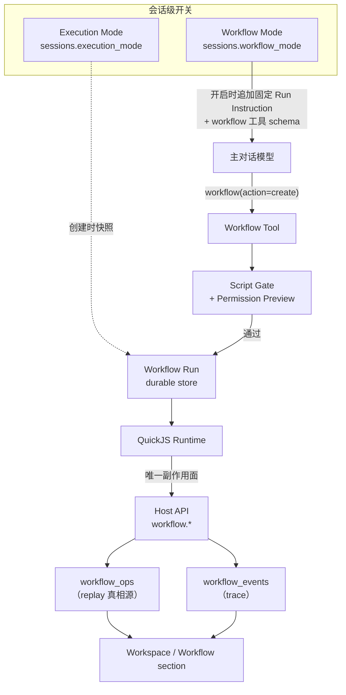
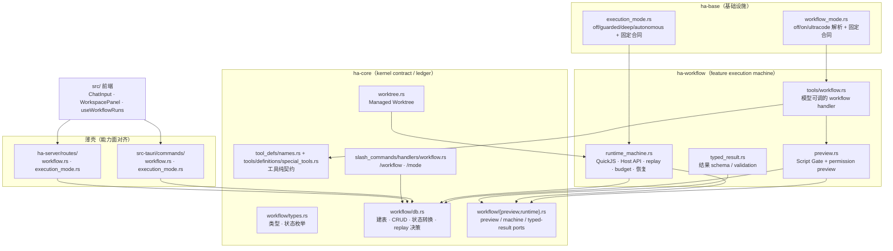
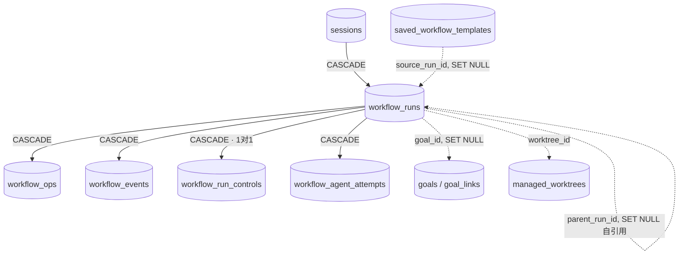
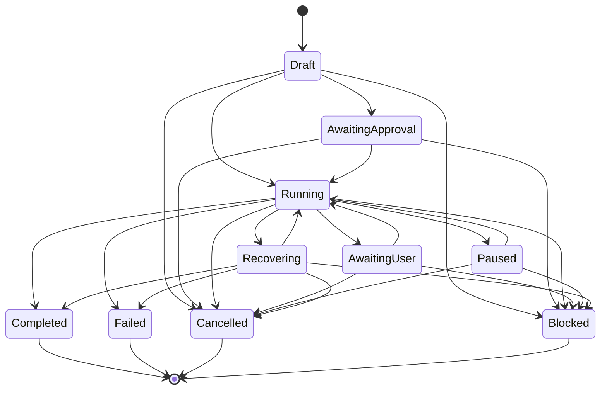
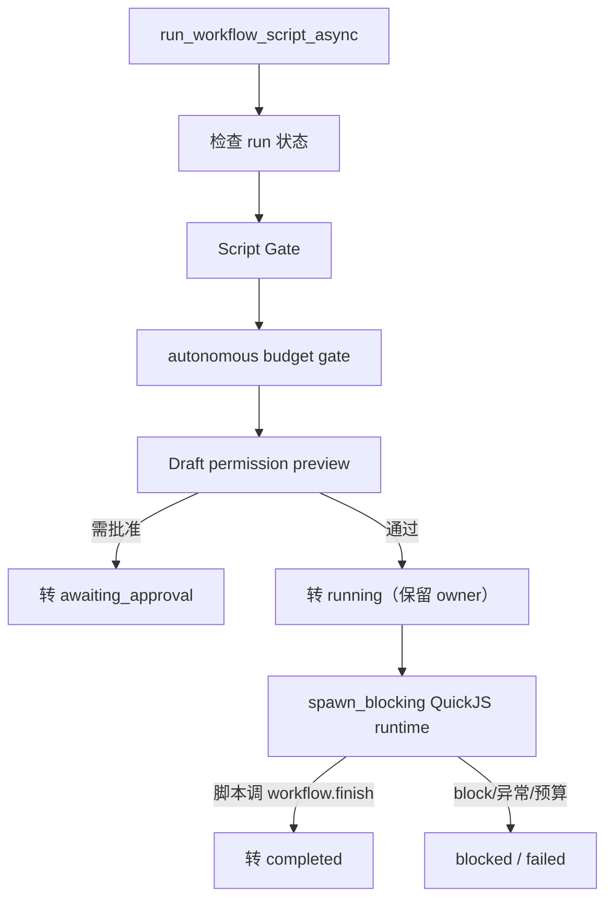
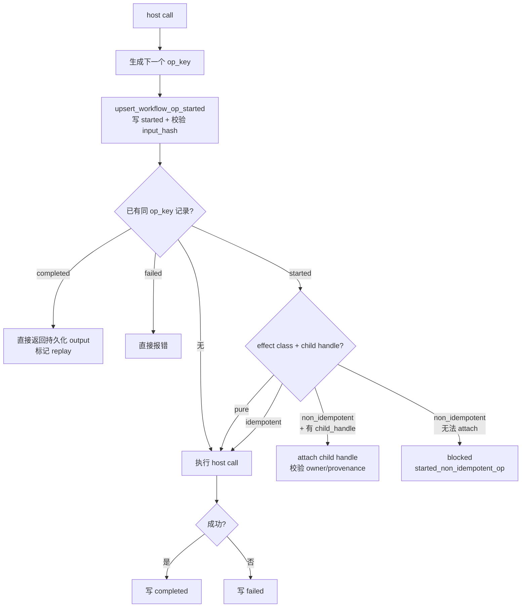

# Workflow：Mode、Tool、Run 与 Execution Mode

> 返回 [文档索引](../../README.md) | 更新时间：2026-08-23

## 1. 核心思想

一次普通聊天回合是同步的：模型说一句、调一个工具、再说一句，全程绑在当前 turn 上。一旦任务需要跨几十步、并行探索、交叉验证、后台长跑，这种同步模式就撑不住——页面刷新会打断它，进程崩溃会丢掉进度，模型也无法把「我打算怎么编排」这件事变成一个可观察、可审批、可恢复的对象。

Workflow 子系统解决的正是**长任务执行面的可控性**，以及**把「模型自主编排」产品化**这件事。它的关键想法是：让模型自己写一段 JavaScript 编排脚本，由一个受控的沙箱 runtime 在后台执行，脚本的每一次副作用都落进 durable store，从而任何时刻崩溃/重启都能安全 replay，而不是盲目重跑不可判定的副作用、也不是偷偷替用户批准了权限。

围绕这个想法，标题里的四个名词各司其职：

| 名词 | 是什么 | 一句话职责 |
| --- | --- | --- |
| **Workflow Mode** | 会话级开关（`off` / `on` / `ultracode`） | 决定模型这一轮能不能看到并调用 `workflow` 工具，以及 Run Instruction 使用哪套固定编排合同。 |
| **Workflow Tool** | 模型能调用的 `workflow` 控制工具 | 模型创建 run、查状态、读 trace、暂停/恢复/取消、发起 follow-up 的唯一入口。 |
| **Workflow Run** | 一次具体的脚本执行 | durable、可观察、可审批、可暂停/恢复/取消的编排单元，落在 `sessions.db`。 |
| **Execution Mode** | 会话级推进强度策略（`off` / `guarded` / `deep` / `autonomous`） | 描述「多大胆地往前推、失败怎么守门」，创建 run 时快照进 run。 |

它们的关系是：Workflow Mode 是门，决定模型看不看得到工具；模型透过工具创建 Workflow Run；Execution Mode 作为强度策略被快照进 run；脚本内部只能通过 Host API 产生副作用。



**它不做什么，很重要**：

- 长期目标不归它。目标与完成标准由 [Goal 控制平面](goal.md) 承载；workflow run 可以绑定 `goal_id`，在终态后回写 evidence，但它自己只负责「一次编排」。
- 触发时机不归它。定时、重复触发、条件轮询由 [Loop 控制平面](loop.md) 承载。Loop 可以选 `executionStrategy=workflow`：每次 interval tick 读取绑定 Goal 的领域模板，生成通过 Script Gate 的草稿，创建 `origin=loop:<loop_id>` 的 run 并请求 Primary runtime 启动——但真正的执行、审批、恢复、trace、Goal evidence 仍然全在 Workflow run 里。Loop 只管触发和预算门禁。

**它不是 coding-only**。代码迁移、审查、验证是最成熟的模板，但同一套 durable 编排也服务调研、写作、数据分析、会议准备、收件箱/项目运营、知识整理等一切需要并行探索、交叉验证、阶段化执行或长任务追踪的场景。

**与 Claude Code dynamic workflows 的对齐边界**（参考 [Claude Code Dynamic workflows](https://code.claude.com/docs/en/workflows)）：Claude Code 把 workflow 定义为模型写出的 JavaScript 编排脚本，由 runtime 后台执行、经任务面板观察，`/effort ultracode` 让模型对每个实质任务自行判断是否规划 workflow。Hope 对齐这条「模型生成脚本 + 后台 runtime + 用户观察/审批」的主路径，命令面用自己的 `/workflow on|ultracode` 会话开关，并额外保留更强的 durable store、Goal evidence、permission preview、repair run、pause/resume/cancel、worktree、review/verify host API 等本地控制面。手动创建 run 是面向用户本人的高级控制面能力，不是普通用户的唯一入口。

## 2. 用户主路径

普通用户不需要先手写 `workflow.js`，也不需要切到某个 coding 模式。主路径是「打开会话级 Workflow Mode，然后正常提需求」：

1. 在输入框工具条 / `+` 菜单点「工作流」，或输入 `/workflow on`。
2. 正常描述任务，例如「调研这三个方案并给出推荐」「整理这批会议材料」「做一次完整代码迁移」。
3. 下一轮模型会看到 `workflow` 控制工具和 Workflow Mode 的固定 Run Instruction，自行判断是否值得创建 durable run；用户任务正文仍来自 user/history，简单任务继续 inline 完成。
4. run 创建后，模型还能用 `workflow(action=status|trace|list|control|followup)` 查状态、读 bounded trace、暂停/恢复/取消可见 run，或基于失败/阻塞发起 follow-up run。模型不能替用户批准权限。
5. run 一旦创建，Workspace 的 Workflow section 就会出现它：状态、当前焦点、Trace、Validation、Agents、授权清单、阶段检查点、失败原因和修复入口一应俱全。
6. 用户在 GUI 或 slash command 控制 run：`/workflow status`（看模式和最近 run）、`/workflow runs`（列最近 run）、`/workflow trace [run_id]`（看 ops/events）、`/workflow approve|pause|resume|cancel [run_id]`（审批、暂停、恢复、取消）。
7. 任务结束或不想让模型再自主编排时，`/workflow off` 或输入框状态条一键关闭。

`/workflow ultracode` 是更强的 Workflow Mode：仍不是 coding-only，而是让模型对任何实质任务默认考虑多阶段、并行审查、交叉验证和长任务恢复，适合「质量优先、成本次要」。

高级用户仍可在 Workspace 手动创建 run：从目标生成草稿、预检 Script Gate 与权限清单、编辑 `workflow.js`、选运行位置。这是面向用户本人的高级入口，不是普通主路径。

## 3. 分层与模块

Workflow 被拆成「kernel 契约/台账」与「feature 执行机」：`ha-core` 保留 wire 类型、状态转换、`SessionDB` 类型化 ledger、事件/权限/Stop/Eval 契约和 runtime ports；`ha-workflow` 拥有 Script Gate preview、QuickJS/Host API/步骤与恢复机器、typed-result 处理和模型工具 handler。两者都零 Tauri 依赖，Tauri 与 HTTP 只做薄适配且能力面严格对齐。



| 层 | 代码 | 责任 |
| --- | --- | --- |
| 核心类型 | `crates/ha-core/src/workflow/types.rs` | `WorkflowRun` / `WorkflowOp` / `WorkflowEvent` / 状态枚举 / snapshot 结构。 |
| 持久化 | `crates/ha-core/src/workflow/db.rs` | run/op/event/control/attempt/template 建表、CRUD、状态转换、replay 决策。 |
| 预检契约 | `crates/ha-core/src/workflow/preview.rs` | Preview 类型、默认 fail-closed 行为与 feature runtime port。 |
| runtime 契约 | `crates/ha-core/src/workflow/runtime.rs` | Machine/typed-result ports、Stop/权限/台账桥；不含 QuickJS 依赖。 |
| Feature 预检 | `crates/ha-workflow/src/preview.rs` | Script Gate + permission preview + create/run 可行性判定。 |
| Feature runtime | `crates/ha-workflow/src/runtime_machine.rs`、`typed_result.rs` | QuickJS、Host API、durable replay、budget、repair/recovery 与 typed result。 |
| Workflow Mode | `crates/ha-base/src/workflow_mode.rs` | `off` / `on` / `ultracode` 解析、固定 Run Instruction 合同与 session 开关语义。 |
| Execution Mode | `crates/ha-base/src/execution_mode.rs` | `off` / `guarded` / `deep` / `autonomous` 解析与固定 Run Instruction 合同。 |
| 模型工具面 | `crates/ha-workflow/src/tools/workflow.rs`、core `tool_defs/names.rs` + `tools/definitions/special_tools.rs` | feature 拥有 handler；core 保留 schema/名字/参数纯契约，仅 Workflow Mode 开启时可见。 |
| Managed Worktree | `crates/ha-core/src/worktree.rs` | 可选隔离执行目录，run 绑定 `worktree_id` 后 runtime 自动 restore 并切换 cwd。 |
| Tauri owner API | `src-tauri/src/commands/workflow.rs`、`execution_mode.rs` | 桌面控制面命令，含 run 管理和 saved template 管理。 |
| HTTP owner API | `crates/ha-server/src/routes/workflow.rs`、`execution_mode.rs` | Server/Web 控制面端点，与 Tauri 同一能力面。 |
| GUI | `src/components/chat/input/ChatInput.tsx`、`src/components/chat/workspace/WorkspacePanel.tsx`、`useWorkflowRuns.ts` | 输入框入口与常驻状态、Workspace Workflow section、run 详情、审批/恢复/取消、Execution Mode 控件。 |
| 斜杠命令 | `crates/ha-core/src/slash_commands/handlers/workflow.rs` | `/workflow` 与 `/mode` 的文本控制面。 |

红线：

- Workflow 状态、权限与台账裁决必须在 `ha-core`；QuickJS/preview/typed-result/handler 执行机必须在 `ha-workflow`，Tauri 和 HTTP 只做薄适配。
- `ha-workflow` 只走 kernel 类型化 DB 方法和 runtime ports，禁止裸 `sessions.db` 连接或直接 SQL。
- 控制面 API 负责管理 run；模型没有绕过 Gate 的内部入口。
- 模型只能在非 incognito 且 `sessions.workflow_mode != off` 时看到并调用 `workflow`。
- runtime 只暴露受控 Host API；脚本没有 raw fs/network/process/env 能力。
- durable run 禁用于 incognito session，且这条约束是双向的：会话开启 Workflow Mode 或已有 run 后，`update_session_incognito(..., true)` 必须拒绝，避免 durable 控制面和「关闭即焚」语义并存（`session/db.rs` 三处拒绝：不能在无痕会话开工作流、不能在已开工作流后转无痕、不能在已建 run 后转无痕）。

## 4. 数据模型

Workflow 全部数据落在 `sessions.db`，跟随会话级联删除（`FOREIGN KEY ... ON DELETE CASCADE`）。



### `workflow_runs`

| 字段 | 说明 |
| --- | --- |
| `id` | `wfr_*` run id。 |
| `session_id` | 所属会话，外键到 `sessions(id)`，级联删除。 |
| `kind` | run 类型，默认 `general.workflow`；coding workflow 只是其中一种模板。 |
| `state` | `draft` / `awaiting_approval` / `running` / `awaiting_user` / `paused` / `recovering` / `completed` / `failed` / `cancelled` / `blocked`。 |
| `execution_mode` | 创建 run 时的 Execution Mode 快照。 |
| `script_hash` | `workflow.js` 源码 BLAKE3 hash。 |
| `script_source` | 原始 `workflow.js`。 |
| `budget_json` | runtime / op / token 预算；同时保存 `sizeGuideline`（模型声明的规模意图）和 `__hopeWorkflowApiVersion` fail-closed marker。 |
| `cursor_seq` | op 完成时递增，用于进度观察。 |
| `primary_owner` | Primary process claim owner，形如 `...:pid:<n>`。 |
| `blocked_reason` | `blocked` 终态原因。 |
| `parent_run_id` | 修复 run 来源，自引用外键，删父 run 时置空。 |
| `origin` | run 来源，例如 `repair`、`template:<id>`、`loop:<id>`、`agent:workflow`。 |
| `goal_id` | 可选 Goal 归属；不显式传时自动绑定当前 session 的 open Goal 或 pending closure Goal，删 Goal 时置空。 |
| `goal_criterion_id` / `goal_criterion_text` / `goal_criterion_kind` / `goal_revision` | 可选的推进标准快照：绑定具体 Goal criterion 时写入，供 Goal detail 按 criteria 聚合。 |
| `worktree_id` | 可选 Managed Worktree 归属；绑定后本 run 的工具、读取、校验、diff 默认在 worktree 路径执行。 |
| `created_at` / `updated_at` / `completed_at` | 时间戳。 |

### `workflow_ops`

`workflow_ops` 是 durable replay 的真相源——每次 Host API 调用都在这里留下一行。

| 字段 | 说明 |
| --- | --- |
| `id` | `wfo_*` op row id。 |
| `run_id` | 所属 run，级联删除。 |
| `op_key` | runtime 派生的位置化 op 身份，`UNIQUE(run_id, op_key)`。 |
| `op_type` | `task.create`、`tool:exec`、`spawnAgent`、`validate` 等。 |
| `effect_class` | `pure` / `idempotent` / `non_idempotent`，决定 replay 时如何处理 started op。 |
| `input_hash` | 稳定 JSON 输入 hash；同一 `op_key` 输入变化会 block run。 |
| `input_json` | op 输入快照。 |
| `state` | `pending` / `started` / `completed` / `failed`。 |
| `output_json` / `error_json` | op 输出或错误。 |
| `child_handle` | 子任务句柄：subagent run id、async job id、validation child handle。 |
| `started_at` / `completed_at` | 时间戳。 |

### `workflow_events`

| 字段 | 说明 |
| --- | --- |
| `id` | 自增 row id。 |
| `run_id` | 所属 run，级联删除。 |
| `seq` | run 内单调序号，`UNIQUE(run_id, seq)`。 |
| `type` | `run_created`、`run_state_changed`、`op_started`、`op_completed`、`trace`、各类 `workflow_*` 阶段事件等。 |
| `payload_json` | 事件载荷，超过 64KB 会被截断成 preview。 |
| `created_at` | 时间戳。 |

### `workflow_run_controls`（apiVersion 4/5 的执行契约）

一对一保存 run 的执行契约。V3（legacy）run 没有这行，按最早的 `main(workflow)` 语义执行；apiVersion 4/5 的 run 必须有它。

| 字段 | 说明 |
| --- | --- |
| `run_id` | 主键，一对一到 run，级联删除。 |
| `api_version` | 4 或 5；决定安装哪套 runtime 契约。 |
| `meta_json` / `meta_hash` | immutable `workflow.meta`；深冻结后交给脚本，启动时重算 hash 校验。 |
| `args_json` / `args_hash` | immutable `workflow.args`；以 `main(workflow, args)` 传入，脚本不能改。 |
| `resume_from_run_id` | 可选的选择性 resume 来源（同 session 的 terminal run），删来源时置空。 |
| `created_at` | 时间戳。 |

`meta` 与 `args` 都必须是对象且合计不超过 64KB。runtime 每次启动重算两份 hash 并校验 `api_version`，任一损坏都 fail closed，不允许被改写的 control 进入 replay。

### `workflow_agent_attempts`（Agent 尝试与失败闭环的真相源）

一个 workflow-owned 子 Agent 不是「一个永恒 handle」，而是一条稳定的 subagent thread，其上有若干次不可变 attempt（`spawnAgent` 是 initial，`resumeAgent` 是 continuation）。这张表就是这套身份的真相源。

| 字段 | 说明 |
| --- | --- |
| `workflow_run_id` / `thread_id` / `run_id` | Workflow、稳定 Agent thread、不可变 attempt 三层身份；主键 `(workflow_run_id, run_id)`。 |
| `source_op_id` | 创建该 attempt 的 durable `spawnAgent` / `resumeAgent` op。 |
| `continuation_of_run_id` / `role` | 前驱 attempt 与 `initial` / `continuation` / `imported`。 |
| `control_mode` | `control` 或 `result_only`；跨 run 选择性复用只能导入结果，不能取得控制权。 |
| `resolution_state` | `pending` / `resolved` / `accepted`；失败 attempt 必须成功续跑或被显式接受，run 才能完成。 |
| `resolution_reason` / `resolved_by_run_id` | 接受理由或成功 continuation 证据。 |
| `created_at` | 时间戳。 |

### `saved_workflow_templates`

成功完成的 workflow run 可以保存为可复用模板。模板不是新的执行器，也不绕过治理：从模板创建 run 时仍走同一 `create_workflow_run` 链路，写 `origin=template:<template_id>`，并重新经过当前 session 的 Script Gate、permission preview、Goal budget、incognito、project scope 和 worktree 校验。

| 字段 | 说明 |
| --- | --- |
| `id` | `wft_*` template id。 |
| `name` / `description` | 用户可见名称和描述；保存入口默认用来源 run kind。 |
| `scope` | `user` 或 `project`。当前 session 有 project 时 GUI 默认 project scope，否则 user scope。 |
| `project_id` | project scoped 模板的项目归属；从模板创建 run 时必须与目标 session project 一致。 |
| `kind` / `execution_mode` | 来源 run 的类型和执行模式快照。 |
| `script_hash` / `script_source` | 来源 run 的脚本 hash 和原始脚本。 |
| `budget_json` | 来源 run 默认预算；GUI 从模板创建时可按当前模式覆盖。 |
| `source_run_id` | 来源 completed run；删来源 run 时置空，模板仍可用。 |
| `enabled` | 列表默认只返回 enabled 模板。 |
| `created_at` / `updated_at` | 时间戳。 |

保存约束：

- 必须由控制面 API 或 GUI 显式保存（`explicitSaveConsent=true`）；模型工具面不会自动沉淀模板。
- 只有 `completed` run 可保存。`failed` / `blocked` run 应走 repair draft / follow-up run，不进默认复用库。
- incognito session 禁止保存模板，也禁止从模板创建 durable run。
- project scope 必须绑定当前 session project；没有 project 的 session 只能保存 user scope。

## 5. 状态机

`WorkflowRunState::can_transition_to()` 是 run 状态转换的唯一裁决。



`completed` / `failed` / `cancelled` / `blocked` 是终态。进入终态、`awaiting_approval`、`awaiting_user` 或 `paused` 时会清空 `primary_owner`——这些状态没有 runtime 正在推进；进入 `blocked` 时写 `blocked_reason`。

## 6. Workflow Mode

Workflow Mode 是 session 级持久开关，入口是输入框 `+` 菜单/工具条、Workspace 的 Workflow section 和 `/workflow`。

模式说明是平台维护的固定合同：turn start 与 Permission / Execution / Sandbox / Active Goal 合同一起冻结到稳定缓存断点之后的 **Run Instruction**，不参与 stable system fingerprint。当前用户任务、Goal objective、Workflow 输入与外部证据仍留在 history、tool result 或 user-data；同一 turn 的 Provider retry / failover 复用相同模式快照。

| Mode | 数据值 | 模型工具面 | Run Instruction 行为 | 用户语义 |
| --- | --- | --- | --- | --- |
| Off | `off` | 不注入 `workflow`，执行层也拒绝模型调用。 | 不注入 Workflow Mode 段。 | 普通对话/任务推进，用户仍可在控制面查看历史 run。 |
| On | `on` | 注入 `workflow`。 | 告诉模型可在多步骤、fan-out、研究、迁移、验证、长任务场景按需创建 workflow，也可主动查 status/trace/control；明确「模型自己写脚本并创建 run」，不要求用户手写脚本或切 coding mode。 | 允许模型自主动态编排，但模型仍需判断是否值得。 |
| Ultracode | `ultracode` | 注入 `workflow`。 | 强化为「实质任务默认考虑 workflow」，鼓励多阶段、独立审查、交叉验证；除 tiny / conversational / 已验证机械任务外主动创建 durable run，并在总结/修复前查 status/trace。 | 对齐 Claude Code `ultracode` 心智：质量/覆盖优先，成本和耗时更高。 |

存储：

- session 当前模式：`sessions.workflow_mode`（默认 `off`）。
- Tauri / HTTP 控制面 API：`get_workflow_mode` / `set_workflow_mode`；HTTP `GET|POST /api/sessions/{sessionId}/workflow-mode`。
- `SessionMeta.workflowMode` 暴露给前端。

### 6.1 模型工具面

- `workflow` 是 Core Meta Tool，但不进入静态工具目录；schema 构建后只在当前 session `workflow_mode.enabled()` 且非 incognito 时追加。执行层会再次校验 session、incognito、DB、`workflow_mode`，所以即使旧 schema 或外部请求绕进来也 fail-closed。
- **决策规则**：请求包含多阶段依赖、宽搜索/比较、connector 或文件证据、长时间运行、独立验证、可恢复后台执行或可审计轨迹时，模型应自行调 `workflow(action=create)`；tiny 对话、单个显然动作或已验证机械任务保持 inline。这条规则适用于 Research、Writing、Data Analysis、Meeting Prep、Inbox / Project Ops、Knowledge Curation、Coding 等通用场景。
- **`sizeGuideline` 规模意图**（`unrestricted` / `small` / `medium` / `large`）：`small` 表示少量有界步骤，`medium` 是普通多阶段编排，`large` 是宽 fan-out / 迁移 / 验证，`unrestricted` 只用于用户明确要求穷尽式覆盖。它是 Run Instruction / GUI / 后续模型回合的 advisory，不是硬 cap，也不绕过 runtime budget、权限、审批或安全策略；后端规范化后写入 `budget_json.sizeGuideline`。模型省略时，普通 Workflow Mode 默认 `medium`，Ultracode 默认 `large`；follow-up 默认继承 parent。
- **schema**：必须传 `action`。`create` / `followup` 接收 canonical `script`（不展示 `scriptSource` / `script_source` alias，避免脚本入口分裂，执行层仍兼容历史别名）。其它可选元数据：`kind`、`executionMode`、`budget`、`runImmediately`、`parentRunId`、`origin`、`goalId`、`goalCriterionId`、`worktreeId`；创建层校验 parent/goal/criteria/worktree 均属同一 session / Goal revision。
- **`action` 一览**：
  - `guide`：按需 authoring guide，返回当前 apiVersion、脚本形态、run inputs、Parallel/Pipeline、child/typed result、`resumeAgent`、失败闭环、Host API 和 timing contract；不创建 run、不读写外部系统。常驻 Run Instruction 只保留固定决策与安全合同，写脚本前再调 guide，避免每轮重复支付完整 API token。
  - `list` / `status` / `trace`：只返回当前模型可见 session 内的 bounded snapshot，不跨 session 查询；`status` 省略 `runId` 时选当前 active run 或最近 run。
  - `control`：只允许 `pause` / `resume` / `cancel`，写 `run_model_control_action` 审计事件；**故意不支持 `approve`**——模型不能替用户批准权限或外部动作。
  - `followup`：基于当前可见 run 创建 repair / continuation run，默认继承 parent 的 Goal / criterion 绑定。
- `create` / `list` / `status` / `followup` 返回的 run summary 带 `sizeGuideline` 和 `runtimeCaps`，让模型不用读完整 script/budget 也能理解规模、预算意图和下一步策略。
- `runImmediately` 默认 `true`：创建后直接进 preflight / approval / runtime；需要用户先看脚本时可显式创建 draft。
- `executionMode` 未传时继承当前 session execution mode；若 session execution mode 是 `off`，run 默认用 `guarded`，避免有 workflow 却没有基础 stop guard。`executionMode=autonomous` 必须显式提供 runtime budget 和 output token budget。

### 6.2 用户交互

- 输入框工作流按钮循环 `off -> on -> ultracode -> off`；开启后输入框上方常驻显示当前 Workflow Mode。
- **Natural trigger hint**：用户在普通输入中明确表达「用 workflow / 多代理交叉验证 / 大规模迁移 / 后台长任务 / Ultracode」等强意图、且当前 Mode 为 Off 时，输入框给出轻量建议按钮，一键开启 On 或 Ultracode。该提示只改会话/草稿 Workflow Mode，不创建 run、不吞原消息、不要求手写脚本；是否创建 run 仍由下一轮模型判断。
- **Workflow progress line**：存在真实可见 run 时输入框显示紧凑进度线，优先展示待审批、等待用户、阻塞、失败，其次运行中、恢复中、暂停；不会因为仅开启 Mode 或存在 draft 就显示「正在运行」。点击可打开 Workspace 看完整 trace、审批、恢复和治理详情。
- Workspace 的 Workflow section 有同一个 Workflow Mode 控件；两个入口用 `hope-agent:workflow-mode-changed` 前端事件同步。
- **Saved templates**：completed run 在列表行和 run detail 显示「保存模板」；Workspace 创建器可查看已保存模板、套用到草稿、或直接从模板创建/运行。直接从模板创建也会重新走 Script Gate 和控制面 API。
- `/workflow on|off|ultracode|status` 是文本入口；`/workflow runs|trace|approve|pause|resume|cancel` 是 run 管理入口。
- 开启 Mode 不等于立即运行——它改变的是下一轮模型可见能力和决策策略；是否创建 run 由模型判断。手动创建 run 仍在 Workspace 高级区。

## 7. Execution Mode

Execution Mode 是 session 级持久策略，入口是 `/mode` 与 Workspace 的 Workflow section。它只描述**推进强度与失败守门**，不负责定时、重复触发或条件轮询（那是 `/loop`）。

| Mode | 数据值 | Run Instruction 行为 | runtime 行为 |
| --- | --- | --- | --- |
| Off | `off` | 不注入 Execution Mode 段。 | `validate` 失败不触发 guarded repair stop guard。 |
| Guarded | `guarded` | 注入 guarded 推进策略（observe → plan → edit → targeted validate → report，失败最多一次聚焦修复）。 | validation failure 记录 repair event，并可因重复失败/无 diff 进展 block。 |
| Deep | `deep` | 注入 deep 推进策略（更重的仓库侦察、最多两次修复）。 | repair guard 同 guarded；固定运行合同允许更深入探索与验证。 |
| Autonomous | `autonomous` | 注入 autonomous 推进策略（不在普通 observe/edit/validate 步骤间等确认，但所有权限/审批/沙箱策略照旧）。 | 创建/运行 autonomous run 必须有明确 runtime + output token budget，否则 block。 |

存储：session 当前模式 `sessions.execution_mode`；workflow 创建时快照 `workflow_runs.execution_mode`。

## 8. Script Gate 与 Permission Preview

创建 run 前，Tauri / HTTP 控制面都会先调 `preview_workflow_script_for_session()` 与 `ensure_workflow_script_can_create()`，产出 `WorkflowScriptPreview`：

| 字段 | 说明 |
| --- | --- |
| `gate` / `gatePassed` / `gateFeedback` | Script Gate 报告。 |
| `permission` | 静态 permission preview。 |
| `canCreate` | Gate 通过且没有确定 deny。 |
| `canRunImmediately` | 与 `canCreate` 同步。 |
| `requiresApproval` | preview 中存在 ask 或 dynamic call。 |
| `hasDenials` | preview 中存在 deny。 |

执行规则：

- Gate 不通过：create 直接拒绝。
- permission preview 有 deny：create 拒绝。
- draft run 运行时若 preview 需要用户批准，run 转 `awaiting_approval`，写 `script_permission_approval_required`，必须控制面 approve 后继续。
- 动态参数无法静态判定时记为 dynamic；运行时仍走真实工具权限引擎兜底。

## 9. Runtime

runtime 用 `rquickjs` 跑脚本，资源受硬约束：

- 内存限制 **64MB**，栈限制 **1MB**。
- 默认脚本超时 **30s**，上限 **300s**（从 `budget_json` 的 `maxScriptSecs` / `maxRuntimeSecs` 读取后 clamp 到 1–300）。
- `Date.now()` / 无参 `new Date()` / `Math.random()` 等非确定性入口被 runtime guard 禁用（改用 `workflow.now()` / `workflow.random(seed)`）。
- 脚本必须 `export default async function main(workflow)`，并最终调用 `workflow.finish(...)`。

执行入口 `run_workflow_script_async(db, run_id)`：



### 9.1 Primary-only 启动与恢复

只有 primary process 能启动 run。所有会启动 runtime 的入口（模型 `workflow(action=create)` 默认启动、控制面 `run` / `resume` / `approve` / `create runImmediately=true`）都必须先过 `ensure_workflow_launcher_primary()`；非 Primary fail-fast，禁止先创建/改成 running 再启动失败，避免留下无人推进的 Draft/Running run。

- `spawn_workflow_run_if_primary()` 只在 primary 启动 run。启动前必须先 claim `primary_owner`；`Draft` launch claim 保持 `draft` 状态以便权限预览仍会执行，通过预览后再转 `running` 并保留 owner。重复启动同一个 `running` / owner-alive run 会被 claim CAS 拒绝，避免同一 workflow 并发跑两份 runtime。
- 每次启动请求追加 `run_runtime_launch` 审计事件（记 `accepted`、`owner`、`reason`、`pid`；非 Primary 记 `accepted=false` / `reason=not_primary`）；spawn 后追加 `run_runtime_result`（记 `status=finished|error|skipped|rejected`、最终状态、错误摘要或跳过原因）。
- `spawn_startup_recovery_if_primary()` 启动时恢复 owner 为空或 stale 的 `running` / `recovering` run。若进程在 Draft 预检前崩溃，只有带 stale `primary_owner` 的 `draft` run 会被恢复，普通手动 draft 不会自动启动。恢复通过 `claim_workflow_run_for_recovery(run, owner)` CAS 抢占：`running` / `recovering` 转 `recovering`；stale-owner `draft` 保持 `draft` 让 permission preview 重新执行。
- **对用户表达的是「launch accepted / 启动请求已接收」，不是承诺同步进入 `running`**。真实状态以 `workflow_runs.state`、`workflow:*` 事件和 snapshot 刷新为准；若 permission preview 需要确认，下一状态预期是 `awaiting_approval`。

**恢复的产品承诺**是 durable conservative recovery：重启后不能静默丢 run、不能重复执行已完成 op、不能自动批准审批或外部动作。active shell / background job 可被标记为 `interrupted`，由 Workflow recovery、Goal audit 或 watchdog 把 run 转成 `completed` / `blocked` / `awaiting_approval` / `awaiting_user` 等用户可行动状态。它不要求透明续跑已被系统杀掉的 OS 进程，也不自动重试有副作用或无法证明幂等的 validation/connector 动作——这类透明 continuation / safe retry 属于后续增强。

### 9.2 Worktree 绑定

- `create_workflow_run` 可接收 `worktreeId`，创建时校验 worktree 属于同一 session 且处于 `active` / `handoff`。
- `workflow_runs.worktree_id` 是执行期真相源；创建 run 后 best-effort 回填空的 `managed_worktrees.workflow_run_id` 作为反向索引，并 emit `worktree:updated` 供 Workspace 刷新；已有非空反向绑定不覆盖。
- 若 run 绑定 Goal，创建后写 `worktree_attached` Goal evidence；后续 archive / restore / handoff 会刷新这条 evidence 的 state、path、dirty snapshot 和 handoff 时间。
- runtime 构造 `WorkflowSessionContext` 时，如果 run 绑定 `worktree_id`，先读 managed worktree；路径缺失或状态归档时自动 `restore_managed_worktree`。restore 失败或 worktree 不可用时 run 转 `blocked(worktree_unavailable)`，不能静默回退到父会话 working dir。绑定成功后写 `run_worktree_attached` trace event，`workflow.fileSearch` / `read` / `grep` / `tool` / `validate` / `diff` 默认 cwd 都是 worktree path。

## 10. Host API

脚本只能通过 `workflow` host object 产生副作用——这是唯一的副作用面，没有 raw fs/network/process/env。

| API | effect | 说明 |
| --- | --- | --- |
| `workflow.task.create({ title, label? })` | idempotent | 创建 session task，返回 task handle。 |
| `workflow.task.update({ task, status?, title?, content?, activeForm? })` | idempotent | 按 `task.create` 返回 handle 更新 task。 |
| `workflow.phase({ name, label?, expected?, criteriaIds?, injectPolicy? }, async (phase) => { ... })` | helper | 记录阶段 start / complete / fail；callback 收到 `{ phaseKey, name, label }`。 |
| `workflow.progress({ phase?, phaseKey?, message, percent?, counters?, payload?, importance? })` | pure | 记录低频/中频阶段进度，默认只进 trace/GUI，不自动注入主模型。 |
| `workflow.checkpoint({ title, summary, phase?, phaseKey?, importance?, inject?, findings?, evidence?, decisions?, next?, payload? })` | idempotent | 记录阶段性结论。`inject:"now"` 必注入主模型；`importance=high\|critical` 且 `inject` 未设为 `never` 时自动注入。 |
| `workflow.report({ title?, summary, nextAction?, needsUser?, inject?, payload? })` | idempotent | 记录阶段报告。`needsUser=true` 或 `inject:"now"` 时注入主模型。 |
| `workflow.fileSearch({ query, root?, limit?, label? })` | pure | 调 `filesystem::search_files`，默认 root 为 session working dir。 |
| `workflow.tool({ name, args, label? })` | 取决于工具 | 走 `tools::execute_tool_with_context`，继承权限、hooks、working dir；`lsp` 的 `diagnostics` / `sync_file` 结果会写 `diagnostic_result` Goal evidence。 |
| `workflow.read(args)` / `workflow.grep(args)` | pure | `read` / `grep` 工具快捷入口。 |
| `workflow.spawnAgent({ task, label?, agent?, model?, timeout?, files?, injectPolicy?, resultMode? })` | non-idempotent | 创建 workflow-owned 子 Agent，预分配 child run id；`injectPolicy=none\|checkpoint\|final`，`resultMode=summary\|full`。 |
| `workflow.resumeAgent(handle, { task, label?, timeout?, model?, files?, injectPolicy?, resultMode? })` | non-idempotent | 对当前 Workflow 控制的终态 thread 创建同 child session 的新 attempt；返回新 handle，旧 handle 保持终态。 |
| `workflow.acceptAgentFailure(handle, { reason })` | idempotent | 显式接受一个终态失败 attempt；必须提供非空理由并写 durable 审计。 |
| `workflow.agentStatus(handles, { label? })` | pure | 非阻塞读一个或多个子 Agent 的实时状态与结果可用性。 |
| `workflow.agentResult(handle, { mode?, label? })` | pure | 读单个子 Agent 的摘要或完整结果，并把该结果标记为已消费。 |
| `workflow.waitAny(handles, { min?, timeout?, label? })` | pure | 等至少 `min` 个子 Agent 进入终态；超时返回已完成与仍在运行的快照。 |
| `workflow.waitAll(handles, { timeout?, partial?, resultMode?, label? })` | pure | 等全部子 Agent；`partial=true` 可接受超时后的已完成部分；`resultMode` 支持 status/preview/summary/full，`status` 只观察不消费。 |
| `workflow.agentSteer(handle, { message, label? })` | non-idempotent | 向仍在运行的子 Agent 发新约束或调整方向。 |
| `workflow.cancelAgent(handles, { reason?, label? })` | idempotent | 取消一个或多个子 Agent，并写审计事件。 |
| `workflow.validate({ commands, reason?, label? })` | non-idempotent | 预分配 async exec job，等终态，返回结构化 validation 结果。 |
| `workflow.review({ scope?, baseRef?, focusPaths?, profiles?, ideContext?, label? })` | idempotent | 运行 durable Review run，默认 `scope=local`，继承当前 workflow 的 `goal_id`。 |
| `workflow.verify({ scope?, focusPaths?, maxCommands?, label? })` | idempotent | 创建 Smart Verification 计划，默认 `scope=local`，继承 `goal_id`；只规划不执行命令。 |
| `workflow.repairLoop({ label?, maxAttempts?, validationCommands?, focusPaths?, reviewProfiles?, review?, verify?, maxVerificationCommands? }, fn)` | helper | 脚本级 bounded repair loop；每轮 callback 执行动态修复，再自动 validate / profile-aware review / verify / trace。 |
| `workflow.evidence.record({ domain, evidenceType, title, summary?, sourceMetadata?, confidence?, accessScope?, redactionStatus?, label? })` | non-idempotent | 写通用 `domain_evidence_items`，scope 强制绑当前 session / workflow goal / project，`sourceMetadata.workflow` 记 run id 与 op key；绑 Goal 时同步进 Goal evidence。 |
| `workflow.block({ reason?, label?, payload? })` | idempotent | 受控停机出口；写 `workflow_block_requested`，run 转 `blocked` 并让 runtime 停止。 |
| `workflow.askUser({ question, context?, label? })` / `workflow.askUser({ questions, context? })` | non-idempotent | 复用 `ask_user_question`；单问题快捷形态或最多 4 个问题数组；无人值守 surface 先按 unattended 策略处理。 |
| `workflow.diff({ label? })` | pure | 返回 session working dir 的 git diff snapshot。 |
| `workflow.trace({ label?, payload? })` | pure | 写 `workflow_events(type='trace')`。 |
| `workflow.now()` | pure | 返回 run 创建时间的 epoch milliseconds，替代 `Date.now()`。 |
| `workflow.random(seed)` | pure | 按 run id、当前执行位置和 seed 派生 `[0,1)` 稳定随机数，替代 `Math.random()`。 |
| `workflow.finish(result)` | pure | 设置 runtime 输出并把 run 转 `completed`；`result.artifact` / `result.artifacts[]` 会写 `artifact_created` Goal evidence。 |
| `workflow.map(label, list, fn)` | pure/materialized | 先物化 fan-out 列表，再给每个 item 建嵌套 op scope。 |

`workflow.parallel` / `workflow.pipeline` / `workflow.budgetStatus` 对所有 run 可用（见 §16.3），它们只依赖 spawn/map/waitAll 这些各版本都有的原语。immutable `workflow.meta` / `workflow.args` 则只在 apiVersion 4/5 的 run 上安装（见 §16.1）。

### 10.1 op 身份与 replay 无关的 label

- 模型不提供稳定 op id；op identity 由 runtime 执行位置派生。根 scope 前缀是 `main`，每个 op 是 `main/op#N(<opType>)`。
- `workflow.map` 内部 op key 形如 `main/op#N(map)/item#i/op#M(api)`。
- `label` 只用于展示，**不参与 replay 身份**。

### 10.2 Workflow-owned 子 Agent 生命周期

多 Agent 工作必须留在 durable workflow 内：

- 优先用 `workflow.spawnAgent`。它把 child run id 写进 `workflow_ops.child_handle`，使状态、token、结果、取消和恢复都强关联到当前 run；禁止创建「登记型 workflow」后在外部另起 `subagent batch_spawn` 冒充同一工作流。
- workflow-owned 子 Agent 一律设内部 `skip_parent_injection=true`，不触发普通 subagent 的自动结果回注。结果只由 Workflow 的 `agentResult` / `waitAny` / `waitAll` / checkpoint / finish 路径交付，避免双注入。
- 所有 Agent 查询与控制 API 执行前核对可见 attempt；steer/cancel/resume 还必须命中 `workflow_agent_attempts.control_mode=control` 且底层 `owner_kind/owner_id` 等于当前 Workflow。选择性复用导入的 `result_only` handle 可查询/消费，但不能 steer、cancel 或 resume。
- `SessionDB::update_subagent_status` / guarded transition 是生命周期 choke point：状态变化刷新 `spawnAgent` op 的 snapshot 视图；终态写 `workflow_agent_terminal`，checkpoint 策略再生成阶段事件。
- `WorkflowRunSnapshot.agentUsage` 除数量和 token 外还提供 `terminalAgents`、`consumedResults`、`pendingResults`、`suppressedResults`。UI 只从这些 durable 事实派生「等待子 Agent」或「有阶段结果」，不根据模型文案猜测。
- **`workflow.finish()` 不是提前登记完成**：仍有子 Agent 运行时，runtime 在自己的 blocking worker 内等待，不占用主聊天 turn；到预算上限仍未终态则 run 进 blocked，而不是伪装 completed。apiVersion 5 在全部终态后还检查 unresolved failures：必须 `resumeAgent` 后成功、`acceptAgentFailure`，或通过 `agentFailurePolicy={mode:"allow_partial", reason}` 明确接受；否则以 `workflow_unresolved_agent_failures` blocked。
- Workflow launcher 自身用 `tokio::spawn`，QuickJS 运行放 `spawn_blocking`；异步工具走 `JobManager`，子 Agent 走独立 queue / `tokio::spawn`。所以 waitAny/waitAll/finish 的等待只占 Workflow worker，用户仍可继续主会话。并发任务共享 provider 限流、CPU、内存与 DB，达到有界队列上限时显式背压或拒绝——这是容量治理，不是聊天同步阻塞。

### 10.3 Review / Verify 语义

- `workflow.review()` 复用 Review Engine 控制面 API，读 session workspace 的 local diff，可用 `focusPaths` 收窄。它不改代码、不执行命令。可传 `profiles[]`（写入 review stats 并决定 deterministic/Deep Review surface）和 `ideContext`（用于 finding evidence 与 Context Retrieval 对齐）；非空 `baseRef` 会被拒绝。
- `workflow.verify()` 复用 Smart Verification selector，生成 durable verification run/steps，但不运行 step；真正执行命令仍由 `workflow.validate()` 或控制面板的 run verification 承担。
- 两者都是 permission-neutral 的控制面 Host API：Script Gate 允许静态调用，permission preview 不要求额外审批；底层仍受 incognito、session workspace、HTTP path scope 等红线约束。
- run 绑定 `goal_id` 时默认继承 goal：review 写 `review_passed` / `review_completed` / `review_finding` evidence；verify plan 写 `validation_completed` evidence，表示「验证计划已生成」，不冒充命令已通过。

### 10.4 Repair Loop 语义

- `workflow.repairLoop(...)` 不是结构化 DSL；真正的修复动作仍由 callback 内的动态脚本决定，可继续调 `spawnAgent`、`tool`、`read`、`grep` 等 Host API。
- runtime 负责产品级循环骨架：每轮创建用户可见 task，记 `repair_loop_started` / `repair_loop_attempt` / `repair_loop_completed` / `repair_loop_exhausted` trace，执行 `validationCommands`，可选 focused profile-aware `review` / `verify`，并返回结构化 attempts。
- `reviewProfiles` / `review_profiles` / `profiles` 是 review profile 输入，传给每轮 `workflow.review()`；GUI 生成的默认草稿会启用 correctness / security / maintainability / tests / frontend / accessibility。
- `maxAttempts` 默认 2，运行时 clamp 到 1–5。耗尽时 helper 调 `workflow.block({ reason: "repair_loop_attempts_exhausted" })`，run 进 `blocked`，不伪装 completed。
- `workflow.validate()` 原有 guarded repair stop guard 仍生效；重复验证失败 fingerprint 或无有效 diff 进展会优先 block。

### 10.5 阶段事件与模型注入

- `workflow.phase()` 是 JS helper，不要求模型手写 start/complete/fail 三个调用；runtime 通过隐藏 host API `__phaseStart` / `__phaseComplete` / `__phaseFail` 记录 durable event。
- 阶段事件类型：`workflow_phase_started` / `workflow_phase_completed` / `workflow_phase_failed` / `workflow_progress` / `workflow_checkpoint` / `workflow_report`。
- `workflow_progress` 默认只用于 GUI / trace，不进主会话，避免长任务刷屏和上下文膨胀。
- `workflow_checkpoint` / `workflow_report` 可触发阶段注入，注入消息为短结构化 `<workflow-checkpoint>`，含 `run-id`、`event-seq`、`state`、`title`、`summary`、`next-action` 和 bounded payload。模型后续可用 `workflow(action=status|trace)` 主动读更多细节。
- 阶段注入复用 `subagent::injection::inject_and_run_parent`，因此继承 foreground idle guard、同 session 注入排队、父会话删除/无痕保护和 parent turn 运行机制。**只对 `origin` 以 `agent:workflow` 开头的模型创建 run 自动触发**；用户手动创建的 run 仍只在 GUI/trace 展示，避免意外唤醒主模型。
- 子 Agent 的 `injectPolicy=checkpoint` 在每个子 Agent 终态时生成 bounded checkpoint；`none` 只供主动查询；`final` 由 finish/completion 一次性统一交付。模型可用 `agentStatus` / `waitAny` 观察，`agentResult` 读部分结果，再 `agentSteer` / `cancelAgent` / 追加 `spawnAgent` 动态调整，不被迫只走 waitAll。
- **消费状态是 durable 事实**：显式 `agentResult` / `waitAll` / `finish` 或成功 checkpoint 回注写 `workflow_agent_result_consumed`；已被显式读取而不应再回注的写 `workflow_agent_result_suppressed`。若进程在 op completed 与消费事件之间崩溃，恢复会从 completed op 输出推导已消费，replay 再幂等补写事件，避免 checkpoint 重复回注。同一 child id 在 snapshot 聚合时去重。
- **崩溃窗口对账**：阶段注入写 `workflow_milestone_injection_requested`，真正跑过主模型回合写 `..._delivered`，若显式查询先消费则写 `..._suppressed`。启动恢复只扫描既无 delivered 也无 suppressed 的 requested 事件，按原 `sourceEventSeq` 重发 `<workflow-checkpoint>`——这样进程在「阶段结果已出、主模型尚未收到」之间崩溃时不会静默丢失，也不会把已主动读取的结果在重启后再次注入。启动时还会对账 active/recovering workflow 的终态 child：若 `workflow_agent_terminal` 已存在但 checkpoint 尚未落盘，按 spawn op 的 `injectPolicy` 补写一次 checkpoint；已有 checkpoint、consumed 或 suppressed 的 child 保持幂等不重发。

## 11. Durable Replay

这是整个子系统的地基：每个 Host call 都通过 `execute_op*` 包裹，落进 `workflow_ops`，从而崩溃/重启后能安全 replay 而不重复不可判定副作用。



Started op 恢复规则：

| effect / op | 恢复动作 |
| --- | --- |
| `pure` | 可重跑。 |
| `idempotent` | 可重新检查/重跑。 |
| `non_idempotent` 且 `op_type in spawnAgent / resumeAgent / validate / tool:*` 且有 `child_handle` | attach child handle，校验 owner/continuation provenance 后查询已有 child；不重复创建 attempt。 |
| `non_idempotent` 且无法 attach | run 转 `blocked(reason=started_non_idempotent_op:<op_key>)`。 |

Primary owner 恢复规则：

- `primary_owner` 为空的 `running` / `recovering` run 可被当前 Primary claim。
- `primary_owner` 形如 `...:pid:<n>` 且 `<n>` 已不存活时视为 stale，可被当前 Primary CAS 接管；这覆盖进程在 `Recovering` 或 claim 后重新进入 `Running` 时崩溃的场景。
- `draft` 只有在 `primary_owner` 非空且 stale 时才会被 startup recovery 接管（代表上一次 launch 已被接收但预检完成前崩溃）；无 owner 的普通 draft 永不自动运行。
- 不含 pid 的 `primary_owner` 不自动视为 stale，避免在缺少可验证 owner 身份时误抢仍在执行的 run。

**启动恢复的三条边界**（有确定性证明覆盖，无需真实进程崩溃即可验证）：ownerless `running` run 会被 recovery owner claim 为 `recovering` 并继续 replay，不重复创建已完成 task；启动顺序先把遗留的 async validation job 标 `interrupted`，再由 Workflow recovery 读取该状态完成 run；stale pid owner 的 `running` / `recovering` run 可被新 owner 接管。真实跨进程 kill/restart 和 GUI 长跑验证走发布前手工验证路线。

## 12. Validation、Budget 与 Repair Guard

`workflow.validate`：

- `commands` 支持字符串或数组，最多 **8** 条。
- 每条命令通过 async exec job 执行，job id 预先写入 validation child handle。
- `suppress_completion_injection=true`，结果展示在 Workflow UI / Background Jobs，不自动注入聊天区。
- 返回 `{ ok, summary, reason, results }`。

Output token budget：

- `maxOutputTokens` / `max_output_tokens` 读自 `workflow_runs.budget_json`。`waitAll` 后统计 workflow-owned subagent 的 output tokens；超限写 `budget_usage` event，并在下一次 LLM op 前 block run，原因 `workflow_budget_output_tokens_exhausted`。
- `autonomous` run 必须显式提供 runtime budget 与 output token budget，否则 `Blocked(reason=autonomous_budget_required)`。
- **这个 output token budget 是 workflow runtime 自己能证明的 output 汇总，不等于模型账单 token/cost**。`WorkflowRunSnapshot.agentUsage` 通过 `workflow_agent_attempts` 聚合本 Workflow 控制的所有 spawn/resume attempts，并排除 `result_only` 导入项；它只代表 workflow-owned subagent usage，不代表主会话、side query、summarize 或完整 provider 成本。
- `WorkflowRunSnapshot.usage` 进一步提供**窗口 token**：父会话 `model_usage_events` 在 `workflow_runs.created_at..completed_at|now` 范围内的 input/output/cache token，加上 `agentUsage` 的强关联子代理 token，GUI 显示为「窗口 Token」。同一 snapshot 还暴露 `parentInjection*` 强归因字段：通过父会话 user message 的 `attachments_meta.workflow_result.run_id` 定位 workflow 完成注入与阶段注入，从该 user row 到下一条 user row 聚合 message token，并用 `model_usage_events.request_key = 'message:' || assistant_message_id` 聚合对应 provider ledger。`usage.totalTokens` 保持窗口总览口径；`parentInjection*` 用于解释哪些父会话回复可强关联到 workflow 注入。这些值用于长任务可观察和预算压力判断，仍不是 provider call 级完整成本。

Guarded repair stop guard（`execution_mode != off` 时启用）：

- validation 失败写 `guarded_repair_validation_failed`，通过写 `guarded_repair_validation_passed`。
- 连续失败 fingerprint 相同：run 转 `blocked(reason=guarded_repair_same_validation_fingerprint)`。
- 当前 diff hash 与上次失败时相同：run 转 `blocked(reason=guarded_repair_no_effective_diff)`。

`workflow.block()` 是显式失败收口，适合脚本在预算耗尽、风险超界、需人工介入时使用。它写 durable op/event，并通过 Goal evidence 形成 `workflow_blocked`。

## 13. Pause / Resume / Cancel

每个控制动作都做状态转换并追加 `run_control_action` 审计事件。

| 动作 | 转换 | 关键行为 |
| --- | --- | --- |
| Pause | `-> paused` | `pause_workflow_run()` 只做状态转换并清空 owner；`ensure_workflow_run_allows_new_op()` 会拒绝 paused run 启动新 op。审计 `action='pause', resultState='paused'`。 |
| Resume | `paused -> running` | `resume_workflow_run()` 转回 running；控制面调 `spawn_workflow_run_if_primary()` 重启 runtime。审计 `action='resume', resultState='running'`。 |
| Approve | `awaiting_approval -> running` | approve 后同样 kick runtime。审计 `action='approve', resultState='running'`。 |
| Cancel | `-> cancelled` | `cancel_workflow_run_with_children()` 先转 cancelled，再 best-effort 取消 workflow-owned async tool / validation / subagent child，子任务取消请求写 `run_child_cancel_requested`。审计 `action='cancel', resultState='cancelled'`。 |

## 14. 控制面 API 与事件

Tauri 与 HTTP 形态严格对齐。

| Tauri command | HTTP |
| --- | --- |
| `list_workflow_runs` | `GET /api/sessions/{sessionId}/workflow-runs` |
| `list_workflow_watchdog_findings` | `GET /api/sessions/{sessionId}/workflow-runs/watchdog?staleSecs=300` |
| `preview_workflow_script` | `POST /api/sessions/{sessionId}/workflow-runs/preview` |
| `create_workflow_run` | `POST /api/sessions/{sessionId}/workflow-runs` |
| `list_saved_workflow_templates` | `POST /api/workflow-templates` |
| `save_workflow_template_from_run` | `POST /api/workflow-templates/save` |
| `create_workflow_run_from_template` | `POST /api/workflow-templates/run` |
| `get_workflow_run` | `GET /api/workflow-runs/{runId}` |
| `run_workflow_run` | `POST /api/workflow-runs/{runId}/run` |
| `pause_workflow_run` | `POST /api/workflow-runs/{runId}/pause` |
| `resume_workflow_run` | `POST /api/workflow-runs/{runId}/resume` |
| `approve_workflow_run` | `POST /api/workflow-runs/{runId}/approve` |
| `cancel_workflow_run` | `POST /api/workflow-runs/{runId}/cancel` |
| `get_workflow_mode` | `GET /api/sessions/{sessionId}/workflow-mode` |
| `set_workflow_mode` | `POST /api/sessions/{sessionId}/workflow-mode` |
| `get_execution_mode` | `GET /api/sessions/{sessionId}/execution-mode` |
| `set_execution_mode` | `POST /api/sessions/{sessionId}/execution-mode` |

EventBus：

| 事件 | 来源 |
| --- | --- |
| `workflow:created` | run 创建。 |
| `workflow:updated` | run 状态或 owner 变化。 |
| `workflow:op_updated` | op started/completed/failed。 |
| `workflow:event` | workflow event append。 |

前端 `useWorkflowRuns` 同时监听这些事件，并在 active run 存在时低频 polling 兜底。

`list_workflow_watchdog_findings` 是只读高可用诊断，不改 run、不触发 runtime、不抢 owner。它只检查当前 session 最近 run：

- `workflow_recoverable_owner`：`running` / `recovering` run 的 `primary_owner` 缺失或指向已不存在的 pid，说明可由 Primary 恢复路径接管。
- `workflow_no_recent_progress`：`running` / `recovering` run 的最近活动时间（`workflow_runs.updated_at` 与最近 `workflow_events.created_at` 的较大值）超过 `staleSecs`，且 owner 仍看起来存活。
- `awaiting_approval` / `awaiting_user` / `paused` 不算卡死，它们本来就等待用户或控制动作。
- 默认 `staleSecs=300`，用于 GUI 和模型 status/trace 入口显示「需要确认」，避免把正常长步骤误判成失败。

Goal 集成：

- `create_workflow_run` 可接收 `goalId`；省略时自动绑定当前 open Goal 或 pending closure Goal。可接收 `goalCriterionId`；传入后校验它属于绑定 Goal 当前 revision，并把 `goal_criterion_id/text/kind/goal_revision` 写入 run。传了 criteria 但没绑定 Goal 时 fail-closed。
- 创建 run 前检查绑定 Goal 的 token/time/turn budget，已耗尽则拒绝新 run。
- 创建 run 时写 `goal_links(relation='execution_run' | 'repair_run')`；creation / terminal link metadata 带 `goalCriterion`，Goal detail 可按 criteria 聚合 runs 和 evidence。
- run 进 `completed` / `failed` / `blocked` 后 best-effort 触发 Goal final audit；进任一终态都写 workflow terminal relation，供 Goal 证据链展示。
- `workflow.validate` op 写 `validation_passed` / `validation_failed` evidence；`workflow.diff` op 写 `diff_snapshot` 和 `file_changed` evidence。

## 15. GUI 与 Slash Commands

Workspace 的 Workflow section 是主要用户面，不要求用户记 slash command。

**输入框与常驻状态**：`+` / 工具条提供 Workflow Mode 入口，开启后输入框上方常驻显示「工作流模式 / Ultracode」并可一键关闭。若当前是草稿新会话，控件先更新 `draftWorkflowMode`，不提前创建空会话；首条消息发送时由 chat options 带入。输入框内执行 `/workflow on`、`/mode guarded`、`/goal <objective>` 等写 session 状态的命令时复用同一物化路径。

**Run 详情与治理面**：

- 标题栏 `Workflow` 入口与 active / waiting / failed badge。
- 创建区提供「运行位置」（当前目录 / 新隔离工作树 / 已有 managed worktree），默认当前目录；用户显式选择后才创建或绑定 worktree。Run 列表标记已绑 `worktreeId` 的 workflow。
- Run overview 卡片：运行位置（优先 managed worktree live row，缺失时从 `run_worktree_attached` trace 兜底）、运行时间线（浮出审批/权限预览/恢复/验证/预算/派生 run/worktree 绑定等最近关键事件）、审批审计（串联权限预检、等待批准、批准恢复、阻塞/取消）、运行摘要（耗时、阶段完成数、checkpoint/report 数、阶段注入 requested/delivered、size guideline、runtime caps、output budget、`agentUsage` 子代理 token、`usage` 窗口 token、最近 runtime result）。摘要只展示当前 store 能证明的指标，完整 provider-level cost 在强归因接入前不展示。
- 时间线用用户语言展示 `run_control_action`、`run_runtime_launch` / `run_runtime_result`、`workflow_phase_*` / `workflow_progress` / `workflow_checkpoint` / `workflow_report`，以及 `workflow_milestone_injection_requested` / `..._delivered`（「已请求通知模型 / 模型已收到」）。
- watchdog 低干扰诊断：有 `workflow_recoverable_owner` / `workflow_no_recent_progress` 时在列表上方显示琥珀提示和「查看详情」，并在对应 run 行显示「需确认」——它不自动恢复、不自动重跑、不批准权限。
- Trace / Validation / Agents 三视图；Validation 命令行可展开完整输出并复制，失败恢复不依赖截断预览。
- blocked / failed 恢复建议、复制修复提示、生成 repair draft（默认继承原 run 的 `worktreeId`）；也可把失败上下文显式「转任务」，复用 `create_session_task` 进 TaskProgressPanel，不自动启动新 run。
- 「下一步」卡片覆盖全状态，明确该看 Trace、Validation 还是 Agents。draft / approve / pause / resume / cancel 操作，cancel 前确认。窄屏内部面板走 overlay。

**目标与领域模板草稿**：

- 目标驱动草稿生成可预检 `workflow.js`，脚本编辑放高级区；active Goal 有拆分 criteria 时可在「推进标准」选择器绑定具体 `goalCriterionId`。coding 只是可选领域模板之一。
- 领域模板草稿：创建器可选 Research / Writing / Data Analysis / Meeting Prep / Knowledge Curation / Inbox / Project Ops 等模板，调 `preview_domain_workflow` 生成标准脚本、证据要求、审批门、验证策略和预检结果，再走同一 `create_workflow_run` 链路。
- 已保存模板：创建器展示当前 user scope 与 project scope 的 saved templates，可「套用」载入草稿或「创建/创建并运行」，后者仍由后端重新校验当前策略。
- Loop 自动工作流：Loop 创建区在 active Goal 绑定领域模板时可选「创建工作流」并选要推进的 criteria；每次 interval tick 创建并启动一个 `origin=loop:<loop_id>` 的 run，派生 run 继承 Loop 的 `goalCriterionId`。
- Goal、Workflow、Loop 分别是 Workspace 独立 section，共享同一份 `useGoal` / `useWorkflowRuns` / `useLoopSchedules` state；运行稳定性、交付守门、外部动作守门等专家信息收在 Advanced Diagnostics，不用单张 readiness 卡把主面板刷成大面积红色。

**Slash Commands**——`/workflow` 同时承担 Workflow Mode 开关和 run 管理：

```text
/workflow / /workflow status / /workflow on / /workflow off / /workflow ultracode
/workflow runs / /workflow trace [run_id]
/workflow approve|pause|resume|cancel [run_id]
```

`run_id` 可省略（按状态选当前 active 或最近 run，短 id prefix 唯一时可用）。`/workflow status` 显示当前 active Goal，`/workflow runs` 在每条 run 后显示绑定 Goal，`/workflow trace` 显示 Linked Goal——命令面和 Workspace 一样不把 run 从最终目标语义里拆开。

`/mode` 控制 session execution mode（`/mode / status / off / guarded / deep / autonomous`），写 `sessions.execution_mode`，影响后续 turn 的 Run Instruction 快照与新建 run 的默认策略，不重拼 stable system。

`/workflow approve` 与 `/workflow resume` 会启动 runtime，因此先过 `ensure_workflow_launcher_primary()`；非 Primary 直接报错且不改 run 状态，返回标注 runtime launch 是否 accepted，真实进度看 trace / snapshot。`/workflow pause` / `cancel` 只做状态变更与子任务取消，不启动 runtime。

## 16. apiVersion 契约：4（Typed / Parallel / Isolation）与 5（Agent Continuation）

runtime 按 run 持久化的 `apiVersion` 分档执行。V3（legacy）run 没有 `workflow_run_controls`，继续用最早的 `main(workflow)`、map/waitAny/waitAll 和 text result。真正按版本门控的是 run control 本身：apiVersion 4/5 才有 immutable `workflow.meta` / `workflow.args` 与选择性 resume（§16.1、§16.5），apiVersion 5 再加稳定 thread 的 Agent 续跑与失败闭环（§17）。本节的 Parallel / Pipeline / `budgetStatus` 则对所有 run 都安装。新建模型侧 Workflow **默认 apiVersion 5**，saved template 保存并恢复其原版本，不做静默升级。

### 16.1 Run Control 与崩溃边界

`workflow_run_controls` 一对一保存 `api_version`（4 或 5）、`meta_json/meta_hash`、`args_json/args_hash` 和可选 `resume_from_run_id`。`meta`+`args` 必须都是对象且合计不超过 64KB，在 QuickJS 中递归 `Object.freeze`，以 `main(workflow, args)` 调用；脚本不能修改调用参数。

runtime 每次启动重算 args/meta hash 并校验 `api_version`，不允许损坏或被改写的 control 进入 replay。

创建 apiVersion 4/5 run 时 `budget_json.__hopeWorkflowApiVersion`（值 4 或 5）是 fail-closed runtime marker。若进程在 run insert 后、control insert 前崩溃，恢复执行检测到 marker 但缺 control 会拒绝运行，不能静默按 V3 语义执行；marker 与 control 的 `api_version` 不一致也 fail closed。正常 V3 run 没有 marker，不受影响。

### 16.2 Typed Child Result

`workflow.spawnAgent` 可传：

```js
{ outputSchema, schemaRetries: 0..3, reserveOutputTokens, isolation: "worktree" | "shared_read_only" }
```

child 最终结果从单一 `<workflow_result>...</workflow_result>` JSON 块解析，并按 runtime 支持的 JSON Schema 子集校验；schema 经大小、结构和 hash 校验，不参与权限决策。非法结果进入有界 read-only repair child，repair prompt 把原输出放在 untrusted envelope 中，只允许修正结构，不扩大任务或执行外部动作。最终结果返回 `originalRunId/resolvedRunId/repairAttempts/repairChain` provenance，耗尽后显式 `repairExhausted`。没有 `outputSchema` 时直接调用 V3 host result，返回形态不增加新字段。

### 16.3 Parallel 与 Pipeline

- `workflow.parallel(label, list, spawn, options)` 先有界 spawn，再做一次全局 barrier，返回每项 result、join 和 `total/completed/failed/terminal/allTerminal` coverage。
- `workflow.pipeline(label, list, spawn, consume, options)` 以 `concurrency` 窗口启动，任一 child terminal 就立即 consume 并补下一个，不使用 waitAll barrier；返回 `total/settled/completed/failed/pending` coverage。

两者通过 scoped Workflow facade 绑定 item index/op key，禁止 callback 逃逸后错用 scope。`reserveOutputTokens` 在 spawn 前进入 Workflow budget reservation；失败的 spawn 不占 reservation，child terminal/consume 后对账。`workflow.budgetStatus()` 返回 hard budget、已用、已预留和剩余，不能静默裁剪 fan-out。

### 16.4 Isolation

缺省 isolation 是 `worktree`，保持旧行为。显式 `shared_read_only` 不创建 managed worktree，并安装 externally-locked PlanAgent hard gate；其专用最小白名单只有 read/ls/grep/find/lsp/glob、只读 web、ask-user 和只读 memory 工具，明确排除 write/edit/apply_patch/canvas、exec/process、browser、subagent/team。工具 schema 和执行权限都读同一 locked allow-list，写入与命令执行不能只靠 prompt 约束。schema repair 固定使用 shared read-only。

### 16.5 Selective Resume

`resumeFromRunId` 只接受同 session、terminal 的 source run。runtime 在 Script Gate 后、脚本执行前重算 meta/args 两份 hash，任一损坏都 fail closed，不能以变化后的控制输入继续 replay。runtime 从当前位置开始查找最长稳定 op 前缀，仅复用满足以下全部条件的 op：

- source op 已 completed；
- op type/input hash/position 匹配；
- `spawnAgent` 显式 `isolation=shared_read_only`；
- child 结果和 schema provenance 可读。

首个指纹差异后停止复用。worktree、tool/external side effect、审批、随机或时间相关 op 永不跨 run 复用。复用写入当前 run 的 op/event provenance，不修改 source run。

## 17. apiVersion 5：稳定 Thread 与 Agent 续跑

apiVersion 5 只增量改变 workflow-owned 子 Agent 的**身份、控制与完成契约**；V3/V4 run 按其持久化 `api_version` 原样 replay。

### 17.1 稳定 Thread 与不可变 Attempt

- `spawnAgent` 创建 thread 的 initial attempt；`resumeAgent` 在同一 `child_session_id` 新建 continuation attempt。`workflow_agent_attempts` 把每个 attempt 连到创建它的 durable op，并记 `initial|continuation|imported` 与 `control|result_only`。
- 底层 `subagent_threads.current_run_id + lease_epoch` 保证一个 child conversation 同时只有一个写者。恢复 `resumeAgent` op 时必须同时校验预分配 run id、`continuation_of_run_id`、Workflow owner，任一不一致都 fail closed。
- `resumeAgent` 是 non-idempotent op，但 run id 在 op started 前预分配。崩溃发生在 dispatch 前则可继续创建；发生在创建后则 attach 同一 attempt，不重复续跑。

### 17.2 Ownership 与 Result-only 导入

底层 thread owner 是 `(workflow, workflow_run_id)`。普通 `subagent.send/resume/kill`、其他 Workflow、Team 即使知道 run id 也不能控制。`workflow.agentSteer` 走 canonical `subagent.send(mode=steer_only)`，`cancelAgent` 与 `resumeAgent` 均携内部 owner id 并在工具层和事务层双重核验。

V4 selective resume 跨 Workflow run 复用只读前缀时，V5 将复用 attempt 记为 `result_only`：允许 `agentStatus/agentResult/wait` 消费历史结果，但不能 steer/cancel/resume，也不计入当前 Workflow 的模型用量。这避免「能看结果」被误解成「接管旧执行体」。

### 17.3 终止分类与失败闭环

`SubagentTerminalReason` 将模型/工具错误、deadline、process interruption、runner panic、审批拒绝、用户/父/Workflow 取消等分开。`process_interrupted` 等可恢复终态可被显式续跑；用户停止与审批拒绝默认不可由脚本自动恢复。

每个失败 control attempt 初始 `resolution_state=pending`，闭环有三条出口，否则 `finish` 被 block：

1. 同 thread 的 continuation 成功完成时，事务内把早先 pending failure 标 `resolved` 并记 `resolved_by_run_id`；
2. `workflow.acceptAgentFailure(handle,{reason})` 将单个失败标 `accepted`；
3. `workflow.finish({agentFailurePolicy:{mode:"allow_partial",reason}})` 批量接受剩余失败并写事件；
4. 否则 `finish` 写 `workflow_finish_blocked_unresolved_agent_failures`，run 以 `workflow_unresolved_agent_failures` blocked，不能伪装 completed。

### 17.4 启动恢复与交付

上个进程遗留的 queued/spawning/running attempt 在启动事务中变为 `Interrupted(process_interrupted)`，随后同步 Workflow op/attempt 投影。Workflow runtime 的 started-op recovery 重新 attach 已持久化的 `spawnAgent` / `resumeAgent` child；普通父会话结果则通过 `subagent_result_deliveries` 的 pending/injecting CAS 重放。Workflow/Group/result-only attempt 的 `delivery_kind` 不进入普通父注入，避免恢复时跨域双交付。真实 SIGKILL / restart 的发布前手工 kill window 见 [Subagent 恢复验证契约](subagent.md#恢复验证契约)，不进入默认 Cargo test / CI。

## 18. 非目标与子系统边界

当前 workflow 不拥有这些能力本身：

- `/loop` 的定时 / 重复 / 轮询调度，详见 [Loop 控制平面](loop.md)。Workflow 负责一次动态执行；Loop 负责持续推进策略和触发时机。
- LSP diagnostics 服务本身。Workflow 通过 Context Retrieval / Review / Verification 消费代码诊断、文件上下文和验证证据，但不定义 LSP 服务生命周期。
- 独立 Review Engine 的判定逻辑。Workflow 通过 `workflow.review()` 调用它并把结果纳入 trace / evidence；Review 的规则、证据模型和展示仍归 Review 子系统。
- Workflow marketplace 或外部 npm workflow ecosystem。

已由 Workflow 调用但不归 Workflow 拥有的能力，实现细节与后续边界在对应子系统架构文档维护。
