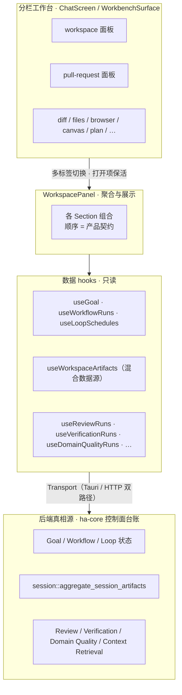
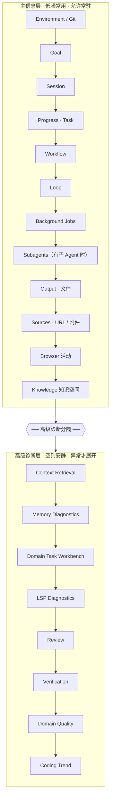
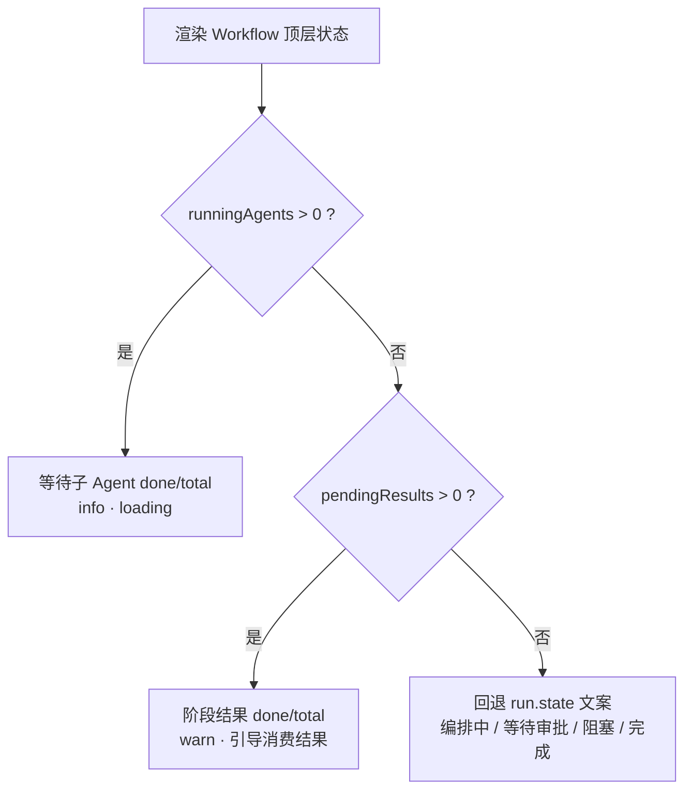
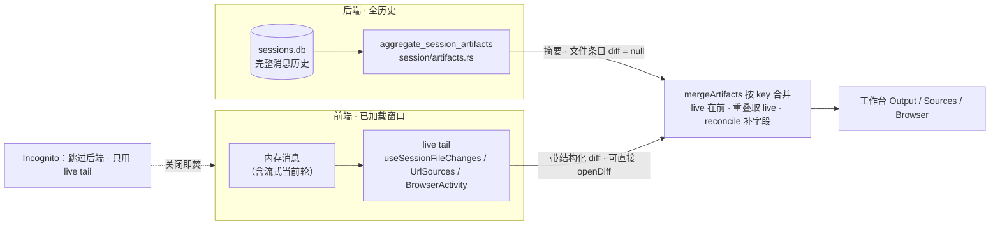

# Workspace Control Panel（工作台）

> 返回 [文档索引](../../README.md) · 更新时间 2026-07-23

**关联源码**

- 分栏工作台宿主：`src/components/chat/workbench/`、`src/components/chat/ChatScreen.tsx`
- 工作台主组件：`src/components/chat/workspace/WorkspacePanel.tsx`
- 产物混合数据源：`src/components/chat/workspace/useWorkspaceArtifacts.ts`（前端合并）、`crates/ha-core/src/session/artifacts.rs`（后端聚合）、`useSessionFileChanges.ts` / `useSessionUrlSources.ts` / `useSessionBrowserActivity.ts`（前端 live tail）
- Git / PR：`src/components/chat/workspace/GitControlCard.tsx`、`PullRequestPanel.tsx`、`src/components/chat/diff-panel/DiffPanel.tsx`
- 任务进度：`src/components/chat/tasks/TaskProgressPanel.tsx`、`src/components/chat/workspace/taskExecutionState.ts`

---

## 核心思想

主聊天是一条线性的对话流，但每个会话背后还挂着一大堆**状态**：当前目标进度、正在跑的工作流、按时触发的循环、后台任务、碰过的文件与引用来源、Git / PR 状况、各类诊断结果。这些东西如果全塞进对话流，会把对话本身淹没；可用户又确实需要一个「这个会话此刻到底怎么样、有没有需要我处理的东西」的总览，以及少量必要的控制入口。

Workspace 就是为这件事存在的：它是主聊天右侧分栏工作台中的完整控制面，只做三件事——**聚合展示、必要控制、异常入口**。分栏、标签与环境摘要的外层契约见 [`docked-workbench.md`](docked-workbench.md)。

关键的克制在于：**它不是第二套执行引擎**。工作台不发起模型回合、不绕过权限引擎、不自行解释 Goal 的完成语义，也不从聊天文本里反扫重建控制面事实。所有「真相」仍然归各控制面后端所有，工作台只是它们的一面镜子加几个按钮。

四条产品原则：

- 用户的主心智仍然是「和模型对话」；工作台负责把状态可见化、把必要控制和异常入口摆出来。
- Goal / Workflow / Loop 是三个**独立**的控制面，工作台只做聚合展示和用户侧控制，不替它们判定语义。
- 专家级诊断能力必须保留，但默认不打扰普通任务。
- 再多的 Task / Evidence / Guard 也不应把主面板刷成一片红；只有真正需要用户处理的**阻塞、审批、失败**才突出。

---

## 1. 组成与边界

工作台从右侧面板槽一路到后端真相源，分成清晰的几层：

| 层 | 位置 | 职责 |
| --- | --- | --- |
| 分栏工作台壳 | `chat/workbench/`、`ChatScreen.tsx` | 管理真实分栏、标签顺序、活动项、尺寸与 stage；Workspace、PR、diff、files、browser、canvas 等可同时保持打开，活动项可见、其余项保活。 |
| 工作台主组件 | `workspace/WorkspacePanel.tsx` | 组合各 section，管理 section 间跳转、共享 hooks、增量渲染与高级诊断排序。 |
| 任务进度 | `tasks/TaskProgressPanel.tsx`、`workspace/taskExecutionState.ts` | 展示会话 task snapshot；Task 是进度叶子，不是 Goal / Workflow / Loop 本体。 |
| 输入框联动 | `chat/input/ChatInput.tsx` | Goal / Workflow / Plan 等输入模式与工作台状态联动；不提前创建空会话。 |
| Git 控制卡 | `workspace/GitControlCard.tsx`、`PullRequestPanel.tsx` | 会话仓库摘要、分支、提交/推送、Handoff 入口，以及独立的 PR 详情面板。 |
| Git Diff | `chat/diff-panel/DiffPanel.tsx` | staged / unstaged / all 审阅及 all / file / hunk 级 mutation；完整契约见 [`git-control.md`](git-control.md)。 |
| 数据 hooks | `workspace/use*.ts` | 读取 Goal、Workflow、Loop、Review、Verification、Domain Quality、Domain Workbench 等控制面状态。 |
| 后端真相源 | `ha-core` 各控制面模块 | Goal / Workflow / Loop / Review / Verification / Domain Quality / Context Retrieval 等最终状态所在。 |

**边界**：工作台不直接发起模型回合，不绕过权限引擎，不自行解释 Goal 完成语义，也不从聊天文本反扫重建控制面事实。所有用户侧写操作都走 Transport，Tauri / HTTP 双路径由对应控制面 API 各自保证。

---

## 2. 信息架构

Section 的顺序本身是产品契约，按「低噪、常用、可理解」到「专家、诊断、质量守门」排列，中间用一道**高级诊断分隔**把两层切开：

按渲染顺序排出的完整清单（`Subagents` 只在会话有子 Agent 运行时出现）：

1. `EnvironmentSection`（含 Git 卡）
2. `GoalWorkspaceSection`
3. `SessionSection`
4. `Progress`（有任务时渲染 `TaskProgressPanel`，否则轻量空态）
5. `WorkflowRunsSection`
6. `LoopSchedulesSection`
7. `BackgroundJobsSection`
8. `SubagentsSection`（条件出现）
9. `Output`（文件）
10. `Sources`（URL / 附件）
11. `Browser`（浏览器活动）
12. `KnowledgeSection`
13. —— 高级诊断分隔 ——
14. `ContextRetrievalSection`
15. `MemoryDiagnosticsSection`
16. `DomainTaskWorkbenchSection`
17. `LspDiagnosticsSection`
18. `ReviewSection`
19. `VerificationSection`
20. `DomainQualitySection`
21. `CodingTrendSection`

### 主信息层

主信息层回答普通用户最常问的几个问题：

- 当前运行在哪里？有没有工作目录、项目、权限、分支和变更？
- 当前目标是什么？完成标准和状态是什么？
- 本会话用了什么模型、Agent、上下文和系统提示？
- 当前可见的任务进度是什么？
- Workflow / Loop 是否开启或有运行记录？
- 后台任务、输出文件、引用来源、知识空间是否有内容？

这层允许常驻展示和轻量控制，但不应堆满专家告警。

### Environment / Git 主操作区

会话位于 Git 仓库时，`EnvironmentSection` 把高频仓库操作收进一张紧凑的 Git 卡，信息顺序固定：

1. 变更数量与 `+added -removed`；点击打开 DiffPanel。
2. 当前运行位置（Local / Managed Worktree）和安全 Handoff 菜单。
3. 当前分支；detached 时显示「创建分支」。
4. 按 dirty / ahead 状态显示「提交」或「推送 N 个提交」。
5. 创建 Pull Request；已有 PR 时打开独立的 PR 工作台标签。
6. 当前 PR checks 汇总与逐项详情。
7. requested reviewers、顶层 Review 结论，以及未解决、未过期的行内评论。
8. 合并冲突状态与修复入口。
9. 用户显式确认后的自动合并入口。

版本、模型、权限、项目来源等低频环境信息继续放在详细信息区，不与 Git 主操作竞争。分支、变更、同步、最后提交、运行位置以及 Managed Worktree 的创建 / 恢复 / 归档等生命周期入口**只允许出现在 Git 卡中**，详细信息区不得重复展示第二套 Git / Worktree 状态。运行位置菜单负责 Local / Worktree 安全 Handoff，紧邻的托管工作树区域负责生命周期管理，二者共享同一张 Git 卡边界。非 Git 工作目录不渲染伪造的分支或 Worktree 操作，也不隐式执行 `git init`。

PR 详情、Checks 与 Review 评论属于当前 Session / HEAD / branch 的**网络状态**：只在存在 GitHub remote、附着本地分支且本机 `gh` 可用时读取；每 30 秒有界刷新，同键的手动刷新与轮询共享同一个带错误收口的请求，切换会话或分支后丢弃旧结果。Checks 与行内评论两个通道**独立**展示错误——检查接口失败不能遮蔽已经读到的评论，反之亦然；完整刷新失败时旧数据必须标记为可能过期并暂停修复 / 自动合并。PR 标签展示标题、描述、head / base、增删行、reviewers、每位审阅者最新的顶层 review、merge state 和自动合并状态；它注册为 `pull-request` 工作台面，复用顶部标签、共享分栏宽度与 stage，并在会话切换时关闭。查看已有 PR 的能力不依赖「能否创建 PR」这一 capability。

**「修复」不是直接执行按钮。** PR 标题、描述、分支、检查描述、评审与评论等外部字段都留在不可信数据信封内；修复入口只把经过长度限制和转义的任务**填入当前 composer**。用户确认发送后才进入正常聊天、权限与工具流程。按钮不得自动 commit、push、回复、resolve Review 评论或合并 PR。

**「启用自动合并」是独立的远端写操作**：存在冲突时不展示；用户必须在二次确认弹窗里选择 merge / squash / rebase，并明确确认「保护条件满足时可能立即合并」。完成后刷新当前 PR 详情。它不由修复任务、轮询或详情加载隐式触发。

### 高级诊断层

分隔线之后收纳更专业的能力：

- 推荐上下文与文件搜索。
- 通用任务工作台、Domain Evidence、Artifact / Connector 守门。
- LSP 诊断、Review、Verification、Domain Quality、Coding Trend。

这些能力很重要，但使用频率和解释成本更高，所以默认放在分隔标题之后，遵循「空状态安静、异常才突出」的展开规则。

---

## 3. Goal / Workflow / Loop / Task 语义

工作台必须始终把四个概念区分清楚，不能因为 Task 变多就把它们混为一谈：

| 概念 | 用户语义 | 工作台展示 |
| --- | --- | --- |
| **Goal** | 最终要达成什么、完成标准是什么、证据是否足够。 | 独立 Goal section：active Goal、criteria、revision、audit、closure、evidence、Goal Watchdog 确认和编辑 / 评估 / 关闭操作。 |
| **Workflow** | 一次具体、可观察、可恢复、可审批的动态执行 run。 | 独立 Workflow section：Workflow Mode、run 列表 / 详情、审批、失败恢复、trace、Watchdog 确认、create / run / pause / resume / cancel。 |
| **Loop** | 按时间、事件或条件持续触发同一任务策略。 | 独立 Loop section：schedule、trigger、run history、policy、progress guard、Watchdog 确认、暂停 / 恢复 / 停止 / run now。 |
| **Task** | Goal / Workflow / Loop 执行过程中产生的用户可见进度叶子。 | 只在 Progress 聚合展示数量、完成状态和当前进度；再多的 task 也不改变顶层控制面语义。 |

Goal / Workflow 执行过程中可以创建和完成很多 Task。Task 的增长不应让工作台自动展开所有专家区，也不应把 Goal 或 Workflow 误判为失败；只有当某个 Task failure 被对应控制面写成 blocking evidence、failed run 或 needs-user 状态时，它才进入异常展示。

### Workflow 顶层状态：派生而非照搬

Workflow 的顶层状态来自 durable snapshot 的**派生**，而不是直接照搬 `workflow_runs.state`。原因很实际：脚本的登记阶段结束时 run state 可能已经写成「完成」，但真正的子 Agent 还在跑、阶段结果还没被消费——直接照搬会谎报完成。所以派生按下面的优先级判定（`workflowRunDisplayState`）：

其中 `done` = `terminalAgents`、`total` = `spawnedAgents`。Agent 明细状态必须走 i18n 映射；`Workflow run completed. Use the output...` 这类内部模型协议文本不得作为用户详情的兜底文案。

---

## 4. 展开与告警策略

默认策略：

- 空 section 默认折叠或只显示轻量 empty hint。
- active Goal / active Workflow / active Loop 可以自动展开对应主 section。
- 高级诊断 section 只在 danger / error / 深链聚焦 / 用户显式展开时自动打开。
- Domain Task Workbench 不因 Workflow Mode 开启而自动变红；它只反映真实的 artifact / connector / quality guard 状态。
- Goal / Workflow / Loop Watchdog 只表示「需要确认或恢复入口可见」，默认用 amber，不自动等同失败；只有对应控制面明确 failed / blocked / danger 时才升级红色。
- Incognito 下 durable 控制面 section 必须失败即闭合或只显示不可用说明，不落任何持久化数据。

深链导航：Dashboard「目标与执行」的 attention 项可通过 `ChatFocusTarget.controlTarget` 深链到工作台——Goal 滚到 Goal section；Workflow 滚到 Workflow section 并展开目标 run；Loop 滚到 Loop section 并打开目标 schedule；Task 类回到 Progress。Plan review 不走工作台，直接打开既有 Plan 面板。**深链只负责导航，不改变任何控制面状态。**

颜色语义：

| 颜色 | 含义 |
| --- | --- |
| `danger` / 红 | 必须用户处理、阻塞交付或安全风险。 |
| `warning` / 橙 | 证据不足、建议补充或可选质量风险。 |
| `success` / 绿 | 完成、通过或已记录。 |
| neutral | 空状态、普通统计、只读信息。 |

红色不能用于「还没开始」「没有数据」这类普通空状态。

---

## 5. 输入框联动

输入框是 Goal / Workflow / Plan 等模式的主入口之一，工作台只是旁路的状态面。

### Goal

- `+` 菜单和 toolbar 可进入目标模式。
- 无 active Goal 时，目标模式发送等价于 `/goal <objective>`。
- 有 active Goal 时，可更新、替代、追加 required / optional / follow-up criteria。
- 渲染消息时隐藏 `/goal` 前缀，用 Goal 模式标记表达语义。
- 输入框上方常驻展示 active Goal 摘要和状态，让用户不打开工作台也能知道目标是否仍在进行。

### Workflow

- Workflow Mode 可以在输入框菜单切换 `off` / `on` / `ultracode`。
- 无会话的草稿态只更新 `draftWorkflowMode`，不提前创建空会话；首条消息发送时由 chat options 带入。
- Toast 只反馈用户结果（「工作流模式已开启：自动」/「工作流模式已关闭」），不暴露「下一条消息生效」这类实现细节。
- 开启 Workflow Mode 只是授权模型按需自主编排，不代表立即创建 run，也不要求用户手写脚本。

### Plan

Plan Mode 仍走自身的状态机与输入框 Plan UI；工作台只显示当前 plan state 和相关入口，不把 Plan 任务进度混入 Goal evidence。

---

## 6. 产物聚合：混合数据源

工作台的 **Output（文件）**、**Sources（URL / 附件）** 和 **Browser（浏览器活动）** 三段产物，都不是单一数据源，而是**后端全历史聚合**与**前端 live tail**合并的结果。

之所以要混合，是因为两边各有取舍：前端内存里的消息只是一个分页窗口，看不到更早的历史；后端能看到整段历史，但为了不撑爆响应体，它只回摘要、不带 diff 快照。两边一拼，既能看到完整历史，又能对当前窗口内（尤其正在流式的当前轮）的文件立即拿到结构化 diff。

| 半边 | 入口 | 覆盖范围 | 特点 |
| --- | --- | --- | --- |
| 后端读时聚合 | `session::aggregate_session_artifacts`（`session/artifacts.rs`） | 会话**完整**持久化历史 | 只回摘要；文件条目不带 `before` / `after` diff 快照，前端映射回来时 `diff: null` |
| 前端 live tail | `useSessionFileChanges` / `useSessionUrlSources` / `useSessionBrowserActivity`，经 `useWorkspaceArtifacts` 组合 | 内存中**已加载的消息窗口**（含正在流式的当前轮） | 带结构化 diff，可直接喂 `diffPanel.openDiff`；当前轮未落库即可见 |

后端快照在会话切换 / 面板挂载时拉取，并在一轮结束（`turnActive` true→false，此时该轮产物已落库）时重新拉取。每次请求带单调递增 id，只应用最新一次响应；会话 id 不匹配的快照直接丢弃。

**Incognito 会话完全跳过后端聚合，只用 live tail**，以守「关闭即焚」——不去读它的持久化行。无痕会话通常也短到整段落在已加载窗口内，功能上无损。

### 合并规则

`mergeArtifacts` 按 key 合并：**live tail 在前**（它总是最新的窗口，保证当前轮再次触及的文件 / URL 稳定置顶），后端独有条目续在其后；两侧重叠时取 live 条目，再由可选的 `reconcile` 从后端条目补字段。目前两个 reconcile：

- `reconcileFile`：live 条目缺语言而后端摘要有时，补上 Shiki language。
- `reconcileSource`：任一侧把 URL 认作 `web_search` 时，保留该 origin 徽标。

合并 key 三类：

- **文件**：`path`。
- **来源**：`sessionSourceKey`——URL → `url:<归一化 URL>`；附件 → `attachment:<localPath ?? url ?? quotePath ?? name>:<quoteLines>:<sizeBytes>`（后端对应 `attachment_source_key`）。
- **浏览器活动**：`call:<callId>`，`callId` 缺失时回退 `browser:<at>:<action>:<op>:<targetId>:<url>`。

### dedup / 排序是跨语言双实现

这是本子系统最容易踩的坑：**同一套 dedup 与排序规则在 Rust（`session/artifacts.rs`）和 TypeScript（`workspace/useSession*.ts`）各存在一份完整实现**，分别跑在全历史和已加载窗口两份数据上，输出再按上面的 key 合并。**改任一份必须同步另一份。**

漂移不会报错，也不会被类型系统或现有单测拦住——它表现为工作台里的重复行、错位排序，或同一个文件因为落在窗口内 / 窗口外而被归成不同类别。

改 URL 归一化 / origin 优先级 / skip-filter 前，主动回查并同步 `aggregate_sources`——源码里的互指注释并不完整，别指望它兜底。

必须逐条对齐的规则：

**文件（`aggregate_files` ↔ `aggregateSessionFileChanges`）**

- dedup 键是 `path`。
- 识别的结构化 metadata：`file_change`、`file_changes`（展开其 `changes` 数组逐条 upsert）、`file_read`。
- `modified` 不被 `read` 降级：已登记为改写的文件再次被读，只刷新活动顺序，`kind` 保持 `modified`。
- 工具产出的媒体文件（`send_attachment` / `image_generate` / `exec` 经 `__MEDIA_ITEMS__` 头带出的 `localPath`）以 `modified` 登记。命中已有条目时两侧行为一致：**刷新活动顺序，并把既有 `read` 升级为 `modified`**（产物落盘比只读更重要），但保留已有 write 条目更丰富的 diff / 行数 / read_lines。由 `upsert_media`（Rust）与 `useSessionFileChanges.ts` 媒体分支（TS）实现，`media_after_read_upgrades_to_modified_and_bumps` / `media_after_write_keeps_diff_and_bumps` 两个 Rust 测试锁定。
- 同一条消息内的处理次序：先结构化 file metadata，再该消息的媒体产物。后端刻意写成单次交错遍历，就是为了对齐前端按 tool 逐个处理的顺序。
- 排序：最近触及在前。
- **已登记的有意分歧**：前端 live tail 会用 `extractModifiedFiles` 对没有结构化 metadata 的旧消息做兜底；后端不做，只读结构化 metadata。窗口内的旧消息由 live tail 覆盖，更早的属已知缺口——这是刻意取舍，不是待修漂移。

**来源（`aggregate_sources` ↔ `aggregateSessionUrlSources`）**

- URL 先归一化（剥尾随句读标点 `. , ; : ! ? ) ]`）再 dedup，dedup 键是归一化后的 URL。
- origin 优先级 `web_search`(3) > `user_url`(2) > `message`(1)：命中已有条目时只把 origin 升级到更高优先级，**不改变首次出现的位置**。
- skip-filter 的适用面：只有助手正文（后端为 `assistant` + `text_block` 两类行）里的裸 URL 过滤私有 / 回环 host 与资源类扩展名；`web_search` 结果 URL 与用户显式发送的 URL **不过滤**。
- 用户附件：跳过 `message_quote`（后端常量 `MESSAGE_QUOTE_SOURCE`），其余按附件 key 去重；quote 类附件在两侧都单独映射出 `quotePath` / `quoteLines` / `quoteContent`。
- 排序：最近引入在前。后端在截断前整体反转；前端聚合函数返回时序，由 `useWorkspaceArtifacts` 反转统一口径。
- 后端的 URL 正则、私有 host 表和跳过扩展名表是 `src/lib/urlDetect.ts` 的逐条镜像（`URL_RE` / `PRIVATE_HOST_RE` / `SKIP_EXTENSIONS` ↔ `URL_REGEX` / `PRIVATE_HOST_PATTERNS` / `SKIP_EXTENSIONS`），同样必须同步。

### 上限与截断

后端每类产物上限 `MAX_ARTIFACTS_PER_KIND`（1000），保留最近的部分并置 `filesTruncated` / `sourcesTruncated` / `browserTruncated`，由 UI 显式说明——不做静默截断。前端 live tail 不设上限（它只覆盖已加载窗口）。

---

## 7. 数据与性能

工作台聚合了很多控制面，必须避免「打开面板就全量重活」：

- `useWorkspaceArtifacts` 只聚合当前 session artifacts，并对文件 / 来源列表做增量渲染；它是混合数据源，跨语言同步契约见上一节。
- Workflow runs state 可由父组件传入共享实例，避免重复轮询。
- Workflow template 只在创建器打开时加载，不因 active Goal 存在而预加载。
- `useScrollPagedRender` 对 files / sources 做 sentinel 增量渲染，避免大列表撑爆 DOM。
- Background jobs、Review、Verification、Domain Quality 等 hooks 只在工作台打开后由组件挂载读取。
- PR discovery 只在 GitHub remote + attached branch + upstream 都满足时自动读取一次；未发现 PR 后停止轮询，已有 PR 才每 30 秒刷新 details / checks / reviews / comments。detached HEAD 与无 upstream 分支不发起自动请求；同一 session / HEAD / branch / upstream 不允许重叠请求，卸载或 key 变化后忽略旧响应。
- 所有用户侧写操作仍走 Transport，Tauri / HTTP 双路径由对应控制面 API 保证。

---

## 8. 多语言与 UI 验收

工作台是高密度产品界面，新增文案必须同步所有 locale：

- 新 key 先写 `en.json` 与 `zh.json`，再通过 `node scripts/sync-i18n.mjs --apply` 或手动补齐其它语言。
- 提交前至少跑 `node scripts/sync-i18n.mjs --check`。
- 工作台相关文案要额外扫英文残留，尤其是中文界面里的 `trace`、`Managed worktrees`、`Workflow run` 等专业词。
- 含 `{{...}}` 占位符的 key 要保持各语言占位符集合一致。

UI 验收底线：

- 典型桌面宽度和窄屏宽度都不能横向溢出。
- 输入框工具栏不允许因按钮增多而换行或互相覆盖；空间不足时优先收纳进 `+` 菜单。
- hover tooltip / button shadow 不能被父容器裁切。
- 模型选择、Workflow Mode、权限、沙箱和 `+` 菜单的浮层必须在窄屏可见；二级菜单不得固定向右越出视口——`ModelPicker` 在右侧空间不足时把模型 / 温度二级菜单改为向上展开。
- 工作台 section 内容可内部滚动，但外层右侧面板不能出现不可控横向滚动。
- 默认空状态不能呈现成大面积红色。
- Git 卡在 Local、detached Worktree、attached Worktree、非 Git、dirty、ahead、PR 检查失败、合并冲突和评论为空等状态下都不得横向溢出；PR / checks / reviews / comments 详情必须内部滚动。
- 「修复」点击后只填 composer，并给出可撤销的结果提示；不能自动发送。

### Dev-only GUI smoke

- 开发环境支持 `?window=workspace-smoke`，入口在 `src/main.tsx`，实现为 `src/dev/WorkspaceSmokeWindow.tsx`。它复用真实 `WorkspacePanel`，用固定 fixture 覆盖 active Goal、running Workflow、dynamic Loop、Task 进度、后台任务、输出 / 来源、Domain Evidence、运行稳定性、长跑审计、交付守门、外部动作守门和连接器端到端。它只作为可重复的人工 / 浏览器 GUI smoke 入口，用来检查默认状态故事、高级诊断展开、窄 / 宽响应式布局和 popover / tooltip 裁剪；不替代真实 Tauri 桌面长跑、连接器 E2E 或 restart / resume 验收。
- 开发环境也支持 `?window=chat-input-smoke`，入口同在 `src/main.tsx`，实现为 `src/dev/ChatInputSmokeWindow.tsx`。它复用真实 `ChatInput`，用固定 fixture 覆盖 active Goal、Task progress、Workflow Mode、模型选择、权限、沙箱、工作目录、上下文用量、目标模式和 `+` 收纳菜单；用于复现输入框窄 / 宽布局、菜单裁剪和模式状态条，不替代真实 Tauri 桌面验收。

---

## 9. 后续

- 将 `WorkspacePanel.tsx` 按 section 拆分，降低单文件维护成本。
- 为 Workspace smoke harness 增加多语言视觉快照。
- 为高级诊断层增加用户级「简洁 / 专家」显示偏好，但不得隐藏真实阻塞状态。
