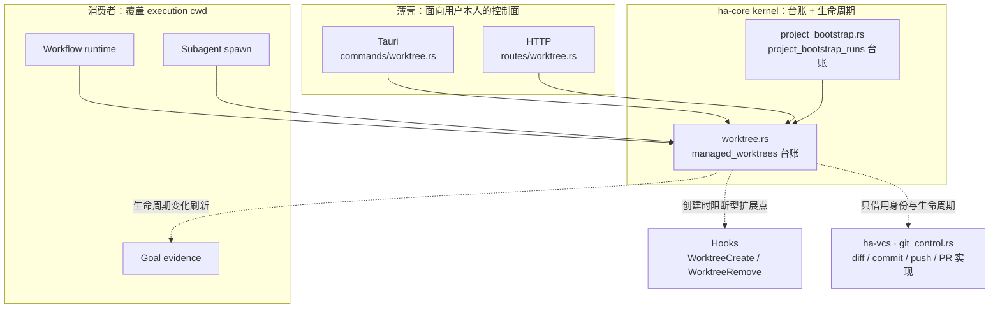
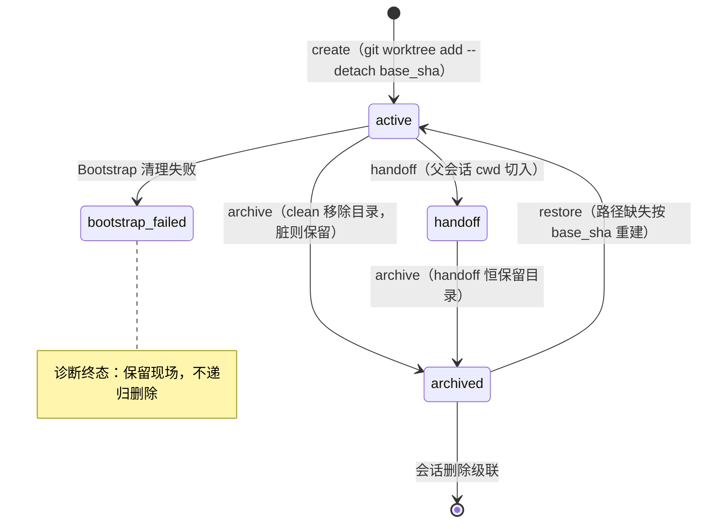
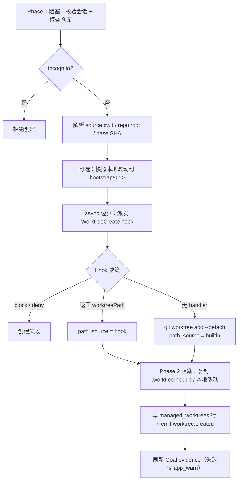
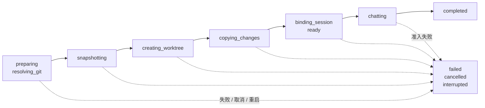

# Managed Worktree 控制平面

> 返回 [文档索引](../../README.md) | 更新时间：2026-07-23

## 这个子系统解决什么问题

长任务、Workflow、被委派的 Subagent 都想动代码，但它们不能直接在用户的主工作区里改——一旦几个执行体同时读写同一个 checkout，diff 会互相污染，用户手头正在编辑的改动也可能被覆盖。传统答案是 `git worktree`：为同一个仓库开出多个独立 checkout。但裸的 `git worktree` 命令是无状态的——刷新页面、重启进程、几天后回来，就再也说不清某个目录属于哪个会话、哪个 Workflow、哪个子会话，也没有 GUI 能把它列出来、归档或交回主线。

Managed Worktree 就是补上这层状态。它的关键想法是：**给每一个 worktree 一条 durable 的数据库行、一套生命周期状态和一组面向用户本人的 API，把底层的 `git worktree` 命令降格为实现细节。** 于是桌面、Server、Workflow 运行时、Subagent 生成路径全都共享同一套语义：创建一致、恢复一致、清理一致、审计一致。

它**不做**的事同样重要，这是理解边界的关键：

- **不实现 Diff / 分支管理 / commit / push / Pull Request**。这些是 [Session Git 控制平面](git-control.md) 的职责，后者复用本模块产出的 Worktree 身份与生命周期记录，但走独立的契约和幂等表。
- **不给模型一个"任意切换主会话 cwd"的工具**。创建、恢复、归档、交接都是面向用户本人的控制面能力；模型只能通过 Subagent 隔离这类受约束的路径间接用到它。
- **不在无痕（incognito）会话里创建 durable worktree**。无痕会话不落任何持久痕迹，创建请求在校验阶段直接拒绝。

一句话概括数据流的走向：

```text
会话工作目录  →  managed_worktrees 行  →  ~/.hope-agent/worktrees/<repo-slug>/<wt-id>/
                                        →  Workflow / Subagent 的 execution cwd
                                        →  restore / archive / handoff
```

## 系统全景

Managed Worktree 的台账（对 `sessions.db` 的表和纯生命周期逻辑）留在 `ha-core`：业务实现可以拆到其它 crate，但 `sessions.db` 的 SQL 台账始终留在 `ha-core`。它上面挂着两类东西：**壳**（把面向用户本人的命令桥接到 Tauri 与 HTTP）与**消费者**（Workflow、Subagent、Goal——它们读取 worktree 并用它覆盖执行目录）。相邻的 Session Git 实现则住在独立的 `ha-vcs` crate，只借用 worktree 的身份。



各层职责与源码入口：

| 层 | 代码 | 责任 |
| --- | --- | --- |
| 核心控制面 | `crates/ha-core/src/worktree.rs` | 表结构、创建、归档、恢复、交接、`.worktreeinclude` 复制、EventBus 发事件。 |
| 项目首轮 Bootstrap | `crates/ha-core/src/project_bootstrap.rs` | 首次发送前的校验、幂等记录、进度事件、取消与启动恢复。 |
| 路径 | `crates/ha-base/src/paths.rs` | `worktrees_dir()`、`bootstrap_run_dir()`、`git_operations_dir()`、`git_repo_lock_path()`。 |
| Hooks | `crates/ha-core/src/hooks/*` | `WorktreeCreate` 阻断/替换默认创建；`WorktreeRemove` 观察清理。 |
| Workflow | `crates/ha-core/src/workflow/{types,db,runtime}.rs` | `workflow_runs.worktree_id`，运行时自动 restore 并覆盖 execution cwd。 |
| Goal | `crates/ha-core/src/goal/mod.rs` | 绑定后写 `worktree_attached` evidence；生命周期变化刷新状态/路径/交接/dirty 快照。 |
| Subagent | `crates/ha-core/src/subagent/*` | 用户委派的 subagent 默认尝试创建 managed worktree 并设置 child session cwd。 |
| Tauri | `src-tauri/src/commands/worktree.rs` | 桌面端面向用户本人的命令。 |
| HTTP | `crates/ha-server/src/routes/worktree.rs` | Server/Web 面向用户本人的 REST API。 |
| Session Git | `crates/ha-vcs/src/git_control.rs` | Local/Worktree 安全 Handoff、分支归属、Session active location；`git_operation_runs` 台账留在 `ha-core/src/git_control.rs`。完整契约见 [git-control.md](git-control.md)。 |
| GUI | `src/components/chat/workspace/WorkspacePanel.tsx`、`GitControlCard.tsx` | Managed Worktree 列表、运行位置选择、Session Git 入口。 |

面向用户本人的这组命令在 Tauri 与 HTTP 上**一一对应**：`list` / `create` / `get` / `get_project_bootstrap_run` / `cancel_project_bootstrap` / `archive` / `restore` / `handoff`。新增任何一个都必须两套适配同时落地（这是 Transport 的通用约定）。注意：底层还有一个 `discard`（回滚一个刚准备好的 worktree），它**不对用户开放**——只由 Bootstrap 失败清理内部调用。

## 磁盘布局与数据模型

内建 Managed Worktree 固定放在 Hope Agent 数据目录下，**不**创建在项目相邻目录：

```text
~/.hope-agent/worktrees/<repo-slug>/<wt-id>/
```

- `repo-slug` 由 canonical repo root 派生：仓库目录名做字符清洗后，拼上 repo root 路径的 BLAKE3 摘要前 8 位。它只用于目录分组，**不作为仓库身份**。
- `wt-id` 是 `wt_<uuid-simple>`，路径里不含分支名，避免 rename 和特殊字符影响生命周期。
- `path_source` 记录路径由谁产出：`builtin` 是内建 `git worktree add` 建的，`hook` 是 Hook 返回的自定义路径。它只是记录与展示字段，不参与清理决策。
- 无论 `builtin` 还是 `hook`，清理都走 `git worktree remove --force`（Git-aware，**绝不对任意路径递归删除**），所以"不会误删到无关目录"这条是无条件成立的。两者唯一的实际差别是：DB 行已丢时的孤儿兜底清理只扫 `worktrees_dir()`，因此天然只会命中内建路径。

### `managed_worktrees` 表

台账落在 `sessions.db`。下表是持久化列（与建表 DDL 逐列对齐）；序列化给前端的 DTO 还会额外带一个**计算字段** `path_exists`（每次读行时对 `path` 做 `exists()` 探测，不落库）。

| 字段 | 说明 |
| --- | --- |
| `id` | `wt_*` 主键。 |
| `session_id` | 创建会话的不可变审计值；不再承担所有权 FK。 |
| `child_session_id` | 可选；subagent 的 child session（外键，会话删除时置空）。 |
| `workflow_run_id` | 可选；Workflow 反向索引。`create_workflow_run(worktreeId)` 在该字段为空时回填，已绑定则不覆盖。 |
| `owner_session_id` / `owner_scheduled_task_id` | 二选一的 durable owner。普通、Workflow、Subagent 随 owner session 删除；Fresh Scheduled Run 在显式归档/丢弃前阻止 owner session 删除；任务专属 Worktree 不因创建它的 run chat 删除而丢台账。 |
| `scheduled_task_id` | Scheduled 来源；`scheduled_run` 在 handoff 后仍保留来源。 |
| `runtime_session_id` / `runtime_run_id` | 任务专属 Worktree 当前精确 occurrence 的临时执行绑定。 |
| `handoff_session_id` | 用户接管任务专属 Worktree 的普通聊天；存在时新 scheduled runtime fail closed。 |
| `purpose` | `manual` / `workflow` / `subagent` / `scheduled_run` / `scheduled_task`。后两种只许 scheduler 的 typed kernel API 创建，通用 Tauri/HTTP create 拒绝伪造。 |
| `state` | `active` / `archived` / `handoff` / `bootstrap_failed`。 |
| `label` | 展示标签，不作为身份。 |
| `repo_root` | 源仓库 canonical 根目录。 |
| `source_working_dir` | 创建时的源 cwd。 |
| `path` | managed worktree 绝对路径（有唯一索引）。 |
| `path_source` | `builtin` / `hook`；只记录路径由谁产出，默认 `builtin`，不参与清理决策。 |
| `base_ref` / `base_branch` / `base_sha` | 创建基线：ref、分支名、固定 commit SHA。 |
| `git_branch` | worktree 当前分支；内建创建后是 detached，故默认为空。 |
| `dirty_snapshot_json` | 归档时捕获的变更快照（staged/unstaged/untracked/conflicted 计数）。 |
| `created_at` / `updated_at` / `archived_at` / `restored_at` / `handed_off_at` | 生命周期时间戳。 |

### 临时目录

三处临时目录各有各的用途，**刻意不混用**，这样清理和取消都能约束在各自边界内：

| 目录 | 用途 |
| --- | --- |
| `~/.hope-agent/bootstrap/<request-id>/` | 项目首轮的未提交改动快照：`tracked.patch` + `untracked.manifest` + `metadata.json`。 |
| `~/.hope-agent/git-operations/<request-id>/` | Session Git 安全 Handoff 的快照（staged/unstaged patch、untracked 内容、metadata），详见 [git-control.md](git-control.md)。 |
| `~/.hope-agent/git-locks/<hash>.lock` | 仓库写操作的跨进程短锁，文件名是 canonical git-common-dir 的 BLAKE3 摘要。 |

`<request-id>` 在成为路径分量前会被校验为仅含字母、数字、`-`、`_`（长度 ≤128），使清理永远约束在 Hope 数据目录内。

## 生命周期

一个 worktree 一生只在四个状态间迁移。`active` 是常态；`archived` 是"暂时收起、目录可能已删";`handoff` 是"父会话已把 cwd 切进来"；`bootstrap_failed` 是首轮 Bootstrap 出错、连 Git-aware 清理也没能移除 worktree 时保留下来的诊断态。



每次状态变化都通过 EventBus 广播一个事件，GUI 据此实时刷新：`worktree:created` / `worktree:updated`（回填 workflow 反向索引时）/ `worktree:archived` / `worktree:restored` / `worktree:handoff`。

Scheduled Worktree 不另建生命周期状态机：Fresh 仍是 session owner；Persistent
只用 `runtime_*` 与 `handoff_session_id` 的 typed CAS 表达临时运行和人工保管。
acquire 同事务绑定 run session cwd，终态 release 后普通队列才获准进入；takeover
先暂停 Task 且只接管完全空闲的 Worktree，return/discard 拒绝 live runtime。
Persistent 的普通 dirty 是跨轮连续工作的正常状态，仅 conflict 阻止下一轮；任务暂停/
恢复与 run log 仍由 CronDB 负责，SessionDB 不跨库补偿或重放。

### 创建：两阶段夹一个 Hook 边界

创建路径要跑几个 `git` 子进程 + 写 DB，全是同步阻塞操作，因此被拆成两个阶段丢进 blocking 线程池；中间夹着一个 async 的 Hook 派发边界。这个"阻塞—异步—阻塞"的结构是理解创建流程的骨架：



具体步骤：

1. 校验 session 存在且非 incognito。
2. 解析 session 的 effective working directory，或显式传入的 `sourceWorkingDir`。
3. 要求源目录位于 git worktree 内（`rev-parse --is-inside-work-tree`）。
4. 生成 `wt_*` id 和默认路径 `~/.hope-agent/worktrees/<repo-slug>/<wt-id>`，并把 `base_ref` 解析为固定的 `base_sha`。
5. 若匹配到 `WorktreeCreate` hook 则派发：hook 可以 `block`/`deny` 直接失败，或返回 `hookSpecificOutput.worktreePath` 接管路径（记为 `path_source=hook`）。
6. 无 hook 时执行 `git worktree add --detach <path> <base_sha>`（记为 `path_source=builtin`）。
7. 复制 `.worktreeinclude` 声明的 git-ignored 文件，以及 `AGENTS.override.md`。
8. 写 `managed_worktrees` 行、按需绑定 session cwd、emit `worktree:created`，最后 best-effort 刷新 Goal evidence。

**两个 Drop 守卫是这里最容易忽略的正确性保障**：

- `BootstrapDirGuard` 在跨越 async Hook 边界**之前**就武装好，确保任务被取消或 hook 失败时，`bootstrap/` 下的快照素材不会被遗留。
- `WorktreeCreationGuard` 在 Phase 2 全程武装，只有在 DB 行成功 INSERT 之后才解除。它 Drop 时**只调用 `git worktree remove --force` + `prune`**，永远不会对路径做递归删除——所以即便是 Hook 自己返回的任意路径，回滚也是安全的，不会变成 `rm -rf` 的靶子。

### 恢复

`restore_managed_worktree` 只在磁盘路径缺失时，才用 `base_sha` 重新 `git worktree add --detach` 并重新复制 `.worktreeinclude`；随后把状态翻回 `active`。

有一个非显然的后果值得记住：**归档时若 worktree 是脏的，目录会被保留**（见下节），restore 只是翻状态；但若归档时 worktree 是干净的、目录已被移除，restore 会按 `base_sha` 从头重建——此时不会有任何未提交内容，因为 `dirty_snapshot_json` 是审计用的元数据，不是内容备份。

### 归档

`archive_managed_worktree` 先捕获一份 dirty snapshot。**仅当** worktree 干净、状态非 `handoff`、且路径存在时，才 best-effort `git worktree remove`（不带 `--force`）并触发 `WorktreeRemove` hook。只要有本地变更就保留目录，只更新状态和快照——绝不丢用户没提交的东西。

### 交接（生命周期 handoff）

`handoff_managed_worktree` 是一个**轻量的**生命周期入口：把父 session 的 `working_dir` 切到 worktree 路径、标记 `handoff`、并触发既有的 `CwdChanged` hook（只在路径真的变化时才 fire）。它**不复制** staged/unstaged/untracked 状态。

这一点必须和工作台上的 **Local ↔ Worktree 双向迁移**区分开：后者必须调用 `git_control::handoff`，那条路径要求同仓库、目标干净，会完整捕获并校验 staged/unstaged/untracked 的 fingerprint，只有全部复制校验通过才更新 Session cwd，失败按持久 metadata 回滚。两类 handoff **不可互换**——用生命周期 handoff 去做工作台迁移，会绕过状态复制、fingerprint 校验和失败回滚。

## 项目首轮 Bootstrap

项目草稿的第一条消息可以携带一份 `ProjectSessionBootstrapInput`，让新会话在真正进入对话前，先把运行环境准备好。这里的核心设计是：**分支选择与运行位置正交**。

- **运行位置（launchMode）**：`local` 直接在本地 checkout 上跑；`worktree` 开一个隔离的 detached managed worktree。
- **起始分支（baseRef）**：两种位置都可以选后端 Git 接口返回的 `refs/heads/*` 或 `refs/remotes/*`。

`local` 的分支处理刻意保守，从不自动 stash / reset / 丢改动：选当前分支时保留现有未提交改动；选其它本地分支时仅在工作区干净时 `git switch`；选 remote-tracking 分支时仅在工作区干净时创建本地 tracking branch。`worktree` 则把 ref 解析成固定 SHA，创建 detached worktree，并在进入 Chat Engine 前把临时 session 的 `working_dir` 绑到该路径——这次绑定保持 `active`，**不**标记为后续用户动作那种 `handoff`。

HTTP 侧多一道闸门：`/api/chat` 携带 `projectBootstrap` 时属于 Git 写操作，在创建临时 Session 前必须先过 `filesystem.allow_remote_writes=true`（默认配置返回 403）。桌面 Tauri 不受这道 HTTP 远程写闸门约束。

### 前端草稿与后端输入

前端维护一份草稿状态，包含幂等用的 `requestId`：

```ts
interface ProjectRuntimeDraft {
  requestId: string
  launchMode: "local" | "worktree"
  baseRef: string | null
  baseRefKind: "local" | "remote" | null
  includeLocalChanges: boolean
}
```

- 新项目草稿默认 `local`；Git 项目在两种 launch mode 下都显示分支选择。
- 默认选当前本地分支；detached HEAD 时依次回退 `main`、`master`、第一个本地分支，最后第一个远端分支。
- 只有选当前本地分支时 `includeLocalChanges` 才可能为 `true`；选其它本地/远端分支时强制 `false`。
- 切换项目保留 composer 文本、普通附件与文件引用，但清空旧项目的 KB attach、Git 缓存、分支和 runtime draft。
- Git 信息刷新后若 ref 失效，回退默认分支并提示用户，不能静默提交旧 ref。

后端接收的是它的精简子集：

```ts
interface ProjectSessionBootstrapInput {
  requestId: string
  launchMode: "local" | "worktree"
  baseRef?: string | null
  includeLocalChanges?: boolean
}
```

这个字段只允许**无 `sessionId` 的项目草稿**使用；已有 Session、普通草稿、项目缺失/归档、目录无效、非 Git 仓库、非法 ref、tag、裸 SHA 或跨仓库 ref 一律 fail closed。老客户端不传时等价于 `launchMode=local`。后端会重新解析 `refs/heads/*` / `refs/remotes/*` 并固定为 commit SHA，**不信任前端缓存**。

### 阶段机与幂等

准备过程通过 `project:bootstrap_progress` 广播一串阶段；首轮接管后转成 `chatting` / `completed` 并发 `project:bootstrap_completed`。整条链由 `project_bootstrap_runs` 表 + `requestId` 提供持久状态、查询和去重。



| 阶段 | 行为 |
| --- | --- |
| `preparing` / `resolving_git` | 校验项目、工作目录、ref 与 repo root，解析固定 SHA。 |
| `snapshotting` | 仅在选的是当前分支时，捕获 tracked/untracked 内容，并前后复核 HEAD 未变。 |
| `creating_worktree` | 创建临时 Session 和 detached Managed Worktree，此时还不发 `session_created`。 |
| `copying_changes` | 应用 tracked patch、复制 manifest 文件和 `.worktreeinclude`。 |
| `binding_session` / `ready` | 把 Session cwd 绑到 Worktree，准备进入聊天引擎。 |
| `chatting` / `completed` | `chatting` 只表示首轮请求赢得 claim；可执行消息须等 TurnKernel 原子落 user message + chat turn + stream run 后才写 `completed`。唯一非模型例外是 `UserPromptSubmit` 明确 Block：持久化 notice 并 materialize Session 后结束 bootstrap。 |
| `failed` / `cancelled` / `interrupted` | 不保存首条消息、不调用模型；走 Git-aware 清理，清理失败则保留诊断状态。 |

幂等规则：同一 `requestId` 正在执行时，重复请求附着到既有 run；终态的重复请求返回既有结果，不重复建 Worktree 或启动首轮；重试必须换新 ID。`ready → chatting` 用条件更新保证首轮最多 claim 一次，但它不是模型执行成功事实：模型路由、Provider lease 或交互落库在 TurnKernel 准入中失败时，kernel 释放 active-turn lease 并同步把 run/worktree/空 Session 走 Git-aware rollback；可执行消息只有准入成功才允许 `chatting → completed`。

**取消与重启恢复**是这里的两个可靠性支点：

- 取消经取消登记表 + `is_project_bootstrap_cancelled`，在准备的每个可中断点检查，中途取消会停复制、写 run 终态、清理临时 Session / Worktree / Bootstrap 目录。
- 应用重启时，只有 primary 进程会把 `project_bootstrap_runs` 里遗留的准备态标为 `interrupted` 并做 Git-aware 清理；secondary 进程仅仅打开数据库，**不得改动运行态**。若某个遗留 run 在崩溃前已跨进对话（session 已有真实消息），则保留其 session/worktree 交给正常聊天恢复，但绝不自动重跑首轮。

### 复制未提交内容

只有"选当前本地分支且 HEAD 与已解析 `baseRef` SHA 一致"时，才允许把未提交内容带进新 worktree：tracked 内容由 `git diff --binary HEAD --` 捕获、以 `git apply --binary` 应用；非忽略的 untracked 文件由 NUL 分隔的 manifest 逐个复制。staged 状态不保留（应用后都落成工作区改动）。

所有路径都要过 canonical containment 校验；遇到 symlink、HEAD 变化、patch 冲突或部分复制失败都会阻止首轮启动。ignored 文件仍只由 `.worktreeinclude` 控制，`AGENTS.override.md` 延续它的特殊复制规则。选其它本地或远端分支时不携带源工作区改动。

失败清理按固定顺序收口：停复制任务 → 写 run 终态 → 解除 Session/Worktree 绑定 → Git-aware remove → prune → 删无消息临时 Session → 删 Bootstrap 目录 → 广播失败事件。若 DB 行已丢，兜底再扫 `worktrees_dir()` 做一次 Git-aware remove；连这一步也失败时就保留现场并标 `bootstrap_failed`。

当前的项目草稿控制面只提供"本地处理 / 新工作树"和起始分支，不含命名环境、Setup script、环境变量、Actions 或云端运行。

## Workflow 集成

`CreateWorkflowRunInput.worktree_id` 可选。创建 run 时校验三件事：worktree **存在**、属于**同一 session**、状态为 `active` 或 `handoff`。这里有一对刻意分开的真相源：

- `workflow_runs.worktree_id` 是**执行期真相源**。
- `managed_worktrees.workflow_run_id` 是 GUI / 审计 / 清理用的**反向索引**，且是**填一次就不覆盖**：创建 run 时若反向索引为空则回填 run id 并 emit `worktree:updated`；已绑定其它 run 则保持不动。

运行时构造 `WorkflowSessionContext` 时，若 run 绑了 `worktree_id`：读取该 managed worktree → **archived 或路径缺失就自动 restore** → 把 `session_context.working_dir` 覆盖为 worktree 路径 → 追加一条 `run_worktree_attached` trace event。因此 `workflow.fileSearch` / `read` / `grep` / `tool` / `validate` / `diff` 都以绑定的 worktree 为默认 cwd。

关键不变量：**Workflow 绑定的 worktree 不可用时必须 fail closed**——运行时会把 run 标为 `blocked(worktree_unavailable)`，绝不悄悄回退到父目录执行。

## Goal Evidence 集成

绑定了 Goal 的 Workflow run 如果带 `worktree_id`，创建后会写一条 `goal_links(target_type='worktree', relation='worktree_attached')`。它是**执行环境证据**，让 Goal detail、timeline 和模型的下一轮 prompt 能看见"改动落在哪、交接到了什么状态"。metadata 记录一整份 worktree 快照，包括：

- `worktreeId`、`runId`、`kind`、`runState`、`reverseWorkflowRunId`。
- `purpose`、`state`、`label`、`path`、`pathExists`。
- `repoRoot`、`sourceWorkingDir`、`baseRef`、`baseBranch`、`baseSha`、`gitBranch`。
- `dirtySnapshot`、`archivedAt`、`restoredAt`、`handedOffAt`，以及一段人读 `summary`。

`create` / `link_to_workflow_run` / `archive` / `restore` / `handoff` 五个生命周期入口都会 best-effort 刷新这条 evidence；刷新失败只写 `app_warn`，绝不让 Worktree 生命周期操作本身失败。

语义边界（也是红线）：

- `worktree_attached` 是**正向的上下文证据**，让审计和模型看得见执行落点。
- 它**不是** strong completion evidence，不能单独让 Goal completed。
- archived / 路径缺失也**不**在 Goal evaluator 里一律判成 blocker；真正执行时才由 Workflow 运行时对不可用 worktree fail closed / block。

GUI 上分三层展示：Workspace 环境面板列出当前 session 相关的 managed worktrees（可创建/恢复/交接/归档）；Workflow run overview 展示本 run 的运行位置（优先读 live row，缺失时用 `run_worktree_attached` trace 兜底）；Goal detail 的 Worktrees 区块只呈现 `worktree_attached` evidence，服务目标审计。

## Subagent 集成

`SpawnParams.isolate_worktree` 控制 child session 是否尝试创建 managed worktree：

- 用户可见的 `subagent` / `batch_spawn` 工具**默认开启**（`subagent` 是 `!shared_read_only`，`batch_spawn` 恒 `true`）。
- 内部的 plan / team / hook / skill fork 保持 `false`，避免内部 helper 默认制造大量 worktree。
- 创建成功后，child session 的 `working_dir` 指向 worktree 路径，并在子 Agent 的受信 run-instruction 中加入 `## Managed Worktree` 固定合同，告诉它把该路径当默认工作区；路径/任务等可变正文不并回稳定 system 前缀。
- 创建失败时**不阻断** subagent：继承父 session 的 effective working directory 并 `app_warn!`。

## Hooks 扩展点

`WorktreeCreate` 是**阻断型**事件——企业环境可以用它把默认创建替换成自定义 git / 非 git VCS / 初始化脚本。匹配后必须返回接管路径：

```json
{
  "hookSpecificOutput": {
    "worktreePath": "/absolute/path/to/worktree"
  }
}
```

如果 hook 返回 `block` / `deny`，创建失败；若没有任何 handler 或 name 不匹配，走内建 git 创建。

`WorktreeRemove` 是**观察型**事件（在 Hook 的 `is_observation_only` 集合里，不能阻断），在内建 clean remove 成功后 fire，payload 带 `worktree_path`。Hook 协议的字段级细节见 [hooks.md](hooks.md)。

## Session Git 交界

工作台的 Git 卡和 DiffPanel 走的是**独立的** Session Git 控制平面：实现在 `crates/ha-vcs/src/git_control.rs`，`git_operation_runs` 台账留在 `ha-core/src/git_control.rs`。它复用 Worktree 的身份与生命周期记录，但有自己的契约、幂等表和事件（`session:git_progress` / `session:git_changed` / `session:git_completed`）。

对 Managed Worktree 而言，只有两个交界点需要在这里记住：

- **跨进程锁按 git-common-dir 归一**：仓库写操作用 `~/.hope-agent/git-locks/<hash>.lock`，`<hash>` 是 `git rev-parse --git-common-dir` 的摘要。因此 Local 与 linked Worktree 共享同一把锁（它们同属一个 common dir），而实际的 diff/patch 始终在各自的 checkout root 里执行。
- **两类 handoff 不可互换**：工作台的 Local ↔ Worktree 安全迁移必须走 `git_control::handoff`（同 common dir、目标干净、fingerprint 校验、失败按 metadata 回滚），不能用本模块的生命周期 `handoff` 去绕。

Snapshot/DTO、Diff/hunk、索引 mutation、分支、commit/push、PR 详情/checks/reviews/comments/自动合并、逐阶段 Handoff 回滚的完整说明见 [Session Git 控制平面](git-control.md)。

## 不变量与安全边界

这些约束多数是为了让"隔离"和"清理"始终安全——理解它们背后的理由，比记住条文更重要：

- **所有 durable worktree 创建必须经 `SessionDB::create_managed_worktree`**，这样 incognito 拒绝、身份生成、守卫回滚才有唯一入口。
- **incognito session 禁止创建 managed worktree**（无痕不落持久痕迹）。
- **label 只用于展示，身份必须用 `wt_*` id**——路径和标签都可能变，id 不变。
- **Workflow 绑定的 worktree 不参与 `script_hash`**（它是运行环境，不是脚本内容）。
- **Workflow 绑定的 worktree 不可用时必须 fail closed / block**，不能静默改用父目录，否则隔离形同虚设。
- **Worktree 的 Goal evidence 只描述执行环境与交接状态**，不能替代 validation / review / workflow completion。
- **`.worktreeinclude` 只复制 git-ignored 文件**，跳过 symlink，不覆盖 git 语义。
- **Bootstrap 临时文件只能写进 Hope 数据目录**；worktree 的失败清理一律走 `git worktree remove`（Git-aware），**禁止对任意路径递归删除**——这条安全性靠"清理只用 git remove"来保证，与 `path_source` 无关。
- **工作台双向迁移不得调用生命周期 handoff** 来绕过 Git 状态复制、fingerprint 校验和失败回滚。
