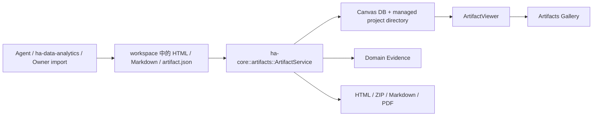

# Artifacts 本地优先产物平台

> 返回 [文档索引](../README.md)
>
> 更新时间：2026-07-15

Artifacts 是 Canvas 之上的持久化控制面。Canvas 继续负责项目目录、兼容工具、事件和右侧 iframe 预览；Artifacts 负责身份、不可变版本、来源、证据、验证、导出、归档和 Gallery。旧 Canvas ID 原样成为 Artifact ID，不移动 `canvas.db` 或历史项目目录。

本系统的“本地优先”指交付无需公网部署：用户可以保存 HTML、ZIP、Markdown 或 PDF。分析过程仍可能按当前 Provider、知识空间和连接器配置访问远端服务；Artifact 会保存来源范围与 producer 摘要，但本地交付不等于全程本地计算。

## 系统边界



架构不变量：

- 业务逻辑全部位于 `ha-core::artifacts`；Tauri 与 HTTP 只做薄壳和文件交付。
- 旧 `canvas` 工具与 `/api/canvas/*` 保持兼容。旧记录惰性登记为 `kind=custom`、`privacy=local_private`、`producer=legacy_canvas`。
- Artifact 版本不可变；update 必须携带 `expected_version`，restore 生成新版本。
- 模型工具只有 create/update/show/list/versions/restore/verify。导出、脱敏复核、归档和删除只在 owner 平面。
- Artifact 只保存 Domain Evidence ID 和摘要；`domain_evidence_items` 仍是证据真相源。
- 持久化入口遇 incognito 一律拒绝。当前版本没有用磁盘记录伪装出的“内存 Gallery”。
- Artifact 导出与 Publisher 是两个权限面。本版本没有 LAN、Drive、WebDAV 或 Sites Publisher。

## 当前支持的内容形态

Artifact 生命周期统一，但内容不强制经过同一种 IR。

| 输入 | `payload_kind` | 阅读器 | JavaScript | Markdown 导出 | 典型用途 |
| --- | --- | --- | --- | --- | --- |
| `artifact.json`（`hope.analysis-artifact.v1`） | `analysis` | Core 确定性分析报告 renderer | 无 | 确定性生成 | 数据分析报告、KPI readout、数据表、分析型 explainer |
| `.md` | `freeform` | Core Markdown renderer | 无 | 原文保留 | 普通报告、说明文档、低带宽交付 |
| `.html` / `.htm` | `freeform` | 导入 HTML + 强制离线 CSP | 可使用内联脚本 | 不支持无损逆转换 | 交互 Dashboard、交互 explainer、自定义页面 |
| 历史 Canvas | `freeform` / legacy | 旧 Canvas renderer | 取决于类型 | 仅有显式 fallback 时支持 | HTML、Markdown、Code、SVG、Mermaid、Chart、Slides 兼容预览 |

这里的“交互 Dashboard”是受限 Freeform HTML，不是 `AnalysisArtifactV1` 内置的 JavaScript dashboard runtime：脚本可以操作包内 DOM 和内嵌数据，但 CSP 禁止网络连接、远程脚本、iframe、object、embed、form 和外部导航。结构化 Analysis 报告故意保持静态，以便离线、无脚本、打印和审计结果一致。

## 数据模型与存储

### ArtifactRecord

`ArtifactRecord` 是当前状态投影，主要字段包括：

- 身份：`id`、`title`、`kind`、`content_type`；
- 归属：`session_id`、`project_id`、`agent_id`、`goal_id`；
- 生命周期：`lifecycle_state=active|archived`、`privacy`；
- 当前版本：`current_version`、`current_hash`、`payload_kind`、`analysis_status`；
- 追溯：`source_summaries`、`evidence_summary`、`capabilities`、`verification`；
- 预览：`project_path`；
- 时间：`created_at`、`updated_at`。

`ArtifactKind` 当前接受 `report`、`dashboard`、`data_table`、`explainer`、`pr_walkthrough`、`diagram`、`slides` 和 `custom`。未知值规范化为 `custom`。

`privacy` 当前持久化值为：

- `local_private`：默认，仅本机管理；
- `shareable_snapshot`：计划交付给指定受众，导出前必须通过 Export Guard；
- `sensitive`：敏感产物，导出前必须通过 Export Guard；
- `incognito`：schema 预留值，但 durable create/update 会拒绝，不能进入 DB、Gallery 或导出历史。

### ArtifactVersion

版本元数据位于 `artifact_version_meta`：

- `(artifact_id, version_number)` 唯一；
- `parent_version` 记录版本谱系；
- `payload_kind`、`payload_json` 保存 canonical payload；
- `content_hash` 是 canonical bytes 的 SHA-256；
- producer、capabilities、sources、evidence 和 verification 按版本保存；
- restore 从指定历史版本复制 canonical payload并产生新的最大版本号，不覆写旧行。

更新在 `BEGIN IMMEDIATE` 事务内再次比较 `expected_version`，因此 owner API 的预检不是并发保护的唯一边界。冲突返回 current version/hash；调用者必须重新读取、合并后重试，没有 blind force。

### SQLite 与 managed files

现有 `canvas_projects` / `canvas_versions` 保持不动，并加法新增：

- `artifact_records`：当前控制面元数据；
- `artifact_version_meta`：不可变版本元数据和 canonical payload；
- `artifact_exports`：导出 receipt、hash、验证、受管路径和 7 天过期时间；
- `artifact_blobs`：SHA-256 内容寻址 blob；
- `artifact_version_blobs`：版本到逻辑资产的引用。

目录布局：

```text
~/.hope-agent/canvas/
├── canvas.db
├── projects/<artifact-id>/
│   ├── index.html       # renderer-owned 当前阅读投影
│   ├── artifact.json    # canonical payload 的当前副本
│   └── content.md       # 可用时的 Markdown fallback
├── blobs/<sha-prefix>/<sha256>
├── exports/<export-id>.<ext>
└── pdf-runtime/<export-id>/   # PDF 临时隔离 profile，结束后删除
```

`artifact.json` / `artifact_version_meta.payload_json` 是 analysis 版本的不可变真相源；`index.html` 是 renderer-owned、可重建投影。读取、show 或 restore 旧 Analysis Artifact 时，Core 可以原子重建当前预览以获得新版响应式和可访问性修复，但不得改变版本号、canonical hash、来源或 evidence。投影 bytes 变化会清除旧 verification，避免把旧渲染校验误认为仍有效。

所有受管文件写入使用 `platform::write_atomic`。创建、更新和恢复在 DB、项目文件与 blob 之间维护回滚快照；失败不得留下半提交项目。删除后通过引用表做 blob GC。

## 文件式创建与更新

模型和 owner 入口都先在受控 workspace/staging 生成文件，再由 `ArtifactService` 复制到 managed store。系统不与原文件保持活动链接。

输入约束：

- 只接受 `.html`、`.htm`、`.md`、`.json`；JSON 必须是有效的 `AnalysisArtifactV1`；
- 文件必须位于调用方允许的 workspace、agent home 或 owner 选择范围内；canonical path 必须仍处于允许根目录；
- 最大 25 MiB，且必须是 UTF-8 文本；
- 导入 HTML 拒绝 iframe/object/embed/form、外部导航与 redirect；
- Markdown 的 raw HTML 作为文本处理，并拒绝外部导航链接；
- 导入后强制注入离线 CSP，不信任源文件自己的 CSP。

模型工具 `artifact` 支持：

| action | 关键参数 | 行为 |
| --- | --- | --- |
| `create_from_file` | `file_path`、可选 title/kind/privacy | 复制、校验、创建 v1、打开 Canvas 预览 |
| `update_from_file` | `artifact_id`、`file_path`、`expected_version` | 乐观并发更新，成功后创建新版本 |
| `show` | `artifact_id` | 重建必要投影并触发 `canvas_show` |
| `list` | limit/offset/kind/lifecycle_state | 返回轻量 Artifact 记录 |
| `versions` | `artifact_id` | 返回版本谱系、hash、producer 与验证摘要 |
| `restore` | `artifact_id`、`version` | 从历史内容创建新版本并打开预览 |
| `verify` | `artifact_id` | 运行确定性离线与完整性检查 |

模型工具在 incognito 会话完全不可用，因为当前 Artifact 是 durable 能力。删除、导出和脱敏确认不暴露给模型。

## AnalysisArtifactV1

`hope.analysis-artifact.v1` 是 Hope 原生 Data Analytics 交换契约，顶层包含：

- `question`、`audience`、`decision`、`status`；
- metric definitions、time range、filters、grain；
- bounded datasets；
- findings、recommendations、caveats、narrative blocks；
- charts、presentation tables、static fallbacks；
- canonical sources；
- data-quality 与 claim-validation 结果。

详细字段示例和 authoring 约束见 [`skills/ha-data-analytics/references/analysis-artifact-v1.md`](../../skills/ha-data-analytics/references/analysis-artifact-v1.md)。Core 导入器至少拒绝：

- schema 不匹配、问题为空或 status 不是 `ready|partial|blocked`；
- 来源缺稳定 ID/64 位 SHA-256，或存在重复 source ID；
- dataset 缺 ID、`rowCount`、bounded `rows`，内嵌超过 5000 行，或引用未知来源；
- chart 缺 dataset/source/fallback 绑定或引用不存在；
- data-quality 缺 dataset/check/method/status/blocking，或引用未知 dataset；
- claim validation 缺 claim/metric/denominator/method/verdict/sourceIds；
- `ready` 中存在 `blocking=true && status=failed` 的质量检查。

`partial` 表示结论仍有使用价值但证据不完整；`blocked` 表示不能安全支持目标决策。renderer 不会把这两类状态伪装成 ready。

## Hope Data Analytics producer

内置 `skills/ha-data-analytics/` 采用固定阶段：

1. context：问题、受众、决策、口径、范围；
2. sources：附件、CSV/XLSX、项目文件、知识空间和当前已安装连接器；
3. quality：时效、缺失、重复、粒度、分母、join、样本、覆盖和异常值；
4. analysis：KPI readout、指标诊断、产品/业务决策等聚焦分析；
5. visualization：选择图表、绑定 dataset/source、生成 fallback；
6. report：生成完整 `AnalysisArtifactV1`；
7. validation：独立重算关键数字，核对口径、结论和 caveat；
8. register：通过 `artifact` 工具创建、verify 并打开预览。

技能复用现有 read/exec、Office XLSX、知识空间和连接器能力，不新增数据库/数仓产品面。缺少必要数据、Python 或连接器时必须输出 `partial/blocked`，不得由模型猜测补齐。

Artifact 注册会从显式结构写入 scoped Domain Evidence：

| Artifact 信息 | Evidence relation |
| --- | --- |
| canonical source | `source_cited` |
| 确定性 data-quality 结果 | `data_quality_checked` |
| claim validation | `claim_checked` |
| Artifact 成功持久化 | `artifact_created` |
| owner 导出复核 | `artifact_reviewed` |

自动记录失败不会伪造 evidence。用户批准、脱敏确认和可交付确认仍只能走 owner-side Domain Quality / Export Guard 流程。

## Analysis 确定性阅读器

`analysis_renderer.rs` 将 canonical JSON 渲染成无远程依赖、无 JavaScript 的语义 HTML。页面按三种阅读深度组织：

1. 30 秒决策层：状态、问题、受众、决策、时间范围、首个结论 block 和排名发现；
2. 证据层：静态 bar/SVG line 图、建议、限制、presentation tables 和指标口径；
3. 审计层：质量检查、claim validation、方法 blocks、来源 hash 和 access scope。

渲染约束：

- 图表只读取已绑定 dataset；`type=line` 生成语义 SVG 折线，其他数值比较生成 HTML/CSS bar；不可绘制时展示 static fallback；
- `unit=percent` 只按显式语义处理，表格还需要 `columnFormats.unit/scale`；禁止根据列名猜测百分比；
- `tables[].columns/rows` 是优先 presentation projection；显式空数组表示不展示，禁止回退到原始 dataset；
- finding、block 和 caveat 的 Markdown raw HTML 会被当作文本，不能插入脚本；
- 中英文标签按问题、受众和决策内容中的 CJK 字符确定；
- 支持窄屏、深色、打印、`prefers-reduced-motion`；图表和表格始终有语义文本；
- 文档根 `overflow-x:hidden`，宽表仅允许在局部 `.table-scroll` 中横向滚动，防止调整 Canvas 宽度后 body 保留水平 scrollLeft 导致左侧裁切。

## 预览、Gallery 与滚动契约

`ArtifactViewer` 是 Gallery 与 `CanvasPanel` 共用的唯一 iframe 阅读器：

- `sandbox="allow-scripts"`，不授予 `allow-same-origin`、表单、弹窗或父窗口能力；
- `referrerPolicy="no-referrer"`；
- Tauri 经 `convertFileSrc`，HTTP 经受保护的 `/api/canvas/projects/{id}/{path}`；
- `refreshKey` 改变时 remount iframe，确保 reload/restore 使用新页面状态。

顶层 `ArtifactsView` 当前提供：

- kind/state 服务端分页和标题客户端搜索；
- 当前版本、隐私、来源数量、analysis/verification 状态和 executable 标记；
- 统一 Viewer、来源/质量摘要、版本历史与 restore；
- verify、导出复核、HTML/ZIP/Markdown/PDF 导出、archive 和 delete。

首版没有源码编辑器、富文本编辑器或正文直接修改入口；内容由 Agent 生成新文件并通过 optimistic-concurrency update 维护。

### iframe 面板布局不变量

iframe 的滚动由 iframe document 自己处理，外层只负责裁剪和尺寸。因此：

- 从 `ChatScreen` 自动打开 Canvas 时，`CanvasPanel` 不采用 `RightPanelShell` 的 zero-width mount animation；
- 不允许在 iframe 已挂载后仍把祖先设置为 `width:0`、`aria-hidden` 或 `inert`，否则 WebKit/WebView 的 hit testing 与 wheel routing 可能直到 remount 才恢复；
- `RightPanelShell`、面板 body、iframe wrapper 和 `ArtifactViewer` 的 flex 高度链都必须保留 `min-h-0`；
- iframe wrapper 使用 `overflow-hidden`，不能叠加滚动 fade mask；正文纵向滚动在 iframe 内，宽表横向滚动在 `.table-scroll` 内；
- 手动切换、会话恢复、`canvas_show` 自动展开、最大化和重新附着必须得到相同的可交互布局。

`internalRightPanelOverlay.test.tsx` 覆盖自动展开时 shell 不为 `width:0`、不带 `aria-hidden`、不带 `inert` 的回归条件。

## Verification

`ArtifactService::verify` 对当前版本执行确定性检查并把报告写入 record/version：

- canonical payload 与 `current_hash` 一致；
- managed `artifact.json` 与版本 payload 一致（legacy 除外）；
- `index.html` 是可读 HTML 文档；
- 存在显式 Content Security Policy；
- 不包含 HTTP(S) 资源、`@import`、fetch/XHR/WebSocket/EventSource/sendBeacon 等网络路径；
- 不包含外部导航/redirect；
- 不包含 iframe/object/embed/form；
- 有 h1/h2/main/article/p 等语义 fallback。

任何检查失败都令 verification 为 failed，并阻断所有导出。Analysis renderer 更新造成投影变化时 verification 会被清空，需要重新运行。

## 导出与交付

所有格式先通过当前 Artifact verification；需要 Export Guard 的 Artifact 还必须有“当前版本”的 owner review。

导出不是对可变 `index.html` 的无锁读取。同步格式在 Artifact/legacy Canvas 共用的变更锁内固定 version、content hash、verification 和 HTML bytes，并在打包前再次比较当前 version/hash；ZIP 直接使用这份 HTML byte snapshot。PDF 也先在同一锁内取得并确认快照，再释放锁执行耗时的 Chromium 渲染，避免长时间阻塞更新。即使渲染期间产生新版本，receipt、文件名、内容和 verification 仍全部指向开始导出时的版本。

### HTML

直接交付当前受管 `index.html`。Analysis/Markdown 是确定性静态页面；Freeform HTML 可能包含内联脚本，因此 UI 会显示 executable content 标记。HTML verifier 通过只表示未发现已知远程依赖，不表示接收者在普通浏览器直接打开任意可执行 HTML 等同 Hope iframe 沙盒。

### Markdown

- Analysis 由 canonical JSON 确定性转换，包含问题、口径、blocks、发现、建议、图表 fallback、表格、质量、claim 和来源；
- Markdown Artifact 原样导出；
- 没有作者 Markdown fallback 的 Freeform HTML 明确失败，不做伪无损逆转换。

### ZIP

当前 ZIP 的实际布局：

```text
artifact-<title>-v<version>.zip
├── index.html
├── artifact.json
├── manifest.json
├── report.md             # 有 Markdown fallback 时
├── verification.json
└── sources/README.md
```

`manifest.json` 保存 schema、Artifact ID/version、kind、privacy、generator version，以及每个成员的 MIME、大小和 SHA-256。生成后立即重读 ZIP 并重算 manifest；不一致则不交付。ZIP 当前不自动内嵌 PDF，也不打包聊天原文、附件原件、工具结果或连接器原始内容。

### PDF

PDF 使用与 HTML 相同的页面和 print CSS：

1. `resolve_chrome_executable_for("artifact_pdf")` 选择系统 Chrome，找不到时选择 Hope cached Chromium runtime；
2. 创建独立 `pdf-runtime/<export-id>` user-data-dir 和独立 CDP 端口；
3. 将已验证的 HTML byte snapshot 原子写入该隔离目录，headless 只打开这份 `file://.../artifact.html`，不再读取可能变化的当前项目文件；
4. 调用 `Page.printToPDF`，A4、纵向、打印背景；
5. 校验 `%PDF-` magic、非零页数和文本可提取性；
6. disconnect 并删除临时 profile。

系统 Chrome 和 Hope runtime 都不存在时保存 failed receipt，并触发统一 `browser:runtime_required` 安装提示。用户可在设置中始终安装“备用 Chromium runtime”。HTML/ZIP/Markdown 不受 PDF runtime 缺失影响；当前不实现另一套 Rust PDF 排版降级。

### Export receipt

受管导出记录 format/status、filename、MIME、size、SHA-256、verification、error、内部路径和过期时间。受管文件与 receipt 默认保留 7 天，`ArtifactService::open` 时清理过期记录和文件。

Tauri 先打开保存对话框，再由 Core 生成受管文件并原子复制到目标路径；HTTP 先创建 receipt，再由 `/api/artifact-exports/{exportId}/download` 流式下载同一文件。大文件不通过 JSON/base64 IPC。

## Export Guard 与隐私

以下任一条件会要求 Export Guard：

- `privacy=shareable_snapshot|sensitive`；
- 任一 source 的 `accessScope=private|connector|sensitive`；
- 任一 source 的 `redistributable=false`。

Gallery 的 owner review 必须提供 intended audience 并显式确认 redaction，写入带 Artifact ID 和当前 version 的 `artifact_reviewed` evidence。导出时既检查 Domain Artifact Export Guard 为 passed，也检查 review 的版本号仍等于 current version；更新后必须重新复核。

无痕契约：

- incognito session 禁止 Canvas/Artifact create、update、restore、delete 和 export；
- 已有 durable Artifact 的普通会话不能切换为 incognito；
- 普通会话删除时 Artifact 保留在 Gallery，但解除失效的 session 关联；
- purge 路径删除该会话关联的 durable Artifacts；
- 本版本不声称支持内存态 incognito Artifact。

## API、Transport 与事件

| Owner 动作 | HTTP | Tauri |
| --- | --- | --- |
| list/get | `GET /api/artifacts`、`GET /api/artifacts/{id}` | `list_artifacts`、`get_artifact` |
| import/update | `POST /api/artifacts/import` | `import_artifact` |
| versions/restore | `GET .../{id}/versions`、`POST .../{id}/restore` | `list_artifact_versions`、`restore_artifact` |
| verify | `POST .../{id}/verify` | `verify_artifact` |
| export review | `POST .../{id}/export-review` | `review_artifact_export` |
| export/download | `POST .../{id}/exports`、`GET /api/artifact-exports/{exportId}/download` | `export_artifact` + native save dialog |
| archive/delete | `POST .../{id}/archive`、`DELETE .../{id}` | `archive_artifact`、`delete_artifact` |

HTTP 与 Tauri 前端只经 `Transport` 抽象访问。HTTP ID 经过字母数字/`-`/`_` 白名单；导出下载通过 canonical containment 限制在 managed exports 目录，并使用 attachment/no-referrer headers。

EventBus 当前发出：

- `artifact:created`、`artifact:updated`、`artifact:verified`；
- `artifact:export_running`、`artifact:export_ready`、`artifact:export_failed`；
- `artifact:archived`、`artifact:deleted`；
- 预览仍复用 `canvas_show` / `canvas_reload` / `canvas_deleted`。

## Canvas 兼容迁移

`ArtifactService::open` 惰性扫描 `canvas_projects`：

- 旧 ID 不变，Gallery 可直接看到历史项目；
- 当前 hash 和版本 metadata 按需回填；
- legacy Canvas 仍可经旧 API 更新，成功后同步 façade；
- 一旦记录由 Artifact control plane 管理，旧 Canvas mutation 会被拒绝，必须走带 `expected_version` 的 Artifact update；
- `/api/canvas/*` 和 `canvas` 工具继续服务旧调用方，但新增身份、来源、导出或验证能力不得再扩张 Canvas 控制面。

Canvas renderer 本身也已经离线化：不再加载 marked、highlight、Mermaid、Chart.js 或 html2canvas CDN。Markdown 在 Rust 中渲染；Mermaid/Chart legacy 类型提供可读的 source/table fallback；HTML snapshot bridge 明确提示改用 app-owned capture path。

## 测试与回归面

后端测试覆盖：

- ready/blocked `AnalysisArtifactV1` fixtures 和结构验证；
- expected-version conflict、restore 新版本和 legacy backfill；
- 原子写/事务失败回滚、blob 引用和 GC；
- HTML/CSP/远程依赖/forbidden embeds verifier；
- ZIP manifest 大小/hash 重算；
- Export Guard 与 current-version owner review；
- PDF receipt 和基础文件 QA；
- incognito fail-closed 与 session cleanup。

数据分析 fixtures 位于 `crates/ha-core/tests/fixtures/artifacts/`，同时提供 CSV/XLSX、ready/blocked JSON、独立重算脚本和 schema validator。前端通过 typecheck 与 panel/skill mention 单测覆盖 Gallery transport、`@数据分析` token 渲染、统一 Viewer 和自动展开 iframe 交互状态。

## 当前限制与后续阶段

- Gallery 当前没有 project/agent/time 服务端筛选，也没有标题/主题/区块顺序编辑器。
- blob store 当前只覆盖 canonical payload；尚未实现通用多资产复制、内容寻址 manifest 和单文件大小阈值自动切换 ZIP。
- 结构化 Analysis renderer 当前原生支持 bar/line 与语义 fallback，不是通用 Vega/Chart.js runtime；交互图表走 Freeform HTML。
- ZIP 当前不嵌套生成 PDF；PDF 必须由用户单独导出。
- 没有 `SlidePlanV1`、editable PPTX、layout audit 或 `PptxView` Artifact adapter。
- 没有真正的 incognito 内存 Viewer；在此之前持久化入口保持拒绝。
- 没有 Publisher adapters；后续 LAN、企业存储或 Sites 必须各自提供 strict approval、凭据、保留期、撤销和审计，不能复用普通 export 权限。

主要实现文件：

| 文件 | 角色 |
| --- | --- |
| `crates/ha-core/src/artifacts/mod.rs` | 数据模型、迁移、service、验证、证据、导出与 PDF |
| `crates/ha-core/src/artifacts/analysis_renderer.rs` | Analysis 确定性离线阅读器 |
| `crates/ha-core/src/tools/artifact.rs` | 非破坏性模型工具 |
| `crates/ha-server/src/routes/artifacts.rs` | HTTP owner API 与流式下载 |
| `src-tauri/src/tauri_wrappers.rs` | Tauri owner API 与保存路径复制 |
| `src/lib/transport*.ts` | Tauri/HTTP 统一前端契约 |
| `src/components/artifacts/ArtifactsView.tsx` | Gallery、详情、复核与导出 UI |
| `src/components/artifacts/ArtifactViewer.tsx` | Gallery/Canvas 共享 iframe 阅读器 |
| `skills/ha-data-analytics/` | Hope 原生 Data Analytics producer |
