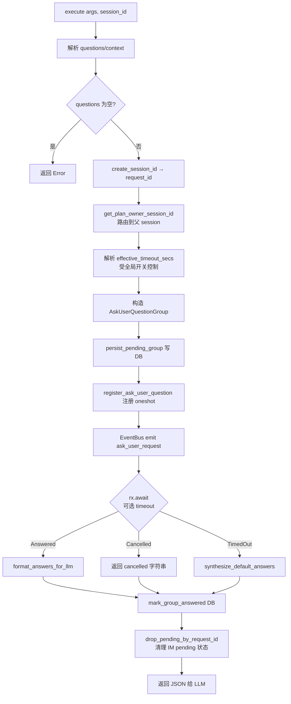

# Hope Agent Ask-User Question 架构文档

> 返回 [文档索引](../README.md)
>
> 更新时间：2026-05-20

## 目录

- [概述](#概述)
- [核心概念](#核心概念)
- [数据结构](#数据结构)
  - [AskUserQuestion / AskUserQuestionOption / AskUserQuestionGroup](#askuserquestion--askuserquestionoption--askuserquestiongroup)
  - [AskUserQuestionAnswer](#askuserquestionanswer)
- [后端架构](#后端架构)
  - [工具注册与描述](#工具注册与描述)
  - [tools/ask_user_question.rs 执行流程](#toolsask_user_questionrs-执行流程)
  - [Pending Registry（内存 oneshot 注册表）](#pending-registry内存-oneshot-注册表)
  - [SQLite 持久化（`ask_user_questions` 表）](#sqlite-持久化ask_user_questions-表)
  - [启动期清理与每日 purge](#启动期清理与每日-purge)
  - [EventBus 事件发射](#eventbus-事件发射)
  - [超时解析与 default_values 合成](#超时解析与-default_values-合成)
- [前端集成（桌面 GUI）](#前端集成桌面-gui)
  - [事件订阅与渲染入口](#事件订阅与渲染入口)
  - [AskUserQuestionBlock 组件](#askuserquestionblock-组件)
  - [倒计时与 low-time 告警](#倒计时与-low-time-告警)
  - [Preview 渲染（markdown / image / mermaid）](#preview-渲染markdown--image--mermaid)
  - [提交回传路径](#提交回传路径)
  - [会话切换时的 pending 恢复](#会话切换时的-pending-恢复)
- [IM 渠道集成](#im-渠道集成)
  - [button 渠道 vs text-fallback 渠道](#button-渠道-vs-text-fallback-渠道)
  - [Prompt 格式化与字节预算](#prompt-格式化与字节预算)
  - [InlineButton callback_data 协议](#inlinebutton-callback_data-协议)
  - [文本回复解析规则](#文本回复解析规则)
  - [统一 callback dispatcher](#统一-callback-dispatcher)
  - [各渠道插件接入点](#各渠道插件接入点)
- [命令 / 路由一览](#命令--路由一览)
- [配置项](#配置项)
- [安全与边界条件](#安全与边界条件)
- [文件清单](#文件清单)

---

## 概述

`ask_user_question` 是 Hope Agent 的**通用结构化问答工具**，允许模型在任意对话中（非仅 Plan Mode）向用户发起 1–4 个带选项的问题，用于澄清需求、对比方案或在关键决策前等待确认。

**核心能力**：

- 单次调用 1–4 个问题、每题 2–4 个选项
- 支持单选 / 多选 / 自由文本输入
- 每个选项可挂载 **markdown / image URL / mermaid** 三种 `previewKind` 的富预览，用于方案并排对比
- 每题独立 `timeout_secs` + `default_values`，超时自动回退到默认答案
- 每题 `header` chip 标签、`template`（scope / tech_choice / priority）分类图标
- `context` / `text` / `header` / `label` / `description` 支持 `string | { key, params, fallback }`，后端受控弹窗走 i18n key，旧字符串 payload 继续兼容
- pending 组持久化到 session SQLite `ask_user_questions` 表：tool oneshot 行用于识别重启僵尸，owner-plane 行可在重启后恢复答复与超时任务
- IM 渠道按 `ChannelCapabilities.supports_buttons` 分流：支持按钮的渠道（Telegram / Slack / Discord / Feishu / QQ Bot / LINE / Google Chat）发送原生 inline button，不支持的渠道（WeChat / Signal / iMessage / IRC / WhatsApp）降级为 `1a / 1b / done / cancel` 文本回复
- 与工具审批（approval）共用统一的 `try_dispatch_interactive_callback` dispatcher，避免每个渠道插件重复路由逻辑

**三种运行模式覆盖**：

| 运行模式 | 事件出口 | 答案回传 |
|---------|---------|---------|
| Tauri 桌面 | `transport.listen("ask_user_request")` | `invoke("respond_ask_user_question")` |
| HTTP/WS 守护进程 | WebSocket `ask_user_request` 帧 | `POST /api/ask_user/respond` |
| IM 渠道 | EventBus → `spawn_channel_ask_user_listener` → 渠道插件 | 按钮 callback 或文本 reply |

---

## 核心概念

- **Request**：一次 `ask_user_question` 工具调用生成一个 `request_id`（UUID），对应一个 `AskUserQuestionGroup`。
- **Group**：一组相关问题的集合，共享 `context`、`source`（`plan` / `normal` / skill id）、`timeout_at` 和持久化的有效 `timeout_secs`。
- **Question**：组内单个问题，拥有独立的 `question_id`、选项列表、`multi_select`、`timeout_secs`、`default_values`。
- **Option**：单个选项，可选 `description` / `recommended` / `preview` / `previewKind`。
- **Pending Oneshot**：`{ sender, session_id }` 注册在内存 `PENDING_ASK_USER_QUESTIONS` map 中，键为 `request_id`。session 维度用于 Stop / 删除会话时定向唤醒所有阻塞中的工具调用。
- **Persisted Group**：同一个 group 同步写入 SQLite `ask_user_questions` 表，status 为 `pending` / `answered`。内存 oneshot 与 DB 行双轨存在，是为了在 App 崩溃或重启后能识别「僵尸行」（有 DB 记录但无内存接收端）。

---

## 数据结构

### AskUserQuestion / AskUserQuestionOption / AskUserQuestionGroup

定义在 `crates/ha-core/src/ask_user/types.rs`（独立模块，不依赖 plan）。结构体名保留 `AskUserQuestion*` 前缀是为了与已序列化的历史 session 和长期存在的 `ask_user_request` 事件保持二进制兼容。

```rust
pub enum AskUserText {
    Plain(String),
    I18n(AskUserI18nText), // { key, params, fallback }
}

pub struct AskUserQuestionOption {
    pub value: String,          // 选项内部标识
    pub label: AskUserText,     // UI 显示文本（1-5 词）
    pub description: Option<AskUserText>,
    pub recommended: bool,      // 推荐项，UI 渲染 ★ 徽章
    pub preview: Option<String>,       // markdown / image URL / mermaid 源
    pub preview_kind: Option<String>,  // "markdown" | "image" | "mermaid"
}

pub struct AskUserQuestion {
    pub question_id: String,
    pub text: AskUserText,
    pub options: Vec<AskUserQuestionOption>,
    pub allow_custom: bool,     // 默认 true，当前运行时强制覆盖为 true
    pub multi_select: bool,     // 默认 false
    pub template: Option<String>,   // scope | tech_choice | priority
    pub header: Option<AskUserText>, // ≤12 char chip 标签
    pub timeout_secs: Option<u64>,  // 0 / None = 继承全局默认
    pub default_values: Vec<String>, // 超时回退答案
}
// 注：`allow_custom` 字段和 schema 继续保留，但 `tools/ask_user_question.rs` 解析参数时
// 会强制覆盖为 true——模型给的选项常常覆盖不到用户真实意图，强制留自由文本入口避免
// 被迫二选一。等模型提问质量稳定后可以摘掉这段覆盖恢复模型自主控制。

pub struct AskUserQuestionGroup {
    pub request_id: String,
    pub session_id: String,
    pub questions: Vec<AskUserQuestion>,
    pub context: Option<AskUserText>,
    pub source: Option<String>,     // "plan" | "normal" | skill id
    pub timeout_at: Option<u64>,    // unix 秒时间戳
    pub timeout_secs: Option<u64>,  // 有效 group wall-clock，供重启后准确发 timeout event
    pub server_now: Option<u64>,    // 响应生成时的服务端 unix 秒，用于前端消除客户端时钟偏移
}
```

所有结构体 `#[serde(rename_all = "camelCase")]`，前端 TypeScript 类型在 `src/components/chat/ask-user/AskUserQuestionBlock.tsx` 中镜像定义。`AskUserText` 是 `#[serde(untagged)]`，所以历史 DB 行和模型调用的纯字符串不需要迁移；桌面 / HTTP UI 遇到 `{ key, params, fallback }` 时用当前 locale 渲染，IM 渠道和 LLM result formatter 使用 `fallback_text()`。

### AskUserQuestionAnswer

```rust
pub struct AskUserQuestionAnswer {
    pub question_id: String,
    pub selected: Vec<String>,       // 选中的 option value（单选时长度 1）
    pub custom_input: Option<String>, // 自由文本
}
```

同一个 request 的答案是 `Vec<AskUserQuestionAnswer>`，一次性提交。

---

## 后端架构

### 工具注册与描述

**工具常量**：`crates/ha-core/src/tools/mod.rs`

```rust
pub const TOOL_ASK_USER_QUESTION: &str = "ask_user_question";
```

**Schema 定义**：`crates/ha-core/src/tools/definitions/plan_tools.rs` 中的 `get_ask_user_question_tool()`。关键声明：

| 字段 | 值 | 含义 |
|------|-----|------|
| `tier` | `ToolTier::Core { subclass: CoreSubclass::Interaction }` | Core 工具：`is_always_load()` 派生为 `true`（不支持 deferred），即使开启 `deferredTools.enabled` 也强制随 Core 描述注入 |
| `internal` | `true` | 系统工具，不可被 Agent `denied_tools` 关闭 |
| `concurrent_safe` | `true` | 允许并发调度 |

旧的 `deferred` / `always_load` 两个布尔字段已从 `ToolDefinition` 删除——三个旧 bool 现统一由 tier 派生（`is_always_load()` / `is_deferred_default()` 基于 `supports_deferred()`，定义在 `tools/definitions/types.rs`）。

工具在 `core_tools.rs` 通过 `tools.push(super::plan_tools::get_ask_user_question_tool())` 统一注入（schema 定义仍在 `plan_tools.rs` 因为工具在 Plan Mode 中也被使用，但工具本身不依赖 plan 模块）。dispatch 在 `tools/execution.rs`：

```rust
TOOL_ASK_USER_QUESTION => {
    Ok(ask_user_question::execute(args, ctx.session_id.as_deref()).await)
}
```

**系统提示词注入**（两层设计）：

1. **⑥ 工具描述层** —— `system_prompt/constants.rs` 的 `TOOL_DESC_ASK_USER_QUESTION` 在动态系统提示词拼装阶段挂载到 `ask_user_question` key。`ask_user_question` 是 Core Interaction 工具，随 Core 工具描述稳定注入，不受 `capabilities.tools.allow/deny` 影响。这一层只保留**工具调用规则**（参数语法、推荐项标注、Plan Mode 和 tool approval 两道禁令），指向下面的全局指引段而不重复展开 WHEN / WHEN NOT / HOW。
   - 1–4 个问题、每题 2–4 个选项
   - 推荐项首位并带 `(Recommended)` 标签
   - **禁止**用来询问 "is my plan ready?"（应使用 `submit_plan`）
   - **禁止**用来询问 "should I run this command?"（应使用工具审批机制）

2. **⑥c 全局 Human-in-the-loop 段** —— `system_prompt/constants.rs` 的 `HUMAN_IN_THE_LOOP_GUIDANCE` 常量，由 `system_prompt/build.rs` 在 Tool definitions 之后始终注入。`ask_user_question` 是 Core Interaction 工具，不受非 Core 工具开关影响。这一层是**全局思维框架**，提供 WHEN / WHEN NOT / HOW 三段触发规则：
   - **Ask the user when**：不可逆或高代价操作（删 >5 文件、DB 迁移、force push、依赖 major bump）、真实歧义、多路径相近、即将硬编码假设、≥2 次失败
   - **Do NOT ask when**：可通过 read/grep/ls 自查的、AGENTS.md / CLAUDE.md 已规定的、低成本可撤销操作（创建测试文件、加日志）、纯风格/命名/格式
   - **How to ask**（节流）：相关问题合并成一次调用（最多 4 题）、每任务 ≤2 次、优先前置（执行前）而非中途打断、若想问第二次先考虑能否自己查

**为什么硬编码而非走 agent.md 模板**：`HUMAN_IN_THE_LOOP_GUIDANCE` 以编译时常量形式嵌入二进制，由 `build.rs` 用 `sections.push(HUMAN_IN_THE_LOOP_GUIDANCE.to_string())` 注入，用户无法通过自定义 `~/.hope-agent/agents/{id}/agent.md` 覆盖。参考已有的 Sandbox Mode、Memory Guidelines 也是同样硬编码范式。这是和 Claude Code 的关键差异 —— Claude Code 在 system prompt 里只有 2 处嵌入式提及（"失败 ≥2 次后升级" + "工具被拒时澄清"），边界模糊靠模型自行理解；Hope Agent 用独立段落 + 触发器 + 反触发器 + 节流三件套，让模型在真正值得问的时候更有信心开口，同时避免滥用。详见 [prompt-system.md](prompt-system.md#human-in-the-loop人机协作硬约束)。

**并发安全标记**：`tools/definitions/registry.rs` 将 `TOOL_ASK_USER_QUESTION` 加入 `CONCURRENT_SAFE_TOOL_NAMES`。虽然工具本身会阻塞等待用户回答，但从 tool loop 的角度看它无写入副作用，允许与其他 read-only 工具并发调度。

### tools/ask_user_question.rs 执行流程

文件：`crates/ha-core/src/tools/ask_user_question.rs`



**关键实现点**（带行号参考）：

1. **`plan::get_plan_owner_session_id` 路由**（`ask_user_question.rs`）：Plan Mode 子 Agent 中触发的问题会透过该函数查到父 session id，事件最终发到主对话的 UI，而不是子 Agent 的孤岛 session。`source` 字段同步被设置为 `"plan"` 或 `"normal"`，UI 和 IM listener 可据此调整样式。注意：这是 ask_user 模块对 plan 模块的唯一依赖点（仅用于子 Agent 路由查询），其余逻辑完全独立。

2. **有效超时计算**（`ask_user_question.rs`）：

   ```rust
   let cfg = crate::config::cached_config();
   let effective_timeout_secs = if cfg.ask_user_question_timeout_enabled {
       let per_q_max = questions.iter().filter_map(|q| q.timeout_secs).max().unwrap_or(0);
       if per_q_max > 0 { per_q_max } else { cfg.ask_user_question_timeout_secs }
   } else {
       0
   };
   let timeout_at = if effective_timeout_secs > 0 {
       Some(now_secs + effective_timeout_secs)
   } else {
       None
   };
   ```

   全局 `ask_user_question_timeout_enabled=false` 时，所有 `timeout_secs` / `default_values` 都不触发自动超时；开启后，组级超时取**所有 per-question 超时的最大值**作为 wall-clock 门限，若未传则回退到全局默认。`timeout_at` 同时写入 DB，便于 UI 渲染倒计时和启动期扫描过期行。`0` 表示无限期等待。

3. **持久化先于发射**（`ask_user_question.rs`）：`persist_pending_group` 在 `bus.emit` 之前调用，确保即使 emit 失败或进程立即崩溃，DB 也留有 pending 痕迹供下次启动识别并清理。

4. **EventBus 序列化失败的回滚**（`ask_user_question.rs`）：若 `serde_json::to_value(&group)` 失败，会同步 `cancel_pending_ask_user_question` 撤销 oneshot 并 `mark_group_answered` 翻转 DB 行状态，避免留下永远没有接收端的 pending 记录。

5. **最终清理**（`ask_user_question.rs`）：无论 Answered / Cancelled / TimedOut，都会：
   - `ask_user::mark_group_answered(&request_id)` 把 DB 行翻到 `answered`
   - `channel::worker::ask_user::drop_pending_by_request_id(&request_id)` 清理 IM 端的 button/text pending map，防止僵尸条目累积

### Pending Registry（内存 oneshot 注册表）

文件：`crates/ha-core/src/ask_user/questions.rs`

```rust
static PENDING_ASK_USER_QUESTIONS: OnceLock<
    TokioMutex<HashMap<String, PendingAskUserQuestion>>,
> = OnceLock::new();
```

这个 map 是**内存唯一的有效接收端**。四条路径会操作它：

| 调用点 | 动作 |
|--------|------|
| `register_ask_user_question(request_id, session_id, sender)` | 工具执行期间插入 |
| `submit_ask_user_question_response(request_id, answers)` | Tauri/HTTP/IM channel 回传答案时移除并 `send` |
| `cancel_pending_ask_user_question(request_id)` | 工具取消时移除并收口终态（drop sender 触发 `rx.await` 返回 `Err`） |
| `cancel_pending_ask_user_questions_for_session(session_id, source)` | Stop / 删除会话时定向 drain，同步清 DB 行并广播终态 |
| `cancel_all_pending_ask_user_questions(source)` | 全局 Stop 时 drain 全部 live tool request |
| `is_ask_user_question_live(request_id)` | `find_live_pending_group_for_session` 用来过滤僵尸 DB 行 |

`find_live_pending_group_for_session` 会遍历 DB 列出的 pending group（按创建时间倒序），对每一行都做一次 `is_ask_user_question_live` 检查，只返回仍有内存接收端的 group。这解决了"DB 行存在但进程已重启"场景下 UI 调用 `respond_ask_user_question` 时报 "No pending ask_user_question request" 的问题。

### SQLite 持久化（`ask_user_questions` 表）

文件：`crates/ha-core/src/session/db.rs`

Schema（作为 session DB migration 创建）：

```sql
CREATE TABLE IF NOT EXISTS ask_user_questions (
    request_id TEXT PRIMARY KEY,
    session_id TEXT NOT NULL,
    payload TEXT NOT NULL,          -- AskUserQuestionGroup 的完整 JSON
    status TEXT NOT NULL DEFAULT 'pending',  -- pending | answered
    timeout_at INTEGER,              -- unix 秒
    created_at TEXT NOT NULL DEFAULT (datetime('now')),
    answered_at TEXT,
    FOREIGN KEY (session_id) REFERENCES sessions(id) ON DELETE CASCADE
);
CREATE INDEX IF NOT EXISTS idx_ask_user_session ON ask_user_questions(session_id);
CREATE INDEX IF NOT EXISTS idx_ask_user_status  ON ask_user_questions(status);
```

**CRUD 辅助方法**（都在 `SessionDB` impl 上）：

| 方法 | 用途 |
|------|------|
| `save_ask_user_group(&group)` | `INSERT OR REPLACE`，保留已有 `created_at` |
| `mark_ask_user_answered(request_id)` | 翻到 `answered` + 写 `answered_at` |
| `mark_ask_user_timed_out(request_id)` | 仅在仍 pending 且 deadline 已到时原子翻到 `answered`；返回是否赢得终态转换 |
| `expire_pending_ask_user_groups()` | 启动期把失去 oneshot 的 tool pending → answered；保留 durable owner pending |
| `purge_old_answered_ask_user_groups(retain_days)` | 删除 `answered_at < now - N days` 的行 |
| `list_pending_ask_user_groups_for_session(session_id)` | 返回 deadline 未到的 pending group（按 `created_at ASC`，LIMIT 50）；读路径不抢占 timer 的原子终态转换 |
| `list_pending_owner_ask_user_groups()` | 启动时读取带 deadline 的 durable owner group 并重建 timeout task |

`ON DELETE CASCADE` 确保 session 被删时相关 pending 记录自动清理。

### 启动期清理与每日 purge

文件：`crates/ha-core/src/app_init.rs` 的 `start_background_tasks()`。

**启动期（两步）**：

1. `purge_old_answered_ask_user_groups(7)` —— 删除 7 天前的已回答行
2. `expire_pending_ask_user_groups()` —— 把失去 oneshot 的 **tool-created** pending 行翻到 answered
3. `restore_owner_question_timeouts()` —— 保留 durable owner-plane 行，并按剩余 deadline 重建幂等 timeout task；已经到期的任务立即竞争原子终态转换

tool-created 行不能保留，因为内存 oneshot map 在进程启动时为空；owner-plane 行带 durable response handler，不依赖 oneshot，所以必须保留并恢复。每个 owner timeout task 由进程内 registry 按 `request_id` 去重，回答成功会 abort task；回答与 deadline 同时发生时只有 `mark_ask_user_timed_out` 的获胜者能发出 timeout 终态事件和 `ElicitationResult(timeout)` hook。数据库终态写失败时任务保持注册并以 1–30 秒指数退避持续重试，session delete/purge 可通过 AbortHandle 中断。owner 超时永不把 `default_values` 记成用户决策，避免把沉默提升为 consent。

**守护进程模式下的每日 purge**（`app_init.rs`）：

```rust
let mut ticker = tokio::time::interval(Duration::from_secs(86_400));
ticker.tick().await; // 跳过首次 tick，启动路径已经 purge 过
loop {
    ticker.tick().await;
    if let Some(db) = crate::get_session_db() {
        db.purge_old_answered_ask_user_groups(7);
    }
}
```

桌面 GUI 长驻时靠这个 24h 周期任务保证表不会无界增长；`hope-agent server` 当前**不**调用 `start_background_tasks`（见 [process-model.md §跨模式能力不对等](process-model.md)），所以 server 模式的 ask_user 清理依赖下次桌面启动。

### EventBus 事件发射

文件：`crates/ha-core/src/ask_user/questions.rs`

```rust
pub const EVENT_ASK_USER_REQUEST: &str = "ask_user_request";
pub const EVENT_ASK_USER_RESOLVED: &str = "ask_user:resolved";
```

`ask_user_question.rs` 在 emit 时发一个事件：

```rust
bus.emit(ask_user::EVENT_ASK_USER_REQUEST, event_data);
```

前端和 IM listener 统一订阅同一事件：

| 订阅方 | 订阅事件 |
|--------|---------|
| Desktop UI (`usePlanMode.ts`) | `ask_user_request` |
| HTTP/WS server | `ask_user_request` 转发为 WS 帧 |
| IM channel listener (`channel/worker/ask_user.rs`) | `ask_user_request` |

回答、超时、Stop 和会话删除都额外发射统一的 `ask_user:resolved` 终态事件。事件携带
`requestId`、`sessionId`、`status` 与 `source`；前端据此清理当前卡片并立即对账下一条
排队问题，IM listener 据此撤销残留的按钮 / 文本 pending。

### 超时解析与 default_values 合成

`ask_user_question.rs` 的超时处理有三个分支：

1. **`effective_timeout_secs == 0`**：直接 `rx.await` 永不超时，Cancelled 通过 `cancel_pending_ask_user_question` 触发 drop sender 来唤醒。
2. **`Ok(Ok(answers))`**：正常回答路径，走 `format_answers_for_llm`。
3. **`Err(_elapsed)`**：`tokio::time::timeout` 触发。此时调用 `cancel_pending_ask_user_question(&request_id)` 手动从 map 移除 sender，然后走 `synthesize_default_answers` 合成回退答案。

**`synthesize_default_answers` 规则**（`ask_user_question.rs`）：

```rust
for q in questions {
    if q.default_values.is_empty() { continue; }       // 该题没默认值 → 跳过
    for v in &q.default_values {
        if q.options.iter().any(|o| &o.value == v) {
            selected.push(v.clone());                  // 匹配已有选项
        } else {
            custom = Some(append(v));                  // 不匹配 → 作为自由文本
        }
    }
}
```

即允许 `default_values` 混合使用「已有选项 value」和「任意自由文本」两种形式，后者会被合并到 `custom_input` 字段（逗号分隔）。

**LLM 返回 JSON**（`ask_user_question.rs`）：

```jsonc
{
  "answers": [
    { "question": "哪个框架?", "selected": ["React"], "customInput": null }
  ],
  "timedOut": true,                                    // 仅超时路径有这两个字段
  "note": "Some or all questions timed out; default values were automatically applied."
}
```

该字符串会直接作为 tool_result 回注到 Tool Loop 下一轮。前端的 `AskUserQuestionResult`（`PlanResultBlocks.tsx`）解析同一份 JSON 渲染成可折叠的已回答摘要卡片。

---

## 前端集成（桌面 GUI）

### 事件订阅与渲染入口

订阅逻辑集中在 `src/components/chat/plan-mode/usePlanMode.ts`：

```ts
useEffect(() => {
  const handler = (raw: unknown) => {
    const group: AskUserQuestionGroup =
      typeof raw === "string" ? JSON.parse(raw) : (raw as AskUserQuestionGroup)
    if (group.sessionId !== currentSessionId) return
    setPendingQuestionGroup(group)
  }
  return getTransport().listen("ask_user_request", handler)
}, [currentSessionId])
```

handler 通过 `group.sessionId !== currentSessionId` 过滤当前会话，避免切换 session 时显示错位。

`setPendingQuestionGroup` 存储的组会被 `MessageList.tsx` 条件渲染：

```tsx
{pendingQuestionGroup && (
  <div className="flex justify-start">
    <div className="max-w-[85%] w-full">
      <AskUserQuestionBlock group={pendingQuestionGroup} onSubmitted={onQuestionSubmitted} />
    </div>
  </div>
)}
```

### AskUserQuestionBlock 组件

文件：`src/components/chat/ask-user/AskUserQuestionBlock.tsx`

核心 state 结构：

```ts
interface QuestionState {
  selected: Set<string>        // 选中的 option value
  customInput: string          // 自由文本输入
}
const [answers, setAnswers] = useState<Record<string, QuestionState>>(...)
const [focusedOption, setFocusedOption] = useState<Record<string, string>>({})
```

每个问题对应一个独立的 `QuestionState`，以 `question_id` 为 key。`focusedOption` 记录每题当前 hover / selected 的 option，用于右侧并排 preview pane 的联动。

**`toggleOption` 行为分单选/多选**（`AskUserQuestionBlock.tsx`）：

```ts
if (multiSelect) {
  if (newSelected.has(value)) newSelected.delete(value)
  else newSelected.add(value)
} else {
  newSelected.clear()
  newSelected.add(value)      // 单选：总是清空再加入
}
```

**UI 分类图标** 根据 `q.template` 字段切换：

| template | 图标 | 颜色 |
|----------|------|------|
| `scope` | `Target` | 紫色 |
| `tech_choice` | `Layers` | 绿色 |
| `priority` | `AlertTriangle` | 琥珀色 |
| 其他 / 无 | `HelpCircle` | 蓝色 |

**选项徽章**：
- `recommended: true` → `<Star>` + "Recommended" 徽章（琥珀色）
- `defaultValues` 包含该 option → `<Timer>` + "default" 徽章（灰色），表明若超时将自动选中

**自由文本输入**：`q.allow_custom` 为 `true`（默认）时渲染一个 `<Input>`，与按钮选项并列。用户既可以选按钮也可以输文本，两者会一并提交。当前运行时在 `tools/ask_user_question.rs` 解析入参时把 `allow_custom` 强制覆盖为 `true`，所以模型即便显式传 `false` 用户也依然能看到自由文本框——避免模型给的选项没覆盖用户真实意图时用户被迫二选一。字段和 schema 都保留着，待模型提问质量稳定后可摘除覆盖逻辑。

### 倒计时与 low-time 告警

`usePlanMode` 收到 group 时先用 `timeoutAt - serverNow` 计算剩余时长，再映射为客户端单调推进的
`localTimeoutAtMs`。这样用户系统时间快慢都不会让卡片提前过期或无限延后。`useCountdown` hook
（`AskUserQuestionBlock.tsx`）每秒 tick 一次：

```ts
const tick = () => {
  const secs = Math.max(0, Math.ceil((localTimeoutAtMs - Date.now()) / 1000))
  setRemaining(secs)
  if (secs <= 0 && timer !== undefined) { clearInterval(timer); timer = undefined }
}
```

UI 侧根据 `remaining` 切换三种状态：

| 状态 | 条件 | 样式 |
|------|------|------|
| 正常 | `remaining > 10` | 灰色 chip |
| 紧张 | `0 < remaining ≤ 10` | 琥珀色 + `animate-pulse` |
| 超时 | `remaining ≤ 0` | 红色 + 文本 "timed out" + 提交按钮 disabled |

`formatRemaining(secs)` 支持 `s / m s / h m` 三种格式化，1 小时以上用 `Xh Ym` 显示。

`timeoutAt == null`（无超时场景）时 hook 返回 `null`，UI 完全不渲染倒计时 chip。兼容旧后端时
若没有 `serverNow`，才回退到直接解释 unix deadline。

倒计时 chip 不是唯一安全边界。`usePlanMode` 还按 `pendingQuestionGroup.timeoutAt`
注册独立 deadline guard：到点后按 `requestId` 清卡片，即使 renderer 挂起导致 interval
延迟、`ask_user_timed_out` 在 WS 断线期丢失，也不会留下可提交的过期 UI。恢复查询使用
独立的 mutation epoch 与 successful-response sequence；timeout / submit / session 切换都会
令旧请求失效，终态 request id 还会进入有界 tombstone，禁止“事件先清空、旧 GET 后返回”把问题复活，同时较新的失败请求不会
吞掉较早的成功响应。WS 重连/lag、window focus、visibility 恢复会再次读取 durable
pending 状态，侧边栏的 `pendingInteractionCount` 同步走 300ms debounce reload。

### Preview 渲染（markdown / image / mermaid）

`OptionPreview` 组件（`AskUserQuestionBlock.tsx`）对三种 `previewKind` 做分流：

- **`image`** → ``，`max-h-64`、`object-contain`、`loading="lazy"`
- **`mermaid`** → 包装为 ```` ```mermaid\n...\n``` ```` 代码块再交给 Streamdown
- **`markdown`**（默认）→ 直接交给 Streamdown

```ts
const staticPlugins = { code, cjk }
<Streamdown plugins={staticPlugins}>{body}</Streamdown>
```

**关键约定**：这里**只使用 `code` + `cjk` 两个基础插件**，不走 `MarkdownRenderer` 的流式 / rAF 包装层。原因是 preview 是一次性渲染的静态内容，没有增量流式需求，省掉 rAF 调度能显著降低渲染开销。该行为与 `AGENTS.md` "Think / Tool 流式块展示约定" 相辅——前者是流式场景，这里是非流式的轻量渲染。

**并排对比布局**（`AskUserQuestionBlock.tsx`）：

```ts
const hasAnyPreview = useMemo(
  () => group.questions.some(q => q.options.some(o => !!o.preview)),
  [group.questions]
)
```

- 若整个 group 中**任一**选项挂了 preview，切换到两栏网格布局 (`md:grid-cols-2`)
- 左栏：选项列表 + custom input
- 右栏：`focusedOption` 对应 option 的 preview

用户 hover 任意选项时 `onMouseEnter` 同步更新 `focusedOption`，右栏内容随之切换，实现"方案并排对比"交互。

若某题的选项有 preview 但当前 focused option 没有，或者整个 group 都没 preview，则 preview 内联显示在该 option 的 description 下方。

### 提交回传路径

`handleSubmit`（`AskUserQuestionBlock.tsx`）构造 `AskUserQuestionAnswer[]` 后调用唯一的响应命令：

```ts
await getTransport().call("respond_ask_user_question", {
  requestId,
  answers: answerList,
})
```

Tauri 端注册为 `respond_ask_user_question`，HTTP 端对应 `POST /api/ask_user/respond`，两者都委托到 `ask_user::submit_ask_user_question_response`。

提交成功后 `setSubmitted(true)` 使组件立刻隐藏（`if (submitted) return null`），父组件通过 `onSubmitted` 回调把 `pendingQuestionGroup` 清空。

### 会话切换时的 pending 恢复

Tauri 命令 `get_pending_ask_user_group(session_id)`（`src-tauri/src/commands/plan.rs`）调用 `ask_user::find_live_pending_group_for_session(&session_id)`，返回最近一条仍有内存接收端的 pending group。前端在切换会话时 invoke 该命令以恢复待回答问题的 UI。实现内部通过 `crate::get_session_db()` 拿 DB 句柄，调用方不需要传 `&SessionDB`。

对应的 HTTP API 是 `GET /api/plan/{session_id}/pending-ask-user`（`ha-server/src/routes/plan.rs`）。两者共享同一个 core 实现。

Server 模式下多客户端连接同一 session 时，已经"live"（内存有 oneshot）的 pending group 就是**跨客户端唯一**的。任一客户端提交、超时、Stop 或删除会话后，所有客户端都会收到统一 `ask_user:resolved`；当前卡片清除后立即查询下一条 live pending group，因此并发产生的多组问题不会因覆盖式 UI 状态永久隐藏。

---

## IM 渠道集成

整个 IM 路径集中在 `crates/ha-core/src/channel/worker/ask_user.rs`，镜像 `approval.rs` 的模式，二者共享统一的 dispatcher。

### button 渠道 vs text-fallback 渠道

按 `ChannelCapabilities.supports_buttons` 分两类：

| 渠道 | supports_buttons | 呈现方式 |
|------|------------------|----------|
| Telegram | ✅ | inline button |
| Discord | ✅ | inline button (component) |
| Slack | ✅ | inline button (Block Kit) |
| Feishu | ✅ | inline button |
| QQ Bot | ✅ | inline button |
| LINE | ✅ | inline button |
| Google Chat | ✅ | inline button |
| WeChat | ❌ | text fallback (`1a` / `done`) |
| Signal | ❌ | text fallback |
| iMessage | ❌ | text fallback |
| IRC | ❌ | text fallback |
| WhatsApp | ❌ | text fallback |

分流决策在 `spawn_channel_ask_user_listener`（`ask_user.rs`）内：

```rust
let supports_buttons = registry
    .get_plugin(&channel_id)
    .map(|p| p.capabilities().supports_buttons)
    .unwrap_or(false);

let payload = if supports_buttons {
    // 注册到 BUTTON_PENDING，发 ReplyPayload { text, buttons }
} else {
    // 注册到 TEXT_PENDING，发纯 text + hint
};
```

### Prompt 格式化与字节预算

`format_prompt(&group)`（`ask_user.rs`）把 group 序列化成 IM 文本块：

```
❓ Question from AI

{context, truncated to 500 bytes}

1. {question text}  (multi-select)
  1a. {label} ★
     {description}
  1b. {label}
     ...
2. {question text}
  2a. ...
```

每个字段单独按字节截断：

| 字段 | 截断长度 |
|------|---------|
| `context` | 500 bytes |
| `question.text` | 500 bytes |
| `option.label` | 100 bytes |
| `option.description` | 200 bytes |
| 整个 prompt | 3500 bytes |

整体 3500 字节是为了**满足所有 IM 平台中最严格的 payload 上限**：Discord 2000 / Telegram 4096 / Slack 3000 / LINE 5000。注意这里一律走 `crate::truncate_utf8` 而**不是字节切片**，避免截断 UTF-8 多字节字符（这是 `AGENTS.md` 明确规定的安全线）。

**Marker 规则**：`option_marker(qi, oi)` 生成 `1a` / `2b` / `10c` 之类的编号，`qi` 十进制、`oi` 单字母（`a..z`）。text-fallback 的回复与 button 的 `callback_data` 共享这套记号。

`option.recommended` 会在 label 前加 `★` 前缀（同时 button 的 text 也带 `★`）。

### InlineButton callback_data 协议

`build_buttons(&group)`（`ask_user.rs`）生成 2D 按钮数组：

```
ask_user:{request_id}:select:{question_id}:{option_value}   // 普通选项
ask_user:{request_id}:done:{question_id}                    // multi-select 完成
ask_user:{request_id}:cancel                                // 整体取消
```

**Row 布局**：

1. 每题选项按顺序填，满 **3 个**强制换行（Telegram 友好的短行布局）
2. 剩余未满 3 的选项独占一行
3. 若该题 `multi_select`，额外追加一行 `✅ Done with Q{N}` 按钮
4. 所有问题都填完后，追加一行 `❌ Cancel`

`ASK_USER_PREFIX = "ask_user:"` 是该协议的命名空间，`approval:` 是 approval 流的命名空间，二者通过前缀严格区分。

### 文本回复解析规则

`try_handle_ask_user_reply(msg)`（`ask_user.rs`）作为 dispatcher 前置钩子，在消息被当作普通用户输入之前尝试消费：

**接收键**：`(account_id, chat_id)` → `Vec<PendingAskUser>`，LIFO 处理（后入先出，总是对最新一组问题作答）。

**解析顺序**：

1. **`cancel`**（忽略大小写）：弹出最新 pending，调用 `cancel_pending_ask_user_question` 撤销 oneshot
2. **逗号/空白分隔的 marker**（如 `1a`、`1a,1c`、`1a 1b`）：逐个解析 `parse_marker(tok) → (qi, oi)`，写入对应题的 `progress.selected`
   - 多选：追加（去重）
   - 单选：覆盖（一直保留最后一个）
3. **`done`**（忽略大小写）：触发完成检查
4. **都没解析到 → 自由文本兜底**：找到第一个"没选项也没 custom"的问题，若它的 `allow_custom == true` 就把整段文本写到 `custom_input`（目前运行时把 `allow_custom` 强制覆盖为 `true`，实际该分支总会命中）

**完成条件**：
- `should_finish = (text == "done") || !group.has_any_multi_select`
- `is_complete()`：每题至少有一个 `selected` 或 `custom_input`

完成后从 `TEXT_PENDING` 弹出该组，`into_answers()` 转 `Vec<AskUserQuestionAnswer>`，调用 `ask_user::submit_ask_user_question_response(request_id, answers)` 回传。

**`parse_marker` 细节**（`ask_user.rs`）：

```rust
// "1a" → Some((0, 0))；"10c" → Some((9, 2))
let letter = tok.chars().last().filter(|c| c.is_ascii_alphabetic())?;
let oi = (letter as u8 - b'a') as usize;
let qi: usize = tok[..tok.len() - 1].parse().ok()?;
if qi == 0 { return None; }  // 用户视角 1-based
Some((qi - 1, oi))
```

### 统一 callback dispatcher

文件：`channel/worker/ask_user.rs`

```rust
pub fn try_dispatch_interactive_callback(
    data: &str,
    source: &'static str,
    callback_source: Option<InteractiveCallbackSource>,
) -> bool {
    if super::approval::is_approval_callback(data) {
        super::approval::spawn_callback_handler_with_source(data, source, callback_source);
        return true;
    }
    if is_ask_user_callback(data) {
        spawn_callback_handler_with_source(data, source, callback_source);
        return true;
    }
    false
}
```

这个 helper 是两类交互（**工具审批** + **用户问答**）在按钮渠道插件中的**唯一接入点**。各渠道插件只需在收到 inline button callback 时调用该函数并用返回值决定是否消费掉事件，无须分别判断前缀、spawn handler、写日志——统一由 helper 完成。

### 各渠道插件接入点

不同插件在不同位置调用 helper 或单独的 ask_user 函数：

| 渠道 | 调用点 | 调用函数 |
|------|--------|---------|
| Telegram | `telegram/polling.rs` | `is_ask_user_callback` + `handle_ask_user_callback_query` 包一层 answerCallbackQuery |
| Discord | `discord/gateway.rs` | `is_ask_user_callback` + `spawn_callback_handler` |
| Slack | `slack/socket.rs` | `try_dispatch_interactive_callback` |
| QQ Bot | `qqbot/gateway.rs` | `try_dispatch_interactive_callback` |
| Feishu | `feishu/ws_event.rs` | `try_dispatch_interactive_callback` |
| LINE | `line/webhook.rs` | `try_dispatch_interactive_callback` |
| Google Chat | `googlechat/webhook.rs` | `try_dispatch_interactive_callback` |

文本 fallback 的入口是 `channel/worker/dispatcher.rs`：

```rust
// 0b. Check if this message is a text-reply to a pending ask_user_question
if super::ask_user::try_handle_ask_user_reply(&msg).await {
    return;   // 消费掉，不再作为普通消息进入 Chat Engine
}
```

整个 worker dispatcher 的消息路由顺序是：approval 回复 → ask_user 回复 → 斜杠命令 → Chat Engine 对话。任一前置步骤消费掉消息后就 `return`，不会重复投递。

**启动时机**：`app_init.rs` 在 channel dispatcher 启动后紧接着 `spawn_channel_ask_user_listener(channel_db.clone(), registry.clone())`，保证 EventBus 广播不会丢。listener 自身做 `broadcast::RecvError::Lagged(n)` 告警但不退出，`Closed` 时才 break。

---

## 命令 / 路由一览

**Tauri 命令**（`src-tauri/src/commands/plan.rs`）：

| 命令 | 参数 | 返回 | 说明 |
|------|-----|------|------|
| `respond_ask_user_question` | `request_id`, `answers` | `()` | 提交 Q&A 回答 |
| `get_pending_ask_user_group` | `session_id` | `Option<AskUserQuestionGroup>` | 切换会话时恢复 pending |

委托到 `ask_user::submit_ask_user_question_response`。注册在 `src-tauri/src/lib.rs` 的 `invoke_handler!` 宏。

**HTTP 路由**（`crates/ha-server/src/routes/plan.rs`）：

| 方法 | 路径 | Handler | 说明 |
|------|------|---------|------|
| `POST` | `/api/ask_user/respond` | `respond_ask_user_question` | 提交 Q&A 回答 |
| `GET` | `/api/plan/{session_id}/pending-ask-user` | `get_pending_ask_user_group` | 查询恢复 |

注册在 `crates/ha-server/src/lib.rs`。

**前端 Transport 映射**（`src/lib/transport-http.ts`）：

```ts
respond_ask_user_question:       { method: "POST",   path: "/api/ask_user/respond" },
get_pending_ask_user_group:      { method: "GET",    path: "/api/plan/{sessionId}/pending-ask-user" },
```

**EventBus 事件**（`ask_user/questions.rs`）：

| 事件名 | 方向 | 订阅方 |
|--------|-----|--------|
| `ask_user_request` | core → 所有 | Desktop UI / WS forwarder / IM listener |
| `ask_user_timed_out` | core → 所有 | 清 active card、桌面通知、IM timeout notice |
| `ask_user:resolved` | core → 所有 | 所有终态统一清卡、恢复下一条 queued group、清 IM pending |

HTTP EventBus 广播不做 replay。`HttpTransport` 因此会在 WS 首次连接、重连和 `_lagged` 时发出本地 `transport:event-stream-resync-required`；聊天区重新读取 `get_pending_ask_user_group`，侧边栏重新读取 session 列表。桌面窗口重新获得焦点或从 hidden 回到 visible 时走同一对账路径。

---

## 配置项

**全局默认超时**（`crates/ha-core/src/config/mod.rs`）：

```rust
/// Whether ask_user_question waits automatically expire.
#[serde(default)]
pub ask_user_question_timeout_enabled: bool,
/// Timeout in seconds for ask_user_question when auto-expiry is enabled.
/// Default duration: 0 (no timeout; wait forever).
#[serde(default = "default_ask_user_question_timeout")]
pub ask_user_question_timeout_secs: u64,
```

- 默认：**关闭自动超时**，即永远等待（依赖 cancel 或手动答复）
- 配置默认时长：**0（永不超时）**；设置页主动开启超时开关时会建议 **1800 秒（30 分钟）**
- 时长 `0` 表示无限等待
- 配置读写命令：
  - Tauri：`get_ask_user_question_timeout_enabled` / `set_ask_user_question_timeout_enabled` + `get_ask_user_question_timeout` / `set_ask_user_question_timeout`
  - HTTP：`GET/POST /api/config/ask-user-question-timeout-enabled` + `GET/POST /api/config/ask-user-question-timeout`

**优先级**（在 `ask_user_question.rs`）：

```
ask_user_question_timeout_enabled
  ? (max(所有 per-question timeout_secs) > 0 ? 用该值 : 全局 ask_user_question_timeout_secs)
  : 0
```

关闭全局开关时，模型传入的 `timeout_secs` 也会被忽略。开启后，**有任何一题指定了非零超时**，就以这组问题中最大的超时作为 group wall-clock；反之全部回退到全局默认。

**与 approval_timeout 的关系**：两者独立，互不影响。`permission.approval_timeout_enabled` / `approval_timeout_secs` 控制工具审批等待，`ask_user_question_timeout_enabled` / `ask_user_question_timeout_secs` 控制 `ask_user_question` 等待。两者默认都关闭自动超时。

**数据保留**：SQLite `ask_user_questions` 表的 answered 行自动保留 **7 天**（`app_init.rs` 的 `purge_old_answered_ask_user_groups(7)`），目前不可配置。

---

## 安全与边界条件

1. **工具结果注入攻击**：返回给 LLM 的 JSON 由 `format_answers_for_llm` 严格构造，选项 label 和 custom input 都通过 `serde_json` 正确转义，不会被用户伪造的 `"`、`}` 破坏结构。自由文本由用户输入，模型应当把它视为不受信内容；这点通过系统提示词对 `ask_user_question` 的定位（"用户答复是输入数据"）自然保证。

2. **僵尸行识别**：内存 oneshot map 与 DB 行的双轨设计——tool 答复通过 `is_ask_user_question_live` 在 `find_live_pending_group_for_session` 中过滤后只返回 live 行。进程重启后 `expire_pending_ask_user_groups` 只把失去 oneshot 的 tool pending 翻成 answered；带 durable response handler 的 owner pending 保留并重建 timeout task。

3. **会话级隔离**：`handler` 在前端检查 `group.sessionId !== currentSessionId`，IM listener 通过 `channel_db.get_conversation_by_session(group.session_id)` 精确路由到原发渠道。不存在 session 或非 IM session 的场景会静默跳过（`Ok(None) => continue`）。

4. **UTF-8 安全截断**：所有 prompt 字段都走 `crate::truncate_utf8`，禁止字节索引切片。这是 `AGENTS.md` 的硬性规定。

5. **子 Agent 路由**：Plan Mode 的子 Agent 会触发 `ask_user_question` 时，`get_plan_owner_session_id` 把事件和 DB 行都记在**父 session** 上，否则事件发到子 session 的孤岛 UI 中会完全丢失。

6. **Cancel / Stop 的语义**：单 request cancel 与 session/global drain 都会先从内存 map 移除 sender，使阻塞的 `rx.await` 立刻返回；随后 best-effort 把 DB 行翻到 answered、清 IM pending 并发 `ask_user:resolved`。tool execution 的最终清理仍保留为幂等兜底。Stop、会话删除和 purge 因而不会遗留永不结束的工具调用。

7. **tool loop 并发语义**：虽然 `ask_user_question` 挂在 `CONCURRENT_SAFE_TOOL_NAMES` 里，但一次 `execute()` 调用会阻塞整个 tool call 直到用户答复或超时。若模型在同一轮里发起多个 `ask_user_question`，它们会**并发触发**多个独立 event，UI 会一个接一个渲染为 `pendingQuestionGroup`——取决于前端当前是否允许同时显示多组。当前实现只保留最新一组（`setPendingQuestionGroup` 覆盖式写入），其他组的 oneshot 仍会在用户提交最新组后继续等待，直到各自 timeout。**推荐模型一次只发一组 ask_user_question**，这点在系统提示词中有明示。

8. **按钮 callback 字符串长度**：`callback_data` 在 Telegram 限制 64 字节，在 Discord 限制 100 字节。`ask_user:{uuid}:select:{qid}:{value}` 在 `request_id`（36 字节 UUID）+ 固定前缀约 10 + `question_id` 和 `option_value` 合计 ~18 字节时总长 ~64 字节，是一个硬上限。若 LLM 生成了过长的 `question_id` 或 `value`，Telegram 会拒收按钮。目前没有前置长度校验，依赖模型自律（schema description 已提示 "Option identifier"）。

9. **终态事件丢失与竞态**：HTTP WS 是 at-most-once，不能把单次 event 当成最终真相。active card 使用服务端相对时长换算出的本地 deadline 清理，重连 / lag / focus 触发 REST 对账；对账响应受 generation guard 与有界终态 tombstone 约束。后端 owner answer/evidence/terminal status 在同一 SQLite transaction 中提交，且 timeout=0 也使用 per-request terminal gate；回答和超时只能有一个终态获胜者，失败方不得重复发事件或写 evidence。session Stop/delete/purge 同时 abort owner timer、drain tool oneshot 并清理 IM button/text pending，避免阻塞调用、长 deadline task 和失效 callback 残留。

---

## 文件清单

**后端核心**：

- `crates/ha-core/src/ask_user/mod.rs` — 独立模块入口、re-export
- `crates/ha-core/src/ask_user/types.rs` — `AskUserQuestion*` 数据结构
- `crates/ha-core/src/ask_user/questions.rs` — 内存 pending registry、持久化 helper、事件常量
- `crates/ha-core/src/tools/ask_user_question.rs` — 工具执行入口、超时处理、结果格式化
- `crates/ha-core/src/tools/definitions/plan_tools.rs` — 工具 schema 定义
- `crates/ha-core/src/tools/execution.rs` — dispatch 分派
- `crates/ha-core/src/tools/definitions/registry.rs` — 并发安全标记
- `crates/ha-core/src/session/db.rs` — `ask_user_questions` 表 CRUD
- `crates/ha-core/src/app_init.rs` — listener 启动 + 启动清理 + 每日 purge
- `crates/ha-core/src/system_prompt/constants.rs` — 系统提示词描述
- `crates/ha-core/src/config/mod.rs` — `ask_user_question_timeout_secs` 配置项

**IM 渠道**：

- `crates/ha-core/src/channel/worker/ask_user.rs` — IM listener、button / text fallback、统一 dispatcher
- `crates/ha-core/src/channel/worker/dispatcher.rs` — 消息路由前置钩子
- `crates/ha-core/src/channel/worker/mod.rs` — 模块声明
- `crates/ha-core/src/channel/telegram/polling.rs` — Telegram callback 接入
- `crates/ha-core/src/channel/discord/gateway.rs` — Discord callback 接入
- `crates/ha-core/src/channel/slack/socket.rs` — Slack callback 接入
- `crates/ha-core/src/channel/qqbot/gateway.rs` — QQ Bot callback 接入
- `crates/ha-core/src/channel/feishu/ws_event.rs` / `line/webhook.rs` / `googlechat/webhook.rs` — 其他渠道接入

**命令层（Tauri）**：

- `src-tauri/src/commands/plan.rs` — `respond_ask_user_question` / `get_pending_ask_user_group`
- `src-tauri/src/lib.rs` — invoke_handler 注册
- `src-tauri/src/commands/config.rs` — 全局超时读写

**HTTP 路由（ha-server）**：

- `crates/ha-server/src/routes/plan.rs` — Q&A 响应 + 获取 pending
- `crates/ha-server/src/routes/config.rs` — 全局超时读写
- `crates/ha-server/src/lib.rs` — Router 注册

**前端**：

- `src/components/chat/ask-user/AskUserQuestionBlock.tsx` — 主组件（含 preview 与倒计时）
- `src/components/chat/plan-mode/usePlanMode.ts` — 事件订阅
- `src/components/chat/MessageList.tsx` — 条件渲染
- `src/components/chat/message/PlanResultBlocks.tsx` — 已回答摘要卡片
- `src/lib/transport-http.ts` — HTTP API 映射

**国际化**：

- `src/i18n/locales/zh.json` / `en.json` — `ask_user.*` 命名空间
