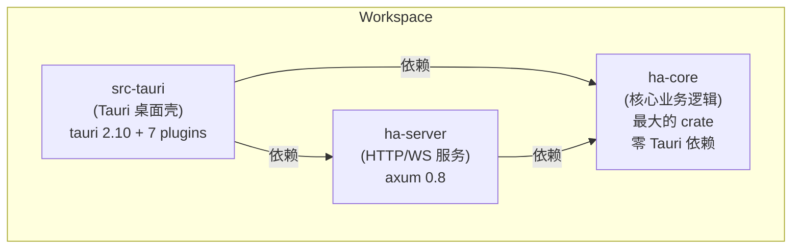
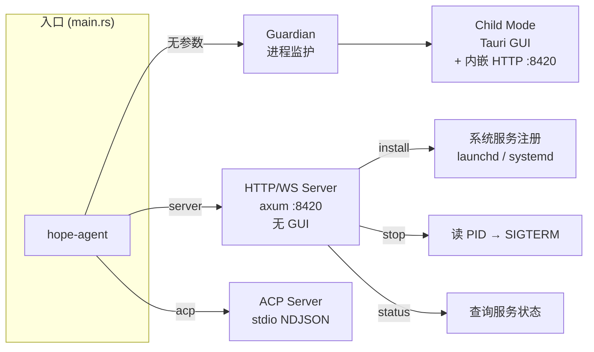
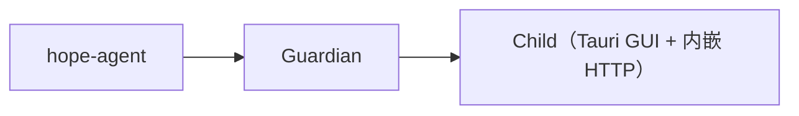
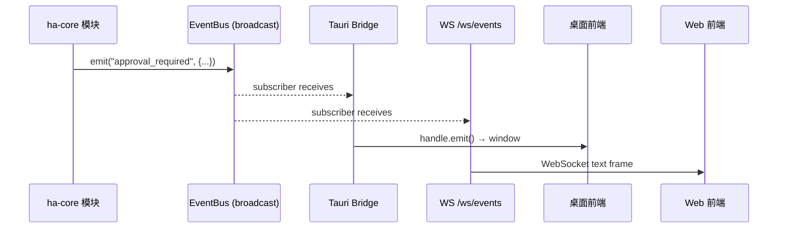
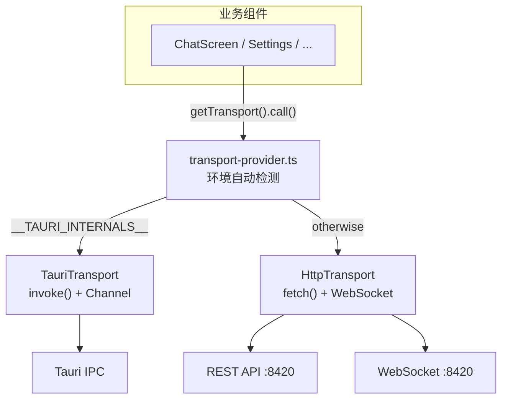
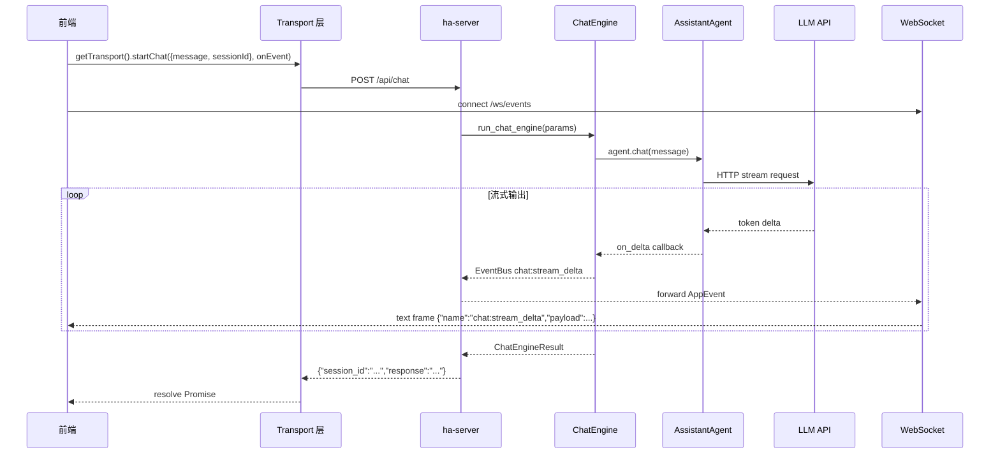

# 前后端分离架构

> 返回 [文档索引](../README.md) | 关联源码：`Cargo.toml`, `crates/ha-core/`, `crates/ha-server/`, `src-tauri/`

## 设计目标

将 Hope Agent 从 Tauri 单体应用重构为三层架构（核心库 / HTTP 服务 / 桌面壳），实现：

1. **核心逻辑框架无关** — `ha-core` 零 Tauri 依赖，可被任何 Rust 程序引用
2. **多入口运行** — 桌面 GUI、HTTP 守护进程、CLI stdio 三种模式共享同一核心
3. **前端双模式** — 同一 React 前端可在 Tauri WebView 和独立浏览器中运行

## Crate 依赖关系



**铁律**：`ha-core` 的 `Cargo.toml` 禁止出现 `tauri` 或 Tauri 插件依赖。

## 各 Crate 职责

### ha-core（核心库）

| 职责 | 说明 |
|------|------|
| 业务逻辑 | Agent、Chat Engine、Tool Loop、Plan Mode、Memory、Subagent、MCP、Project、Local LLM 等全部核心能力 |
| 数据存储 | SessionDB、MemoryDB、LogDB、CronDB、ChannelDB、ProjectDB、AsyncJobDB、LocalModelJobDB、RecapDB — 全部 SQLite |
| 状态管理 | `AppState` + `OnceLock` 全局单例 + accessor 函数 |
| 事件系统 | `EventBus` trait — 替代原 Tauri `APP_HANDLE.emit()` |
| 接入层 | 12 个 IM 渠道插件、ACP stdio 协议、MCP 客户端（4 种 transport） |
| 基础设施 | Guardian 保活、Service Install、Crash Journal、Self-Diagnosis、runtime_lock Primary 选举 |

**主要模块**（下面是导航用的概览，完整清单以 `ls crates/ha-core/src/` 为准）：

```
agent/             AssistantAgent + 4 种 Provider + Side Query
chat_engine/       ChatEngineParams → EventSink 流式输出
memory/            SQLite + FTS5 + vec0 向量 + 多种 Embedding（含 dreaming）
tools/             内置工具集 + 并发/串行执行引擎（具体工具数量以 tools/ 子模块为准）
channel/           12 个 IM 插件（telegram / wechat / slack / feishu / discord / qqbot /
                   irc / signal / imessage / whatsapp / googlechat / line）+ Worker 分发 + 媒体管道
plan/              5 态状态机（plan 设计契约 + task 进度真相）+ 步骤追踪
subagent/          spawn + inject + Mailbox + 深度控制
skills/            SKILL.md 发现 + 懒加载 + Fork 模式 + draft 审核
provider/          多模板 + Failover Chain + Proxy + crud helper
                   （所有 provider/active_model 写入必须走 provider/crud.rs，详见下文）
context_compact/   5 层渐进式压缩 + API-Round 分组
session/           会话 + 消息持久化 + FTS5 搜索
project/           Project 容器（工作目录即真实文件，无独立 project_files；无反向 channel 认领）
mcp/               MCP 客户端（stdio / Streamable HTTP / SSE / WebSocket）
cron/              定时任务 + Agent 执行
acp/               stdio JSON-RPC 服务器
acp_control/       ACP 控制面 + Runtime 发现
local_llm/         Ollama 集成 + 模型目录 + 硬件预算
local_model_jobs/  本地模型后台任务（安装 / pull / 加载）
async_jobs/        异步工具后台执行 + 重启回放
team/              Agent Team 模板 + 实例 + 任务
recap/             /recap 深度复盘 + 11 个并行 AI 章节
dashboard/         Insights + Learning Tracker
awareness/         跨会话行为感知 suffix
config/            cached_config / mutate_config（详见下文）
event_bus.rs       EventBus trait + BroadcastEventBus
globals.rs         OnceLock 全局 + AppState
guardian.rs        进程监护 + 指数退避 + 自修复
runtime_lock.rs    OS 级 advisory lock + Primary / Secondary 选举
service_install.rs macOS launchd / Linux systemd / Windows Task Scheduler 注册
paths.rs           ~/.hope-agent/ 统一路径
logging/           非阻塞双写 + 脱敏
platform/          跨平台原语门面（unix.rs / windows.rs）
...
```

### ha-server（HTTP/WS 服务）

| 职责 | 说明 |
|------|------|
| REST API | 数百个端点，覆盖会话、Provider、记忆、配置等全部功能域；完整清单与对应的 Tauri 命令对照见 [api-reference.md](api-reference.md) |
| WebSocket | `/ws/events`（全局事件广播，含聊天流 `chat:stream_delta`、`channel:stream_delta` 等） |
| 路由框架 | axum 0.8 + tower-http CORS |
| API Key 鉴权 | `middleware.rs` — `Authorization: Bearer` 头 + `?token=` 查询参数，`/api/health` 与 `/api/server/status` 免鉴权 |
| 内嵌 Web GUI | `web_assets.rs` 用 `rust-embed` 把 Vite `dist/` 打进二进制；axum `fallback_service` 直返；`HA_WEB_ROOT` 可指向本地 `dist/` 做 dev override |
| 错误处理 | axum 风格 `Result<Json<T>, (StatusCode, String)>`，显式 status code，不做字符串匹配 |

**共享上下文 `AppContext`**：axum 把它注入每个路由处理函数，里面打包了一个请求可能用到的句柄——各数据库句柄、`EventBus`、终端管理器、按会话隔离的取消标志（`chat_cancels`，key 是 session_id），以及无鉴权模式下为 `None` 的 API Key。它是 HTTP 侧对应桌面 `AppState` 的角色，两者持有的都是 `Arc` 克隆、最终指向同一批 ha-core 全局单例（见下文「全局状态管理」）。具体字段以 [`ha-server/src/lib.rs`](../../crates/ha-server/src/lib.rs) 为准。

### src-tauri（桌面壳）

| 职责 | 说明 |
|------|------|
| Tauri IPC | 与 HTTP 端点一一对应的 `#[tauri::command]` 处理函数；完整清单与 HTTP 对照见 [api-reference.md](api-reference.md) |
| 桌面集成 | 系统托盘、全局快捷键、窗口管理、macOS 菜单 |
| 薄封装 | `tauri_wrappers.rs` 为 ha-core 无 `#[tauri::command]` 的函数添加属性 |
| 内嵌服务 | `setup.rs` 中 spawn ha-server，配置从 `config.json` 的 `server` 字段读取 |
| 入口管理 | Guardian / Child / Server / ACP 四种模式 |
| 错误边界 | 命令统一返回 `Result<T, CmdError>`（[`commands/error.rs`](../../src-tauri/src/commands/error.rs)，详见下文 §错误处理） |

**关键文件**（壳层很薄，主要就是入口分发和命令注册）：

```
src-tauri/src/
  lib.rs              pub use ha_core::*; + Tauri Builder + invoke_handler! 注册
  main.rs             入口分发（server / acp / guardian / child）
  globals.rs          APP_HANDLE（仅 Tauri 专用）
  app_init.rs         薄封装 → ha_core::init_app_state()
  setup.rs            app_setup()：内嵌 HTTP 服务 + 快捷键 + 托盘
  tauri_wrappers.rs   薄 #[tauri::command] 封装（为 ha-core fn 加属性）
  shortcuts.rs        全局快捷键处理
  tray.rs             系统托盘菜单
  commands/           Tauri IPC 命令实现，按功能域拆成 chat / session / config /
                      provider / project / mcp / cron 等文件；error.rs 里的 CmdError
                      是统一错误类型（详见下文「错误处理 Contract」）
```

---

## 运行模式



### 1. 桌面模式（默认）



- Guardian 监护子进程，崩溃自动重启（指数退避 1s→30s，最多 8 次）
- 第 5 次崩溃触发 backup + self-diagnosis + auto-fix
- 子进程启动 Tauri GUI，`setup.rs` 中同时 spawn ha-server
- 前端通过 Tauri IPC 调用后端（也可通过内嵌 HTTP 服务）
- 内嵌服务器配置从 `config.json` 的 `server` 字段读取（`EmbeddedServerConfig`）：
  - `bindAddr`：监听地址（默认 `127.0.0.1:8420`，设为 `0.0.0.0:8420` 可对外暴露）
  - `apiKey`：API Key 鉴权（`null` = 无鉴权）
- 修改后需重启应用生效

### 2. 服务器模式

```
hope-agent server [--bind 0.0.0.0:8420] [--api-key KEY]
```

- 无 GUI，纯 HTTP/WS 守护进程
- CLI `--api-key` 参数优先于 config.json 配置
- 初始化 ha-core 全部子系统（DB、IM 渠道、ACP、Cron）
- 写 PID 文件到 `~/.hope-agent/server.pid`
- 支持系统服务注册：

| 命令 | 说明 |
|------|------|
| `server install` | 注册系统服务（macOS launchd / Linux systemd） |
| `server uninstall` | 卸载系统服务 |
| `server status` | 查询运行状态 |
| `server stop` | 发送 SIGTERM 停止 |

### 3. ACP 模式

```
hope-agent acp [--agent-id ha-main] [--verbose]
```

- stdio NDJSON JSON-RPC 协议
- 用于 IDE 直连（Zed、VS Code 等）

---

## 事件系统



### EventBus 架构

| 层 | 组件 | 说明 |
|----|------|------|
| 定义 | `ha-core::event_bus::EventBus` trait | `emit()` + `subscribe()` |
| 实现 | `BroadcastEventBus` | `tokio::sync::broadcast` channel |
| 桥接（Tauri） | `setup.rs` → EventBus subscriber → `handle.emit()` | 转发到 Tauri WebView |
| 桥接（HTTP） | `ws/events.rs` → EventBus subscriber → WS frame | 转发到 WebSocket 客户端 |
| 桥接（IM） | `ChannelStreamSink` → EventBus + mpsc | 转发到 IM 渠道 |

### 事件都有哪些

事件按用途大致分成这么几类，每类举几个代表，帮你建立"系统会往前端推什么"的整体印象：

- **聊天 / 流式**：对话的核心通道。`chat:stream_delta` 逐 token 推送主对话内容，`chat:stream_end` 收尾；IM 渠道有一套平行的 `channel:stream_*`。
- **工具 / 审批 / 交互**：模型执行需要人介入时发出。`approval_required` 请求用户批准某次工具调用，`ask_user_request` 发起结构化问答，`session_pending_interactions_changed` 让前端知道有多少待响应项。
- **Subagent / Team / Plan**：子 Agent、协作团队、Plan Mode 的生命周期与状态机变化，如 `subagent_event`、`team_event`、`plan_mode_changed`。
- **记忆 / Recap / Dashboard**：记忆写入、Dreaming 离线固化、复盘进度等，如 `core_memory_updated`、`dreaming:cycle_complete`、`recap_progress`。
- **Skills / MCP**：技能生命周期与 MCP 服务器状态，如 `skill_activated`、`mcp:server_status_changed`、`mcp:auth_required`。
- **项目 / 配置 / 系统**：项目 CRUD、配置变更等。其中 `config:changed` 值得记住——任何经 `mutate_config` 的写入都会自动发它，并带上 `{category, source}` 元数据，是前端配置联动的统一信号。
- **异步任务 / 本地模型**：后台工具任务与 Ollama 安装/拉取的进度，如 `job:*`、`local_model_job:*`。
- **Canvas / Artifact / 斜杠命令**：面板控制与产物生命周期，如 `canvas_show`、`artifact:created`、`slash:model_switched`。

有一类特殊：**全局快捷键、托盘菜单等桌面专属事件（`new-session`、`shortcut-triggered` 等）由 Tauri 直接发射，不经过 EventBus 抽象层**——因为它们只在桌面模式存在，没有跨传输层广播的意义。

> 每个事件的准确名称、发射来源和 payload 结构，以 [api-reference.md](api-reference.md#eventbus-事件清单) 的完整清单为单一真相源，本文不重复维护以免漂移。

---

## 前端 Transport 抽象层



### Transport 接口

```typescript
interface Transport {
  call<T>(command: string, args?: Record<string, unknown>): Promise<T>;
  startChat(args: ChatStartArgs, onEvent: (event: string) => void): Promise<string>;
  listen(eventName: string, handler: (payload: unknown) => void): () => void;
}
```

### 运行时切换

```typescript
// 自动检测
getTransport()  // → TauriTransport 或 HttpTransport

// 手动切换（设置面板）
switchToRemote("https://my-server.com")  // 连接远程服务
switchToEmbedded()                        // 切回本地
```

### HttpTransport 命令映射

`transport-http.ts` 内部维护一张命令到 REST 端点的映射表 `COMMAND_MAP`，每个前端 invoke 的命令名对应一条 HTTP 路由（完整对照表见 [api-reference.md](api-reference.md)）：

```typescript
const COMMAND_MAP = {
  list_sessions_cmd:  { method: "GET",    path: "/api/sessions" },
  create_session_cmd: { method: "POST",   path: "/api/sessions" },
  delete_session_cmd: { method: "DELETE", path: "/api/sessions/{sessionId}" },
  chat:               { method: "POST",   path: "/api/chat" },
  get_providers:      { method: "GET",    path: "/api/providers" },
  // ... 数百个命令省略
};
```

新增 invoke 时必须同步在 `transport-http.ts` 的 `COMMAND_MAP` 里登记一条；`api-reference.md` 是 Tauri ↔ HTTP 对齐的单一真相源。

---

## 初始化流程

三种模式共享 `ha_core::init_runtime(role)` 这一个全局单例 setter。它内部第一步就调 [`runtime_lock::acquire_or_secondary`](../../crates/ha-core/src/runtime_lock.rs)，在 `~/.hope-agent/runtime.lock` 上抢一把 OS 级 advisory exclusive lock：第一个抢到的进程是 **Primary**，做所有 startup cleanup + 跑独占性后台循环；其它进程是 **Secondary**，初始化 OnceLock 但跳过这些清扫与循环。后台任务变体按模式选 `start_background_tasks`（桌面 + server）或 `start_minimal_background_tasks`（acp），两个变体内部各自再按 `runtime_lock::is_primary()` gate Primary-only 部分。

三种模式的完整启动入口、Primary tier 跑哪些 cleanup、tier-agnostic 与 Primary-only 后台任务清单统一维护在 **[process-model.md](process-model.md)**（重点参考 [§ 启动入口（桌面独占）](process-model.md#启动入口桌面独占)、[§ Primary / Secondary 协作](process-model.md#primary--secondary-协作多进程并存)、[§ 跨模式能力对照](process-model.md#跨模式能力对照)）——本文不再复述以避免双份维护漂移。

---

## 全局状态管理

### OnceLock 单例（ha-core）

| 静态变量 | 类型 | 用途 |
|---------|------|------|
| `EVENT_BUS` | `Arc<dyn EventBus>` | 事件广播 |
| `APP_LOGGER` | `AppLogger` | 结构化日志 |
| `SESSION_DB` | `Arc<SessionDB>` | 会话数据库 |
| `MEMORY_BACKEND` | `Arc<dyn MemoryBackend>` | 记忆存储 |
| `CRON_DB` | `Arc<CronDB>` | 定时任务 |
| `LOG_DB` | `Arc<LogDB>` | 日志持久化（与 `APP_LOGGER` 异步 writer 分离） |
| `SUBAGENT_CANCELS` | `Arc<SubagentCancelRegistry>` | 子 Agent 取消 |
| `CHANNEL_CANCELS` | `Arc<ChannelCancelRegistry>` | IM 渠道取消（写桌面／HTTP／Channel 共读同一 Arc） |
| `CHANNEL_REGISTRY` | `Arc<ChannelRegistry>` | IM 插件注册表 |
| `CHANNEL_DB` | `Arc<ChannelDB>` | IM 会话映射 |
| `ACP_MANAGER` | `Arc<AcpSessionManager>` | ACP 控制面 |
| `CODEX_TOKEN_CACHE` | `Arc<tokio::Mutex<Option<(String, String)>>>` | Codex OAuth in-memory 快照 |
| `REASONING_EFFORT` | `Arc<tokio::Mutex<String>>` | 运行时推理强度 |
| `CACHED_AGENT` | `Arc<tokio::Mutex<Option<AssistantAgent>>>` | 兼容缓存 Agent（fallback 路径 + `/compact` / `/model` 操作对象） |

### AppState 字段

`AppState` 是 Tauri `State<'_, AppState>` 注入载体，ha-core 内部路径**不**通过它读写跨运行时状态——所有有对应 OnceLock 的字段都是 `Arc<…>.clone()`，Tauri 命令和 OnceLock 访问器看到的是同一份数据。`init_app_state()` 用 `debug_assert!` 强制这个不变量。

| 字段 | 类型 | 说明 |
|------|------|------|
| `agent` | `Arc<tokio::Mutex<Option<AssistantAgent>>>` | 与 [`CACHED_AGENT`] 共享 |
| `auth_result` | `Arc<tokio::Mutex<Option<anyhow::Result<TokenData>>>>` | 桌面 OAuth 登录 rendezvous，无跨运行时需求 |
| `reasoning_effort` | `Arc<tokio::Mutex<String>>` | 与 [`REASONING_EFFORT`] 共享 |
| `codex_token` | `Arc<tokio::Mutex<Option<(String, String)>>>` | 与 [`CODEX_TOKEN_CACHE`] 共享 |
| `current_agent_id` | `Mutex<String>` | 桌面专属 |
| `session_db` / `project_db` / `log_db` / `cron_db` | `Arc<…>` | 与对应 OnceLock 共享 |
| `chat_cancel` | `Arc<AtomicBool>` | 桌面专属 |
| `logger` | `AppLogger` | 与 `APP_LOGGER` 共享 |
| `subagent_cancels` | `Arc<SubagentCancelRegistry>` | 与 [`SUBAGENT_CANCELS`] 共享 |
| `channel_cancels` | `Arc<ChannelCancelRegistry>` | 与 [`CHANNEL_CANCELS`] 共享 |

### 跨模式能力（已对齐）

三种模式都调用 `ha_core::init_runtime(role)`，所有 OnceLock 在三种模式下都被 populate；`build_app_state()` 仅桌面用（构造 Tauri `AppState`），server / ACP 直接消费 OnceLock。后台任务变体按模式选 `start_background_tasks`（桌面 + server）或 `start_minimal_background_tasks`（acp）。

**多进程并存安全**：`init_runtime` 内部第一步抢 `~/.hope-agent/runtime.lock`（OS advisory lock，进程退出 / panic / SIGKILL / 断电时 OS 自动释放）。第一个抢到的进程是 **Primary** 跑 cleanup + 独占性循环；后续进程是 **Secondary** 只 init OnceLock 但跳过这些。模式不参与（FCFS），ACP-only 场景自然成为 Primary。详细 Primary-only 清单与 manual-API 不受影响的 carve-outs 见 [process-model.md § Primary / Secondary 协作](process-model.md#primary--secondary-协作多进程并存)。

为什么要这套 Primary 选举，而不是让每个进程各自初始化？两个教训：

- 如果 daemon 模式只初始化一部分 OnceLock，任何依赖其它单例的工具（`recall_memory` / `manage_cron` / `subagent` 等）一旦被调用就会报 `"XXX not initialized"`。所以三种模式必须统一走 `init_runtime` 把全部单例 populate。
- 如果多个进程都跑 startup cleanup 而不协调，桌面和 ACP 共存时后启动的一方会误清理另一方：把对方活着的 subagent 标记为失败、让 cron 双跑、把在跑的 async 工具标成 Interrupted，最严重时**硬删除桌面的无痕会话**。用 OS 文件锁选出唯一 Primary 来做清理，正是为了根除这类互相踩踏。

### Tauri 专属全局（src-tauri）

| 静态变量 | 类型 | 用途 |
|---------|------|------|
| `APP_HANDLE` | `tauri::AppHandle` | Tauri 事件发射、窗口管理 |

---

## 错误处理 Contract（src-tauri 命令边界）

src-tauri 命令统一返回 `Result<T, CmdError>`（[`src-tauri/src/commands/error.rs`](../../src-tauri/src/commands/error.rs)）。

```rust
// commands/error.rs
pub struct CmdError(String);

impl<E: Into<anyhow::Error>> From<E> for CmdError {
    fn from(err: E) -> Self {
        // 用 alternate Display 输出 cause chain，让 .context("...") 加的上下文不丢
        Self(format!("{:#}", err.into()))
    }
}

impl Serialize for CmdError {
    fn serialize<S: Serializer>(&self, ser: S) -> Result<S::Ok, S::Error> {
        ser.serialize_str(&self.0)
    }
}
```

**硬规则**：

- 命令体内部 `?` 直接传播 `anyhow::Error` / `std::io::Error` / `serde_json::Error` / 任何 `Into<anyhow::Error>`，**不要再写 `.map_err(|e| e.to_string())`**
- IPC wire 上 `CmdError` 序列化成纯字符串，前端零迁移；与历史 `Result<T, String>` 命令在 IPC 层兼容
- 用户可见的纯文本错误用 `CmdError::msg("...")` 构造，取代散落的 `Err("msg".to_string())`
- HTTP 路由侧仍用 axum 习惯的 `Result<Json<T>, (StatusCode, String)>`，错误语义由 `routes/*` 自行映射

为什么这么设计：在 `CmdError` 之前，每个命令都得手写 `.map_err(|e| e.to_string())?`，既不类型安全，又会丢掉 `.context("...")` 累积的错误链。统一收口成 `CmdError` 后，这些样板代码全部消失，错误链也能完整传到前端。

---

## Provider 写入集中化

所有 Provider 列表与 `active_model` 写入**必须**经过 [`crates/ha-core/src/provider/crud.rs`](../../crates/ha-core/src/provider/crud.rs) 的 helper：

| Helper | 语义 |
|--------|------|
| `add_provider` | 生成新 id 并 append（保持前端"新增后取最后一项"流程） |
| `update_provider` | 按 id 更新 |
| `delete_provider` / `delete_providers_by_api_type` | 删除 |
| `reorder_providers` | 排序 |
| `set_active_model` | 切换 active model |
| `add_and_activate_provider` | 复合：append + 立即激活 |
| `add_many_providers` | 批量导入 |
| `ensure_codex_provider_persisted` | Codex OAuth 兜底持久化 |
| `upsert_known_local_provider_model` | 本地 LLM 安装路径专用：按 known backend host/port 去重、补模型、启用 provider、`allow_private_network=true`、切 active model |

**禁止**在 Tauri / server / onboarding / importer / local_llm 任何路径里直接 `cfg.providers.push(...)` / `.retain(...)` / 手写 `cfg.active_model = ...`。Tauri 命令和 HTTP 路由只做薄壳和运行时 agent 重建，业务逻辑全在 `provider/crud.rs`。

详细流程（id 生成、唯一性、active_model 联动、known backend 匹配规则）见 [provider-system.md](provider-system.md)。

---

## 配置读写 Contract

详细规范见 [`docs/architecture/config-system.md`](config-system.md)。本节列硬规则：

- **读** 走 `ha_core::config::cached_config()`，返回 `Arc<AppConfig>` 快照（[`crates/ha-core/src/config/persistence.rs`](../../crates/ha-core/src/config/persistence.rs)）；禁止重新引入 `Mutex<AppConfig>` 或本地克隆
- **写** 走 `ha_core::config::mutate_config((category, source), |cfg| { ... })`：
  - 读最新快照、应用 closure、原子写盘、自动 emit `config:changed`、自动落 autosave 备份
  - 禁止 `load_config()` + 修改 + `save_config()` 手动克隆-改-存模式 —— 无法防并发 lost-update（历史 image_generate stale bug 的根因）
- 不再有 `AppState::config: Mutex<AppConfig>` 这种本地可变配置；代码里出现 `state.config.lock()` 一律视为回退，应改走上面的读写入口

GUI 设置面板 + `ha-settings` 技能 + Tauri / HTTP 命令对配置的所有写入路径都走这一个入口，否则会跟前端 `config:changed` 监听器、autosave 备份、CLI sync-version 这些副作用脱节。

---

## Guardian 保活机制

Guardian 父子进程在桌面 Release 默认启用：父进程监工、child 以 `--child-mode` 跑 Tauri；child 异常退出时父按指数退避重启，第 5 次崩溃触发备份 + LLM Self-Diagnosis + Auto-Fix，第 8 次放弃。完整状态图、退出码协议、参数表、Crash Journal schema、Self-Diagnosis prompt 与 fallback、Auto-Fix 覆盖范围全部归档在 **[reliability.md](reliability.md)**——本文不复述以避免双份维护。

`hope-agent server` 由 launchd / systemd 托管重启，**不要再叠 Guardian**；`hope-agent acp` 由 IDE 控制生命周期，也不走 Guardian。

---

## 系统服务注册

`hope-agent server install` 把进程登记给 OS 服务管理器：macOS launchd LaunchAgent（`KeepAlive=true`）、Linux systemd user unit（`Restart=on-failure`）、Windows Task Scheduler（`onlogon`，无自动重启）。完整 plist / unit 键值、ExecStart 转义规则、和 Guardian 的互斥关系见 **[reliability.md §Layer 3](reliability.md#4-layer-3--操作系统服务保活)**——避免与单一权威源同步漂移，本节不复述参数表。

---

## HTTP API 端点一览

下面这张表按功能域给出端点的顶层地图（前缀 + 关联的 WebSocket 事件），方便快速定位；每个端点的完整路径、参数与对应 Tauri 命令对照见 **[api-reference.md](api-reference.md)**：

| 功能域 | HTTP 前缀 | WebSocket |
|---|---|---|
| Sessions / Chat | `/api/sessions/*`、`/api/chat/*`、`/api/runtime-tasks/*` | `/ws/events` 上的 `chat:stream_delta` / `chat:stream_end` |
| Projects | `/api/projects/*`（CRUD + `/files`、`/sessions`、`/memories`、`/archive`） | `project:*` |
| Providers / Models / Agents | `/api/providers/*`、`/api/models/*`、`/api/agents/*`（含 OpenClaw scan / import） | `agents:changed` |
| MCP | `/api/mcp/servers/*`、`/api/mcp/global`、`/api/mcp/import/claude-desktop` | `mcp:*` |
| Memory | `/api/memory/*`（CRUD / search / reembed / import-export / global-md） | `core_memory_updated` / `memory_extracted` / `recall_hit` |
| Config | `/api/config/*`（40+ 分项：embedding / mmr / multimodal / ssrf / shortcuts / theme / language / autostart / server / default-agent / sandbox 等） | `config:changed` |
| Plan / Ask User | `/api/plan/*`、`/api/ask_user/respond` | `plan_*` / `ask_user_request` |
| Dashboard / Recap / Logging | `/api/dashboard/*`（含 `learning/*`、`insights`）、`/api/recap/*`、`/api/logs/*` | `recap_progress` |
| Cron / Subagent / Team | `/api/cron/*`、`/api/subagent/*`、`/api/teams/*`、`/api/team-templates/*` | `cron:run_completed` / `subagent_event` / `team_event` |
| Channels (IM) | `/api/channel/*`（含 wechat 登录二维码、validate、test-message） | `channel:*` |
| Artifacts / Canvas / Browser / Weather | `/api/artifacts/*`、`/api/artifact-exports/*`、`/api/canvas/*`（snapshot / eval / project 静态资源）、`/api/browser/*`、`/api/weather/*` | `artifact:*` / `canvas_*` / `browser:runtime_required` / `weather-cache-updated` |
| Skills / Slash | `/api/skills/*`（drafts / env / extra-dirs / preset-sources）、`/api/slash-commands/*` | `skill_*` / `slash:*` |
| Auth / ACP | `/api/auth/codex/*`、`/api/auth/session/restore`、`/api/acp/*`（backends / runs / config） | `acp_control_event` |
| Onboarding | `/api/onboarding/*`（state / draft / language / profile / safety / skills / server）、`/api/server/{generate-api-key,local-ips}` | — |
| Local LLM 助手 | `/api/local-llm/*`（hardware / recommendation / ollama-status / known-backends / library / preload / models / provider-model / default-model / embedding-config） | — |
| Local Model Jobs | `/api/local-model-jobs/*`（list / chat-model / embedding / ollama-{install,pull,preload} / cancel / pause / retry / logs） | `local_model_job:created/updated/log/completed` |
| Local Embedding | `/api/local-embedding/*` | — |
| Filesystem（远程目录浏览） | `/api/filesystem/list-dir`、`/api/filesystem/search-files` | — |
| URL Preview / SearXNG Docker | `/api/url-preview`、`/api/url-preview/batch`、`/api/searxng/{status,deploy,start,stop}`、`DELETE /api/searxng` | `searxng:deploy_progress` |
| Crash / Backup / Settings Backups | `/api/crash/*`、`/api/settings/backups/*`、`/api/crash/guardian` | — |
| Dreaming | `/api/dreaming/{run,diaries,status}` | `dreaming:cycle_complete` |
| Misc / Security / System / Desktop | `/api/misc/*`、`/api/security/*`、`/api/system/*`、`/api/desktop/*` | — |
| Dev tools | `/api/dev/{clear-sessions,clear-cron,clear-memory,reset-config,clear-all}` | — |
| 静态资源 | `/api/attachments/{session_id}/{filename}`、`/api/avatars/*`、`/api/generated-images/*`、`/api/canvas/projects/{pid}/{*rest}` | — |
| 全局事件推送 | — | `/ws/events`（EventBus → 文本帧，带 `{name, payload}`，可附 `missed`） |
| 免鉴权 | `/api/health`、`/api/server/status` | — |

---

## 数据流：一次完整对话



---

## 多客户端支持

| 层面 | 机制 | 说明 |
|------|------|------|
| 全局事件 | `BroadcastEventBus` | 每个 WS 连接独立 Receiver，所有客户端同步收到 |
| 会话流式 | `BroadcastEventBus` 上的 `chat:stream_delta` | 多端可按 `sessionId` 过滤并实时观看 |
| 并发对话 | per-session `AtomicBool` cancel map | 不同客户端不同会话互不干扰 |
| 审批系统 | EventBus 广播 + oneshot 响应 | 任何客户端可响应审批请求 |
