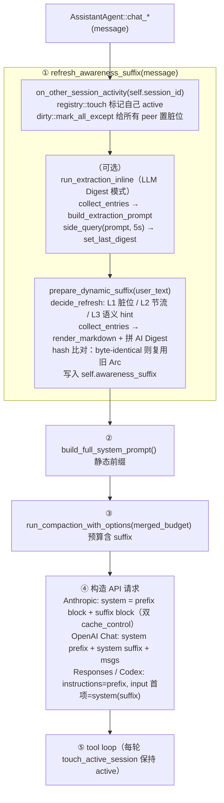

# 行为感知（Behavior Awareness）

> 源码：`crates/ha-core/src/awareness/`
> 关联：[Side Query 缓存](side-query.md) · [上下文压缩](context-compact.md) · [斜杠命令](slash-commands.md)

---

## 概述

每个聊天会话默认是孤立的——Agent 在会话 A 中完全不知道用户同时在会话 B/C 里做什么。跨会话行为感知在每个会话的 system prompt 尾部动态注入一段 markdown suffix，描述用户在其它并行会话中的实时行为，让 Agent 能理解"上次那个 bug"、"另一个窗口里调的 CI"等跨会话指代。

**三档模式**：

| 模式 | LLM 成本 | 内容 |
|---|---|---|
| `off` | 零 | 完全禁用 |
| `structured`（默认） | 零 | 从 DB + recap facets + 内存 registry 聚合的结构化列表 |
| `llm_digest` | 额外 side_query | 结构化列表 + LLM 生成的自然语言行为 digest |

---

## 架构总览

```
crates/ha-core/src/awareness/
    mod.rs          公开 API 与模块注册
    config.rs       AwarenessConfig + 会话级 merge 解析
    types.rs        Entry / Snapshot / ActivityState / RefreshReason
    registry.rs     ActiveSessionRegistry（内存活跃会话时间戳）
    dirty.rs        DirtyBits 脏位广播
    collect.rs      从 SessionDB + RecapDb 聚合候选
    render.rs       生成 markdown suffix
    session.rs      SessionAwareness —— 动态感知器（三层触发 + hash 判重）
    llm_digest.rs   LLM 抽取 prompt 构建
    peek_tool.rs    peek_sessions 工具
```

### 数据流



---

## 与无痕会话（Incognito）的联动

session `incognito=true` 时整个 refresh 路径在入口处直接短路：

- `AssistantAgent::refresh_awareness_suffix(user_text)` 第一行检查 `self.session_is_incognito()`，命中即清空 `awareness_suffix` 并 `return`，**不参与候选收集，不做 LLM digest**，也不会因当前会话发起 `on_other_session_activity` 给 peer 置脏位
- 前端 `AwarenessToggle`（`src/components/chat/input/AwarenessToggle.tsx`）在输入栏接收 `disabled` prop；`ChatInput.tsx:584` 在无痕开启时传入 `disabled={incognitoEnabled}`，控件灰化但**不改写** `sessions.awareness_config_json` 列
- 这样设计的好处：用户关闭无痕后，原有的会话级 awareness 配置自动恢复，不会因为短暂进入无痕而丢失偏好

来源：`crates/ha-core/src/agent/mod.rs:704-710`、`src/components/chat/input/ChatInput.tsx:584`、`src/components/chat/input/AwarenessToggle.tsx:38`。

---

## 三层动态触发器

`SessionAwareness::decide_refresh()` 按优先级判断是否重建 suffix：

| 级别 | 条件 | 说明 |
|---|---|---|
| **Forced** | `forced_next` 标记（compaction / config 变更） | 消费式读取（swap），不受节流约束 |
| **L3 语义 hint** | `semantic_hint_regex.is_match(user_text)` | 正则命中"上次/之前/another session"等短语时立即绕过节流 |
| **L1 脏位** | `dirty::take_dirty(session_id)` | 其它会话有活动；只在节流窗口外消费，避免丢失 |
| **L2 时间窗口** | `last_refresh_at` 为空 或 elapsed ≥ `min_refresh_secs` | 首轮或兜底刷新 |
| **Cached** | 以上均不满足 | 复用上次 suffix（byte-identical，cache 继续命中） |

**默认语义 hint 正则**（可配置）：
```
(?i)(上次|之前|之前那个|另一个|其它会话|其他会话|另一边|另一个窗口|另一个对话|last time|previously|earlier|another session|other session|the other (chat|session|window))
```

---

## Prompt Cache 安全

suffix 独立于静态 system prompt 传输，确保 suffix 变化不作废前缀缓存：

| Provider | 静态前缀 | 动态 suffix | Cache 效果 |
|---|---|---|---|
| **Anthropic** | `system[0]` + `cache_control: ephemeral` | `system[1]` + `cache_control: ephemeral` | 前缀 block 独立缓存，suffix 变时只作废 block 1 |
| **OpenAI Chat** | `messages[0]` role=system | `messages[1]` role=system | 自动前缀缓存命中 msg[0] |
| **Responses** | `instructions` 字段 | `input[0]` role=system | instructions 完全不变 → cache 命中 |
| **Codex** | `instructions` 字段 | `input[0]` role=system | 同 Responses |

**hash 判重**：每次 rebuild 后对 suffix 做 `DefaultHasher::hash`，与上次比对。相同则复用旧 `Arc<String>`，确保 API body 字节完全一致。

**age 粗粒度桶**：渲染时间用 8 档桶（`<1 min ago` / `<5 min ago` / ... / `>1 day ago`），同一桶内的 age 变化不改变 hash。

---

## 候选收集（collect.rs）

`collect_entries(db, cfg, current_session_id, current_agent_id)` 从 SessionDB 拉取候选：

1. **SQL 查询**：`list_sessions_paged(agent_filter, ProjectFilter::All, limit*4, 0)` 按 `updated_at DESC` 排序
2. **过滤**：排除自身会话 → `same_agent_only` 过滤 → 类型过滤（cron/channel/subagent 默认排除）→ `lookback_hours` 窗口
3. **Activity 标记**：与 `ActiveSessionRegistry::active_since(now - active_window_secs)` 取交集 → Active/Recent/Older
4. **Facet 富化**：`RecapDb::get_latest_facet(session_id)` 读取 `/recap` 已缓存的语义摘要；无 facet 时退化为 `last_user_message_preview`
5. **排序**：Active 优先 → Recent → Older；组内按 age 升序（更新的排前）
6. **agent name 缓存**：全局 `HashMap<String, Option<String>>` 避免每个候选都读磁盘
7. **RecapDb 连接缓存**：全局 `Lazy<Mutex<Option<RecapDb>>>`，初始化失败后自动重试

---

## LLM 抽取模式（llm_digest.rs）

`mode == LlmDigest` 时，在 `prepare_dynamic_suffix` 之前先 inline 跑一次 `side_query`：

**触发条件**（AND）：
- `should_run_extraction()` = true（mode 正确 + inflight 空闲 + cooldown 已过）
- `claim_extraction()` CAS 成功（防重入）
- 候选集合 hash 变了 **或** 尚无 digest

**Prompt 结构**：
```
[EXTRACTION_SYSTEM_PREAMBLE]

Candidate sessions:
1. **Refactor payment webhook** · agent=Coder · regular · 45s ago
   goal: migrate Stripe v1 → v2
   summary: ...
   recent user messages:
     - "单测跑通了，但 idempotency_key 那块我还是不确定"

[EXTRACTION_INSTRUCTIONS — 8 条强约束]

Current conversation's latest user message:
"帮我看看那个 CI 的问题"
```

**约束规则**：每条必须含动词+具体名词、禁止"关注/处理"等抽象词、同主题标记 `**possibly same topic**`、信息不足写 `(insufficient info)`。

**安全机制**：
- 5 秒硬超时（`tokio::time::timeout`）
- `InflightGuard` Drop 保护（panic 时也释放 inflight 锁）
- 连续 3 次失败后清空旧 digest，避免 stale 信息持续注入
- `digest_consecutive_failures` 计数器，成功时归零

**模型解析**：`llmExtraction.modelOverride`（`ModelChain`）为 `None`（新字段默认值，即所有现存配置的状态）时复用当前 chat agent 的 `self.side_query(...)`，享受与主对话共享的 prompt cache 前缀；设置后改走 `crate::automation::run`（purpose `awareness.extraction`），换取独立/更便宜模型的能力，代价是放弃这份 cache 共享——用户主动选择的权衡，非免费升级。取代了原先读了但从未真正切换 agent 的 `extraction_agent`、以及全仓库零消费点的 `extraction_model` 两个死字段（已删除，不保留兼容读取）。详见 [模型 vs Agent 统一配置](automation-model.md)。

---

## 渲染格式（render.rs）

模型看到的 suffix 示例：

```markdown
# Cross-Session Context

The user has 3 other relevant session(s) (1 currently active). Use this to
understand references like "the thing I was working on earlier" and to avoid
re-asking for context established elsewhere. Do NOT assume actions taken there
are visible here unless the user confirms.

## Currently active
- **Refactor payment webhook** · Coder · regular · <1 min ago
  goal: migrate Stripe v1 → v2 webhook handler
  summary: ran unit tests, stuck on idempotency key

## Recent (last hour)
- **Debug CI flakiness** · Coder · regular · <5 min ago
  goal: find root of intermittent pytest failures
  preview: "又挂了，还是 test_auth_flow 那条"

## Earlier (within lookback)
- **Draft launch blog post** · Writer · regular · <4 hours ago
  goal: write Q1 launch blog post; outcome: partial

## AI Digest
- **Refactor payment webhook**（<1 min ago）: 刚让 Stripe v2 webhook 单测跑通，
  卡在幂等键实现上犹豫。**possibly same topic**。
- **Debug CI flakiness**（<5 min ago）: `test_auth_flow` 又挂一次，正加 sleep 和
  DNS log 定位竞态，未复现根因。
- **Draft launch blog post**（<4 hours ago）: 在挑发布文标题，5 个口语化候选，未决。
```

**体积约束**：`max_chars`（默认 4000）硬截断，UTF-8 安全（`truncate_utf8`）。每个字段截断到 120 字符。

---

## 配置层级

### 全局配置（`AppConfig.awareness`）

存储在 `config.json`，通过 **设置 → 对话设置** 面板管理。

```typescript
interface AwarenessConfig {
  enabled: boolean           // 总开关（硬闸）
  mode: "off" | "structured" | "llm_digest"
  maxSessions: number        // 默认 6
  maxChars: number           // 默认 4000
  lookbackHours: number      // 默认 72
  activeWindowSecs: number   // 默认 120
  sameAgentOnly: boolean     // 默认 false
  excludeCron: boolean       // 默认 true（保守）
  excludeChannel: boolean    // 默认 true
  excludeSubagents: boolean  // 默认 true
  previewChars: number       // 默认 200
  dynamicEnabled: boolean    // 默认 true
  minRefreshSecs: number     // 默认 20
  semanticHintRegex: string  // 可自定义
  refreshOnCompaction: boolean // 默认 true
  llmExtraction: {
    modelOverride: ModelChain | null  // null（默认）= 复用当前 chat agent 的 side_query（cache-friendly）；设置后走 crate::automation::run（purpose "awareness.extraction"），见 automation-model.md
    minIntervalSecs: number  // 默认 300
    maxCandidates: number    // 默认 5
    digestMaxChars: number   // 默认 1200
    concurrency: number      // 默认 2
    perSessionInputChars: number // 默认 2000
    inputLookbackHours: number   // 默认 4
    fallbackOnError: boolean     // 默认 true
    reuseSideQueryCache: boolean // 默认 true
  }
}
```

### 会话级覆盖

存储在 `sessions.awareness_config_json` 列（partial JSON），通过聊天输入栏的 **眼睛图标** 弹出的 popover 管理。

**解析规则**（`config::resolve_for_session`）：
1. 全局 `enabled=false` → 硬闸，忽略所有覆盖
2. 会话列无值 → 返回全局配置
3. 有值 → partial merge 到全局（JSON 深合并，缺失字段继承全局）
4. 合并失败 → log warning，回退全局

**UI 入口**：
- 眼睛图标 `Eye` / `EyeOff` 在输入栏温度滑块旁
- 全局关闭时隐藏
- 覆盖状态：无覆盖（灰色）、有覆盖（蓝色）、本会话禁用（橙色 EyeOff）

---

## peek_sessions 工具

模型可主动调用 `peek_sessions(query?, limit?)` 获取实时跨会话数据：

- **注册方式**：Core `SessionAware` 工具（`peek_sessions_schema()` 设 `tier = ToolTier::Core { subclass: SessionAware }`），始终 eager 注入——`is_deferred` 对非 Standard/Configured tier 恒返回 false，`resolve_tool_fate` 把 SessionAware 映射到 `InjectEager`；**不走 deferred / `tool_search` 发现**
- **internal=true**：无需审批
- **concurrent_safe=true**：可并行执行
- **全局杀开关**：`enabled=false` 时返回 `"Behavior awareness is disabled by the user."`
- **查询过滤**：对 title / goal / summary 做 substring 匹配
- **pull 4x limit**：先拉 `limit*4` 条，query 过滤后再 truncate 到 limit，避免 miss

---

## 斜杠命令：/awareness

控制全局开关和模式，详见 [斜杠命令文档](slash-commands.md#awareness-子命令详解)。

| 子命令 | 效果 |
|---|---|
| 无参 / `status` | 显示全局状态 + 活跃 peer 数 |
| `on` / `off` | 全局开关，写 `config.json` |
| `mode structured` / `llm` / `off` | 切换模式 |

---

## API 端点

| 方法 | 路径 | 说明 |
|---|---|---|
| GET | `/api/config/awareness` | 读取全局配置 |
| PUT | `/api/config/awareness` | 保存全局配置（body: `{config: {...}}`） |
| GET | `/api/sessions/{id}/awareness-config` | 读取会话级覆盖 JSON |
| PATCH | `/api/sessions/{id}/awareness-config` | 写入会话级覆盖（body: `{json: "..."}` 或 `{json: null}` 清除）|

Tauri 命令：`get_awareness_config` / `save_awareness_config` / `get_session_awareness_override` / `set_session_awareness_override`。

---

## Compaction 联动

`context.rs` 在 Tier 2+ 压缩后检查 `cfg.refresh_on_compaction`（默认 true），若为 true 则调用 `awareness.mark_force_refresh()`。由于 Tier 2+ 本身已作废 prompt cache，顺手刷新 suffix 的增量成本为零。

刷新发生在 **下一轮 turn** 而非当前轮（refresh 在 compaction 之前已经跑过）。

---

## 内存管理

| 全局单例 | 类型 | 清理策略 |
|---|---|---|
| `ActiveSessionRegistry` | `RwLock<HashMap<String, Instant>>` | touch 时 GC `max(active_window*2, 600s)` |
| `DirtyBits::DIRTY` | `RwLock<HashSet<String>>` | `take_dirty` 消费 + `unregister_observer` 清理 |
| `DirtyBits::OBSERVERS` | `RwLock<HashSet<String>>` | `SessionAwareness::Drop` 时 unregister |
| `RECAP_DB` | `Lazy<Mutex<Option<RecapDb>>>` | 进程生命周期；初始化失败时自动重试 |
| `AGENT_NAME_CACHE` | `Lazy<Mutex<HashMap>>` | 进程生命周期，无 eviction（agent 数有限） |

---

## 前端组件

| 组件 | 位置 | 用途 |
|---|---|---|
| `AwarenessPanel` | `src/components/settings/AwarenessPanel.tsx` | 全局配置面板（嵌入 ChatSettingsPanel） |
| `AwarenessToggle` | `src/components/chat/input/AwarenessToggle.tsx` | 输入栏 per-session 覆盖弹窗 |

---

## 已知限制

- 会话级覆盖 UI 仅支持 enable/disable + mode，高级字段需通过 API 或 `/awareness` 命令
- 语义 hint 正则编译失败时 silently return false（每次重试编译，直到用户修复正则）
