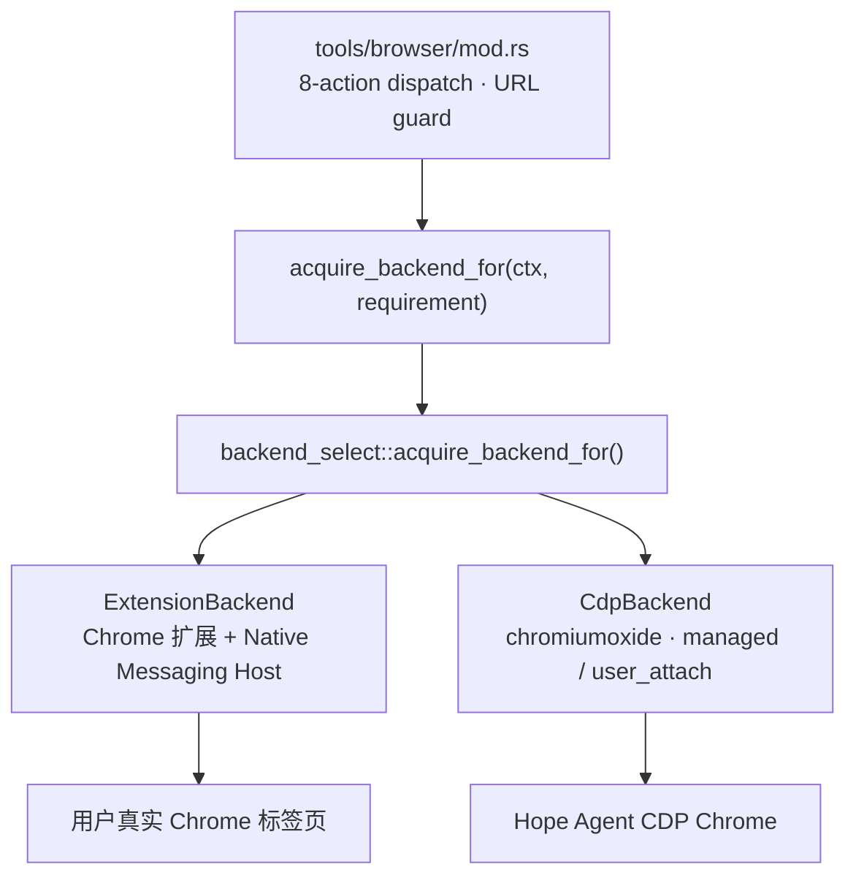
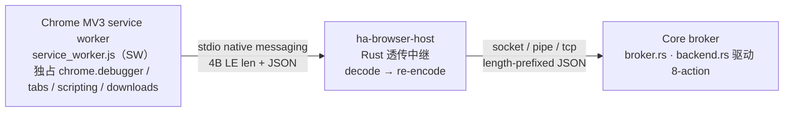

# 浏览器自动化子系统

> 返回 [文档索引](../README.md) | 关联源码：[`crates/ha-core/src/browser/`](../../crates/ha-core/src/browser/)、[`crates/ha-core/src/tools/browser/mod.rs`](../../crates/ha-core/src/tools/browser/mod.rs)、[`src/components/chat/BrowserPanel.tsx`](../../src/components/chat/BrowserPanel.tsx)、[`skills/ha-browser/SKILL.md`](../../skills/ha-browser/SKILL.md)

LLM 看到一个 `browser` 工具，**8 个高层 action**。默认后端是 **Chrome Extension + Native Messaging Host**：扩展运行在用户真实 Chrome profile 内，通过 `chrome.debugger` 控制已打开 tab；当扩展未安装或不可用、且动作不依赖真实 Chrome 状态时，降级到现有 `CdpBackend`（`chromiumoxide` managed / user_attach profile）兜底。

## 8-action 表面

```
status                                           # 当前 backend / extension/native host/CDP fallback 诊断
profile { op: list|launch|connect|disconnect|install_runtime } # CDP 会话生命周期
tabs    { op: list|new|select|close|open_user_tabs|claim|release|finalize } # 标签页 / 真实 Chrome tab claim
navigate { url?, op: go|back|forward|reload }
snapshot { format: role|screenshot|pdf }
act     { kind: click|dblclick|fill|type|hover|drag|select|press|upload } # type 是 fill 的兼容别名
observe { kind: console|network|page_errors|downloads, since? }
control { op: resize|scroll|wait_for|handle_dialog|evaluate|raw_cdp|download_cancel }
```

完整 schema 在 [`tools/definitions/core_tools.rs`](../../crates/ha-core/src/tools/definitions/core_tools.rs)（`TOOL_BROWSER` 段）。工具标记 `default_deferred: true`，常态不进 system prompt，通过 `tool_search` 按需暴露。配套 [`skills/ha-browser/SKILL.md`](../../skills/ha-browser/SKILL.md) 教 agent 标准 loop：`status → tabs → snapshot → act → 必要时 resnapshot`，含登录 / 2FA / captcha / camera prompt / 文件下载等阻塞情形清单（一律 `ask_user_question`）。

## Backend 架构



> 跨后端旁路能力：`observe_buffer` 环形缓冲（console / network / errors）与 [`frame.rs`](../../crates/ha-core/src/browser/frame.rs)（`BROWSER_FRAME` event + capture API）。

`backend_select` 按动作要求选择后端：

| Requirement | 用途 | 扩展不可用时 |
| --- | --- | --- |
| `ExtensionRequired` | `tabs.open_user_tabs`、`tabs.claim`、操作 claimed user tab、用户明确要求当前 Chrome / 已登录 tab | fail-closed，发 `browser:extension_required` 并返回安装提示 |
| `ExtensionPreferred` | 普通导航、截图、snapshot、表单填写等一般浏览动作 | 可 fallback 到 `CdpBackend`，结果里标明 `backend=cdp` |
| `CdpAllowed` | `profile.launch/connect/install_runtime`、Docker/headless、显式 CDP 生命周期 | 直接走 `CdpBackend` |

`BrowserBackend` trait 是后端抽象。`profile.launch` / `profile.connect` 只管理 CDP fallback 生命周期；真实用户 Chrome tab 必须经扩展 claim，不能用旧 `profile=system` 思路接管默认 profile。

### `BrowserBackend` trait（[`backend.rs`](../../crates/ha-core/src/browser/backend.rs)）

27 个 async method 覆盖 8-action 全部底层操作。共享类型 `ElementRef` / `Snapshot` / `ActKind` / `ActParams` / `ObserveEntry` / `ScreenshotParams` / `PdfParams` 等保持 backend-agnostic，方便后续接入其他实现。`ElementRef.locator` 是 backend 私有字段（CDP 用 CSS selector）——8-action 层从不读它，只透传 `ref_id`。

### `ExtensionBackend`（[`extension/backend.rs`](../../crates/ha-core/src/browser/extension/backend.rs)）

ExtensionBackend 通过 Core broker 和 Chrome 扩展通信。扩展 `connectNative("com.hope_agent.chrome")` 到 `ha-browser-host`，host 再通过本机 broker 连接 `ha-core`。broker 负责握手、版本诊断、request/response 生命周期、大响应 blob、二进制 `dataBlob`、connection generation、late response 丢弃和权限校验。

Native host 是很薄的本机桥：只做 Chrome Native Messaging stdio frame 和本机 broker socket/pipe 转发，不拥有业务策略。策略真相源全部在 `ha-core`：backend selection、tab lease、SSRF、protected path、tool approval、response/blob 校验、session cleanup 都在 Core 层裁决。

主要能力：

- 真实 Chrome tabs：`tabs.open_user_tabs` / `tabs.claim` / `tabs.select` / `tabs.release` / `tabs.finalize`，claim lease 按 Hope session 隔离，turn-end 和 session cleanup 会 best-effort 释放。`tabs.select` 传入 extension 数字 tab id 时会激活并接管该真实 Chrome tab，走统一审批流；如果只想表达显式接管语义，仍推荐用 `tabs.claim`。
- 8-action 控制：导航、role snapshot、screenshot/PDF、click/fill/hover/press/select/upload/drag、resize/scroll/wait/evaluate/dialog。
- 强 snapshot：DOM refs + AX enrichment + AX-only readable nodes；带 `backendDOMNodeId` 的可操作 AX 节点会生成可操作 ref。
- iframe：同源 iframe 使用 `iframeSelector >>> selector`；跨域 iframe 使用 `chrome.scripting` bridge 和 `chrome.debugger` flat session，`browser.status` 输出 frame tree / matched session 诊断。
- observe：console / network / page errors / downloads ring buffer。console / network / page errors 按当前受控 tab 过滤；downloads 是真实 Chrome 的下载活动流，读取前走统一审批。
- 强能力出口：`control.raw_cdp` 要求 ExtensionBackend 和 active controlled tab，只校验 CDP method 形态，是否执行走统一 tool 审批；`control.download_cancel` 仅 ExtensionBackend 支持，可按 download id 中断 Chrome 下载，也走统一 tool 审批。

扩展不可用时，真实 Chrome 状态相关动作绝不悄悄退回 managed profile；普通浏览动作才可 CDP fallback。

`tabs.finalize` 的关闭语义由 tab owner 决定：claimed user tab 只 release/debugger detach，默认保持打开；Hope-created agent tab 默认关闭，除非调用时把对应 `target_id` 放进 `keep: ["..."]`。

#### 安装 / 发布 / 信任边界

- **Chrome Extension 安装**：主路径是 Chrome Web Store；alpha/dev/self-host/enterprise 继续支持本地 unpacked 扩展。Settings 向导会优先显示本地扩展目录（release resource 或 dev `extensions/chrome`），推荐在 `chrome://extensions` 开启 Developer mode 后直接拖入该目录；也可复制路径后用 `Load unpacked` 手动选择。App 不能静默安装扩展，只能在 Settings 打开 Web Store 或 `chrome://extensions` 向导，最终确认必须发生在 Chrome UI。
- **扩展运行时文件编译嵌入二进制（本地安装前提）**：运行时文件白名单（同 Web Store zip 清单，**保留 `manifest.key`**——区别于 `package-webstore.mjs` strip key）经 `rust-embed` 编译进 ha-core（`browser/extension/embedded.rs`），随二进制到达所有发行形态（桌面 / bare binary / headless server），不再依赖 Tauri resource / prepare 脚本拷贝（均已退役）。`ensure_local_unpacked_extension` 把 dev repo checkout（存在时优先，扩展编辑即时生效）或嵌入文件集镜像到稳定目录 `~/.hope-agent/extension/browser/`（字节 diff 幂等 + prune 多余文件 + 完成 marker 防半拷贝），二进制升级后镜像自动刷新；`unpacked_extension_path()` 优先稳定副本，headless 无桌面启动钩子时经每进程一次的懒 ensure 自举。**保留 key 使 unpacked id 恒为固定 dev id**，native host `allowed_origins` 据此推导——这是「商店上架前用户先 Load unpacked 本地装扩展、且无需 Web Store id 即可连上 broker」可行的前提。注意 Chrome 不自动重载 unpacked 扩展：镜像更新后需用户在 `chrome://extensions` 手动 reload 生效（上架 Web Store 后由商店自动更新接管）。
- **Native host 安装**：Settings 调 owner 平面命令写 user-level native host manifest。正式桌面包通过 Tauri resource 携带 `ha-browser-host`，启动时把资源路径写入 `HOPE_AGENT_BROWSER_HOST_PATH`；dev/self-host 可显式传 path 或设置同名 env。manifest 的 `allowed_origins` 只写入用户选择/检测到的 extension id，扩展 id 必须是 Chrome 的 32 位 `a-p` 字符串。Windows 额外写 HKCU `Software\Google\Chrome\NativeMessagingHosts\<host>` 指向 manifest。
- **Broker 连接**：Core broker 启动时生成本机 token；`ha-browser-host` 首帧必须是带 token 的 `host.hello`。Unix/macOS socket 校验 peer uid，Windows named pipe 校验当前用户 SID。扩展不接触 Hope Agent HTTP API key。
- **Extension id**：生产 id 由 Web Store 首次上传后产生，进入 `browser.extension.extensionIds`；unpacked dev id 由 `manifest.key` 推导并自动加入状态输出，方便 alpha fallback。
- **Stop 控制**：用户可从页面 overlay、extension popup、Settings Stop 结束控制。Core 会 emit `browser:control_stopped`，并清理 session scoped lease/ref 状态。

### `CdpBackend`（[`cdp_backend.rs`](../../crates/ha-core/src/browser/cdp_backend.rs)）

包装现有 [`browser_state`](../../crates/ha-core/src/browser_state.rs) 全局单例。`browser_state` 维护 chromiumoxide `Browser` handle、`Page` 池、`active_page_id`、`ElementRef` 表、CDP event handler 任务。`CdpBackend` 是 trait 适配薄壳，不持状态。它长期保留为 fallback、Docker/headless、自托管和无插件场景使用。

**Stale-ref 一次自恢复**：`act` 失败且错误匹配 `is_stale_ref_error`（`not found` / `no such element` / `stale` / `detached`）时，内部触发：

1. 取出当前 `ref_id` 对应的 `role` + `text`
2. 重新 `take_snapshot_inner()` 刷新所有 ref
3. 按 `(role, text)` 精确或模糊匹配找新 ref
4. 用新 ref 重试一次 `act_inner`

成功返回字符串末尾追加 `(ref auto-recovered: old → new)` 让 LLM 知道发生过。**只重试一次**，避免死循环。`navigate` / `tabs.*` / `control.*` 不走 recovery。

## Native Messaging 协议

> 关联源码：[`extensions/chrome/service_worker.js`](../../extensions/chrome/service_worker.js)（Chrome MV3 service worker）、[`ha-browser-host` crate `main.rs` / `protocol.rs`](../../crates/ha-browser-host/src/main.rs)（native host 二进制）、[`extension/broker.rs`](../../crates/ha-core/src/browser/extension/broker.rs) / [`extension/backend.rs`](../../crates/ha-core/src/browser/extension/backend.rs)（Core broker + 后端）。

LLM 看到的是高层 8-action；其底层是一条跨三进程的 native-messaging 链路。本节是这条链路的**线协议方法表与不变量**——8-action 表面的实现真相源。

### 三进程拓扑



- **SW 是唯一可拨号 / 重连的一方**：Chrome 与 host 走 stdio，host 与 Core 走 socket/pipe/tcp；**Core 纯粹是 listener/broker，无任何 reconnect / keepalive / heartbeat**，broker 不实现 `heartbeat`/`ping` 方法。（注：扩展层配置 `BrowserExtensionConfig.heartbeat_interval_secs`（默认 15s）目前**未被任何路径消费**——既不 plumb 给 host 也不影响本链路；真正起作用的 heartbeat 属于另一条 CDP/WebSocket backend（[`browser_state.rs`](../../crates/ha-core/src/browser_state.rs)，ping `browser.version()`，默认 120s），与本节的 native-messaging 链路无关。）
- **统一帧格式**：两段链路复用同一 Chrome Native Messaging 线格式——`4 字节小端 u32 长度前缀 + 该长度的 UTF-8 JSON body`。host [`MAX_NATIVE_MESSAGE_LEN`](../../crates/ha-browser-host/src/protocol.rs) 与 Core [`MAX_BROKER_MESSAGE_LEN`](../../crates/ha-core/src/browser/extension/broker.rs) 均 = `1024×1024`（1 MiB，读写双向强制，`len==0` 拒绝，header 前干净 EOF = 优雅关闭）。**1 MiB 是 per-frame 线上限，更大 payload 走 chunk/blob 通道**。
- **两段握手**：
  1. **`host.hello` token 握手（transport auth）** — host 连上 broker 后**同步**写出首帧 `host.hello`，携带 discovery 文件里的 token；broker 把该 token 校验为强制首帧，**token 不符直接拒连**（`native host token mismatch`），Core 不回复 `host.hello`。
  2. **`extension.hello` 应用握手** — SW 在 port open 后立刻 fire-and-forget 发 `extension.hello`（带 `protocolVersion:1` + 身份），Core 回 `hello_ack`。`PROTOCOL_VERSION = 1`；**版本只记录不拒绝**，不匹配仅由 [`diagnostics.rs`](../../crates/ha-core/src/browser/extension/diagnostics.rs) 抛 `VersionMismatch`（`next_action=reload_extension`）。
- **Peer 身份校验（fail-closed）**：Unix 用 `SO_PEERCRED`（Linux）/ `getpeereid`（macOS+BSD）校验 peer euid 必须 == 当前 euid，**无法确定 uid 一律拒连**；Windows 用 `ImpersonateNamedPipeClient` → TokenUser SID 必须 `EqualSid` 当前进程用户 SID，pipe DACL 限定当前用户、`reject_remote_clients(true)`。
- **Discovery / endpoint**：broker 把 `BrowserBrokerDiscovery { protocolVersion, endpoint, token, pid }` 以 0600 写入 `~/.hope-agent/browser-extension/broker.json`。endpoint 按 scheme 前缀解析：Unix `unix:<…broker.sock>`（dir 0700 / sock 0600）、Windows `pipe:\\.\pipe\hope-agent-browser-extension-<pid>`、其他 `tcp:127.0.0.1:<ephemeral>`。**两个同前缀环境变量用途不同、勿混淆**：host 侧 discovery 文件路径由 `HOPE_AGENT_BROWSER_BROKER_DISCOVERY` 覆盖（[`main.rs`](../../crates/ha-browser-host/src/main.rs)，host 据此找 broker）；ha-core 写 native-host manifest 时由 `HOPE_AGENT_BROWSER_HOST_PATH` 指定 host 二进制路径（[`diagnostics.rs`](../../crates/ha-core/src/browser/extension/diagnostics.rs)，Core 据此找 host 二进制）；数据根统一由 `HA_DATA_DIR` 覆盖。
- **连接换代 / supersede**：每次 accept 铸 `connection_id`（`connection_seq` 起始 1）。新 `host.hello` 到来时若已有 active 连接，Core 记 `Superseding…` 并 `fail_all_pending()` 立即清空 pending oneshot + chunk 装配，旧在途 `call()` 立刻返回；disconnect 时仅当本连接仍是 active 才清状态（`was_active` 守卫，被 supersede 的旧连接不动新 sender）。`request_seq` 起始 1。超时后才完成装配的响应无 waiter → 丢弃。

### 协议方法表

> 已跨进程去重——SW 视角与 Core 视角对同一线方法合并为一行；`host_to_ext` = Core/host 发往扩展、`ext_to_host` = 扩展发往 host/Core。表格单元格内的 `\|` 表示「或」。

#### host → ext（SW `handleCommand` 派发）

| 方法 | 关键参数 | 响应 | 源码 |
| --- | --- | --- | --- |
| `hello` | —（params 忽略） | `{ extension, extensionVersion, protocolVersion:1, nativeConnected }`，SW 本地应答**不回环到 native host** | SW `service_worker.js:379-385` |
| `status` | — | `extensionStatus()`：`{ extension, extensionVersion, protocolVersion:1, nativeHostName, nativeConnected, flatSessionTabs, flatSessions, tabCount }` | SW `service_worker.js:386-387,1359-1376` |
| `native.hello` / `native.status` | — | 透传 native host 对 `sendNative("hello"/"status")` 的应答（默认 5000ms 超时） | SW `service_worker.js:388-393,234-250` |
| `tabs.query` | `{ query?: chrome.tabs.QueryInfo }` | `Tab[]`（`tabToPlain`：id/windowId/active/url/title/…）→ Core 解析为 `Vec<TabInfo>` | SW `:394-395,1378-1395` / Core [`backend.rs:393`](../../crates/ha-core/src/browser/extension/backend.rs) |
| `tabs.create` | `chrome.tabs.CreateProperties`（Core 仅传 `{url}`，默认 `about:blank`） | `tabToPlain(tab)`；Core 侧记录 agent tab + 显示 overlay | SW `:396-397` / Core `backend.rs:1482` |
| `tabs.update` | `{ tabId, update?:{active? \| url?} }`（经 `requiredTabId(params)`） | `tabToPlain(tab)`（navigate）或激活（claim/activate） | SW `:398-399` / Core `backend.rs:518/1538` |
| `tabs.remove` | `{ tabId }` | `{ removed:true }`（Core 侧 unwrap 忽略） | SW `:400-402` / Core `backend.rs:1521` |
| `debugger.attach` | `{ tabId, version?:"1.3" }` | `{ attached:true }`；幂等（`already attached` 吞为 Ok），SW 内部连带 enable observe domains + flat-session auto-attach | SW `:403-405,998-1031` / Core `backend.rs:547` |
| `debugger.detach` | `{ tabId }` | `{ detached:true }`；幂等（`not attached` 吞为 Ok），清该 tab 的 session 状态 | SW `:406-411` / Core `backend.rs:2188` |
| `debugger.sendCommand` | `{ tabId, sessionId?, command(非空), params? }` | 原始 CDP result；`Page.printToPDF`/`Page.captureScreenshot` 改走 blob（见下）。Core 侧经 `validate_cdp_method` / `validate_raw_cdp_method` 白/黑名单 | SW `:412-413,443-448` / Core `backend.rs:603/583` |
| `debugger.sessions` | `{ tabId }` | flat-session 诊断：`{ tabId, flatSessionEnabled, frameTree, sessions[{sessionId,targetInfo,matchedFrame}] }`，按 URL 精确匹配 webNavigation 帧 | SW `:414-415,1073-1087`（URL 匹配见 `:1143-1165`） / Core `backend.rs:616` |
| `frames.tree` | `{ tabId }` | `{ tabId, available, frames[{frameId,parentFrameId,url,documentId,…}], error? }`（`webNavigation.getAllFrames`） | SW `:416-417,1108-1141` |
| `frames.snapshot` | `{ tabId, maxElements?(默认 160，clamp[1,300]) }` | `Array<FrameSnapshot>`（每可访问帧一项，含 `elements[{ref,depth,role,text,selector,attrs}]`、`truncated`）。`MAX_TEXT_LEN=100` | SW `:418-419,525-688` / Core `backend.rs:646` |
| `frames.act` | `{ tabId, frameId(≥0), selector(非空), kind(非空), params? }` | 成功 `{ ok:true, message, …kind 专属 }`（`clip` 返回 `url,title,clip{…}`）；失败抛 `Error`。先滚动元素居中 | SW `:420-427,695-777` / Core `backend.rs:718` |
| `overlay.show` | `{ tabId, label?(默认 "Hope Agent is controlling this tab") }` | `{ shown:true }`；注入 closed shadow-DOM 横幅 + Stop 按钮，tab 重载后重注 | SW `:428-430,888-991` / Core `backend.rs:449` |
| `overlay.hide` | `{ tabId }` | `{ hidden:true }`（Core 侧失败仅 `app_debug` 记录，非致命） | SW `:431-433,993-996` / Core `backend.rs:2274` |
| `observe.read` | `{ kind, since?(ms，严格 `>` 过滤，`at<=since` 丢弃), tabId? }` | `ObserveEntry[]`：`{ at, level, text, url?, tabId? }`。读内存 ring buffer。downloads 条目无 tabId，故 tabId 过滤会排除它 | SW `:434-435,1219-1246` / Core `backend.rs:2046` |
| `downloads.cancel` | `{ downloadId(≥0) }` | `{ cancelled:true, downloadId }`。**所有权门控**：不在 `managedDownloads` 抛错；推一条 `cancelled` observe 条目 | SW `:436-437,1337-1357` / Core `backend.rs:1940` |
| （未识别命令） | 任意未知 method | SW 抛 `Unsupported extension command: <method>`，host 信道包成 `{ok:false,error{…}}` | SW `:438-439` |

> **注**：上表是 SW `handleCommand` 能派发的全部命令。其中 Core `ExtensionBackend` 的 8-action 路径实际只 `.call()` 调 `tabs.*` / `debugger.{attach,detach,sendCommand,sessions}` / `frames.{snapshot,act}` / `overlay.{show,hide}` / `observe.read` / `downloads.cancel`；`hello` / `status` / `native.hello` / `native.status` / `frames.tree` 是握手 / 诊断类方法，经 host 或 popup 触达、不由 `backend.rs` 驱动（`hello` 的「不回环 native host」也仅因 Core 从不调它）。
>
> Core 侧的 `session.cleanup` **不是线方法**（只是 `BrowserBackendContext.source` 标签，`backend.rs:2137`）；会话/turn 清理由 `apply_finalize_actions` 逐条发 `tabs.remove` + `debugger.detach` + `overlay.hide`（`backend.rs:2197-2270`）完成。

#### ext → host（扩展 SENDS，Core RECEIVES 并回 ack）

| 方法 | 发起方 | 关键参数 | 响应（Core 回） | 源码 |
| --- | --- | --- | --- | --- |
| `host.hello` | native host | `{ id:"host-hello", method:"host.hello", token, payload:{host,hostVersion,pid,protocolVersion:1} }` | **Core 不回复**（成功即换 active sender 起读循环）；token≠broker token 拒连 | host [`main.rs:141-153`](../../crates/ha-browser-host/src/main.rs) / Core `broker.rs:587` |
| `extension.hello`（别名 `hello`） | SW | port open 时 fire-and-forget：`{ id:"startup-…", method:"extension.hello", protocolVersion:1, payload:{extension,extensionVersion} }` | `{ ok:true, type:"hello_ack", protocolVersion:1, coreConnected:true }`，记录 reported 版本（不拒绝） | SW `:217-225` / Core `broker.rs:613` |
| `extension.status`（别名 `status`） | SW | native RPC，由 `native.status` 触发 | `{ ok:true, type:"status", protocolVersion:1, coreConnected:true, broker:<BrokerStatus> }` | SW `:392-393` / Core `broker.rs:634` |
| `extension.user_stop` | SW | detach debugger + 隐 overlay 后发 `{ tabId, source:"toolbar" \| "overlay" }`；best-effort | `{ ok:true, type:"user_stop_ack", tabId, removedLeases:N }`；副作用：`registry::remove_tab_from_all_scopes` + emit `browser:control_stopped` | SW `:840-856` / Core `broker.rs:653` |
| `extension.download_completed` | SW | `chrome.downloads.onChanged` state→complete 触发（仅 Hope-managed download），10000ms 超时，payload 含 `{id,tabId,url,finalUrl,filename,…}` | `{ ok:true, type:"download_completed_ack", result:{downloadId,path,url} }`；**文件不搬移**（留原位）；失败推 `policy_error` observe | SW `:1269-1293` / Core `broker.rs:706` |

#### popup / overlay → SW（`chrome.runtime.onMessage`）

| 方法 | 关键参数 | 响应 | 源码 |
| --- | --- | --- | --- |
| `hope.overlay.stop` | tabId 取自 `sender.tab.id`（**非 params**） | `{ stopped:true, tabId }`；缺 `sender.tab.id` 抛错，否则 `stopTabControl(tabId,"overlay")` | SW `:255-257,832-838` |
| `hope.popup.status` | 无 | `{ nativeConnected, attachedTabs, flatSessionTabs, flatSessions, overlayTabs }`；先 best-effort `ensureNativePort()` 冷启 | SW `:258-260,867-886` |
| `hope.popup.stopTab` | `{ params \| payload:{ tabId } }` | `{ stopped:true, tabId }`：hideOverlay + detach + `extension.user_stop(source="toolbar")` | SW `:261-263,840-856` |
| `hope.popup.stopAll` | 无 | `{ stopped:N, tabs:[…] }`：遍历 `attachedDebugTabs ∪ overlayTabs` 各自 stop | SW `:264-266,858-865` |
| （非 `hope.*` 落空 → `handleCommand`） | 任意非上述 4 个 method | 委派给 `handleCommand(method,params)`——host→ext 派发亦可从 onMessage 触达 | SW `:252-268` |

#### internal（CDP / 透传，无独立线方法）

| 方法 | 触发 | 行为 / 响应 | 源码 |
| --- | --- | --- | --- |
| `Page.printToPDF`（blob-backed CDP） | 经 `debugger.sendCommand` | `result.data`(base64) 拦截 → `dataBlob:{blobId,totalSize,sha256,mime:"application/pdf",purpose:"pdf",encoding:"raw"}`；原始字节**先**经 blob 帧流出 | SW `:443-487` |
| `Page.captureScreenshot`（blob-backed CDP） | 同上，`params.format` 决定 mime | `result.data` 拦截 → `dataBlob{…,mime:image/png 或 jpeg,purpose:"screenshot"}`，同 blob-stream 路径 | SW `:450-475,481-486` |
| `debugger.sendCommand` passthrough（非二进制） | 上述两命令以外 | CDP result 原样返回；若整体 host 响应 > `MAX_DIRECT_RESPONSE_BYTES` 则在 `postHostResponse` 层走 `response.blob` | SW `:443-475,285-308` |
| host `<all other frames>` passthrough | host broker 已连 | host **纯透传**：`serde_json::Value` decode→re-encode（仅按 JSON + `MAX_NATIVE_MESSAGE_LEN` 重新界定，不解读 method/id/payload） | host `main.rs:96-117,156-174` |

### frames.act 子动作 / observe.read kinds

#### frames.act 子动作（`performHopeFrameAction`，SW `:695-777`；Core `ActKind` [`browser/backend.rs:118-127`](../../crates/ha-core/src/browser/backend.rs)，注意是父 `browser/backend.rs` 非 `extension/backend.rs`）

所有子动作先 `document.querySelector(selector)`（找不到抛 `Element not found for frame selector`）并 `scrollIntoView(center)`：

| kind（线名） | 输入别名 | 参数 | 行为 / 返回 | 源码 |
| --- | --- | --- | --- | --- |
| `click` | — | — | `el.click()`，`{message:"Clicked"}` | SW `:701-703` |
| `double_click` | `dblclick` | — | dispatch `dblclick` | SW `:704-706` |
| `hover` | — | — | dispatch `mouseover`+`mouseenter` | SW `:707-710` |
| `fill` | `type` | `text`（默认 `""`） | 原型 setter 写 value + dispatch `input`(insertText)+`change` | SW `:711-725` |
| `select` | — | `values[0]` 或 `value`（缺抛 `act.select requires values`） | 写 value + `input`+`change` | SW `:726-733` |
| `press` | — | `key`（必填，缺抛 `act.press requires key`） | dispatch `keydown`/`keypress`/`keyup` | SW `:734-742` |
| `clip` | —（非 ActKind） | — | `getBoundingClientRect`（空 bounds 抛错），返回 `{url,title,clip{x,y,width,height,scale:1}}` 供 host 回喂 `Page.captureScreenshot` clip | SW `:743-761` / Core `backend.rs:749` |
| `drag` | — | `targetSelector`（Core 由 `target_ref` 注入；缺抛错） | 合成完整 HTML5 DnD 序列（mousedown→dragstart→…→drop→dragend），共享 `DataTransfer` | SW `:762-770,779-830` |

> **注：`upload` 不是 frames.act 子动作。** SW 内无 `DOM.setFileInputFiles` helper；文件上传由 Core 侧 root session 经 `DOM.setFileInputFiles`+`Runtime.releaseObjectGroup` 完成（跨域 iframe ref 直接 bail），不经 `frames.act`（Core `backend.rs:1078-1110,711-713`）。其它 bypass：① `download_cancel` 所有权门控，仅 `managedDownloads`（源自 Hope 控制 tab）可取消；② 二进制 CDP capture（PDF/截图）始终经 blob 帧流出而非直接 JSON；③ drag 跨帧时 Core 回退 raw CDP `Input.dispatchMouseEvent`。

#### observe.read kinds（`normalizeObserveKind`，SW `:1230-1246`）

| 输入 | 归一化 buffer | 数据源 |
| --- | --- | --- |
| `console` | console | `Runtime.consoleAPICalled` |
| `network` | network | `Network.responseReceived` |
| `pageErrors` / `page_errors` / `errors` | pageErrors | `Runtime.exceptionThrown` |
| `downloads` / `download` | downloads | `downloads.on{Created,Changed,Erased}` + managed-completion |
| 未知 | 抛 `Unsupported observe kind: <kind>` | — |

Ring 容量 `OBSERVE_RING_CAPACITY=500`/kind，满则 shift 最旧。Core 侧对 console/network/pageErrors 会先发 `Runtime.enable`/`Network.enable` 并设 tabId 过滤，downloads 无 tab 过滤。

### Blob 流式 / 大响应

两条独立的大对象通道，均以**整 blob sha256**（无 per-chunk 哈希）做完整性校验，Core 侧 sparse 写盘 + 原子发布：

| 维度 | 直接 JSON | `response.chunk`（文本/JSON 分块，旧路径） | BlobStore（`blob.begin/chunk/end` + `response.blob`） |
| --- | --- | --- | --- |
| 触发 | 响应 ≤ `MAX_DIRECT_RESPONSE_BYTES = 768 KB`（SW） | 大文本响应分块（按 id 装配） | 响应 > 768 KB（`purpose:"response"`）**或**二进制 CDP（PDF/截图，无视大小） |
| 分块/上限 | — | `MAX_CHUNKED_RESPONSE_CHUNKS=512`，累计 `MAX_CHUNKED_RESPONSE_LEN=64 MiB`，`CHUNKED_RESPONSE_TTL=10min` | chunk size `RESPONSE_BLOB_CHUNK_BYTES=192 KB`（`totalChunks=ceil(totalSize/192KB)`）；caps `MAX_BLOB_SIZE=256 MiB`、`MAX_BLOB_CHUNKS=4096`、`BLOB_TTL=10min` |
| 完整性 | — | 拼接串 sha256（若提供） | `blob.begin`/`blob.end` 整 blob sha256 双向一致 + 落盘后全文件 sha256 |
| Core 落盘 | inline | 内存装配 | `create_new` sparse `.part`（`set_len(totalSize)`）→ chunk `seek(offset)+write`（拒重叠/越界）→ `blob.end` 校验后**原子 `rename(.part→.blob)`** 进 `~/.hope-agent/browser-extension/blobs/` |
| 取用 | — | — | 一次性 take：`take_completed_json`（mime `application/json`）/ `take_completed_bytes`（按 purpose+allowed-mime，如 screenshot→png/jpeg、pdf→application/pdf）；取后 `remove_file` |

- **帧定义**：`blob.begin{blobId,mime,purpose,totalSize,sha256}` → `blob.chunk{blobId,index,offset,base64}` → `blob.end{blobId,totalChunks,sha256}`。`blobId` 校验 `[A-Za-z0-9._-]`、1..=128 字。常量定义在 [`broker.rs:27-33`](../../crates/ha-core/src/browser/extension/broker.rs)。
- **`response.blob` 终结标记**：仅在成功 `postHostBlob` 后发，`{ id(=原请求 id), ok:true, type:"response.blob", blobId, totalSize, sha256, mime:"application/json" }`，host 按 id 关联、按 blobId 重组——**字节已先于该标记经 blob 帧流出**。
- **二进制 CDP 始终走 blob**：`maybeBlobBackedCdpResult` 仅在 nativePort 在场且 `result.data` 为 string 时把 data 改写成 `dataBlob`；`blobId` 形如 `pdf-<ts>-<n>` / `screenshot-<ts>-<n>`。
- `prune_expired` 在每次 begin/chunk/end 及 take 时清扫过期 partial + completed。

### 断线重连韧性

**仅扩展 SW 侧实现**（host 与 Core 都不重连）：

- **指数退避 `scheduleReconnect`（SW `:30-42`）**：已有 reconnectTimer 或 nativePort 活时 no-op；`delay = min(RECONNECT_MAX_MS=30000, RECONNECT_BASE_MS=1000 × 2**reconnectAttempts)`，递增 `reconnectAttempts` 后 `setTimeout → ensureNativePort`（抛错则重排）。`onDisconnect` 调它。**任意入站 port 消息重置退避**（`reconnectAttempts=0` + 清 timer，SW `:182-188`）。
- **周期 keepalive alarm**：`KEEPALIVE_ALARM="ha-native-keepalive"`，`chrome.alarms.create({periodInMinutes:0.5})`（30s），SW 每次加载 + `onInstalled`/`onStartup` 注册；`onAlarm` 若已连接则 no-op，否则 `ensureNativePort`——**即便 MV3 驱逐 idle worker 后也能复活 port**，依赖 `alarms` 权限。
- **乐观 `nativeConnected`**：`connectNative` 同步返回（host 进程未确认前），SW 紧接着乐观置 `true`，`onDisconnect`/connect 抛错时置 `false`。`sendNative` 直接用 port、**不 gate 此 flag**（仅影响 status 显示）；`popupStatus` 会 best-effort `ensureNativePort` 冷启 port。
- **per-request 超时**：`sendNative` 默认 5000ms，`extension.download_completed` 覆盖为 10000ms；超时删 pending 并 reject `Native host method timed out: <method>`。`onDisconnect` 时所有 pending 以 lastError（默认 `Native host disconnected`）reject 并清空。
- **host 侧无重连**：broker 连接一次性，失败则 `broker=None` 进降级本地兜底（对扩展回 `hello_ack`/`status`/`core_broker_unavailable` 错误）；连接中途断开**不重拨**。host 进程在 stdin EOF（Chrome 关 port）或畸形/超大帧时退出，Chrome 下次消息时重启它。

## 实时 BrowserPanel

桌面 app 独占优势——chat 右侧固定 panel，实时镜像 agent 控制的 Chrome 窗口。**事件驱动 + 1s 兜底轮询**：

- **后端 emit（choke point 集中）**：[`browser::frame::emit_frame_async`](../../crates/ha-core/src/browser/frame.rs) 由 [`tool_browser`](../../crates/ha-core/src/tools/browser/mod.rs) choke point 的 `should_emit_frame_after` 统一触发（`act` 失败也发帧——页面可能已部分变化；`navigate` / `tabs.new|select|claim` 仅成功发），不再散在各 handler 里。fire-and-forget 一次截图（JPEG quality=70），通过 EventBus 发 `browser:frame`。payload 带可选 `sessionId` 与可选 `actionId`（关联同 choke point 记录的 `browser:action` 事件，帧任务事后降采样 ≤240px q60 缩略图回填进 action ring buffer；轮询帧无 `actionId` 不回填）。ExtensionBackend 按会话构造临时 backend 捕获真实 claimed tab；CDP fallback 保持旧路径且不强制启动新浏览器，但仍保留请求会话的 `sessionId` 供前端过滤。
- **前端订阅**：[`BrowserPanel.tsx`](../../src/components/chat/BrowserPanel.tsx) `useEffect` 订阅 `browser:frame` 立即替换帧；[`ChatScreen.tsx`](../../src/components/chat/ChatScreen.tsx) 只用当前会话的 `sessionId` 自动打开 BrowserPanel，避免其它会话的浏览器动作把右侧 panel 拉出来。
- **兜底轮询**：panel 打开期 `setInterval(1000, browser_capture_frame)`，关闭即 clear。调用时传当前 `sessionId`，优先复用同会话 extension tab，覆盖用户在 Chrome 里手动操作的场景。
- **互斥**：跟 PlanPanel / DiffPanel / CanvasPanel / WorkspacePanel 互斥，第一次当前会话 `browser:frame` 到来自动开 panel，用户手动关闭后保持关闭。

`browser_capture_frame` 同时暴露为 Tauri 命令（[`src-tauri/src/commands/browser.rs`](../../src-tauri/src/commands/browser.rs)）和 HTTP `POST /api/browser/capture-frame`（[`crates/ha-server/src/routes/browser.rs`](../../crates/ha-server/src/routes/browser.rs)），两端都接受可选 `{ sessionId }`，保持 Transport 抽象对齐。

### 面板执行历史 / 悬浮小窗 / 快捷条

- **逐步操作事件流**：`tool_browser` choke point 按白名单（`navigate` / `act` / `tabs` 变更类 / `control` 操作类 / `snapshot.screenshot|pdf`；status / profile / observe / 各 list 类只读查询跳过）经 [`tool_actions`](../../crates/ha-core/src/tool_actions.rs) 记录 `ToolActionEvent` 并 emit `browser:action`。**脱敏红线**：`act.fill` 文本只记长度（`text(N chars)`，不留前缀）；error 截断 256B。历史落**进程内 per-session ring buffer**（200 条、缩略图最近 50 条、session key LRU 64，纯内存不落盘——incognito 照记，会话删除 / 焚毁经 `session::cleanup_watcher` → `tool_actions::purge_for_session` 即清），`tool_recent_actions`（Tauri + HTTP `GET /api/tool-actions`）拉取。
- **面板底部功能区**（docked 态）：[`BrowserPanelContent`](../../src/components/chat/BrowserPanelContent.tsx) 在帧预览（aspect-ratio 自适应 + `max-h-[55%]`）下方叠 QuickBar（URL 直达 / 后退 / 刷新走 owner 命令 `browser_panel_navigate`，`go` 过 SSRF、缺 scheme 补 https；接管暂停与外部打开也收拢于此）、三格统计条（步数+失败 / 总耗时 / 当前目标 host）与执行历史时间线（[`PanelActionTimeline`](../../src/components/chat/right-panel/PanelActionTimeline.tsx)，点击条目用该步缩略图回放、「回到实时」退出——回放只是显示层选择，live 帧照常更新）。数据源 [`usePanelActionHistory`](../../src/hooks/usePanelActionHistory.ts)（挂载拉 ring buffer + 增量监听 action/frame 事件）。
- **悬浮小窗**：面板 header 的悬浮按钮把镜像切成应用内可拖拽 / 8 向 resize 的悬浮卡片（[`FloatingPanelWindow`](../../src/components/chat/right-panel/FloatingPanelWindow.tsx) + [`useFloatingWindow`](../../src/hooks/useFloatingWindow.ts)，pointer capture + 手势中 rAF 直写 DOM、pointer-up 才 commit、rect 记 localStorage、视口双重 clamp；z-40..49 恒低于 dialog 的 z-50）。悬浮 = 退出右侧互斥槽位（`rightPanelVisibility` 置 false，槽位自动让给下一面板），标题栏切换器仍列出该面板、点击即停靠回槽位；browser 与 mac-control 可同时悬浮。帧监听经引用计数 [`frame-store`](../../src/lib/frame-store.ts)（0→1 挂 transport listener、1→0 延迟 300ms 卸载）在停靠↔悬浮容器切换间不断流、全局仅一份轮询。会话切换关闭悬浮窗（帧是会话相关的）。

### 工作台浏览器活动

BrowserPanel 负责实时画面；WorkspacePanel 只展示本会话浏览器工具的轻量活动摘要，避免把截图、PDF、DOM dump、raw CDP 返回值等大结果塞进 `tool_metadata`。

- **写入 metadata**：`browser` 工具成功后写 `tool_metadata.kind = "browser_activity"`，字段限于 `action` / `op` / `targetId` / `url` / `title` / `backend` / `sessionId` / `callId` / `at`。缺失的 URL/title/target 通过 `current_frame_info(sessionId)` 只读补齐，不截图、不启动 CDP。
- **历史聚合**：[`session::aggregate_session_artifacts`](../../crates/ha-core/src/session/artifacts.rs) 扫历史 `tool_metadata`，产出 `SessionArtifacts.browser`（最近优先，最多 1000 条），与 files / sources 同一工作台数据面。
- **live tail**：前端 [`useSessionBrowserActivity`](../../src/components/chat/workspace/useSessionBrowserActivity.ts) 扫当前 message window，[`useWorkspaceArtifacts`](../../src/components/chat/workspace/useWorkspaceArtifacts.ts) 按 `callId` 合并 backend snapshot + live tail；无痕会话仍跳过 backend，只显示当前窗口内活动。
- **交互**：WorkspacePanel 的“浏览器”段展示标题、域名/URL、动作、backend 与时间；点击活动行切到实时 BrowserPanel，URL 按钮才外部打开。历史活动不回放旧截图。

## SSRF 守卫

8-action 表面对高层 URL 操作做 SSRF 检查。check 走 [`security::ssrf::check_url`](../../crates/ha-core/src/security/ssrf.rs) `cfg.ssrf.browser()` policy + `trusted_hosts`：

| 入口 | 检查内容 |
| --- | --- |
| `navigate.go` | `url` |
| `tabs.new` | `url`（`about:blank` 跳过）|
| `profile.connect` | CDP endpoint `url`（防 agent 让我们连任意远程 9222）|
| `control.evaluate` | regex 扫脚本里的 `"http://..."` / `'https://...'` / `\`https://...\`` 字面量；任一被 policy 拒绝整个 evaluate 拒绝 |

`control.evaluate` 的扫描是 **best-effort**：base64 编码 URL、模板字符串动态拼接、`window.location.host` 之类无法防。skill 文档明确告诉 LLM 这条边界。

`tabs.open_user_tabs` / `tabs.claim` / 数字 id 的 `tabs.select` / `observe.downloads` / `control.evaluate` / `control.raw_cdp` / `control.download_cancel` 都通过统一权限引擎产生浏览器审批原因；Default 会弹 tool approval，Smart 可由 `_confidence:"high"` 或 judge model 自动放行，Yolo / Global YOLO / `ToolExecContext.auto_approve_tools` 直接放行。异步工具重入的 `external_pre_approved` 只表示外层统一 gate 已经处理过，内层不重复审批。高层 `evaluate` 的 SSRF 扫描不受这些开关影响；raw CDP 作为高级逃生口不做额外 method allow/block policy，也不扫描 `Runtime.evaluate` 表达式内容，风险交给统一 tool 审批。

## 配置

[`AppConfig.browser`](../../crates/ha-core/src/browser/mod.rs) 全 optional：

```jsonc
{
  "browser": {
    "defaultMode": "managed",                // "managed" (默认) | "user_attach"; 仅 UI 偏好,模型路径不读
    "defaultProfile": "managed",             // profile.op=launch 无 profile= 时的回退;默认 "managed"
    "backendPreference": "extension_first",   // 默认 extension 优先，普通动作可 CDP fallback
    "heartbeatIntervalSecs": 120,            // CDP ws idle keepalive 心跳间隔; 0 = 关
    "launchCircuit": { "failureThreshold": 3, "cooldownSecs": 60 },
    "extension": {
      "enabled": true,
      "allowRawCdp": true,                       // 硬开关；false 则 raw_cdp 在执行 + 审批闸全被拒
      "showControlOverlay": true,
      "heartbeatIntervalSecs": 15,
      "extensionIds": ["<prod-or-dev-extension-id>"],
      "storeUrl": "https://chromewebstore.google.com/detail/hope-agent/<id>",
      "nativeHostName": "com.hope_agent.chrome"
    },
    "profiles": {
      "user_attach": { "port": 9222, "headless": false, "color": "#7c5cff" },
      "work":       { "userDataDir": "~/.hope-agent/browser-profiles/work" }
    }
  }
}
```

`browser.defaultMode` 风险等级 **LOW**（仅 UI 偏好），可走 `update_settings`。Profile 字段（`profiles[*]`）也是 **LOW**，settings UI 直接编辑。

`browser.extension.allowRawCdp` 是 raw CDP 的**硬开关**（默认 `true`，未设视为启用）：置 `false` 时 agent 完全发不出 raw DevTools Protocol——`control_raw_cdp` 执行入口直接返回 `control.raw_cdp is disabled by configuration` 拒绝，权限引擎也短路掉 `BrowserRawCdp` 审批闸。这与统一权限引擎、ExtensionBackend/controlled-tab 前提是叠加关系（后者管「能否审批通过」，本开关管「能力是否完全关闭」）。

`browser.extension.extensionIds` 是生产/企业分发的显式信任列表；unpacked dev id 会从 repo 内 `extensions/chrome/manifest.json` 的 `key` 推导并追加到状态输出，但生产默认仍应回填 Web Store id 和 `storeUrl`。`showControlOverlay=false` 只隐藏页面 Stop overlay，不取消 toolbar popup / Settings Stop。`extension.heartbeatIntervalSecs` 是 native host / extension 活性诊断心跳，和 top-level `browser.heartbeatIntervalSecs`（CDP websocket keepalive）不是同一个开关。

**老 config 字段静默忽略**（serde default 行为）：
- `backend`（曾在 CDP / chrome-devtools-mcp 之间选；MCP backend 已删）
- `userAttach.lastSpawnedPort`（曾给独立的 "Reconnect" UX 用；user_attach 现在是 `profiles` 里的一等条目，port 固定 9222）

## 双模式 UX（Settings BrowserPanel）

设置面板提供三块互补能力：

- **Chrome Extension**：安装/修复 native host、打开 Chrome Web Store 或 unpacked extension 向导、显示 connected/version/backend 状态、Stop browser control。真实用户 Chrome tab 控制走这条路径。
- **独立浏览器**（`AppConfig.browser.defaultMode = "managed"`，默认）：hope-agent 用 [`browser-profiles/{name}/`](../../crates/ha-core/src/paths.rs) 维护的隔离 Chrome 实例做自动化。Launch / Profiles section 控制这条路径。
- **Hope Agent 持久 profile**（`defaultMode = "user_attach"`）：hope-agent 在 [`browser_user_attach_dir()`](../../crates/ha-core/src/paths.rs)（`~/.hope-agent/browser/user-attach/`）下 spawn 一个**独立 user-data-dir 的 Chrome**，让用户在 Hope Agent 专用浏览器里登录并长期复用 cookies，但**不动**用户真正的 Chrome 用户数据。Connect section 的 "doctor" banner + 一键启动按钮驱动这条路径。

两个 Tauri 命令支撑 doctor UX：

- `browser_doctor` 聚合 `probe_user_chrome`（GET `127.0.0.1:9222/json/version` 2s 超时）/ `chrome_already_running`（`pgrep` / `tasklist`）/ system Chrome 路径 / cached Chromium runtime，一次性返回 banner 所需的全部状态
- `browser_spawn_user_chrome`：在 user_attach profile（port 9222）下 spawn detached Chrome；port 已占时报错让用户先手动关老 Chrome

老的独立命令 `browser_probe_user_chrome` / `browser_check_chrome_running` / `userAttach.lastSpawnedPort` bookkeeping 已合并到 `browser_doctor` + profile 一等公民里，HTTP / Tauri 路由表只暴露上面两个。

## `profile.op=launch profile=` 一等公民

`profile.op=launch` 接受 `profile=<name>` 参数（默认 `managed`）。两个内置 profile + 任意数量用户定义 profile：

| profile | 数据目录 | 持久 | 何时用 |
|---|---|---|---|
| `managed`（内置） | `~/.hope-agent/browser/managed-runner/` | **每次 spawn 前 wipe** | 自动化、爬虫、不需要登录态的任务 |
| `user_attach`（内置） | `~/.hope-agent/browser/user-attach/` | ✓ cookies / 登录态长存 | agent 长期复用的"日常"浏览器；独立于用户真实 Chrome 数据 |
| 用户定义 `<name>` | `~/.hope-agent/browser-profiles/<name>/` | ✓ | 分账号 / 分域名 / 分项目 |

> 注：早期的 `target=managed|user_attach|system` 三档 enum 已删除。`target=system`（用 CDP 接管用户日常 Chrome）从未稳定 —— Chrome 148+ 架构性禁止 `--remote-debugging-port` 落在默认 user-data-dir 上。真实 daily Chrome / 已登录 tab 走 ExtensionBackend claim；`profile=user_attach` 只是 CDP fallback 的 Hope Agent 持久 profile。

## Chromium 运行时自动安装

`profile.op=install_runtime` 工具操作 / settings UI 「Install Chromium runtime」按钮 / 全局缺失运行时对话框 / `POST /api/browser/install-chromium-runtime` HTTP 路由都进入 [`browser/runtime.rs::ensure_chromium`](../../crates/ha-core/src/browser/runtime.rs)：

- 平台 / 架构 → `RuntimeSpec`（4 个支持目标：Mac/Mac_Arm/Linux_x64/Win_x64）
- pinned revision **每平台独立**（[`browser::runtime::CHROMIUM_REVISION_MAC_ARM` / `_MAC` / `_LINUX_X64` / `_WIN_X64`](../../crates/ha-core/src/browser/runtime.rs)）—— Chromium snapshots 每平台独立 trigger 构建，同一 revision 不保证四平台都存在，所以仿 Playwright / Puppeteer 走 per-platform map。升级按四个 `LAST_CHANGE` 各自取值 + HEAD 200 验证 + `--version` smoke test
- `commondatastorage.googleapis.com/chromium-browser-snapshots/{platform}/{rev}/{archive}` 经 SSRF 检查后流式下载，并复用全局 proxy 配置
- `zip::ZipArchive::by_index` + `mangled_name`（zip-slip 防护） + Unix 解压后 `chmod +x` + 启动 `<bin> --version` smoke-test 确认可执行
- 先解压到同目录 staging，smoke-test 通过后写 `.hope-agent-ready` marker 并原子 promote 到 `~/.hope-agent/browser/runtime/chromium-{revision}/`；后续 `build_launch_config` 三级 fallback 只命中带 ready marker 的 runtime，避免 partial install 污染缓存

下载进度走 EventBus `browser:chromium_download_progress`，stage `downloading` / `ready`，throttle 至每百分位 + 40ms 双限流；settings BrowserPanel 与全局安装对话框订阅渲染进度条。失败 partial 文件主动清理。所有安装入口先取得进程级 async mutex，并发点击会串行复用同一个幂等安装流程，不会同时 promote 同一 runtime staging 目录。

`build_launch_config` fallback 链（当没传 `executable_path` 时）：
1. `platform::find_chrome_executable()`（系统 Chrome）
2. `browser::runtime::cached_binary_path()`（已下载 Chromium runtime）
3. 都没有 → 带三条解决方案的友好错误（装 Chrome / 跑 install_runtime / 设 executable_path）

## Settings UX 与三种 launch target

设置面板的 Mode Radio 仍是**纯 UI 偏好**（[`BrowserMode` doc](../../crates/ha-core/src/browser/mod.rs)），但模型路径升级到三档 target。Settings BrowserPanel 的「Browser runtime」健康区始终可见：系统 Chrome 与 Hope runtime 分别展示，不再因已连接或检测到系统 Chrome 而隐藏备用 runtime 安装入口：

- ✓ System Chrome detected（系统 Chrome 找到，显示路径）
- ✓ Chromium runtime ready (rev XXX)（已下载 runtime，可与系统 Chrome 同时显示）
- 系统 Chrome 可用但 Hope runtime 未安装 → 中性「备用 Chromium runtime」卡片 + 安装按钮
- ⚠ 两者都没有 → 黄色 banner + 安装按钮 + 进度条

`browser_doctor` 命令返回 `systemChromePath` / `runtimeChromium: { revision, binaryPath }` / `runtimeInstallSupported`。

所有受管 Chrome 启动和 Artifact PDF 的预检都经过 `resolve_chrome_executable_for`。系统浏览器与 cached runtime 均不存在时，Core 除返回原始错误外还会 emit `browser:runtime_required`（`context`、`reason`、`installSupported`、约下载大小）。App 级 `ChromiumRuntimeDialog` 在 Tauri / HTTP 两种 transport 下提供同一套直接安装、进度和「打开浏览器设置」体验；安装成功后用户重试原操作，不在 Core 内隐式重放可能带副作用的动作。

## Docker 部署内置 Chromium

`Dockerfile` 在 runtime 阶段安装 Debian trixie `chromium` 包 + 字体 / nss / libgbm / libxss 共享库；容器带 `HA_DEPLOYMENT=docker`，所以 profile 未显式设置 `headless` 时默认走 headless，并在 spawn argv 里附加容器 sandbox 兼容参数。镜像体积增加约 250 MB；自建镜像若不需要浏览器能力可移除。无 chromium 包的极简镜像仍可走 runtime 自动下载兜底。详见 [`docs/deployment/docker.md`](../deployment/docker.md)。

## 已落地清单

✅ Backend trait + CdpBackend + ObserveBuffer
✅ 27 → 8 action 收敛 + schema 重写 + ha-browser bundled skill
✅ Stale-ref one-shot 自恢复
✅ 高层 URL 守卫覆盖 navigate / tabs.new / profile.connect / control.evaluate
✅ BROWSER_FRAME 事件 + capture_frame Tauri/HTTP + BrowserPanel 前端 + 12 语言 i18n
✅ AppConfig.browser 字段（defaultMode / defaultProfile / profiles / heartbeatIntervalSecs / launchCircuit）
✅ Settings BrowserPanel：Mode Tabs + doctor banner + 一键启动用户态 Chrome + Runtime status 行
✅ Chromium runtime auto-install（pinned revision + zip 解压 + smoke-test + 进度事件 + UI）
✅ Docker 镜像内置 chromium
✅ ExtensionBackend + Native Messaging Host + broker
✅ Extension-first backend selection + CDP fallback / ExtensionRequired fail-closed
✅ Settings Chrome Extension install/repair/stop flow（Web Store 主路径 + unpacked fallback）
✅ tabs.open_user_tabs / claim / release / finalize + session lease cleanup
✅ DOM/AX snapshot、iframe bridge、annotated screenshot、PDF/dataBlob、downloads observe/cancel
✅ raw CDP 强能力出口 + 统一 tool 审批

## 演进路线（Roadmap）

> 下列为**未落地规划**，源自一次浏览器自动化竞品对照（社区开源扩展 vs 前沿 agent 框架）。按 ROI 排序，标注涉及层与红线，供后续 PR 取用。**不是承诺**——每条落地前需各自 spike 验证。

**当前已知能力边界**（roadmap 针对的缺口）：网络层只读不改（`Fetch.*` / `Network.setRequestInterception` 在 `BLOCKED_CDP_DOMAIN_PREFIXES` / `BLOCKED_RAW_CDP_METHODS` 被主动封，[`extension/backend.rs`](../../crates/ha-core/src/browser/extension/backend.rs)）；无视觉 grounding（set-of-marks / 坐标点击）；无录制→重放缓存；无确定性 eval harness；跨域帧 grounding 降级为 DOM 启发式（root session 才走真 AX-tree）。

| 优先级 | 能力 | 价值 | 涉及层 | 工作量 | 红线 / 注意 |
|---|---|---|---|---|---|
| **P0** | 录制 → 自愈确定性重放 | 重复任务从「每步 LLM」变「命中缓存零推理重放、失配回退 LLM」，成本/延迟 10-100× | `extension/backend.rs`（成功 `act` 序列按 AX 签名落盘 + 重放定位）、复用现有 stale-ref 自恢复、存 `~/.hope-agent/browser-extension/` | 中-大 | 重放仍须过统一审批 + SSRF（不因「缓存过」免审）；跨域帧 AX 签名稳定性需测 |
| **P1** | AX-ref grounding 收口 + viewport 裁剪 | 跨域帧统一成稳定 ref（对齐 root session 真 AX）+ 只收视口内节点 → 降 token、提稳定 | `service_worker.js::collectHopeFrameSnapshot`（viewport 过滤）、`backend.rs`（子帧也走 `getPartialAXTree`）、snapshot ref 命名统一 | 中 | 低风险，纯 grounding 质量改进 |
| **P2** | 网络拦截 / Mock / HAR（克制版） | `route.abort/observe` 级：离线回归、屏蔽遥测、注入测试桩；Google `chrome-devtools-mcp` 明确拒做，可差异化 | 解封 `Fetch.*` 黑名单 + 新增 observe/control 子动作；Core 侧规则白名单 + 每条过 SSRF + 审批 | 中-大 | **红线最高**：真实登录 tab 改流量 = strict 审批不可 AllowAlways；先只做「读 + abort」，`fulfill`/`continueWithHeaders` 暂缓 |
| **P3** | 视觉 grounding（set-of-marks + 坐标点击）兜底 | canvas / 图表 / `<video>` 等 AX 不可见控件能操作；与现有 annotated screenshot + `clip` 组成 hybrid | `service_worker.js`：新增 `act{kind:click_at,x,y}`（走 `Input.dispatchMouseEvent`，drag 已有先例）+ set-of-marks 标注截图 | 中 | skill 明确「仅 AX 不可达时用」，坐标精度低于 ref |
| **P4** | eval harness（WebVoyager / Online-Mind2Web 子集） | 改 grounding/重放有固定 judge 回归基线，防「Illusion of Progress」式自欺 | 不进 ha-core 主路径；`skills/ha-browser` 配套离线脚本 / 独立 crate，固定 judge，产 same-judge delta | 中 | 优先可复现沙盒（WebArena）做 gating，避免 live 站点漂移 |
| **P5** | 抗检测姿态收紧（防御性） | 消除取证级注入残留（overlay 已用 closed shadow-DOM，优于同类） | 审 `manifest.json` 的 `web_accessible_resources` + SW overlay 注入（随机化 id / idle 后清痕迹） | 小 | 只做「不主动暴露」，**不**滑向 JS-patch stealth 军备竞赛 |

### 明确非目标（Non-Goals）

范围纪律——以下方向与「驱动用户现有 Chrome、零 debug-port、本地 daemon」的定位冲突或属负 ROI，**明确不做**：

- **Chromium fork**：维护整条 Chromium 构建链 + 逼用户换浏览器，与核心卖点直接冲突
- **JS-patch / stealth 指纹军备竞赛**：靠真实 profile 已有结构性优势；伪装指纹是移动靶、负 ROI
- **CAPTCHA 自动破解**：保持遇 captcha / 2FA 一律 `ask_user_question` 人工接管——这是「真实浏览器 + 人在环」的信任优势，不为 benchmark 分数破坏
- **hosted 云浏览器 / 大规模并发抓取基础设施**：框架公司的商业模式，与本地 daemon 定位正交，做了也打不过且稀释焦点
- **把扩展做成独立 BYO-API-key 产品**：价值在「扩展是 Hope Agent daemon 的一只手」，与 memory / plan / cron 同生态，不复制独立扩展的天花板
