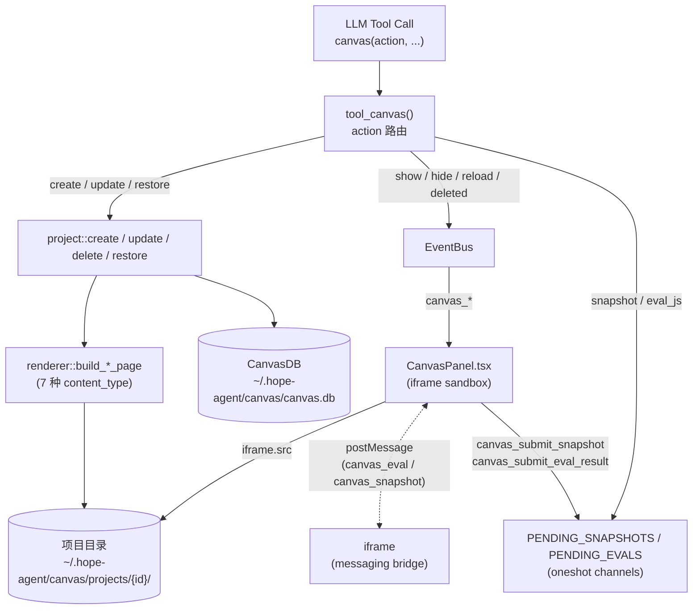
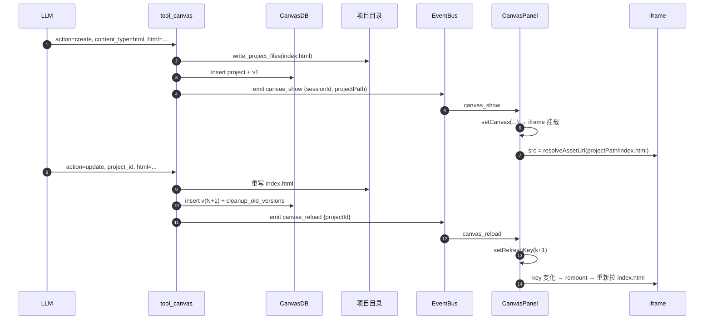
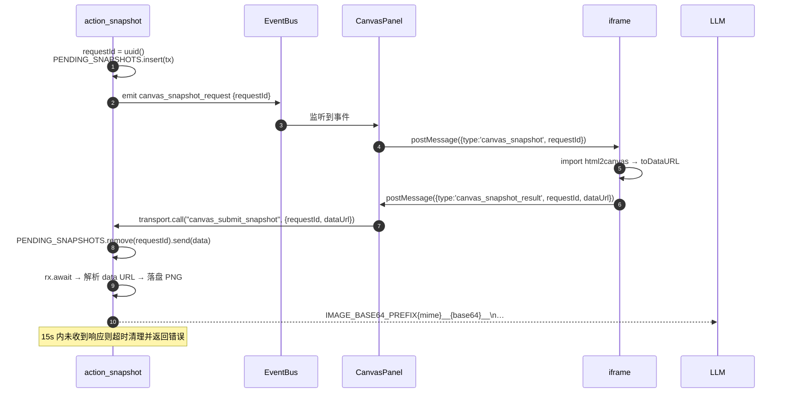

# Canvas 子系统架构文档

> 返回 [文档索引](../README.md)
>
> 更新时间：2026-04-29

## 目录

- [概述](#概述)（含系统架构总览图）
- [核心概念](#核心概念)
- [数据模型与持久化](#数据模型与持久化)
- [工具入口与 11 个动作](#工具入口与-11-个动作)
- [内容类型与渲染管线](#内容类型与渲染管线)
- [事件流](#事件流)（含时序图）
- [Snapshot / Eval 双向通道](#snapshot--eval-双向通道)
- [前端 CanvasPanel 架构](#前端-canvaspanel-架构)
- [HTTP 路由与 Tauri 命令对照](#http-路由与-tauri-命令对照)
- [配置项](#配置项)
- [安全设计](#安全设计)
- [已知限制与边界](#已知限制与边界)
- [文件清单](#文件清单)

---

## 概述

Canvas 是 Hope Agent 的**交互式可视化沙盒**：模型通过 `canvas` 工具创建/更新一个独立的 HTML 项目，前端在右侧面板用 `<iframe sandbox="allow-scripts">` 实时预览。整个子系统围绕「**项目 + 版本快照 + 沙盒 iframe + 双向 postMessage 通道**」四件套展开，覆盖 7 种内容类型（HTML / Markdown / Code / SVG / Mermaid / Chart.js / Slides），并提供版本历史、可视化截图、JS 远程求值、单独窗口分离等高级能力。

设计原则：

1. **后端是文件生成器，前端是渲染器**：所有 7 种内容类型在 Rust 端被 `renderer` 模块编译为完整的 `index.html`（含必要的 CDN 脚本与 messaging bridge），前端只负责 `<iframe>` 加载与事件桥接，不参与模板拼装
2. **session-aware 事件**：`canvas_show` 事件 payload 带 `sessionId`，前端只接受当前会话的事件，避免 cron / 子 Agent / IM 渠道触发的画布跨会话乱跳
3. **沙盒强制**：iframe 只开 `allow-scripts`，无法访问父窗口；HTTP 服务静态文件路径走 `contained_canonical()` 双重校验
4. **零 Tauri 依赖**：`tools/canvas/` 与 `canvas_db.rs` 全在 `ha-core`，桌面壳与 server 各自做薄壳适配；分离窗口（detach）走 `WebviewWindow` 是 Tauri-only 的能力，HTTP 模式自动隐藏按钮



---

## 核心概念

| 概念 | 定义 | 生命周期 |
| --- | --- | --- |
| **Project** | 一个画布项目，由 UUID 标识，对应一个磁盘目录与一行 DB 记录 | `create` 创建 → `update` 累加版本 → `delete` 物理删除 |
| **Version** | 一次 `update` / `restore` 产生的快照，存源代码（html / css / js / content） | 永远递增；超过 `maxVersionsPerProject` 时按版本号倒序保留最新 N 条 |
| **Content Type** | 7 种渲染模式：`html` / `markdown` / `code` / `svg` / `mermaid` / `chart` / `slides` | 一个 project 的 content_type 在 `create` 时确定，后续 `update` 不能改 |
| **Project Path** | 项目目录绝对路径（`~/.hope-agent/canvas/projects/{id}/`），事件 payload 与 `CanvasProjectView` 都会附带 | 后端每次返回前现算，前端不缓存 |
| **Pending Request** | snapshot / eval_js 这两个动作的「等待前端响应」状态机，用 `tokio::oneshot::channel` 表达 | 工具发起时插入 `HashMap`；前端回调或超时后移除 |

每个 project 都和**会话 / Agent** 弱绑定：

- `session_id` / `agent_id` 在 `create` 时从 `ToolExecContext` 取，写入 `canvas_projects` 表，但不是外键也不会级联——会话被删除后画布仍然孤立保留（设计选择，便于跨会话复用）
- 前端 `list_canvas_projects_by_session` 在切会话时查这张表，自动恢复"该会话最近一次画布"

---

## 数据模型与持久化

### 目录布局

```
~/.hope-agent/
└── canvas/
    ├── canvas.db                       # SQLite (WAL + foreign_keys=ON)
    └── projects/
        └── {project-uuid}/
            ├── index.html              # renderer 生成（每次 create/update/restore 全量重写）
            ├── style.css               # 用户传入的 css，原样保留（可选）
            ├── script.js               # 用户传入的 js，原样保留（可选）
            ├── content.{ext}           # markdown→md / svg→svg / chart→json / mermaid→mmd / code→{language}
            └── snapshot_YYYYMMDD_HHMMSS.png   # 每次 snapshot 动作落盘的 PNG
```

路径解析入口集中在 [`crates/ha-core/src/paths.rs:255-268`](../../crates/ha-core/src/paths.rs#L255-L268)：

- `canvas_dir()` → `~/.hope-agent/canvas/`
- `canvas_projects_dir()` → `…/canvas/projects/`
- `canvas_project_dir(id)` → `…/canvas/projects/{id}/`

### SQLite 表结构

定义在 [`crates/ha-core/src/canvas_db.rs:74-105`](../../crates/ha-core/src/canvas_db.rs#L74-L105)：

```sql
CREATE TABLE canvas_projects (
    id TEXT PRIMARY KEY,                -- UUID v4
    title TEXT NOT NULL,
    content_type TEXT NOT NULL DEFAULT 'html',
    session_id TEXT,                    -- 弱引用，无 FK
    agent_id TEXT,                      -- 弱引用，无 FK
    created_at TEXT NOT NULL,           -- RFC3339
    updated_at TEXT NOT NULL,
    version_count INTEGER DEFAULT 1,    -- 当前最大 version_number，新增 update 时 +1
    metadata TEXT                       -- 预留 JSON 字段
);

CREATE TABLE canvas_versions (
    id INTEGER PRIMARY KEY AUTOINCREMENT,
    project_id TEXT NOT NULL REFERENCES canvas_projects(id) ON DELETE CASCADE,
    version_number INTEGER NOT NULL,
    message TEXT,                       -- 可选 commit 信息
    html TEXT, css TEXT, js TEXT,       -- 源码快照（4 列同时存，便于 restore）
    content TEXT,                       -- 非 html 类型的纯文本快照
    created_at TEXT NOT NULL,
    UNIQUE(project_id, version_number)
);

CREATE INDEX idx_canvas_versions_project    ON canvas_versions(project_id, version_number DESC);
CREATE INDEX idx_canvas_projects_session    ON canvas_projects(session_id, updated_at DESC);
```

**设计要点：**

- **快照式版本**：每次 update 把当前的 html/css/js/content 全量复制到一行 `canvas_versions`，restore 直接从该行重写文件——无 diff 也无引用计数，存储换简单
- **`version_count` 是逻辑游标**：等于该项目最大的 `version_number`，新版本号 = `version_count + 1`，prune 旧版本时不影响这个值（保证 restore 能命中已经被剪掉的历史 ID 也只是返回 `Version not found` 而不是错位）
- **`session_id` 弱引用**：会话删除时不会级联到画布（`delete_session` 在 `session/db.rs` 里只 cascade 学习事件 / subagent_runs / acp_runs 三张表），因此画布会孤立保留，需要用户手动 delete
- **`ON DELETE CASCADE`** 仅作用于 `versions` → `projects`：删项目自动清版本表，避免脏行

### 数据库 Mutex

`CanvasDB` 用一个进程内 `Mutex<rusqlite::Connection>` 串行所有 SQL，全部 lock 失败时 fallback 到 `into_inner()`（防 poisoned）。这是**单进程单连接**的简化选择：写量低、并发受限于 LLM tool loop 串行节奏，没必要上 r2d2 池。

---

## 工具入口与 11 个动作

工具定义在 [`crates/ha-core/src/tools/definitions/extra_tools.rs:74-141`](../../crates/ha-core/src/tools/definitions/extra_tools.rs#L74-L141)：`internal: true`（恒不需审批）、`async_capable: false`（同步执行）、`deferred: false`（始终随核心工具集加载）。入口函数 [`tool_canvas`](../../crates/ha-core/src/tools/canvas/mod.rs#L115-L138) 按 `action` 字段路由到 11 个子函数。

| Action | 必填参数 | 写入 DB / 文件 | 触发事件 | 返回值 |
| --- | --- | --- | --- | --- |
| `create` | （可选）`content_type` | ✅ 项目行 + v1 版本 + 文件 | `canvas_show`（如 `auto_show=true`） | `{ project_id, title, version: 1 }` |
| `update` | `project_id` | ✅ 新版本 + 重写文件 + prune | `canvas_reload` | `{ project_id, version }` |
| `show` | `project_id` | — | `canvas_show` | `{ status: "shown" }` |
| `hide` | — | — | `canvas_hide`（空 payload） | `{ status: "hidden" }` |
| `list` | — | — | — | `{ count, projects: [...] }` |
| `delete` | `project_id` | ✅ 删项目（级联版本）+ rm 目录 | `canvas_deleted` | `{ status: "deleted" }` |
| `versions` | `project_id` | — | — | `{ versions: [{version_number, message, created_at}] }` |
| `restore` | `project_id`, `version_id` | ✅ 新版本（标注 "Restored from version N"）+ 重写文件 | `canvas_reload` | `{ restored_from_version, current_version }` |
| `snapshot` | `project_id` | ✅ 落盘 PNG | `canvas_snapshot_request`（带 `requestId`） | `IMAGE_BASE64_PREFIX{mime}__{base64}__\n…` |
| `eval_js` | `project_id`, `js` | — | `canvas_eval_request`（带 `requestId`） | `{ status: "ok", result }` 或 `{ status: "error", error }` |
| `export` | `project_id`, `format` | — | — | `{ format, path, content / content_length }` |

**关键不变量：**

- **content_type 不可变**：`update` / `restore` 不接受 `content_type` 参数，强制沿用 `create` 时的设置（[`tools/canvas/project.rs:84-92`](../../crates/ha-core/src/tools/canvas/project.rs#L84-L92)）。如果 LLM 要换类型只能 `delete` + `create`
- **restore 不是回退**：是从历史版本生成一个**新**的 v(N+1)，原版本 1..N 都不动；这样 prune 只看 `version_number` 倒序数 N，不会因为 restore 把"曾经的最新版"挤出窗口
- **snapshot 的返回值**走 [`IMAGE_BASE64_PREFIX`](../../crates/ha-core/src/tools/browser/mod.rs)（与 browser 截图共用）；工具执行层会在普通会话里把内联图片 marker 物化为受管 `__IMAGE_FILE__`，Provider 请求前再作为多模态 image 输入
- **export 的 PNG 格式**未实现：tool schema 列了 `enum: ["html", "markdown", "png"]` 但 `action_export` 只处理 html / markdown 两个分支，传 png 会 `Unsupported export format` 报错

### 创建路径详解

```
LLM tool_call → action_create
  ├─ get_canvas_db()                        # 懒打开（含 mkdir parent）
  ├─ project::create_project(...)           # tools/canvas/project.rs:11-60
  │   ├─ uuid::new_v4()                     # 生成 project_id
  │   ├─ paths::canvas_project_dir(id)
  │   ├─ renderer::write_project_files(...) # 按 content_type 编译 index.html
  │   ├─ db.create_project(&CanvasProject)  # 插入项目行
  │   └─ db.create_version(&v1)             # 写 v1（message: "Initial version"）
  ├─ app_info!("tool", "canvas", ...)
  ├─ if cached_config().canvas.auto_show:
  │     emit_canvas_event("canvas_show", build_show_payload(..., session_id))
  └─ Ok(json{ status, project_id, version: 1, message })
```

**`build_show_payload`** 把 `session_id` 嵌进去（[`tools/canvas/mod.rs:98-111`](../../crates/ha-core/src/tools/canvas/mod.rs#L98-L111)），前端用它过滤跨会话事件——cron 触发的 canvas_show 不会让用户当前会话弹出别人的画布。

---

## 内容类型与渲染管线

`renderer::write_project_files()` 是分发入口（[`tools/canvas/renderer.rs:267-310`](../../crates/ha-core/src/tools/canvas/renderer.rs#L267-L310)），按 `content_type` 字符串分发到 7 个 `build_*_page` 函数，全部产出**自包含**的完整 HTML 字符串，写入 `index.html`。

| content_type | 渲染策略 | 外部依赖（CDN） | 用户提供字段 |
| --- | --- | --- | --- |
| `html` | 用户 HTML/CSS/JS 包裹在最小骨架 + messaging bridge | 无（messaging bridge 用 dynamic `import()` 拉 html2canvas，仅 snapshot 时用） | `html` / `css` / `js` |
| `markdown` | `marked.min.js` 解析后注入 `#content`；反引号与 `${` 转义 | `cdn.jsdelivr.net/npm/marked` | `content` |
| `code` | `highlight.js` 自动高亮，HTML 实体编码源码 | `cdn.jsdelivr.net/npm/highlight.js@11`（含 github.min.css） | `content`, `language` |
| `svg` | 直接内嵌（**不转义**——假设来源可信） | 无 | `content`（完整 SVG 文档） |
| `mermaid` | `mermaid.initialize({startOnLoad: true})`，反引号转义 | `cdn.jsdelivr.net/npm/mermaid` | `content`（mermaid 源码） |
| `chart` | `Chart.js`，`new Chart(canvas, {content})`；解析失败兜底渲染红色错误信息 | `cdn.jsdelivr.net/npm/chart.js` | `content`（Chart.js config JSON） |
| `slides` | 自带 SPA 演示框架：`<section>` 列表，`←/→/Space` 切换，鼠标点击左右半屏切换，右下角页码 | 无 | `html`（多个 `<section>`）, `css` |

### 共用 messaging bridge（仅 `html` / `slides` 注入）

[`tools/canvas/renderer.rs:25-47`](../../crates/ha-core/src/tools/canvas/renderer.rs#L25-L47)：

```javascript
window.addEventListener('message', function(event) {
  if (event.data.type === 'canvas_eval') {
    try { var result = eval(event.data.code);
      parent.postMessage({type:'canvas_eval_result', requestId, result: String(result)}, '*');
    } catch(e) { parent.postMessage({type:'canvas_eval_result', requestId, error: e.message}, '*'); }
  }
  if (event.data.type === 'canvas_snapshot') {
    import('https://html2canvas.hertzen.com/dist/html2canvas.min.js').then(function() {
      html2canvas(document.body).then(function(canvas) {
        parent.postMessage({type:'canvas_snapshot_result', requestId,
                            dataUrl: canvas.toDataURL('image/png')}, '*');
      });
    }).catch(function() {
      parent.postMessage({type:'canvas_snapshot_result', requestId,
                          error: 'html2canvas not available'}, '*');
    });
  }
});
```

**注意**：`markdown` / `code` / `svg` / `mermaid` / `chart` 五个模板**没有**注入这段桥接代码——这意味着对它们调 `eval_js` / `snapshot` 会因 iframe 不响应消息而 10s/15s 超时。这是当前实现的**已知边界**，文末会再列出。

### 源文件保留策略

[`tools/canvas/renderer.rs:290-307`](../../crates/ha-core/src/tools/canvas/renderer.rs#L290-L307)：除了生成 `index.html`，还会**原样**写出用户提供的源（如果有）：

- `css` → `style.css`
- `js` → `script.js`
- `content` → `content.{ext}`，扩展名按 content_type 派生（`md` / `svg` / `json` / `mmd` / `{language}` / `txt`）

这些文件**不参与**渲染（index.html 已经把它们 inline 进去了），纯粹给 `export` 动作或人工排查用。版本表 `canvas_versions` 也存了同样的源码，二者冗余。

---

## 事件流

所有 canvas 事件走 `EventBus`（[`crate::globals::get_event_bus()`](../../crates/ha-core/src/globals.rs)），桌面壳与 server 各自订阅、各自转发到自己的前端通道。

### 事件目录

| 事件名 | 触发场景 | Payload | 前端反应 |
| --- | --- | --- | --- |
| `canvas_show` | `create` 且 `auto_show=true` / `show` action / 桌面命令 `show_canvas_panel` | `{projectId, title, contentType, projectPath, sessionId}` | 渲染 iframe；`sessionId` 不匹配则丢弃 |
| `canvas_hide` | `hide` action | `{}` | 关闭 iframe（`setCanvas(null)`） |
| `canvas_reload` | `update` / `restore` action | `{projectId}` | 若与当前 canvas 同 ID，递增 `refreshKey` 触发 iframe remount |
| `canvas_deleted` | `delete` action | `{projectId}` | 若与当前 canvas 同 ID，关闭 |
| `canvas_snapshot_request` | `snapshot` action | `{projectId, requestId}` | 向 iframe `postMessage({type:'canvas_snapshot', requestId})` |
| `canvas_eval_request` | `eval_js` action | `{projectId, requestId, code}` | 向 iframe `postMessage({type:'canvas_eval', requestId, code})` |

### 跨会话事件过滤

`canvas_show` 是唯一带 `sessionId` 的事件（其余事件按 `projectId` 过滤即可，`projectId` 已经隐含 session 归属）。前端在 [`CanvasPanel.tsx:163-176`](../../src/components/chat/CanvasPanel.tsx#L163-L176)：

```typescript
getTransport().listen("canvas_show", (raw) => {
  const data = parsePayload<CanvasShowPayload>(raw)
  // 过滤其它会话（cron / IM / subagent 工具调用）
  if (data.sessionId && data.sessionId !== currentSessionIdRef.current) return
  setCanvas(toCanvasInfo(data))
})
```

`currentSessionIdRef` 是个 ref，避免在每次会话切换时重订阅事件。**老 payload 兼容**：缺 `sessionId` 字段直接放行，保证 `canvas_db.rs` 历史数据 / 旧版本服务端事件仍能弹出。

### 历史会话恢复

后端只在 LLM **主动**调 canvas 工具时发 `canvas_show` 事件——切到一个老会话不会自动触发。[`CanvasPanel.tsx:127-156`](../../src/components/chat/CanvasPanel.tsx#L127-L156) 的 effect 在 `currentSessionId` 变化时主动调 `list_canvas_projects_by_session`，取**最新一条**项目（按 `updated_at DESC`）作为该会话的"上次画布"恢复显示。无项目则 `setCanvas(null)`。

### 完整时序：create → show → update → reload



---

## Snapshot / Eval 双向通道

snapshot 与 eval_js 是**对称的请求-响应**模式：工具发起请求 → 前端转发给 iframe → iframe 处理后 postMessage 回前端 → 前端调 `canvas_submit_*` 唤醒后端等待者。

### 后端注册等待者

[`tools/canvas/mod.rs:601-625`](../../crates/ha-core/src/tools/canvas/mod.rs#L601-L625) 维护两个进程级 `LazyLock<StdMutex<HashMap<requestId, oneshot::Sender<...>>>>`：

```rust
static PENDING_SNAPSHOTS: LazyLock<…HashMap<String, oneshot::Sender<SnapshotData>>…>;
static PENDING_EVALS:     LazyLock<…HashMap<String, oneshot::Sender<EvalResult>>…>;
```

`action_snapshot` / `action_eval_js` 的标准流程（[`tools/canvas/mod.rs:386-528`](../../crates/ha-core/src/tools/canvas/mod.rs#L386-L528)）：

```rust
let request_id = Uuid::new_v4().to_string();
let rx = {
    let (tx, rx) = oneshot::channel();
    PENDING_SNAPSHOTS.lock().insert(request_id.clone(), tx);
    rx
};  // 注意：MutexGuard 在 .await 前 drop
emit_canvas_event("canvas_snapshot_request", json!({projectId, requestId}));
match tokio::time::timeout(Duration::from_secs(15), rx).await {
    Ok(Ok(data)) => /* 落盘 PNG，返回 IMAGE_BASE64_PREFIX… */,
    Ok(Err(_))   => /* channel 被 cancel */,
    Err(_)       => {
        PENDING_SNAPSHOTS.lock().remove(&request_id);  // 超时自清
        /* 返回 timeout error */
    }
}
```

**关键正确性细节：**

1. **MutexGuard 在 `.await` 之前 drop**：用块表达式把 `lock()` 限在内层作用域，避免 `Send` 边界 / 死锁
2. **超时自清**：超时后必须从 `HashMap` 移除条目，否则前端迟到的响应会复活已经返回错误的工具调用
3. **`lock().unwrap_or_else(|e| e.into_inner())`**：StdMutex 在 panic 后会 poisoned，工程上选择继续用而非崩溃——画布是边缘功能，不能阻塞主对话

### 前端转发

[`CanvasPanel.tsx:81-109`](../../src/components/chat/CanvasPanel.tsx#L81-L109) 的 `handleSnapshotRequest` / `handleEvalRequest`：

```typescript
const handleSnapshotRequest = useCallback((requestId: string) => {
  const iframe = iframeRef.current
  if (!iframe?.contentWindow) {
    // 面板未打开或 iframe 未加载完，立刻报错
    getTransport().call("canvas_submit_snapshot",
      { requestId, dataUrl: null, error: "Canvas panel is not open or iframe not loaded" })
    return
  }
  iframe.contentWindow.postMessage({ type: "canvas_snapshot", requestId }, "*")
}, [])
```

iframe 的 messaging bridge 处理后回传：

```typescript
window.addEventListener("message", (event) => {
  if (event.data.type === "canvas_snapshot_result") {
    getTransport().call("canvas_submit_snapshot", {
      requestId: event.data.requestId,
      dataUrl: event.data.dataUrl ?? null,
      error: event.data.error ?? null,
    })
  }
  if (event.data.type === "canvas_eval_result") { /* 类似 */ }
})
```

后端入口 [`canvas_submit_snapshot`](../../crates/ha-core/src/tools/canvas/mod.rs#L612-L625) 查 `HashMap` 取出 `oneshot::Sender` 并 `tx.send()`，`action_snapshot` 的 `rx.await` 即唤醒。

### 时序



**超时常数**：snapshot 15s（要等 html2canvas 拉 CDN），eval_js 10s（纯 JS 没有外部 IO）。

---

## 前端 CanvasPanel 架构

### 状态机

```typescript
interface CanvasInfo {
  projectId: string
  title: string
  contentType: string
  projectPath?: string  // 后端已 resolve 的绝对路径
}

const [canvas, setCanvas]         = useState<CanvasInfo | null>(null)
const [maximized, setMaximized]   = useState(false)
const [detached, setDetached]     = useState(false)
const [refreshKey, setRefreshKey] = useState(0)

const iframeRef          = useRef<HTMLIFrameElement>(null)
const detachedWindowRef  = useRef<WebviewWindow | null>(null)
const currentSessionIdRef = useRef<string | null>(currentSessionId)
```

`canvas == null` 时整个组件直接返回 `null`（不占位），布局由 `flex shrink-0` + `width: panelWidth` 控制；可见时是 380~960px 范围内可拖拽宽度，max 不超过窗口 55%。

### 三种视图状态

| 状态 | 渲染 | 控件 |
| --- | --- | --- |
| **inline**（默认） | 右侧面板，圆角卡片，含 iframe | refresh / pop-out / maximize / close |
| **maximized** | `fixed inset-0 z-50`，遮盖整个视口 | refresh / pop-out / minimize / close |
| **detached**（仅 Tauri） | 主面板缩成占位条，iframe 由独立 `WebviewWindow` 承载 | reattach / close |

`maximized` 与 `detached` 是 transient UI 状态，**会话切换时强制清零**（[`CanvasPanel.tsx:74-79`](../../src/components/chat/CanvasPanel.tsx#L74-L79)）。这是为了避免"在 A 会话最大化 → 切到 B 会话 → 还是最大化"的体验割裂。实现走 React 19 的"render-phase prev-prop tracking"模式（不在 effect 里 setState，避免 `react-hooks/set-state-in-effect` lint）。

### iframe URL 解析

```typescript
const indexPath = canvas.projectPath ? `${canvas.projectPath}/index.html` : ""
const iframeSrc = indexPath ? (getTransport().resolveAssetUrl(indexPath) ?? "") : ""
```

`resolveAssetUrl` 是 Transport 抽象的核心方法，两种模式不同：

- **Tauri**：调 `convertFileSrc` 转成 `asset://localhost/{escaped-path}`
- **HTTP**：[`transport-http.ts:885-895`](../../src/lib/transport-http.ts#L885-L895) 用正则匹配 `…/canvas/projects/{id}/{rest}`，重写为 `{baseUrl}/api/canvas/projects/{id}/{rest}?token=...`，附加 Bearer token query 参数（浏览器 iframe 不支持自定义 header）

### iframe 沙盒

```html
<iframe
  ref={iframeRef}
  key={`${canvas.projectId}-${refreshKey}`}
  src={iframeSrc}
  sandbox="allow-scripts"
  className="w-full h-full border-0"
/>
```

- `sandbox="allow-scripts"`：允许 JS 执行，但默认不允许同源访问父窗口、表单提交、弹窗、cookie——画布脚本如果想跟主应用通信，**只能**通过 postMessage
- `key={projectId-refreshKey}`：`canvas_reload` 事件递增 `refreshKey` 触发 React 完全 remount iframe（而非只换 src），确保任何缓存的 JS 状态被清掉

### Tauri 窗口尺寸联动

[`CanvasPanel.tsx:112-120`](../../src/components/chat/CanvasPanel.tsx#L112-L120)：

```typescript
useEffect(() => {
  if (!isTauriMode()) return
  const win = getCurrentWindow()
  if (canvas && !detached) {
    win.setMinSize(new LogicalSize(1280, 480))   // 有画布占用右半屏，主窗口必须够宽
  } else {
    win.setMinSize(new LogicalSize(840, 480))    // 无画布或独立窗口，恢复默认下限
  }
}, [canvas, detached])
```

### Detach（独立窗口）

仅 Tauri 模式可用，`isTauriMode()` 为 false 时 pop-out 按钮不渲染。点击后：

1. 关闭已有 detachedWindow（如果有）
2. `new WebviewWindow("canvas-window", { url: iframeSrc, ... })`
3. 监听 `tauri://created` / `tauri://error` / `tauri://destroyed` 三个生命周期事件维护 `detachedWindowRef`

副作用清理：[`CanvasPanel.tsx:287-293`](../../src/components/chat/CanvasPanel.tsx#L287-L293) 在 `canvas` 变 null 时（包括会话切换 / `canvas_deleted` 事件 / 手动关闭）自动 close 独立窗口。

### 与 PlanPanel / DiffPanel 的关系

[`ChatScreen.tsx:1018-1025`](../../src/components/chat/ChatScreen.tsx#L1018-L1025) 的注释说明三个右侧面板"在视觉层面互斥"，但代码层并不严格隔离：

- **DiffPanel** 打开时强制 `planMode.setShowPanel(false)` 关闭 PlanPanel（写在 effect 里）
- **CanvasPanel** 不与任何面板互斥——它由 LLM 主动调工具触发，与 Plan / Diff 走完全不同的事件流

实践中三者并存的概率低（LLM 一次只在一个模态里工作），布局上 `flex shrink-0` 加上各自 `max-w-[55%]` 也保证了不会挤爆主对话区。

---

## HTTP 路由与 Tauri 命令对照

每个能力都同时暴露 Tauri IPC（桌面）与 HTTP（server）两套接口，业务逻辑统一在 `ha_core::tools::canvas` 提供的 `pub async` 函数里。

| 能力 | Tauri 命令 | HTTP 路由 | Transport key |
| --- | --- | --- | --- |
| 列出所有项目 | `list_canvas_projects` | `GET /api/canvas/projects` | `list_canvas_projects` |
| 取单个项目 | `get_canvas_project` | `GET /api/canvas/projects/{projectId}` | `get_canvas_project` |
| 删除项目 | `delete_canvas_project` | `DELETE /api/canvas/projects/{projectId}` | `delete_canvas_project` |
| 列出会话下的项目 | `list_canvas_projects_by_session` | `GET /api/canvas/by-session/{sessionId}` | `list_canvas_projects_by_session` |
| 显示画布面板 | `show_canvas_panel` | `POST /api/canvas/show`（server 模式 no-op） | `show_canvas_panel` |
| 提交 snapshot 结果 | `canvas_submit_snapshot` | `POST /api/canvas/snapshot/{requestId}` | `canvas_submit_snapshot` |
| 提交 eval 结果 | `canvas_submit_eval_result` | `POST /api/canvas/eval/{requestId}` | `canvas_submit_eval_result` |
| 读取配置 | `get_canvas_config` | `GET /api/config/canvas` | `get_canvas_config` |
| 写入配置 | `save_canvas_config` | `PUT /api/config/canvas` | `save_canvas_config` |
| **静态文件托管** | （Tauri 用 `asset://` 协议直读 `~/.hope-agent`） | `GET /api/canvas/projects/{projectId}/{*rest}` | （iframe 直接走 URL） |

注册位置：

- Tauri：[`src-tauri/src/lib.rs:498-507`](../../src-tauri/src/lib.rs#L498-L507) 的 `invoke_handler!`，包装在 `src-tauri/src/tauri_wrappers.rs:65-121`
- HTTP：[`crates/ha-server/src/lib.rs:1144-1170`](../../crates/ha-server/src/lib.rs#L1144-L1170)，配置路由 [`672-673`](../../crates/ha-server/src/lib.rs#L672-L673)，处理逻辑 [`routes/canvas.rs`](../../crates/ha-server/src/routes/canvas.rs)
- Transport HTTP 映射：[`src/lib/transport-http.ts:107-109, 328-333`](../../src/lib/transport-http.ts#L107-L109)

### 静态文件路由的资产托管

HTTP 模式下 iframe 不能直接读 `~/.hope-agent/canvas/projects/...`，必须走 server 转发。[`routes/canvas.rs:108-146`](../../crates/ha-server/src/routes/canvas.rs#L108-L146) 用 `tower_http::services::ServeFile` 实现：

```rust
pub async fn serve_canvas_project_file(
    Path((project_id, rest)): Path<(String, String)>,
    request: Request,
) -> Result<Response, AppError> {
    validate_canvas_project_id(&project_id)?;     // 严格白名单
    validate_safe_rest_path(&rest)?;              // 拒绝 `..` / 反斜杠
    let base_dir = paths::canvas_project_dir(&project_id)?;
    let candidate = base_dir.join(&rest);
    let file_canon = contained_canonical(&base_dir, &candidate).await?;  // canonicalize 后必须仍在 base 之内
    let mime = resolve_mime_for_path(&file_canon, MimeOpts { html_charset: true, sniff_fallback: false });
    let mut response = ServeFile::new(&file_canon).oneshot(request).await?.into_response();
    apply_inline_media_headers(&mut response, HeaderOpts {
        mime: &mime,
        cache_secs: 60,
        disposition: "inline",
        no_referrer: true,
    });
    Ok(response)
}
```

三道安全闸门：

1. `validate_canvas_project_id`：`^[A-Za-z0-9_-]{1,128}$` 严格 ASCII 白名单（[`routes/canvas.rs:151-162`](../../crates/ha-server/src/routes/canvas.rs#L151-L162)）
2. `validate_safe_rest_path`：拒绝 `..` 段、反斜杠等
3. `contained_canonical`：`canonicalize()` 后断言路径仍在 `base_dir` 子树内，挡住符号链接逃逸

附带 HTTP header：

- `Cache-Control: public, max-age=60`（让浏览器短期缓存，减轻 reload 风暴）
- `Content-Disposition: inline`（直接 iframe 渲染而非下载）
- `Referrer-Policy: no-referrer`（防止 CDN 脚本拿到内部 URL）

---

## 配置项

`AppConfig.canvas` 是 [`tools::canvas::CanvasConfig`](../../crates/ha-core/src/tools/canvas/mod.rs#L17-L62) 的实例，挂在 [`config/mod.rs`](../../crates/ha-core/src/config/mod.rs) 的 `pub canvas` 字段上，随主配置一起 cache。

| 字段 | 默认 | 含义 | 风险等级 |
| --- | --- | --- | --- |
| `enabled` | `true` | 全局开关，关闭后工具仍可调用但行为退化 | LOW |
| `auto_show` | `true` | `create` 后是否自动 emit `canvas_show`（关闭后 LLM 需显式 `show`） | LOW |
| `default_content_type` | `"html"` | 工具调用未传 `content_type` 时的兜底（**当前代码已直接 hard-code `"html"`**） | LOW |
| `max_projects` | `100` | 预留容量上限（**当前代码未消费**，未实现自动 prune） | LOW |
| `max_versions_per_project` | `50` | 单项目保留的版本数，超出时按 `version_number DESC` 保留前 N | LOW |
| `panel_width` | `480` | 面板默认宽度（前端 `useState` 初始值，目前从此值同步与否取决于 `ChatScreen`） | LOW |

读写：

- 读：`crate::config::cached_config().canvas`（运行期全部点都走这条，零 IO）
- 写：[`save_canvas_config`](../../crates/ha-core/src/tools/canvas/mod.rs#L651-L655) 走 `load_config()` + `save_config()` 老 API ——这与 [配置系统](config-system.md) 推荐的 `mutate_config` 不一致，属于已知技术债，建议后续迁移以避免 lost-update。

按 [AGENTS.md "设置约定"](../../AGENTS.md) 的要求，新增的配置字段必须**同时**有 GUI 入口、`ha-settings` 工具分支与 SKILL.md 风险登记。Canvas 当前 GUI 在 [`CanvasSettingsPanel.tsx`](../../src/components/settings/CanvasSettingsPanel.tsx) 已齐全。

---

## 安全设计

| 风险 | 缓解 |
| --- | --- |
| **画布脚本访问主应用 DOM / cookie** | iframe `sandbox="allow-scripts"`，没有 `allow-same-origin`——画布即便加载第三方 CDN 脚本也碰不到 `localStorage` / 主域 cookie / 父窗口 |
| **路径穿越读到 `~/.hope-agent/credentials/auth.json`** | `validate_canvas_project_id` 白名单 + `validate_safe_rest_path` 拒 `..` + `contained_canonical` canonicalize 后再次断言子树包含 |
| **HTTP 模式 token 泄漏给 CDN** | 静态资源响应附 `Referrer-Policy: no-referrer`；token 走 query 参数而非 fragment，但 CDN 也只看到 referer，不会拿到 URL |
| **`eval_js` 任意代码执行** | 仅在 sandbox iframe 内 `eval`，触不到主应用与 Tauri runtime；返回值 `String(result)` 强转字符串，避免 LLM 通过返回值 prototype 注入 |
| **SVG XSS（`<script>` / `onerror=`）** | `build_svg_page` 不转义 SVG 内容（接受了模型可信前提）。SVG 即便包含脚本也只在 sandbox iframe 内执行，不影响主应用 |
| **markdown 注入 `${...}` / 反引号** | `build_markdown_page` 显式转义反引号与 `${`，避免插入到模板字符串里时逃逸 |
| **iframe 加载到非项目目录的资源** | iframe 同源是 `asset://localhost` 或 server 域，相对路径请求只能命中 `/api/canvas/projects/{id}/...`，路由层再验证一遍 |
| **OAuth / API key 泄漏到 canvas content** | 由 LLM 自身的输入约束 + 主应用日志脱敏（`logging::redact_sensitive`）防御；canvas 模板本身不会主动写入凭据 |

**未做的安全检查**（设计选择，不在 canvas 范围内）：

- 画布脚本对**外网**的 fetch 不受 SSRF policy 约束——iframe 是浏览器侧出站，与 Rust 端 reqwest 走的 `security::ssrf` 完全不在一条链上；这是浏览器/WebView 自身的网络栈
- `eval_js` 不限制执行时长（除了 10s 整体超时）——画布里可以写死循环消耗 CPU，但不影响主对话

---

## 已知限制与边界

### 1. 非 HTML 模板缺 messaging bridge

`markdown` / `code` / `svg` / `mermaid` / `chart` 这 5 个 `build_*_page` 函数没有注入 [renderer.rs:25-47](../../crates/ha-core/src/tools/canvas/renderer.rs#L25-L47) 那段消息桥代码。结果：

- 对它们调用 `eval_js` 会 10s 超时返回 `"Eval timed out"`
- 对它们调用 `snapshot` 会 15s 超时返回 `"Snapshot timed out"`

实际能稳定 snapshot / eval 的只有 `html` 与 `slides`（这俩共用 `build_html_page` / `build_slides_page` 但只 `build_html_page` 注入了桥；`slides` 也是空缺）——事实上**只有 `html` 一种**。这是潜在改进方向：把桥代码抽成共享模板片段，所有 builder 拼上。

### 2. 配置字段未消费

- `max_projects: 100` 在 `CanvasConfig` 里定义但**没有任何代码消费**——project 表理论上无限增长。需要后续接 `cleanup_old_projects(keep)` 类似 versions 的剪枝
- `default_content_type: "html"` 同样未消费——`action_create` 直接 hard-code `unwrap_or("html")`

### 3. `export` 的 PNG 格式未实现

工具 schema `enum: ["html", "markdown", "png"]`，但 `action_export` 只 match `"html"` / `"markdown"`，传 `"png"` 报错 `Unsupported export format`。要支持 PNG 需复用 snapshot 的链路。

### 4. `save_canvas_config` 不走 `mutate_config`

[`tools/canvas/mod.rs:651-655`](../../crates/ha-core/src/tools/canvas/mod.rs#L651-L655) 仍是 `load_config()` + 改字段 + `save_config()` 模式，与 [配置系统](config-system.md) 强制约定不符，存在 lost-update 风险。已登记为后续清理。

### 5. session 删除不级联画布

`canvas_projects.session_id` 是弱引用（无 FK，无 cascade），删除会话不会清理对应画布。这是设计选择（保留跨会话引用价值），但意味着用户需要手动 `delete` 才能清盘。Project 级删除当前也未触达画布。

### 6. 内嵌 web GUI 模式下分离窗口不可用

`isTauriMode()` 为 false 时 pop-out 按钮直接隐藏（[`CanvasPanel.tsx:502-511`](../../src/components/chat/CanvasPanel.tsx#L502-L511)）。浏览器里要"独立窗口"得用户自己在新 tab 里直接访问 `/api/canvas/projects/{id}/index.html?token=...`。

---

## 文件清单

### 后端（ha-core）

| 文件 | 角色 |
| --- | --- |
| [`crates/ha-core/src/canvas_db.rs`](../../crates/ha-core/src/canvas_db.rs) | SQLite schema + CRUD（`CanvasDB`、`CanvasProject`、`CanvasVersion`） |
| [`crates/ha-core/src/tools/canvas/mod.rs`](../../crates/ha-core/src/tools/canvas/mod.rs) | 工具入口 `tool_canvas`、11 个 `action_*`、Pending channel 注册表、对外 API |
| [`crates/ha-core/src/tools/canvas/project.rs`](../../crates/ha-core/src/tools/canvas/project.rs) | `create_project` / `update_project` / `delete_project` / `restore_version` 业务逻辑 |
| [`crates/ha-core/src/tools/canvas/renderer.rs`](../../crates/ha-core/src/tools/canvas/renderer.rs) | 7 种 `build_*_page` 模板 + `write_project_files` 分发器 |
| [`crates/ha-core/src/tools/definitions/extra_tools.rs`](../../crates/ha-core/src/tools/definitions/extra_tools.rs) | `get_canvas_tool()` 工具 schema 定义 |
| [`crates/ha-core/src/tools/definitions/registry.rs`](../../crates/ha-core/src/tools/definitions/registry.rs) | 注册到 internal / async-capable 集合 |
| [`crates/ha-core/src/paths.rs`](../../crates/ha-core/src/paths.rs)（253-268 行） | `canvas_dir` / `canvas_projects_dir` / `canvas_project_dir` |
| [`crates/ha-core/src/config/mod.rs`](../../crates/ha-core/src/config/mod.rs) | `AppConfig.canvas` 字段挂载 |

### 后端（ha-server / src-tauri）

| 文件 | 角色 |
| --- | --- |
| [`crates/ha-server/src/routes/canvas.rs`](../../crates/ha-server/src/routes/canvas.rs) | HTTP 路由处理器（含静态文件托管 + ID 校验单测） |
| [`crates/ha-server/src/lib.rs`](../../crates/ha-server/src/lib.rs)（1144-1170 行） | 路由注册 |
| [`crates/ha-server/src/routes/config.rs`](../../crates/ha-server/src/routes/config.rs) | `get_canvas_config` / `save_canvas_config` 配置路由 |
| [`src-tauri/src/tauri_wrappers.rs`](../../src-tauri/src/tauri_wrappers.rs)（65-121 行） | Tauri IPC 薄壳 |
| [`src-tauri/src/lib.rs`](../../src-tauri/src/lib.rs)（498-507 行） | `invoke_handler!` 注册 |

### 前端

| 文件 | 角色 |
| --- | --- |
| [`src/components/chat/CanvasPanel.tsx`](../../src/components/chat/CanvasPanel.tsx) | 主面板组件（iframe + maximize / detach / refresh / close） |
| [`src/components/settings/CanvasSettingsPanel.tsx`](../../src/components/settings/CanvasSettingsPanel.tsx) | 设置 GUI（开关 + 限制 + 默认类型） |
| [`src/components/chat/ChatScreen.tsx`](../../src/components/chat/ChatScreen.tsx)（1018-1024、1376-1380 行） | 与 PlanPanel / DiffPanel 的视觉互斥规则、面板挂载 |
| [`src/lib/transport-http.ts`](../../src/lib/transport-http.ts) | HTTP 模式下的命令路径映射 + iframe URL 重写正则 |

### 相关参考文档

- [工具系统](tool-system.md)：四维权限模型与 internal tool 概念
- [配置系统](config-system.md)：`cached_config` / `mutate_config` contract（canvas 当前未遵守）
- [API 参考](api-reference.md)：Canvas 段（127-132 行事件、278-280 行 CRUD、528-537 行 IPC↔HTTP 对照）
- [Transport 运行模式](transport-modes.md)：`resolveAssetUrl` 在 Tauri / HTTP 下的差异
