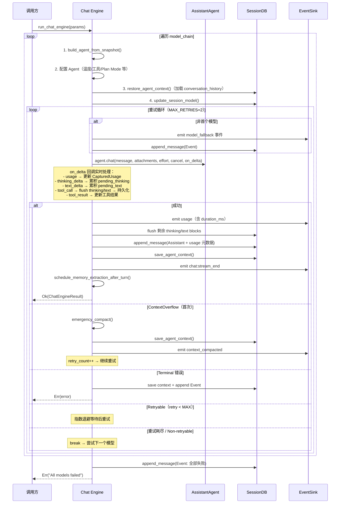
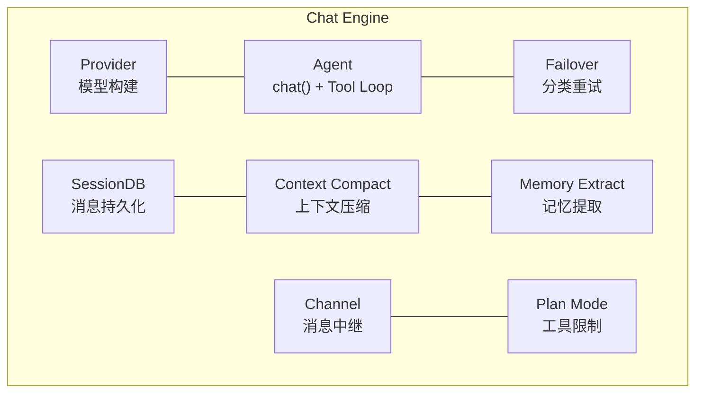

# Chat Engine 对话引擎架构

> 返回 [文档索引](../README.md) | 更新时间：2026-04-05

## 目录

- [概述](#概述)
- [模块结构](#模块结构)
- [核心类型](#核心类型)
  - [EventSink trait](#eventsink-trait)
  - [ChatEngineParams](#chatengineparams)
  - [ChatEngineResult](#chatengineresult)
  - [CapturedUsage](#capturedusage)
- [请求流程](#请求流程)
- [流式事件协议](#流式事件协议)
- [流式回调处理](#流式回调处理)
- [Stream Broadcast & Reload Recovery](#stream-broadcast--reload-recovery)
- [Turn Lifecycle & Stop Recovery](#turn-lifecycle--stop-recovery)
- [Failover 集成](#failover-集成)
- [Post-turn Effects](#post-turn-effects)
- [记忆提取门控](#记忆提取门控)
- [集成关系](#集成关系)
- [文件清单](#文件清单)

---

## 概述

Chat Engine 是 Hope Agent 的对话编排入口，统一处理来自四种来源的请求：

| 来源 | EventSink 实现 | 说明 |
|---|---|---|
| UI 聊天（桌面） | `ChannelSink`（Tauri IPC Channel，定义在 src-tauri） | 用户直接交互（桌面模式） |
| UI 聊天（HTTP） | `NoopEventSink`（定义在 ha-core）+ `chat:stream_delta` EventBus | 用户直接交互（HTTP/WS 模式）；浏览器通过 `/ws/events` 接收流 |
| IM Channel | `ChannelStreamSink`（EventBus + mpsc） | Telegram / WeChat 等渠道 |
| Cron 定时任务 | `NoopEventSink` | 定时触发的对话复用同一个 noop sink，最终结果由 Cron delivery 处理 |
| ACP 协议 | stdio 协议输出层 | IDE 直连 |

Chat Engine 本身不持有状态，所有依赖通过 `ChatEngineParams` 注入。调用方（`commands/chat.rs`、`channel/worker.rs` 等）从 `State<AppState>` 或磁盘提取参数，构建 params 后调用 `run_chat_engine()`。

## 模块结构

```
crates/ha-core/src/chat_engine/
├── mod.rs              模块声明和 re-export
├── types.rs            EventSink trait + ChatEngineParams/Result + CapturedUsage
├── context.rs          Agent 构建 + 上下文恢复/保存 + 工具事件持久化 + Channel 中继 + 记忆提取
├── engine.rs           run_chat_engine() 核心引擎
├── persister.rs        StreamPersister：流式增量累积 + flush 到 SessionDB + 工具事件落库
├── stream_broadcast.rs `chat:stream_delta` / `chat:stream_end` / `channel:stream_delta` 事件名 + 广播抽象
└── stream_seq.rs       ChatSource 枚举 + 每会话流序号注册表（重载恢复去重 cursor）
```

## 核心类型

### EventSink trait

抽象事件输出层，解耦引擎与具体输出通道：

```rust
pub trait EventSink: Send + Sync + 'static {
    fn send(&self, event: &str);
}
```

三种实现：

- **`ChannelSink`**（定义在 `src-tauri/src/commands/chat.rs`）— 包裹 `tauri::ipc::Channel<String>`，用于桌面模式 UI 直连。事件直接推送到 Tauri WebView 前端
- **`NoopEventSink`**（定义在 `crates/ha-core/src/chat_engine/types.rs`）— 丢弃所有事件。HTTP 模式、Cron 定时任务、subagent fork-and-forget 等"没有实时 UI 消费方"的入口共用此 sink；真正的浏览器流式输出由 Chat Engine 的 `chat:stream_delta` EventBus 双写路径推到 `/ws/events`
- **`ChannelStreamSink`**（定义在 `crates/ha-core/src/chat_engine/types.rs`）— 双路输出：(1) 通过 `EventBus` 发布 `channel:stream_delta` 事件推送到前端实时展示；(2) 通过 `mpsc::Sender` 转发到后台任务，驱动 IM 渠道的渐进式消息编辑（如 Telegram 消息实时更新）。`is_primary: Arc<AtomicBool>` gate 决定 (2) 是否真发到 IM——secondary observer 仅走 (1) 让 UI 渲染，不真发回 IM channel。Mid-turn 可 toggle。

### GUI ↔ IM live 流式镜像 (SinkRegistry fan-out)

GUI / HTTP 入口的 turn 在 IM attach 那一侧走 live 流式镜像：IM 用户实时看到 typewriter / per-round 边界 finalize / 媒体投递,与 IM 入站 turn 对称。实现走 [`crates/ha-core/src/chat_engine/im_mirror.rs`](../../crates/ha-core/src/chat_engine/im_mirror.rs):

- `attach_im_live_mirror(session_id, source)` —— `Desktop` / `Http` source 才返非空 state；通过 `channel_db.get_conversation_by_session(session_id)` 拿到 1:1 attach 行,获取对应 `ChannelAccountConfig.im_reply_mode()` / `show_thinking()` + plugin `capabilities()`,spawn `channel::worker::streaming::spawn_channel_stream_task`,把 `ChannelStreamSink` 注册到 [`SinkRegistry`](../../crates/ha-core/src/chat_engine/sink_registry.rs)。`emit_stream_event` 末尾的 `sink_registry().emit(session_id, &payload)` fan-out 把每帧 streaming event 转发到 IM 流式预览任务。
- `finalize_im_live_mirror(state, response)` —— drop SinkHandle(RAII 卸载 sink → 关闭 event_tx → stream task drain 后 EOF),`.await` stream task 拿 `StreamPreviewOutcome`(含 `PreviewHandle` + `finalized_rounds`),drain `RoundTextAccumulator`,按 `ImReplyMode` 复用 dispatcher 的 [`deliver_split` / `deliver_final_only` / `deliver_preview_merged`](../../crates/ha-core/src/channel/worker/dispatcher.rs)(已解耦 `MsgContext`,接受 `chat_id / thread_id / reply_to_message_id: Option<&str>` 三参显式形态)。

**两个通道独立走自己的发送通路**:GUI 永远走 Tauri IPC stream / HTTP `chat:stream_delta` 广播,不受 `imReplyMode` 影响;`imReplyMode` 仅决定 IM 端的呈现形态。

主 `event_sink`(GUI 的 `ChannelSink` / HTTP 的 `NoopEventSink`)**不入 SinkRegistry**——每消费方恰好收一次事件,SinkRegistry 只承载 fan-out 到 IM 的次级 sink。

错误 / 取消路径:engine 走 Err 不调 finalize,`ImLiveMirrorState` Drop 自动卸载 sink,IM 端保留半截 preview 与 IM 入站 cancel 行为一致。`source ∈ {Subagent, ParentInjection, Channel, Cron}` 在 attach 入口直接 no-op。

### ChatEngineParams

完整的请求参数包，调用方一次性构建：

| 分组 | 字段 | 类型 | 说明 |
|---|---|---|---|
| 基础 | `session_id` | `String` | 会话 ID |
| | `agent_id` | `String` | Agent ID |
| | `message` | `String` | 用户消息 |
| | `attachments` | `Vec<Attachment>` | 多模态附件 |
| | `session_db` | `Arc<SessionDB>` | 会话数据库 |
| 模型链 | `model_chain` | `Vec<ActiveModel>` | 预解析的模型降级链 |
| | `providers` | `Vec<ProviderConfig>` | Provider 配置快照 |
| | `codex_token` | `Option<(String, String)>` | Codex OAuth (access_token, account_id)；允许传 `None`，引擎侧在 `model_chain` 真的命中 Codex 时从磁盘 hydrate + refresh，三个入口（桌面 / HTTP / Channel）行为一致 |
| Agent 配置 | `resolved_temperature` | `Option<f64>` | 三层覆盖后的温度值 |
| | `web_search_enabled` | `bool` | 是否启用网络搜索 |
| | `notification_enabled` | `bool` | 是否启用通知 |
| | `image_gen_config` | `Option<ImageGenConfig>` | 图像生成配置 |
| | `canvas_enabled` | `bool` | 是否启用 Canvas |
| | `compact_config` | `CompactConfig` | 上下文压缩配置 |
| 可选 | `extra_system_context` | `Option<String>` | 额外系统提示词 |
| | `reasoning_effort` | `Option<String>` | 推理强度 |
| | `cancel` | `Arc<AtomicBool>` | 取消信号 |
| | `plan_agent_mode` | `Option<PlanAgentMode>` | Plan Mode 配置 |
| | `plan_mode_allow_paths` | `Option<Vec<String>>` | Plan Mode 路径白名单 |
| | `skill_allowed_tools` | `Vec<String>` | Skill 工具白名单 |
| | `denied_tools` | `Vec<String>` | 调用方执行策略级别的工具黑名单（与 schema 级过滤双重防御） |
| | `subagent_depth` | `u32` | 当前子 agent 嵌套深度，用于工具 schema 过滤与子 spawn 限制 |
| | `steer_run_id` | `Option<String>` | 关联 subagent run id；每轮 tool round 末尾 drain 对应 steer mailbox |
| | `auto_approve_tools` | `bool` | true 时所有工具调用免审批（IM 渠道 auto-approve 模式） |
| | `follow_global_reasoning_effort` | `bool` | Provider 循环是否在 turn 中途重读全局 reasoning effort |
| | `post_turn_effects` | `bool` | 成功响应后是否调度自动标题 / 记忆提取 / 技能审核（subagent 等场景关掉） |
| | `abort_on_cancel` | `bool` | 调用方取消时是否丢弃 partial 响应并返回 Err（区别于持久化为最终 assistant 行） |
| | `persist_final_error_event` | `bool` | engine 是否落自身的最终错误事件（Channel 等已自管的入口设为 false） |
| | `source` | `ChatSource` | 流入口标识，驱动 `/api/server/status` 的 `activeChatCounts` 分类 |
| 输出 | `event_sink` | `Arc<dyn EventSink>` | 事件输出通道 |

### ChatEngineResult

```rust
pub struct ChatEngineResult {
    pub response: String,                  // 最终响应文本
    pub model_used: Option<ActiveModel>,   // 实际使用的模型
    pub agent: Option<AssistantAgent>,     // Agent 实例（UI chat 用于更新 State）
}
```

### CapturedUsage

从流式回调中捕获的 Token 使用量和性能指标：

```rust
struct CapturedUsage {
    pub input_tokens: Option<i64>,
    pub output_tokens: Option<i64>,
    pub model: Option<String>,
    pub ttft_ms: Option<i64>,        // Time To First Token
}
```

## 请求流程



### 7 步详解

1. **初始化** — 从 `model_chain` 构建 Agent，配置温度、工具限制、Plan Mode 等
2. **上下文恢复** — `restore_agent_context()` 从 DB 加载 `context_json`，反序列化为 `Vec<Value>` 设回 Agent
3. **流式执行** — 调用 `agent.chat()` 启动 LLM 请求 + Tool Loop，通过 `on_delta` 回调实时处理
4. **响应持久化** — flush 未完成的 thinking/text blocks，保存 assistant 消息（附带 tokens、model、ttft_ms、duration_ms）
5. **上下文保存** — `save_agent_context()` 将更新后的 conversation_history 序列化存回 DB
6. **记忆提取** — assistant 消息落库后结束可见 stream，再后台调度自动记忆提取，避免 stop 按钮 / sidebar spinner 被后处理任务拖住
7. **错误处理** — 分类错误、决定重试/降级/终止

## 流式事件协议

所有事件通过 `EventSink.send()` 以 JSON 字符串形式推送，前端通过 `type` 字段分发处理：

| type | 字段 | 说明 |
|---|---|---|
| `usage` | `input_tokens, output_tokens, model, ttft_ms, duration_ms` | Token 用量和性能指标 |
| `text_delta` | `text` | 文本增量 |
| `thinking_delta` | `content` | 思考内容增量 |
| `tool_call` | `call_id, name, arguments` | 工具调用发起 |
| `tool_result` | `call_id, result, duration_ms, is_error` | 工具执行结果 |
| `model_fallback` | `model, from_model, provider_id, model_id, reason, attempt, total, error` | 模型降级通知 |
| `context_compacted` | `data` | 上下文压缩完成 |
| `codex_auth_expired` | `error` | Codex OAuth Token 过期 |
| `event` | （通用） | 其他系统事件 |

## 流式回调处理

`on_delta` 闭包在 `agent.chat()` 的流式输出过程中被调用，承担两项职责：

**1. 累积与 flush 机制**

- `pending_text` / `pending_thinking` — 使用 `Arc<Mutex<String>>` 累积增量文本
- 遇到 `tool_call` 事件时，将累积内容 flush 为 `TextBlock` / `ThinkingBlock` 消息写入 DB
- 最终响应成功后，flush 剩余的 pending 内容
- `thinking_start_time` 记录首个 `thinking_delta` 的时间，计算 thinking 总耗时

**2. 工具事件持久化**

`persist_tool_event()` 拦截 `tool_call` 和 `tool_result` 事件：
- `tool_call` → 创建新的 Tool 消息（结果为空）
- `tool_result` → 通过 `call_id` 匹配更新已有 Tool 消息的 result、duration、is_error

## Round-level Persistence & Crash Recovery

为避免「turn 中途崩溃 → context_json 没刷新 → 下次"继续"时模型完全失忆」的问题，chat engine 在 round 边界与流式 delta 两个层面分别落盘，再在 restore 时把 partial 摘要回填给模型。三件事互相兜底：

### 1. Round-level `context_json` 同步（命中主问题）

`AssistantAgent::run_streaming_chat` 每个 round 末尾在 `adapter.append_round_to_history(...)` 之后立即调用 `persist_round_context(&messages)`：把 local Vec 同步回写 `self.conversation_history`，并通过 `SessionDB::save_context` 整体覆盖 `sessions.context_json`。代价是每 round 多 1 次 SQLite UPDATE（context_json 单 session 50–300KB，WAL 模式 ms 级），收益是已完成的 round 永远在盘上。

**不影响 prompt cache**：`context_json` 是后端持久化字段，不参与发往 LLM 的 prompt 构造；UPDATE 只会影响重启后的 history 加载，缓存前缀完全不变。

### 2. messages 表 streaming placeholder + 节流 UPDATE

`StreamPersister`（`chat_engine/persister.rs`）改成 placeholder 模型：

- 第一个 `text_delta` / `thinking_delta` 触发 `INSERT` 一行 placeholder（`stream_status='streaming'`，content 是当前 buffer 快照），记录 `streaming_id`
- 后续 delta 累计到内存 buffer；每 500ms **或** 每 1024 字节（先到先 flush）`UPDATE messages SET content=?, stream_status='streaming' WHERE id=?`
- `tool_call` 边界 / role 切换 / turn 结束时 `finalize_active_placeholder`：把最终 buffer 写入 row + `stream_status='completed'`，清 streaming_id
- `tool_call` 行的 INSERT 与 `tool_result` 的 UPDATE 路径不变

崩溃后 messages 表里会留一行 `stream_status='streaming'` 的 partial 记录，节流粒度内的几百毫秒 / 1KB 文本一并保住。

### 3. 启动扫尾 + restore 时摘要注入

- `init_runtime` 在 `SESSION_DB` 初始化、`APP_LOGGER` 就绪后调一次 `mark_orphaned_streaming_rows()`：所有遗留的 `streaming` 行批量改成 `orphaned`
- `restore_agent_context` 在加载完 `context_json` 后调 `inject_orphaned_partial_summary`：扫描末尾 user 之后的 orphaned 行，收集 `text_block` 内容（thinking 不取，避免 leakage）+ 紧邻的最后一次 `tool_call`，拼成 `[System event] 上一轮在生成中被中断…请基于已完成内容继续，不要重复执行上面已经做过的工具调用。`，作为 `assistant` role 单条 item 追加到 history 末尾
- 注入完毕调 `save_agent_context` 落盘，避免下一轮 restore 重复注入

恢复后第一轮 cache prefix 因末尾追加一个新 item 而失效（这是已知代价），第二轮起恢复正常命中。

### 4. Shutdown / panic hook（兜优雅退出）

`crash_flush.rs` 暴露：

- `install_panic_hook()`：在 `init_runtime` 末尾装一次（同步），用 `std::panic::set_hook` 包装现有 hook，panic 时先 flush 再转发
- `install_signal_handlers()`：tokio task，桌面 setup async block / Server `block_on` / ACP `bg_rt` 各自调一次；监听 SIGINT/SIGTERM (Unix) 或 Ctrl+C/Break (Windows)，flush 后 `std::process::exit(0)`

`active_persisters.rs` 维护 `Mutex<Vec<Weak<StreamPersister>>>`；`StreamPersister` 在 `engine.rs` 构造为 `Arc<...>` 并在创建时 `register`，`Drop` 自动断 weak。`flush_all_blocking()` 同步迭代所有活跃 persister 调 `crash_flush(db)`（即 `finalize_active_placeholder`），rusqlite 是同步 API、不会死锁。

`SIGKILL` / 断电仍会丢"上次 flush 之后到 SIGKILL 之间的 buffer"，但有 placeholder 兜底丢失粒度被压缩到节流间隔以内。

### 失败 Turn 的两条路径

- **网络错误 / provider 报错**：失败前完成的 round 已经被路径 1 写入 context_json；最终 `persist_failed_turn_context` 追加 user + error marker
- **进程异常退出（kill / panic / 断电）**：完成的 round 同样在 context_json 里（路径 1）；未完成 round 的 partial 在 messages 表的 streaming/orphaned 行；下次启动 restore 时路径 3 回填摘要

两条路径都不会出现"已完成的 round 全部丢失"。

## Stream Broadcast & Reload Recovery

每条 stream delta 走「双写」路径：

1. **主路径** — `EventSink.send()` 直接推 per-call sink（桌面 IPC Channel / `NoopEventSink`）
2. **保险路径 / 广播路径** — 同一事件经 `chat_engine::stream_broadcast` 注入序号后，通过 `EventBus` 发 `chat:stream_delta`（带 `{sessionId, seq}`）；HTTP / Tauri 前端订阅 `/ws/events` 或 Tauri 事件总线时统一从这里取流

`stream_seq.rs` 维护按 `(session_id, ChatSource)` 分组的递增序号注册表，并暴露 `begin / end / current_seq` 给重载恢复路径——前端断线重连或刷新时携带最后 seq 作为 cursor，主路径与广播路径共享同一 cursor 去重，互为兜底（IM Channel 的 mpsc 死掉时 Bus 路径接管）。

`ChatSource` 枚举区分 UI / Channel / Cron / Subagent 等入口，决定是否注册到 reload-recovery 索引、是否落 `activeChatCounts`，以及是否触发 `chat:stream_end` 收尾广播；IM 渠道走的 `channel:stream_delta` 与主 chat 流分别走独立事件名互不混淆。

> 历史遗留的 per-session chat WebSocket 路由已于 commit `8860eb23` 移除，所有 stream 现统一走 `/ws/events` 单通道。

## Turn Lifecycle & Stop Recovery

用户可见的 Desktop / HTTP chat turn 在进入 Chat Engine 前会创建持久化
`chat_turns` 记录，并把 `turn_id` 传入 `ChatEngineParams`。turn 生命周期独立于
Plan task、stream seq 与消息持久化：

- `running`：turn 已创建并进入执行路径。
- `cancelling`：用户请求停止，后端只标记对应 session + turn 的 cancel flag。
- `completed`：正常完成。
- `interrupted`：用户停止、运行时取消、崩溃恢复等非错误中断。
- `failed`：模型链失败、配置错误或其它真实错误。

终态写入是幂等的，`finish_chat_turn_once` / `finish_chat_turn_after_execution`
不会让 late success 覆盖已中断 turn。Chat Engine 在可见 stream 结束时广播
`chat:stream_end`，payload 带 `sessionId / streamId / turnId / status /
interruptReason / error`，前端据此清理 loading 并恢复停止后的展示状态。

启动恢复会把 DB 中残留的 `running` / `cancelling` turn 标记为
`interrupted(crash_recovery)`，同时清理内存 `active_turn` registry，避免热重启
后 DB 已中断但内存仍报告 active。

`turn_id = None` 是非交互入口的显式设计：Cron、subagent、parent injection 与 IM
channel worker 有各自的取消、投递和后台恢复机制，不参与 GUI/HTTP 的 turn 级
stop 与 active-turn registry。后续如果要把这些入口纳入 turn 生命周期，必须先设计
独立的取消隔离和前端呈现契约。

## Failover 集成

Chat Engine 内置完整的模型降级和重试逻辑：

```mermaid
flowchart TD
    A[agent.chat() 失败] --> B{classify_error}
    B -->|ContextOverflow| C{首次?}
    C -->|是| D[emergency_compact + 重试]
    C -->|否| E[Terminal: 返回错误]
    B -->|Terminal<br/>Auth/Billing/ModelNotFound| E
    B -->|Retryable<br/>RateLimit/Overloaded/Timeout| F{retry < MAX_RETRIES?}
    F -->|是| G["指数退避等待<br/>delay = min(base * 2^retry, 10s)"]
    G --> H[重试同一模型]
    F -->|否| I[尝试 model_chain 下一模型]
    B -->|Auth + Codex| J[emit codex_auth_expired]
    J --> I

```

**退避参数：**
退避基数 / 上限 / 单模型重试次数已统一外移到 `failover::FailoverPolicy::chat_engine_default()`（见 [failover.md](./failover.md)），engine 内不再自管这三个常量。引擎本地仅保留一个常量 `MAX_COMPACTION_RETRIES = 1`（每模型最多紧急压缩重试 1 次），其它分类、退避、profile 轮换、Codex 强制不轮换等行为全部交给 `failover::executor::execute_with_failover` 配合 `chat_engine_default` policy 决定。

**Codex 特殊处理：** Auth 错误时，如果当前 Provider 是 Codex 类型，额外发送 `codex_auth_expired` 事件通知前端触发重新授权流程。

## Post-turn Effects

成功响应、assistant 消息落库并完成可见 stream 收尾后，若 `ChatEngineParams.post_turn_effects = true`，引擎会在最终 `Ok` 返回前依次调度三组后处理（均为后台 spawn，不阻塞调用方）：

1. **自动会话标题** — `crate::session_title::maybe_schedule_after_success(...)`（源：`crates/ha-core/src/session_title.rs`）按门槛触发 side_query 起标题
2. **自动记忆提取** — `schedule_memory_extraction_after_turn(...)` 走「记忆提取门控」描述的四道 Gate；同时累积本轮 token / message 计入 Agent 维度的 extraction stats
3. **技能审核（auto_review）** — 复用同一轮统计，调用 `skills::author` 的 auto-review 通道对本轮新增/修改的 skill draft 做安全扫描与 promotion 决策

`post_turn_effects=false` 用于 subagent fork-and-forget、cron 子调用等"不该改主会话用户感知状态"的入口，所有三项后处理整体跳过。

> 实现位置参考 `crates/ha-core/src/chat_engine/engine.rs` 中 `post_turn_effects` 分支（约 L451 起）。

## 记忆提取门控

`schedule_memory_extraction_after_turn()` 在每次成功响应后检查门控；满足阈值时通过 `tokio::spawn` 后台执行记忆提取。可见聊天流在最终 assistant 行落库后立即结束，自动提取不会阻塞前端的停止按钮、会话列表转圈或 `POST /chat` 返回：

| 门控 | 条件 | 说明 |
|---|---|---|
| Gate 1 | `auto_extract == true` | 全局或 Agent 级配置 |
| Gate 2 | `manual_memory_saved == false` | 本轮未手动调用 save_memory |
| Gate 3 | 冷却保护 | 距上次提取 ≥ `extract_time_threshold_secs`（默认 300s） |
| Gate 4 | 内容阈值（任一满足） | Token ≥ 阈值（默认 8000）或 消息数 ≥ 阈值（默认 10） |

Gate 3（冷却）和 Gate 4（内容）需同时满足。后台提取调度后重置追踪状态。

**空闲超时兜底**：当阈值提取未触发时（追踪状态未重置），调度延迟任务（默认 30 分钟）。超时后从 DB 加载历史执行最终提取。新建会话时 `create_session()` 调用 `flush_all_idle_extractions()` 立即执行所有待提取。

提取使用的 provider/model 可独立配置（Agent 级 > 全局 > 当前模型），支持用廉价模型做提取以降低成本。

## 集成关系



| 模块 | 交互方式 | 说明 |
|---|---|---|
| **SessionDB** | 直接调用 | 消息追加、上下文存取、工具结果更新 |
| **Provider** | `build_agent_from_snapshot()` | 根据 Provider 配置构建 Agent |
| **AssistantAgent** | `agent.chat()` | Tool Loop、流式输出、Side Query |
| **Failover** | `classify_error()` + `retry_delay_ms()` | 错误分类和退避计算 |
| **Context Compact** | `emergency_compact()` | ContextOverflow 时紧急压缩 |
| **Memory Extract** | `run_extraction()` | 自动记忆提取 |
| **Channel** | `attach_im_live_mirror()` + `finalize_im_live_mirror()` | desktop / HTTP turn → IM live 流式镜像（im_mirror.rs，复用 dispatcher 投递路径） |
| **Plan Mode** | `plan_agent_mode` + `plan_mode_allow_paths` | 透传到 Agent 限制工具和路径 |

## 文件清单

| 文件 | 职责 |
|---|---|
| `crates/ha-core/src/chat_engine/mod.rs` | 模块声明和 re-export |
| `crates/ha-core/src/chat_engine/types.rs` | EventSink trait、ChatEngineParams、ChatEngineResult、CapturedUsage |
| `crates/ha-core/src/chat_engine/context.rs` | Agent 构建、上下文恢复/保存、工具事件持久化、Channel 中继、记忆提取 |
| `crates/ha-core/src/chat_engine/engine.rs` | `run_chat_engine()` 核心引擎：模型链遍历、重试循环、流式处理、failover |
