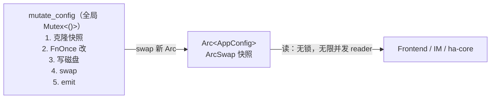

# 配置系统

应用配置（`AppConfig`，持久化到 `~/.hope-agent/config.json`）的读写 contract。所有面向用户的开关、Provider 列表、工具配置、UI 偏好等都住在这一个结构里。

## 核心原则

**单一真相源**：整个进程只有一份内存中的 `AppConfig`，由 [`ha_core::config::cached_config()`](../../crates/ha-core/src/config/persistence.rs) 发布为 `ArcSwap<AppConfig>`。

- **读**一律走 `cached_config()` → 返回 `Arc<AppConfig>`。lock-free，单次 atomic acquire load + Arc refcount bump，开销 O(ns)，hot path 零压力。
- **写**一律走 `mutate_config((category, source), |cfg| { ... })`。进程级全局 `Mutex<()>` 串行化"读最新快照 → 应用 mutation → 持久化到磁盘 → 原子 swap 回 ArcSwap → emit `config:changed` 事件"。

读写严格异步：读路径永不等待写路径（ArcSwap 无锁），写路径之间互斥（同一时刻只能有一个 `mutate_config` 运行）。

## API 形态

```rust
use ha_core::config::{cached_config, mutate_config};

// 读
let config = cached_config();             // Arc<AppConfig>
if config.canvas.enabled { /* ... */ }

// 写
mutate_config(("canvas", "settings-ui"), |cfg| {
    cfg.canvas.enabled = true;
    Ok(())
})?;

// 写（hooks）：改 hooks 字段后 emit config:changed →
// hooks::registry::reload_from_config 热重载，下一次事件已用新配置。
mutate_config(("hooks", "settings-ui"), |cfg| {
    cfg.hooks.post_tool_use.push(matcher_group);
    Ok(())
})?;
```

`mutate_config` 的 FnOnce 闭包返回 `anyhow::Result<T>`，错误从闭包透传出来（校验失败可以在闭包内直接 `Err(...)`，不落盘）。返回的 `T` 可以把 mutation 过程中算出的派生数据（比如新建的 ID）传回调用方。

`reason: (&str, &str)` 是 `(category, source)` 的二元组：
- `category` ——改的是哪个子系统（"image_generate" / "memory_budget" / "shortcuts" / "security.ssrf" / "hooks" / "filesystem"（只含远程写闸门 `allowRemoteWrites`，HIGH）/ `file_limits`（六项文件 MiB 限制，MEDIUM）/ `knowledge_source_limits`（三项资料导入 MiB 限制，MEDIUM）/ ...）。完整字段、默认值、范围和硬上限见 [file-operations.md](file-operations.md#大小配置与硬上限)。
- `source` ——从哪触发的（"settings-ui" / "http" / "oauth-finalize" / "cron" / ...）

两个字段会：
1. 作为 autosave 备份文件的 tag 写入 `~/.hope-agent/backups/autosave/`，方便后续 **Settings → Backups → Rollback** 面板识别"是谁在什么时候改的什么"。
2. （未来）作为 `config:changed` 事件的 payload，让前端知道只需要刷新哪些面板。

## 为什么不是简单的 `Mutex<AppConfig>`

历史上 `AppState::config: Mutex<AppConfig>` 就是这么写的，叠加后来引入的 `cached_config()` ArcSwap 导致**两份真相源**：

| 读写路径 | 读哪份 | 写哪份 |
|---|---|---|
| Tauri `chat.rs` 等 command | `state.config.lock().await` (Mutex) | （不写） |
| `save_*_config` Tauri 命令 | `load_config()` 克隆 cached_config | `save_config` 只刷新 cached_config |
| `save_*_config` HTTP 路由 | `load_config()` 克隆 cached_config | `save_config` 只刷新 cached_config |
| ha-core 内部（tools / context / agent）| `cached_config()` | 不写 |

结果：用户在 UI 点保存，cached_config 更新了、磁盘更新了，但 `AppState::config` 那个 Mutex 里还是 App 启动时的快照——chat.rs 读的正是这个 Mutex，于是工具可用性 / 温度 / 提供商等等全部 stale 到下次 App 启动。最典型的现象是 UI 里启用 Gemini 图像生成后，`image_generate` 工具永远不被注入到 LLM 的 `tools[]`，模型在 thinking 里直接说 "tool list mentions image_generate but it isn't in the functions list"——看起来像幻觉，实际是客户端真的没把它发出去。

解决方案就是**彻底移除**那份 `Mutex<AppConfig>` 字段，把整个进程收敛到 `cached_config`（读）+ `mutate_config`（写）一套 contract。

## 并发模型



- 读路径**从不阻塞**：ArcSwap 允许无限个并发 reader。
- 写路径互斥：全局 `std::sync::Mutex<()>` 确保 critical section 串行化（避免两个请求同时"读-改-写"时后写覆盖先写的 lost-update 场景）。
- 写路径持锁时间 = 一次 AppConfig `clone()` + 闭包执行 + `serde_json::to_string_pretty` + 一次 `std::fs::write` + 一次 Arc swap。磁盘 IO 是 blocking 的，但写频率很低（用户点保存），不会阻塞 tokio runtime 的其它 worker。
- 快照的原子性：`cache().store(Arc::new(new))` 是 ArcSwap 的 release store，任何 `cached_config()` 调用要么看到旧快照要么看到新快照，绝不会看到半更新状态。
- `mutate_config` 是同步函数（非 async），在 tokio async context 下调用它持有的 std::sync::Mutex 属于**短时 critical section**，不会卡住 runtime。

## 事件通知

`save_config`（无论是直接调还是通过 `mutate_config`）会在磁盘写入 + ArcSwap 更新完成后，通过 EventBus emit `config:changed` 事件；`mutate_config` 路径的 payload 含真实 `category` + `source`，直接 `save_config` 路径回退为 `{ category: "app" }`。前端现有订阅点：

| Hook | 作用 |
|---|---|
| [`src/i18n/i18n.ts`](../../src/i18n/i18n.ts) | 语言切换热更新 |
| [`src/hooks/useTheme.ts`](../../src/hooks/useTheme.ts) | 主题热切换 |
| [`src/hooks/useDangerousModeStatus.ts`](../../src/hooks/useDangerousModeStatus.ts) | Dangerous Mode 开关状态刷新 |
| [`src/lib/notifications.ts`](../../src/lib/notifications.ts) | Notification 设置刷新 |

这些订阅之前就存在，但因为 save 命令从没发出过 `config:changed`（只有 backup restore / settings skill 会发），实际上是死代码。改造后"UI 保存 → 所有订阅者收到通知 → 面板热更新"的链路才真正闭合。

## 语言偏好与后端 i18n

`AppConfig.language` 是产品界面语言偏好，`"auto"` 表示跟随系统 / 客户端；`UserConfig.language` 只用于告诉模型用户偏好的回复语言，不能拿来渲染系统通知。

后端统一通过 [`ha_core::i18n`](../../crates/ha-core/src/i18n.rs) 解析语言：

- `effective_ui_locale(&AppConfig)`：后端可见的 UI locale，优先 `AppConfig.language`，`auto` 回落宿主系统 locale，未知语言落英文
- `effective_locale(subsystem_language, app_language)`：子系统可选覆盖（例如 recap）→ UI 语言 → 系统 locale
- `localized_backend_message(...)`：后端直接发到外部通道的少量系统文案，例如 IM "back online" 提示

推送边界：

- 发给前端 UI / 桌面通知的事件，优先推稳定 `messageKey` + `messageArgs` + `fallback`，由前端 i18next 按当前客户端语言渲染
- 后端绕过前端、直接发到 IM / webhook / 外部通道的文本，必须在 Rust 侧通过 `ha_core::i18n` 渲染；当前没有 per-recipient locale 时使用全局 `AppConfig.language`

迁移边界：

- 已在 Rust 侧渲染：IM 启动恢复提示、IM 会话被其它入口接管提示、IM 工具审批提示（按钮 / 文本 fallback / 超时 / 错配提示）、IM `ask_user` 提示外壳（按钮 / 文本 fallback / 超时）、cron delivery 失败外发包装
- 不在 Rust 侧渲染：模型输出、用户输入、工具/Provider 原始错误详情、日志、工具 schema / system prompt、LLM 结果正文
- 待迁移：channel slash worker 自己拼出来的产品回复（如模型 / 会话选择、usage 帮助等）仍属于后端直发文本，应分批收敛到 Rust i18n 表
- 应保持前端 key 渲染：桌面 toast、更新提示、本地模型缺失提示、background job / cron UI 通知、`browser:extension_required` 这类只进入前端的事件。后端应发送 code / key / args + fallback，避免把英文 reason 作为 UI 正文直接展示

## 与备份 / 回滚联动

`save_config` 写盘前先调用 [`crate::backup::snapshot_before_write`](../../crates/ha-core/src/backup.rs) 把**旧**文件复制到 `~/.hope-agent/backups/autosave/`，文件名含 `(category, source, timestamp)`。用户在设置 → 备份面板可以回滚到任何历史快照。

`mutate_config` 内部调用 `backup::scope_save_reason` 传入 `(category, source)`，作为当次备份的 tag——所以备份面板上能看到 "theme/settings-ui" / "image_generate/settings-ui" / "active_model/slash-channel" 这样的人类可读标签，而不是一排 "unknown/unknown"。

## 设置分区恢复默认

设置页的“一键恢复默认”统一调用 [`settings_reset`](../../crates/ha-core/src/settings_reset.rs)。默认值只来自当前版本 Rust 类型的 `Default` 实现，前端不得复制默认常量，也不得通过清空整个 `config.json` 实现恢复。

稳定 scope 与设置页一一对应：

| scope | 页面 | 资源保留边界 |
|---|---|---|
| `general` | 通用 | 保留个人资料、天气、onboarding 和代理地址；代理模式回到系统默认 |
| `tools` | 工具 | 保留 Search / 图片 / 音频 API Key、Base URL、GitHub Token 和已部署 SearXNG |
| `memory` | 记忆设置 | 保留记忆、Claim、Profile、Procedure、审核记录、Embedding 模型库和外部 Provider 凭据 |
| `knowledge` | 知识设置 | 保留知识库、绑定和笔记；切块或 Embedding 签名变化时启动后台重建 |
| `design` | 设计 | 保留产物与 `last_model` 行为记忆 |
| `chat` | 聊天 | 保留会话和消息 |
| `cron` | 定时任务设置 | 保留任务与运行历史 |
| `plan` | Plan | 保留 Plan 文件及自定义目录 |
| `recap` | Recap | 保留历史报告 |
| `server` | Server | 保留远程地址、远程凭据、embedded Token 和公开地址；模式回到 embedded |
| `files` | 文件 | 保留 `allowRemoteWrites`，只恢复大小限制 |
| `sandbox` | 沙箱 | 保留镜像、容器和运行时资源 |
| `browser` | 浏览器 | 保留 Profile、扩展 ID 和运行时资源 |
| `acp` | ACP | 保留 Backend、环境变量和凭据 |
| `notifications` | 通知 | 保留 Agent 级覆盖 |
| `approval` | 审批 | 同时恢复全局策略、protected paths、dangerous commands、edit commands |
| `security` | 安全 | 关闭全局 YOLO，恢复 SSRF 策略，不改审批的其它策略 |
| `logs` | 日志 | 只恢复日志策略并立即热更新 logger |

明确不提供 scope 的页面包括全局模型、Provider、个人资料、Agent、团队、频道、技能、MCP、Hooks、语音、系统权限、健康、关于、更新历史和开发者工具。所有 reset scope 都不得修改 `providers`、`active_model`、`fallback_models`、`temperature`、`reasoning_effort` 或 `function_models`（视觉 / 自动化模型覆盖）。

协议只有一套：Tauri 命令 `reset_settings_section({ scope, section? })` 与 HTTP `POST /api/config/reset-section` 都调用同一个 ha-core 服务，并统一返回 `{ scope, section?, changed, reindexStarted, warningCodes }`。省略 `section` 保持原有整页恢复语义；携带 `section` 时必须命中下表中的父子组合，未知值在写入前拒绝。整页结果省略 `section` 字段以保持旧客户端兼容。AppConfig 字段在一次 `mutate_config` mutation 中提交，因此沿用 autosave、`config:changed` 与热重载契约；所有恢复请求经同一进程级锁串行化，UserConfig / Approval 多文件操作会保存旧快照，后续 AppConfig 提交失败时回滚。Tauri 壳只额外同步桌面专属副作用（`general` 整页或 `general.system` 关闭开机启动、重注册全局快捷键），Server 成功后前端切换到 embedded transport。

| 父 scope | 稳定 section |
|---|---|
| `general` | `appearance`, `system`, `network` |
| `tools` | `general`, `web_search`, `web_fetch`, `image_generate`, `audio_generate`, `canvas`, `async_tools`, `issue_reporting` |
| `chat` | `basic`, `awareness`, `context_compact` |
| `security` | `dangerous`, `ssrf` |
| `notifications` | `global`, `startup` |
| `memory` | `extract`, `recall_summary`, `budget`, `retrieval`, `dreaming` |
| `knowledge` | `compile`, `vision`, `note_tools`, `search`, `passive_recall`, `source_limits`, `media_retention`, `maintenance`, `sprite` |
| `approval` | `protected_paths`, `edit_commands`, `dangerous_commands` |

子区域恢复只覆盖安全配置字段：Memory / Knowledge 的 Embedding 选择和 Knowledge chunking 不提供 section，因此不会从子区域触发 reindex；`memory.budget` 保留 recall/deep-recall 的启用与用户同意字段，只恢复预算数值。前端整页、页签、区域按钮共享同一确认控件，成功只重载目标区域，失败不卸载当前草稿。

恢复是“确认后立即持久化当前页”，成功后重挂载当前面板；失败时不重挂载，页面草稿继续保留。Knowledge 的重建和桌面副作用若无法启动，以稳定 `warningCodes` 返回，已经成功提交的默认设置不会伪装成失败。

## 迁移历史

| 日期 | 改动 |
|---|---|
| 2026-07-17 | 新增 18 个分区级恢复默认 scope；统一 Rust `Default` 来源、资源保留边界及 Tauri / HTTP 双 Transport 契约。 |
| 2026-07-17 | 为精选页面增加安全 section 恢复；明确父子白名单、局部刷新和不触发 Embedding / chunk 重建的边界。 |
| 2026-04-20 | 删除 `AppState::config: Mutex<AppConfig>` 字段；所有 save 路径走 `mutate_config`；所有读路径走 `cached_config()`；`save_config` emit `config:changed`。彻底解决"UI 保存不生效、须重启 App"的 stale 类 bug。 |

## 反面样式

以下写法**不应**再出现：

```rust
// ❌ 不要手动克隆 → 本地改 → 单独调 save_config
let mut store = ha_core::config::load_config()?;
store.canvas.enabled = true;
ha_core::config::save_config(&store)?;   // 没有写锁保护，两个并发请求会丢更新
```

```rust
// ❌ 不要往 AppState 里再塞一份 config 副本
pub struct AppState {
    pub config: Mutex<AppConfig>,   // 历史教训——永远会跟 cached_config 分叉
    ...
}
```

```rust
// ❌ 不要绕过 mutate_config 直接写磁盘
std::fs::write("~/.hope-agent/config.json", ...);   // 破坏 ArcSwap + 备份 + 事件通知
```

新增任何 save 命令时，模板永远是：

```rust
ha_core::config::mutate_config(("<category>", "<source>"), |store| {
    store.<field> = new_value;
    Ok(())
})
.map_err(|e| e.to_string())
```
