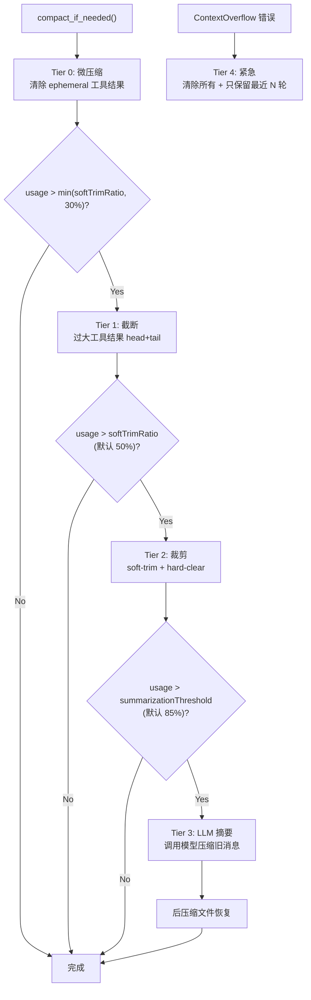
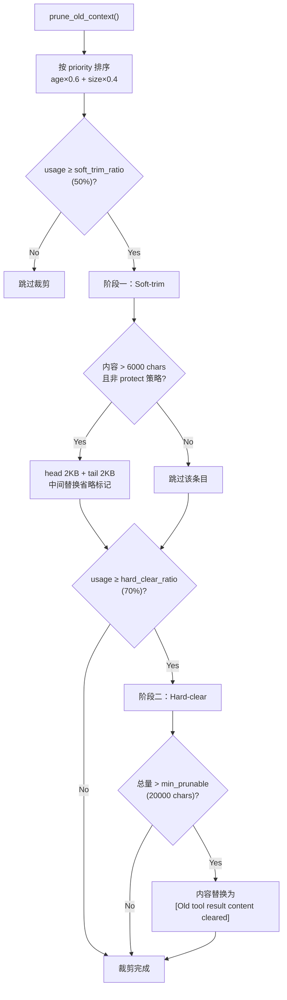
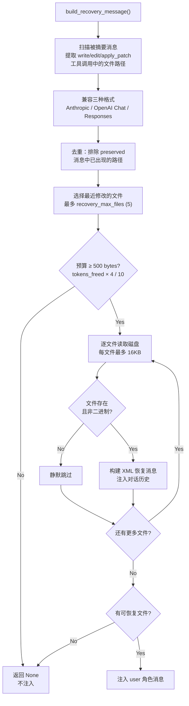

# 上下文压缩架构
> 返回 [文档索引](../README.md) | 更新时间：2026-04-08

## 概述

上下文压缩系统采用 **5 层渐进式压缩策略**，在对话 token 接近模型上下文窗口上限时，按代价从低到高逐层触发。结合 **API-Round 分组保护**确保 tool_use / tool_result 消息配对不被拆散，以及 **后压缩文件恢复**在 LLM 摘要后自动注入最近编辑文件的当前内容，省去额外的 read 工具调用。

## 压缩层级总览



## 模块结构

| 文件 | 职责 |
|------|------|
| `mod.rs` | 模块入口、常量定义、re-exports |
| `types.rs` | 数据类型（CompactResult, TokenEstimateCalibrator, SummarizationSplit 等） |
| `config.rs` | 配置结构 CompactConfig（全部可配置参数） |
| `engine.rs` | `ContextEngine` / `CompactionProvider` trait 抽象 + `DefaultContextEngine` 实现（委派到 `compact_if_needed` / `emergency_compact`，是上层调用方的稳定入口） |
| `estimation.rs` | Token 估算（chars/4 启发式、图片估算、消息字符计数） |
| `compact.rs` | 主入口 + Tier 0 微压缩 + Tier 4 紧急压缩 |
| `truncation.rs` | Tier 1 工具结果截断（head+tail、结构边界检测） |
| `pruning.rs` | Tier 2 上下文裁剪（soft-trim + hard-clear） |
| `summarization.rs` | Tier 3 LLM 摘要（消息分割、prompt 构建、摘要应用） |
| `round_grouping.rs` | API-Round 分组（stamp/strip 元数据、round-safe 边界查找） |
| `recovery.rs` | 后压缩文件恢复（扫描写入工具、读取磁盘、构建恢复消息） |

## 5 层压缩详解

### Tier 0：微压缩（Microcompact）

**零成本**清除过时的短命工具结果，无需 LLM 调用。

**触发条件**：每次请求前自动执行（`tool_policies` 中存在 `"eager"` 策略的工具时）

**处理逻辑**：
1. 构建 `tool_use_id → tool_name` 映射表，兼容三种消息格式：
   - **Anthropic**：content 数组中的 `tool_use` 块（`id` + `name`）
   - **OpenAI Chat**：`tool_calls` 数组（`id` + `function.name`）
   - **OpenAI Responses**：`type=function_call` 消息（`call_id` + `name`）
2. 构建 `BoundarySnapshot` 并按 `ProtectRecent` 模式派生保护边界：保留最近 `preserve_recent_rounds`（默认 4）个消息 round；若不会吞掉同一 user turn 内更早的执行 round，则向前扩到所属 user turn 起点
3. 清除边界之前所有 `tool_policies` 中策略为 `"eager"` 的工具结果内容（默认：`ls`, `grep`, `find`, `process`, `sessions_list`, `agents_list`, `session_status`, `get_weather`, `tool_search`）
4. 替换为占位符（保留消息结构以维持 tool_use/tool_result 配对）

### Tier 1：截断（Truncation）

对**单个过大**的工具结果执行 head+tail 截断。

**触发条件**：单个工具结果超过上下文窗口的 30%（`MAX_TOOL_RESULT_CONTEXT_SHARE = 0.3`）

**大小限制计算**：
```
max_chars = min(context_window × 0.3 × 4 chars/token, 400KB)
```

- `CHARS_PER_TOKEN = 4`：通用文本 token 估算比率
- `HARD_MAX_TOOL_RESULT_CHARS = 400_000`：绝对上限
- `MIN_KEEP_CHARS = 2_000`：最少保留字符数

**智能尾部检测**（`has_important_tail()`）：检查尾部 2000 字符是否包含重要内容：
- 错误信息模式：`error`, `exception`, `failed`, `fatal`, `traceback`, `panic`
- JSON 闭合结构：`}`, `]`
- 结果关键词：`total`, `summary`, `result`, `complete`, `finished`

若尾部重要，采用 **head + tail** 截断（中间插入 `[... middle content omitted ...]` 标记）；否则仅保留头部。

**结构边界检测**（`find_structure_boundary()`）：在目标截断点附近寻找干净的切割位置，识别 JSON 边界、代码块边界和段落边界。

### Tier 2：裁剪（Pruning）

对历史中的多个工具结果进行**两阶段渐进裁剪**。



**优先级排序**：
```
priority = age × 0.6 + size × 0.4
```
- `age = 1.0 - (msg_index / total_messages)`：越老越优先
- `size = min(content_chars / 100000, 1.0)`：越大越优先

**阶段一：Soft-trim**（`soft_trim_ratio = 0.50` 触发）
- 对大于 `soft_trim_max_chars`（默认 6000 字符）的工具结果执行 head+tail 截断
- 保留头部 `soft_trim_head_chars`（默认 2KB）+ 尾部 `soft_trim_tail_chars`（默认 2KB）
- 中间替换为省略标记

**阶段二：Hard-clear**（`hard_clear_ratio = 0.70` 触发）
- 整个工具结果内容替换为占位符：`"[Old tool result content cleared]"`
- 跳过低于 `min_prunable_tool_chars`（默认 20000）总量的情况

**保护机制**：
- `preserve_recent_rounds`（默认 4）给出的 `ProtectRecent` 边界之后的内容不裁剪；边界在普通短回合中扩到所属 user turn 起点，在长 tool loop 中回退到 round 边界以保留可裁剪前缀
- `tool_policies` 中策略为 `"protect"` 的工具不裁剪（默认：`web_search`, `web_fetch`, `recall_memory`, `memory_get`）

### Tier 3：LLM 摘要（Summarization）

调用 LLM 将旧对话历史压缩为结构化摘要。

**触发条件**：token 使用率达到 `summarization_threshold`（默认 0.85）

**流程**：
1. **split_for_summarization**：从同一个 `BoundarySnapshot` 派生 `SummarizeUnderPressure` 边界作为分割点；普通短回合尽量扩到所属 user turn 起点，若普通边界 fail-closed 且已触发摘要压力，则保留最近 live round、摘要更早 prefix
2. **build_summarization_prompt**：构建摘要指令，包含标识符保留策略
3. LLM 调用（`summarization_timeout_secs` 默认 60s 超时，`summary_max_tokens` 默认 4096）
4. **apply_summary**：用摘要消息替换旧历史，保留最近的消息

**摘要 System Prompt 要求保留**：
- 活跃任务及其当前状态
- 批量操作进度（如 "5/17 items completed"）
- 用户最近的请求和处理进展
- 决策及其理由
- TODO、悬而未决的问题和约束
- 承诺的后续事项
- 所有文件路径、函数名和代码引用

**标识符保留策略**（`identifier_policy`）：
- `"strict"`（默认）：严格保留所有不透明标识符（UUID、hash、ID、token、主机名、IP、端口、URL、文件名），不缩短不重构
- `"off"`：不做特殊保留
- `"custom"`：使用 `identifier_instructions` 自定义指令

**摘要上限**：`MAX_COMPACTION_SUMMARY_CHARS = 16,000` 字符

### Tier 4：紧急压缩（Emergency Compact）

**ContextOverflow** 错误触发的最后手段。

**处理逻辑**：
1. 清除所有工具结果内容
2. 只保留最近 N 轮消息（基于 round-safe 边界）
3. 丢弃所有更早的历史

## API-Round 消息分组

### 元数据标记

Tool loop 中的 assistant 消息（含 tool_use）和对应的 tool_result 消息通过 `_oc_round` 元数据标记为同一轮次：

```json
{ "role": "assistant", "content": [...], "_oc_round": "r0" }
{ "role": "user", "content": [...], "_oc_round": "r0" }
```

**Round ID 格式**：`"r{N}"`，N 为 tool loop 迭代索引（从 0 开始）。

### 关键函数

| 函数 | 说明 |
|------|------|
| `stamp_round(msg, round_id)` | 在消息上标记 round ID |
| `push_and_stamp(messages, msg, round)` | Push 消息并标记，跨 4 种 Provider 文件复用 |
| `strip_round(msg)` | 剥离单条消息的 round 元数据 |
| `prepare_messages_for_api(messages)` | Clone 并剥离所有 round 元数据，用于 API 请求体构建 |
| `find_round_safe_boundary(messages, target)` | 在 target 及之前找到 round-safe 分割点（向后搜索） |
| `find_round_safe_boundary_forward(messages, target)` | 在 target 及之后找到 round-safe 分割点（向前搜索） |

### 向后兼容

无 `_oc_round` 元数据的旧会话消息被视为独立 round，`find_round_safe_boundary` 直接返回 `target_index`。

## 后压缩文件恢复

Tier 3 摘要后，被摘要的消息中 write/edit/apply_patch 的精确文件内容从对话历史中丢失。此模块自动从磁盘读取这些文件的当前内容并注入，省去额外的 read 工具调用。

### 流程



1. **扫描被摘要消息**：提取 `write`, `write_file`, `edit`, `patch_file`, `apply_patch` 工具调用中的文件路径
   - 兼容三种格式：Anthropic tool_use、OpenAI Chat tool_calls、OpenAI Responses function_call
   - `apply_patch` 从 patch header（`*** Add File:`, `*** Update File:`, `*** Move to:`）提取路径
2. **去重**：排除在保留消息（preserved）中已出现的路径
3. **选择最近文件**：取最近修改的文件（最多 `recovery_max_files`，默认 5 个）
4. **读取磁盘内容**：每个文件最多 `recovery_max_file_bytes`（默认 16KB），超出截断并追加 `[truncated, N total bytes]`
5. **预算控制**：
   - 总预算 = `tokens_freed × 4 bytes / 10`（释放 token 的 10%）
   - 兜底上限 `MAX_RECOVERY_TOTAL_BYTES = 100,000` 字符
   - 预算不足 500 字节时跳过
6. **注入为 XML 块**：构建 user 角色消息

```xml
[Post-compaction file recovery: current contents of recently-edited files]

<file path="/path/to/file.rs">
file contents here...
</file>
```

### 容错

- 文件不存在、已删除或为二进制文件时静默跳过
- 无可恢复文件时返回 `None`，不注入任何消息

## Cache-TTL 节流

### 背景

Anthropic、OpenAI、Google 的 API 均支持 prompt cache（约 5 分钟 TTL）。Tier 2+（裁剪/摘要）会改变消息前缀，导致缓存失效。如果 token 使用率在阈值附近反复波动，每次请求都触发 Tier 2+ → 缓存失效 → 重建缓存，反而增加成本。

### 机制

1. `AssistantAgent` 持有 `last_tier2_compaction_at: Mutex<Option<Instant>>` 会话级时间戳
2. `run_compaction()` 调用 `compact_if_needed()` 前检查：若上次 Tier 2+ 在 `cacheTtlSecs` 秒内，将 `soft_trim_ratio` / `hard_clear_ratio` / `summarization_threshold` 临时设为 `2.0`，使 Tier 2+ 不触发
3. Tier 0（微压缩）和 Tier 1（截断）不受 TTL 限制（成本低，不显著改变前缀）
4. Tier 2+ 成功执行后更新时间戳

### 安全保护

- **紧急阈值覆盖**：usage ratio ≥ 95% 时，即使在 TTL 内也强制执行 Tier 2+，避免撞到 ContextOverflow → Tier 4（无 LLM 摘要的粗暴清除）
- **Tier 4 不受影响**：Tier 4 走独立的 `handle_context_overflow()` 路径，不经过 `run_compaction()`
- **`/compact` 不受影响**：手动 `/compact` 命令直接调用 `compact_if_needed()`，不经过 TTL 检查

## Token 估算

### chars/4 启发式

基础估算规则：

| 值类型 | 估算方法 |
|--------|---------|
| String | `len / 4` |
| Array | 各元素估算之和 |
| Object | 各键名和值估算之和 |
| Number / Bool / Null | 1 token |
| Image content | 固定 8000 chars（`IMAGE_CHAR_ESTIMATE`） |

### TokenEstimateCalibrator

使用 EMA（指数移动平均）根据 API 返回的实际 token 数校准估算因子：

```
calibration_factor = calibration_factor × 0.7 + (actual / estimated) × 0.3
calibrated_estimate = raw_estimate × calibration_factor
```

- `alpha = 0.3`：近期观测值权重更高
- 初始 `calibration_factor = 1.0`
- 每次 API 响应后用 `(estimated, actual)` 对更新

## 配置项

所有配置项存储在 `config.json` 的 `compact` 字段中，使用 camelCase 命名。对应 Rust 结构体 `CompactConfig`（`crates/ha-core/src/context_compact/config.rs`）。

### 全局

| 配置路径（`compact.*`） | 类型 | 默认值 | 说明 |
|------------------------|------|--------|------|
| `enabled` | `bool` | `true` | 是否启用上下文压缩。设为 `false` 将完全跳过所有 Tier 的压缩，上下文溢出时仅靠 Tier 4 紧急压缩兜底 |
| `cacheTtlSecs` | `u64` | `300` | **Cache-TTL 节流**。上次 Tier 2+ 压缩后的冷却时间（秒），TTL 内跳过 Tier 2+（裁剪/摘要），保护 API prompt cache。`0` = 禁用，上限 `900`（15 分钟）。当 usage ≥ 95% 时强制覆盖 TTL（紧急阈值保护） |

### 工具策略（Tier 0 / Tier 2 共用）

| 配置路径（`compact.*`） | 类型 | 默认值 | 说明 |
|------------------------|------|--------|------|
| `toolPolicies` | `Map<String, String>` | 见下方 | 按工具名指定压缩策略。可选值：`"eager"`（Tier 0 微压缩时优先清除）、`"protect"`（Tier 2 裁剪时跳过）。不在此 map 中的工具按正常流程处理 |

**`toolPolicies` 默认值**：

| 策略 | 工具 | 理由 |
|------|------|------|
| `eager`（优先清除） | ls, grep, find, process, sessions_list, agents_list, session_status, get_weather, tool_search | 快照/列表类，旧结果很快过时，优先清除释放空间 |
| `protect`（保护不裁） | web_search, web_fetch, recall_memory, memory_get | 搜索和记忆内容可能在后续对话中反复引用，需要保留 |
| 正常压缩 | 其余所有工具 | 不做特殊处理，按 Tier 1→2 正常流程压缩 |

### Tier 2：上下文裁剪

| 配置路径（`compact.*`） | 类型 | 默认值 | 说明 |
|------------------------|------|--------|------|
| `softTrimRatio` | `f64` | `0.50` | **Soft-trim 触发比率**。当 token 使用率超过此值时开始阶段一裁剪。同时也作为快速退出判断的参考：`min(softTrimRatio, 0.3)` 以下直接跳过所有压缩 |
| `softTrimMaxChars` | `usize` | `6000` | 阶段一中只对内容超过此字符数的工具结果执行 soft-trim，小于此值的不处理 |
| `softTrimHeadChars` | `usize` | `2000` | Soft-trim 时保留的头部字符数 |
| `softTrimTailChars` | `usize` | `2000` | Soft-trim 时保留的尾部字符数。头尾之间用省略标记替代 |
| `hardClearRatio` | `f64` | `0.70` | **Hard-clear 触发比率**。阶段一裁剪后使用率仍超过此值时，进入阶段二，直接清空工具结果内容 |
| `hardClearEnabled` | `bool` | `true` | 是否启用 hard-clear 阶段。设为 `false` 则 Tier 2 只做 soft-trim，不会彻底清空 |
| `hardClearPlaceholder` | `String` | `"[Old tool result content cleared]"` | Hard-clear 时替换工具结果的占位符文本 |
| `preserveRecentRounds` | `usize` | `4`（范围 1–12） | 保护最近 N 个消息 round；Tier 0/2 使用 `ProtectRecent` fail-closed 边界，Tier 3 使用 `SummarizeUnderPressure` 可前进边界，Tier 4 使用 `Emergency` 必须腾空间边界；三者共用同一个 `BoundarySnapshot` |
| `minPrunableToolChars` | `usize` | `20000` | Hard-clear 跳过阈值。若所有可裁剪工具结果的总字符数低于此值，则跳过 hard-clear（清除收益太小） |

### Tier 3：LLM 摘要

| 配置路径（`compact.*`） | 类型 | 默认值 | 说明 |
|------------------------|------|--------|------|
| `summarizationModel` | `Option<String>` | — | **摘要模型**。格式 `"providerId:modelId"`，指定用于摘要的模型。为空（默认）时使用对话模型并复用 prompt 缓存（约 90% 缓存命中，token 消耗极低）；指定后使用独立 API 调用（无缓存共享，但可使用更便宜的模型降低成本） |
| `summarizationThreshold` | `f64` | `0.85` | **摘要触发比率**。Tier 2 裁剪后使用率仍超过此值时，调用 LLM 将旧对话历史压缩为结构化摘要 |
| `identifierPolicy` | `String` | `"strict"` | 标识符保留策略。`"strict"`：摘要中严格保留所有不透明标识符（UUID/hash/ID/token/URL/文件名等）不缩短不重构；`"off"`：不做特殊保留；`"custom"`：使用 `identifierInstructions` 自定义指令 |
| `identifierInstructions` | `Option<String>` | — | 自定义标识符保留指令，仅当 `identifierPolicy` 为 `"custom"` 时生效 |
| `customInstructions` | `Option<String>` | — | 追加到摘要 prompt 的自定义指令。可用于指导 LLM 摘要时特别关注或保留某些信息 |
| `summarizationTimeoutSecs` | `u64` | `60` | 摘要 LLM 调用的超时时间（秒）。超时后摘要失败，保持原始历史不变 |
| `summaryMaxTokens` | `u32` | `4096` | 摘要 LLM 调用的最大输出 token 数 |
| `maxHistoryShare` | `f64` | `0.5` | 裁剪时历史消息最大允许占用的上下文窗口比例 |
| `maxCompactionSummaryChars` | `usize` | `16000` | 摘要文本的最大字符数，超出截断并追加 `[truncated]` 标记。范围 `4000–64000`：调高可保留更完整的摘要上下文（适合复杂长对话），但摘要本身也会占用更多上下文预算 |
| `maxCompactionInjectedContextShare` | `f64` | `0.5` | Tier 3 后压缩产物联合预算：summary + deterministic ledger + recovered files 合计最多占上下文窗口比例；运行时钳到 `0.05..=maxHistoryShare`，按 summary > ledger > recovery 分配 |

### 后压缩文件恢复

| 配置路径（`compact.*`） | 类型 | 默认值 | 说明 |
|------------------------|------|--------|------|
| `recoveryEnabled` | `bool` | `true` | 是否启用后压缩文件恢复。Tier 3 摘要后自动从磁盘读取最近编辑的文件内容注入对话，省去额外的 read 工具调用 |
| `recoveryMaxFiles` | `usize` | `5` | 最多恢复的文件数量。按会话历史中的最后一次 write/edit/apply_patch 出现位置排序，取最新的 N 个 |
| `recoveryMaxFileBytes` | `usize` | `16384`（16KB） | 单个文件最大恢复字节数。超出部分截断并追加 `[truncated]` 标记 |

### Tier 1：工具结果截断

| 配置路径（`compact.*`） | 类型 | 默认值 | 范围 | 说明 |
|------------------------|------|--------|------|------|
| `maxToolResultContextShare` | `f64` | `0.3` | `0.1–0.6` | 单个工具结果最大允许占用上下文窗口的比例。调高可保留更完整的 `web_fetch` / 大文件读取结果，但挤压其他对话空间；调低则更积极截断单个工具结果 |

### 硬编码常量（不可配置）

以下常量定义在 `mod.rs` 中，不通过 `config.json` 暴露：

| 常量 | 值 | 说明 |
|------|-----|------|
| `CHARS_PER_TOKEN` | `4` | 通用文本 token 估算比率（1 token ≈ 4 字符） |
| `TOOL_RESULT_CHARS_PER_TOKEN` | `2` | 工具结果的 token 估算比率（结构化内容密度更高） |
| `IMAGE_CHAR_ESTIMATE` | `8000` | 图片内容的固定字符估算值 |
| `HARD_MAX_TOOL_RESULT_CHARS` | `400,000` | Tier 1 单个工具结果的绝对字符上限（`maxToolResultContextShare` 计算结果不超过此值） |
| `MIN_KEEP_CHARS` | `2000` | Tier 1 截断后最少保留的字符数 |
| `SAFETY_MARGIN` | `1.2` | Token 估算安全系数（乘以估算值留出余量） |
| `SUMMARIZATION_OVERHEAD_TOKENS` | `4096` | 摘要请求预留的额外 token 开销 |
| `BASE_CHUNK_RATIO` | `0.4` | 摘要分块的基础比率 |
| `MIN_CHUNK_RATIO` | `0.15` | 摘要分块的最小比率 |

## 关键源文件

| 文件 | 说明 |
|------|------|
| `crates/ha-core/src/context_compact/mod.rs` | 模块入口、硬编码常量、摘要 prompt 模板、re-exports |
| `crates/ha-core/src/context_compact/types.rs` | CompactResult, CompactDetails, PruneResult, SummarizationSplit, TokenEstimateCalibrator |
| `crates/ha-core/src/context_compact/config.rs` | CompactConfig 结构（全部可配置参数及默认值） |
| `crates/ha-core/src/context_compact/engine.rs` | `ContextEngine` / `CompactionProvider` trait + `DefaultContextEngine` 默认实现（行为零变化，方便后续替换/扩展整套压缩策略） |
| `crates/ha-core/src/context_compact/estimation.rs` | Token 估算（chars/4）、消息字符计数、工具结果提取辅助函数 |
| `crates/ha-core/src/context_compact/compact.rs` | 主入口 `compact_if_needed()` + Tier 0 `microcompact()` + Tier 4 `emergency_compact()` |
| `crates/ha-core/src/context_compact/truncation.rs` | Tier 1 `truncate_tool_results()`、head+tail 截断、结构边界检测、智能尾部检测 |
| `crates/ha-core/src/context_compact/pruning.rs` | Tier 2 `prune_old_context()`、优先级排序、soft-trim + hard-clear 两阶段 |
| `crates/ha-core/src/context_compact/summarization.rs` | Tier 3 `split_for_summarization()` + `build_summarization_prompt()` + `apply_summary()` |
| `crates/ha-core/src/context_compact/round_grouping.rs` | API-Round 分组：stamp/strip/prepare、`find_round_safe_boundary()` 双向查找 |
| `crates/ha-core/src/context_compact/recovery.rs` | 后压缩文件恢复：`build_recovery_message()`、多格式工具调用解析、磁盘读取 |
