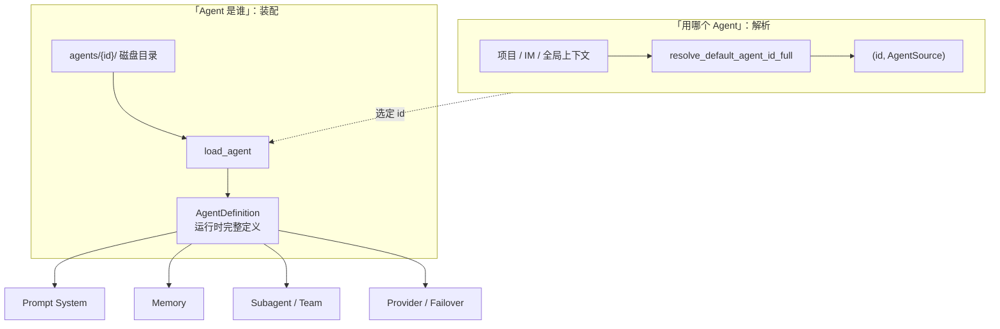
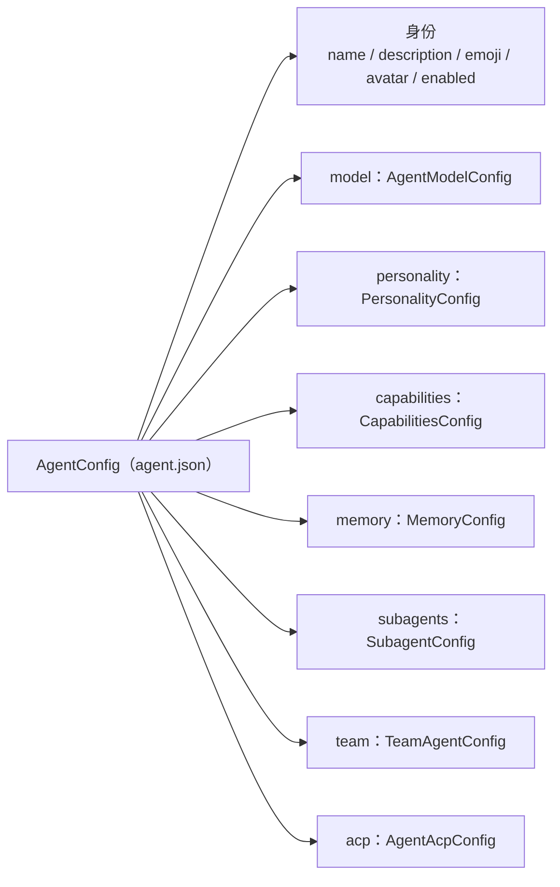
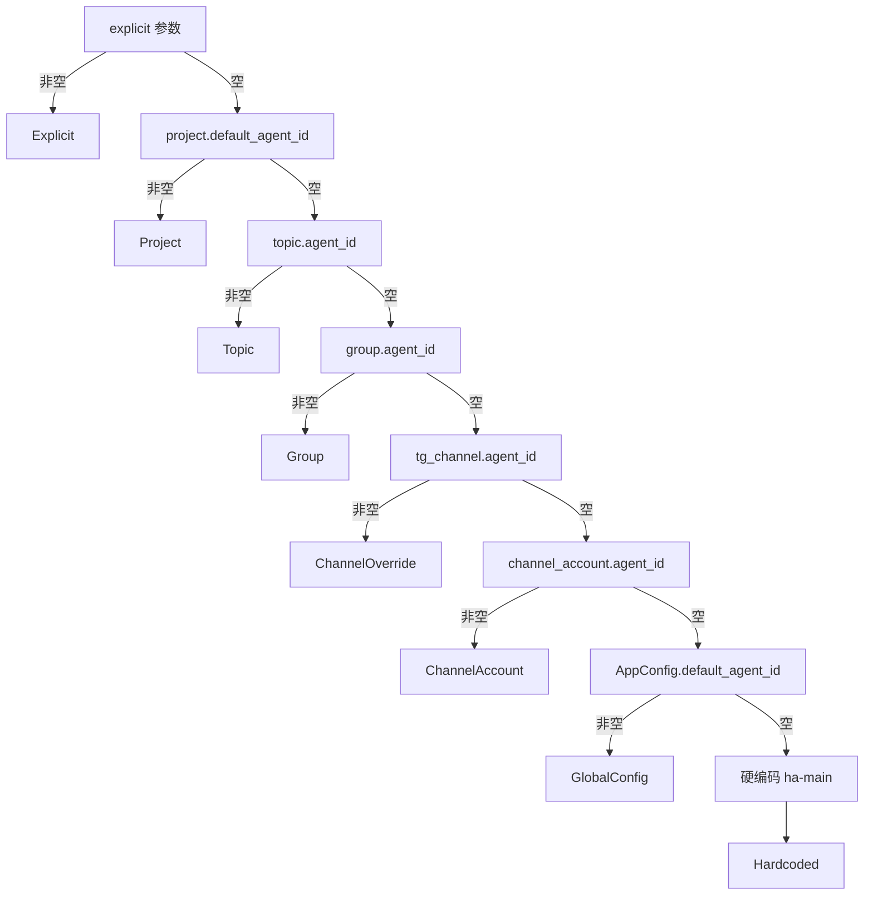
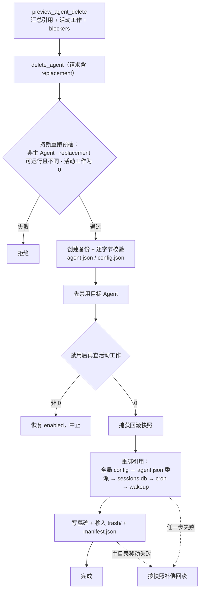

# Agent 配置与解析链

> 返回 [文档索引](../../README.md) | 关联源码：[`crates/ha-core/src/agent_config.rs`](../../../crates/ha-core/src/agent_config.rs)、[`crates/ha-core/src/agent_loader.rs`](../../../crates/ha-core/src/agent_loader.rs)、[`crates/ha-core/src/agent_lifecycle.rs`](../../../crates/ha-core/src/agent_lifecycle.rs)、[`crates/ha-core/src/agent/resolver.rs`](../../../crates/ha-core/src/agent/resolver.rs)、[`crates/ha-core/src/agent/migration.rs`](../../../crates/ha-core/src/agent/migration.rs)；命令面在 [`src-tauri/src/commands/agent_mgmt.rs`](../../../src-tauri/src/commands/agent_mgmt.rs) 与 [`crates/ha-server/src/routes/agents.rs`](../../../crates/ha-server/src/routes/agents.rs)

## 核心思想

一个多 Agent 助手要回答两个彼此独立的问题：

1. **「这个 Agent 是谁？」**——它的名字、人格、能用哪些工具、记忆怎么继承、能不能委派子 Agent。
2. **「这次新会话该用哪个 Agent？」**——用户在项目里聊天、Telegram 群里 @ 一句话、Cron 到点触发，每一路入口都要挑出一个默认 Agent。

本子系统把这两件事分别做成一条清晰的管线：

- **装配（第一个问题）**：每个 Agent 的定义**全部落在磁盘目录 `agents/{id}/` 里**，这是唯一的权威来源——一份 `agent.json` 存结构化配置，若干 markdown 文件存行为说明、人格、工具指引、记忆。`load_agent` 把它们读进内存合成一个运行时的 `AgentDefinition`。没有隐藏的数据库副本，改配置就是改文件。
- **解析（第二个问题）**：`resolve_default_agent_id_full` 用一条**固定顺序、首个非空胜出**的 7 级优先链，从上下文里挑出该用哪个 Agent，并告诉调用方「是从哪一级挑出来的」。所有入口都收敛到这一个函数，channel worker 不许自己另写一套。

**关键取舍**：这个子系统只负责「Agent 是谁、用哪个 Agent」，不负责把配置**用起来**——prompt 怎么拼（[prompt-system.md](prompt-system.md)）、记忆怎么召回（[memory.md](memory.md)）、子 Agent 怎么执行（[subagent.md](../agent/subagent.md)）都是各自闭合的下游子系统，它们从这里读配置，但实现互不侵入。这样「定义 Agent」和「使用 Agent」解耦，改一个 Agent 的人格不会牵动委派调度，改解析顺序也不会碰 prompt 拼装。



## 模块结构

| 模块 | 职责 |
|---|---|
| [`agent_config.rs`](../../../crates/ha-core/src/agent_config.rs) | 全部数据模型：`AgentConfig` 及其嵌套（model / personality / capabilities / memory / subagents / team / acp）+ 运行时 `AgentDefinition` / `AgentSummary` + `effective_memory_budget` |
| [`agent_loader.rs`](../../../crates/ha-core/src/agent_loader.rs) | 磁盘装配与读写：`load_agent` / `list_agents` / `list_all_agents` / `ensure_default_agent` / `save_agent_*` / `get_template` / `render_persona_to_soul_md`；`DEFAULT_AGENT_ID` / `is_main_agent` |
| [`agent_lifecycle.rs`](../../../crates/ha-core/src/agent_lifecycle.rs) | Agent 启停、删除预检、活动工作阻断、引用重绑、备份与可恢复回收站删除的唯一入口；`AgentRunGuard` 准入门 |
| [`agent/resolver.rs`](../../../crates/ha-core/src/agent/resolver.rs) | 7 级默认 Agent 解析链 + `AgentSource` 来源枚举 + `normalize_default_agent_id` 写归一 |
| [`agent/migration.rs`](../../../crates/ha-core/src/agent/migration.rs) | legacy `"default"` → `"ha-main"` 一次性启动迁移（sentinel 短路） |

## 配置模型（`AgentConfig`）

`agent.json` 反序列化为 `AgentConfig`（字段名 **camelCase**，**所有字段都带 `serde default`**——缺字段回落该字段的默认值，整个文件缺失回落 `AgentConfig::default()`）：

```rust
pub struct AgentConfig {
    pub enabled: bool,                         // 默认 true；false 时不可参与新执行
    pub name: String,                          // 缺省 "Assistant"
    pub description: Option<String>,
    pub emoji: Option<String>,
    pub avatar: Option<String>,
    pub model: AgentModelConfig,
    pub personality: PersonalityConfig,
    pub capabilities: CapabilitiesConfig,
    pub memory: MemoryConfig,
    pub openclaw_mode: bool,                   // 4 文件 markdown 模式
    pub notify_on_complete: Option<bool>,      // None = 跟随全局
    pub subagents: SubagentConfig,
    pub team: TeamAgentConfig,
    pub acp: AgentAcpConfig,                   // ACP 外部 agent 委派
}
```

**`AgentConfig` 里没有 `id` 字段**——Agent 的 id 就是磁盘目录名 `agents/{id}/`，运行时落在 `AgentDefinition.id`（装配时由目录名注入）。这样「重命名 Agent」和「改 Agent 配置」是两件不会互相污染的事。



### 模型覆盖（`AgentModelConfig`）

per-agent 覆盖主对话模型选择，是「会话 > Agent > 全局」三层覆盖里的中间层：

| 字段 | 语义 |
|---|---|
| `primary` | 主模型 `provider_id::model_id`（双冒号分隔，`parse_model_ref` 按 `::` 解析），空 = 继承全局 active model |
| `fallbacks` | 有序 failover 链 |
| `plan_model` | Plan 期专用模型（用更便宜/快的模型做探索与规划） |
| `temperature` | 温度覆盖（0.0–2.0），会话级仍可再覆盖 |
| `reasoning_effort` | 默认 Think / 推理强度，会话级仍优先 |

空字段一律继承全局 active model 与全局温度 / think 配置（见 [provider-system.md](provider-system.md) / [failover.md](../agent/failover.md)）。

### 人格（`PersonalityConfig` / `PersonaMode`）

人格有**两套并存的创作面**，由 `PersonaMode` 切换，两套字段在两种模式下都可编辑，切换不丢数据：

- **`Structured`（默认）**：结构化字段 `role` / `vibe` / `tone` / `traits` / `principles` / `boundaries` / `quirks` / `communication_style`，由前端表单填，渲染进 system prompt。
- **`SoulMd`**：放弃结构化字段，改由 `soul.md` 自由文本承载人格——给想完全手写人设的用户。这份 `soul.md` 与 OpenClaw 4 文件模式共用**同一个物理文件**，用户只维护一份。

`render_persona_to_soul_md` 把结构化 `PersonalityConfig` 渲染成一份 `SOUL.md` 草稿（**只返回文本、不落盘**），供用户从 Structured 迁到 SoulMd 时打底；结构里啥都没填时给一句占位提示，编辑器不会是一张空白页。

### 能力（`CapabilitiesConfig`）

工具 / 技能 / 审批 / 沙箱 / 运行时限的总开关：

| 字段 | 语义 |
|---|---|
| `max_tool_rounds` | 单 turn 工具循环轮数上限（默认 0 = 走系统默认，不额外收紧） |
| `sandbox` / `default_sandbox_mode` | legacy bool 与 `SandboxMode` 枚举（`off` / `standard` / `isolated` / `workspace` / `trusted`）；`None` 时按 legacy bool 经 `effective_default_sandbox_mode` 映射（`true`→`standard`，否则 `off`） |
| `tools: FilterConfig` | **非 Core 工具**的显式开 / 关覆盖（Core 工具不受影响） |
| `skills: FilterConfig` | 技能严格白 / 黑名单 |
| `async_tool_policy` | `ModelDecide`（默认）/ `AlwaysBackground` / `NeverBackground` 异步后台策略 |
| `mcp_enabled` | 总开关；`false` 时该 Agent 的 MCP 工具全部从 LLM schema 剔除 |
| `skill_env_check` | 注入前是否检查技能运行时依赖（硬阻断如不支持的 OS 会被排除） |
| `enable_custom_tool_approval` / `custom_approval_tools` | 自定义审批工具白名单，仅在开关打开且会话为 Default 模式时生效；Smart / YOLO 刻意忽略，UI 须提示（见 [permission-system.md](../agent/permission-system.md)） |
| `default_session_permission_mode` | 该 Agent 新会话初始权限 mode（`default` / `smart` / `yolo`），`None` 回落全局默认 |

**`FilterConfig`** 是通用 `allow` / `deny` 对，`is_allowed` 走严格白 / 黑名单语义（allow 非空则不在其中即拒；命中 deny 即拒）。**两处复用但语义不同**：`skills` 走严格白 / 黑名单；`tools` **只作非 Core 工具的显式开 / 关覆盖**——Core 工具恒可用，执行层统一走 `dispatch::resolve_tool_fate`（见 [tool-system.md](tool-system.md)）。

> `default_session_permission_mode` 与 `default_sandbox_mode` **只影响新会话的初始 mode，已有会话不受改动波及**。

### 记忆（`MemoryConfig`）

per-agent 的 `memory.enabled` 是该 Agent 的记忆总开关：关掉后既不用已有记忆，也不从新会话学习。提取相关字段（`auto_extract` / 各 `extract_*` 阈值 / `flush_before_compact` / `enable_reflection`）多数是 `Option`，**`None` = 继承全局、不是关闭**。

预算走唯一入口 `effective_memory_budget(agent, global)`：Agent 的 `budget: Option<MemoryBudgetConfig>` 存在时**整体替换**全局预算（不是逐字段合并），这样一次配置就能挑一套自洽的分段上限。`MemoryConfig` 还带一组有界的 per-agent 召回旋钮（procedure / graph / retrieval-planner），语义与钳位详见 [memory.md](memory.md)。

**自动动态召回默认关**：由全局 `memory.recall.enabled` 控制（不是 per-agent）。关闭时仍注入有界的 Core Memory，模型也仍可按需调 `recall_memory` / `memory_get`；开启后先跑不额外调 LLM 的确定性 Fast Recall，`memory.recall.deepRecall.enabled` 另行控制有额外延迟和 token 成本的 Deep Recall（默认也关）。

`agent.json` 里还留着两个 per-agent 的旧字段 `ActiveMemoryConfig.enabled` / `include_claims`，只作兼容与回滚窗口用途：`enabled=true` 仅在一个 minor 内被视为**该 Agent** 的既有明确同意，不得扩散成全局或别的 Agent 的同意；`include_claims` 只继续控制旧兼容链是否把结构化 claim 纳入召回。这两项**不进 `ha-settings`**——现行 V2 的自动召回与 claim 纳入策略统一走全局 `memory.recall`。记忆侧完整契约见 [memory.md](memory.md) / [dreaming.md](dreaming.md)。

### 委派（`SubagentConfig` / `TeamAgentConfig` / `AgentAcpConfig`）

- `SubagentConfig` 定义子 Agent 委派行为：`allowed_agents` / `denied_agents`（`is_agent_allowed` 判定，deny 优先）、`max_concurrent`（默认 8，spawn 门钳 1..=50）、默认超时 / 深度 / 批量上限等。注意「能不能 spawn 子 Agent」由 `capabilities.tools` 里的 `subagent` 工具开关决定，这里只配委派**行为**。
- `TeamAgentConfig` 承载 Agent Team 能力：能否建队、每 Agent 最大活动队数、每队最大成员、成员默认模型。
- `AgentAcpConfig` 配 ACP 外部 agent 委派：`enabled`、后端 `allowed_backends` / `denied_backends`（`is_backend_allowed` 判定，大小写不敏感，deny 优先）、`max_concurrent`（默认 3）。

委派执行细节见 [subagent.md](../agent/subagent.md) / [agent-team.md](../agent/agent-team.md)。

## 磁盘布局与运行时装配

### 目录布局

每个 Agent 一个目录 `~/.hope-agent/agents/{id}/`（[`paths::agent_dir`](../../../crates/ha-base/src/paths.rs)）：

| 文件 | 内容 | 缺失时 |
|---|---|---|
| `agent.json` | `AgentConfig`，**Agent 身份的权威来源** | `load_agent` 回落整体 `default`；`list_agents` 直接跳过该目录 |
| `agent.md` | Agent 行为说明（首启写默认模板） | 可选 |
| `persona.md` | 人格 / 沟通风格 | 可选 |
| `tools.md` | 自定义工具使用指引 | 可选 |
| `memory/MEMORY.md` | Agent 级 Core Memory canonical 索引（旁带 `topics/*.md` 按需主题） | 可选 |
| `agents.md` / `identity.md` / `soul.md` | OpenClaw 4 文件模式（`openclaw_mode=true`）读三件；SoulMd 人格面只读 `soul.md` | 可选 |

canonical 索引文件统一是大写 `MEMORY.md`，同名小写 `memory.md` 只作只读兼容镜像（迁移逻辑归 `CoreMemoryRepository`）。

外加几处非 per-agent 目录：

- `~/.hope-agent/memory/MEMORY.md`——全局共享 Core Memory canonical 文件（[`paths::root_dir`](../../../crates/ha-base/src/paths.rs)），装配时进 `global_memory_md`。
- `~/.hope-agent/{id}-home/`——命名 Agent home 目录（[`paths::agent_home_dir`](../../../crates/ha-base/src/paths.rs)），`load_agent` 时 ensure 存在。
- `~/.hope-agent/plans/{id}/`——Agent 维度 plan 目录（见 [plan-mode.md](../agent/plan-mode.md)）。
- `~/.hope-agent/avatars/default-agent-logo.png`——编译期内嵌的品牌 logo，默认 Agent 头像；首次通过 `ensure_default_avatar` 落盘，之后只 stat。

### `AgentDefinition` 与 `load_agent`

`AgentDefinition` 是运行时完整定义——`id` + `dir` + `config: AgentConfig` + 各 markdown 内容字段（`agent_md` / `persona` / `tools_guide` / `agents_md` / `identity_md` / `soul_md` / `global_memory_md` / `memory_md`）。`load_agent(id)` 的装配流程：

1. 读 `agents/{id}/agent.json`。**这一步的容错分档是刻意的**：
   - 文件**缺失** → 回落整体 `AgentConfig::default()`；
   - 文件**存在、JSON 合法、只是缺字段** → 由 `serde default` 逐字段兜底；
   - 文件**存在但 JSON 损坏** → `load_agent` 直接 `bail`，**不静默 default**（损坏配置不能被悄悄吞成默认 Agent）。
2. 读行为 / 人格 / 工具 markdown；按 `openclaw_mode` 与 `PersonaMode` 决定读不读 `agents.md` / `identity.md` / `soul.md`。（`read_optional_md` 对空文件返回 `Some("")`，让前端能区分「从未创建」和「用户清空」。）
3. 经 `CoreMemoryRepository` 解析 Agent 级 `memory/MEMORY.md` 到 `memory_md`（含小写 mirror 的安全迁移 / 冲突处理）。
4. 经同一 repository 解析全局 `~/.hope-agent/memory/MEMORY.md` 到 `global_memory_md`。
5. ensure `{id}-home/` 存在，合成 `AgentDefinition` 返回。

> **重新 load 不等于刷新 prompt 前缀**：Prompt 构建时由会话的 `CoreMemorySnapshot` 决定是否复用已冻结内容——本轮重新 load Agent 不能静默刷新 Core 前缀（否则每轮废掉 prompt cache）。各 markdown 如何进 system prompt 见 [prompt-system.md](prompt-system.md)。

### `AgentSummary` 与列表

`AgentSummary` 是前端列表用的轻量摘要（含 `enabled`、`has_*` 标志与 `memory_count`）。两个列表入口分工不同：

- `list_agents` 只返回**可运行**（`enabled=true`）Agent，供聊天、Cron、频道与委派选择。
- `list_all_agents` 是**面向用户本人的设置面**完整列表，含已禁用 Agent，便于重新启用或安全删除。

两者都要求目录里有 `agent.json`（避免孤立的导入/恢复残片被合成默认配置变成可运行 Agent），都对解析失败的目录 skip，都按 `config.agent_order` 排序、主 Agent 置顶。`list_agent_ids` 更轻，只返回目录名集合，供 ID 冲突检测（如导入流程）。

## 7 级默认 Agent 解析链

`resolve_default_agent_id_full` 是解析的唯一入口，返回 `(id, AgentSource)`，按固定顺序**首个非空胜出**；任何一级没有作用域就传 `None`。IM 派发（topic > group > channel-override > channel-account）也折进这一个函数，channel worker 不另写。



| 级别 | 来源 | `AgentSource` |
|---|---|---|
| 1 | 显式参数 | `Explicit` |
| 2 | `project.default_agent_id` | `Project` |
| 3 | `topic.agent_id`（Telegram forum 主题） | `Topic` |
| 4 | `group.agent_id`（群） | `Group` |
| 5 | `tg_channel.agent_id`（广播频道） | `ChannelOverride` |
| 6 | `channel_account.agent_id`（渠道账号软默认） | `ChannelAccount` |
| 7 | `AppConfig.default_agent_id`（全局设置） | `GlobalConfig` |
| 兜底 | 硬编码 `DEFAULT_AGENT_ID`（`"ha-main"`） | `Hardcoded` |

> 第 7 级的全局默认 `AppConfig.default_agent_id` 出厂就是 `Some("ha-main")`（serde default），所以正常情况下第 7 级已经命中；只有用户显式**清空**全局默认（空串归一为 `None`）时，才会落到第 8 级的硬编码兜底——它是真正的最后安全网，保证永远返回非空 id。

便捷包装：

- `resolve_default_agent_id` —— desktop / HTTP 用（只传 project + channel_account，IM 各级传 `None`），只取 id。
- `resolve_default_agent_id_with_source` —— 携来源 tag，供 `/status` 调试。

`AgentSource::label()` 给每级一个可读标签（`explicit` / `project` / `topic` / `group` / `channel-override` / `channel` / `global` / `hardcoded`），让 `/status` 能告诉用户「当前会话的 Agent 是从哪一级解析出来的」。

`normalize_default_agent_id` 是写路径的统一归一入口（trim；空串或纯空白 = `None` = 清除全局默认），Tauri / HTTP / `update_settings` 三处写 `AppConfig.default_agent_id` 都经它，保证「空串即清除」语义一致。

### `is_main_agent` 与全局默认是两回事

`is_main_agent(id)` 判定某 id 是否**字面量主 Agent** `"ha-main"`，用于工具 tier 的 `default_for_main` / `default_for_others` 富集程度——主 Agent 默认装更全的工具集。它与 `AppConfig.default_agent_id` **正交**：即便用户把全局默认改成别的 Agent，字面量 `"ha-main"` 仍是「主 Agent」；`set_default_agent_id` 写的是解析链第 7 级，不影响 `is_main_agent`。

## 生命周期与可恢复删除

`AgentConfig.enabled` 是一道**可逆的运行门**：禁用后配置与数据仍可编辑，但共享 Chat Engine、ACP、Subagent / Team 等所有执行入口都经 `AgentRunGuard` fail closed。默认解析器仍保持「首个非空胜出」纯语义，绝不因某 Agent 被禁用或读盘出错就静默换 Agent。

`AgentRunGuard` 是所有执行路径共享的准入门：登记（`begin_agent_run`）与删除都经同一把 `lifecycle_lock`，所以不存在「一个 run 刚通过可运行检查、删除却还看不见它」的窗口。执行入口与 Team 成员持久化前都必须在这把锁下原子完成「可运行检查 + 活动登记」。

删除不是裸 `remove_dir_all`，而是一次协调、可补偿、可恢复的操作：



关键点：

- **所有路径先过 `paths::validate_agent_id`**：只接受 1–64 位 ASCII 字母、数字、`-`、`_`，owner 的 HTTP / Tauri 入口不得依赖前端校验。
- **预检 `preview_agent_delete`**：汇总全局 / 频道配置、Project、Cron、其他 Agent 委派列表、历史 Session / Subagent / Team、Agent 记忆等**引用计数**，以及前台 turn、非终态 Subagent、active Team、running Cron、active background job、pending wakeup 等**活动工作**；主 Agent 与「有活动工作」都记进 `blockers`。
- **删除必须带一个不同且可运行的 replacement**：删除执行时在 lifecycle mutex 下重新预检（陈旧 UI 预览绝不当作授权），先创建并逐字节校验 `agent.json` + `config.json` 的备份（失败即中止），再禁用目标；禁用后再查一次活动工作，若有则恢复 `enabled` 并中止，堵住准入竞态。随后把全局 / 频道 / Project / Cron / 委派引用重绑到 replacement。历史 Session、Subagent / Team trace 与结构化记忆**不改写**，保留审计语义。
- **最终不做 `remove_dir_all`**：`agents/{id}` 原子移动到 `trash/agents/<id>-<timestamp>-<uuid>/agent`，Agent Home 与 Plan 尽力移入同一回收站并写 `manifest.json`。变更前保存精确前镜像，任一普通步骤失败按快照自动补偿回滚。
- **删除墓碑**：成功移动后写进程内墓碑，普通配置 / markdown 保存无法用陈旧请求复活该目录，只有显式 `create` 才能重新使用这个 id。

> **禁用非主 Agent 也可能被拦**：`set_agent_enabled(false)` 会先跑 `ensure_agent_can_disable`——若该 Agent 仍被全局默认、Project、Cron 或 pending wakeup 引用（`> 0`），直接拒绝，要求先把这些路由改绑别处。主 Agent `ha-main` 则永远不允许禁用（全量 `agent.json` 保存也强制这个不变量）。

## 默认 Agent 模板与首启

`ensure_default_agent` 在应用启动时创建 `agents/ha-main/`（写 `agent.json` + `agent.md`），**`agent.json` 已存在即短路**，且不覆盖用户已清空的 avatar / emoji 等可选字段。

模板按系统 locale 选语言：`detect_system_locale` 探测系统 locale（macOS 读 `defaults ... AppleLocale`，再回退 `LANG` / `LC_ALL` / `LC_MESSAGES`），`get_template(name, locale)` 返回编译期内嵌的模板。`agent` / `persona` 模板含多语言（zh / zh-TW / ja / ko / es / pt / ru / ar / tr / vi / ms / en），OpenClaw 四件套（`openclaw_agents` / `openclaw_identity` / `openclaw_soul` / `openclaw_tools`）无 i18n、仅英文。

`DEFAULT_AGENT_ID` 是硬编码主 Agent id 常量 `"ha-main"`，**定义在 [`ha-config-schema`](../../../crates/ha-config-schema/src/config.rs)**（`AppConfig.default_agent_id` 的 serde default 需要它），经 `agent_loader` 再导出，保持红线路径 `agent_loader::DEFAULT_AGENT_ID` 不变；resolver 侧再以 `HARDCODED_DEFAULT_AGENT_ID` 别名引用。前端走 `@/types/tools` 的同名常量 + `isMainAgent`。

## legacy `"default"` → `"ha-main"` 一次性迁移

早期版本主 Agent id 是字面量 `"default"`，现行版本统一为 `"ha-main"`。`migrate_default_agent_id_to_ha_main` 在启动期一次性把所有 `"default"` 引用 rename 到 `"ha-main"`，覆盖每一处存储：

| 存储 | 触及内容 |
|---|---|
| 磁盘目录 | `agents/default/`、`default-home/`、`plans/default/` |
| `agent.json` 内嵌 | 每份 `subagents.allowedAgents` / `deniedAgents` 数组项 |
| `sessions.db` | `sessions` / `team_members` / `teams.lead_agent_id` / `subagent_runs.{parent,child}_agent_id` / `projects.default_agent_id` |
| `cron.db` | `cron_jobs.payload_json` 内嵌的 `agent_id`（解码 → 递归改写 → 再编码） |
| `logs.db` | `logs.agent_id` |
| `memory.db` | `memories.scope_agent_id` + `memory_claims.scope_id` + `memory_profile_snapshots.scope_id`（均限 `scope_type='agent'` 行；后两表通常 no-op） |
| `background_jobs.db` / `canvas.db` | 各自 `agent_id` 列，**仅文件已存在时** best-effort |
| `config.json` | `default_agent_id` / `recap.analysis_agent` / 频道各级 `agent_id`（账号 → 群 → 主题 → 广播频道） |

**幂等、崩溃可恢复**：每步都用 `WHERE` 或存在性判断收敛成二次运行 no-op；sentinel `~/.hope-agent/.agent-id-renamed` 仅在**磁盘目录 rename 干净完成后**才写，后续启动检测到即短路。当 `agents/default/` 与 `agents/ha-main/` **同时存在**（用户手动建过 ha-main）时，迁移**整体放弃**——不写 sentinel、不动 DB / config，下次启动重试。（评测模型模式禁一切 config 写，因此在该模式下迁移直接跳过。）

> **入口契约（红线）**：`init_runtime`（初始化 `SESSION_DB` / `CRON_DB` / `LOG_DB` 与 config）**必须早于 `ensure_default_agent()`**——后者会预创空 `agents/ha-main/` 模板，让上面的「同时存在」判定误触发放弃，把用户真数据孤立在 `default/`。desktop（[`src-tauri/src/lib.rs`](../../../src-tauri/src/lib.rs)）与 server（[`src-tauri/src/main.rs`](../../../src-tauri/src/main.rs)）都遵守此序。

## 持久化

| 位置 | 内容 |
|---|---|
| `~/.hope-agent/agents/{id}/agent.json` | 每个 Agent 的 `AgentConfig`，权威来源 |
| `~/.hope-agent/agents/{id}/{agent,persona,tools,agents,identity,soul}.md` | 行为 / 人格 / 工具 markdown（受白名单约束） |
| `~/.hope-agent/agents/{id}/memory/MEMORY.md` + `topics/*.md` | Agent Core Memory canonical 索引与按需主题；小写 `memory.md` 仅兼容镜像 |
| `~/.hope-agent/memory/MEMORY.md` | 全局共享 Core Memory canonical 文件（注入 `global_memory_md`） |
| `~/.hope-agent/{id}-home/` | 命名 Agent home 目录 |
| `~/.hope-agent/plans/{id}/` | Agent 维度 plan 目录 |
| `~/.hope-agent/avatars/default-agent-logo.png` | 默认 Agent 头像（内嵌 logo 落盘） |
| `config.json: AppConfig.default_agent_id` | 全局默认 Agent（解析链第 7 级，出厂 `Some("ha-main")`） |
| `config.json: AppConfig.agent_order` | `list_agents` 显示排序（`reorder_agents` 写） |
| `~/.hope-agent/.agent-id-renamed` | legacy `default`→`ha-main` 迁移 sentinel（存在即短路） |

写路径全部经 `platform::write_atomic`：`save_agent_config` 以 pretty JSON 写 `agent.json`；`save_agent_markdown` / `get_agent_markdown` 读写**白名单约束**的 markdown（防路径穿越）；`reorder_agents` 经 `mutate_config` 持久化 `agent_order`；`update_agent_reasoning_effort` 校验后写 `model.reasoning_effort`；`patch_agent_model_defaults` 是 composer 控件用的窄补丁——持一把专用锁，重新 load 最新配置后只改显式给出的 primary / temperature / reasoning_effort（区分「省略」与显式 `null=继承`），避免两个并发补丁互相覆盖字段。配置读写 contract 见 [config-system.md](../infra/config-system.md)。

## 对外接口面

### Agent 相关 Tauri 命令

多数在 `commands/agent_mgmt.rs`，少数在别处（下表已标注实际文件）。

| 命令 | 职责 |
|---|---|
| `list_agents` | 列出可运行 `AgentSummary` |
| `list_all_agents` | 设置面列出含 disabled 的全部 Agent |
| `reorder_agents` | 持久化排序 |
| `get_agent_config` / `save_agent_config_cmd` | 读 / 写 `agent.json`；显式新建传 `create=true`，普通保存受生命周期墓碑保护 |
| `patch_agent_model_defaults` | composer 窄补丁：只改 primary / temperature / reasoning_effort |
| `get_agent_markdown` / `save_agent_markdown` | 读 / 写白名单 markdown |
| `save_agent_memory_md` | 兼容命令；经统一 repository 写 Agent 级 `memory/MEMORY.md`（在 `commands/memory.rs`） |
| `preview_agent_delete` | 删除依赖、保留数据与活动工作预检 |
| `set_agent_enabled` | 启用 / 禁用非主 Agent |
| `delete_agent` | 传 replacement，执行引用重绑与可恢复删除 |
| `render_persona_to_soul_md` | 渲染 SOUL.md 草稿（不落盘） |
| `get_agent_template` | 取内置模板 |
| `scan_openclaw_agents` / `import_openclaw_agents` / `scan_openclaw_full` / `import_openclaw_full` | OpenClaw 导入扫描 + 落地 |
| `get_default_agent_id` / `set_default_agent_id` | 读 / 写 `AppConfig.default_agent_id`（解析链第 7 级）（在 `commands/config.rs`） |

### HTTP 路由

| 路由 | 映射 handler |
|---|---|
| `GET /api/agents` | `list_agents` |
| `GET /api/agents/all` | `list_all_agents` |
| `POST /api/agents/reorder` | `reorder_agents` |
| `GET /api/agents/template` | `get_agent_template` |
| `GET /api/agents/{id}` | `get_agent` / `get_agent_config` |
| `PUT /api/agents/{id}` | `save_agent` / `save_agent_config_cmd` |
| `PATCH /api/agents/{id}/model-defaults` | `patch_agent_model_defaults` |
| `GET /api/agents/{id}/delete-preview` | `preview_agent_delete` |
| `PATCH /api/agents/{id}/enabled` | `set_agent_enabled` |
| `DELETE /api/agents/{id}?replacementAgentId=...` | `delete_agent` |
| `GET /api/agents/{id}/markdown` / `PUT /api/agents/{id}/markdown` | 读 / 写 markdown |
| `GET /api/agents/{id}/memory-md` / `PUT /api/agents/{id}/memory-md` | 兼容路由；读 / 写 canonical `memory/MEMORY.md` |
| `POST /api/agents/{id}/persona/render-soul-md` | 渲染 SOUL.md |
| `GET /api/agents/openclaw/scan`、`POST /api/agents/openclaw/import`、`GET /api/agents/openclaw/scan-full`、`POST /api/agents/openclaw/import-full` | OpenClaw 导入 |
| `GET /api/config/default-agent` / `PUT /api/config/default-agent` | 读 / 写全局默认 Agent |

`POST /api/agents/initialize`（`initialize_agent`）是 onboarding / provider 设置入口，**不是 Agent CRUD**——HTTP 与 Tauri 的 `auth::initialize_agent` 语义有差异，见 [api-reference.md](../system/api-reference.md) §7.4。全部端点的 Tauri ↔ HTTP 对齐表也在 [api-reference.md](../system/api-reference.md)。

### 事件

- **`agents:changed`** —— Tauri 与 HTTP 命令在 saved / deleted / reordered / imported 后 emit，按 `kind` 携不同字段（saved / deleted 带 `id`+`kind`，reordered 仅 `kind`，imported 带 `kind`+`count`），供前端刷新 Agent 列表。
- **`config:changed`** —— `set_default_agent_id` / `reorder_agents` 经 `mutate_config` 自动 emit；OpenClaw 导入若顺带加 providers 时也手动 emit。

## 关键契约与易错点

- **7 级解析链顺序固定、首个非空胜出**：显式参数 → `project` → `topic` → `group` → `tg_channel` → `channel_account` → `AppConfig.default_agent_id` → 硬编码 `"ha-main"`。**channel worker 不得自写解析链**，统一收敛到 `resolve_default_agent_id_full`。
- **字面量 agent id 一律走 `DEFAULT_AGENT_ID`**（前端走 `@/types/tools` 的 `DEFAULT_AGENT_ID` / `isMainAgent`），**禁止重新引入 `"default"` 硬编码**。
- **迁移入口契约**：`init_runtime` 必须早于 `ensure_default_agent()`；迁移幂等、崩溃可恢复，sentinel 仅在磁盘 rename 干净完成后写，`default` 与 `ha-main` 同存时整体放弃。
- **`is_main_agent` 与 `AppConfig.default_agent_id` 正交**：改全局默认不改「谁是主 Agent」（后者决定工具 tier 富集）；`set_default_agent_id` 只写解析链第 7 级。
- **生命周期红线**：主 Agent 不可禁用 / 删除（含全量 `agent.json` 保存）；删除必须有不同且可运行的 replacement；活动工作非零 fail closed；ACP 与 Team 成员创建不得绕过 `AgentRunGuard`；普通写入不得清除删除墓碑；禁止重新引入 owner 可达的裸 `remove_dir_all(agent_dir)`。
- **Agent ID 路径红线**：所有 `agent_dir` / `agent_home_dir` 写删路径必经 `validate_agent_id`，不得只靠 GUI slug 校验。
- **markdown 白名单**：`save` / `get_agent_markdown` 仅允许 `agent.md` / `persona.md` / `tools.md` / `agents.md` / `identity.md` / `soul.md`，防路径穿越。
- **`serde default` ≠ 解析失败兜底**：合法 JSON 缺字段 → 字段级 default（`load` 不因缺字段失败）；文件缺失 → `load_agent` 回落整体 `default`；文件存在但 JSON 损坏 → `load_agent` `bail`（致命、不 default），而 `list_agents` 对解析失败目录 skip（两者刻意不同档）。
- **`tools.allow/deny` 仅是非 Core 工具显式覆盖**，Core 工具不受影响（执行层走 `dispatch::resolve_tool_fate`）；`skills` 走严格白 / 黑名单语义。
- **mode 字段只影响新会话**：`default_session_permission_mode` / `default_sandbox_mode` 仅决定新会话初始 mode，已有会话不受改动影响；`default_sandbox_mode=None` 时按 legacy sandbox bool 经 `effective_default_sandbox_mode` 映射。
- **记忆继承语义**：`MemoryConfig` 提取相关字段 `None` = 继承全局**不是关闭**；`agent.budget` 覆盖是整体替换不是逐字段合并。
- **legacy Active Memory 配置不进 `ha-settings`**：`ActiveMemoryConfig.enabled` / `include_claims` 仅作 per-agent 兼容与回滚字段保留在 `agent.json`；现行自动召回与 claim 纳入策略走全局 `memory.recall`。
- **`normalize_default_agent_id` 是写归一统一入口**（Tauri / HTTP / `update_settings` 三处），空串 = 清除全局默认、resolver 回退硬编码。

## 与相邻子系统的关系

| 子系统 | 关系 |
|---|---|
| [Project](project.md) | `project.default_agent_id` 是解析链第 2 级；项目侧工作目录解析等细节在 project.md |
| [Config](../infra/config-system.md) | `AppConfig.default_agent_id`（第 7 级）+ `agent_order`；写经 `mutate_config` + `config:changed` |
| [Prompt System](prompt-system.md) | `AgentDefinition` 的 markdown（agent.md / persona / soul 等）如何拼进 system prompt |
| [Memory](memory.md) / [Dreaming](dreaming.md) | `MemoryConfig` / `effective_memory_budget` 的记忆侧契约 |
| [Subagent](../agent/subagent.md) | `SubagentConfig`（allowed / denied / max_concurrent 等）委派侧契约 |
| [Agent Team](../agent/agent-team.md) | `TeamAgentConfig` |
| [Provider System](provider-system.md) / [Failover](../agent/failover.md) | `AgentModelConfig` 的 primary / fallbacks / plan_model / temperature / reasoning_effort 覆盖 |
| [Permission System](../agent/permission-system.md) | `default_session_permission_mode` / `custom_approval_tools` / sandbox 默认 |
| [IM Channel](../integration/im-channel.md) | 解析链第 3–6 级（topic / group / tg_channel / channel_account 的 agent_id） |
| [API Reference](../system/api-reference.md) | `/api/agents` 全端点 Tauri ↔ HTTP 对齐表 + §7.4 initialize 语义差异 |

## 关键文件索引

| 文件 | 角色 |
|---|---|
| [`crates/ha-core/src/agent_config.rs`](../../../crates/ha-core/src/agent_config.rs) | 全部数据模型 + `AgentDefinition` / `AgentSummary` + `effective_memory_budget` |
| [`crates/ha-core/src/agent_loader.rs`](../../../crates/ha-core/src/agent_loader.rs) | 磁盘装配 + CRUD + 模板 + `DEFAULT_AGENT_ID`（再导出）/ `is_main_agent` |
| [`crates/ha-core/src/agent_lifecycle.rs`](../../../crates/ha-core/src/agent_lifecycle.rs) | 启停 / 可恢复删除 / `AgentRunGuard` / 引用重绑 |
| [`crates/ha-core/src/agent/resolver.rs`](../../../crates/ha-core/src/agent/resolver.rs) | 7 级解析链 + `AgentSource` + `normalize_default_agent_id` |
| [`crates/ha-core/src/agent/migration.rs`](../../../crates/ha-core/src/agent/migration.rs) | legacy `default`→`ha-main` 一次性迁移 |
| [`crates/ha-config-schema/src/config.rs`](../../../crates/ha-config-schema/src/config.rs) | `DEFAULT_AGENT_ID` 常量定义 + `AppConfig.default_agent_id` / `agent_order` |
| [`crates/ha-base/src/paths.rs`](../../../crates/ha-base/src/paths.rs) | `agent_dir` / `agent_home_dir` / `avatars_dir` / `root_dir` / `validate_agent_id` |
| [`crates/ha-server/src/routes/agents.rs`](../../../crates/ha-server/src/routes/agents.rs) | `/api/agents/*` HTTP 路由 |
