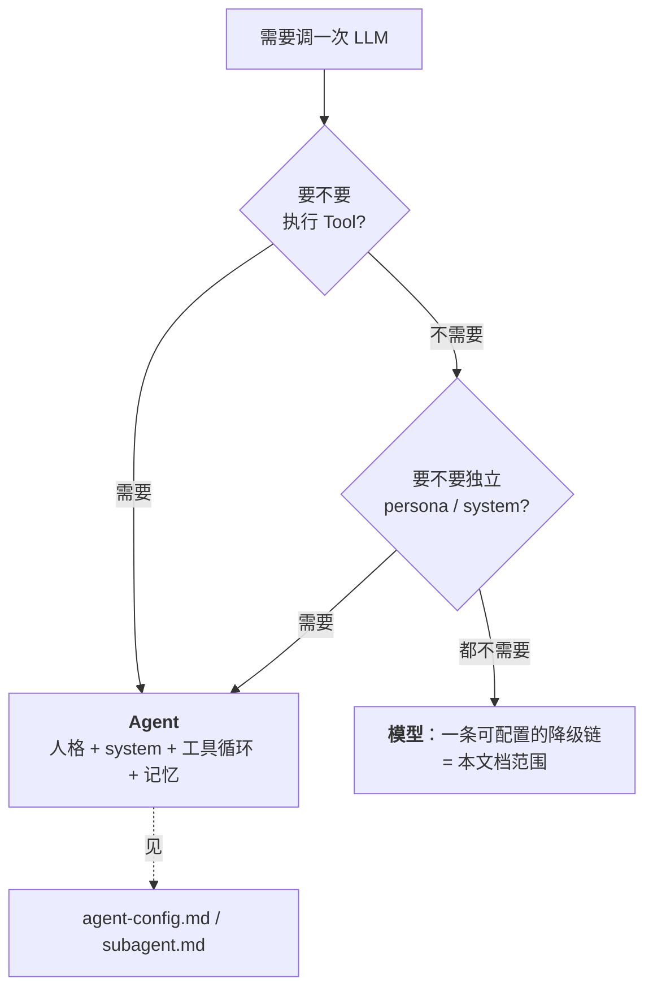
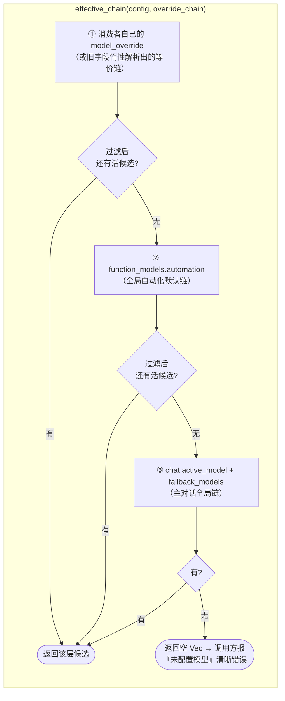
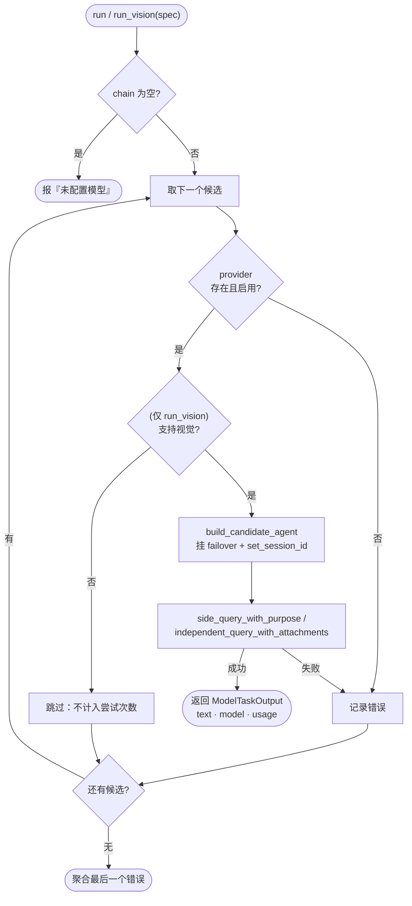
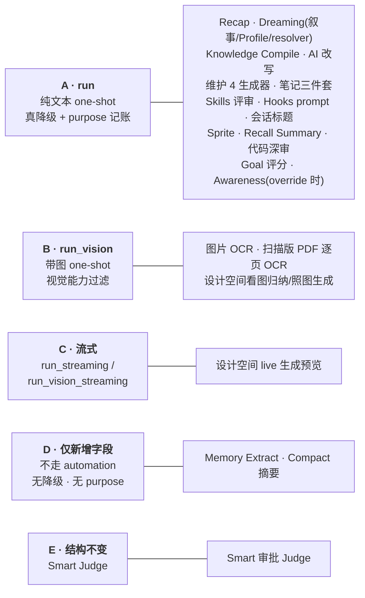

# 后台一次性模型调用（Automation Model）

> 返回 [文档索引](../../README.md)

主对话之外，Hope Agent 里散落着大量"给一段 prompt、拿一段文字（或一张图的描述）回来"的后台 LLM 调用——Recap 摘要、Dreaming 叙事重写、会话标题、代码深审、知识空间 OCR……它们共同的形态是：**一次调用、无工具循环、无独立人格**。本文档讲的就是这一类调用如何共享同一条可配置的模型链、同一个带真降级的执行原语，以及各消费者怎样接入它。

> **关联源码**
> - 执行原语：[`crates/ha-core/src/automation/mod.rs`](../../../crates/ha-core/src/automation/mod.rs)
> - 配置形状：[`crates/ha-config-schema/src/provider.rs`](../../../crates/ha-config-schema/src/provider.rs)（`ModelChain`）、[`crates/ha-config-schema/src/config.rs`](../../../crates/ha-config-schema/src/config.rs)（`FunctionModelsConfig.automation`）
> - purpose 记账：[`crates/ha-core/src/agent/side_query.rs`](../../../crates/ha-core/src/agent/side_query.rs)
>
> 视觉能力与[视觉桥](provider-system.md)同属 `function_models.*` 家族，但各走各的函数入口、互不调用。

---

## 1. 核心思想：什么时候是"模型"，什么时候是"Agent"

需要调一次 LLM 时，第一个要回答的问题是"这需要一个完整 Agent，还是只需要一个模型"。用错抽象的代价是双向的：给一次性调用套上完整 Agent 配置（人格、system prompt、工具循环、记忆）是过度设计；反过来，给真正需要工具或独立身份的功能只配一个模型，会削弱它的能力。

判断标准是两道闸，**两道都过不去**才归"模型"类：

1. **要不要执行 Tool？** 需要 Tool Loop（读文件、调 MCP、执行代码）→ Agent。
2. **要不要独立 persona / system prompt？** 需要区别于主对话的身份、指令集 → Agent。



两道闸都过不去的功能，只需要跟随一条**可配置的全局模型链（带跨模型降级）**，不需要 Agent 那套模型链、能力开关、记忆配置。Agent Team、Subagent 等确需完整 Agent 配置的功能不在本文档范围，见 [Agent 配置与解析链](agent-config.md) / [子 Agent 系统](../agent/subagent.md)。

---

## 2. 三层配置：模型链从哪来

一个后台任务用哪些模型，由 `automation::effective_chain` 一处解析，三层优先级从高到低兜底：



关键设计点：

- **每一层在被采用前都会剔除"死候选"**（provider 已删除 / 禁用）。这一步（`filter_live_candidates`）很重要：deprecated 的单冒号旧字符串本身不带存在性校验，若某层解析出的候选全部指向已删 provider，会**继续往下一层兜底**，而不是把一条注定失败的链交给 `run` 去逐个撞失败。
- **全新装机零配置也能用**：即便用户没配自动化默认链，第③层直接复用主对话的模型，功能不至于因为"没单独配"而失效。
- **返回空只发生在真的一个模型都没有时**，此时调用方据此报清晰错误，不是静默什么都不做。

### 2.1 `ModelChain`：统一的"这个任务用哪些模型"

`ModelChain`（[`ha-config-schema/src/provider.rs`](../../../crates/ha-config-schema/src/provider.rs)）就是"primary 先试、fallbacks 依次兜底"的一条链：

```rust
pub struct ModelChain {
    pub primary: ActiveModel,
    #[serde(default)]
    pub fallbacks: Vec<ActiveModel>,
}
impl ModelChain {
    pub fn into_vec(self) -> Vec<ActiveModel>  // 拍平成 [primary, ...fallbacks]
}
```

序列化沿用 `ActiveModel` 的 camelCase（`providerId` / `modelId`），不引入新分隔符约定。`ActiveModel` / `ModelChain` 均派生 `PartialEq, Eq`，供各消费者 config struct 的 `PartialEq` 传递。

### 2.2 `function_models.automation`：全局自动化默认链

`FunctionModelsConfig`（[`ha-config-schema/src/config.rs`](../../../crates/ha-config-schema/src/config.rs)）是一个"按功能类型给模型"的可扩展容器：

```rust
pub struct FunctionModelsConfig {
    pub vision: Option<ActiveModel>,      // 视觉桥：主模型纯文本时把图转成文字
    pub automation: Option<ModelChain>,   // 本文档：后台一次性任务的全局默认链
}
```

`vision` 与 `automation` 平级但互不影响。`automation = None` 表示未设全局自动化链，各消费者继续往下兜底到主对话链（即上图第③层）。它独立于主对话模型，好处是可以给这些一次性调用专门指定一个更便宜/更快的模型。

---

## 3. 执行原语：一次调用，真降级

`crate::automation` 模块提供一组配套的执行入口，全部围绕**同一条降级循环**：逐个试链上的候选，谁先成功返回谁，全失败聚合最后错误。

| 入口 | 形态 | 用途 |
|---|---|---|
| `run` | 纯文本 one-shot | 绝大多数后台调用 |
| `run_vision` | 带图 one-shot + 视觉能力过滤 | OCR、看图归纳等 |
| `run_streaming` | 纯文本流式 | 设计空间 live 生成预览 |
| `run_vision_streaming` | 带图流式 | 设计空间"照图生成"的流式预览 |

四个入口共享一个私有 helper `build_candidate_agent`——把"解析 provider → 构造 Agent → 挂 failover context → 设置 session_id"这四步集中一处。这正是防止"新增一条 one-shot 路径却漏了 `set_session_id`"这类回归的地方，也是整个模块存在的核心理由（见 §3.2）。

### 3.1 降级循环



这镜像了主对话经 `TurnKernel` 准入后由 `ha-agent-runtime` 执行的模型链降级语义——一个坏掉或不可用的 primary，会真正落到链上的下一个模型。返回的 `ModelTaskOutput` 有三个字段：

```rust
pub struct ModelTaskOutput {
    pub text: String,
    pub model: ActiveModel,        // 真正产出 text 的那个候选，未必是 chain[0]
    pub usage: crate::agent::ChatUsage,
}
```

`model` 是**真正产出 `text` 的那个候选**，可能是降级后的备用模型。凡需要持久化"由哪个模型生成"标签的调用方（Compile 的返回值、OCR 的 `OCR-Model:` 头），都应读这个字段，而不要在调用前用 `chain[0]` 预算——一旦真走了降级，预算的标签就悄悄错了。

### 3.2 关键设计：`set_session_id` 决定了有没有重试

`side_query` 的分派规则是一个容易踩的坑：只有当 agent **同时**带着 `provider_config` 和 `session_id` 时，才会走 `execute_with_failover`（`FailoverPolicy::side_query_default()` 的 profile 轮换重试）；否则直接走**无重试**的 direct 分支，一次网络抖动就整体失败。

`build_candidate_agent` 因此给每个候选都调用 `agent.set_session_id(session_key)`：有真实会话就传真实 `session_id`，没有就传一个合成键（如 `"automation:recap.facets"`）。`execute_with_failover` 只把它当作 `PROFILE_STICKY` / `PROFILE_COOLDOWNS` 的 bookkeeping key，不要求对应一条真实会话行。有了它，后台调用才既拿到"跨模型降级"（外层循环），又拿到"同模型跨 profile 重试"（`side_query` 内部）。这就是把这套逻辑从各消费者手里收进统一原语的原因——每个消费者手搓一遍，就会漏掉这关键一行。

### 3.3 `run_vision`：视觉能力过滤 + 精准诊断

`run_vision`（配 `VisionTaskSpec`）为"带 attachments + 逐候选视觉能力过滤"从零设计，与 `run` 只共享 `build_candidate_agent`：

```rust
pub struct VisionTaskSpec<'a> {
    pub purpose: &'static str,
    pub chain: Vec<ActiveModel>,       // 允许混杂视觉/非视觉模型
    pub session_key: &'a str,
    pub system: &'a str,               // 把 attachments 框定为不可信数据的 system prompt
    pub instruction: &'a str,
    pub attachments: &'a [crate::agent::Attachment],
    pub max_tokens: u32,
}
```

- **非视觉候选被跳过，不计入尝试次数**：链上混着一个偏好的视觉模型 + 几个便宜的纯文本兜底（为其他共享同一全局链的任务准备的），到达纯文本候选时会跳过而非报错。
- **诊断分两种情况**，避免把用户指向错误的修复方向：只有当确实遇到了"活着但不支持视觉"的 provider 时，才报"没有配置视觉模型，请选一个支持图像输入的模型"；如果每个候选都栽在 provider-lookup 那步（如 provider 被删/禁用），那是另一个更可操作的问题，按聚合错误如实上报。

**与视觉桥各走各的函数入口**：`run_vision` 走 agent 的 `independent_query_with_attachments`，视觉桥走自己的转录函数，两者在函数层面互不调用。已知限制（明确接受）：带图的独立查询目前仍不接 `execute_with_failover`，所以带图调用只拿到"跨模型"重试（`run_vision` 外层循环），拿不到"同模型跨 profile"重试；碰那个共享函数有污染视觉桥延迟预算的风险，留作后续独立课题。

### 3.4 流式变体：边产出边渲染

设计空间的 live 生成预览需要"边产出边渲染"，故 `run` / `run_vision` 各有一个流式 sibling，降级循环骨架相同，区别在最终查询：

- **`run_streaming(spec, cancel, on_text)`**：每个候选走 `side_query_streaming`，`on_text` 收**当前尝试的累积文本**。failover 换候选重试会从头重启累积，调用方按快照幂等重渲染（设计空间的快照节流已在累积文本缩短时重置高水位，故中途 failover 能正确渲染而非被吞）。
- **`run_vision_streaming(spec, cancel, on_text)`**：候选走 `side_query_streaming_with_attachments`（`OneShotMode::Independent { system }`，无缓存前缀，system prompt 把图框为不可信素材），逐候选按实际 provider 格式重建带图 user content。设计空间"照图生成/首页传图"的真多模态流式走这里。
- **记账**：两个流式 agent 方法**不自记**用量，由 automation 层统一经 `record_streaming_usage` 逐候选写 `KIND_SIDE_QUERY` 行（失败候选也留痕）；`path` 字段标 `automation.run_streaming` / `automation.run_vision_streaming` 区分入口。
- **取消**：`cancel` 透传进 SSE 拉取，且候选循环**每次进入前检查**——取消恰逢某候选失败时，不会再向下一候选发起完整请求。

---

## 4. Purpose 标签与用量记账

每次后台调用都带一个 `purpose: &'static str`，它穿透进用量记录，写入 `model_usage_events.operation` 列，让 Dashboard 能按消费者区分成本，而不是所有后台调用共用一个 `"agent.side_query"` 桶。这不是一个与 `KIND_SIDE_QUERY` / `KIND_VISION` 竞争的新 `KIND_*`——所有消费者调用形态完全相同（纯文本或纯图片 one-shot、无 tool），只是"谁在调、为什么调"不同。`purpose` 是 `KIND_SIDE_QUERY` 内部更细的一层维度，供 [Dashboard](../infra/dashboard.md) 按消费者拆分成本（`by_operation` / `by_domain`）。

命名规则：`purpose = "<域前缀>.<动作>"`，域前缀优先复用已有大类（`knowledge.*` 覆盖 compile/ocr/ai_rewrite，`dreaming.*` / `sprite.*` / `design.*` 同理）；只有当简写会与无关配置项撞名时才用完整类目名——`knowledge_maintenance.*` 是唯一这样的例外（`LocalLlmConfig.auto_maintenance` 已占了 `maintenance` 这个词）。

当前在用的 purpose 标签（`sqlite3 ~/.hope-agent/sessions.db "select operation, session_id from model_usage_events …"` 可直接查）：

| Purpose | 消费者 | 入口 |
|---|---|---|
| `recap.facets` / `recap.facets_merge` | Recap 逐会话 facet 提取 / 合并 | `run` |
| `recap.sections` / `recap.at_a_glance` | Recap 报告分段 / 一览摘要 | `run` |
| `dreaming.narrative` | Dreaming 叙事重写 | `run` |
| `dreaming.profile_rewrite` | Dreaming Profile 重写 | `run` |
| `dreaming.resolver.manual` | Dreaming 手动 Deep resolver 冲突判定 | `run` |
| `dreaming.resolver.auto` | Dreaming Light 后的自动 graph-first resolver sweep | `run` |
| `knowledge.compile` | 知识空间 source→note 摘要生成 | `run` |
| `knowledge.ai_rewrite` | 知识空间 AI 改写 | `run` |
| `knowledge.ocr` | 图片 OCR 导入 + 扫描版 PDF 逐页 OCR（共用） | `run_vision` |
| `knowledge_maintenance.auto_tag` / `.moc_upkeep` / `.memory_to_note` / `.source_conflict` | 知识空间维护 4 生成器（共享一个 `model_override`，各自独立打标） | `run` |
| `note_tools.distill` / `.moc` / `.session_to_note` | 笔记三件套（共享一个 `model_override`，各自独立打标） | `run` |
| `skills.auto_review` | Skills 自动评审 pipeline | `run` |
| `hooks.prompt` | Hooks `prompt` handler side-query | `run` |
| `session_title` | 会话标题生成 | `run` |
| `sprite.observe` | 桌面精灵观察调用 | `run` |
| `recall_summary` | Recall Summary 召回摘要 | `run` |
| `awareness.extraction` | 行为提取（两条路径共用同一标签，见 §5.4） | `side_query_with_purpose` / `run` |
| `review.deep` | 代码深审 LLM reviewer | `run` |
| `goal.semantic_grader` | Goal 完成度语义评分 | `run` |
| `design.generate` | 设计空间生成（纯文本走 `run`，带图走 `run_vision`） | `run` / `run_vision` |
| `design.stream` | 设计空间流式生成预览 | `run_streaming` / `run_vision_streaming` |
| `design.extract_vision` | 设计空间从截图归纳品牌契约 | `run_vision` |

`purpose` 通过内部 `side_query_with_purpose(purpose, …)` 进入记账（与公开的 `side_query()` 共享私有 `side_query_tagged(operation, …)` 实现）；流式路径则由 automation 层的 `record_streaming_usage` 直接落行。公开的 `side_query()` 签名不变，仍写 `"agent.side_query"`。

---

## 5. 消费者全景

十余个后台功能接入这套原语。按**执行形态**（而非各自的功能域）看，它们落在五类里：



### 5.1 A 类：走 `automation::run`（真跨模型降级 + purpose 记账）

这是主力路径，覆盖大多数纯文本后台调用。其中**带遗留字段**的消费者，解析逻辑统一为"新字段 `model_override` 优先 → 否则按旧逻辑原样解析旧字段 → 否则落到 `function_models.automation`"：

| 消费者 | 配置结构体 | 旧字段（deprecated，仍兼容） | 旧值解析方式 |
|---|---|---|---|
| Recap | `RecapConfig` | `analysis_agent`（agent_id） | `resolve_legacy_agent_chain` |
| Knowledge Compile | `KnowledgeCompileConfig` | `agent_id` | `resolve_legacy_agent_chain` |
| Dreaming | `DreamingConfig` | `narrative_model`（单冒号） | `parse_legacy_model_string` |
| Skills auto_review | `SkillsAutoReviewConfig` | `review_model`（单冒号） | `parse_legacy_model_string` |
| Hooks `prompt` | `PromptHookConfig` | `model`（单冒号，per-hook 实例字段） | `parse_legacy_model_string` |
| Session Title | `SessionTitleConfig` | `provider_id` / `model_id`（裸字段对） | 包成单元素链；解析链**始终追加当前会话的 `chat_model`** 作保底（标题生成不该因自动化链未配就彻底失败） |

两个解析原语的分工与刻意保留的不一致：

- **`resolve_legacy_agent_chain`**：读该 agent 的 `agent.json` 模型配置，走现有 `provider::resolve_model_chain` 物化成等价 `ModelChain`。只有 Recap / Knowledge Compile 借用过 agent id。
- **`parse_legacy_model_string`**：把单冒号 `"provider_id:model_id"` 解析成单元素链（无 fallbacks）。刻意**不复用** `provider::parse_model_ref`（后者用双冒号 `"::"`，`AgentModelConfig` 用）——两种分隔符是历史遗留的不一致，此模块不做静默"纠正"，否则会静默破坏已有的单冒号配置。

**纯新增字段**（无遗留兼容分支）的 A 类消费者：知识空间维护 4 生成器（`MaintenanceConfig`，一个共享 `model_override` 管全部 4 个任务，与它 `llm_timeout_secs` / `llm_max_tokens` 同粒度）、笔记三件套（`NoteToolsConfig`，一个共享字段；三者本就共用 `run_kb_side_query` 入口，且都带 `ctx.session_id` 天然拿到真实会话亲和）、Sprite（`SpriteConfig`，给完整链而非 Judge 式单模型——它是真正的 fire-and-forget，没有硬延迟预算）、Recall Summary（`RecallSummaryConfig`）、知识空间 AI 改写（无持久配置，改写内部 `resolve_rewrite_chain`：用户显式选了模型就单模型钉死绝不静默换，没选就走 `effective_chain` 真降级）。

代码里另外几个 A 类消费者没有专属配置结构体，直接组装 `effective_chain` 后调 `run`：**代码深审**（`review.rs` 的 LLM reviewer，purpose `review.deep`，复用 Recap 的 legacy 链解析）、**Goal 完成度语义评分**（`tools/goal.rs`，purpose `goal.semantic_grader`）、**设计空间文本生成**（purpose `design.generate` 的纯文本分支）。

**Recap 的特殊结构**：一次报告要跑几十次独立 LLM 调用（逐会话 facet 提取 + 多段落生成），每次重新解析配置代价不小。`recap/report.rs` 的 `resolve_recap_chain()` 在报告开始时解析一次，产出 `Arc<Vec<ActiveModel>>` 贯穿每个独立调用（而非共享一个 `AssistantAgent`），这样每个调用仍各自独立走 `run` 的降级循环，不会因共享 Agent 而共享失败状态。

### 5.2 B 类：走 `automation::run_vision`（带图 one-shot）

| 消费者 | 配置 | purpose | 说明 |
|---|---|---|---|
| 图片 OCR | `KnowledgeVisionConfig` | `knowledge.ocr` | `timeout_secs` 为整条降级尝试的总预算，避免单个候选卡死阻塞后续候选；`max_tokens` 限制输出。**无遗留字段**——OCR 模型直接由 `KnowledgeVisionConfig` 指定 |
| 扫描版 PDF 逐页 OCR | 同上（`ocr_concurrency` / `max_ocr_pages` 两个增量字段） | `knowledge.ocr`（与单图 OCR 共用） | `timeout_secs` 语义为**每页**预算；按逐页粒度追踪成败、支持只重试失败页，完整设计见 [`knowledge-base.md`](knowledge-base.md) |
| 设计空间看图归纳品牌契约 | 无持久配置 | `design.extract_vision` | 视觉模型直接看截图 |
| 设计空间照图生成 | 无持久配置 | `design.generate`（带图分支） | 与文本分支共享 purpose |

### 5.3 C 类：流式（设计空间）

设计空间 live 生成走 `run_streaming` / `run_vision_streaming`，purpose `design.stream`。机制见 §3.4。

### 5.4 D 类：仅新增字段、维持原执行路径（无降级、无 purpose）

有两个消费者的现有执行签名不支持链式循环，为此重构不成比例——它们只在原解析优先级里插入新字段，**不经过 `automation::run`**：

| 消费者 | 配置 | 新字段 | 说明 |
|---|---|---|---|
| Memory Extract | `MemoryExtractConfig` | `model_override: Option<ActiveModel>`（单模型，非链） | 解析优先级：per-agent 覆盖 → `model_override` → 旧裸字段对 → 兜底；kernel 在执行准入时把已解析模型与 Provider 快照封装为 `MemoryExtractModel`，`ha-memory::extract` 只消费该能力，配置变化不能改写在途执行 |
| Compact 摘要 | `CompactConfig` | `model_override: Option<ActiveModel>` | `effective_summarization_model_ref()`：`model_override` 优先，否则回退 `summarization_model`；**刻意不接入 `function_models.automation`**——Tier-3 摘要是 fail-fast 设计，不希望因全局链配错而拖慢/连锁失败上下文压缩这条关键路径 |

**Awareness 的分裂路径**（既非纯 D 也非纯 A，值得单列）：`LlmExtractionConfig` 原有的 `extraction_agent` / `extraction_model` 是**死配置**（前者读了但从未真正切换 agent，后者全仓库零消费），已直接删除、不保留兼容读取。新的 `model_override` 分两条路径，**两条都打 `awareness.extraction` 标签**：

- `model_override = None`（默认，即所有现存配置）→ `self.side_query_with_purpose("awareness.extraction", …)`：复用当前 chat agent 的 cache 前缀，便宜、共享 prompt cache；
- 设置了 `model_override` → 切到 `automation::run`（同一 purpose）：换取指定独立/更便宜模型，代价是放弃 cache 共享——一个用户主动选择的权衡，不是免费升级。

非显然的坑：override 路径的超时是**每候选**预算，故外层 timeout 随链长缩放（`EXTRACTION_TIMEOUT × candidate_count`），否则配了 fallback 链反而会在第二个候选被试之前就被砍断。

### 5.5 E 类：Smart 审批 Judge（不属重塑范围）

`SmartModeConfig.judge_model: Option<JudgeModelConfig>`（`provider_id` + `model` + `extra_prompt`，[`permission.rs`](../../../crates/ha-config-schema/src/permission.rs)）**维持后端结构不变**——Judge 是一个有严格延迟预算的实时安全检查（approval 超时通常以秒计），刻意不引入模型链/跨模型重试（会在预算内叠加多次网络往返），也不接入 `function_models.automation`。GUI（[`SmartModeSection.tsx`](../../../src/components/settings/approval-panel/SmartModeSection.tsx)）用 `<ModelSelector>` 下拉写入 `{providerId, model}` 形状。

---

## 6. 迁移策略：新旧字段共存，消费点惰性解析

新字段 `model_override` 与旧字段并存，旧字段标 deprecated 但保留；每个消费者"新字段优先 → 否则原样解析旧字段 → 否则落全局默认链"。**不做 config.json 物理迁移**——GUI 只写新字段，旧字段自然被晾在一边，直到用户下次在对应面板保存。`AppConfig.embedding` 是这个模式的现成先例。

选择消费点惰性解析而非启动期文件手术，是因为后者行不通：类型化配置在任何自定义迁移代码有机会运行前，就已被首次解析（hooks 初始化、以及 server/acp 模式下 onboarding 状态读取都会触发首次类型化解析）；Hooks 的 `model` 字段还分散在 `config.json` + 托管/项目/本地三个 `hooks.json` 共 4 处，物理迁移天然覆盖不到后三处，而新旧字段共存则自然覆盖全部 4 处。

各遗留兜底函数（`build_analysis_agent` 家族及借用它的路径）已随消费者迁移整体删除。把模型链解析与 session 亲和收进统一原语后，每个后台调用同时拿到跨模型降级（`effective_chain` 外层循环）与 profile 级重试（`set_session_id` 触发）——这两件事散落在各消费者手里各写一遍时最容易漏。

---

## 7. GUI

### 7.1 共享组件 `ModelChainEditor`

[`src/components/ui/model-chain-editor.tsx`](../../../src/components/ui/model-chain-editor.tsx) 组合已有的 `<ModelSelector>`（provider→model 两级下拉）+ dnd-kit 可拖拽排序的 fallback 列表：

```tsx
interface ModelChainEditorProps {
  value: ModelChainRef | null   // null = 继承上一层
  onChange: (next: ModelChainRef | null) => void
  availableModels: AvailableModel[]
  inheritLabel: string          // value=null 时主选择器的占位文案
  allowFallbacks?: boolean      // 默认 true；Smart Judge 场景故意不用此组件
  className?: string
}
```

`allowFallbacks=false` 用于"需要单模型选择但不暴露降级承诺"的 UI。清除按钮（回到继承态）用 `<IconTip>` 包装而非原生 `title`，遵守前端规范。

### 7.2 全局面板与专用命令

[`GlobalModelPanel.tsx`](../../../src/components/settings/GlobalModelPanel.tsx) 紧邻 Vision Bridge 区块新增自动化默认链区块，用 `<ModelChainEditor>` 绑定 `function_models.automation`。未新建独立 `AutomationPanel.tsx`、未新增 Settings nav 项——`function_models` 的两个功能（vision + automation）共用一个页面。专用命令：

- `get_automation_model_chain` / `set_automation_model_chain`（Tauri，[`commands/provider/models.rs`](../../../src-tauri/src/commands/provider/models.rs)，经 `mutate_config_async(("function_models", "ui"), …)`）
- HTTP `GET` / `PUT /api/models/automation`（[`routes/models.rs`](../../../crates/ha-server/src/routes/models.rs)）

### 7.3 各消费者面板绑定

| 面板 | 绑定字段 |
|---|---|
| `RecapSettingsPanel.tsx` | `modelOverride`（原 Agent 下拉整体替换） |
| `DreamingPanel.tsx` | `modelOverride`（原单模型 `ModelSelector` 整体替换） |
| `KnowledgePanel.tsx`（`CompileAgentSection` / `KnowledgeVisionSection` / `NoteToolsSection`） | Compile / OCR / 笔记三件套各一个 `<ModelChainEditor>`（笔记是一个共享字段一张卡，不是三行） |
| `SkillEvolutionView.tsx` | `modelOverride`（原单冒号字符串 `StringField` 替换） |
| `HooksPanel.tsx` | `prompt` handler 的 `modelOverride`（`FieldDef.kind` 新增 `"modelChain"` 分支，`availableModels` 逐层透传） |
| `KnowledgeMaintenanceSection.tsx` / `SpriteSection.tsx` | 各加一行 `<ModelChainEditor>`（`MaintenanceConfig` / `SpriteConfig.modelOverride`） |
| `memory-panel/RecallSummarySection.tsx`（新文件） | `enabled` 主开关 + 调优项 + `modelOverride`，挂在 `MemorySettingsView.tsx` 里 `<ExtractConfig>` 之后、`<BudgetConfig>` 之前（"记忆相关工具调用时的行为调优"之家） |
| `SmartModeSection.tsx` | 见 §5.5，用 `<ModelSelector>` 非 `<ModelChainEditor>` |
| `ai_rewrite` | 无新增 GUI——`QuickRewriteBar.tsx` 已有 per-request 模型下拉 |
| Session Title | 无独立 GUI 面板（`model_override` 字段已就绪，待有归属面板时接线） |

全部复用已有的 `get_available_models` + `<ModelChainEditor>`，未新发明前端组件。

---

## 8. 设置三件套

用户可调配置须同时有 GUI 入口与 `ha-settings` 能力，接入方式取决于类目是否已注册：

- **`function_models`（MEDIUM）** 已随视觉桥注册完整，`automation` 只是 struct 内新增字段，`read_category` / `update_app_config` 走整体 `serde_json::to_value` / `merge_field` 自动覆盖，`tools/settings.rs` / `core_tools.rs` / SKILL.md 无需改动。
- **`knowledge_maintenance`（HIGH）/ `sprite`（MEDIUM）/ `recall_summary`（MEDIUM）** 是已注册类目加字段，`merge_field` 全字段通用读写自动覆盖新的 `model_override`，零额外注册。
- **`knowledge_vision` / `note_tools`（均 MEDIUM）** 是新注册类目，在 [`tools/settings.rs`](../../../crates/ha-core/src/tools/settings.rs) 的 `risk_level()` / `read_category()` / `update_app_config()` 三处 match 各加一条，`core_tools.rs` 的 read/write enum 各加两个类目名，SKILL.md 补两行登记。

新增的 `get_automation_model_chain` 等命令从第一天就用 `mutate_config_async`：async Tauri/HTTP 处理器里的同步文件 IO 一律经 `mutate_config_async` / `SessionDB::run` / `blocking::run_blocking` 下放到 blocking 池，这是配置读写的硬红线。`KnowledgeVisionConfig` / `NoteToolsConfig` 走 `knowledge::service` 的 async 命令，`RecallSummaryConfig` 命令写在 `commands/config.rs`，均无同步文件 IO。

---

## 9. 关键文件索引

> 拆分后的分层：**wire 类型**（`ModelChain` / 各 `*Config` 结构体）落 `ha-config-schema`，**执行机器**落各特征 crate，**执行原语与记账**留 `ha-core` kernel。

| 关注点 | 位置 |
|---|---|
| 模型链 wire 类型 `ModelChain` / `ActiveModel` | `crates/ha-config-schema/src/provider.rs` |
| 全局字段 `FunctionModelsConfig.automation` | `crates/ha-config-schema/src/config.rs` |
| 执行原语 `effective_chain` / `run` / `run_vision` / `run_streaming` / `run_vision_streaming` / `build_candidate_agent` / `resolve_legacy_agent_chain` / `parse_legacy_model_string` / `model_label` | `crates/ha-core/src/automation/mod.rs` |
| purpose 记账 `side_query_with_purpose` / `side_query_tagged` / `independent_query_with_attachments` | `crates/ha-core/src/agent/side_query.rs` |
| 流式 `side_query_streaming` / `side_query_streaming_with_attachments` | `crates/ha-core/src/agent/side_query_stream.rs` |
| Recap | 配置 `ha-config-schema/src/config.rs`（`RecapConfig`）；执行 `crates/ha-dash/src/recap/{report,facets,sections}.rs`（`resolve_recap_chain`） |
| Knowledge Compile | 配置 `ha-config-schema/src/knowledge/types.rs`（`KnowledgeCompileConfig`）；执行 `crates/ha-knowledge/src/knowledge/compile.rs` |
| Dreaming | 配置 `ha-config-schema/src/memory/dreaming.rs`；执行 `crates/ha-memory/src/dreaming_{pipeline,narrative,profile,resolver}.rs`，kernel `memory/dreaming/pipeline.rs` 仅保留模型解析与 typed runtime port |
| Skills auto_review | 配置 `ha-config-schema/src/skills.rs`；执行 `crates/ha-skills/src/skills/auto_review/pipeline.rs`（`query_review_agent`） |
| Hooks `prompt` | 配置 `ha-config-schema/src/hooks.rs`（`PromptHookConfig`）；执行 `crates/ha-core/src/hooks/runner/prompt.rs`（`resolve_prompt_hook_chain`） |
| Session Title | 配置 `ha-config-schema/src/session_title.rs`；执行 `crates/ha-core/src/session_title.rs`（`generate_and_update_title`） |
| Memory Extract | 配置 `ha-config-schema/src/memory/types.rs`（`MemoryExtractConfig`）；执行 `crates/ha-memory/src/extract.rs`，kernel port `crates/ha-core/src/memory/extract_runtime.rs` + turn context `chat_engine/context.rs` |
| Compact | 配置 + 方法 `ha-config-schema/src/context_compact.rs`（`CompactConfig::effective_summarization_model_ref`） |
| Awareness | 配置 `ha-config-schema/src/awareness.rs`（`LlmExtractionConfig`）；执行 `crates/ha-core/src/agent/mod.rs`（`run_extraction_inline`） |
| Sprite | 配置 `ha-config-schema/src/sprite.rs`；执行 `crates/ha-core/src/sprite/{config,mod}.rs`（`observe_and_maybe_speak`） |
| Recall Summary | 配置 `ha-config-schema/src/memory/recall_summary.rs`；执行 `crates/ha-core/src/memory/recall_summary.rs`（`run_summary`） |
| 图片 / PDF OCR | 配置 `ha-config-schema/src/knowledge/types.rs`（`KnowledgeVisionConfig`）；执行 `crates/ha-knowledge/src/knowledge/{source,service}.rs` |
| 知识空间维护 | 配置 `ha-config-schema/src/knowledge/maintenance/config.rs`（`MaintenanceConfig`）；执行 `crates/ha-knowledge/src/knowledge/maintenance/generators.rs`（`run_side_query` + 4 生成器） |
| 笔记三件套 | 配置 `ha-config-schema/src/knowledge/types.rs`（`NoteToolsConfig`）；执行 `crates/ha-knowledge/src/tools/note.rs`（`run_kb_side_query`） |
| AI 改写 | 执行 `crates/ha-knowledge/src/knowledge/service.rs`（`resolve_rewrite_chain`） |
| 代码深审 | 执行 `crates/ha-core/src/review.rs`（`run_llm_reviewer`） |
| Goal 语义评分 | 执行 `crates/ha-goal/src/tools/goal.rs`；ledger / Stop fence 仍在 kernel `goal/` |
| 设计空间生成/提取 | 执行 `crates/ha-design/src/design/{generate,extract}.rs` |
| Smart Judge | 配置 `ha-config-schema/src/permission.rs`（`JudgeModelConfig`）；执行 `crates/ha-core/src/permission/{mode,judge}.rs`（未改后端结构，见 §5.5） |
| 前端共享组件 | `src/components/ui/model-chain-editor.tsx` |
| 全局面板 | `src/components/settings/GlobalModelPanel.tsx` |
| 命令 / 路由 | `src-tauri/src/commands/provider/models.rs` + `crates/ha-server/src/routes/models.rs` |
| 设置台账 | `crates/ha-core/src/tools/settings.rs` |
| Dashboard purpose 拆分 | `crates/ha-dash/src/dashboard/{types,queries,filters}.rs`（`operation_domain`、`DashboardFilter.operation`） |

---

## 10. 已知边界

**混合文本 + 扫描页的 PDF**：扫描版 PDF 逐页 OCR 兜底只在整份 PDF **完全没有文本层**时触发——只要文本抽取返回非空（哪怕只是文档里一页扫描附录之外、其余页正常抽取到的文本），就走普通文本路径，不会对文本抽取"漏掉"的个别扫描页单独尝试 OCR。这是刻意的最小范围，避免给每一份"恰好某页没抽出文本"的正常 PDF 都加一次视觉调用。完整设计见 [`knowledge-base.md`](knowledge-base.md)。
