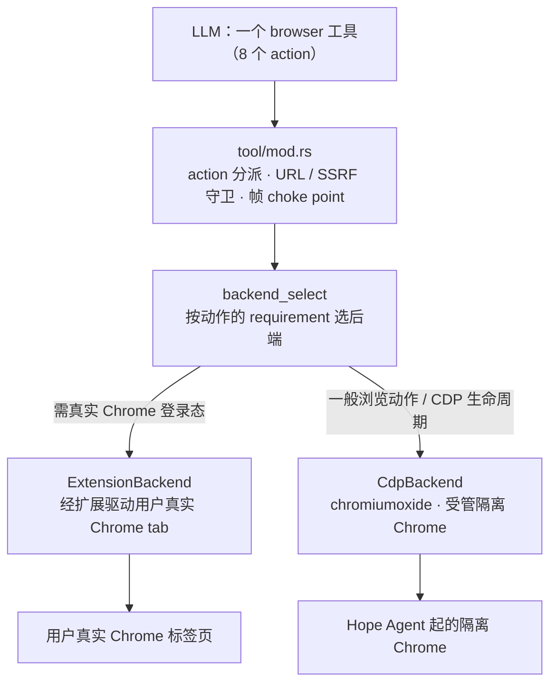
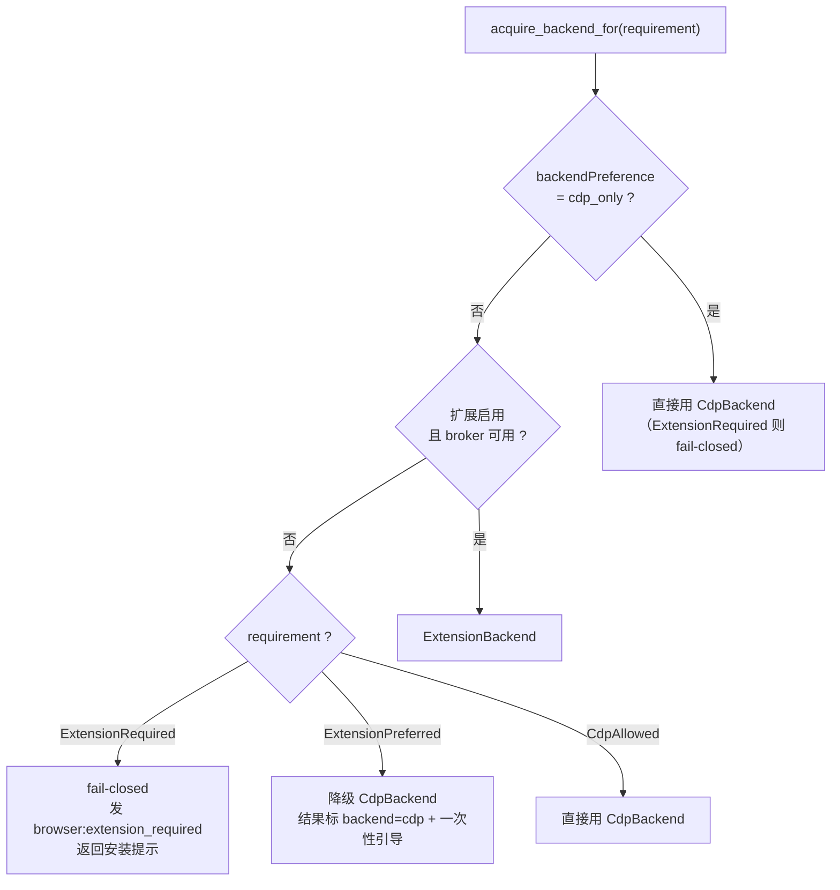
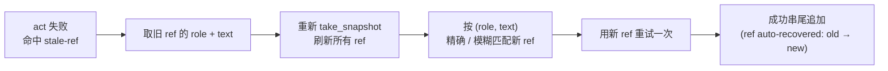
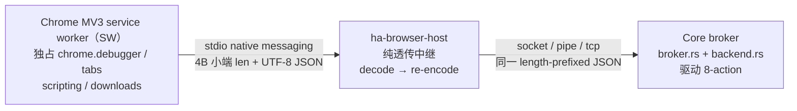
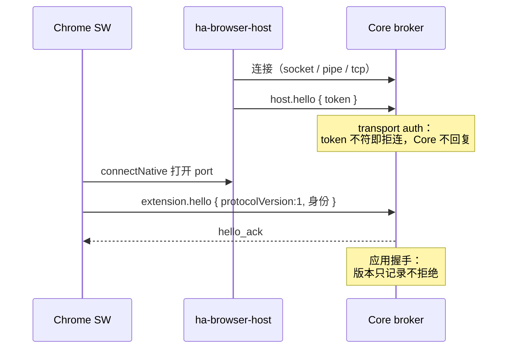
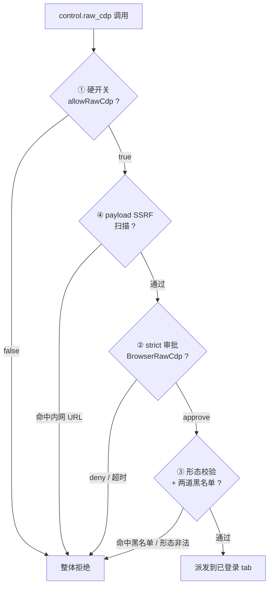
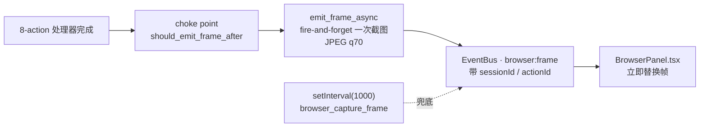

# 浏览器自动化子系统

> 返回 [文档索引](../../README.md) | 关联源码：[`crates/ha-browser/src/browser/`](../../../crates/ha-browser/src/browser/)、[`crates/ha-browser/src/tool/mod.rs`](../../../crates/ha-browser/src/tool/mod.rs)、[`src/components/chat/BrowserPanel.tsx`](../../../src/components/chat/BrowserPanel.tsx)、[`skills/ha-browser/SKILL.md`](../../../skills/ha-browser/SKILL.md)

## 核心思想

这个子系统要解决的问题是：**让模型稳定地操作一个真实的、已经登录了各种账号的浏览器**，而不是每次都从零起一个干净的自动化浏览器再去登录、过验证码。真正的价值不在"能打开网页"，而在"能用你本人的身份浏览"——已登录的 Gmail、内网系统、需要 2FA 的站点。

围绕这个目标，三条设计决策把整个子系统撑了起来：

1. **对模型只暴露一个 `browser` 工具、8 个高层 action。** 模型不需要懂 CDP、native messaging、iframe flat session；它看到的是 `navigate / snapshot / act / observe` 这类语义清晰的动作，标准循环是 `status → tabs → snapshot → act → 必要时 resnapshot`。所有脏活藏在下面。

2. **默认驱动用户真实的 Chrome，兜底才用隔离浏览器。** 主后端是 **Chrome 扩展 + Native Messaging Host**：扩展跑在用户真实的 Chrome profile 里，通过 `chrome.debugger` 控制已打开的 tab。当扩展没装、不可用、或动作本就不依赖真实登录态时，才降级到 `CdpBackend`（用 `chromiumoxide` 起一个受管的隔离 Chrome）。这条"扩展优先、CDP 兜底"的选路是按**动作的语义需求**做的，不是一刀切。

3. **能力越强，闸门越多。** 操作别人已登录的浏览器是把双刃剑。子系统把风险按能力分级：普通浏览动作走一次工具审批；触及真实 Chrome tab、下载、执行 JS 的动作叠 SSRF 与专门的审批原因；而能力最强的 `control.raw_cdp`（把裸 DevTools Protocol 打到登录 tab 上）叠了**四道独立闸**，任何一道拒绝即整体拒绝，且永远不允许"下次别问了"。

> 为什么真实日常 Chrome 必须走扩展 claim、而不能用 CDP 直接接管：Chrome 148+ 在架构上禁止把 `--remote-debugging-port` 落在默认 user-data-dir 上，所以"用 CDP 接管你正在用的那个 Chrome"从根上不可行。真实登录态只能经扩展 `chrome.debugger` 触达；CDP 后端只能驱动 Hope Agent 自己起的隔离 Chrome。

下面从"模型看到的表面"往下，一层层讲到"三进程线协议"，再到"安全模型"和"给用户看的实时面板"。

---

## 一、模型看到的表面：8 个 action

模型调用的是单个 `browser` 工具，参数分派成 8 个高层 action：

| action | 参数 | 作用 |
| --- | --- | --- |
| `status` | — | 当前后端 / 扩展 / native host / CDP fallback 的诊断 |
| `profile` | `op: list\|launch\|connect\|disconnect\|install_runtime` | CDP 会话（隔离浏览器）生命周期 |
| `tabs` | `op: list\|new\|select\|close\|open_user_tabs\|claim\|release\|finalize` | 标签页管理 · 认领真实 Chrome tab |
| `navigate` | `url?`, `op: go\|back\|forward\|reload` | 导航 |
| `snapshot` | `format: role\|screenshot\|pdf` | 页面快照 |
| `act` | `kind: click\|dblclick\|fill\|type\|hover\|drag\|select\|press\|upload` | 交互（`type` 是 `fill` 的兼容别名） |
| `observe` | `kind: console\|network\|page_errors\|downloads`, `since?` | 读取运行时事件流 |
| `control` | `op: resize\|scroll\|wait_for\|handle_dialog\|evaluate\|raw_cdp\|download_cancel` | 高级控制 |

完整 JSON schema 在 [`tools/definitions/core_tools.rs`](../../../crates/ha-core/src/tools/definitions/core_tools.rs) 的 `TOOL_BROWSER` 段。工具标记 `default_deferred: true`：常态不进 system prompt，模型通过 `tool_search` 按需拉取，避免这个大工具长期占用上下文。

配套的 [`skills/ha-browser/SKILL.md`](../../../skills/ha-browser/SKILL.md) 教模型标准操作循环，并列出必须停下来交给用户的阻塞情形——登录、2FA、captcha、摄像头授权、文件下载等——一律走 `ask_user_question` 人工接管，不尝试自动破解。

---

## 二、后端选择：扩展优先，CDP 兜底

### 分层总览



跨后端还有两个旁路能力：`observe_buffer` 环形缓冲（console / network / errors）与 [`frame.rs`](../../../crates/ha-browser/src/browser/frame.rs)（`browser:frame` 事件 + 截图 API），它们不属于某个后端，服务上层的 observe 和实时面板。

### 按动作需求选路

[`backend_select`](../../../crates/ha-browser/src/browser/backend_select.rs) 的入口是 `acquire_backend_for(ctx, requirement)`。每个 action 处理器根据自己"是否依赖真实 Chrome 状态"声明一个 `requirement`，选路逻辑据此裁决：



三档 requirement 的语义：

| requirement | 典型动作 | 扩展不可用时 |
| --- | --- | --- |
| `ExtensionRequired` | `tabs.open_user_tabs`、`tabs.claim`、操作已 claim 的 user tab、用户明确要求"当前 Chrome / 已登录 tab" | **fail-closed**：发 `browser:extension_required`，返回安装提示。**绝不悄悄退回隔离 profile**——在错误的浏览器里"成功"比失败更糟 |
| `ExtensionPreferred` | 普通导航、截图、snapshot、表单填写等一般浏览 | 可降级到 `CdpBackend`，结果里标明 `backend=cdp`，并发一次性引导提示鼓励用户装扩展 |
| `CdpAllowed` | `profile.launch/connect/install_runtime`、Docker/headless、显式的 CDP 生命周期操作 | 本就直接走 `CdpBackend` |

上表按默认 `backendPreference=extension_first` 描述降级行为。另两档取值改的是这套裁决：`extension_only` 下扩展不可用只对 `CdpAllowed`（`profile.*` 等 CDP 生命周期操作）放行，`ExtensionPreferred` 的一般浏览动作也 fail-closed、不退回 CDP；`cdp_only` 反过来，一切直接走 `CdpBackend`，只有 `ExtensionRequired` 会被拒（流程图 PREF 判定画的就是这一档）。

活跃后端缓存成 `Arc<dyn BrowserBackend>`；缓存的后端若 `is_alive()` 报死、或不满足当前 requirement（例如缓存的是 CDP 但这次 `ExtensionRequired`），会被丢弃重建。反过来，当扩展从不可用变可用时，缓存的 CDP 后端也会被主动丢弃，让后续动作用上真实 Chrome。

> `profile.launch` / `profile.connect` 只管理 CDP 兜底浏览器的生命周期。真实用户 Chrome tab 必须经扩展 `claim`——没有"接管默认 profile"这种路径。

### `BrowserBackend` trait

[`backend.rs`](../../../crates/ha-browser/src/browser/backend.rs) 定义 `BrowserBackend` trait，把"怎么驱动 Chrome"从 8-action 表面隐藏掉。这一组 async 方法覆盖 8-action 的全部底层操作（tabs / navigate / snapshot / act / control / observe）。

共享数据类型——`ElementRef` / `Snapshot` / `ActKind` / `ActParams` / `ObserveEntry` / `ScreenshotParams` / `PdfParams` 等——刻意保持 backend-agnostic，方便未来接入 Playwright / WebDriver 之类的其他实现。其中 `ElementRef.locator` 是后端私有字段（CDP 后端存 CSS selector），8-action 层从不读它，只透传 `ref_id`，模型永远只看到 `[ref=12]` 这样的稳定引用。

### `ExtensionBackend`：驱动真实 Chrome

[`extension/backend.rs`](../../../crates/ha-browser/src/browser/extension/backend.rs) 通过 Core broker 与 Chrome 扩展通信。**策略真相源全部在后端进程**，越靠边缘越薄：

- **native host（`ha-browser-host`）是极薄的本机桥**：只做 Chrome Native Messaging 的 stdio 帧与本机 broker socket/pipe 之间的转发，不持有任何业务策略。
- **策略集中在后端**：后端选择、tab lease、response/blob 校验、session cleanup 在 `ha-browser`；工具审批、protected path 在 `ha-core`；SSRF 在 `ha-base`。**host 与扩展永不做安全裁决**。

主要能力：

- **真实 Chrome tab 生命周期**：`tabs.open_user_tabs` / `claim` / `select` / `release` / `finalize`。claim lease 按 Hope 会话隔离，turn 结束和 session 清理时 best-effort 释放。`tabs.select` 传入扩展的数字 tab id 会激活并接管该真实 tab，走统一审批流；想显式表达"接管"语义时更推荐 `tabs.claim`。
- **强 snapshot**：DOM ref + AX 富化 + 仅 AX 可读节点。带 `backendDOMNodeId` 的可操作 AX 节点会生成可操作 ref。
- **iframe**：同源 iframe 用 `iframeSelector >>> selector`；跨域 iframe 走 `chrome.scripting` bridge 与 `chrome.debugger` flat session，`browser.status` 输出 frame tree / matched session 诊断。
- **observe**：console / network / page errors / downloads 环形缓冲。前三者按当前受控 tab 过滤；downloads 是真实 Chrome 的下载活动流，读取前走统一审批。
- **强能力出口**：`control.raw_cdp` 要求 ExtensionBackend + active controlled tab，并叠加形态校验、两道黑名单、strict 审批、硬开关（见「四、安全模型」）。`control.download_cancel` 仅 ExtensionBackend 支持，按 download id 中断 Chrome 下载，同样走统一审批。

`tabs.finalize` 的关闭语义由 tab 归属决定：**claimed 的 user tab 只 release / detach debugger，默认保持打开**（那是用户自己的 tab）；**Hope 自己创建的 agent tab 默认关闭**，除非调用时把对应 `target_id` 放进 `keep: ["..."]`。

### `CdpBackend`：隔离兜底

[`cdp_backend.rs`](../../../crates/ha-browser/src/browser/cdp_backend.rs) 包装 [`browser_state`](../../../crates/ha-browser/src/browser_state.rs) 全局单例。`browser_state` 维护 `chromiumoxide` 的 `Browser` handle、`Page` 池、`active_page_id`、`ElementRef` 表和 CDP event handler 任务；`CdpBackend` 只是 trait 适配薄壳，自己不持状态。它长期保留，服务 fallback、Docker/headless、自托管和无扩展场景。

**全局目标串行化**：单个 `CdpBackend` 方法会安全快照当前页，但 `select → resize → screenshot → close → restore` 这类多步流程若只逐方法加锁，仍会被另一调用在步骤间改写 `active_page_id`。所有浏览器工具调用、CDP 实时帧、BrowserPanel 导航 / 生命周期操作，以及设计制品的截图、PDF、视频和视觉回归捕获，必须在整个高层流程持有 `acquire_cdp_operation_guard()`；扩展后端的实时帧不占此锁。新增直接使用 `CdpBackend` 的多步入口不得绕过该守卫。

**Stale-ref 一次自恢复**：页面结构变化会让上一轮 snapshot 里的 ref 失效。当 `act` 失败且错误匹配 `is_stale_ref_error`（`not found` / `no such element` / `stale` / `detached`）时，内部触发一次自愈：



尾部追加的提示让模型知道发生过一次自愈。**只重试一次**，避免死循环；`navigate` / `tabs.*` / `control.*` 不走 recovery。

---

## 三、底层链路：三进程 Native Messaging 协议

模型看到的是高层 8-action，其底层是一条跨三进程的 native-messaging 链路。本节是这条链路的**线协议与不变量**——8-action 表面的实现真相源。

> 关联源码：[`extensions/chrome/service_worker.js`](../../../extensions/chrome/service_worker.js)（Chrome MV3 service worker）、[`ha-browser-host`](../../../crates/ha-browser-host/src/main.rs)（native host 二进制，`main.rs` / `protocol.rs`）、[`extension/broker.rs`](../../../crates/ha-browser/src/browser/extension/broker.rs) / [`extension/backend.rs`](../../../crates/ha-browser/src/browser/extension/backend.rs)（Core broker + 后端）。

### 三进程拓扑与帧格式



- **SW 是唯一可拨号 / 重连的一方。** Chrome 与 host 走 stdio，host 与 Core 走 socket/pipe/tcp。**Core 纯粹是 listener/broker，没有任何 reconnect / keepalive / heartbeat**，broker 不实现 `heartbeat` / `ping` 方法。（注意：扩展层配置里有个 `BrowserExtensionConfig.heartbeatIntervalSecs`（默认 15s），但它**目前不被任何路径消费**，既不 plumb 给 host 也不影响本链路；真正起作用的心跳属于另一条 CDP/WebSocket 后端——`browser_state.rs` 里 ping `browser.version()`，默认 120s、per-tick 10s 超时——用来对抗 Chrome 约 4 分钟的 WebSocket idle 关闭，与本节链路无关。）
- **统一帧格式。** 两段链路复用同一 Chrome Native Messaging 线格式：**4 字节小端 u32 长度前缀 + 该长度的 UTF-8 JSON body**。host 侧 `MAX_NATIVE_MESSAGE_LEN` 与 Core 侧 `MAX_BROKER_MESSAGE_LEN` 都是 `1024×1024`（1 MiB，读写双向强制，`len==0` 拒绝，header 前干净 EOF = 优雅关闭）。**1 MiB 是 per-frame 线上限**，更大的 payload 走后面的 chunk / blob 通道。

### 两段握手

连接建立分两步，各管一件事：



1. **`host.hello` token 握手（传输层鉴权）**：host 连上 broker 后**同步**写出首帧 `host.hello`，携带 discovery 文件里的本机 token。broker 把该 token 校验为强制首帧，**不符直接拒连**（`native host token mismatch`），且 Core 从不回复 `host.hello`。
2. **`extension.hello` 应用握手**：SW 在 port 打开后立刻 fire-and-forget 发 `extension.hello`（带 `protocolVersion:1` + 身份），Core 回 `hello_ack`。`PROTOCOL_VERSION = 1`；**版本只记录不拒绝**，不匹配仅由 [`diagnostics.rs`](../../../crates/ha-browser/src/browser/extension/diagnostics.rs) 抛 `VersionMismatch`（`next_action=reload_extension`）。

### Peer 身份校验（fail-closed）

传输层不只靠 token，还校验对端进程属于同一用户：

- **Unix**：`SO_PEERCRED`（Linux）/ `getpeereid`（macOS+BSD）校验 peer euid 必须 `==` 当前 euid，**无法确定 uid 一律拒连**。
- **Windows**：`ImpersonateNamedPipeClient` → TokenUser SID 必须 `EqualSid` 当前进程用户 SID，pipe DACL 限定当前用户、`reject_remote_clients(true)`。

### Discovery 与 endpoint

broker 把 `BrowserBrokerDiscovery { protocolVersion, endpoint, token, pid }` 以 0600 写入 `~/.hope-agent/browser-extension/broker.json`。endpoint 按 scheme 前缀解析：

| 平台 | endpoint 形式 | 权限 |
| --- | --- | --- |
| Unix/macOS | `unix:<…/broker.sock>` | dir 0700 / sock 0600 |
| Windows | `pipe:\\.\pipe\hope-agent-browser-extension-<pid>` | DACL 限当前用户 |
| 其他 | `tcp:127.0.0.1:<ephemeral>` | 仅回环 |

三个环境变量各司其职，勿混淆：`HOPE_AGENT_BROWSER_BROKER_DISCOVERY` 覆盖 host 侧 discovery 文件路径（host 据此找 broker）；`HOPE_AGENT_BROWSER_HOST_PATH` 指定 host 二进制路径（Core 写 native-host manifest 时用）；`HA_DATA_DIR` 统一覆盖数据根。

### 连接换代 / supersede

每次 accept 铸一个 `connection_id`（`connection_seq` 从 1 起）。当新的 `host.hello` 到来而已有 active 连接时，Core 记 `Superseding…` 并 `fail_all_pending()`：立即清空 pending oneshot + chunk 装配，旧的在途 `call()` 立刻返回。disconnect 时**仅当本连接仍是 active 才清状态**（`was_active` 守卫，被 supersede 的旧连接不动新 sender）。`request_seq` 也从 1 起；Core 侧每个 `call()` 有 15s 超时，超时后才装配完成的响应已无 waiter，直接丢弃。

### 协议方法表

下表把 SW 视角与 Core 视角对同一线方法合并展示。`host → ext` = Core/host 发往扩展；`ext → host` = 扩展发往 host/Core。表格单元格内的 `\|` 表示"或"。

#### host → ext（SW `handleCommand` 派发）

| 方法 | 关键参数 | 响应 |
| --- | --- | --- |
| `hello` | —（params 忽略） | `{ extension, extensionVersion, protocolVersion:1, nativeConnected }`，SW 本地应答**不回环到 native host** |
| `status` | — | `extensionStatus()`：`{ extension, extensionVersion, protocolVersion:1, nativeHostName, nativeConnected, flatSessionTabs, flatSessions, tabCount }` |
| `native.hello` / `native.status` | — | 透传 native host 对 `sendNative("hello"/"status")` 的应答（默认 5000ms 超时） |
| `tabs.query` | `{ query?: chrome.tabs.QueryInfo }` | `Tab[]`（`tabToPlain`：id/windowId/active/url/title/…）→ Core 解析为 `Vec<TabInfo>` |
| `tabs.create` | `chrome.tabs.CreateProperties`（Core 仅传 `{url}`，默认 `about:blank`） | `tabToPlain(tab)`；Core 侧记录 agent tab + 显示 overlay |
| `tabs.update` | `{ tabId, update?:{active? \| url?} }`（经 `requiredTabId`） | `tabToPlain(tab)`（navigate）或激活（claim/activate） |
| `tabs.remove` | `{ tabId }` | `{ removed:true }`（Core 侧忽略） |
| `debugger.attach` | `{ tabId, version?:"1.3" }` | `{ attached:true }`；幂等（`already attached` 吞为 Ok），SW 内部连带 enable observe domains + flat-session auto-attach |
| `debugger.detach` | `{ tabId }` | `{ detached:true }`；幂等（`not attached` 吞为 Ok），清该 tab 的 session 状态 |
| `debugger.sendCommand` | `{ tabId, sessionId?, command(非空), params? }` | 原始 CDP result；`Page.printToPDF` / `Page.captureScreenshot` 改走 blob（见下）。Core 侧经 `validate_cdp_method` / `validate_raw_cdp_method` 白/黑名单 |
| `debugger.sessions` | `{ tabId }` | flat-session 诊断：`{ tabId, flatSessionEnabled, frameTree, sessions[…] }`，按 URL 精确匹配 webNavigation 帧 |
| `frames.tree` | `{ tabId }` | `{ tabId, available, frames[{frameId,parentFrameId,url,…}], error? }`（`webNavigation.getAllFrames`） |
| `frames.snapshot` | `{ tabId, maxElements?(默认 160，clamp [1,300]) }` | `Array<FrameSnapshot>`（每可访问帧一项，含 `elements[{ref,depth,role,text,selector,attrs}]`、`truncated`）；单元素文本上限 `MAX_TEXT_LEN=100` |
| `frames.act` | `{ tabId, frameId(≥0), selector(非空), kind(非空), params? }` | 成功 `{ ok:true, message, …kind 专属 }`；失败抛 `Error`。先滚动元素居中 |
| `overlay.show` | `{ tabId, label?(默认 "Hope Agent is controlling this tab") }` | `{ shown:true }`；注入 closed shadow-DOM 横幅 + Stop 按钮，tab 重载后重注 |
| `overlay.hide` | `{ tabId }` | `{ hidden:true }`（Core 侧失败仅记 debug，非致命） |
| `observe.read` | `{ kind, since?(ms，严格 `>` 过滤), tabId? }` | `ObserveEntry[]`：`{ at, level, text, url?, tabId? }`。读内存 ring buffer；downloads 条目无 tabId，故 tabId 过滤会排除它 |
| `downloads.cancel` | `{ downloadId(≥0) }` | `{ cancelled:true, downloadId }`。**所有权门控**：不在 `managedDownloads` 抛错；推一条 `cancelled` observe 条目 |
| （未识别命令） | 任意未知 method | SW 抛 `Unsupported extension command: <method>`，host 信道包成 `{ok:false,error{…}}` |

> Core 的 `ExtensionBackend` 在 8-action 路径上实际只 `.call()` 调 `tabs.*` / `debugger.{attach,detach,sendCommand,sessions}` / `frames.{snapshot,act}` / `overlay.{show,hide}` / `observe.read` / `downloads.cancel`。`hello` / `status` / `native.*` / `frames.tree` 是握手 / 诊断类方法，经 host 或 popup 触达，不由后端驱动（`hello` 之所以"不回环 native host"，也只因 Core 从不调它）。
>
> Core 侧的 `session.cleanup` **不是线方法**（只是 backend context 上的 source 标签）：会话 / turn 清理由 `apply_finalize_actions` 逐条发 `tabs.remove` + `debugger.detach` + `overlay.hide` 完成。

#### ext → host（扩展发起，Core 接收并回 ack）

| 方法 | 发起方 | 关键参数 | 响应（Core 回） |
| --- | --- | --- | --- |
| `host.hello` | native host | `{ method:"host.hello", token, payload:{host,hostVersion,pid,protocolVersion:1} }` | **Core 不回复**（成功即换 active sender 起读循环）；token 不符拒连 |
| `extension.hello`（别名 `hello`） | SW | port open 时 fire-and-forget：`{ method:"extension.hello", protocolVersion:1, payload:{extension,extensionVersion} }` | `{ ok:true, type:"hello_ack", protocolVersion:1, coreConnected:true }`，记录 reported 版本（不拒绝） |
| `extension.status`（别名 `status`） | SW | native RPC，由 `native.status` 触发 | `{ ok:true, type:"status", protocolVersion:1, coreConnected:true, broker:<BrokerStatus> }` |
| `extension.user_stop` | SW | detach debugger + 隐 overlay 后发 `{ tabId, source:"toolbar" \| "overlay" }`；best-effort | `{ ok:true, type:"user_stop_ack", tabId, removedLeases:N }`；副作用：移除该 tab 全部 scope lease + emit `browser:control_stopped` |
| `extension.download_completed` | SW | `chrome.downloads.onChanged` state→complete（仅 Hope-managed download），10000ms 超时，payload 含 `{id,tabId,url,finalUrl,filename,…}` | `{ ok:true, type:"download_completed_ack", result:{downloadId,path,url} }`；**文件不搬移**（留原位）；失败推 `policy_error` observe |

#### popup / overlay → SW（`chrome.runtime.onMessage`）

| 方法 | 关键参数 | 响应 |
| --- | --- | --- |
| `hope.overlay.stop` | tabId 取自 `sender.tab.id`（**非 params**） | `{ stopped:true, tabId }`；缺 `sender.tab.id` 抛错，否则 `stopTabControl(tabId,"overlay")` |
| `hope.popup.status` | 无 | `{ nativeConnected, attachedTabs, flatSessionTabs, flatSessions, overlayTabs }`；先 best-effort `ensureNativePort()` 冷启 |
| `hope.popup.stopTab` | `{ params \| payload:{ tabId } }` | `{ stopped:true, tabId }`：hideOverlay + detach + `extension.user_stop(source="toolbar")` |
| `hope.popup.stopAll` | 无 | `{ stopped:N, tabs:[…] }`：遍历 `attachedDebugTabs ∪ overlayTabs` 各自 stop |
| （非 `hope.*` 落空） | 任意非上述 method | 委派给 `handleCommand(method,params)`——host→ext 派发亦可从 onMessage 触达 |

#### internal（CDP 透传 / 二进制，无独立线方法）

| 触发 | 行为 / 响应 |
| --- | --- |
| `Page.printToPDF`（经 `debugger.sendCommand`） | `result.data`(base64) 拦截 → `dataBlob:{blobId,totalSize,sha256,mime:"application/pdf",purpose:"pdf",encoding:"raw"}`；原始字节**先**经 blob 帧流出 |
| `Page.captureScreenshot`（同上） | `result.data` 拦截 → `dataBlob{…,mime:image/png 或 jpeg,purpose:"screenshot"}`，同 blob-stream 路径 |
| `debugger.sendCommand` 其余非二进制 | CDP result 原样返回；若整体 host 响应 > `MAX_DIRECT_RESPONSE_BYTES` 则在 `postHostResponse` 层走 `response.blob` |
| host 其余帧 | host **纯透传**：`serde_json::Value` decode → re-encode（仅按 JSON + `MAX_NATIVE_MESSAGE_LEN` 重新界定，不解读 method/id/payload） |

### frames.act 子动作

所有子动作先 `document.querySelector(selector)`（找不到抛 `Element not found for frame selector`）并 `scrollIntoView(center)`。子动作枚举对齐 Core 侧 `ActKind`（定义在**父** `browser/backend.rs`，非 `extension/backend.rs`）：

| kind（线名） | 输入别名 | 参数 | 行为 / 返回 |
| --- | --- | --- | --- |
| `click` | — | — | `el.click()`，`{message:"Clicked"}` |
| `double_click` | `dblclick` | — | dispatch `dblclick` |
| `hover` | — | — | dispatch `mouseover` + `mouseenter` |
| `fill` | `type` | `text`（默认 `""`） | 原型 setter 写 value + dispatch `input`(insertText) + `change` |
| `select` | — | `values[0]` 或 `value`（缺抛 `act.select requires values`） | 写 value + `input` + `change` |
| `press` | — | `key`（必填，缺抛 `act.press requires key`） | dispatch `keydown` / `keypress` / `keyup` |
| `clip` | —（非 `ActKind`） | — | `getBoundingClientRect`（空 bounds 抛错），返回 `{url,title,clip{x,y,width,height,scale:1}}` 供 host 回喂 `Page.captureScreenshot` clip |
| `drag` | — | `targetSelector`（Core 由 `target_ref` 注入；缺抛错） | 合成完整 HTML5 DnD 序列（mousedown→dragstart→…→drop→dragend），共享 `DataTransfer` |

> **`upload` 不是 frames.act 子动作。** SW 内没有 `DOM.setFileInputFiles` helper；文件上传由 Core 侧 root session 经 `DOM.setFileInputFiles` + `Runtime.releaseObjectGroup` 完成（跨域 iframe ref 直接 bail），不经 `frames.act`。其它绕过 frames.act 的路径：① `download_cancel` 的所有权门控，仅 `managedDownloads`（源自 Hope 控制 tab）可取消；② 二进制 CDP capture（PDF / 截图）始终经 blob 帧流出而非直接 JSON；③ drag 跨帧时 Core 回退 raw CDP `Input.dispatchMouseEvent`。

### observe.read kinds

| 输入 | 归一化 buffer | 数据源 |
| --- | --- | --- |
| `console` | console | `Runtime.consoleAPICalled` |
| `network` | network | `Network.responseReceived` |
| `pageErrors` / `page_errors` / `errors` | pageErrors | `Runtime.exceptionThrown` |
| `downloads` / `download` | downloads | `downloads.on{Created,Changed,Erased}` + managed-completion |
| 未知 | 抛 `Unsupported observe kind: <kind>` | — |

环形容量 `OBSERVE_RING_CAPACITY = 500` / kind，满则 shift 最旧。Core 侧对 console/network/pageErrors 会先发 `Runtime.enable` / `Network.enable` 并设 tabId 过滤；downloads 无 tab 过滤。

### 大响应：chunk 与 blob 两条通道

1 MiB 的 per-frame 上限装不下截图、PDF、大 DOM dump。子系统有两条独立的大对象通道，均以**整对象 sha256**（无 per-chunk 哈希）做完整性校验，Core 侧 sparse 写盘 + 原子发布：

| 维度 | 直接 JSON | `response.chunk`（文本分块） | BlobStore（`blob.*` + `response.blob`） |
| --- | --- | --- | --- |
| 触发 | 响应 ≤ `MAX_DIRECT_RESPONSE_BYTES = 768 KB` | 大文本响应分块（按 id 装配） | 响应 > 768 KB（`purpose:"response"`）**或**二进制 CDP（PDF / 截图，无视大小） |
| 分块 / 上限 | — | `MAX_CHUNKED_RESPONSE_CHUNKS = 512`，累计 `MAX_CHUNKED_RESPONSE_LEN = 64 MiB`，TTL 10 min | chunk `RESPONSE_BLOB_CHUNK_BYTES = 192 KB`；caps `MAX_BLOB_SIZE = 256 MiB`、`MAX_BLOB_CHUNKS = 4096`、TTL 10 min |
| 完整性 | — | 拼接串 sha256（若提供） | `blob.begin` / `blob.end` 整 blob sha256 双向一致 + 落盘后全文件 sha256 |
| Core 落盘 | inline | 内存装配 | `create_new` sparse `.part`（`set_len(totalSize)`）→ chunk `seek(offset)+write`（拒重叠 / 越界）→ 校验后**原子 `rename(.part→.blob)`** 进 `~/.hope-agent/browser-extension/blobs/` |
| 取用 | — | — | 一次性 take：`take_completed_json`（`application/json`）/ `take_completed_bytes`（按 purpose + allowed-mime，如 screenshot→png/jpeg、pdf→application/pdf）；取后 `remove_file` |

- **blob 帧序列**：`blob.begin{blobId,mime,purpose,totalSize,sha256}` → `blob.chunk{blobId,index,offset,base64}` → `blob.end{blobId,totalChunks,sha256}`。`blobId` 校验字符集 `[A-Za-z0-9._-]`、长度 1..=128。
- **`response.blob` 终结标记**：仅在成功 `postHostBlob` 后发，`{ id(=原请求 id), ok:true, type:"response.blob", blobId, totalSize, sha256, mime:"application/json" }`。host 按 id 关联、按 blobId 重组——**字节已先于该标记经 blob 帧流出**。
- **二进制 CDP 始终走 blob**：`maybeBlobBackedCdpResult` 仅在 nativePort 在场且 `result.data` 为 string 时把 data 改写成 `dataBlob`；`blobId` 形如 `pdf-<ts>-<n>` / `screenshot-<ts>-<n>`。
- `prune_expired` 在每次 begin/chunk/end 及 take 时清扫过期的 partial + completed。

### 断线重连韧性（仅 SW 侧）

MV3 service worker 会被 Chrome 随时驱逐，所以**重连逻辑只在扩展 SW 侧**（host 与 Core 都不重连）：

- **指数退避 `scheduleReconnect`**：已有 timer 或 port 活时 no-op；`delay = min(30000, 1000 × 2**attempts)`，递增 attempts 后 `setTimeout → ensureNativePort`。`onDisconnect` 调它。**任意入站 port 消息重置退避**（attempts 归 0 + 清 timer）。
- **周期 keepalive alarm**：`chrome.alarms.create({periodInMinutes:0.5})`（30s），SW 每次加载 + `onInstalled` / `onStartup` 注册；`onAlarm` 若已连接 no-op，否则 `ensureNativePort`——**即便 MV3 驱逐 idle worker 后也能复活 port**，依赖 `alarms` 权限。
- **乐观 `nativeConnected`**：`connectNative` 同步返回（host 进程未确认前），SW 紧接着乐观置 `true`，`onDisconnect` / connect 抛错时置 `false`。`sendNative` 直接用 port、**不 gate 此 flag**（仅影响 status 显示）。
- **per-request 超时**：`sendNative` 默认 5000ms，`extension.download_completed` 覆盖为 10000ms；超时删 pending 并 reject。`onDisconnect` 时所有 pending 以 lastError reject 并清空。
- **host 侧无重连**：broker 连接一次性，失败则降级本地兜底（对扩展回 `hello_ack` / `status` / `core_broker_unavailable` 错误）；连接中途断开不重拨。host 进程在 stdin EOF（Chrome 关 port）或畸形 / 超大帧时退出，Chrome 下次消息时重启它。

---

## 四、安全模型：分层守卫

操作用户已登录的浏览器，安全边界要按能力分级。所有涉及 URL 的高层动作先过 SSRF，再叠加针对性审批；能力最强的 raw CDP 单独叠四道闸。

### SSRF 守卫

检查走 [`security::ssrf::check_url`](../../../crates/ha-base/src/security/ssrf.rs)，policy 取 `cfg.ssrf.browser()` + `trusted_hosts`：

| 入口 | 检查内容 |
| --- | --- |
| `navigate.go` | `url` |
| `tabs.new` | `url`（`about:blank` 跳过） |
| `profile.connect` | CDP endpoint `url`（防模型让我们连任意远程 9222） |
| `control.evaluate` | 正则扫脚本里的 `"http://…"` / `'https://…'` / 反引号模板字面量；任一被 policy 拒即整个 evaluate 拒 |
| `control.raw_cdp` + `Page.navigate` | `params.url` 走同一 `check_url_via_ssrf` |
| `control.raw_cdp` + `Runtime.evaluate` / `Runtime.callFunctionOn` | `params.expression` / `params.functionDeclaration` 复用 `control.evaluate` 的同一扫描 |

`control.evaluate` 的扫描是 **best-effort**：base64 编码的 URL、模板字符串动态拼接、`window.location.host` 之类拦不住。skill 文档明确把这条边界告诉模型。

### 工具审批面

`tabs.open_user_tabs` / `tabs.claim` / 数字 id 的 `tabs.select` / `observe.downloads` / `control.evaluate` / `control.raw_cdp` / `control.download_cancel` 都通过统一权限引擎产生浏览器审批原因（`check_browser_chrome_access` / `check_browser_download_action` / `check_browser_evaluate` / `check_browser_raw_cdp`）。

**除 `control.raw_cdp` 外**这些原因都是非 strict：Default 弹工具审批，Smart 可由 `_confidence:"high"` 或 judge model 自动放行。YOLO / Global YOLO / `auto_approve_tools` 则**对包括 raw CDP 在内的全部原因**直接放行——它们整体跳过审批闸，不受 strict 约束（见下）。异步工具重入的 `external_pre_approved` 只表示外层统一 gate 已处理过，内层不重复审批。高层 `evaluate` 的 SSRF 扫描不受这些开关影响。

### `control.raw_cdp` 的四道闸

raw CDP 是能力最强的逃生口——它有意绕过 curated 路径的 `ALLOWED_CDP_METHODS` 白名单，把 DevTools Protocol 直接打到用户**已登录的真实 Chrome tab** 上。因此它**不是**"不做 policy、风险全交审批"的裸通道，而是四道独立闸叠加，任何一道拒绝即整体拒绝：



**① 硬开关 `browser.extension.allowRawCdp`（默认 `true`，未设视为启用）。** 置 `false` 时能力整体关闭：执行入口 `control_raw_cdp` 在解析任何参数之前直接返回 `control.raw_cdp is disabled by configuration`；权限引擎的 `check_browser_raw_cdp` 同步返回 `None` 短路掉审批闸——刻意不为一个永远跑不成的调用弹 strict 审批窗，拒绝由执行层给出明确原因。

**② strict 审批（`AskReason::BrowserRawCdp`，永无 Allow Always）。** `BrowserRawCdp` 是 `AskReason::forbids_allow_always()` 的成员（与 `ProtectedPath` / `DangerousCommand` / `MacControlDangerousAction` / `ExternalConnectorAction` / `PlanModeAsk` 同档）。strict 语义由**引擎里的位置**兑现：

- 在 `resolve()` 的非 YOLO 主路径上，`check_browser_raw_cdp` 排在 `check_protected_path` / `check_dangerous_command` 之后、`allowlist::allows_tool_call` **之前**——AllowAlways 累加器根本来不及命中，一条持久化规则换不来对已登录浏览器的常驻 DevTools 访问。
- 同样因为排在 per-mode resolver 之前，Smart 模式的 `_confidence:"high"` 自标记走不到（单测 `browser_raw_cdp_smart_high_confidence_still_asks_strict` 锁死这一点）。
- `resolve_async` 在 sync 结果为 `Ask` 后第一件事就是 `forbids_allow_always()` 判定，命中即原样返回——**judge model 永远看不到 raw CDP 调用**，无法把它升为 `Allow`。
- Plan Mode 分支经 `resolve_soft_approval_layer` → `resolve_browser_control_approval_layer` → `check_browser_raw_cdp` 同样落到 Ask。
- 审批超时同受约束：`approval_timeout_action=proceed` 只对非 strict 生效，raw CDP 超时强制 deny（见 [permission-system](../agent/permission-system.md)）。

strict 约束的是**审批闸内部**的四条自动放行轴（AllowAlways / smart 自信 / judge / 超时·无人值守 proceed）。**它管不了整体跳过审批闸的两条路径**——两者都在闸之前就让 `needs_permission_engine` 返回 `false`：

- **YOLO / Global YOLO**：`resolve()` 在 YOLO 短路分支里只对各原因 `log_yolo_warn` 记审计后返回 `Allow`。
- **`auto_approve_tools`**（IM auto-approve 账号 / 技能触发的斜杠命令）：执行层直接不调引擎，但会跑一次 no-enforce 探测——命中 `forbids_allow_always` 就 `app_warn!("permission","auto_approve_bypass")`，**只记审计、调用照常执行**。即开了 auto-approve 的 IM 账号可以在无人确认下发出 raw CDP；这是已知的 opt-in 取舍，不是 strict 的漏网。

**③ 形态校验 + 两道黑名单（`validate_raw_cdp_method`）。** 后端派发前（先于 `send_cdp_command`）依次跑三项：

1. `validate_cdp_method_name`——形态校验：必须是非空的 `Domain.method` 形式，字符限 ASCII 字母数字 / `_` / `.`。
2. `BLOCKED_CDP_DOMAIN_PREFIXES` **域前缀黑名单**（与 curated 路径的 `validate_cdp_method` 共用），整域封禁：`Browser.` / `CacheStorage.` / `Database.` / `Fetch.` / `HeapProfiler.` / `IndexedDB.` / `IO.` / `Profiler.` / `Security.` / `Storage.` / `SystemInfo.` / `Target.` / `Tracing.`。
3. `BLOCKED_RAW_CDP_METHODS` **方法级黑名单**（raw CDP 专用）：`Network.getCookies` / `getAllCookies` / `setCookie` / `setCookies` / `deleteCookies` / `clearBrowserCookies` / `Page.getCookies`（cookie / 凭据读写），以及 `Network.setExtraHTTPHeaders` / `setRequestInterception` / `continueInterceptedRequest` / `setBlockedURLs`（真实登录 tab 上的流量篡改 / header 伪造）。

> **为什么 `Network.*` 要逐条列、而不靠域前缀**：`Network.enable` 是合法且必需的（observe 的 network ring buffer 依赖它），所以 `Network.` **有意不在**域前缀黑名单里，危险的 `Network.*` 只能逐个枚举。作为对照，`Fetch.*`（现代请求拦截域）没有合法用途，整域封在域前缀黑名单里。新增 `Network.*` 危险方法时必须补进方法级黑名单——加域前缀会连带打断 observe。

黑名单**只做减法、不做加法**：raw CDP 放行的是"不在两张黑名单里的任意合法 CDP 方法"，`Accessibility.getFullAXTree` / `DOMSnapshot.captureSnapshot` / `Page.navigate` / `Runtime.getProperties` 这类高级方法都能过——这正是这个逃生口存在的意义。

**④ payload SSRF 扫描（`control_raw_cdp`）。** raw CDP 不得被用来绕过高层 URL 策略，故进入后端前按 method 分流扫描 payload（细目见上「SSRF 守卫」表末两行），边界与 `control.evaluate` 一致：base64 编码 URL、模板字符串动态拼接、`window.location.host` 之类拦不住。

### Stop 控制

用户可从页面 overlay、扩展 popup、Settings 的 Stop 按钮随时结束控制。Core 会 emit `browser:control_stopped`，并清理 session-scoped 的 lease / ref 状态。

---

## 五、实时 BrowserPanel

桌面 app 独占优势——chat 的 [分栏工作台](../agent/docked-workbench.md) Browser 标签实时镜像 agent 控制的 Chrome 窗口。机制是**事件驱动 + 1s 兜底轮询**：



- **后端 emit（choke point 集中）**：[`emit_frame_async`](../../../crates/ha-browser/src/browser/frame.rs) 由 [`tool_browser`](../../../crates/ha-browser/src/tool/mod.rs) 的 `should_emit_frame_after` 统一触发（`act` 失败也发帧——页面可能已部分变化；`navigate` / `tabs.new|select|claim` 仅成功发），不再散在各 handler。截图通过 EventBus 发 `browser:frame`，payload 带可选 `sessionId` 与可选 `actionId`（关联同 choke point 记录的 `browser:action`；帧任务事后降采样 ≤240px q60 缩略图回填进 action ring buffer，轮询帧无 `actionId` 不回填）。ExtensionBackend 按会话构造临时 backend 捕获真实 claimed tab；CDP fallback 保持旧路径且不强制启动新浏览器，但仍带请求会话的 `sessionId` 供前端过滤。
- **前端订阅**：[`BrowserPanel.tsx`](../../../src/components/chat/BrowserPanel.tsx) `useEffect` 订阅 `browser:frame` 立即替换帧；[`ChatScreen.tsx`](../../../src/components/chat/ChatScreen.tsx) 只用当前会话的 `sessionId` 自动打开 Browser 标签，避免其它会话的浏览器动作把工作台拉出来。
- **兜底轮询**：panel 打开期 `setInterval(1000, browser_capture_frame)`，关闭即 clear。调用时传当前 `sessionId`，优先复用同会话 extension tab，覆盖用户在 Chrome 里手动操作的场景。
- **标签保活**：Browser 可与 Plan / Diff / Canvas / Workspace 同时保持打开，只有活动标签可见；第一次当前会话 `browser:frame` 到来自动激活 Browser，用户手动关闭后保持关闭。

`browser_capture_frame` 同时暴露为 Tauri 命令（[`src-tauri/src/commands/browser.rs`](../../../src-tauri/src/commands/browser.rs)）和 HTTP `POST /api/browser/capture-frame`（[`ha-server/src/routes/browser.rs`](../../../crates/ha-server/src/routes/browser.rs)），两端都接受可选 `{ sessionId }`，保持 Transport 抽象对齐。

### 面板执行历史 / 悬浮小窗 / 快捷条

- **逐步操作事件流**：`tool_browser` choke point 按白名单（`navigate` / `act` / `tabs` 变更类 / `control` 操作类 / `snapshot.screenshot|pdf`；status / profile / observe / 各 list 类只读查询跳过）经 [`tool_actions`](../../../crates/ha-core/src/tool_actions.rs) 记录 `ToolActionEvent` 并 emit `browser:action`。**脱敏红线**：`act.fill` 文本只记长度（`text(N chars)`，不留前缀）；error 截断 256B。历史落**进程内 per-session 环形缓冲**（`MAX_RECORDS_PER_SESSION=200`、缩略图最近 `MAX_THUMBNAILS_PER_SESSION=50`、session key LRU `MAX_SESSION_KEYS=64`，纯内存不落盘——incognito 照记，会话删除 / 焚毁经 `session::cleanup_watcher` → `tool_actions::purge_for_session` 即清），`tool_recent_actions`（Tauri + HTTP `GET /api/tool-actions`）拉取。
- **面板底部功能区**（docked 态）：[`BrowserPanelContent`](../../../src/components/chat/BrowserPanelContent.tsx) 在帧预览（aspect-ratio 自适应 + `max-h-[55%]`）下方叠 QuickBar（URL 直达 / 后退 / 刷新走 owner 命令 `browser_panel_navigate`，`go` 过 SSRF、缺 scheme 补 https；接管暂停与外部打开也收拢于此）、三格统计条（步数+失败 / 总耗时 / 当前目标 host）与执行历史时间线（[`PanelActionTimeline`](../../../src/components/chat/right-panel/PanelActionTimeline.tsx)，点击条目用该步缩略图回放、「回到实时」退出——回放只是显示层选择，live 帧照常更新）。数据源 [`usePanelActionHistory`](../../../src/hooks/usePanelActionHistory.ts)。
- **悬浮小窗**：面板 header 的悬浮按钮把镜像切成应用内可拖拽 / 8 向 resize 的悬浮卡片（[`FloatingPanelWindow`](../../../src/components/chat/right-panel/FloatingPanelWindow.tsx) + [`useFloatingWindow`](../../../src/hooks/useFloatingWindow.ts)，pointer capture + 手势中 rAF 直写 DOM、pointer-up 才 commit、rect 记 localStorage、视口双重 clamp；z-40..49 恒低于 dialog 的 z-50）。悬浮时离开 docked surface，但顶部标签仍列出 Browser；点击标签即停靠回工作台。browser 与 mac-control 可同时悬浮。帧监听经引用计数 [`frame-store`](../../../src/lib/frame-store.ts)（0→1 挂 listener、1→0 延迟 300ms 卸载）在停靠↔悬浮容器切换间不断流、全局仅一份轮询。会话切换关闭悬浮窗（帧是会话相关的）。

### 工作台浏览器活动

BrowserPanel 负责实时画面；WorkspacePanel 只展示本会话浏览器工具的轻量活动摘要，避免把截图、PDF、DOM dump、raw CDP 返回值等大结果塞进 `tool_metadata`：

- **写入 metadata**：`browser` 工具成功后写 `tool_metadata.kind = "browser_activity"`，字段限于 `action` / `op` / `targetId` / `url` / `title` / `backend` / `sessionId` / `callId` / `at`。缺失的 URL/title/target 通过 `current_frame_info(sessionId)` 只读补齐，不截图、不启动 CDP。
- **历史聚合**：[`session::aggregate_session_artifacts`](../../../crates/ha-core/src/session/artifacts.rs) 扫历史 `tool_metadata`，产出 `SessionArtifacts.browser`（最近优先，最多 `MAX_ARTIFACTS_PER_KIND=1000` 条），与 files / sources 同一工作台数据面。
- **live tail**：前端 [`useSessionBrowserActivity`](../../../src/components/chat/workspace/useSessionBrowserActivity.ts) 扫当前 message window，[`useWorkspaceArtifacts`](../../../src/components/chat/workspace/useWorkspaceArtifacts.ts) 按 `callId` 合并 backend snapshot + live tail；无痕会话仍跳过 backend，只显示当前窗口内活动。
- **交互**：WorkspacePanel 的"浏览器"段展示标题、域名/URL、动作、backend 与时间；点击活动行切到实时 BrowserPanel，URL 按钮才外部打开。历史活动不回放旧截图。

---

## 六、配置

[`AppConfig.browser`](../../../crates/ha-config-schema/src/browser/mod.rs) 全 optional（wire 类型落在 `ha-config-schema`，`ha-browser` 原地再导出，`crate::browser::BrowserConfig` 等既有路径不变）：

```jsonc
{
  "browser": {
    "defaultMode": "managed",                // "managed"(默认) | "user_attach"；仅 UI 偏好，模型路径不读
    "defaultProfile": "managed",             // profile.op=launch 无 profile= 时的回退；默认 "managed"
    "backendPreference": "extension_first",   // extension_first(默认) | extension_only | cdp_only
    "heartbeatIntervalSecs": 120,            // CDP ws idle keepalive 间隔；None/0=默认 120，clamp[30,600]
    "launchCircuit": { "failureThreshold": 3, "cooldownSecs": 60 },
    "extension": {
      "enabled": true,
      "allowRawCdp": true,                       // 硬开关；false 则 raw_cdp 在执行 + 审批闸全被拒
      "showControlOverlay": true,
      "heartbeatIntervalSecs": 15,               // 定义存在但当前未被消费
      "extensionIds": ["<prod-or-dev-extension-id>"],
      "storeUrl": "https://chromewebstore.google.com/detail/hope-agent/<id>",
      "nativeHostName": "com.hope_agent.chrome"
    },
    "profiles": {
      "user_attach": { "port": 9222, "headless": false, "color": "#7c5cff" },
      "work":       { "userDataDir": "~/.hope-agent/browser-profiles/work" }
    }
  }
}
```

字段风险级与非显然行为：

- `browser.defaultMode` 与 `profiles[*]` 风险级 **LOW**（`default_mode` 纯 UI 偏好，模型路径根本不读它），settings UI 直接编辑，可走 `update_settings`。
- `browser.extension.allowRawCdp` 是 raw CDP 的**硬开关**：置 `false` 时执行入口直接拒 + 权限引擎短路审批闸（见「四、安全模型」）。它与统一审批、ExtensionBackend/controlled-tab 前提是叠加关系（后者管"能否审批通过"，本开关管"能力是否完全关闭"）。
- `browser.extension.extensionIds` 是生产 / 企业分发的显式信任列表；unpacked dev id 会从 repo 内 `extensions/chrome/manifest.json` 的 `key` 推导并追加到状态输出，但生产默认仍应回填 Web Store id 和 `storeUrl`。
- `showControlOverlay=false` 只隐藏页面 Stop overlay，**不取消** toolbar popup / Settings Stop。
- 两个 `heartbeatIntervalSecs` 不是同一开关：top-level 是 CDP WebSocket keepalive（真正起作用，默认 120s）；`extension.heartbeatIntervalSecs`（默认 15s）当前**未被任何路径消费**。
- **历史字段被 serde 静默忽略**（旧 config 不会报错）：`backend`（曾在 CDP / 外部 bridge 间选，外部 backend 已删）、`userAttach.lastSpawnedPort`（user_attach 现在是 `profiles` 里的一等条目，port 固定 9222）。

---

## 七、面向用户的浏览器体验

### 双模式设置面板

设置面板提供三块互补能力：

- **Chrome Extension**：安装/修复 native host、打开 Chrome Web Store 或 unpacked extension 向导、显示 connected/version/backend 状态、Stop browser control。真实用户 Chrome tab 控制走这条。
- **独立浏览器**（`defaultMode = "managed"`，默认）：hope-agent 用 [`browser-profiles/{name}/`](../../../crates/ha-base/src/paths.rs) 维护的隔离 Chrome 做自动化。Launch / Profiles section 控制。
- **Hope Agent 持久 profile**（`defaultMode = "user_attach"`）：在 [`browser_user_attach_dir()`](../../../crates/ha-base/src/paths.rs)（`~/.hope-agent/browser/user-attach/`）下 spawn 一个**独立 user-data-dir 的 Chrome**，让用户在 Hope Agent 专用浏览器里登录并长期复用 cookies，但**不动**用户真正的 Chrome 用户数据。Connect section 的 "doctor" banner + 一键启动按钮驱动。

两个 Tauri 命令支撑 doctor UX：

- `browser_doctor` 聚合 `probe_user_chrome`（GET `127.0.0.1:9222/json/version`，2s 超时）/ `chrome_already_running`（`pgrep` / `tasklist`）/ 系统 Chrome 路径 / cached Chromium runtime，一次性返回 banner 所需全部状态，另附 `systemChromePath` / `runtimeChromium:{revision,binaryPath}` / `runtimeInstallSupported`。
- `browser_spawn_user_chrome`：在 user_attach profile（port 9222）下 spawn detached Chrome；port 已占时报错让用户先手动关老 Chrome。

### profile 一等公民

`profile.op=launch` 接受 `profile=<name>` 参数（默认 `managed`）。两个内置 profile + 任意数量用户定义 profile：

| profile | 数据目录 | 持久 | 何时用 |
|---|---|---|---|
| `managed`（内置） | `~/.hope-agent/browser/managed-runner/` | **每次 spawn 前 wipe** | 自动化、爬虫、不需要登录态的任务 |
| `user_attach`（内置） | `~/.hope-agent/browser/user-attach/` | ✓ cookies / 登录态长存 | agent 长期复用的"日常"浏览器；独立于用户真实 Chrome 数据 |
| 用户定义 `<name>` | `~/.hope-agent/browser-profiles/<name>/` | ✓ | 分账号 / 分域名 / 分项目 |

> `target=system`（用 CDP 接管用户日常 Chrome）已删且从未稳定——Chrome 148+ 架构性禁止 `--remote-debugging-port` 落在默认 user-data-dir 上。真实 daily Chrome / 已登录 tab 走 ExtensionBackend claim；`profile=user_attach` 只是 CDP fallback 的 Hope Agent 持久 profile。

### Chrome for Testing 运行时自动安装

`profile.op=install_runtime` 工具、settings 的「Install Chromium runtime」按钮、全局缺失运行时对话框、`POST /api/browser/install-chromium-runtime` 都进入 [`browser/runtime.rs::ensure_chromium`](../../../crates/ha-browser/src/browser/runtime.rs)：

- 唯一来源是随二进制编译的 [`chrome-for-testing-manifest.json`](../../../crates/ha-browser/resources/chrome-for-testing-manifest.json)：逐平台记录 stable 版本、revision、精确字节数、SHA-256、发布时间、可执行文件相对路径、上游证据与许可证。当前覆盖 `mac-arm64`、`mac-x64`、`linux64`、`win64`。
- URL 只允许 `https://storage.googleapis.com` 的版本化 Chrome for Testing 资产；仍先走集中 SSRF 策略，HTTP redirect 关闭。响应长度必须等于 manifest，且不超过 300 MiB。
- 下载完成后先计算 SHA-256，摘要不符 fail closed；只有通过摘要、zip-slip 防护、Unix `chmod +x` 和 `--version` 冒烟的内容才进入 staging。
- ready marker 是完整的 JSON 供应链回执，不再只记 revision；它必须与当前 manifest 逐字段一致。提升采用“旧目录先改名保留 → staging 原子改名 → 失败恢复”的交换流程，任何失败都不删除其它已验证版本。
- 缓存目录为 `~/.hope-agent/browser/runtime/chrome-for-testing-{version}-{platform}/`。当前版本不可用时，只可回退到同平台、带完整供应链回执的上一版本；旧 Chromium snapshot marker 与 rolling URL 永不被自动信任。

下载进度走 EventBus `browser:chromium_download_progress`，stage `downloading` / `ready`，throttle 至每百分位 + 40ms 双限流。所有安装入口先取进程级 async mutex，并发点击串行复用同一幂等安装流程，不会同时提升同一 staging 目录；失败的临时归档与 staging 主动清理。

`build_launch_config` 的 fallback 链（未传 `executable_path` 时）：

1. `platform::find_chrome_executable()`（系统 Chrome）
2. `browser::runtime::cached_binary_path()`（已下载 Chromium runtime）
3. 都没有 → 带三条解决方案的友好错误（装 Chrome / 跑 install_runtime / 设 executable_path）

Settings BrowserPanel 的「Browser runtime」健康区始终可见：系统 Chrome 与 Hope runtime 分别展示，不因已连接或检测到系统 Chrome 而隐藏备用 runtime 安装入口（✓ System Chrome detected / ✓ Chromium runtime ready(rev XXX) / 中性备用卡片 / ⚠ 两者皆无的黄色 banner + 进度条）。所有受管 Chrome 启动和 Artifact PDF 预检都经 `resolve_chrome_executable_for`；两者皆不存在时 Core 除返回原始错误外还 emit `browser:runtime_required`，App 级 `ChromiumRuntimeDialog` 在 Tauri / HTTP 两 transport 下提供同一套直接安装体验，安装成功后由用户重试原操作（不在 Core 内隐式重放可能带副作用的动作）。

### 安装 / 发布 / 信任边界

- **Chrome Extension 安装**：主路径是 Chrome Web Store；alpha/dev/self-host/enterprise 继续支持本地 unpacked 扩展。Settings 向导优先显示本地扩展目录，推荐在 `chrome://extensions` 开启 Developer mode 后拖入。App 不能静默安装扩展，最终确认必须发生在 Chrome UI。
- **扩展运行时文件编译嵌入二进制**：运行时文件白名单（同 Web Store zip 清单，但**保留 `manifest.key`**——区别于打包时 strip key）经 `rust-embed` 编译进 ha-browser（`extension/embedded.rs`），随二进制到达所有发行形态（桌面 / bare binary / headless server），不依赖 Tauri resource / prepare 脚本。`ensure_local_unpacked_extension` 把 dev repo checkout（存在时优先）或嵌入文件集镜像到稳定目录 `~/.hope-agent/extension/browser/`（字节 diff 幂等 + prune 多余文件 + 完成 marker 防半拷贝），二进制升级后自动刷新；`unpacked_extension_path()` 优先稳定副本，headless 经每进程一次的懒 ensure 自举。**保留 key 使 unpacked id 恒为固定 dev id**，native host `allowed_origins` 据此推导——这是"商店上架前用户先 Load unpacked 本地装扩展、无需 Web Store id 即可连上 broker"的前提。注意 Chrome 不自动重载 unpacked 扩展：镜像更新后需用户在 `chrome://extensions` 手动 reload（上架后由商店自动更新接管）。
- **Native host 安装**：Settings 调用命令写 user-level native host manifest。正式桌面包通过 Tauri resource 携带 `ha-browser-host`，启动时把资源路径写入 `HOPE_AGENT_BROWSER_HOST_PATH`；dev/self-host 可显式传 path 或设同名 env。manifest 的 `allowed_origins` 只写入用户选择/检测到的 extension id（Chrome 的 32 位 `a-p` 字符串）。Windows 额外写 HKCU `Software\Google\Chrome\NativeMessagingHosts\<host>` 指向 manifest。
- **Broker 连接**：Core broker 启动时生成本机 token；`ha-browser-host` 首帧必须是带 token 的 `host.hello`。Unix/macOS socket 校验 peer uid，Windows named pipe 校验当前用户 SID。扩展不接触 Hope Agent HTTP API key。
- **Extension id**：生产 id 由 Web Store 首次上传后产生，进入 `browser.extension.extensionIds`；unpacked dev id 由 `manifest.key` 推导并自动加入状态输出，方便 alpha fallback。

### Docker 部署内置 Chromium

`Dockerfile` 在 runtime 阶段安装 Debian trixie `chromium` 包 + 字体 / nss / libgbm / libxss 共享库；容器带 `HA_DEPLOYMENT=docker`，所以 profile 未显式设 `headless` 时默认走 headless，并在 spawn argv 附加容器 sandbox 兼容参数。镜像体积约增 250 MB；自建镜像若不需要浏览器能力可移除，无 chromium 包的极简镜像仍可走 runtime 自动下载兜底。详见 [docs/deployment/docker.md](../../deployment/docker.md)。

---

## 八、演进方向与非目标

以下为**未落地规划**，源自一次浏览器自动化竞品对照（社区开源扩展 vs 前沿 agent 框架），按 ROI 粗排（高→低）。**不是承诺**——每条落地前需各自 spike 验证。

**当前已知能力边界**（规划针对的缺口）：网络层只读不改（`Fetch.*` / `Network.setRequestInterception` 在黑名单被主动封）；无视觉 grounding（set-of-marks / 坐标点击）；无录制→重放缓存；无确定性 eval harness；跨域帧 grounding 降级为 DOM 启发式（root session 才走真 AX-tree）。

| 能力 | 价值 | 红线 / 注意 |
|---|---|---|
| 录制 → 自愈确定性重放 | 重复任务从"每步 LLM"变"命中缓存零推理重放、失配回退 LLM"，成本/延迟 10-100× | 重放仍须过统一审批 + SSRF（不因"缓存过"免审）；跨域帧 AX 签名稳定性需测 |
| AX-ref grounding 收口 + viewport 裁剪 | 跨域帧统一成稳定 ref（对齐 root session 真 AX）+ 只收视口内节点 → 降 token、提稳定 | 低风险，纯 grounding 质量改进 |
| 网络拦截 / Mock / HAR（克制版） | `route.abort/observe` 级：离线回归、屏蔽遥测、注入测试桩 | **红线最高**：真实登录 tab 改流量 = strict 审批不可 AllowAlways；先只做"读 + abort"，`fulfill` 暂缓 |
| 视觉 grounding（set-of-marks + 坐标点击）兜底 | canvas / 图表 / `<video>` 等 AX 不可见控件能操作；与现有 annotated screenshot + `clip` 组成 hybrid | skill 明确"仅 AX 不可达时用"，坐标精度低于 ref |
| eval harness（WebVoyager / Online-Mind2Web 子集） | 改 grounding/重放有固定 judge 回归基线 | 不进主路径；配套离线脚本 / 独立 crate，固定 judge |
| 抗检测姿态收紧（防御性） | 消除取证级注入残留（overlay 已用 closed shadow-DOM） | 只做"不主动暴露"，**不**滑向 JS-patch stealth 军备竞赛 |

### 明确非目标

以下方向与"驱动用户现有 Chrome、零 debug-port、本地 daemon"的定位冲突或属负 ROI，**明确不做**：

- **Chromium fork**：维护整条 Chromium 构建链 + 逼用户换浏览器，与核心卖点直接冲突。
- **JS-patch / stealth 指纹军备竞赛**：靠真实 profile 已有结构性优势；伪装指纹是移动靶、负 ROI。
- **CAPTCHA 自动破解**：遇 captcha / 2FA 一律 `ask_user_question` 人工接管——这是"真实浏览器 + 人在环"的信任优势，不为 benchmark 分数破坏。
- **hosted 云浏览器 / 大规模并发抓取基础设施**：框架公司的商业模式，与本地 daemon 定位正交。
- **把扩展做成独立 BYO-API-key 产品**：价值在"扩展是 Hope Agent daemon 的一只手"，与 memory / plan / cron 同生态。
