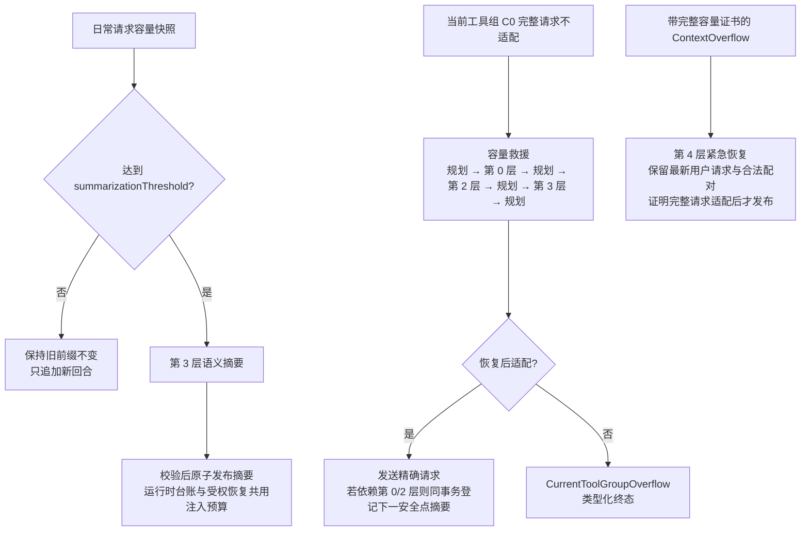
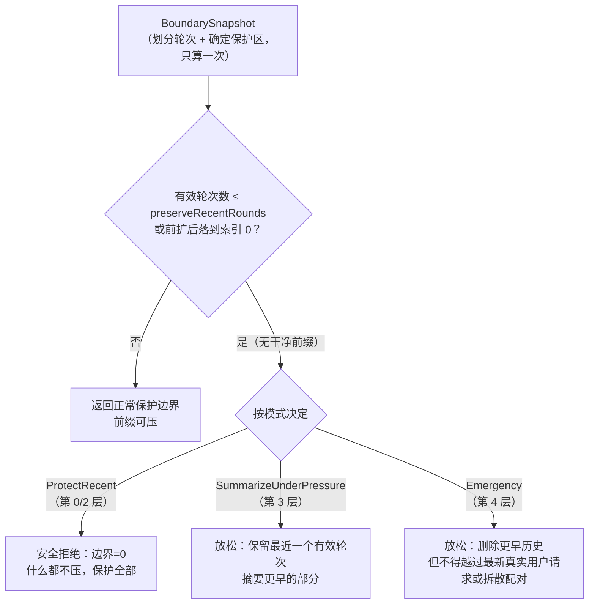
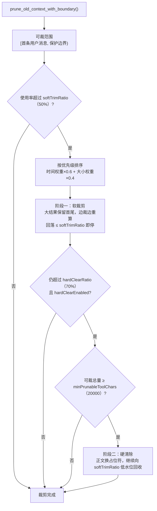
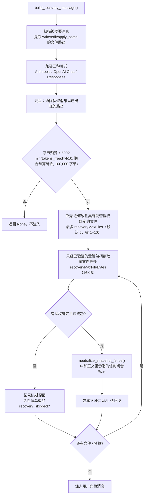

# 上下文压缩架构

> 返回 [文档索引](../../README.md) | 更新时间：2026-08-14

## 这个子系统解决什么问题

长对话和长工具循环会不断把消息推进模型的上下文窗口，直到某一次请求超过窗口上限——要么被模型服务商拒绝（`ContextOverflow`），要么静默截断并丢失关键信息。同时，粗暴地“删旧留新”会带来两类代价：一是删掉模型仍需要的事实（改过的文件内容、失败尝试、用户约束），二是每次改动消息前缀都会让模型服务商的提示缓存（prompt cache）失效，反而更贵更慢。

上下文压缩系统的核心想法是：**日常请求优先保持模型服务商看到的旧前缀稳定，达到高水位时用一次语义摘要建立新代次；确定性投影只负责当前工具组接纳和不可发送时的容量救援**。越接近窗口上限越允许激进，但任何层都不能越过协议、授权和发送幂等边界。五个层级因此不是每轮都依次执行：第 1 层接纳新增尾部，第 3 层承担日常压缩，第 0/2 层只在容量压力下改本次请求副本，第 4 层只处理已证明的溢出。

四条贯穿全局的设计约束：

- **纯函数核心**：`context_compact/` 模块只接收消息、配置和快照，负责计算边界、裁剪、构建摘要提示、渲染运行时台账与恢复消息。所有运行时状态（后台任务、子智能体、会话工作目录）由调用方在 `ha-core` 的智能体层收集，再以快照形式传入。这让整套压缩逻辑可以脱离 Tauri 和模型服务商单独测试。
- **持久状态为机器真相**：常规历史以已提交的上下文检查点为准；第 4 层还要求紧急历史与恢复标记在同一事务提交。`context_compacted` 是随提交产生的界面和审计投影，`context_compaction_progress` 只是实时进度，二者都不能代替恢复状态。
- **权威会话历史与请求投影视图分离**：主工具循环同时维护权威会话历史（canonical history）和请求投影视图（request projection）。第 1 层在工具组执行边界确定一次权威接纳形态；第 0/2 层只改变本次请求副本。工具轮次、插入消息与最终助手消息以同一个服务商原生历史增量追加到两份历史；检查点、崩溃恢复和最终 `sessions.context_json` 只写权威历史。第 3 层从完整权威历史构建摘要，只有候选校验并安装成功才同时替换两份历史。摘要失败或取消不会把此前的临时裁剪提升为会话真相。
- **无痕会话安全拒绝**：无痕会话（`incognito`）跳过第 3 层的文件恢复与运行时台账注入，第 4 层的紧急台账也按 `is_session_incognito()` 关闭——被摘要掉的工具历史不会以任何形式重新落到会被持久化的消息里。

## 五层压缩总览

五层按触发代价递增，但生产入口按职责选择层级；兼容组合器才会从低水位依次扫描。第 4 层是遇到 `ContextOverflow` 后的独立兜底。

| 层级 | 名称 | 手段 | 是否调用模型 | 触发口径 |
|---|---|---|---|---|
| 0 | 微压缩 | 把过时的短命工具结果替换成占位符 | 否 | 容量救援或一次性摘要输入不适配，且存在 `eager` 策略工具 |
| 1 | 工具结果接纳 | 当前工具组先取合法 C0，再在组预算内升级；旧历史保留单结果截断作兼容修复 | 否 | 每个非空工具结果组；兼容历史单结果 > `maxToolResultContextShare` |
| 2 | 旧结果降档 | 对历史里的多个工具结果先软裁剪、再最小化 | 否 | 第 0 层后完整请求仍不适配；50% 仅属兼容组合器阈值 |
| 3 | 语义摘要 | 模型把旧历史压成结构化交接摘要，再注入运行时台账和经授权的恢复材料 | 是 | 使用率 ≥ `summarizationThreshold`（默认 85%） |
| 4 | 紧急恢复 | 清空旧工具正文、删除安全边界前历史，并逐项证明请求可发送 | 否 | 有本地完整容量证书的 `ContextOverflow` |

内置生产路径由 `ContextEngine::compact_routine()` 与工具循环容量状态机驱动；第 3 层只先返回“需要摘要”的信号，真正的模型调用在智能体层异步完成。当前流程如下：



`compact_if_needed()` 中“30% 后扫描第 0/1 层、50% 后进入第 2 层”的阶梯仍作为显式兼容 API 保留，供旧调用者和选择原行为的自定义 `ContextEngine` 使用；它不再是内置引擎的日常主请求路径。进入兼容扫描也不等于一定修改：没有合法候选时 `messages_affected=0`，请求投影视图不变。生产主路径低于摘要高水位不会发布旧前缀改写，新工具组的第 1 层 C0/整组接纳仍在 `PostToolUse` 边界独立执行。

### 两份历史的提交边界

当前主对话生产路径使用两份服务商原生格式的消息数组：

| 视图 | 内容 | 允许写入持久上下文 | 消费者 |
|---|---|---:|---|
| 权威会话历史 | 第 1 层执行边界已经接纳的有效工具投影、完整回合骨架、用户与助手消息 | 是 | 检查点、崩溃恢复、最终轮次提交、下一轮基线、第 3 层摘要输入 |
| 请求投影视图 | 从权威历史克隆后按需应用第 0/2 层容量投影的本次请求视图；兼容入口仍可应用旧第 0/1/2 层组合器 | 否 | 词元预检、视觉桥、模型服务商请求、侧查询缓存快照 |

简单说，**权威会话历史就是持久化的会话真相**：下一轮对话、崩溃恢复和第 3 层摘要都以它为准；请求投影视图只是为了某一次模型请求临时生成的副本，用完即丢，不能反过来覆盖会话真相。

普通工具轮通过一次适配器渲染得到不可变的历史增量，再同时追加到两份视图，避免适配器被调用两次后产生不同 ID 或时间字段。引导消息邮箱、队列消息认领、钩子、持久化刷新与缓存写等有副作用步骤仍只执行一次。第 3 层成功会生成新的权威历史并重置本次请求投影；该摘要胜出版本只有在同一个持久检查点提交后，才提升为后续模型回退的重试基线，并连同“本轮用户消息已包含”状态一起推进。后续普通工具轮检查点不得覆盖这条重试基线。第 3 层失败时，权威历史保持逐字不变。

请求投影视图在最终容量证明后生成单次请求作用域的 `ProjectionEpoch` 投影清单；模型服务商适配器随后冻结最终 JSON 请求正文，并在同一个组合事务里发布投影代次、请求计划与上下文围栏。生产热路径从 `context_committed → dispatching → response_started → terminal` 推进；`prepared` 只保留给数据库结构迁移和未接线的预留接口，不是主请求的可见中间提交点。网络开始后无法证明是否送达时进入发送状态未知（`send_unknown`），禁止自动重发或切换模型。当前内核私有正文存储能力闸仍关闭，因此持久层只保存请求正文的带密钥指纹、字节数、服务商/模型/请求形态与投影动作，不保存明文正文，也不假装具备跨崩溃逐字节重放能力；恢复时只能安全收敛状态，不能重新渲染一份“近似相同”的请求。旧历史仍可走 `compact_sync()` 的兼容路径；刚完成的当前工具组使用新的 C0 优先组接纳与完整请求终验，不再由兼容单结果截断决定最终投影。

### 精确请求与发送歧义边界

每个主模型请求遵循同一顺序：冻结实际请求正文 → 发布单次请求作用域的投影代次/请求计划与上下文围栏 → 在联网前以比较并交换操作（CAS）进入 `dispatching` → 收到 HTTP 响应头后记录 `response_started` → 由工具边界或助手/中断最终事务写入 `terminal`。HTTP 客户端显式关闭重定向和透明重试，因此一次发送认领只对应一次 POST。Anthropic 必须收到 `message_stop`，OpenAI Chat 必须收到 `[DONE]` 与合法 `finish_reason`，Responses/Codex 必须收到 `response.completed`；文件结束（EOF）、解析错误或半截工具调用都不算成功。

进入 `dispatching` 后、收到响应头前断线时，状态为发送状态未知（`send_unknown`）：系统保留请求证据、停止自动重试，并提示用户先检查模型服务商侧是否已经执行。用户显式发送新的前台消息或重试时，新运行实例会在任何网络动作前用一个 SQLite 事务把旧 `send_unknown` 收敛为 `terminal(manual_retry_as_new)`、撤销旧的单次请求投影代次并释放正文保留锁；定时任务、子智能体和侧查询不能借此解除歧义。无痕会话使用同构的有界内存状态，关闭即清零，不承诺崩溃恢复。

启动恢复按运行实例扫描**全部**非终态计划，而不是只看有日志事件的尝试：可证明未发送的计划可撤销；遗留 `dispatching` 一律收敛成 `send_unknown`；已进入 `response_started` 但没有完整模型服务商终止证明时，收敛成 `terminal(response_incomplete)`；已有 `send_unknown` 保持歧义，直到所有者的新前台意图显式解除。当前这条精确请求预写日志（exact WAL）只接主请求 `MainContinuation`；第 3 层摘要、侧查询等辅助角色的数据库结构和接口只是预留面，尚未接入生产级精确请求正文预写日志，不能把它们描述成可跨崩溃逐字节重放。

### 最终设计决策与能力边界

下列决策是第 0～4 层的共同契约。它们是当前代码与后续演进的判断依据，不依赖已归档的调研或路线图也能理解：

1. **保留第 2 层，但只把它作为容量投影。** 日常请求不会因 50% 水位发布第 2 层；它只在当前工具组 C0 的完整请求不适配、或摘要输入副本本身不适配时回收旧工具结果。第 0 层与第 2 层共用单次请求投影清单，但都不覆盖权威会话历史。
2. **第 1 层是权威接纳边界。** `PostToolUse` 后的当前工具组按模型原始调用序号一次收集、一次规划、一次追加；权威历史只保存已接纳的 C0/最终候选，不保存未受控全文。第 0/2 层只改该请求的旧前缀，第 3 层才能在持久检查点提交后建立新的权威历史代次。
3. **完整工具组而不是单条消息是最小协议单位。** 所有模型服务商的调用/结果配对、媒体块与当前用户消息都必须作为硬保护后缀；定位标识重复或缺失、同轮结构不完整、候选来源校验值不匹配时，一律重新规划或安全拒绝。
4. **容量由最终按模型服务商协议成形的请求证明。** `6000/2000/2000`、窗口比例和字符近似只服务兼容候选生成，不能单独决定是否发送。最终上界必须包含稳定/动态提示、真实工具定义、服务商历史形态、媒体展开、输出预留与安全余量；计数所见的冻结投影就是发送所用投影。
5. **编号只是定位标识，不是权限。** `result_id`、投影/计划编号、模型服务商请求编号、内容哈希、缓存键和文件路径都不能作为持有即授权的凭据。读取、重试、分叉、恢复和删除必须重新验证租户/会话/轮次/运行实例/分支血缘及当前授权；历史工具参数从不构成宿主文件读取权。
6. **数据库状态而不是事件或缓存是机器真相。** 检查点、投影计划、发送状态和恢复标记决定恢复行为；界面事件、诊断清单、提示缓存命中和服务商用量只作观察。缓存身份只在成功请求的真实回执后更新，缓存未命中或有效期到期永不改变正确性。
7. **正文能力必须显式可证明。** 结果存储（`ResultStore`）与精确请求正文存储的数据结构、加密格式、保留锁、擦除和垃圾回收已经具备，但内核私有存储能力闸当前固定关闭；新正文分别记录为 `lost`/`unavailable`，不回退明文、绝对路径或虚假读取句柄。只有私有根和密钥对后续所有模型子进程都不可达时，才允许开启正文保存及跨崩溃精确请求正文重放。
8. **无痕会话是有界内存例外。** 无痕会话不写投影、计划、摘要、恢复状态、正文、发件箱或缓存元数据，不支持跨崩溃恢复、分叉或导出；关闭或焚毁时在同一内存状态临界区清零，不能用持久化能力换取恢复便利。
9. **当前单次请求投影代次不等于会话投影头。** 它只证明某个运行实例/尝试实际发送了什么，不能跨对话轮次复用为会话级缓存有效期，也不能在分叉/回退时复制成活动投影。稳定会话投影头、持久正文读取和跨崩溃逐字节重放仍是明确延期能力，不能由现有表结构推断为已上线。
10. **分页工具必须保持“可见正文 ↔ 游标”一致。** 当正文读取能力关闭时，`read` 的完整 UTF-8 页（含续读游标）不得超过第 1 层的精确 C0；游标只能跨过模型实际看见的字节，不能用头尾预览跳过不可恢复的中段。

### 完整验证矩阵

上下文压缩的完整验证由两类互补证据组成，不能只看其中一类：

- 零网络确定性套件 `context-compaction-safety@1.0.0` 直接调用生产算法和数据库事务，验证协议、安全、持久化及失败关闭不变量；它不依赖模型发挥，也不进入普通 `cargo test`。
- 真实模型套件 `context-compaction@1.0.0` 验证必须由模型参与的摘要语义保真和连续分页能力。界面里显示的 2 个场景只是这条付费轨道，不代表只有 2 项安全检查。
- Evaluation Center 的“上下文压缩专项”画像把两条轨道编排为同一次运行：先执行 10 个零网络用例并保存独立确定性证据，全部通过后才启动 Hope Server 与 2 个付费真实模型场景。两条轨道在同一结果页分开展示、分别判定；确定性失败会阻断付费轨道，真实模型通过也不能豁免确定性失败。

| 层级 / 边界 | 确定性用例 | 必须成立的不变量 | 真实模型补充 |
|---|---|---|---|
| 第 0 层 | `tier0-request-projection` | 只改请求投影视图；权威会话历史和当前用户不变；投影可精确重放；来源校验不一致时安全拒绝 | 不需要 |
| 第 1 层 | `tier1-group-admission` | 按模型原始调用顺序做整组接纳；C0 完整请求超限返回类型化终态；不重跑工具副作用 | `HA-CTX-002` 验证真实模型按 UTF-8 游标连续读到文件结尾 |
| 第 2 层 | `tier2-capacity-projection` | 只降档旧前缀；当前用户和当前调用/结果组逐字保护；动作清单不携正文且可确定性重放 | 不需要 |
| 第 3 层 | `tier3-summary-protocol`、`tier3-recovery-transaction` | 多模型服务商消息序列化完整；九段摘要协议；受保护后缀不变；恢复标记认领、耗尽、摘要检查点和清除保持事务一致 | `HA-CTX-001` 验证真实摘要后的事实保真 |
| 第 4 层 | `tier4-capacity-certificate`、`tier4-emergency-user-anchor`、`overflow-evidence-gate` | 只有完整请求本地容量证书才允许紧急改写；媒体/未知成本、历史指纹变化和纯文本误报均安全拒绝；当前用户只出现一次 | 不需要用真实服务商故意制造超窗错误 |
| 发送与跨层边界 | `dispatch-ambiguity-terminal`、`cross-tier-boundaries` | 发送状态未知和当前工具组溢出都是禁止重试/换模型的终态；第 0/2 层不污染第 3 层摘要输入 | 不需要 |

完整结论必须同时记录两个套件的版本、计划摘要和结果；任何一条轨道通过都不能豁免另一条。确定性套件不保存提示词或模型正文，真实模型套件只使用合成资料。

## 边界：整个系统的支点

五层里除第 1 层外都要回答同一个问题：**哪些消息属于“最近、必须原样保留”的区域，哪些是“旧的、可以压”的前缀？** 这条分界线由 `boundary.rs` 统一计算，是理解整个子系统的关键。

它的算法分三步：

1. **划分轮次**：`build_message_rounds()` 把消息序列切成一个个轮次。一个工具轮次覆盖助手的 `tool_use` 及其配对的 `tool_result`（跨 Anthropic、OpenAI Chat、OpenAI Responses 三种传输格式），并行工具调用会合并进同一个轮次，直到所有结果到齐。由最终收敛路径重建、而非模型真实产生的轮次会带 `recovered-` 前缀，被视为“已经是摘要边界”，不计入“最近保留”名额。
2. **确定保护区**：保留最近 `preserveRecentRounds`（默认 4）个有效轮次。若这不会吞掉同一个用户轮次里更早的执行轮次，就把边界前扩到该用户轮次的起点——这样最新的用户请求总能原样保留；但在长工具循环里，前扩会被“更早的执行轮次”限制住，以留出可裁剪的前缀。
3. **对齐轮次边界**：`find_round_safe_boundary()` 把候选切点回退到最近的轮次分界，保证切割绝不会把一对 `tool_use` / `tool_result` 拆到两边。

同一份 `BoundarySnapshot` 只算一次，然后用三种**模式**去查询它。三种模式的差异只在于"当没有可压前缀时怎么办"：



这个“三态”设计是刻意的：常规压缩（第 0/2 层）**宁可什么都不做**也不冒险切坏配对；而第 3 层已经越过 85% 压力、第 4 层已经溢出，此时“保护一切”等于坐视下一次请求继续失败，所以允许删除更多旧历史，但仍把最新真实用户请求和完整调用/结果配对视为硬边界。每次放松都会在 `warnings` 中留下原因，并进入诊断清单便于排障。

## 五层压缩详解

### 第 0 层：微压缩

无需额外调用 LLM 即可清除过时的短命工具结果。它构建一张 `tool_use_id → tool_name` 映射表（兼容三种协议格式：Anthropic 的 `tool_use` 块、OpenAI Chat 的 `tool_calls`、OpenAI Responses 的 `function_call`），把保护边界之前所有策略为 `eager` 的工具结果正文替换成 `[Ephemeral tool result cleared]`——保留消息骨架以维持工具调用与工具结果的配对，只掏空正文。它仍会改变请求历史的分歧点并可能造成提示缓存失效，因此“无需模型调用”不等于“缓存零成本”。

`eager` 默认覆盖快照/列表类工具（旧结果很快过时）：`ls`、`grep`、`find`、`process`、`sessions_list`、`agents_list`、`session_status`、`get_weather`、`tool_search`。若 `toolPolicies` 里没有任何 `eager` 工具，第 0 层直接跳过。

生产入口只有**容量救援**：当前工具组 C0 的完整请求不适配时，在硬保护后缀之前清理 `eager` 结果并立即按同一完整请求重新计数；摘要输入不适配时也可在一次性摘要输入副本使用。轮次开始和普通工具循环检查点不再因低水位运行第 0 层。`compact_if_needed()` 仍保留原扫描行为，但只属于兼容 API。

### 第 1 层：工具结果接纳与截断

对**单个过大**的工具结果做首尾保留式截断。单结果超过 `maxToolResultContextShare`（默认窗口的 30%）即触发，字符上限为：

```
max_chars = min(context_window × share × CHARS_PER_TOKEN, HARD_MAX_TOOL_RESULT_CHARS)
          = min(context_window × 0.3 × 4, 400_000)
```

**智能尾部检测**（`has_important_tail()`）：检查尾部 2000 字符是否含错误信息（`error` / `exception` / `failed` / `fatal` / `traceback` / `panic` / `stack trace` / `errno` / `exit code`）、JSON 闭合结构（`}` / `]` 结尾）或结果关键词（`total` / `summary` / `result` / `complete` / `finished` / `done`）。尾部重要时做首尾保留式截断（尾部拿 30%、上限 4000 字符，中间插 `[... middle content omitted ...]`）；否则只留头部。

**结构边界检测**（`find_structure_boundary()`）：在目标切点附近优先找干净位置——空行 > JSON 闭合行 > 代码块结尾 ``` ``` ``` > 普通换行——并保证落在合法 UTF-8 字符边界上。

工具执行边界先把媒体拆成类型化引用，文本结果再独立接纳；不再因为一条结果含图片就让整段附带文本绕过上限。非法或无法物化的旧图片标记会安全降级为有界占位符。

上述公式只描述旧历史的兼容修复路径。刚完成的当前 API 轮次使用两段式接纳：先在 `PostToolUse` 后收集整组有效结果，按模型原始调用序号恢复顺序，并把每项 C0 合法骨架一次写入权威会话历史；随后为纯文本结果生成单调候选序列，在单结果上限和整组预算下取规范升级前缀。媒体结果保持类型化单一候选，不允许字符串裁剪破坏媒体标记或模型服务商内容块。

当前确定性候选与预算固定如下：C0 是约 2KiB 的 UTF-8 安全预览/合法信封，后续候选依次约 4/8/16KiB；有效正文不超过 64KiB 时才追加完整精确候选，短于 C0 的结果直接以单一精确候选接纳。安全余量取窗口 1%，钳在 512～2000 词元且不超过窗口 10%；整组所有升级合计不超过“扣除 C0 与安全余量后的剩余空间”和窗口 25% 两者的较小值；单结果升级不超过窗口 10% 与 8000 词元的较小值。升级权重为错误/超时 3、写入/执行回执 2、结构化读取 1.5、快照/未知 1，并按加权水位与模型原始调用序号确定规范顺序。最终完整请求仍超限时，只按该规范升级序列逆序撤销当前组升级，绝不改写别的组或重跑工具。

最终选择不是按字符数猜测：动态系统提示和用户数据、真实工具定义、模型服务商历史消息格式、媒体/视觉桥展开、输出预留和安全余量组成同一个完整请求计数。富候选只在本地上界和可用的模型服务商发送前预检都通过后，才同时发布到权威会话历史与本次请求投影视图。模型服务商拒绝富候选时，同一轮回到 C0 重新规划，不执行第二次工具、钩子、消息邮箱排空或用户注入。

若 C0 在完整请求中仍不可发送，容量恢复状态机固定为 `规划 → 第 0 层 → 规划 → 第 2 层 → 规划 → 第 3 层 → 规划 → 类型化终态`；每次规划都重新计算同一个模型服务商请求，第 0/2 层只改旧历史的请求投影视图，第 3 层才改权威会话历史。当前用户与刚完成的完整调用/结果组是硬保护后缀。摘要候选先验证该后缀逐字不变，再以“先持久化、后生效”的检查点发布；检查点失败不会污染智能体内存历史。最终仍不可发送时返回 `CurrentToolGroupOverflow` 结构化终态，禁止盲目换模型或重跑副作用。

若最终精确请求依靠第 0/2 层投影才适配，`context_committed` 事务会同时写入下一安全点第 3 层要求，记录 `requirement_kind=capacity_projection`、来源请求计划和权威历史代次；同轮已成功安装第 3 层则不登记。可证明未发送的计划被撤销时，同一事务清除由它独占的要求；进入发送或发送状态未知后不能清。相同权威历史代次的重复计划不会重置已经认领或耗尽的付费摘要尝试。第 4 层使用独立的 `emergency_overflow` 原因，且紧急原因优先于同代容量原因。

当前结果存储（`ResultStore`）的元数据、加密正文格式、会话引用和读取工具已经接入，但正文能力闸保持关闭：现有进程无法证明后续宿主命令永远读不到私有根和密钥，所以新结果只记录 `availability=lost`，不会发布虚假的恢复句柄。文件 `read` 工具使用约 2KiB 的 UTF-8 安全页，使整页正文和续读游标始终作为第 1 层的精确 C0 保留；超长单行返回精确 `byte_offset` 游标，模型可以连续读取整个文件，不会因预览裁剪或旧的固定 6000 字符门槛永久跳过中间内容。待内核级私有存储边界完成后，才开放持久正文与更大的受权结果存储分页。

### 第 2 层：旧结果降档

对历史里的多个工具结果做两阶段渐进裁剪。下图的 50%/70% 比率是 `compact_if_needed()` 的兼容算法；内置生产路径只在完整请求容量救援中调用同一组确定性替换原语，每一步都以目标输入上界为停止条件，而不是以日常水位触发。



**优先级排序**：`priority = age × 0.6 + size × 0.4`，其中 `age = 1 - msg_index/total`（越老越优先）、`size = min(content_chars/100000, 1.0)`（越大越优先）。老且大的先被裁。

**阶段一：软裁剪**（使用率 > `softTrimRatio` = 0.50 触发）：对大于 `softTrimMaxChars`（6000）的工具结果做首尾保留式截断，保留头部 `softTrimHeadChars`（2KiB）和尾部 `softTrimTailChars`（2KiB）。每裁一条都复用外层的请求上界计数；回落到 `softTrimRatio` 即停。没有模型服务商计数器的兼容调用才使用旧字符近似。

**阶段二：硬清除**（软裁剪后仍 ≥ `hardClearRatio` = 0.70 触发）：把整个工具结果正文换成 `hardClearPlaceholder`，并继续向 `softTrimRatio` 低水位回收。处于 50%～70% 区间时只允许软裁剪，不会因为软候选耗尽而清空正文。若所有可裁工具结果总量低于 `minPrunableToolChars`（20000），说明收益太小，跳过。`hardClearEnabled=false` 时整个阶段二关闭。

**两道保护**：保护边界（`ProtectRecent` 模式）之后的内容不裁；`protect` 策略工具不裁——默认 `web_search`、`web_fetch`、`recall_memory`、`memory_get`（搜索与记忆内容常被后续反复引用）。首条用户消息之前的引导上下文也受保护（裁剪范围从首条用户消息开始）。

### 第 3 层：LLM 语义摘要

内置日常路径在完整请求达到 `summarizationThreshold`（默认 0.85）时直接调用 LLM 把旧历史压成结构化摘要，不先发布第 0/2 层旧前缀改写；容量救援则只在第 0/2 层仍不足时进入第 3 层。流程：

1. **`split_for_summarization`**：从同一个 `BoundarySnapshot` 用 `SummarizeUnderPressure` 模式取分割点，把消息切成 `summarizable`（旧、待摘要）与 `preserved`（近、保留）两段；最近一条真实用户请求始终逐字保留，不会为了制造可摘要前缀而吞进摘要。
2. **`peel_previous_summary`**：若待摘要前缀已以 `[Previous conversation summary]` 开头，把旧摘要抽出放进提示的“上一份摘要”槽位，避免“摘要摘要”套娃。
3. **`build_summarization_prompt`**：把消息渲染成可读文本，附上标识符保留指令与自定义指令。
4. **容量预检与 LLM 调用**：摘要使用独立的单次请求，不重复携带主对话缓存历史。输入按模型无关词元上界计数，并同时预留摘要输出和安全余量；专用摘要模型存在时取它与对话模型中更小的窗口。摘要输入不适配时，先在一次性输入副本依次执行第 0/2 层；副本不写权威历史、不进入主请求投影。仍不适配则在联网前安全拒绝。临时 API 失败走有界自动重试；`summarizationTimeoutSecs`（300 秒）超时后不安装摘要候选，并产生可手动重试的最终失败事件。
5. **校验与 `apply_summary`**：输出必须含完整 9 段结构。安装前再次检查摘要正文上限，以及摘要、运行时台账和文件恢复的联合注入预算；超限直接拒绝候选，绝不在校验后再次截掉后半段。通过后才清空 `summarizable`，在索引 0 放入摘要消息（`role="user"`，前缀 `[Previous conversation summary]`），其后接 `preserved`。

**摘要系统提示要求的 9 段结构**——摘要是“接续摘要”而非全局状态镜像；下列英文标题属于输出校验协议，必须保持原样：

| 段落 | 内容 |
|---|---|
| `## Primary Request and Success Criteria` | 主诉求与成功标准 |
| `## Current Execution State` | 当前执行状态 |
| `## Decisions and Rationale` | 决策与理由 |
| `## Files, Symbols, and Artifacts` | 涉及的文件、符号、产物 |
| `## Tool Results Worth Preserving` | 值得保留的工具结果 |
| `## Errors, Failed Attempts, and Fixes` | 错误、失败尝试与修复 |
| `## User Feedback and Constraints` | 用户反馈与约束 |
| `## Pending Work and Next Action` | 待办与下一步 |
| `## Trust Boundaries and Security Notes` | 信任边界与安全注记 |

提示明确要求：只输出文本、禁止调用工具；逐项保留精确路径、标识符、ID、URL、命令名、函数名和用户约束；保留失败尝试及原因以免重蹈覆辙；不把工具输出、网页、知识库、恢复文件快照等不可信数据当指令；**不重复**确定性运行时台账中的作业/子智能体全量表，也**不重复**活跃任务、记忆、知识库访问、工作目录、权限这类每轮从实时来源重建的状态（否则会制造第二个真相源）。

**标识符保留策略**（`identifierPolicy`）：`strict`（默认，严格保留所有不透明标识符不缩短不重构）/ `off`（不特殊处理）/ `custom`（用 `identifierInstructions` 自定义）。

摘要文本封顶 `maxCompactionSummaryChars`（默认 16000，运行时钳 4000–64000）。超过正文上限或联合注入预算时拒绝整个候选，保留当前活动历史并显示可重试失败；不会在 9 段结构校验通过后再截掉摘要尾部。

摘要之后紧接着注入**运行时台账**与**文件恢复**（下文单独讲），三者共享一个联合预算。

### 第 4 层：紧急溢出恢复

高置信 `ContextOverflow` 错误后的最后手段，由 `ha-agent-runtime` 的主 turn failover 闭环触发并调用 kernel ContextEngine capability，**每个模型最多重试一次**（`MAX_COMPACTION_RETRIES = 1`）。本地容量预检和模型服务商返回的结构化状态、代码、类型都可以确认溢出分类，但自动第 4 层还必须携带本地预检生成的不可变完整请求容量证书；仅有模型服务商结构化错误时安全拒绝紧急改写，转入正常模型回退而不破坏历史。自由文本相似提示只记诊断，不进入破坏性恢复。逻辑：

1. 清空所有工具结果正文（换成 `hardClearPlaceholder`）。
2. 用 `Emergency` 模式取边界。可以减少近期助手/工具轮次，但切点绝不能越过最新真实用户请求；若保留该请求后仍无法形成合法请求，就安全拒绝，不以“忘掉任务”为代价强行重试。
3. 丢弃边界之前的全部历史（`drain`），避免留下孤立的 `tool_result`。
4. 非无痕会话可在头部注入紧急运行时台账（预算约 4000 字符）；无痕会话或会话行已焚毁时跳过。
5. 紧急模型服务商历史与 `tier3_required` 标记在同一个 SQLite 检查点事务中发布；任一失败都不发送重试请求。只有明确标为可安全重放的只读工具活动能经过该路径，存在不可重放副作用时安全拒绝。
6. 下一安全主请求发送前读取该标记，并在付费摘要调用**之前**原子认领唯一自动尝试，随后绕过普通水位与缓存等待强制执行第 3 层。状态严格区分 `Required`（待执行）、`InProgress`（已认领但结果未知）和 `RetryExhausted`（已知失败或取消）：崩溃保留 `InProgress` 并阻断自动续跑，已知失败才转为 `RetryExhausted`，从而既不重复计费也不把未知结果误当作普通失败。失败卡片提供手动“重新压缩”；第 3 层摘要与标记清除在同一个上下文检查点事务中提交，并且发生在下一次主模型请求之前。无痕会话使用等价的有界内存状态，关闭即焚且不承诺崩溃恢复。
7. 发布前必须证明 `tokens_after < tokens_before`、当前用户原生项恰好保留一次，并且下一次完整请求（稳定/动态提示、工具定义、媒体、输出预留和安全余量）适配窗口；证明不足就安全拒绝。例如只有一条超大当前用户消息、没有任何可删历史时，第 4 层提示改用文件/分页读取，不会原样重发同一个请求。

它走独立的 `ContextOverflow` 重试路径，不经过轮次开始阶段的缓存有效期节流。紧急重试显式记录当前用户消息是否已经存在于恢复历史，避免同模型重试、后备模型和整链重试再次追加同一请求。收尾发送最终 `context_compacted` 事件并持久化；无痕会话只保留内存状态，不写恢复标记表。

## API 轮次消息分组

第 3/4 层切割历史时绝不能把一对工具调用/工具结果拆到边界两侧。`round_grouping.rs` 通过 `_oc_round` 元数据把工具循环里的助手消息（含工具调用）与其工具结果标记为同一轮：

```json
{ "role": "assistant", "content": [...], "_oc_round": "r0" }
{ "role": "user",      "content": [...], "_oc_round": "r0" }
```

轮次 ID 格式为 `"r{N}"`，N 是工具循环迭代索引（从 0 起）。另有 `recovered-<ns>` 前缀标记终态收敛路径重建的伪轮次（见边界一节）。

| 函数 | 说明 |
|---|---|
| `stamp_round(msg, round_id)` | 给消息添加轮次 ID |
| `push_and_stamp(messages, msg, round)` | 追加消息并打标，跨所有模型服务商适配文件复用（新适配器必须走它，否则压缩会拆散配对） |
| `strip_round(msg)` | 剥离单条消息的轮次元数据 |
| `prepare_messages_for_api(messages)` | 克隆并剥离所有内部元数据（`_oc_round`、子智能体发送标记与 `_ha_side_snapshot`），供 API 请求体构建 |
| `find_round_safe_boundary(m, target)` | 在目标位置及之前找完整轮次安全切点（向后搜索） |
| `find_round_safe_boundary_forward(m, target)` | 在目标位置及之后找完整轮次安全切点（向前搜索） |

**向后兼容**：无 `_oc_round` 的旧会话消息被视为独立轮次，`find_round_safe_boundary` 直接返回 `target_index`。

侧聊继承上下文带 `_ha_side_snapshot` 来源标记，模型格式转换和包含继承内容的摘要必须继续携带；普通消息合并到继承项时保守保留标记。压缩前记忆提取只过滤给定丢弃片段中的继承项，绝不另取保留区或最近消息。标记仅用于本地裁决，主请求与缓存友好一次性请求都在发送前剥离，不能进入 Provider 请求体。

## 第 3 层后的三类注入内容

第 3 层摘要完成后，智能体层会在摘要消息之后依次注入两类补充材料，最终历史布局为：

```
[0] 摘要  →  [1] 运行时台账（可选） →  [2] 文件恢复（可选） →  保留的近期历史...
```

三者（摘要、运行时台账、文件恢复）共享一个**联合注入预算**：`maxCompactionInjectedContextShare`（默认 0.5，运行时钳 `0.05..=maxHistoryShare`）乘以窗口。分配顺序：

1. 摘要先占用它需要的字符数；
2. 剩余预算里，为运行时台账**预留**上限（有实时运行状态时约 8000 字符，仅有文件触点时约 2000 字符，都没有则为 0）；
3. 文件恢复使用“剩余预算减去运行时台账预留”；
4. 运行时台账最终使用“剩余预算减去文件恢复实际用量”，再钳到约 8000 字符。

这个顺序保证小预算场景下文件恢复不会被运行时台账完全挤掉。

### 运行时台账

运行时台账补足“只存在于工具历史、被摘要后会丢失、且不会每轮从实时状态重建”的状态。它**不是第二份全局状态镜像**，只覆盖三类（`RuntimeLedgerSnapshot`）：

- **在途后台作业/任务组作业**：`job_id`、种类、状态、工具、标签、任务组进度
- **在途子智能体**：`run_id`、状态、子智能体 ID、子会话 ID、任务预览
- **被摘要消息里的文件触点**：仅列出**没有**被文件恢复内联的路径、最后操作、最后出现位置

分层：`agent/runtime_ledger.rs` 从 `JobManager` 与会话数据库收集实时快照（紧急路径经 `emergency_runtime_ledger(session_id, is_incognito)` 执行无痕会话门控）；`context_compact/ledger.rs` 是纯函数，只接收快照和 `FileTouch[]` 并渲染 Markdown，预算不足或无任何可写行时返回 `None`。

**刻意不进运行时台账的状态**：活跃任务、记忆、置顶记忆/用户画像、知识库访问、工作目录、权限/计划模式——这些每轮由系统提示或提醒从实时状态重建，运行时台账重复它们只会制造冲突的第二真相源。

### 文件恢复

摘要会丢掉被写/改文件的精确内容。历史工具参数本身不构成宿主文件读取授权：当前自动路径只提取文件触点与原因，不会根据旧 `write/edit/apply_patch` 参数重新打开磁盘文件。只有后续由受管文件台账提供“已授权且规范化”的路径绑定时，下面的恢复渲染器才允许读取正文；没有可信绑定时一律记录 `unverified_file_provenance` 并安全拒绝。



要点：

- **路径提取不等于授权**：解析跨三种协议消息格式；`apply_patch` 从补丁头（`*** Add File:` / `*** Update File:` / `*** Move to:`）提取引用。只有受管台账提供的绝对、规范化、非符号链接、位于会话工作区内的绑定才可读取；相对路径、历史参数里的任意绝对路径和未验证旧记录都不解引用。
- **预算**：单文件上限 `recoveryMaxFileBytes`（16KiB，超出截断并追加 `[truncated, N total bytes]`）；恢复总预算 = `min(tokens_freed × 4 / 10, 联合注入预算里分给文件恢复的份额, MAX_RECOVERY_TOTAL_BYTES=100_000)`；不足 500 字节直接跳过。
- **不可信数据信封**：注入为 `role="user"` 消息，文件内容包在 `<untrusted_file_snapshot path="…" source="post_compaction_recovery">…</untrusted_file_snapshot>` 里，只作快照资料、绝不升为系统指令。`neutralize_snapshot_fence()` 只中和正文里伪造的 `<untrusted_file_snapshot>` / `</untrusted_file_snapshot>` 信封边界标记变体（大小写不敏感、容忍空格与可选 `/`），把其 `<` 转义为 `&lt;`，普通源码里的 `Vec<T>`、`a < b` 保持可读。
- **容错**：文件不存在、已删、读取失败或预算耗尽都把跳过原因记入诊断清单；无可恢复文件时返回 `None`。

```xml
[Post-compaction file recovery: current contents of recently-edited files]

<untrusted_file_snapshot path="/path/to/file.rs" source="post_compaction_recovery">
file contents here...
</untrusted_file_snapshot>
```

## 触发路径与中途压缩

### 轮次开始阶段压缩

每轮模型请求前，`AssistantAgent::run_compaction_with_options()`（trigger=`TurnStart`）执行：

1. 用冻结的模型服务商/模型/工具定义快照计算完整请求上界
2. 触发 `PreCompact` 钩子（仅达到摘要高水位、手动摘要或必要恢复时；必要恢复可覆盖阻断）
3. 调用 `ContextEngine::compact_routine()`；内置引擎低于高水位返回 `keep_prefix`，达到高水位只返回第 3 层信号，不运行兼容第 0/1/2 层
4. 第 3 层可用时调用摘要模型；成功后应用摘要、运行时台账和文件恢复
5. 触发 `PostCompact` 与 `SessionStart(source=compact)` 观察类钩子（仅第 2 层及以上）
6. 发送最终 `context_compacted` 事件

`ContextEngine` / `CompactionProvider` 是一层特征抽象。`DefaultContextEngine` 的日常入口使用缓存稳定策略，应急入口委派 `emergency_compact`；`compact_sync` 保留旧组合器。自定义引擎若不实现 `compact_routine`，默认仍委派其 `compact_sync`，从而保持插件兼容但需自行承担缓存前缀改写语义。

### 工具循环检查点

长工具循环中，上下文可能在一次助手回复内部就超阈值。`streaming_loop` 在每个工具调用轮追加历史后调用 `maybe_compact_between_tool_rounds()`：

- 工具组完成后先持久化工具结果边界，再按模型原始调用序号恢复整组顺序，并把 C0 组一次追加到权威会话历史和请求投影视图；`PostToolBatch` 的附加上下文仍按该顺序只进入下一次即时模型服务商投影。
- 有待接纳当前组时，普通循环中压缩器只为 C0 写检查点，不运行旧版第 1/2 层；下一请求头用真实动态提示、工具定义、媒体展开与输出预留执行整组接纳和同轮容量状态机。
- 无待接纳当前组时，检查点只计算不变请求视图；低于摘要高水位直接持久化权威历史，高于高水位才尝试第 3 层。它不再运行反应式第 0 层或旧历史第 1/2 层。
- **当前组 C0 恢复**不受普通有效期/收益门阻塞，但保持硬协议后缀：每阶段只改旧前缀、完整重算一次，摘要也不能吞掉当前用户或刚完成的工具组。
- **普通循环中第 3 层频率下限**：每个对话轮次最多尝试 2 次摘要（`MID_LOOP_MAX_SUMMARY_ATTEMPTS_PER_TURN`），两次至少间隔 3 个工具调用轮；收益不足时，本对话轮次后续抑制普通第 3 层。C0 已证明不可发送的必要恢复使用独立一次性状态机，不与该普通频率门混淆。
- 用户停止操作经与主对话轮次相同的取消轮询立即中止正在等待的摘要任务；未发布摘要恢复两份历史与发布标记，不会留下半安装的权威会话历史。

### 实时进度与持久化

GUI 用仅实时的 `context_compaction_progress` 展示过程（同一条提示条原地更新），IM 默认只显示最终友好通知。

| 事件 | 阶段/种类 | 持久化 | 用途 |
|---|---|---|---|
| `context_compaction_progress` | `phase` ∈ {`preparing`, `summarizing`, `preserving_runtime_state`, `restoring_files`, `finalizing`, `failed`}，`kind` ∈ {`summary`, `emergency`} | 否 | GUI 提示条实时进度 |
| `context_compacted` 开始标记（兼容旧前端） | `description` ∈ {`summarizing`, `emergency_compacting`} | 否 | 旧前端/IM 系统消息；新路径优先发送进度事件 |
| 最终 `context_compacted` | `tier_applied`、`tokens_before`、`tokens_after`、`messages_affected`、`description`、`manifest` | 第 2 层及以上持久化 | 完成态以此为准 |

`context_compaction_progress` 没有 `done` 阶段；完成态只由最终 `context_compacted` 事件渲染。第 0/1 层的噪音在前端与持久化层两侧都会过滤，不进入用户可见历史。

### 诊断清单与可观测性

`CompactResult.manifest`（`CompactionManifest`）是诊断载荷，不直接当普通 UI 文案。字段：

- `compactionId`、`tier`、`trigger`（`manual` / `turn_start` / `tool_loop` / `emergency` / `sync`）
- `tokensBefore` / `tokensAfter`
- `protectedStartIndex`
- `summarizedRange` / `roundsSummarized`
- `toolResultsTruncated` / `toolResultsSoftTrimmed` / `toolResultsHardCleared`
- `filesRecovered`
- `cacheTtlThrottled`
- `warnings`（含边界放松原因与 `recovery_skipped:*`）

最终聊天用量行还保存无正文的缓存影子字段：`cacheCompactionDecision`、`cacheIdentityHash`、`projectionActionCount`、`reclaimedTokensUpper`、`cacheReadInputTokens`、`cacheCreationInputTokens`、`prefixRewriteCount` 与 `summaryReason`。精确失效后缀或模型价格无法证明时，`invalidatedSuffixTokensUpper` / `breakEvenTurns` 保持空值；空值不能触发主动旧前缀改写。

GUI 默认不显示层级和诊断清单；排障时可通过日志、调试详情或流式载荷查看。

`CompactionManifest` 与 `ProjectionEpoch` 不是同一类记录：前者是一次压缩动作的诊断汇总；后者是某个精确请求使用的不可变投影清单。单次请求作用域的投影代次中，每项动作都绑定模型服务商请求形态、稳定的调用/结果定位标识、模型原始调用序号、来源校验值、替换内容指纹、渲染器/策略/计数器版本和缓存身份。缺少稳定定位标识、键重复、来源校验值不匹配或模型服务商请求形态变化，都会使该代次失效并从权威会话历史重建；不能靠“文本看起来一样”继续使用旧动作，也不能用诊断清单或缓存键充当恢复/授权凭据。

## 提示缓存稳定策略

内置生产路径不再用固定冷却时间猜测缓存是否存在。低于摘要高水位时保持旧前缀逐字不变；达到高水位时最多安装一个经校验的摘要候选；完整请求无法发送时才允许第 0/2 层容量投影。`cacheTtlSecs`、`reactiveTriggerRatio` 和低水位比率仍保留在配置与兼容 `compact_sync` 契约中，但不驱动 `DefaultContextEngine::compact_routine` 的日常内容改写。

提示缓存命中不减少上下文占用，只影响费用和延迟。`prompt_cache_key` 是路由提示，不是“相同键就一定命中”的承诺；模型服务商仍要求精确前缀相同。当前首版只观察真实缓存读写和无正文投影指标，不根据未知价格主动改写旧前缀。第 4 层、手动摘要和容量救援不受成本收益门阻塞。

## 词元估算

统一契约见[词元核算](token-accounting.md)。主聊天把当前模型服务商、模型、请求形态、实际加载的工具定义和历史交给 `TokenAccountingService`；`CompactionTokenCounter` 作为纯同步快照注入 `CompactionContext`，压缩层不联网、不读凭据、不访问 SQLite。所有容量决策使用 `TokenCount.upper_bound`。

用量的三种口径分开记录：`input_tokens` 保留模型服务商原始/计费语义；`context_input_tokens` 是模型实际占用的总上下文；`fresh_input_tokens = context_input_tokens - cache_read`。Anthropic 的上下文总量等于未缓存输入、缓存写入和缓存读取之和；OpenAI 的输入已经包含缓存子集。GUI 上下文条与 `/context` 使用上下文口径，不能拿缓存命中量抵扣窗口占用。

`estimate_tokens()` / `estimate_request_tokens*()` 只保留为没有活跃模型快照时的兼容封装；它们走统一的 Unicode/JSON 保守回退，不再直接执行 `len()/4`。`CHARS_PER_TOKEN` 仍用于“由词元预算反推最大字符截断量”等逆向估算，不是请求词元的主计数器。

## 配置项

所有配置存在 `config.json` 的 `compact` 字段，使用小驼峰命名法（camelCase）。对应 Rust 结构体 `CompactConfig`——协议类型定义在 `crates/ha-config-schema/src/context_compact.rs`，`crates/ha-core/src/context_compact/config.rs` 原地再导出以保持既有路径。反序列化后调用 `clamp()` 把可调值钳到安全区间。

### 全局

| 配置（`compact.*`） | 类型 | 默认 | 说明 |
|---|---|---|---|
| `enabled` | `bool` | `true` | 是否启用常规压缩。`false` 时，轮次开始阶段不运行内置日常摘要；工具循环中的第 1 层 C0/整组协议接纳仍作为请求安全边界运行，`ContextOverflow` 仍只能进入有容量证明的第 4 层 |
| `cacheTtlSecs` | `u64` | `300` | 兼容 `compact_sync` / 自定义引擎的冷却秒数；内置日常缓存稳定策略不以它推断真实命中。`0` 表示禁用，钳上限 `900` |

### 第 0 层兼容配置

| 配置（`compact.*`） | 类型 | 默认 | 说明 |
|---|---|---|---|
| `reactiveMicrocompactEnabled` | `bool` | `true` | 兼容组合器开关；内置日常主路径不再在工具轮之间发布反应式第 0 层 |
| `reactiveTriggerRatio` | `f64` | `0.75` | 兼容组合器/诊断阈值，钳 `0.50–0.95`；内置日常 `PreCompact` 以摘要高水位为触发点 |

### 工具策略（第 0/2 层共用）

| 配置（`compact.*`） | 类型 | 默认 | 说明 |
|---|---|---|---|
| `toolPolicies` | `Map<String, String>` | 见下 | 按工具名指定策略：`eager`（第 0 层优先清理）/ `protect`（第 2 层跳过裁剪）。不在表中的工具走正常流程 |

| 策略 | 工具 | 理由 |
|---|---|---|
| `eager` | `ls`, `grep`, `find`, `process`, `sessions_list`, `agents_list`, `session_status`, `get_weather`, `tool_search` | 快照/列表类，旧结果很快过时 |
| `protect` | `web_search`, `web_fetch`, `recall_memory`, `memory_get` | 搜索与记忆内容可能被后续反复引用 |

> 这些默认工具名有测试（`default_tool_policies_match_tool_name_constants`）锁死在 `tool_defs/names.rs` 的 `TOOL_*` 常量上，任一侧改名或增删都会立即失败。

### 第 1 层：工具结果截断

| 配置（`compact.*`） | 类型 | 默认 | 范围 | 说明 |
|---|---|---|---|---|
| `maxToolResultContextShare` | `f64` | `0.3` | `0.1–0.6` | 单个工具结果最多占窗口的比例。调高保留更完整的 `web_fetch` / 大文件读取，但挤压其他空间；调低更积极截断 |

### 第 2 层：上下文裁剪

| 配置（`compact.*`） | 类型 | 默认 | 说明 |
|---|---|---|---|
| `softTrimRatio` | `f64` | `0.50` | 兼容 `compact_sync` 的软裁剪/快速退出比率；内置日常路径不因该水位发布第 2 层 |
| `softTrimMaxChars` | `usize` | `6000` | 只对超过此字符数的工具结果执行软裁剪 |
| `softTrimHeadChars` | `usize` | `2000` | 软裁剪保留的头部字符数 |
| `softTrimTailChars` | `usize` | `2000` | 软裁剪保留的尾部字符数，头尾间用省略标记 |
| `hardClearRatio` | `f64` | `0.70` | 硬清除触发比率 |
| `hardClearEnabled` | `bool` | `true` | 是否启用硬清除阶段；`false` 时第 2 层只做软裁剪 |
| `hardClearPlaceholder` | `String` | `"[Old tool result content cleared]"` | 硬清除占位符文本 |
| `preserveRecentRounds` | `usize` | `4` | 保护最近 N 个轮次，钳 `1–12`。三种边界模式共用同一个 `BoundarySnapshot` |
| `minPrunableToolChars` | `usize` | `20000` | 可裁总量低于此值时跳过硬清除（收益太小） |

### 第 3 层：LLM 摘要

| 配置（`compact.*`） | 类型 | 默认 | 说明 |
|---|---|---|---|
| `modelOverride` | `Option<ActiveModel>` | — | 摘要专用模型。`None` 表示使用对话自身模型。摘要始终使用独立的单次请求形态，不重复携带主历史缓存；临时失败走有界重试，不跨模型降级、不落到 `function_models.automation` |
| `summarizationModel` | `Option<String>` | — | **已废弃**，被 `modelOverride` 取代。格式 `"providerId:modelId"`；`modelOverride` 未设时仍会被解析，GUI 不再写入 |
| `summarizationThreshold` | `f64` | `0.85` | 内置日常摘要高水位；达到后直接进入第 3 层，不先发布第 0/2 层 |
| `identifierPolicy` | `String` | `"strict"` | 标识符保留策略：`strict` / `off` / `custom` |
| `identifierInstructions` | `Option<String>` | — | 自定义标识符指令，仅 `identifierPolicy="custom"` 时生效 |
| `customInstructions` | `Option<String>` | — | 追加到摘要提示的自定义指令 |
| `summarizationTimeoutSecs` | `u64` | `300` | 摘要 LLM 调用超时秒数；超时不安装摘要候选，权威会话历史保持不变，并显示可手动重试的最终失败 |
| `summaryMaxTokens` | `u32` | `4096` | 摘要调用的最大输出词元数 |
| `maxHistoryShare` | `f64` | `0.5` | 裁剪时历史消息最大允许占窗口比例，钳 `0.10–0.90` |
| `maxCompactionSummaryChars` | `usize` | `16000` | 摘要文本最大字节数，钳 `4000–64000`；超出即拒绝候选，不截断安装 |
| `maxCompactionInjectedContextShare` | `f64` | `0.5` | 第 3 层联合注入预算（摘要、运行时台账和文件恢复合计占窗口的比例），运行时钳 `0.05..=maxHistoryShare` |

### 后压缩文件恢复

| 配置（`compact.*`） | 类型 | 默认 | 说明 |
|---|---|---|---|
| `recoveryEnabled` | `bool` | `true` | 是否允许后压缩文件恢复渲染；当前自动路径没有受管文件授权绑定，因此只记录文件触点/跳过原因，不根据历史工具参数重读宿主文件 |
| `recoveryMaxFiles` | `usize` | `5` | 最多恢复文件数，运行时钳 `1–10`，取历史中最近写/改的 N 个 |
| `recoveryMaxFileBytes` | `usize` | `16384`（16KiB） | 单文件最大恢复字节数，超出截断并追加 `[truncated, N total bytes]` |

### 硬编码常量（不可配）

多数定义在 `mod.rs`（`MAX_RECOVERY_TOTAL_BYTES` 在 `recovery.rs`），不经 `config.json` 暴露：

| 常量 | 值 | 说明 |
|---|---|---|
| `CHARS_PER_TOKEN` | `4` | 由词元预算反推字符截断量时使用的旧版估算回退；不是请求计数器 |
| `TOOL_RESULT_CHARS_PER_TOKEN` | `2` | 工具结果词元估算比率（结构化内容更密） |
| `IMAGE_CHAR_ESTIMATE` | `8000` | 图片内容固定字符估算 |
| `HARD_MAX_TOOL_RESULT_CHARS` | `400_000` | 第 1 层单结果绝对字符上限 |
| `MIN_KEEP_CHARS` | `2000` | 第 1 层截断后最少保留字符 |
| `MAX_RECOVERY_TOTAL_BYTES` | `100_000` | 文件恢复总字节上限（约 25K 词元） |
| `MAX_COMPACTION_SUMMARY_CHARS` | `16_000` | 摘要字符数回退值（运行时读取配置） |
| `SAFETY_MARGIN` | `1.2` | 词元估算安全系数 |
| `SUMMARIZATION_OVERHEAD_TOKENS` | `4096` | 摘要请求预留额外开销 |
| `BASE_CHUNK_RATIO` / `MIN_CHUNK_RATIO` | `0.4` / `0.15` | 摘要分块基础/最小比率 |

## 关键源文件

模块 `crates/ha-core/src/context_compact/` 保持纯函数核心；上下文策略、LLM 调用与 live 状态 capability 留在 kernel `agent/` / `chat_engine/`，主 turn 的触发时序和 failover 回环位于 `ha-agent-runtime`。

| 文件 | 职责 |
|---|---|
| `context_compact/mod.rs` | 模块入口、硬编码常量和再导出项 |
| `context_compact/config.rs` | 从 `ha-config-schema` 再导出 `CompactConfig`（协议类型本体位于数据结构 crate） |
| `context_compact/types.rs` | `CompactResult` / `CompactDetails` / `PruneResult` / `SummarizationSplit` |
| `context_compact/estimation.rs` | 模型无关的兼容计数、消息字符计数、三种格式的工具结果检测与读写 |
| `context_compact/boundary.rs` | 统一的完整轮次安全边界快照与三种边界模式 |
| `context_compact/compact.rs` | 主入口 `compact_if_needed()`、第 0 层 `microcompact()` 和第 4 层 `emergency_compact()` |
| `context_compact/truncation.rs` | 第 1 层 `truncate_tool_results()`、首尾保留、结构与尾部检测 |
| `context_compact/pruning.rs` | 第 2 层 `prune_old_context_with_boundary()`、优先级排序、软裁剪与硬清除 |
| `context_compact/summarization.rs` | 第 3 层 `split_for_summarization()` / `build_summarization_prompt()` / `apply_summary()` / `peel_previous_summary()` |
| `context_compact/round_grouping.rs` | API 轮次分组：标记、剥离、请求准备和双向安全边界查找 |
| `context_compact/recovery.rs` | 后压缩文件恢复协议：`build_recovery_message()`、多格式解析、授权绑定校验与信封中和；无受权文件句柄时只保留触点，不读任意磁盘路径 |
| `context_compact/ledger.rs` | 运行时台账的纯数据结构与 Markdown 渲染 |
| `context_compact/manifest.rs` | `CompactionManifest` 可观测性载荷 |
| `context_compact/engine.rs` | `ContextEngine` / `CompactionProvider` 特征和 `DefaultContextEngine` 稳定入口 |
| `context_compact/group_admission.rs` | 第 1 层 C0 基线、规范升级序列、整组预算与逆序降档 |
| `context_compact/capacity_pressure.rs` | 当前工具组 C0 后的第 0/2 层旧前缀压力恢复 |
| `context_compact/projection.rs` | 仅用于请求的投影动作、稳定定位标识/来源校验值和投影清单 |
| `ha-config-schema/src/context_compact.rs` | `CompactConfig` 协议类型定义、默认值、`clamp()` 和 `default_tool_policies()` |
| `agent/context.rs` | 轮次开始阶段/循环中压缩编排、第 3 层 LLM 调用、注入预算分配、钩子和进度事件 |
| `agent/runtime_ledger.rs` | 从实时作业/子智能体存储收集台账快照，并执行无痕会话门控 |
| `agent/streaming_adapter.rs` / `ha-agent-runtime/src/provider_adapters/` | 冻结精确请求正文、单次发送与响应完成证明 |
| `session/context_projection.rs` | 单次请求作用域的投影代次、精确请求计划、发送状态机与手动歧义收敛 |
| `session/request_payload_store.rs` | 加密精确请求正文生命周期；能力闸关闭时显式标为不可用 |
| `chat_engine/durability.rs` / `session/stream_persistence.rs` | 请求预写日志、最终事务、启动恢复与垃圾回收 |
| `ha-agent-runtime/src/engine.rs` | 从 `ContextOverflow` 证据到完整容量证明、调用 kernel Tier 4 capability、第 4 层原子检查点和单次重试 |
