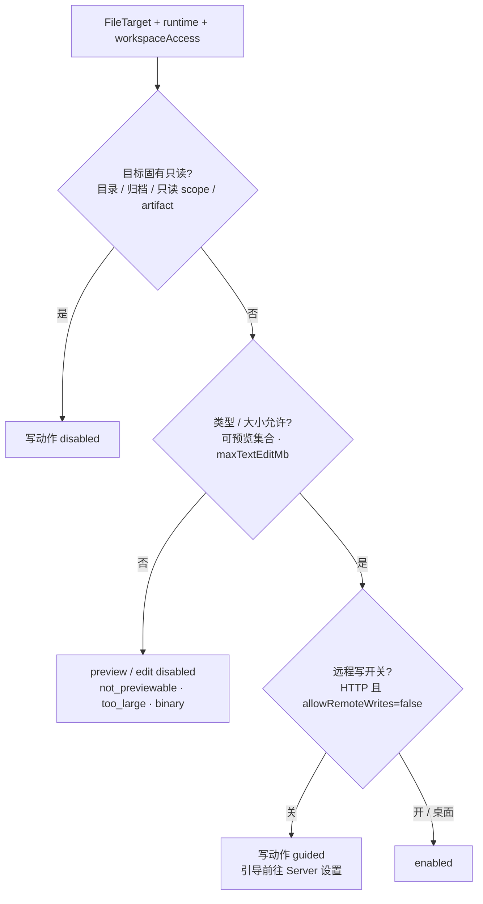
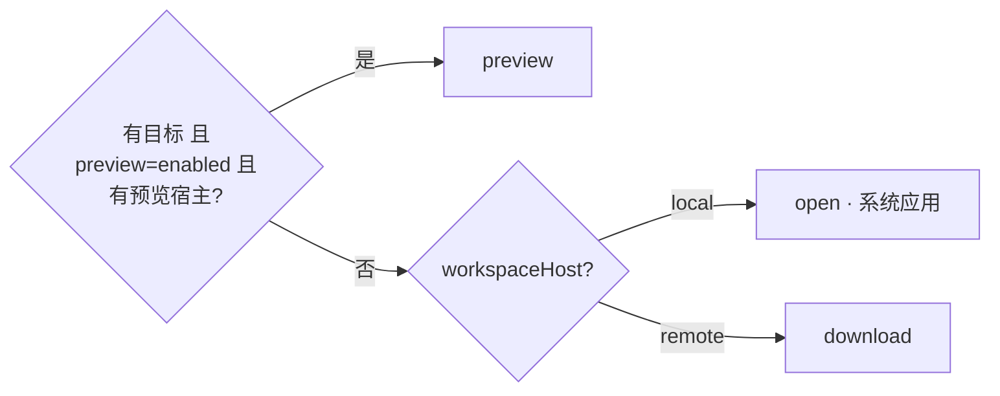
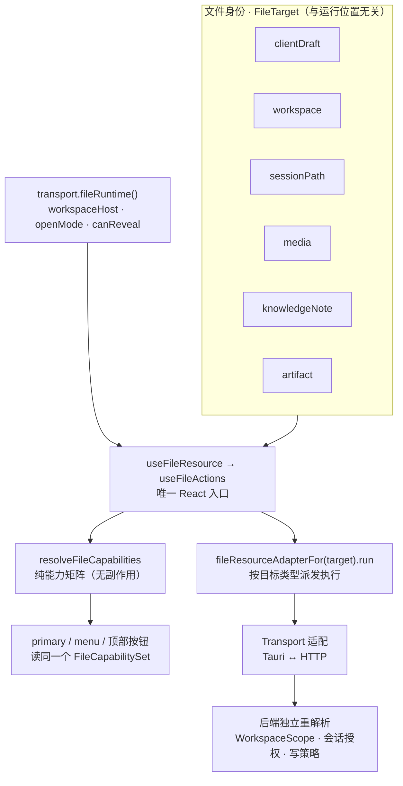
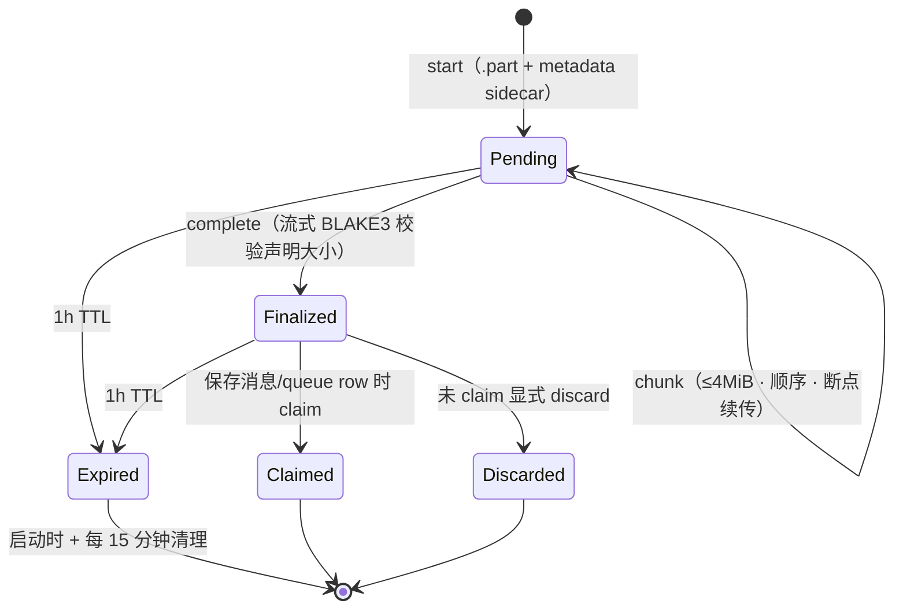
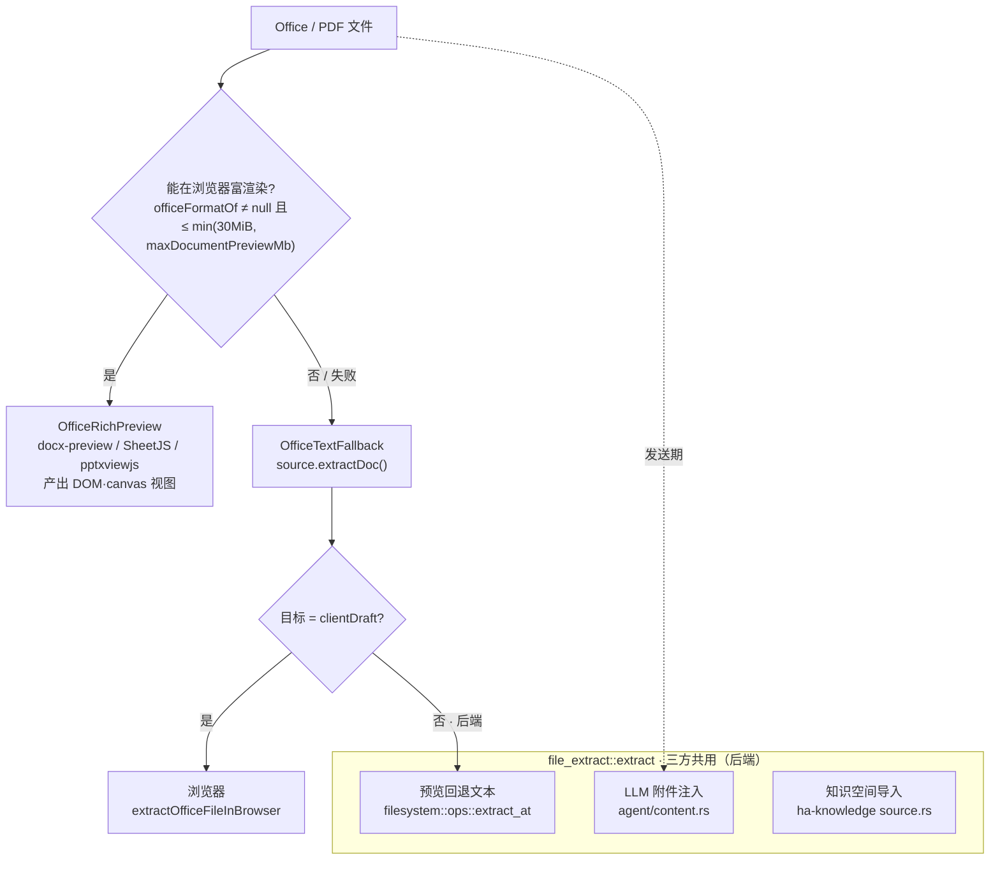

# 统一文件能力（File Operations）

> 返回 [文档索引](../../README.md) | 关联源码：[`src/components/chat/files/`](../../../src/components/chat/files/)、[`src/lib/fileKind.ts`](../../../src/lib/fileKind.ts)、[`crates/ha-core/src/filesystem/`](../../../crates/ha-core/src/filesystem/)、[`crates/ha-core/src/file_extract.rs`](../../../crates/ha-core/src/file_extract.rs)、[`crates/ha-core/src/file_upload.rs`](../../../crates/ha-core/src/file_upload.rs)、[`crates/ha-server/src/routes/sessions.rs`](../../../crates/ha-server/src/routes/sessions.rs) | 更新时间：2026-07-23

## 概述

文件在 Hope Agent 里到处出现：项目文件浏览器、聊天输入框草稿、消息附件、Markdown 里的本机路径链接、工具产出的媒体、Workspace 产物、项目 Memory 文件、知识空间笔记。每一处都要回答同样几个问题——**这个文件能不能预览？能不能编辑？它在本机还是远端服务器上？点一下该打开还是下载？**

如果让每个业务组件各自判断，很快就会出现两类错配：UI 显示"可以编辑"、后端却返回 403；或者能力说"能预览"、预览面板却打不开。本子系统的存在就是为了消灭这类分歧——把散落各处的文件交互收敛成**一条决议链**。

三个核心想法贯穿始终：

- **位置与生命周期正交建模**。一个文件"是什么"（身份、存储后端）和"现在能对它做什么"（能力）是两个独立维度。身份用 `FileTarget` 描述，与运行位置无关；能力则由身份叠加当前运行位置（本机桌面 / 远程服务器）动态推导。
- **前端能力只管交互，绝不是鉴权边界**。能力矩阵决定按钮亮不亮、点击做什么、要不要弹风险引导；真正的授权永远在后端。后端每次写操作都独立重新解析 scope 并应用同一套写策略，前端算错也无法越权。
- **每种入口都从同一契约派生**。业务组件不自行判断 Tauri/HTTP、不拼接文件 URL、不直接调 `window.open`；一律经统一的 React hook 取得类型、主动作、菜单与能力，再由适配器派发执行。

后文顺着这条链展开：先讲两个维度（§1）与从目标到动作的决议（§2），再讲承载它的前端资源层（§3）；然后是后端的写闸门（§4）、文本编辑与并发保存（§5）、客户端草稿（§6）、上传租约（§7）、预览与文档提取的三条路径（§8），最后是接入清单（§9）。

## 1. 两个正交维度

### 文件身份：`FileTarget`

`FileTarget` 是一个文件脱离"当前在哪台机器上"的身份。六种目标覆盖文件出现的每个场景：

```ts
type FileTarget =
  | { kind: "clientDraft"; draft: DraftAttachment; previewId: string }
  | { kind: "workspace"; scope: "session" | "project" | "path"; scopeId: string; relPath: string; name: string /* + mime/language/size/isDirectory/revealLines */ }
  | { kind: "sessionPath"; sessionId?: string | null; path: string; name: string /* + mime/language/revealLines */ }
  | { kind: "media"; item: MediaItem }
  | { kind: "knowledgeNote"; kbId: string; path: string; contentHash?: string }
  | { kind: "artifact"; artifactId: string; name: string; projectPath?: string | null };
```

| 目标 | 含义 | 解析方式 |
|---|---|---|
| `clientDraft` | 当前 renderer 内存里的浏览器 `File`（粘贴/拖放/选择器） | 发送前完全属于客户端，不涉及后端 |
| `workspace` | 后端解析的受限工作区相对路径 | 一切访问经 `WorkspaceScope` |
| `sessionPath` | 会话里由工具、Markdown 或产物引用的绝对路径 | HTTP 侧须逐次按会话授权 |
| `media` | 已发送的聊天附件或工具媒体 | 用 transport 的媒体 URL/路径解析 |
| `knowledgeNote` | 知识空间 Markdown | 写操作始终委托 Note service，不接普通 workspace mutation |
| `artifact` | 受管 Canvas/Artifact HTML 投影 | 以 opaque Artifact ID 解析预览，打开/导出由 Transport 适配当前 runtime |

### 运行位置：只有两种文件主机语义

同一个 `FileTarget`，在不同运行位置下文件真正躺在哪台机器上、能不能"在文件夹里显示"（reveal）都不同。运行位置归结为两种语义：

| 前端形态 | Transport | `workspaceHost` | 文件实际所在机器 | 打开方式 | reveal |
|---|---|---|---|---|---|
| 本地桌面 | Tauri | `local` | 当前电脑 | 系统默认应用 | 支持 |
| 桌面远程 | HTTP | `remote` | Server 所在机器 | 浏览器/应用内 | 不支持 |
| Web | HTTP | `remote` | Server 所在机器 | 浏览器/应用内 | 不支持 |

桌面远程与 Web 的文件语义完全一致，都是 `remote`。唯一始终留在本客户端的是 `clientDraft`——它是浏览器内存里的 Blob，无论前端形态如何都不属于后端。而文件浏览器里的"上传"是用户显式触发的 workspace 写操作，远程时会把客户端文件上传进 Server workspace。

### 大小配置与硬上限

所有可配置的 `MB` 字段实际按 MiB（`1024 × 1024`）换算。旧 JSON 缺字段时回落默认值；读写、上传的 start/complete/claim、以及保存入口都调用后端同一组 clamp/bytes helper，因此前端展示的上限和后端强制的上限永远一致。

| 配置 | 默认 | 范围 | 覆盖场景 |
|---|---:|---:|---|
| `filesystem.maxChatAttachmentMb` | 20 | 1–512 | 用户聊天附件 + Agent `send_attachment` |
| `filesystem.maxWorkspaceUploadMb` | 20 | 1–512 | 新版 workspace 分块上传 |
| `filesystem.maxTextPreviewMb` | 5 | 1–50 | Workspace、消息附件、未发送附件的文本预览 |
| `filesystem.maxTextEditMb` | 5 | 1–20，且 ≤ preview | Workspace/草稿副本/项目 `AGENTS.md` 编辑与保存 |
| `filesystem.maxDocumentPreviewMb` | 50 | 5–100 | PDF/Office 后端预览提取 |
| `filesystem.maxArtifactImportMb` | 25 | 1–100 | Artifact HTML/Markdown/Analysis JSON 来源导入 |
| `knowledgeSourceLimits.maxTextSourceMb` | 5 | 1–20 | 知识空间文本来源 |
| `knowledgeSourceLimits.maxBinarySourceMb` | 24 | 1–100 | 知识空间文档、音视频、图片来源 |
| `knowledgeSourceLimits.maxUrlResponseMb` | 2 | 1–20 | URL 网页响应 |

`PATCH /api/config/filesystem`（Tauri `patch_filesystem_config`）只更新显式携带的字段，这样 Server 设置页改 `allowRemoteWrites` 时不会顺手覆盖文件大小限制。在模型可调的设置面里，`filesystem` 类别只承载 `allowRemoteWrites` 这个 HIGH 风险开关（尺寸走 `file_limits`）；`file_limits` 与 `knowledge_source_limits` 为 MEDIUM。

不可配置的安全/协议上限保持独立：头像 10 MiB；Office 富渲染 30 MiB（超限回退文本提取）；代码高亮约 40 万字符（`content.length`，超限无高亮）；Logo、STT、IM 平台、远程图片/PDF、Memory 备份继续用各子系统自己的硬上限。旧 Base64 知识导入固定 24 MiB，旧聊天 stage/Base64 与旧 Workspace 整体 body 上传固定 20 MiB；只有新版分块租约才能用到更高的可配置上限。

## 2. 从目标到动作：统一决议

### 动作与能力状态

一个目标上可能执行的动作是固定枚举，每个动作的可用性用三态表达：

```ts
type FileAction =
  | "preview" | "open" | "download" | "reveal"
  | "edit" | "remove" | "rename" | "delete"
  | "createFile" | "createFolder" | "upload" | "saveAs";

type CapabilityState = "enabled" | "guided" | "disabled";
```

- `enabled`：可直接执行。
- `guided`：入口保留，点击后解释风险并引导到 Server 设置——**不能先发一个注定 403 的 mutation**。
- `disabled`：类型、大小或目标本身不允许，也不提供解锁引导。

### 能力优先级

能力由目标身份叠加运行位置推导，判定顺序固定为：



即 **目标固有只读 > 类型/大小限制 > 远程写开关 > 可执行**。前端能力只控制交互；后端每次 mutation 都重新解析 scope 并应用同一最终写策略，前端算错也无法越权。

### 主点击决议

主点击（左键）默认落在哪个动作，也由能力和运行位置共同决定：



可预览目标优先 `preview`；没有预览宿主时，本地 `open`、远程 `download`。文件左键、右键菜单、`⋯` 菜单、预览面板顶部按钮全部读取同一个 `FileCapabilitySet`，四处永不打架。

### 类型判定与可预览集合

文件类型判定集中在 [`src/lib/fileKind.ts`](../../../src/lib/fileKind.ts)。`fileKind(name)` 纯按扩展名分桶（含 `Dockerfile`/`README` 这类无扩展名的约定文件名）；`fileKindOf(name, mime, language)` 在有可靠 MIME（附件）时优先按 MIME 判定，再回退扩展名与工具元数据里的语言。输出是 `FileKind` 九元组：

```
code · markdown · image · pdf · office · text · audio · video · other
```

可预览集合也只在这里定义：常量 `PREVIEWABLE_KINDS` 与函数 `isPreviewableKind(kind)`，当前包含除 `other` 之外的全部八种。它唯一的消费者是 `fileCapabilities.ts` 的 `resolveFileCapabilities`，用来把 `preview` 置为 `enabled` 或 `disabled("not_previewable")`；其余组件不得自行判断"这个类型能不能预览"。

**新增一种可预览类型必须同步四处**，缺任一处都会得到"能力说可以、面板打不开"或"面板能渲染、入口点不出来"的错配：

1. `fileKind.ts` 的 `FileKind` 联合类型加成员。
2. `fileKind()` / `fileKindOf()` 的扩展名集合与 MIME 分支能把该类型识别出来（否则永远落到 `other`）。
3. `PREVIEWABLE_KINDS` 加入该 kind，`isPreviewableKind` 才会返回 `true`。
4. [`FilePreviewPane`](../../../src/components/chat/project/file-browser/FilePreviewPane.tsx)（按 `fileKindOf` 结果分派的只读渲染层，与外壳 `files/FilePreviewPanel.tsx` 不是同一个文件）增加对应渲染分支，否则 capability 为 `enabled` 但预览面板落到文本尝试或二进制占位。

同时按需在 [`FileTypeIcon`](../../../src/components/icons/FileTypeIcon.tsx) 的 `EXT_ICON` / `iconForMime` 补图标，否则新类型只显示默认文件图标。

三类目标不经 `isPreviewableKind`，在 `resolveFileCapabilities` 里无条件把 `preview` 提升为 `enabled`：`clientDraft`（内存 Blob 一律可尝试预览）、`knowledgeNote`、`artifact`。反方向的强制降级是 `workspace` 目录项，它把 `preview` / `open` / `download` / `reveal` 全部关掉。

### 决议究竟在哪计算

`primary` 与 `menu` 在 [`useFileActions.ts`](../../../src/components/chat/files/useFileActions.ts) 计算，[`useFileResource.ts`](../../../src/components/chat/files/useFileResource.ts) 只是它的一层同签名转发。主点击的判据是 `target && canPreview && capabilities.preview.state === "enabled"` 取 `preview`，否则 `isLocal ? "open" : "download"`；这里的 `isLocal` 取自 `transport.fileRuntime().workspaceHost === "local"`。

`Transport.supportsLocalFileOps()` 是**另一个**能力位（Tauri `true` / HTTP `false`），**不参与**能力矩阵与主点击决议。它专供两个消费者：设计视图的本机目录选择，和 `previewSource.ts` 里 media 项走本地路径直读的分支。两者不要互相代替。

Markdown 里的本机路径链接也不是 `supportsLocalFileOps` 的消费者：`MarkdownRenderer` 用 `localPathFromHref` 判断 href 是否本机路径，命中后交给内部的 `MarkdownFileLink`，由 `useFileResource` 按同一套能力矩阵决议 preview / open / download。性能取舍是只有本机路径链接才付 hook + ContextMenu 成本，外链渲染成纯 anchor。

[`src/lib/fileActions.ts`](../../../src/lib/fileActions.ts) 只承载 `FILE_ACTION_META`（每个动作的 i18n key、默认标签、lucide 图标）与 `FileAction` 的 re-export，**不含任何决议逻辑**——决议分布在 `fileCapabilities.ts`（纯能力矩阵）与 `useFileActions.ts`（primary / menu / run 派发）。`FILE_ACTION_META` 只被 `FileActionMenu` 与 `FileBrowserTree` 消费，用于渲染菜单项外观。

## 3. 前端资源层

整条决议链的实现汇聚在 [`src/components/chat/files/`](../../../src/components/chat/files/)。下图是数据流：一个 `FileTarget` 经唯一 hook 得到能力与动作，再由适配器落到 Transport，最后被后端独立重解析。



统一入口的模块分工：

- [`types.ts`](../../../src/components/chat/files/types.ts)：`FileTarget`、`DraftAttachment`、动作与能力 DTO。
- [`fileCapabilities.ts`](../../../src/components/chat/files/fileCapabilities.ts)：无副作用能力矩阵；新增目标/动作先更新这里和矩阵测试。
- [`fileResourceAdapter.ts`](../../../src/components/chat/files/fileResourceAdapter.ts)：每类目标实现 `capabilities`、`previewSource` 与 `run`。
- [`useFileResource.ts`](../../../src/components/chat/files/useFileResource.ts) / [`useFileActions.ts`](../../../src/components/chat/files/useFileActions.ts)：React 业务唯一 hook，返回文件类型、主动作、菜单、能力状态和执行函数。
- [`FileActionMenu.tsx`](../../../src/components/chat/files/FileActionMenu.tsx)：右键与 `⋯` 的统一视图。
- [`previewSource.ts`](../../../src/components/chat/files/previewSource.ts)：把不同存储后端收敛成 `readText` / `extractDoc` / `rawUrl`。
- [`useObjectUrlLease.ts`](../../../src/components/chat/files/useObjectUrlLease.ts)：客户端 Blob URL 的唯一租约；替换、移除、关闭预览及卸载时 revoke。
- [`useFilePreview.ts`](../../../src/components/chat/files/useFilePreview.ts)：对话内 [分栏工作台](../agent/docked-workbench.md) 的多文件标签集合；按稳定 `FileTarget` provenance 去重、按会话隔离并保留各预览 renderer。Files 树与搜索结果也走这个入口。

两个共享模块位于 `src/lib/`，供资源层与文件浏览器共用：

- [`fileKind.ts`](../../../src/lib/fileKind.ts)：`FileKind` 判定、`isPreviewableKind` 可预览集合、`shikiLang` 高亮语言、`extOf` 扩展名原语。
- [`fileActions.ts`](../../../src/lib/fileActions.ts)：`FILE_ACTION_META` 动作展示元数据，无决议逻辑。

### 文件图标

所有文件形态图标走 [`FileTypeIcon`](../../../src/components/icons/FileTypeIcon.tsx)（vscode-icons 彩色图标集，`unplugin-icons` 在构建期内联为 SVG——离线、CSP 安全，且只有 import 过的图标会进包）。解析顺序是扩展名优先（`EXT_ICON`，复用 `fileKind.ts` 的 `extOf`），MIME 兜底（`iconForMime` 覆盖 image/audio/video/pdf/office/json/text 等大类），最后 `default-file`。

统一消费点：输入框附件栏、消息附件卡（`FileCard.tsx` 导出的 `FileMimeIcon` 是给旧 `(mime, name)` 调用点保留的薄适配器）、文件浏览器树与搜索结果、Markdown 文件链接图标、输入框 mention chip，以及 `SkillMentionIcon` 借用的 office 三件套图标。业务组件不得为文件另选图标；新增文件形态只在 `EXT_ICON` / `iconForMime` 补一条。

单色 lucide 图标 `fileKind.ts::iconForEntry` 是有意保留的**非文件**用途：文件浏览器树用它渲染目录的展开/折叠态（文件行仍走 `FileTypeIcon`），二进制占位页用它作大号灰度插图。它不是 `FileTypeIcon` 的替代品。

### Transport 接口

Transport 在 [`transport.ts`](../../../src/lib/transport.ts) 定义所有文件相关能力：

- `fileRuntime()`：同步返回 `workspaceHost`、`openMode` 与 `canReveal`。
- `getWorkspaceAccess(scope)`：向后端读取最终 workspace 写能力。
- `openWorkspaceFile` / `downloadWorkspaceFile` / `revealWorkspaceFile`。
- `uploadFile(file, purpose, progress?, signal?)` / `discardFileUpload(uploadId)`：聊天、Workspace、知识来源统一的分块协议。
- `stageChatAttachment` / `discardChatAttachmentUpload`：聊天调用侧别名，内部委托通用租约。

[`transport-provider.ts`](../../../src/lib/transport-provider.ts) 通过 `useSyncExternalStore` 暴露响应式 `useTransport()`；切换本地/远程后所有文件能力立即重算。非 React 代码保留 `getTransport()`。存在脏编辑器时，切换 Transport 必须先确认。

## 4. Workspace 访问与写闸门

Tauri `project_fs_capabilities` 与 HTTP `GET /api/fs/capabilities` 返回统一形状：

```ts
interface WorkspaceAccess {
  readable: boolean;
  writeState: "enabled" | "remote_writes_disabled" | "scope_read_only" | "project_archived";
  rootPath: string;
}
```

`rootPath` 是 [`WorkspaceScope`](../../../crates/ha-core/src/filesystem/workspace.rs) 按 session override → project explicit root → project default workspace 裁定并 canonicalize 后的权威根目录。Composer、文件选择器和文件操作必须消费该值，不能在前端重建 `projects/<id>/workspace`，从而保持 Tauri/HTTP 与执行层同源。

项目辅助源文件夹使用 `project_folder` scope：客户端只携带基础 project/session scope、`linked_dirs` 索引与期望路径，后端每次从 live Project 重新解析并要求索引和 canonical 路径精确匹配。它复用同一套 capability、CAS、越界检查与远程写闸门，不是通用绝对路径入口；项目删除、目录移除或换序后旧 scope 立即 fail closed。

后端 [`WorkspaceScope`](../../../crates/ha-core/src/filesystem/workspace.rs) 是唯一判定点，写状态的推导规则是：

- 本地桌面默认可写。
- HTTP（含桌面远程和 Web）受 `filesystem.allowRemoteWrites` 约束。
- `path` worktree 跳转固定只读。
- archived project、其 session workspace 及其辅助源文件夹固定只读。
- 知识空间外部目录继续服从 `allow_external_writes`；后台自主维护永不写外部。

其中**固有只读原因（`scope_read_only` / `project_archived`）永远优先**，服务器侧的远程写开关在其之后叠加——这正是 §2 能力优先级在后端的对应实现。

`WorkspaceScope::access`（供 UI 读能力）与 `resolve_effective_writable`（供实际写操作）读取同一策略：UI 展示的可写状态与真正 mutation 的放行结果永远一致，不会出现"显示可写却 403"。路径必须是 scope 内相对路径；`..`、绝对路径、symlink escape 与非当前仓库 worktree 跳转均 fail closed。

远程写关闭时，UI 把写动作标记为 `guided`，弹风险说明并提供"前往 Server 设置"；文件浏览器不能直接改这个高风险开关。设置事件、Transport 重连和 event-stream resync 后都重新读取能力。

## 5. 文本读取、编辑与并发保存

读文本返回的 `FileTextContent`（`project_fs_read_text`）在常规字段外，还带足够做安全编辑与冲突检测的元数据：

```ts
interface FileTextContent {
  // ...relPath / content / isBinary / mime / totalLines / sizeBytes / truncated
  contentHash: string | null; // 磁盘原始 bytes 的 BLAKE3（后端有意跳过读取时为 null）
  isUtf8: boolean;
  lineEnding: "lf" | "crlf" | "cr" | "mixed";
  hasUtf8Bom: boolean;
}
```

只有**有效 UTF-8、非二进制、非截断且不超过 `filesystem.maxTextEditMb`**（默认 5 MiB）的文件可编辑。编辑器复用 CodeMirror 6，按扩展名识别语言；Markdown 可在源码与渲染视图间切换。Office、PDF、图片及其他二进制文件不编辑。

保存必须显式触发（按钮或 Cmd/Ctrl+S），走一套 compare-and-swap 语义防止覆盖别人的改动：

- 编辑已有文件传上次读到的 `expectedFileHash`。
- 新建/另存为传 `createOnly=true`。
- 保存保留 UTF-8 BOM 与原换行格式；混合换行首次保存会提示，并统一到占比最高的格式。
- 写入经 `platform::write_atomic`，不存在普通 `fs::write` 回退。

返回值在 Tauri/HTTP 保持相同结构：

```ts
type FileWriteOutcome =
  | { status: "saved"; relPath: string; sizeBytes: number; contentHash: string }
  | { status: "conflict"; reason: "changed" | "deleted"; currentContentHash?: string };
```

冲突只提供"重新加载""另存为""取消"，**禁止强制覆盖**。另存为只能留在当前 scope，且 `createOnly` 防止覆盖已有文件。

收到 `project:fs_changed` 时：编辑器干净则重读并自动刷新；有脏修改则显示外部变化提示，不覆盖编辑区。切文件、关闭面板、切 Transport 与离开页面都必须拦截未保存修改。

## 6. 客户端草稿附件

```ts
interface DraftAttachment {
  id: string;
  file: File;
  acquisition: "paste" | "drop" | "picker";
  semanticSource: "upload" | "pasted_text";
  status: "ready" | "uploading" | "error";
  error?: string;
}
```

草稿按会话保存在 renderer 内存：切换会话可恢复，刷新/退出不持久化。**发送前不发出任何附件上传请求**。

- 图片、音视频、PDF、Office、文本直接从 Blob/File 预览。
- "打开"只打开 Blob URL，不创建临时磁盘文件。
- 有效 UTF-8 且不超过 `filesystem.maxTextEditMb`（默认 5 MiB）的文本、代码、Markdown 和长粘贴文本可编辑内存副本；保存以新 `File` 替换草稿，**绝不修改用户原始磁盘文件**。
- 支持预览、打开、下载副本、编辑副本、移除和替换。
- Object URL 由统一租约管理。

## 7. 发送与 upload lease

点击发送才开始上传，并固定当时的 Transport 与草稿快照。整个过程围绕"租约（lease）"展开：附件先分块上传成一份 pending lease，消息真正落库时才把 lease claim 成正式附件。

发送编排（`useChatStream` 中）：

1. 前端读当前后端的 `filesystem.maxChatAttachmentMb` 校验单文件大小（默认 20 MiB，范围 1–512）。单消息最多 64 个附件。
2. 最多 **3 个文件并发**调用 `uploadFile(..., "chat_attachment")`；每个文件内部按 4 MiB 严格顺序发送，图片和普通文件不再转 Base64。
3. 任一失败时等待在途任务结束，回收全部已成功的 lease；文字和所有草稿保留并标出错误，消息不发送。
4. 全部成功后生成只含 `upload_id` 的 `ChatAttachment`，再清空输入并启动/入队消息。
5. normal chat 在保存用户消息时 claim；durable queue 在保存 queue row 时 claim。未 claim 的 lease 可显式 discard。
6. lease id 为 UUID，HTTP 不暴露服务端磁盘路径；`.part` 与原子 metadata sidecar 位于内部 pending 目录。
7. 后端用同一配置再次校验附件大小、64 个上限、UUID、来源，以及 `upload_id` 与 `data`/`file_path` 互斥；客户端值不能绕过后端。
8. claim 先复制并准备全部目标，任一失败回滚所有目标且保留原 lease；准备全部成功后才删除源 lease，保证可重试。

lease 的生命周期：



租约配额与超时是后端常量（`file_upload.rs`）：单块最多 4 MiB，lease 1 小时过期，全局最多 256 个、8 GiB 声明数据。

通用协议为 `file_upload_start/status/chunk/complete/discard`：chunk 必须携带精确 offset，最多 4 MiB；响应丢失时客户端查 status 从已收 offset 继续；单块最多 3 次指数退避；完成时流式计算 BLAKE3 并验证声明大小。start、complete 和最终业务 claim 都重读当前配置，因此上传途中调低配置会让 finalize/claim 失败。Tauri chunk 用 raw binary IPC body，HTTP chunk 用 Blob request body，renderer 与 Server 在上传阶段都不缓冲完整文件。

附件上限属于后端配置：本地桌面读本机 `config.json`，桌面远程与 Web 读 Server 的 `config.json`。旧配置缺字段时按 20 MiB 处理；设置保存时钳制到 1–512 MiB。旧 multipart/stage/Base64 入口维持 20 MiB 静态兼容上限。

`ChatAttachment.upload_id` 与 `data`、`file_path` 互斥。旧字段仍用于 ACP、IM、历史客户端和历史消息，但 HTTP 传入的旧 `file_path` 必须 canonicalize 后位于该 session 或 `_temp` 附件目录，否则 403——远程客户端不能借 `source: "upload"` 伪造任意主机路径。

发送 API 返回失败时，前端 discard 尚未 claim 的 lease；已 claim 的文件由 session 删除和 incognito 焚毁流程管理。

## 8. 预览、打开与文档提取的三条路径

[`FilePreviewPane`](../../../src/components/chat/project/file-browser/FilePreviewPane.tsx) 是统一预览视图，按 `fileKindOf` 结果分派（外壳 `FilePreviewPanel.tsx` 负责单个 target 与全屏，`useFilePreview.ts` 负责工作台多标签；三者不是同一个文件）：

- code/text/Markdown：文本与语法高亮；文件预览的 Shiki 固定使用 JavaScript 正则引擎，不依赖生产 Tauri CSP 禁止的运行时 WASM 编译。Markdown 与普通 HTML 可切换渲染/源码。普通 HTML 默认显示高亮源码，渲染视图会先移除脚本、refresh、外部资源和导航属性，再放进无脚本 sandbox 并注入与 Canvas 静态页面一致的离线 CSP；受管 Artifact HTML 仍走独立的 `allow-scripts` 预览链路。
- image/PDF/audio/video：浏览器原生预览。
- managed HTML / Artifact：受限沙箱 iframe 预览。
- Office：docx-preview / SheetJS / pptxviewjs 富预览，失败时回退后端抽取文本。
- 二进制/失败状态：显示原因，并从同一能力层提供打开或下载。
- 顶部按钮按 capability 显示打开、下载和编辑。

可选文字的预览统一遵守同一交互：鼠标、触控或键盘选区完成后，在选区附近自动浮出「复制 / 引用到对话」；右键入口继续保留作兼容。引用只进入 composer 的可删 quote chip，用户仍须显式发送。code/text/Markdown 源码可携精确行号；渲染态 Markdown 只有唯一 literal source match 时才携行号，Office 与 iframe 正文使用无行号上下文，禁止伪造 `L1-n`。managed HTML 只有在后端重读当前 projection、确认 bridge marker 与精确 script-isolated CSP 后，才通过 app-authored、限长的 `postMessage` bridge 上报选区；宿主无可信 capability 时不发送激活 token、也不监听选择消息。HTML／Slides／Design 等允许作者脚本的 iframe 只保留原生选择／复制，不能仅靠同帧 token 打开宿主引用入口。iframe 正文无论何种形态都不能直接触发发送。

浏览器原生 PDF viewer 与 PPTX 的 canvas 绘制层没有可安全读取的 DOM Range，当前只保留原生复制，不展示「引用到对话」。若以后替换 PDF renderer，须复用同一 selection action/quote 契约，而不是读取或放宽原生 viewer 的跨文档边界。

### 富渲染视图 vs 语义文本：为什么必须分开

Office 文档有两种截然不同的"看内容"方式，本子系统把它们做成**互不相交的两条实现**，再加上第三条只服务模型的注入路径：



**富渲染**由 [`OfficeRichPreview`](../../../src/components/chat/files/office/OfficeRichPreview.tsx) 编排：`officeFormatOf` 先把泛化的 `office` kind 收窄到真正能在浏览器渲染的子格式（`docx` / `xlsx` / `pptx`，`.xls` 走 SheetJS；**旧 OLE 二进制 `.doc` / `.ppt` 刻意返回 `null`**），再经 `source.rawUrl(false)` 取原始字节交给懒加载渲染库。命中以下任一情况即翻到 `OfficeTextFallback`：子格式不支持、体积超过 `min(30 MiB, filesystem.maxDocumentPreviewMb)`、字节 fetch 失败、渲染库自身报错。

**文本提取**由 `OfficeTextFallback` 在真正降级发生时才调 `source.extractDoc()` 触发，具体落到哪里由 `previewSource.ts` 的目标适配器决定，**不是恒定走后端**：

| 目标 | `extractDoc` 实现 | 提取发生在 |
|---|---|---|
| `sessionPath` | `transport.previewExtractDoc` → Tauri `preview_extract` / HTTP `GET /api/sessions/{id}/files/extract` | 后端 |
| `workspace` | `project_fs_extract`（文件浏览器侧等价于 `useProjectFs.extractDoc`） | 后端 |
| `media` | `transport.extractMediaDocument` | 后端 |
| `clientDraft` | `extractOfficeFileInBrowser`（`browserOfficeExtract.ts`） | **浏览器** |
| `artifact` | 抛错（产物不是文档提取源） | — |

前四行里的后端路径统一进入 `filesystem::ops::extract_at` → [`file_extract::extract`](../../../crates/ha-core/src/file_extract.rs)，返回纯文本加内嵌图片，受 `filesystem.maxDocumentPreviewMb` 约束。`clientDraft` 是唯一例外：尚未发送的草稿在后端无对应文件，提取只能在 renderer 里做——因此改后端 `file_extract` 不会影响草稿预览的降级文本，反之亦然。

**LLM 注入是第三条路径，与上面两条都不相交**：用户附件在发送期由 `agent/content.rs` 直接调同一个 `file_extract::extract`，把正文包成 `<file name=… path=…>` 文本块、抽出的图片并入多模态内容。它不经 `previewSource`、不经 `OfficeRichPreview`、也不看前端是否降级。

两条路径必须分开，是因为它们的产物性质相反：

- **前端富渲染**产出的是 DOM / canvas **视图**，既不可序列化进 prompt、渲染库也只存在于 renderer。所以调整渲染库或 30 MiB 视图上限时，**不改变模型看到的内容**。
- **后端提取**产出的是确定性**语义文本**，可入上下文、可复用。`file_extract` 被三方共用（预览回退文本、LLM 注入、知识空间导入 `ha-knowledge` 的 `source.rs`），改它的提取逻辑必须同时评估这三个消费方，不能只按预览效果验收。

### 会话路径的授权边界

HTTP `sessionPath` 的 read / extract / raw 三个端点**共用同一个授权 helper** `authorized_canonical_file_path`（[`crates/ha-server/src/routes/sessions.rs`](../../../crates/ha-server/src/routes/sessions.rs)），任何端点都不得自写谓词：请求路径必须绝对，且**被会话工具消息引用**，或 canonical path **位于会话 workspace 内**；两者皆非的主机任意路径一律 403（否则等于开放远程任意文件读）。不存在的已授权路径可返回 404。Tauri 本地路径由本机 owner 信任边界处理。

### 知识空间边界

知识空间文件只统一读侧预览、打开、下载、reveal 与能力展示；编辑仍由 NoteEditor 和 Note service 承担，并保留其 `expectedFileHash` stale-write、外部 root read-only、external/remote write 双闸门。**禁止把知识空间 mutation 接到普通 `project_fs_write_text`。** 消息附件的"归档到知识空间"是 media adapter 之外的显式扩展动作，不能混进通用 `FileAction` 权限语义。

### 各存储后端的上传闸门

Workspace 上传先完成 `workspace_upload` lease，再由 `project_fs_claim_upload` / `POST /api/fs/upload-claim` 在最终可写 scope 中复制、fsync、原子 publish；claim 时重新检查远程写开关、归档/只读、路径逃逸、symlink、覆盖策略和动态大小。知识来源本地文件用 `knowledge_source` lease，`KnowledgeSourceImportInput.uploadId` 与 `content` / `dataBase64` / `url` 互斥。客户端本地 Artifact 来源用 `artifact_source` lease，`ArtifactImportRequest.uploadId` 与 runtime-host `filePath` 互斥。知识来源与 Artifact 均在成功导入后消费 lease，失败保留至过期以支持重试。

## 9. 接入与验证清单

新增文件入口必须满足：

1. 创建合适的 `FileTarget`。
2. 使用 `useFileResource`；左键执行 `run(primary)`。
3. 右键用 `FileContextMenu`，可发现入口用 `FileActionsMoreButton`。
4. 不直接调用 `window.open`、`openFilePath`、`downloadFilePath`、`reveal_in_folder`，不拼 raw URL。
5. 新 Transport 命令同时实现 Tauri + HTTP，并更新 [`api-reference.md`](../system/api-reference.md)。
6. mutation 的 UI capability 与 backend guard 必须来自同一后端判定。
7. 覆盖本地桌面、桌面远程、Web、固有只读、远程写关闭与 transport 切换。
8. 文件类型判定只调 `fileKind` / `fileKindOf`，图标只用 `FileTypeIcon`，不得自建扩展名表。

新增一种可预览类型时，按 §2「类型判定与可预览集合」的四处同步清单逐项确认（`FileKind` 成员 → 分桶识别 → `PREVIEWABLE_KINDS` → `FilePreviewPane` 渲染分支），并在 `FileTypeIcon` 补图标。改动 `file_extract` 的提取逻辑时，同时验证预览回退文本、LLM 附件注入与知识空间导入三个消费方。

最低测试面：能力纯函数矩阵、Tauri/HTTP 适配对齐、路径逃逸/symlink/worktree/archive/远程闸门、CAS 保存与冲突、BOM/换行、脏状态与外部变化、草稿 acquisition/Object URL、upload lease 成功/部分失败回滚/claim/discard/限制/过期清理，以及文件入口不再局部直连系统打开。
