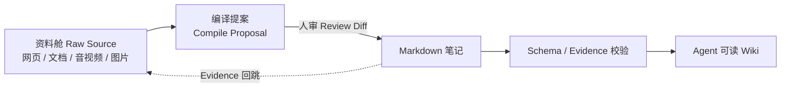
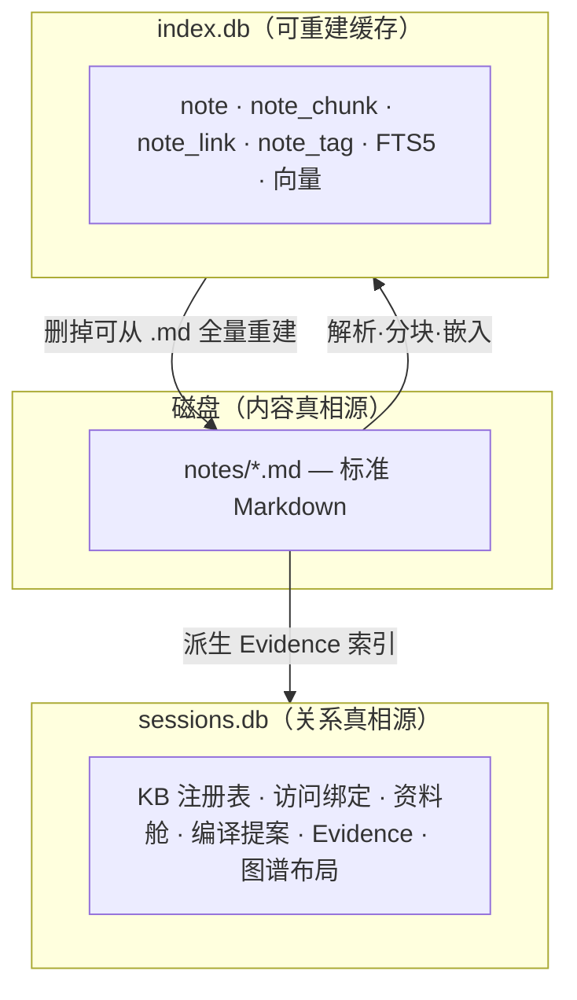
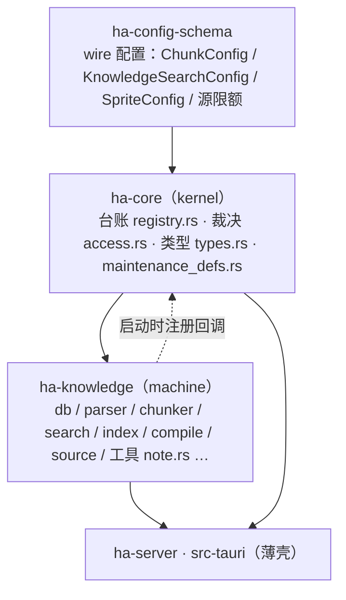
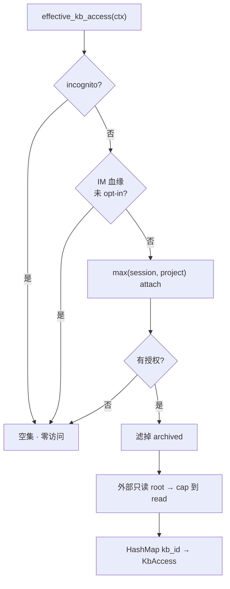
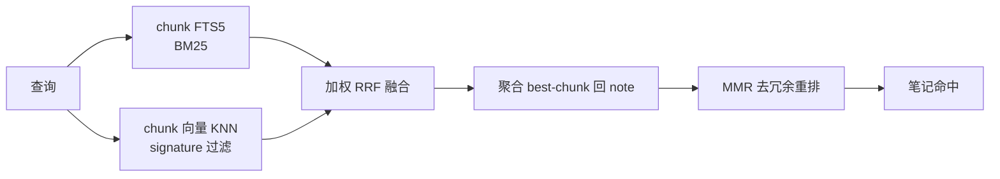

# Knowledge Base（知识空间）

> 返回 [文档索引](../../README.md) | 更新时间：2026-08-10

对外功能名叫「知识空间 / Knowledge Space」，代码里保持中性的技术名——模块目录 `knowledge/`、agent 工具前缀 `note_*`、文件作用域 `for_knowledge`。之所以两套名字，是因为中文「知识库」在语义上被 RAG / 客服系统占据，容易让人误以为这是个「上传文件搜答案」的面板；而它的真实定位比那大得多。

**关联源码**：台账与裁决在 kernel [`crates/ha-core/src/knowledge/`](../../../crates/ha-core/src/knowledge/)（`registry.rs` / `access.rs` / `types.rs`），业务机器在特征 crate [`crates/ha-knowledge/src/knowledge/`](../../../crates/ha-knowledge/src/knowledge/)，agent 工具在 [`crates/ha-knowledge/src/tools/note.rs`](../../../crates/ha-knowledge/src/tools/note.rs)，前端在 [`src/components/knowledge/`](../../../src/components/knowledge/)。

---

## 一、它解决什么问题

传统 PKM（Obsidian / Logseq）里，AI 是事后装上去的插件：知识网络靠人手织，AI 顶多在旁边搭把手。Hope Agent 反过来——**让 AI 成为知识库的第一公民**：它既能读整片知识网络、检索双链图谱，也能亲手创建 / 改写 / 链接 / 提炼笔记，还能把后台沉淀的碎片记忆编译成结构化文档。这把产品从「聊天助手」推向「第二大脑」。

三条产品原则贯穿全系统：

- **真实 `.md` 文件是唯一真相源**。笔记就是磁盘上的标准 Markdown，永不锁定、永不破坏性转写。SQLite 只是可重建的旁路索引，删掉能从 `.md` 全量重建。用户随时可以用 Obsidian / Logseq 打开同一个文件夹，零锁定。
- **AI 原生，不是插件**。CRUD、链接、图谱、检索、自主维护，agent 都有对应工具；知识可以从记忆碎片经 Dreaming 提炼成「可读层」笔记。
- **访问默认 deny + 显式 attach**。知识库不像记忆那样全局可见——工作 vault、私人 vault、IM 会话彼此隔离，任何一次访问都要经过唯一裁决点 `effective_kb_access`。

---

## 二、四种知识容器里的第四种

Hope Agent 里已经有三层「知识」，知识空间是与它们平级的第四个，也是用户可见度最高、唯一有一级导航入口的那个：

| 容器 | 真相源 | 谁写 | 谁读 | 用户可见度 |
|---|---|---|---|---|
| Memory | `memory.db` 原子条目 | 自动抽取 + `save_memory` | 按回合作为非稳定上下文提供给模型 | 低（后台） |
| Dreaming 日记 | `~/.hope-agent/memory/dreams/*.md` | AI 自省 | 用户翻看 | 中 |
| Project | `working_dir` 真实文件 | 用户 / agent | `read` 工具 | 高 |
| **知识空间** | **真实 `.md` 文件** | **用户手写 + agent 工具** | **agent 工具 + 按需召回** | **最高（一级导航）** |

区别于纯手动 PKM 的核心，是知识空间和 AI 之间架了一条**双向桥**：碎片记忆向上提炼成可读笔记，笔记向下经索引和图谱回流给 agent。

**读取桥有三条通道**，它们都把笔记正文套进 `<untrusted_external_data>` 信封，永不提升为 system 指令：

1. **确定性引用**：Composer 的类型化 `@note` binding 精确绑定 `kb_id + rel_path`；兼容期仍只读解析 `[[note]]`。两者都只向当前回合提供笔记数据，不变成 system 指令。
2. **主动检索**：agent 调 `note_search` / `knowledge_recall` 等工具。
3. **被动相关笔记**：每轮自动把「相关笔记标题」当提示（默认开，但仅在该 KB 已授权时生效，且只给标题不给正文）。

---

## 三、Knowledge Compiler：可审计的个人 Wiki 编译系统

知识空间的长期形态不是「上传文件的 RAG 面板」，而是一套**可审计的个人 Wiki 编译流水线**：原始资料保留出处，模型只产出待审 diff，长期知识沉淀到稳定的 `.md`，再由图谱、检索和外部 agent 持续消费。这个 raw/wiki 分层的思路来自 Karpathy 的 LLM Wiki，并吸收了若干 Obsidian 知识插件的实践。

这条流水线对实现施加了几条硬约束：

- 资料舱 source 与笔记 store **物理隔离**——source 有独立存储、独立检索、独立返回段，绝不混进笔记排序。
- 编译只生成待审提案，**批准前绝不写 `.md`**；崩溃重启后待审变更不丢。
- 每条 claim 可通过 Evidence 索引**回跳到支撑它的 source**。
- 音频、视频、OCR、网页刷新等一切输入，都必须先落成 raw source 的**文本快照**，再走同一条可审阅链路。

---

## 四、关键设计取舍

下面这些结论是理解整个子系统的地基，每条都给出「为什么这么定」。

| 决策 | 结论 | 为什么 |
|---|---|---|
| 笔记 vs 记忆 | 独立笔记系统，但与 AI 双向打通；记忆可提炼成笔记「可读层」 | 既不做纯手动 PKM，也不把笔记降级成大号 memory |
| 存储真相源 | 真实 `.md` 文件 + SQLite 旁路索引 | 贴合「文件即真实文件」，可与 Obsidian 互通，索引随时可重建 |
| 容器概念 | 独立「知识空间」容器，不复用 Project | 用户要一级功能 + 独立心智模型 |
| 召回形态 | 笔记检索是**独立通道**，绝不折进 `recall_memory` | 记忆是一句话事实、笔记是整篇文档，性质与排序不可比，混排会污染成熟的 memory 路径 |
| 文档 vs 大纲 | **文档优先打底**（对齐 Obsidian），原生大纲作只读可选层 | 文档优先与大纲优先的数据模型根本不同，无法一套原生兼容两者 |
| 存储分家 | KB 注册表 + 访问绑定落 `sessions.db`（真相源）；`index.db` 只存可重建缓存 | KB 是一级关系实体（列表 / 归档 / 绑定 / 权限），删索引后必须能全量重建 |
| 访问作用域 | 默认 deny + 显式 attach；incognito 零访问；IM 默认禁用（账号级 opt-in） | KB 不能像 memory 全局可见，否则工作 / 私人 / IM 互相泄漏 |
| 外部目录 | 内部 `notes/` 完整读写；外部 vault 绑定**默认只读**，opt-in 才放开写 | 「点亮现成 vault」是最大获客杠杆，但写外部的 lost-update 风险要用 opt-in 隔离 |
| 检索粒度 | **chunk 级**：整篇只存文件级元数据，正文检索下沉到 chunk，命中再聚合回 note | 整篇一个 embedding 在长文上失效；chunk 级支持按内容 hash 增量重嵌 |
| 编辑器 | **CodeMirror 6 源编辑器** + live-preview，不引入 WYSIWYG（Tiptap / Milkdown） | 核心契约是「真实 `.md` + wikilink + 字符 offset + AI patch + diff」，ProseMirror 的往返序列化会破坏这些 |
| 资料舱 | source 是 Hope 管理的原始输入快照，与笔记物理分开；不进 agent prompt | raw/wiki 分层需要先把「原始资料」和「编译后笔记」物理隔离 |
| 编译审阅 | 编译只产 proposal，approve 前不写 `.md`，fingerprint 幂等 | 必须先有人审 diff，既避免 LLM 静默污染，也让崩溃后待审不丢 |
| Schema / Evidence | 每个 KB 有默认 schema profile；compiled note 必含默认章节与 claim 级出处 | agent 读到的应是稳定 schema 而非任意 Markdown，且审计链可查询、可评分 |
| 外部 Agent API | 外部 agent 走稳定门面 `search/read/expand/sources/compile.propose`，默认只读 | 让 Claude Code / Codex / Cursor 把知识空间当长期 wiki 读，但不交出 owner 管理权 |

---

## 五、两类存储与数据模型

理解知识空间的关键，是分清三层存储各自的角色：磁盘 `.md` 是内容的真相源，`sessions.db` 是关系元数据的真相源，`index.db` 是纯粹的可重建缓存。

- **真相源 `KnowledgeRegistry`**（[`knowledge/registry.rs`](../../../crates/ha-core/src/knowledge/registry.rs)，落 `sessions.db`）：`knowledge_bases`、访问绑定、schema profiles、资料舱（`knowledge_sources` / `_chunks` / `_assets` / 导入流水线）、编译 run / proposal、维护提案、Evidence 派生索引、图谱布局。它包一个 `Arc<SessionDB>` 复用连接（仿 `ProjectDB` / `ChannelDB`），所有表随 KB 删而 `ON DELETE CASCADE`。它留在 kernel，因为它大量直接持有 `sessions.db` 的连接锁，而这条写连接不对特征 crate 开放。
- **可重建缓存 `IndexDb`**（[`knowledge/db.rs`](../../../crates/ha-knowledge/src/knowledge/db.rs)，落 `~/.hope-agent/knowledge/index.db`）：`note` / `note_chunk` / `note_link` / `note_tag` + FTS5（`note_chunk_fts`）+ 两套 sqlite-vec（普通检索 `note_vec`、相似笔记 `note_similarity_vec`）。连接模型仿 memory backend：1 写 + 4 读连接池 + WAL + sqlite-vec auto-extension。连 `rel_path` 都是缓存——删掉能从 `.md` 全量重建。

**笔记文件在哪**：内部 KB（`root_dir=NULL`）落 `~/.hope-agent/knowledge/{id}/notes/`（首次访问 lazy 创建），可写；外部绑定 vault（`root_dir` 非空）**默认只读**，直到 owner 在 GUI 里为该 KB 开 `allow_external_writes`。`resolve_kb_dir` 返回 `KbRoot{dir, is_external, read_only}`，其中 `read_only = is_external && !allow_external_writes`。**后台自主维护无视 opt-in，永不写任何外部 root**——只有 GUI / agent 按需才写外部。

### 核心数据类型

真相源类型定义在 [`knowledge/types.rs`](../../../crates/ha-core/src/knowledge/types.rs)，完整 DDL 见 `registry.rs`（sessions.db）与 `db.rs`（index.db）。下面只列角色与关键字段。

**`KnowledgeBase`（真相源）**：`id` / `name` / `emoji` / `root_dir`（`NULL`=内部目录，非空=外部绑定）/ `allow_external_writes` / `external_raw_sync`（`disabled|raw|sources`，仅外部 KB + 外部写 opt-in 时生效）/ `archived` / `created_at` / `updated_at`。`name / emoji / root_dir / external_raw_sync` 无法从 `.md` 重建，故必须随真相源持久化。

**访问绑定（真相源）**：`session_knowledge_bases(session_id, kb_id, access)` 与 `project_knowledge_bases(project_id, kb_id, access)`，`access ∈ read | write`；项目内的 session 继承 project 的 attach。

**`Note`（缓存行，真相在文件）**：`id`（自增）/ `kb_id` / `rel_path`（相对 root，缓存）/ `title`（frontmatter `title` > 首个 H1 > 文件名）/ `frontmatter_json` / `mtime` / `size` / `content_hash`。`content_hash` 是**整篇文件 BLAKE3 over raw 字节**（不归一化换行、保留 CRLF），只作返给调用方的「最近索引 token」做乐观并发对照——它**不是写入判定源**，写入判定一律以磁盘当前 raw BLAKE3 为准。正文检索全部下沉到 chunk，Note 行本身不挂 FTS / embedding。

**`NoteChunk`（chunk 级检索单元）**：`note_id` / `chunk_index` / `heading_path`（命中定位 + `#heading` 锚）/ `body`（已剥 frontmatter、归一化，仅供 FTS，不用于坐标）/ 码点 `start|end_offset` / `start|end_line|col`（跨端 UI 定位主字段）/ `content_hash`（按 chunk 增量重嵌）/ `embedding_signature` / `similar_embedding_signature`。普通检索的 Document 向量单独存 `note_vec`，相似笔记的 Symmetric 向量单独存 `note_similarity_vec`（均为 sqlite-vec vec0，rowid = chunk id），行内不存 embedding BLOB。

**`NoteLink`（双链边）**：`src_note_id` / `target_ref`（`[[ ]]` 原文目标）/ `target_note_id`（`NULL`=悬空）/ `link_type`（`wiki` / `embed` / `md`）/ `anchor`（heading slug 或 `^block-id`）/ `alias` / `raw_text` / 源文件位置 `src_start|end_line|col` / `src_heading_path`。**反向链接就是 `WHERE target_note_id = ?`**，一个索引即可，无需独立反链表。

### 坐标系契约（错位的根源必须钉死）

三套坐标不可混：Rust 的 UTF-8 字节、Unicode 码点、JS / CodeMirror 的 UTF-16。再叠上 CRLF 与 tab，全是错位来源。契约是：

- **持久化 offset 一律用码点偏移**（仅索引内部使用）。
- **跨端定位主字段是 `line`（1-based）+ `col`（0-based 码点列，tab 记 1 个码点不展开）**，按 `\n` 分行、`\r\n` 视作单个行终止符，**不改写原文件换行**。
- `note_chunk` 与 `note_link` 的坐标都相对**原始完整文件**（含 frontmatter / CRLF），不是相对剥离后的 `body`。
- **`note_patch` 不用坐标寻址**——它走 `old/new` 文本唯一命中（0 次或多次都拒），因为 LLM 产不准坐标、坐标又随上文漂移。

---

## 六、模块地图：kernel 与 machine 的分工

知识空间跨两个 crate。核心模式是：**业务机器搬进特征 crate `ha-knowledge`，但对 `sessions.db` 的 SQL 台账、wire 类型、纯谓词裁决恒留 kernel `ha-core`**。

**为什么某些文件必须留 kernel**：

- `registry.rs`：直接持有 `sessions.db` 连接锁的地方太多，撞「写连接不对特征 crate 开放」的红线；正因它留下，`get_knowledge_db()` 全局与 `AppState.knowledge_db` 也一并留 kernel。
- `access.rs`：`effective_kb_access` 是「访问默认 deny」的唯一裁决点，不能挪到可选装配的钩子后面。工具面的三条解析链（`access_map_for_tool_ctx` / `im_kb_context_from_session` / `session_has_kb_access`）**刻意不走钩子**、随裁决点留 kernel——否则收紧动作会带上「未装配即失效」的 fail-open 语义，也破坏「工具面与 `Agent::resolve_kb_access` 共用同一份推导」这条不变量。
- `types.rs` / `maintenance_defs.rs`：registry 方法签名用到的 wire 类型。

**kernel → machine 的唯一回调面**是 [`knowledge_hooks`](../../../crates/ha-core/src/knowledge_hooks.rs)，共十个槽：`search_notes` / `resolve_inline_injections` / `apply_embedding_from_config` / `start_reembed_job` / `init_index_db` / `ensure_default_knowledge_base` / `maintenance_idle_tick` / `spawn_maintenance_cron_loop` / `index_spawn_startup_reconcile` / `watcher_start_all_watchers`。特征 crate 启动时 `ha_knowledge::wire()` 一次性注册这十个钩子，并注册 24 个知识空间工具的分发条目（工具 schema 仍在 kernel 的 `definitions/core_tools.rs`）。

| 文件（`ha-knowledge/src/knowledge/`，除非标注 kernel） | 职责 |
|---|---|
| `types.rs`（kernel） | `KnowledgeBase` / `Note` / `NoteChunk` / `NoteLink` / `KbAccess` / 搜索结果 / 图谱 / 资料舱 / Schema + Evidence / 编译类型 |
| `registry.rs`（kernel） | KB CRUD + 访问绑定 + `resolve_kb_dir` + schema profiles + Evidence 派生索引 + 资料舱表 + 编译 run/proposal + 维护提案 + 图谱布局 |
| `access.rs`（kernel） | `effective_kb_access` 唯一裁决点 + 工具面解析链 |
| `maintenance_defs.rs`（kernel） | 维护提案 wire 类型（`ProposalKind` / `ProposalAction` / `MaintenanceProposal` / `MaintenanceReport`） |
| `db.rs` | index.db 后端：note/chunk/link/tag 单事务重索引 + FTS/vec 查询 + 反链 + 重解析 + 失效链接 / 孤岛 / 图谱边 / 块级反链 |
| `parser.rs` | pulldown-cmark 扫 heading / code + 叶块 span，正则扫 `[[ ]]` / `#tag` + Obsidian `^block-id` 块锚，产码点 offset + line/col（相对原始全文），手写 frontmatter→JSON |
| `chunker.rs` | 按 heading 分段 + 大小封顶，产 chunk（坐标 + BLAKE3 content_hash + overlap） |
| `resolver.rs` | `[[ref]]` → note_id 确定性规则（路径式 > 唯一 basename > 最短路径再字典序，NFC + 大小写不敏感，**不用 mtime**） |
| `rename.rs` | note / folder 改名移动 + 入站 `[[ ]]` 链接改写（保留 `#anchor` / `\|alias` / `![[ ]]`） |
| `index.rs` | 索引器：文件 → parse → chunk → embed → IndexDb；KB reconcile（mtime 增量 + prune）；全局 `IndexDb` |
| `watcher.rs` | `notify` watcher（debounce 800ms，仅 `.md`，per-KB 线程，外部 vault 实时同步） |
| `search.rs` | chunk 级 FTS + vec → RRF → MMR → 聚合回 note；`similar_notes` 向量 KNN。算法复用 memory，独立 store |
| `graph.rs` | 链接图谱构建（纯变换）：全图 / ego 子图 / 按度数截断 |
| `service.rs` | owner 侧操作（GUI / HTTP）：list / read / save / delete / rename / backlinks / search / broken_links / orphans / graph / ai_rewrite / 维护配置，不经 `effective_kb_access` |
| `source.rs` | 资料舱：多种来源导入、STT / OCR、SSRF-gated fetch、去重、版本链、外部镜像、批量导入流水线、相似治理、媒体留存 |
| `compile.rs` | Knowledge Compiler：读 source + 相关笔记经资料整理 Agent side_query 产结构化 Markdown，转成 proposal；approve 才 apply |
| `schema.rs` | Schema Profile / Evidence：默认 profile、source refs / claim 级出处解析、`knowledge_evidence_refs` / `_claims` 派生索引、coverage score、source→claim 反查 |
| `agent_api.rs` | 外部 agent 稳定门面：`search/read/expand/sources/compile.propose` |
| `agent_mcp.rs` | stdio MCP server：`initialize` / `tools/list` / `tools/call` 薄包装 `agent_api` |
| `inject.rs` | 读取桥①：类型化 `@note` / 兼容 `[[note]]` 的授权解析、版本化预览与确定性注入 |
| `embedding.rs` / `reembed.rs` | 知识空间独立 embedding selector + 后台重嵌 job |
| `maintenance/` | 自主维护（见后文） |
| `mod.rs` | `blake3_hex`（hash 契约：BLAKE3 over raw bytes）+ `delete_kb_cascade`（registry 事务 + index prune + 内部目录 rm-rf，外部 root 永不删） |

读取桥③（被动相关笔记）承载在 `knowledge/` 之外的 [`agent/related_notes.rs`](../../../crates/ha-core/src/agent/related_notes.rs)（kernel）。精灵模式在 [`crates/ha-core/src/sprite/`](../../../crates/ha-core/src/sprite/)（machine 在 kernel，wire 配置在 [`ha-config-schema/src/sprite.rs`](../../../crates/ha-config-schema/src/sprite.rs)）。可调 wire 配置（`ChunkConfig` / `KnowledgeSearchConfig` / 源限额）落在 [`ha-config-schema/src/knowledge/`](../../../crates/ha-config-schema/src/knowledge/)，消费算法留在 machine。

---

## 七、两条鉴权路线与访问裁决

知识空间有两条**物理隔离**的鉴权路线：

| 路线 | 在哪层 | 主体 / 鉴权 |
|---|---|---|
| **Owner / 管理** | HTTP 端点 / Tauri 命令（`service.rs`） | 面向用户本人：桌面本机信任 / HTTP API key = owner-equivalent；看自己**所有** KB，**不经 attach** |
| **Agent / session** | 模型能调用的工具（`note_*`，进程内） | turn 内的 agent；必过 `effective_kb_access(ctx)`（session + source + 全链 cap + incognito） |

KB 文件预览端点 `/api/knowledge/{kb_id}/files/*` 是**纯 owner 侧**，无 session 参数、无 fallback，与 `/api/sessions/{id}/files/*` 互不放宽。`note_*` 工具读笔记不经 HTTP 端点，进程内直接返回内容。

### 访问裁决 `effective_kb_access`

这是整个访问模型的心脏，也是所有 agent 侧读写的唯一裁决点。它接一个 `KnowledgeAccessContext`，返回 `HashMap<kb_id, KbAccess>`：

裁决顺序有意如此：incognito 最先短路（无痕会话一切归零），IM 血缘 cap 其次（IM 默认零访问），随后才是 `max(session, project)` 取并集、滤 archived、把没开外部写的外部 root 钳到只读。注意最后两步是双 owner 闸——即便外部 root 已 opt-in，`Write` 仍需一次 owner 授予的 write attach，且文件系统作用域在真正写盘时还会再查一次 `read_only`。

### source-aware：调用来源怎么透传

每个 typed turn 的 `ChatSource`（在 `chat_engine/stream_seq.rs`，变体 `Desktop` / `Http` / `Channel` / `Subagent` / `ParentInjection` / `SessionTool` / `Cron` / `Eval` / `Acp`）由 TurnKernel 封印，再经 kernel `kb_access_source` capability 映射成 `KbAccessSource`（`Gui` / `Http` / `Im` / `Subagent` / `Cron` / `Other`），一路透传到 `ToolExecContext`：

| ChatSource | KbAccessSource | 对 KB 访问的影响 |
|---|---|---|
| Desktop | Gui | owner 的 `max(session, project)` 路径 |
| Http | Http | 同上 |
| Channel（IM） | Im | **默认归零**（即便有 project attach），除非账号 opt-in |
| Cron | Cron | `is_im()==false`，不触发 IM 归零，走 owner 路径 |
| Subagent | Subagent | 继承 origin 的 cap（见下） |
| ParentInjection / SessionTool / Eval / Acp | Other | 中性来源；Eval 仍受其独立 source policy 与隔离 session 门控 |

**血缘 origin 真接线**：producer 只能经来源专用 `TurnSubmission` 提交 origin proof；TurnKernel 把它封进内部 `ChatEngineParams.origin_source`（顶层 `None` 时 origin=source），再一路传到 `ToolExecContext.origin_chat_source`。`subagent` 工具 spawn 子代理时把父轮的 origin 透传下去。`effective_kb_access` 的 IM cap 查的是 `source.is_im() || origin_source.is_im()`，所以 **IM-origin 的子代理也被归零，无法借中性的 `Subagent` 来源洗回权限**。这里其实有双重防线：即便不接线，子代理子会话本就无 attach、无 project_id（父会话不继承），天然是空集；origin cap 是面向未来（若子代理某天改为继承 project）的纵深防御。

### IM opt-in：默认禁用怎么按账号放开

IM 默认归零的红线可以按账号解除。IM 身份经 `ChannelKbContext{channel_id, account_id, chat_id, is_group}` 从 dispatcher 一路透传到裁决处，在那里解析出一个纯 bool `im_access_allowed`，`effective_kb_access` 只消费这个 bool（所以短路规则单测无需全局状态）。放开的判定链：

- 账号级 `settings.kbAccessOptIn`（owner GUI-only，默认关）是总开关；
- DM 只需账号 opt-in；
- 群聊还需 `settings.kbAccessChats` 含该 chat（群内 `/kb on` 写入）；
- 账号查不到 / channel_id 不匹配 → fail closed。

子代理按 origin 账号 / 群聊判 opt-in，同样不洗权限。

---

## 八、Agent 工具面

agent 在对话中直接调用的工具，覆盖 CRUD、链接图谱、检索、元数据、AI 高阶——共 24 个（22 个 `note_*` + `knowledge_recall` + `session_to_note`），在 [`tools/note.rs`](../../../crates/ha-knowledge/src/tools/note.rs)。它们都 `internal=false`（过权限引擎 + plan-mode），`kb` 参数过 `effective_kb_access`：**写**需要 write + 内部 root + 全链允许 + 非 incognito；**读** 时若省略 `kb` 就只搜可访问集合（跨 KB 同名返 disambiguation）。

- **CRUD / 链接**：`note_create / read / update / patch / append / delete / search / link / backlinks / by_tag / tags`；`note_rename`（别名 `note_move`）移动 `.md` 并改写入站 `[[ ]]`；`note_set_frontmatter` 逐行非破坏性合并 YAML（只重写命中的顶层键，`null` 删键，全删则丢整个 frontmatter 围栏）。
- **图谱 / 完整性**：`note_graph`（给 `note` 出 ego 子图，不给出全 KB 图并按度数截断 `cap_nodes(200)`）、`note_broken_links`、`note_orphans`。
- **智能检索（纯检索无 LLM）**：`note_similar`（向量 KNN）、`note_related`（backlinks ∪ 出链 ∪ 同标签 ∪ 向量近邻加权融合，带 `reasons`）、`note_suggest_links`（去码块后词界匹配其它笔记标题）。
- **AI 高阶（side_query 驱动 + 写）**：`note_distill`（原文 → 2–8 篇原子笔记）、`note_moc`（按主题 / 标签聚合生成 MOC）、`session_to_note`（会话转录 → 结构化笔记，**无痕会话源直接拒**）。这些走 `run_kb_side_query`（与 recall-summary / dreaming 同源，与主对话 agent 解耦），并在 LLM 调用**之前** fail-fast 检查可写作用域（外部 root 拒）。
- **块级引用写入**：`note_assign_block` 给目标块加 Obsidian `^id`——块文本唯一命中后解析整个叶块、幂等检测覆盖整块、拒 frontmatter / 代码围栏命中；id 缺省时由 `blake3(block_text)` 确定性生成（无 RNG）。
- **合并检索 `knowledge_recall`**：一次查 memory + 笔记两 store，返回 `{memories, notes}` **两段独立排序、绝不归一化混排**。它是薄编排器——分别调 memory backend 和 `search_notes`，绝不折进 / 改动 `recall_memory`。

**stale-write guard（强契约）**：所有写工具的 `expected_file_hash` 都比**磁盘当前 raw BLAKE3**，不比 `note.content_hash` 索引缓存。`note_patch` 走 `old/new` 文本唯一命中，坐标不做 patch 寻址。

---

## 九、检索与索引

**写入数据流**（内部 KB / owner 保存 / 工具写）：写盘 → `index::reindex_note`（parse → chunk → embed → `replace_note_index` 单事务，FTS 触发器同步、vec 手动同步）→ `reresolve_kb_links`（全 KB 重解析，broken ↔ resolved 翻转）→ emit `knowledge:changed`。外部 vault 走 bind / 启动 / 打开时的 `reindex_kb`（mtime 增量 + prune）加 `notify` watcher 实时对账。

**检索管线**：

融合 / 重排参数可配（`AppConfig.knowledge_search`，默认 text 权重 0.4 / vec 0.6 / RRF-k 60 / MMR-λ 0.7 / 候选池 ×3，`search_notes` 每次读 `clamped()`）。`note_similar` 是纯向量 KNN（无融合）、`note_related` 用自有融合——排序配置只作用于 `search_notes`。

**Embedding 独立 selector**：知识空间的向量化**不寄生记忆**——有自己完整的配置生命周期，记忆没配 / 关了都不影响它（关了只降级 FTS-only，不回退到 `memory_embedding`）。配置三层与 memory 对称、共享底层：`AppConfig.embedding_models`（共享命名模型库，memory 与 knowledge 同一份）+ `AppConfig.knowledge_embedding`（知识空间独立选择器 `enabled` / `model_config_id` / `active_signature` / `last_reembedded_signature`）+ 运行时解析成 provider。helper 在 [`knowledge/embedding.rs`](../../../crates/ha-knowledge/src/knowledge/embedding.rs)：它**不读** memory 的签名源、直接经 `IndexDb` 持有的裸 `EmbeddingProvider` embed（不复用 memory 的 embedding 缓存表，那是 memory SQLite backend 内部的）；但复用 memory 的 `create_embedding_provider` 工厂、`EmbeddingProvider` trait、RRF / MMR 算法。每个 chunk 新增与重建会分别生成 `EmbeddingPurpose::Document` 与 `EmbeddingPurpose::Symmetric` 两套向量；普通检索以 `Query` 查询 Document 空间，`note_similar` 只查询 Symmetric 空间。两套向量使用独立表与用途签名，禁止把 Jina / Voyage / Cohere / Google 等非对称 provider 的 task 空间混算；不得以单条/批量数量推断用途。用途、provider 语义版本与前缀/task 编译规则一同进入 v2 签名。

**重建重嵌**（[`knowledge/reembed.rs`](../../../crates/ha-knowledge/src/knowledge/reembed.rs)）：切模型 → 装新 embedder（维度变则 `note_vec` 与 `note_similarity_vec` 一起 DROP 重建）→ spawn `LocalModelJobKind::KnowledgeReembed`，遍历所有 KB `reindex_kb(full=true)` 重 embed，进度 KB-granular，完成写 `last_reembedded_signature`。复用 memory 的 `local_model_jobs` 框架（取消 / 单实例 / 进度 / retry）。启动时如果持久化签名不是当前 Document v2 签名，向量查询立即把旧行视为不匹配，仅 Primary 在 `local_model_jobs` 数据库完成初始化后的启动任务阶段恢复全量重建；不得从更早的 `init_index_db` 阶段发起，否则任务数据库尚未安装且本进程没有后续重试。增量协调只有在每个 chunk 同时具备当前 Document 与 Symmetric 两套用途签名时才把未变笔记视为最新；任一 provider 调用失败形成的单边向量都保持待重建，下次协调会幂等重试并补齐缺失用途。失败或取消不更新完成签名，下次启动可幂等续做。

**确定性检索与证据评测**：[`evals/suites/knowledge-retrieval-evidence/`](../../../evals/suites/knowledge-retrieval-evidence/) 只在显式 `hope-agent-eval` 流程中构造一次性 `index.db`，不调模型、不联网，也不写真实知识空间。当前固定覆盖中英文与代码标识、较小 chunk 下的导入噪声、同名笔记的知识空间隔离、重复索引替换旧版本，以及 heading / line / snippet 证据坐标。改 chunk、解析、FTS、聚合、权限过滤或证据坐标语义时必须新增或更新 fixture、提升 suite version，并向 `evals/version-lock.json` 追加新 `id@version`；不得覆盖既有 digest，也不得把这套专项评测塞回默认 Cargo test。

**配置项进不进 `ha-settings`**：`knowledge_search`（纯查询期、无 reindex 副作用）是正常 MEDIUM 设置，同时进 `ha-settings`；`knowledge_chunk`（改动触发全 KB 重切）与 `knowledge_embedding`（模型选择 + reembed 副作用）**GUI-only 不进 `ha-settings`**，类比 `active_model` 的豁免。改共享 `embedding_models` 库时，对 memory 与 knowledge 的 active model 双向守门（改 / 删 active 一律拒）。

**读取桥③——被动相关笔记**（[`agent/related_notes.rs`](../../../crates/ha-core/src/agent/related_notes.rs)，默认开）：每个用户轮在 `tokio::join!` 里与 awareness / active_memory 并发跑 `refresh_related_notes_suffix`——incognito 短路 → 从 agent 线接的来源重建 `KnowledgeAccessContext` → `effective_kb_access` 拿可访问 KB → 用 `user_text + access 指纹 + 展示配置` 做 TtlCache（默认 120s，防 KB detach / IM opt-in 变化后复用旧授权）→ `spawn_blocking` 里跑 `search_notes` 取 top-N → 渲染「## Related Notes」**只给标题**套 `<untrusted_external_data>` 信封。**无 LLM 调用**，没有 KB 授权时不提供任何内容。四个 Provider adapter 都把这段放到当前回合的 user-data lane；稳定 system 前缀及其缓存键不随召回结果变化。

---

## 十、会话感知注入与工具收窄

**会话侧 KB 访问的唯一入口是 `Agent::resolve_kb_access()`**（[`agent/mod.rs`](../../../crates/ha-core/src/agent/mod.rs)）：它复刻 `chat_source / origin_chat_source / channel_kb_context` + IM-bound 会话的 fail-closed 重分类 + project_id 查询 + `effective_kb_access`，返回与工具面 `access_map` 同集的 `HashMap<kb_id, KbAccess>`。三处共用它——被动相关笔记、无 KB 工具门控、`Knowledge Bases` 回合数据段，都**不得各自重写解析链**。结果按回合 memoize（回合起点与重绑 session 时失效），故一回合内约 5 次调用塌成单次 SQLite 解析。

关键边界：**它只服务 schema / prompt / 召回，绝不据此 gate 工具执行**。执行边界永远是 live 的 `note.rs::access_map`——回合中途撤权仍即时拦截真实读写。

- **无 KB 不注入笔记工具**：`is_kb_scoped_tool`（`note_*` + `session_to_note`，**不含 `knowledge_recall`**——跨 store，无 KB 仍可查 memory）在主组装点与 tool_search 之后过滤，`resolve_kb_access()` 为空则从 schema 剔除。这是纯 UX / 省 token，非安全边界（执行层由 `access_map` 兜底）。
- **回合数据「Knowledge Bases」段**：每轮从 `resolve_kb_access()` 的快照生成有界列表，逐库列 emoji+名、读/写、外部标记，库名转义并明确按数据解释。该段进入 user-data lane，不进入稳定 system；为空则整段省略——绝不广告 `note_*` 会拒的库。
- **检索结果标来源（多库可辨）**：`NoteSearchHit` 带 `kb_name` / `kb_emoji`，收尾按 distinct kb_id 一次性从 registry 填充（防 N+1，index.db 只存 `kb_id`）。前端 `KnowledgeResultCard` 把结果按知识空间分组渲染。

### 类型化 `@note` 与版本化续读

Composer 选择笔记时同时发送 `IncomingTurnWire` sidecar；正文里的 `@标题` 只负责展示。后端先校验 wire 版本、原始 UTF-8 span、token 文本和 canonical digest，再按 sidecar 中的 `kb_id::rel_path` 走 live `effective_kb_access` 与 root containment。没有 sidecar 的粘贴文本不会获得 typed binding；只有独立登记的兼容语法 `[[note]]` 仍可走只读解析。typed Note 的已验证 UTF-8 span 会先从兼容扫描视图中移除，避免同一引用解析两次；同 turn 的其它 typed mention 不会让用户另行输入的 `[[note]]` 失效。

兼容 `[[note]]` 的 raw-text 识别由 kernel `knowledge::legacy_wikilink_targets` 与 `ha-knowledge` injector 共用；普通 Markdown `[label](url)` 不命中。当前 injector 会识别代码 span/fence 内的 `[[note]]`，所以忙时队列也将其视为需要完整 turn 的语义而禁止 raw tool-boundary 插入；若未来切为跳过代码，必须先改共享 scanner，让 injector 与队列原子同步。

typed `@note` 的首轮正文预算以 primary model 的 context window 为基数：先取窗口的 20%，在 Provider-exact 计数前按约 4 UTF-8 bytes/token 换算为目标 byte 总量，再按本 turn 的 typed Note 数量等分；等分后的每篇份额钳在 8 KiB–200,000 bytes，实际物化仍受每 turn 最多 5 篇的上限。正文不超过份额时，模型信封写 `materialization="complete"`，receipt 写 `state=complete` 并记录相等的 `sourceBytes/deliveredBytes`；超出份额时只提供 UTF-8 边界安全的确定性前缀，信封写 `materialization="preview"`、opaque `content_version` 与 `continuation_tool="note_read"`，receipt 则写 `state=preview`、源/已投递 byte 数和 `continuationTool=note_read`。这套自适应预算只适用于 typed `@note`；兼容 `[[note]]` 仍维持每篇 8 KiB 的固定预览上限。

预览后的继续读取必须使用同一 `kb/path` 调用 `note_read(expected_content_version=...)`。工具会重新检查 live `effective_kb_access`，并从当前磁盘 bytes 重新计算 opaque version；版本不等即 fail closed，模型不能把旧预览和新正文拼成一个虚假的一致快照。完整正文、预览和被动召回都进入 `<untrusted_external_data>` user-data lane，`@note` 本身不调用工具、不授予写权；`complete` 也只证明该 Note 正文已投递，不证明模型已经完整处理任务。

---

## 十一、前端：真实 `.md` 的编辑体验

一级导航「知识空间」Tab（[`KnowledgeView.tsx`](../../../src/components/knowledge/KnowledgeView.tsx)）：KB 列表 + 笔记树 + CodeMirror 6 编辑器 + Backlinks / 出链 / 标签面板 + 搜索 + 图谱视图。所有 invoke 走 transport 双适配。

**编辑器 5 模式** `source` / `preview` / `split` / `live` / `outline`。核心设计取舍是**不引入 WYSIWYG**——ProseMirror 的往返序列化会破坏 `.md` 唯一真相、码点 offset、`note_patch` 的 old/new 匹配、stale-write hash——改以 CM6 的 live-preview 模式逼近所见即所得（与 Obsidian 自身同为 CM6，底层永远纯 `.md`）：

- **live-preview**（`cm/livePreviewExtensions.ts`）：遍历 markdown 语法树就地隐藏语法符号（标题 `#`、`**粗体**`、行内码反引号、列表标记换 `•` widget、引用 `>`），光标 / 选区所在行还原 raw；跳过代码块 / 图片 / 数学 span；>100KB 整体跳过。
- **源码内联预览**（`cm/previewExtensions.ts`）：就地渲染图片与 KaTeX，选区触及即撤销装饰还原原文。
- **wikilink hover card**、**heading outline 弹层**、**只读大纲视图**（纯派生标题树，永不替代 CM6 底座、不破坏性转写）。
- **图谱视图**：`react-force-graph-2d`（纯 npm、离线、CSP 安全）画 `kb_graph_cmd` 的 nodes + edges；节点按度数定大小、孤岛染琥珀、当前笔记描粉环。拖节点钉住（`fx/fy`）整体存 `sessions.db.kb_graph_layout`，**按 `rel_path` 键而非 index.db id**（id 随重建漂移）。已知的良性 LOW：删除 / 重命名笔记会留孤儿布局行（`ON DELETE CASCADE` 只在删 KB 触发），加载时无匹配节点即忽略、下次 save-all 清除，但重命名笔记的钉固定位会丢、需重钉。
- **笔记嵌入 transclusion**：`![[Note#^id]]` 切块、`![[Note#Heading]]` 切标题段，经 owner resolver 单源 `kb_note_read_ref_cmd` 取目标，递归渲染（深度上限 4 + 循环检测 + 占位）。循环检测 key 是 `relPath` + anchor，故 anchored 自嵌（切片是不同块）能正常渲染，只有真递归判环。

**未保存保护**：切换笔记 / 空间 / 新建、弹出 / 收回独立窗口、改名或移动当前脏笔记时，先弹「保存 / 丢弃 / 取消」；stale-write guard 是底层兜底（盲存必拒），前端的「外部修改冲突横幅」只是把冲突提前暴露给用户。

**Owner UI 失败反馈契约**：知识空间的所有 owner 面读写（空间 / 笔记 / 文件夹 / 标签 / 搜索 / 保存、资料舱三路读、编译审阅、Evidence、图谱、嵌入 badge、各类设置、精灵 / 维护 / 归档等）遵守一条统一契约——失败时必须显示本地化 warning 与**脱敏后的** owner IPC / SQLite / 文件 / permission / stale-write / SSRF detail；**绝不把异常伪装成空态或「功能未开启」**（例如把读失败伪装成「没有笔记 / 没有历史对话 / 向量检索未开启」）；乐观开关保存失败必须回滚到最后一次后端确认值；可重试的读面保留重试入口。这条契约只解释 UI 表现，不改变任何后端裁决、真相源或 agent 工具面语义。

---

## 十二、侧边栏 AI 对话面板

知识空间右栏「反向链接 ↔ AI 对话」分段切换，让用户结合当前文档对话、让 AI 跨笔记检索并改写笔记，无需切到主对话。

**会话模型**：对话是 `kind='knowledge'` 的普通会话（`SessionKind::Knowledge`，`sessions.kind` 列），消息照常落 `messages` 表，但**从主会话列表 / `/sessions` picker / 全局 Cmd+F FTS 隐藏**（与 Design 空间同谓词）。锚定信息落 `knowledge_chat_threads(session_id, kb_id, anchor_note_path, created_at)`（真相源，随 session / KB 级联删）。一篇笔记可有多条对话；打开笔记默认加载最近一次，历史列表可切换 + FTS 搜索。

**懒创建（无空会话、无闭包竞态）**：「新建对话」只把面板清成草稿。首条消息走主对话 `chat` 命令的 auto-create 分支——前端带 `toolScope:"knowledge"` + 单条 draft `kbAttachments`（write，当前活动 KB）+ `kbAnchorNote`，后端建会话后调 `service::mark_session_as_kb_thread` 设 `kind=Knowledge` + 写 thread 行。

**工具收窄（`ToolScope::Knowledge`，与访问来源正交）**：在 schema 组装收尾按白名单 `retain`——全 `note_*` + `knowledge_recall` + memory 工具 + 框架基础（`skill` / `tool_search` / `ask_user_question` 等），去掉 exec / browser / image / subagent / cron / channel / web / 原始 fs。这**纯是 schema 可见性收窄，绝不动 KB 访问**——来源仍是 Desktop/Http，访问仍由 `effective_kb_access` 单点裁决。

**当前文档上下文（cache-safe）**：每轮把当前打开笔记作为 `source:"quote"` 附件注入用户消息（截断约 4000 字符 + 提示用 `note_read` 取全文），**绝不进 system 静态前缀**（避免击穿 prompt cache）；与「锚定笔记」解耦——续聊旧对话时 AI 看到的「当前文档」永远是编辑器里打开的那篇。

**选区针对性编辑两路并存**：
- **加入对话**：选区变输入框上方的可删除 quote chip，进对话由 AI 用 `note_patch` / `note_update` 改写，工具结果带 diff metadata 内联展示；落盘 emit `knowledge:changed` → 编辑器重载（仅当 hash 变 + 非 dirty + 非 draft，否则弹外部修改冲突横幅）。
- **快捷改写**（`QuickRewriteBar.tsx`）：选区旁浮动条，一次性、不进对话历史，走 `kb_ai_rewrite_cmd`（side_query，**不落盘**）→ diff 预览 → 应用（splice 编辑器，用户再正常保存）；每次结果落 `learning_events` 做统计。

**Query Filing**：知识对话中已落库的 assistant 消息可点「归档」，选 filing mode（新建笔记 / 更新当前笔记 / MOC / Open Questions）后调 `kb_query_file_cmd` 生成编译提案，diff 预览确认后复用编译 apply 管线。后端只产 proposal：incognito 直接拒；非知识会话必须传 `confirmConversationSource=true`；产物 frontmatter 写 `source: conversation` 与 session/message 溯源。真正写盘仍由 apply 管线处理 stale-write guard、外部 root 写保护和 `knowledge:changed`。

**为何不复用主站 `ChatSidebar`**：知识对话是被主站列表隐藏的 `kind='knowledge'` 会话，数据形态是锚定笔记的 `KbChatThread` 而非 `SessionMeta`——两套数据源、两个场景，故 `KnowledgeConversationHistory` 是独立轻量列表（定位「编辑辅助」而非持久会话管理）。它有 FTS 搜索、列表分页、thread 内消息分页，暂无删除 / 重命名 / 置顶。分页契约里 FTS 走 `IN` 子查询使 `LIMIT` 作用于命中集（不是取全量再切片）。

---

## 十三、资料舱 → 编译审阅 → Evidence

这三块共同实现第三节的 Knowledge Compiler 流水线，全在 owner 侧，agent 无 `source_*` / `compile_*` 工具。

### 资料舱（Raw Source）

资料舱是 Hope 管理的原始输入快照层，与笔记物理隔离。metadata 与 source chunk 落 `sessions.db`，文本快照文件落 `~/.hope-agent/knowledge/{kb_id}/sources/{uuid}.md|txt`。

**支持 9 种来源** `KnowledgeSourceKind`：`markdown` / `text` / `pdf` / `docx` / `audio_transcript` / `video_transcript` / `image_ocr` / `browser_snapshot` / `url_snapshot`。核心原则是**任何输入都先落成文本快照再入库**：

- 文档（PDF / DOCX / 文本）后端抽取文本后保存带元数据头的 Markdown 快照。
- 音频 / 视频走 STT failover 链，生成带来源名 / MIME / 时长 / 分段时间戳的转录快照。
- 图片走支持 vision 的 analysis agent，生成 `image_ocr` 快照（OCR 文本 + 结构化描述 + 表格）；没有视觉模型该项明确失败。
- 网页经 SSRF-gated fetch 转 Reader 风格 Markdown 快照；浏览器采集只读当前受控 tab 的 DOM / 选区，不重新发起后端 fetch（避免丢登录态）。
- 远程媒体 URL 只支持转录 / OCR 三类，复用同一 SSRF 策略并受二进制大小上限约束。
- IM / 聊天附件归档只读 `sessionId` 对应 attachments 目录内的 canonical 文件，HTTP 不放行任意主机路径。

几条关键行为：

- **导入是后台流水线**：`knowledge_source_import_runs` / `_items` 记录批量导入状态，实际导入经 `async_jobs::JobManager` 后台执行，前端轮询 run detail；重启时未完成的 run/item fail-closed 标 failed（不永久 running）。新版文件项用 opaque `uploadId` 分块 lease（1 小时过期），API 只收 `uploadId` 不读客户端任意路径。
- **去重与版本链**：写入前用提取正文的 `extracted_text_hash` 做 exact dedup（且只对当前版本）；URL / Browser source 支持 refresh——正文 hash 未变则 no-op，变化则创建新 immutable version（`version_index + 1`），旧 row 写 `superseded_by_source_id`，主列表只展示当前版本，旧版本仍可打开 / diff。
- **相似治理**：同 KB 走确定性 shingle/Jaccard 分组、跨 KB 只提示 exact duplicate；owner 可按 fingerprint dismiss，`knowledge_source_similarity_dismissals` 记住决策。Resolve 只允许删当前 KB 内的重复 source，绝不跨 KB 删。
- **可选原始媒体留存**：默认只保留文本快照；若 `AppConfig.knowledge_media_retention.enabled` 开启，音视频 / 图片额外把原件留到 `sources/assets/{source_id}/`（`knowledge_source_assets` 记 metadata），受单 source / 总量 quota 与 oldest-prune 约束，写盘失败只跳过留存不影响文本 source。
- **外部 vault raw 镜像**：外部 KB 若同时开 `allow_external_writes` 与 `external_raw_sync=raw|sources`，导入 / refresh 时 best-effort 把**文本快照副本**镜像到外部 root 的 `raw/` 或 `sources/` 并记 `external_raw_path`。它**不是真相源**，不参与检索 / 编译 / agent 访问，失败只 warn。

### 编译审阅（Compile Review）

编译 run 与 proposal 是 owner 侧的审阅队列，落 `sessions.db`，fingerprint 幂等。[`compile.rs`](../../../crates/ha-knowledge/src/knowledge/compile.rs) 读 source + 相关笔记，经 `AppConfig.knowledge_compile.agent_id` 指定的资料整理 Agent（未设则继承全局默认 Agent）发 side_query 生成结构化 Markdown，转成 `CreateNote` / `PatchNote` / `SetFrontmatter` / `AppendLink` / `CreateMoc` proposal。**LLM 只产 proposal，approve 前绝不写 `.md`**；apply 统一走 `service::note_save`、当前磁盘 BLAKE3 stale-write guard、外部 root 写 opt-in 闸。

### Evidence 派生索引

每个 KB 有默认 schema profile（页面类型 + 必需章节），compiled note 必含默认章节与 claim 级 `source_id` 出处。[`schema.rs`](../../../crates/ha-knowledge/src/knowledge/schema.rs) 从 `.md` frontmatter / Evidence / `Compiled Truth` 派生两张索引表：`knowledge_evidence_refs`（某笔记解析出的 source refs + 引用段落 + schema type + 支撑 claim 数）与 `knowledge_evidence_claims`（明确行内引用某 source 的 claim 文本和 section）。它们随 note reindex / rename / delete 更新，可由 owner 整 KB rebuild——**删表不丢数据，从 `.md` 重建即可**。owner 面据此看覆盖率（compiled note 数、claim 数、claim 级 evidence 命中数、stale / missing refs），也能从笔记打开 raw source、从 source 反查引用它的 compiled claims。

---

## 十四、外部 Agent API 与 MCP

外部 agent（Claude Code / Codex / Cursor）走稳定门面 [`knowledge/agent_api.rs`](../../../crates/ha-knowledge/src/knowledge/agent_api.rs)，Tauri 命令、HTTP `/api/knowledge/agent/*` 与 MCP stdio server 共用同一套 wire 类型：

- `knowledge.search`：**notes-first**——默认只查 wiki note 层（`kind: compiled_note | note`），`includeSources=true` 时必须同时传 `kbId`，raw source 作为独立 `kind:"source"` 段返回，不混进 note 排名。
- `knowledge.read`：`path` / `reference` 二选一，返回全文、tags、出链、backlinks、source refs。
- `knowledge.expand`：读一篇 note，再用其标题 + 摘要在同 KB 找 related notes，供逐跳扩展上下文。
- `knowledge.sources`：只显式服务 raw source；list/search 默认只返 metadata + snippet，`sourceId + includeContent=true` 才返全文（避免一次性误取整批原料）。
- `knowledge.compile.propose`：启动正常 compile run 产 Review Diff proposal，不直接 apply。

**MCP 出口**：`hope-agent knowledge-mcp` 是 stdio MCP server，默认只暴露 `knowledge_search` / `knowledge_read` / `knowledge_expand` / `knowledge_sources` 四个只读工具，`--allow-proposals` 才暴露 `knowledge_compile_propose`。协议层只做 JSON-RPC 包装，实际行为仍调 `agent_api`。

**HTTP 鉴权**：全局 `server.apiKey` 是 owner token，可访问所有受保护 API；`server.knowledgeAgentReadToken` / 环境变量 `HA_KNOWLEDGE_AGENT_READ_TOKEN` 是 scoped read token，只能访问 `POST /api/knowledge/agent/{search,read,expand,sources}`，对 compile 与 owner 端点返 403，且永不升级为 owner。这样部署方能把长期 wiki 暴露给外部 agent 而不交出全局 API key。

四层独立防线保证 source 与 compiled note 隔离：MCP 默认只读、HTTP scoped token、Review Diff proposal、外部 root read-only + stale-write guard。

---

## 十五、自主维护

模块 [`knowledge/maintenance/`](../../../crates/ha-knowledge/src/knowledge/maintenance/)（零 Tauri）镜像 `memory/dreaming`：后台周期扫描每个**内部** KB（外部只读 root 跳过），产出维护提案进 draft 审阅队列，**用户确认前绝不动笔记**。默认全关。

- **调度**（`scheduler.rs`）：`MAINTENANCE_RUNNING` 串行锁 + idle 触发（复用 dreaming 活动时钟）+ primary-gated 的 cron loop（听 `config:changed` 重排）。`run_cycle` 遍历内部 KB、跳外部、生成提案落库（唯一 `(kb_id, fingerprint, status)` 去重），`auto_approve` 时即时批准，但 **compile 类提案强制忽略 auto-approve**（永远要人审）。
- **持久化**：`kb_maintenance_proposals` 表（真相源，`ON DELETE CASCADE`），对未知 kind / status / 坏 JSON 跳过（前向兼容）。URL / Browser source refresh 出新版本后，若已有 compiled note 引用旧版本，即时排入 `source_compile` draft 提案。
- **12 类生成器**（`generators.rs`）：确定性的 `source_compile` / `for_agent_summary` / `open_questions_moc` / `auto_link` / `orphan_rescue` / `frontmatter_fill` / `dedup_merge` / `knowledge_gap` 跑在一个 `spawn_blocking`；LLM 的 `auto_tag` / `moc_upkeep` / `memory_to_note` / `source_conflict` 走 side_query。`source_conflict` 只把疑似矛盾写成 `Open Questions` 待复核，**永不自动改事实段**。每任务与整轮双封顶。
- **落地**（`apply.rs`）：六种 action（`AppendLink` / `SetFrontmatter` / `CreateNote` / `PatchNote` / `CompileSources` / `MergeNotes`）复用 `service::note_*` + stale-write guard，幂等。`CompileSources` 只调 `compile_start` 产 Review Diff，不直接写 `.md`。owner 已批准故绕 `effective_kb_access`（等同 GUI 编辑），但仍由外部 root 防线兜底。
- **设置**：`AppConfig.knowledge_maintenance`（默认全关）+ GUI「设置 → 知识空间 → 自主维护」+ ha-settings **HIGH 风险**（auto_approve = 审批策略 + 自主写用户库，技能须二次确认）。

---

## 十六、精灵 / 灵感模式

知识空间专属的**主动型**陪伴助手（机器在 [`crates/ha-core/src/sprite/`](../../../crates/ha-core/src/sprite/)，wire 配置在 [`ha-config-schema/src/sprite.rs`](../../../crates/ha-config-schema/src/sprite.rs)）：用户在笔记上工作时，精灵主动在对话面板冒出一个**瞬态气泡**——写作建议 / 反馈 / 关联 / 提醒 / 情绪价值。默认全关。

**与 dreaming / maintenance 的关键架构差异**：精灵反应的是「用户当前正在编辑的那篇文档」，而当前文档**只有前端知道**。所以它**不是**后台 idle 轮询循环，而是 **前端多触发源 → `kb_sprite_observe_cmd`（owner 命令，fire-and-forget）→ `sprite::observe_and_maybe_speak`（节流 + side_query + emit）→ `sprite:suggestion` 事件 → 前端 `SpriteBubble`**。只复用 dreaming/maintenance 的串行锁 + side_query 范式，无 cron loop / idle ticker / app_init 接线。

- **5 个触发源**（前端 `useKnowledgeSprite`，仅在 AI 对话面板 `active` 时挂）：`editIdle`（真编辑 debounce 后且累计变更够大才发）、`noteOpen`（打开笔记后一次，同时把 diff 基线设为载入内容）、`conversation`（对话 turn 完成后）、`periodic`（**默认关**，写作连续不停时按周期发）、`paste`（大段插入立即发）。各由独立开关控制。
- **后端三层节流（闸在 LLM 之前）**：`SPRITE_RUNNING` CAS 串行锁 + 每 key `cooldown_secs` + 文档 hash 去重 + `max_per_session_per_hour` 硬上限。任一不过直接 `Skipped`（带原因日志），不发 LLM。
- **上下文融合**（`context::build_instruction`）：内置英文 persona **两档**（`PERSONA_PROACTIVE` / `PERSONA_RESTRAINED`，由 `SpriteConfig.proactive` 选，不外露自由文本配置）+ 当前文档 + 最近编辑 + 对话上下文 + 记忆召回 + 跨会话感知，各段预算裁剪；整条指令为英文、要求模型用文档语言作答。返回 `{category, text}`，`category ∈ writing|review|encourage|remind|connect`，`none` / 空即沉默。
- **incognito 零精灵（两道关卡）**：后端首行短路（零召回 / 零 side_query / 零 emit）+ 前端不触发。
- **呈现**：`SpriteBubble` 渲染在消息列表与 composer 之间，瞬态、不进对话历史；标题栏猫咪图标在真正发起 LLM 调用时进「施法」态光环（后端 emit `sprite:casting`），返回即熄，前端 30s 兜底防事件丢失。
- **配置三件套**：`SpriteConfig`（`clamped()` 钳值，无 persona 字段，`model_override` 未设时继承 `function_models.automation`）+ GUI SpriteSection + ha-settings `sprite`（MEDIUM）。

---

## 十七、块级引用与大纲

**块级引用（仅 Obsidian `^block-id`）**：`parser` 扫块产 `ParsedBlock`，**不落表**——transclusion 切片与块反链都靠重解析（块反链查 `note_link.anchor`）。`![[Note#^id]]` 切块、`![[Note#Heading]]` 切标题段；`[[ ]]` 提及按 Obsidian 语义仍整篇注入（切片只对 `![[ ]]`）。写入走 `note_assign_block`。**Logseq `((uuid))` / `id::` 刻意不做**——大纲优先模型与文档优先底座冲突。

**原生大纲只读视图**：编辑器第 5 模式 `outline` 纯派生标题树（不改 `.md`），可折叠只读渲染，点标题切回 `source` 精确跳转。红线：只读、永不替代 CM6 底座、不破坏性转写。

---

## 十八、与 Obsidian / Logseq 兼容

目标是「**文件级 + 主流语法子集 + 非破坏性共存**」，不是功能完全等价。Obsidian（文档优先）与 Logseq（大纲优先）彼此都不完全兼容，「同时与两者 100% 兼容」物理上不成立；能做到且最有价值的是：**用户能用同一文件夹，既用 Hope Agent 知识空间、又用 Obsidian / Logseq 打开，互不破坏。**

| 特性 | Obsidian | Logseq | Hope Agent KB |
|---|---|---|---|
| 标准 `.md` 文件 | ✅ | ✅（也支持 org） | ✅ 真相源，不转写 |
| `[[wikilink]]` / 别名 | ✅（`\|`） | ✅ | ✅ |
| `[[link#heading]]` | ✅ | ✅ | ✅ |
| `#tag` | ✅ | ✅（tag≈page） | ✅ |
| YAML frontmatter | ✅ | ✅（也用 `key:: value`） | ✅ 读写 |
| `![[嵌入]]` transclusion | ✅ | ✅ | ✅（含 `#^block` / `#heading` 切片） |
| 块引用 | `^block-id` | `((block-uuid))` + `id::` | ✅ 仅 Obsidian `^block-id`（读 + 写）；Logseq `((uuid))` 不做 |
| 大纲（每行即 block） | ✗（文档优先） | ✅（大纲优先） | ⚠️ 文档优先 + 只读大纲视图 |
| Callout `> [!note]` | ✅ | 部分 | ✅ 原样保留 |
| 配置目录 | `.obsidian/` | `logseq/` | 忽略不碰 |

以文档优先为基座（对齐 Obsidian），对 Logseq 做文件级 + 公共语法子集互通；深度大纲语义（block 树、`((block-ref))`）刻意不做。

---

## 十九、安全红线

- **访问默认 deny + 显式 attach**；incognito 零访问 / 零写 / 零被动召回 / 零精灵；IM 默认禁用，按账号 `kbAccessOptIn`（群聊加 per-chat `/kb` 确认）放开；外部 root 默认只读，`allow_external_writes` opt-in 才解锁，**后台维护永不写外部**。
- **作用域闭合** `WorkspaceScope::for_knowledge`（canonicalize + starts_with，外部只读 root 拒一切写、桌面也拒）；HTTP 写叠加 `allow_remote_writes`。
- **写盘一律原子化**：所有笔记写经 `platform::write_atomic`（同目录 temp → fsync → 原子 rename），**禁止回退 `fs::write` 直写**；stale-write guard 比**磁盘当前 raw BLAKE3**（不比 `note.content_hash` 索引缓存）。
- **`index.db` 含明文 chunk 片段**（敏感度等同 `.md`，随数据目录权限走），**绝不存 API Key / Token / 凭据**。
- **注入即非可信**：类型化 `@note`、兼容 `[[note]]` 与被动召回都套 `<untrusted_external_data>` 信封 + 来源 + 版本 / 截断信息，永不提升为 system 指令。
- **两条鉴权路线物理隔离**：owner 侧（HTTP / Tauri，面向用户本人）不经 `effective_kb_access` 看全部 KB；agent 侧（`note_*`，模型工具）必过 `effective_kb_access`。`/api/knowledge/agent/*` 也是 owner 侧，必须由 Bearer 保护；MCP / 外部集成不得绕过 `agent_api.rs` 另开读写路径。
- **Raw Source 隔离**：资料舱 source 不注入 prompt、不进 `note_search` / `knowledge_recall`；内部 `stored_path` 始终是 Hope 管理目录的真相源；外部 raw 镜像只是 opt-in 的文本快照副本（原子写 + 相对路径逃逸校验 + canonical root containment，不镜像原始媒体，失败不阻断内部导入）。URL 导入 / refresh 必过 `security::ssrf::check_url`，重定向与最终 URL 复检；浏览器采集只读当前受控 tab、不后端重 fetch，refresh 默认要求当前 tab URL 与原 source URL（忽略 fragment）匹配。
- **Compile / Query Filing 隔离**：编译与归档只落 proposal，approve 前不写 `.md`；approve 时仍走外部 root read-only cap + 磁盘 raw BLAKE3 stale-write guard；失败 proposal 标 `failed` 供复核。
- **Schema / Evidence 只读**：`schema.rs` 只读 note/source registry 生成 profile / refs / lint / coverage；`knowledge_evidence_refs` / `_claims` 是从 `.md` 派生的可重建索引，不是真相源，不注入 prompt、不 gate agent 执行、不绕过 `note_save` 写入链。

---

## 关联文档

- [Project 系统](project.md)——「文件即真实文件」哲学、`working_dir` 解析链、`WorkspaceScope` 三入口
- [记忆系统](memory.md)——FTS5 + vec 混合检索、Dreaming、Embedding 基建（知识空间复用其算法与工厂，但存储隔离）
- [文件操作统一](file-operations.md)——文件预览面板、preview-by-path 鉴权
- [配置系统](../infra/config-system.md)——`cached_config` / `mutate_config` 写契约
- [Side Query](../agent/side-query.md)——AI 提炼笔记 / 精灵 / 编译的低成本推理入口
- [API 参考](../system/api-reference.md)——知识空间 Tauri ↔ HTTP 接口对齐
