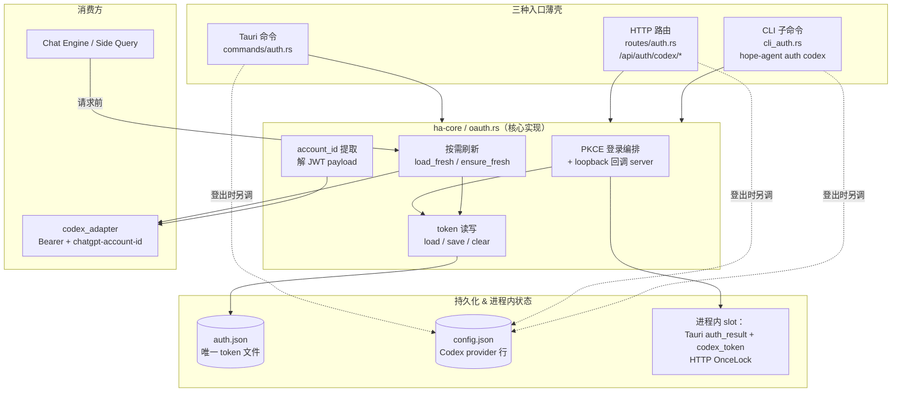
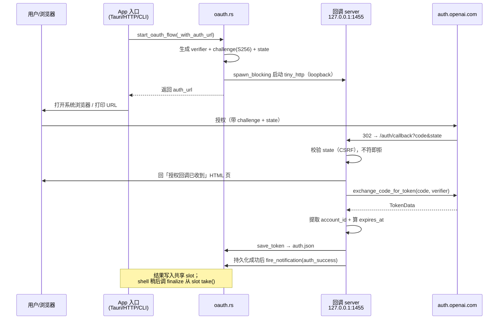
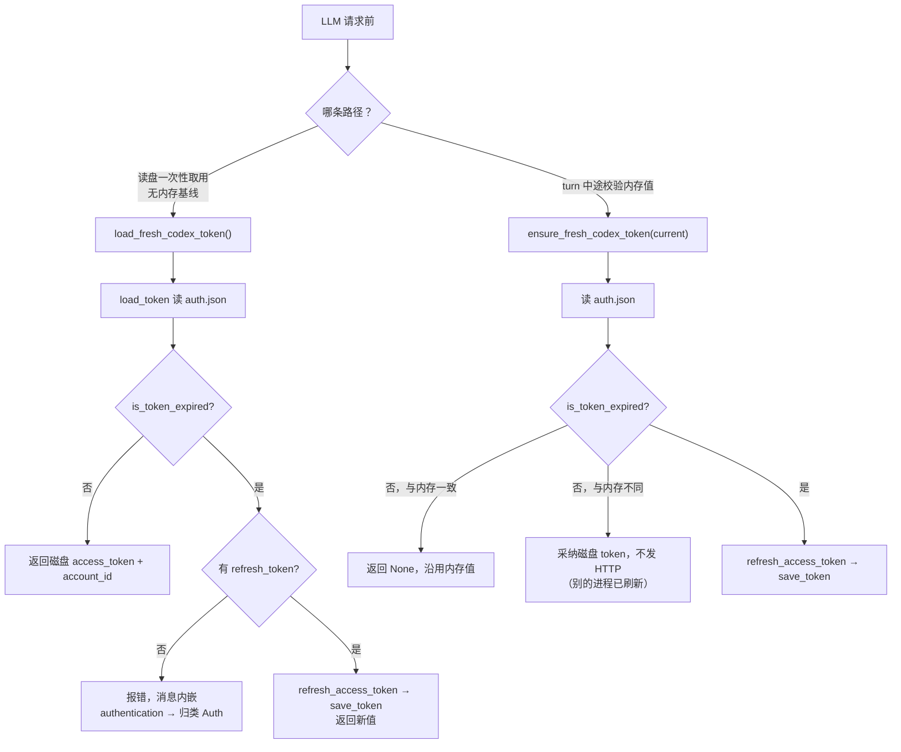

# 主 LLM OAuth（ChatGPT / Codex 登录）

> 返回 [文档索引](../../README.md) | 关联源码：[`crates/ha-core/src/oauth.rs`](../../../crates/ha-core/src/oauth.rs)、[`src-tauri/src/commands/auth.rs`](../../../src-tauri/src/commands/auth.rs)、[`src-tauri/src/cli_auth.rs`](../../../src-tauri/src/cli_auth.rs)、[`crates/ha-server/src/routes/auth.rs`](../../../crates/ha-server/src/routes/auth.rs)、[`crates/ha-base/src/paths.rs`](../../../crates/ha-base/src/paths.rs)

## 它解决什么问题

Hope Agent 的主对话模型可以来自四种 Provider。其中三种（Anthropic、OpenAIChat、OpenAIResponses）用 API Key 鉴权——用户手里有一串密钥，填进设置即可。**只有 Codex 例外：它用 ChatGPT 账号登录，没有可粘贴的密钥。**

「用账号登录」意味着要跑一整套 OAuth 授权流程：把用户送到 OpenAI 的授权页、拿回一个短命的授权码、换成 access token，此后 token 会过期、要靠 refresh token 悄悄续期。本子系统就是这条链路的全部实现——从浏览器登录，到 token 落盘，到每次请求前按需刷新，再到登出时的清理。

一个关键的设计约束是**没有服务端可以中转 OAuth 回调**：Hope Agent 是本地应用，登录发生在用户自己的机器上。所以回调靠一个只绑定 `127.0.0.1` 的临时 HTTP 服务器接收，全程不出本机。

### 与 MCP 的 OAuth 是两套东西

Hope Agent 里还有另一处 OAuth：MCP 客户端连接远程 MCP 服务器时也可能走 OAuth 2.1 + PKCE（见 [`mcp.md`](../integration/mcp.md)）。两者**协议家族相同，实现完全独立**，不要把任何一方的约定套到另一方：

| | 主 LLM OAuth（本文） | MCP OAuth |
|---|---|---|
| 实现 | `ha-core` 的 `oauth.rs` | `ha-mcp` crate 的 `oauth.rs` |
| 凭据存储 | 单文件 `credentials/auth.json` | 一服务器一文件 `credentials/mcp/{id}.json` |
| 落盘方式 | `std::fs::write` 明文（见[已知取舍](#已知取舍)） | `platform::write_secure_file`（0600、原子） |
| 授权方 | `auth.openai.com`（固定） | 各 MCP 服务器自报 |

## 全局结构

全部业务逻辑集中在 `crates/ha-core/src/oauth.rs`（零 Tauri 依赖）。三种运行模式各有一层薄壳，都只是把请求转交给 `oauth.rs`，自己不重写流程：

薄壳分工：

| 文件 | 职责 |
|---|---|
| [`oauth.rs`](../../../crates/ha-core/src/oauth.rs) | 核心实现：PKCE 流程编排、loopback 回调 server、token 读写、按需刷新、`account_id` 提取、失败归类锚点 |
| [`commands/auth.rs`](../../../src-tauri/src/commands/auth.rs) | 桌面 Tauri 命令面（本机信任域，凭据不脱敏） |
| [`routes/auth.rs`](../../../crates/ha-server/src/routes/auth.rs) | HTTP 路由面（`/api/auth/codex/*`），跨请求共享的进程级 `OnceLock` slot |
| [`cli_auth.rs`](../../../src-tauri/src/cli_auth.rs) | 终端子命令，新建独立 tokio runtime 跑登录/登出流程 |
| [`cli_onboarding/steps/provider.rs`](../../../src-tauri/src/cli_onboarding/steps/provider.rs) | 首启引导，直接复用 `cli_auth::login_codex(默认 open_browser=true)` |

## 端点与常量

授权端点、客户端标识等常量硬编码在 `oauth.rs` 顶部：

| 常量 | 值 | 说明 |
|---|---|---|
| `AUTH_URL` | `https://auth.openai.com/oauth/authorize` | 授权页 |
| `TOKEN_URL` | `https://auth.openai.com/oauth/token` | 换 token / 刷新 token |
| `CLIENT_ID` | `app_EMoamEEZ73f0CkXaXp7hrann` | OAuth 客户端 |
| `SCOPES` | `openid profile email offline_access` | `offline_access` 换来 refresh token |
| `REDIRECT_PORT` | `1455` | loopback 回调端口 |
| `REDIRECT_URI` | `http://localhost:1455/auth/callback` | 回调地址 |
| `REFRESH_MARGIN_MS` | `30_000` | 过期前 30s 即视为「需刷新」，吸收时钟漂移与网络抖动 |

授权 URL 由 `format!` 模板拼出，固定带这些参数：`response_type=code`、`code_challenge_method=S256`、`id_token_add_organizations=true`、`codex_cli_simplified_flow=true`、`originator=hope-agent`。

## 数据结构

- **`TokenData`**：OAuth 凭据载体，serde 序列化即 `auth.json` 的内容。必有 `access_token`，其余 `refresh_token` / `expires_in` / `token_type` / `account_id` / `expires_at` 皆可选。`expires_at` 是换 token 时用 `expires_in` 算出的**绝对毫秒时间戳**（`now + expires_in*1000`），是过期判定的主要依据。
- **`AuthStatus`**：前端轮询用的状态，`authenticated: bool` + 可选 `error`。Tauri 的 `check_auth_status` 与 HTTP 的 `GET /auth/codex/status` 共用。
- **`JwtPayload` / `JwtAuth`**：解 access_token（JWT）第二段 payload 用。access_token 里带自定义 claim `https://api.openai.com/auth`，内层 `chatgpt_account_id` 就是后续请求要带的账号标识；payload 里的 `exp` 用于评测路径的交叉校验（见下）。
- **`AuthResult`**（`routes/auth.rs`）：类型别名 `Arc<TokioMutex<Option<anyhow::Result<TokenData>>>>`，HTTP 侧 `start` / `finalize` 跨请求共享的进程级 `OnceLock` slot。
- **`SetCodexModelBody`**（`routes/auth.rs`）：`POST /auth/codex/models` 的请求体，只含 `model: String`。

## 登录：PKCE + S256 loopback

登录是整条链路里最复杂的一步。核心思路是 **PKCE**（Proof Key for Code Exchange）：本机先生成一个随机 `verifier`，把它的 SHA256 摘要（`challenge`）随授权请求发出去，最后换 token 时再把 `verifier` 原文回传。授权服务器验证 `SHA256(verifier) == challenge` 才发 token——这样即便授权码在回调途中被截获，没有 `verifier` 也换不出 token。`state` 参数则用来防 CSRF：本机生成随机 `state`，回调必须原样带回，不符即拒。

几个要点：

- **两个入口，一个二态开关**。`start_oauth_flow(open_browser=true)` 是桌面 / HTTP 用的入口，起回调 server 并自动打开系统浏览器；`start_oauth_flow_with_auth_url(open_browser=false)` 返回 `auth_url` 让调用方自己打印——CLI 与首启引导用这条，方便在无 GUI 环境下把 URL 交给用户手动打开。

- **回调服务只在本机**。`run_callback_server` 跑在 `spawn_blocking` 里，用 `tiny_http` 绑 `127.0.0.1:1455`，5 分钟无回调即超时返错。它校验 `state`、取 `code`、给浏览器回一张「授权回调已收到」页，再调 `exchange_code_for_token`；回调收到不是登录完成，最终状态由应用显示。

- **换 token 时补齐两样东西**。`exchange_code_for_token` POST `TOKEN_URL`（`grant_type=authorization_code` + `code_verifier`）拿回 `TokenData` 后，还会：① 从 JWT 里 `extract_account_id` 填 `account_id`；② 用 `expires_in` 算出绝对的 `expires_at`。

- **登录成功从流程完成处发通知**。拿到令牌后，`start_oauth_flow_with_auth_url` 在阻塞线程内调用 `save_token`，失败即把错误写入共享结果槽并返回，不发 `auth_success`。成功后壳层的 `finalize` 从结果槽取走令牌；HTTP 的再次保存使用 `save_token_async`，避免阻塞异步工作线程。

- **`account_id` 由 `extract_account_id` 统一提取，三处 shell 共用**。它是 `pub` 函数，Tauri / HTTP / CLI 三处的 finalize / restore / status 都调它，从 access_token 里取 `chatgpt_account_id`，作为后续请求 `chatgpt-account-id` header 的来源（注入点在 `crates/ha-agent-runtime/src/providers/codex_adapter.rs`，详见 [`provider-system.md`](provider-system.md)）。

## 过期判定与按需刷新

access_token 会过期，refresh token 用来续期。**过期判定 `is_token_expired` 只看 `expires_at`**：若 `now + REFRESH_MARGIN_MS >= expires_at` 就算「需刷新」；**若根本没有 `expires_at`，一律视为有效**（不强制刷新）。

LLM 请求前有两条刷新路径，分别对应不同调用时机（调用上下文见 [`chat-engine.md`](chat-engine.md) / [`side-query.md`](../agent/side-query.md)）：

- **`load_fresh_codex_token() -> (access_token, account_id)`**：读盘，未过期直接返回，过期则用 refresh token 刷新。它的**失败消息必须内嵌字面量 `authentication`**——否则 [`failover`](../agent/failover.md) 的 `classify_error` 不会把它归到 `FailoverReason::Auth`（`oauth.rs` 内有单测锁住这几条消息）。这样凭据类失败才能被 failover 正确识别。

- **`ensure_fresh_codex_token(current_access_token) -> Option<...>`**：拿调用方内存里的 token 跟磁盘比对，用于同一轮对话中途避免重复刷新。三种结果——内存值已是最新未过期则返 `None`（沿用即可）；磁盘上被别的进程刷新过（未过期但与内存不同）则直接采纳磁盘 token、**不发 HTTP**；临近或已过期则真去刷新。

- **`refresh_access_token(refresh_token) -> TokenData`**：底层 POST `TOKEN_URL`（`grant_type=refresh_token`），成功后 `save_token` 落盘。一个非显然的细节：OAuth 服务器**可能不在响应里回 refresh token**（尤其旧的仍有效时），此时代码会保留原来的 refresh token，绝不因响应缺失而擦掉一个仍可用的凭据。

## 启动恢复会话

`try_restore_session` 在应用启动时尝试用磁盘上的 token 复活上次会话：读 `auth.json`，若过期就刷新（刷新失败或无 refresh token 则清 token、回退到非 Codex provider），确保 Codex provider 行存在，再据当前 active model 的 provider 类型重建 agent。桌面与 HTTP 的差异在于 agent 缓存的持有方式：

- **Tauri**：`AppState.agent` 是常驻内存的，所以这里要真的重建 agent（Codex 用 `new_openai`，非 Codex 走 `try_new_from_provider`），并写入 `codex_token` 内存缓存。
- **HTTP**：agent 是每请求现建的，所以这里只校验/刷新 token 并确保 provider 行存在，不做内存 agent 复活。

## 登出

登出是破坏性操作，由三种 shell 各自编排（Tauri `logout_codex` / HTTP `logout_codex` / CLI `run_codex_logout`），两步缺一不可：

1. **`delete_providers_by_api_type(Codex)`**——删 `config.json` 里的 Codex provider 行。token 文件和 provider 行是两套独立存储，重新登录时会经 `ensure_codex_provider_persisted` 重建这一行。**这一步在 shell 里调，不在 `clear_token` 内。**
2. **`clear_token`**——删 `auth.json` 文件，并 `fire_session_end("", "logout")` 发一次 SessionEnd hook（app-global 的代表性事件，不做 per-session fan-out）。

`clear_token` 自身只负责「删 token 文件 + 发 SessionEnd」；删 provider 行是各 shell 在 `clear_token` 之外另调的。

## 持久化

| 存储 | 内容 |
|---|---|
| `~/.hope-agent/credentials/auth.json` | 唯一的令牌持久化文件；`save_token` 经安全原子替换保存 JSON，仍是未加密文件，权限边界见下文 |
| 进程内共享 slot | Tauri 用 `AppState.auth_result`（`Arc<Mutex<Option<Result<TokenData>>>>`）；HTTP 用 `routes/auth.rs` 的 `OnceLock<AuthResult>`。登录流程写入、`finalize` 从中 `take()` |
| `AppState.codex_token`（桌面专有） | `Arc<Mutex<Option<(access_token, account_id)>>>` 内存缓存。`finalize` / `try_restore_session` 写入；`set_codex_model` 只读它重建 agent，不写 |
| `config.json` 的 Codex provider 行 | 经 `provider::ensure_codex_provider_persisted` 落库、`delete_providers_by_api_type(Codex)` 删除，与 token 文件是两套独立存储 |

## 对外接口（双 transport 对齐）

Tauri 命令与 HTTP 路由镜像同一套能力（完整对齐见 [`api-reference.md`](../system/api-reference.md)）：

| 能力 | Tauri 命令 | HTTP 路由 |
|---|---|---|
| 起登录流程 | `start_codex_auth` | `POST /api/auth/codex/start` |
| 完成登录（取 token） | `finalize_codex_auth` | `POST /api/auth/codex/finalize` |
| 查认证状态 | `check_auth_status` | `GET /api/auth/codex/status` |
| 登出 | `logout_codex` | `POST /api/auth/codex/logout` |
| 列可选模型 | `get_codex_models` | `GET /api/auth/codex/models` |
| 设当前模型 | `set_codex_model` | `POST /api/auth/codex/models` |
| 启动恢复会话 | `try_restore_session` | `POST /api/auth/session/restore` |

桌面侧另有 `initialize_agent` / `get_current_settings` / `set_reasoning_effort` 等与 Codex 设置相邻但不属于 OAuth 核心的命令。

CLI 一次性入口（`cli_auth.rs`，每次新建独立 tokio runtime 跑流程）：

- `hope-agent auth codex login`（`--no-open` 只打印 URL、`--model` 指定 active 模型、`--no-active` 不切 active）→ 打印 auth URL 并等回调
- `hope-agent auth codex status` → 打印本地 token 状态（authenticated / expired / 未登录 + 是否有 refresh token）
- `hope-agent auth codex logout` → 删 Codex provider 行 + `clear_token`

远程 SSH 场景下回调走本机 1455 端口，需要 `ssh -L 1455:127.0.0.1:1455 <host>` 把端口转发回本地（CLI 登录时会打印这条提示）。完整 CLI 参考见 [`cli.md`](../system/cli.md)。

## 本地真实模型评测的凭据铸造

`oauth.rs` 还承担一件与日常登录无关的事：为本地真实模型评测铸一份可交给**隔离评测运行时**的 Codex 凭据。隔离运行时刻意拿不到 refresh token 和 OAuth 文件，中途无法续期，所以铸出来的凭据必须一次性覆盖整个评测 campaign 的时长。

- **`load_codex_token_for_evaluation(required_validity_secs)`**：解析一份剩余寿命足够覆盖整个 campaign 的 access token。它优先用内存缓存、其次读盘、必要时刷新，但**只在 owner 进程里做**——一旦检测到自己就在隔离评测进程（`HA_MODEL_EVAL_MODE`），立刻 `bail!`，绝不去读 owner 侧的凭据。
- **有效寿命判定用 `effective_token_expiry`**：它取「`expires_at`」与「JWT payload 里的 `exp`」中**更早**的那个作为过期边界，再叠一个 60s 的安全余量（`EVAL_TOKEN_EXPIRY_MARGIN_MS`）。这比日常路径的 `is_token_expired`（只看 `expires_at`）更严——评测宁可提前判失效，也不能让 token 在 campaign 中途死掉。
- **`mint_codex_evaluation_secret`**：把「取 token → 按评测 schema 编码 → 算账号摘要」三步收进 kernel，产出 `CodexEvaluationSecret`。这个类型刻意不 derive `Debug`（有编译期断言守卫），因为它的 `secret` 字段是含明文 access token 的 JSON，防止被顺手 `{:?}` 打进日志。凭据本身流向 `ha-eval-runtime`，把关点在其 `provider_resolution`。

评测子系统全貌见 [`live-model-evaluation.md`](../agent/live-model-evaluation.md)。

## 安全性质

- **token 禁入日志**：`oauth.rs` 的日志只记 account_id 提取失败、刷新成功/失败等元信息，从不打印 `access_token` / `refresh_token`。评测凭据类型 `CodexEvaluationSecret` 用编译期断言禁止 `Debug`，防误打日志。
- **loopback 隔离 + CSRF**：回调 server 仅绑 `127.0.0.1:1455`，配合 `state` 参数校验和 5 分钟超时，回调全程不出本机。
- **PKCE / S256**：授权码即便被截获，缺 `verifier` 也换不出 token。
- **失败归类锚点**：`load_fresh_codex_token` 的错误消息内嵌 `authentication`，`failover::classify_error` 据此归到 `FailoverReason::Auth`，凭据失败才能被 failover 正确识别（`oauth.rs` 单测锁住这些消息）。
- **Codex 不参与 failover profile 轮换**：`failover/executor.rs` 里对 `api_type == Codex` 强制关掉 `allow_profile_rotation`（即便调用方传 true 也无效）——OAuth 凭据没有多 profile 可轮换，凭据失败直接走标准失败路径。详见 [`provider-system.md`](provider-system.md)。
- **登录成功通知只从流程完成站点发**：`auth_success` Notification 从 `start_oauth_flow_with_auth_url` 拿到 token 的地方 fire，**刻意不从 `save_token` fire**——因为 `save_token` 也跑在静默刷新上，从那里发会误报「登录成功」。

### 安全持久化与已知边界

`save_token` 先经 `platform::ensure_credential_directory` 验证凭据目录，再用 `write_secure_file_outcome` 原子替换完整 JSON；拒绝非普通目标文件与符号链接。Unix 将凭据目录收紧至 `0700`、新令牌文件固定为 `0600`，也覆盖旧 `0644` 文件。Windows 拒绝目录重解析点，但仍依赖用户目录继承的 DACL，**没有新增专属 ACL，也不是凭据加密**。

未发布的写入失败返回含 `authentication` 的错误、保留原文件；已发布但目录同步失败时记录不含令牌的警告并采纳新凭据，不假装旧的轮换令牌仍可重试。刷新与 HTTP 异步保存统一经 `save_token_async` 的阻塞池；刷新已保存后不再重复保存。合成回归覆盖原子替换、权限收紧、非普通目标与链接拒绝。详见 [平台原语](../infra/platform.md) / [安全](../infra/security.md)。

## 跨子系统关系

| 子系统 | 关系 |
|---|---|
| [Provider 系统](provider-system.md) | Codex 是唯一走 OAuth 的 provider；详述 Bearer + `chatgpt-account-id` header 注入、`ensure_codex_provider_persisted`、不参与 failover 轮换 |
| [MCP 客户端](../integration/mcp.md) | 自有独立 OAuth 实现（`ha-mcp` crate），与本子系统物理隔离、不共用代码 |
| [Failover](../agent/failover.md) | `load_fresh_codex_token` 错误消息内嵌 `authentication` → `classify_error` 归 `Auth` |
| [Chat Engine](chat-engine.md) / [Side Query](../agent/side-query.md) | LLM 请求前调 `ensure_fresh_codex_token` / `load_fresh_codex_token` 保证 token 新鲜 |
| [Live 模型评测](../agent/live-model-evaluation.md) | `mint_codex_evaluation_secret` 为隔离评测运行时铸一次性凭据 |
| [CLI](../system/cli.md) | `auth codex login/status/logout` 子命令 + loopback 端口转发 |
| [安全](../infra/security.md) / [平台](../infra/platform.md) | 令牌路径 `auth.json`、登出必 `clear_token`、安全目录与分阶段原子写入 |
| [API 参考](../system/api-reference.md) | Tauri ↔ HTTP 七项命令 / 路由对齐 |
| Hooks | 登录完成 fire `auth_success` Notification；登出 fire `logout` SessionEnd |

## 关键文件索引

| 文件 | 角色 |
|---|---|
| [`crates/ha-core/src/oauth.rs`](../../../crates/ha-core/src/oauth.rs) | 核心实现：PKCE 流程、`TokenData`、按需刷新、评测凭据铸造、失败归类锚点 |
| [`src-tauri/src/commands/auth.rs`](../../../src-tauri/src/commands/auth.rs) | Tauri 命令面 |
| [`crates/ha-server/src/routes/auth.rs`](../../../crates/ha-server/src/routes/auth.rs) | HTTP 路由面（`/api/auth/codex/*` + `OnceLock<AuthResult>`） |
| [`src-tauri/src/cli_auth.rs`](../../../src-tauri/src/cli_auth.rs) | 终端 `auth codex` 子命令 |
| [`crates/ha-base/src/paths.rs`](../../../crates/ha-base/src/paths.rs) | `auth_path()` = `credentials_dir()/auth.json` |
