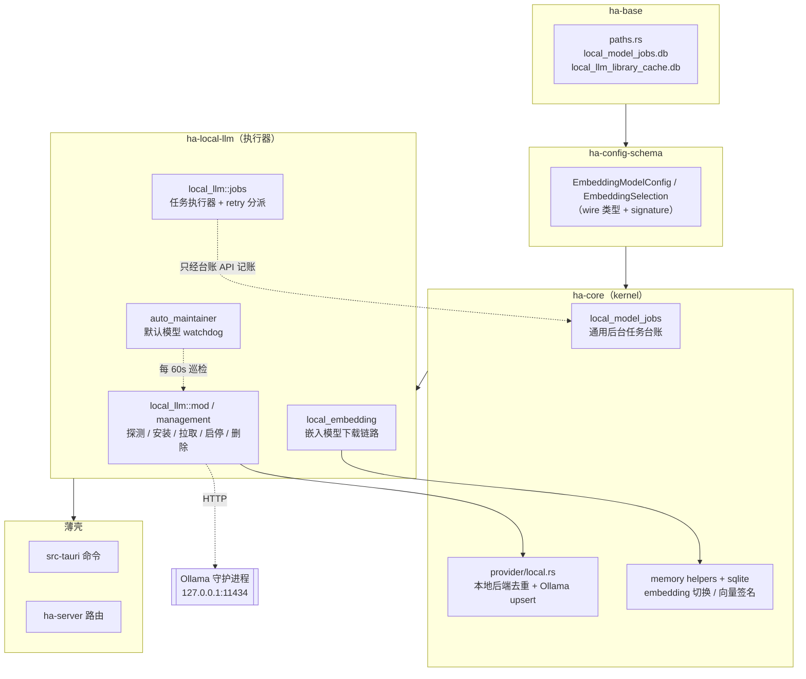
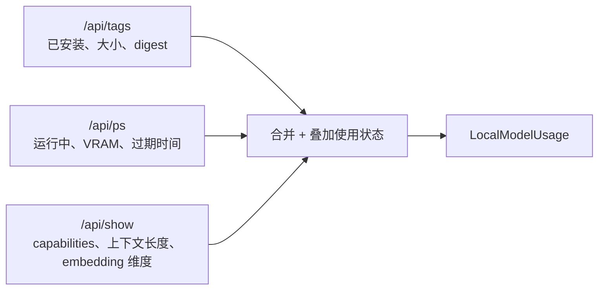
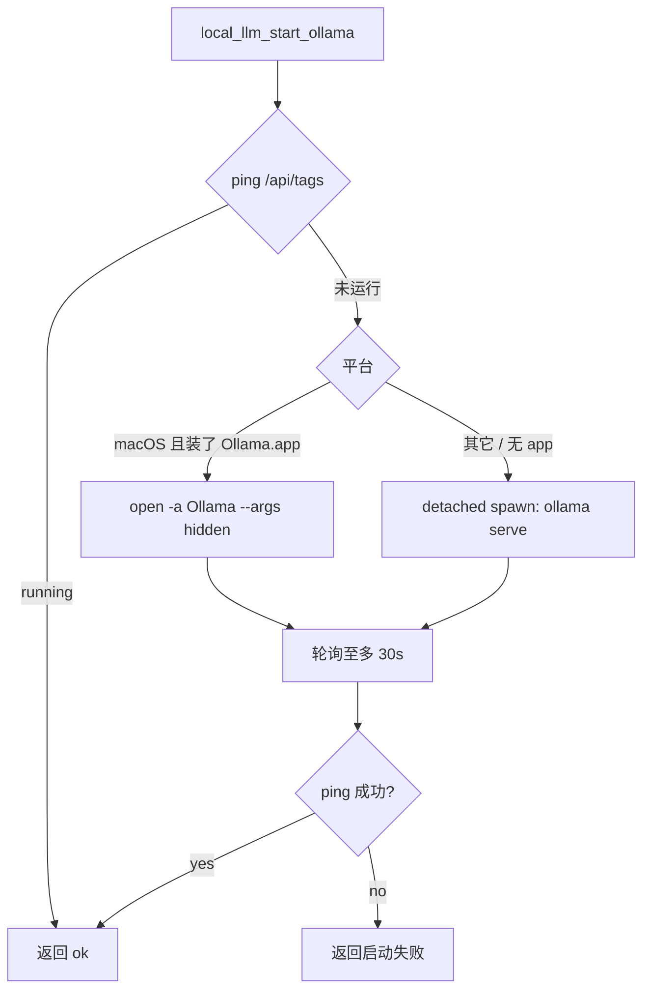
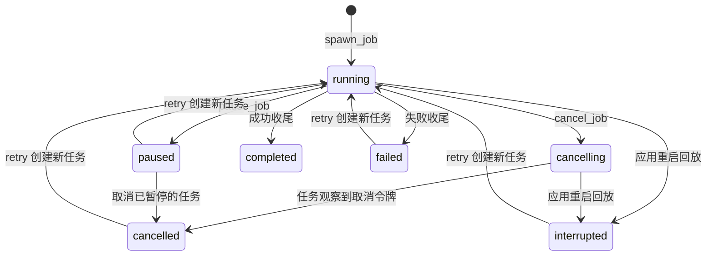
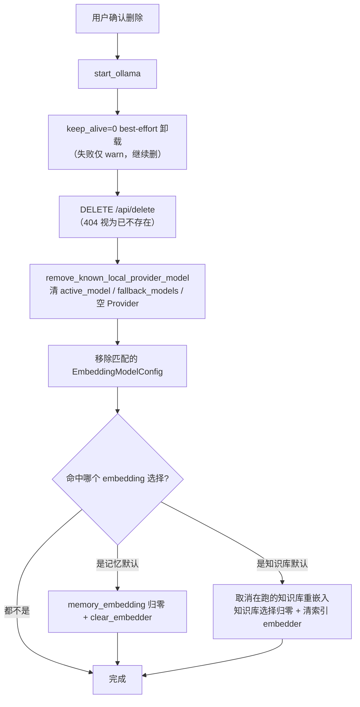
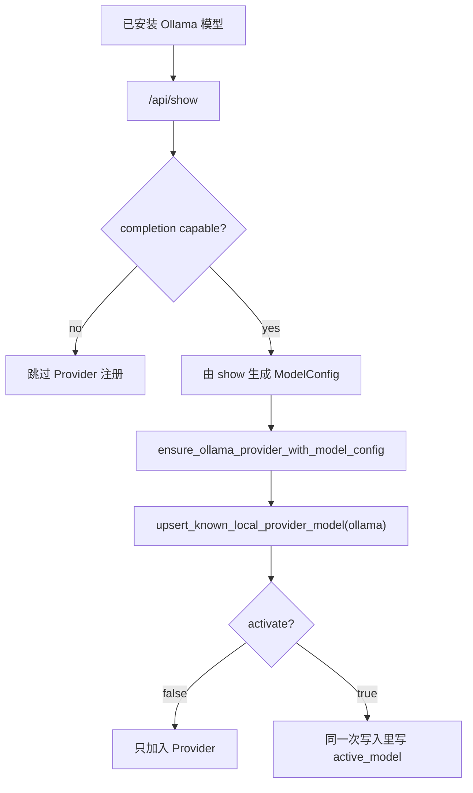
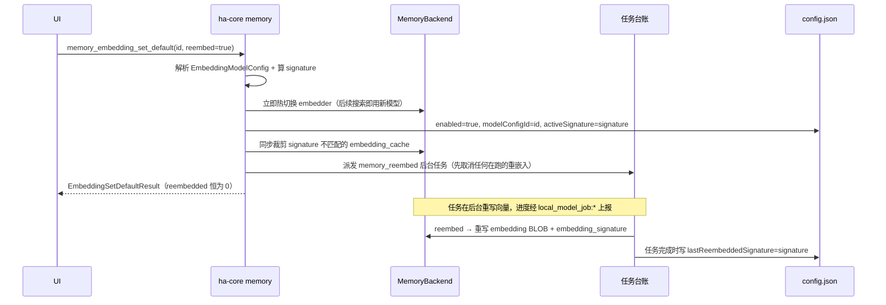
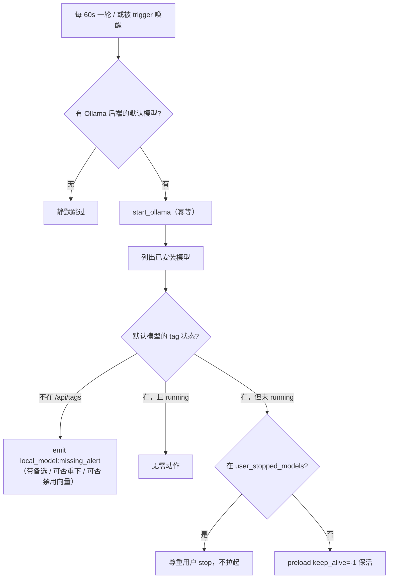

# 本地模型加载与 Embedding 配置

> 返回 [文档索引](../../README.md) | 更新时间：2026-08-31

## 这个子系统解决什么问题

用户想在本机跑一个模型——不上传对话、不花 token、断网也能用。要做到这一点，光有一个「本地 API 地址」的输入框远远不够：得先探测硬件能带得动多大的模型，帮用户把 Ollama 装上、把守护进程拉起来，再从网上把几个 GB 的权重拉下来（这一步动辄十几分钟，中途关窗口不能丢进度），装完还要接进 Provider 体系和记忆向量检索，让它「装好即用」。

本子系统就是把这一整条链路做成傻瓜式的两个入口，同时不牺牲可控性：

- **快捷卡**（省心入口）：先引导手工安装 Ollama，再一键完成「下推荐模型 → 写配置 → 设为默认」，装完直接能聊天 / 能用于记忆。
- **本地模型 Tab**（显式管理入口）：搜索、下载、任务进度、启停、加入配置、设为默认、删除，样样手动可控。其中模型库里的「下载」只把权重拉到本地，**不**碰任何配置。

两条关键设计原则贯穿始终：

1. **下载与配置是两个独立动作**。只有快捷卡会在下载后自动写配置；模型库的下载纯粹是「把 tag 拉到本地」。这条边界让「我只想留一份权重备用」和「我要立刻用起来」不会互相误伤。
2. **应用不接管 Ollama 守护进程的生命周期**。需要时才尝试拉起 `ollama serve`（或 macOS 上的 Ollama.app），但**退出应用绝不杀 Ollama**——它是用户其它工具也在共用的公共服务，秒掉它是越界。

当前只有 **Ollama** 后端实现了完整的模型拉取 / 管理 / 预载流程；运行时本身先由用户手工安装。面向两类模型：

| 类型 | 用途 | 配置落点 | 典型模型 |
| --- | --- | --- | --- |
| LLM | 对话、工具调用、推理 | Ollama Provider + 全局默认模型 | `qwen3.6:27b`、`gemma4:12b` |
| Embedding | 向量检索（记忆 / 知识库共用） | Embedding 模型配置 + 默认记忆模型 | `embeddinggemma:300m` |

> 注意：Provider 去重用的**本地后端目录**（`known_local_backends()`）认识 5 个本地端点——Ollama、LiteLLM、vLLM、LM Studio、SGLang——用于把「同一个 host:port」的 Provider 合并去重。但只有 Ollama 有本文描述的这套模型拉取 / 预载 / 自维护流程；其余四个只是「已知的本地兼容端点」，靠 Provider 页手动接入。

## 关联源码

| 关注点 | 位置 |
| --- | --- |
| Ollama 核心能力（硬件探测、推荐、安装 / 启动、`/api/pull` 解析、Provider 注册） | `crates/ha-local-llm/src/local_llm/mod.rs` |
| 模型目录与硬件预算 | `crates/ha-local-llm/src/local_llm/types.rs`（`model_catalog` / `RECOMMENDATION_BUDGET_PERCENT`） |
| 已安装模型聚合、Library 抓取、启停 / 删除、配置写入 | `crates/ha-local-llm/src/local_llm/management.rs` |
| 本地任务执行器（安装 / 拉取 / 预载 / 嵌入下载 / retry 分派） | `crates/ha-local-llm/src/local_llm/jobs.rs` |
| 默认模型自维护 watchdog | `crates/ha-local-llm/src/local_llm/auto_maintainer.rs` |
| Embedding 快捷链路 | `crates/ha-local-llm/src/local_embedding.rs` |
| **通用**后台任务台账（DB / 快照 / spawn / finish / 进度 / 取消暂停 / replay） | `crates/ha-core/src/local_model_jobs.rs` |
| 本地后端去重目录、Ollama Provider upsert / remove | `crates/ha-core/src/provider/local.rs` |
| Embedding 模型配置与切换、向量签名 | `crates/ha-core/src/memory/helpers.rs`、`crates/ha-config-schema/src/memory/embedding.rs` |
| 记忆向量后端（签名列、cache、搜索过滤） | `crates/ha-core/src/memory/sqlite/backend.rs`、`trait_impl.rs` |
| 薄壳 | `src-tauri/src/commands/{local_llm,local_model_jobs,memory}.rs`、`crates/ha-server/src/routes/{local_llm,local_model_jobs,config}.rs` |
| 前端 | `src/components/settings/{local-llm,embedding-models,memory-panel}/` |

## 代码分层：执行器与台账为什么分家

拆分后的 crate 结构里有一条容易踩坑的分界线：**「做事的机器」在特征 crate `ha-local-llm`，但「记账的台账」留在内核 `ha-core`**。

原因是：后台任务台账（`local_model_jobs`）并不是 Ollama 专属的——记忆重嵌入（`memory::reembed_job`）和知识库重嵌入也靠它记账、上报进度、支持取消暂停。如果把台账也搬进 `ha-local-llm`，知识库就得为了「记一笔账」反向依赖本地模型 crate，凭空多出一条循环依赖。所以台账留在 kernel，只有 Ollama 执行器随 `ha-local-llm` 走。



装配契约：每个调 `ha_core::init_runtime` 的二进制都必须先调 `ha_local_llm::wire()`，它把默认模型自维护 watchdog 的启动任务注册为 **primary-only**（只在主进程跑，避免两个进程抢着预载同一模型）。

台账那组入口（`spawn_job` / `update_job` / `append_log` / `finish_job` / `ProgressThrottle` 等）是对 `ha-local-llm` 的**公开跨 crate 契约**：新执行器只能经它们记账，不得自开 `local_model_jobs.db` 连接、也不得绕过 `spawn_job` 自行 spawn——取消判定、进度节流与 `local_model_job:*` 事件面全挂在这条链上。

## 硬件预算与模型推荐

快捷卡在下载前会先算「这台机器能带多大的模型」。`detect_hardware()` 读系统内存与独显信息，按平台选一条预算轴：

| 预算轴（`BudgetSource`） | 何时选它 |
| --- | --- |
| `UnifiedMemory` | macOS——统一内存，系统 RAM 同时充当显存 |
| `DedicatedVram` | Linux / Windows 且探测到独显 VRAM |
| `SystemMemory` | 无独显时回退到系统内存 |

预算 = 所选轴的 **60%** 再减去 1 GiB（给 Ollama 运行时与 KV-cache 波动留缓冲）。`recommend_model()` 把内置模型目录按体积从大到小扫一遍，返回**第一个塞得进预算**的模型作为推荐，其余能装下的作为可选项供用户下调；预算连最小的目录条目都装不下时，如实返回「硬件不足」。

模型目录（`model_catalog()`）是一份写死的 Ollama tag 清单（Qwen3.6 与 Gemma 4 家族，含 MoE 变体）：GUI 的推荐与展示读它，`chat_model` 任务重试时按 tag 找回要重下的模型，watchdog 判断消失的默认模型能否重下也查它。更新目录后一次 `cargo test` 即可验证。`local_llm_chat_catalog` 则不看硬件预算，返回**完整**的对话模型目录，供 UI 展示全部候选。

## Ollama 状态与已安装模型

### 守护进程状态

`local_llm_detect_ollama` 返回 `OllamaStatus`：

```ts
type OllamaPhase = "not-installed" | "installed" | "running"

interface OllamaStatus {
  phase: OllamaPhase
  baseUrl: string
  installScriptSupported: boolean
}
```

- `not-installed`：没找到可用的 Ollama 可执行文件。
- `installed`：找到了二进制（`ollama --version` 能应答），但 `http://127.0.0.1:11434` ping 不通。
- `running`：Ollama API 能 ping 通。
- `installScriptSupported=false`（当前所有平台）：前端引导用户去 `https://ollama.com/download` 手动下载，不尝试脚本安装。

### 已安装模型聚合

`local_llm_list_models` 把三个 Ollama 端点的数据合并，并叠加 Hope 侧的使用状态：



`/api/show` 是对每个 tag 并发扇出的（并发上限 8），瓶颈在 HTTP 往返而非 Ollama CPU。叠加的使用状态告诉 UI「这个本地模型在 Hope 里正被谁引用」：

```ts
interface LocalModelUsage {
  activeModel: boolean       // 当前全局默认 LLM
  fallbackModel: boolean     // 被降级链引用
  providerModel: boolean     // 已加入 Ollama Provider
  embeddingConfig: boolean   // 已加入某个 Embedding 模型配置
  embeddingModel: boolean    // 当前默认记忆模型
  running: boolean           // /api/ps 里正在加载
  providerId?: string | null
  embeddingConfigId?: string | null
}
```

UI 据 capability 分流：LLM 模型显示「启停 / 加入 Provider / 设为默认 / 删除」，Embedding 模型显示「启停 / 加入 Embedding 配置 / 设为记忆默认 / 删除」；同时声明 completion + embedding 的模型两组动作都显示。

## Ollama 生命周期

### 启动守护进程

`local_llm_start_ollama` 只保证 Ollama 可访问，从不负责关闭，且是幂等的（已在跑就直接返回）：



### 安装 Ollama

所有平台暂时关闭脚本安装，前端复用官网下载入口。`install_ollama_via_script_cancellable` 保留旧命令/任务兼容面，但在联网、执行进程和提权前返回明确错误；已取消的请求仍返回取消。旧持久任务重试也不能绕过这一边界。已安装 Ollama 的启动、模型下载及配置功能保持不变。

前端模型快捷卡（含备选模型）、缺失模型重新下载、本地模型页和任务中心重试统一经 `prepareLocalModelJob` 读取实时安装状态，不依赖页面缓存。缺少 Ollama 且自动安装关闭时打开官网下载页，不创建任务、不显示下载成功、不关闭缺失模型对话框；用户安装后再次操作会重新检测。通用的记忆/知识库重嵌入不受此 Ollama 前置检查影响，后端的禁用边界仍独立兜底直接调用与检测后的竞态。

恢复自动安装前，必须固定版本、大小与摘要，并证明脚本的二阶段下载同样经过校验；仅校验可移动的 `install.sh` 不够。`ollama_install` 的历史记录不删除，失败也不会写 Provider 或记忆配置。

## 后台任务台账

所有耗时操作（安装、拉取、预载、嵌入下载、重嵌入）都走同一套后台任务台账，持久化到 `~/.hope-agent/local_model_jobs.db`——弹窗关掉、应用重启，进度都不丢。前端订阅 EventBus 事件跟踪：

| 事件 | payload | 说明 |
| --- | --- | --- |
| `local_model_job:created` | `LocalModelJobSnapshot` | 任务创建 |
| `local_model_job:updated` | `LocalModelJobSnapshot` | 进度、阶段、字节数、状态更新 |
| `local_model_job:log` | `LocalModelJobLogEntry` | 安装脚本或 pull 流的日志行 |
| `local_model_job:completed` | `LocalModelJobSnapshot` | 进入 completed / failed / cancelled / paused / interrupted 终态 |

### 任务类型与副作用

台账的名字（`local_model_jobs` / `local_model_job:*` / `local_model_jobs.db`）沿用了 Ollama 相关的前缀，容易让人误以为它只管本地模型，其实它是一份**通用**的后台任务台账，记忆与知识库的重嵌入也在其中记账。当前有 7 种任务类型：

| Kind | 入口 | 用途 | 完成后的副作用 |
| --- | --- | --- | --- |
| `chat_model` | 快捷 LLM 卡 | 已装 Ollama 下，下载推荐 LLM + 预载 | 加入 Ollama Provider、设为全局默认、重建共享 active agent |
| `embedding_model` | 记忆快捷卡 | 已装 Ollama 下，下载推荐嵌入模型 + 预载 | 创建 / 更新 Embedding 配置、设为默认记忆模型、派发重嵌入 |
| `ollama_install` | 保留旧入口与任务重试 | 当前拒绝执行，提示手工安装 | 无 |
| `ollama_pull` | 模型库 / 手动 tag 下载 | 已装 Ollama 下，拉取模型 | 无（只表示本地已下载） |
| `ollama_preload` | 启动模型 / 装完保活 | 把模型预载进 Ollama 内存 | 无配置副作用；进度可跟踪 |
| `memory_reembed` | 切换 / 重建记忆向量 | 用新模型重写记忆 embedding | 由 kernel `memory::reembed_job` 拥有 |
| `knowledge_reembed` | 绑定 / 重建知识库向量 | 用新模型重写知识库 embedding | 由知识库拥有，可按 `target_kb_ids` 范围重建 |

后三种（预载 / 记忆重嵌入 / 知识库重嵌入）不是 Ollama 专属：`ollama_preload` 把「保活」做成可跟踪任务，两个 `*_reembed` 则是别的子系统借用同一台账。`LocalModelJobSnapshot` 里的两个关联字段服务于它们：

- `successorForJobId`：把一个任务标为另一个任务的「续作」。典型场景是嵌入模型切换——嵌入 pull 结束后派发独立的 `memory_reembed` 任务，前端 dialog 据此把当前任务自动接力到重嵌入进度上，免去「卡在 99%」的假象。
- `targetKbIds`：`knowledge_reembed` 的目标 KB 范围（`None` = 全部 KB，`Some(ids)` = 指定空间），取消 / 重试都按这个范围做。

### 状态机



几处非显然行为：

- **`paused` 是 best-effort**：取消当前底层任务、把 job 标为 paused；恢复靠 `retry` 创建一个新任务。Ollama pull 的分层缓存会让下一次 pull 复用已下载的层，所以「暂停 / 恢复」实际接近「断点续传」。
- **重启即 `interrupted`**：进程重启时，所有 `running` / `cancelling` 的任务被 replay 标为 `interrupted`（正在跑的底层协程已随进程消失），用户可 `retry`。
- **retry 按 kind 分派**：每种任务的 retry 会用相同参数重建一个新任务；重嵌入的 retry 恒用 `KeepExisting` 语义、知识库 retry 沿用失败任务原本的 KB 范围。

### 进度、字节数与 ETA

Ollama `/api/pull` 的 NDJSON 流带 `completed` / `total` 字节数，映射到快照的 `percent` / `bytesCompleted` / `bytesTotal`。进度写入经 `ProgressThrottle` 节流（250ms，阶段切换或到 100% 立即放行）。**字节数持久化**——关掉再打开仍能显示已下载量；**速度与 ETA 不持久化**，由前端根据相邻快照的 `bytesCompleted` 差值在运行时估算。

## 本地模型 Tab

模型设置页的「本地模型」Tab 对应 `LocalModelsPanel`。

### 顶部状态区

显示 Ollama 未安装 / 已安装 / 运行中；未安装时按钮打开官网下载页，手工安装后刷新；已安装未运行时显示启动按钮；刷新会同时刷 Ollama 状态、已安装模型、推荐模型和下载任务。

### 已安装列表的动作分流

每个模型显示 capability badge 与一组使用状态徽标（运行中 / 已加入 Provider / 默认 / 已加入 Embedding 配置 / 用于记忆），并据此分流动作：

| 条件 | 动作 |
| --- | --- |
| 未运行 | `local_llm_preload_model` |
| 运行中 | `local_llm_stop_model` |
| LLM 且未加入 Provider | `local_llm_add_provider_model` |
| LLM 且已加入 Provider 但非默认 | `local_llm_set_default_model` |
| Embedding 且未加入配置 | `local_llm_add_embedding_config` |
| Embedding 已加入配置但非默认记忆模型 | `memory_embedding_set_default(reembed=true)` |
| 任意模型 | `local_llm_delete_model` |

### 模型库

`local_llm_search_library` / `local_llm_get_library_model` 从 Ollama Library 的 HTML 页面解析模型 family 与 tag：

- 目录源：`https://www.ollama.com/search` 与 `/library/{model}/tags`（出站过 SSRF）。
- 缓存：`~/.hope-agent/local_llm_library_cache.db`，TTL 24 小时。
- 网络失败时若有缓存，返回 `fromCache=true, stale=true`（宁可给旧数据也不空白）。
- cloud-only 的 tag 不允许下载。
- 搜索为空时展示推荐模型列表；用户也可手动输入 tag 下载。

模型库的「下载」统一走 `local_model_job_start_ollama_pull`，**只下载不写配置**。

## 启动、停止与删除模型

这里的「启动模型」不是启动 Ollama 守护进程，而是把模型**预载进 Ollama 内存**（避免首次对话的冷启动等待）。靠 `keep_alive` 控制常驻：

| 动作 | keep_alive | 语义 |
| --- | --- | --- |
| 启动 / 加载 | `-1` | 常驻内存，直到用户停止或 Ollama 自行退出 |
| 停止 / 卸载 | `0` | 立即从 Ollama 内存卸载 |

预载用哪个端点，按 `/api/show` 的 capabilities 自动选：

| 模型能力 | endpoint | 请求体关键字段 |
| --- | --- | --- |
| embedding-only | `/api/embed` | `{ model, input: "warmup", keep_alive }` |
| completion / chat / vision / tools / thinking 或未知 | `/api/generate` | `{ model, prompt: "", stream: false, keep_alive }` |

`keep_alive` 必须是数字 `-1` / `0`，不能是字符串 `"-1"`，否则 Ollama 会报 duration unit 错误。

用户主动启停会顺带更新一个 `local_llm.user_stopped_models` 标记（见下文「自维护 watchdog」）：主动停止把 tag 记进去，主动启动把它清掉——这样自维护 watchdog 就不会把用户刚停掉的模型秒秒钟又拉起来。

### 删除模型

删除的清理顺序：先 best-effort 卸载（`keep_alive=0`），再删文件，最后清掉 Hope 侧对它的所有引用。因为**同一个 Ollama 模型既可能是对话模型，也可能同时是记忆或知识库的 embedding 模型**（embedding 模型配置是记忆与知识库共用的一份库），所以引用清理要覆盖三处向量选择：



删除确认文案会提示这些引用（running / active model / fallback model / provider model / embedding config / memory model），让用户知道删了会影响什么。删除成功后前端刷新列表；桌面端若删掉的是 active model 或整个 Provider，会清空 `AppState.agent`，避免继续拿已删除的模型聊天。

## Provider 配置

LLM 模型加入配置时走 `register_ollama_model_as_provider`：



Ollama Provider 统一为：`apiType = openai-chat`、`baseUrl = http://127.0.0.1:11434`、`allowPrivateNetwork = true`、`thinkingStyle = Qwen`。

写入必须走 `provider/local.rs` 的 known-backend upsert（禁止 `providers.push` / 手写 `active_model`）：

- 按后端目录匹配 host/port（不看路径），避免重复 Provider——`http://127.0.0.1:11434` 与 `http://localhost:11434/v1` 视为同一个。
- 已有 Provider 时只补模型并启用。
- `activate=true` 时在**同一次 `mutate_config`** 里一并写全局 `active_model`，让 `config:changed` 的消费者不会看到半成品状态。

桌面端的 `local_llm_set_default_model` 会在写配置后调 `set_active_model_core`，同步重建 `AppState.agent`。快捷 LLM 任务（`chat_model`）则通过完成钩子 `rebuild_active_agent_hook` 达到同一效果——桌面壳与 HTTP 服务持有同一个 `Arc<Mutex<Option<AssistantAgent>>>`，所以重建逻辑放在 kernel、两个壳共用。

## Embedding 模型配置

Embedding 不在记忆设置里直接编辑 base URL / API key / model，而是拆成两层：

```rust
// 可复用的模型服务配置（记忆与知识库共享的一份库）
EmbeddingModelConfig { id, name, providerType, apiBaseUrl, apiKey, apiModel, apiDimensions, source }

// 每个子系统各自「当前用哪个配置」的选择（memory / knowledge 各持一份）
EmbeddingSelection { enabled, modelConfigId, activeSignature, lastReembeddedSignature }
```

- `EmbeddingModelConfig` 是一份可复用的模型库，**记忆与知识库共用同一个库**。
- `EmbeddingSelection` 是「当前子系统选中了库里哪一个」，记忆（`memory_embedding`）与知识库（`knowledge_embedding`）各持一份、互不干扰。
- 记忆设置页只负责启用 / 禁用、选默认记忆模型、触发重建。
- 运行时真正喂给后端的 `EmbeddingConfig` 由选中的 `modelConfigId` 解析生成（`to_runtime_config`），不单独持久化。

### 内置模板

`embedding_model_config_templates` 返回 8 个常见服务商模板，每个带一组预设模型与维度：OpenAI、Google Gemini、Jina AI、Cohere、SiliconFlow、Voyage AI、Mistral、Ollama（`http://127.0.0.1:11434` + `embeddinggemma:300m`）。

### Ollama Embedding 接入

已安装的 Ollama Embedding 模型执行「加入 Embedding 配置」时：

1. `/api/show` 读 `embedding_length` 作为维度。
2. 生成一份 OpenAI-compatible 配置：`apiBaseUrl = http://127.0.0.1:11434`、`apiKey = "ollama"`、`apiModel = modelId`、`apiDimensions = embedding_length`、`source = "ollama"`。
3. 存入共享的 `embeddingModels` 库，**不**设为默认记忆模型。

「设为默认记忆模型」统一走 `memory_embedding_set_default(modelConfigId, reembed=true)`。

### 切换默认记忆模型

切换默认记忆模型必须二次确认（UI 侧），并**触发全量重嵌入**。关键在于：真正的重嵌入是一个**后台任务**，不是同步阻塞——切换函数只做几件快活，然后把重活派给 `memory_reembed` 任务，立即返回：



几个要点：

- **旧向量在重嵌入完成前仍可检索**（`KeepExisting` 模式逐条覆盖；`DeleteAll` 模式则在任务开始前先清空）。
- **全局至多一个重嵌入在跑**：派发新任务前会取消任何在跑的旧重嵌入。
- 返回体 `EmbeddingSetDefaultResult` 的 `reembedded` 字段为兼容保留、**恒为 0**——真实计数走 `local_model_job:*` 事件流。它的 `reembedError` 只在**任务派发失败**时置位；重嵌入本身跑失败会体现为任务的 `failed` 终态。
- **`lastReembeddedSignature` 由重嵌入任务在完成时才写**。任务未完成 / 失败 / 取消时它不更新，于是 `needsReembed=true`，UI 据此提醒用户去重试。
- 同 signature 且已全量覆盖时短路跳过重嵌入（省掉一次无意义的全量重跑）。

### 保存当前默认 Embedding 配置

保存正在使用的 Embedding 配置时，后端有两条约束：

1. 改动会改变 signature 的字段（provider / base URL / model / dimensions）——**直接拒绝**，要求用户先切换或禁用（否则会把 signature 从已嵌入的向量下面抽走）。
2. 只改 name / API key / source 等**不影响 signature** 的字段——允许保存，并立即热加载 embedder，让新凭据不重启即生效。

## 向量签名隔离

embedding signature 是一段 SHA-256，由四个字段生成：**provider type、base URL（归一化后）、model、dimensions**。它是防止不同向量空间混用的锚点：

| 数据 | 处理 |
| --- | --- |
| `memories.embedding_signature` | 每条记忆的向量记录生成时所用的 signature |
| `embedding_cache` | cache key 为 `(hash, provider, model, signature)`——signature 是第四段 |
| 向量搜索 | 只查 `embedding_signature == activeSignature` 的行 |
| stats `with_embedding` | 只统计当前 active signature 的行 |
| reembed | 重写 embedding BLOB 与 `embedding_signature` |

这保证：切换模型后旧向量不会参与检索，也不会错误复用旧模型的 cache。

## 默认模型自维护 watchdog

如果没有 watchdog，本地模型的体验会很割裂：Ollama 默认让模型在闲置 5 分钟后卸载，于是每次隔一会儿再对话都要冷启动等几秒；用户在别处 `ollama rm` 删了默认模型，Hope 直到下次对话报错才知道。`auto_maintainer` 就是抹平这些毛刺的后台巡检（每 60 秒一轮，可在设置里关）。

它盯着**默认对话模型**和**默认记忆 embedding 模型**（前提是它们真是 Ollama 后端），给三条保证：



1. **自愈**：默认模型已安装但没在跑、且用户没主动停过它，就重新预载（`keep_alive=-1`）钉回内存。
2. **尊重用户意图**：`user_stopped_models` 里的 tag 永不被自动预载——用户主动 stop 的东西 watchdog 不会偷偷复活（主动 start 会把它移出这个列表）。
3. **暴露缺失**：默认模型的 tag 从 `/api/tags` 消失（多半是外部 `ollama rm`），emit `local_model:missing_alert` 事件，让前端弹顶层对话框给出「重新下载 / 换一个 / 禁用向量检索」选项。同一 tag 有 5 分钟冷却 + 进程内「本次会话静音」集合，用户可推迟或忽略而不被反复打扰。

watchdog 是 primary-only（只主进程跑）：两个进程同时预载同一模型只会互相抢占，且它们透过共享的 Ollama 守护进程看到的是同一份 running 状态。模型切换 / 重下完成的路径会调 `trigger()` 立刻唤醒它，而不必干等下一个 60s tick。

## 快捷卡与完整管理页的边界

| 入口 | 用户意图 | 后端任务 | 完成后写配置 |
| --- | --- | --- | --- |
| 模型设置快捷卡 | 「帮我装一个能聊天的本地模型并直接用起来」 | `chat_model` | Ollama Provider + active model |
| 记忆设置快捷卡 | 「帮我装一个本地向量模型并用于记忆」 | `embedding_model` | Embedding 配置 + 默认记忆模型 + 重嵌入 |
| 模型库下载 | 「下载这个 Ollama tag」 | `ollama_pull` | 无 |
| 本地模型页下载 Ollama | 「先安装运行时」 | 打开官网下载页；旧 `ollama_install` 拒绝执行 | 无 |
| 已安装模型加入 Provider | 「把这个 LLM 放进模型配置」 | 直接命令 | Provider model |
| 已安装 Embedding 加入配置 | 「把这个向量模型放进 Embedding 配置」 | 直接命令 | EmbeddingModelConfig |
| 已安装 Embedding 设为记忆默认 | 「切换记忆向量模型」 | 直接命令 | EmbeddingSelection + 重嵌入 |

这条边界是本子系统的核心取舍：**下载和配置是独立动作，只有快捷卡才会自动配置**。

## 接口清单

Tauri 命令与 HTTP 路由一一对等（详见 [api-reference](../system/api-reference.md)）。

### 本地模型

| Tauri command | HTTP route | 说明 |
| --- | --- | --- |
| `local_llm_detect_hardware` | `GET /api/local-llm/hardware` | 硬件预算与推荐依据 |
| `local_llm_recommend_model` | `GET /api/local-llm/recommendation` | 推荐 LLM 模型 |
| `local_llm_chat_catalog` | `GET /api/local-llm/chat-catalog` | 完整对话模型目录（不看硬件预算） |
| `local_llm_detect_ollama` | `GET /api/local-llm/ollama-status` | Ollama 状态 |
| `local_llm_detect_ollama_version` | `GET /api/local-llm/ollama-version` | 守护进程版本（可达时） |
| `local_llm_known_backends` | `GET /api/local-llm/known-backends` | 本地后端目录 |
| `local_llm_start_ollama` | `POST /api/local-llm/start` | 启动 Ollama 守护进程 |
| `local_llm_list_models` | `GET /api/local-llm/models` | 已安装模型聚合 |
| `local_llm_search_library` | `GET /api/local-llm/library/search` | 搜索 Ollama Library |
| `local_llm_get_library_model` | `POST /api/local-llm/library/model` | 读取 family 的 tag 列表 |
| `local_llm_preload_model` | `POST /api/local-llm/preload` | `keep_alive=-1` |
| `local_llm_stop_model` | `POST /api/local-llm/stop-model` | `keep_alive=0` |
| `local_llm_delete_model` | `POST /api/local-llm/delete-model` | 删除模型并清理引用 |
| `local_llm_add_provider_model` | `POST /api/local-llm/provider-model` | 加入 Ollama Provider |
| `local_llm_set_default_model` | `POST /api/local-llm/default-model` | 加入 Provider 并设为默认 |
| `local_llm_add_embedding_config` | `POST /api/local-llm/embedding-config` | 加入 Embedding 配置 |

### 后台任务

| Tauri command | HTTP route | 说明 |
| --- | --- | --- |
| `local_model_job_start_chat_model` | `POST /api/local-model-jobs/chat-model` | 快捷 LLM 任务 |
| `local_model_job_start_embedding` | `POST /api/local-model-jobs/embedding` | 快捷 Embedding 任务 |
| `local_model_job_start_ollama_install` | `POST /api/local-model-jobs/ollama-install` | 兼容保留；任务拒绝脚本执行并提示手工安装 |
| `local_model_job_start_ollama_pull` | `POST /api/local-model-jobs/ollama-pull` | 下载-only |
| `local_model_job_start_ollama_preload` | `POST /api/local-model-jobs/ollama-preload` | 预载为可跟踪任务 |
| `local_model_job_list` | `GET /api/local-model-jobs` | 任务列表 |
| `local_model_job_get` | `GET /api/local-model-jobs/{id}` | 任务详情 |
| `local_model_job_logs` | `GET /api/local-model-jobs/{id}/logs` | 任务日志 |
| `local_model_job_pause` | `POST /api/local-model-jobs/{id}/pause` | 暂停 |
| `local_model_job_cancel` | `POST /api/local-model-jobs/{id}/cancel` | 取消 |
| `local_model_job_retry` | `POST /api/local-model-jobs/{id}/retry` | 重试 |
| `local_model_job_clear` | `DELETE /api/local-model-jobs/{id}` | 清除终态记录 |

### Embedding 配置

| Tauri command | HTTP route | 说明 |
| --- | --- | --- |
| `embedding_model_config_list` | `GET /api/config/embedding-models` | 列出配置 |
| `embedding_model_config_templates` | `GET /api/config/embedding-models/templates` | 模板 |
| `embedding_model_config_save` | `PUT /api/config/embedding-models` | 新增 / 编辑 |
| `embedding_model_config_delete` | `POST /api/config/embedding-models/delete` | 删除配置 |
| `embedding_model_config_test` | `POST /api/config/embedding-models/test` | 连接测试 |
| `memory_embedding_get` | `GET /api/config/memory-embedding` | 当前记忆模型状态 |
| `memory_embedding_set_default` | `POST /api/config/memory-embedding/default` | 切换默认并重建 |
| `memory_embedding_disable` | `POST /api/config/memory-embedding/disable` | 禁用向量检索 |

## 日志与排查

| category | subcategory | 场景 |
| --- | --- | --- |
| `local_llm` | `ollama_api` | Ollama API 请求、状态码、解析失败 |
| `local_llm` | `keep_alive` | 启停 / 预载模型 |
| `local_llm` | `delete_model` | 删除与引用清理 |
| `local_llm` | `register_provider` | Provider 注册 |
| `local_llm` | `auto_maintainer` | 自维护巡检、自动预载、缺失告警 |
| `local_llm` | `user_stopped` | 用户 stop 意图标记读写 |
| `local_model_jobs` | `spawn` / `finish` / `job_log` | 任务生命周期与错误日志 |
| `memory` | `embedding_models` | Embedding 配置保存 / 删除 / 热加载 |
| `memory` | `embedding` | 默认记忆模型切换、重嵌入、cache 裁剪 |

排查顺序：

1. `local_model_job_list` 看任务状态。
2. `local_model_job_logs(jobId)` 看 Ollama install / pull 原始日志。
3. 搜 `local_llm/ollama_api` 判断是 Ollama 返回错误还是网络 / 解析错误。
4. 删除失败时看是否 unload 失败以及 `/api/delete` 返回体。
5. 向量检索异常时看 `memory_embedding_get.needsReembed` 与 `MemoryStats.with_embedding`。
6. 默认模型「自己不见了 / 又被拉起来了」看 `local_llm/auto_maintainer`。

## 开发检查

本功能改动的最小验证组合：

```bash
cargo fmt --all
cargo check -p ha-local-llm
cargo check -p ha-core
cargo check -p ha-server
cargo check -p hope-agent
pnpm typecheck
node scripts/sync-i18n.mjs --check
git diff --check
```

用户明确要求 push 时，按仓库 pre-push 规则再跑完整门禁或交给 `.husky/pre-push` 兜底。
