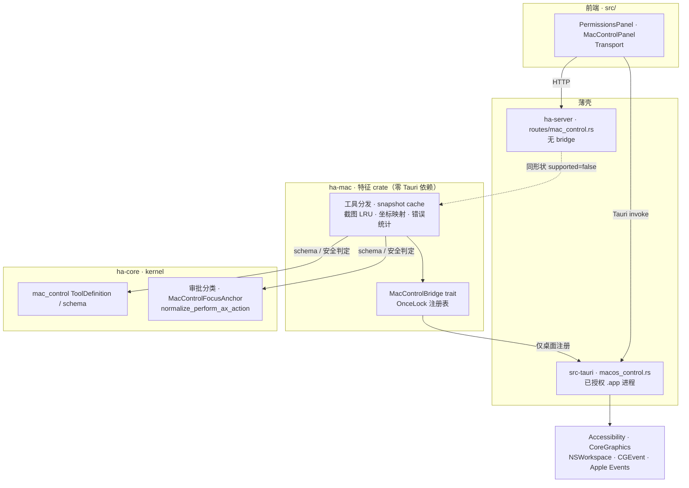
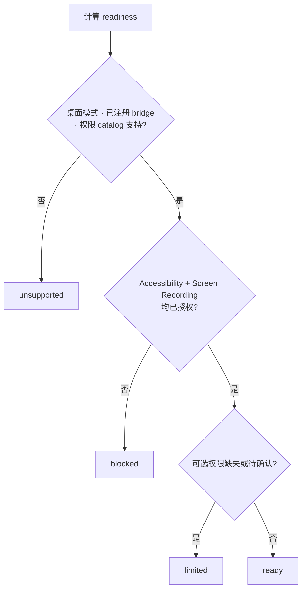
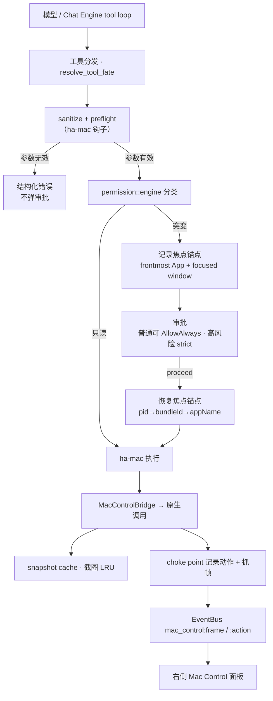
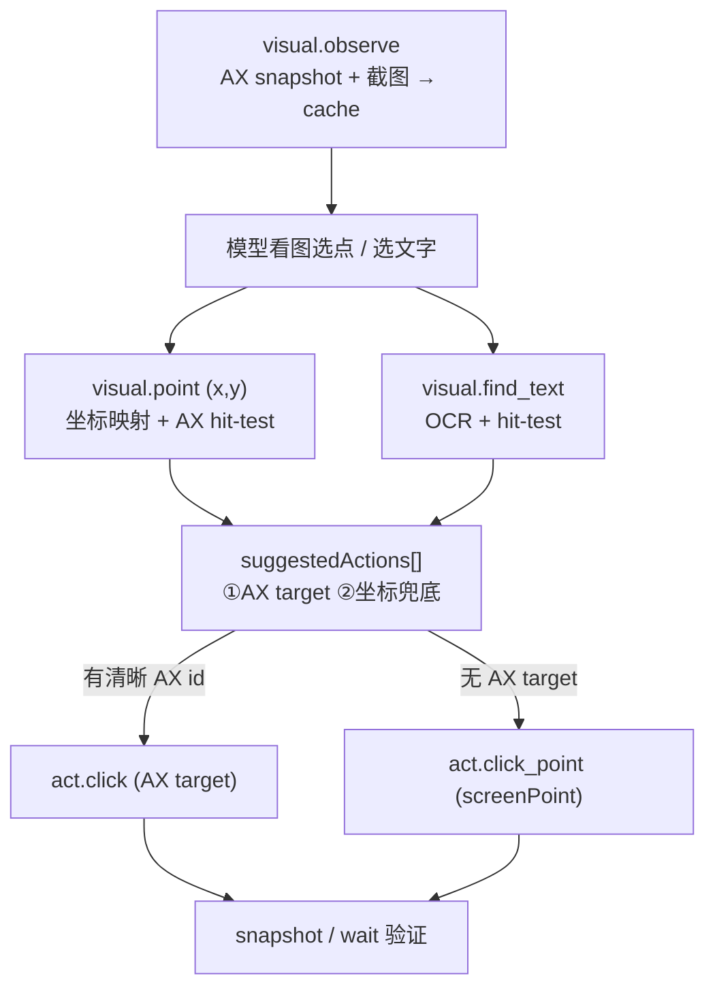
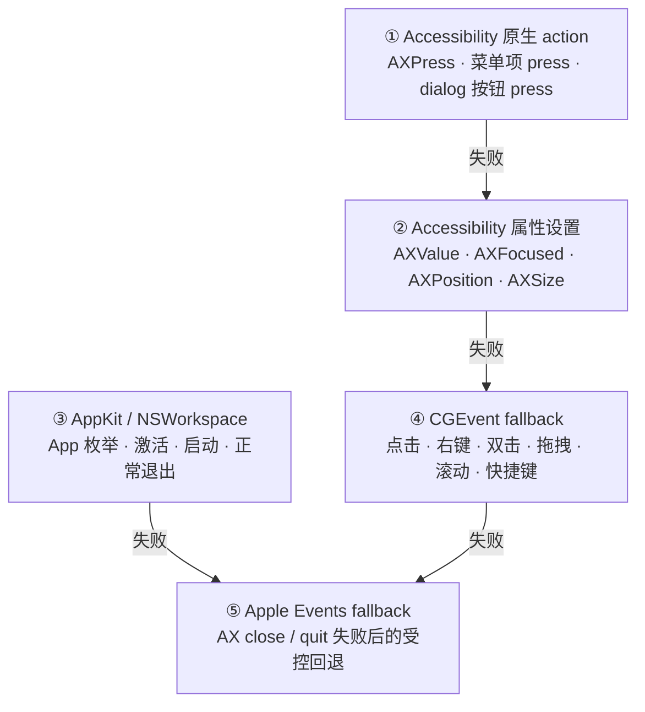

# macOS 控制子系统

> 返回 [文档索引](../../README.md)
>
> 关联源码：[`crates/ha-mac/src/lib.rs`](../../../crates/ha-mac/src/lib.rs)（类型 / 分发 / cache / 坐标映射）· [`crates/ha-mac/src/tool.rs`](../../../crates/ha-mac/src/tool.rs)（action 分发）· [`crates/ha-core/src/permission/engine.rs`](../../../crates/ha-core/src/permission/engine.rs)（审批分类）· [`crates/ha-core/src/tool_defs/mac_control.rs`](../../../crates/ha-core/src/tool_defs/mac_control.rs)（kernel 安全逻辑）· `src-tauri/src/macos_control.rs`（原生 bridge）· `skills/ha-mac-control/SKILL.md`（模型使用 loop）

本文讲清 Hope Agent 如何让模型像人一样操作 macOS 桌面：它解决什么问题、靠哪几个关键想法保证安全可控、系统怎么分层运转，以及每个工具动作的完整参数契约。

## 核心思想

让一个 LLM 去点按钮、填表单、切窗口，本质上是把「屏幕上的像素」翻译成「可执行的意图」，再把执行结果反馈回模型形成闭环。难点不在于能不能合成一次点击，而在于三件事同时成立：

1. **看得准**——模型要知道屏幕上有什么、控件在哪，而不是靠猜坐标。
2. **动得稳**——同一个「点这个按钮」的意图，在不同 App、不同渲染框架下都能落到正确的控件上。
3. **拦得住**——任何会改变系统状态的动作都要经过授权，高风险动作不能被静默放行。

这个子系统用五个关键想法回应这三点：

- **授权主体是 `.app` 进程本身**。macOS 的 TCC 权限绑定在 bundle 身份上，所以所有读屏、读 Accessibility 树、合成输入的调用都必须由已授权的 Hope Agent `.app` 进程发出。这也决定了它是**桌面专属能力**——headless server / ACP 拿不到本机桌面控制权。

- **Accessibility 优先，截图坐标兜底**。能拿到结构化的 AX 元素（角色、标签、可用状态、bounds、支持的动作）时，就用 `AXPress`、`AXSetValue` 这类语义级操作；拿不到时才降到「截图 → 视觉定位 → 坐标点击」。结构化信息越多，动作越稳。

- **观察—决策—执行—验证的闭环**。模型先 `snapshot` / `elements.find` 观察，再选定目标执行，再用 `wait` / 新 snapshot 验证。observe 产出的 `snapshotId` / `elementId` 是短生命周期的，指纹校验保证「此刻这个 `el_7`」和「几秒前那个 `el_7`」确实是同一个控件。

- **只读免审批，突变进审批，高风险 strict**。读状态、看元素、OCR 都直接放行；点击、输入、移窗口进入审批系统并可 AllowAlways；删除、退出、确认这类不可逆动作走严格审批，永远禁用 AllowAlways。

- **分层：安全判定留 kernel，机器进特征 crate，原生调用进薄壳**。审批分类和 AX 动作规范化这类安全代码留在 `ha-core`；工具分发、cache、坐标映射这类「机器」放在 `ha-mac` 特征 crate；真正调 macOS API 的代码放在 `src-tauri`。三层各司其职，非桌面运行模式因为拿不到 bridge 而自然降级。

## 能力边界

macOS 控制只在桌面 Tauri 运行模式下真实可用。授权主体必须是 Hope Agent `.app` 进程。

**支持的能力**

- 查询控制状态、权限 readiness 和系统权限摘要，导出只读诊断 bundle 复盘失败现场
- 读取前台 App、显示器、窗口、Accessibility 元素树，并按置信度排序返回候选
- 采集显示器或窗口截图帧，把截图引用与 snapshot 绑定
- 把受管截图送进模型视觉输入，再把图片像素点映射回 macOS screen point，同时返回 AX 命中 / 最近候选
- 等待 app / window / element 出现或消失
- 枚举、搜索、激活、启动、退出 App
- 枚举 Dock 持久项、启动 Dock 项、打开 / 选择 Dock 上下文菜单、隐藏 / 显示 Dock
- 枚举 Spaces、切换 Space，并用 SkyLight/CGS 把明确窗口移动到指定 Space
- 枚举、聚焦、移动、缩放、最小化、关闭窗口
- 执行 AX 优先的点击、文本输入、设置值、快捷键、滚动、拖拽、右键、双击
- 枚举和点击菜单栏路径
- 读、写、清空 UTF-8 文本剪贴板
- 检查并处理前台 dialog / sheet / popover
- 通过 EventBus 打开聊天右侧 Mac Control 镜像面板
- 接入统一 `permission::engine`、Plan Mode、Agent tool allow/deny、Transport Tauri/HTTP 双实现与日志

**刻意不做的事**

- headless server / ACP 直接控制本机桌面
- 把 Terminal、shell、临时 dev binary 或脚本解释器当作长期授权主体
- 无 Accessibility 权限时读取或控制 AX 树
- 无 Screen Recording 权限时返回截图帧
- 读取密码字段真实值；在非 `clipboard.get` 结果里记录剪贴板原文；把截图 base64 写进上下文
- 用 AX 后台接口控制 Hope Agent 自己的窗口（会在非主线程触发 AppKit 崩溃）；自身窗口只能走专用 main-thread AppKit bridge
- 模板匹配、自动框选或绕过审批的一站式视觉点击
- 依赖公开 API 稳定移动窗口到指定 Space——`spaces.move_window` 用 SkyLight/CGS 私有 API，CGS 不可用时返回错误

## 架构与分层

系统在四个层次之间流动：前端只发 Transport 请求，薄壳做进程边界，特征 crate 是业务机器，kernel 保留安全判定，最底层才触碰 macOS 原生 API。



**分层规则**

- **`ha-mac`（特征 crate，零 Tauri 依赖）** 定义公共类型、工具分发、snapshot cache、截图 LRU、错误统计、EventBus 事件和 `MacControlBridge` trait。装配入口是幂等的 `wire()`：把 `mac_control` 分发条目注册进工具表，并注册四件套执行钩子（焦点 anchor capture/restore + args sanitize/preflight）。
- **`ha-core`（kernel）** 保留三样不外迁的安全资产：`mac_control` 的 `ToolDefinition` 与 schema、审批风险分类、以及被审批分类消费的 `normalize_perform_ax_action` 和跨 `await` 持有的 `MacControlFocusAnchor` 类型。安全判定代码留在 kernel，让 server / headless 因为拿不到 bridge 而自然降级；`ha-mac` 只从原路径再导出这两个符号。
- **`src-tauri`** 在 setup 期注册 `Arc<dyn MacControlBridge>`，并在 macOS `.app` 进程内调用原生 API。
- **`ha-server`** 只提供同形状 HTTP 路由；server / headless 没有 bridge，所有结果明确返回 `supported=false`。
- **前端** 只通过 `Transport` 调用 Tauri / HTTP 命令，从不直接碰原生 AX 或系统 API。

**模块职责**

| 路径 | 职责 |
| --- | --- |
| `crates/ha-mac/src/lib.rs` | 公共类型、bridge 注册、各 action 入口、snapshot cache、截图文件 LRU、诊断 bundle、视觉坐标映射与 hit-test、错误统计 |
| `crates/ha-mac/src/tool.rs` | builtin tool 的 `action` 分发，把模型参数映射到 `ha_mac::*` 请求，并在 choke point 记录变更类操作事件 |
| `crates/ha-core/src/tools/definitions/core_tools.rs` | `mac_control` tool schema、deferred / tool fate 元数据 |
| `crates/ha-core/src/tool_defs/mac_control.rs` | 留 kernel 的 `MacControlFocusAnchor` 类型与 `normalize_perform_ax_action` |
| `crates/ha-core/src/permission/engine.rs` | `mac_control` 只读 / 普通 / 高风险的审批分类 |
| `crates/ha-core/src/tools/approval.rs` | `MacControlAction` / `MacControlDangerousAction` 审批 payload 与 strict 判定 |
| `src-tauri/src/macos_control.rs` | macOS bridge 实现，封装 AX、截图、NSWorkspace、Dock plist、Spaces prefs、CGEvent、菜单、剪贴板、dialog、Apple Events fallback |
| `src-tauri/src/tauri_wrappers.rs` | Tauri command wrapper |
| `crates/ha-server/src/routes/mac_control.rs` | HTTP `/api/mac-control/*` 路由（router 在 `ha-server/src/lib.rs` 挂载） |
| `src/lib/transport-http.ts` | HTTP command 映射，与 Tauri invoke 同名 |
| `src/components/settings/PermissionsPanel.tsx` | Settings → Permissions 顶部 readiness 摘要 |
| `src/components/chat/MacControlPanel.tsx` | 聊天右侧截图镜像面板 |
| `skills/ha-mac-control/SKILL.md` | 模型使用 `mac_control` 的标准 loop 和恢复策略 |

## 运行模式与 readiness

同一套接口在所有运行模式下形状一致，靠 bridge 是否注册、权限是否齐全来决定真实行为。

| 运行模式 | bridge | 结果 |
| --- | --- | --- |
| macOS Tauri desktop | 已注册 | 真实查询和执行桌面控制 |
| macOS Tauri desktop 但缺权限 | 已注册 | `supported=true`，`readiness=blocked/limited`，具体 action 按权限失败 |
| HTTP / server / headless | 未注册 | 同形状结果，`supported=false` |
| 非 macOS | 未注册 | 同形状结果，`supported=false` |

`MacControlStatus` 是每次调用都携带的状态封面，关键字段：

- `platform`：当前平台字符串。
- `supported`：当前运行模式是否能真实控制本机 macOS 桌面。
- `desktop`：是否桌面运行模式。
- `bridgeRegistered`：是否已注册 `MacControlBridge`。
- `readiness`：`ready | limited | blocked | unsupported`。
- `coreReady`：Accessibility + Screen Recording 两个核心权限是否都满足。
- `requiredPermissions` / `optionalPermissions`：权限摘要，来自系统权限 catalog。
- `missingRequired` / `optionalPending`：缺失的必需权限 id、待处理的可选权限 id。
- `stats`：snapshot cache、截图文件上限、最近错误统计。

readiness 不是状态机而是一次性判定，逻辑是一棵短决策树：



> 一个不显然的坑：当必需权限在 System Settings 里其实已勾选、只是**尚未重启生效**（`GrantedPendingRestart`）时，readiness 仍算 `blocked`，但 `message` 会改成「已在系统设置里允许，重启 Hope Agent 即可生效」，而不是误导用户再去授权一次。

## 权限模型

macOS TCC 权限按进程和 bundle 身份绑定。真正调用系统 API 的进程必须就是已授权的 Hope Agent `.app`。

| 权限 | 用途 | 是否核心 |
| --- | --- | --- |
| Accessibility | 读 AX 树、`AXPress`、`AXSetValue`、窗口操作、菜单和 dialog 控制 | 是 |
| Screen Recording | 截图、右侧镜像面板、视觉定位 | 是 |
| Automation: System Events / per-app | Apple Events fallback，例如部分 close / quit 流程 | 可选 |
| Input Monitoring | 当前未接入；预留给操作录制或全局输入学习 | 可选 |
| System Audio Capture | 当前未接入；预留给音频理解 | 可选 |

运行时防御：

- `snapshot` 读 AX 树需要 Accessibility；`includeScreenshot=true` 额外需要 Screen Recording。截图可按显示器或前台 / 指定窗口采集，失败时返回 AX-only snapshot 并附 warning。
- `capture_frame` 只需要 Screen Recording；默认采集主显示器，失败时不伪造 frame。
- `act` / `spaces.switch` / `windows` / `menu` / `dialog` 需要 Accessibility。
- `dock.list` 读用户偏好文件；`spaces.list` 优先读 SkyLight/CGS 实时状态，CGS 不可用时 fallback 到 `com.apple.spaces` 并 warn；`dock.hide/show` 写 `com.apple.dock autohide` 并重启 Dock。
- Apple Events fallback 只在系统允许 Automation 时可用；失败结果必须结构化返回。

## 一次调用的生命周期

模型调 `mac_control` 后，请求在真正触碰系统之前要过多道闸门。理解这条链路，就理解了「为什么无效参数不会弹审批」「为什么审批弹窗不会把焦点搞乱」。



关键设计点：

- **先 sanitize + preflight，再进权限引擎**。执行层在权限判断前做 action/op 级参数清洗和预检，把模型或 Provider 给共享 schema 填的默认噪声剥掉，并对无效调用（缺目标、`spaces.switch` 没给 / 同时给多个 selector、`menu.click` 空 path 等）直接返回结构化错误。这样避免了「用户批准后才发现参数根本没法执行」，也避免授权弹窗白白抢焦点。例如 `spaces.switch direction="right"` 即便伴随默认噪声 `spaceIndex=1`，也会按方向切换解释。

- **焦点锚点保护**。进入审批前记录当前 frontmost App 和 focused window；用户 AllowOnce / AllowAlways 或审批超时按 `proceed` 继续时，工具真正执行前会按 `pid → bundleId → appName` 顺序 best-effort 激活原 App，再按 pid-scoped window id 和窗口标题兜底恢复原 focused window。这样审批弹窗即便让 Hope Agent 抢了前台，后续 `frontmost` / 键盘 / 菜单动作也不会落到错误窗口。原 App 已退出或恢复失败时只写 warning，不阻断执行。`MacControlFocusAnchor` 类型留在 kernel，正是因为执行层要跨 `await` 持有它。

## 审批与风险分类

`permission::engine` 对 `mac_control` 做 tool-specific 风险分类，不依赖 Agent 自定义审批清单。分类只看 `action/op`（和少数动作里的危险词），返回三档决策。

| 分类 | action / op | 决策 |
| --- | --- | --- |
| 只读 | `status`、`permissions`、`diagnostics.summary/export`、`snapshot`、`elements.find`、`wait`、`visual.observe/point/ocr/find_text`、`apps.list/frontmost/installed/search`、`dock.list`、`spaces.list`、`windows.list`、`act.dry_run`、`menu.list/popover`、`dialog.inspect/list` | Allow |
| 普通 / 隐私动作 | `apps.activate/launch`、`dock.launch/hide/show/menu`、安全 `dock.select_menu menuItem`、`spaces.switch/move_window`、`windows.focus/move/resize/minimize`、除 `dry_run` / `perform_action(AXConfirm)` 外的 `act.*`、普通 `menu.click`、`clipboard.get/set/clear`、普通 `dialog.click/input/file/dismiss` | Ask，可 AllowAlways |
| 高风险突变 | `apps.quit`、`windows.close`、`dialog.accept`、`act.perform_action axAction=AXConfirm`、命中危险词的 `menu.click`、命中危险按钮词的 `dialog.click/file`、命中危险词或 index-only 的 `dock.select_menu` | Ask，`forbids_allow_always=true` |

危险词表在 kernel 内维护，中英文双语，覆盖 delete / move to trash / erase / reset / quit / force quit / remove / discard / don't save 及对应中文（删除 / 移到废纸篓 / 抹掉 / 重置 / 退出 / 强制退出 / 移除 / 不保存等）。`dock.select_menu` 只按 `menuIndex`、没有 `menuItem` 时也升级为高风险——因为按序号盲点等于放弃了对目标文案的审计。

权限模式交互：

- **Default**：普通 / 隐私动作和高风险突变都弹审批。
- **Smart**：只读直接放行；普通 / 隐私动作仍可被 smart 策略处理；高风险突变保持严格审批。
- **YOLO**：除 Plan Mode 外放行，但风险命中写 `app_warn!` 审计日志。
- **Plan Mode**：不在 plan allowlist 的 `mac_control` 调用会被拒绝；即使 YOLO 也绕不过。

审批 payload 有两种，序列化名分别是 `mac_control_action`（普通 / 隐私）和 `mac_control_dangerous_action`（高风险，前端显示 strict 样式并禁用 AllowAlways）。高风险 payload 恒为 strict：禁用 AllowAlways，超时也强制 deny。审批弹窗应展示 action/op、目标 App、窗口、元素 label、菜单 path、hotkey 或输入摘要；文本输入需截断脱敏，绝不展示密码字段值。

## Transport 接口

前端 Transport 层提供六个 macOS Control command。Tauri 与 HTTP 必须同名、同形状；HTTP / server 模式不控制本机桌面，返回同形状 `supported=false` 结果。

| Tauri Command | HTTP | 入参 | 出参 |
| --- | --- | --- | --- |
| `mac_control_status` | `GET /api/mac-control/status` | 无 | `MacControlStatus`：readiness、权限摘要、bridge 状态、运行时统计 |
| `mac_control_permissions` | `GET /api/mac-control/permissions` | 无 | `MacControlPermissionsResponse`：`status` + 完整 `systemPermissions` catalog |
| `mac_control_snapshot` | `POST /api/mac-control/snapshot` | `{ options?: MacControlSnapshotRequest }`；Tauri command 直接接收 `options` | `MacControlSnapshotResponse`：`status`、`snapshot?`、`error?` |
| `mac_control_elements` | `POST /api/mac-control/elements` | `{ options?: MacControlElementsRequest }`；Tauri command 直接接收 `options` | `MacControlElementsResponse`：`status`、`result?`、`error?` |
| `mac_control_capture_frame` | `POST /api/mac-control/capture-frame` | 可选 `displayId`（面板快捷条切换捕获显示器；缺省 = 主显示器） | `MacControlFrameResponse`：`status`、`frame?`、`error?` |
| `mac_control_list_displays` | `GET /api/mac-control/displays` | 无 | `MacControlDisplaysResponse`：`displays`、`error?`（server 模式空列表 + error） |

请求 / 结果类型：

| 类型 | 字段 |
| --- | --- |
| `MacControlSnapshotRequest` | `includeScreenshot?`、`screenshotTarget?: "display" \| "window"`、`displayId?`、`windowId?`、`maxElements?`、`maxDepth?` |
| `MacControlElementsRequest` | `op?: "find"`、`target?: MacControlTargetQuery`、`limit?`、`maxElements?`、`maxDepth?` |
| `MacControlSnapshotResponse` | `status`、`snapshot?: MacControlSnapshot`、`error?` |
| `MacControlElementsResponse` | `status`、`result?: MacControlElementsResult`、`error?` |
| `MacControlFrameResponse` | `status`、`frame?: MacControlFramePayload`、`error?` |
| `MacControlFramePayload` | `sessionId?`、`snapshotId`、`mediaId?`、`path?`、`jpegBase64`、`widthPx`、`heightPx`、`target`、`displayId?`、`windowId?`、`windowTitle?`、`boundsPoints?`、`scale?`、`capturedAt`、`frontmostApp?`、`actionId?` |

这些接口供设置页和右侧镜像面板使用。聊天模型执行桌面动作时**不**直接调这些 Tauri command，而是调 builtin tool `mac_control`。

## Builtin Tool

`mac_control` 是一个 Standard 工具，用单工具、多 `action/op` 的形态承载全部桌面能力。

| 属性 | 值 | 设计含义 |
| --- | --- | --- |
| `ToolTier` | `Standard` | — |
| `default_for_main` | `true` | 主 Agent 默认可发现、可用 |
| `default_for_others` | `false` | 其它 Agent 默认关闭，避免子 Agent 意外操作电脑 |
| `default_deferred` | `true` | schema 较大，默认走 deferred tool loading |
| `internal` | `false` | — |
| `concurrent_safe` | `false` | GUI 操作依赖焦点 / 前台 App / 坐标，不允许并发 |
| `background_policy` | `ForegroundOnly` | 只在前台运行 |

执行层必须按当前 `action/op` 解释参数；共享 schema 里其它字段不能改变当前 op 的语义。权限判断和审批前会先做 action/op 级 sanitize + preflight，避免模型或 Provider 给共享 schema 填默认字段后触发无意义审批。

### 通用输入字段

| 字段 | 类型 | 用途 |
| --- | --- | --- |
| `action` | string | 必填。`status`、`permissions`、`diagnostics`、`snapshot`、`elements`、`wait`、`visual`、`apps`、`dock`、`spaces`、`windows`、`act`、`menu`、`clipboard`、`dialog` |
| `op` | string | 子操作。按 `action` 解释；未传时用该 request 类型的默认 op |
| `target` | `MacControlTargetQuery` | app / window / element 目标过滤，用于 `wait`、`windows`、`act`、`dialog` |
| `appName` | string | App 名称查询，用于 `apps.*` / `dock.launch` |
| `appNameMatch` | `"exact" \| "contains"` | App 名称匹配策略，默认 `exact` |
| `bundleId` | string | App bundle id 查询，用于 `apps.*` / `dock.launch` |
| `pid` | number | App 进程 id 查询，用于 `apps.*` |
| `limit` | number | `diagnostics.summary/export` 的 cached snapshot 摘要数量，或 `apps.list/installed/search`、`dock.list`、`elements.find`、`visual.point`、`visual.find_text` 返回条数上限 |
| `windowScope` | `"frontmost" \| "all"` | `windows.list` 和窗口解析范围，默认 `frontmost` |
| `windowId` | string | 窗口 id，用于 `windows.*` 或 `snapshot` window 截图 |
| `dockItemId` | string | `dock.launch/menu/select_menu` 的 Dock item id，来自 `dock.list` |
| `itemPath` | string | `dock.launch/menu/select_menu` 的 Dock item 路径或 `file://` URL |
| `menuItem` | string | `dock.select_menu` 要点击的 Dock 上下文菜单项标题；优先于 `menuIndex` |
| `spaceId` | number | `spaces.switch` 的 Space id，来自 `spaces.list` |
| `spaceIndex` | number | `spaces.switch` 的 1-based Space 序号，映射到 Control+数字 |
| `direction` | `"left" \| "right"` | `spaces.switch` 的相邻 Space 方向，映射到 Control+Left/Right |
| `snapshotId` | string | `visual.point/ocr/find_text` 要解析的 snapshot id，来自 `visual.observe` 或 `snapshot includeScreenshot=true`；`ocr/find_text` 可省略以立即采集新截图 |
| `target.snapshotId` | string | 与 `target.elementId` 搭配，指向产生该 `elementId` 的 snapshot / visual.observe / elements.find 结果；mutation 会用旧元素指纹校验并重定位，避免 stale `el_N` 误点 |
| `coordinateSpace` | `"image_pixels" \| "screen_points"` | `visual.point` 的坐标空间，默认 `image_pixels` |
| `x` / `y` | number | `visual.point` 待解析坐标、`windows.move` 目标位置、`act.click_point` 点击位置、`act.move_cursor` 目标位置、`act.swipe` 起点、`act.drag` 终点；合法 `0` 不得当缺省 |
| `fromX` / `fromY` / `toX` / `toY` | number | `act.drag` / `act.swipe` 的原始起点 / 终点坐标，用于无需 AX target 的端点 |
| `toTarget` | object | `act.drag` / `act.swipe` 的终点 AX target，字段同 `target` |
| `width` / `height` | number | `windows.resize` 目标尺寸 |
| `text` | string | `visual.find_text` OCR 查询、`act.type` / `act.paste` 输入文本、`clipboard.set` 写入文本；目标文本匹配放在 `target.text` |
| `typingProfile` / `typingDelayMs` | string / number | `act.type` 显式逐字符 CGEvent 输入时的节奏配置；`instant/steady/human` 或每字符延迟 |
| `dryRunOp` | string | `act.dry_run` 要预演的真实 act op；默认 `click`，结果返回 `preview.executionPlan/fallbackPlan/verificationPlan/warnings` |
| `explain` | boolean | `act` 执行结果额外返回结构化 `preview` 说明；执行前预演优先用 `op="dry_run"` + `dryRunOp` |
| `textMatch` | `"exact" \| "contains"` | `visual.find_text` OCR 文本匹配策略，默认 `exact` |
| `languages` | string[] | `visual.ocr/find_text` 与 `menu.popover includeOcr=true` 可选 Vision 识别语言，如 `zh-Hans`、`en-US`；省略时自动检测 |
| `minConfidence` | number | `visual.ocr/find_text` 与 `menu.popover includeOcr=true` OCR 置信度下限，`0..1`，默认 `0` |
| `recognitionLevel` | `"accurate" \| "fast"` | `visual.ocr/find_text` 与 `menu.popover includeOcr=true` Vision 识别等级，默认 `accurate` |
| `value` | string | `act.set_value` 写入值 |
| `axAction` | string | `act.perform_action` 要执行的 AX action 名称；支持常用别名规范化，其他名称需非空、≤128 字符且仅含 ASCII 字母 / 数字 / `_` / `-` |
| `key` / `keys` | string / string[] | `act.hotkey` 单键或组合键；`act.press` 单键或顺序按键 |
| `modifiers` / `repeat` / `holdMs` / `intervalMs` | string[] / number | `act.press` 的修饰键、重复次数、按住时长、按键间隔；`act.drag` / `act.swipe` 可用 `modifiers` 在拖拽期间按住修饰键 |
| `deltaX` / `deltaY` | number | `act.scroll` 滚动增量，或 `act.swipe` 从起点出发的移动距离 |
| `durationMs` / `steps` / `motionProfile` | number / string | `act.move_cursor` / `act.drag` / `act.swipe` 平滑轨迹的时长、插值步数和轨迹类型；`motionProfile` 支持 `linear` / `human` |
| `path` | string[] | `menu.click` 菜单路径 |
| `menuIndex` | number | `menu.click scope="system"` 可用，0-based，来自 `menu.list scope="system"` 的 `items[].index`；`path[]` 非空时忽略。`dock.select_menu` 也可用，但仅在没有 `menuItem` 时表达 index-only 选择 |
| `verify` | boolean | `menu.click scope="system"` 后尝试识别打开的状态栏 popover |
| `buttonText` | string | `dialog.click/accept/dismiss/file` 指定按钮文案 |
| `field` / `fieldIndex` | string / number | `dialog.input` 字段标签 / 元素 id 或 0-based 字段序号 |
| `filePath` / `fileName` / `selectButton` | string | `dialog.file` 的目录或完整路径、保存文件名、最终点击按钮 |
| `clear` / `ensureExpanded` / `force` | boolean | `dialog.input` 替换式输入、`dialog.file` best-effort 展开、`dialog.dismiss` 未命中按钮时发送 Escape |
| `scope` | `"app" \| "system"` | `menu.list/click` 菜单范围，默认 `app` |
| `appHint` | string | `menu.popover` 可选状态栏 App / 菜单项 hint，用 App 名、bundle id、窗口标题或 OCR 文本提高候选排序 |
| `includeScreenshot` | boolean | `snapshot` 是否采集 JPEG |
| `screenshotTarget` | `"display" \| "window"` | `snapshot.includeScreenshot=true` 时选显示器或窗口 |
| `displayId` | number | `snapshot` display 截图目标显示器 |
| `includeSnapshot` | boolean | `act`、`wait`、`dialog` 是否在结果里带完整 AX snapshot，默认 `false` |
| `annotate` | boolean | `visual.observe` 是否生成带 AX 元素 id 边框的标注截图和 `uiMap`，默认 `false` |
| `uiMapLimit` | number | `visual.observe annotate=true` 的标注元素上限，默认 80，硬上限 200 |
| `maxElements` / `maxDepth` | number | AX 树遍历上限 |
| `timeoutMs` / `pollMs` | number | `wait` 总超时和轮询间隔 |
| `maxChars` | number | `clipboard.get` 返回文本上限 |

### 通用输出形状

| action | 输出形状 |
| --- | --- |
| `status` | `MacControlStatus` |
| `permissions` | `{ status, systemPermissions: SystemPermissionsResponse }` |
| `diagnostics` | `{ status, result?: MacControlDiagnosticsResult, error? }` |
| `snapshot` | `{ status, snapshot?: MacControlSnapshot, error? }` |
| `visual` | `{ status, result?: MacControlVisualResult, error? }`；`visual.observe` 的 tool result 会在文本前加 `__IMAGE_FILE__` marker |
| `wait` | `{ status, op, matched, elapsedMs, attempts, target, matches, snapshot?, error? }` |
| 其它 action | `{ status, result?: <ActionResult>, error? }` |

### status / permissions / diagnostics / snapshot / elements / wait

| action / op | 入参 | 出参 | 说明 |
| --- | --- | --- | --- |
| `status` | `action="status"` | `MacControlStatus` | 只读 readiness / status；不触发系统权限请求 |
| `permissions` | `action="permissions"` | `status`、`systemPermissions` | 只读系统权限 catalog |
| `diagnostics.summary` | `action="diagnostics"`、`op="summary"`；可选 `limit` | `snapshotCache[]`、`recentErrors[]`、`focusAnchor?`、`warnings[]` | 只读诊断摘要，不执行 UI mutation；snapshot cache 只返回计数、frontmost app、screenshot metadata 和 warnings，不回传完整 AX 树 |
| `diagnostics.export` | `action="diagnostics"`、`op="export"`；可选 `limit` | 同上，另有 `exportPath` | 把同一份 bundle 写入 `~/.hope-agent/mac-control/diagnostics/`，复盘失败现场 |
| `snapshot` | `action="snapshot"`；可选 `includeScreenshot`、`screenshotTarget`、`displayId`、`windowId`、`maxElements`、`maxDepth` | `snapshot?`、`error?` | 返回 AX 树；`includeScreenshot=true` 时写 JPEG 文件并返回 `snapshot.screenshot` |
| `elements.find` | `action="elements"`、`op="find"`；可选 `target`、`limit`、`maxElements`、`maxDepth` | `result.op`、`target`、`snapshotId`、`createdAt`、`frontmostApp?`、`totalMatches`、`elements[]`、`truncated`、`warnings[]` | `elements[]` 是排序候选，每项含 `element`、`window?`、`score`、`reasons[]` |
| `wait.present` | `action="wait"`、`op="present"`、`target` 至少一个字段；可选 `timeoutMs`、`pollMs`、`includeSnapshot`、`maxElements`、`maxDepth` | `matched`、`elapsedMs`、`attempts`、`target`、`matches`、`snapshot?`、`error?` | 轮询直到目标出现；默认不返回完整 snapshot |
| `wait.gone` | `action="wait"`、`op="gone"`、`target` 至少一个字段；可选同上 | 同 `wait.present` | 轮询直到目标消失；若当前已不存在则立即成功 |

### apps

| action / op | 入参 | 出参 `result` | 说明 |
| --- | --- | --- | --- |
| `apps.list` | `op="list"`；可选 `limit` | `op`、`frontmost?`、`apps[]`、`installedApps=[]`、`activated?=null`、`launched?=null`、`quit?=null`、`execution?` | 只读运行中 App 列表 |
| `apps.frontmost` | `op="frontmost"` | `frontmost?`、`apps=[]` | 只读前台 App |
| `apps.installed` | `op="installed"`；可选 `appName`、`appNameMatch`、`bundleId`、`limit` | `installedApps[]`，标注 `running`、`pid?`、`active`、`hidden` | 已安装 App 列表 / 过滤 |
| `apps.search` | `op="search"`；可选同上 | `installedApps[]` | 已安装 App 检索；名称不确定时先用它找 `bundleId` |
| `apps.activate` | `op="activate"`；`pid` / `bundleId` / `appName` 之一 | `activated?`、`execution="NSRunningApplication.activate"` | 激活已运行 App |
| `apps.launch` | `op="launch"`；`bundleId` / `appName` 之一 | `launched?`、`execution="NSWorkspace.openApplication"` | 启动已安装 App |
| `apps.quit` | `op="quit"`；`pid` / `bundleId` / `appName` 之一 | `quit?`、`execution` | 请求 App 正常退出；高风险 |

### dock / spaces

| action / op | 入参 | 出参 `result` | 说明 |
| --- | --- | --- | --- |
| `dock.list` | `op="list"`；可选 `limit`、`appName`、`bundleId`、`itemPath` | `op`、`autohide?`、`orientation?`、`items[]`、`warnings[]` | 读 `com.apple.dock` 持久项，返回 `dockItemId`、label、bundleId、path、running/active 状态 |
| `dock.launch` | `op="launch"`；`dockItemId` / `bundleId` / `appName` / `itemPath` 之一 | `launched?`、`items[]`、`execution` | 启动或打开 Dock 项；优先 `dockItemId` 或 `bundleId` |
| `dock.menu` | `op="menu"`；selector 同上 | `menuItems[]`、`items[]`、`execution`、`warnings[]` | 打开 Dock 项上下文菜单；优先 `AXShowMenu`，失败再右键 Dock 项中心 |
| `dock.select_menu` | `op="select_menu"`；Dock 项 selector + `menuItem` 或 `menuIndex` | `selectedMenuItem?`、`menuItems[]`、`items[]`、`execution`、`warnings[]` | 打开菜单并点击指定项；`menuItem` 优先于 `menuIndex`，仅按 index 选择时按高风险审批 |
| `dock.hide` | `op="hide"` | `autohide=true`、`execution="defaults.write+killall.Dock"` | 设置 Dock 自动隐藏；普通审批 |
| `dock.show` | `op="show"` | `autohide=false`、同上 | 关闭 Dock 自动隐藏；普通审批 |
| `spaces.list` | `op="list"` | `displays[]`、`currentSpace?`、`warnings[]` | 读 SkyLight/CGS 实时状态：`CGSGetActiveSpace` 判 current，`CGSCopyManagedDisplaySpaces` / `CGSCopySpaces` 枚举 spaces；CGS 不可用时 fallback 到 `com.apple.spaces` |
| `spaces.switch` | `op="switch"`；`direction` / `spaceIndex` / `spaceId` 三选一 | `switched?`、`displays[]`、`execution`、`warnings[]` | `direction` 和相邻目标优先走 Mission Control `Control+Left/Right`，避免 CGS 只改内部 active id 却不切可见桌面；非相邻精确目标再 fallback 到 Control+数字或 SkyLight/CGS |
| `spaces.move_window` | `op="move_window"`；`spaceIndex` / `spaceId` + `windowId` 或 `target.windowTitle` | `movedWindow?`、`displays[]`、`execution`、`warnings[]` | 把匹配窗口映射到 CGWindowID，`CGSCopySpacesForWindows` 读原 Space，再 `CGSRemoveWindowsFromSpaces` + `CGSAddWindowsToSpaces` 移到目标 Space；需要 live CGS Space id |

### windows

| action / op | 入参 | 出参 `result` | 说明 |
| --- | --- | --- | --- |
| `windows.list` | `op="list"`；可选 `windowScope`、`target`、`maxElements`、`maxDepth` | `op`、`windowScope`、`frontmostApp?`、`windows[]`、`actedWindow?=null`、`execution?` | `windowScope="all"` 返回所有运行中 App 窗口，id 为 `win_<pid>_<index>` |
| `windows.focus` | `op="focus"`；`windowId` / `target.windowTitle` 之一 | `actedWindow?`、`execution="AXRaise/AXFocused"` | 聚焦窗口 |
| `windows.move` | `op="move"`；selector + `x`、`y` | `actedWindow?`、`execution="AXSetPosition"` | 移动窗口到 macOS point 坐标 |
| `windows.resize` | `op="resize"`；selector + `width`、`height` | `actedWindow?`、`execution="AXSetSize"` | 调整窗口大小 |
| `windows.minimize` | `op="minimize"`；selector | `actedWindow?`、`execution="AXSetMinimized"` | 最小化窗口 |
| `windows.close` | `op="close"`；selector | `actedWindow?`、`execution` | 关闭窗口；高风险 |

### act

| action / op | 入参 | 出参 `result` | 说明 |
| --- | --- | --- | --- |
| `act.dry_run` | `op="dry_run"`、`target`；可选 `dryRunOp` 及待预演 op 的相关字段 | `op`、`execution="DryRun"`、`target?`、`preview?`、`snapshot=null` | 只解析目标，不执行 UI 操作；`dryRunOp` 用同一目标解析器预演真实动作的执行步骤、fallback、验证建议和 warning |
| `act.perform_action` | `op="perform_action"`、`target`、`axAction` | `execution=<AX action>`、`performedAction=<AX action>`、`target?`、`snapshot?` | 对目标元素执行命名 AX action；不要求 `actions[]` 预声明，系统返回 unsupported 时作为执行错误返回 |
| `act.click` | `op="click"`、`target` | `execution="AXPress"` 或 `"AXPressFailed+CGEventFallback(...)"`、`target?`、`snapshot?` | AX target 点击；先 `AXPress`，失败且有 bounds 时回退中心点点击；不消费裸 `x/y` |
| `act.click_point` | `op="click_point"`、`x`、`y`，且不能带 `target` | `execution="CGEventClick"`、`target=null`、`snapshot?` | 裸坐标点击，允许 `(0, 0)` |
| `act.move_cursor` | `op="move_cursor"`；`x/y` 或 `target`；可选 `durationMs`/`steps`/`motionProfile` | `execution="CGEventMoveCursor"`、`target?`、`snapshot?` | 平滑移动指针，不点击 |
| `act.double_click` | `op="double_click"`、`target` | `execution="CGEventDoubleClick"`、`target?`、`snapshot?` | 目标元素中心双击 |
| `act.right_click` | `op="right_click"`、`target` | `execution="CGEventRightClick"`、`target?`、`snapshot?` | 目标元素中心右键 |
| `act.type` | `op="type"`、`text`；可选 `target` / `typingProfile` / `typingDelayMs` | `execution="AXSetValue"`、`"AXSetValueFailed+PasteboardReplace(...)"` 或 `"CGEventUnicodeTyping"`、`target?`、`snapshot?` | 默认对文本控件设值；`AXSetValue` 失败时聚焦、全选、剪贴板替换；显式 typing profile 时逐字符输入 |
| `act.paste` | `op="paste"`、`text`；可选 `target` | `execution` 为 pasteboard 恢复状态、`target?`、`snapshot?` | 临时写 pasteboard 后触发系统粘贴；不回显 text |
| `act.set_value` | `op="set_value"`、`target`、`value` | `execution="AXSetValue"` 或 `"AXSetValueFailed+PasteboardReplace(...)"`、`target?`、`snapshot?` | 对明确 AX 元素设值；AX 写入失败时聚焦、全选、剪贴板替换 |
| `act.hotkey` | `op="hotkey"`；`key` 或 `keys` | `execution="CGEventHotkey"`、`target=null`、`snapshot?` | 合成快捷键 |
| `act.press` | `op="press"`；`key` 或 `keys`；可选 `modifiers`/`repeat`/`holdMs`/`intervalMs` | `execution="CGEventPress"`、`target=null`、`snapshot?` | 合成单键或顺序按键，可重复、按住、带修饰键 |
| `act.scroll` | `op="scroll"`；`deltaX` / `deltaY` 之一非零 | `execution="CGEventScroll"`、`target=null`、`snapshot?` | 合成滚动 |
| `act.drag` | `op="drag"`；起点 `target` 或 `fromX/fromY`；终点 `x/y`、`toX/toY` 或 `toTarget`；可选 `durationMs`/`steps`/`motionProfile`/`modifiers` | `execution="CGEventDrag"`、`target?`、`snapshot?` | 在坐标 / AX 元素端点间平滑拖拽 |
| `act.swipe` | `op="swipe"`；起点 `x/y`、`fromX/fromY` 或 `target`；终点 `deltaX/deltaY`、`toX/toY` 或 `toTarget`；可选同上 | `execution="CGEventSwipe"`、`target?`、`snapshot?` | 从起点到终点平滑拖拽，适合滑动 / 拨动 |

`act` 默认 `snapshot=null`；显式 `includeSnapshot=true` 时，除 `dry_run` 外返回完整后置 `snapshot`。

### menu / clipboard / dialog

| action / op | 入参 | 出参 `result` | 说明 |
| --- | --- | --- | --- |
| `menu.list` | `op="list"`；可选 `scope`、`maxDepth` | `op`、`scope`、`path=[]`、`items[]`、`clicked=null`、`popovers=[]` | 只读菜单树；`scope="app"` 是前台 App 菜单，`system` 是菜单栏 extras / status items |
| `menu.click` | `op="click"`；`path[]` 或 `menuIndex`；可选 `scope`、`maxDepth`、`verify` | `op`、`scope`、`path`、`items[]`、`clicked?`、`popovers[]`、`screenshot?`、`warnings[]` | 按 path 逐级点击；`scope="system"` 可按 `menuIndex` 点状态栏 extra，`path[]` 非空时优先 path；执行优先 `AXShowMenu`，失败退 `AXPress`，再失败且有 bounds 时中心点点击；`verify=true` 识别弹出的 popover；危险菜单词走高风险审批 |
| `menu.popover` | `op="popover"`；可选 `appHint`、`includeOcr`、`languages`、`minConfidence`、`recognitionLevel`、`limit` | `popovers[]`、`screenshot?`、`warnings[]` | 只读识别已展开的菜单栏 / 状态栏 popover；综合所有 App 的 AX window、靠近菜单栏 / 面板形态、App hint 与 OCR 文本打分 |
| `clipboard.get` | `op="get"`；可选 `maxChars` | `op`、`text?`、`textLen`、`truncated`、`changed=false` | 读 UTF-8 文本剪贴板；隐私敏感，需审批 |
| `clipboard.set` | `op="set"`、`text` | `op`、`text=null`、`textLen`、`truncated`、`changed=true` | 写 UTF-8 文本；结果不回显原文 |
| `clipboard.clear` | `op="clear"` | `op`、`text=null`、`textLen=0`、`truncated=false`、`changed=true` | 清空剪贴板 |
| `dialog.inspect/list` | `op="inspect"` 或 `op="list"`；可选 `target`、`includeSnapshot`、`maxElements`、`maxDepth` | `op`、`dialogs[]`、`actedButton=null`、`actedField=null`、`snapshot?`、`execution=null` | 返回前台 App dialog / sheet / popover 摘要、文本、按钮和字段 |
| `dialog.click` | `op="click"`、`buttonText`；可选 `target`、`includeSnapshot` | `op`、`dialogs[]`、`actedButton?`、`snapshot?`、`execution="AXPressOrCGEvent"` | 按可见按钮文本点击；危险按钮词走高风险审批 |
| `dialog.input` | `op="input"`、`text`；可选 `field` / `fieldIndex` / `target.elementId`、`clear`、`target` | `actedField?`、`execution="AXSetValue"` / `"AXSetValueFailed+PasteboardReplace(...)"` 或 paste 状态 | 向 dialog / sheet 内文本字段输入；`clear=true` 优先替换 AXValue，失败时聚焦、全选、剪贴板替换；否则聚焦后粘贴追加 |
| `dialog.file` | `op="file"`；`filePath` / `fileName` / `selectButton` / `buttonText` 至少一个；可选 `ensureExpanded` | `fileDialog?`、`actedField?`、`actedButton?`、`execution`、`warnings[]` | 驱动原生 Open/Save panel：Go to Folder 输入路径，必要时填文件名并回传实际字段，再点默认或指定按钮并回传真正点击的按钮；accept 类按钮后 best-effort 验证面板关闭；`selectButton="none"` 只输入不确认 |
| `dialog.accept` | `op="accept"`；可选 `buttonText` / `target.text`、`target`、`includeSnapshot` | `op`、`dialogs[]`、`actedButton?`、`snapshot?`、`execution="AXPressOrCGEvent"` | 点击 accept 类按钮；高风险 |
| `dialog.dismiss` | `op="dismiss"`；可选 `buttonText` / `target.text`、`force`、`target`、`includeSnapshot` | 同 `dialog.accept` | 点击 cancel / close 类按钮；`force=true` 且未解析到按钮时发 Escape |

`dialog` 默认 `snapshot=null`；需要完整 AX 树时传 `includeSnapshot=true`。

### 核心输出类型字段

| 类型 | 字段 |
| --- | --- |
| `MacControlAppSummary` | `pid`、`bundleId?`、`name?` |
| `MacControlRunningApp` | `pid`、`bundleId?`、`name?`、`active`、`hidden`、`activationPolicy` |
| `MacControlInstalledApp` | `name?`、`bundleId?`、`path?`、`executablePath?`、`running`、`pid?`、`active`、`hidden`、`activationPolicy?` |
| `MacControlDisplaySummary` | `id`、`framePoints`、`scale` |
| `MacControlWindowSummary` | `id`、`appPid?`、`role?`、`subrole?`、`title?`、`focused`、`boundsPoints?` |
| `MacControlElementSummary` | `id`、`windowId?`、`role?`、`label?`、`value?`、`enabled?`、`focused`、`boundsPoints?`、`actions[]` |
| `MacControlElementCandidate` | `element`、`window?`、`score`、`reasons[]` |
| `MacControlVisualResult` | `op`、`snapshotId?`、`snapshot?`、`screenshot?`、`annotatedScreenshot?`、`uiMap[]`、`coordinateSpace?`、`imagePoint?`、`screenPoint?`、`insideFrame?`、`hitElements[]`、`nearestElements[]`、`textBlocks[]`、`textMatches[]`、`suggestedAction?`、`suggestedActions[]`、`warnings[]` |
| `MacControlVisualElementMatch` | `element`、`window?`、`containsPoint`、`distancePoints` |
| `MacControlUiMapItem` | `id`、`windowId?`、`role?`、`text?`、`enabled?`、`focused`、`boundsPoints`、`imageBounds`、`actions[]` |
| `MacControlOcrTextBlock` | `id`、`text`、`confidence`、`imageBounds`、`screenBounds`、`imagePoint`、`screenPoint` |
| `MacControlOcrTextMatch` | `block`、`score`、`reasons[]`、`hitElements[]`、`nearestElements[]`、`suggestedAction?`、`suggestedActions[]` |
| `MacControlSuggestedAction` | `action="act"`、`op="click" \| "click_point"`、`target?`、`x`、`y`；`x/y` 单位为 macOS screen point，`target` 用于 AX click |
| `MacControlDiagnosticsResult` | `op`、`generatedAt`、`snapshotCache[]`、`recentErrors[]`、`focusAnchor?`、`exportPath?`、`warnings[]` |
| `MacControlCachedSnapshotSummary` | `snapshotId`、`createdAt`、`frontmostApp?`、`displayCount`、`windowCount`、`elementCount`、`hasScreenshot`、`screenshot?`、`truncated`、`warnings[]` |
| `MacControlTargetMatches` | `app?`、`windows[]`、`elements[]` |
| `MacControlWindowsResult` | `op`、`windowScope`、`frontmostApp?`、`windows[]`、`actedWindow?`、`execution?`、`verification?` |
| `MacControlActResult` | `op`、`execution`、`performedAction?`、`target?`、`snapshot?`、`verification?`、`preview?` |
| `MacControlActPreview` | `intendedOp`、`dryRun`、`willMutate`、`executionPlan[]`、`fallbackPlan[]`、`verificationPlan[]`、`warnings[]`、`nextStep?` |
| `MacControlVerification` | `status: verified \| failed \| unverified`、`summary`、`checks[]`、`warnings[]` |
| `MacControlVerificationCheck` | `name`、`expected?`、`actual?`、`passed` |
| `MacControlDockResult` | `op`、`autohide?`、`orientation?`、`items[]`、`launched?`、`menuItems[]`、`selectedMenuItem?`、`execution?`、`warnings[]` |
| `MacControlDockItem` | `id`、`index`、`section`、`tileType?`、`label?`、`bundleId?`、`path?`、`running`、`pid?`、`active`、`hidden` |
| `MacControlSpacesResult` | `op`、`displays[]`、`switched?`、`movedWindow?`、`execution?`、`warnings[]` |
| `MacControlSpacesDisplay` | `displayIdentifier?`、`currentSpace?`、`spaces[]`、`collapsedSpace?` |
| `MacControlSpaceSummary` | `id?`、`uuid?`、`index`、`kind?`、`current` |
| `MacControlMenuItemSummary` | `id?`、`index?`、`title?`、`description?`、`value?`、`role?`、`enabled?`、`boundsPoints?`、`actions[]`、`children[]` |
| `MacControlMenuPopoverCandidate` | `window`、`app?`、`score`、`reasons[]`、`ocrText[]` |
| `MacControlClipboardResult` | `op`、`text?`、`textLen`、`truncated`、`changed` |
| `MacControlDialogSummary` | `window`、`text[]`、`buttons[]` |
| `MacControlDialogFileResult` | `path?`、`name?`、`requestedButton?`、`selectedButton?`、`nameField?`、`pathNavigation?` |
| `MacControlBounds` | `x`、`y`、`width`、`height`，单位是 macOS point |

### 参数归一化规则

sanitize 阶段的这些规则是「合法 `0` 不能被当缺省吞掉」和「Provider 自动补齐的布尔 / 序号噪声不能改变语义」的具体落点：

- 空字符串按缺省处理；`pid <= 0` 按缺省处理。
- target 里的 `enabled=false` / `focused=false` 按缺省处理，避免 provider 自动补布尔值导致误筛选。
- `appNameMatch` / `target.windowTitleMatch` 默认 `exact`；只有显式 `contains` 才允许包含匹配。
- `snapshot.includeScreenshot=true` 时 `screenshotTarget` 默认 `display`；`displayId` 指定 `snapshot.displays[].id`；`screenshotTarget="window"` 截前台窗口，`windowId` 指定 snapshot 中的窗口。
- `elements.limit` 默认 20，硬上限 100；`elements.find` 允许空 target，只读列出前台 App 高置信候选。
- `windows.windowScope` 默认 `frontmost`；`all` 返回所有运行中 App 窗口，生成 `win_<pid>_<index>` 跨 App id。
- `menu.scope` 默认 `app`；`system` 只访问菜单栏 extras / status items，不回退前台 App 菜单。
- `clipboard.maxChars` 默认 4000，硬上限 20000；`clipboard.set` 不修剪空白，但硬截到 200000 字符。
- `diagnostics.limit` 默认 10，硬上限 20；`diagnostics.export` 只写受管 JSON bundle，不执行 UI mutation。
- `includeSnapshot` 默认 `false`；`act` / `wait` / `dialog` 默认只返回摘要，显式 `includeSnapshot=true` 才返回完整 AX snapshot。`act.dry_run` 始终轻量。
- `act.dry_run.dryRunOp` 默认 `click`；`type/paste` 走文本输入目标解析，`set_value` 提示非文本 fallback 限制。
- `act.explain=true` 在真实动作结果里附 `preview`，但不改变审批或执行行为。
- `act.perform_action.axAction` 把 `press` / `show_menu` 等别名规范化为 `AXPress` / `AXShowMenu`；其它 action 名做基本格式校验后直接交 Accessibility，不要求 `actions[]` 预声明；系统返回 unsupported 时应重新观察或改用其它 action。
- `dock.select_menu` 同时收到 `menuItem` 和 `menuIndex` 时移除 `menuIndex`，以 `menuItem` 作审批和执行目标；`menu.click` 同时收到非空 `path[]` 和 `menuIndex` 时优先 `path[]`。
- 合法坐标 `0` 不能被全局吞掉；裸坐标点击只能通过 `act.click_point` 表达。
- `visual.observe` 默认采集 display 截图；`screenshotTarget="window"` 采集前台或 `windowId` 指定窗口。
- `visual.observe annotate=true` 默认最多标注 80 个元素，`uiMapLimit` 硬上限 200；标注失败只进 `warnings[]`，不影响原始截图和 snapshot。
- `visual.point.coordinateSpace` 默认 `image_pixels`，返回的 `screenPoint` / `suggestedActions[].x/y` 才能用于 `act.click_point`；建议动作含 `target` 时优先按 `op` 使用该 target。
- `visual.find_text.textMatch` 默认 `exact`；只有显式 `contains` 才按 OCR 子串匹配。
- `visual.ocr/find_text.recognitionLevel` 默认 `accurate`；`languages` 最多保留 16 个非空语言标签；`minConfidence` 归一到 `0..1`。

有副作用的 App 操作优先用 `bundleId` 或 `pid`。名称匹配失败时，模型应先 `apps.search` / `apps.installed` 找候选，再用明确标识执行 `activate/launch/quit`。

## 观察层：snapshot 与 target 匹配

观察层负责回答「屏幕上有什么」。它是整个闭环的第一步，也是后续所有动作赖以定位目标的基础。

`snapshot` 返回短生命周期桌面状态：

```jsonc
{
  "snapshotId": "macsnap_...",
  "createdAt": "2026-05-18T...",
  "frontmostApp": { "pid": 1234, "bundleId": "com.apple.finder", "name": "Finder" },
  "displays": [{ "id": 1, "framePoints": { "x": 0, "y": 0, "width": 1512, "height": 982 }, "scale": 2 }],
  "windows": [{ "id": "win_1", "title": "Downloads", "focused": true, "boundsPoints": { "x": 80, "y": 90, "width": 900, "height": 680 } }],
  "elements": [{ "id": "el_7", "windowId": "win_1", "role": "AXButton", "label": "Open", "enabled": true, "boundsPoints": { "x": 824, "y": 710, "width": 70, "height": 28 }, "actions": ["AXPress"] }],
  "screenshot": { "mediaId": "macsnap_....jpg", "path": "~/.hope-agent/mac-control/snapshots/macsnap_....jpg", "widthPx": 3024, "heightPx": 1964, "target": "display", "displayId": 1, "boundsPoints": { "x": 0, "y": 0, "width": 1512, "height": 982 }, "scale": 2 },
  "warnings": []
}
```

约束：

- `element.id` / `window.id` 只在当前 snapshot 或进程内短生命周期 cache 内可靠。
- macOS AX / CGWindow 用 point，截图用 pixel；bridge 负责 scale 转换。
- display 截图默认主显示器；window 截图把 AX `windowId` 重新匹配到当前 CGWindow，匹配失败返回 warning 而非伪造图片。
- 元素树默认 `maxElements=120`、`maxDepth=8`，硬上限 `500` / `16`。
- 进程内 snapshot cache 最多 20 份；截图文件写入 `~/.hope-agent/mac-control/snapshots/`，最多 100 个 JPEG，LRU 清理。
- 工具结果只返回截图摘要和路径，不把 base64 放进上下文。`visual.observe` 会把截图路径包成 `__IMAGE_FILE__` marker；Provider 请求前由 image marker 安全层校验路径、MIME 与文件大小后才临时编码。
- `capture_frame` 成功后 emit `mac_control:frame`，用于打开或刷新右侧面板。

### Target 查询与匹配

目标查询结构：

```jsonc
{
  "appName": "Finder",
  "bundleId": "com.apple.finder",
  "windowTitle": "Downloads",
  "windowTitleMatch": "exact",
  "elementId": "el_7",
  "snapshotId": "macsnap_...",
  "text": "Open",
  "role": "AXButton",
  "enabled": true,
  "focused": true
}
```

匹配原则围绕一个目标：**宁可报歧义，也不静默乱点**。

- `bundleId` / `pid` / `elementId` 优先于名称和文本；复用 `elementId` 时应同时传 `snapshotId`。
- 名称和窗口标题默认精确匹配；包含匹配必须显式声明。
- 多个相似目标时，执行层要么返回歧义错误，要么选唯一最高置信候选，绝不静默随机选。
- AX 元素 mutation 会按聚焦、可用、可执行、可见 bounds、精确文本等信号给候选打分；若最高分并列且没有精确 `elementId`，直接拒绝执行，并提示模型用 fresh `snapshot` 后补 `elementId`、`target.windowTitle`、`target.role` 或更具体的 `target.text`。
- **stale 指纹校验**：mutation 同时收到 `target.snapshotId + target.elementId` 时，执行层从短生命周期 cache 取旧元素的 role/label/value/window/bounds/actions 指纹，在当前 AX 树重新定位唯一匹配；若 target 没显式 `appName/bundleId`，还要求当前前台 App 与旧 snapshot 前台 App 一致，避免跨 App 复用相似按钮；snapshot 过期、旧 id 不存在、前台 App 变化或指纹无法唯一匹配时，拒绝执行并要求 fresh observe。
- `elements.find` 用同一套 AX snapshot 和匹配规则，只读返回 `snapshotId`、`totalMatches`、候选 `element`、所在 `window`、`score` 和 `reasons`。模型应先用它确认候选，再把选中的 `element.id` 和结果 `snapshotId` 一起传给 `act.*`。
- **WebView fallback**：浏览器或复杂 WebView 的 AX 树若含 `AXWebArea` 但没暴露文本输入控件，snapshot 采集会 best-effort 聚焦面积最大的 `AXWebArea` 后重遍历一次，并在 `warnings[]` 记录该 fallback；`snapshot`、`visual.observe`、`elements.find` 和 mutation 前 target 解析共享这一路径。
- `act.dry_run` 用和目标 `dryRunOp` 匹配的目标解析、前台 App 校验、歧义拒绝和 stale 检查，但不触发任何 AX action、CGEvent、键盘、剪贴板或窗口变化；结果 `snapshot=null`，返回 `preview` 说明 execution/fallback/verification plan。
- 部分 mutation 会返回 `verification`：`act.type/paste/set_value` 校验写入后的 AXValue（append 型还要求 AXValue 相比执行前变化），`act.move_cursor/drag/swipe` 校验最终指针位置，`windows.focus/move/resize/close` 校验焦点、bounds 或窗口消失；没有明确可观测期望的动作保持 `unverified` 或不返回 verification。
- mutation 成功后默认不返回完整后置 snapshot；模型应优先用 `wait`、`elements.find`、`windows.list` 或 `dialog.inspect` 做小结果验证，只有调试或需要完整树时才传 `includeSnapshot=true`。
- action target 必须符合当前前台 App 约束；跨 App 误点要被拒绝或要求先激活目标 App。

`wait` 是只读能力，默认 `timeoutMs=10000`、`pollMs=500`；硬上限 `timeoutMs=60000`，`pollMs` 限制在 `100..=5000`。`wait.gone` 在目标当前已不存在时立即成功。默认只返回 `matches` 摘要，确需完整命中 / 超时 snapshot 时传 `includeSnapshot=true`。

### 坐标空间与转换

同一个位置有两种表达：截图里的**图片像素**和全局的**macOS screen point**。转换只依赖 `snapshot.screenshot.boundsPoints` 与 `scale`，display 和 window 截图用同一公式：

```text
imagePoint.x  = (screenPoint.x - boundsPoints.x) * scale
imagePoint.y  = (screenPoint.y - boundsPoints.y) * scale
screenPoint.x = boundsPoints.x + imagePoint.x / scale
screenPoint.y = boundsPoints.y + imagePoint.y / scale
```

- `image_pixels`：截图左上角为原点，单位像素，允许 `(0, 0)`。`x` 须满足 `0 <= x < widthPx` 才算 `insideFrame=true`，`y` 同理。
- `screen_points`：macOS 全局 screen point，语义与 `act.click_point` 一致。

## 视觉定位

当 AX 树不够用（自绘 canvas、游戏、网页 canvas），或模型只能从截图判断位置时，就走视觉定位。它的核心职责是一条安全的翻译链：**把截图送进模型视觉输入 → 模型选点 → 把点翻译成可审批的 AX 或坐标动作**。视觉定位层本身只读——它不点击、不输入、不改 UI。



| action / op | 入参 | 出参 `result` | 说明 |
| --- | --- | --- | --- |
| `visual.observe` | `op="observe"`；可选 `screenshotTarget`、`displayId`、`windowId`、`annotate`、`uiMapLimit`、`maxElements`、`maxDepth` | `op="observe"`、`snapshotId`、`screenshot`、`annotatedScreenshot?`、`uiMap[]`、`snapshot?`、`warnings[]`；tool result 额外含 `__IMAGE_FILE__{"mime":"image/jpeg","path":"..."}` marker | 采集 AX snapshot + display/window JPEG。`annotate=true` 时 marker 指向带 AX element id 边框的标注图并返回紧凑 `uiMap`；snapshot 同时进短生命周期 cache 供 `visual.point` hit-test |
| `visual.point` | `op="point"`、`snapshotId`、`x`、`y`；可选 `coordinateSpace`、`limit` | `snapshotId`、`screenshot`、`coordinateSpace`、`imagePoint`、`screenPoint`、`insideFrame`、`hitElements[]`、`nearestElements[]`、`suggestedAction?`、`suggestedActions[]`、`warnings[]` | 只读解析坐标并 AX hit-test。命中支持 `AXPress` 的元素时，`suggestedActions[0]` 优先给 `act.click target.elementId + snapshotId`；同时保留 `act.click_point` 坐标兜底 |
| `visual.ocr` | `op="ocr"`；可选 `snapshotId`、`screenshotTarget`、`displayId`、`windowId`、`languages`、`minConfidence`、`recognitionLevel`、`maxElements`、`maxDepth` | `snapshotId`、`screenshot`、`textBlocks[]`、`warnings[]` | 对截图跑 macOS Vision OCR。传 `snapshotId` 复用 cached screenshot；不传则先采集。文字块含 `imageBounds`、`screenBounds`、中心点和置信度 |
| `visual.find_text` | `op="find_text"`、`text`；可选 `textMatch`、`snapshotId`、`limit`、OCR 参数 | `snapshotId`、`screenshot`、`textBlocks[]`、`textMatches[]`、`suggestedAction?`、`suggestedActions[]`、`warnings[]` | 按 OCR 文本找可点击位置。每个 match 带 AX `hitElements` / `nearestElements` 和 `suggestedActions[]`；顶层建议动作来自第一候选 |

**Hit-test 规则**

- 先在 cached snapshot 的 AX 元素 bounds 内找包含该 point 的元素。
- `hitElements[]` 按「包含点、距离、面积更小、可操作、id」排序；第一候选优先是最小命中元素，避免父级窗口 / 容器盖过真实控件。
- 无命中时 `nearestElements[]` 返回最近候选和 `distancePoints`，供模型改点或改用 AX target。
- `visual.point` 不会把图片像素直接传给点击；模型必须用返回的 `suggestedActions[]` / `screenPoint`。优先 `op="click"` 的 AX target 建议，只有没有清晰 AX target 时才用 `op="click_point"` 坐标兜底。

**标注 UI Map（annotate）**

- `visual.observe annotate=true` 会在 `~/.hope-agent/mac-control/snapshots/` 额外写一张标注 JPEG，`annotatedScreenshot` 复用原截图的 target、bounds 和 scale 元数据。
- 标注图只画过滤后的可操作 / 聚焦 / 常见控件，默认最多 80 个，避免把整棵 AX 树画满屏；`uiMapLimit` 可调，硬上限 200。
- `uiMap[]` 项含 `id`、`role`、可读 `text`、`enabled`、`focused`、`boundsPoints`、`imageBounds` 和 `actions`。看到清晰 element id 时优先用 `act.click target.elementId + target.snapshotId`，不清晰时再走 `visual.point`。
- 标注只改模型看到的图片，不改坐标系；标注截图与原截图尺寸一致，`coordinateSpace="image_pixels"` 仍按原始截图像素解释。

**OCR 规则**

- OCR 由 macOS Vision Framework 在 Tauri bridge 内执行；`ha-mac` 只处理坐标映射、过滤和匹配。
- Vision 返回的 normalized lower-left bounds 转换成截图左上角 `image_pixels`，再用同一套 `boundsPoints + scale` 公式得到 `screenBounds`。
- `visual.ocr` 只返回文字块；`visual.find_text` 在文字块中心点执行 AX hit-test，为第一候选给出动作阶梯：支持 `AXPress` 的 AX 命中优先 `act.click`，坐标点击兜底。
- `visual.find_text` 无匹配不是错误：`error=null`、`textMatches=[]`、`suggestedAction=null`。

**错误语义**

- `visual.point` 缺 `snapshotId` / `x` / `y` 或坐标不是有限数字：返回明确 `error`，不猜测。
- `visual.find_text` 缺 `text`：返回明确 `error`。
- snapshot 不在 cache：返回 `snapshotId ... was not found or expired`，模型应重新 `visual.observe`。
- snapshot 缺 `screenshot.boundsPoints` 或 `scale`：返回 metadata error，模型应重新采集截图。
- 坐标落在截图外：`error=null`、`insideFrame=false`、`hitElements=[]`、`suggestedAction=null`，并返回 nearest candidates。

## 执行层：动作执行模型

执行层回答「怎么把意图变成一次操作」。它按一条从语义级到像素级的优先级阶梯下降——越靠上越结构化、越可靠：



坐标动作规则：

- `act.dry_run` 用于 mutation 前确认目标元素；只读返回解析结果和 `preview`，不附完整 snapshot，不产生 UI 副作用。
- `act.click` 只能点 AX target，不读 `x/y`；裸坐标点击必须用 `act.click_point`。
- `act.move_cursor` 不点击；`act.swipe` 起点来自 `x/y`、`fromX/fromY` 或 AX target 中心，终点来自 `deltaX/deltaY`、`toX/toY` 或 `toTarget`。
- `act.drag` 起点来自 AX target 中心或 `fromX/fromY`，终点来自 `x/y`、`toX/toY` 或 `toTarget`，`durationMs/steps/motionProfile` 控制轨迹；`motionProfile=human` 用缓动、轻微确定性偏移和长距离回正。
- 每次坐标动作后应重新 snapshot 验证结果。

文本输入规则：

- 文本控件优先走 `AXValue`；失败时替换式输入会聚焦目标、发 Cmd+A，再用受保护的 pasteboard staging 粘贴替换。
- 长文本可通过 `act.paste` pasteboard fallback；不记录旧剪贴板内容，只报告恢复是否成功。`act.paste` 会备份并恢复原 pasteboard items（文本、图片、文件、富文本等），恢复失败时结果标 `clipboard_restore=restore_failed`。
- 密码字段不得回读真实值。

窗口操作规则：

- `windows.list` 默认只列前台 App；发现后台窗口传 `windowScope=all`，可再结合 `target.appName` / `target.bundleId` / `target.windowTitle` 过滤。
- `windowScope=all` 返回的 `win_<pid>_<index>` 可直接用于 `windows.focus/move/resize/minimize/close`。
- 窗口操作只作用于外部 App 窗口；命中 Hope Agent 自己的窗口时拒绝，避免在非主线程触发 AppKit 崩溃。
- `windows.close` 是高风险动作，审批中禁用 AllowAlways。

菜单和 dialog 规则：

- `menu.list` 默认返回前台 App 菜单树，可按深度截断；`scope=system` 返回系统菜单栏 extras / status items。
- `menu.click` 按 path 逐级解析并点击。App 菜单按 title 匹配；system extras 可按 title / description / value 匹配，优先精确再包含。`scope="system"` 还可用 `menuIndex` 点 0-based 状态栏项；非空 `path[]` 和 `menuIndex` 同时存在时以 path 为准。点击优先 `AXShowMenu`，失败退 `AXPress`，再失败且有 bounds 时中心点点击。`verify=true` 复用 `menu.popover` 返回候选和 OCR 截图。
- `menu.popover` 不点击菜单项；用于状态栏 App / Control Center / 系统 extras 点击后的浮层识别。它先列所有运行 App 的 AX windows，再按靠近菜单栏、窗口 subrole/尺寸、host App、`appHint` 和 OCR 文本排序。
- 命中危险菜单词的 `menu.click` 是高风险动作。
- `clipboard.get/set/clear` 走普通审批；`clipboard.get` 是隐私敏感读取，不作只读自动放行。`clipboard.set` 和 `act.paste` 都不回显写入文本，只报长度、是否截断、是否改变或剪贴板恢复状态。
- `dialog.inspect/list` 只读返回 dialog / sheet 文本、按钮和字段摘要。`dialog.click` 需显式 `buttonText`；`dialog.input` 需 `text`；`dialog.file` 需路径 / 文件名 / 选择按钮之一，避免空操作弹审批。
- `dialog.accept` 高风险；`dialog.dismiss/click/input/file` 普通突变，但 `dialog.click/file` 命中危险按钮词时升级高风险。

## EventBus 与前端面板

| 事件 | payload | 说明 |
| --- | --- | --- |
| `mac_control:frame` | `MacControlFramePayload`（含可选 `sessionId`、`actionId`） | 最新截图帧，来自 `snapshot(includeScreenshot=true)`、`capture_frame` 或动作后的 `capture_frame_for_action`；工具截图保留执行会话归属 |
| `mac_control:action` | `ToolActionEvent`（[`tool_actions`](../../../crates/ha-core/src/tool_actions.rs)） | `tool_mac_control` choke point 按白名单（`act` 非 dry_run / `windows` / `menu` / `dialog` / `dock` / `apps` / `spaces` / `clipboard` 的变更类 op）记录的逐步操作事件；type/paste/set_value/clipboard.set 文本脱敏只记长度 |

**action → 帧关联**：mutating 成功（及 `act` 失败）后 fire-and-forget `capture_frame_for_action`——capture → stamp `actionId` → emit `mac_control:frame` → 内存降采样缩略图回填 ring buffer。这条路径刻意**不走 `store_screenshot_jpeg`**，零落盘、incognito 安全。历史经 `tool_recent_actions` 拉取，会话删除 / 焚毁即清。

工具截图和动作后帧同时保留可信执行上下文中的 `sessionId`。`snapshot`、`visual.observe` 及文字识别的新截图经仅 Rust 可赋值的请求字段传到桌面截图桥，字段使用 `serde(skip)`，模型参数不能伪造归属；面板手动轮询不绑定会话。

前端行为：

- Settings → Permissions 调 `mac_control_status`，在权限列表顶部展示 readiness。
- `MacControlPanel` 打开期间轮询 `mac_control_capture_frame`（可携当前选中 `displayId`）。
- 聊天页监听 `mac_control:frame`，仅当 `sessionId` 与当前主对话或侧聊一致，且 `mediaId` / `path` / `actionId` 非空时自动打开面板。帧缓存同样过滤其它会话的工具事件，切换会话即清除旧帧；无归属的轮询帧不触发自动打开。
- Mac Control 面板与 PlanPanel / DiffPanel / CanvasPanel / BrowserPanel 视觉互斥；docked 态底部叠快捷条（显示器下拉 `mac_control_list_displays` + 立即截屏）、统计条与执行历史时间线，并支持切换为应用内悬浮小窗——机制与浏览器面板共用同一套内容组件（[`MacControlPanelContent`](../../../src/components/chat/MacControlPanelContent.tsx)）、帧 store、悬浮窗和时间线组件，细节见 [`browser.md`](browser.md) 「面板执行历史 / 悬浮小窗 / 快捷条」节。

## 存储、日志和错误统计

存储：

- 截图目录 `~/.hope-agent/mac-control/snapshots/`；诊断目录 `~/.hope-agent/mac-control/diagnostics/`。
- 格式：截图为 JPEG，diagnostics bundle 为 JSON。
- 保留策略：最多 100 个截图文件，写新截图后 LRU 清理；diagnostics bundle 暂不自动清理；进程内 snapshot cache 最多 20 份。

日志原则：

- 不记录截图 base64；不记录旧剪贴板内容；文本输入默认截断并脱敏。
- 审批日志记录 action/op、目标 App、窗口、元素 label 和风险类型。
- 原生错误按 operation 聚合到 `MacControlRuntimeStats.recentErrors`，用于 `status` 返回和排查。
- `diagnostics.export` 只导出 compact snapshot summary、recent errors 和 focus anchor；不写截图 base64、完整 AX 元素值或剪贴板内容。

失败结果必须结构化返回，常见错误：当前运行模式 unsupported、缺 Accessibility 或 Screen Recording、目标 App 未运行或未安装、名称匹配歧义、元素 stale 或不可见、AX action 不支持、窗口位于其它 Space 或系统限制无法操作、Apple Events fallback 未获授权。

## 模型使用约束

内置 skill：`skills/ha-mac-control/SKILL.md`。标准 loop：

```text
status → snapshot/elements.find/wait → apps/windows/act/menu/clipboard/dialog → snapshot 验证
```

关键规则：

- 不要一开始猜坐标。
- 有副作用操作前尽量先确认前台 App 和目标窗口。
- 相似按钮或输入框较多时先用 `elements.find` 选候选，再用 `elementId + snapshotId` 执行。
- 浏览器 / WebView 返回 `AXWebArea` fallback warning 时，优先重新看 `elements.find` 或 `snapshot` 的新候选；仍没有文本输入控件时，用 `visual.observe annotate=true` / OCR / `visual.point` 走视觉定位。
- 对高不确定性的点击 / 设值，先用 `act.dry_run` 验证目标解析结果；需要审批或 fallback 的动作，传 `dryRunOp` 读 `preview`，确认 executionPlan/fallbackPlan/verificationPlan 后再执行真实 op。
- 视觉定位优先 `visual.observe annotate=true → uiMap elementId + snapshotId`；没有清晰 AX id 时走 `visual.ocr/find_text` 或读图选 image pixel → `visual.point` → `act.click_point` → verify。不要把截图像素坐标直接传给 `act.click_point`。
- App 名称找不到时先 `apps.search` / `apps.installed` 查候选；名称匹配不稳定时改用 `bundleId`、`pid`、`windowId` 或 `elementId`。
- 点击 AX 元素用 `act.click`；点击屏幕坐标用 `act.click_point`。操作后用 snapshot 或 wait 验证结果。

## 已知系统边界

- TCC 权限绑定 bundle 身份；开发期二进制和正式 `.app` 的授权不是同一份。
- Accessibility 树质量取决于目标 App。Electron、SwiftUI、自绘 canvas、游戏或网页 canvas 可能需要截图和坐标 fallback。
- CGEvent fallback 依赖当前焦点和坐标，必须在操作后重新读取状态验证。
- macOS Spaces / Mission Control 会影响后台窗口的可见性和可操作性。
- Screen capture、AX 行为和 Automation consent 会随 macOS 版本变化，需要在发版说明中标清最低支持版本和已验证版本。
- server / headless 模式不承诺本机桌面控制，除非另有签名、已授权、常驻的本机 helper 作为 bridge 主体。
