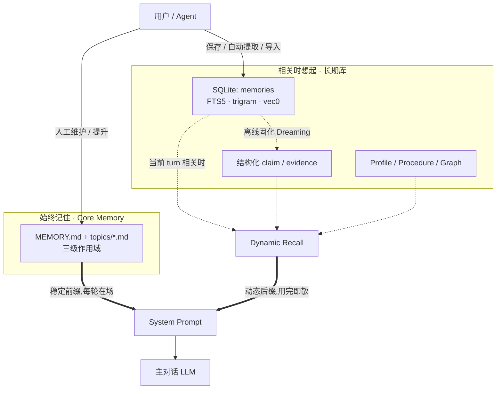
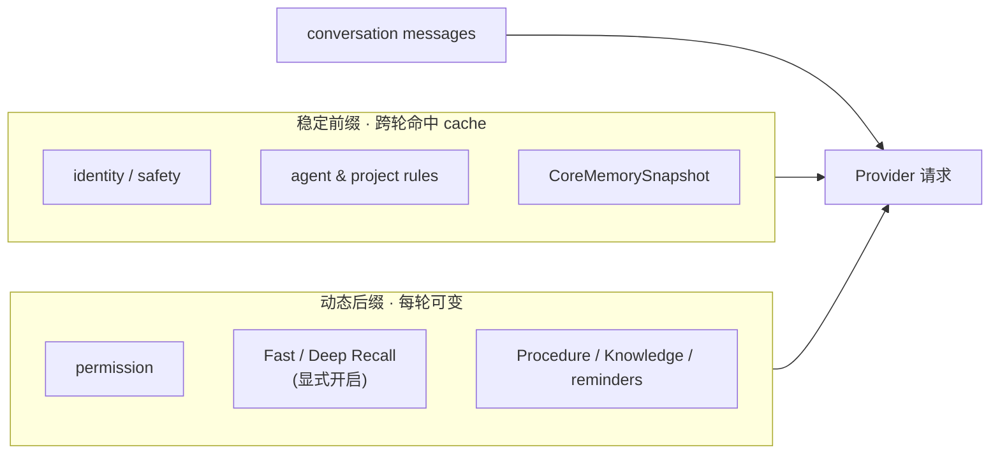
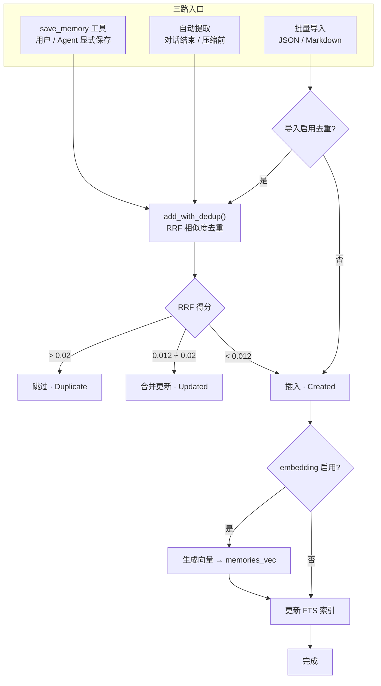
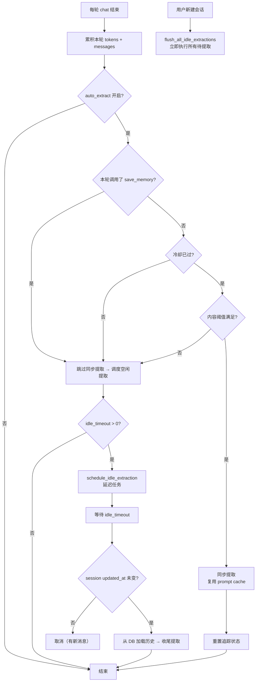
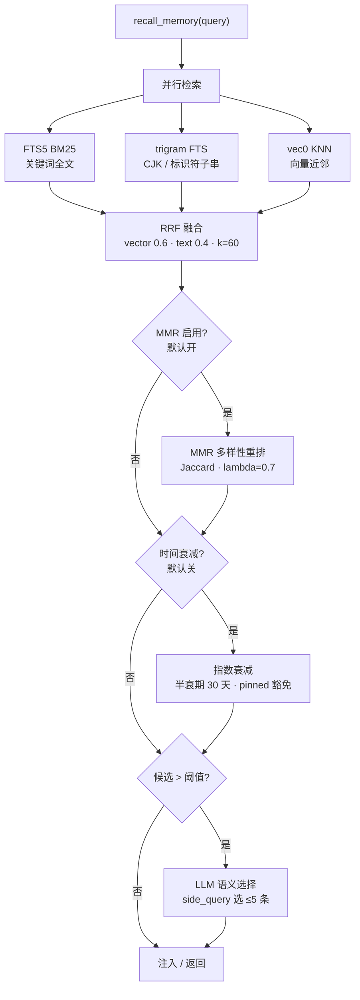

# 记忆系统架构

> 返回 [文档索引](../../README.md) | 更新时间：2026-08-23
>
> 关联源码：
> - 内核契约与长期库：[`crates/ha-core/src/memory/`](../../../crates/ha-core/src/memory/)（wire/policy、`sqlite/`、claims、Core repository、typed ledger 与 feature ports）
> - Memory 执行机：[`crates/ha-memory/src/`](../../../crates/ha-memory/src/lib.rs)（recall、extract、embedding HTTP、external providers、reembed、Dreaming/Deep Resolver）
> - Core Memory 仓库：[`memory/core_repository.rs`](../../../crates/ha-core/src/memory/core_repository.rs)
> - 配置 wire 类型：[`crates/ha-config-schema/src/memory/`](../../../crates/ha-config-schema/src/memory/)（`runtime_config.rs`、`embedding.rs`、`types.rs`、`recall_summary.rs`、`dreaming.rs`）
> - 动态召回执行：core [`agent/active_memory.rs`](../../../crates/ha-core/src/agent/active_memory.rs) + feature [`ha-memory/src/recall_planner.rs`](../../../crates/ha-memory/src/recall_planner.rs)
> - 自动提取：[`ha-memory/src/extract.rs`](../../../crates/ha-memory/src/extract.rs)
> - 本地 embedding：[`crates/ha-local-llm/src/local_embedding.rs`](../../../crates/ha-local-llm/src/local_embedding.rs)
> - 深入子系统：[Dreaming](dreaming.md) / [Prompt System](prompt-system.md) / [Session](session.md)

---

## 一、核心思想

一个长期陪伴用户的助手，需要在两种"记住"之间做取舍：

- **始终记住**：少量、稳定、用户能亲手维护的事实（"我叫什么、偏好什么、这个项目在做什么"）。它们应当**每一轮都在场**，代价是占用固定的上下文预算。
- **相关时想起**：长期沉淀的大量事实、偏好、经验和结构化断言。它们**只在与当前问题相关时**才被检索、注入，用完即散，不能常驻。

记忆系统就是围绕这条分界线建立的。它由两条互补的数据路径组成：

| 路径 | 承载什么 | 存储 | 进 Prompt 的方式 |
|---|---|---|---|
| **Core Memory** | 短小、稳定、人工维护的"始终记住" | Markdown 文件（`MEMORY.md` + `topics/*.md`） | 会话级**稳定前缀**，跨轮复用 |
| **长期库（Dynamic Recall）** | 大量长期积累、按需检索 | SQLite（FTS5 + trigram + 向量）+ 结构化 claim / Profile / Procedure / Graph | 当前 turn 的**动态后缀**，用完即散 |

### 分层所有权

Memory 遵循「内核裁决、feature 执行」：`ha-core` 保留配置/wire、scope/incognito/access verdict、Core snapshot、claim review 的用户唯一入口、SQLite/claims 类型化 store、预算与 prompt 注入契约；`ha-memory` 拥有 Fast/Deep Recall 编排、自动提取、embedding 网络实现、外部 provider、reembed job 与 Dreaming/Deep Resolver 执行机。两者通过启动期一次性注册的 retrieval/provider/maintenance ports 协作。

这条边界有三个硬约束：`ha-memory` 不取得 kernel 的裸 `sessions.db` 写连接；召回进入 prompt 前仍由 core 的 live access/incognito 判定兜底；Memory 需要 LLM/embedding 时只调用 core-owned model / embedding ports，不反向调用主 Turn，也不依赖 `ha-agent-runtime`，从 Cargo 与运行时两侧避免形成执行环。Memory Extract 是这里的刻意例外：它消费 kernel 在本次执行准入时封装的单模型 `MemoryExtractModel` 能力（含 Provider 快照），保留专用 single-model + profile-failover 路径，绝不改走 `automation::run` 的模型链。

关键的产品决策是：**长期库默认不再批量常驻 system prompt**。开机默认只注入稳定的 Core Memory；长期库的自动召回是用户显式开启的能力。即使自动召回关闭，模型仍可主动调用 `recall_memory` / `memory_get` 工具按需检索——**关闭自动召回删掉的是"每轮自动灌入"，不是"检索能力"**。



### 面向用户的三个概念

普通界面只解释三个概念；底层的 Claims、Evidence、Profile、Procedure、Graph、FTS、向量检索和 Dreaming 都完整保留在高级能力里。

| 用户概念 | 运行时对象 | Prompt 位置 | 主要存储 |
|---|---|---|---|
| **始终记住** | Core Memory | 会话级稳定前缀 | `MEMORY.md` + `topics/*.md` |
| **相关时想起** | Dynamic Recall | 当前 turn 的动态后缀 | SQLite / Claims / Profile / Procedure / Graph |
| **从对话中学习** | Learning Pipeline | 不直接注入 | memories / claims / pending candidates / evidence |

### 不可破坏的不变量

- **`pinned` 只表示动态召回优先级**，不再天然表示静态注入。只有用户明确维护或提升到 Core Memory 的内容才进入稳定前缀。
- **Snapshot 只冻结内容，不冻结权限**。Memory 主开关、Agent memory 开关、Global sharing、Incognito、Project 绑定和 session policy 每轮重新裁决；撤销资格后下一轮必须移除对应层。
- **Owner 管理面永不因 Agent memory off 而关闭**——用户始终能查看、导出、删除和修复本地资产。
- **隐私与作用域 fail-closed**：Incognito、memory off、scope 隔离和 provider 出站策略优先于一切智能召回；不确定时宁可跳过记忆，也不跨边界泄漏。

可见性规则可以概括为一条公式：

```text
本轮可见记忆 = 有资格的 Core 快照 + 有资格的 Dynamic Recall + 本轮显式对话记忆

Incognito ⇒ Core 快照 = 空 && Dynamic Recall = 空 && Learning 禁用
pending / needs_review 的内容 ⇒ 绝不进入任何 prompt / recall 路径
```

### 设计定位：本地优先的 Memory OS

记忆系统不是单一的"向量库"或"聊天摘要"功能，而是一套本地优先的记忆操作系统，把用户能看懂的记忆体验、可审计的结构化事实、跨源召回、离线固化、外部同步和高可用治理放在同一套边界内。它分六层：

| 层 | 职责 | 落点 |
|---|---|---|
| **UI** | 让普通用户看见、修改、忘记、解释"AI 记住了什么" | Memory Center、Answer Memory Chips、Review Inbox、Health / Backup / Import |
| **Policy** | 统一处理 scope、隐私、置信度、salience、时效和用户控制 | incognito / memory off fail-closed、Project > Agent > Global、Lucid Review |
| **Retrieval** | 统一跨源候选预算与可观测 trace | Retrieval Planner、`used_memory_refs` |
| **Stores** | 保存不同类型的长期资产 | Core Memory、legacy memories、claims、evidence、profiles、episodes、procedures、graph |
| **Consolidation** | 在聊天热路径外整理和治理长期记忆 | 自动提取、dedup、Dreaming、Profile synthesis、Deep Resolver |
| **Providers** | 可选连接外部记忆生态 | Mem0、Zep/Graphiti、Supermemory、Honcho、Hindsight、OpenViking、Custom Hope Sync |

贯穿六层的四条设计原则：

- **本地真相源优先**：本地 core memory、legacy memory、claim、evidence 和审计日志始终能独立工作；外部 provider 只是 additive sync，不得替代本地安全策略，也不得让远端失败阻断本地读写、召回、Dreaming 或用户纠错。
- **普通用户简单，高级用户可调**：默认界面只暴露自然动作（自动学习/先审核/仅手动/关闭、待确认、本次用了什么、忘记/修改/只在项目中使用）；专家参数折叠在高级区。
- **用户纠错权高于自动治理**：自动流程可以做确定性过期、近重复合并、高置信冲突入 Review Inbox，但永不 destructively supersede 用户事实；manual correction / user-confirmed evidence 拥有最高权重。
- **召回可解释但不反向改写 prompt**：Retrieval Planner 负责 trace 的去重、排序、预算与诊断；已注入或已被选中的 ref 不得被它重排或丢弃，candidate 也不得反向改变已构造完成的 prompt。

---

## 二、配置模型

所有产品级记忆配置统一由 `AppConfig.memory: MemoryRuntimeConfig` 承载。核心心智：**使用、Core、自动召回、深度召回、学习是五个正交开关**，绝不从某个旧字段推断整个 Memory 的启停。

```json
{
  "memory": {
    "configVersion": 2,
    "enabled": true,
    "core": {
      "enabled": true,
      "totalTokens": 1600,
      "globalTokens": 350,
      "agentTokens": 450,
      "projectTokens": 650,
      "protocolTokens": 150,
      "topicReadMaxTokens": 800
    },
    "recall": {
      "enabled": false,
      "userConfigured": false,
      "mode": "fast",
      "maxTokens": 800,
      "maxSelected": 5,
      "candidateLimit": 24,
      "timeoutMs": 100,
      "includeClaims": true,
      "includeProfile": true,
      "includeProcedures": true,
      "includeGraph": true
    },
    "deepRecall": {
      "enabled": false,
      "timeoutMs": 4500,
      "cacheTtlSecs": 60,
      "maxChars": 220,
      "budgetTokens": 512
    },
    "learning": { "mode": "smart", "promoteCoreAutomatically": false },
    "rollout": { "enabled": true, "dynamicRecall": true, "coreRepository": true, "shadowPlan": false },
    "compatibility": { "legacyStaticMemory": false }
  }
}
```

各开关语义：

- `memory.enabled=false`：关闭"模型能调用的记忆平面"（Core、动态召回、学习、Memory tools），但保留面向用户本人的管理面。
- `core.enabled=false`：只停止 Core 注入与 Core 工具，不删 Markdown 文件。
- `recall.enabled=false`（默认）：停止全局自动动态召回。Core 仍自动使用；`recall_memory` / `memory_get` 仍可由模型按需调用。
- `recall.userConfigured`：自动召回同意的持久化真相源。只有用户在 GUI/HTTP 明确切换 `recall.enabled` 时才置 `true`——保存预算等其它设置不得伪造同意。
- `deepRecall.enabled=false`：只保证不发生额外 LLM rerank，**不能绕过 `recall.enabled` 单独启动召回**。
- `learning.mode=manual`：只停止自动提取，用户显式保存仍可用。
- `promoteCoreAutomatically=false`（安全不变量）：自动流程只能建立提升建议，**不能静默改写用户维护的 Core**。

### 自动召回的 opt-in 迁移

`configVersion=2` 标记了"自动召回为显式 opt-in"这一契约。核心难点是：旧磁盘上 `recall.enabled=true` 语义**歧义**——可能是用户主动开启，也可能只是继承了旧默认值，无法直接采信为同意。升级用一次版本化迁移消歧，在首次成功读取旧配置后执行并立即持久化，判据是"是否有其它持久同意证据"：

| 旧磁盘状态 | 迁移结果 |
|---|---|
| 无 `memory` 字段 | 从旧 Extract / Budget 迁移；只有旧 `memorySelection.enabled=true`（LLM 语义选择是显式 opt-in）才视为既有召回同意 |
| 未版本化且 `recall.enabled=false` | 保持关闭 |
| 未版本化、`recall.enabled=true`、无其它同意证据 | 无法采信为主动同意，迁移为**关闭** |
| 未版本化，但有 `userConfigured=true` / `memorySelection.enabled=true` / Deep enabled / mode=deep | 保留既有选择，写 `userConfigured=true` |
| `configVersion>=2` | 原样保留，不重复猜测 |

歧义无法可靠区分时采取**隐私/Token 成本优先的 fail-closed**：一次性迁移为关闭，但能力、数据与工具全部保留，用户可在 GUI 重开。持久化失败也不丢弃已解析配置：当前进程继续用迁移后的内存视图，下次启动重试。

`rollout.enabled=false` 是完整 V1 回滚；`compatibility.legacyStaticMemory=true` 只恢复旧的静态段（SQLite / Profile / Pinned），不改变 Core 文件和底层资产。

### Core 预算解析

用户在普通 UI 只看到一个 `totalTokens`（精简 `1000` / 平衡 `1600` / 丰富 `2400` 三档 + 自定义），可在 `[128, 16384]` 内调整。Global / Agent / Project / protocol / topic-read 的细分预算收在高级区。`2400` 是**推荐区间上界**而非硬限，超过只警告 prompt cache / TTFT 成本；`16384` 是防止 raw config 数量级错误的 emergency guard。

本轮实际生效的 Core 预算由 `CoreMemoryBudgetStatus` 统一解析——已知具体聊天模型时，最多用其窗口的 10%：

```text
modelSafetyLimit = clamp(contextWindow / 10, 256, 16384)
effectiveTokens  = min(totalTokens, modelSafetyLimit, 16384)
```

模型上下文未知时只应用 emergency guard。**临时裁剪绝不回写用户配置**。Settings 通过 `get_memory_core_budget_status`（Tauri）/ `GET /api/config/memory-core-budget-status`（HTTP）展示全局默认模型的"配置值 / 有效值"；会话级模型覆盖与 failover 的真实有效值进入 `StaticMemoryContextManifest` 和 `/context`。

> `core.hardMaxTokens`（默认 `2400`）只是旧配置反序列化的兼容镜像，UI 不展示；归一化时保证它 `>= totalTokens`，绝不用来压低用户唯一可见的预算。

---

## 三、Core Memory：三级作用域索引 + 主题文件

Core Memory 是"始终记住"的载体。三个作用域共用同一套仓库逻辑（`memory::core_repository` 模块），canonical 索引文件名统一为大写 `MEMORY.md`：

```text
~/.hope-agent/memory/MEMORY.md                        # Global
~/.hope-agent/agents/{agentId}/memory/MEMORY.md       # Agent
~/.hope-agent/projects/{projectId}/memory/MEMORY.md   # Project
```

细节正文放在各自的 `topics/*.md`，只由 `core_memory` / `project_memory` 工具**按需读取**。这是一条重要的性能设计：**主题正文变化不改变稳定前缀，只有索引内容变化才会合理让 cache 失效**。索引受 200 行 / 25KB 的文件安全上限约束，但真正进入 Prompt 的大小由 token budget 决定。

**预算分配**：三层先各拿到自己的预算，未用额度进入共享池，再按 `Project > Agent > Global` 分配；裁剪必须以完整 Markdown 条目为边界，用保守 token 上界。

**大小写迁移与冲突**：所有 loader、tool、owner API、import、backup、restore 都必须经 repository，禁止自拼路径或做 case-only rename。迁移使用全局 OS 独占锁、原子写、回读 BLAKE3 校验，并写 `memory/migrations/core-memory-v2.json` manifest。当 canonical（大写）与 legacy（小写）两边相对 manifest 都发生变化且不同时，标记 `conflict` 并停止自动覆盖，等待 owner 选择 canonical / legacy / merged；快照缺失时两边都不进 Prompt。canonical 写成功即为提交点，mirror 或 manifest 失败只能标 stale 后续修复，禁止反向覆盖已成功的新内容。

### 会话快照、Prompt 与 Token Cache

`CoreMemorySnapshot` 是**会话语义状态，不是可随意淘汰的性能缓存**。首个 turn 捕获有资格的 Global / Agent / Project 索引、hash、迁移状态和 token；同一进程内后续 API round 和 turn 复用同一快照。只有下列事件才使其失效：显式 `core_memory.reload`、Tier 3 compaction、session 清理、会话的 Agent/Project/Global-sharing 资格变化、owner 全量 restore、进程重启。

这条设计带来一个非显然但重要的行为：**用户在当前会话写 Core 时，文件立即持久化、工具结果当轮明示成功，但现有静态快照默认保持不变**——要等 reload、compact 或新会话后才进固定前缀。这样后台学习、Dreaming、Profile 更新和其它会话的 Core 写入都不会破坏当前会话的稳定 fingerprint（进而废掉 prompt cache）。

Prompt 每轮可以重新构造，但结果必须按固定顺序和 canonical 序列化保持**字节稳定**：



动态召回**不得重新拼回 stable system string**。Provider adapter 只负责把同一份 stable/dynamic 语义渲染成 Anthropic block / OpenAI item / Codex wire shape；failover 重新渲染，不串用格式。Prompt Cache 只减少重复计算、费用和 TTFT，**不减少上下文窗口占用**——`/context` 必须同时显示实际 context input 与 cache read，不能用 cache hit 掩盖过大的输入。

---

## 四、数据模型与存储后端

### MemoryEntry

长期库里每条 legacy memory 是一个 `MemoryEntry`（[`memory/types.rs`](../../../crates/ha-core/src/memory/types.rs)）：

| 字段 | 类型 | 说明 |
|------|------|------|
| `id` | `i64` | 自增主键 |
| `memory_type` | `MemoryType` | `User` / `Feedback` / `Project` / `Reference` |
| `scope` | `MemoryScope` | `Global` / `Agent { id }` / `Project { id }` |
| `content` | `String` | 记忆正文 |
| `tags` | `Vec<String>` | 标签，JSON 序列化存储 |
| `source` | `String` | `"user"`（手动）/ `"auto"`（提取）/ `"import"`（导入） |
| `source_session_id` | `Option<String>` | 来源会话 ID |
| `pinned` | `bool` | 提高动态召回优先级并豁免时间衰减；只有 legacy static rollback 才把它当静态注入优先级 |
| `created_at` / `updated_at` | `String` | 时间戳 |
| `relevance_score` | `Option<f32>` | 检索时填充，**不持久化** |
| `retrieval_evidence` | `Option<MemoryRetrievalEvidence>` | 检索时的绝对证据（`lexical_match` + `semantic_similarity`），用于区分"精确命中"与"任意最近邻"；不持久化、不出现在普通 owner 列表 |
| `attachment_path` / `attachment_mime` | `Option<String>` | 附件绝对路径与 MIME，附件存 `~/.hope-agent/memory_attachments/` |

> `retrieval_evidence` 是 RRF 得分之外的补充：RRF 分只在一个结果集内相对，无法证明"最佳向量邻居"真的与查询相关，所以额外携带绝对的词法命中/语义相似度证据。

### SQLite 表结构

主表 `memories`（附件列与 Project scope 列由启动期迁移追加）：

```sql
CREATE TABLE memories (
    id INTEGER PRIMARY KEY AUTOINCREMENT,
    memory_type TEXT NOT NULL DEFAULT 'user',
    scope_type TEXT NOT NULL DEFAULT 'global',
    scope_agent_id TEXT,
    content TEXT NOT NULL,
    tags TEXT NOT NULL DEFAULT '[]',
    source TEXT NOT NULL DEFAULT 'user',
    source_session_id TEXT,
    embedding BLOB,
    embedding_signature TEXT,     -- 记录向量由哪个 embedding 模型产出，防新旧维度混用
    pinned INTEGER NOT NULL DEFAULT 0,
    created_at TEXT NOT NULL,
    updated_at TEXT NOT NULL
    -- 迁移追加：scope_project_id TEXT, attachment_path TEXT, attachment_mime TEXT
);
```

索引：`idx_memories_pinned`（`pinned DESC, updated_at DESC`）、`idx_memories_scope`（`scope_type, scope_agent_id`）、`idx_memories_scope_project`、`idx_memories_type`、`idx_memories_source`、`idx_memories_updated`、`idx_memories_embedding_signature`。

围绕主表还有多个可重建的检索索引：

| 表 | 类型 | 作用 |
|---|---|---|
| `memories_fts` | FTS5 `tokenize='unicode61'` | 关键词全文（`content` / `tags`），经 `AFTER INSERT/UPDATE/DELETE` 触发器与主表同步 |
| `memories_literal_fts` | FTS5 `tokenize='trigram'` | 字面/子串命中，覆盖中文连续片段和代码标识符中段；可从主表重建的 shadow index，**不是真相源** |
| `memories_vec` | sqlite-vec `vec0(embedding float[N])` | 向量 ANN 检索，维度 N 由当前 embedding provider 决定 |
| `embedding_cache` | 普通表 | 按 `(hash, provider, model, signature)` 联合主键缓存 embedding，避免重复计算；超过 `max_entries`（默认 10000）自动清理最旧条目 |

结构化 claim 有一套同构的索引（`memory_claims_fts` / `memory_claims_literal_fts` / `memory_claims_vec` / `memory_evidence_fts`），由对应的 rebuild 动作维护。

### 三级作用域与项目隔离

作用域优先级从高到低：

| 作用域 | 枚举值 | SQL 列 | 可见范围 |
|--------|--------|--------|---------|
| **Project** | `Project { id }` | `scope_type='project'`, `scope_project_id='{id}'` | 该项目下所有会话 |
| **Agent** | `Agent { id }` | `scope_type='agent'`, `scope_agent_id='{id}'` | 使用该 Agent 的所有会话 |
| **Global** | `Global` | `scope_type='global'` | 所有会话 |

Project scope 比 Agent scope 更窄，存在的意义是：**会话属于某项目时，项目知识优先，且不会泄漏到用同一 Agent 的其它项目**。隔离保证：

- `recall_memory` / `save_memory` 工具经 `scope_where(agent_id)` 查询，**有意排除 Project scope**，防止项目记忆在无关会话中泄漏。
- 项目记忆仅通过显式 `MemoryScope::Project { id }` 或 `load_prompt_candidates_with_project()` 访问；`save_memory` 的 `scope="project"` 从当前会话 `session.project_id` 自动解析。

`MemoryBackend` trait 另有 owner-only 的只读 `health()`（SQLite quick_check、索引缺口、embedding 覆盖、claim graph 孤儿、Dreaming stale state）和保守 `repair(action)`——**实现必须显式 opt-in，绝不让模型能调用的工具面直接触发**。

### 并发模型与异步 IO 红线

SQLite 后端用一写多读的连接布局：

- **1 个写连接**（`Mutex<Connection>`）：独占写，同时是读连接的 fallback。
- **4 个读连接**（`READ_POOL_SIZE = 4`）：并发只读查询，`AtomicUsize` 轮询分配，锁竞争时退化到写连接。
- **WAL 模式**：读写互不阻塞。

`MemoryBackend` / claims / Dreaming store 都是**同步 rusqlite API**，因此任何 async 上下文（chat、tool、Tauri command、HTTP handler、后台调度器）调用它们都必须经 `crate::blocking::run_blocking` / `spawn_blocking`。配置文件、`MEMORY.md`、Dream Diary、Provider 凭据/账本和本地 embedding provider 构建也同属 blocking IO。

有两条容易踩的锁顺序红线：

- **embedding cache 复用 memory backend 的 reader/writer**。`add` / `update` 必须**先**生成 embedding、完成 cache 读写，**再**取 memory writer；`search` 必须先生成 query embedding 再取 reader。持有 writer 时重入 cache writer 会**确定性自锁**；持有 reader 时再申请 cache reader 会**耗尽 4-reader 池死锁**。
- **检索增强共用有界 blocking 槽位**（Active Memory / Procedure / graph trace / Knowledge recall / LLM 选择的本地候选读取）。槽位由底层 blocking closure 持有，上层 timeout 后未结束的请求**仍占槽**；新请求拿不到槽立即以 `retrieval_busy` 或空增强降级，不堆积不可取消的 `spawn_blocking`。

检索增强一律 **fail-soft**：超时只丢当前增强层并写 trace，不阻断主回答。热路径各项超时见[附录：硬编码参数](#附录-b硬编码参数)。

---

## 五、三路创建

记忆有三种进入长期库的方式，共享同一套去重逻辑：



去重阈值（`DedupConfig`）：

| RRF 得分范围 | 行为 |
|-------------|------|
| `> threshold_high`（默认 `0.02`） | **跳过**：判定重复，返回 `Duplicate { existing_id, score }` |
| `threshold_merge..threshold_high`（默认 `0.012..0.02`） | **合并**：更新已有记忆内容，返回 `Updated { id }` |
| `< threshold_merge` | **插入**：创建新记忆，返回 `Created { id }` |

### 1. save_memory 工具

用户或 Agent 通过 `save_memory` 显式保存，支持 `scope` 参数（`"global"` / `"agent"` / `"project"`）。省略 `scope` 时：项目会话默认写 Project scope，非项目会话默认写当前 Agent（只有完整 V1 rollback 才保持旧 Global 默认）。`scope="project"` 从当前会话 live `session.project_id` 解析，无项目上下文报错；Global 还要求当前 Agent 允许 shared。写入前先检查 session contribute policy，再去重。

### 2. 自动提取

Agent 在两个时机自动提取记忆：

- **Tier 3 压缩前**（`flush_before_compact`）：在 LLM 摘要压缩对话历史之前，先抢救有价值的记忆。
- **阈值触发**：对话过程中，冷却时间已过且内容阈值满足时，在 assistant 最终消息落库后**后台调度**提取（不阻塞聊天流结束）。

触发采用**冷却 + 阈值双层**（自上次提取以来需同时满足）：

- 冷却保护：`elapsed ≥ extract_time_threshold_secs`（默认 300s）。
- 内容触发（任一满足）：`tokens ≥ extract_token_threshold`（默认 8000）或 `messages ≥ extract_message_threshold`（默认 10）。

另有两条保护：检测到当轮已调用 `save_memory` / `update_core_memory` 则**跳过自动提取**（互斥）；阈值因门控未满足而跳过时，调度延迟任务（默认 30 分钟），会话空闲超时后从 DB 加载历史执行**收尾提取**，新建会话时立即 flush 所有待提取的空闲会话。

侧聊的继承历史只用于对话，不作为新的学习证据。阈值与空闲提取从持久账本读取最近 6 条 `is_side_snapshot=0` 的用户/助手正文；压缩前提取严格使用调用方的丢弃片段，并按内部 `_ha_side_snapshot` 来源标记排除继承项，不能替换为最近消息而读到保留区。该标记在格式转换与包含继承内容的摘要中保留，发给模型前剥离。旧侧聊无可靠来源版本时跳过压缩前提取，但不影响自身账本的空闲提取。只有继承内容时不调用提取模型，普通会话路径不变。

**内容感知作用域**是自动提取的关键红线：项目会话的 project fact 写 `MemoryScope::Project`；User / Feedback 及非项目 Reference 默认写当前 Agent；**非项目会话提取出的 project fact 进 `pending_memory_candidates(reason=project_scope_missing)`，绝不能伪装成 Agent 记忆**。



### 3. 导入

支持三类批量导入入口：**JSON**（`NewMemory` 数组 / `{memories|items|entries: [...]}` 包装 / 单条 content-like 对象，`content|text|memory|fact` 均可作正文）、**Markdown**（Hope Agent 自有导出格式，兼容常见 `MEMORY.md` / `USER.md` 风格的 bullet、编号、blockquote、段落和内联 `Preference:` / `Project:` / `Reference:` 前缀）、**Auto**（先试 JSON、失败回退 Markdown，用于"从其它 AI 粘贴"入口）。

导入可选启用去重，返回 `ImportResult { created, skipped_duplicate, failed, errors }`。所有写入前必须走只读 `memory_import_preview` / `POST /api/memory/import/preview`：复用同一解析链，只返回候选数、type/scope 分布、bounded samples、dedup 预估和 issues，**不写数据库**。真正写入走 `memory_import`，且只在当前 preview `valid=true` 时放行。外部 Markdown 导入统一落普通 legacy memory（`source=import`），不绕过 dedup / history / learning-off 提示。

---

## 六、混合检索引擎

当模型调用 `recall_memory` 或自动召回被触发时，检索走一条多路并行、RRF 融合的流水线：



### 多路并行检索

1. **FTS5 BM25**：基于 `memories_fts` 的关键词全文，按 BM25 排序。
2. **vec0 ANN**：基于 `memories_vec` 的向量近邻，需 embedding provider 已配置。
3. **trigram 字面检索**：主 FTS 无命中且 query ≥ 3 字符时，查 trigram shadow index，覆盖 CJK 连续片段和代码标识符中段；query 短于 3 字符或 shadow 不可用时才退回 bounded `LIKE`。

**查询期硬边界**：`limit=0` 直接返回空；非零 `limit` 最大 200，单路候选最大 600。主 FTS / trigram 必须由虚拟表先产出 bounded rowid，再 JOIN 真相表做 scope / status / type / source 过滤；claim 路径用有意的 `CROSS JOIN` 固定虚拟表为驱动表，禁止 SQLite 从 broad status index 开始逐行探测 FTS——**这个连接顺序是 5 万条规模 p95 的红线，不是样式选择**。

### RRF 融合排序

```text
rrf_score = vector_weight / (k + rank_vec)
          + text_weight   / (k + rank_fts)
          + text_weight*0.5 / (k + rank_literal)
```

默认 `vector_weight=0.6`、`text_weight=0.4`、`k=60`（k 越大各排名权重越均匀）。

两个自适应机制补齐纯权重的短板：

- **`adaptive_lexical_rrf_weights`**：当词法臂只返回不超过最终 `limit` 的稀疏精确结果时，给该臂加一个 precision boost，保证默认 0.6 向量权重不会把唯一精确标识符或中文片段挤出 Top-K；广泛词法命中仍用用户原始权重。legacy memory 与 claim 共用这一函数。
- **vec0 overfetch**：向量路径先做不带业务过滤的 bounded KNN overfetch（默认候选 8 倍、最多 2000），再 JOIN 真相表校验 embedding signature、scope 等；稀有 scope 在 overfetch 窗口中不足 `min(8, limit)` 时才退回 `rowid IN (...)` 正确性路径。快速路径**不得**以延迟优化为由削弱 scope 隔离或 signature 安全。

### MMR 多样性重排与时间衰减

- **MMR**（默认开）：对 RRF 结果做 Maximal Marginal Relevance 重排减少冗余，用 Jaccard 系数算文本相似度，`lambda`（默认 0.7）权衡相关性与多样性（0=最大多样性，1=最大相关性）。
- **时间衰减**（默认关）：指数衰减，半衰期 `half_life_days`（默认 30 天）；**pinned 记忆豁免**，始终保持原始得分。

### 真实规模回归

`pnpm memory:benchmark` 跑 release-mode、隔离数据目录的确定性基准，默认各写 50,000 条 legacy memory 与 50,000 条 structured claim，建 8 维可判定向量，**不读写用户真实数据**。它覆盖四类 query（唯一英文 key、中文中段、公共词、纯语义同义词），报告 Recall/Precision@10、p50/p95、建库耗时和 DB 大小。质量门禁按 recall/precision 阻断；p95 250ms 只是 advisory 指标、不阻断（`suite.json` 里 `latencyBlocking=false` / `advisoryP95Ms=250`）。这套基准正是为了确定性地捕获前述 claim JOIN 性能塌方而存在，不能用纯小样本测试替代。

---

## 七、Embedding 配置模型

向量检索由两组独立配置驱动：

- `AppConfig.embedding_models: Vec<EmbeddingModelConfig>` — 用户已配置的多个 embedding 模型。
- `AppConfig.memory_embedding: EmbeddingSelection` — 当前给"记忆"用哪个模型。

这是**多模型显式配置 + 用户选活跃模型**的心智，没有自动优先级挑选。

### EmbeddingModelConfig

每条配置一个独立模型实例：

| 字段 | 类型 | 说明 |
|---|---|---|
| `id` | `String` | 配置 id（被 `memory_embedding.model_config_id` 引用） |
| `name` | `String` | 显示名 |
| `provider_type` | `EmbeddingProviderType` | **只有 `OpenaiCompatible` / `Google` 两类** |
| `api_base_url` / `api_key` / `api_model` / `api_dimensions` | `Option<…>` | provider 各自配置 |
| `source` | `Option<String>` | 创建自哪个预设模板（GUI 一键安装用于回溯） |

`EmbeddingProviderType` 只有两个变体——OpenAI `/v1/embeddings` 兼容（覆盖 OpenAI / Jina / Cohere / SiliconFlow / Voyage / Mistral / Ollama 等）和 Google Gemini（独立格式）。**本地 embedding 走"Ollama + OpenAI 兼容端点"**，没有内嵌 ONNX/fastembed 的独立 provider；Voyage / Mistral 也只是 `OpenaiCompatible` 下的预设模板，而非独立 ProviderType。

### EmbeddingSelection

```rust
pub struct EmbeddingSelection {
    pub enabled: bool,                            // 总开关
    pub model_config_id: Option<String>,          // 引用 embedding_models[].id
    pub active_signature: Option<String>,         // 当前活跃模型的 signature
    pub last_reembedded_signature: Option<String>,// 上次完成重嵌入的 signature，驱动 needsReembed 红点
}
```

`set_memory_embedding_default(id)` 是切换活跃模型的唯一入口：① 写 `model_config_id`；② `prune_embedding_cache_to_signature()` 清理 cache（防旧 signature 命中）；③ 当 `active_signature != last_reembedded_signature` 时点亮 `needsReembed`（前端提示"模型变了，要不要重建向量"）。

### 嵌入用途与签名 v2

`EmbeddingProvider` 的所有入口都必须显式携带 `EmbeddingPurpose::{Query, Document, Symmetric}`，不得再按单条/批量输入数量推断用途。记忆与 claim 的单条新增、更新及全量重嵌均使用 `Document`，检索使用 `Query`，相似度/聚类路径才使用 `Symmetric`。Voyage、Jina、Cohere 和 Google 的 task、input type 或官方前缀由 provider adapter 按该用途统一编译。

嵌入签名使用 `hope-embedding-signature-v2`，覆盖 provider、endpoint、model、维度、provider 用途语义版本与具体 purpose；缓存键使用相同的 purpose-specific 签名，同文本的查询与文档向量不会互相命中。活跃库签名恒为 `Document` 签名；启动时遇到 v1 或其他旧签名，立即把旧向量视为不匹配，Primary 再启动可取消、幂等的全量重嵌。只有整轮成功才写 `last_reembedded_signature`，因此中断或重启不会把部分迁移误报为完成，也不会把 v1/v2 向量混合返回。

### 内建预设模板

`embedding_model_templates()`（[`memory/embedding/config.rs`](../../../crates/ha-core/src/memory/embedding/config.rs)）返回内建模板，每个模板可含多个模型，**默认取列表第一个**：

| 模板 | provider_type | 默认模型 | 默认维度 |
|---|---|---|---|
| OpenAI | OpenaiCompatible | text-embedding-3-small | 1536 |
| Google Gemini | Google | gemini-embedding-2 | 3072 |
| Jina AI | OpenaiCompatible | jina-embeddings-v5-text-small | 1024 |
| Cohere | OpenaiCompatible | embed-v4.0 | 1536 |
| SiliconFlow | OpenaiCompatible | BAAI/bge-m3 | 1024 |
| Voyage AI | OpenaiCompatible | voyage-4-large | 1024 |
| Mistral | OpenaiCompatible | mistral-embed | 1024 |
| Ollama | OpenaiCompatible | embeddinggemma:300m | 768 |

各模板还带若干备选模型（如 Google 含 gemini-embedding-2 的 3072/1536/768 变体与 gemini-embedding-001；SiliconFlow 含 Qwen3-Embedding 系列；Voyage 含 voyage-4/voyage-code-3 等）。

### 本地模型（Ollama）

本地 embedding 通过 Ollama 的 `/v1/embeddings` 提供，候选目录 `embedding_model_catalog()` 在 [`ha-local-llm/src/local_embedding.rs`](../../../crates/ha-local-llm/src/local_embedding.rs)：

| 模型 ID | 名称 | 维度 | 大小 | 上下文 | 语言 | 推荐 |
|---|---|---|---|---|---|---|
| `embeddinggemma:300m` | EmbeddingGemma 300M | 768 | 622MB | 2048 | 100+ 语言 + 代码 | ✅ |
| `mxbai-embed-large:335m` | Mxbai Embed Large 335M | 1024 | 670MB | 512 | 英文 | |
| `qwen3-embedding:0.6b` | Qwen3 Embedding 0.6B | 1024 | 639MB | 32768 | 100+ 语言 + 代码 | |
| `nomic-embed-text:v1.5` | Nomic Embed Text v1.5 | 768 | 274MB | 8192 | 英文 | |
| `all-minilm:22m` | All MiniLM 22M | 384 | 46MB | 512 | 英文 | |

下载/加载经 ha-local-llm 走 kernel `local_model_jobs.rs` 后台任务体系（详见 [本地模型加载](local-model-loading.md)），UI 看到的是与模型下载同体系的进度条 + 取消。

### 多模态

- **Gemini** 支持图片和音频 embedding（`embed_multimodal()`）；其它 provider fallback 为文本描述（`label` 字段）embedding。
- 支持图片格式：jpg / jpeg / png / webp / gif / heic / heif；音频：mp3 / wav / ogg / opus / m4a / aac / flac。
- 最大文件：`max_file_bytes`（默认 10MB）。

### 向量重建后台任务

切换活跃 embedding 模型后，存量向量按旧维度/旧 signature 计算，需按新模型批量重建。`start_memory_reembed_job(model_config_id, mode)` 包成 `LocalModelJobKind::MemoryReembed` 走统一后台任务体系，两种模式：

| 模式（`ReembedMode`） | 行为 | 重建期搜索 |
|---|---|---|
| `KeepExisting`（默认） | 原行原地覆写 `embedding`，按 batch 推进 | ✅ 旧向量仍可用，不中断 |
| `DeleteAll` | 启动先 `clear_all_embeddings()` 全清再填充 | ❌ 重建期纯 FTS5、不命中 vec0 |

`DeleteAll` 适用"模型升级 + 维度变化 + 不能容忍新旧混存"的场景。**并发不变量：任意时刻最多一个 `MemoryReembed` 处于非终态**——新 spawn 前先 `cancel_job` 收尾已有 active，让旧 runner 在下个 batch boundary 退出，SQLite 写连接 mutex 串行化重叠。成功完成时写 `last_reembedded_signature = current_model.signature()`，前端据此判定红点是否消失。

Phase 常量 `PHASE_REEMBED_KEEP="reembed-keep"` / `PHASE_REEMBED_FRESH="reembed-fresh"` 与前端 [`src/types/local-model-jobs.ts`](../../../src/types/local-model-jobs.ts) 的 `PHASE_KEY` 一一对应，drift 会让本地化 phase label 降级为原始字符串。

---

## 八、动态召回（Dynamic Recall / Deep Recall）

自动动态召回的唯一产品编排入口是 `ha-memory::recall_planner`（自由函数 `plan_fast_recall`，经 core `MemoryRetrievalRuntime` port 调用）。默认 `recall.enabled=false` 且旧 Agent Active Memory 未启用时：每个 user turn 只用会话固定的 Core 快照，不查 SQLite memory / claim / Profile / Procedure / Graph；模型仍可自主调 `recall_memory` / `memory_get`。

用户显式开启全局自动召回后，每个非空 user turn 走一条确定性流程：

1. **零 LLM 硬策略 gate**：只裁决 Incognito、global / Agent / session policy、有效 recall opt-in、空输入和预算。它**不维护任何"寒暄/感谢/继续"短语表**，也不猜某句话是否"值得召回"。
2. **并行读取候选**：当前 scope 内的 legacy memory、effective-active claim、按 profile / procedure intent 展开的 Profile / Procedure / Graph 辅助候选。
3. **过滤**：淘汰过期、superseded、archived、`needs_review`、跨 scope、缺最低检索证据的候选。
4. **确定性排序**：按检索证据、`Project > Agent > Global`、intent、confidence、salience、用户显式优先级；对 memory / claim / profile 投影做 canonical-content 去重；tie-break 不依赖 HashMap 或异步完成顺序。
5. **预算裁剪**：最多保留 24 个候选、选 5 条、渲染 ≤800 token，包在 `<untrusted_external_data>` 中。
6. **fail-soft**：timeout / busy / embedding 或外部 provider 失败均只丢当前增强层，不阻断主回答。

**Fast vs Deep**：Fast Recall 是默认模式，纯本地确定性检索，不调 LLM；检索证据不足或无候选时注入 0 条。Deep Recall（默认关）只对已完成实时资格过滤的 Fast shortlist 做一次 bounded side query 做 rerank / distill，默认 timeout 4.5s、TTL 60s、摘要 220 字符、预算 512 token。无效响应/超时/失败回退原始 Fast Top-K；**有效的空选择表示模型确认无需注入，绝不能回退为全量静态记忆**。缓存按 session 与候选上下文隔离，Incognito 不复用跨会话缓存。

无论 Fast/Deep，召回结果都必须位于稳定 Core 快照之后的**独立动态 cache block**；它的变化只能使动态后缀失效，不改变 stable fingerprint。Fast/Deep 都是只读路径——**不写记忆、不主动提取**，写入只由显式 Memory tools 或 Learning Pipeline 完成。

Memory Center 的"自动召回相关记忆"主开关控制所有 Agent 的默认 Fast Recall（默认关，UI 必须说明关闭时仍自动用 Core、模型仍可按需调工具）；"深度召回"是次级开关，明确显示额外延迟/token 成本，仅主开关开启时可用。

> **兼容窗口**：旧 `ActiveMemoryConfig.enabled=true` 是 per-agent 的 LLM 主动召回入口。V2 保留其反序列化、Agent override 和 rollback 执行链；在一个 minor 的兼容窗口内，已显式开启的旧 per-agent 配置继续**只为该 Agent** 启用 Fast + Deep Recall，配置迁移**不得**扩大为其它 Agent 的全局同意。旧 `memorySelection` 的 LLM 语义选择在 V2 里语义映射到 `deepRecall`（Fast shortlist 之上的可选 rerank），失败必须保留 Fast Top-K，禁止沿用旧实现的"全量静态注入"回退；只有 `rollout.enabled=false` 才执行旧选择链。该链的选择结果/全量 fallback 进入独立 `legacy_memory` 动态 user-data slot，不替换 query-specific Active Memory，也不重拼 stable `# Memory`；`used_memory_refs` 只记录实际通过 section/总预算送入成功 Provider round 的 legacy rows，并以 `role=selected|injected` 区分。同一 turn 的 Plan resync 可以替换下一 round 的动态 slot，但 durable refs 必须按首次提交顺序累计，不能抹掉早先 round 已进入模型的事实。完整设计见 [`active_memory.rs`](../../../crates/ha-core/src/agent/active_memory.rs) 与 [dreaming.md](dreaming.md)。

### 召回摘要（Recall Summary）

混合检索可能一次返回十几条相关记忆全文，全塞进 prompt 既费 token 又冗长。Recall Summary（顶层 `AppConfig.recall_summary`，**默认关**）在命中较多时再走一次 bounded side_query，把那批记忆**压成一段 ≤400 字符的洞察段落**再注入。

- **触发**：命中数 ≥ `min_hits`（默认 3）、总字符 > 预算、且 `recall_summary.enabled=true`。
- **模型解析**：经 `automation::run`（purpose `recall_summary`）执行——`recall_summary.model_override` 非空用它，否则落 `function_models.automation` → 聊天全局默认模型，带跨模型降级重试。失败/超时/输出无效则回退为原始命中列表拼接（**不丢记忆**）。

它与 LLM 语义选择独立、可叠加：语义选择输出"哪几条最相关的 id"（仍逐条注入），Recall Summary 输出"一段合成摘要"（注入一段）。

### 反省式提取（facts + profile）

主动提取除了抽取事实，还要更新用户画像。两件事分两次 side_query 会 token 翻倍且时序复杂，因此 `COMBINED_EXTRACT_PROMPT` 让**一次** side_query 同时返回：

```jsonc
{ "facts": [{ "type": "...", "content": "..." }],
  "profile": { "summary": "...", "preferences": [...] } }
```

`facts` 走 `add_with_dedup` 入库；`profile` 渲染成按回合的 `## User Profile` 数据段，经 `<hope_round_data source="user_profile">` 进入 user role，不进入稳定 system（仍刻意不叫 "About You"，避免角色混淆）。由 `enable_reflection`（默认 true，可 per-agent 覆盖）控制，关闭时回退到只抽 facts。

---

## 九、学习管线、Scope 路由与会话控制

学习模式只决定**新资产如何产生**，不决定是否使用已有记忆：

| 模式 | 自动提取 | 写入动态库 | Review | 自动改 Core |
|---|---:|---:|---:|---:|
| `smart` | 是 | 确定 scope 的普通候选可写 | 冲突/敏感/scope 不确定 | 否，只提议 |
| `review_first` | 是 | 批准后 | 所有自动 memory / claim 候选 | 否 |
| `manual` | 否 | 仅显式保存 | 视显式操作 | 仅显式操作 |

`关闭` 不是第四种 learning mode，而是独立的 `memory.enabled=false` 主开关：关闭走二次确认，Memory Overview 置顶显示"长期记忆已暂停"横幅，但面向用户本人的管理界面（查看/导出/删除/导入/备份恢复）仍可用（UI 必须说明这些操作不会自动重新启用 Agent 使用记忆）。

**Review-first / scope 缺失 / 敏感 / 冲突 / Core promotion proposal 共用 pending inbox**；pending 内容在批准前不参与普通召回、Profile 合成或 Prompt。

Settings 的"从对话中学习"canonical 值是 `memory.learning.mode`，在兼容窗口内保存时镜像旧 `memoryExtract` 字段（`smart` → `autoExtract=true, flushBeforeCompact=true, reviewFirst=false`；`review_first` → 加 `reviewFirst=true`；`manual` → `autoExtract` / `flushBeforeCompact` 同时关）。Agent 模式只写 per-agent `autoExtract` + `flushBeforeCompact` override，避免继承全局压缩前提取而绕过"仅手动"；`enabled` / `reviewFirst` / `extractClaims` 仍是全局结构化记忆策略。

### session_memory_policy

每个会话独立保存两个 `inherit | allow | deny` 值：

- `useMemories=deny`：不加载 Core、不做动态召回、不开放读取类 Memory 工具；**不删除**已有资产。
- `contributeToMemories=deny`：跳过自动提取、Dreaming source 和 Profile synthesis；不影响读取。
- **Incognito 强制两者为 deny**，session override 不得放宽。
- 找不到 session 或 policy DB 时 fail closed；`allow` 仍不能绕过 global / Agent / scope / permission gate。

---

## 十、统一工具、观测与 Retrieval Planner

### Core 工具

`core_memory` 是三层 Core 的 canonical 工具，覆盖 index get/append/replace、topic list/read/search/write/delete/rebuild、dynamic memory/claim promotion 和 session reload。`update_core_memory` 与 `project_memory` 只是兼容入口；权限、实时 scope、stale-write、审计和 hook 仍以 canonical action 裁决，**Project scope 只能从 live session 解析，模型不能传任意 project id**。

### MemoryContextManifest（每轮观测）

每轮 `MemoryContextManifest` 接入 `RoundTokenManifest`，记录 session hash、Provider/model/round、学习与 session policy、Core snapshot fingerprint、各 scope token 与迁移状态、recall mode/intent/skip reason、候选/选中计数、延迟、stable/dynamic fingerprint 和 scope rejection counts；**绝不记录记忆原文、用户 query、embedding 或 evidence quote**。`/context`、回答下方 Memory Trace 和诊断 UI 消费同一份事实。

### Retrieval Planner 与跨源排序

Retrieval Planner 是统一的可观测读路径与跨源候选预算器。它**不替代**各来源已有的检索、prompt 构造、预算裁剪或权限裁决：**已经进入 prompt 的 `role=injected / selected` ref 必须原样保留，只有 `candidate / considered` 集合参与排序与裁剪**。最终 assistant message 的 `attachments_meta` 写入三份元数据：

- `active_memory`：兼容旧 UI 的 Active Memory recall trace。
- `used_memory_refs`：本轮实际注入或被考虑过的来源 refs，供 Answer Memory Chips 定位和纠错。
- `retrieval_planner`：本轮各 retrieval layer 的状态账本（`rankingVersion=source_fusion_v2`）。

`used_memory_refs` 写入前经可解释预算裁剪：先按 canonical identity `kind/id` 跨 layer 去重（同一实体只留证据最强一条）；query 由本地轻量分类器识别为 `general / profile / procedure / episode / relationship / knowledge`（只影响排序，不调 LLM、不接外网、不是权限边界）；候选综合 scope rank、intent 匹配度、来源内 rank 及 score/confidence/salience 排序，tie-break 用 origin/kind/id；per-origin cap 防单一来源淹没其它来源，但**实际进入上下文的 injected/selected 无条件保留、不受 cap 影响**。

per-agent `memory.retrievalPlanner` 提供三个旋钮：`intentAware`（默认 true）、`maxTraceRefs`（默认 24，钳 `[8,64]`）、`maxCandidatesPerOrigin`（默认 4，钳 `[1,16]`）。

layer 状态统一为四种：

| 状态 | 语义 |
|---|---|
| `used` | 该层产生了本轮可解释上下文来源 |
| `empty` | 该层正常运行，但无命中 / 无候选 / LLM 返回 NONE |
| `skipped` | 该层因 timeout、side_query error、缺会话上下文等降级跳过 |
| `disabled` | 该层被配置或安全策略关闭（如 incognito / feature disabled） |

当前覆盖的层：`context_pack`（legacy Pinned claim 静态 pack，V2 默认 disabled）、`static_memory`（legacy `# Memory` SQLite 静态段，V2 默认 disabled）、`profile`、`active_memory`（V2 自动动态召回 trace）、`graph`（围绕本轮 query 命中的 active claim 展开同 scope 邻接，仅 trace、不注入）、`experience`（Episode / Procedure，高置信 Procedure 可标 `role=injected`）、`knowledge`（Knowledge passive related notes）。

**Graph layer 红线**：agent trace 只接收 active 邻接 claim；owner 面 `claim_graph` 可展示 `needs_review` 供人工审计，但 agent 侧 graph candidate 必须过滤 `needs_review` / archived / superseded / expired、去掉中心 claim 和重复邻居，并继承 incognito / memory off / scope 隔离。它当前**不进 prompt、不新增 agent 工具、不触发 side query、不参与 Deep Resolver 裁决**；未来若升级为真正 graph retrieval，必须先接入预算、review 和确定性回归。Graph trace 由 per-agent `memory.graphMemory` 调节（默认 `enabled=true, maxCenters=3, maxEdges=6`，读取钳 centers `[1,8]`、edges `[1,20]`）。

**总红线**：`retrieval_planner` 元数据本身不进模型上下文、不作安全边界、不替代 `effective_kb_access` / incognito / memory budget 裁决。Source fusion 不得重排或丢弃已注入/已选择 ref，也不得让 candidate 反向改变已构造完成的 prompt。Procedure 的 prompt block 只来自 active、同 scope、高于 `minConfidence` 的用户保存/提升流程，进 prompt 前必须过 `sanitize_for_prompt` 并声明为 soft guidance 而非硬规则；Episode 仍只做 trace。

---

## 十一、离线固化、纠错与治理

聊天热路径的自动提取只看最近一段对话，对"全库里哪些记忆值得 pin / 归档 / 合并"没有概念。这些跨库治理放在聊天之外的三条链上。

### Dreaming 离线固化

> 下一代 Dreaming 的完整架构（结构化 claim 层、Deep Resolver、Memory Profile、Context Pack 注入、Lucid Review、确定性评测）见 [`dreaming.md`](dreaming.md)——这里只覆盖与召回直接相关的一代 Light 固化机制。kernel 类型/store/ports 在 [`ha-core/memory/dreaming/`](../../../crates/ha-core/src/memory/dreaming/)，执行机在 [`ha-memory/src/dreaming_pipeline.rs`](../../../crates/ha-memory/src/dreaming_pipeline.rs) 等 feature 模块。

Dreaming 是**离线 LLM 评估器**：扫候选记忆 → 让小模型打分 → 自动 pin 高分项 → 写"梦境日记"留给用户审阅。

- **三种触发**：`idle`（进程空闲一段后，机会主义）、`cron`（用户定时任务，计划性夜巡）、`manual`（UI/工具立即跑一次）。
- **流程**：Scanner 扫 `memories` 选候选 → Scoring 让小模型打分（重要性/时效性/关联度）→ Promotion 按阈值决定 pin / archive → Narrative 渲染 markdown diary，落 `~/.hope-agent/memory/dreams/{date}.md`。
- **并发保护**：`DREAMING_RUNNING: AtomicBool` + RAII guard 确保同进程任意时刻最多一轮，无法 acquire 直接 skip、不阻塞 scheduler。正常周期返回前必须显式 `await LeaseGuard::release()`（确保 SQLite lease 删除后才释放进程内 guard），`Drop` 投递的 release 只作 panic/cancellation 兜底。
- **默认开启**：`dreaming.enabled` 默认 true。Idle 默认开（30 分钟阈值，`app_init` 起 60s ticker）；Cron 默认关（`0 0 3 * * *`，监听 `config:changed` 后 `sleep_until` 触发，配置变化即唤醒重排）；Manual 走 Dashboard "Run now" + ha-settings skill。GUI 在 Settings → Memory → Dreaming（配置 + 状态条）与 Dashboard → Dreaming（运行历史 + 手动触发）两处，通过 `config:changed` 双向同步。

### 用户纠错闭环（Lucid Review）

> 完整设计见 [`dreaming.md`](dreaming.md) 的「Lucid Review」节。

用户对结构化 claim 的 approve / edit / reject / mark-outdated / move-scope / pin / forget 纠错——**只对用户本人开放、无 agent 工具面（模型不能自改自己的记忆）**，唯一入口 `claims::review`。每个动作落 `trigger=user_correction` 审计（before/after 完整字段快照）+ 发 `memory:claim_changed` 实时刷新 Dashboard；approve / edit 把 claim 提到 `user_confirmed`（confidence 0.95）。Review Inbox 从 `claim_list(status=needs_review)` 读队列，前端在读侧从 status / confidence / salience / scope / validity / conflict summary 派生"主要复核原因 + 风险信号"（冲突、低置信、推断、高影响、个人相关、全局范围等），**只服务 owner UI explainability，不暴露给 agent、不写 DB、不改注入/召回/dedup/状态迁移**。

自动治理与用户纠错的分工是一条硬边界：**Deep Resolver 冲突只在高置信写 `needs_review`、永不自动 supersede**；低置信 / 未知 relation / LLM 失败均 no-op。纠错唯一入口 `claims::review` 改 content 必 `reembed_claim`（否则下轮召回仍命中旧文本）。

### 确定性评测

Dreaming 的 claim 读路径 / effective-status / hidden-set / scope 过滤 / evidence 授权等安全红线由 deterministic golden-fixture eval 守护（[`crates/ha-eval`](../../../crates/ha-eval/) + [`evals/suites/memory-dreaming/fixtures/`](../../../evals/suites/memory-dreaming/fixtures/)）。它**刻意不进默认 PR Cargo test**，也不由 GitHub Actions 自动运行；改动上述读路径时须加 case、提升 suite version，并在本地显式跑专项评测保持全绿。

---

## 十二、审计与历史

三类长期资产各有一条 append-only 的 owner 审计流，它们只服务 Memory Center / backup / 支持排障，**不进 prompt、召回、dedup、预算或 Active Memory**：

| 审计表 | 记录什么 | owner 读面 |
|---|---|---|
| `memory_history` | legacy memory 的 `add` / `update` / `delete` / `pin` / `unpin` / `import`（bounded preview + metadata） | `memory_history` / `memory_history_page`（返回 `items / total / totalTruncated`） |
| `memory_experience_history` | Episode / Procedure 的 `add` / `promote` / `update` / `archive` / `restore` / `restore_import` | `memory_experience_history_page` |
| claim `dreaming_decisions` | claim 层的纠错/治理决策 | 经统一审计中心 |

`memory_audit_page` / `GET /api/memory/audit/page` 是只读聚合层，跨源混排 legacy `memory_history` + `memory_experience_history` + claim decision（`action=all` 混排，具体 legacy action 仍保持 legacy-only），返回 tagged record、不丢源字段；它不新增写路径、不替代三条源 API、不进 agent 工具面。

新增 Procedure 写路径时，若该 Procedure 可能进入 soft guidance，也必须写入 `memory_experience_history`——因为 active Procedure 已可能影响回答上下文。

---

## 十三、健康诊断与保守修复

面向用户本人的管理面通过 `memory_health` / `GET /api/memory/health` 读取只读诊断（**不自动修复、不进 agent 工具面**），覆盖：SQLite `PRAGMA quick_check`、待重嵌入数量、各 FTS（`memories_fts` / `memories_literal_fts` / `memory_claims_fts` / `memory_claims_literal_fts` / `memory_evidence_fts`）缺口、claim without evidence、orphan evidence / link、Dreaming stale run / lock，以及 Deep Resolver backlog。字面 shadow 缺行分别用 `memory_literal_fts_missing_rows` / `claim_literal_fts_missing_rows` 报告——它们可由对应 FTS repair 重建，**不改正文真相源**。有过期/冲突候选时只加 `info` issue，不把正常治理 backlog 误报为系统故障。

`memory_repair` / `POST /api/memory/repair` 触发保守动作：

| 动作 | 作用 |
|---|---|
| `rebuild_fts` | 重建 legacy memory 的 unicode61 FTS、trigram shadow 和触发器 |
| `rebuild_claim_fts` | 重建 claim 的 unicode61 FTS、trigram shadow、evidence FTS 和触发器 |
| `repair_claim_graph` | 删除指向不存在 claim / memory 的孤儿 evidence / link 行 |
| `repair_experience_graph` | 修复 Episode / Procedure 引用的孤儿行 |
| `recover_dreaming_state` | 把过期 running Dreaming run 标 failed，删过期 lock |
| `create_db_snapshot` | 在 `memory.db` 同级 `memory-repair-snapshots/` 创建 raw SQLite 安全快照（复制 `memory.db` 及 `-wal` / `-shm`，写 `manifest.json`） |

`MemoryRepairReport` 始终返回 before / after health，产生外部产物的动作带 `artifactPath`。

**DB 快照恢复**是全系统最危险的动作，双重把关：

- 预检 `memory_db_snapshot_restore_preview`：snapshot path 必须位于 `memory-repair-snapshots/` 下；manifest 文件名只接受 `memory.db` / `-wal` / `-shm`，其它名称或路径穿越 fail-closed；校验存在性、size、sha256，并把快照复制到临时目录用 **read-only** SQLite 连接跑 `quick_check`。只有全部通过才 `canRestore=true`，任何 `quick_check` 非 `ok` 都 fail-closed。**预检绝不替换/移动/删除当前数据库**。
- 执行 `memory_db_snapshot_restore`：必须先复用同一 preflight 且 `canRestore=true`；恢复前自动创建 rollback 快照；执行时持 writer + reader pool locks，用 **SQLite backup/restore API** 从 read-only 快照连接恢复到 live writer，**禁止文件级 rename / replace live `memory.db`**；恢复后重跑 health，`quick_check != ok` 则 fail-closed 并尝试用 rollback 快照回滚。桌面 UI 只在 preflight 通过后显示 destructive "Restore snapshot"，且要求输入固定确认词。

**保守修复红线**：repair 不得静默覆盖 source-of-truth 正文；DB restore 只允许 owner 显式确认、preflight 通过、自动 rollback、SQLite API 连接内恢复，不允许后台或 agent 工具面自动替换数据库文件。

---

## 十四、外部记忆 Provider（可选同步层）

外部 provider 是**可选 additive 同步层**，本地 SQLite / claim / evidence 永远是真相源：全局默认关闭、单 provider 默认关闭且 policy=`off`，外部服务失败不得阻断本地 prompt / 召回 / 写入 / Dreaming / 用户纠错。

七类 provider 均有 runtime adapter，支持 `manual / pull_only / push_only / bidirectional`：

| Provider | 原生协议 |
|---|---|
| Mem0 | Platform v3 / OSS |
| Zep | 官方 Graphiti HTTP sidecar（`/messages` + `/episodes/{group}`） |
| Supermemory | Documents API（`/v3/documents*`），异步处理，仅 status=`done` 才提升 pending |
| Honcho | v3 Workspace/Peer/Conclusions |
| Hindsight | v1 bank retain/list |
| OpenViking | REST v1 session batch+commit + VikingFS memory read |
| Custom | 版本化 Hope Sync v1（`GET /v1/memories`、`POST /v1/memories/upsert`），**不猜任意第三方 JSON API** |

能力注册表必须显式枚举所有 provider kind——后端单点是 `external_provider_capabilities()`（[`memory/types.rs`](../../../crates/ha-core/src/memory/types.rs)），新增/收回能力只能改 registry，并同步 health、preflight、privacy summary、协议测试。

**版本与能力门**：普通配置读取和同步预检恒为零网络；只有 owner 在 GUI 或 HTTP 明确执行“测试连接”时，才对受 SSRF 守卫、拒绝重定向、30 秒超时和 64 KiB 响应上限保护的健康端点发请求。探测结果以受限权限文件持久化，端点、主体、协议或当前最低版本要求变化时立即失效；`compatible` 授权最多保留 24 小时，超时后恢复为 `unverified`，必须由 owner 再次显式测试，预检不得自行联网续期。安全下限为 Graphiti `>=0.28.2`（推荐 `0.29.3`）、Supermemory 自托管 `>=0.0.8`、OpenViking `>=0.4.15`、Honcho 自托管 `>=3.0.12`；低于下限的全部同步 fail-closed，未知版本只允许 `PullOnly`，所有可能发送本地记忆的 Manual / Push / Bidirectional 策略都阻塞。Supermemory / Honcho 只有端点主机实际位于各自官方域名时，`cloud` / `platform` / `v3` 协议才按托管服务处理；协议值指向托管形状但端点属于其它域名时仍按自托管执行版本门，配置字段不能单独绕过兼容检查。托管服务和当前未登记版本下限的 provider 显示 `not_required`，但连接失败仍显示 `unverified`。探测和错误投影只保留版本、能力名与脱敏错误，不返回响应正文或凭据。

**Supermemory 范围迁移**：新写入在既有 `containerTags=[subject_id]` 隔离键之外，同时写入 Hope 私有元数据 `hope_agent_subject_id`。读取时先按当前 Documents API 的元数据 `filters` 查询，再对旧 `containerTags` 做兼容读取并按远端文档 ID 去重；这是一段双读迁移期，不能直接删掉旧读路由，否则会让升级前由 Hope 写入的文档静默消失。远端未完成处理的文档仍只停留在 pending，不提升为本地 claim。

**Mem0 Platform v3 合同**：列表请求正文只发送 `filters.user_id`，分页保持在查询字符串，不发送历史版本的 `latest_only` / `show_expired` 等未登记字段。响应即使由服务端返回，凡是带 deleted / expired / tombstone / inactive 状态、布尔标志或已到期时间的记录都在本地再次 fail-closed 过滤；无法解析的到期时间也不进入本地导入。该过滤只做防御性收窄，不把远端结果直接写成 active memory。

关键安全约束：

- **凭据隔离**：非密钥配置落 `AppConfig.memoryProviders`（id、kind、display name、enabled、sync policy、readiness、last sync/error）；endpoint、scope id、protocol、API key 单独落 `~/.hope-agent/credentials/external-memory/{provider}.json`（`write_secure_file` 原子写 + 受限权限），也可用 `HOPE_AGENT_EXTERNAL_MEMORY_<ID>_*` 环境变量覆盖。owner read API **永不回传 API key、完整 endpoint path/query 或凭据文件路径**。
- **出站过 SSRF**：endpoint 禁 URL credentials/query/fragment，每次请求前走统一 `check_url`；HTTP client 30s timeout、禁 redirect、2MB response cap、固定 UA。
- **pull 不直写 active memory**：拉回内容统一写 `reference` claim（status=`needs_review`，带 provider evidence），经 Lucid Review 才可能成为 active claim；账本按 remote id + content/version hash 去重，各类上限有硬 cap。
- **调度与账本**：手动同步、3s 本地写 debounce 和 5min 周期 pull/reconcile 先经进程级 async mutex，再共用 `credentials/external-memory/sync.lock` 的稳定操作系统排他锁；跨进程锁从权威 `config.json`、凭据与账本水合前一直持有到最后一份检查点与健康状态落盘，拿锁后必须重新读取磁盘配置并按 owner / automatic 来源重新裁决实时开关与同步策略，禁止沿用排队前的进程缓存。5min 周期入口不得在拿锁前按进程缓存提前返回，否则另一进程启用自动策略后 Primary 会永久失活。owner 的连接探测、凭据保存 / 清除、Provider 配置变更及孤儿文件清理也必须进入同一锁事务，并在验证或读改写前刷新配置缓存；最终健康 / readiness 更新经 `mutate_config` 的 `config.write.lock` 权威磁盘事务提交，配置读取与写入之间不允许其它进程插入设置写。桌面、Server 和 ACP 共享数据目录时不得让旧缓存重建已删除 Provider、用旧策略或凭据继续导出、重建已删除账本、覆盖无关设置或相互覆盖游标。锁顺序固定为操作系统状态锁 → Provider 进程内写锁 → 配置写锁。单 provider 120s 协作式请求预算（预算耗尽不发新请求，但当前 HTTP 请求与已开始的 claim/ledger checkpoint 必须完成后才释放锁）。账本落 `{provider}.sync.json`，仅 Primary 启动自动任务，`manual` policy 永不被后台调度。切换 endpoint/subject/protocol 清账本，单纯轮换 API key 保留断点。

Owner 面严格区分"如果执行会怎样"（`get_external_memory_providers_preflight` / preflight report，只读、不发外部 IO）与"实际发生了什么"（`run_external_memory_provider_sync` / sync report，逐 provider status + 是否真实 IO + 计数）；有未保存草稿时禁运行。

---

## 十五、无痕会话（Incognito）联动

`sessions.incognito = 1` 时记忆系统的全部被动行为短路（详见 [Session 系统 §无痕会话](session.md#无痕会话incognito)）：

| 路径 | incognito=1 行为 |
|---|---|
| SQLite 记忆注入 | 跳过整段 |
| Active Memory suffix | 入口短路（清空 suffix，不调 side_query） |
| `memory_extract`（inline / idle / flush-before-compact） | 全部跳过 |
| Awareness suffix（跨会话） | 入口短路（不采集候选，不向 peer 置脏位） |
| Dreaming scanner | 过滤掉无痕 session 的 `source_session_id` |

无痕会话在记忆侧 **fail-closed**：不注入 Memory / Active Memory / Awareness，不自动提取；`save_memory` / `update_core_memory` 等写入路径拒绝落盘；`recall_memory` / `memory_get` 这类读取工具也由执行层按无痕状态归零，避免模型主动绕过无痕边界。

**关闭即焚的记忆侧防御**：`update_session_incognito` 在 `project_id IS NOT NULL` 或 `channel_info IS NOT NULL` 时直接 `Err`——避免无痕态与项目记忆 / IM 记忆之间产生隔离裂缝。

---

## 十六、Owner UI 失败反馈的统一契约

记忆系统有大量 owner 只读/管理界面（Memory Center、Review Inbox、Dreaming、Health、Backup/Restore、Embedding、Knowledge provenance 等）。所有这些界面的失败反馈遵守同一套契约，避免逐个 UI 重复约定：

- **统一脱敏**：所有错误 detail 进 UI / toast 前必经 [`src/lib/diagnosticRedaction.ts`](../../../src/lib/diagnosticRedaction.ts)（memory-panel 内部可用 `sanitizeMemoryDiagnosticText` 薄包装复用，不新增散落正则）。它脱敏 token / Authorization / api_key / access_token / password / passphrase / OpenAI-style key / Google API key，做单行规整和 bounded 截断，并保留原始 `:` / `=` 形状，确保普通用户可读、高级用户可排障且不泄露凭据。
- **不伪装空态**：加载失败**绝不**渲染成"没有记忆 / 没有待审核 / 向量搜索未开启 / 没有 Agent"等正常空态，必须显示动作级错误 + retry。初次加载失败不得渲染空编辑框伪装"核心记忆为空"。
- **乐观 UI 必回滚**：保存/切换失败必须回滚到前一份本地状态，不能只写 logger，也不能让用户看到"已切换"而后端未落盘。
- **区分具体动作**：错误标题按具体动作本地化（如"加载待审核队列失败"而非泛化"操作失败"），并把底层 owner IPC / SQLite / 文件 / clipboard / permission 错误放进本地化 detail。
- **部分降级要显式**：多子源并发读取时单源失败只影响对应列表，但 UI 必须显示区域级/顶层部分降级提示，列出不可用来源并保留首个脱敏 detail。

这套契约只解释 owner UI 的失败，**不改变**记忆真相源、注入优先级、token 预算、工具语义或 incognito / memory-off 守卫。

---

## 附录 A：配置项参考

用户可调配置（`AppConfig` 下各子结构，均可在 Settings 高级区调整）：

| 配置路径 | 字段 | 默认值 | 说明 |
|---------|------|--------|------|
| `hybridSearch` | `vectorWeight` / `textWeight` / `rrfK` | `0.6` / `0.4` / `60.0` | 向量/关键词权重与 RRF 常数 |
| `mmr` | `enabled` / `lambda` | `true` / `0.7` | MMR 多样性重排 |
| `temporalDecay` | `enabled` / `halfLifeDays` | `false` / `30.0` | 时间衰减半衰期 |
| `dedup` | `thresholdHigh` / `thresholdMerge` | `0.02` / `0.012` | 去重跳过 / 合并阈值 |
| `embeddingCache` | `enabled` / `maxEntries` | `true` / `10000` | embedding 缓存 |
| `multimodal` | `enabled` / `modalities` / `maxFileBytes` | `false` / `["image","audio"]` / `10MB` | 多模态 embedding |
| `memorySelection` | `enabled` / `threshold` / `maxSelected` | `false` / `8` / `5` | V1 LLM 语义选择兼容字段；V2 保存时映射到 `deepRecall` / `recall.maxSelected`，旧 selector 只在完整 V1 rollback 执行并输出动态 user-data |
| `memoryExtract` | `autoExtract` / `flushBeforeCompact` | `true` / `true` | 旧提取细节字段；V2 简单模式由 `memory.learning.mode` 镜像 |
| `memoryExtract` | `extractTokenThreshold` | `8000` | 累计 token 触发阈值 |
| `memoryExtract` | `extractMessageThreshold` | `10` | 累计消息数触发阈值 |
| `memoryExtract` | `extractTimeThresholdSecs` | `300` | 提取冷却（秒） |
| `memoryExtract` | `extractIdleTimeoutSecs` | `1800` | 空闲收尾提取（秒），`0`=关 |
| `memoryExtract` | `enableReflection` | `true` | 反省式 facts+profile 合并提取，可 per-agent 覆盖 |
| Agent `memory.retrievalPlanner` | `intentAware` / `maxTraceRefs` / `maxCandidatesPerOrigin` | `true` / `24`（钳 `[8,64]`）/ `4`（钳 `[1,16]`） | 跨源候选排序旋钮 |
| `recall_summary`（顶层） | `enabled` / `minHits` | `false` / `3` | 召回结果压成 ≤400 字符洞察段 |

> **重要约束**：`recall_memory` / `memory_get` 工具返回**完整原文**，token 预算只约束 system prompt 注入路径。模型在工具调用里看到的内容不被预算裁。

## 附录 B：硬编码参数

以下参数以常量/字面量定义，改动需改代码重编译。

**热路径可用性边界**（core `agent/mod.rs` / feature `ha-memory/src/extract.rs`）：

| 参数 | 值 | 说明 |
|------|-----|------|
| 检索槽位 | `clamp(cpu, 4, 8)` | Active / Procedure / graph / Knowledge 共用；拿槽最多等 100ms |
| Active shortlist / Procedure / Knowledge timeout | `2s` | 本地/embedding 候选阶段（不含 Active LLM timeout） |
| Graph trace timeout | `750ms` | trace-only，超时不影响回答 |
| 自动提取并发 | `clamp(cpu-1, 2, 4)` | auto / idle / compact flush 共用 |
| 自动提取 LLM timeout | `60s` | 超时跳过本轮后台提取 |
| Compact flush LLM timeout | `30s` | 超时继续压缩 |
| External Provider 请求预算 | `120s / provider` | 边界后停止新远程 IO，当前请求 + 本地 checkpoint 完成后返回 |

**SQLite 连接池**：`READ_POOL_SIZE = 4`（`memory/sqlite/backend.rs`）。

**Core Memory 索引安全上限**：`CORE_INDEX_MAX_LINES = 200` 行、`CORE_INDEX_MAX_BYTES = 25KB`（`memory/core_repository.rs`）。

**Embedding HTTP 客户端**（`ha-memory/src/embedding/api_provider.rs`）：Connect Timeout `10s`、Request Timeout `30s`；Google Batch `100`、OpenAI Batch API 最大 `50000`、轮询 `5s`、Batch 超时 `60min`。

**Embedding Token 上限**（`memory/embedding/utils.rs`，文本截断按 `max_tokens × 4` 字节保守估算）：

| 模型 | Token 上限 |
|------|-----------|
| OpenAI（text-embedding-3-*、ada-002） | 8191 |
| Google（gemini-embedding-001、text-embedding-004） | 2048 |
| Google gemini-embedding-2 系列 | 8192 |
| Voyage（voyage-3、voyage-code-3、voyage-4-large） | 32000 |
| Mistral mistral-embed | 8192 |
| Jina jina-embeddings-v3 | 8192 |
| Cohere embed-multilingual-v3.0 | 512 |
| Ollama nomic-embed-text 系列 | 8192 |
| BGE 系列（BAAI/bge*） | 512 |
| 其它（默认） | 8192 |

**自动提取参数**（`ha-memory/src/extract.rs`）：单次提取 LLM 最多返回 `5` 条、取最近 `6` 条消息、每条截断 `500` 字符；Flush 最多 `8` 条、输入总 `8000` 字符、每条截断 `800` 字符。

## 附录 C：Legacy 静态 formatter（仅 V1 rollback）

以下输出、候选上限和字符预算**只适用于完整 V1 rollback / `legacyStaticMemory` 兼容链**，不是 V2 默认 Prompt。完整 V1 rollback 或 `compatibility.legacyStaticMemory=true` 时，旧 `format_prompt_summary()`、Profile block 和 `build_context_pack()` 才恢复，按 `Project > Agent > Global`、Pinned 优先，受 `effective_memory_budget(agent, global)` 裁剪。

`effective_memory_budget` 按四级优先级消费字符预算：① Guidelines（最高、不可裁）→ ② Agent MEMORY.md → ③ Global MEMORY.md → ④ SQLite 记忆（最易裁）。Context Pack 仅取 `salience >= PINNED_MIN_SALIENCE` 的 active claim，且 `covered_by_active_claim_memory_ids` 必须用同一阈值。任何旧静态内容仍须过 `sanitize_for_prompt`（检测并过滤 "ignore previous instructions" 类注入、转义特殊 LLM token）。

输出格式：

```markdown
# Memory

## About the User
- ★ [pinned memory content]
- [regular memory content]

## Preferences & Feedback
...
## Project Context
...
## References
...
```

注入量控制：候选加载上限每 scope `200` 条（硬编码，`memory/sqlite/trait_impl.rs`）；字符预算 `prompt_budget`（Agent 级 `agent.json → memory.promptBudget`，超出追加 `[... truncated ...]`）；LLM 语义选择 `max_selected=5`；Procedure soft guidance `maxProcedures=1, maxChars=800, minConfidence=0.7`（Episode 仍只做 trace）。

## 附录 D：关键源文件

| 文件 | 说明 |
|------|------|
| `crates/ha-core/src/memory/types.rs` | 数据结构（MemoryEntry / MemoryType / MemoryScope / health / backup / external-provider 投影） |
| `crates/ha-config-schema/src/memory/` | 配置 wire 类型（runtime_config / embedding / types / recall_summary / dreaming） |
| `crates/ha-core/src/memory/core_repository.rs` | 三级 Core Memory 仓库（canonical MEMORY.md、topics、迁移、快照） |
| `crates/ha-core/src/memory/sqlite/backend.rs` | SQLite 后端（表创建、连接池、WAL） |
| `crates/ha-core/src/memory/sqlite/trait_impl.rs` | MemoryBackend trait 的 SQLite 实现 |
| `crates/ha-core/src/memory/sqlite/prompt.rs` | 系统提示注入格式化 + `sanitize_for_prompt` 注入防护 |
| `crates/ha-core/src/memory/embedding/` | Embedding config/trait/factory port；不包含 Provider HTTP 实现 |
| `crates/ha-memory/src/embedding/` | OpenAI-compatible / Google embedding HTTP 实现与 bounded 请求工具 |
| `crates/ha-core/src/memory/mmr.rs` | MMR 多样性重排 |
| `crates/ha-core/src/memory/selection.rs` | LLM 语义选择（prompt 构建 + 响应解析） |
| `crates/ha-core/src/memory/recall_summary.rs` | 召回摘要 runtime port 与 fail-closed contract |
| `crates/ha-core/src/memory/recall_planner.rs` | Recall wire/policy、skip reason 与 `MemoryRetrievalRuntime` port |
| `crates/ha-memory/src/{recall_planner,recall_summary}.rs` | Fast / Deep Recall 编排与摘要执行机 |
| `crates/ha-core/src/agent/retrieval_planner.rs` | Retrieval Planner 跨源排序、层状态账本（`rankingVersion=source_fusion_v2`） |
| `crates/ha-core/src/memory/reembed_job.rs` | 向量重建 wire、phase 与 `MemoryReembedRuntime` port |
| `crates/ha-memory/src/reembed.rs` | KeepExisting / DeleteAll 重建与取消执行机 |
| `crates/ha-core/src/memory/dreaming/` | Dreaming 类型/store/eval 与各 feature runtime port；`store::record_user_action` 纠错审计仍在 kernel |
| `crates/ha-memory/src/dreaming_*.rs` | scanner / scoring / promotion / narrative / triggers / pipeline / cron / resolver / profile / context-pack 执行机 |
| `crates/ha-core/src/memory/claims/` | 结构化 claim 层（store 读 API + 纠错原语 / write 双写 + canonicalize / backfill / review 用户纠错闭环） |
| `crates/ha-core/src/memory/external_provider.rs` | 外部 Memory owner wire、凭据状态与 `ExternalMemoryRuntime` port |
| `crates/ha-memory/src/external_provider/` | 七类外部 provider adapter（mem0 / zep / supermemory / honcho / hindsight / open_viking / custom + http） |
| `crates/ha-core/src/memory/import.rs` | 批量导入/导出（JSON + Markdown） |
| `crates/ha-core/src/memory/extract_runtime.rs` | 自动提取 runtime port 与缺失 runtime 的 fail-closed contract |
| `crates/ha-memory/src/extract.rs` | 自动记忆提取执行机（含 `COMBINED_EXTRACT_PROMPT` 反省式） |
| `crates/ha-core/src/agent/active_memory.rs` | V2 Fast/Deep Recall 执行与 legacy Active Memory 兼容链 |
| `crates/ha-local-llm/src/local_embedding.rs` | 本地 Ollama embedding 一键安装入口（`embedding_model_catalog()`） |
| `crates/ha-eval` + `evals/suites/memory-dreaming/fixtures/` | 确定性 golden-fixture 专项评测（进程隔离，不进默认 Cargo test） |
| `src/lib/diagnosticRedaction.ts` | owner UI 错误脱敏单一入口 |
| `src/types/local-model-jobs.ts` | `PHASE_KEY` 与 `reembed_job.rs` 的 `PHASE_REEMBED_*` 一一对应 |
