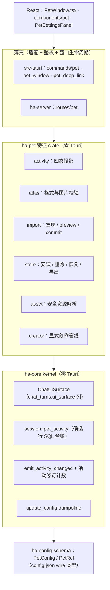
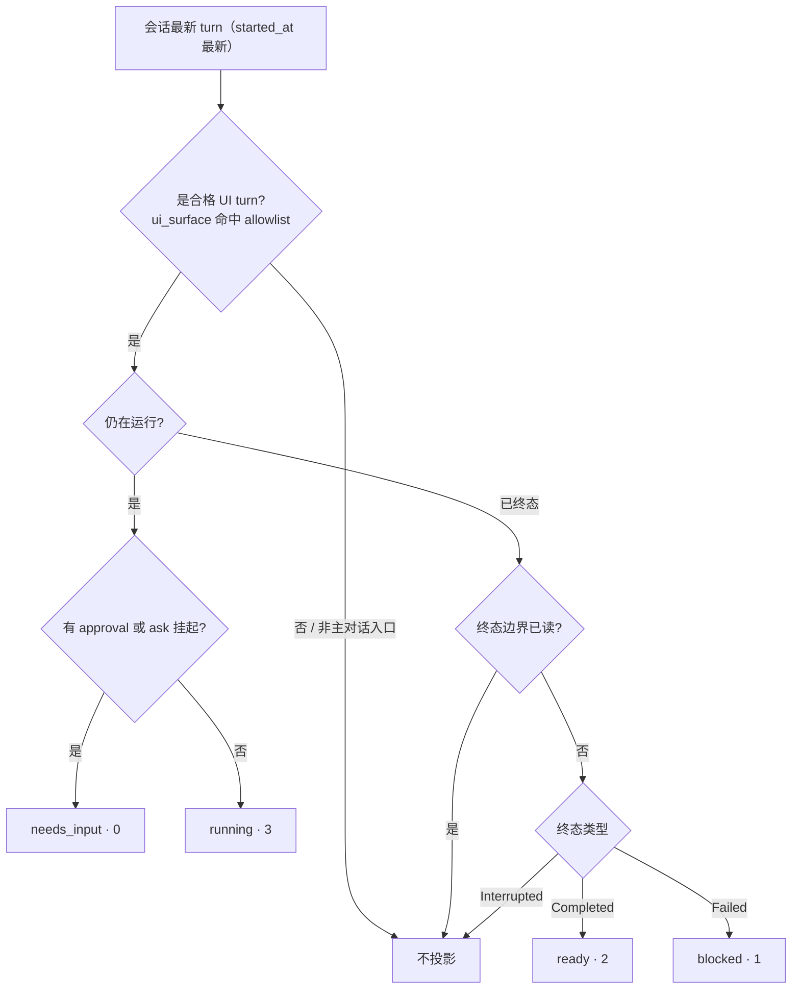
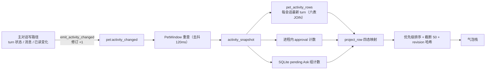
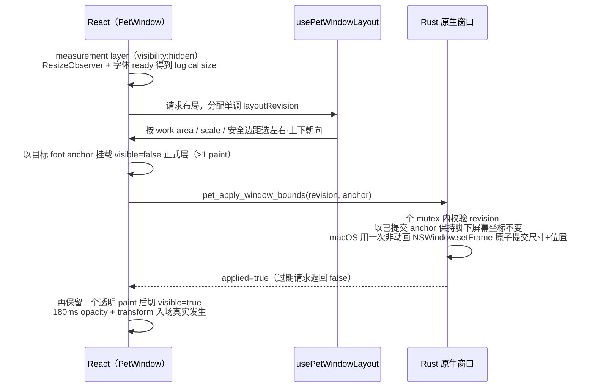

# 桌面宠物（Pet）

> 返回 [文档索引](../../README.md)

**关联源码**

- Kernel 契约：[`crates/ha-core/src/pet.rs`](../../../crates/ha-core/src/pet.rs)（`ChatUiSurface`、`emit_activity_changed`、`update_config` trampoline）、[`crates/ha-core/src/session/pet_activity.rs`](../../../crates/ha-core/src/session/pet_activity.rs)（活动候选行 SQL）
- 特征 crate：[`crates/ha-pet/src/`](../../../crates/ha-pet/src/)（`activity` / `atlas` / `import` / `store` / `asset` / `creator` / `types`）
- 配置 wire 类型：[`crates/ha-config-schema/src/pet.rs`](../../../crates/ha-config-schema/src/pet.rs)
- 桌面壳：`src-tauri/src/commands/pet.rs`、`src-tauri/src/pet_window.rs`、`src-tauri/src/pet_deep_link.rs`
- HTTP 壳：[`crates/ha-server/src/routes/pet.rs`](../../../crates/ha-server/src/routes/pet.rs)
- 前端：`src/PetWindow.tsx`、`src/components/pet/`、`src/components/settings/PetSettingsPanel.tsx`

---

## 核心思想

桌面宠物是一个**桌面优先、被动常驻、零 LLM 的状态表现层**：把已经存在的主对话——正在跑、等你回应、失败了、完成但你还没看——投影成一只停在桌面上的透明浮窗小精灵，让你不必盯着主窗口也能感知对话进展。

它的存在建立在三个不变量之上，理解了它们就理解了整个子系统：

1. **只投影，不改写。** Pet 从不写入 Prompt、Memory、Awareness、权限、任务状态或会话正文；它读的是权威状态的只读投影，画面永远是数据库的派生物，不是第二真相源。
2. **只认第一方主对话。** 一个 turn 是否进入宠物，由它自己在 `chat_turns.ui_surface` 列上打的第一方 UI 标记决定，而不是靠 transport、`ChatSource`、窗口名或会话类型去猜。后台的一切模型调用（side query、自动化、压缩、Memory、Cron、subagent……）天然没有这个标记，因此永远不会冒充成宠物活动。
3. **被动 runtime 零 LLM。** 常驻期间宠物不发起任何模型推理。唯一会重新踏进模型链的动作是用户在气泡里**明确快捷回复**（复用原会话的主对话链），以及在设置里**明确创作宠物**（走隔离的媒体生成，本身不算宠物活动）。

围绕这三条，本文自上而下展开：先看分层与真相源，再看两条核心机制（主对话投影边界、四态投影），然后是透明浮窗的动态尺寸与交互，最后是精灵资源的存储与导入、配置事件接口，以及失败/性能契约。

---

## 分层与真相源

宠物的业务**机器**（sprite 库、导入、创作、活动投影）住在特征 crate `ha-pet`，它不依赖 Tauri。但对 `sessions.db` 的 SQL **台账**、config.json 的 wire 类型、以及跨会话表的纯查询留在 kernel `ha-core`——这是各特征 crate 的通用分层：机器可以下沉特征 crate，raw 数据库连接与稳定 wire 类型恒留 kernel。壳层（`src-tauri` / `ha-server`）与前端只做适配。

装配契约与其它特征 crate 一致：每个调用 `ha_core::init_runtime` 的二进制必须先调 `ha_pet::wire()`，把配置更新的真实现注册进 kernel 的 trampoline；未接线时 kernel 侧 `update_config` 显式报错而非静默——它的两个消费入口（`ha-settings` 分支、`/pet` 命令）都是用户显式动作，报错优于静默。

### 持久化真相源

| 真相源 | 内容与生命周期 |
| --- | --- |
| `config.json` | `pet.enabled`、`pet.selectedPetRef`；所有开关和选择入口都走共享配置 mutation，不维护 localStorage 副本 |
| `sessions.db` | `chat_turns.ui_surface`、turn 状态与消息边界、`sessions.last_read_message_id`，以及 pending `ask_user_question` 组 |
| `~/.hope-agent/pets/` | 自定义包和 `.trash`；磁盘即真相源，进程内的库 revision 只是失效版本号，不能替代目录扫描与校验 |
| `pet-window-state.json` | monitor、work area、scale 与宠物脚下的归一化锚点；只属于桌面 UI state，不复制 `enabled` |

历史 NULL 的 `ui_surface` turn 永不按 `source` 反猜表面。pending Ask 组里，只有携带 durable `ownerResponse` 的面向用户本人的组能跨重启保持 pending；普通工具组的响应通道是内存 oneshot，进程一退就无法恢复，启动时由 `expire_pending_ask_user_groups` 统一标为 answered。

### 进程内（易失）状态

宠物有几张只活在进程内、重启即失效的表，它们**不写数据库、不能用于跨重启恢复**：

| 状态 | 用途与上限 |
| --- | --- |
| approval registry | `tools::approval::PENDING_APPROVALS`：保存完整 request 与响应 sender，供同进程内 reload / transport resync 重建交互卡 |
| Codex 候选表 | 扫描到的 Codex 宠物候选，TTL 30 分钟，最多 500 项 |
| import preview 表 | 预览态包，TTL 10 分钟，最多 128 项 / 64 MiB 缓存 |
| restore token 表 | 删除撤销票，TTL 10 分钟，最多 128 项；客户端不能把 token 当持久 ID |

清理、导入、删除、恢复与选择校验共享一把跨进程库锁（`~/.hope-agent/` 下的 OS 独占文件锁）。任何缓存或 renderer state 都不能成为包、配置、活动或未读的第二真相源。`.install-*` staging 目录超过 24 小时才清理；`.trash` 最长保留 7 天且最多 256 项，被有效 restore token 保护的条目在此期间不删。

---

## 主对话投影边界

宠物最容易被误用的地方是"什么算主对话"。答案由 `chat_turns.ui_surface` 单一决定：一个 turn 只有在**产品消息列表 + 产品输入框 + 用户可持续多轮对话**的第一方界面里被创建时，才带上表面标记。当前允许的表面是一份固定 allowlist：

| 一等 UI 表面 | `ChatUiSurface` | SessionKind |
| --- | --- | --- |
| 主 ChatScreen | `main_chat` | Regular |
| SideChatPanel | `side_chat` | Side |
| QuickChatDialog / QuickChatWindow | `quick_chat` | Regular |
| KnowledgeChatPanel | `knowledge_chat` | Knowledge |
| DesignChatPanel | `design_chat` | Design |
| Pet 快捷回复 | `pet_chat` | 沿用原 SessionKind |

**为什么不用 transport 或 ChatSource 判定。** 同一个 HTTP transport 既服务真人的聊天窗口，也服务公共 API 的自动化调用；同一个 `ChatSource::Http` 覆盖多种来源。把宠物资格绑到这些维度上，就无法区分"用户在浏览器里聊天"和"脚本在打 API"。绑到 turn 自己声明的 `ui_surface` 上，判定就落在了产生这个 turn 的那段代码手里，无法被下游误继承。

服务端对第一方 HTTP transport 的把关很严：带 surface 的请求走 `/api/chat/ui`，服务端还要求浏览器 Fetch Metadata，并校验 `Origin` 与 `Host` 同源或命中显式 CORS allowlist，不能仅凭 route 名或 JSON 字段就认定第一方。公共 `/api/chat` 强制清空该字段，因此普通 API 调用即使误传或伪造 `uiSurface` 也不会被接入。内部调用同样不能继承父 turn 的 surface。

**排除项是天然的，不是逐项黑名单。** side query、automation、compact、Memory、Dreaming、知识空间主动精灵、vision bridge、judge、eval、embedding、STT、媒体生成、Cron、IM、ACP、subagent、ParentInjection、后台 job——它们全都不产生带 `ui_surface` 的 turn，因此全部落在 allowlist 之外。SQL 台账再叠三道显式排除：cron 会话（`is_cron = 0`）、子会话 / subagent（`parent_session_id IS NULL`）、以及被 IM 接管的会话（不在 `channel_conversations` 里）。Knowledge / Design 表面还要求对应的 `kb_id` / design project 存在——但知识空间的 `anchor_note_path` 可空：没有打开具体文档的知识主对话仍会接入，靠 KB + session 精确恢复面板。

Pet 回复本身不创建专属会话：对运行中 turn 走既有插话队列，对终态对话以 `pet_chat` 在**原 Session** 上开一个新的主 turn。侧聊活动的导航目标同时携带侧聊 Session 与来源 Session，点击后先打开来源主对话，再恢复对应侧聊面板；不会把隐藏侧聊直接塞进主侧边栏。未来新增一等对话表面必须显式扩展枚举、固定 UI 调用点、扩 Core SQL allowlist，并补纳入/排除测试——历史 NULL turn 依旧不按 `source` 猜测。

侧聊活动要求自身未归档，且所属主会话仍符合 `regular_session_scope_sql` 的可见范围；主会话归档或无法被主界面打开时，即使侧聊继续运行或随后完成，也不发布无法跳转的宠物提示。归档与恢复都会通知宠物重新查询，恢复后仍按原有轮次和已读水位投影，不改写侧聊执行状态。

### 已读水位只由真实渲染推进

每个一等表面只在**窗口/面板可见、文档获得焦点、消息列表尾部可见**这三件事同时成立时，才推进共享的 `sessions.last_read_message_id`。推进值是 React 已经取得、且经过两帧绘制的最大 `dbId`，绝不在 stream 结束时把整场会话直接标为已读。这条规则让隐藏面板、历史上翻、迟到消息和后台完成都不会被宠物或流结束事件误清成已读。

---

## 四态投影

`activity_snapshot` 把每个候选会话的**最新 turn**折叠成最多一条活动。四种状态按优先级排列，同一时刻只取最高优先级的一种：

| 优先级 | 状态 | 触发条件 |
| ---: | --- | --- |
| 0 | `needs_input` | 最新 turn 是合格 UI turn、仍在运行，且有 approval / ask-user 挂起 |
| 1 | `blocked` | 最新 turn 是合格 UI turn、为 Failed，且终态消息边界尚未读 |
| 2 | `ready` | 最新 turn 是合格 UI turn、为 Completed，且终态消息边界尚未读 |
| 3 | `running` | 最新 turn 是合格 UI turn 且尚未终态 |

投影是最新 turn 状态、挂起计数、未读判定三者的纯函数：

**"最新 turn" 是硬边界。** 一旦某会话最新 turn 来自公开 API、cron、subagent、side query 等非主对话入口，即使更早有过 UI turn，也不再继承宠物资格——创建这个 non-UI turn 会让现有投影立即失效。这正是"只认第一方主对话"在时间维度上的体现。

**终态边界的定义。** `chat_turns.terminal_message_id` 在终结事务中固定：成功轮次保存回答标识，失败/中断优先保存准确的可见停止或错误通知标识，无显式通知的旧入口只在终结时捕获一次当前消息边界。查询仅以固定标识与 `last_read_message_id` 比较，缺失时退到助手/用户标识，不能因部分回复已读而提前确认通知，也不能因后续 `/status` 等事件重新激活旧结果。旧数据库迁移按终结时间及下一轮用户边界回填一次，不在重开时重新计算。侧聊入口条复用同一 SQL 边界。`Interrupted` 不映射成 Blocked——用户主动打断不是失败。

**快照契约。** 稳定排序后最多返回 50 条，并携带 `total` / `truncated` / `revision` / `stale`。挂起计数是"进程内 approval 数 + SQLite pending Ask 组数"之和，只用"是否大于零"决定运行中 turn 是否升为 `NeedsInput`，不返回交互总数或最早倒计时。incognito 会话在 SQL 查询边界就被脱敏（`title` / `agent_id` 清空、`preview` 置 None），ha-pet 投影侧的 incognito 分支是第二道防线。

**失效通知与防丢。** kernel 每次写权威状态都调 `emit_activity_changed`：它把一个进程内活动修订计数 +1 并发出 `pet:activity_changed` 事件。事件只是失效信号，PetWindow 收到后仍会重查快照；快照读取前后各取一次修订值，若这期间有并发写就重试一次并把 `stale` 标真。为兜住事件丢失，PetWindow 可见时还每 5 秒 reconcile 一次。

侧边栏的 `SessionMeta.pending_interaction_count` / `pending_countdown`（数量与 deadline 合并）走的是另一条路 `session::enrich_pending_interactions`；PetWindow 的交互卡则分别读当前进程内 approval request 与 live Ask 组，两边都不把聚合结果回写数据库。

---

## 透明浮窗与动态尺寸

桌面壳用 Tauri 2 `WebviewWindow` 创建一个 `pet` 窗口：透明、无装饰、置顶、不进任务栏，逻辑尺寸下限 112×120、上限 440×640（PetOnly 折叠态默认 120×128）。React 只挂载轻量的 `PetWindow.tsx`，不挂载完整 `App`。

**为什么窗口必须始终贴合内容。** 透明窗口的透明区域一样会截获桌面点击，因此不能用一块固定的大透明窗口去承载会变大变小的气泡——否则用户点空白处会被宠物窗口吃掉。窗口矩形必须跟着内容实时收缩，这就要求一套"先测量、再选朝向、再原子扩窗"的布局管线。

管线里几个不读代码看不出的坑：

- **阴影安全区必须在滚动视口内。** 测量层与正式层共用 scroll viewport 内围留白（左右/顶部 16px、底部 28px），让 shadow 先落进可滚动内容盒再由 native bounds 包住。把留白放到 overflow 容器外层会让阴影仍被 scrollport 裁掉，所以禁止回退成外层 padding。
- **先对齐、后扩窗。** PetOnly → Overlay 时先以目标朝向挂 `visible=false` 的正式层并至少保留一个 paint，让宠物 DOM 在原生扩窗前就对齐目标 foot anchor；否则屏幕边缘首次展开会出现一帧宠物跳动。
- **macOS 尺寸+位置必须原子提交。** 禁止 `set_size` / `set_position` 两次提交——中间会被 WindowServer 绘出"宠物瞬移到左上角"的中间帧。Rust 用已提交 anchor（而非可能过期的 renderer previous anchor）保持宠物脚下屏幕坐标不变，旧请求返回 `applied=false`。
- **latest-wins 而非固定次数。** `ResizeObserver` 对不超过 1px 的变化去重，每个真实新尺寸只触发一次 latest-wins 更新，因此气泡栈可随内容持续变化而不被"校正次数"截断；瞬时失败做两次有界退避重试，仍失败则恢复旧 overlay 可见。关闭走同一 180ms 淡出再缩回 PetOnly；reduced-motion 跳过动效但保留准备帧、锚点与错误回退。

### 拖拽与位置持久化

用户拖动时暂停 layout hook 并冻结当前 bounds 和 overlay，移动超过 4 logical px 才调 `startDragging()`；drag end 抑制同一 click，再关闭 overlay 并按新显示器重新布局。迟到的字体测量或 activity 更新不能在 OS drag 期间 resize。

位置持久化保存的是**宠物脚下锚点相对显示器 work area 的归一化坐标**、显示器信息和 scale，而不是易受 resize 影响的窗口左上角——这样换分辨率、插拔显示器后宠物仍稳定站在原来的相对位置。move 事件由单一 coalescing worker 300ms 去抖，持续拖动不会创建大量线程。

拖拽跑动方向取越过 4px 阈值时的 pointer delta；进入原生拖拽后按 PetWindow 连续 `Moved` 事件的 x 差实时切换 `run_left` / `run_right`，不把首次方向锁死到 drag end。方向选择会同时算 anchor 四侧可用空间和两种朝向的总 overflow：能完整容纳时保持当前朝向避免 1px 抖动，不能时选溢出更少的一侧，最后由 Rust 按 12 logical px（乘当前 scale）的安全边距钳位。

### macOS 失焦指针桥

WebKit 会按平台惯例抑制后台 WKWebView 的 DOM hover，因此不能假设鼠标划过会自动变成 CSS `:hover`，也不得用 `set_focus()` 绕过——那会让宠物仅因鼠标经过就抢走用户当前应用的焦点。

macOS 创建窗口时同时启用 WRY `accept_first_mouse`（第一次点击即可交互）与原生 `NSWindow.acceptsMouseMovedEvents`（打开原生指针事件入口），并保留 WKWebView 的 `NSTrackingActiveAlways` tracking area，再用一对进程生命周期的 local / global `MouseMoved | LeftMouseDragged` monitor 补齐 WebKit 的后台 DOM 限制。两条 monitor 必须复用同一套坐标投影——若在 local 事件上清掉 global hover，主窗口激活而 PetWindow 非 key 时就会逐帧闪烁。

只有指针位于当前 PetWindow 矩形内时，桥才以最多约 30Hz 向该窗口发送 logical 坐标，React 用 `elementFromPoint` 映射到 pet、activity 和快捷按钮并声明式恢复 hover。命中 Pet 的左键拖动期间，原生层只轮询左键是否仍按下、并在释放时发一个无坐标的 `pet:native_drag_ended`（AppKit 原生拖拽立即返回、不保证回投 mouse-up）。离开矩形只发一次 leave。这座桥不监听按键、mouse-down、普通 click 或窗口外坐标，不持有可失效的 NSWindow 指针，也绝不把 PetWindow 设为 key window 或激活主应用。

---

## 气泡、快捷回复与交互卡

每条活动对应一枚独立胶囊气泡，常态 52px 高：标题、实心分隔点、摘要像正文一样连续排版，整体最多两行，超出后截断且不再撑高。标题最多占内容宽度 52%，并在渲染前按 CJK / ASCII 显示宽度预算生成一个稳定的"前缀…后缀"中截字符串——用两个 flex 片段互挤模拟中间省略会抖。这样既避免关闭自动标题或 LLM 尚未回写时较长的首消息 fallback 吃掉摘要空间，也保住标题结尾的限定词。

气泡正文是**轻量预览而非完整 Markdown 布局**：实时流与完成态统一保留标题、强调、代码、链接等可读内容，去掉 `#` `*` 反引号、代码围栏等标记并折叠空白。绝不在气泡里挂完整 Markdown renderer——那会让流式阶段频繁改变窗口高度。背景用低不透明 surface + `backdrop-blur-xl` + 柔和阴影做真实毛玻璃，而不是接近不透明的伪 blur。

不同状态的正文来源不同：

- **Running** 消费既有父主对话的 `chat:stream_delta`，显示不断更新的有界正文尾部 + spinner，并复用全局 `animate-text-shimmer` 做文字扫光（reduced-motion 退化为静态）。宠物只为快照已准入的 Running session 建预览；中途打开窗口时先读 `get_session_stream_snapshot` 的 durable 前缀，握手期间缓存 live delta，按 stream / seq 去重后再 reveal——因此 side-query、工具内部 LLM 等非主对话不会漏出气泡。
- **Ready** 改用终态 assistant 的有界预览 + 完成勾。
- **NeedsInput / Blocked** 不泄露问题参数或错误原文。
- **incognito** 的标题、Agent 和流式 / 终态预览始终脱敏。

### 数量徽标与自动展开

收起时宠物右上角以固定 28×28 正圆显示活动数量（超过 9 显示 `9+`），点击展开后同一控件变为向下箭头。若有 Ask / 审批待处理，收起态数字改黄色但**仍表示活动总数**——风险等级只在卡片内表达，不把严格审批映射成红色数字。栈按优先级排列并在最大高度内滚动。

每个新的活动投影（含同一会话的新 turn / 状态 / 边界）和每个新的 Ask / 审批 request 都会自动展开；用户手动收起后，已有内容更新不得反复重开，只有新的稳定 key 才能再次展开。自动出现不抢 OS 焦点；Escape 先关闭回复 composer，再收起整个信息层。

### 已读推进只由真实渲染触发

这是宠物与"未读"系统最微妙的接触面，规则层层设防：

- 自动展开本身不推进 read watermark。Ready / Blocked 气泡要停留阅读至少 700ms 后移开、提交快捷回复、关闭、或用户主动收起已展开的栈，才由宠物按该气泡的 `boundary` 标已读。
- 点击气泡只发 typed navigation，不在 PetWindow 提前推进 watermark；必须等目标消息列表真实加载并渲染正文后，再由该表面的 read receipt 推进。导航失败或目标已删除时保留未读。
- 所有推进都走 `mark_session_read_cmd(throughMessageId)`，绝不无边界清空——确保并发到达但尚未渲染的新消息继续保持未读；Running 与 Ask / 审批等待态不因展示被标记已读。
- 成功推进同时触发 `session:unread_changed` 与 `pet:activity_changed`，侧栏未读聚合和宠物数字都重新查询权威值，不在 renderer 内各减一。

### 悬停动作、快捷回复与交互卡

hover 单条气泡才显示左上角关闭与右侧快捷动作：Running 同时显示回复与停止，其他可回复状态只显示回复。停止复用 `stop_chat(sessionId, turnId:null)`，只中止该活动的权威主 turn，不走全局 stop。点击关闭 Running / NeedsInput 只隐藏当前投影（状态或边界改变后可重新出现，不取消执行）；关闭 Ready / Blocked 则用该活动的终态 boundary 推进共享 read watermark。回复展开一条 composer：运行中走 durable turn-message 插话，终态以 `pet_chat` 在同会话开新主 turn。

`ask_user_question`、工具审批和计划确认使用宠物专属紧凑卡片，但提交仍复用既有命令与权威 pending queue：

- **Ask 卡**一次只渲染一道题，答案存在分页 state，可往返上一题 / 下一题，最后一题才原子提交完整 `answers[]`；选项只保留标签、单行说明、推荐标记和 Other，不加载消息列表的 Markdown / 方向预览。
- **审批卡**保留 reason、command、cwd、倒计时及 deny / once / always 语义；严格审批与 cron delete 继续禁止 standing grant。
- 用户收起时卡片与普通气泡一起收起，新的 request id 到达才再自动展开；`ask_user:resolved` / `approval:resolved` 保证跨表面同步撤销。

### 点击、右键与精灵动画

单击 Pet 播放 Jump 动作并以 `pet_focus_target_cmd(target:null)` 唤起 Hope 主窗口，不擅自切会话；拖拽超过 4px 时抑制同一手势合成的 click，不误唤起主窗口。右键 Pet 收起气泡栈，并在宠物本体中心覆盖一个紧凑的"设置 / 关闭"胶囊：设置先唤主窗口，再发 `open-settings(section:pets)`——菜单不扩张原生窗口，也不在宠物外另开卡片。

typed navigation 由主 App 壳消费：Regular 回主聊天 session，Side 先回来源 session 再恢复侧聊面板，Knowledge 恢复知识空间 thread，Design 恢复 design project + thread。PetWindow 不拼 URL，也不把专属对话伪装成 Regular。

精灵动画分三层仲裁：**业务状态循环**（Idle / Running / Waiting / Failed / Review）、**指针一次性动作**（hover Wave、click Jump）与 **v2 Idle 注视**；拖拽左右 Run 优先级最高。固定顺序是 `Drag > Click > Hover > 业务状态 > v2 Look > Idle`，一次性动作完整播放后恢复业务状态，宠物自身移动不重复触发。

---

## 精灵图、存储与导入

宠物渲染兼容 Codex 的 sprite atlas 布局：显式支持 v1 `1536×1872`（8 帧 × 9 行）和 v2 `1536×2288`（8 帧 × 11 行），单格 `192×208`。v2 前 9 行与 v1 动作相同，另在 row 0 / column 6 保存 neutral/front 帧，第 9–10 行（零基）按「正上方 0° 起、顺时针」保存 16 个注视方向。PetWindow 同时消费前台 DOM 与 macOS 失焦指针桥的窗口内坐标：业务 action 优先，Idle 时按相对宠物中心的向量量化到 16 向，中心 deadzone 使用 neutral 帧；v1 不读取这些扩展格。渲染用 SVG `viewBox` + atlas 坐标而非 Canvas / WebGL，且不复制 Codex 内置的专有素材。

内置 Nori 精灵以 v2 WebP 编译进应用，并继续使用稳定引用 `builtin:hope-default`，避免升级应用后让既有选择失效；自定义包位于 `~/.hope-agent/pets/`。包里 `pet.json` 只保留 Codex 兼容的 `id`、`displayName`、`description`、`spriteVersionNumber`、`spritesheetPath`（后两项缺省为 `1` 和 `spritesheet.webp`）；Hope 自己的来源、source kind 与 hash 单独放 `hope.json`。

| 约束 | 值 | 说明 |
| --- | --- | --- |
| 单格 | 192 × 208 | `CELL_WIDTH` × `CELL_HEIGHT` |
| v1 atlas | 1536 × 1872 | 8 帧 × 9 行 |
| v2 atlas | 1536 × 2288 | 8 帧 × 11 行 |
| sprite 上限 | 20 MiB | PNG / WebP，按 magic bytes + 有界解码校验 |
| `pet.json` 上限 | 256 KiB | 超限拒绝 |
| `hope.json` 上限 | 64 KiB | 超限拒绝 |

### 导入管线：preview → validate → commit

所有导入入口都走同一条三段管线，任何入口都不会静默安装或启用：

```mermaid
flowchart LR
  subgraph sources["入口（都不静默安装）"]
    codex["Codex current / legacy 扫描"]
    drop["目录 / zip / 独立 PNG·WebP drop"]
    upload["浏览器 upload"]
    link["任意来源的 HTTPS zip / manifest / sprite<br/>codex:// · hope-agent:// deep link"]
    proto["系统注册的 hope-agent:// 协议"]
  end
  sources --> preview["preview_import<br/>解析 + 校验 + 短期 token"]
  preview --> confirm["Settings / API / CLI<br/>展示 manifest、告警、duplicate、hash"]
  confirm -->|用户确认后 commit_token / expected hash| commit["commit_import"]
  commit --> recheck["recheck：本地源重读比 package hash"]
  recheck --> install["install_validated<br/>staging 写入 → 原子发布"]
  install --> enable{"enable_after_import?"}
  enable -->|"是 · 仅桌面"| cfg["update_config 启用并选中"]
  enable -->|否| done["完成"]
```

自动发现只扫描用户自己的 Codex 自定义目录：`CODEX_HOME`（或 `~/.codex`）下的 `pets/pet.json`（current）与 `avatars/avatar.json`（legacy）。系统协议只把主窗口带到 Settings 的预览确认页；`codex://` 只支持粘贴解析，因为该 scheme 属于 Codex。

CLI 与技能走同一业务管线，不直接写宠物目录：调用方先以 `hope-agent pet capabilities --json` 验证稳定握手（不能只看旧 binary 也可能返回的退出码），再用 `hope-agent pet preview --source <PATH|URL> [--source <PATH> ...] --json` 展示 manifest、尺寸、告警、duplicate 与 `packageHash`；重复 `--source` 把同目录 loose manifest + sprite 作为一个包交付。用户确认后，调用方用完全相同的有序来源执行 `hope-agent pet import ... --expected-package-hash <HASH> --json`。由于两个 CLI 命令是两个短进程，preview 退出前会销毁临时 token，import 会重新读取或下载、重新校验并比对用户确认过的 hash；源在两步之间变化就 fail closed。CLI commit 恒 `enable_after_import=false`，只安装到 Hope 库，不切换选择或唤醒桌面 overlay。sandboxed sealed host handoff 的本地来源必须 canonicalize 后仍位于 canonical durable workspace 内，绝对路径、`..`、symlink escape 与 Hope data / credentials root 均 fail closed；isolated exec 临时副本里新建、命令结束即销毁的文件不会假装可导入，而是在 handoff 前明确报错并要求走可信附件/connector 落盘或直接 HTTPS artifact。

HTTPS 入口不按来源域名决定资格：任意公网 origin 都可提供直接 zip、`pet.json` 或 PNG/WebP；下载后按 magic bytes / manifest 内容识别，再进入同一 validator。远端 `pet.json` 只能引用最终 manifest URL 同 origin、同目录下的相对 sprite。普通 HTML 页面不是宠物包协议，技能或 UI 必须先解析出实际下载物，绝不运行页面展示的安装器。`codex-pet.org[/<locale>]/pets/<slug>` 仅保留一个便利 resolver，和其它来源走相同校验，不是导入能力的边界。

一个 drop 若含 manifest 就作为一个 loose-file 包；否则多个目录、zip 或独立 atlas 分别生成 preview card。标准 WebView drop 通过 `DataTransferItem.webkitGetAsEntry()` 有界递归顶层目录（最大深度 8、最多 64 个文件），再用通用分块上传 lease 进入同一 preview 流程；Tauri native path drop 仅作可用时的快速路径。批量 commit 独立处理，成功项消失、失败项留在界面重试，失败的 preview source lease 立即释放。HTTP / Web 只接收 staged upload id，拒绝客户端本机路径。

### 安全与一致性约束

| 关口 | 约束 |
| --- | --- |
| 路径 | manifest / sprite 全部 canonicalize；拒绝 absolute、`..`、symlink escape、设备文件；资源必须落在包目录内 |
| zip | 32 MiB 总量、64 entry、深度 8 上限，拒绝 symlink 条目、重复条目和超额展开 |
| 图片 | magic bytes + 有界解码，sprite ≤ 20 MiB；仅 PNG / WebP；已使用格不得缺帧或近乎不透明，未使用格必须透明；v2 必须有 neutral 与 16 个方向格 |
| URL | origin 不限但仅 HTTPS；每一跳走 Strict SSRF，最多 5 次 redirect；直接产物只接受 zip / JSON manifest / PNG / WebP / octet-stream 并有界读取；远端 manifest 的 sprite 限同 origin、同目录；HTML 不作安装协议 |
| preview token | 256-bit 随机、短期 capability；本地 commit 重读并比对 hash，URL / upload commit 用已缓存 bytes 不二次联网 |
| token 消费 | 只在所有请求副作用成功后消费，失败可幂等重试（安装是内容寻址、幂等）；cancel 幂等，立即释放 cache 与绑定 upload lease |
| token 传输 | cancel / commit token 只放 JSON body；thumbnail 因资源 URL 必须带 token，HTTP access log 对该 path segment 固定脱敏 |
| 库变更 | pet root 变更持 OS 独占锁；同 root staging 完整写入后原子发布；删除移到 `.trash`，带 expected package hash 防陈旧写，restore token 10 分钟内可撤销 |
| 去重 | `assetHash` 标识原始 sprite，`packageHash` 标识 canonical manifest + asset；相同 package 幂等，相同名称不同内容不覆盖 |

Settings 关闭、替换或移除 preview 时调用幂等 cancel，过期清理执行同一释放逻辑，不能只清 React state 等 1 小时 upload TTL 自然到期。

### Create Pet 生成管线

Create 是设置里由用户本人显式触发的媒体生成，不注册成 Agent 工具 / skill，也不从一张图继续逐帧调模型。它先经 `ha_media::media_gen::execute_image` 生成单个角色源图（以 `pet.create` 入账），再确定性地构造 Codex atlas：请求未带版本时默认 v2，也可在设置里显式选 v1。

1. 按 magic bytes 解码并限制源图尺寸；已有明显透明度时保留原 alpha。
2. 只有四角背景色一致且图像基本不透明时，才移除与图像边缘连通的近似背景色；不做全图颜色抠除，避免误删角色内部同色细节。
3. 按 alpha 内容边界裁剪并缩放到单格安全区，随后用固定的位移、缩放、翻转和 bob 参数按官方各行动作帧数合成前 9 行，所有未使用格保持透明。选择 v1 时结果为 `1536×1872` PNG；默认 v2 时保留全部已使用动作帧，把 alpha 内容最多的 Idle 帧复制到 row 0 / column 6 作为 neutral，再以它为基准保持下半身锚定、仅将上部轮廓向目标方向渐进形变，确定性合成 16 个顺时针注视姿态，结果为 `1536×2288` PNG——方向帧不平移或镜像整只宠物，避免光标跨方向时整体跳动。
4. 生成包继续走与外部导入相同的 atlas validator、preview capability 和人工确认；校验失败不安装，用户取消不留下最终包。

因此 Creator 的"动画"是本地可复现的 pose 合成，并不代表媒体模型分别生成了 57 / 74 个已使用帧。改背景判定、裁剪、pose、方向顺序或行顺序时，creator / atlas 单测与本节要一起动。

已有 v1 的「升级到 v2」同样走确定性 atlas 变换：先检查客户端传入的 `expectedPackageHash` 防陈旧操作，逐像素保留全部已使用动作帧，清理旧版本曾容许的未使用格内容与透明 RGB 残留，补 neutral 后再追加 16 个方向格并通过统一 validator。升级安装为 content-addressed 的 v2 副本，不覆盖 v1；若 v1 原本被选中，只有 v2 副本持久化成功后才切换选择。重复点击命中同一 package hash 时，幂等复用已有 v2 副本。

### 调试宠物（仅 Debug 构建）

Debug 构建额外注入内置 `builtin:hope-debug`：v1 atlas 每个**已使用**格用纯色背景并精确标注英文状态、中文状态、零基 row / frame，契约未使用格保持透明；同行各帧用同色系明暗变化，便于同时观察动作仲裁与计时器是否推进。行契约固定为 `Idle/空闲`、`Run Right/向右跑`、`Run Left/向左跑`、`Wave/挥手`、`Jump/跳跃`、`Failed/失败`、`Waiting/等待`、`Running/运行中`、`Review/审阅`，资源由 `scripts/generate-debug-pet.py` 确定性生成。

它的注册、内嵌 asset resolver 和导出分支都受 Rust `debug_assertions` 门控，renderer 直连 asset 受 `import.meta.env.DEV` 门控。Release 的库、选择校验和 asset API 都不识别它；若开发配置残留引用，Release 按既有 selected-unavailable 逻辑回退 Nori，不迁移用户配置。

---

## 配置、事件与接口

`AppConfig.pet` 含 `enabled` 与 `selectedPetRef`，默认关闭。作为用户可调配置，它同时具备设置面板、侧边栏底部快捷开关、`ha-settings` category / risk 与 skill 风险表；各入口都监听 `pet:config_changed`，不维护独立可见性状态。配置写入是字段级 patch，选择校验与持久化持有宠物库锁，避免并发开关 / 选择互相回滚，也避免"删除后立即被选中"的 TOCTOU。

模型侧启用已安装宠物先以 `hope-agent pet list --json` 将用户名称解析成唯一、已安装的 `petRef`，再调用 `hope-agent pet activate --pet-ref <REF> --json`。CLI 不离线改 enabled，而是从 0600 credential store 内部取得本机托管 Token、以禁代理/禁重定向的客户端调用当前桌面的 loopback Bearer-auth `POST /api/pets/activate`；sealed handoff 由父进程把 `server_status` 中的实际 listener 地址（包括 ephemeral port）通过 non-secret internal env 交给短进程，不能回读可能已修改但尚未重绑的 config 地址。非回环 bind fail closed，Token 不进 argv/stdout/模型上下文。desktop route 原子写 `selectedPetRef + enabled=true` 并经当前 Tauri EventBus 驱动 PetWindow，headless Server 明确返回 desktop-only。仅请求导入时绝不顺带启用；用户明确请求“导入并启用”时，确认必须同时覆盖 reviewed package 与启用意图，commit 成功后再以返回的 `petRef` 独立 activate，禁止 `enableAfterImport` 偷渡或短进程离线改配置假成功。

`enabled` 只能由 desktop runtime 改：桌面 GUI 会话可走 `ha-settings`，显式 Pet 激活可走 Tauri `pet_activate_cmd` 或 desktop-only HTTP `/pets/activate`；`ha-settings` 在非桌面 GUI 来源上拒绝 enabled，headless HTTP 的 `activate` / `save_config` / `set_enabled` 与所有窗口命令返回 desktop-only。HTTP / ACP 可以管理宠物库与选择，但不能声称拥有桌面 overlay。

桌面端在 Pet 配置首次就绪且仍关闭时，于侧边栏蛋图标旁延迟 700ms 显示一次非模态 discovery popover：不抢焦点，提供"直接开启"和"进入 Pets 设置"两个动作。开启过、进入过设置或明确关闭提示后，以版本化 localStorage key `hope-agent.pet-discovery.v1` 记为已发现；outside click / Escape 只 snooze 当前挂载周期，避免误触让用户永久错过。该 key 只记引导曝光，不复制 `enabled` 或其它配置。

### 事件

| 事件 | 作用 | 桥 |
| --- | --- | --- |
| `pet:config_changed` | 配置失效；主 renderer 同步 PetWindow 生命周期 | Core EventBus（Tauri + HTTP） |
| `pet:library_changed` | 安装、删除或恢复后刷新 library | Core EventBus（Tauri + HTTP） |
| `pet:activity_changed` | 对话状态失效；PetWindow 重查 snapshot | Core EventBus（Tauri + HTTP） |
| `session:title_updated` | 首消息 fallback 或 LLM 标题回写后重查 snapshot | — |
| `pet:navigate` | PetWindow 请求主 App 做 typed navigation | Tauri-only |
| `pet:install_link` | OS `hope-agent://` 路由到 Settings import preview | Tauri-only |
| `pet:inactive_pointer` | macOS 失焦指针桥：`{ inside, x, y }`，进入 / 移动为 logical pointer、离开固定发 `{ inside: false, x: 0, y: 0 }`，≤ 30Hz | macOS Tauri-only |
| `pet:native_drag_ended` | 补齐原生拖拽释放，不携带窗口外坐标 | macOS Tauri-only |

前三个 `pet:*_changed` 是 Core EventBus 失效通知，Tauri / HTTP 两条桥都转发；其余四个是桌面壳内部事件，不经 HTTP bridge。

### 接口边界

Tauri commands 与 HTTP routes 一一对应，详见 [API 参考](../system/api-reference.md)。HTTP 侧把桌面独占能力显式标记为不支持，而不是假成功：headless 的 `/pets/activate`、`/pets/window/bounds`、`/pets/window/sync`、`/pets/focus-target` 返回 `PET_OVERLAY_DESKTOP_ONLY`；desktop 的 `/pets/activate` 经 EventBus 让主 renderer 同步 PetWindow；`/pets/install-link/pending`（对应 `pet_take_install_link_cmd`）恒返回 `null`；带 `enable_after_import` 的 commit 与本机路径预览在 HTTP 上被拒。CLI 是本机短进程适配器，允许本机路径，但不接收或打印 Owner Token；远程自动化继续用 Bearer-auth HTTP preview / commit / activate，Token 只能进 Authorization header。

### 能力边界与非目标

- 不复制或解包 Codex 内置的专有素材；自动发现只扫用户自己的 Codex 目录，用户明确选择的兼容包仍可导入。
- 不让 Pet 数据进入 system prompt、Memory、Awareness 或会话正文，也不新增 scheduler、任务状态或未读系统。
- HTTP / server 提供资源管理与只读 activity API，但不伪造桌面置顶浮层；ACP / IM 同样不能远程唤醒 owner 桌面窗口。
- Pet 与知识空间那只会主动调模型的精灵是两个独立子系统，不共享配置、事件、状态投影或 prompt。
- 不把透明浮层逻辑塞进 CLI，也不实现 Computer Use 画中画吸附；平台不支持透明或置顶时只做明确的静态降级。

---

## 失败与性能契约

宠物的失败模式一律降级、不崩不白屏：

- 坏自定义包逐项跳过，selected 不存在回退内置 pet；PetWindow 创建或 snapshot 失败不阻塞主应用。
- snapshot 失败保留最近成功值并标 `stale`；asset / decode 失败回退内置静态帧。

性能上刻意控制每一处开销：

- activity 查询只为未读 Ready 读取终态 assistant row，投影层折叠空白并按有效 UTF-8 边界截断到 240 bytes；incognito、Running、NeedsInput、Blocked 不返回正文。
- 候选列表只读 header，thumbnail 进 viewport 才生成；候选与安装 preview 返回单行 idle 动画条而非整张 atlas，sprite URL 用可撤销的 Blob lease。
- 动画 timer 按 `performance.now()` 跳过后台积压帧；逐帧状态只影响 `PetSprite`，不让气泡栈重渲染。
- 布局 IPC 只在 overlay 模式 / 测量变化时触发，不做逐帧窗口尺寸动画；revision 与 generation 双重 latest-wins。

---

## 改动时要一起动的地方

宠物横跨 Rust kernel、特征 crate、桌面壳、HTTP 壳与前端，一处能力往往需要多处同步：

- **新增一等主对话表面**：扩展 `ChatUiSurface`、固定 UI 调用点、扩 Core SQL allowlist、接上 typed navigation / read receipt，并补纳入 / 排除测试——不得用 `ChatSource` 或 session 类型推断。
- **新增或修改 Pet command / route / event**：同步 Tauri、Bearer-auth HTTP adapter、前端 transport map 和 [API 参考](../system/api-reference.md)；纯桌面能力必须明确返回 unsupported。
- **修改 `AppConfig.pet`**：同步设置面板、`ha-settings` 读写与 risk、skill 风险表；窗口坐标保持 GUI-only。
- **修改 Codex manifest / atlas、Creator pose 或安全限制**：同步 Core validator、导入 / 导出 fixtures、debug pet 与本节兼容契约。
- **修改用户可见交互**：同步中英文 `docs/user-guide/` 与全语言 i18n，并跑 docs parity 与 i18n check。

回归验证分三层，不能只验证设置页能选中图片：

| 层级 | 覆盖 |
| --- | --- |
| Core 确定性测试 | v1 / v2 尺寸、manifest 缺省、动作帧数、unused transparency、v2 neutral 与升级规范化；路径 / symlink / zip / URL 上限和 SSRF；preview→commit 陈旧检测、hash 去重、并发锁、staging、trash / restore；四态优先级、最新 `ui_surface` allowlist、历史 NULL 和非主对话排除；终态 boundary / read watermark；asset resolver 与 HTTP 路径不泄露 |
| React 测试 | atlas 裁切、16 向指针量化、neutral deadzone 与 reduced-motion；Running snapshot + delta / seq 去重、Markdown 纯文本；多气泡、黄色待处理数字、hover 回复 / 停止、Ask 单题分页、审批撤窗；PetOnly / Overlay / Dragging、latest-wins bounds、180ms 收展、阴影安全区、4px click / drag 抑制、失焦 pointer bridge；逐 boundary 未读刷新；批量拖拽 preview 与 Blob URL revoke |
| 桌面 smoke | macOS 多 Space / 全屏 / Retina / 失焦 hover，Windows 多显示器 / DPI / 透明点击区，Linux compositor 透明与置顶降级；四角、长 CJK / 英文、字体放大、多活动滚动、拖拽中更新、拔插显示器和重启恢复；主窗口隐藏时常驻、应用退出无孤儿窗口 |
